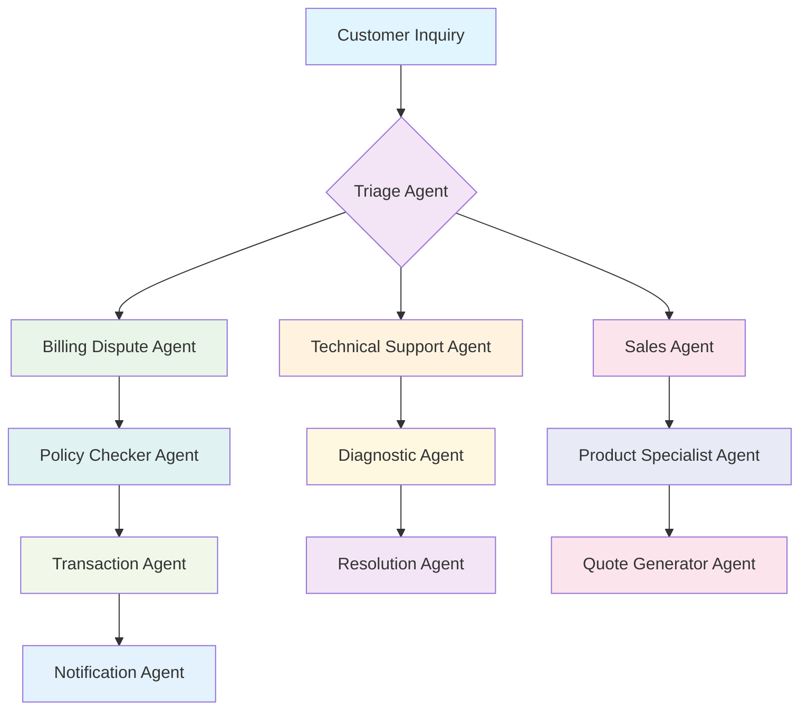
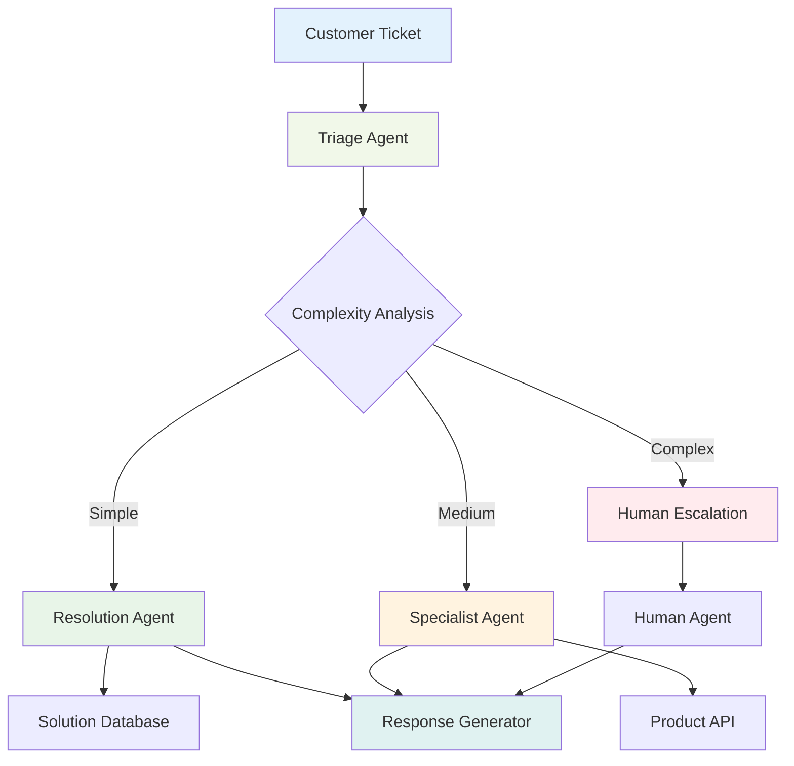

# Chapter 1: Why ADK Matters - The Agent Revolution

> *"The future belongs to organizations that can empower their software to think, act, and collaborate like expert team members."* - The ADK Philosophy

## Why This Chapter Matters: Your 60-Second Value Proposition

Picture this: You're a software engineer at a Fortune 500 company. Your CEO walks into the engineering meeting and says, "I need our customer service system to handle 80% of inquiries without human intervention, our sales team to have an AI research assistant that knows our entire product catalog, and our operations team to have automated workflows that can adapt to changing business conditions. Oh, and I need it deployed and scalable within 3 months."

Six months ago, you would have laughed (nervously). Today, with Google's Agent Development Kit (ADK), you can confidently say: "Consider it done."

**But why should you care about ADK specifically?** Because while everyone else is building chatbots, you'll be building intelligent agent ecosystems that can revolutionize entire business processes.

---

## The Great Agent Awakening: From Tools to Teammates

### What Traditional Software Got Wrong

Remember the early days of mobile apps? Every company rushed to build an app that was essentially a mobile website. They missed the point entirely - mobile wasn't just about smaller screens; it was about context, location, and instant access to information anywhere.

We're seeing the same pattern with AI today. Most companies are building "smart chatbots" - essentially glorified FAQ systems with a conversational interface. They're missing the fundamental shift: **AI agents aren't just better chatbots; they're autonomous software teammates.**

Consider this real-world scenario that happened at a major telecommunications company:

**The Old Way:**

- Customer calls with a billing dispute
- Human agent looks up account (2 minutes)
- Checks billing history across 3 systems (5 minutes)
- Researches similar cases in knowledge base (3 minutes)
- Escalates to supervisor for approval (10 minutes wait)
- Processes refund (2 minutes)
- **Total time: 22 minutes, 2 humans involved**

**The ADK Way:**

- Customer message arrives to agent system
- Primary agent instantly accesses all account data
- Billing specialist agent analyzes dispute patterns
- Policy agent checks approval thresholds
- Transaction agent processes approved refund
- Communication agent sends confirmation
- **Total time: 45 seconds, zero humans needed for routine cases**

This isn't science fiction - this is ADK in production today.



### The Three Pillars of Agent-Driven Software

**1. Autonomy: Agents That Actually Think**

Traditional software follows rigid if-then logic:
```python
if customer_type == "premium" and issue_type == "billing":
    route_to_billing_team()
```

ADK agents reason about situations:
```python
# The agent instruction tells it to:
# "Analyze the customer's history, the nature of their inquiry, 
# their emotional state, and current business context to determine 
# the best resolution path."
```

**2. Collaboration: Multi-Agent Orchestration**

Instead of monolithic applications, ADK enables you to build specialized agent teams. Each agent is an expert in its domain, and they work together seamlessly.

**3. Adaptability: Learning and Evolving Systems**

ADK agents don't just execute predefined workflows - they can adapt their behavior based on outcomes, user feedback, and changing business requirements.

### The ADK Advantage: Why Google Got It Right

**Pause and Reflect:** *Before we dive deeper, think about your current software architecture. How many of your systems could benefit from intelligent, autonomous decision-making? Keep this question in mind as we explore ADK's unique strengths.*

#### 1. **Model Agnostic by Design**

Unlike vendor-locked solutions, ADK works with:
- **Google's Gemini models** (optimized integration)
- **OpenAI's GPT series** (via LiteLLM)
- **Anthropic's Claude** (full feature support)
- **Open source models** (Llama, Mistral, etc.)

This means you're not betting your business on a single AI provider. You can switch models based on cost, performance, or capability requirements.

#### 2. **Production-Ready from Day One**

Many AI frameworks are research projects dressed up as production tools. ADK was built by Google's production engineering teams with enterprise requirements in mind:

- **Horizontal scaling** via Vertex AI Agent Engine
- **Built-in monitoring** and observability
- **Enterprise security** and compliance features
- **Session management** for stateful interactions
- **Artifact handling** for file processing
- **Memory systems** for long-term context

#### 3. **Developer Experience That Actually Works**

ADK feels like modern software development, not academic research:

```python
# This is all you need for a production-ready agent
from google.adk.agents import Agent

customer_service_agent = Agent(
    name="customer_service",
    model="gemini-2.0-flash",
    instruction="You are a helpful customer service representative...",
    tools=[get_account_info, process_refund, escalate_to_human]
)
```

Compare this to building the same functionality with raw LLM APIs - you'd need hundreds of lines of boilerplate code.

---

## When ADK Is (And Isn't) The Right Choice

### Perfect Use Cases for ADK

**✅ Customer Service Automation**
- Handle 80%+ of routine inquiries
- Intelligent escalation to humans
- Multi-language support
- Integration with existing CRM systems

**✅ Business Process Automation**
- Invoice processing and approval
- Employee onboarding workflows
- Compliance checking and reporting
- Data analysis and reporting

**✅ Developer Productivity Tools**
- Code review assistants
- Documentation generators
- Testing automation
- Deployment orchestration

**✅ Content and Knowledge Management**
- Research assistants
- Content moderation
- Knowledge base maintenance
- Document analysis and summarization

### When to Look Elsewhere

**❌ Simple Q&A Systems**
If you just need a basic FAQ bot, ADK might be overkill. Consider simpler solutions first.

**❌ Real-Time Gaming or Trading**
ADK's architecture optimizes for reasoning quality over millisecond response times.

**❌ Pure Data Processing**
For heavy ETL work without decision-making requirements, traditional tools are more efficient.

**❌ Highly Regulated Domains Without AI Approval**
Some industries have strict limitations on AI decision-making that may limit ADK's benefits.

---

## Real-World Success Stories: ADK in Action

### Case Study 1: TechCorp's Support Revolution

**The Challenge:** TechCorp's customer support team was drowning in 50,000+ monthly tickets. Response times averaged 24 hours, customer satisfaction was declining, and support costs were 15% of revenue.

**The ADK Solution:**


**The Results:**
- **78% ticket reduction** for human agents
- **Average response time: 2 minutes** (from 24 hours)
- **Customer satisfaction: 94%** (up from 67%)
- **Support cost reduction: 60%**

**The Key Insight:** They didn't replace human agents - they freed them to handle the complex, high-value interactions while agents handled routine work.

### Case Study 2: FinanceFlow's Advisory Network

**The Challenge:** A wealth management firm wanted to provide personalized financial advice to middle-market clients without the overhead of dedicated human advisors.

**The ADK Implementation:**
- **Portfolio Analysis Agent:** Real-time market data integration
- **Risk Assessment Agent:** Client-specific risk profiling
- **Tax Optimization Agent:** Complex tax strategy recommendations
- **Communication Agent:** Personalized client reporting

**The Magic Moment:** The system detected that a client's portfolio was overexposed to tech stocks just before a market correction, automatically rebalancing and saving the client $47,000.

**The Business Impact:**
- **3x client capacity** per human advisor
- **24/7 portfolio monitoring** and alerts
- **Consistent advice quality** across all client interactions
- **40% increase in client retention**

### Case Study 3: ContentCorp's Scaling Challenge

**The Problem:** A content marketing agency struggled to scale beyond 50 clients due to the manual nature of content strategy, creation, and optimization.

**The ADK Breakthrough:**
- **Research Agent:** Industry trend analysis and competitor monitoring
- **Strategy Agent:** Content calendar and topic planning
- **Creation Agent:** First-draft content generation
- **Optimization Agent:** SEO and performance tuning
- **Client Reporting Agent:** Automated performance dashboards

**The Transformation:**
- **Scaled to 200+ clients** with the same team size
- **Content production time: 70% reduction**
- **Client results improved** due to data-driven optimization
- **Revenue per employee: 250% increase**

---

## The Hidden Costs of Not Adopting Agent Architecture

### The Maintenance Nightmare

Traditional software systems accumulate complexity over time. Every new business requirement means:
- More conditional logic
- More integration points
- More potential failure modes
- More maintenance overhead

Agent-based systems grow differently. Need a new capability? Add a new specialized agent. The complexity is distributed and manageable.

### The Scaling Wall

Most software hits a scaling wall where adding features becomes exponentially more expensive. With ADK:
- **Horizontal scaling** is built into the architecture
- **New capabilities** don't interfere with existing ones
- **Performance optimization** can be applied to individual agents
- **Team productivity** stays high as systems grow

### The Competitive Moat

Companies building agent-first architectures are creating sustainable competitive advantages:
- **Faster time-to-market** for new features
- **Better customer experiences** through intelligent automation
- **Lower operational costs** through automation
- **Data-driven insights** from agent interactions

---

## What You'll Learn in This Course

By the end of this comprehensive guide, you'll be able to:

**Week 1 Foundations:**
- Set up a complete ADK development environment
- Build and deploy your first intelligent agent
- Understand the three types of agents and when to use each

**Week 2 Core Capabilities:**
- Create sophisticated tool integrations
- Implement multi-agent collaboration patterns
- Build stateful, context-aware agent interactions

**Week 3 Production Readiness:**
- Deploy agents to Google Cloud Platform
- Implement security and monitoring
- Scale agent systems for enterprise workloads

**Week 4 Advanced Patterns:**
- Build custom agents for specialized use cases
- Implement real-time streaming interactions
- Create comprehensive agent testing strategies

**Your 24-Hour Challenge:**
After reading this chapter, spend 30 minutes brainstorming one business process in your current organization that could benefit from agent automation. Write down:
1. The current manual steps
2. The decision points where human judgment is required
3. The data sources that inform those decisions
4. The potential impact of 10x faster processing

Keep this use case in mind as we build your ADK expertise - you'll implement it as your final project.

---

## Pro Tips: Getting Started Right

**💡 Start Small, Think Big**
Don't try to automate your entire business on day one. Pick one specific workflow and perfect it. Success breeds confidence and buy-in.

**💡 Design for Humans**
The best agent systems enhance human capabilities rather than replacing them. Plan your escalation paths from the beginning.

**💡 Measure Everything**
ADK provides excellent observability. Use it. Track response times, success rates, user satisfaction, and business impact metrics.

**💡 Embrace Model Diversity**
Different models excel at different tasks. Use Gemini for reasoning, GPT for creativity, Claude for analysis. ADK makes this easy.

---

## Chapter Wrap-Up: Your Agent-First Future

The agent revolution isn't coming - it's here. Companies using ADK aren't just building better software; they're reimagining what software can do.

In the next chapter, we'll dive deep into ADK's foundational concepts, giving you the mental models you need to architect agent systems that can grow with your business.

**Remember:** Every expert was once a beginner. The developers building the most sophisticated agent systems today started exactly where you are now. The difference? They took the first step.

Ready to join the agent revolution? Let's build something amazing together.

---

*Next Chapter Preview: "ADK Foundations: Core Concepts" - Where we'll explore the three types of agents, the tools ecosystem, and the architecture patterns that make ADK agents so powerful.*

**Quick Quiz:**
1. What are the three pillars of agent-driven software?
2. Name three scenarios where ADK might NOT be the right choice
3. What's the key difference between traditional chatbots and ADK agents?

*(Answers: 1. Autonomy, Collaboration, Adaptability 2. Simple Q&A, Real-time gaming/trading, Pure data processing 3. Agents can reason, collaborate, and adapt vs. following rigid scripts)*
