# Chapter 2: ADK Foundations - Core Concepts

> *"Architecture is not just about building structures; it's about creating frameworks that enable endless possibilities."* - The ADK Design Philosophy

## Why This Chapter Matters: Building Your Mental Model

Imagine you're a master chef trying to cook with an unfamiliar kitchen. You might have the finest ingredients and the best recipes, but without understanding how the stove works, where the knives are kept, or how the oven heats, you'll struggle to create anything remarkable.

ADK is your new kitchen for building intelligent software. This chapter gives you the mental map you need to cook up agent systems that can transform your business. By the end, you'll think in "agent patterns" rather than traditional software architectures.

**The Promise:** After 20 minutes with this chapter, you'll understand ADK's core concepts well enough to architect your first multi-agent system and explain to your team why this approach is revolutionary.

---

## The ADK Universe: A Bird's Eye View

### The Three Pillars of ADK Architecture

Think of ADK like a modern city with three distinct districts, each serving a specific purpose but all connected by a sophisticated transportation system:

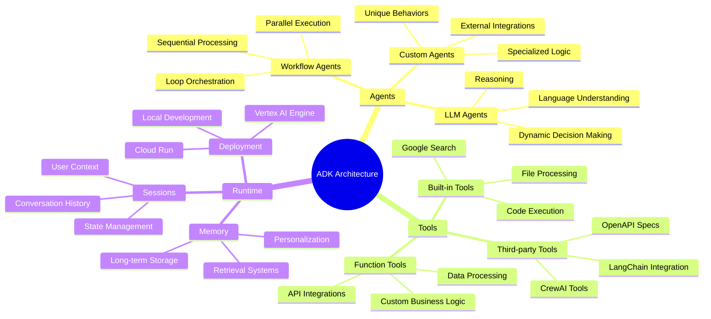

**Pause and Reflect:** *Before diving deeper, think about a complex business process in your organization. Can you identify parts that require reasoning (LLM Agents), parts that follow predictable steps (Workflow Agents), and parts that need specialized logic (Custom Agents)?*

---

## Agent Types: The Heart of ADK

### 1. LLM Agents: The Intelligent Reasoners

LLM Agents are the "knowledge workers" of your agent ecosystem. They understand natural language, reason about complex problems, and make intelligent decisions.

**Real-World Analogy:** Think of them as your best consultants - they can analyze situations, provide insights, and adapt their approach based on context.

**When to Use LLM Agents:**

- **Complex decision-making** requiring interpretation
- **Natural language processing** and understanding
- **Dynamic problem-solving** where rules can't be predetermined
- **Creative tasks** like content generation or strategy development

#### Example: Customer Service Intelligence

```python
from google.adk.agents import LlmAgent
from google.adk.tools import FunctionTool

# Define your custom tools first
def get_account_info(customer_id: str) -> dict:
    """Retrieve account information for a customer."""
    # Implementation here
    return {"status": "success", "account_data": "..."}

def check_order_status(order_id: str) -> dict:
    """Check the status of a customer order."""
    # Implementation here
    return {"status": "success", "order_status": "shipped"}

# Create function tools
account_tool = FunctionTool(func=get_account_info)
order_tool = FunctionTool(func=check_order_status)

customer_service_agent = LlmAgent(
    name="customer_service_specialist",
    model="gemini-2.0-flash",
    instruction="""
    You are an expert customer service representative with 10 years of experience.
    
    Your approach:
    1. Listen actively to understand the customer's real concern
    2. Empathize with their situation
    3. Provide clear, actionable solutions
    4. Know when to escalate to human agents
    
    You have access to account information, order history, and policy documents.
    Always prioritize customer satisfaction while following company policies.
    """,
    tools=[
        account_tool,
        order_tool,
        # Add other tools as needed
    ]
)
```

**The Magic Moment:** This agent doesn't just follow scripts - it understands context. A customer saying "I'm frustrated with this order" gets a different response than "I'd like to return this item," even though both might result in the same action.

### 2. Workflow Agents: The Process Orchestrators

Workflow Agents are the "project managers" of your system. They coordinate other agents, ensure processes follow the right sequence, and handle complex orchestration.

**The Three Workflow Patterns:**

#### Sequential Agents: Step-by-Step Processing

Perfect for processes that must happen in order, like onboarding or approval workflows.

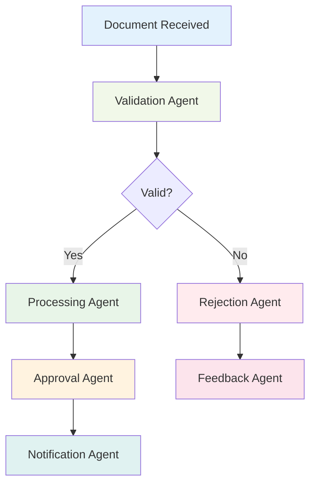

#### Parallel Agents: Concurrent Execution

When you need multiple tasks to happen simultaneously, like data gathering from multiple sources.

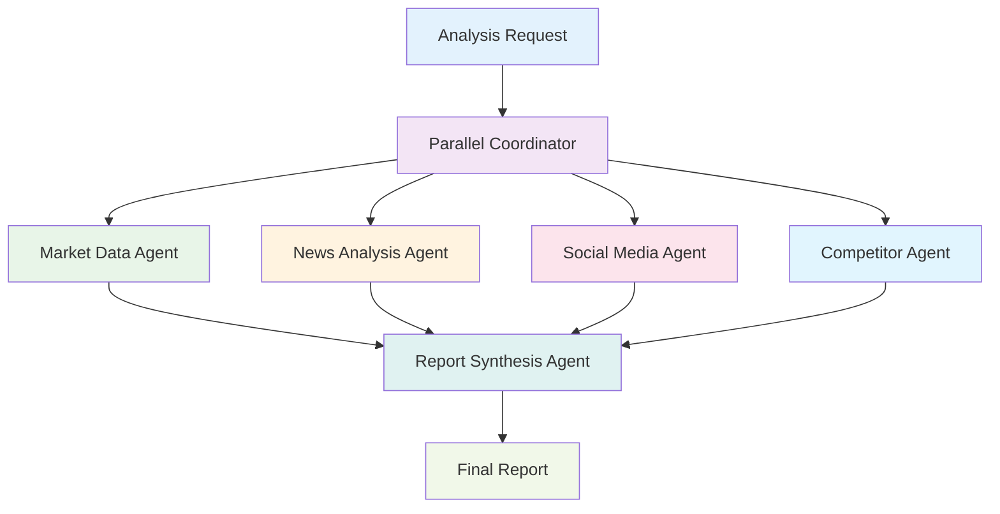

#### Loop Agents: Iterative Workflows

For processes that need to repeat until a condition is met, like quality assurance or optimization tasks.

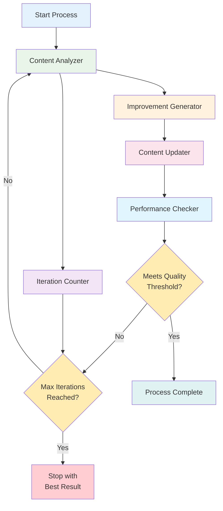

#### Real-World Example: Content Optimization Loop

```python
from google.adk.agents import LoopAgent

content_optimizer = LoopAgent(
    name="content_optimization_loop",
    sub_agents=[
        content_analyzer,      # Analyzes current performance
        improvement_generator, # Suggests improvements
        content_updater,      # Applies changes
        performance_checker   # Validates improvements
    ],
    max_iterations=5
)
```

### 3. Custom Agents: The Specialists

Custom Agents are your "expert contractors" - they handle specialized tasks that require unique logic or external integrations.

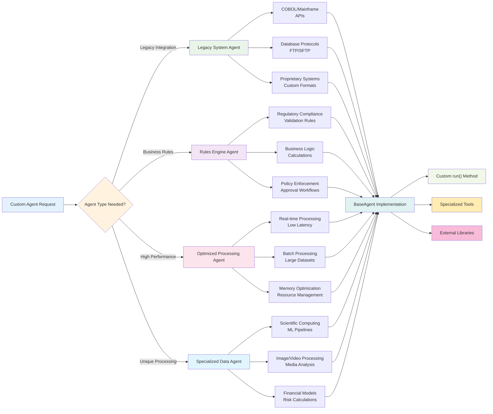

**When to Build Custom Agents:**

- **Legacy system integration** with complex protocols
- **Specialized business rules** that can't be expressed in natural language
- **High-performance requirements** needing optimized execution
- **Unique data processing** patterns

#### Example: Financial Compliance Agent

```python
from google.adk.agents import BaseAgent

class ComplianceAgent(BaseAgent):
    def __init__(self):
        super().__init__(name="compliance_checker")
        self.regulations = load_regulatory_database()
        self.risk_models = load_risk_models()
    
    async def run(self, input_data):
        # Custom compliance logic
        risk_score = self.calculate_risk(input_data)
        violations = self.check_violations(input_data)
        
        if risk_score > 0.8 or violations:
            return self.generate_compliance_report(input_data, violations)
        
        return {"status": "compliant", "risk_score": risk_score}
```

---

## Tools: Extending Agent Capabilities

### The Tool Ecosystem

Think of tools as the "skills" your agents can learn. Just as a human employee might learn to use Salesforce, Excel, or Photoshop, your agents can learn to use various tools to accomplish their tasks.

### Tools: Critical Limitations and Best Practices

**Built-in Tool Restrictions (Important):**

1. **One Built-in Tool Per Agent**: Each agent can only use ONE built-in tool (Google Search, Code Execution, or Vertex AI Search)
2. **No Mixing**: Built-in tools cannot be combined with other tools in the same agent
3. **No Sub-agent Support**: Built-in tools cannot be used in sub-agents

**Workaround for Multiple Capabilities:**

```python
from google.adk.tools import AgentTool
from google.adk.agents import LlmAgent
from google.adk.tools import google_search
from google.adk.code_executors import BuiltInCodeExecutor

# Create specialized agents
search_agent = LlmAgent(
    model='gemini-2.0-flash',
    name='SearchAgent',
    instruction="You're a specialist in Google Search",
    tools=[google_search],
)

coding_agent = LlmAgent(
    model='gemini-2.0-flash',
    name='CodeAgent',
    instruction="You're a specialist in Code Execution",
    executor=[BuiltInCodeExecutor],
)

# Use them as tools in a coordinator agent
root_agent = LlmAgent(
    name="RootAgent",
    model="gemini-2.0-flash",
    description="Root Agent",
    tools=[
        AgentTool(agent=search_agent), 
        AgentTool(agent=coding_agent)
    ],
)
```

**Function Tool Best Practices:**

- **Return Type**: Always return a dictionary with a "status" key
- **Type Hints**: Use proper type hints for all parameters
- **No Default Values**: Avoid default parameter values (LLM doesn't support them)
- **Descriptive Docstrings**: Include clear purpose, parameter descriptions, and return value examples
- **Error Handling**: Return error information in the response dictionary

**Simple Function Tool Example:**

```python
def calculate_shipping_cost(
    weight: float, 
    destination: str, 
    shipping_method: str
) -> dict:
    """Calculate shipping cost based on weight, destination, and method.
    
    Args:
        weight: Package weight in pounds
        destination: Destination zip code
        shipping_method: 'standard', 'express', or 'overnight'
    
    Returns:
        Dictionary with cost and estimated delivery time
    """
    base_rates = {
        'standard': 5.99,
        'express': 12.99,
        'overnight': 24.99
    }
    
    base_cost = base_rates.get(shipping_method, 5.99)
    weight_cost = weight * 0.5
    
    # Simplified zone calculation
    if destination.startswith(('1', '2', '3')):  # East Coast
        zone_multiplier = 1.0
    else:  # West Coast
        zone_multiplier = 1.2
    
    total_cost = (base_cost + weight_cost) * zone_multiplier
    
    delivery_days = {
        'standard': 5,
        'express': 2,
        'overnight': 1
    }
    
    return {
        'cost': round(total_cost, 2),
        'estimated_delivery_days': delivery_days[shipping_method],
        'currency': 'USD'
    }
```

#### Built-in Tools: Ready-to-Use Capabilities

ADK comes with powerful built-in tools that handle common tasks:

- **Google Search Tool**: Real-time web information (requires Gemini 2.0 models)
- **Code Execution Tool**: Run Python code safely (requires Gemini 2.0 models)  
- **Vertex AI Search Tool**: Search your private data stores and knowledge bases

**Important Limitations**: Currently, each agent can only use ONE built-in tool at a time, and built-in tools cannot be combined with other tools in the same agent. To use multiple capabilities, create separate agents and use them via AgentTool or sub-agents.

#### Third-Party Tools: Ecosystem Integration

One of ADK's superpowers is seamless integration with existing tool ecosystems:

- **LangChain Tools**: Access to 100+ pre-built integrations
- **CrewAI Tools**: Specialized agent tools and capabilities
- **OpenAPI Integration**: Automatically create tools from API specifications
- **Model Context Protocol (MCP)**: Connect to MCP servers for standardized tool access
- **Google Cloud Tools**: Native integration with Google Cloud services

**New Addition - MCP Support**: ADK now includes comprehensive support for the Model Context Protocol (MCP), an open standard for connecting LLMs to external systems. This allows you to:

- Use existing MCP servers as tools in your agents
- Expose your ADK tools as MCP servers for other applications
- Access the growing ecosystem of MCP-compatible tools and services


---

## Custom Agents vs. MCP: Understanding the Fundamental Differences

**The Short Answer:** Custom Agents and MCP (Model Context Protocol) serve completely different purposes in the AI ecosystem. Custom Agents are **execution environments** that define *how* intelligent behavior happens, while MCP is a **communication protocol** that defines *how* tools and data are shared between applications.

### Architectural Perspective

#### Custom Agents: The Intelligence Layer

Custom Agents in ADK are **intelligent execution environments** that inherit from `BaseAgent` and implement their own reasoning and orchestration logic:

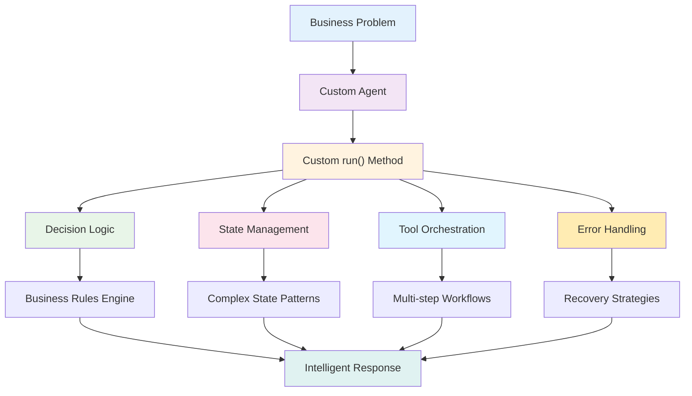

#### MCP: The Interoperability Layer

MCP is a **standardized protocol** that enables different applications to share tools, resources, and prompts:

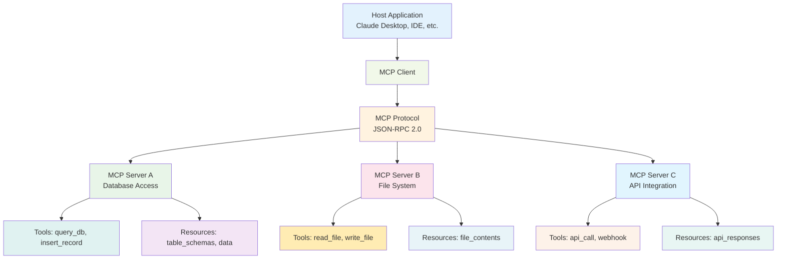

### Core Philosophical Differences

#### 1. **Purpose and Scope**

**Custom Agents:**
- **Purpose**: Create specialized intelligent behavior for specific business problems
- **Scope**: Application-level intelligence and orchestration
- **Control**: Complete control over reasoning, decision-making, and execution flow
- **Flexibility**: Unlimited customization of agent behavior

**MCP:**
- **Purpose**: Standardize how AI applications access external tools and data
- **Scope**: Inter-application communication and tool sharing
- **Control**: Protocol-level standards for tool invocation and data exchange
- **Flexibility**: Standardized interface with flexibility in implementation

#### 2. **Implementation Level**

**Custom Agents:**
```python
from google.adk.agents import BaseAgent

class FinancialComplianceAgent(BaseAgent):
    async def run(self, input_data):
        # Custom business logic
        risk_score = self.calculate_risk(input_data)
        violations = self.check_violations(input_data)
        
        # Custom decision-making
        if risk_score > 0.8:
            return await self.escalate_to_human(input_data)
        
        # Custom workflows
        if violations:
            return await self.generate_compliance_report(violations)
            
        return {"status": "compliant", "risk_score": risk_score}
```

**MCP Server:**
```python
from mcp import server

# MCP provides tools, not intelligence
server.setRequestHandler(ListToolsRequestSchema, async () => {
    return {
        tools: [{
            name: "check_compliance",
            description: "Check financial compliance rules",
            inputSchema: {
                type: "object",
                properties: {
                    transaction_data: { type: "object" }
                }
            }
        }]
    }
})
```

#### 3. **Intelligence vs. Capability**

**Custom Agents** = **Intelligence** + **Capability**
- Embed domain expertise and reasoning
- Make complex decisions based on context
- Orchestrate multi-step workflows
- Adapt behavior based on state and history

**MCP** = **Capability** only
- Provides tools and data access
- No built-in intelligence or decision-making
- Stateless function execution
- Standardized input/output contracts

### When to Use Which

#### Choose Custom Agents When:

✅ **Complex Business Logic**: You need sophisticated decision-making that can't be expressed through simple tool calls

✅ **Stateful Workflows**: Your process requires maintaining context across multiple interactions

✅ **Custom Orchestration**: You need to coordinate multiple tools and agents in specific ways

✅ **Specialized Intelligence**: Your domain requires unique reasoning patterns or expertise

✅ **Performance Optimization**: You need fine-tuned control over execution flow and resource usage

**Example Use Cases:**
- Financial risk assessment with regulatory compliance
- Medical diagnosis with patient history consideration
- Multi-step manufacturing process optimization
- Legal document analysis with jurisdiction-specific rules

#### Choose MCP When:

✅ **Tool Standardization**: You want to make your tools available across multiple AI applications

✅ **Ecosystem Integration**: You need to connect with the broader MCP ecosystem

✅ **Cross-Platform Compatibility**: Your tools should work with Claude Desktop, IDEs, and other MCP clients

✅ **Simple Tool Exposure**: You have well-defined functions that don't require complex orchestration

✅ **Data Access Patterns**: You want to expose resources (files, databases, APIs) in a standardized way

**Example Use Cases:**
- Database query tools for multiple AI applications
- File system access for IDEs and AI assistants
- API integrations that work across platforms
- Standardized data processing utilities

### Integration Patterns

#### ADK + MCP: Best of Both Worlds

You can combine Custom Agents with MCP tools to get both intelligence and interoperability:

```python
from google.adk.agents import BaseAgent
from google.adk.tools import McpTool

class IntelligentAnalysisAgent(BaseAgent):
    def __init__(self):
        super().__init__(name="intelligent_analyzer")
        # Use MCP tools for standardized capabilities
        self.mcp_tools = [
            McpTool(server_uri="database-server"),
            McpTool(server_uri="file-server"),
            McpTool(server_uri="api-server")
        ]
    
    async def run(self, input_data):
        # Custom intelligence decides which tools to use and how
        if self.requires_data_analysis(input_data):
            data = await self.mcp_tools[0].query_database(input_data.query)
            analysis = await self.perform_custom_analysis(data)
            
            # Custom decision: should we save results?
            if analysis.confidence > 0.9:
                await self.mcp_tools[1].save_file(analysis.results)
                
        return self.synthesize_response(analysis)
```

#### Pattern 1: Custom Agent Using Multiple Tools

```python
class IntelligentAnalysisAgent(BaseAgent):
    async def _run_async_impl(self, ctx):
        # Use multiple tools in orchestrated fashion
        raw_data = await self.data_tool.fetch_data(ctx.input)
        processed = await self.analysis_tool.analyze(raw_data)
        
        # Custom decision logic
        if processed.confidence > 0.9:
            await self.report_tool.generate_report(processed)
        else:
            await self.escalation_tool.request_review(processed)
```

#### Pattern 2: Tools as Agent Building Blocks

```python
# Reusable tools across multiple agents
risk_calculator = FunctionTool(func=calculate_risk_score)
compliance_checker = FunctionTool(func=check_compliance_rules)
notification_sender = FunctionTool(func=send_notification)

# Different agents use same tools differently
risk_agent = LlmAgent(
    name="risk_assessor",
    tools=[risk_calculator, compliance_checker]
)

audit_agent = LlmAgent(
    name="auditor", 
    tools=[compliance_checker, notification_sender]
)
```

#### Pattern 3: Agent-as-Tool Pattern

```python
# Specialized agent used as a tool by other agents
specialist_agent = LlmAgent(
    name="financial_specialist",
    model="gemini-2.0-flash",
    instruction="Expert in financial risk analysis...",
    tools=[risk_calculator, market_data_tool]
)

# Use specialist as a tool in coordinating agent
coordinator = LlmAgent(
    name="coordinator",
    tools=[
        AgentTool(agent=specialist_agent),
        notification_tool,
        approval_tool
    ]
)
```

### Technical Architecture Comparison

| Aspect | Custom Agents | Tools |
|--------|---------------|-------|
| **Purpose** | Workflow orchestration | Capability provision |
| **Complexity** | High - custom business logic | Low - focused functionality |
| **State Management** | Full session state access | Stateless execution |
| **Execution Model** | Long-running, multi-step | Single call, immediate return |
| **Reusability** | Application-specific | Cross-agent reusable |
| **Error Handling** | Custom recovery strategies | Simple success/failure |
| **Testing** | Complex integration testing | Unit testable |
| **Maintenance** | High - custom orchestration | Low - focused scope |
| **Performance** | Variable - depends on workflow | Predictable - single operation |

### Real-World Analogy

Think of the difference like a **restaurant kitchen**:

**Custom Agents** are like the **Head Chef** - they coordinate the entire meal preparation process, make decisions about timing and quality, manage multiple cooking stations, and adapt based on changing conditions (busy night, special dietary requests, ingredient availability).

**Tools** are like **kitchen equipment** - the oven, knife, blender, or thermometer. Each has a specific purpose, works reliably when used correctly, and can be used by different chefs for various recipes. The oven doesn't decide what to cook, but it's essential for baking.

The Head Chef (Custom Agent) uses multiple tools (kitchen equipment) and coordinates with sous chefs (sub-agents) to deliver a complete dining experience, while each tool provides a specific, reliable capability that enables the overall process.

### Best Practices and Guidelines

#### Custom Agent Design Principles

1. **Clear Responsibility Boundaries**: Define exactly what business process the agent orchestrates
2. **Robust Error Handling**: Implement comprehensive error recovery and rollback strategies
3. **State Management**: Use session state effectively without creating tight coupling
4. **Composability**: Design sub-agents and tools that can be reused in different workflows
5. **Testability**: Create integration tests that validate the entire workflow

#### Tool Design Principles

1. **Single Responsibility**: Each tool should do one thing exceptionally well
2. **Clear Interfaces**: Use descriptive docstrings and type hints for LLM understanding
3. **Consistent Return Formats**: Standardize response structures across similar tools
4. **Error Communication**: Return detailed error information that agents can act upon
5. **Stateless Design**: Avoid dependencies on external state or previous calls

### The Development Decision Framework

When building new functionality, ask yourself:

**"Am I defining HOW a complex process should work?"** → Custom Agent
- Multi-step workflows
- Conditional business logic
- State-dependent decisions
- Error recovery strategies

**"Am I providing WHAT capability an agent needs?"** → Tool
- API integrations
- Data transformations
- Calculations
- External service calls

**"Am I creating intelligence or capability?"** 
- Intelligence (reasoning, decision-making, orchestration) → Custom Agent
- Capability (functions, integrations, computations) → Tool

Remember: Most ADK applications use **both** Custom Agents and Tools together. Custom Agents provide the intelligent orchestration, while Tools provide the atomic capabilities that make complex workflows possible.

---

## Custom Agents vs. Tools: Choosing the Right Abstraction Layer

**The Short Answer:** Custom Agents and Tools operate at fundamentally different abstraction layers in ADK. **Custom Agents** are *intelligent orchestrators* that define complex workflows and decision-making logic, while **Tools** are *atomic capabilities* that agents can invoke to perform specific tasks.

### Agent-Tool Architectural Perspective

#### Custom Agents: The Orchestration Intelligence

Custom Agents inherit from `BaseAgent` and implement sophisticated workflow orchestration through the `_run_async_impl()` method:

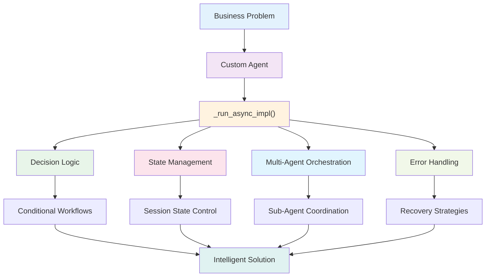

#### Tools: The Capability Providers

Tools are discrete functions that agents can invoke to perform specific tasks:

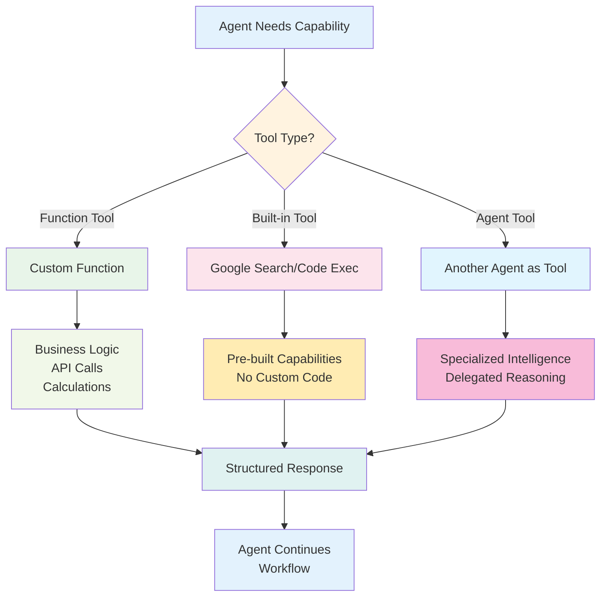

### Agent-Tool Philosophical Differences

#### 1. **Abstraction Level**

**Custom Agents:**

- **High-level orchestration**: Define *how* complex workflows execute
- **Business logic containers**: Embed domain-specific decision-making
- **Stateful coordination**: Maintain context across multiple operations
- **Control flow ownership**: Determine execution paths and error handling

**Tools:**

- **Low-level capabilities**: Define *what* specific actions can be performed
- **Stateless functions**: Execute discrete tasks without maintaining context
- **Input/output contracts**: Clear interfaces for data transformation
- **Single responsibility**: Each tool does one thing well

#### 2. **Implementation Complexity**

**Custom Agents:**

```python
from google.adk.agents import BaseAgent
from typing import AsyncGenerator

class ComplianceWorkflowAgent(BaseAgent):
    async def _run_async_impl(self, ctx):
        # Complex orchestration logic
        analysis = await self.risk_agent.run_async(ctx)
        
        if ctx.session.state.get("risk_score", 0) > 0.8:
            # Conditional logic based on results
            yield await self.escalation_agent.run_async(ctx)
        else:
            # Different path for low risk
            yield await self.auto_approval_agent.run_async(ctx)
        
        # Custom error handling and state management
        if ctx.session.state.get("approval_status") == "pending":
            await self.notification_agent.run_async(ctx)
```

**Tools:**
```python
from google.adk.tools import FunctionTool

def calculate_risk_score(transaction_data: dict) -> dict:
    """Calculate risk score for a financial transaction.
    
    Args:
        transaction_data: Dictionary containing transaction details
        
    Returns:
        dict: Risk analysis results with score and factors
    """
    # Simple, focused logic
    risk_factors = analyze_transaction(transaction_data)
    score = sum(risk_factors.values()) / len(risk_factors)
    
    return {
        "status": "success",
        "risk_score": score,
        "factors": risk_factors,
        "recommendation": "approve" if score < 0.5 else "review"
    }

# Automatically wrapped as FunctionTool when added to agent
```

#### 3. **Lifecycle and Execution**

**Custom Agents:**
- **Long-running orchestration**: Can execute for minutes or hours
- **Multi-step coordination**: Coordinate multiple sub-agents and tools
- **Session-aware**: Full access to session state and history
- **Event streaming**: Yield events throughout execution

**Tools:**
- **Single execution**: Complete one specific task and return
- **Atomic operations**: Indivisible units of work
- **Context-limited**: Receive only necessary input parameters
- **Result-focused**: Return structured data for agent consumption

### Tool Usage Decision Matrix

#### Build Custom Agents For

✅ **Complex Decision Trees**: Your workflow requires sophisticated conditional logic that can't be expressed through simple tool calls

✅ **Multi-Stage Orchestration**: You need to coordinate multiple agents, tools, and external systems in specific sequences

✅ **Stateful Workflows**: Your process maintains context and makes decisions based on accumulated state

✅ **Business Process Automation**: You're modeling real-world business processes with approval workflows, escalations, and compliance checks

✅ **Dynamic Routing**: Execution paths change based on runtime conditions and previous results

**Example Use Cases:**

- **Financial compliance workflows** with risk assessment, approval chains, and audit trails
- **Customer onboarding processes** with document verification, credit checks, and account setup
- **Content moderation pipelines** with AI analysis, human review, and policy enforcement
- **Manufacturing quality control** with testing, analysis, and corrective action workflows

#### Build Tools For

✅ **Discrete Capabilities**: You need specific functionality that agents can use as building blocks

✅ **Reusable Logic**: The same functionality will be used across multiple agents

✅ **External Integrations**: You're connecting to APIs, databases, or external services

✅ **Computational Tasks**: You need to perform calculations, data transformations, or analysis

✅ **Single Responsibility**: The functionality has a clear, focused purpose

**Example Use Cases:**

- **API integrations** for CRM, payment processing, or notification systems
- **Data processing functions** for calculations, validation, or transformation
- **External service calls** for weather, stock prices, or geolocation data
- **Database operations** for querying, updating, or reporting

### Integration Patterns

#### ADK + MCP: Best of Both Worlds

You can combine Custom Agents with MCP tools to get both intelligence and interoperability:

```python
from google.adk.agents import BaseAgent
from google.adk.tools import McpTool

class IntelligentAnalysisAgent(BaseAgent):
    def __init__(self):
        super().__init__(name="intelligent_analyzer")
        # Use MCP tools for standardized capabilities
        self.mcp_tools = [
            McpTool(server_uri="database-server"),
            McpTool(server_uri="file-server"),
            McpTool(server_uri="api-server")
        ]
    
    async def run(self, input_data):
        # Custom intelligence decides which tools to use and how
        if self.requires_data_analysis(input_data):
            data = await self.mcp_tools[0].query_database(input_data.query)
            analysis = await self.perform_custom_analysis(data)
            
            # Custom decision: should we save results?
            if analysis.confidence > 0.9:
                await self.mcp_tools[1].save_file(analysis.results)
                
        return self.synthesize_response(analysis)
```

#### Pattern 1: Custom Agent Using Multiple Tools

```python
class IntelligentAnalysisAgent(BaseAgent):
    async def _run_async_impl(self, ctx):
        # Use multiple tools in orchestrated fashion
        raw_data = await self.data_tool.fetch_data(ctx.input)
        processed = await self.analysis_tool.analyze(raw_data)
        
        # Custom decision logic
        if processed.confidence > 0.9:
            await self.report_tool.generate_report(processed)
        else:
            await self.escalation_tool.request_review(processed)
```

#### Pattern 2: Tools as Agent Building Blocks

```python
# Reusable tools across multiple agents
risk_calculator = FunctionTool(func=calculate_risk_score)
compliance_checker = FunctionTool(func=check_compliance_rules)
notification_sender = FunctionTool(func=send_notification)

# Different agents use same tools differently
risk_agent = LlmAgent(
    name="risk_assessor",
    tools=[risk_calculator, compliance_checker]
)

audit_agent = LlmAgent(
    name="auditor", 
    tools=[compliance_checker, notification_sender]
)
```

#### Pattern 3: Agent-as-Tool Pattern

```python
# Specialized agent used as a tool by other agents
specialist_agent = LlmAgent(
    name="financial_specialist",
    model="gemini-2.0-flash",
    instruction="Expert in financial risk analysis...",
    tools=[risk_calculator, market_data_tool]
)

# Use specialist as a tool in coordinating agent
coordinator = LlmAgent(
    name="coordinator",
    tools=[
        AgentTool(agent=specialist_agent),
        notification_tool,
        approval_tool
    ]
)
```

### Technical Architecture Comparison

| Aspect | Custom Agents | Tools |
|--------|---------------|-------|
| **Purpose** | Workflow orchestration | Capability provision |
| **Complexity** | High - custom business logic | Low - focused functionality |
| **State Management** | Full session state access | Stateless execution |
| **Execution Model** | Long-running, multi-step | Single call, immediate return |
| **Reusability** | Application-specific | Cross-agent reusable |
| **Error Handling** | Custom recovery strategies | Simple success/failure |
| **Testing** | Complex integration testing | Unit testable |
| **Maintenance** | High - custom orchestration | Low - focused scope |
| **Performance** | Variable - depends on workflow | Predictable - single operation |

### Real-World Analogy

Think of the difference like a **restaurant kitchen**:

**Custom Agents** are like the **Head Chef** - they coordinate the entire meal preparation process, make decisions about timing and quality, manage multiple cooking stations, and adapt based on changing conditions (busy night, special dietary requests, ingredient availability).

**Tools** are like **kitchen equipment** - the oven, knife, blender, or thermometer. Each has a specific purpose, works reliably when used correctly, and can be used by different chefs for various recipes. The oven doesn't decide what to cook, but it's essential for baking.

The Head Chef (Custom Agent) uses multiple tools (kitchen equipment) and coordinates with sous chefs (sub-agents) to deliver a complete dining experience, while each tool provides a specific, reliable capability that enables the overall process.

### Best Practices and Guidelines

#### Custom Agent Design Principles

1. **Clear Responsibility Boundaries**: Define exactly what business process the agent orchestrates
2. **Robust Error Handling**: Implement comprehensive error recovery and rollback strategies
3. **State Management**: Use session state effectively without creating tight coupling
4. **Composability**: Design sub-agents and tools that can be reused in different workflows
5. **Testability**: Create integration tests that validate the entire workflow

#### Tool Design Principles

1. **Single Responsibility**: Each tool should do one thing exceptionally well
2. **Clear Interfaces**: Use descriptive docstrings and type hints for LLM understanding
3. **Consistent Return Formats**: Standardize response structures across similar tools
4. **Error Communication**: Return detailed error information that agents can act upon
5. **Stateless Design**: Avoid dependencies on external state or previous calls

### The Development Decision Framework

When building new functionality, ask yourself:

**"Am I defining HOW a complex process should work?"** → Custom Agent
- Multi-step workflows
- Conditional business logic
- State-dependent decisions
- Error recovery strategies

**"Am I providing WHAT capability an agent needs?"** → Tool
- API integrations
- Data transformations
- Calculations
- External service calls

**"Am I creating intelligence or capability?"** 
- Intelligence (reasoning, decision-making, orchestration) → Custom Agent
- Capability (functions, integrations, computations) → Tool

Remember: Most ADK applications use **both** Custom Agents and Tools together. Custom Agents provide the intelligent orchestration, while Tools provide the atomic capabilities that make complex workflows possible.

---


## Sessions and State: Memory That Matters

### Understanding Sessions

Sessions are how ADK maintains context across interactions. Think of them as the "memory" that allows your agents to have coherent, ongoing conversations.

**Session Hierarchy:**

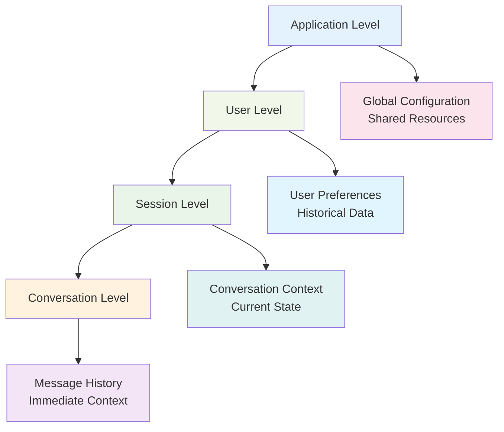

### State Management Patterns

**State Prefixes in ADK:**

- `app:*` - Application-wide data (shared across all users)
- `user:*` - User-specific data (across all sessions)  
- `session:*` - Session-specific data (current conversation)
- `temp:*` - Temporary data (not persisted)

#### Practical Example: E-commerce Assistant

```python
from google.adk.tools import ToolContext, FunctionTool

def update_shopping_cart(item_id: str, quantity: int, tool_context: ToolContext):
    """Add or update item in user's shopping cart."""
    
    # Get user's cart from session state
    cart = tool_context.state.get('cart', {})
    
    # Update cart
    if quantity > 0:
        cart[item_id] = {
            'quantity': quantity,
            'added_at': datetime.now().isoformat()
        }
    else:
        cart.pop(item_id, None)  # Remove if quantity is 0
    
    # Save back to session state
    tool_context.state['cart'] = cart
    
    # Update user's cart history
    user_cart_history = tool_context.state.get('user:cart_history', [])
    user_cart_history.append({
        'action': 'update',
        'item_id': item_id,
        'quantity': quantity,
        'timestamp': datetime.now().isoformat()
    })
    tool_context.state['user:cart_history'] = user_cart_history
    
    return {
        'status': 'success',
        'cart_total_items': sum(item['quantity'] for item in cart.values()),
        'message': f'Cart updated with {quantity} of item {item_id}'
    }
```

**Important**: State modifications should only be done through:

1. `ToolContext.state` in tool functions
2. `CallbackContext.state` in callbacks  
3. `EventActions.state_delta` when manually creating events
4. Agent `output_key` for simple response storage

Direct modification of `session.state` is not recommended and may not persist properly.

---

## Deployment Architecture: From Development to Production

### The Deployment Spectrum

ADK supports multiple deployment strategies, from local development to enterprise-scale production:

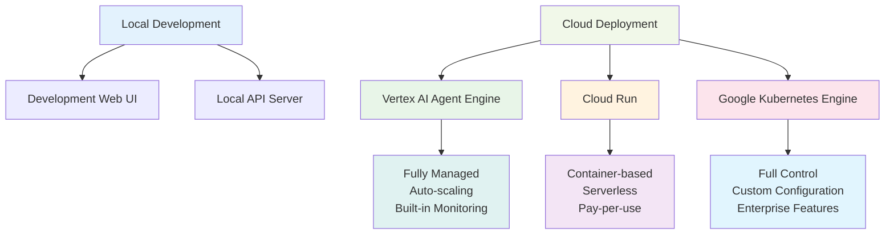

### Choosing Your Deployment Strategy

**Local Development (`adk web`)**

Perfect for:

- Initial development and testing
- Rapid prototyping
- Learning and experimentation

#### Vertex AI Agent Engine

Ideal for:

- Production applications with variable load
- Teams wanting minimal infrastructure management
- Applications requiring tight Google Cloud integration

#### Cloud Run

Best for:

- Containerized applications
- Predictable scaling requirements
- Cost-conscious deployments

#### Google Kubernetes Engine (GKE)

Choose when you need:

- Maximum control over infrastructure
- Complex multi-service architectures
- Enterprise security and compliance requirements

---

## Common Patterns and Anti-Patterns

### ✅ Effective Agent Patterns

#### 1. Single Responsibility Agents

```python
# Good: Focused, single-purpose agent
email_classifier = LlmAgent(
    name="email_classifier",
    model="gemini-2.0-flash",
    instruction="Classify emails as urgent, normal, or low priority based on content and sender."
)

# Avoid: Kitchen sink agent
# universal_agent = LlmAgent(
#     name="do_everything_agent",
#     model="gemini-2.0-flash",
#     instruction="Handle emails, process orders, generate reports, and manage inventory."
# )
```

#### 2. Hierarchical Agent Organization

```python
# Coordinator agent that delegates to specialists
customer_service_coordinator = LlmAgent(
    name="service_coordinator",
    model="gemini-2.0-flash",
    instruction="Route customer inquiries to appropriate specialist agents.",
    sub_agents=[
        billing_specialist,
        technical_support_specialist,
        product_specialist
    ]
)
```

#### 3. Graceful Degradation

```python
def robust_data_fetcher(query: str, tool_context: ToolContext) -> dict:
    """Fetch data with multiple fallback strategies."""
    
    # Try primary data source
    try:
        return fetch_from_primary_api(query)
    except APIException:
        # Fallback to secondary source
        try:
            return fetch_from_cache(query)
        except CacheException:
            # Final fallback
            return {
                'status': 'partial',
                'message': 'Using basic information due to system issues',
                'data': get_basic_info(query)
            }
```

### ❌ Anti-Patterns to Avoid

#### 1. Chatbot Thinking

```python
# Anti-pattern: Treating agents like chatbots
bad_agent = LlmAgent(
    name="bad_agent",
    model="gemini-2.0-flash",
    instruction="Answer user questions"  # Too generic
)

# Better: Specific, actionable instructions
good_agent = LlmAgent(
    name="good_agent",
    model="gemini-2.0-flash",
    instruction="""
    You are a technical support specialist for cloud infrastructure.
    
    When users report issues:
    1. Gather specific error messages and timestamps
    2. Check system status using diagnostic tools
    3. Provide step-by-step troubleshooting guidance
    4. Escalate to human engineers for complex issues
    """
)
```

#### 2. Synchronous Blocking

```python
# Anti-pattern: Blocking operations
def slow_operation(data):
    time.sleep(30)  # Blocks entire system
    return process_data(data)

# Better: Asynchronous processing
async def efficient_operation(data, tool_context: ToolContext):
    # Start background task
    task_id = start_background_processing(data)
    
    # Store task reference
    tool_context.state['processing_task'] = task_id
    
    return {
        'status': 'processing',
        'task_id': task_id,
        'message': 'Processing started. Check back in a few minutes.'
    }
```

#### 3. State Pollution

```python
# Anti-pattern: Storing everything in state
tool_context.state['temporary_calculation'] = complex_data
tool_context.state['debug_info'] = debug_data
tool_context.state['api_response_cache'] = response_data

# Better: Use appropriate state prefixes
tool_context.state['temp:calculation'] = complex_data  # Won't persist
tool_context.state['user:preferences'] = user_prefs   # User-specific
tool_context.state['session:context'] = session_data  # Session-specific
```

---

## Your Mental Model Checklist

Before moving to the next chapter, ensure you can answer these questions:

**Agent Types:**

- When would you use an LLM Agent vs. a Workflow Agent?
- What are the three types of Workflow Agents and their use cases?
- When should you build a Custom Agent?

**Tools:**

- How do Function Tools differ from Built-in Tools?
- What information should you include in a tool's docstring?
- How do you handle tool errors gracefully?

**Sessions and State:**

- What's the difference between session-level and user-level state?
- When would you use temporary state vs. persistent state?
- How do you maintain context across multiple agent interactions?

**Architecture:**

- How do you decide between different deployment options?
- What are the key patterns for agent organization?
- How do you avoid common anti-patterns?

---

## Hands-On Challenge: Design Your First Agent System

**Scenario:** You work for a mid-sized software company that needs to automate their customer onboarding process. Currently, it takes 5 days and involves 3 different departments.

**Your Challenge:** Design an agent system that can:

1. **Validate** new customer information
2. **Create** accounts in multiple systems
3. **Generate** personalized welcome materials
4. **Schedule** kickoff calls
5. **Monitor** progress and handle exceptions

**Design Questions:**

1. What types of agents would you use for each step?
2. What tools would each agent need?
3. How would you handle state management?
4. What would your escalation strategy be?
5. How would you deploy this system?

Spend 15 minutes sketching out your approach. We'll implement this system in later chapters!

---

## Pro Tips: Foundation Best Practices

💡 **Start with the Data Model**

Before building agents, map out your state structure. What data needs to persist? What's temporary? What's user-specific vs. global?

💡 **Design for Observability**

ADK provides excellent debugging tools. Use them! Name your agents and tools descriptively, and include meaningful logging.

💡 **Think in Workflows**

Even simple tasks often have multiple steps. Consider whether a single LLM Agent or a Workflow Agent with multiple steps would be more maintainable.

💡 **Plan for Failure**

Every external API call, every LLM interaction, every tool execution can fail. Build graceful degradation into your agent design from day one.

---

## Chapter Wrap-Up: Your Foundation is Set

You now have the mental model necessary to think in "agent patterns." You understand the three types of agents, how tools extend capabilities, and how sessions maintain context across interactions.

In the next chapter, we'll put this knowledge into practice by building your first complete agent system. You'll see how these concepts work together to create something truly powerful.

**Key Takeaways:**

- **LLM Agents** for intelligence and reasoning
- **Workflow Agents** for process orchestration  
- **Custom Agents** for specialized requirements
- **Tools** extend agent capabilities
- **Sessions** maintain context and state
- **Deployment** options scale from local to enterprise

**Remember:** The best agent architectures are simple, focused, and composable. Start small, think big, and build systems that can grow with your needs.

---

*Next Chapter Preview: "Your First Agent: Quick Wins" - Where we'll build a complete weather and news assistant that demonstrates all these concepts working together.*

**Quick Self-Check:**

1. What are the three types of agents in ADK?
2. What's the difference between session state and user state?
3. When would you use a Parallel Agent vs. a Sequential Agent?

**Answers:**

1. LLM Agents, Workflow Agents, Custom Agents
2. Session state is conversation-specific, user state persists across all sessions  
3. Parallel for concurrent tasks, Sequential for ordered processes

## Recent Updates & Installation

### Latest ADK Releases (Google I/O 2025)

**Major Updates:**

- **Java ADK v0.1.0**: ADK now supports Java, extending agent capabilities to the Java ecosystem
- **Python ADK v1.0.0**: Now stable and production-ready
- **Enhanced MCP Support**: Full Model Context Protocol integration for tool interoperability

### Installation

**Python Installation:**

```bash
# Create virtual environment (recommended)
python -m venv .venv

# Activate virtual environment
# Mac/Linux:
source .venv/bin/activate
# Windows CMD:
.venv\Scripts\activate.bat
# Windows PowerShell:
.venv\Scripts\Activate.ps1

# Install ADK
pip install google-adk

# Verify installation
pip show google-adk
```

**Java Installation:**
Follow the [Java ADK documentation](https://google.github.io/adk-docs/api-reference/java/) for Maven/Gradle setup.

---

## Advanced ADK Features: Evaluation and Safety

### Built-in Evaluation Framework

ADK provides comprehensive evaluation capabilities to assess agent performance:

- **Response Quality Evaluation**: Assess the quality of final responses
- **Step-by-Step Execution Analysis**: Evaluate intermediate reasoning steps
- **Predefined Test Cases**: Create systematic test suites for your agents
- **Performance Metrics**: Track consistency, accuracy, and reliability

### Safety and Security Features

ADK incorporates security and safety patterns:

- **Content Filtering**: Built-in safety mechanisms for generated content
- **Authentication Flows**: Secure tool authentication and credential management
- **Sandboxed Execution**: Safe code execution environments
- **Access Controls**: Fine-grained permissions for tool usage

### Streaming and Real-time Capabilities

- **Bidi-streaming**: Live, bidirectional communication for real-time applications
- **Server-Sent Events (SSE)**: Streaming responses for web applications
- **WebSocket Support**: Full-duplex communication channels
- **Audio Streaming**: Support for voice-enabled applications
