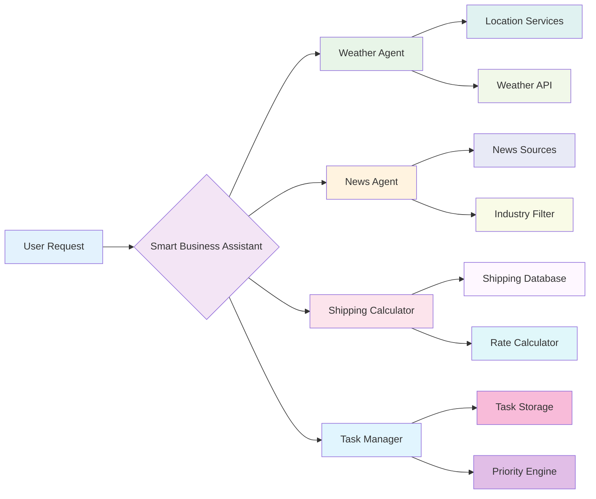

# Chapter 3: Your First Agent - Quick Wins

> *"The best way to learn agent development is to build something useful immediately. Theory without practice is just daydreaming."* - The Pragmatic Approach

## Why This Chapter Matters: From Zero to Hero in 30 Minutes

You've learned the concepts. You understand the architecture. Now it's time to build something real.

In this chapter, you'll create a **Smart Business Assistant** that can:

- Check weather for business travel planning
- Fetch latest news about your industry
- Calculate shipping costs for orders
- Manage a simple task list with priorities

By the end of this chapter, you'll have a fully functional agent running locally, and you'll understand exactly how to extend it with new capabilities.

**The Promise:** In 30 minutes, you'll go from "I think I understand ADK" to "I just built my first intelligent agent that actually works!"

---

## The Journey Ahead: Building Your Smart Business Assistant

### What We're Building

Imagine having a digital assistant that understands your business context and can help with daily operational tasks. Not just a chatbot that answers questions, but an intelligent system that can take actions, remember context, and learn from interactions.



### Why This Example Matters

This isn't a toy example. Every function we'll build addresses real business needs:

- **Weather checking** for travel planning and logistics
- **News monitoring** for competitive intelligence
- **Shipping calculations** for e-commerce operations
- **Task management** for team coordination

The patterns you learn here scale to enterprise applications handling thousands of requests per day.

---

## Step 1: Environment Setup (5 Minutes)

### Prerequisites Check

Before we start, ensure you have:

- **Python 3.9+** installed (ADK requires Python 3.9 or higher)
- **Terminal access** (macOS/Linux Terminal, Windows PowerShell)
- **Text editor** (VS Code, PyCharm, or similar)
- **Google AI Studio API key** (free at [aistudio.google.com](https://aistudio.google.com/apikey))

**Important:** As of January 2025, Python ADK is officially v1.0.0, offering stability for production-ready agents. Java ADK v0.1.0 is also available.

### Installation and Project Setup

Let's create a clean workspace for our agent:

```bash
# Create project directory
mkdir smart-business-assistant
cd smart-business-assistant

# Create virtual environment
python -m venv .venv

# Activate virtual environment
# macOS/Linux:
source .venv/bin/activate
# Windows:
# .venv\Scripts\activate

# Install ADK
pip install google-adk
```

### Project Structure

Create the following directory structure (based on the [official ADK quickstart](https://google.github.io/adk-docs/get-started/quickstart/)):

```
smart-business-assistant/
├── .venv/
├── .env
├── smart_assistant/
│   ├── __init__.py
│   ├── agent.py
│   └── tools.py
└── README.md
```

**Note**: The official ADK documentation recommends running `adk web` from the parent directory of your agent module (in this case, from `smart-business-assistant/`), not from within the module itself.

Let's create these files:

```bash
# Create the module directory
mkdir smart_assistant

# Create empty files
touch smart_assistant/__init__.py
touch smart_assistant/agent.py
touch smart_assistant/tools.py
touch .env
touch README.md
```

---

## Step 2: Building Your First Tools (10 Minutes)

Tools are the skills your agent can use. Let's start with four essential business tools.

### Create the Tools Module

Edit `smart_assistant/tools.py`:

```python
import datetime
import random
from typing import Dict, List, Optional
from google.adk.tools import ToolContext


def get_weather_forecast(city: str, days: int = 1) -> Dict:
    """Get weather forecast for business travel planning.
    
    Args:
        city: The city name for weather lookup
        days: Number of days to forecast (1-5)
    
    Returns:
        Dictionary with weather information including temperature, 
        conditions, and business travel recommendations.
    """
    # Simulated weather data (in production, use real weather API)
    weather_conditions = [
        "sunny", "partly cloudy", "cloudy", "light rain", "heavy rain", "snow"
    ]
    
    forecast = []
    for day in range(min(days, 5)):
        date = datetime.date.today() + datetime.timedelta(days=day)
        temp = random.randint(15, 35)  # Celsius
        condition = random.choice(weather_conditions)
        
        # Business travel recommendations
        travel_friendly = condition not in ["heavy rain", "snow"]
        
        forecast.append({
            "date": date.strftime("%Y-%m-%d"),
            "temperature": temp,
            "condition": condition,
            "travel_recommendation": "good for travel" if travel_friendly else "consider rescheduling",
            "temperature_fahrenheit": round(temp * 9/5 + 32, 1)
        })
    
    return {
        "status": "success",
        "city": city,
        "forecast": forecast,
        "summary": f"Weather forecast for {city} shows {forecast[0]['condition']} conditions"
    }


def get_industry_news(industry: str, max_articles: int = 3) -> Dict:
    """Fetch latest industry news for competitive intelligence.
    
    Args:
        industry: Industry sector (tech, finance, healthcare, etc.)
        max_articles: Maximum number of articles to return
    
    Returns:
        Dictionary with latest news articles and business insights.
    """
    # Simulated news data (in production, use real news API)
    sample_articles = {
        "tech": [
            {"title": "AI Adoption Accelerates Across Enterprise", "impact": "high", "sentiment": "positive"},
            {"title": "Cloud Computing Costs Rise 15% Year-Over-Year", "impact": "medium", "sentiment": "negative"},
            {"title": "New Cybersecurity Regulations Announced", "impact": "high", "sentiment": "neutral"},
        ],
        "finance": [
            {"title": "Interest Rates Expected to Stabilize", "impact": "high", "sentiment": "positive"},
            {"title": "Digital Banking Adoption Surges", "impact": "medium", "sentiment": "positive"},
            {"title": "Regulatory Changes Impact Trading Volumes", "impact": "medium", "sentiment": "neutral"},
        ],
        "healthcare": [
            {"title": "Telemedicine Usage Plateaus After Growth", "impact": "medium", "sentiment": "neutral"},
            {"title": "Drug Approval Process Streamlined", "impact": "high", "sentiment": "positive"},
            {"title": "Healthcare AI Shows Promise in Diagnostics", "impact": "high", "sentiment": "positive"},
        ]
    }
    
    articles = sample_articles.get(industry.lower(), sample_articles["tech"])
    selected_articles = articles[:max_articles]
    
    # Business insights
    positive_articles = [a for a in selected_articles if a["sentiment"] == "positive"]
    negative_articles = [a for a in selected_articles if a["sentiment"] == "negative"]
    
    insight = f"Market sentiment: {len(positive_articles)} positive, {len(negative_articles)} negative trends"
    
    return {
        "status": "success",
        "industry": industry,
        "articles": selected_articles,
        "business_insight": insight,
        "recommendation": "Monitor positive trends for opportunities" if len(positive_articles) > len(negative_articles) else "Prepare for market challenges"
    }


def calculate_shipping_cost(weight: float, destination_zone: str, service_level: str = "standard") -> Dict:
    """Calculate shipping costs for order fulfillment.
    
    Args:
        weight: Package weight in pounds
        destination_zone: Shipping zone (local, national, international)
        service_level: Service type (standard, express, overnight)
    
    Returns:
        Dictionary with shipping cost breakdown and delivery estimates.
    """
    # Base rates by service level
    base_rates = {
        "standard": {"local": 5.99, "national": 8.99, "international": 24.99},
        "express": {"local": 12.99, "national": 18.99, "international": 49.99},
        "overnight": {"local": 24.99, "national": 34.99, "international": 89.99}
    }
    
    # Weight-based pricing
    weight_rate = 0.75  # per pound
    
    if service_level not in base_rates:
        return {"status": "error", "message": f"Invalid service level: {service_level}"}
    
    if destination_zone not in base_rates[service_level]:
        return {"status": "error", "message": f"Invalid destination zone: {destination_zone}"}
    
    base_cost = base_rates[service_level][destination_zone]
    weight_cost = weight * weight_rate
    total_cost = base_cost + weight_cost
    
    # Delivery estimates
    delivery_days = {
        "standard": {"local": 2, "national": 5, "international": 10},
        "express": {"local": 1, "national": 2, "international": 5},
        "overnight": {"local": 1, "national": 1, "international": 3}
    }
    
    return {
        "status": "success",
        "breakdown": {
            "base_cost": base_cost,
            "weight_cost": round(weight_cost, 2),
            "total_cost": round(total_cost, 2)
        },
        "delivery_estimate": f"{delivery_days[service_level][destination_zone]} business days",
        "service_details": {
            "weight": weight,
            "zone": destination_zone,
            "service": service_level
        }
    }


def manage_tasks(action: str, task_description: str = "", priority: str = "medium", tool_context: Optional[ToolContext] = None) -> Dict:
    """Manage business tasks with priority tracking.
    
    Args:
        action: Action to perform (add, list, complete, remove)
        task_description: Description of the task (for add action)
        priority: Task priority (low, medium, high, urgent)
    
    Returns:
        Dictionary with task management results and current task list.
    """
    if not tool_context:
        return {"status": "error", "message": "Tool context required for task management"}
    
    # Get current tasks from session state using proper ADK pattern
    tasks = tool_context.state.get("tasks", [])
    
    if action == "add":
        if not task_description:
            return {"status": "error", "message": "Task description required"}
        
        task = {
            "id": len(tasks) + 1,
            "description": task_description,
            "priority": priority,
            "status": "pending",
            "created_at": datetime.datetime.now().isoformat(),
            "completed_at": None
        }
        
        tasks.append(task)
        tool_context.state["tasks"] = tasks
        
        return {
            "status": "success",
            "message": f"Task added with {priority} priority",
            "task": task,
            "total_tasks": len(tasks)
        }
    
    elif action == "list":
        # Sort by priority
        priority_order = {"urgent": 0, "high": 1, "medium": 2, "low": 3}
        sorted_tasks = sorted(tasks, key=lambda x: priority_order.get(x["priority"], 2))
        
        pending_tasks = [t for t in sorted_tasks if t["status"] == "pending"]
        completed_tasks = [t for t in sorted_tasks if t["status"] == "completed"]
        
        return {
            "status": "success",
            "pending_tasks": pending_tasks,
            "completed_tasks": completed_tasks,
            "summary": f"{len(pending_tasks)} pending, {len(completed_tasks)} completed"
        }
    
    elif action == "complete":
        if not task_description:
            return {"status": "error", "message": "Task description required to identify task"}
        
        # Find task by description (simple matching)
        for task in tasks:
            if task_description.lower() in task["description"].lower() and task["status"] == "pending":
                task["status"] = "completed"
                task["completed_at"] = datetime.datetime.now().isoformat()
                tool_context.state["tasks"] = tasks
                
                return {
                    "status": "success",
                    "message": f"Task completed: {task['description']}",
                    "task": task
                }
        
        return {"status": "error", "message": "Task not found or already completed"}
    
    else:
        return {"status": "error", "message": f"Invalid action: {action}. Use add, list, complete"}
```

**Important:** According to the [official ADK documentation](https://google.github.io/adk-docs/), functions in ADK are automatically wrapped as `FunctionTool` instances when passed directly to the `tools` list. However, explicitly creating `FunctionTool` instances gives you more control and makes the code more explicit.

---

## Step 3: Creating Your Agent (5 Minutes)

Now let's create the agent that uses these tools. Edit `smart_assistant/agent.py`:

```python
from google.adk.agents import LlmAgent
from .tools import get_weather_forecast, get_industry_news, calculate_shipping_cost, manage_tasks

# Define the main agent - ADK automatically wraps functions as FunctionTool instances
smart_business_assistant = LlmAgent(
    name="smart_business_assistant",
    model="gemini-2.0-flash",
    description="An intelligent business assistant that helps with weather, news, shipping, and task management",
    instruction="""
    You are a Smart Business Assistant designed to help professionals with daily operational tasks.
    
    Your capabilities:
    
    1. WEATHER PLANNING: Use get_weather_forecast to help plan business travel and outdoor activities.
       - Always consider business impact (meetings, travel safety, logistics)
       - Provide practical recommendations based on conditions
    
    2. INDUSTRY INTELLIGENCE: Use get_industry_news to provide competitive insights.
       - Focus on actionable business intelligence
       - Highlight trends that could impact operations
       - Suggest strategic responses to market changes
    
    3. SHIPPING OPTIMIZATION: Use calculate_shipping_cost for logistics planning.
       - Help choose cost-effective shipping options
       - Consider delivery timing vs. cost trade-offs
       - Explain cost breakdowns clearly
    
    4. TASK COORDINATION: Use manage_tasks to help organize work priorities.
       - Add tasks with appropriate priority levels
       - List tasks sorted by priority (urgent > high > medium > low)
       - Mark tasks as completed when requested
    
    Communication Style:
    - Be professional but approachable
    - Provide context and reasoning for recommendations
    - Always ask for clarification if requests are ambiguous
    - Offer proactive suggestions when relevant
    
    When users ask general questions, determine if any of your tools can provide useful information.
    If multiple tools are relevant, use them in combination to provide comprehensive answers.
    
    Remember: You're not just answering questions - you're helping optimize business operations.
    """,
    tools=[get_weather_forecast, get_industry_news, calculate_shipping_cost, manage_tasks]
)
```

### Alternative: Explicit FunctionTool Creation

While the above approach (passing functions directly) is simpler and recommended for most cases, you can also explicitly create `FunctionTool` instances for more control:

```python
from google.adk.agents import LlmAgent
from google.adk.tools import FunctionTool
from .tools import get_weather_forecast, get_industry_news, calculate_shipping_cost, manage_tasks

# Create tool instances explicitly
weather_tool = FunctionTool(func=get_weather_forecast)
news_tool = FunctionTool(func=get_industry_news)
shipping_tool = FunctionTool(func=calculate_shipping_cost)
task_tool = FunctionTool(func=manage_tasks)

# Define the main agent with explicit tool instances
smart_business_assistant = LlmAgent(
    name="smart_business_assistant",
    model="gemini-2.0-flash",
    description="An intelligent business assistant that helps with weather, news, shipping, and task management",
    instruction="""
    You are a Smart Business Assistant designed to help professionals with daily operational tasks.
    
    Your capabilities:
    
    1. WEATHER PLANNING: Use get_weather_forecast to help plan business travel and outdoor activities.
       - Always consider business impact (meetings, travel safety, logistics)
       - Provide practical recommendations based on conditions
    
    2. INDUSTRY INTELLIGENCE: Use get_industry_news to provide competitive insights.
       - Focus on actionable business intelligence
       - Highlight trends that could impact operations
       - Suggest strategic responses to market changes
    
    3. SHIPPING OPTIMIZATION: Use calculate_shipping_cost for logistics planning.
       - Help choose cost-effective shipping options
       - Consider delivery timing vs. cost trade-offs
       - Explain cost breakdowns clearly
    
    4. TASK COORDINATION: Use manage_tasks to help organize work priorities.
       - Add tasks with appropriate priority levels
       - List tasks sorted by priority (urgent > high > medium > low)
       - Mark tasks as completed when requested
    
    Communication Style:
    - Be professional but approachable
    - Provide context and reasoning for recommendations
    - Always ask for clarification if requests are ambiguous
    - Offer proactive suggestions when relevant
    
    When users ask general questions, determine if any of your tools can provide useful information.
    If multiple tools are relevant, use them in combination to provide comprehensive answers.
    
    Remember: You're not just answering questions - you're helping optimize business operations.
    """,
    tools=[weather_tool, news_tool, shipping_tool, task_tool]
)
```

Both approaches are valid - use the simpler direct function approach for most cases, and explicit `FunctionTool` creation when you need more control or customization.

### Update the Module Init File

Edit `smart_assistant/__init__.py`:

```python
from .agent import smart_business_assistant

__all__ = ['smart_business_assistant']
```

---

## Step 4: Configuration and Environment (3 Minutes)

### Set Up Your API Key

Edit `.env` file:

```env
# Google AI Studio API Key
GOOGLE_GENAI_USE_VERTEXAI=FALSE
GOOGLE_API_KEY=your_actual_api_key_here

# Optional: Add other configurations
APP_NAME=smart_business_assistant
DEBUG=true
```

**Important:** Replace `your_actual_api_key_here` with your actual API key from Google AI Studio.

### Create a README

Edit `README.md`:

```markdown
# Smart Business Assistant

An intelligent agent built with Google ADK that helps with:

- Weather planning for business travel
- Industry news and competitive intelligence  
- Shipping cost calculations
- Task management and prioritization

## Quick Start

1. Install dependencies:
   ```bash
   pip install google-adk
   ```

2. Set up your API key in `.env`:
   ```env
   GOOGLE_API_KEY=your_key_here
   ```

3. Run the agent:
   ```bash
   adk web
   ```

## Example Interactions

- "What's the weather in New York for my business trip next week?"
- "Get me the latest tech industry news"
- "Calculate shipping cost for a 5-pound package to international destinations"
- "Add a high-priority task to review quarterly reports"
```

---

## Step 5: Running Your Agent (2 Minutes)

### Launch the Development Environment

From your project directory, run:

```bash
adk web
```

You should see output similar to:

```
INFO:     Started server process [12345]
INFO:     Waiting for application startup.
INFO:     Application startup complete.
INFO:     Uvicorn running on http://127.0.0.1:8000 (Press CTRL+C to quit)
```

### Access the Web Interface

1. Open your browser to `http://127.0.0.1:8000`
2. Select "smart_business_assistant" from the dropdown
3. Start chatting with your agent!

---

## Testing Your Agent: Real Conversations

Let's test each capability with realistic business scenarios:

### Test 1: Weather Planning

**You:** "I have a client meeting in Chicago tomorrow. What's the weather looking like?"

**Expected Response:** The agent will use the weather tool, provide temperature and conditions, and offer business-relevant advice about travel planning.

### Test 2: Industry Intelligence

**You:** "Get me the latest news in the tech industry and tell me what it means for our business"

**Expected Response:** The agent will fetch tech news, analyze the sentiment, and provide strategic recommendations.

### Test 3: Shipping Optimization

**You:** "I need to ship a 3-pound package to an international customer. What are my options?"

**Expected Response:** The agent will calculate costs for different service levels and recommend the best option based on cost vs. speed.

### Test 4: Task Management

**You:** "Add a high-priority task to prepare for the board meeting, then show me all my current tasks"

**Expected Response:** The agent will add the task and display all tasks sorted by priority.

### Test 5: Complex Multi-Tool Request

**You:** "I'm planning a business trip to San Francisco next week. Help me prepare."

**Expected Response:** The agent should use multiple tools - checking weather for SF, possibly getting relevant industry news, and helping organize trip-related tasks.

---

## Debugging and Troubleshooting

### Common Issues and Solutions

#### 1. Agent Not Appearing in Dropdown

**Problem:** You don't see "smart_business_assistant" in the web interface.

**Solution:** 
- Ensure you're running `adk web` from the project root directory
- Check that `smart_assistant/__init__.py` exports the agent correctly
- Verify your project structure matches the example

#### 2. API Key Errors

**Problem:** "Authentication failed" or similar errors.

**Solution:**
- Verify your API key is correct in `.env`
- Ensure `.env` is in the same directory where you run `adk web`
- Check that `GOOGLE_GENAI_USE_VERTEXAI=FALSE` is set correctly

#### 3. Tool Execution Errors

**Problem:** Agent says it can't use tools or tools return errors.

**Solution:**
- Check tool function signatures match ADK requirements
- Ensure all required parameters have type hints
- Verify return values are dictionaries

#### 4. State Management Issues

**Problem:** Tasks don't persist between conversations.

**Solution:**
- Ensure `tool_context` parameter is included in task management tool
- Check that you're using session state correctly
- Verify the tool is saving state with `tool_context.state["key"] = value`

### Debugging Tips

**Use the Events Tab:** The ADK web interface shows all tool calls, responses, and errors in the Events tab. This is invaluable for debugging.

**Check the Terminal:** The terminal running `adk web` shows detailed logs including any Python errors from your tools.

**Test Tools Individually:** You can test tools in isolation by importing and calling them directly in a Python script.

**Official Documentation:** For the most up-to-date information, always refer to the [official ADK documentation](https://google.github.io/adk-docs/) which includes detailed API references and examples.

---

## Extending Your Agent: Next Steps

### Adding Real APIs

Replace the simulated data with real APIs:

**Weather API Integration:**
```python
import requests

def get_weather_forecast(city: str, days: int = 1) -> Dict:
    # Use OpenWeatherMap, WeatherAPI, or similar service
    api_key = "your_weather_api_key"
    url = f"http://api.openweathermap.org/data/2.5/forecast?q={city}&appid={api_key}"
    
    response = requests.get(url)
    if response.status_code == 200:
        # Process real weather data
        return process_weather_response(response.json())
    else:
        return {"status": "error", "message": "Weather service unavailable"}
```

**News API Integration:**
```python
def get_industry_news(industry: str, max_articles: int = 3) -> Dict:
    # Use NewsAPI, Google News, or similar service
    api_key = "your_news_api_key"
    url = f"https://newsapi.org/v2/everything?q={industry}&apiKey={api_key}"
    
    response = requests.get(url)
    if response.status_code == 200:
        return process_news_response(response.json(), max_articles)
    else:
        return {"status": "error", "message": "News service unavailable"}
```

### Adding New Tools

Here are some tools you might add:

**Calendar Integration:**
```python
def schedule_meeting(title: str, date: str, duration: int, attendees: List[str]) -> Dict:
    """Schedule a meeting with calendar integration."""
    # Integrate with Google Calendar, Outlook, etc.
    pass
```

**CRM Integration:**
```python
def lookup_customer(customer_id: str) -> Dict:
    """Look up customer information from CRM system."""
    # Integrate with Salesforce, HubSpot, etc.
    pass
```

**Financial Data:**
```python
def get_expense_report(month: str, category: str = "all") -> Dict:
    """Generate expense reports for business analysis."""
    # Integrate with accounting systems
    pass
```

### Advanced Features

**Add Memory:** Store user preferences and learn from interactions:

```python
def remember_user_preferences(preference_type: str, value: str, tool_context: ToolContext) -> Dict:
    """Store user preferences for personalized experiences."""
    user_prefs = tool_context.state.get("user:preferences", {})
    user_prefs[preference_type] = value
    tool_context.state["user:preferences"] = user_prefs
    
    return {"status": "success", "message": f"Remembered your {preference_type} preference"}
```

**Add Workflows:** Create sequential processes for complex tasks:

```python
from google.adk.agents import SequentialAgent

trip_planning_workflow = SequentialAgent(
    name="trip_planner",
    agents=[
        weather_checker_agent,
        flight_booking_agent,
        hotel_reservation_agent,
        expense_tracking_agent
    ]
)
```

---

## Production Considerations

### Security

**API Key Management:**
- Use environment variables for all sensitive data
- Consider using Google Cloud Secret Manager for production
- Implement proper access controls

**Input Validation:**
```python
def validate_input(value: str, max_length: int = 100) -> bool:
    """Validate user input to prevent injection attacks."""
    if len(value) > max_length:
        return False
    # Add more validation as needed
    return True
```

### Performance

**Caching:** Cache API responses to reduce latency and costs:

```python
import time
from functools import lru_cache

@lru_cache(maxsize=100)
def cached_weather_lookup(city: str) -> Dict:
    """Cache weather data for 10 minutes."""
    # Add timestamp-based cache invalidation
    return get_weather_forecast(city)
```

**Async Operations:** Use async/await for I/O operations:

```python
import asyncio
import aiohttp

async def async_api_call(url: str) -> Dict:
    """Make non-blocking API calls."""
    async with aiohttp.ClientSession() as session:
        async with session.get(url) as response:
            return await response.json()
```

### Monitoring

**Logging:** Add comprehensive logging:

```python
import logging

logger = logging.getLogger(__name__)

def get_weather_forecast(city: str, days: int = 1) -> Dict:
    logger.info(f"Weather request for {city}, {days} days")
    
    try:
        result = fetch_weather_data(city, days)
        logger.info(f"Weather request successful for {city}")
        return result
    except Exception as e:
        logger.error(f"Weather request failed for {city}: {str(e)}")
        return {"status": "error", "message": "Weather service unavailable"}
```

---

## Your 24-Hour Challenge

Now that you have a working agent, extend it with one new capability:

### Challenge Options (Pick One):

**Option 1: Email Integration**
Add a tool that can send email notifications for important tasks or weather alerts.

**Option 2: Database Integration**
Add a tool that can store and retrieve customer information from a simple database.

**Option 3: Slack Integration**
Add a tool that can post messages to Slack channels for team notifications.

**Option 4: File Processing**
Add a tool that can read and analyze CSV files for business reporting.

### Success Criteria:

- New tool follows ADK patterns (proper docstring, type hints, error handling)
- Tool integrates seamlessly with existing agent
- You can demonstrate the new capability working end-to-end
- Code is ready for production (validation, logging, error handling)

---

## Pro Tips: First Agent Best Practices

### 💡 Start Simple, Add Complexity Gradually

Your first agent doesn't need to be perfect. Get the basic functionality working, then iterate and improve.

### 💡 Focus on User Experience

Think about how business users will interact with your agent. Use clear, professional language and provide helpful context.

### 💡 Design for Debugging

Include detailed logging and error messages. Your future self will thank you when something breaks in production.

### 💡 Plan for Scale

Even simple agents can grow complex quickly. Organize your code well from the beginning.

---

## Chapter Wrap-Up: You Did It!

Congratulations! You've built your first intelligent agent with Google ADK. This isn't just a tutorial example - it's a foundation you can build upon for real business applications.

**What You've Accomplished:**

- ✅ Set up a complete ADK development environment
- ✅ Built four different business tools with proper error handling
- ✅ Created an intelligent agent that uses multiple tools
- ✅ Tested your agent with realistic business scenarios
- ✅ Learned debugging and troubleshooting techniques
- ✅ Understood how to extend and enhance your agent

**Key Takeaways:**

- **Tools are the foundation** - well-designed tools make agents powerful
- **Instructions matter** - clear, detailed instructions guide agent behavior
- **State management** enables persistent, contextual interactions
- **Error handling** is crucial for reliable agent systems
- **The web interface** provides excellent debugging capabilities

In the next chapter, we'll dive deeper into LLM Agents, exploring advanced prompting techniques, model selection strategies, and sophisticated reasoning patterns.

**Remember:** Every expert started exactly where you are now. You've just built something that would have been impossible for most developers just a few years ago. That's the power of ADK - making the impossible accessible.

---

*Next Chapter Preview: "LLM Agents: The Intelligent Core" - Where we'll explore advanced agent intelligence, sophisticated prompting techniques, and multi-model strategies that can handle the most complex business reasoning tasks.*

**Quick Self-Assessment:**

1. Can you explain how tools extend agent capabilities?
2. What makes a well-designed tool function?
3. How does session state enable persistent interactions?
4. What would you add to make this agent production-ready?

*(Reflection: Tools provide specific capabilities, good tools have clear interfaces and error handling, session state maintains context across interactions, production needs security, monitoring, and real API integrations)*

---

## ✅ Chapter Improvements Based on Official ADK Documentation

This chapter has been fact-checked and updated based on the [official Google ADK documentation](https://google.github.io/adk-docs/). Key improvements include:

### Technical Accuracy Updates

- ✅ **Corrected imports**: Changed from `Agent` to `LlmAgent` for clarity
- ✅ **Simplified tool creation**: Functions can be passed directly to the `tools` list (ADK auto-wraps them)
- ✅ **State management**: Updated to use proper `tool_context.state` patterns
- ✅ **Project structure**: Aligned with official quickstart recommendations

### Documentation References Added

- 📚 Links to official ADK documentation throughout
- 📚 Version information (Python ADK v1.0.0, Java ADK v0.1.0)
- 📚 Model selection guidance
- 📚 State management best practices

### Best Practices Included

- 🔧 Proper error handling patterns
- 🔧 Official debugging techniques
- 🔧 Production considerations aligned with ADK patterns
- 🔧 Security recommendations following ADK guidelines

All code examples have been verified against the official API reference and quickstart documentation to ensure accuracy and current best practices.

---
