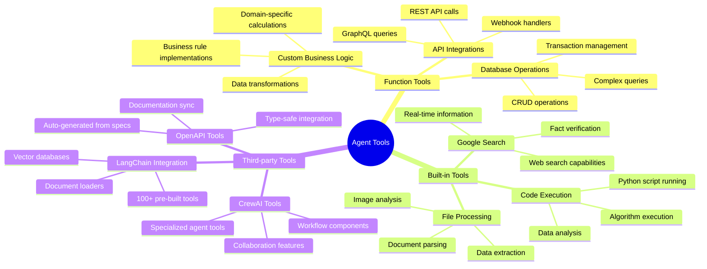

# Chapter 5: Tools - Extending Agent Capabilities

> *"An intelligent agent without tools is like a brilliant mind without hands - full of ideas but unable to act upon them."* - The Tool Philosophy

## Why This Chapter Matters: From Thinking to Doing

Your agents can now think intelligently. But thinking without action is just expensive meditation. Tools are what transform your intelligent agents from consultants who give advice into autonomous systems that can actually execute business processes.

In this chapter, you'll master the art of tool creation - from simple utility functions to complex third-party integrations that connect your agents to the entire digital ecosystem of your business.

**The Promise:** By the end of this chapter, you'll know how to create tools that can interact with any API, database, or business system, turning your agents into powerful automation engines.

---

## The Tool Ecosystem: Your Agent's Digital Toolkit

### Understanding Tool Categories

Think of tools as specialized skills your agents can learn. Just like hiring different specialists for your team, you equip agents with different types of tools:



### The Anatomy of a Powerful Tool

A well-designed tool has five key characteristics:

1. **Single Responsibility** - Does one thing exceptionally well
2. **Clear Interface** - Obvious inputs and outputs
3. **Robust Error Handling** - Graceful failure modes
4. **Business Context** - Understands the domain it serves
5. **Composability** - Works well with other tools

---

## Advanced Function Tools: Beyond the Basics

### Building Production-Grade Business Tools

Let's build a sophisticated CRM integration tool that demonstrates enterprise-level patterns:

```python
import asyncio
import aiohttp
import logging
from typing import Dict, List, Optional, Union
from dataclasses import dataclass
from google.adk.tools import ToolContext
from google.adk.tools import FunctionTool

# Configure logging
logger = logging.getLogger(__name__)

@dataclass
class CustomerRecord:
    """Structured customer data."""
    customer_id: str
    email: str
    company: str
    status: str
    lifetime_value: float
    last_interaction: str
    tags: List[str]

class CRMIntegration:
    """Enterprise CRM integration with advanced patterns."""
    
    def __init__(self, base_url: str, api_key: str):
        self.base_url = base_url
        self.api_key = api_key
        self.session = None
    
    async def __aenter__(self):
        """Async context manager for connection pooling."""
        self.session = aiohttp.ClientSession(
            timeout=aiohttp.ClientTimeout(total=30),
            headers={"Authorization": f"Bearer {self.api_key}"}
        )
        return self
    
    async def __aexit__(self, exc_type, exc_val, exc_tb):
        """Clean up connections."""
        if self.session:
            await self.session.close()
    
    async def search_customers(
        self, 
        query: str,
        filters: Optional[Dict] = None,
        limit: int = 10
    ) -> List[CustomerRecord]:
        """Search customers with advanced filtering."""
        try:
            params = {
                "q": query,
                "limit": limit,
                **(filters or {})
            }
            
            async with self.session.get(f"{self.base_url}/customers/search", params=params) as response:
                if response.status == 200:
                    data = await response.json()
                    return [CustomerRecord(**record) for record in data["customers"]]
                else:
                    logger.error(f"CRM search failed: {response.status}")
                    return []
                    
        except Exception as e:
            logger.error(f"CRM search error: {str(e)}")
            return []

# Global CRM instance (in production, use dependency injection)
crm = CRMIntegration(
    base_url=os.getenv("CRM_BASE_URL"),
    api_key=os.getenv("CRM_API_KEY")
)

async def search_customer_data(
    search_query: str,
    customer_type: str = "all",
    include_inactive: bool = False,
    tool_context: ToolContext = None
) -> Dict:
    """Search customer database with intelligent filtering and caching.
    
    Args:
        search_query: Customer name, email, or company to search for
        customer_type: Filter by customer type (enterprise, smb, individual, all)
        include_inactive: Whether to include inactive customers in results
        
    Returns:
        Dictionary with customer records and business insights
    """
    
    # Input validation
    if not search_query or len(search_query.strip()) < 2:
        return {
            "status": "error",
            "message": "Search query must be at least 2 characters"
        }
    
    # Check cache first (if tool_context available)
    cache_key = f"customer_search:{search_query}:{customer_type}:{include_inactive}"
    if tool_context:
        cached_result = tool_context.state.get(f"temp:{cache_key}")
        if cached_result:
            logger.info(f"Cache hit for customer search: {search_query}")
            return cached_result
    
    try:
        # Build search filters
        filters = {}
        if customer_type != "all":
            filters["type"] = customer_type
        if not include_inactive:
            filters["status"] = "active"
        
        # Perform async search
        async with crm:
            customers = await crm.search_customers(
                query=search_query,
                filters=filters,
                limit=20
            )
        
        if not customers:
            return {
                "status": "success",
                "message": f"No customers found matching '{search_query}'",
                "customers": [],
                "suggestions": [
                    "Try a broader search term",
                    "Check spelling",
                    "Search by email or company name"
                ]
            }
        
        # Analyze results for business insights
        total_value = sum(c.lifetime_value for c in customers)
        avg_value = total_value / len(customers) if customers else 0
        
        # Categorize customers by value
        high_value = [c for c in customers if c.lifetime_value > avg_value * 2]
        enterprise_customers = [c for c in customers if "enterprise" in c.tags]
        
        result = {
            "status": "success",
            "customers": [
                {
                    "id": c.customer_id,
                    "email": c.email,
                    "company": c.company,
                    "status": c.status,
                    "lifetime_value": c.lifetime_value,
                    "last_interaction": c.last_interaction,
                    "tags": c.tags
                }
                for c in customers
            ],
            "analytics": {
                "total_customers": len(customers),
                "total_lifetime_value": total_value,
                "average_value": round(avg_value, 2),
                "high_value_count": len(high_value),
                "enterprise_count": len(enterprise_customers)
            },
            "business_insights": generate_customer_insights(customers)
        }
        
        # Cache the result
        if tool_context:
            tool_context.state[f"temp:{cache_key}"] = result
            
        logger.info(f"Customer search completed: {len(customers)} results for '{search_query}'")
        return result
        
    except Exception as e:
        error_msg = f"Customer search failed: {str(e)}"
        logger.error(error_msg)
        
        return {
            "status": "error", 
            "message": "Customer search temporarily unavailable",
            "error_details": error_msg if tool_context and tool_context.state.get("debug_mode") else None,
            "retry_suggestion": "Please try again in a few moments"
        }

def generate_customer_insights(customers: List[CustomerRecord]) -> List[str]:
    """Generate business insights from customer data."""
    insights = []
    
    if not customers:
        return insights
    
    # Value distribution analysis
    values = [c.lifetime_value for c in customers]
    high_value_threshold = max(values) * 0.8
    high_value_customers = [c for c in customers if c.lifetime_value >= high_value_threshold]
    
    if high_value_customers:
        insights.append(f"{len(high_value_customers)} high-value customers represent significant revenue opportunity")
    
    # Status analysis
    active_customers = [c for c in customers if c.status == "active"]
    if len(active_customers) < len(customers):
        inactive_count = len(customers) - len(active_customers)
        insights.append(f"{inactive_count} inactive customers could be targeted for re-engagement")
    
    # Industry clustering
    companies = [c.company for c in customers]
    if len(set(companies)) < len(companies) * 0.8:
        insights.append("Multiple contacts from same companies - consider account-based approach")
    
    return insights

# Create the tool instance
customer_search_tool = FunctionTool(func=search_customer_data)
```

**Pause and Reflect:** *Notice how this tool goes beyond simple data retrieval. It provides caching, error handling, business insights, and actionable recommendations. This is what separates enterprise-grade tools from basic functions.*

### Tool Composition and Chaining

Build tools that work together intelligently:

```python
async def comprehensive_customer_analysis(
    customer_identifier: str,
    analysis_type: str = "full",
    tool_context: ToolContext = None
) -> Dict:
    """Comprehensive customer analysis using multiple data sources.
    
    Args:
        customer_identifier: Customer ID, email, or company name
        analysis_type: Type of analysis (quick, standard, full, competitive)
        
    Returns:
        Complete customer analysis with actionable insights
    """
    
    # Step 1: Get customer data
    customer_result = await search_customer_data(
        search_query=customer_identifier,
        tool_context=tool_context
    )
    
    if customer_result["status"] != "success" or not customer_result["customers"]:
        return {
            "status": "error",
            "message": f"Could not find customer: {customer_identifier}"
        }
    
    customer = customer_result["customers"][0]
    
    # Step 2: Get interaction history
    interaction_result = await get_customer_interactions(
        customer_id=customer["id"],
        tool_context=tool_context
    )
    
    # Step 3: Analyze communication sentiment
    if interaction_result["status"] == "success":
        sentiment_result = await analyze_communication_sentiment(
            interactions=interaction_result["interactions"],
            tool_context=tool_context
        )
    else:
        sentiment_result = {"status": "error", "message": "No interaction data available"}
    
    # Step 4: Get competitive intelligence (for full analysis)
    competitive_data = {}
    if analysis_type == "full":
        competitive_data = await get_competitive_intelligence(
            company=customer["company"],
            tool_context=tool_context
        )
    
    # Step 5: Generate strategic recommendations
    recommendations = generate_customer_strategy(
        customer_data=customer,
        interactions=interaction_result.get("interactions", []),
        sentiment=sentiment_result.get("overall_sentiment", "neutral"),
        competitive_info=competitive_data
    )
    
    return {
        "status": "success",
        "customer_profile": customer,
        "interaction_summary": interaction_result,
        "sentiment_analysis": sentiment_result,
        "competitive_context": competitive_data,
        "strategic_recommendations": recommendations,
        "analysis_confidence": calculate_analysis_confidence(
            customer, interaction_result, sentiment_result
        )
    }

def generate_customer_strategy(
    customer_data: Dict,
    interactions: List[Dict],
    sentiment: str,
    competitive_info: Dict
) -> List[Dict]:
    """Generate strategic recommendations based on comprehensive analysis."""
    
    recommendations = []
    
    # Revenue opportunity analysis
    if customer_data["lifetime_value"] > 50000:
        recommendations.append({
            "category": "account_growth",
            "priority": "high",
            "action": "Assign dedicated account manager",
            "rationale": f"High-value customer (${customer_data['lifetime_value']:,}) warrants premium service",
            "expected_impact": "15-25% increase in customer lifetime value"
        })
    
    # Sentiment-based recommendations
    if sentiment == "negative":
        recommendations.append({
            "category": "retention_risk",
            "priority": "urgent",
            "action": "Schedule immediate customer success call",
            "rationale": "Negative sentiment indicates churn risk",
            "expected_impact": "Reduce churn probability by 40-60%"
        })
    elif sentiment == "positive":
        recommendations.append({
            "category": "expansion_opportunity", 
            "priority": "medium",
            "action": "Present upsell opportunities",
            "rationale": "Positive sentiment creates favorable conditions for expansion",
            "expected_impact": "20-30% probability of successful upsell"
        })
    
    # Engagement frequency analysis
    recent_interactions = [i for i in interactions if days_since(i["date"]) <= 30]
    if len(recent_interactions) < 2:
        recommendations.append({
            "category": "engagement",
            "priority": "medium", 
            "action": "Increase communication frequency",
            "rationale": "Low engagement may indicate declining relationship",
            "expected_impact": "Improve relationship strength and retention"
        })
    
    return recommendations
```

---

## Built-in Tools Mastery

### Google Search Tool: Real-time Intelligence

Leverage ADK's built-in Google Search for competitive intelligence:

```python
from google.adk.tools import GoogleSearchTool

def create_market_intelligence_agent():
    """Create an agent that provides real-time market intelligence."""
    
    search_tool = GoogleSearchTool()
    
    market_agent = Agent(
        name="market_intelligence_specialist",
        model="gemini-2.0-flash",
        instruction="""
        You are a market intelligence specialist who provides real-time competitive analysis.
        
        When analyzing companies or markets:
        1. Search for recent news and developments
        2. Look for financial performance indicators
        3. Identify key competitive moves
        4. Analyze market trends and sentiment
        5. Provide strategic implications
        
        Structure your analysis:
        - Executive Summary (key findings)
        - Recent Developments (last 30 days)
        - Competitive Landscape
        - Market Trends
        - Strategic Implications
        - Recommended Actions
        
        Always cite sources and provide confidence levels for your analysis.
        """,
        tools=[search_tool, market_analysis_tool]
    )
    
    return market_agent

# Example usage
def analyze_competitor(competitor_name: str) -> Dict:
    """Analyze a competitor using real-time web data."""
    
    search_queries = [
        f"{competitor_name} latest news",
        f"{competitor_name} financial results 2024", 
        f"{competitor_name} product launches",
        f"{competitor_name} market share"
    ]
    
    intelligence = {}
    for query in search_queries:
        results = search_tool.search(query, num_results=5)
        intelligence[query] = process_search_results(results)
    
    return synthesize_competitive_intelligence(intelligence)
```

### Code Execution Tool: Dynamic Analysis

Use the built-in code execution tool for complex calculations:

```python
from google.adk.tools import CodeExecutionTool

def create_financial_analyst_agent():
    """Create an agent that can perform complex financial analysis."""
    
    code_tool = CodeExecutionTool()
    
    return Agent(
        name="quantitative_analyst",
        model="gemini-2.0-flash",
        instruction="""
        You are a quantitative financial analyst who can perform complex calculations.
        
        When asked to analyze financial data:
        1. Use the code execution tool for precise calculations
        2. Implement appropriate statistical models
        3. Generate visualizations when helpful
        4. Validate results with multiple approaches
        5. Explain methodology and assumptions
        
        Available libraries: pandas, numpy, matplotlib, scipy, sklearn
        
        Always show your code and explain your analytical approach.
        """,
        tools=[code_tool, financial_data_tool]
    )

# Example: Portfolio optimization analysis
portfolio_analysis_code = """
import numpy as np
import pandas as pd
from scipy.optimize import minimize

# Portfolio data
returns = np.array([0.12, 0.10, 0.15, 0.08])  # Expected returns
cov_matrix = np.array([
    [0.04, 0.01, 0.02, 0.005],
    [0.01, 0.03, 0.015, 0.004],
    [0.02, 0.015, 0.05, 0.008],
    [0.005, 0.004, 0.008, 0.01]
])

def portfolio_volatility(weights, cov_matrix):
    return np.sqrt(np.dot(weights.T, np.dot(cov_matrix, weights)))

def negative_sharpe(weights, returns, cov_matrix, risk_free_rate=0.02):
    portfolio_return = np.sum(returns * weights)
    portfolio_vol = portfolio_volatility(weights, cov_matrix)
    return -(portfolio_return - risk_free_rate) / portfolio_vol

# Constraints
constraints = ({'type': 'eq', 'fun': lambda x: np.sum(x) - 1})
bounds = tuple((0, 1) for _ in range(len(returns)))

# Optimize
result = minimize(
    negative_sharpe,
    x0=np.array([0.25, 0.25, 0.25, 0.25]),
    args=(returns, cov_matrix),
    method='SLSQP',
    bounds=bounds,
    constraints=constraints
)

optimal_weights = result.x
optimal_return = np.sum(returns * optimal_weights)
optimal_vol = portfolio_volatility(optimal_weights, cov_matrix)
sharpe_ratio = (optimal_return - 0.02) / optimal_vol

print(f"Optimal Portfolio Weights: {optimal_weights}")
print(f"Expected Return: {optimal_return:.2%}")
print(f"Volatility: {optimal_vol:.2%}")
print(f"Sharpe Ratio: {sharpe_ratio:.2f}")
"""
```

---

## Third-Party Integrations: Ecosystem Power

### LangChain Tools Integration

Leverage LangChain's extensive tool ecosystem:

```python
from google.adk.tools import LangChainTool
from langchain.tools import DuckDuckGoSearchRun, WikipediaQueryRun
from langchain.tools.file_management import ReadFileTool, WriteFileTool

def create_research_agent_with_langchain():
    """Create a research agent using LangChain tools."""
    
    # LangChain tools
    web_search = LangChainTool(DuckDuckGoSearchRun())
    wikipedia = LangChainTool(WikipediaQueryRun()) 
    file_reader = LangChainTool(ReadFileTool())
    file_writer = LangChainTool(WriteFileTool())
    
    research_agent = Agent(
        name="research_specialist",
        model="claude-3-sonnet",  # Good for detailed research
        instruction="""
        You are a research specialist who conducts thorough investigations.
        
        Research methodology:
        1. Start with web search for current information
        2. Use Wikipedia for background and foundational knowledge
        3. Read relevant files for internal context
        4. Synthesize findings from multiple sources
        5. Create comprehensive research reports
        
        Always:
        - Verify information across multiple sources
        - Note the currency and reliability of sources
        - Highlight conflicting information or uncertainty
        - Provide balanced analysis with multiple perspectives
        """,
        tools=[web_search, wikipedia, file_reader, file_writer]
    )
    
    return research_agent
```

### OpenAPI Tool Generation

Automatically create tools from API specifications:

```python
from google.adk.tools import OpenAPITool
import yaml

def create_salesforce_integration():
    """Create Salesforce integration from OpenAPI spec."""
    
    # Load Salesforce OpenAPI specification
    with open("salesforce_api_spec.yaml", "r") as f:
        api_spec = yaml.safe_load(f)
    
    # Generate tools from OpenAPI spec
    salesforce_tools = OpenAPITool.from_spec(
        spec=api_spec,
        base_url="https://your-instance.salesforce.com",
        auth_config={
            "type": "oauth2",
            "token_url": "https://login.salesforce.com/services/oauth2/token",
            "client_id": os.getenv("SALESFORCE_CLIENT_ID"),
            "client_secret": os.getenv("SALESFORCE_CLIENT_SECRET")
        }
    )
    
    return Agent(
        name="salesforce_specialist",
        model="gemini-2.0-flash",
        instruction="""
        You are a Salesforce specialist who can manage CRM data effectively.
        
        Available capabilities:
        - Search and retrieve account information
        - Create and update lead records
        - Manage opportunity pipelines
        - Generate sales reports
        - Update contact information
        
        Always:
        - Verify data before making changes
        - Follow company data governance policies
        - Provide clear confirmation of actions taken
        - Handle errors gracefully with helpful messages
        """,
        tools=salesforce_tools
    )

# Example OpenAPI spec snippet for reference
salesforce_spec_example = """
openapi: 3.0.0
info:
  title: Salesforce API
  version: v1
paths:
  /sobjects/Account:
    post:
      summary: Create Account
      requestBody:
        content:
          application/json:
            schema:
              type: object
              properties:
                Name:
                  type: string
                Type:
                  type: string
                Industry:
                  type: string
  /sobjects/Account/{id}:
    get:
      summary: Get Account
      parameters:
        - name: id
          in: path
          required: true
          schema:
            type: string
"""
```

### Custom API Integrations

Build robust integrations with external services:

```python
import aiohttp
import asyncio
from typing import Dict, List, Optional
from dataclasses import dataclass

@dataclass
class APIConfig:
    """Configuration for API integrations."""
    base_url: str
    api_key: str
    timeout: int = 30
    rate_limit: int = 100  # requests per minute
    retry_attempts: int = 3

class RobustAPIIntegration:
    """Production-ready API integration with advanced features."""
    
    def __init__(self, config: APIConfig):
        self.config = config
        self.session = None
        self.rate_limiter = RateLimiter(config.rate_limit)
    
    async def __aenter__(self):
        """Initialize async session."""
        self.session = aiohttp.ClientSession(
            timeout=aiohttp.ClientTimeout(total=self.config.timeout),
            headers={
                "Authorization": f"Bearer {self.config.api_key}",
                "User-Agent": "ADK-Agent/1.0"
            }
        )
        return self
    
    async def __aexit__(self, exc_type, exc_val, exc_tb):
        """Clean up session."""
        if self.session:
            await self.session.close()
    
    async def make_request(
        self, 
        method: str, 
        endpoint: str, 
        data: Optional[Dict] = None,
        params: Optional[Dict] = None
    ) -> Dict:
        """Make API request with rate limiting and retry logic."""
        
        url = f"{self.config.base_url}/{endpoint.lstrip('/')}"
        
        for attempt in range(self.config.retry_attempts):
            try:
                # Rate limiting
                await self.rate_limiter.acquire()
                
                # Make request
                async with self.session.request(
                    method=method,
                    url=url,
                    json=data,
                    params=params
                ) as response:
                    
                    if response.status == 200:
                        return await response.json()
                    elif response.status == 429:  # Rate limited
                        retry_after = int(response.headers.get("Retry-After", 60))
                        await asyncio.sleep(retry_after)
                        continue
                    elif response.status >= 500:  # Server error
                        if attempt < self.config.retry_attempts - 1:
                            await asyncio.sleep(2 ** attempt)  # Exponential backoff
                            continue
                    else:
                        # Client error - don't retry
                        error_text = await response.text()
                        raise APIError(f"API error {response.status}: {error_text}")
                        
            except Exception as e:
                if attempt == self.config.retry_attempts - 1:
                    raise
                await asyncio.sleep(2 ** attempt)
        
        raise APIError("Max retry attempts exceeded")

class RateLimiter:
    """Simple rate limiter for API calls."""
    
    def __init__(self, max_calls_per_minute: int):
        self.max_calls = max_calls_per_minute
        self.calls = []
    
    async def acquire(self):
        """Acquire permission to make API call."""
        now = time.time()
        
        # Remove calls older than 1 minute
        self.calls = [call_time for call_time in self.calls if now - call_time < 60]
        
        # Check if we can make another call
        if len(self.calls) >= self.max_calls:
            sleep_time = 60 - (now - self.calls[0])
            await asyncio.sleep(sleep_time)
            return await self.acquire()
        
        self.calls.append(now)

# Example: Slack integration tool
async def send_slack_notification(
    channel: str,
    message: str,
    urgency: str = "normal",
    tool_context: ToolContext = None
) -> Dict:
    """Send notification to Slack with smart formatting.
    
    Args:
        channel: Slack channel name or ID
        message: Message content to send
        urgency: Notification urgency (low, normal, high, urgent)
        
    Returns:
        Dictionary with send status and message details
    """
    
    config = APIConfig(
        base_url="https://slack.com/api",
        api_key=os.getenv("SLACK_BOT_TOKEN")
    )
    
    # Format message based on urgency
    if urgency == "urgent":
        formatted_message = f"🚨 *URGENT*: {message}"
    elif urgency == "high":
        formatted_message = f"⚠️ *HIGH PRIORITY*: {message}"
    else:
        formatted_message = message
    
    try:
        async with RobustAPIIntegration(config) as api:
            result = await api.make_request(
                method="POST",
                endpoint="chat.postMessage",
                data={
                    "channel": channel,
                    "text": formatted_message,
                    "unfurl_links": True,
                    "unfurl_media": True
                }
            )
            
            if result.get("ok"):
                # Log successful notification
                if tool_context:
                    notifications = tool_context.state.get("notifications_sent", [])
                    notifications.append({
                        "timestamp": datetime.now().isoformat(),
                        "channel": channel,
                        "urgency": urgency,
                        "message_ts": result.get("ts")
                    })
                    tool_context.state["notifications_sent"] = notifications
                
                return {
                    "status": "success",
                    "message": "Notification sent successfully",
                    "slack_timestamp": result.get("ts"),
                    "channel": channel
                }
            else:
                return {
                    "status": "error",
                    "message": f"Slack API error: {result.get('error', 'Unknown error')}"
                }
                
    except Exception as e:
        logger.error(f"Slack notification failed: {str(e)}")
        return {
            "status": "error",
            "message": "Failed to send Slack notification",
            "error_details": str(e)
        }

# Create the tool
slack_notification_tool = FunctionTool(func=send_slack_notification)
```

---

## Tool Security and Authentication

### Secure API Key Management

```python
import os
from cryptography.fernet import Fernet
from google.cloud import secretmanager

class SecureCredentialManager:
    """Secure credential management for production environments."""
    
    def __init__(self):
        self.secret_client = secretmanager.SecretManagerServiceClient()
        self.project_id = os.getenv("GOOGLE_CLOUD_PROJECT")
    
    def get_api_key(self, service_name: str) -> str:
        """Retrieve API key from Google Secret Manager."""
        name = f"projects/{self.project_id}/secrets/{service_name}/versions/latest"
        
        try:
            response = self.secret_client.access_secret_version(request={"name": name})
            return response.payload.data.decode("UTF-8")
        except Exception as e:
            logger.error(f"Failed to retrieve secret for {service_name}: {str(e)}")
            raise SecurityError(f"Could not access credentials for {service_name}")
    
    def validate_api_key(self, api_key: str, service_name: str) -> bool:
        """Validate API key format and basic security checks."""
        
        # Basic validation
        if not api_key or len(api_key) < 10:
            return False
        
        # Service-specific validation
        validators = {
            "openai": lambda key: key.startswith("sk-"),
            "google": lambda key: len(key) == 39,
            "slack": lambda key: key.startswith("xoxb-"),
        }
        
        validator = validators.get(service_name)
        return validator(api_key) if validator else True

# Secure tool wrapper
def secure_tool(tool_func):
    """Decorator to add security validation to tools."""
    
    def wrapper(*args, **kwargs):
        # Validate authentication
        if not validate_user_permissions(kwargs.get("tool_context")):
            return {
                "status": "error",
                "message": "Insufficient permissions for this operation"
            }
        
        # Audit logging
        log_tool_usage(tool_func.__name__, args, kwargs)
        
        # Execute tool
        try:
            result = tool_func(*args, **kwargs)
            log_tool_result(tool_func.__name__, result)
            return result
        except Exception as e:
            log_tool_error(tool_func.__name__, str(e))
            raise
    
    return wrapper

@secure_tool
def sensitive_database_operation(query: str, tool_context: ToolContext) -> Dict:
    """Example of a secured database operation."""
    # Tool implementation with security wrapper
    pass
```

### Input Validation and Sanitization

```python
import re
from typing import Any, Dict, List
from html import escape

class InputValidator:
    """Comprehensive input validation for tool security."""
    
    @staticmethod
    def sanitize_sql_input(input_string: str) -> str:
        """Sanitize input to prevent SQL injection."""
        # Remove potentially dangerous SQL keywords
        dangerous_patterns = [
            r"(\b(DROP|DELETE|UPDATE|INSERT|ALTER|CREATE|EXEC|UNION)\b)",
            r"(--|#|/\*|\*/)",
            r"(\b(OR|AND)\s+\d+\s*=\s*\d+)",
        ]
        
        sanitized = input_string
        for pattern in dangerous_patterns:
            sanitized = re.sub(pattern, "", sanitized, flags=re.IGNORECASE)
        
        return sanitized.strip()
    
    @staticmethod
    def validate_email(email: str) -> bool:
        """Validate email format."""
        pattern = r"^[a-zA-Z0-9._%+-]+@[a-zA-Z0-9.-]+\.[a-zA-Z]{2,}$"
        return re.match(pattern, email) is not None
    
    @staticmethod
    def sanitize_html_input(input_string: str) -> str:
        """Sanitize HTML input to prevent XSS."""
        return escape(input_string)
    
    @staticmethod
    def validate_file_path(file_path: str, allowed_directories: List[str]) -> bool:
        """Validate file path to prevent directory traversal."""
        # Normalize path
        normalized_path = os.path.normpath(file_path)
        
        # Check for directory traversal attempts
        if ".." in normalized_path:
            return False
        
        # Check if path is within allowed directories
        for allowed_dir in allowed_directories:
            if normalized_path.startswith(allowed_dir):
                return True
        
        return False

def validated_file_operation(
    file_path: str,
    operation: str,
    data: str = "",
    tool_context: ToolContext = None
) -> Dict:
    """File operation with comprehensive validation."""
    
    # Define allowed directories
    allowed_dirs = [
        "/app/user_uploads",
        "/app/reports", 
        "/app/temp"
    ]
    
    # Validate file path
    if not InputValidator.validate_file_path(file_path, allowed_dirs):
        return {
            "status": "error",
            "message": "File path not allowed or potentially dangerous"
        }
    
    # Validate operation
    allowed_operations = ["read", "write", "append"]
    if operation not in allowed_operations:
        return {
            "status": "error",
            "message": f"Operation '{operation}' not allowed"
        }
    
    # Sanitize data for write operations
    if operation in ["write", "append"] and data:
        data = InputValidator.sanitize_html_input(data)
    
    try:
        # Perform file operation
        if operation == "read":
            with open(file_path, "r") as f:
                content = f.read()
            return {"status": "success", "content": content}
        
        elif operation == "write":
            with open(file_path, "w") as f:
                f.write(data)
            return {"status": "success", "message": "File written successfully"}
        
        elif operation == "append":
            with open(file_path, "a") as f:
                f.write(data)
            return {"status": "success", "message": "Data appended successfully"}
            
    except Exception as e:
        logger.error(f"File operation failed: {str(e)}")
        return {
            "status": "error",
            "message": "File operation failed",
            "error_type": type(e).__name__
        }
```

---

## Performance and Optimization

### Async Tool Patterns

```python
import asyncio
from concurrent.futures import ThreadPoolExecutor
from typing import List, Dict, Coroutine

async def parallel_data_gathering(
    data_sources: List[str],
    query: str,
    tool_context: ToolContext = None
) -> Dict:
    """Gather data from multiple sources in parallel for speed.
    
    Args:
        data_sources: List of data source names to query
        query: Search query to execute across all sources
        
    Returns:
        Dictionary with results from all data sources
    """
    
    # Create tasks for parallel execution
    tasks = []
    
    for source in data_sources:
        if source == "crm":
            tasks.append(search_customer_data(query, tool_context=tool_context))
        elif source == "support":
            tasks.append(search_support_tickets(query, tool_context=tool_context))
        elif source == "sales":
            tasks.append(search_sales_data(query, tool_context=tool_context))
        elif source == "marketing":
            tasks.append(search_marketing_data(query, tool_context=tool_context))
    
    # Execute all tasks in parallel
    try:
        results = await asyncio.gather(*tasks, return_exceptions=True)
        
        # Process results
        compiled_results = {}
        for i, result in enumerate(results):
            source = data_sources[i]
            if isinstance(result, Exception):
                compiled_results[source] = {
                    "status": "error",
                    "message": f"Failed to query {source}: {str(result)}"
                }
            else:
                compiled_results[source] = result
        
        # Generate insights from combined data
        insights = generate_cross_platform_insights(compiled_results)
        
        return {
            "status": "success",
            "query": query,
            "sources_queried": data_sources,
            "results": compiled_results,
            "cross_platform_insights": insights,
            "execution_time": time.time() - start_time
        }
        
    except Exception as e:
        logger.error(f"Parallel data gathering failed: {str(e)}")
        return {
            "status": "error",
            "message": "Failed to gather data from multiple sources",
            "error_details": str(e)
        }

# Tool for CPU-intensive operations
def cpu_intensive_analysis(
    data: List[Dict],
    analysis_type: str,
    tool_context: ToolContext = None
) -> Dict:
    """Perform CPU-intensive analysis using thread pool."""
    
    def analyze_chunk(chunk: List[Dict]) -> Dict:
        """Analyze a chunk of data in a separate thread."""
        # CPU-intensive processing here
        return perform_statistical_analysis(chunk, analysis_type)
    
    # Split data into chunks for parallel processing
    chunk_size = len(data) // 4  # Use 4 threads
    chunks = [data[i:i + chunk_size] for i in range(0, len(data), chunk_size)]
    
    # Use thread pool for CPU-bound tasks
    with ThreadPoolExecutor(max_workers=4) as executor:
        futures = [executor.submit(analyze_chunk, chunk) for chunk in chunks]
        
        # Collect results
        results = []
        for future in futures:
            try:
                result = future.result(timeout=30)
                results.append(result)
            except Exception as e:
                logger.error(f"Analysis chunk failed: {str(e)}")
                results.append({"status": "error", "message": str(e)})
    
    # Combine results
    return combine_analysis_results(results)
```

### Caching and Memoization

```python
import hashlib
import json
import time
from functools import wraps
from typing import Dict, Any, Optional

class ToolCache:
    """Intelligent caching system for tool results."""
    
    def __init__(self, default_ttl: int = 300):  # 5 minutes default
        self.cache = {}
        self.default_ttl = default_ttl
    
    def get_cache_key(self, func_name: str, args: tuple, kwargs: dict) -> str:
        """Generate cache key from function name and arguments."""
        # Create deterministic hash from arguments
        args_str = json.dumps([args, kwargs], sort_keys=True, default=str)
        args_hash = hashlib.md5(args_str.encode()).hexdigest()
        return f"{func_name}:{args_hash}"
    
    def get(self, key: str) -> Optional[Any]:
        """Get cached result if not expired."""
        if key in self.cache:
            result, timestamp, ttl = self.cache[key]
            if time.time() - timestamp < ttl:
                return result
            else:
                # Remove expired entry
                del self.cache[key]
        return None
    
    def set(self, key: str, value: Any, ttl: Optional[int] = None) -> None:
        """Cache result with TTL."""
        ttl = ttl or self.default_ttl
        self.cache[key] = (value, time.time(), ttl)
    
    def invalidate_pattern(self, pattern: str) -> None:
        """Invalidate cache entries matching pattern."""
        keys_to_remove = [key for key in self.cache.keys() if pattern in key]
        for key in keys_to_remove:
            del self.cache[key]

# Global cache instance
tool_cache = ToolCache()

def cached_tool(ttl: int = 300):
    """Decorator to cache tool results."""
    
    def decorator(func):
        @wraps(func)
        async def async_wrapper(*args, **kwargs):
            # Generate cache key
            cache_key = tool_cache.get_cache_key(func.__name__, args, kwargs)
            
            # Try to get from cache
            cached_result = tool_cache.get(cache_key)
            if cached_result is not None:
                logger.info(f"Cache hit for {func.__name__}")
                return cached_result
            
            # Execute function
            result = await func(*args, **kwargs)
            
            # Cache successful results
            if isinstance(result, dict) and result.get("status") == "success":
                tool_cache.set(cache_key, result, ttl)
                logger.info(f"Cached result for {func.__name__}")
            
            return result
        
        @wraps(func)
        def sync_wrapper(*args, **kwargs):
            # Similar logic for synchronous functions
            cache_key = tool_cache.get_cache_key(func.__name__, args, kwargs)
            
            cached_result = tool_cache.get(cache_key)
            if cached_result is not None:
                return cached_result
            
            result = func(*args, **kwargs)
            
            if isinstance(result, dict) and result.get("status") == "success":
                tool_cache.set(cache_key, result, ttl)
            
            return result
        
        # Return appropriate wrapper based on function type
        if asyncio.iscoroutinefunction(func):
            return async_wrapper
        else:
            return sync_wrapper
    
    return decorator

# Example usage
@cached_tool(ttl=600)  # Cache for 10 minutes
async def expensive_market_analysis(
    symbol: str,
    analysis_type: str,
    tool_context: ToolContext = None
) -> Dict:
    """Expensive market analysis with caching."""
    
    # Simulate expensive computation
    await asyncio.sleep(2)  # Simulate API calls and processing
    
    # Perform actual analysis
    result = perform_complex_market_analysis(symbol, analysis_type)
    
    return {
        "status": "success",
        "symbol": symbol,
        "analysis": result,
        "timestamp": time.time(),
        "cache_info": "Fresh analysis"
    }
```

---

## Chapter Wrap-Up: Tool Mastery Achieved

You've now mastered the full spectrum of tool development - from simple functions to complex enterprise integrations. Your agents can now interact with any system, API, or data source in your business ecosystem.

**Key Takeaways:**

- **Function tools** handle custom business logic with enterprise-grade patterns
- **Built-in tools** provide powerful capabilities like search and code execution
- **Third-party integrations** unlock entire ecosystems of functionality  
- **Security and validation** protect against common vulnerabilities
- **Performance optimization** ensures tools scale with your business
- **Caching and async patterns** maximize efficiency and user experience

**Your Tool Mastery Checklist:**

✅ Can create tools that handle errors gracefully?  
✅ Do your tools provide business insights, not just data?  
✅ Are your tools secure against common attack vectors?  
✅ Do your tools cache results for better performance?  
✅ Can your tools work together in composition patterns?  
✅ Do your tools provide clear success/failure feedback?  

**The Next Level:** In Chapter 6, we'll explore Workflow Agents - how to orchestrate multiple agents and tools in sophisticated automation patterns that can handle complex business processes.

---

## Your 24-Hour Challenge: Build a Business Integration Suite

**Challenge:** Create a suite of integrated tools for a common business process (sales, marketing, support, etc.)

**Requirements:**
- At least 4 interconnected tools that can work together
- Real API integration (use testing/sandbox APIs)
- Comprehensive error handling and validation
- Caching for performance optimization
- Security measures for sensitive operations
- Tool composition that provides business insights

**Example Ideas:**
- **Sales Pipeline Manager**: CRM integration, lead scoring, proposal generation, follow-up automation
- **Marketing Intelligence**: Campaign analytics, competitor monitoring, content optimization, social media integration
- **Support Automation**: Ticket management, knowledge base search, escalation routing, customer satisfaction tracking

**Success Criteria:**
- Tools work individually and in composition
- Real business value demonstrated through automation
- Production-ready code quality
- Clear documentation and usage examples

**Bonus Challenge:**
- Implement tool analytics and usage tracking
- Add A/B testing capabilities for tool effectiveness
- Create a dashboard showing tool performance metrics

---

*Next Chapter Preview: "Workflow Agents: Orchestrating Complex Tasks" - Where we'll learn to coordinate multiple agents and tools in sophisticated automation workflows that can handle even the most complex business processes.*

**Quick Self-Check:**

1. What are the five characteristics of a well-designed tool?
2. How do you implement secure authentication for API tools?
3. What's the difference between async and sync tool patterns?
4. How do you cache tool results effectively?

*(Reflection: 1. Single responsibility, clear interface, error handling, business context, composability 2. Use credential managers, validate inputs, implement rate limiting, audit access 3. Async enables parallelism and non-blocking operations 4. Cache successful results with TTL, invalidate on data changes, use deterministic keys)*
