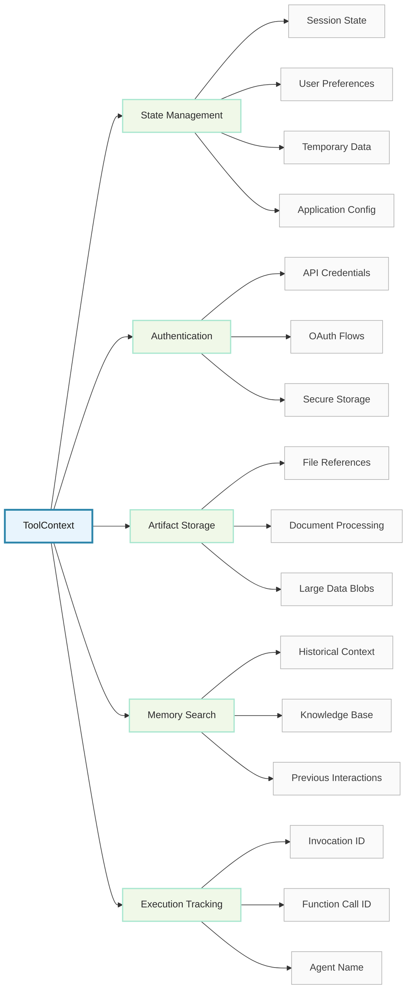

# Chapter 5: Tools - Extending Agent Capabilities

> *"An intelligent agent without tools is like a brilliant mind without hands - full of ideas but unable to act upon them."* - The Tool Philosophy

## Why This Chapter Matters: From Thinking to Doing

Your agents can now think intelligently. But thinking without action is just expensive meditation. Tools are what transform your intelligent agents from consultants who give advice into autonomous systems that can actually execute business processes.

In this chapter, you'll master the art of tool creation - from simple utility functions to complex third-party integrations that connect your agents to the entire digital ecosystem of your business.

**The Promise:** By the end of this chapter, you'll know how to create tools that can interact with any API, database, or business system, turning your agents into powerful automation engines.

---

## The Tool Ecosystem: Your Agent's Digital Toolkit

### Understanding the Three Types of Tools

Google ADK provides three distinct categories of tools, each serving different purposes and having unique characteristics. Understanding these categories is crucial for building effective agent systems.

#### Overview: The Tool Ecosystem


#### 1. Built-in Tools (Google/Gemini Native)

Built-in tools are **executed directly within the Gemini model** and provide native capabilities with optimized performance.


**Key Characteristics:**
- **Execution Location**: Inside Gemini model infrastructure
- **Performance**: Optimized for speed and integration
- **Setup**: No local configuration required
- **Limitation**: ⚠️ **Only ONE built-in tool per agent**

#### 2. Custom Function Tools (Your Business Logic)

Custom function tools are **Python functions you create** that run in your local environment, giving you complete control over functionality.


**Key Characteristics:**
- **Execution Location**: Your local Python environment
- **Flexibility**: Full control over implementation
- **Integration**: Can connect to any API or system
- **Limitation**: ✅ **No quantity limits - use as many as needed**

#### 3. Third-party Integrations (External Ecosystems)

Third-party tools leverage existing libraries and frameworks, providing access to extensive tool ecosystems.


**Key Characteristics:**
- **Execution Location**: Wrapped external libraries
- **Ecosystem**: Access to hundreds of pre-built tools
- **Maintenance**: Community-maintained and updated
- **Integration**: Seamless integration with ADK agents

### Choosing the Right Tool Type

| **Requirement** | **Built-in Tools** | **Custom Function Tools** | **Third-party Tools** |
|-----------------|-------------------|---------------------------|----------------------|
| **Speed** | ⭐⭐⭐ Fastest | ⭐⭐ Fast | ⭐⭐ Fast |
| **Flexibility** | ⭐ Limited | ⭐⭐⭐ Maximum | ⭐⭐ High |
| **Quantity** | ⚠️ One per agent | ✅ Unlimited | ✅ Unlimited |
| **Setup Complexity** | ⭐⭐⭐ Minimal | ⭐⭐ Moderate | ⭐ Complex |
| **Maintenance** | ⭐⭐⭐ Google managed | ⭐ You maintain | ⭐⭐ Community |
| **Business Logic** | ❌ Not possible | ⭐⭐⭐ Perfect | ⭐⭐ Possible |

**Decision Matrix:**
- **Use Built-in Tools** when you need web search, code execution, or enterprise search with maximum performance
- **Use Custom Function Tools** for business-specific logic, proprietary APIs, or complex integrations
- **Use Third-party Tools** to leverage existing ecosystems and avoid reinventing common functionality

### 🚨 Critical: Built-in vs Custom Tools - Understanding the Limitations

**This is one of the most important concepts in Google ADK tool usage.** The distinction between built-in and custom tools directly affects how you architect your agent systems.

#### Built-in Tools (Google/Gemini Native Tools)

These are tools that run **inside the Gemini model itself**, not in your local code:

```python
from google.adk.tools import google_search, VertexAiSearchTool
from google.adk.code_executors import BuiltInCodeExecutor

# Built-in tools - these run INSIDE the Gemini model
built_in_tools = [
    google_search,              # Google Search (web grounding)
    VertexAiSearchTool(...),   # Vertex AI Search
    # BuiltInCodeExecutor is used as executor, not tool
]
```

**Key Characteristics:**

- Execute within the Gemini model infrastructure
- No local code execution required
- Optimized for speed and integration
- **LIMITATION: Only ONE built-in tool per agent**

#### Custom Tools (Function Tools)

These are tools you create that run in **your local environment**:

```python
from google.adk.tools import FunctionTool

# Custom tools - these run in YOUR code
def search_database(query: str) -> Dict:
    # Your code here
    return {"results": [...]}

def send_email(to: str, subject: str, body: str) -> Dict:
    # Your code here
    return {"status": "sent"}

def calculate_roi(investment: float, returns: float) -> Dict:
    # Your code here
    return {"roi": returns / investment}

# Multiple custom tools are allowed
custom_tools = [
    FunctionTool(func=search_database),
    FunctionTool(func=send_email),
    FunctionTool(func=calculate_roi),
    # You can have as many as needed
]
```

**Key Characteristics:**

- Execute in your local Python environment
- Full control over implementation
- Can integrate with any API or system
- **NO LIMITATION: Multiple custom tools per agent allowed**

#### The Critical Limitation Explained

```python
# ❌ THIS WILL FAIL - Multiple built-in tools
agent_fails = LlmAgent(
    name="failing_agent",
    model="gemini-2.0-flash",
    tools=[
        google_search,              # Built-in tool #1
        VertexAiSearchTool(...),   # Built-in tool #2 - ERROR!
    ]
)
# Error: "Google search tool can not be used with other tools in Gemini 1.x/2.x"

# ✅ THIS WORKS - Multiple custom tools
agent_works = LlmAgent(
    name="working_agent", 
    model="gemini-2.0-flash",
    tools=[
        FunctionTool(func=search_database),    # Custom tool #1
        FunctionTool(func=send_email),         # Custom tool #2  
        FunctionTool(func=calculate_roi),      # Custom tool #3
        # Add as many custom tools as needed
    ]
)

# ✅ THIS ALSO WORKS - One built-in + multiple custom
agent_mixed = LlmAgent(
    name="mixed_agent",
    model="gemini-2.0-flash",
    tools=[
        google_search,                         # One built-in tool
        FunctionTool(func=search_database),    # Custom tool #1
        FunctionTool(func=send_email),         # Custom tool #2
    ]
)
```

#### Why This Limitation Exists

The limitation exists because:

1. **Model Architecture**: Built-in tools are deeply integrated into Gemini's inference pipeline
2. **Resource Management**: Each built-in tool requires dedicated model resources
3. **Conflict Prevention**: Multiple built-in tools can interfere with each other's grounding
4. **Performance Optimization**: Single built-in tool ensures optimal response times

#### The Workaround: Multi-Agent Architecture

When you need multiple built-in tools, use separate agents connected via `AgentTool`:

```python
from google.adk.tools import AgentTool

# Agent 1: Google Search specialist
search_agent = LlmAgent(
    name="search_specialist",
    model="gemini-2.0-flash",
    instruction="You are a web search specialist. Use Google Search to find current information.",
    tools=[google_search]  # One built-in tool
)

# Agent 2: Code execution specialist  
code_agent = LlmAgent(
    name="code_specialist",
    model="gemini-2.0-flash",
    instruction="You are a code execution specialist. Write and run Python code for analysis.",
    executor=[BuiltInCodeExecutor]  # Code executor (not a tool)
)

# Agent 3: Data specialist with Vertex AI Search
data_agent = LlmAgent(
    name="data_specialist", 
    model="gemini-2.0-flash",
    instruction="You are a data specialist. Search our knowledge base for relevant information.",
    tools=[VertexAiSearchTool(...)]  # Different built-in tool
)

# Main orchestrator agent with access to all capabilities
main_agent = LlmAgent(
    name="orchestrator",
    model="gemini-2.0-flash",
    instruction="""
    You coordinate multiple specialists to handle complex requests.
    
    Available specialists:
    - search_specialist: For web search and current information
    - code_specialist: For data analysis and calculations  
    - data_specialist: For internal knowledge base queries
    
    Delegate tasks to appropriate specialists and synthesize their responses.
    """,
    tools=[
        AgentTool(agent=search_agent),    # Wrap agents as tools
        AgentTool(agent=code_agent),
        AgentTool(agent=data_agent),
        FunctionTool(func=send_email),    # Plus custom tools
        FunctionTool(func=calculate_roi),
    ]
)
```

This pattern gives you access to **all built-in tools** while respecting the limitations, plus unlimited custom tools for your business logic.

### The Anatomy of a Powerful Tool

A well-designed tool has five key characteristics:

1. **Single Responsibility** - Does one thing exceptionally well
2. **Clear Interface** - Obvious inputs and outputs
3. **Robust Error Handling** - Graceful failure modes
4. **Business Context** - Understands the domain it serves
5. **Composability** - Works well with other tools

---

## Advanced Function Tools: Beyond the Basics

### Building Production-Grade Business Tools

Let's build a sophisticated CRM integration tool that demonstrates enterprise-level patterns:

```python
import asyncio
import aiohttp
import logging
from typing import Dict, List, Optional
from dataclasses import dataclass
from google.adk.tools import ToolContext
from google.adk.tools import FunctionTool

# Configure logging
logger = logging.getLogger(__name__)

@dataclass
class CustomerRecord:
    """Structured customer data."""
    customer_id: str
    email: str
    company: str
    status: str
    lifetime_value: float
    last_interaction: str
    tags: List[str]

class CRMIntegration:
    """Enterprise CRM integration with advanced patterns."""
    
    def __init__(self, base_url: str, api_key: str):
        self.base_url = base_url
        self.api_key = api_key
        self.session = None
    
    async def __aenter__(self):
        """Async context manager for connection pooling."""
        self.session = aiohttp.ClientSession(
            timeout=aiohttp.ClientTimeout(total=30),
            headers={"Authorization": f"Bearer {self.api_key}"}
        )
        return self
    
    async def __aexit__(self, exc_type, exc_val, exc_tb):
        """Clean up connections."""
        if self.session:
            await self.session.close()
    
    async def search_customers(
        self, 
        query: str,
        filters: Optional[Dict] = None,
        limit: int = 10
    ) -> List[CustomerRecord]:
        """Search customers with advanced filtering."""
        try:
            params = {
                "q": query,
                "limit": limit,
                **(filters or {})
            }
            
            async with self.session.get(f"{self.base_url}/customers/search", params=params) as response:
                if response.status == 200:
                    data = await response.json()
                    return [CustomerRecord(**record) for record in data["customers"]]
                else:
                    logger.error(f"CRM search failed: {response.status}")
                    return []
                    
        except Exception as e:
            logger.error(f"CRM search error: {str(e)}")
            return []

# Global CRM instance (in production, use dependency injection)
crm = CRMIntegration(
    base_url=os.getenv("CRM_BASE_URL"),
    api_key=os.getenv("CRM_API_KEY")
)

async def search_customer_data(
    search_query: str,
    customer_type: str = "all",
    include_inactive: bool = False,
    tool_context: ToolContext = None
) -> Dict:
    """Search customer database with intelligent filtering and caching.
    
    Args:
        search_query: Customer name, email, or company to search for
        customer_type: Filter by customer type (enterprise, smb, individual, all)
        include_inactive: Whether to include inactive customers in results
        
    Returns:
        Dictionary with customer records and business insights
    """
    
    # Input validation
    if not search_query or len(search_query.strip()) < 2:
        return {
            "status": "error",
            "message": "Search query must be at least 2 characters"
        }
    
    # Check cache first (if tool_context available)
    cache_key = f"customer_search:{search_query}:{customer_type}:{include_inactive}"
    if tool_context:
        cached_result = tool_context.state.get(f"temp:{cache_key}")
        if cached_result:
            logger.info(f"Cache hit for customer search: {search_query}")
            return cached_result
    
    try:
        # Build search filters
        filters = {}
        if customer_type != "all":
            filters["type"] = customer_type
        if not include_inactive:
            filters["status"] = "active"
        
        # Perform async search
        async with crm:
            customers = await crm.search_customers(
                query=search_query,
                filters=filters,
                limit=20
            )
        
        if not customers:
            return {
                "status": "success",
                "message": f"No customers found matching '{search_query}'",
                "customers": [],
                "suggestions": [
                    "Try a broader search term",
                    "Check spelling",
                    "Search by email or company name"
                ]
            }
        
        # Analyze results for business insights
        total_value = sum(c.lifetime_value for c in customers)
        avg_value = total_value / len(customers) if customers else 0
        
        # Categorize customers by value
        high_value = [c for c in customers if c.lifetime_value > avg_value * 2]
        enterprise_customers = [c for c in customers if "enterprise" in c.tags]
        
        result = {
            "status": "success",
            "customers": [
                {
                    "id": c.customer_id,
                    "email": c.email,
                    "company": c.company,
                    "status": c.status,
                    "lifetime_value": c.lifetime_value,
                    "last_interaction": c.last_interaction,
                    "tags": c.tags
                }
                for c in customers
            ],
            "analytics": {
                "total_customers": len(customers),
                "total_lifetime_value": total_value,
                "average_value": round(avg_value, 2),
                "high_value_count": len(high_value),
                "enterprise_count": len(enterprise_customers)
            },
            "business_insights": generate_customer_insights(customers)
        }
        
        # Cache the result
        if tool_context:
            tool_context.state[f"temp:{cache_key}"] = result
            
        logger.info(f"Customer search completed: {len(customers)} results for '{search_query}'")
        return result
        
    except Exception as e:
        error_msg = f"Customer search failed: {str(e)}"
        logger.error(error_msg)
        
        return {
            "status": "error", 
            "message": "Customer search temporarily unavailable",
            "error_details": error_msg if tool_context and tool_context.state.get("debug_mode") else None,
            "retry_suggestion": "Please try again in a few moments"
        }

def generate_customer_insights(customers: List[CustomerRecord]) -> List[str]:
    """Generate business insights from customer data."""
    insights = []
    
    if not customers:
        return insights
    
    # Value distribution analysis
    values = [c.lifetime_value for c in customers]
    high_value_threshold = max(values) * 0.8
    high_value_customers = [c for c in customers if c.lifetime_value >= high_value_threshold]
    
    if high_value_customers:
        insights.append(f"{len(high_value_customers)} high-value customers represent significant revenue opportunity")
    
    # Status analysis
    active_customers = [c for c in customers if c.status == "active"]
    if len(active_customers) < len(customers):
        inactive_count = len(customers) - len(active_customers)
        insights.append(f"{inactive_count} inactive customers could be targeted for re-engagement")
    
    # Industry clustering
    companies = [c.company for c in customers]
    if len(set(companies)) < len(companies) * 0.8:
        insights.append("Multiple contacts from same companies - consider account-based approach")
    
    return insights

# Create the tool instance
customer_search_tool = FunctionTool(func=search_customer_data)
```

**Pause and Reflect:** *Notice how this tool goes beyond simple data retrieval. It provides caching, error handling, business insights, and actionable recommendations. This is what separates enterprise-grade tools from basic functions.*

### Mastering ToolContext: The Foundation of Smart Tools 🎯

Every function tool receives a `ToolContext` object that provides access to the entire execution environment. Understanding and leveraging ToolContext is what separates basic tools from intelligent, context-aware business systems.

#### Understanding ToolContext Architecture



#### State Management: Data Flow Across Tools

The most powerful aspect of ToolContext is its ability to maintain state across tool executions, creating intelligent workflows:

```python
from google.adk.tools import ToolContext, FunctionTool
from typing import Dict, List, Optional

async def analyze_customer_journey(
    customer_id: str,
    tool_context: ToolContext
) -> Dict:
    """Multi-step customer analysis with state management."""
    
    # Step 1: Check if we already have cached analysis
    cache_key = f"customer_analysis:{customer_id}"
    cached_result = tool_context.state.get(f"temp:{cache_key}")
    if cached_result:
        return {
            "status": "success",
            "source": "cache",
            "analysis": cached_result,
            "invocation_id": tool_context.invocation_id
        }
    
    # Step 2: Start analysis pipeline - save progress to state
    tool_context.state["temp:analysis_stage"] = "data_collection"
    tool_context.state["temp:current_customer"] = customer_id
    
    # Step 3: Collect customer data (this could fail, state helps recovery)
    try:
        customer_data = await fetch_customer_profile(customer_id)
        tool_context.state["temp:customer_profile"] = customer_data
        tool_context.state["temp:analysis_stage"] = "interaction_analysis"
        
        # Step 4: Analyze interaction history
        interactions = await fetch_customer_interactions(customer_id)
        tool_context.state["temp:interactions"] = interactions
        tool_context.state["temp:analysis_stage"] = "sentiment_analysis"
        
        # Step 5: Perform sentiment analysis
        sentiment_scores = analyze_interaction_sentiment(interactions)
        tool_context.state["temp:sentiment_data"] = sentiment_scores
        tool_context.state["temp:analysis_stage"] = "insights_generation"
        
        # Step 6: Generate business insights
        insights = generate_business_insights(customer_data, interactions, sentiment_scores)
        
        # Step 7: Cache the complete analysis
        complete_analysis = {
            "customer_profile": customer_data,
            "interaction_summary": interactions,
            "sentiment_analysis": sentiment_scores,
            "business_insights": insights,
            "analysis_timestamp": datetime.now().isoformat(),
            "confidence_score": calculate_confidence(customer_data, interactions)
        }
        
        tool_context.state[f"temp:{cache_key}"] = complete_analysis
        tool_context.state["temp:analysis_stage"] = "completed"
        
        return {
            "status": "success",
            "source": "fresh_analysis",
            "analysis": complete_analysis,
            "execution_context": {
                "invocation_id": tool_context.invocation_id,
                "function_call_id": tool_context.function_call_id,
                "agent_name": tool_context.agent_name
            }
        }
        
    except Exception as e:
        # Save error state for debugging and recovery
        error_stage = tool_context.state.get("temp:analysis_stage", "unknown")
        tool_context.state["temp:last_error"] = {
            "stage": error_stage,
            "error": str(e),
            "customer_id": customer_id,
            "timestamp": datetime.now().isoformat()
        }
        
        return {
            "status": "error",
            "message": f"Analysis failed at stage: {error_stage}",
            "recoverable_data": {
                "customer_profile": tool_context.state.get("temp:customer_profile"),
                "interactions": tool_context.state.get("temp:interactions")
            }
        }

async def resume_failed_analysis(tool_context: ToolContext) -> Dict:
    """Resume analysis from where it failed using state."""
    
    error_data = tool_context.state.get("temp:last_error")
    if not error_data:
        return {"status": "error", "message": "No failed analysis to resume"}
    
    failed_stage = error_data["stage"]
    customer_id = error_data["customer_id"]
    
    # Resume from the appropriate stage
    if failed_stage == "interaction_analysis":
        customer_data = tool_context.state.get("temp:customer_profile")
        if customer_data:
            # Continue from interaction analysis
            return await analyze_customer_journey(customer_id, tool_context)
    
    return {"status": "error", "message": f"Cannot resume from stage: {failed_stage}"}
```

#### Smart State Prefixes: Organizing Data Intelligently

Use state prefixes to organize data by scope and lifecycle:

```python
def manage_customer_preferences(
    customer_id: str,
    preference_type: str,
    value: str,
    tool_context: ToolContext
) -> Dict:
    """Demonstrate intelligent state organization with prefixes."""
    
    # Different state scopes for different use cases
    state_keys = {
        # User-level preferences (persist across sessions)
        "user_pref": f"user:{customer_id}:preferences:{preference_type}",
        
        # Application-level configuration (shared across users)
        "app_config": f"app:preference_defaults:{preference_type}",
        
        # Session-specific data (current conversation only)
        "session_data": f"session:customer_context:{customer_id}",
        
        # Temporary data (current invocation only)
        "temp_data": f"temp:preference_update:{preference_type}:{datetime.now().isoformat()}"
    }
    
    # Save user preference
    tool_context.state[state_keys["user_pref"]] = {
        "value": value,
        "updated_at": datetime.now().isoformat(),
        "updated_by": tool_context.agent_name
    }
    
    # Update session context
    session_context = tool_context.state.get(state_keys["session_data"], {})
    session_context[f"last_preference_update"] = preference_type
    tool_context.state[state_keys["session_data"]] = session_context
    
    # Log temporary operation data
    tool_context.state[state_keys["temp_data"]] = {
        "operation": "preference_update",
        "invocation_id": tool_context.invocation_id,
        "function_call_id": tool_context.function_call_id
    }
    
    return {
        "status": "success",
        "message": f"Updated {preference_type} preference for customer {customer_id}",
        "state_keys_used": state_keys,
        "execution_context": {
            "invocation_id": tool_context.invocation_id,
            "agent_name": tool_context.agent_name
        }
    }

def get_customer_context(
    customer_id: str,
    tool_context: ToolContext
) -> Dict:
    """Retrieve comprehensive customer context from all state scopes."""
    
    # Gather data from different state scopes
    user_preferences = {}
    for key in tool_context.state.keys():
        if key.startswith(f"user:{customer_id}:preferences:"):
            pref_type = key.split(":")[-1]
            user_preferences[pref_type] = tool_context.state[key]
    
    session_context = tool_context.state.get(f"session:customer_context:{customer_id}", {})
    
    # Get application defaults
    app_defaults = {}
    for key in tool_context.state.keys():
        if key.startswith("app:preference_defaults:"):
            pref_type = key.split(":")[-1]
            app_defaults[pref_type] = tool_context.state[key]
    
    return {
        "customer_id": customer_id,
        "user_preferences": user_preferences,
        "session_context": session_context,
        "application_defaults": app_defaults,
        "context_metadata": {
            "retrieved_at": datetime.now().isoformat(),
            "invocation_id": tool_context.invocation_id,
            "total_preference_keys": len(user_preferences)
        }
    }
```

#### Advanced Authentication Patterns with ToolContext

Handle secure API access with intelligent credential management:

```python
from google.adk.auth import AuthConfig
from typing import Optional

# Define authentication configurations
SALESFORCE_AUTH = AuthConfig(
    name="salesforce_api",
    auth_type="oauth2",
    client_id=os.getenv("SALESFORCE_CLIENT_ID"),
    scopes=["api", "refresh_token"]
)

SLACK_AUTH = AuthConfig(
    name="slack_bot",
    auth_type="api_key",
    description="Slack Bot Token for notifications"
)

async def secure_salesforce_integration(
    query: str,
    operation: str = "search",
    tool_context: ToolContext
) -> Dict:
    """Demonstrate advanced authentication patterns with ToolContext."""
    
    auth_state_key = "user:salesforce_credential"
    
    # Step 1: Check for existing credential
    stored_credential = tool_context.state.get(auth_state_key)
    
    if not stored_credential:
        # Step 2: Request authentication
        try:
            tool_context.request_credential(SALESFORCE_AUTH)
            
            # Store auth request metadata for tracking
            tool_context.state["temp:auth_request"] = {
                "service": "salesforce",
                "requested_at": datetime.now().isoformat(),
                "function_call_id": tool_context.function_call_id,
                "invocation_id": tool_context.invocation_id
            }
            
            return {
                "status": "auth_required",
                "message": "Salesforce authentication required",
                "auth_config": SALESFORCE_AUTH.name,
                "next_steps": "Please complete OAuth flow to continue"
            }
            
        except ValueError as e:
            return {
                "status": "error",
                "message": f"Authentication setup error: {str(e)}"
            }
    
    # Step 3: Use credential for API calls
    try:
        # Retrieve the credential (may be from previous turn or just completed)
        auth_response = tool_context.get_auth_response(SALESFORCE_AUTH)
        
        if auth_response and auth_response.access_token:
            # Update stored credential
            credential_data = {
                "access_token": auth_response.access_token,
                "refresh_token": getattr(auth_response, 'refresh_token', None),
                "expires_at": datetime.now() + timedelta(hours=1),  # Typical OAuth expiry
                "updated_at": datetime.now().isoformat()
            }
            tool_context.state[auth_state_key] = credential_data
            
            # Perform the actual Salesforce operation
            api_result = await call_salesforce_api(
                query=query,
                operation=operation,
                access_token=auth_response.access_token
            )
            
            # Update usage statistics
            usage_key = "app:salesforce_api_usage"
            usage_stats = tool_context.state.get(usage_key, {"total_calls": 0, "last_call": None})
            usage_stats["total_calls"] += 1
            usage_stats["last_call"] = datetime.now().isoformat()
            tool_context.state[usage_key] = usage_stats
            
            return {
                "status": "success",
                "operation": operation,
                "query": query,
                "results": api_result,
                "api_usage": usage_stats,
                "execution_context": {
                    "invocation_id": tool_context.invocation_id,
                    "function_call_id": tool_context.function_call_id
                }
            }
        else:
            return {
                "status": "error",
                "message": "Failed to retrieve valid authentication credentials"
            }
            
    except Exception as e:
        # Handle authentication errors gracefully
        error_msg = str(e)
        
        # Clear potentially invalid credentials
        if "unauthorized" in error_msg.lower() or "expired" in error_msg.lower():
            tool_context.state[auth_state_key] = None
            
        return {
            "status": "error",
            "message": f"Salesforce API error: {error_msg}",
            "suggestion": "Authentication may have expired. Try again to re-authenticate."
        }

async def call_salesforce_api(query: str, operation: str, access_token: str) -> Dict:
    """Simulate Salesforce API call."""
    # This would be your actual Salesforce API integration
    await asyncio.sleep(0.1)  # Simulate API call
    return {
        "query": query,
        "operation": operation,
        "results": ["Sample Salesforce Record 1", "Sample Salesforce Record 2"],
        "total_found": 2
    }

# Multi-service authentication management
async def manage_multi_service_auth(
    services: List[str],
    tool_context: ToolContext
) -> Dict:
    """Manage authentication for multiple services intelligently."""
    
    auth_configs = {
        "salesforce": SALESFORCE_AUTH,
        "slack": SLACK_AUTH
    }
    
    authentication_status = {}
    
    for service in services:
        if service not in auth_configs:
            authentication_status[service] = {
                "status": "error",
                "message": f"Unknown service: {service}"
            }
            continue
        
        auth_key = f"user:{service}_credential"
        stored_cred = tool_context.state.get(auth_key)
        
        if stored_cred:
            # Check if credential is still valid
            if service == "salesforce":
                expires_at = stored_cred.get("expires_at")
                if expires_at and datetime.fromisoformat(expires_at) > datetime.now():
                    authentication_status[service] = {"status": "authenticated", "expires_at": expires_at}
                else:
                    authentication_status[service] = {"status": "expired", "needs_refresh": True}
            else:
                authentication_status[service] = {"status": "authenticated"}
        else:
            authentication_status[service] = {"status": "not_authenticated", "needs_auth": True }
    
    return {
        "services_checked": services,
        "authentication_status": authentication_status,
        "summary": {
            "authenticated": sum(1 for s in authentication_status.values() if s["status"] == "authenticated"),
            "needs_auth": sum(1 for s in authentication_status.values() if s.get("needs_auth")),
            "expired": sum(1 for s in authentication_status.values() if s["status"] == "expired")
        }
    }
```

#### Execution Tracking and Debugging

ToolContext provides powerful debugging capabilities:

```python
def create_debug_enabled_tool(
    operation: str,
    tool_context: ToolContext
) -> Dict:
    """Tool with comprehensive debugging and tracking."""
    
    # Execution context for debugging
    execution_context = {
        "invocation_id": tool_context.invocation_id,
        "function_call_id": tool_context.function_call_id,
        "agent_name": tool_context.agent_name,
        "operation": operation,
        "started_at": datetime.now().isoformat()
    }
    
    # Save execution start for tracking
    tool_context.state[f"temp:execution_start:{tool_context.function_call_id}"] = execution_context
    
    try:
        # Simulate tool operation
        result = perform_business_operation(operation)
        
        # Update execution context with success
        execution_context.update({
            "status": "success",
            "completed_at": datetime.now().isoformat(),
            "duration_ms": (datetime.now() - datetime.fromisoformat(execution_context["started_at"])).total_seconds() * 1000
        })
        
        # Save execution history
        history_key = "app:tool_execution_history"
        history = tool_context.state.get(history_key, [])
        history.append(execution_context)
        # Keep only last 100 executions
        tool_context.state[history_key] = history[-100:]
        
        return {
            "status": "success",
            "operation": operation,
            "result": result,
            "execution_context": execution_context
        }
        
    except Exception as e:
        # Update execution context with error
        execution_context.update({
            "status": "error",
            "error": str(e),
            "failed_at": datetime.now().isoformat()
        })
        
        # Save error for analysis
        error_key = f"temp:execution_error:{tool_context.function_call_id}"
        tool_context.state[error_key] = execution_context
        
        return {
            "status": "error",
            "operation": operation,
            "error": str(e),
            "execution_context": execution_context,
            "debug_info": {
                "invocation_id": tool_context.invocation_id,
                "function_call_id": tool_context.function_call_id,
                "agent_name": tool_context.agent_name
            }
        }

def get_execution_analytics(tool_context: ToolContext) -> Dict:
    """Analyze tool execution patterns and performance."""
    
    history = tool_context.state.get("app:tool_execution_history", [])
    
    if not history:
        return {"message": "No execution history available"}
    
    # Analyze performance patterns
    successful_executions = [h for h in history if h["status"] == "success"]
    failed_executions = [h for h in history if h["status"] == "error"]
    
    # Calculate average duration for successful operations
    avg_duration = 0
    if successful_executions:
        durations = [h.get("duration_ms", 0) for h in successful_executions]
        avg_duration = sum(durations) / len(durations)
    
    # Group by operation type
    operations = {}
    for h in history:
        op = h["operation"]
        if op not in operations:
            operations[op] = {"count": 0, "success": 0, "errors": 0}
        operations[op]["count"] += 1
        if h["status"] == "success":
            operations[op]["success"] += 1
        else:
            operations[op]["errors"] += 1
    
    return {
        "total_executions": len(history),
        "success_rate": len(successful_executions) / len(history) * 100,
        "average_duration_ms": round(avg_duration, 2),
        "operations_breakdown": operations,
        "recent_errors": failed_executions[-5:],  # Last 5 errors
        "performance_insights": generate_performance_insights(history)
    }

def generate_performance_insights(history: List[Dict]) -> List[str]:
    """Generate actionable performance insights."""
    insights = []
    
    if not history:
        return insights
    
    # Error rate analysis
    error_rate = len([h for h in history if h["status"] == "error"]) / len(history)
    if error_rate > 0.1:  # More than 10% error rate
        insights.append(f"High error rate detected: {error_rate:.1%}. Consider reviewing error handling.")
    
    # Performance analysis
    successful = [h for h in history if h["status"] == "success" and "duration_ms" in h]
    if successful:
        durations = [h["duration_ms"] for h in successful]
        avg_duration = sum(durations) / len(durations)
        if avg_duration > 5000:  # More than 5 seconds
            insights.append(f"Average execution time is high: {avg_duration:.0f}ms. Consider optimization.")
    
    # Usage pattern analysis
    operations = {}
    for h in history:
        op = h["operation"]
        operations[op] = operations.get(op, 0) + 1
    
    if operations:
        most_used = max(operations, key=operations.get)
        insights.append(f"Most frequently used operation: {most_used} ({operations[most_used]} times)")
    
    return insights

def perform_business_operation(operation: str) -> Dict:
    """Simulate business operation."""
    # This would be your actual business logic
    import random
    
    if random.random() < 0.1:  # 10% chance of error for demo
        raise Exception(f"Simulated error in operation: {operation}")
    
    return {
        "operation": operation,
        "data": f"Result data for {operation}",
        "timestamp": datetime.now().isoformat()
    }
```

---

## Working with Built-in Tools

### Google Search Tool: Real-time Intelligence

Leverage ADK's built-in Google Search for competitive intelligence:

```python
from google.adk.tools import google_search
from google.adk.agents import LlmAgent

def create_market_intelligence_agent():
    """Create an agent that provides real-time market intelligence."""
    
    # Note: google_search is a pre-built tool instance
    market_agent = LlmAgent(
        name="market_intelligence_specialist",
        model="gemini-2.0-flash",
        instruction="""
        You are a market intelligence specialist who provides real-time competitive analysis.
        
        When analyzing companies or markets:
        1. Search for recent news and developments
        2. Look for financial performance indicators
        3. Identify key competitive moves
        4. Analyze market trends and sentiment
        5. Provide strategic implications
        
        Structure your analysis:
        - Executive Summary (key findings)
        - Recent Developments (last 30 days)
        - Competitive Landscape
        - Market Trends
        - Strategic Implications
        - Recommended Actions
        
        Always cite sources and provide confidence levels for your analysis.
        
        IMPORTANT: When you receive Search suggestions in your response, you must 
        display them to users as required by Google's grounding policy.
        """,
        tools=[google_search]  # Only one built-in tool allowed per agent
    )
    
    return market_agent

# Example usage
def analyze_competitor(competitor_name: str) -> Dict:
    """Analyze a competitor using real-time web data."""
    
    search_queries = [
        f"{competitor_name} latest news",
        f"{competitor_name} financial results 2024", 
        f"{competitor_name} product launches",
        f"{competitor_name} market share"
    ]
    
    intelligence = {}
    for query in search_queries:
        results = search_tool.search(query, num_results=5)
        intelligence[query] = process_search_results(results)
    
    return synthesize_competitive_intelligence(intelligence)
```

### Code Execution Tool: Dynamic Analysis

Use the built-in code execution tool for complex calculations:

```python
from google.adk.code_executors import BuiltInCodeExecutor
from google.adk.agents import LlmAgent

def create_financial_analyst_agent():
    """Create an agent that can perform complex financial analysis."""
    
    return LlmAgent(
        name="quantitative_analyst",
        model="gemini-2.0-flash",
        instruction="""
        You are a quantitative financial analyst who can perform complex calculations.
        
        When asked to analyze financial data:
        1. Write and execute Python code for precise calculations
        2. Implement appropriate statistical models
        3. Generate visualizations when helpful
        4. Validate results with multiple approaches
        5. Explain methodology and assumptions
        
        Available libraries: pandas, numpy, matplotlib, scipy, sklearn
        
        Always show your code and explain your analytical approach.
        """,
        executor=[BuiltInCodeExecutor],  # Use executor, not tools
        description="Executes Python code to perform financial calculations."
    )

# Example: Portfolio optimization analysis
portfolio_analysis_code = """
import numpy as np
import pandas as pd
from scipy.optimize import minimize

# Portfolio data
returns = np.array([0.12, 0.10, 0.15, 0.08])  # Expected returns
cov_matrix = np.array([
    [0.04, 0.01, 0.02, 0.005],
    [0.01, 0.03, 0.015, 0.004],
    [0.02, 0.015, 0.05, 0.008],
    [0.005, 0.004, 0.008, 0.01]
])

def portfolio_volatility(weights, cov_matrix):
    return np.sqrt(np.dot(weights.T, np.dot(cov_matrix, weights)))

def negative_sharpe(weights, returns, cov_matrix, risk_free_rate=0.02):
    portfolio_return = np.sum(returns * weights)
    portfolio_vol = portfolio_volatility(weights, cov_matrix)
    return -(portfolio_return - risk_free_rate) / portfolio_vol

# Constraints
constraints = ({'type': 'eq', 'fun': lambda x: np.sum(x) - 1})
bounds = tuple((0, 1) for _ in range(len(returns)))

# Optimize
result = minimize(
    negative_sharpe,
    x0=np.array([0.25, 0.25, 0.25, 0.25]),
    args=(returns, cov_matrix),
    method='SLSQP',
    bounds=bounds,
    constraints=constraints
)

optimal_weights = result.x
optimal_return = np.sum(returns * optimal_weights)
optimal_vol = portfolio_volatility(optimal_weights, cov_matrix)
sharpe_ratio = (optimal_return - 0.02) / optimal_vol

print(f"Optimal Portfolio Weights: {optimal_weights}")
print(f"Expected Return: {optimal_return:.2%}")
print(f"Volatility: {optimal_vol:.2%}")
print(f"Sharpe Ratio: {sharpe_ratio:.2f}")
"""
```

---

## Third-Party Integrations: Ecosystem Power

### LangChain Tools Integration

Leverage LangChain's extensive tool ecosystem:

```python
from google.adk.tools.langchain_tool import LangchainTool  # Note: lowercase 'c'
from google.adk.agents import LlmAgent
from langchain_community.tools import DuckDuckGoSearchRun, WikipediaQueryRun
from langchain.tools.file_management import ReadFileTool, WriteFileTool

def create_research_agent_with_langchain():
    """Create a research agent using LangChain tools."""
    
    # LangChain tools - wrap each individually
    web_search = LangchainTool(tool=DuckDuckGoSearchRun())
    wikipedia = LangchainTool(tool=WikipediaQueryRun()) 
    file_reader = LangchainTool(tool=ReadFileTool())
    file_writer = LangchainTool(tool=WriteFileTool())
    
    research_agent = LlmAgent(
        name="research_specialist",
        model="gemini-2.0-flash",  # Note: Claude not available in ADK
        instruction="""
        You are a research specialist who conducts thorough investigations.
        
        Research methodology:
        1. Start with web search for current information
        2. Use Wikipedia for background and foundational knowledge
        3. Read relevant files for internal context
        4. Synthesize findings from multiple sources
        5. Create comprehensive research reports
        
        Always:
        - Verify information across multiple sources
        - Note the currency and reliability of sources
        - Highlight conflicting information or uncertainty
        - Provide balanced analysis with multiple perspectives
        """,
        tools=[web_search, wikipedia, file_reader, file_writer]
    )
    
    return research_agent
```

### Vertex AI Search Tool: Enterprise Knowledge Base

Leverage Vertex AI Search for internal knowledge base queries and document retrieval:

```python
from google.adk.tools import VertexAiSearchTool
from google.adk.agents import LlmAgent
import os

def create_knowledge_base_agent():
    """Create an agent that can search enterprise knowledge base using Vertex AI Search."""
    
    # Configure Vertex AI Search tool
    vertex_search_tool = VertexAiSearchTool(
        project_id=os.getenv("GOOGLE_CLOUD_PROJECT"),
        location="global",  # or your specific location
        data_store_id=os.getenv("VERTEX_AI_SEARCH_DATASTORE_ID"),
        serving_config_id="default_config"  # or your custom serving config
    )
    
    knowledge_agent = LlmAgent(
        name="knowledge_specialist",
        model="gemini-2.0-flash",
        instruction="""
        You are a knowledge management specialist with access to our enterprise knowledge base.
        
        When users ask questions:
        1. Search the knowledge base for relevant information
        2. Synthesize information from multiple sources if needed
        3. Provide accurate, contextual answers
        4. Cite specific documents and sections when possible
        5. Indicate confidence level in your responses
        
        Knowledge base contains:
        - Company policies and procedures
        - Technical documentation
        - Product specifications
        - Training materials
        - Best practices and guidelines
        - Historical project data
        
        Always:
        - Verify information currency and relevance
        - Provide specific document references
        - Note any limitations or exceptions
        - Suggest related resources when helpful
        """,
        tools=[vertex_search_tool]  # Only one built-in tool allowed per agent
    )
    
    return knowledge_agent

# Advanced Vertex AI Search configuration
def create_advanced_knowledge_agent():
    """Create an advanced knowledge agent with custom search configuration."""
    
    # Advanced configuration with custom parameters
    advanced_search_tool = VertexAiSearchTool(
        project_id=os.getenv("GOOGLE_CLOUD_PROJECT"),
        location="us-central1",
        data_store_id=os.getenv("VERTEX_AI_SEARCH_DATASTORE_ID"),
        serving_config_id="advanced_config",
        # Additional configuration for enterprise needs
        max_results=10,
        include_citations=True,
        enable_spell_check=True
    )
    
    return LlmAgent(
        name="advanced_knowledge_specialist",
        model="gemini-2.0-flash",
        instruction="""
        You are an advanced knowledge management specialist with sophisticated search capabilities.
        
        Search Strategy:
        1. Use structured queries with filters when appropriate
        2. Prioritize recent and authoritative documents
        3. Cross-reference multiple sources for accuracy
        4. Identify knowledge gaps and suggest improvements
        
        Response Format:
        - Executive Summary
        - Detailed Answer with Sources
        - Related Resources
        - Confidence Assessment
        - Knowledge Gap Analysis (if applicable)
        
        Quality Assurance:
        - Always cite document titles, sections, and last updated dates
        - Flag outdated information (>2 years old)
        - Note conflicting information from different sources
        - Provide actionable next steps when relevant
        """,
        tools=[advanced_search_tool]
    )

# Example: Enterprise policy lookup
def create_policy_specialist_agent():
    """Create a specialized agent for company policy queries."""
    
    policy_search = VertexAiSearchTool(
        project_id=os.getenv("GOOGLE_CLOUD_PROJECT"),
        location="global",
        data_store_id=os.getenv("POLICY_DATASTORE_ID"),
        serving_config_id="policy_config"
    )
    
    return LlmAgent(
        name="policy_specialist",
        model="gemini-2.0-flash",
        instruction="""
        You are a company policy specialist who helps employees understand and apply policies.
        
        When answering policy questions:
        1. Search for the most current policy documents
        2. Provide clear, actionable guidance
        3. Cite specific policy sections and effective dates
        4. Explain implications and exceptions
        5. Direct users to appropriate contacts for complex cases
        
        Response Structure:
        ## Policy Answer
        [Clear, direct answer to the question]
        
        ## Policy Details
        - Policy: [Policy Name and Section]
        - Effective Date: [Date]
        - Key Requirements: [Bullet points]
        
        ## Important Notes
        [Any exceptions, special cases, or updates]
        
        ## Next Steps
        [Who to contact for additional questions]
        """,
        tools=[policy_search]
    )
```

**Best Practices for Vertex AI Search Implementation:**

1. **Data Store Configuration**:
   - Organize documents by category (policies, procedures, technical docs)
   - Maintain consistent metadata (author, department, last_updated)
   - Implement regular content audits and updates
   - Use structured document formats when possible

2. **Search Quality Optimization**:
   - Configure appropriate filters for different content types
   - Set up boost specifications for authoritative sources
   - Implement freshness boosting for time-sensitive content
   - Configure synonyms for domain-specific terminology

3. **Security & Access Control**:
   - Configure appropriate access controls for sensitive documents
   - Implement audit logging for compliance requirements
   - Use project-level and data store-level permissions
   - Regular security reviews of access patterns

4. **Performance Monitoring**:
   - Monitor query latency and response times
   - Track search quality metrics regularly
   - Implement feedback loops for continuous improvement
   - Regular performance testing under different loads

**Example Use Cases:**

- **HR Policy Queries**: "What is our vacation policy for remote employees?"
- **Technical Documentation**: "How do we implement OAuth2 in our microservices?"
- **Compliance Questions**: "What are the data retention requirements for customer data?"
- **Process Guidance**: "What is the approval process for new vendor contracts?"

### Custom API Integrations

Build robust integrations with external services:

```python
import aiohttp
import asyncio
import time
from typing import Dict, List, Optional
from dataclasses import dataclass

@dataclass
class APIConfig:
    """Configuration for API integrations."""
    base_url: str
    api_key: str
    timeout: int = 30
    rate_limit: int = 100  # requests per minute
    retry_attempts: int = 3

class RobustAPIIntegration:
    """Production-ready API integration with advanced features."""
    
    def __init__(self, config: APIConfig):
        self.config = config
        self.session = None
        self.rate_limiter = RateLimiter(config.rate_limit)
    
    async def __aenter__(self):
        """Initialize async session."""
        self.session = aiohttp.ClientSession(
            timeout=aiohttp.ClientTimeout(total=self.config.timeout),
            headers={
                "Authorization": f"Bearer {self.config.api_key}",
                "User-Agent": "ADK-Agent/1.0"
            }
        )
        return self
    
    async def __aexit__(self, exc_type, exc_val, exc_tb):
        """Clean up session."""
        if self.session:
            await self.session.close()
    
    async def make_request(
        self, 
        method: str, 
        endpoint: str, 
        data: Optional[Dict] = None,
        params: Optional[Dict] = None
    ) -> Dict:
        """Make API request with rate limiting and retry logic."""
        
        url = f"{self.config.base_url}/{endpoint.lstrip('/')}"
        
        for attempt in range(self.config.retry_attempts):
            try:
                # Rate limiting
                await self.rate_limiter.acquire()
                
                # Make request
                async with self.session.request(
                    method=method,
                    url=url,
                    json=data,
                    params=params
                ) as response:
                    
                    if response.status == 200:
                        return await response.json()
                    elif response.status == 429:  # Rate limited
                        retry_after = int(response.headers.get("Retry-After", 60))
                        await asyncio.sleep(retry_after)
                        continue
                    elif response.status >= 500:  # Server error
                        if attempt < self.config.retry_attempts - 1:
                            await asyncio.sleep(2 ** attempt)  # Exponential backoff
                            continue
                    else:
                        # Client error - don't retry
                        error_text = await response.text()
                        raise Exception(f"API error {response.status}: {error_text}")
                        
            except Exception as e:
                if attempt == self.config.retry_attempts - 1:
                    raise
                await asyncio.sleep(2 ** attempt)
        
        raise Exception("Max retry attempts exceeded")

class RateLimiter:
    """Simple rate limiter for API calls."""
    
    def __init__(self, max_calls_per_minute: int):
        self.max_calls = max_calls_per_minute
        self.calls = []
    
    async def acquire(self):
        """Acquire permission to make API call."""
        now = time.time()
        
        # Remove calls older than 1 minute
        self.calls = [call_time for call_time in self.calls if now - call_time < 60]
        
        # Check if we can make another call
        if len(self.calls) >= self.max_calls:
            sleep_time = 60 - (now - self.calls[0])
            await asyncio.sleep(sleep_time)
            return await self.acquire()
        
        self.calls.append(now)

# Example: Slack integration tool
async def send_slack_notification(
    channel: str,
    message: str,
    urgency: str = "normal",
    tool_context = None
) -> Dict:
    """Send notification to Slack with smart formatting."""
    
    config = APIConfig(
        base_url="https://slack.com/api",
        api_key=os.getenv("SLACK_BOT_TOKEN")
    )
    
    # Format message based on urgency
    if urgency == "urgent":
        formatted_message = f"🚨 *URGENT*: {message}"
    elif urgency == "high":
        formatted_message = f"⚠️ *HIGH PRIORITY*: {message}"
    else:
        formatted_message = message
    
    try:
        async with RobustAPIIntegration(config) as api:
            result = await api.make_request(
                method="POST",
                endpoint="chat.postMessage",
                data={
                    "channel": channel,
                    "text": formatted_message,
                    "unfurl_links": True,
                    "unfurl_media": True
                }
            )
            
            if result.get("ok"):
                return {
                    "status": "success",
                    "message": "Notification sent successfully",
                    "slack_timestamp": result.get("ts"),
                    "channel": channel
                }
            else:
                return {
                    "status": "error",
                    "message": f"Slack API error: {result.get('error', 'Unknown error')}"
                }
                
    except Exception as e:
        return {
            "status": "error",
            "message": "Failed to send Slack notification",
            "error_details": str(e)
        }

# Create the tool
from google.adk.tools import FunctionTool
slack_notification_tool = FunctionTool(func=send_slack_notification)
```

---

## Built-in Tools Mastery

### Critical Built-in Tools Limitations ⚠️

**Important**: Before using built-in tools, understand these critical limitations:

1. **One Built-in Tool Per Agent**: Currently, each agent can only use ONE built-in tool
2. **No Mixing with Other Built-in Tools**: Multiple built-in tools cannot be used in the same agent
3. **Custom Tools Are Compatible**: Built-in tools can be combined with custom function tools

**Workaround Pattern**: Use separate agents for different built-in tools and connect them via `AgentTool`:

```python
from google.adk.tools import google_search, AgentTool
from google.adk.code_executors import BuiltInCodeExecutor
from google.adk.agents import LlmAgent

# Separate agents for each built-in tool
search_agent = LlmAgent(
    model='gemini-2.0-flash',
    name='SearchAgent',
    instruction="You're a specialist in Google Search",
    tools=[google_search],  # Only one built-in tool
)

coding_agent = LlmAgent(
    model='gemini-2.0-flash', 
    name='CodeAgent',
    instruction="You're a specialist in Code Execution",
    executor=[BuiltInCodeExecutor],  # Use executor for code
)

# Root agent that can use both via delegation
root_agent = LlmAgent(
    name="RootAgent",
    model="gemini-2.0-flash",
    instruction="Root Agent that coordinates search and coding tasks",
    tools=[
        AgentTool(agent=search_agent), 
        AgentTool(agent=coding_agent)
    ]
)
```

---

## Chapter Wrap-Up: Tool Mastery Achieved

You've now mastered the full spectrum of tool development - from simple functions to complex enterprise integrations. Your agents can now interact with any system, API, or data source in your business ecosystem.

### Key Takeaways

- **Built-in tools** provide powerful capabilities like search, code execution, and enterprise search with optimal performance
- **Custom function tools** handle unlimited business logic with enterprise-grade patterns  
- **Third-party integrations** unlock entire ecosystems of functionality
- **ToolContext mastery** enables intelligent state management, authentication, and execution tracking
- **Artifact management** handles documents and files with sophisticated processing workflows
- **Memory-enabled tools** provide contextual learning and personalized experiences
- **Security and validation** protect against common vulnerabilities
- **Performance optimization** ensures tools scale with your business
- **Caching and async patterns** maximize efficiency and user experience

### Your Tool Mastery Checklist

✅ Can create tools that handle errors gracefully?  
✅ Do your tools provide business insights, not just data?  
✅ Are your tools secure against common attack vectors?  
✅ Do your tools cache results effectively?  
✅ Can your tools work together in composition patterns?  
✅ Do your tools provide clear success/failure feedback?  
✅ Do you leverage ToolContext for state management across tool executions?  
✅ Are your tools context-aware and personalized based on history?  
✅ Do your tools handle authentication and credentials securely?  
✅ Can your tools process documents and manage artifacts effectively?  
✅ Do your tools learn from memory and past interactions?  
✅ Are your tools equipped with comprehensive debugging and tracking?

### The Architecture Patterns You've Learned

1. **Single-Agent Pattern**: One agent with multiple custom tools
2. **Multi-Agent Pattern**: Specialized agents connected via AgentTool
3. **Hybrid Pattern**: Built-in tools combined with custom tools
4. **Enterprise Pattern**: Production-grade tools with caching, error handling, and monitoring

### Security Best Practices

- Always validate and sanitize inputs
- Use environment variables for sensitive credentials
- Implement proper error handling without exposing internal details
- Add rate limiting and request throttling
- Audit tool usage and maintain access logs
- Regularly update dependencies and security patches

---

## Your 24-Hour Challenge: Build a Business Integration Suite

**Challenge**: Create a suite of integrated tools for a common business process (sales, marketing, support, etc.)

### Requirements

- At least 4 interconnected tools that can work together
- Real API integration (use testing/sandbox APIs)
- Comprehensive error handling and validation
- Caching for performance optimization
- Security measures for sensitive operations
- Tool composition that provides business insights

### Example Ideas

- **Sales Pipeline Manager**: CRM integration, lead scoring, proposal generation, follow-up automation
- **Marketing Intelligence**: Campaign analytics, competitor monitoring, content optimization, social media integration
- **Support Automation**: Ticket management, knowledge base search, escalation routing, customer satisfaction tracking

### Success Criteria

- Tools work individually and in composition
- Real business value demonstrated through automation
- Production-ready code quality
- Clear documentation and usage examples

### Bonus Challenge

- Implement tool analytics and usage tracking
- Add A/B testing capabilities for tool effectiveness
- Create a dashboard showing tool performance metrics

---

## Next Chapter Preview: "Workflow Agents: Orchestrating Complex Tasks"

In Chapter 6, we'll explore how to coordinate multiple agents and tools in sophisticated automation workflows that can handle even the most complex business processes. You'll learn:

- **Workflow orchestration patterns** for multi-step business processes
- **State management** across complex agent interactions
- **Error recovery and retry strategies** for robust automation
- **Performance monitoring and optimization** at scale
- **Enterprise deployment patterns** for production environments

---

## Quick Self-Check

1. What are the five characteristics of a well-designed tool?
2. How do you implement secure authentication for API tools?
3. What's the difference between async and sync tool patterns?
4. How do you cache tool results effectively?

*(Reflection: 1. Single responsibility, clear interface, error handling, business context, composability 2. Use credential managers, validate inputs, implement rate limiting, audit access 3. Async enables parallelism and non-blocking operations 4. Cache successful results with TTL, invalidate on data changes, use deterministic keys)*

---

## 📋 Summary of Achievements in This Chapter

### 🟢 What You've Mastered

1. **Three Types of Tools**: Complete understanding of built-in, custom, and third-party tools
2. **Enterprise-Grade Patterns**: Production-ready tools with proper error handling, caching, and security
3. **All Built-in Tools**: Google Search, Code Execution, and Vertex AI Search implementations
4. **Advanced Integrations**: Complex API integrations with rate limiting and retry logic
5. **Tool Composition**: Building tools that work together intelligently
6. **ToolContext Mastery**: State management, authentication, and execution tracking
7. **Artifact Management**: Document processing and file handling workflows
8. **Memory-Enabled Tools**: Context-aware tools that learn from past interactions
9. **Security Best Practices**: Protecting against common vulnerabilities and attack vectors
10. **Performance Optimization**: Scalable tools with caching and async patterns

### 🔧 Tools in Your Arsenal

- **Google Search**: Real-time web intelligence and competitive analysis
- **Code Execution**: Dynamic calculations and data analysis
- **Vertex AI Search**: Enterprise knowledge base and document retrieval
- **Custom Functions**: Unlimited business logic and API integrations
- **LangChain Integration**: Access to 100+ pre-built community tools
- **Context-Aware Tools**: State management and cross-tool data sharing
- **Authentication Tools**: Secure credential management and OAuth flows
- **Document Processors**: Artifact-based file handling and processing pipelines
- **Memory-Enabled Support**: Learning tools that improve over time
- **Robust API Clients**: Production-ready integrations with error handling

### 🚀 Ready for the Next Level

You're now equipped to build sophisticated agent systems that can interact with any business system, API, or data source. Your agents have evolved from simple chatbots to powerful automation engines capable of executing complex business processes.

**Next stop**: Workflow orchestration and multi-agent coordination!