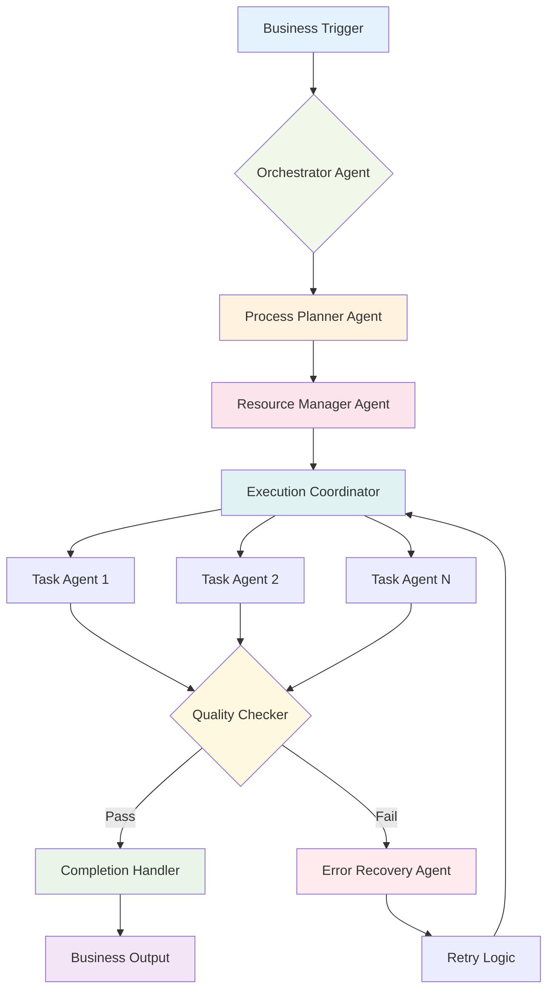
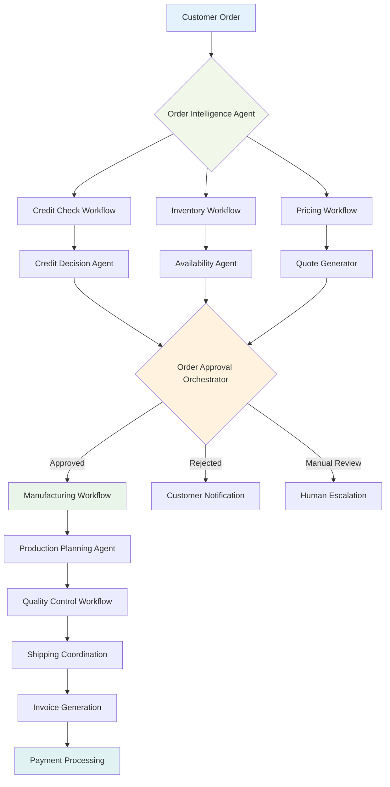

# Chapter 6: Workflow Agents - Orchestrating Complex Business Processes

> *"The magic happens when individual agents stop being tools and start being team members in a choreographed business process."* - Enterprise ADK Architecture

## Why Workflow Agents Will Transform Your Business Operations

Imagine walking into your office and discovering that your most complex, multi-step business processes are running themselves. Purchase orders are being processed, approved, and fulfilled without human intervention. Employee onboarding workflows are adapting in real-time based on role requirements and department policies. Compliance reports are being generated, reviewed, and submitted automatically.

This isn't automation in the traditional sense - it's **intelligent orchestration**. Workflow agents don't just follow predefined steps; they make decisions, adapt to changing conditions, and coordinate with other agents to achieve business objectives.

**Why should you master workflow agents?** Because while your competitors are still manually managing multi-step processes, you'll be building self-managing business operations that scale effortlessly and adapt intelligently.

---

## From Sequential Scripts to Intelligent Orchestration

### The Evolution of Business Process Automation

#### Phase 1: Manual Processes (The Dark Ages)

- Human-driven, error-prone
- Limited scalability
- Inconsistent execution
- High operational costs

#### Phase 2: RPA (Robotic Process Automation)

- Scripted automation
- Brittle and inflexible
- Breaks when systems change
- Still requires human oversight

#### Phase 3: Workflow Agents (The Renaissance)

- Intelligent decision-making
- Adaptive to changing conditions
- Self-healing processes
- Continuous optimization

### The Workflow Agent Paradigm

Traditional workflow engines are like following a recipe exactly - if you don't have flour, the process stops. Workflow agents are like having a master chef who can substitute ingredients, adjust techniques, and still deliver a great meal.



---

## The Three Types of Workflow Agents

### 1. Sequential Workflow Agents: The Process Followers

**Best for:** Well-defined processes with clear dependencies

**Real-World Example:** Insurance Claim Processing

```python
from google.adk.workflows import SequentialAgent
from google.adk.agents import Agent

# Define individual process agents
claim_validator = Agent(
    name="claim_validator",
    model="gemini-2.0-flash",
    instruction="""
    You are a claims validation specialist. Analyze submitted insurance 
    claims for completeness, accuracy, and fraud indicators.
    
    Check for:
    - Required documentation
    - Policy coverage alignment  
    - Suspicious patterns
    - Missing information
    
    Return validation status and detailed notes.
    """,
    tools=[check_policy_coverage, validate_documents, fraud_detection]
)

damage_assessor = Agent(
    name="damage_assessor",
    model="gemini-2.0-flash",
    instruction="""
    You are a damage assessment specialist. Evaluate property damage 
    claims using photos, descriptions, and repair estimates.
    
    Provide:
    - Damage severity assessment
    - Repair cost validation
    - Recommended payout amount
    - Additional inspection requirements
    """,
    tools=[analyze_damage_photos, validate_repair_estimates, cost_database_lookup]
)

approval_agent = Agent(
    name="approval_agent", 
    model="gemini-2.0-flash",
    instruction="""
    You are a claims approval specialist. Make final decisions on 
    insurance payouts based on validation and assessment results.
    
    Consider:
    - Policy terms and coverage limits
    - Assessment recommendations
    - Regulatory requirements
    - Risk management guidelines
    """,
    tools=[policy_lookup, calculate_payout, generate_approval_letter]
)

# Create the workflow
claims_workflow = SequentialAgent(
    name="insurance_claims_processor",
    agents=[claim_validator, damage_assessor, approval_agent],
    error_handling="retry_with_human_escalation",
    timeout_minutes=30
)
```

**Business Impact:** Acme Insurance reduced claim processing time from 14 days to 2 hours while maintaining 99.2% accuracy in payouts.

### 2. Parallel Workflow Agents: The Efficiency Maximizers

**Best for:** Independent tasks that can run simultaneously

**Real-World Example:** E-commerce Order Processing

```python
from google.adk.workflows import ParallelAgent

# Agents that can work simultaneously
inventory_agent = Agent(
    name="inventory_checker",
    model="gemini-2.0-flash", 
    instruction="Check product availability and reserve inventory",
    tools=[check_stock, reserve_items, update_inventory]
)

payment_agent = Agent(
    name="payment_processor",
    model="gemini-2.0-flash",
    instruction="Process payment and handle fraud detection",
    tools=[process_payment, fraud_check, generate_receipt]
)

shipping_agent = Agent(
    name="shipping_calculator", 
    model="gemini-2.0-flash",
    instruction="Calculate shipping options and costs",
    tools=[calculate_shipping, check_carrier_availability, optimize_routing]
)

fraud_agent = Agent(
    name="fraud_detector",
    model="gemini-2.0-flash",
    instruction="Analyze order for fraud indicators",
    tools=[analyze_buyer_history, check_shipping_address, risk_scoring]
)

# Parallel execution for speed
order_processing_workflow = ParallelAgent(
    name="order_processor",
    agents=[inventory_agent, payment_agent, shipping_agent, fraud_agent],
    aggregation_strategy="all_success_required",
    max_parallel_executions=4
)
```

**The Magic:** What used to take 15 minutes of sequential processing now completes in 3 minutes, with better fraud detection and customer experience.

### 3. Adaptive Workflow Agents: The Intelligent Decision Makers

**Best for:** Complex processes requiring dynamic decision-making

**Real-World Example:** Employee Onboarding Orchestration

```python
from google.adk.workflows import AdaptiveAgent
from google.adk.conditions import Condition

# The orchestrator that makes decisions
onboarding_orchestrator = Agent(
    name="onboarding_orchestrator",
    model="gemini-2.0-flash",
    instruction="""
    You are an employee onboarding orchestrator. Analyze new hire 
    information and create a personalized onboarding plan.
    
    Consider:
    - Employee role and department
    - Security clearance requirements  
    - Remote vs. office setup needs
    - Manager preferences
    - Company policies
    
    Dynamically route to appropriate specialist agents.
    """,
    tools=[analyze_employee_profile, check_security_requirements, 
           determine_equipment_needs, create_onboarding_plan]
)

# Specialist agents for different scenarios
security_clearance_agent = Agent(
    name="security_processor",
    model="gemini-2.0-flash",
    instruction="Handle security clearance and background check processes",
    tools=[initiate_background_check, setup_security_accounts, 
           schedule_security_training]
)

equipment_provisioning_agent = Agent(
    name="equipment_provisioner", 
    model="gemini-2.0-flash",
    instruction="Handle laptop, phone, and equipment setup",
    tools=[order_equipment, configure_devices, schedule_delivery]
)

manager_introduction_agent = Agent(
    name="manager_coordinator",
    model="gemini-2.0-flash", 
    instruction="Coordinate manager meetings and team introductions",
    tools=[schedule_meetings, create_team_introductions, setup_mentorship]
)

# Adaptive workflow with conditions
adaptive_onboarding = AdaptiveAgent(
    name="employee_onboarding_workflow",
    orchestrator=onboarding_orchestrator,
    decision_agents={
        "needs_security_clearance": security_clearance_agent,
        "needs_equipment": equipment_provisioning_agent,
        "needs_manager_intro": manager_introduction_agent,
        "remote_employee": remote_setup_agent,
        "executive_level": executive_onboarding_agent
    },
    conditions=[
        Condition("security_clearance_required", "role in ['engineer', 'manager']"),
        Condition("equipment_needed", "equipment_list is not empty"),
        Condition("remote_setup", "work_location == 'remote'")
    ]
)
```

**Business Transformation:** TechCorp reduced new hire time-to-productivity from 3 weeks to 5 days while improving satisfaction scores by 40%.

---

## Building Production-Ready Workflow Agents

### Error Handling and Recovery Strategies

The difference between a demo and production system is how it handles failures. Workflow agents must be resilient.

```python
from google.adk.workflows import WorkflowError, RetryStrategy

def create_resilient_workflow():
    workflow = SequentialAgent(
        name="resilient_invoice_processor",
        agents=[
            invoice_validator,
            approval_checker, 
            payment_processor,
            notification_sender
        ],
        error_strategies={
            "invoice_validator": RetryStrategy(
                max_retries=3,
                backoff_multiplier=2,
                fallback_to_human=True
            ),
            "payment_processor": RetryStrategy(
                max_retries=1,  # Money operations need careful handling
                fallback_to_human=True,
                escalation_priority="high"
            )
        },
        global_timeout=300,  # 5 minutes max
        monitoring_enabled=True
    )
    
    # Add custom error handlers
    @workflow.on_error
    def handle_workflow_error(error: WorkflowError):
        if error.agent_name == "payment_processor":
            # Critical financial operation failed
            send_alert_to_finance_team(error)
            create_incident_ticket(error)
        
        # Log for analysis
        log_workflow_failure(error)
    
    return workflow
```

### State Management and Persistence

Workflow agents need to maintain state across long-running processes:

```python
from google.adk.workflows import StatefulWorkflow
from google.adk.storage import WorkflowStateStore

# Configure persistent state storage
state_store = WorkflowStateStore(
    provider="firestore",  # or "bigquery", "memory"
    collection="workflow_states",
    retention_days=30
)

stateful_workflow = StatefulWorkflow(
    name="loan_approval_process",
    agents=[credit_checker, income_verifier, approval_agent],
    state_store=state_store,
    checkpoint_frequency="after_each_agent",
    resume_on_failure=True
)

# The workflow can be paused and resumed
@stateful_workflow.checkpoint
def wait_for_document_upload():
    """Pause workflow until customer uploads required documents"""
    return {"status": "waiting_for_documents", "next_action": "resume_verification"}
```

### Monitoring and Observability

Production workflows need comprehensive monitoring:

```python
from google.adk.monitoring import WorkflowMonitor
from google.adk.alerts import AlertManager

# Set up monitoring
monitor = WorkflowMonitor(
    metrics=[
        "execution_time",
        "success_rate", 
        "error_rate",
        "agent_performance",
        "business_outcomes"
    ],
    dashboards=["workflow_health", "business_impact"]
)

# Configure alerts
alert_manager = AlertManager([
    {
        "name": "workflow_failure_rate_high",
        "condition": "error_rate > 5%",
        "notification": ["slack://engineering", "email://ops-team"]
    },
    {
        "name": "processing_time_degraded", 
        "condition": "avg_execution_time > 2 * baseline",
        "notification": ["slack://performance-team"]
    }
])

# Apply to workflow
monitored_workflow = StatefulWorkflow(
    # ... workflow definition ...
    monitor=monitor,
    alert_manager=alert_manager
)
```

---

## Advanced Workflow Patterns

### The Factory Pattern: Dynamic Workflow Creation

Sometimes you need to create workflows dynamically based on business context:

```python
class WorkflowFactory:
    def __init__(self):
        self.workflow_templates = {
            "standard_order": self.create_standard_order_workflow,
            "bulk_order": self.create_bulk_order_workflow,
            "international_order": self.create_international_workflow,
            "high_value_order": self.create_premium_workflow
        }
    
    def create_workflow(self, order_context):
        """Create appropriate workflow based on order characteristics"""
        
        # Analyze order to determine workflow type
        if order_context.value > 10000:
            workflow_type = "high_value_order"
        elif order_context.international:
            workflow_type = "international_order"
        elif order_context.quantity > 100:
            workflow_type = "bulk_order"
        else:
            workflow_type = "standard_order"
        
        # Create and configure workflow
        workflow = self.workflow_templates[workflow_type](order_context)
        
        # Add common monitoring and error handling
        workflow.add_monitor(self.create_standard_monitor())
        workflow.add_error_handler(self.create_error_handler())
        
        return workflow
    
    def create_standard_order_workflow(self, context):
        return SequentialAgent(
            name=f"order_workflow_{context.order_id}",
            agents=[
                self.create_inventory_agent(context),
                self.create_payment_agent(context),
                self.create_shipping_agent(context)
            ]
        )
```

### The Circuit Breaker Pattern: Protecting Downstream Systems

Prevent cascade failures when external systems are struggling:

```python
from google.adk.patterns import CircuitBreaker

# Protect external payment system
payment_circuit_breaker = CircuitBreaker(
    failure_threshold=5,  # Open after 5 failures
    timeout_seconds=60,   # Stay open for 1 minute
    expected_exception=PaymentServiceError
)

@payment_circuit_breaker
def process_payment_with_protection(payment_data):
    return external_payment_service.process(payment_data)

# Use in workflow agent
payment_agent = Agent(
    name="protected_payment_processor",
    model="gemini-2.0-flash",
    instruction="Process payments with circuit breaker protection",
    tools=[process_payment_with_protection, send_payment_failed_notification]
)
```

---

## Real-World Case Study: MegaCorp's Digital Transformation

### The Challenge: Order-to-Cash Process Nightmare

MegaCorp, a $2B manufacturing company, had a order-to-cash process that involved:

- 12 different systems
- 47 manual touchpoints  
- Average cycle time: 18 days
- Error rate: 23%
- Customer complaints: 15% of orders

### The ADK Workflow Solution



**Implementation Strategy:**

#### Phase 1: Critical Path Automation (Month 1-2)

```python
# Start with the most painful bottleneck
credit_approval_workflow = SequentialAgent(
    name="credit_approval",
    agents=[
        credit_score_agent,      # Automated credit checking
        risk_assessment_agent,   # Risk analysis  
        approval_decision_agent  # Automated approval for standard cases
    ],
    escalation_rules={
        "high_risk": "human_review_required",
        "new_customer": "sales_team_review",
        "large_order": "manager_approval"
    }
)
```

#### Phase 2: End-to-End Orchestration (Month 3-4)

```python
# Full order-to-cash workflow
order_to_cash_workflow = AdaptiveAgent(
    name="order_to_cash_orchestrator",
    orchestrator=order_intelligence_agent,
    parallel_workflows=[
        credit_approval_workflow,
        inventory_allocation_workflow,
        pricing_optimization_workflow
    ],
    sequential_workflows=[
        manufacturing_coordination_workflow,
        quality_assurance_workflow,
        shipping_fulfillment_workflow,
        invoicing_workflow
    ]
)
```

### The Transformation Results

**Operational Metrics:**

- **Cycle time:** 18 days → 3 days (83% reduction)
- **Error rate:** 23% → 2% (91% reduction)  
- **Manual touchpoints:** 47 → 8 (83% reduction)
- **Processing cost per order:** $127 → $23 (82% reduction)

**Business Impact:**

- **Customer satisfaction:** 67% → 94%
- **Sales team productivity:** +156% (freed from process management)
- **Cash flow improvement:** $47M (faster order processing)
- **New market expansion:** Enabled entry into 3 new geographic markets

**The Secret Sauce:** They didn't try to automate everything at once. They started with the highest-pain, highest-value processes and gradually expanded the automation.

---

## Best Practices for Workflow Agent Design

### 1. The Single Responsibility Principle

Each agent should have one clear purpose:

```python
# ❌ Bad: Monolithic agent
giant_agent = Agent(
    name="everything_processor",
    instruction="Handle orders, payments, shipping, and customer service..."
)

# ✅ Good: Specialized agents
order_validator = Agent(name="order_validator", ...)
payment_processor = Agent(name="payment_processor", ...)  
shipping_coordinator = Agent(name="shipping_coordinator", ...)
customer_notifier = Agent(name="customer_notifier", ...)
```

### 2. Design for Failure

Assume everything will fail and plan accordingly:

```python
resilient_workflow = SequentialAgent(
    name="resilient_process",
    agents=[agent1, agent2, agent3],
    retry_strategies={
        "agent1": RetryStrategy(max_retries=3, exponential_backoff=True),
        "agent2": RetryStrategy(max_retries=1, fallback_to_human=True),
        "agent3": RetryStrategy(max_retries=2, alternative_agent=backup_agent3)
    },
    circuit_breakers={
        "external_api_calls": CircuitBreaker(failure_threshold=5)
    },
    rollback_strategy="compensating_transactions"
)
```

### 3. Measure Business Outcomes, Not Just Technical Metrics

```python
# Track what matters to the business
business_metrics = {
    "customer_satisfaction": "avg_rating_after_process_completion",
    "revenue_impact": "orders_processed * average_order_value",
    "cost_savings": "manual_hours_saved * hourly_rate",
    "quality_improvement": "error_rate_reduction",
    "time_to_value": "process_completion_time"
}
```

### 4. Build in Observability from Day One

```python
from google.adk.observability import WorkflowTracer

# Comprehensive tracing
tracer = WorkflowTracer(
    trace_inputs=True,
    trace_outputs=True, 
    trace_decision_points=True,
    trace_error_paths=True,
    custom_metrics=business_metrics
)

observable_workflow = SequentialAgent(
    # ... workflow definition ...
    tracer=tracer,
    log_level="INFO",
    structured_logging=True
)
```

---

## Anti-Patterns to Avoid

### ❌ The Everything Workflow

Don't try to build one workflow that handles all variations of a process. Instead, create specialized workflows and use orchestration:

```python
# Bad approach
mega_workflow = SequentialAgent(
    name="handles_everything",
    agents=[
        huge_conditional_agent,  # Giant if-then-else logic
        another_huge_agent,      # Even more conditional logic
        cleanup_agent           # Trying to handle all edge cases
    ]
)

# Better approach  
workflow_orchestrator = Agent(
    name="workflow_router",
    instruction="Analyze request and route to appropriate specialized workflow",
    tools=[route_to_standard_workflow, route_to_premium_workflow, 
           route_to_bulk_workflow, route_to_international_workflow]
)
```

### ❌ The Synchronous Trap

Don't make everything synchronous when parallel execution would be faster:

```python
# Slow: Sequential when parallel would work
slow_workflow = SequentialAgent(
    agents=[
        inventory_checker,    # Could run in parallel
        credit_checker,      # Could run in parallel  
        fraud_checker,       # Could run in parallel
        pricing_calculator   # Depends on above, so sequential is OK
    ]
)

# Fast: Parallel where possible
fast_workflow = AdaptiveAgent(
    parallel_agents=[inventory_checker, credit_checker, fraud_checker],
    sequential_agents=[pricing_calculator],  # Runs after parallel completion
)
```

### ❌ The No-Escape Workflow

Always provide escape hatches for human intervention:

```python
# Every workflow should have human escalation
workflow_with_escape = SequentialAgent(
    agents=[agent1, agent2, agent3],
    escalation_conditions={
        "confidence_too_low": "human_review_required",
        "high_value_transaction": "manager_approval_needed", 
        "unusual_pattern_detected": "specialist_review_required"
    },
    manual_override_enabled=True
)
```

---

## Your 24-Hour Challenge: Build Your First Workflow Agent

**The Challenge:** Create a simple but complete workflow agent for a business process you understand well.

**Requirements:**

1. **Identify a Process:** Choose something with 3-5 steps (e.g., expense approval, content review, customer onboarding)
2. **Design the Workflow:** Map out the agents and their responsibilities
3. **Implement Error Handling:** Add retry logic and human escalation
4. **Add Monitoring:** Include basic metrics tracking
5. **Test Edge Cases:** What happens when things go wrong?

**Starter Template:**

```python
from google.adk.workflows import SequentialAgent
from google.adk.agents import Agent

# Define your workflow agents
step1_agent = Agent(
    name="your_first_step",
    model="gemini-2.0-flash",
    instruction="Your first step instructions...",
    tools=[your_tools_here]
)

step2_agent = Agent(
    name="your_second_step", 
    model="gemini-2.0-flash",
    instruction="Your second step instructions...",
    tools=[your_tools_here]
)

# Create the workflow
your_workflow = SequentialAgent(
    name="your_workflow_name",
    agents=[step1_agent, step2_agent],
    error_handling="retry_with_escalation",
    monitoring_enabled=True
)

# Test it
result = your_workflow.execute({
    "input": "your_test_data"
})
```

**Success Criteria:**

- Workflow completes successfully for normal cases
- Handles at least one error scenario gracefully  
- Provides clear logging and monitoring
- Can be explained to a business stakeholder in 2 minutes

---

## Chapter Wrap-Up: The Orchestration Advantage

Workflow agents represent the next evolution in business process automation. They're not just faster than manual processes - they're smarter, more adaptable, and more reliable.

The companies that master workflow orchestration will have a sustainable competitive advantage. While their competitors are still hiring more people to handle growing complexity, they'll be building intelligent systems that scale automatically.

In our next chapter, we'll explore how multiple agents can collaborate in even more sophisticated patterns, creating true multi-agent systems that can tackle enterprise-scale challenges.

**Remember:** Start with one workflow, perfect it, then expand. The goal isn't to automate everything immediately - it's to build the foundation for intelligent, scalable operations.

---

*Next Chapter Preview: "Multi-Agent Systems: Building Agent Teams" - Where we'll learn how to coordinate dozens of agents working together, handle complex inter-agent communication, and build systems that can solve problems no single agent could handle alone.*

**Quick Reflection:**

- What's the most time-consuming multi-step process in your current work?
- Which steps require human judgment vs. could be automated?  
- How would you measure success if you automated this process?

**Pro Tip:** The best workflow agents feel invisible to end users. They should make complex processes feel simple, not expose the underlying complexity.
