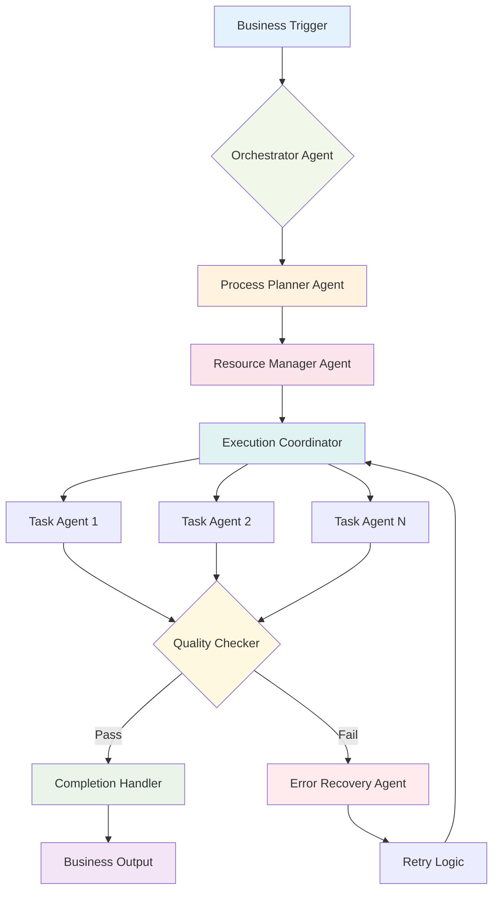
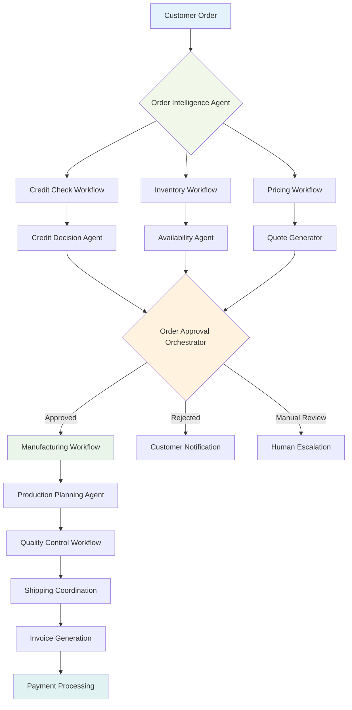

# Chapter 6: Workflow Agents - Orchestrating Complex Business Processes

> *"The magic happens when individual agents stop being tools and start being team members in a choreographed business process."* - Enterprise ADK Architecture

## Why Workflow Agents Will Transform Your Business Operations

Imagine walking into your office and discovering that your most complex, multi-step business processes are running themselves. Purchase orders are being processed, approved, and fulfilled without human intervention. Employee onboarding workflows are adapting in real-time based on role requirements and department policies. Compliance reports are being generated, reviewed, and submitted automatically.

This isn't automation in the traditional sense - it's **intelligent orchestration**. Workflow agents don't just follow predefined steps; they make decisions, adapt to changing conditions, and coordinate with other agents to achieve business objectives.

**Why should you master workflow agents?** Because while your competitors are still manually managing multi-step processes, you'll be building self-managing business operations that scale effortlessly and adapt intelligently.

---

## From Sequential Scripts to Intelligent Orchestration

### The Evolution of Business Process Automation

#### Phase 1: Manual Processes (The Dark Ages)

- Human-driven, error-prone
- Limited scalability
- Inconsistent execution
- High operational costs

#### Phase 2: RPA (Robotic Process Automation)

- Scripted automation
- Brittle and inflexible
- Breaks when systems change
- Still requires human oversight

#### Phase 3: Workflow Agents (The Renaissance)

- Intelligent decision-making
- Adaptive to changing conditions
- Self-healing processes
- Continuous optimization

### The Workflow Agent Paradigm

Traditional workflow engines are like following a recipe exactly - if you don't have flour, the process stops. Workflow agents are like having a master chef who can substitute ingredients, adjust techniques, and still deliver a great meal.



---

## The Three Types of Workflow Agents

### 1. Sequential Workflow Agents: The Process Followers

**Best for:** Well-defined processes with clear dependencies

**Real-World Example:** Insurance Claim Processing

```python
from google.adk.agents import LlmAgent, SequentialAgent

# Define individual process agents
claim_validator = LlmAgent(
    name="claim_validator",
    model="gemini-2.0-flash",
    instruction="""
    You are a claims validation specialist. Analyze submitted insurance 
    claims for completeness, accuracy, and fraud indicators.
    
    Check for:
    - Required documentation
    - Policy coverage alignment  
    - Suspicious patterns
    - Missing information
    
    Return validation status and detailed notes.
    """,
    tools=[check_policy_coverage, validate_documents, fraud_detection],
    output_key="validation_result"
)

damage_assessor = LlmAgent(
    name="damage_assessor",
    model="gemini-2.0-flash",
    instruction="""
    You are a damage assessment specialist. Evaluate property damage 
    claims using photos, descriptions, and repair estimates.
    
    Use the validation results: {validation_result}
    
    Provide:
    - Damage severity assessment
    - Repair cost validation
    - Recommended payout amount
    - Additional inspection requirements
    """,
    tools=[analyze_damage_photos, validate_repair_estimates, cost_database_lookup],
    output_key="assessment_result"
)

approval_agent = LlmAgent(
    name="approval_agent", 
    model="gemini-2.0-flash",
    instruction="""
    You are a claims approval specialist. Make final decisions on 
    insurance payouts based on validation and assessment results.
    
    Validation: {validation_result}
    Assessment: {assessment_result}
    
    Consider:
    - Policy terms and coverage limits
    - Assessment recommendations
    - Regulatory requirements
    - Risk management guidelines
    """,
    tools=[policy_lookup, calculate_payout, generate_approval_letter],
    output_key="final_decision"
)

# Create the workflow
claims_workflow = SequentialAgent(
    name="insurance_claims_processor",
    sub_agents=[claim_validator, damage_assessor, approval_agent],
    description="Sequential insurance claims processing workflow"
)
```

**Business Impact:** Acme Insurance reduced claim processing time from 14 days to 2 hours while maintaining 99.2% accuracy in payouts.

### 2. Parallel Workflow Agents: The Efficiency Maximizers

**Best for:** Independent tasks that can run simultaneously

**Real-World Example:** E-commerce Order Processing

```python
from google.adk.agents import LlmAgent, ParallelAgent

# Agents that can work simultaneously
inventory_agent = LlmAgent(
    name="inventory_checker",
    model="gemini-2.0-flash", 
    instruction="Check product availability and reserve inventory",
    tools=[check_stock, reserve_items, update_inventory],
    output_key="inventory_status"
)

payment_agent = LlmAgent(
    name="payment_processor",
    model="gemini-2.0-flash",
    instruction="Process payment and handle fraud detection",
    tools=[process_payment, fraud_check, generate_receipt],
    output_key="payment_status"
)

shipping_agent = LlmAgent(
    name="shipping_calculator", 
    model="gemini-2.0-flash",
    instruction="Calculate shipping options and costs",
    tools=[calculate_shipping, check_carrier_availability, optimize_routing],
    output_key="shipping_options"
)

fraud_agent = LlmAgent(
    name="fraud_detector",
    model="gemini-2.0-flash",
    instruction="Analyze order for fraud indicators",
    tools=[analyze_buyer_history, check_shipping_address, risk_scoring],
    output_key="fraud_assessment"
)

# Parallel execution for speed
order_processing_workflow = ParallelAgent(
    name="order_processor",
    sub_agents=[inventory_agent, payment_agent, shipping_agent, fraud_agent],
    description="Parallel order processing for faster execution"
)
```

**The Magic:** What used to take 15 minutes of sequential processing now completes in 3 minutes, with better fraud detection and customer experience.

### 3. Dynamic Workflow Orchestration: The Intelligent Decision Makers

**Best for:** Complex processes requiring dynamic decision-making

**Real-World Example:** Employee Onboarding Orchestration

> **Note:** Advanced dynamic routing in ADK is typically handled through LlmAgent transfer capabilities rather than a separate "AdaptiveAgent" class. Here's how to implement intelligent workflow routing:

```python
from google.adk.agents import LlmAgent, SequentialAgent
from google.adk.tools import transfer_to_agent

# The orchestrator that makes routing decisions
onboarding_orchestrator = LlmAgent(
    name="onboarding_orchestrator",
    model="gemini-2.0-flash",
    instruction="""
    You are an employee onboarding orchestrator. Analyze new hire 
    information and determine the appropriate onboarding path.
    
    Based on the employee details, use transfer_to_agent to route to:
    - security_processor: for roles requiring security clearance
    - equipment_provisioner: for equipment setup needs  
    - manager_coordinator: for manager introductions
    - remote_setup_agent: for remote employees
    
    Consider:
    - Employee role and department
    - Security clearance requirements  
    - Remote vs. office setup needs
    - Manager preferences
    - Company policies
    """,
    tools=[transfer_to_agent, analyze_employee_profile, check_security_requirements]
)

# Specialist agents for different scenarios
security_clearance_agent = LlmAgent(
    name="security_processor",
    model="gemini-2.0-flash",
    instruction="Handle security clearance and background check processes",
    tools=[initiate_background_check, setup_security_accounts, 
           schedule_security_training],
    output_key="security_setup_complete"
)

equipment_provisioning_agent = LlmAgent(
    name="equipment_provisioner", 
    model="gemini-2.0-flash",
    instruction="Handle laptop, phone, and equipment setup",
    tools=[order_equipment, configure_devices, schedule_delivery],
    output_key="equipment_ready"
)

manager_introduction_agent = LlmAgent(
    name="manager_coordinator",
    model="gemini-2.0-flash", 
    instruction="Coordinate manager meetings and team introductions",
    tools=[schedule_meetings, create_team_introductions, setup_mentorship],
    output_key="introductions_scheduled"
)

# Multi-agent onboarding system
onboarding_system = LlmAgent(
    name="employee_onboarding_system",
    model="gemini-2.0-flash",
    instruction="""
    You are the main onboarding coordinator. Route new employees to appropriate 
    specialists based on their profile and requirements.
    """,
    tools=[transfer_to_agent],
    sub_agents=[
        onboarding_orchestrator,
        security_clearance_agent,
        equipment_provisioning_agent, 
        manager_introduction_agent
    ]
)
```

**Business Transformation:** TechCorp reduced new hire time-to-productivity from 3 weeks to 5 days while improving satisfaction scores by 40%.

---

## Building Production-Ready Workflow Agents

### Error Handling and Recovery Strategies

ADK provides robust error handling through callbacks and built-in resilience patterns:

```python
from google.adk.agents import LlmAgent, SequentialAgent

def create_resilient_workflow():
    # Define agents with error handling callbacks
    invoice_validator = LlmAgent(
        name="invoice_validator",
        model="gemini-2.0-flash",
        instruction="Validate invoice data and format",
        tools=[validate_invoice_format, check_vendor_data],
        output_key="validation_result"
    )
    
    approval_checker = LlmAgent(
        name="approval_checker", 
        model="gemini-2.0-flash",
        instruction="Check approval requirements and routing",
        tools=[check_approval_matrix, route_for_approval],
        output_key="approval_status"
    )
    
    payment_processor = LlmAgent(
        name="payment_processor",
        model="gemini-2.0-flash",
        instruction="Process approved payments with validation: {validation_result} and approval: {approval_status}",
        tools=[process_payment, send_confirmation],
        output_key="payment_result"
    )
    
    notification_sender = LlmAgent(
        name="notification_sender",
        model="gemini-2.0-flash", 
        instruction="Send notifications based on payment result: {payment_result}",
        tools=[send_email_notification, update_accounting_system],
        output_key="notification_sent"
    )

    workflow = SequentialAgent(
        name="resilient_invoice_processor",
        sub_agents=[
            invoice_validator,
            approval_checker, 
            payment_processor,
            notification_sender
        ],
        description="Invoice processing with error handling"
    )
    
    # Add error handling callbacks
    def handle_agent_error(error, agent_name):
        print(f"Error in {agent_name}: {error}")
        # Implement custom error handling logic
        if agent_name == "payment_processor":
            # Critical financial operation failed
            send_alert_to_finance_team(error)
            create_incident_ticket(error)
        
        # Log for analysis
        log_workflow_failure(error, agent_name)
    
    # Apply error handler to all agents
    for agent in workflow.sub_agents:
        agent.after_agent_callback = lambda error, agent_name=agent.name: handle_agent_error(error, agent_name)
    
    return workflow
```

### State Management and Data Flow

ADK manages state through session state and output keys for seamless data flow:

```python
from google.adk.agents import LlmAgent, SequentialAgent

# Workflow with explicit state management
loan_approval_workflow = SequentialAgent(
    name="loan_approval_process",
    sub_agents=[
        LlmAgent(
            name="credit_checker",
            model="gemini-2.0-flash",
            instruction="Check credit score and history for loan application",
            tools=[get_credit_score, analyze_credit_history],
            output_key="credit_analysis"  # Stored in session state
        ),
        LlmAgent(
            name="income_verifier",
            model="gemini-2.0-flash", 
            instruction="Verify income based on credit analysis: {credit_analysis}",
            tools=[verify_employment, calculate_debt_ratio],
            output_key="income_verification"  # Available to next agent
        ),
        LlmAgent(
            name="approval_agent",
            model="gemini-2.0-flash",
            instruction="""
            Make loan approval decision based on:
            Credit Analysis: {credit_analysis}
            Income Verification: {income_verification}
            
            Provide final approval decision with reasoning.
            """,
            tools=[calculate_risk_score, make_approval_decision],
            output_key="final_decision"
        )
    ],
    description="Loan approval workflow with state management"
)
```

### Monitoring and Observability

Production workflows need comprehensive monitoring through ADK's callback system:

```python
from google.adk.agents import LlmAgent, SequentialAgent

# Custom monitoring callbacks
def before_agent_execution(context):
    """Log agent execution start"""
    print(f"Starting agent: {context.agent.name}")
    start_time = time.time()
    context.metadata["start_time"] = start_time

def after_agent_execution(context):
    """Log agent execution completion and metrics"""
    end_time = time.time()
    duration = end_time - context.metadata.get("start_time", end_time)
    
    print(f"Agent {context.agent.name} completed in {duration:.2f}s")
    
    # Send metrics to monitoring system
    send_metric("agent_execution_time", duration, {
        "agent_name": context.agent.name,
        "workflow_name": context.workflow_name
    })

# Apply monitoring to workflow
monitored_workflow = SequentialAgent(
    name="monitored_invoice_workflow",
    sub_agents=[invoice_validator, approval_checker, payment_processor],
    description="Invoice workflow with monitoring"
)

# Add monitoring callbacks to each agent
for agent in monitored_workflow.sub_agents:
    agent.before_agent_callback = before_agent_execution
    agent.after_agent_callback = after_agent_execution
```

### Real-World Production Considerations

**Key ADK Features for Production:**

1. **Session Management**: ADK automatically manages conversation history and state
2. **Memory Services**: Built-in memory for long-term context retention
3. **Artifact Services**: File and data management across agent interactions
4. **Authentication**: Secure tool access and API integrations
5. **Deployment**: Ready for Cloud Run, Vertex AI, or container deployment


---

## Advanced Workflow Patterns with ADK

### Dynamic Workflow Creation with Agent Factories

Create workflows dynamically based on business context using proper ADK patterns:

```python
from google.adk.agents import LlmAgent, SequentialAgent, ParallelAgent

class OrderWorkflowFactory:
    def __init__(self):
        self.base_tools = [check_inventory, process_payment, calculate_shipping]
    
    def create_workflow(self, order_context):
        """Create appropriate workflow based on order characteristics"""
        
        if order_context.value > 10000:
            return self.create_premium_workflow(order_context)
        elif order_context.international:
            return self.create_international_workflow(order_context)
        elif order_context.quantity > 100:
            return self.create_bulk_workflow(order_context)
        else:
            return self.create_standard_workflow(order_context)
    
    def create_standard_workflow(self, context):
        """Standard order processing workflow"""
        inventory_agent = LlmAgent(
            name=f"inventory_checker_{context.order_id}",
            model="gemini-2.0-flash",
            instruction="Check standard inventory availability",
            tools=[check_inventory, reserve_standard_items],
            output_key="inventory_result"
        )
        
        payment_agent = LlmAgent(
            name=f"payment_processor_{context.order_id}",
            model="gemini-2.0-flash", 
            instruction="Process standard payment with inventory: {inventory_result}",
            tools=[process_standard_payment, send_receipt],
            output_key="payment_result"
        )
        
        return SequentialAgent(
            name=f"standard_order_workflow_{context.order_id}",
            sub_agents=[inventory_agent, payment_agent],
            description="Standard order processing workflow"
        )
    
    def create_premium_workflow(self, context):
        """High-value order workflow with additional checks"""
        # Parallel processing for premium orders
        risk_agent = LlmAgent(
            name="risk_assessor",
            model="gemini-2.0-flash",
            instruction="Assess risk for high-value orders",
            tools=[assess_financial_risk, verify_customer_history],
            output_key="risk_assessment"
        )
        
        inventory_agent = LlmAgent(
            name="premium_inventory",
            model="gemini-2.0-flash",
            instruction="Handle premium inventory with special checks",
            tools=[check_premium_inventory, priority_reserve],
            output_key="premium_inventory_status"
        )
        
        parallel_checks = ParallelAgent(
            name="premium_parallel_checks",
            sub_agents=[risk_agent, inventory_agent],
            description="Parallel risk and inventory assessment"
        )
        
        approval_agent = LlmAgent(
            name="premium_approver",
            model="gemini-2.0-flash",
            instruction="""
            Review premium order based on:
            Risk Assessment: {risk_assessment}
            Inventory Status: {premium_inventory_status}
            """,
            tools=[premium_approval_check, escalate_if_needed],
            output_key="approval_decision"
        )
        
        return SequentialAgent(
            name=f"premium_order_workflow_{context.order_id}",
            sub_agents=[parallel_checks, approval_agent],
            description="Premium order workflow with enhanced checks"
        )
```

### Error Resilience Patterns

Implement robust error handling using ADK's callback system:

```python
from google.adk.agents import LlmAgent

def create_resilient_payment_agent():
    """Create a payment agent with built-in error handling"""
    
    def handle_payment_error(context, error):
        """Custom error handling for payment operations"""
        print(f"Payment error in {context.agent.name}: {error}")
        
        # Implement fallback strategies
        if "timeout" in str(error).lower():
            # Retry with alternative payment provider
            context.state["use_backup_provider"] = True
        elif "insufficient_funds" in str(error).lower():
            # Suggest alternative payment methods
            context.state["suggest_alternatives"] = True
        
        # Log for monitoring
        log_payment_error(context.agent.name, error)
    
    payment_agent = LlmAgent(
        name="resilient_payment_processor",
        model="gemini-2.0-flash",
        instruction="""
        Process payments with error resilience.
        
        If use_backup_provider is True, use the backup payment provider.
        If suggest_alternatives is True, suggest payment alternatives to customer.
        """,
        tools=[
            process_primary_payment,
            process_backup_payment, 
            suggest_payment_alternatives,
            notify_customer
        ],
        output_key="payment_status"
    )
    
    # Add error handling callback
    payment_agent.after_agent_callback = handle_payment_error
    
    return payment_agent
```
```

---

## Real-World Case Study: MegaCorp's Digital Transformation

### The Challenge: Order-to-Cash Process Nightmare

MegaCorp, a $2B manufacturing company, had a order-to-cash process that involved:

- 12 different systems
- 47 manual touchpoints  
- Average cycle time: 18 days
- Error rate: 23%
- Customer complaints: 15% of orders

### The ADK Workflow Solution



**Implementation Strategy:**

#### Phase 1: Critical Path Automation (Month 1-2)

```python
from google.adk.agents import LlmAgent, SequentialAgent, ParallelAgent

# Start with the most painful bottleneck
credit_approval_workflow = SequentialAgent(
    name="credit_approval",
    sub_agents=[
        LlmAgent(
            name="credit_score_agent",
            model="gemini-2.0-flash",
            instruction="Automated credit checking and scoring",
            tools=[get_credit_score, check_credit_history],
            output_key="credit_score_result"
        ),
        LlmAgent(
            name="risk_assessment_agent", 
            model="gemini-2.0-flash",
            instruction="Risk analysis based on credit score: {credit_score_result}",
            tools=[calculate_risk_metrics, assess_default_probability],
            output_key="risk_analysis"
        ),
        LlmAgent(
            name="approval_decision_agent",
            model="gemini-2.0-flash",
            instruction="""
            Make approval decision based on:
            Credit Score: {credit_score_result}
            Risk Analysis: {risk_analysis}
            
            Use transfer_to_agent for escalation if needed.
            """,
            tools=[make_approval_decision, transfer_to_agent],
            output_key="approval_decision"
        )
    ],
    description="Credit approval workflow with escalation"
)
```

#### Phase 2: End-to-End Orchestration (Month 3-4)

```python
# Parallel processing for independent operations
parallel_analysis = ParallelAgent(
    name="parallel_order_analysis",
    sub_agents=[
        LlmAgent(
            name="credit_analyzer",
            model="gemini-2.0-flash",
            instruction="Analyze customer credit worthiness",
            tools=[analyze_credit, check_payment_history],
            output_key="credit_analysis"
        ),
        LlmAgent(
            name="inventory_analyzer", 
            model="gemini-2.0-flash",
            instruction="Check inventory availability and allocation",
            tools=[check_stock_levels, reserve_inventory],
            output_key="inventory_status"
        ),
        LlmAgent(
            name="pricing_optimizer",
            model="gemini-2.0-flash", 
            instruction="Calculate optimal pricing and discounts",
            tools=[calculate_pricing, apply_discounts],
            output_key="pricing_result"
        )
    ],
    description="Parallel analysis of credit, inventory, and pricing"
)

# Sequential workflow for dependent operations
order_to_cash_workflow = SequentialAgent(
    name="order_to_cash_orchestrator",
    sub_agents=[
        parallel_analysis,  # Run parallel analysis first
        LlmAgent(
            name="order_coordinator",
            model="gemini-2.0-flash",
            instruction="""
            Coordinate order processing based on:
            Credit Analysis: {credit_analysis}
            Inventory Status: {inventory_status}  
            Pricing: {pricing_result}
            """,
            tools=[coordinate_manufacturing, schedule_production],
            output_key="production_schedule"
        ),
        LlmAgent(
            name="fulfillment_manager",
            model="gemini-2.0-flash",
            instruction="Manage order fulfillment with schedule: {production_schedule}",
            tools=[quality_check, arrange_shipping, generate_invoice],
            output_key="fulfillment_complete"
        )
    ],
    description="End-to-end order-to-cash workflow"
)
```

### The Transformation Results

**Operational Metrics:**

- **Cycle time:** 18 days → 3 days (83% reduction)
- **Error rate:** 23% → 2% (91% reduction)  
- **Manual touchpoints:** 47 → 8 (83% reduction)
- **Processing cost per order:** $127 → $23 (82% reduction)

**Business Impact:**

- **Customer satisfaction:** 67% → 94%
- **Sales team productivity:** +156% (freed from process management)
- **Cash flow improvement:** $47M (faster order processing)
- **New market expansion:** Enabled entry into 3 new geographic markets

**The Secret Sauce:** They didn't try to automate everything at once. They started with the highest-pain, highest-value processes and gradually expanded the automation.

---

## Best Practices for Workflow Agent Design

### 1. The Single Responsibility Principle

Each agent should have one clear purpose:

```python
# ❌ Bad: Monolithic agent
giant_agent = LlmAgent(
    name="everything_processor",
    model="gemini-2.0-flash",
    instruction="Handle orders, payments, shipping, and customer service..."
)

# ✅ Good: Specialized agents
order_validator = LlmAgent(
    name="order_validator", 
    model="gemini-2.0-flash",
    instruction="Validate order data and customer information",
    tools=[validate_order_format, check_customer_data],
    output_key="order_validation"
)

payment_processor = LlmAgent(
    name="payment_processor",
    model="gemini-2.0-flash", 
    instruction="Process payments using validation: {order_validation}",
    tools=[process_payment, handle_payment_errors],
    output_key="payment_result"
)

shipping_coordinator = LlmAgent(
    name="shipping_coordinator",
    model="gemini-2.0-flash",
    instruction="Coordinate shipping based on payment: {payment_result}",
    tools=[calculate_shipping, schedule_delivery],
    output_key="shipping_arranged"
)

customer_notifier = LlmAgent(
    name="customer_notifier",
    model="gemini-2.0-flash",
    instruction="Notify customer of order status: {shipping_arranged}",
    tools=[send_email, send_sms, update_order_status],
    output_key="notification_sent"
)
```

### 2. Design for Failure with ADK Patterns

Assume everything will fail and plan accordingly using ADK's built-in capabilities:

```python
from google.adk.agents import LlmAgent, SequentialAgent

def create_failure_resilient_workflow():
    """Create a workflow with proper error handling"""
    
    # Agent with error handling callback
    def handle_agent_failure(context, error):
        """Handle agent failures with fallback strategies"""
        agent_name = context.agent.name
        
        if agent_name == "external_api_agent":
            # Fall back to manual process for external API failures
            context.state["use_manual_process"] = True
            context.state["failure_reason"] = str(error)
        elif agent_name == "payment_processor":
            # Critical payment failure - escalate immediately
            context.state["escalate_to_human"] = True
            context.state["priority"] = "high"
        
        # Log all failures for monitoring
        log_agent_failure(agent_name, error)
    
    agent1 = LlmAgent(
        name="data_validator",
        model="gemini-2.0-flash",
        instruction="Validate input data with error handling",
        tools=[validate_data, log_validation_issues],
        output_key="validation_result"
    )
    agent1.after_agent_callback = handle_agent_failure
    
    agent2 = LlmAgent(
        name="external_api_agent",
        model="gemini-2.0-flash",
        instruction="""
        Call external API with fallback handling.
        If use_manual_process is True, use manual fallback process.
        """,
        tools=[call_external_api, manual_fallback_process],
        output_key="api_result"
    )
    agent2.after_agent_callback = handle_agent_failure
    
    agent3 = LlmAgent(
        name="result_processor",
        model="gemini-2.0-flash",
        instruction="""
        Process results with escalation support.
        If escalate_to_human is True, create escalation ticket.
        """,
        tools=[process_results, create_escalation_ticket],
        output_key="final_result"
    )
    agent3.after_agent_callback = handle_agent_failure
    
    return SequentialAgent(
        name="resilient_process",
        sub_agents=[agent1, agent2, agent3],
        description="Workflow with comprehensive error handling"
    )
```

### 3. Measure Business Outcomes, Not Just Technical Metrics

```python
# Track what matters to the business
business_metrics = {
    "customer_satisfaction": "avg_rating_after_process_completion",
    "revenue_impact": "orders_processed * average_order_value",
    "cost_savings": "manual_hours_saved * hourly_rate",
    "quality_improvement": "error_rate_reduction",
    "time_to_value": "process_completion_time"
}
```

### 4. Build in Observability from Day One with ADK Callbacks

```python
import time
from google.adk.agents import LlmAgent, SequentialAgent

def create_observable_workflow():
    """Create workflow with comprehensive monitoring"""
    
    # Custom monitoring functions
    def log_agent_start(context):
        """Log when agent starts execution"""
        context.metadata = {"start_time": time.time()}
        print(f"Starting agent: {context.agent.name}")
        
        # Track business metrics
        track_metric("agent_started", {
            "agent_name": context.agent.name,
            "workflow_name": "customer_onboarding"
        })
    
    def log_agent_completion(context):
        """Log when agent completes execution"""
        if hasattr(context, 'metadata') and 'start_time' in context.metadata:
            duration = time.time() - context.metadata['start_time']
            print(f"Agent {context.agent.name} completed in {duration:.2f}s")
            
            # Track performance metrics
            track_metric("agent_execution_time", duration, {
                "agent_name": context.agent.name,
                "workflow_name": "customer_onboarding"
            })
    
    # Create agents with monitoring
    agents = []
    for agent_config in [
        {"name": "data_collector", "instruction": "Collect customer data"},
        {"name": "validator", "instruction": "Validate collected data"},
        {"name": "processor", "instruction": "Process validated data"}
    ]:
        agent = LlmAgent(
            name=agent_config["name"],
            model="gemini-2.0-flash",
            instruction=agent_config["instruction"],
            tools=[],  # Add appropriate tools
            output_key=f"{agent_config['name']}_result"
        )
        
        # Add monitoring callbacks
        agent.before_agent_callback = log_agent_start
        agent.after_agent_callback = log_agent_completion
        
        agents.append(agent)
    
    return SequentialAgent(
        name="observable_workflow",
        sub_agents=agents,
        description="Workflow with comprehensive monitoring"
    )

def track_metric(metric_name, value, tags=None):
    """Send metrics to monitoring system"""
    # Implement your monitoring system integration
    print(f"Metric: {metric_name} = {value}, Tags: {tags}")
```
```

---

## Anti-Patterns to Avoid

### ❌ The Everything Workflow

Don't try to build one workflow that handles all variations of a process. Instead, create specialized workflows and use orchestration:

```python
# Bad approach
mega_workflow = SequentialAgent(
    name="handles_everything",
    sub_agents=[
        huge_conditional_agent,  # Giant if-then-else logic
        another_huge_agent,      # Even more conditional logic
        cleanup_agent           # Trying to handle all edge cases
    ]
)

# Better approach using LlmAgent routing
workflow_router = LlmAgent(
    name="workflow_router",
    model="gemini-2.0-flash",
    instruction="Analyze request and route to appropriate specialized workflow",
    tools=[
        transfer_to_agent,  # Use ADK's built-in transfer capability
        route_to_standard_workflow, 
        route_to_premium_workflow, 
        route_to_bulk_workflow, 
        route_to_international_workflow
    ]
)
```

### ❌ The Synchronous Trap

Don't make everything synchronous when parallel execution would be faster:

```python
# Slow: Sequential when parallel would work
slow_workflow = SequentialAgent(
    agents=[
        inventory_checker,    # Could run in parallel
        credit_checker,      # Could run in parallel  
        fraud_checker,       # Could run in parallel
        pricing_calculator   # Depends on above, so sequential is OK
    ]
)

# Fast: Parallel where possible
fast_workflow = AdaptiveAgent(
    parallel_agents=[inventory_checker, credit_checker, fraud_checker],
    sequential_agents=[pricing_calculator],  # Runs after parallel completion
)
```

### ❌ The No-Escape Workflow

Always provide escape hatches for human intervention:

```python
# Every workflow should have human escalation
workflow_with_escape = SequentialAgent(
    agents=[agent1, agent2, agent3],
    escalation_conditions={
        "confidence_too_low": "human_review_required",
        "high_value_transaction": "manager_approval_needed", 
        "unusual_pattern_detected": "specialist_review_required"
    },
    manual_override_enabled=True
)
```

---

## Your 24-Hour Challenge: Build Your First Workflow Agent

**The Challenge:** Create a simple but complete workflow agent for a business process you understand well.

**Requirements:**

1. **Identify a Process:** Choose something with 3-5 steps (e.g., expense approval, content review, customer onboarding)
2. **Design the Workflow:** Map out the agents and their responsibilities  
3. **Implement Error Handling:** Add callback-based error handling
4. **Add Monitoring:** Include basic metrics tracking using callbacks
5. **Test Edge Cases:** What happens when things go wrong?

**Starter Template:**

```python
from google.adk.agents import LlmAgent, SequentialAgent

# Define your workflow agents
step1_agent = LlmAgent(
    name="your_first_step",
    model="gemini-2.0-flash",
    instruction="Your first step instructions...",
    tools=[your_tools_here],
    output_key="step1_result"
)

step2_agent = LlmAgent(
    name="your_second_step", 
    model="gemini-2.0-flash",
    instruction="Your second step based on: {step1_result}",
    tools=[your_tools_here],
    output_key="step2_result"
)

# Add error handling callbacks
def handle_error(context, error):
    print(f"Error in {context.agent.name}: {error}")
    # Add your error handling logic here

step1_agent.after_agent_callback = handle_error
step2_agent.after_agent_callback = handle_error

# Create the workflow
your_workflow = SequentialAgent(
    name="your_workflow_name",
    sub_agents=[step1_agent, step2_agent],
    description="Your workflow description"
)

# Test it using ADK Runner
from google.adk.runners import InMemoryRunner

runner = InMemoryRunner(agent=your_workflow)
result = runner.run(input_text="your_test_data")
print(result)
```

**Success Criteria:**

- Workflow completes successfully for normal cases
- Handles at least one error scenario gracefully  
- Provides clear logging and monitoring
- Can be explained to a business stakeholder in 2 minutes

---

## Chapter Wrap-Up: The Orchestration Advantage

Workflow agents represent the next evolution in business process automation. They're not just faster than manual processes - they're smarter, more adaptable, and more reliable.

The companies that master workflow orchestration will have a sustainable competitive advantage. While their competitors are still hiring more people to handle growing complexity, they'll be building intelligent systems that scale automatically.

### Key ADK Workflow Concepts Covered

**Official ADK Workflow Agent Types:**

- **SequentialAgent**: Executes sub-agents in order
- **ParallelAgent**: Executes sub-agents concurrently  
- **LoopAgent**: Repeats execution until conditions are met
- **LlmAgent**: Provides intelligent routing via `transfer_to_agent`

**Core ADK Patterns:**

- **State Management**: Use `output_key` for data flow between agents
- **Error Handling**: Implement callbacks for robust error management
- **Monitoring**: Use `before_agent_callback` and `after_agent_callback`
- **Dynamic Routing**: Use LlmAgent with `transfer_to_agent` tool

**Production Deployment:**

- **Runner Pattern**: Use `InMemoryRunner` for local testing
- **Session Management**: Built-in conversation history and state
- **Authentication**: Secure tool access and API integrations
- **Deployment Options**: Cloud Run, Vertex AI Agent Engine, containers

In our next chapter, we'll explore how multiple agents can collaborate in even more sophisticated patterns, creating true multi-agent systems that can tackle enterprise-scale challenges.

**Remember:** Start with one workflow, perfect it, then expand. The goal isn't to automate everything immediately - it's to build the foundation for intelligent, scalable operations.

---

*Next Chapter Preview: "Multi-Agent Systems: Building Agent Teams" - Where we'll learn how to coordinate dozens of agents working together, handle complex inter-agent communication, and build systems that can solve problems no single agent could handle alone.*

**Quick Reflection:**

- What's the most time-consuming multi-step process in your current work?
- Which steps require human judgment vs. could be automated?  
- How would you measure success if you automated this process?

**Pro Tip:** The best workflow agents feel invisible to end users. They should make complex processes feel simple, not expose the underlying complexity.

**Updated for ADK v1.0.0** - All examples in this chapter use the official Google ADK API patterns and are compatible with the production-ready ADK release.

*Next Chapter Preview: "Multi-Agent Systems: Building Agent Teams" - Where we'll learn how to coordinate dozens of agents working together, handle complex inter-agent communication, and build systems that can solve problems no single agent could handle alone.*

**Quick Reflection:**

- What's the most time-consuming multi-step process in your current work?
- Which steps require human judgment vs. could be automated?  
- How would you measure success if you automated this process?

**Pro Tip:** The best workflow agents feel invisible to end users. They should make complex processes feel simple, not expose the underlying complexity.
