# Chapter 6: Workflow Agents - Orchestrating Complex Business Processes

> *"The magic happens when individual agents stop being tools and start being team members in a choreographed business process."* - Enterprise ADK Architecture

## Why Workflow Agents Will Transform Your Business Operations

Imagine walking into your office and discovering that your most complex, multi-step business processes are running themselves. Purchase orders are being processed, approved, and fulfilled without human intervention. Employee onboarding workflows are adapting in real-time based on role requirements and department policies. Compliance reports are being generated, reviewed, and submitted automatically.

This isn't automation in the traditional sense - it's **intelligent orchestration**. Workflow agents don't just follow predefined steps; they make decisions, adapt to changing conditions, and coordinate with other agents to achieve business objectives.

**Why should you master workflow agents?** Because while your competitors are still manually managing multi-step processes, you'll be building self-managing business operations that scale effortlessly and adapt intelligently.

---

## From Sequential Scripts to Intelligent Orchestration

### The Evolution of Business Process Automation

#### Phase 1: Manual Processes (The Dark Ages)

- Human-driven, error-prone
- Limited scalability
- Inconsistent execution
- High operational costs

#### Phase 2: RPA (Robotic Process Automation)

- Scripted automation
- Brittle and inflexible
- Breaks when systems change
- Still requires human oversight

#### Phase 3: Workflow Agents (The Renaissance)

- Intelligent decision-making
- Adaptive to changing conditions
- Self-healing processes
- Continuous optimization

### The Workflow Agent Paradigm

Traditional workflow engines are like following a recipe exactly - if you don't have flour, the process stops. Workflow agents are like having a master chef who can substitute ingredients, adjust techniques, and still deliver a great meal.


---

## The Three Types of Workflow Agents

### 1. Sequential Workflow Agents: The Process Followers

**Best for:** Well-defined processes with clear dependencies

**Real-World Example:** Insurance Claim Processing

```python
from google.adk.agents import LlmAgent, SequentialAgent

# Define individual process agents
claim_validator = LlmAgent(
    name="claim_validator",
    model="gemini-1.5-flash",
    instruction="""
    You are a claims validation specialist. Analyze submitted insurance 
    claims for completeness, accuracy, and fraud indicators.
    
    Check for:
    - Required documentation
    - Policy coverage alignment  
    - Suspicious patterns
    - Missing information
    
    Return validation status and detailed notes.
    """,
    tools=[check_policy_coverage, validate_documents, fraud_detection],
    output_key="validation_result"
)

damage_assessor = LlmAgent(
    name="damage_assessor",
    model="gemini-1.5-flash",
    instruction="""
    You are a damage assessment specialist. Evaluate property damage 
    claims using photos, descriptions, and repair estimates.
    
    Use the validation results: {validation_result}
    
    Provide:
    - Damage severity assessment
    - Repair cost validation
    - Recommended payout amount
    - Additional inspection requirements
    """,
    tools=[analyze_damage_photos, validate_repair_estimates, cost_database_lookup],
    output_key="assessment_result"
)

approval_agent = LlmAgent(
    name="approval_agent", 
    model="gemini-1.5-flash",
    instruction="""
    You are a claims approval specialist. Make final decisions on 
    insurance payouts based on validation and assessment results.
    
    Validation: {validation_result}
    Assessment: {assessment_result}
    
    Consider:
    - Policy terms and coverage limits
    - Assessment recommendations
    - Regulatory requirements
    - Risk management guidelines
    """,
    tools=[policy_lookup, calculate_payout, generate_approval_letter],
    output_key="final_decision"
)

# Create the workflow
claims_workflow = SequentialAgent(
    name="insurance_claims_processor",
    sub_agents=[claim_validator, damage_assessor, approval_agent],
    description="Sequential insurance claims processing workflow"
)
```

**Business Impact:** Organizations implementing similar claims processing workflows report significant improvements in processing time while maintaining high accuracy in payouts.

### 2. Parallel Workflow Agents: The Efficiency Maximizers

**Best for:** Independent tasks that can run simultaneously

**Real-World Example:** E-commerce Order Processing

```python
from google.adk.agents import LlmAgent, ParallelAgent

# Agents that can work simultaneously
inventory_agent = LlmAgent(
    name="inventory_checker",
    model="gemini-1.5-flash", 
    instruction="Check product availability and reserve inventory",
    tools=[check_stock, reserve_items, update_inventory],
    output_key="inventory_status"
)

payment_agent = LlmAgent(
    name="payment_processor",
    model="gemini-1.5-flash",
    instruction="Process payment and handle fraud detection",
    tools=[process_payment, fraud_check, generate_receipt],
    output_key="payment_status"
)

shipping_agent = LlmAgent(
    name="shipping_calculator", 
    model="gemini-1.5-flash",
    instruction="Calculate shipping options and costs",
    tools=[calculate_shipping, check_carrier_availability, optimize_routing],
    output_key="shipping_options"
)

fraud_agent = LlmAgent(
    name="fraud_detector",
    model="gemini-1.5-flash",
    instruction="Analyze order for fraud indicators",
    tools=[analyze_buyer_history, check_shipping_address, risk_scoring],
    output_key="fraud_assessment"
)

# Parallel execution for speed
order_processing_workflow = ParallelAgent(
    name="order_processor",
    sub_agents=[inventory_agent, payment_agent, shipping_agent, fraud_agent],
    description="Parallel order processing for faster execution"
)
```

**Business Impact:** Organizations implementing similar parallel processing workflows report significant improvements in processing speed and customer experience.

### 3. Dynamic Workflow Orchestration: The Intelligent Decision Makers

**Best for:** Complex processes requiring dynamic decision-making

**Real-World Example:** Employee Onboarding Orchestration

**Implementation using LlmAgent with Dynamic Routing:**

```python
from google.adk.agents import LlmAgent

# The orchestrator that makes routing decisions
onboarding_orchestrator = LlmAgent(
    name="onboarding_orchestrator",
    model="gemini-1.5-flash",
    instruction="""
    You are an employee onboarding orchestrator. Analyze new hire 
    information and determine the appropriate onboarding path.
    
    Based on the employee details, use transfer_to_agent to route to:
    - security_processor: for roles requiring security clearance
    - equipment_provisioner: for equipment setup needs  
    - manager_coordinator: for manager introductions
    - remote_setup_agent: for remote employees
    
    Consider:
    - Employee role and department
    - Security clearance requirements  
    - Remote vs. office setup needs
    - Manager preferences
    - Company policies
    """,
    tools=[analyze_employee_profile, check_security_requirements]
)

# Specialist agents for different scenarios
security_clearance_agent = LlmAgent(
    name="security_processor",
    model="gemini-1.5-flash",
    instruction="Handle security clearance and background check processes",
    tools=[initiate_background_check, setup_security_accounts, 
           schedule_security_training],
    output_key="security_setup_complete"
)

equipment_provisioning_agent = LlmAgent(
    name="equipment_provisioner", 
    model="gemini-1.5-flash",
    instruction="Handle laptop, phone, and equipment setup",
    tools=[order_equipment, configure_devices, schedule_delivery],
    output_key="equipment_ready"
)

manager_introduction_agent = LlmAgent(
    name="manager_coordinator",
    model="gemini-1.5-flash", 
    instruction="Coordinate manager meetings and team introductions",
    tools=[schedule_meetings, create_team_introductions, setup_mentorship],
    output_key="introductions_scheduled"
)

# Multi-agent onboarding system using proper ADK patterns
onboarding_system = LlmAgent(
    name="employee_onboarding_system",
    model="gemini-1.5-flash",
    instruction="""
    You are the main onboarding coordinator. Analyze employee requirements 
    and delegate to appropriate specialists using sub-agent routing.
    """,
    sub_agents=[
        onboarding_orchestrator,
        security_clearance_agent,
        equipment_provisioning_agent, 
        manager_introduction_agent
    ]
)
```

**Business Transformation:** Organizations implementing similar onboarding workflows have reported significant improvements in new hire time-to-productivity and employee satisfaction scores.

---

## Understanding Agent Transfer: The Heart of Dynamic Orchestration

The concept of **Agent Transfer** is fundamental to building intelligent, adaptive workflow systems with ADK. When an agent uses `transfer_to_agent()`, it's not just calling a function - it's intelligently delegating control to another specialized agent based on the current context and requirements.

### What Is Agent Transfer?

Agent Transfer is ADK's mechanism for **dynamic, intelligent routing** between agents within a multi-agent system. Unlike rigid workflow engines that follow predetermined paths, agent transfer allows LLM agents to make real-time decisions about which agent should handle the current task.

**Key Characteristics:**

- **Intelligent Decision Making**: The LLM analyzes the context and determines the best agent to handle the task
- **Dynamic Routing**: No predetermined paths - decisions are made based on current state and requirements
- **Context Preservation**: Session state, conversation history, and artifacts are maintained across transfers
- **Hierarchical Scope**: Agents can transfer to sub-agents, siblings, or parent agents (based on configuration)

### How Agent Transfer Works: The Technical Flow

```mermaid
flowchart TD
    A["🤖 User Request<br/>'Onboard new employee John'"] --> B["📋 Coordinator Agent<br/>Analyzes Request"]
    
    B --> C{{"🧠 LLM Decision<br/>What type of onboarding?"}}
    
    C --> D["💡 Generate Function Call<br/>transfer_to_agent('security_processor')"]
    
    D --> E["⚡ ADK AutoFlow<br/>Intercepts Transfer Call"]
    
    E --> F["🔍 Agent Discovery<br/>root_agent.find_agent('security_processor')"]
    
    F --> G["🔄 Context Switch<br/>Update InvocationContext"]
    
    G --> H["🎯 Security Agent<br/>Takes Control"]
    
    H --> I["✅ Task Completion<br/>Returns Result to Context"]
    
    I --> J["📊 Session State Update<br/>Results Available to Other Agents"]
    
    style A fill:#E8F4FD,stroke:#1E88E5,stroke-width:2px
    style B fill:#F3E5F5,stroke:#8E24AA,stroke-width:2px
    style C fill:#FFF3E0,stroke:#FB8C00,stroke-width:2px
    style D fill:#E8F5E8,stroke:#43A047,stroke-width:2px
    style E fill:#FFF8E1,stroke:#FFB300,stroke-width:2px
    style F fill:#F1F8E9,stroke:#689F38,stroke-width:2px
    style G fill:#FCE4EC,stroke:#E91E63,stroke-width:2px
    style H fill:#E0F2F1,stroke:#00ACC1,stroke-width:2px
    style I fill:#F9FBE7,stroke:#827717,stroke-width:2px
    style J fill:#EDE7F6,stroke:#5E35B1,stroke-width:2px
```



### The Three Types of Agent Transfer

#### 1. Hierarchical Transfer (Sub-Agent Delegation)

**Most Common Pattern**: A parent agent transfers control to one of its sub-agents.


#### 2. Peer Transfer (Sibling Agent Routing)

**Specialized Handoffs**: Agents at the same level transfer tasks between each other.

```mermaid
flowchart TD
    subgraph "Peer Agent Network"
        A["🛒 Order Processor"] 
        B["💳 Payment Handler"]
        C["📦 Inventory Manager"]
        D["🚚 Shipping Coordinator"]
        E["📧 Customer Notifier"]
    end
    
    F["🛍️ Customer Order"] --> A
    A -.->|"transfer_to_agent('payment_handler')"| B
    B -.->|"transfer_to_agent('inventory_manager')"| C
    C -.->|"transfer_to_agent('shipping_coordinator')"| D
    D -.->|"transfer_to_agent('customer_notifier')"| E
    
    A -.->|"order_validated"| G["💾 Session State"]
    B -.->|"payment_processed"| G
    C -.->|"items_reserved"| G
    D -.->|"shipping_scheduled"| G
    E -.->|"customer_notified"| G
    
    style A fill:#E8F4FD,stroke:#1E88E5,stroke-width:2px
    style B fill:#F3E5F5,stroke:#8E24AA,stroke-width:2px
    style C fill:#E8F5E8,stroke:#43A047,stroke-width:2px
    style D fill:#FFF3E0,stroke:#FB8C00,stroke-width:2px
    style E fill:#FCE4EC,stroke:#E91E63,stroke-width:2px
    style F fill:#F1F8E9,stroke:#689F38,stroke-width:2px
    style G fill:#FFF8E1,stroke:#FFB300,stroke-width:2px
```



#### 3. Escalation Transfer (Parent Agent Routing)

**Exception Handling**: When a task exceeds an agent's capabilities or authority.

```mermaid
flowchart TD
    A["👨‍💼 Senior Manager<br/>(Parent)"] 
    
    A --> B["👩‍💻 Junior Agent<br/>(Sub-Agent)"]
    A --> C["🔧 Technical Specialist<br/>(Sub-Agent)"]
    
    D["❓ Complex Request"] --> B
    B --> E{{"🤔 Can I Handle This?<br/>Check complexity & authority"}}
    
    E -->|"Yes, within scope"| F["✅ Process Request"]
    E -->|"No, needs escalation"| G["⬆️ transfer_to_agent('senior_manager')"]
    
    G --> A
    A --> H["🔍 Manager Analysis"]
    H --> I{{"📊 Route Decision"}}
    
    I -->|"Technical Issue"| J["⬇️ transfer_to_agent('technical_specialist')"]
    I -->|"Policy Decision"| K["📋 Handle Personally"]
    
    J --> C
    
    style A fill:#FFE0B2,stroke:#FF8F00,stroke-width:3px
    style B fill:#E1F5FE,stroke:#0277BD,stroke-width:2px
    style C fill:#E8F5E8,stroke:#2E7D32,stroke-width:2px
    style D fill:#FCE4EC,stroke:#C2185B,stroke-width:2px
    style E fill:#F3E5F5,stroke:#7B1FA2,stroke-width:2px
    style G fill:#FFEBEE,stroke:#D32F2F,stroke-width:2px
    style H fill:#F1F8E9,stroke:#558B2F,stroke-width:2px
    style I fill:#FFF3E0,stroke:#EF6C00,stroke-width:2px
```



### Implementing Agent Transfer in Practice

#### Basic Transfer Pattern

```python
from google.adk.agents import LlmAgent

# Coordinator agent with transfer capabilities
coordinator = LlmAgent(
    name="task_coordinator",
    model="gemini-1.5-flash",
    instruction="""
    You are a task coordinator. Analyze incoming requests and route them 
    to the appropriate specialist agent using transfer_to_agent().
    
    Available agents:
    - billing_specialist: Handle billing inquiries and payment issues
    - technical_support: Handle technical problems and troubleshooting
    - account_manager: Handle account changes and upgrades
    
    When you receive a request:
    1. Analyze the request type and urgency
    2. Determine the best agent to handle it
    3. Use transfer_to_agent(agent_name='target_agent') to route the request
    
    Example: For "My payment failed", use transfer_to_agent(agent_name='billing_specialist')
    """,
    tools=[analyze_request_type, check_agent_availability],
    sub_agents=[billing_specialist, technical_support, account_manager]
)
```

#### Advanced Transfer with Context

```python
# Advanced coordinator with context-aware routing
smart_coordinator = LlmAgent(
    name="smart_coordinator",
    model="gemini-1.5-flash",
    instruction="""
    You are an intelligent request router. Use the session state and 
    conversation history to make optimal routing decisions.
    
    Routing Logic:
    - Check session state for customer tier: {customer_tier}
    - Consider previous interactions: {interaction_history}
    - Route VIP customers to senior agents
    - Route technical issues based on complexity level
    - Route billing issues based on amount involved
    
    Always provide context when transferring:
    "Transferring to billing specialist due to payment amount ${amount} 
    exceeding standard limits for {customer_tier} customer."
    """,
    tools=[
        get_customer_tier,
        analyze_interaction_history,
        calculate_complexity_score,
        transfer_to_agent  # Explicitly available as a tool
    ],
    sub_agents=[
        senior_billing_agent,
        standard_billing_agent,
        technical_expert,
        technical_support,
        vip_account_manager,
        standard_account_manager
    ]
)
```

### Transfer Best Practices

#### 1. Clear Agent Descriptions

Each agent needs a clear, specific description for intelligent routing:

```python
# ❌ Vague description
billing_agent = LlmAgent(
    name="billing_helper",
    description="Helps with billing"  # Too generic
)

# ✅ Specific description
billing_agent = LlmAgent(
    name="billing_specialist", 
    description="Handles billing inquiries, payment processing issues, invoice disputes, refund requests, and subscription changes. Specializes in complex billing scenarios requiring policy interpretation."
)
```

#### 2. Transfer with Context

Always provide context when transferring:

```python
coordinator_instruction = """
When transferring, always explain the reasoning:

Good: "Transferring to technical_support because this is a server connectivity 
issue requiring network diagnostics."

Bad: Just calling transfer_to_agent('technical_support') without explanation.
"""
```

#### 3. Handle Transfer Failures

```python
# Agent with transfer error handling
resilient_coordinator = LlmAgent(
    name="resilient_coordinator",
    instruction="""
    When using transfer_to_agent():
    1. First check if the target agent exists
    2. Provide clear reasoning for the transfer
    3. If transfer fails, gracefully handle the request yourself or escalate
    
    If transfer_to_agent fails:
    - Acknowledge the issue to the user
    - Attempt to handle the request directly if possible
    - Escalate to a human operator if necessary
    """,
    tools=[
        check_agent_availability,
        handle_request_directly,
        escalate_to_human,
        transfer_to_agent
    ]
)
```

### Common Transfer Patterns

#### The Triage Pattern

```mermaid
flowchart LR
    A["📞 Customer Service<br/>Main Entry Point"] --> B{{"🔍 Request Analysis<br/>What type of issue?"}}
    
    B -->|"Billing Question"| C["💳 Billing Agent<br/>transfer_to_agent('billing_specialist')"]
    B -->|"Technical Issue"| D["🔧 Tech Support<br/>transfer_to_agent('tech_support')"]  
    B -->|"Account Changes"| E["👤 Account Manager<br/>transfer_to_agent('account_manager')"]
    B -->|"Complex/Unclear"| F["👨‍💼 Senior Agent<br/>transfer_to_agent('senior_specialist')"]
    
    C --> G["💾 Update Session<br/>billing_handled: true"]
    D --> H["💾 Update Session<br/>technical_resolved: true"]
    E --> I["💾 Update Session<br/>account_updated: true"]
    F --> J["💾 Update Session<br/>escalated: true"]
    
    style A fill:#E3F2FD,stroke:#1976D2,stroke-width:2px
    style B fill:#FFF3E0,stroke:#F57C00,stroke-width:2px
    style C fill:#F3E5F5,stroke:#7B1FA2,stroke-width:2px
    style D fill:#E8F5E8,stroke:#388E3C,stroke-width:2px
    style E fill:#FCE4EC,stroke:#C2185B,stroke-width:2px
    style F fill:#FFE0B2,stroke:#FF8F00,stroke-width:2px
```



#### The Approval Chain Pattern

```mermaid
flowchart TD
    A["📄 Request Submitted"] --> B["🔍 Initial Validator<br/>Basic checks & formatting"]
    
    B --> C{{"💰 Amount Check<br/>< $1000?"}}
    
    C -->|"Yes"| D["✅ Auto-Approve<br/>transfer_to_agent('processing_agent')"]
    C -->|"No"| E["👨‍💼 Manager Review<br/>transfer_to_agent('manager_agent')"]
    
    E --> F{{"🎯 Manager Decision<br/>Approve or Escalate?"}}
    
    F -->|"Approve"| D
    F -->|"Escalate > $10K"| G["👔 Senior Manager<br/>transfer_to_agent('senior_manager')"]
    
    G --> H{{"📊 Final Decision"}}
    H -->|"Approve"| D
    H -->|"Reject"| I["❌ Rejection Handler<br/>transfer_to_agent('rejection_processor')"]
    
    D --> J["🎉 Process Complete"]
    I --> K["📧 Notify Requester"]
    
    style A fill:#E8F4FD,stroke:#1E88E5,stroke-width:2px
    style B fill:#F1F8E9,stroke:#689F38,stroke-width:2px
    style C fill:#FFF3E0,stroke:#FB8C00,stroke-width:2px
    style D fill:#E8F5E8,stroke:#43A047,stroke-width:2px
    style E fill:#F3E5F5,stroke:#8E24AA,stroke-width:2px
    style F fill:#FFF8E1,stroke:#FFB300,stroke-width:2px
    style G fill:#FCE4EC,stroke:#E91E63,stroke-width:2px
    style I fill:#FFEBEE,stroke:#F44336,stroke-width:2px
```



### Troubleshooting Agent Transfer

#### Common Issues and Solutions

##### Issue 1: Transfer Not Working

```python
# Problem: Agent not found
transfer_to_agent(agent_name='non_existent_agent')  # Fails silently

# Solution: Check agent hierarchy and names
coordinator = LlmAgent(
    name="coordinator",
    instruction="Available agents: billing_specialist, tech_support, account_manager",
    sub_agents=[billing_specialist, tech_support, account_manager]  # Must be in sub_agents
)
```

##### Issue 2: Infinite Transfer Loops

```python
# Problem: Agents transferring back and forth
# Solution: Add transfer history tracking
coordinator_instruction = """
Before transferring, check if this agent has already been tried.
Session state tracks: {previous_agents_tried}

If agent has been tried, either:
1. Handle the request directly
2. Escalate to a higher-level agent
3. Ask for more information from the user
"""
```

##### Issue 3: Lost Context After Transfer

```python
# Problem: Information not preserved across transfers
# Solution: Use session state and output_key
source_agent = LlmAgent(
    name="source_agent",
    instruction="Before transferring, save important context to session state",
    output_key="transfer_context"  # Automatically saves agent output
)
```

---

## Real-World Implementation: Building a Complete Customer Service Workflow

Let's put everything together by building a comprehensive customer service workflow that demonstrates all the concepts we've covered.

### The Business Scenario

**CompanyXYZ** receives hundreds of customer inquiries daily across multiple channels:

- Billing questions and payment issues
- Technical support requests
- Account management and upgrades
- General information requests
- Escalated complaints

**Challenge:** Route each inquiry to the right specialist while maintaining context and ensuring nothing falls through the cracks.

**Solution:** A dynamic workflow agent system with intelligent transfer capabilities.

### The Complete Implementation

```python
from google.adk.agents import LlmAgent

# 1. Main Customer Service Coordinator
customer_service_coordinator = LlmAgent(
    name="customer_service_coordinator",
    model="gemini-1.5-flash",
    instruction="""
    You are the main customer service coordinator for CompanyXYZ. 
    Your role is to analyze incoming customer requests and intelligently 
    route them to the appropriate specialist using transfer_to_agent().
    
    Available specialists:
    - billing_specialist: Payment issues, billing questions, refunds, invoice disputes
    - technical_support: Software problems, connectivity issues, troubleshooting
    - account_manager: Account upgrades, plan changes, feature requests
    - escalation_manager: Complex complaints, legal issues, VIP customers
    
    Analysis Process:
    1. Identify the customer and their tier (Basic, Premium, VIP)
    2. Categorize the request type and urgency
    3. Check for any previous interactions in this session
    4. Route to the most appropriate specialist
    5. Always explain your routing decision
    
    Customer Context Available:
    - Customer Tier: {customer_tier}
    - Previous Issues: {previous_issues}
    - Account Status: {account_status}
    """,
    tools=[
        analyze_customer_request,
        get_customer_profile,
        check_previous_interactions,
        transfer_to_agent
    ],
    output_key="coordination_notes"
)

# 2. Billing Specialist
billing_specialist = LlmAgent(
    name="billing_specialist",
    model="gemini-1.5-flash",
    instruction="""
    You are a billing specialist for CompanyXYZ. Handle all billing-related 
    inquiries with expertise and empathy.
    
    Capabilities:
    - Process refund requests up to $500 (higher amounts need escalation)
    - Explain billing charges and payment methods
    - Update payment information
    - Handle invoice disputes
    - Set up payment plans
    
    Escalation Rules:
    - Refunds > $500: transfer_to_agent('escalation_manager')
    - Legal disputes: transfer_to_agent('escalation_manager')
    - VIP customers with complex issues: transfer_to_agent('escalation_manager')
    
    Always:
    - Verify customer identity before discussing billing
    - Document all actions taken
    - Provide clear next steps
    """,
    tools=[
        process_refund,
        update_payment_method,
        generate_invoice_explanation,
        check_payment_history,
        transfer_to_agent
    ],
    output_key="billing_resolution"
)

# 3. Technical Support Specialist
technical_support = LlmAgent(
    name="technical_support",
    model="gemini-1.5-flash",
    instruction="""
    You are a technical support specialist for CompanyXYZ software products.
    
    Expertise Areas:
    - Software installation and configuration
    - Connectivity and network issues
    - Feature usage and troubleshooting
    - Integration problems
    - Performance optimization
    
    Diagnostic Process:
    1. Gather system information and error details
    2. Reproduce the issue if possible
    3. Provide step-by-step solutions
    4. Escalate complex technical issues when needed
    
    Escalation Triggers:
    - Server-side issues: transfer_to_agent('escalation_manager')
    - Data corruption or security concerns: transfer_to_agent('escalation_manager')
    - Issues affecting multiple customers: transfer_to_agent('escalation_manager')
    """,
    tools=[
        run_diagnostic_check,
        access_system_logs,
        generate_troubleshooting_steps,
        create_support_ticket,
        transfer_to_agent
    ],
    output_key="technical_resolution"
)

# 4. Account Manager
account_manager = LlmAgent(
    name="account_manager",
    model="gemini-1.5-flash",
    instruction="""
    You are an account manager focused on customer success and growth.
    
    Responsibilities:
    - Handle account upgrades and downgrades
    - Explain plan features and benefits
    - Process feature requests
    - Manage contract renewals
    - Identify upselling opportunities
    
    Decision Framework:
    - Upgrades: Process immediately for existing customers
    - Downgrades: Understand reasons, offer alternatives
    - Custom requests: Evaluate feasibility
    - Contract changes: Verify authority and terms
    
    When to escalate:
    - Custom pricing requests: transfer_to_agent('escalation_manager')
    - Contract disputes: transfer_to_agent('escalation_manager')
    - Enterprise-level requests: transfer_to_agent('escalation_manager')
    """,
    tools=[
        process_plan_change,
        calculate_pricing,
        check_feature_availability,
        schedule_renewal_discussion,
        transfer_to_agent
    ],
    output_key="account_updates"
)

# 5. Escalation Manager
escalation_manager = LlmAgent(
    name="escalation_manager",
    model="gemini-1.5-flash",
    instruction="""
    You are the escalation manager handling complex, high-value, or sensitive 
    customer issues that require senior attention.
    
    Authority Level:
    - Approve refunds up to $5,000
    - Make custom pricing decisions
    - Handle legal and compliance issues
    - Manage VIP customer relationships
    - Override standard policies when justified
    
    Escalation Sources:
    - High-value refund requests from billing_specialist
    - Complex technical issues from technical_support
    - Custom pricing from account_manager
    - Direct VIP customer complaints
    
    Process:
    1. Review all previous interactions and context
    2. Assess business impact and customer value
    3. Make decisions within authority or escalate to executive team
    4. Document detailed resolution notes
    5. Follow up to ensure satisfaction
    """,
    tools=[
        approve_high_value_refund,
        create_custom_pricing,
        escalate_to_executive,
        schedule_vip_call,
        document_resolution
    ],
    output_key="escalation_resolution"
)

# 6. Complete Multi-Agent System
customer_service_system = LlmAgent(
    name="customer_service_system",
    model="gemini-1.5-flash",
    instruction="""
    You are the entry point for CompanyXYZ customer service. 
    Greet customers warmly and immediately transfer them to the 
    customer_service_coordinator for intelligent routing.
    
    Always use: transfer_to_agent('customer_service_coordinator')
    """,
    sub_agents=[
        customer_service_coordinator,
        billing_specialist,
        technical_support,
        account_manager,
        escalation_manager
    ],
    output_key="service_summary"
)
```

---

## Authentication and Security in Workflow Agents

Enterprise workflows often require secure access to external systems, APIs, and sensitive data. ADK provides sophisticated authentication management through the context system.

### Secure Workflow Authentication Patterns

#### Pattern 1: API Key Management

```python
from google.adk.tools import ToolContext
from google.adk.auth import AuthConfig

# Define authentication configuration
EXTERNAL_API_AUTH = AuthConfig(
    auth_type="api_key",
    provider="external_crm",
    scope="read_write_customers"
)

def secure_customer_lookup(customer_id: str, tool_context: ToolContext) -> dict:
    """Securely access customer data with managed authentication"""
    
    AUTH_STATE_KEY = "user:crm_api_credential"
    
    # Check for existing credential
    credential = tool_context.state.get(AUTH_STATE_KEY)
    
    if not credential:
        # Request authentication from user/system
        try:
            tool_context.request_credential(EXTERNAL_API_AUTH)
            return {
                "status": "authentication_required",
                "message": "Please provide CRM API credentials",
                "auth_flow_id": tool_context.function_call_id
            }
        except ValueError as e:
            return {"error": f"Authentication request failed: {e}"}
    
    # Use existing or newly provided credential
    try:
        auth_response = tool_context.get_auth_response(EXTERNAL_API_AUTH)
        api_key = auth_response.api_key
        
        # Store for future use in this session
        tool_context.state[AUTH_STATE_KEY] = auth_response.model_dump()
        
        # Make secure API call
        customer_data = fetch_customer_from_crm(customer_id, api_key)
        
        # Store result for workflow continuation
        tool_context.state["workflow:customer_data"] = customer_data
        
        return {
            "status": "success",
            "customer": customer_data,
            "authenticated": True
        }
        
    except Exception as e:
        # Clear invalid credentials
        tool_context.state[AUTH_STATE_KEY] = None
        return {"error": f"Authentication failed: {e}"}
```

#### Pattern 2: OAuth2 Workflow Integration

```python
# OAuth2 configuration for enterprise systems
ENTERPRISE_OAUTH_CONFIG = AuthConfig(
    auth_type="oauth2",
    provider="enterprise_sso",
    scope="workflow_execution document_access",
    redirect_uri="https://your-app.com/oauth/callback"
)

def oauth_workflow_processor(workflow_data: dict, tool_context: ToolContext) -> dict:
    """Process workflow with OAuth2 authentication"""
    
    OAUTH_STATE_KEY = "user:enterprise_oauth_token"
    
    # Check for valid OAuth token
    oauth_token = tool_context.state.get(OAUTH_STATE_KEY)
    
    if not oauth_token or is_token_expired(oauth_token):
        # Initiate OAuth2 flow
        tool_context.request_credential(ENTERPRISE_OAUTH_CONFIG)
        
        # Store workflow data for post-auth processing
        tool_context.state["temp:pending_workflow"] = workflow_data
        
        return {
            "status": "oauth_required",
            "auth_url": f"/oauth/authorize?state={tool_context.function_call_id}",
            "message": "Please complete OAuth authentication"
        }
    
    # Process workflow with authenticated access
    try:
        auth_response = tool_context.get_auth_response(ENTERPRISE_OAUTH_CONFIG)
        access_token = auth_response.access_token
        
        # Update stored token
        tool_context.state[OAUTH_STATE_KEY] = {
            "access_token": access_token,
            "expires_at": auth_response.expires_at,
            "refresh_token": auth_response.refresh_token
        }
        
        # Execute workflow with full permissions
        result = execute_enterprise_workflow(
            workflow_data=workflow_data,
            access_token=access_token
        )
        
        return {
            "status": "completed",
            "result": result,
            "authenticated_user": auth_response.user_info
        }
        
    except Exception as e:
        return {"error": f"Workflow execution failed: {e}"}
```

#### Pattern 3: Multi-System Authentication Orchestra

```python
class MultiSystemAuthManager:
    """Manage authentication across multiple systems in a workflow"""
    
    REQUIRED_SYSTEMS = {
        "crm": AuthConfig(auth_type="api_key", provider="salesforce"),
        "erp": AuthConfig(auth_type="oauth2", provider="sap"),
        "email": AuthConfig(auth_type="oauth2", provider="microsoft"),
        "storage": AuthConfig(auth_type="service_account", provider="google_cloud")
    }
    
    @staticmethod
    def verify_all_systems_authenticated(tool_context: ToolContext) -> dict:
        """Check authentication status for all required systems"""
        auth_status = {}
        missing_auth = []
        
        for system, auth_config in MultiSystemAuthManager.REQUIRED_SYSTEMS.items():
            state_key = f"user:{system}_auth"
            credential = tool_context.state.get(state_key)
            
            if credential and not is_credential_expired(credential):
                auth_status[system] = "authenticated"
            else:
                auth_status[system] = "missing"
                missing_auth.append(system)
        
        return {
            "all_authenticated": len(missing_auth) == 0,
            "status": auth_status,
            "missing_systems": missing_auth
        }
    
    @staticmethod
    def request_missing_authentication(
        tool_context: ToolContext, 
        missing_systems: list
    ) -> dict:
        """Request authentication for missing systems"""
        auth_requests = []
        
        for system in missing_systems:
            if system in MultiSystemAuthManager.REQUIRED_SYSTEMS:
                auth_config = MultiSystemAuthManager.REQUIRED_SYSTEMS[system]
                try:
                    tool_context.request_credential(auth_config)
                    auth_requests.append({
                        "system": system,
                        "status": "requested",
                        "auth_config": auth_config.model_dump()
                    })
                except Exception as e:
                    auth_requests.append({
                        "system": system,
                        "status": "failed",
                        "error": str(e)
                    })
        
        return {
            "auth_requests": auth_requests,
            "total_requested": len(auth_requests)
        }

# Usage in complex workflow
def enterprise_workflow_orchestrator(
    workflow_request: dict, 
    tool_context: ToolContext
) -> dict:
    """Orchestrate complex workflow across multiple authenticated systems"""
    
    # Verify all required systems are authenticated
    auth_check = MultiSystemAuthManager.verify_all_systems_authenticated(tool_context)
    
    if not auth_check["all_authenticated"]:
        # Request missing authentication
        auth_requests = MultiSystemAuthManager.request_missing_authentication(
            tool_context, 
            auth_check["missing_systems"]
        )
        
        # Store workflow for post-auth processing
        tool_context.state["temp:pending_enterprise_workflow"] = workflow_request
        
        return {
            "status": "authentication_pending",
            "missing_systems": auth_check["missing_systems"],
            "auth_requests": auth_requests["auth_requests"],
            "message": "Please complete authentication for all required systems"
        }
    
    # All systems authenticated - proceed with workflow
    workflow_results = {}
    
    try:
        # CRM Operations
        crm_token = tool_context.state.get("user:crm_auth")
        crm_results = process_crm_workflow(workflow_request, crm_token)
        workflow_results["crm"] = crm_results
        
        # ERP Operations  
        erp_token = tool_context.state.get("user:erp_auth")
        erp_results = process_erp_workflow(workflow_request, erp_token)
        workflow_results["erp"] = erp_results
        
        # Email Notifications
        email_token = tool_context.state.get("user:email_auth")
        email_results = send_workflow_notifications(workflow_request, email_token)
        workflow_results["email"] = email_results
        
        # Document Storage
        storage_token = tool_context.state.get("user:storage_auth")
        storage_results = store_workflow_documents(workflow_request, storage_token)
        workflow_results["storage"] = storage_results
        
        return {
            "status": "completed",
            "workflow_id": tool_context.invocation_id,
            "results": workflow_results,
            "timestamp": datetime.now().isoformat()
        }
        
    except Exception as e:
        # Log error with full context
        error_context = {
            "workflow_id": tool_context.invocation_id,
            "agent": tool_context.agent_name,
            "error": str(e),
            "auth_status": auth_check["status"]
        }
        
        tool_context.state["workflow:error_context"] = error_context
        
        return {
            "status": "error",
            "error": "Workflow execution failed",
            "context": error_context
        }
```

---

## Memory Integration for Intelligent Workflows

ADK's memory system enables workflow agents to learn from historical patterns, remember user preferences, and make intelligent decisions based on past experiences. This transforms workflows from simple process execution to intelligent, adaptive orchestration.

### Leveraging Memory in Workflow Decision Making

#### Pattern 1: Historical Workflow Analysis

```python
from google.adk.tools import ToolContext

def intelligent_workflow_router(
    request: dict,
    tool_context: ToolContext
) -> dict:
    """Route workflows based on historical patterns and user preferences"""
    
    try:
        # Search for similar historical workflows
        memory_query = f"""
        Previous workflows similar to:
        - Type: {request.get('workflow_type', 'unknown')}
        - User: {tool_context.state.get('user:id', 'anonymous')}
        - Complexity: {request.get('complexity', 'medium')}
        - Domain: {request.get('business_domain', 'general')}
        """
        
        historical_patterns = tool_context.search_memory(memory_query)
        
        if historical_patterns.results:
            # Analyze patterns from memory
            pattern_analysis = analyze_historical_patterns(
                historical_patterns.results
            )
            
            # Make intelligent routing decision
            if pattern_analysis["success_rate"] > 0.8:
                recommended_route = pattern_analysis["most_successful_path"]
                confidence = "high"
            elif pattern_analysis["success_rate"] > 0.6:
                recommended_route = pattern_analysis["most_common_path"]  
                confidence = "medium"
            else:
                recommended_route = "standard_workflow_agent"
                confidence = "low"
            
            # Store routing decision context
            routing_context = {
                "historical_patterns_found": len(historical_patterns.results),
                "pattern_analysis": pattern_analysis,
                "confidence_level": confidence,
                "routing_rationale": f"Based on {len(historical_patterns.results)} similar workflows"
            }
            
            tool_context.state["workflow:routing_context"] = routing_context
            
            return {
                "route_to": recommended_route,
                "confidence": confidence,
                "reasoning": routing_context["routing_rationale"],
                "historical_context": pattern_analysis
            }
        
        else:
            # No historical patterns found, use default routing
            return {
                "route_to": "standard_workflow_agent",
                "confidence": "default",
                "reasoning": "No historical patterns found, using standard routing"
            }
    
    except ValueError as e:
        # Memory service not available
        return {
            "route_to": "standard_workflow_agent",
            "confidence": "fallback",
            "reasoning": f"Memory service unavailable: {e}"
        }
    except Exception as e:
        return {"error": f"Intelligent routing failed: {e}"}

def analyze_historical_patterns(memory_results: list) -> dict:
    """Analyze historical workflow patterns from memory"""
    
    patterns = {
        "total_workflows": len(memory_results),
        "success_rate": 0.0,
        "most_successful_path": "standard_workflow_agent",
        "most_common_path": "standard_workflow_agent",
        "common_issues": [],
        "success_factors": []
    }
    
    if not memory_results:
        return patterns
    
    # Extract patterns from memory results
    successful_workflows = 0
    path_counts = {}
    issue_patterns = []
    success_patterns = []
    
    for result in memory_results:
        # Parse workflow result from memory (implementation specific)
        workflow_info = parse_workflow_memory(result.text)
        
        if workflow_info.get("status") == "completed":
            successful_workflows += 1
            success_patterns.append(workflow_info.get("success_factors", []))
        
        # Count routing paths
        route = workflow_info.get("route_taken", "unknown")
        path_counts[route] = path_counts.get(route, 0) + 1
        
        # Collect common issues
        if workflow_info.get("issues"):
            issue_patterns.extend(workflow_info["issues"])
    
    # Calculate success rate and patterns
    patterns["success_rate"] = successful_workflows / len(memory_results)
    patterns["most_common_path"] = max(path_counts, key=path_counts.get) if path_counts else "standard_workflow_agent"
    
    # Find most successful path
    successful_paths = {}
    for result in memory_results:
        workflow_info = parse_workflow_memory(result.text)
        if workflow_info.get("status") == "completed":
            route = workflow_info.get("route_taken", "unknown")
            successful_paths[route] = successful_paths.get(route, 0) + 1
    
    patterns["most_successful_path"] = max(successful_paths, key=successful_paths.get) if successful_paths else "standard_workflow_agent"
    
    # Aggregate common issues and success factors
    patterns["common_issues"] = list(set(issue_patterns))[:5]  # Top 5 issues
    patterns["success_factors"] = list(set([item for sublist in success_patterns for item in sublist]))[:5]
    
    return patterns
```

#### Pattern 2: User Preference Learning

```python
def adaptive_workflow_customization(
    user_request: dict,
    tool_context: ToolContext
) -> dict:
    """Customize workflow based on learned user preferences"""
    
    user_id = tool_context.state.get("user:id")
    if not user_id:
        return {"error": "User identification required for preference learning"}
    
    try:
        # Search for user-specific workflow patterns
        user_memory_query = f"""
        User {user_id} workflow preferences:
        - Previous workflow customizations
        - Communication style preferences  
        - Approval patterns and delegation preferences
        - Preferred tools and integrations
        - Time and scheduling preferences
        """
        
        user_patterns = tool_context.search_memory(user_memory_query)
        
        # Default workflow configuration
        workflow_config = {
            "communication_style": "formal",
            "approval_threshold": 1000,
            "preferred_tools": ["email", "calendar"],
            "notification_frequency": "normal",
            "delegation_style": "standard"
        }
        
        if user_patterns.results:
            # Extract user preferences from memory
            learned_preferences = extract_user_preferences(user_patterns.results)
            
            # Merge learned preferences with defaults
            workflow_config.update(learned_preferences)
            
            # Store personalized configuration
            tool_context.state["workflow:personalized_config"] = workflow_config
            tool_context.state["workflow:personalization_source"] = "memory_learning"
            
            customization_summary = {
                "personalization_applied": True,
                "preferences_learned": len(learned_preferences),  
                "memory_sources": len(user_patterns.results),
                "config": workflow_config
            }
        else:
            # No user patterns found, use defaults
            tool_context.state["workflow:personalized_config"] = workflow_config
            tool_context.state["workflow:personalization_source"] = "default"
            
            customization_summary = {
                "personalization_applied": False,
                "preferences_learned": 0,
                "memory_sources": 0,
                "config": workflow_config
            }
        
        return {
            "status": "customization_complete",
            "customization": customization_summary
        }
        
    except Exception as e:
        return {"error": f"Preference learning failed: {e}"}

def extract_user_preferences(memory_results: list) -> dict:
    """Extract user preferences from memory search results"""
    
    preferences = {}
    
    for result in memory_results:
        # Parse preference information from memory
        try:
            preference_data = parse_preference_memory(result.text)
            
            # Extract communication style
            if "communication_style" in preference_data:
                preferences["communication_style"] = preference_data["communication_style"]
            
            # Extract approval patterns
            if "approval_decisions" in preference_data:
                avg_approval = sum(preference_data["approval_decisions"]) / len(preference_data["approval_decisions"])
                preferences["approval_threshold"] = avg_approval
            
            # Extract tool preferences
            if "tools_used" in preference_data:
                preferences["preferred_tools"] = preference_data["tools_used"]
            
            # Extract notification preferences
            if "notification_frequency" in preference_data:
                preferences["notification_frequency"] = preference_data["notification_frequency"]
            
        except Exception:
            # Skip malformed memory entries
            continue
    
    return preferences
```

#### Pattern 3: Workflow Optimization Through Learning

```python
def learning_workflow_optimizer(
    workflow_type: str,
    performance_metrics: dict,
    tool_context: ToolContext
) -> dict:
    """Optimize workflows based on performance learning from memory"""
    
    try:
        # Search for performance data of similar workflows
        optimization_query = f"""
        Workflow performance data for {workflow_type}:
        - Execution times and bottlenecks
        - Error rates and failure points
        - Resource utilization patterns
        - User satisfaction scores
        - Optimization opportunities
        """
        
        performance_memories = tool_context.search_memory(optimization_query)
        
        # Baseline optimization recommendations
        optimization_recommendations = {
            "parallel_execution": False,
            "caching_strategy": "none",
            "timeout_adjustments": {},
            "resource_allocation": "standard",
            "error_handling_level": "standard"
        }
        
        if performance_memories.results:
            # Analyze performance patterns
            performance_analysis = analyze_performance_patterns(
                performance_memories.results,
                current_metrics=performance_metrics
            )
            
            # Generate optimization recommendations
            if performance_analysis["avg_execution_time"] > 300:  # > 5 minutes
                optimization_recommendations["parallel_execution"] = True
                optimization_recommendations["resource_allocation"] = "enhanced"
            
            if performance_analysis["cache_hit_rate"] < 0.3:
                optimization_recommendations["caching_strategy"] = "aggressive"
            
            if performance_analysis["error_rate"] > 0.1:  # > 10% error rate
                optimization_recommendations["error_handling_level"] = "enhanced"
                optimization_recommendations["timeout_adjustments"] = {
                    "connection_timeout": 30,
                    "read_timeout": 60
                }
            
            # Store optimization insights
            optimization_context = {
                "analysis_source": "memory_learning",
                "patterns_analyzed": len(performance_memories.results),
                "performance_analysis": performance_analysis,
                "recommendations": optimization_recommendations
            }
            
            tool_context.state["workflow:optimization_context"] = optimization_context
            
            return {
                "status": "optimization_complete",
                "optimizations_applied": len([k for k, v in optimization_recommendations.items() if v not in [False, "none", "standard", {}]]),
                "performance_improvement_expected": performance_analysis.get("improvement_potential", "unknown"),
                "recommendations": optimization_recommendations
            }
        
        else:
            return {
                "status": "no_optimization_data",
                "message": "No historical performance data found for optimization"
            }
    
    except Exception as e:
        return {"error": f"Workflow optimization failed: {e}"}

def analyze_performance_patterns(memory_results: list, current_metrics: dict) -> dict:
    """Analyze workflow performance patterns from memory"""
    
    analysis = {
        "total_samples": len(memory_results),
        "avg_execution_time": 0,
        "error_rate": 0,
        "cache_hit_rate": 0,
        "user_satisfaction": 0,
        "improvement_potential": "low"
    }
    
    if not memory_results:
        return analysis
    
    # Aggregate performance metrics
    execution_times = []
    error_rates = []
    cache_rates = []
    satisfaction_scores = []
    
    for result in memory_results:
        try:
            perf_data = parse_performance_memory(result.text)
            
            if "execution_time" in perf_data:
                execution_times.append(perf_data["execution_time"])
            
            if "error_rate" in perf_data:
                error_rates.append(perf_data["error_rate"])
            
            if "cache_hit_rate" in perf_data:
                cache_rates.append(perf_data["cache_hit_rate"])
            
            if "satisfaction_score" in perf_data:
                satisfaction_scores.append(perf_data["satisfaction_score"])
        
        except Exception:
            continue
    
    # Calculate averages
    if execution_times:
        analysis["avg_execution_time"] = sum(execution_times) / len(execution_times)
    
    if error_rates:
        analysis["error_rate"] = sum(error_rates) / len(error_rates)
    
    if cache_rates:
        analysis["cache_hit_rate"] = sum(cache_rates) / len(cache_rates)
    
    if satisfaction_scores:
        analysis["user_satisfaction"] = sum(satisfaction_scores) / len(satisfaction_scores)
    
    # Determine improvement potential
    current_time = current_metrics.get("execution_time", analysis["avg_execution_time"])
    if current_time > analysis["avg_execution_time"] * 1.5:
        analysis["improvement_potential"] = "high"
    elif current_time > analysis["avg_execution_time"] * 1.2:
        analysis["improvement_potential"] = "medium"
    
    return analysis
```

---

## Chapter Summary

Workflow agents represent the evolution from rigid automation to intelligent orchestration. By mastering the concepts of agent transfer, hierarchical routing, dynamic decision-making, and advanced context management, you've gained the ability to build self-managing business processes that adapt and scale intelligently.

**Key Breakthrough Concepts Mastered:**

🎯 **Core Workflow Patterns:**

- Sequential, Parallel, and Dynamic workflow orchestration
- Agent transfer mechanisms with intelligent routing
- Context preservation across complex multi-step processes

🔧 **Advanced ADK Features:**

- **Context Management**: InvocationContext, CallbackContext, ToolContext, and ReadonlyContext for comprehensive state management
- **Authentication Systems**: API key management, OAuth2 workflows, and multi-system authentication orchestration
- **Artifact Management**: Document processing pipelines, large dataset workflows, and versioned artifact systems
- **Memory Integration**: Historical pattern analysis, user preference learning, and adaptive decision making

🚀 **Enterprise-Ready Capabilities:**

- Secure workflow execution with credential lifecycle management
- Audit trails for compliance and governance
- Performance optimization through memory-driven learning
- Error recovery with adaptive strategies

**The ADK Context Advantage:**

The integration of ADK's context system transforms your workflow agents from simple process followers into intelligent orchestrators that:

- **Remember**: Maintain state and context across agent transfers
- **Learn**: Analyze historical patterns to improve decision-making  
- **Adapt**: Customize workflows based on user preferences and performance data
- **Secure**: Handle authentication and authorization across multiple systems
- **Optimize**: Continuously improve through memory-driven insights

**Your Enhanced Workflow Architecture:**

```mermaid
flowchart LR
    A["🌟 Enhanced Workflow Agent"] --> B["📋 Context Management"]
    A --> C["🔐 Authentication System"]  
    A --> D["📄 Artifact Management"]
    A --> E["🧠 Memory Integration"]
    
    B --> B1["Session State"]
    B --> B2["Agent Transfer"]
    B --> B3["Data Flow"]
    
    C --> C1["API Keys"]
    C --> C2["OAuth2"]
    C --> C3["Multi-System Auth"]
    
    D --> D1["Document Processing"]
    D --> D2["Version Control"]
    D --> D3["Lifecycle Management"]
    
    E --> E1["Historical Analysis"]
    E --> E2["Preference Learning"]  
    E --> E3["Performance Optimization"]
    
    style A fill:#E8F4FD,stroke:#1976D2,stroke-width:3px
    style B fill:#F1F8E9,stroke:#689F38,stroke-width:2px
    style C fill:#FFF3E0,stroke:#FB8C00,stroke-width:2px
    style D fill:#F3E5F5,stroke:#8E24AA,stroke-width:2px
    style E fill:#E8F5E8,stroke:#43A047,stroke-width:2px
```



**Business Transformation Impact:**

The enhanced workflow agents you've learned to build deliver:

- **Operational Excellence**: Self-managing processes that adapt to changing conditions
- **Intelligence**: Memory-driven decision making that improves over time
- **Security**: Enterprise-grade authentication and audit capabilities
- **Scalability**: Context-aware systems that handle growing complexity
- **User Experience**: Personalized workflows that learn user preferences

**Next Steps:**

1. **Implement Context-Aware Workflows**: Apply the context patterns to your specific business processes
2. **Design Authentication Strategies**: Plan secure integration with your enterprise systems  
3. **Create Artifact Management Systems**: Build document processing pipelines for your workflows
4. **Establish Memory Learning**: Implement feedback loops for continuous improvement
5. **Monitor and Optimize**: Use performance patterns to enhance workflow efficiency

The key breakthrough is understanding that workflow agents aren't just following scripts—they're making intelligent decisions about how work should flow through your organization, learning from every interaction, and continuously optimizing performance. This creates business operations that are not only more efficient but also more resilient, secure, and adaptable to changing conditions.

**Your workflow agents are now ready to transform how your business operates.** The magic happens when these agents work together as a coordinated, intelligent team, each handling their specialty while seamlessly managing context, security, and learning across the entire business process lifecycle.

In the next chapter, we'll explore how to build agents that can integrate with external systems and APIs, expanding their capabilities beyond internal processes to interact with the broader digital ecosystem.

---

*Ready to orchestrate your business processes with advanced ADK capabilities? The next chapter awaits...*
