# Chapter 6: Workflow Agents - Orchestrating Complex Business Processes

> *"The magic happens when individual agents stop being tools and start being team members in a choreographed business process."* - Enterprise ADK Architecture

## Why Workflow Agents Will Transform Your Business Operations

Imagine walking into your office and discovering that your most complex, multi-step business processes are running themselves. Purchase orders are being processed, approved, and fulfilled without human intervention. Employee onboarding workflows are adapting in real-time based on role requirements and department policies. Compliance reports are being generated, reviewed, and submitted automatically.

This isn't automation in the traditional sense - it's **intelligent orchestration**. Workflow agents don't just follow predefined steps; they make decisions, adapt to changing conditions, and coordinate with other agents to achieve business objectives.

**Why should you master workflow agents?** Because while your competitors are still manually managing multi-step processes, you'll be building self-managing business operations that scale effortlessly and adapt intelligently.

---

## From Sequential Scripts to Intelligent Orchestration

### The Evolution of Business Process Automation

#### Phase 1: Manual Processes (The Dark Ages)

- Human-driven, error-prone
- Limited scalability
- Inconsistent execution
- High operational costs

#### Phase 2: RPA (Robotic Process Automation)

- Scripted automation
- Brittle and inflexible
- Breaks when systems change
- Still requires human oversight

#### Phase 3: Workflow Agents (The Renaissance)

- Intelligent decision-making
- Adaptive to changing conditions
- Self-healing processes
- Continuous optimization

### The Workflow Agent Paradigm

Traditional workflow engines are like following a recipe exactly - if you don't have flour, the process stops. Workflow agents are like having a master chef who can substitute ingredients, adjust techniques, and still deliver a great meal.


---

## The Three Types of Workflow Agents

### 1. Sequential Workflow Agents: The Process Followers

**Best for:** Well-defined processes with clear dependencies

**Real-World Example:** Insurance Claim Processing

```python
from google.adk.agents import LlmAgent, SequentialAgent

# Define individual process agents
claim_validator = LlmAgent(
    name="claim_validator",
    model="gemini-1.5-flash",
    instruction="""
    You are a claims validation specialist. Analyze submitted insurance 
    claims for completeness, accuracy, and fraud indicators.
    
    Check for:
    - Required documentation
    - Policy coverage alignment  
    - Suspicious patterns
    - Missing information
    
    Return validation status and detailed notes.
    """,
    tools=[check_policy_coverage, validate_documents, fraud_detection],
    output_key="validation_result"
)

damage_assessor = LlmAgent(
    name="damage_assessor",
    model="gemini-1.5-flash",
    instruction="""
    You are a damage assessment specialist. Evaluate property damage 
    claims using photos, descriptions, and repair estimates.
    
    Use the validation results: {validation_result}
    
    Provide:
    - Damage severity assessment
    - Repair cost validation
    - Recommended payout amount
    - Additional inspection requirements
    """,
    tools=[analyze_damage_photos, validate_repair_estimates, cost_database_lookup],
    output_key="assessment_result"
)

approval_agent = LlmAgent(
    name="approval_agent", 
    model="gemini-1.5-flash",
    instruction="""
    You are a claims approval specialist. Make final decisions on 
    insurance payouts based on validation and assessment results.
    
    Validation: {validation_result}
    Assessment: {assessment_result}
    
    Consider:
    - Policy terms and coverage limits
    - Assessment recommendations
    - Regulatory requirements
    - Risk management guidelines
    """,
    tools=[policy_lookup, calculate_payout, generate_approval_letter],
    output_key="final_decision"
)

# Create the workflow
claims_workflow = SequentialAgent(
    name="insurance_claims_processor",
    sub_agents=[claim_validator, damage_assessor, approval_agent],
    description="Sequential insurance claims processing workflow"
)
```

**Business Impact:** Organizations implementing similar claims processing workflows report significant improvements in processing time while maintaining high accuracy in payouts.

### 2. Parallel Workflow Agents: The Efficiency Maximizers

**Best for:** Independent tasks that can run simultaneously

**Real-World Example:** E-commerce Order Processing

```python
from google.adk.agents import LlmAgent, ParallelAgent

# Agents that can work simultaneously
inventory_agent = LlmAgent(
    name="inventory_checker",
    model="gemini-1.5-flash", 
    instruction="Check product availability and reserve inventory",
    tools=[check_stock, reserve_items, update_inventory],
    output_key="inventory_status"
)

payment_agent = LlmAgent(
    name="payment_processor",
    model="gemini-1.5-flash",
    instruction="Process payment and handle fraud detection",
    tools=[process_payment, fraud_check, generate_receipt],
    output_key="payment_status"
)

shipping_agent = LlmAgent(
    name="shipping_calculator", 
    model="gemini-1.5-flash",
    instruction="Calculate shipping options and costs",
    tools=[calculate_shipping, check_carrier_availability, optimize_routing],
    output_key="shipping_options"
)

fraud_agent = LlmAgent(
    name="fraud_detector",
    model="gemini-1.5-flash",
    instruction="Analyze order for fraud indicators",
    tools=[analyze_buyer_history, check_shipping_address, risk_scoring],
    output_key="fraud_assessment"
)

# Parallel execution for speed
order_processing_workflow = ParallelAgent(
    name="order_processor",
    sub_agents=[inventory_agent, payment_agent, shipping_agent, fraud_agent],
    description="Parallel order processing for faster execution"
)
```

**Business Impact:** Organizations implementing similar parallel processing workflows report significant improvements in processing speed and customer experience.

### 3. Dynamic Workflow Orchestration: The Intelligent Decision Makers

**Best for:** Complex processes requiring dynamic decision-making

**Real-World Example:** Employee Onboarding Orchestration

**Implementation using LlmAgent with Dynamic Routing:**

```python
from google.adk.agents import LlmAgent

# The orchestrator that makes routing decisions
onboarding_orchestrator = LlmAgent(
    name="onboarding_orchestrator",
    model="gemini-1.5-flash",
    instruction="""
    You are an employee onboarding orchestrator. Analyze new hire 
    information and determine the appropriate onboarding path.
    
    Based on the employee details, use transfer_to_agent to route to:
    - security_processor: for roles requiring security clearance
    - equipment_provisioner: for equipment setup needs  
    - manager_coordinator: for manager introductions
    - remote_setup_agent: for remote employees
    
    Consider:
    - Employee role and department
    - Security clearance requirements  
    - Remote vs. office setup needs
    - Manager preferences
    - Company policies
    """,
    tools=[analyze_employee_profile, check_security_requirements]
)

# Specialist agents for different scenarios
security_clearance_agent = LlmAgent(
    name="security_processor",
    model="gemini-1.5-flash",
    instruction="Handle security clearance and background check processes",
    tools=[initiate_background_check, setup_security_accounts, 
           schedule_security_training],
    output_key="security_setup_complete"
)

equipment_provisioning_agent = LlmAgent(
    name="equipment_provisioner", 
    model="gemini-1.5-flash",
    instruction="Handle laptop, phone, and equipment setup",
    tools=[order_equipment, configure_devices, schedule_delivery],
    output_key="equipment_ready"
)

manager_introduction_agent = LlmAgent(
    name="manager_coordinator",
    model="gemini-1.5-flash", 
    instruction="Coordinate manager meetings and team introductions",
    tools=[schedule_meetings, create_team_introductions, setup_mentorship],
    output_key="introductions_scheduled"
)

# Multi-agent onboarding system using proper ADK patterns
onboarding_system = LlmAgent(
    name="employee_onboarding_system",
    model="gemini-1.5-flash",
    instruction="""
    You are the main onboarding coordinator. Analyze employee requirements 
    and delegate to appropriate specialists using sub-agent routing.
    """,
    sub_agents=[
        onboarding_orchestrator,
        security_clearance_agent,
        equipment_provisioning_agent, 
        manager_introduction_agent
    ]
)
```

**Business Transformation:** Organizations implementing similar onboarding workflows have reported significant improvements in new hire time-to-productivity and employee satisfaction scores.

---

## Understanding Agent Transfer: The Heart of Dynamic Orchestration

The concept of **Agent Transfer** is fundamental to building intelligent, adaptive workflow systems with ADK. When an agent uses `transfer_to_agent()`, it's not just calling a function - it's intelligently delegating control to another specialized agent based on the current context and requirements.

### What Is Agent Transfer?

Agent Transfer is ADK's mechanism for **dynamic, intelligent routing** between agents within a multi-agent system. Unlike rigid workflow engines that follow predetermined paths, agent transfer allows LLM agents to make real-time decisions about which agent should handle the current task.

**Key Characteristics:**

- **Intelligent Decision Making**: The LLM analyzes the context and determines the best agent to handle the task
- **Dynamic Routing**: No predetermined paths - decisions are made based on current state and requirements
- **Context Preservation**: Session state, conversation history, and artifacts are maintained across transfers
- **Hierarchical Scope**: Agents can transfer to sub-agents, siblings, or parent agents (based on configuration)

### How Agent Transfer Works: The Technical Flow

```mermaid
flowchart TD
    A["🤖 User Request<br/>'Onboard new employee John'"] --> B["📋 Coordinator Agent<br/>Analyzes Request"]
    
    B --> C{{"🧠 LLM Decision<br/>What type of onboarding?"}}
    
    C --> D["💡 Generate Function Call<br/>transfer_to_agent('security_processor')"]
    
    D --> E["⚡ ADK AutoFlow<br/>Intercepts Transfer Call"]
    
    E --> F["🔍 Agent Discovery<br/>root_agent.find_agent('security_processor')"]
    
    F --> G["🔄 Context Switch<br/>Update InvocationContext"]
    
    G --> H["🎯 Security Agent<br/>Takes Control"]
    
    H --> I["✅ Task Completion<br/>Returns Result to Context"]
    
    I --> J["📊 Session State Update<br/>Results Available to Other Agents"]
    
    style A fill:#E8F4FD,stroke:#1E88E5,stroke-width:2px
    style B fill:#F3E5F5,stroke:#8E24AA,stroke-width:2px
    style C fill:#FFF3E0,stroke:#FB8C00,stroke-width:2px
    style D fill:#E8F5E8,stroke:#43A047,stroke-width:2px
    style E fill:#FFF8E1,stroke:#FFB300,stroke-width:2px
    style F fill:#F1F8E9,stroke:#689F38,stroke-width:2px
    style G fill:#FCE4EC,stroke:#E91E63,stroke-width:2px
    style H fill:#E0F2F1,stroke:#00ACC1,stroke-width:2px
    style I fill:#F9FBE7,stroke:#827717,stroke-width:2px
    style J fill:#EDE7F6,stroke:#5E35B1,stroke-width:2px
```



### The Three Types of Agent Transfer

#### 1. Hierarchical Transfer (Sub-Agent Delegation)

**Most Common Pattern**: A parent agent transfers control to one of its sub-agents.

```mermaid
flowchart LR
    subgraph "Agent Hierarchy"
        A["🎯 Main Coordinator<br/>(Parent Agent)"]
        
        A --> B["👤 HR Specialist<br/>(Sub-Agent)"]
        A --> C["💻 IT Setup<br/>(Sub-Agent)"]
        A --> D["🔐 Security<br/>(Sub-Agent)"]
        
        B --> B1["📋 Document Processing"]
        B --> B2["👥 Team Introduction"]
        
        C --> C1["💻 Equipment Order"]
        C --> C2["⚙️ Software Setup"]
        
        D --> D1["🔍 Background Check"]
        D --> D2["🎫 Access Cards"]
    end
    
    E["🤖 'Setup new developer John'"] --> A
    A -.->|"transfer_to_agent('security')"| D
    D -.->|"Completed: security_cleared"| A
    A -.->|"transfer_to_agent('it_setup')"| C
    
    style A fill:#E3F2FD,stroke:#1976D2,stroke-width:3px
    style B fill:#F3E5F5,stroke:#7B1FA2,stroke-width:2px
    style C fill:#E8F5E8,stroke:#388E3C,stroke-width:2px
    style D fill:#FFF3E0,stroke:#F57C00,stroke-width:2px
    style E fill:#FCE4EC,stroke:#C2185B,stroke-width:2px
```



#### 2. Peer Transfer (Sibling Agent Routing)

**Specialized Handoffs**: Agents at the same level transfer tasks between each other.

```mermaid
flowchart TD
    subgraph "Peer Agent Network"
        A["🛒 Order Processor"] 
        B["💳 Payment Handler"]
        C["📦 Inventory Manager"]
        D["🚚 Shipping Coordinator"]
        E["📧 Customer Notifier"]
    end
    
    F["🛍️ Customer Order"] --> A
    A -.->|"transfer_to_agent('payment_handler')"| B
    B -.->|"transfer_to_agent('inventory_manager')"| C
    C -.->|"transfer_to_agent('shipping_coordinator')"| D
    D -.->|"transfer_to_agent('customer_notifier')"| E
    
    A -.->|"order_validated"| G["💾 Session State"]
    B -.->|"payment_processed"| G
    C -.->|"items_reserved"| G
    D -.->|"shipping_scheduled"| G
    E -.->|"customer_notified"| G
    
    style A fill:#E8F4FD,stroke:#1E88E5,stroke-width:2px
    style B fill:#F3E5F5,stroke:#8E24AA,stroke-width:2px
    style C fill:#E8F5E8,stroke:#43A047,stroke-width:2px
    style D fill:#FFF3E0,stroke:#FB8C00,stroke-width:2px
    style E fill:#FCE4EC,stroke:#E91E63,stroke-width:2px
    style F fill:#F1F8E9,stroke:#689F38,stroke-width:2px
    style G fill:#FFF8E1,stroke:#FFB300,stroke-width:2px
```



#### 3. Escalation Transfer (Parent Agent Routing)

**Exception Handling**: When a task exceeds an agent's capabilities or authority.

```mermaid
flowchart TD
    A["👨‍💼 Senior Manager<br/>(Parent)"] 
    
    A --> B["👩‍💻 Junior Agent<br/>(Sub-Agent)"]
    A --> C["🔧 Technical Specialist<br/>(Sub-Agent)"]
    
    D["❓ Complex Request"] --> B
    B --> E{{"🤔 Can I Handle This?<br/>Check complexity & authority"}}
    
    E -->|"Yes, within scope"| F["✅ Process Request"]
    E -->|"No, needs escalation"| G["⬆️ transfer_to_agent('senior_manager')"]
    
    G --> A
    A --> H["🔍 Manager Analysis"]
    H --> I{{"📊 Route Decision"}}
    
    I -->|"Technical Issue"| J["⬇️ transfer_to_agent('technical_specialist')"]
    I -->|"Policy Decision"| K["📋 Handle Personally"]
    
    J --> C
    
    style A fill:#FFE0B2,stroke:#FF8F00,stroke-width:3px
    style B fill:#E1F5FE,stroke:#0277BD,stroke-width:2px
    style C fill:#E8F5E8,stroke:#2E7D32,stroke-width:2px
    style D fill:#FCE4EC,stroke:#C2185B,stroke-width:2px
    style E fill:#F3E5F5,stroke:#7B1FA2,stroke-width:2px
    style G fill:#FFEBEE,stroke:#D32F2F,stroke-width:2px
    style H fill:#F1F8E9,stroke:#558B2F,stroke-width:2px
    style I fill:#FFF3E0,stroke:#EF6C00,stroke-width:2px
```



### Implementing Agent Transfer in Practice

#### Basic Transfer Pattern

```python
from google.adk.agents import LlmAgent

# Coordinator agent with transfer capabilities
coordinator = LlmAgent(
    name="task_coordinator",
    model="gemini-1.5-flash",
    instruction="""
    You are a task coordinator. Analyze incoming requests and route them 
    to the appropriate specialist agent using transfer_to_agent().
    
    Available agents:
    - billing_specialist: Handle billing inquiries and payment issues
    - technical_support: Handle technical problems and troubleshooting
    - account_manager: Handle account changes and upgrades
    
    When you receive a request:
    1. Analyze the request type and urgency
    2. Determine the best agent to handle it
    3. Use transfer_to_agent(agent_name='target_agent') to route the request
    
    Example: For "My payment failed", use transfer_to_agent(agent_name='billing_specialist')
    """,
    tools=[analyze_request_type, check_agent_availability],
    sub_agents=[billing_specialist, technical_support, account_manager]
)
```

#### Advanced Transfer with Context

```python
# Advanced coordinator with context-aware routing
smart_coordinator = LlmAgent(
    name="smart_coordinator",
    model="gemini-1.5-flash",
    instruction="""
    You are an intelligent request router. Use the session state and 
    conversation history to make optimal routing decisions.
    
    Routing Logic:
    - Check session state for customer tier: {customer_tier}
    - Consider previous interactions: {interaction_history}
    - Route VIP customers to senior agents
    - Route technical issues based on complexity level
    - Route billing issues based on amount involved
    
    Always provide context when transferring:
    "Transferring to billing specialist due to payment amount ${amount} 
    exceeding standard limits for {customer_tier} customer."
    """,
    tools=[
        get_customer_tier,
        analyze_interaction_history,
        calculate_complexity_score,
        transfer_to_agent  # Explicitly available as a tool
    ],
    sub_agents=[
        senior_billing_agent,
        standard_billing_agent,
        technical_expert,
        technical_support,
        vip_account_manager,
        standard_account_manager
    ]
)
```

### Transfer Best Practices

#### 1. Clear Agent Descriptions

Each agent needs a clear, specific description for intelligent routing:

```python
# ❌ Vague description
billing_agent = LlmAgent(
    name="billing_helper",
    description="Helps with billing"  # Too generic
)

# ✅ Specific description
billing_agent = LlmAgent(
    name="billing_specialist", 
    description="Handles billing inquiries, payment processing issues, invoice disputes, refund requests, and subscription changes. Specializes in complex billing scenarios requiring policy interpretation."
)
```

#### 2. Transfer with Context

Always provide context when transferring:

```python
coordinator_instruction = """
When transferring, always explain the reasoning:

Good: "Transferring to technical_support because this is a server connectivity 
issue requiring network diagnostics."

Bad: Just calling transfer_to_agent('technical_support') without explanation.
"""
```

#### 3. Handle Transfer Failures

```python
# Agent with transfer error handling
resilient_coordinator = LlmAgent(
    name="resilient_coordinator",
    instruction="""
    When using transfer_to_agent():
    1. First check if the target agent exists
    2. Provide clear reasoning for the transfer
    3. If transfer fails, gracefully handle the request yourself or escalate
    
    If transfer_to_agent fails:
    - Acknowledge the issue to the user
    - Attempt to handle the request directly if possible
    - Escalate to a human operator if necessary
    """,
    tools=[
        check_agent_availability,
        handle_request_directly,
        escalate_to_human,
        transfer_to_agent
    ]
)
```

### Common Transfer Patterns

#### The Triage Pattern

```mermaid
flowchart LR
    A["📞 Customer Service<br/>Main Entry Point"] --> B{{"🔍 Request Analysis<br/>What type of issue?"}}
    
    B -->|"Billing Question"| C["💳 Billing Agent<br/>transfer_to_agent('billing_specialist')"]
    B -->|"Technical Issue"| D["🔧 Tech Support<br/>transfer_to_agent('tech_support')"]  
    B -->|"Account Changes"| E["👤 Account Manager<br/>transfer_to_agent('account_manager')"]
    B -->|"Complex/Unclear"| F["👨‍💼 Senior Agent<br/>transfer_to_agent('senior_specialist')"]
    
    C --> G["💾 Update Session<br/>billing_handled: true"]
    D --> H["💾 Update Session<br/>technical_resolved: true"]
    E --> I["💾 Update Session<br/>account_updated: true"]
    F --> J["💾 Update Session<br/>escalated: true"]
    
    style A fill:#E3F2FD,stroke:#1976D2,stroke-width:2px
    style B fill:#FFF3E0,stroke:#F57C00,stroke-width:2px
    style C fill:#F3E5F5,stroke:#7B1FA2,stroke-width:2px
    style D fill:#E8F5E8,stroke:#388E3C,stroke-width:2px
    style E fill:#FCE4EC,stroke:#C2185B,stroke-width:2px
    style F fill:#FFE0B2,stroke:#FF8F00,stroke-width:2px
```



#### The Approval Chain Pattern


### Transfer vs. Other Agent Communication Methods

| Method | Use Case | Pros | Cons |
|--------|----------|------|------|
| **Agent Transfer** | Dynamic routing, intelligent delegation | Flexible, context-aware, LLM-driven decisions | Requires clear agent descriptions, potential for routing errors |
| **Sequential Workflow** | Predictable, ordered processes | Reliable, easy to debug, consistent | Inflexible, can't adapt to changing conditions |
| **Parallel Workflow** | Independent tasks that can run simultaneously | Fast execution, efficient resource use | Limited coordination, potential race conditions |
| **Agent Tools** | Using agents as callable functions | Synchronous, controlled invocation | Less flexible, doesn't transfer full control |

### Troubleshooting Agent Transfer

#### Common Issues and Solutions

##### Issue 1: Transfer Not Working

```python
# Problem: Agent not found
transfer_to_agent(agent_name='non_existent_agent')  # Fails silently

# Solution: Check agent hierarchy and names
coordinator = LlmAgent(
    name="coordinator",
    instruction="Available agents: billing_specialist, tech_support, account_manager",
    sub_agents=[billing_specialist, tech_support, account_manager]  # Must be in sub_agents
)
```

##### Issue 2: Infinite Transfer Loops

```python
# Problem: Agents transferring back and forth
# Solution: Add transfer history tracking
coordinator_instruction = """
Before transferring, check if this agent has already been tried.
Session state tracks: {previous_agents_tried}

If agent has been tried, either:
1. Handle the request directly
2. Escalate to a higher-level agent
3. Ask for more information from the user
"""
```

##### Issue 3: Lost Context After Transfer

```python
# Problem: Information not preserved across transfers
# Solution: Use session state and output_key
source_agent = LlmAgent(
    name="source_agent",
    instruction="Before transferring, save important context to session state",
    output_key="transfer_context"  # Automatically saves agent output
)
```

---

## Real-World Implementation: Building a Complete Customer Service Workflow

Let's put everything together by building a comprehensive customer service workflow that demonstrates all the concepts we've covered.

### The Business Scenario

**CompanyXYZ** receives hundreds of customer inquiries daily across multiple channels:

- Billing questions and payment issues
- Technical support requests
- Account management and upgrades
- General information requests
- Escalated complaints

**Challenge:** Route each inquiry to the right specialist while maintaining context and ensuring nothing falls through the cracks.

**Solution:** A dynamic workflow agent system with intelligent transfer capabilities.

### The Complete Implementation

```python
from google.adk.agents import LlmAgent

# 1. Main Customer Service Coordinator
customer_service_coordinator = LlmAgent(
    name="customer_service_coordinator",
    model="gemini-1.5-flash",
    instruction="""
    You are the main customer service coordinator for CompanyXYZ. 
    Your role is to analyze incoming customer requests and intelligently 
    route them to the appropriate specialist using transfer_to_agent().
    
    Available specialists:
    - billing_specialist: Payment issues, billing questions, refunds, invoice disputes
    - technical_support: Software problems, connectivity issues, troubleshooting
    - account_manager: Account upgrades, plan changes, feature requests
    - escalation_manager: Complex complaints, legal issues, VIP customers
    
    Analysis Process:
    1. Identify the customer and their tier (Basic, Premium, VIP)
    2. Categorize the request type and urgency
    3. Check for any previous interactions in this session
    4. Route to the most appropriate specialist
    5. Always explain your routing decision
    
    Customer Context Available:
    - Customer Tier: {customer_tier}
    - Previous Issues: {previous_issues}
    - Account Status: {account_status}
    """,
    tools=[
        analyze_customer_request,
        get_customer_profile,
        check_previous_interactions,
        transfer_to_agent
    ],
    output_key="coordination_notes"
)

# 2. Billing Specialist
billing_specialist = LlmAgent(
    name="billing_specialist",
    model="gemini-1.5-flash",
    instruction="""
    You are a billing specialist for CompanyXYZ. Handle all billing-related 
    inquiries with expertise and empathy.
    
    Capabilities:
    - Process refund requests up to $500 (higher amounts need escalation)
    - Explain billing charges and payment methods
    - Update payment information
    - Handle invoice disputes
    - Set up payment plans
    
    Escalation Rules:
    - Refunds > $500: transfer_to_agent('escalation_manager')
    - Legal disputes: transfer_to_agent('escalation_manager')
    - VIP customers with complex issues: transfer_to_agent('escalation_manager')
    
    Always:
    - Verify customer identity before discussing billing
    - Document all actions taken
    - Provide clear next steps
    """,
    tools=[
        process_refund,
        update_payment_method,
        generate_invoice_explanation,
        check_payment_history,
        transfer_to_agent
    ],
    output_key="billing_resolution"
)

# 3. Technical Support Specialist
technical_support = LlmAgent(
    name="technical_support",
    model="gemini-1.5-flash",
    instruction="""
    You are a technical support specialist for CompanyXYZ software products.
    
    Expertise Areas:
    - Software installation and configuration
    - Connectivity and network issues
    - Feature usage and troubleshooting
    - Integration problems
    - Performance optimization
    
    Diagnostic Process:
    1. Gather system information and error details
    2. Reproduce the issue if possible
    3. Provide step-by-step solutions
    4. Escalate complex technical issues when needed
    
    Escalation Triggers:
    - Server-side issues: transfer_to_agent('escalation_manager')
    - Data corruption or security concerns: transfer_to_agent('escalation_manager')
    - Issues affecting multiple customers: transfer_to_agent('escalation_manager')
    """,
    tools=[
        run_diagnostic_check,
        access_system_logs,
        generate_troubleshooting_steps,
        create_support_ticket,
        transfer_to_agent
    ],
    output_key="technical_resolution"
)

# 4. Account Manager
account_manager = LlmAgent(
    name="account_manager",
    model="gemini-1.5-flash",
    instruction="""
    You are an account manager focused on customer success and growth.
    
    Responsibilities:
    - Handle account upgrades and downgrades
    - Explain plan features and benefits
    - Process feature requests
    - Manage contract renewals
    - Identify upselling opportunities
    
    Decision Framework:
    - Upgrades: Process immediately for existing customers
    - Downgrades: Understand reasons, offer alternatives
    - Custom requests: Evaluate feasibility
    - Contract changes: Verify authority and terms
    
    When to escalate:
    - Custom pricing requests: transfer_to_agent('escalation_manager')
    - Contract disputes: transfer_to_agent('escalation_manager')
    - Enterprise-level requests: transfer_to_agent('escalation_manager')
    """,
    tools=[
        process_plan_change,
        calculate_pricing,
        check_feature_availability,
        schedule_renewal_discussion,
        transfer_to_agent
    ],
    output_key="account_updates"
)

# 5. Escalation Manager
escalation_manager = LlmAgent(
    name="escalation_manager",
    model="gemini-1.5-flash",
    instruction="""
    You are the escalation manager handling complex, high-value, or sensitive 
    customer issues that require senior attention.
    
    Authority Level:
    - Approve refunds up to $5,000
    - Make custom pricing decisions
    - Handle legal and compliance issues
    - Manage VIP customer relationships
    - Override standard policies when justified
    
    Escalation Sources:
    - High-value refund requests from billing_specialist
    - Complex technical issues from technical_support
    - Custom pricing from account_manager
    - Direct VIP customer complaints
    
    Process:
    1. Review all previous interactions and context
    2. Assess business impact and customer value
    3. Make decisions within authority or escalate to executive team
    4. Document detailed resolution notes
    5. Follow up to ensure satisfaction
    """,
    tools=[
        approve_high_value_refund,
        create_custom_pricing,
        escalate_to_executive,
        schedule_vip_call,
        document_resolution
    ],
    output_key="escalation_resolution"
)

# 6. Complete Multi-Agent System
customer_service_system = LlmAgent(
    name="customer_service_system",
    model="gemini-1.5-flash",
    instruction="""
    You are the entry point for CompanyXYZ customer service. 
    Greet customers warmly and immediately transfer them to the 
    customer_service_coordinator for intelligent routing.
    
    Always use: transfer_to_agent('customer_service_coordinator')
    """,
    sub_agents=[
        customer_service_coordinator,
        billing_specialist,
        technical_support,
        account_manager,
        escalation_manager
    ],
    output_key="service_summary"
)
```

### Advanced Workflow Patterns

#### 1. Multi-Stage Approval Workflow

```python
# Complex approval workflow with multiple decision points
approval_workflow = LlmAgent(
    name="approval_workflow",
    model="gemini-1.5-flash",
    instruction="""
    You are an intelligent approval workflow coordinator.
    
    Approval Rules:
    - Amount < $1,000: Auto-approve
    - Amount $1,000-$10,000: Manager approval required
    - Amount > $10,000: Senior manager approval required
    - Legal/Compliance issues: Legal team approval required
    
    Use transfer_to_agent() to route to appropriate approvers:
    - manager_approver: Standard management approval
    - senior_manager_approver: High-value approvals
    - legal_approver: Legal and compliance issues
    - auto_processor: Automatic approvals
    """,
    tools=[
        analyze_request_complexity,
        check_approval_authority,
        validate_business_rules,
        transfer_to_agent
    ],
    sub_agents=[
        manager_approver,
        senior_manager_approver,
        legal_approver,
        auto_processor
    ]
)
```

#### 2. Quality Assurance Workflow

```python
# QA workflow with multiple checkpoints
qa_workflow = LlmAgent(
    name="qa_workflow",
    model="gemini-1.5-flash",
    instruction="""
    You are a quality assurance coordinator ensuring all work meets standards.
    
    QA Process:
    1. Initial quality check
    2. Route to appropriate specialist based on issue type
    3. Final validation before completion
    
    Quality Gates:
    - Code Review: transfer_to_agent('code_reviewer')
    - Documentation Review: transfer_to_agent('doc_reviewer')  
    - Security Review: transfer_to_agent('security_reviewer')
    - Performance Review: transfer_to_agent('performance_reviewer')
    
    Only mark complete when all quality gates pass.
    """,
    tools=[
        assess_quality_requirements,
        run_automated_checks,
        validate_completeness,
        transfer_to_agent
    ],
    sub_agents=[
        code_reviewer,
        doc_reviewer,
        security_reviewer,
        performance_reviewer
    ]
)
```

---

## Performance Optimization and Monitoring

### Measuring Workflow Agent Performance

#### Key Metrics to Track

```python
# Performance monitoring integration
performance_monitor = LlmAgent(
    name="performance_monitor",
    model="gemini-1.5-flash",
    instruction="""
    Monitor and optimize workflow performance by tracking:
    
    Efficiency Metrics:
    - Average resolution time by agent type
    - Transfer success rates
    - Escalation frequencies
    - Customer satisfaction scores
    
    Quality Metrics:
    - First-contact resolution rate
    - Accuracy of agent routing decisions
    - Issue classification accuracy
    - Follow-up requirements
    
    Report anomalies and suggest optimizations.
    """,
    tools=[
        track_resolution_time,
        measure_transfer_success,
        calculate_satisfaction_score,
        generate_performance_report
    ],
    output_key="performance_metrics"
)
```

#### Workflow Optimization Strategies

```mermaid
flowchart TD
    A["📊 Performance Analysis"] --> B{{"🎯 Identify Bottlenecks"}}
    
    B -->|"Slow Transfers"| C["⚡ Optimize Agent Instructions<br/>Clearer routing criteria"]
    B -->|"High Escalations"| D["📈 Expand Agent Capabilities<br/>Increase authority levels"]
    B -->|"Poor Routing"| E["🧠 Improve Decision Logic<br/>Better context analysis"]
    B -->|"Context Loss"| F["💾 Enhance State Management<br/>Better information flow"]
    
    C --> G["✅ Deploy Improvements"]
    D --> G
    E --> G
    F --> G
    
    G --> H["📈 Monitor Results"]
    H --> I{{"📊 Performance Improved?"}}
    
    I -->|"Yes"| J["🎉 Document Success"]
    I -->|"No"| A
    
    J --> K["🔄 Continuous Monitoring"]
    K --> A
    
    style A fill:#E3F2FD,stroke:#1976D2,stroke-width:2px
    style B fill:#FFF3E0,stroke:#F57C00,stroke-width:2px
    style C fill:#E8F5E8,stroke:#388E3C,stroke-width:2px
    style D fill:#F3E5F5,stroke:#7B1FA2,stroke-width:2px
    style E fill:#FCE4EC,stroke:#C2185B,stroke-width:2px
    style F fill:#FFF8E1,stroke:#FFB300,stroke-width:2px
    style G fill:#F1F8E9,stroke:#689F38,stroke-width:2px
    style H fill:#EDE7F6,stroke:#5E35B1,stroke-width:2px
    style I fill:#FFE0B2,stroke:#FF8F00,stroke-width:2px
    style J fill:#E8F5E8,stroke:#43A047,stroke-width:2px
    style K fill:#E0F2F1,stroke:#00ACC1,stroke-width:2px
```



---

## Security and Compliance in Workflow Agents

### Implementing Security Controls

```python
# Security-aware workflow agent
secure_workflow = LlmAgent(
    name="secure_workflow",
    model="gemini-1.5-flash",
    instruction="""
    You are a security-aware workflow coordinator with strict access controls.
    
    Security Requirements:
    - Validate user permissions before processing requests
    - Log all sensitive operations
    - Encrypt data in transit and at rest
    - Apply principle of least privilege
    
    Before any transfer_to_agent():
    1. Verify user authorization for the target agent
    2. Sanitize any sensitive data
    3. Log the transfer decision and rationale
    4. Ensure compliance with data protection regulations
    
    Security Escalation:
    - Suspicious activity: transfer_to_agent('security_team')
    - Compliance violations: transfer_to_agent('compliance_officer')
    - Data breach indicators: transfer_to_agent('incident_response')
    """,
    tools=[
        validate_user_permissions,
        encrypt_sensitive_data,
        log_security_event,
        check_compliance_rules,
        transfer_to_agent
    ],
    sub_agents=[
        security_team,
        compliance_officer,
        incident_response
    ]
)
```

### Compliance Frameworks

```mermaid
flowchart TD
    subgraph "Compliance Framework"
        A["🔐 GDPR Compliance"]
        B["🏥 HIPAA Compliance"]
        C["💳 PCI DSS Compliance"]
        D["📊 SOX Compliance"]
    end
    
    E["🤖 Workflow Agent"] --> F{{"🔍 Compliance Check"}}
    
    F --> A
    F --> B
    F --> C
    F --> D
    
    A --> G["✅ Privacy Controls"]
    B --> H["✅ Health Data Protection"]
    C --> I["✅ Payment Security"]
    D --> J["✅ Financial Controls"]
    
    G --> K["📋 Audit Trail"]
    H --> K
    I --> K
    J --> K
    
    K --> L["📊 Compliance Report"]
    
    style E fill:#E3F2FD,stroke:#1976D2,stroke-width:2px
    style F fill:#FFF3E0,stroke:#F57C00,stroke-width:2px
    style A fill:#E8F5E8,stroke:#388E3C,stroke-width:2px
    style B fill:#F3E5F5,stroke:#7B1FA2,stroke-width:2px
    style C fill:#FCE4EC,stroke:#C2185B,stroke-width:2px
    style D fill:#FFF8E1,stroke:#FFB300,stroke-width:2px
    style K fill:#F1F8E9,stroke:#689F38,stroke-width:2px
    style L fill:#EDE7F6,stroke:#5E35B1,stroke-width:2px
```



---

## Testing and Validation Strategies

### Unit Testing Workflow Agents

```python
import unittest
from unittest.mock import Mock, patch
from google.adk.agents import LlmAgent

class TestWorkflowAgents(unittest.TestCase):
    
    def setUp(self):
        """Set up test agents and mock dependencies"""
        self.mock_tools = {
            'analyze_request': Mock(return_value="billing_inquiry"),
            'transfer_to_agent': Mock(return_value="transfer_successful")
        }
        
        self.coordinator = LlmAgent(
            name="test_coordinator",
            model="gemini-1.5-flash",
            instruction="Test coordinator for unit testing",
            tools=list(self.mock_tools.values())
        )
    
    def test_billing_request_routing(self):
        """Test that billing requests are routed correctly"""
        # Arrange
        test_request = "I have a question about my bill"
        expected_agent = "billing_specialist"
        
        # Act
        with patch.object(self.coordinator, 'process') as mock_process:
            mock_process.return_value = {
                'transfer_decision': expected_agent,
                'reasoning': 'Billing inquiry detected'
            }
            result = self.coordinator.process(test_request)
        
        # Assert
        self.assertEqual(result['transfer_decision'], expected_agent)
        self.assertIn('billing', result['reasoning'].lower())
    
    def test_escalation_logic(self):
        """Test that high-value requests trigger escalation"""
        # Arrange
        test_request = "I need a $10,000 refund immediately"
        expected_agent = "escalation_manager"
        
        # Act & Assert
        # Implementation would test the escalation logic
        pass

if __name__ == '__main__':
    unittest.main()
```

### Integration Testing

```python
# Integration test for complete workflow
def test_complete_customer_service_workflow():
    """Test the entire customer service workflow end-to-end"""
    
    # Test scenarios
    test_cases = [
        {
            'input': 'My payment failed and I need help',
            'expected_path': ['coordinator', 'billing_specialist'],
            'expected_outcome': 'billing_resolved'
        },
        {
            'input': 'The software crashed and I lost my data',
            'expected_path': ['coordinator', 'technical_support', 'escalation_manager'],
            'expected_outcome': 'technical_escalated'
        },
        {
            'input': 'I want to upgrade to enterprise plan',
            'expected_path': ['coordinator', 'account_manager'],
            'expected_outcome': 'account_updated'
        }
    ]
    
    for case in test_cases:
        with subTest(case=case['input']):
            # Run the workflow
            result = customer_service_system.process(case['input'])
            
            # Validate the routing path
            assert_agent_path(result, case['expected_path'])
            
            # Validate the outcome
            assert_outcome(result, case['expected_outcome'])
```

---

## Deployment and Production Considerations

### Deployment Architecture

```mermaid
flowchart TB
    subgraph "Production Environment"
        A["🌐 Load Balancer"] --> B["🔄 API Gateway"]
        
        B --> C["🤖 Agent Runtime 1"]
        B --> D["🤖 Agent Runtime 2"]  
        B --> E["🤖 Agent Runtime N"]
        
        C --> F["💾 Session Store<br/>(Redis)"]
        D --> F
        E --> F
        
        F --> G["📊 Analytics DB<br/>(BigQuery)"]
        
        H["📈 Monitoring<br/>(Cloud Monitoring)"] --> C
        H --> D
        H --> E
        
        I["🔐 Security<br/>(IAM/Secrets)"] --> B
        I --> C
        I --> D
        I --> E
    end
    
    J["👥 Users"] --> A
    
    K["📱 Mobile App"] --> A
    L["🌐 Web App"] --> A
    M["📞 Call Center"] --> A
    
    style A fill:#E3F2FD,stroke:#1976D2,stroke-width:2px
    style B fill:#F1F8E9,stroke:#689F38,stroke-width:2px
    style C fill:#FFF3E0,stroke:#F57C00,stroke-width:2px
    style D fill:#FFF3E0,stroke:#F57C00,stroke-width:2px
    style E fill:#FFF3E0,stroke:#F57C00,stroke-width:2px
    style F fill:#F3E5F5,stroke:#7B1FA2,stroke-width:2px
    style G fill:#FCE4EC,stroke:#C2185B,stroke-width:2px
    style H fill:#E8F5E8,stroke:#388E3C,stroke-width:2px
    style I fill:#FFEBEE,stroke:#F44336,stroke-width:2px
```



### Production Checklist

#### Pre-Deployment

- [ ] **Agent Instructions**: Clear, specific, and tested
- [ ] **Transfer Logic**: Validated routing decisions
- [ ] **Error Handling**: Graceful failure modes
- [ ] **Security**: Authentication and authorization
- [ ] **Monitoring**: Logging and metrics collection
- [ ] **Performance**: Load testing completed
- [ ] **Compliance**: Regulatory requirements met

#### Post-Deployment

- [ ] **Health Checks**: All agents responding
- [ ] **Performance Monitoring**: Response times acceptable
- [ ] **Error Rates**: Within acceptable thresholds
- [ ] **Transfer Success**: Routing working correctly
- [ ] **User Feedback**: Satisfaction metrics tracking
- [ ] **Continuous Improvement**: Optimization pipeline active

---

## Quick Reflection: What You've Mastered

🎯 **Core Concepts Mastered:**

- Sequential, Parallel, and Dynamic workflow patterns
- Agent transfer mechanisms and best practices
- Real-world implementation strategies
- Performance optimization techniques

🔧 **Technical Skills Gained:**

- Building multi-agent workflow systems
- Implementing intelligent routing logic
- Creating robust error handling
- Designing scalable architectures

🚀 **Business Value Delivered:**

- Automated complex business processes
- Improved operational efficiency
- Enhanced customer experience
- Reduced manual intervention requirements

**Next Steps:**

- Implement a workflow agent for your specific business process
- Experiment with different transfer patterns
- Monitor and optimize performance metrics
- Scale to handle production workloads

---

## Chapter Summary

Workflow agents represent the evolution from rigid automation to intelligent orchestration. By mastering the concepts of agent transfer, hierarchical routing, and dynamic decision-making, you've gained the ability to build self-managing business processes that adapt and scale.

The key breakthrough is understanding that workflow agents aren't just following scripts—they're making intelligent decisions about how work should flow through your organization. This creates business operations that are not only more efficient but also more resilient and adaptable to changing conditions.

**Your workflow agents are now ready to transform how your business operates.** The magic happens when these agents work together as a coordinated team, each handling their specialty while seamlessly handing off work to the right agent at the right time.

In the next chapter, we'll explore how to build agents that can integrate with external systems and APIs, expanding their capabilities beyond internal processes to interact with the broader digital ecosystem.

---

*Ready to orchestrate your business processes? The next chapter awaits...*
