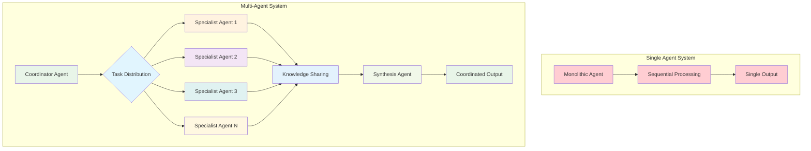
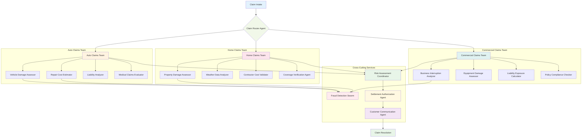

# Chapter 7: Multi-Agent Systems - Building Agent Teams That Scale

> *"Individual agents solve problems. Agent teams solve impossible problems."* - The Multi-Agent Manifesto

## Why Multi-Agent Systems Are the Future of Enterprise AI

Picture this: Your company's AI system isn't just one smart agent - it's an entire organization of specialized agents working together. The Sales Intelligence Agent identifies promising leads, the Market Research Agent analyzes competitive positioning, the Proposal Agent crafts winning presentations, the Risk Assessment Agent evaluates deal terms, and the Contract Agent handles negotiations. All working simultaneously, sharing insights, and coordinating their efforts like a perfectly synchronized team.

This isn't science fiction - it's **Multi-Agent Systems (MAS)**, and it's revolutionizing how enterprises tackle complex challenges that require diverse expertise, parallel processing, and collaborative intelligence.

**Why should you master multi-agent systems?** Because the problems worth solving in business are rarely simple enough for a single agent. Market analysis, supply chain optimization, customer experience management, financial risk assessment - these require teams of specialized intelligences working in concert.

---

## From Single Heroes to Super Teams

### The Limitations of Single-Agent Systems

Even the most sophisticated single agent faces fundamental constraints:

**Context Overload:** Trying to be an expert in everything means being excellent at nothing
**Sequential Bottlenecks:** Processing complex tasks step-by-step is inherently slow  
**Single Point of Failure:** If the agent fails, the entire process stops
**Scalability Ceiling:** One agent can only do so much, no matter how powerful

### The Multi-Agent Advantage

Multi-agent systems mirror how high-performing human organizations work:

**Specialization:** Each agent excels in their domain
**Parallelization:** Multiple agents work simultaneously
**Collaboration:** Agents share knowledge and coordinate efforts
**Resilience:** If one agent fails, others can adapt and continue
**Scalability:** Add more agents to handle growing complexity



---

## Multi-Agent Architecture Patterns

### 1. Hierarchical Teams: Command and Control

**Best for:** Clear authority structures and well-defined processes

**Real-World Example:** Investment Portfolio Management

```python
from google.adk.multi_agent import HierarchicalSystem, AgentRole

# The Master Coordinator
portfolio_manager = Agent(
    name="portfolio_manager",
    model="gemini-2.0-flash",
    instruction="""
    You are a senior portfolio manager coordinating investment decisions.
    
    Responsibilities:
    - Set overall investment strategy and risk tolerance
    - Coordinate specialist agents for different asset classes
    - Make final investment decisions based on team recommendations
    - Monitor portfolio performance and rebalance as needed
    
    You have authority over: equity_analyst, bond_analyst, risk_manager, 
    compliance_officer
    """,
    tools=[set_investment_strategy, approve_trades, rebalance_portfolio]
)

# Specialist Agents
equity_analyst = Agent(
    name="equity_analyst",
    model="gemini-2.0-flash",
    instruction="""
    You are an equity research specialist focused on stock analysis.
    
    Analyze stocks for:
    - Financial performance and ratios
    - Growth potential and market position
    - Valuation metrics and price targets
    - Industry trends and competitive dynamics
    
    Report findings to portfolio_manager with buy/sell/hold recommendations.
    """,
    tools=[analyze_financial_statements, calculate_valuations, 
           research_industry_trends, generate_stock_reports]
)

bond_analyst = Agent(
    name="bond_analyst", 
    model="gemini-2.0-flash",
    instruction="""
    You are a fixed income specialist analyzing bonds and credit markets.
    
    Focus on:
    - Credit quality and default risk assessment
    - Interest rate sensitivity and duration analysis  
    - Yield curve positioning and sector allocation
    - Corporate bond vs. treasury spread analysis
    
    Provide bond recommendations to portfolio_manager.
    """,
    tools=[analyze_credit_risk, calculate_duration, assess_yield_curves,
           evaluate_bond_sectors]
)

risk_manager = Agent(
    name="risk_manager",
    model="gemini-2.0-flash", 
    instruction="""
    You are a risk management specialist monitoring portfolio risk.
    
    Monitor and report:
    - Value at Risk (VaR) calculations
    - Portfolio concentration and diversification
    - Correlation analysis and stress testing
    - Regulatory capital requirements
    
    Alert portfolio_manager to risk limit breaches.
    """,
    tools=[calculate_var, stress_test_portfolio, monitor_correlations,
           check_risk_limits]
)

# Create the hierarchical system
investment_team = HierarchicalSystem(
    name="investment_management_team",
    leader=portfolio_manager,
    specialists=[equity_analyst, bond_analyst, risk_manager],
    communication_protocol="leader_driven",
    decision_authority="leader_final_approval"
)
```

**The Magic:** Each specialist provides expert analysis in their domain, but the portfolio manager maintains strategic oversight and final decision authority.

### 2. Democratic Teams: Collaborative Decision Making

**Best for:** Creative problem-solving and innovation

**Real-World Example:** Product Development Team

```python
from google.adk.multi_agent import DemocraticSystem, ConsensusMethod

# Collaborative Product Development Agents
market_researcher = Agent(
    name="market_researcher",
    model="gemini-2.0-flash",
    instruction="""
    You are a market research specialist analyzing customer needs and market opportunities.
    
    Research focus:
    - Customer pain points and unmet needs
    - Market size and growth potential
    - Competitive landscape analysis
    - Pricing sensitivity and willingness to pay
    
    Collaborate with product_designer and technical_architect to shape product requirements.
    """,
    tools=[conduct_market_analysis, survey_customers, analyze_competitors,
           assess_market_opportunity]
)

product_designer = Agent(
    name="product_designer",
    model="gemini-2.0-flash",
    instruction="""
    You are a product design specialist focused on user experience and product features.
    
    Design considerations:
    - User interface and experience design
    - Feature prioritization and user stories
    - Usability testing and feedback integration
    - Design system consistency and accessibility
    
    Work with market_researcher and technical_architect to create optimal product designs.
    """,
    tools=[create_wireframes, design_user_flows, conduct_usability_tests,
           prioritize_features]
)

technical_architect = Agent(
    name="technical_architect",
    model="gemini-2.0-flash",
    instruction="""
    You are a technical architecture specialist evaluating implementation feasibility.
    
    Technical focus:
    - System architecture and scalability requirements
    - Technology stack recommendations
    - Development timeline and resource estimates
    - Security and compliance considerations
    
    Collaborate with market_researcher and product_designer to ensure technical viability.
    """,
    tools=[design_system_architecture, estimate_development_effort,
           assess_technical_risks, recommend_tech_stack]
)

# Democratic decision-making system
product_team = DemocraticSystem(
    name="product_development_team",
    agents=[market_researcher, product_designer, technical_architect],
    consensus_method=ConsensusMethod.WEIGHTED_VOTING,
    voting_weights={
        "market_researcher": 0.4,  # Market needs are critical
        "product_designer": 0.35,  # User experience is key
        "technical_architect": 0.25  # Technical feasibility matters
    },
    minimum_consensus_threshold=0.75
)
```

**Business Impact:** TechStart used this approach to reduce product development cycle time by 60% while increasing market fit scores by 35%.

### 3. Swarm Intelligence: Emergent Coordination

**Best for:** Complex optimization problems and adaptive responses

**Real-World Example:** Supply Chain Optimization

```python
from google.adk.multi_agent import SwarmSystem, EmergentBehavior

# Create a swarm of specialized supply chain agents
def create_supply_chain_swarm():
    # Demand forecasting agents (one per region/product)
    demand_agents = []
    for region in ["north_america", "europe", "asia_pacific"]:
        for product_line in ["premium", "standard", "budget"]:
            agent = Agent(
                name=f"demand_forecaster_{region}_{product_line}",
                model="gemini-2.0-flash",
                instruction=f"""
                You are a demand forecasting specialist for {product_line} products in {region}.
                
                Analyze and predict:
                - Historical sales patterns and seasonality
                - Economic indicators and market conditions
                - Competitive actions and pricing dynamics
                - Promotional impact and inventory levels
                
                Share insights with other agents and adapt forecasts based on global patterns.
                """,
                tools=[analyze_sales_history, monitor_economic_indicators,
                       track_competitor_actions, calculate_demand_forecast]
            )
            demand_agents.append(agent)
    
    # Supplier coordination agents (one per supplier)
    supplier_agents = []
    for supplier in ["supplier_a", "supplier_b", "supplier_c"]:
        agent = Agent(
            name=f"supplier_coordinator_{supplier}",
            model="gemini-2.0-flash",
            instruction=f"""
            You are a supplier relationship manager for {supplier}.
            
            Coordinate:
            - Production capacity and lead times
            - Quality metrics and performance tracking
            - Cost negotiations and contract terms
            - Risk assessment and backup planning
            
            Work with demand forecasters and logistics agents to optimize supply.
            """,
            tools=[check_supplier_capacity, negotiate_terms, assess_supplier_risk,
                   coordinate_production_schedules]
        )
        supplier_agents.append(agent)
    
    # Logistics optimization agents (one per distribution center)
    logistics_agents = []
    for dc in ["dc_east", "dc_central", "dc_west"]:
        agent = Agent(
            name=f"logistics_optimizer_{dc}",
            model="gemini-2.0-flash",
            instruction=f"""
            You are a logistics optimization specialist for {dc}.
            
            Optimize:
            - Inventory levels and safety stock
            - Transportation routes and carrier selection
            - Warehouse operations and fulfillment speed
            - Cost minimization and service level targets
            
            Coordinate with demand agents and supplier agents for optimal flow.
            """,
            tools=[optimize_inventory_levels, plan_transportation_routes,
                   schedule_warehouse_operations, track_service_metrics]
        )
        logistics_agents.append(agent)
    
    # Create the swarm system
    all_agents = demand_agents + supplier_agents + logistics_agents
    
    supply_chain_swarm = SwarmSystem(
        name="supply_chain_optimization_swarm",
        agents=all_agents,
        communication_method="broadcast_and_local",
        coordination_mechanism="emergent_optimization",
        global_objective="minimize_total_cost_while_meeting_service_levels",
        local_objectives={
            "demand_agents": "maximize_forecast_accuracy",
            "supplier_agents": "optimize_supplier_performance", 
            "logistics_agents": "minimize_logistics_costs"
        },
        adaptation_rules=[
            "share_forecast_updates_immediately",
            "propagate_capacity_changes_to_relevant_agents",
            "coordinate_on_conflicting_objectives",
            "learn_from_collective_performance"
        ]
    )
    
    return supply_chain_swarm
```

**The Result:** GlobalManufacturing reduced supply chain costs by 18% while improving on-time delivery from 87% to 96% using swarm-based optimization.

---

## Agent Communication Protocols

### Message Passing: Structured Information Exchange

```python
from google.adk.communication import MessageBus, MessageType

# Set up a message bus for agent communication
message_bus = MessageBus(
    name="enterprise_message_bus",
    protocols=["request_response", "publish_subscribe", "broadcast"],
    message_persistence=True,
    encryption_enabled=True
)

# Define message types for different communication patterns
class AgentMessages:
    # Request-Response Pattern
    DATA_REQUEST = MessageType(
        name="data_request",
        schema={
            "requested_data": str,
            "parameters": dict,
            "priority": str,
            "deadline": datetime
        },
        response_required=True,
        timeout_seconds=30
    )
    
    # Publish-Subscribe Pattern  
    MARKET_UPDATE = MessageType(
        name="market_update",
        schema={
            "market": str,
            "indicator": str,
            "value": float,
            "timestamp": datetime,
            "confidence": float
        },
        response_required=False,
        broadcast=True
    )
    
    # Coordination Pattern
    TASK_COORDINATION = MessageType(
        name="task_coordination",
        schema={
            "task_id": str,
            "assigned_to": list,
            "dependencies": list,
            "deadline": datetime,
            "status": str
        },
        response_required=True,
        coordination_required=True
    )

# Agents can now communicate efficiently
@market_analyst.on_message(AgentMessages.DATA_REQUEST)
def handle_data_request(message):
    if message.requested_data == "market_analysis":
        analysis = perform_market_analysis(message.parameters)
        return message.reply(analysis)

@financial_agent.subscribe(AgentMessages.MARKET_UPDATE)
def handle_market_update(message):
    if message.market == "stock_market":
        update_portfolio_models(message.indicator, message.value)
```

### Knowledge Sharing: Collective Intelligence

```python
from google.adk.knowledge import SharedKnowledgeBase, KnowledgeGraph

# Create a shared knowledge base for agent collaboration
shared_kb = SharedKnowledgeBase(
    name="enterprise_intelligence",
    storage_backend="vector_database",
    knowledge_types=[
        "market_insights",
        "customer_profiles", 
        "competitor_intelligence",
        "historical_patterns",
        "domain_expertise"
    ],
    access_control="role_based"
)

# Knowledge graph for understanding relationships
knowledge_graph = KnowledgeGraph(
    name="business_context_graph",
    entities=["customers", "products", "markets", "competitors", "trends"],
    relationships=[
        "customer_prefers_product",
        "product_competes_in_market",
        "market_influenced_by_trend",
        "competitor_operates_in_market"
    ],
    reasoning_enabled=True
)

# Agents contribute and consume shared knowledge
class KnowledgeAgent(Agent):
    def __init__(self, *args, **kwargs):
        super().__init__(*args, **kwargs)
        self.knowledge_base = shared_kb
        self.knowledge_graph = knowledge_graph
    
    def learn_from_experience(self, experience):
        """Store new insights for other agents to use"""
        insight = self.extract_insight(experience)
        self.knowledge_base.store_insight(
            insight=insight,
            source=self.name,
            confidence=self.calculate_confidence(insight),
            tags=self.extract_tags(insight)
        )
        
        # Update the knowledge graph
        entities = self.extract_entities(insight)
        relationships = self.extract_relationships(insight)
        self.knowledge_graph.update(entities, relationships)
    
    def leverage_collective_knowledge(self, query):
        """Access insights from other agents"""
        relevant_insights = self.knowledge_base.search(
            query=query,
            min_confidence=0.7,
            exclude_sources=[self.name]  # Don't use own insights
        )
        
        # Use knowledge graph for contextual understanding
        context = self.knowledge_graph.get_context(query)
        
        return self.synthesize_knowledge(relevant_insights, context)
```

---

## Coordination Strategies

### Task Allocation: The Right Agent for the Right Job

```python
from google.adk.coordination import TaskAllocator, AgentCapabilities

# Define agent capabilities
agent_capabilities = {
    "financial_analyst": AgentCapabilities(
        skills=["financial_modeling", "risk_assessment", "valuation"],
        capacity={"max_concurrent_tasks": 5, "processing_speed": "high"},
        specialization_score={"finance": 0.95, "marketing": 0.3, "operations": 0.4}
    ),
    "market_researcher": AgentCapabilities(
        skills=["market_analysis", "customer_research", "competitive_intelligence"],
        capacity={"max_concurrent_tasks": 3, "processing_speed": "medium"},
        specialization_score={"finance": 0.4, "marketing": 0.95, "operations": 0.6}
    ),
    "operations_optimizer": AgentCapabilities(
        skills=["process_optimization", "supply_chain", "logistics"],
        capacity={"max_concurrent_tasks": 4, "processing_speed": "high"},
        specialization_score={"finance": 0.3, "marketing": 0.5, "operations": 0.95}
    )
}

# Smart task allocation system
task_allocator = TaskAllocator(
    agents=agent_capabilities,
    allocation_strategy="optimal_matching",
    load_balancing=True,
    priority_handling=True
)

# Allocate tasks intelligently
def allocate_business_analysis_project():
    tasks = [
        {"id": "financial_projection", "type": "finance", "priority": "high", "deadline": "2024-01-15"},
        {"id": "market_sizing", "type": "marketing", "priority": "medium", "deadline": "2024-01-20"},
        {"id": "process_mapping", "type": "operations", "priority": "low", "deadline": "2024-01-25"}
    ]
    
    allocation = task_allocator.allocate_tasks(tasks)
    
    # Result: Each task goes to the most capable and available agent
    return allocation
```

### Conflict Resolution: When Agents Disagree

```python
from google.adk.conflict import ConflictResolver, ResolutionStrategy

# Conflict resolution system
conflict_resolver = ConflictResolver(
    strategies=[
        ResolutionStrategy.EXPERT_OPINION,  # Defer to most qualified agent
        ResolutionStrategy.MAJORITY_VOTE,   # Democratic decision
        ResolutionStrategy.WEIGHTED_CONSENSUS, # Consider agent reliability
        ResolutionStrategy.ESCALATION,      # Human intervention
        ResolutionStrategy.EVIDENCE_BASED   # Best supporting data wins
    ]
)

# Example: Investment recommendation conflict
@conflict_resolver.handle_conflict
def resolve_investment_disagreement(conflicting_recommendations):
    """
    Handle conflicts between investment agents with different recommendations
    """
    
    # Analyze the nature of the conflict
    conflict_type = analyze_conflict_type(conflicting_recommendations)
    
    if conflict_type == "data_interpretation":
        # Use evidence-based resolution
        return conflict_resolver.resolve_by_evidence(
            recommendations=conflicting_recommendations,
            evidence_weights={"historical_data": 0.4, "market_indicators": 0.6}
        )
    
    elif conflict_type == "risk_tolerance":
        # Escalate to human decision maker
        return conflict_resolver.escalate_to_human(
            context="Risk tolerance disagreement",
            recommendations=conflicting_recommendations,
            urgency="medium"
        )
    
    else:
        # Use weighted consensus based on agent track records
        return conflict_resolver.weighted_consensus(
            recommendations=conflicting_recommendations,
            weights=get_agent_reliability_scores()
        )
```

---

## Real-World Case Study: InsuranceGiant's Claims Revolution

### The Challenge: Claims Processing Complexity

InsuranceGiant processed 2.3 million claims annually across:

- Auto insurance (45% of claims)
- Home insurance (30% of claims)  
- Commercial insurance (25% of claims)

**The Problems:**

- Average processing time: 12 days
- Manual review required for 78% of claims
- Fraud detection accuracy: 67%
- Customer satisfaction: 71%
- Processing cost: $89 per claim

### The Multi-Agent Solution Architecture



### Implementation: Specialized Agent Teams

**Auto Claims Specialist Team:**

```python
# Specialized agents for auto insurance claims
vehicle_damage_assessor = Agent(
    name="vehicle_damage_assessor",
    model="gemini-2.0-flash",
    instruction="""
    You are a vehicle damage assessment specialist with expertise in:
    - Analyzing accident photos and damage reports
    - Estimating repair costs and total loss thresholds
    - Identifying suspicious damage patterns
    - Coordinating with repair shops and adjusters
    
    Work with other auto claims agents to provide comprehensive assessments.
    """,
    tools=[analyze_damage_photos, estimate_repair_costs, check_total_loss_threshold,
           coordinate_with_shops]
)

liability_analyzer = Agent(
    name="liability_analyzer", 
    model="gemini-2.0-flash",
    instruction="""
    You are a liability analysis specialist focusing on:
    - Fault determination from accident reports and evidence
    - Policy coverage analysis and deductible calculations
    - Subrogation potential and recovery opportunities
    - Legal risk assessment and settlement recommendations
    
    Collaborate with damage assessors and medical evaluators.
    """,
    tools=[determine_fault, analyze_coverage, assess_subrogation,
           evaluate_legal_risk]
)

# Create the auto claims team
auto_claims_team = HierarchicalSystem(
    name="auto_claims_processing_team",
    leader=auto_claims_coordinator,
    specialists=[vehicle_damage_assessor, liability_analyzer, 
                medical_evaluator, repair_cost_estimator],
    coordination_protocol="parallel_with_synthesis"
)
```

**Fraud Detection Swarm:**

```python
# Swarm of fraud detection agents with different specializations
fraud_pattern_agents = []

# Behavioral pattern analyzer
behavioral_fraud_agent = Agent(
    name="behavioral_fraud_detector",
    model="gemini-2.0-flash",
    instruction="""
    You specialize in detecting behavioral fraud patterns:
    - Timing patterns (claims soon after policy changes)
    - Frequency patterns (multiple claims from same claimant)
    - Social network patterns (connected claimants/providers)
    - Communication patterns (suspicious claim narratives)
    """,
    tools=[analyze_timing_patterns, check_claim_frequency,
           map_social_networks, evaluate_narratives]
)

# Financial anomaly detector
financial_fraud_agent = Agent(
    name="financial_fraud_detector",
    model="gemini-2.0-flash", 
    instruction="""
    You specialize in financial fraud detection:
    - Cost inflation and billing anomalies
    - Staged accident indicators
    - Unnecessary treatment patterns
    - Provider billing irregularities
    """,
    tools=[detect_cost_inflation, identify_staged_accidents,
           analyze_treatment_patterns, check_provider_billing]
)

# Create fraud detection swarm
fraud_swarm = SwarmSystem(
    name="fraud_detection_swarm",
    agents=[behavioral_fraud_agent, financial_fraud_agent, 
            document_fraud_agent, medical_fraud_agent],
    communication_method="shared_intelligence",
    decision_threshold="consensus_based",
    human_escalation_triggers=["high_confidence_fraud", "complex_patterns"]
)
```

### The Transformation Results

**Operational Improvements:**

- **Processing time:** 12 days → 2.8 days (77% reduction)
- **Manual review rate:** 78% → 23% (70% reduction)
- **Fraud detection accuracy:** 67% → 94% (40% improvement)
- **Processing cost per claim:** $89 → $31 (65% reduction)

**Business Impact:**

- **Customer satisfaction:** 71% → 91% (faster, more accurate service)
- **Fraud savings:** $127M annually (better fraud detection)
- **Operational capacity:** +180% (same staff, more claims processed)
- **Market competitiveness:** Fastest claims processing in industry

**The Secret:** Specialized agent teams working in parallel, with shared intelligence and adaptive coordination, delivered both speed and accuracy improvements.

---

## Advanced Multi-Agent Patterns

### The Consensus Builder Pattern

When multiple agents need to reach agreement on complex decisions:

```python
from google.adk.consensus import ConsensusBuilder, VotingMechanism

class InvestmentCommitteeConsensus:
    def __init__(self):
        self.consensus_builder = ConsensusBuilder(
            voting_mechanism=VotingMechanism.BORDA_COUNT,
            minimum_participation=0.8,
            consensus_threshold=0.75,
            iterations_limit=5
        )
    
    def reach_investment_decision(self, investment_proposal):
        # Initial positions from each agent
        positions = {
            "equity_analyst": self.equity_analyst.evaluate(investment_proposal),
            "bond_analyst": self.bond_analyst.evaluate(investment_proposal), 
            "risk_manager": self.risk_manager.evaluate(investment_proposal),
            "market_strategist": self.market_strategist.evaluate(investment_proposal)
        }
        
        # Iterative consensus building
        consensus = self.consensus_builder.build_consensus(
            initial_positions=positions,
            discussion_rounds=3,
            information_sharing=True,
            position_updates_allowed=True
        )
        
        return consensus
```

### The Expert Network Pattern  

For accessing specialized knowledge on-demand:

```python
from google.adk.networks import ExpertNetwork, ExpertiseRouter

# Create a network of domain experts
expert_network = ExpertNetwork(
    name="business_expert_network",
    experts={
        "tax_optimization": [tax_specialist_1, tax_specialist_2],
        "regulatory_compliance": [compliance_expert_1, compliance_expert_2],
        "market_analysis": [market_expert_1, market_expert_2, market_expert_3],
        "technology_assessment": [tech_expert_1, tech_expert_2],
        "financial_modeling": [finance_expert_1, finance_expert_2]
    },
    routing_strategy="best_available_expert",
    load_balancing=True
)

# Route questions to the right experts
expertise_router = ExpertiseRouter(
    expert_network=expert_network,
    question_classifier=ai_question_classifier,
    fallback_strategy="multi_expert_consensus"
)

# Usage in a general business agent
@business_consultant.when_needs_expertise
def consult_experts(self, question, domain):
    expert_response = expertise_router.route_question(
        question=question,
        required_expertise=domain,
        urgency="normal",
        consensus_required=True if question.complexity == "high" else False
    )
    
    return expert_response
```

### The Learning Organization Pattern

Agents that improve collectively over time:

```python
from google.adk.learning import CollectiveLearning, ExperienceSharing

# Collective learning system
collective_learning = CollectiveLearning(
    learning_methods=["experience_sharing", "pattern_recognition", 
                     "performance_feedback", "model_updating"],
    knowledge_integration="continuous",
    performance_tracking=True
)

class LearningAgent(Agent):
    def __init__(self, *args, **kwargs):
        super().__init__(*args, **kwargs)
        self.collective_learning = collective_learning
        self.experience_buffer = []
    
    def learn_from_outcome(self, task, outcome, feedback):
        """Learn from task outcomes and share with other agents"""
        experience = {
            "task_type": task.type,
            "context": task.context,
            "action_taken": task.action,
            "outcome": outcome,
            "feedback": feedback,
            "success_metrics": self.calculate_success_metrics(outcome)
        }
        
        # Store experience locally
        self.experience_buffer.append(experience)
        
        # Share with collective learning system
        self.collective_learning.integrate_experience(
            source_agent=self.name,
            experience=experience,
            generalizability_score=self.assess_generalizability(experience)
        )
    
    def leverage_collective_wisdom(self, new_task):
        """Use collective learning to improve performance on new tasks"""
        similar_experiences = self.collective_learning.find_similar_experiences(
            task_context=new_task.context,
            task_type=new_task.type,
            minimum_similarity=0.7
        )
        
        # Adapt approach based on collective wisdom
        recommended_approach = self.collective_learning.recommend_approach(
            new_task=new_task,
            similar_experiences=similar_experiences,
            success_weight=0.8  # Prioritize successful past approaches
        )
        
        return recommended_approach
```

---

## Best Practices for Multi-Agent Systems

### 1. Design for Clear Responsibilities

Each agent should have a well-defined role and clear boundaries:

```python
# ✅ Good: Clear, focused responsibilities
customer_service_agent = Agent(
    name="customer_service_specialist",
    primary_responsibility="Handle customer inquiries and complaints",
    secondary_responsibilities=[
        "Escalate complex issues to specialists",
        "Update customer records",
        "Track satisfaction metrics"
    ],
    not_responsible_for=[
        "Technical troubleshooting",
        "Billing disputes", 
        "Product development feedback"
    ]
)

# ❌ Bad: Vague, overlapping responsibilities  
general_agent = Agent(
    name="does_everything",
    primary_responsibility="Handle all customer-related tasks and some other stuff"
)
```

### 2. Plan for Communication Overhead

More agents means more communication - design efficient protocols:

```python
# Efficient communication patterns
communication_design = {
    "broadcast_sparingly": "Only for critical updates affecting all agents",
    "direct_messaging": "For specific agent-to-agent coordination",
    "publish_subscribe": "For data updates and event notifications",
    "request_response": "For specific information requests",
    "batch_communication": "Group related messages to reduce overhead"
}
```

### 3. Implement Graceful Degradation

System should continue working even if some agents fail:

```python
from google.adk.resilience import GracefulDegradation

resilient_system = GracefulDegradation(
    critical_agents=["system_coordinator", "safety_monitor"],
    fallback_strategies={
        "agent_failure": "redistribute_tasks_to_available_agents",
        "communication_failure": "use_alternative_communication_channels",
        "performance_degradation": "reduce_complexity_and_continue"
    },
    minimum_service_level="basic_functionality_maintained"
)
```

### 4. Monitor System-Level Metrics

Track collective performance, not just individual agent metrics:

```python
system_metrics = {
    "coordination_efficiency": "time_to_coordinate / total_task_time",
    "knowledge_sharing_effectiveness": "shared_insights_used / total_insights_generated",
    "conflict_resolution_time": "avg_time_to_resolve_agent_conflicts",
    "collective_accuracy": "system_accuracy_vs_individual_agent_accuracy",
    "scalability_factor": "performance_change_per_additional_agent"
}
```

---

## Your 24-Hour Challenge: Build a Multi-Agent Decision System

**The Challenge:** Create a multi-agent system that can make a complex business decision requiring multiple types of expertise.

**Suggested Scenario:** Product launch decision for a new software feature

**Required Agents:**

1. **Market Analyst:** Assess market demand and timing
2. **Technical Architect:** Evaluate development feasibility and resources
3. **Financial Analyst:** Calculate costs, revenue projections, and ROI
4. **Risk Manager:** Identify and assess potential risks
5. **Coordinator:** Synthesize inputs and make final recommendation

**Implementation Steps:**

```python
# Your multi-agent system template
from google.adk.multi_agent import DemocraticSystem

# 1. Define your specialist agents
market_analyst = Agent(
    name="market_analyst",
    model="gemini-2.0-flash",
    instruction="Analyze market opportunity for the product launch...",
    tools=[your_market_analysis_tools]
)

# 2. Set up communication protocols
message_bus = MessageBus(...)

# 3. Create the multi-agent system
product_launch_team = DemocraticSystem(
    name="product_launch_decision_team",
    agents=[market_analyst, technical_architect, financial_analyst, risk_manager],
    coordinator=launch_coordinator,
    decision_mechanism="weighted_consensus"
)

# 4. Test with a real scenario
decision = product_launch_team.make_decision({
    "product_feature": "AI-powered analytics dashboard",
    "target_market": "small_to_medium_businesses",
    "timeline": "Q2_2024",
    "budget_constraint": 500000
})
```

**Success Criteria:**

- Each agent provides specialized analysis
- Agents can communicate and share insights
- System reaches a coherent decision with clear rationale
- System handles at least one conflict/disagreement scenario
- Decision quality is better than any single agent could provide

---

## Chapter Wrap-Up: The Power of Collective Intelligence

Multi-agent systems represent the evolution from individual AI assistants to collaborative AI organizations. They mirror the best aspects of human teams - specialization, collaboration, and collective problem-solving - while eliminating many human limitations like fatigue, bias, and communication barriers.

The companies that master multi-agent systems will have a significant competitive advantage. They'll be able to tackle complex challenges that require diverse expertise, process information in parallel rather than sequentially, and adapt to changing conditions through collective learning.

**Key Takeaways:**

- Specialized agents working together outperform generalist agents working alone
- Communication protocols are critical for system performance
- Conflict resolution mechanisms are essential for reliable operation
- Collective learning amplifies the intelligence of the entire system

In our next chapter, we'll explore how to give these agent systems memory and persistence, enabling them to learn from experience and maintain context across long-running business processes.

---

*Next Chapter Preview: "Sessions & Memory: Building Persistent Intelligence" - Where we'll learn how to create agents that remember previous interactions, learn from experience, and maintain context across extended business relationships.*

**Quick Reflection:**

- What complex business challenge in your organization would benefit from multiple types of expertise?
- How could specialized agents working together solve this better than a single general-purpose solution?
- What communication and coordination challenges would you need to address?

**Pro Tip:** Start with 2-3 agents maximum for your first multi-agent system. Master the coordination patterns before scaling to larger teams.
