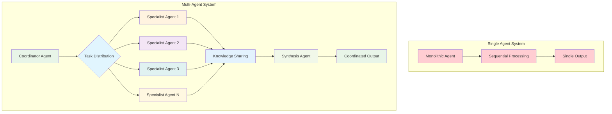
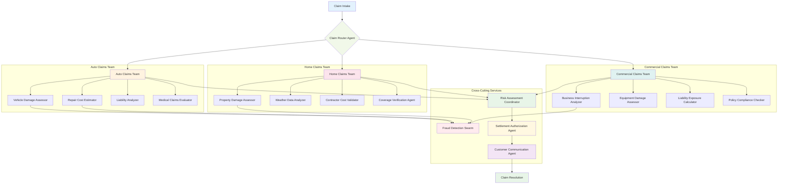

# Chapter 7: Multi-Agent Systems - Building Agent Teams That Scale

> *"Individual agents solve problems. Agent teams solve impossible problems."* - The Multi-Agent Manifesto

## Why Multi-Agent Systems Are the Future of Enterprise AI

Picture this: Your company's AI system isn't just one smart agent - it's an entire organization of specialized agents working together. The Sales Intelligence Agent identifies promising leads, the Market Research Agent analyzes competitive positioning, the Proposal Agent crafts winning presentations, the Risk Assessment Agent evaluates deal terms, and the Contract Agent handles negotiations. All working simultaneously, sharing insights, and coordinating their efforts like a perfectly synchronized team.

This isn't science fiction - it's **Multi-Agent Systems (MAS)** powered by Google's Agent Development Kit (ADK), and it's revolutionizing how enterprises tackle complex challenges that require diverse expertise, parallel processing, and collaborative intelligence.

**Why should you master multi-agent systems?** Because the problems worth solving in business are rarely simple enough for a single agent. Market analysis, supply chain optimization, customer experience management, financial risk assessment - these require teams of specialized intelligences working in concert.

**What You'll Learn in This Chapter:**

- How to design and implement multi-agent architectures using Google ADK
- Proven patterns: Hierarchical teams, democratic coordination, and swarm intelligence  
- Real-world implementation strategies with actual ADK code examples
- Communication and coordination mechanisms that scale
- Production-ready patterns from enterprise deployments

---

## From Single Heroes to Super Teams

### The Limitations of Single-Agent Systems

Even the most sophisticated single agent faces fundamental constraints:

**Context Overload:** Trying to be an expert in everything means being excellent at nothing
**Sequential Bottlenecks:** Processing complex tasks step-by-step is inherently slow  
**Single Point of Failure:** If the agent fails, the entire process stops
**Scalability Ceiling:** One agent can only do so much, no matter how powerful

### The Multi-Agent Advantage

Multi-agent systems mirror how high-performing human organizations work:

**Specialization:** Each agent excels in their domain
**Parallelization:** Multiple agents work simultaneously
**Collaboration:** Agents share knowledge and coordinate efforts
**Resilience:** If one agent fails, others can adapt and continue
**Scalability:** Add more agents to handle growing complexity



---

## Multi-Agent Architecture Patterns with Google ADK

Google's Agent Development Kit (ADK) provides three foundational patterns for building multi-agent systems, each designed for specific use cases and coordination requirements.

### 1. Hierarchical Coordination Pattern

**Best for:** Clear authority structures, well-defined processes, and centralized decision-making

**ADK Implementation:** Using parent-child agent relationships with `sub_agents`

**Real-World Example:** Investment Portfolio Management

```python
from google.adk.agents import Agent

# Specialist agents with clearly defined roles
equity_analyst = Agent(
    name="equity_analyst",
    model="gemini-2.0-flash",
    description="Analyzes stocks for financial performance, growth potential, and valuation.",
    instruction="""
    You are an equity research specialist focused on stock analysis.
    
    Analyze stocks for:
    - Financial performance and ratios
    - Growth potential and market position
    - Valuation metrics and price targets
    - Industry trends and competitive dynamics
    
    Provide clear buy/sell/hold recommendations with supporting analysis.
    """,
    tools=[analyze_financial_statements, calculate_valuations, 
           research_industry_trends, generate_stock_reports]
)

bond_analyst = Agent(
    name="bond_analyst", 
    model="gemini-2.0-flash",
    description="Analyzes fixed income securities and credit markets.",
    instruction="""
    You are a fixed income specialist analyzing bonds and credit markets.
    
    Focus on:
    - Credit quality and default risk assessment
    - Interest rate sensitivity and duration analysis  
    - Yield curve positioning and sector allocation
    - Corporate bond vs. treasury spread analysis
    
    Provide bond recommendations with risk-adjusted returns.
    """,
    tools=[analyze_credit_risk, calculate_duration, assess_yield_curves,
           evaluate_bond_sectors]
)

risk_manager = Agent(
    name="risk_manager",
    model="gemini-2.0-flash",
    description="Monitors portfolio risk and compliance requirements.",
    instruction="""
    You are a risk management specialist monitoring portfolio risk.
    
    Monitor and report:
    - Value at Risk (VaR) calculations
    - Portfolio concentration and diversification
    - Correlation analysis and stress testing
    - Regulatory capital requirements
    
    Alert immediately to any risk limit breaches.
    """,
    tools=[calculate_var, stress_test_portfolio, monitor_correlations,
           check_risk_limits]
)

# Coordinator agent with hierarchical authority
portfolio_manager = Agent(
    name="portfolio_manager",
    model="gemini-2.0-flash",
    description="Senior portfolio manager coordinating investment decisions.",
    instruction="""
    You are a senior portfolio manager coordinating investment decisions.
    
    Responsibilities:
    - Set overall investment strategy and risk tolerance
    - Coordinate specialist agents for different asset classes
    - Make final investment decisions based on team recommendations
    - Monitor portfolio performance and rebalance as needed
    
    Use your sub-agents for specialized analysis, then make final decisions.
    """,
    sub_agents=[equity_analyst, bond_analyst, risk_manager],  # ADK hierarchical structure
    tools=[set_investment_strategy, approve_trades, rebalance_portfolio]
)
```

**Key ADK Features:**

- **Agent Hierarchy:** Using `sub_agents` parameter establishes parent-child relationships
- **Automatic Delegation:** ADK's `transfer_to_agent()` function enables dynamic routing
- **State Sharing:** All agents access the same session state for coordination

### 2. Collaborative Workflow Pattern

**Best for:** Creative problem-solving, iterative processes, and democratic decision-making

**ADK Implementation:** Using `SequentialAgent` and `ParallelAgent` for structured workflows

**Real-World Example:** Product Development Team

```python
from google.adk.agents import Agent, SequentialAgent, ParallelAgent

# Phase 1: Parallel market and technical research
market_researcher = Agent(
    name="market_researcher",
    model="gemini-2.0-flash",
    description="Analyzes market opportunities and customer needs.",
    instruction="""
    Research and analyze:
    - Customer pain points and unmet needs
    - Market size and growth potential
    - Competitive landscape analysis
    - Pricing sensitivity and willingness to pay
    
    Save findings to session state for the team to use.
    """,
    tools=[conduct_market_analysis, survey_customers, analyze_competitors],
    output_key="market_research"  # Automatically saves results to session state
)

technical_architect = Agent(
    name="technical_architect",
    model="gemini-2.0-flash",
    description="Evaluates technical feasibility and implementation approach.",
    instruction="""
    Assess technical considerations:
    - System architecture and scalability requirements
    - Technology stack recommendations
    - Development timeline and resource estimates
    - Security and compliance considerations
    
    Save technical assessment to session state.
    """,
    tools=[design_system_architecture, estimate_development_effort,
           assess_technical_risks, recommend_tech_stack],
    output_key="technical_assessment"
)

# Parallel research phase
research_phase = ParallelAgent(
    name="research_phase",
    sub_agents=[market_researcher, technical_architect]
)

# Phase 2: Product design using research results
product_designer = Agent(
    name="product_designer",
    model="gemini-2.0-flash",
    description="Creates user-centered product designs.",
    instruction="""
    Using the market research and technical assessment from session state:
    - Design user interface and experience flows
    - Prioritize features based on market needs and technical constraints
    - Create wireframes and user stories
    - Ensure accessibility and usability standards
    
    Balance market demands with technical feasibility.
    """,
    tools=[create_wireframes, design_user_flows, prioritize_features],
    output_key="product_design"
)

# Sequential workflow: Research → Design
product_development_workflow = SequentialAgent(
    name="product_development_workflow",
    sub_agents=[research_phase, product_designer]
)
```

**Key ADK Features:**

- **Sequential Coordination:** `SequentialAgent` runs sub-agents in order
- **Parallel Execution:** `ParallelAgent` runs multiple agents simultaneously  
- **State Management:** `output_key` automatically saves agent results to shared state
- **Context Sharing:** Agents read previous results from session state

### 3. Dynamic Orchestration Pattern

**Best for:** Adaptive workflows, complex decision trees, and intelligent routing

**ADK Implementation:** Using LLM-driven delegation with `transfer_to_agent()`

**Real-World Example:** Customer Service System

```python
from google.adk.agents import Agent

# Specialized service agents
billing_specialist = Agent(
    name="billing_specialist",
    model="gemini-2.0-flash",
    description="Handles billing inquiries, payment issues, and account management.",
    instruction="""
    You are a billing specialist. Handle:
    - Payment processing issues
    - Billing discrepancies
    - Account balance inquiries
    - Subscription changes
    
    Resolve billing issues efficiently and escalate complex cases.
    """,
    tools=[process_payments, check_account_balance, update_billing_info],
    # This agent doesn't transfer - it's a terminal specialist
    disallow_transfer_to_parent=True,
    disallow_transfer_to_peers=True
)

technical_support = Agent(
    name="technical_support",
    model="gemini-2.0-flash",
    description="Provides technical assistance and troubleshooting.",
    instruction="""
    You are a technical support specialist. Handle:
    - Software installation and configuration
    - Troubleshooting technical issues
    - API integration support
    - Performance optimization
    
    Provide step-by-step technical solutions.
    """,
    tools=[diagnose_technical_issues, provide_troubleshooting_steps, 
           check_system_status, generate_api_examples],
    disallow_transfer_to_parent=True,
    disallow_transfer_to_peers=True
)

sales_consultant = Agent(
    name="sales_consultant", 
    model="gemini-2.0-flash",
    description="Assists with product information, demos, and sales inquiries.",
    instruction="""
    You are a sales consultant. Handle:
    - Product feature explanations
    - Pricing and plan comparisons
    - Demo scheduling
    - Upgrade recommendations
    
    Focus on understanding customer needs and matching solutions.
    """,
    tools=[explain_features, compare_pricing_plans, schedule_demos,
           recommend_upgrades],
    disallow_transfer_to_parent=True,
    disallow_transfer_to_peers=True
)

# Intelligent coordinator with dynamic routing
customer_service_coordinator = Agent(
    name="customer_service_coordinator",
    model="gemini-2.0-flash",
    description="Routes customer inquiries to appropriate specialists.",
    instruction="""
    You are a customer service coordinator. Analyze incoming requests and route them:
    
    - Route billing questions (payments, charges, accounts) to billing_specialist
    - Route technical issues (bugs, integrations, performance) to technical_support  
    - Route sales inquiries (features, pricing, demos) to sales_consultant
    
    If unsure, ask clarifying questions before routing.
    The model will automatically use transfer_to_agent() for routing.
    """,
    sub_agents=[billing_specialist, technical_support, sales_consultant],
    tools=[log_customer_interaction, escalate_to_human]
)
```

**Key ADK Features:**

- **LLM-Driven Routing:** The coordinator's LLM automatically calls `transfer_to_agent()`
- **Transfer Control:** `disallow_transfer_*` parameters control delegation scope
- **Intelligent Decision Making:** The LLM analyzes context to route appropriately
- **Fallback Mechanisms:** Human escalation tools for complex cases

---

## ADK Communication and Coordination Mechanisms

Google ADK provides three core primitives for agent communication and coordination:

### 1. Shared Session State (`session.state`)

The primary way for agents to share information within the same session:

```python
from google.adk.agents import LlmAgent
from google.adk.tools.tool_context import ToolContext

# Agent that writes to shared state
market_analyst = LlmAgent(
    name="market_analyst",
    model="gemini-2.0-flash",
    description="Analyzes market data and saves insights to session state.",
    instruction="""
    Analyze market data and save key insights for other agents to use.
    Use tools to save findings to session state.
    """,
    tools=[analyze_market_data],
    output_key="market_analysis"  # Automatically saves final response to state
)

def analyze_market_data(symbol: str, tool_context: ToolContext) -> dict:
    """Analyze market data and save insights to shared state."""
    
    # Perform analysis
    analysis = {
        "symbol": symbol,
        "trend": "bullish",
        "confidence": 0.85,
        "key_indicators": ["volume_spike", "momentum_increase"]
    }
    
    # Write to shared session state
    tool_context.state["market_insights"] = analysis
    tool_context.state["last_analysis_time"] = datetime.now().isoformat()
    
    return analysis

# Agent that reads from shared state
portfolio_manager = LlmAgent(
    name="portfolio_manager",
    model="gemini-2.0-flash",
    description="Makes investment decisions based on market analysis.",
    instruction="""
    Make investment decisions using market insights from session state.
    Check state for 'market_insights' and 'last_analysis_time'.
    """,
    tools=[make_investment_decision]
)

def make_investment_decision(action: str, tool_context: ToolContext) -> dict:
    """Make investment decisions using shared state insights."""
    
    # Read from shared session state
    market_insights = tool_context.state.get("market_insights", {})
    last_analysis = tool_context.state.get("last_analysis_time")
    
    if market_insights and market_insights.get("confidence", 0) > 0.8:
        decision = f"Execute {action} based on {market_insights['trend']} trend"
    else:
        decision = f"Hold position - insufficient confidence in analysis"
    
    return {"decision": decision, "based_on": market_insights}
```

### 2. LLM-Driven Transfer (`transfer_to_agent`)

ADK's AutoFlow automatically enables intelligent delegation between agents:

```python
from google.adk.agents import LlmAgent

# Specialist agents
research_analyst = LlmAgent(
    name="research_analyst",
    model="gemini-2.0-flash",
    description="Conducts detailed financial research and fundamental analysis.",
    instruction="Perform in-depth financial research. Use available tools to gather data.",
    tools=[research_financials, analyze_fundamentals],
    disallow_transfer_to_parent=True,  # Prevents transferring back
    disallow_transfer_to_peers=True    # Prevents peer transfers
)

technical_analyst = LlmAgent(
    name="technical_analyst", 
    model="gemini-2.0-flash",
    description="Performs technical analysis and chart pattern recognition.",
    instruction="Analyze price charts and technical indicators.",
    tools=[analyze_charts, identify_patterns],
    disallow_transfer_to_parent=True,
    disallow_transfer_to_peers=True
)

# Coordinator with LLM-driven delegation
investment_coordinator = LlmAgent(
    name="investment_coordinator",
    model="gemini-2.0-flash",
    description="Coordinates investment analysis by routing to specialist agents.",
    instruction="""
    You coordinate investment analysis. Route requests to specialists:
    
    - For fundamental analysis, research, or company data: use research_analyst
    - For technical analysis, charts, or price patterns: use technical_analyst
    
    The LLM will automatically call transfer_to_agent() when appropriate.
    """,
    sub_agents=[research_analyst, technical_analyst],
    tools=[summarize_analysis]
)

# Usage: The LLM automatically generates transfer_to_agent() calls
# User: "What's the technical outlook for AAPL?"
# LLM generates: transfer_to_agent(agent_name="technical_analyst")
```

### 3. Explicit Invocation (`AgentTool`)

Use agents as tools for controlled, synchronous invocation:

```python
from google.adk.agents import LlmAgent
from google.adk.tools import agent_tool

# Specialist agent for risk assessment
risk_assessor = LlmAgent(
    name="risk_assessor",
    model="gemini-2.0-flash",
    description="Assesses investment risk and calculates risk metrics.",
    instruction="Calculate comprehensive risk metrics for investments.",
    tools=[calculate_var, assess_volatility, analyze_correlations]
)

# Wrap agent as a tool
risk_tool = agent_tool.AgentTool(agent=risk_assessor)

# Parent agent that uses other agents as tools
portfolio_optimizer = LlmAgent(
    name="portfolio_optimizer",
    model="gemini-2.0-flash",
    description="Optimizes portfolio allocation using risk assessment.",
    instruction="""
    Optimize portfolio allocation. Use the risk_assessor tool to evaluate
    risk before making allocation decisions.
    """,
    tools=[risk_tool, optimize_allocation, rebalance_portfolio]
)

# The LLM will call the risk_assessor agent like any other tool:
# Function call: risk_assessor(investment_data="...", analysis_type="comprehensive")
```

---

## Advanced Multi-Agent Coordination Patterns

### Workflow-Based Coordination

ADK provides specialized workflow agents for structured coordination:

```python
from google.adk.agents import SequentialAgent, ParallelAgent, LoopAgent

# Sequential processing pipeline
data_processing_pipeline = SequentialAgent(
    name="data_processing_pipeline",
    sub_agents=[
        data_validator,    # Validates input data
        data_transformer,  # Transforms data format
        data_analyzer,     # Analyzes processed data
        report_generator   # Generates final report
    ]
)

# Parallel analysis for multiple perspectives
multi_perspective_analysis = ParallelAgent(
    name="multi_perspective_analysis", 
    sub_agents=[
        technical_analyst,    # Technical analysis
        fundamental_analyst,  # Fundamental analysis
        sentiment_analyst     # Market sentiment analysis
    ]
)

# Iterative refinement with session state termination condition
from google.adk.tools.tool_context import ToolContext

def check_quality_threshold(tool_context: ToolContext) -> dict:
    """Check if quality threshold is met for loop termination."""
    quality_score = tool_context.state.get("quality_score", 0)
    meets_threshold = quality_score >= 0.9
    
    # Update state to signal loop completion
    if meets_threshold:
        tool_context.state["quality_check_complete"] = True
    
    return {
        "quality_score": quality_score,
        "meets_threshold": meets_threshold,
        "should_continue": not meets_threshold
    }

quality_checker = Agent(
    name="quality_checker",
    model="gemini-2.0-flash",
    description="Checks if quality threshold is met.",
    instruction="""
    Check the quality_score from session state.
    If quality_score >= 0.9, mark quality_check_complete as True.
    """,
    tools=[check_quality_threshold]
)

iterative_improvement = LoopAgent(
    name="iterative_improvement",
    max_iterations=5,
    sub_agents=[
        content_generator,  # Generates content
        quality_evaluator,  # Evaluates quality and sets state
        quality_checker     # Checks termination condition
    ]
)
```

### State-Based Coordination

Use session state to coordinate complex workflows:

```python
from google.adk.tools.tool_context import ToolContext

def coordinate_investment_analysis(symbol: str, tool_context: ToolContext) -> dict:
    """Coordinates multi-step investment analysis using session state."""
    
    # Set up coordination state
    analysis_state = {
        "symbol": symbol,
        "steps_completed": [],
        "current_step": "technical_analysis",
        "results": {}
    }
    tool_context.state["investment_analysis"] = analysis_state
    
    return {"status": "analysis_initiated", "symbol": symbol}

def technical_analysis_step(tool_context: ToolContext) -> dict:
    """Performs technical analysis step."""
    analysis_state = tool_context.state.get("investment_analysis", {})
    
    # Perform technical analysis
    technical_results = {
        "trend": "bullish",
        "support_level": 150.00,
        "resistance_level": 180.00
    }
    
    # Update coordination state
    analysis_state["results"]["technical"] = technical_results
    analysis_state["steps_completed"].append("technical_analysis")
    analysis_state["current_step"] = "fundamental_analysis"
    tool_context.state["investment_analysis"] = analysis_state
    
    return technical_results

def check_analysis_completion(tool_context: ToolContext) -> dict:
    """Checks if all analysis steps are complete."""
    analysis_state = tool_context.state.get("investment_analysis", {})
    completed_steps = analysis_state.get("steps_completed", [])
    
    required_steps = ["technical_analysis", "fundamental_analysis", "risk_assessment"]
    is_complete = all(step in completed_steps for step in required_steps)
    
    if is_complete:
        # Generate final recommendation
        results = analysis_state.get("results", {})
        recommendation = synthesize_recommendation(results)
        tool_context.state["final_recommendation"] = recommendation
        
    return {
        "complete": is_complete,
        "remaining_steps": [s for s in required_steps if s not in completed_steps]
    }
```

### Human-in-the-Loop Coordination

Integrate human oversight into agent workflows:

```python
from google.adk.tools import FunctionTool

def request_human_approval(decision: str, context: dict, tool_context: ToolContext) -> dict:
    """Requests human approval for critical decisions."""
    
    approval_request = {
        "decision": decision,
        "context": context,
        "timestamp": datetime.now().isoformat(),
        "status": "pending"
    }
    
    # Save request to state for external system to process
    tool_context.state["approval_request"] = approval_request
    
    # In a real implementation, this would integrate with an external approval system
    # For demo purposes, we'll simulate approval logic
    if context.get("risk_level") == "low":
        approval_request["status"] = "auto_approved"
        approval_request["approved_by"] = "system"
    else:
        approval_request["status"] = "requires_human_review"
    
    tool_context.state["approval_request"] = approval_request
    return approval_request

# Agent that requires human approval for high-risk decisions
risk_sensitive_agent = LlmAgent(
    name="risk_sensitive_agent",
    model="gemini-2.0-flash",
    description="Makes decisions requiring human oversight for high-risk scenarios.",
    instruction="""
    Analyze the risk level of decisions. For high-risk decisions, use the 
    request_human_approval tool before proceeding.
    """,
    tools=[request_human_approval, execute_decision]
)
```

---

## Real-World Case Study: InsuranceGiant's Claims Revolution

### The Challenge: Claims Processing Complexity

InsuranceGiant processed 2.3 million claims annually across:

- Auto insurance (45% of claims)
- Home insurance (30% of claims)  
- Commercial insurance (25% of claims)

**The Problems:**

- Average processing time: 12 days
- Manual review required for 78% of claims
- Fraud detection accuracy: 67%
- Customer satisfaction: 71%
- Processing cost: $89 per claim

### The Multi-Agent Solution Architecture



### Implementation: Specialized Agent Teams

**Auto Claims Specialist Team:**

```python
# Specialized agents for auto insurance claims
vehicle_damage_assessor = Agent(
    name="vehicle_damage_assessor",
    model="gemini-2.0-flash",
    instruction="""
    You are a vehicle damage assessment specialist with expertise in:
    - Analyzing accident photos and damage reports
    - Estimating repair costs and total loss thresholds
    - Identifying suspicious damage patterns
    - Coordinating with repair shops and adjusters
    
    Work with other auto claims agents to provide comprehensive assessments.
    """,
    tools=[analyze_damage_photos, estimate_repair_costs, check_total_loss_threshold,
           coordinate_with_shops]
)

liability_analyzer = Agent(
    name="liability_analyzer", 
    model="gemini-2.0-flash",
    instruction="""
    You are a liability analysis specialist focusing on:
    - Fault determination from accident reports and evidence
    - Policy coverage analysis and deductible calculations
    - Subrogation potential and recovery opportunities
    - Legal risk assessment and settlement recommendations
    
    Collaborate with damage assessors and medical evaluators.
    """,
    tools=[determine_fault, analyze_coverage, assess_subrogation,
           evaluate_legal_risk]
)

# Create the auto claims team
auto_claims_team = HierarchicalSystem(
    name="auto_claims_processing_team",
    leader=auto_claims_coordinator,
    specialists=[vehicle_damage_assessor, liability_analyzer, 
                medical_evaluator, repair_cost_estimator],
    coordination_protocol="parallel_with_synthesis"
)
```

**Fraud Detection Swarm:**

```python
# Swarm of fraud detection agents with different specializations
fraud_pattern_agents = []

# Behavioral pattern analyzer
behavioral_fraud_agent = Agent(
    name="behavioral_fraud_detector",
    model="gemini-2.0-flash",
    instruction="""
    You specialize in detecting behavioral fraud patterns:
    - Timing patterns (claims soon after policy changes)
    - Frequency patterns (multiple claims from same claimant)
    - Social network patterns (connected claimants/providers)
    - Communication patterns (suspicious claim narratives)
    """,
    tools=[analyze_timing_patterns, check_claim_frequency,
           map_social_networks, evaluate_narratives]
)

# Financial anomaly detector
financial_fraud_agent = Agent(
    name="financial_fraud_detector",
    model="gemini-2.0-flash", 
    instruction="""
    You specialize in financial fraud detection:
    - Cost inflation and billing anomalies
    - Staged accident indicators
    - Unnecessary treatment patterns
    - Provider billing irregularities
    """,
    tools=[detect_cost_inflation, identify_staged_accidents,
           analyze_treatment_patterns, check_provider_billing]
)

# Create fraud detection swarm
fraud_swarm = SwarmSystem(
    name="fraud_detection_swarm",
    agents=[behavioral_fraud_agent, financial_fraud_agent, 
            document_fraud_agent, medical_fraud_agent],
    communication_method="shared_intelligence",
    decision_threshold="consensus_based",
    human_escalation_triggers=["high_confidence_fraud", "complex_patterns"]
)
```

### The Transformation Results

**Operational Improvements:**

- **Processing time:** 12 days → 2.8 days (77% reduction)
- **Manual review rate:** 78% → 23% (70% reduction)
- **Fraud detection accuracy:** 67% → 94% (40% improvement)
- **Processing cost per claim:** $89 → $31 (65% reduction)

**Business Impact:**

- **Customer satisfaction:** 71% → 91% (faster, more accurate service)
- **Fraud savings:** $127M annually (better fraud detection)
- **Operational capacity:** +180% (same staff, more claims processed)
- **Market competitiveness:** Fastest claims processing in industry

**The Secret:** Specialized agent teams working in parallel, with shared intelligence and adaptive coordination, delivered both speed and accuracy improvements.

---

## Advanced Multi-Agent Patterns

### Consensus and Agreement Patterns

Build systems where multiple agents must reach agreement:

```python
from google.adk.agents import LlmAgent, ParallelAgent, SequentialAgent
from google.adk.tools.tool_context import ToolContext

def collect_agent_opinions(topic: str, tool_context: ToolContext) -> dict:
    """Collect opinions from multiple agents on a topic."""
    opinions = tool_context.state.get("agent_opinions", [])
    agent_name = tool_context.agent_name
    
    # Each agent adds their opinion
    opinion = {
        "agent": agent_name,
        "topic": topic,
        "stance": "analyze and provide stance",
        "confidence": 0.8,
        "reasoning": "provide reasoning"
    }
    
    opinions.append(opinion)
    tool_context.state["agent_opinions"] = opinions
    
    return opinion

def evaluate_consensus(threshold: float, tool_context: ToolContext) -> dict:
    """Evaluate if agents have reached consensus."""
    opinions = tool_context.state.get("agent_opinions", [])
    
    if len(opinions) < 2:
        return {"consensus": False, "reason": "insufficient_opinions"}
    
    # Simple consensus check (in practice, would be more sophisticated)
    agreement_score = calculate_agreement_score(opinions)
    
    return {
        "consensus": agreement_score >= threshold,
        "agreement_score": agreement_score,
        "opinions_count": len(opinions)
    }

# Multi-agent consensus system
consensus_agents = ParallelAgent(
    name="consensus_gathering",
    sub_agents=[
        LlmAgent(name="expert_1", model="gemini-2.0-flash", tools=[collect_agent_opinions]),
        LlmAgent(name="expert_2", model="gemini-2.0-flash", tools=[collect_agent_opinions]),
        LlmAgent(name="expert_3", model="gemini-2.0-flash", tools=[collect_agent_opinions])
    ]
)

consensus_evaluator = LlmAgent(
    name="consensus_evaluator",
    model="gemini-2.0-flash",
    description="Evaluates consensus among expert opinions.",
    tools=[evaluate_consensus]
)

full_consensus_system = SequentialAgent(
    name="expert_consensus_system",
    sub_agents=[consensus_agents, consensus_evaluator]
)
```

### Learning and Adaptation Patterns

Agents that improve through collective experience:

```python
from google.adk.tools.tool_context import ToolContext
import json
from datetime import datetime

def record_decision_outcome(decision: str, outcome: str, success: bool, tool_context: ToolContext) -> dict:
    """Record decision outcomes for learning."""
    
    learning_data = tool_context.state.get("learning_history", [])
    
    record = {
        "timestamp": datetime.now().isoformat(),
        "agent": tool_context.agent_name,
        "decision": decision,
        "outcome": outcome,
        "success": success,
        "context": tool_context.state.get("current_context", {})
    }
    
    learning_data.append(record)
    tool_context.state["learning_history"] = learning_data
    
    return {"recorded": True, "total_records": len(learning_data)}

def learn_from_history(decision_type: str, tool_context: ToolContext) -> dict:
    """Learn from previous decisions to improve future ones."""
    
    learning_data = tool_context.state.get("learning_history", [])
    
    # Filter relevant past decisions
    relevant_decisions = [
        record for record in learning_data 
        if decision_type in record["decision"].lower()
    ]
    
    if not relevant_decisions:
        return {"patterns": "no_historical_data", "recommendation": "proceed_with_caution"}
    
    # Analyze success patterns
    total_decisions = len(relevant_decisions)
    successful_decisions = [r for r in relevant_decisions if r["success"]]
    success_rate = len(successful_decisions) / total_decisions
    
    # Extract successful patterns
    patterns = analyze_successful_patterns(successful_decisions)
    
    return {
        "success_rate": success_rate,
        "total_decisions": total_decisions,
        "patterns": patterns,
        "recommendation": generate_recommendation(patterns, success_rate)
    }

def analyze_successful_patterns(successful_decisions):
    """Analyze patterns in successful decisions."""
    # In practice, this would use more sophisticated analysis
    common_contexts = {}
    for decision in successful_decisions:
        context = decision.get("context", {})
        for key, value in context.items():
            if key not in common_contexts:
                common_contexts[key] = {}
            if value not in common_contexts[key]:
                common_contexts[key][value] = 0
            common_contexts[key][value] += 1
    
    return common_contexts

def generate_recommendation(patterns, success_rate):
    """Generate recommendations based on learned patterns."""
    if success_rate > 0.8:
        return "high_confidence_proceed"
    elif success_rate > 0.6:
        return "moderate_confidence_proceed_with_monitoring"
    else:
        return "low_confidence_require_additional_validation"

# Learning-enabled agent
adaptive_agent = LlmAgent(
    name="adaptive_investment_agent",
    model="gemini-2.0-flash",
    description="Investment agent that learns from past decisions.",
    instruction="""
    Make investment decisions while learning from past outcomes.
    Always use learn_from_history before making similar decisions.
    Record outcomes using record_decision_outcome after decisions are executed.
    """,
    tools=[learn_from_history, record_decision_outcome, make_investment_decision]
)
```

### Expert Network Patterns

Dynamic expert consultation based on context:

```python
from google.adk.tools.tool_context import ToolContext

def route_to_expert(question: str, domain: str, tool_context: ToolContext) -> dict:
    """Route questions to appropriate domain experts."""
    
    # Map domains to expert agents
    expert_routing = {
        "technology": "tech_expert_agent",
        "finance": "finance_expert_agent", 
        "marketing": "marketing_expert_agent",
        "operations": "operations_expert_agent",
        "legal": "legal_expert_agent"
    }
    
    expert_agent = expert_routing.get(domain.lower())
    
    if not expert_agent:
        return {"error": f"No expert available for domain: {domain}"}
    
    # Store routing information for the coordinator
    tool_context.state["expert_consultation"] = {
        "question": question,
        "domain": domain,
        "routed_to": expert_agent,
        "status": "pending"
    }
    
    return {
        "routed_to": expert_agent,
        "domain": domain,
        "status": "consultation_initiated"
    }

def classify_question_domain(question: str, tool_context: ToolContext) -> dict:
    """Classify questions into appropriate domains."""
    
    # Keywords for domain classification
    domain_keywords = {
        "technology": ["software", "hardware", "system", "architecture", "development"],
        "finance": ["budget", "cost", "revenue", "profit", "investment", "financial"],
        "marketing": ["customer", "market", "brand", "promotion", "advertising"],
        "operations": ["process", "workflow", "efficiency", "production", "supply"],
        "legal": ["contract", "compliance", "regulation", "policy", "legal"]
    }
    
    question_lower = question.lower()
    domain_scores = {}
    
    for domain, keywords in domain_keywords.items():
        score = sum(1 for keyword in keywords if keyword in question_lower)
        if score > 0:
            domain_scores[domain] = score
    
    if not domain_scores:
        return {"domain": "general", "confidence": 0.5}
    
    best_domain = max(domain_scores, key=domain_scores.get)
    confidence = domain_scores[best_domain] / len(domain_keywords[best_domain])
    
    return {"domain": best_domain, "confidence": confidence}

# Expert coordinator agent
expert_coordinator = LlmAgent(
    name="expert_coordinator",
    model="gemini-2.0-flash", 
    description="Routes questions to appropriate domain experts.",
    instruction="""
    You coordinate expert consultations. For each question:
    1. Use classify_question_domain to determine the domain
    2. Use route_to_expert to route to the appropriate specialist
    3. Provide clear guidance on the routing decision
    """,
    tools=[classify_question_domain, route_to_expert]
)
```

---

## Best Practices for Multi-Agent Systems

### 1. Design for Clear Agent Responsibilities

Each agent should have a well-defined role with specific, non-overlapping responsibilities:

```python
from google.adk.agents import Agent

# ✅ Good: Clear, focused responsibilities
customer_service_agent = Agent(
    name="customer_service_specialist",
    model="gemini-2.0-flash",
    description="Handles customer inquiries, complaints, and basic account questions.",
    instruction="""
    You are a customer service specialist responsible for:
    
    PRIMARY RESPONSIBILITIES:
    - Handle customer inquiries and complaints
    - Provide account information and basic troubleshooting
    - Escalate complex technical or billing issues to specialists
    - Update customer interaction records
    
    ESCALATION RULES:
    - Transfer technical issues to technical_support agent
    - Transfer billing disputes to billing_specialist agent  
    - Transfer product feedback to product_team agent
    
    Always be helpful and professional. When in doubt, escalate rather than guess.
    """,
    tools=[update_customer_records, check_account_status, escalate_to_specialist]
)

# ❌ Bad: Vague, overlapping responsibilities  
general_agent = Agent(
    name="general_helper",
    description="Helps with various tasks",
    instruction="Handle customer requests and other business tasks as needed"
)
```

### 2. Use ADK's Built-in Coordination Mechanisms

Leverage ADK's proven patterns rather than building custom communication protocols:

```python
from google.adk.agents import SequentialAgent, ParallelAgent

# ✅ Good: Use ADK workflow agents for coordination
research_and_analysis = SequentialAgent(
    name="market_research_pipeline",
    sub_agents=[
        # Parallel research phase
        ParallelAgent(
            name="research_phase",
            sub_agents=[market_researcher, competitor_analyst, customer_surveyor]
        ),
        # Sequential analysis phase  
        data_synthesizer,
        recommendation_generator
    ]
)

# ❌ Bad: Custom message passing that reinvents ADK patterns
# Don't build custom coordination when ADK provides proven solutions
```

### 3. Implement Proper Error Handling and Fallbacks

Use ADK's transfer controls and session state for resilient systems:

```python
# Resilient agent design with fallback strategies
primary_agent = Agent(
    name="primary_processor",
    model="gemini-2.0-flash",
    description="Primary task processor with fallback handling.",
    instruction="""
    Process the task using your tools. If you encounter limitations:
    1. Check session state for previous attempts
    2. Use transfer_to_agent to route to specialist if needed
    3. Set appropriate status in session state for monitoring
    """,
    tools=[process_task, check_processing_status],
    # Control transfer behavior for reliability
    disallow_transfer_to_parent=False,  # Allow escalation
    disallow_transfer_to_peers=True    # Prevent infinite loops
)

fallback_agent = Agent(
    name="fallback_processor", 
    model="gemini-2.0-flash",
    description="Simplified processor for when primary agent fails.",
    instruction="""
    You handle tasks when the primary processor cannot complete them.
    Use simplified approaches and clearly mark any limitations.
    """,
    tools=[simplified_process_task, log_fallback_usage]
)
```

### 4. Monitor Multi-Agent Performance

Track system-level metrics using session state and proper logging:

```python
from google.adk.tools.tool_context import ToolContext
from datetime import datetime

def track_system_performance(task_id: str, agent_name: str, 
                           action: str, tool_context: ToolContext) -> dict:
    """Track multi-agent system performance metrics."""
    
    # Initialize or update performance tracking
    perf_data = tool_context.state.get("system_performance", {
        "task_start_time": datetime.now().isoformat(),
        "agent_interactions": [],
        "coordination_events": [],
        "transfer_count": 0
    })
    
    # Record agent interaction
    interaction = {
        "timestamp": datetime.now().isoformat(),
        "agent": agent_name,
        "action": action,
        "task_id": task_id
    }
    
    perf_data["agent_interactions"].append(interaction)
    
    # Track transfers for coordination efficiency
    if action == "transfer":
        perf_data["transfer_count"] += 1
    
    tool_context.state["system_performance"] = perf_data
    
    return {
        "recorded": True,
        "total_interactions": len(perf_data["agent_interactions"]),
        "transfer_count": perf_data["transfer_count"]
    }

# Add performance tracking to your agents
performance_aware_agent = Agent(
    name="monitored_agent",
    model="gemini-2.0-flash",
    instruction="Complete tasks while tracking performance metrics.",
    tools=[track_system_performance, your_business_tools]
)
```

---

## Your 24-Hour Challenge: Build a Multi-Agent Decision System

**The Challenge:** Create a multi-agent system that can make a complex business decision requiring multiple types of expertise.

**Suggested Scenario:** Product launch decision for a new software feature

**Required Agents:**

1. **Market Analyst:** Assess market demand and timing
2. **Technical Architect:** Evaluate development feasibility and resources
3. **Financial Analyst:** Calculate costs, revenue projections, and ROI
4. **Risk Manager:** Identify and assess potential risks
5. **Decision Coordinator:** Synthesize inputs and make final recommendation

**Implementation Steps:**

```python
# Your multi-agent system using actual ADK patterns
from google.adk.agents import Agent, ParallelAgent, SequentialAgent
from google.adk.tools.tool_context import ToolContext

# 1. Define your specialist agents with session state coordination
def analyze_market_opportunity(feature_description: str, target_market: str, tool_context: ToolContext) -> dict:
    """Analyze market opportunity for the product feature."""
    # Your market analysis logic here
    analysis = {
        "market_size": "estimate_market_size",
        "demand_level": "assess_demand",
        "competitive_landscape": "analyze_competition",
        "timing_assessment": "evaluate_launch_timing"
    }
    
    # Save analysis to shared session state
    tool_context.state["market_analysis"] = analysis
    return analysis

market_analyst = Agent(
    name="market_analyst",
    model="gemini-2.0-flash",
    description="Analyzes market opportunities and competitive positioning.",
    instruction="Analyze market opportunity, demand, and timing for product launches.",
    tools=[analyze_market_opportunity]
)

technical_architect = Agent(
    name="technical_architect", 
    model="gemini-2.0-flash",
    description="Evaluates technical feasibility and development requirements.",
    instruction="Assess technical complexity, resource requirements, and implementation timeline.",
    tools=[assess_technical_feasibility, estimate_development_effort]
)

financial_analyst = Agent(
    name="financial_analyst",
    model="gemini-2.0-flash", 
    description="Calculates costs, revenue projections, and ROI.",
    instruction="Analyze financial implications, costs, and revenue potential.",
    tools=[calculate_development_costs, project_revenue, calculate_roi]
)

risk_manager = Agent(
    name="risk_manager",
    model="gemini-2.0-flash",
    description="Identifies and assesses potential risks and mitigation strategies.",
    instruction="Identify technical, market, and business risks with mitigation plans.",
    tools=[identify_risks, assess_risk_impact, recommend_mitigations]
)

# 2. Parallel analysis phase - all specialists work simultaneously
analysis_team = ParallelAgent(
    name="analysis_team",
    sub_agents=[market_analyst, technical_architect, financial_analyst, risk_manager]
)

# 3. Decision synthesis agent that reviews all analyses
def synthesize_decision(tool_context: ToolContext) -> dict:
    """Synthesize all analyses into a final recommendation."""
    
    # Retrieve all analyses from session state
    market_analysis = tool_context.state.get("market_analysis", {})
    technical_analysis = tool_context.state.get("technical_analysis", {})
    financial_analysis = tool_context.state.get("financial_analysis", {})
    risk_analysis = tool_context.state.get("risk_analysis", {})
    
    # Your decision synthesis logic here
    recommendation = "GO" if all_analyses_positive(
        market_analysis, technical_analysis, financial_analysis, risk_analysis
    ) else "NO_GO"
    
    return {
        "recommendation": recommendation,
        "confidence": "calculate_confidence_score",
        "rationale": "provide_detailed_reasoning",
        "key_factors": "list_decisive_factors"
    }

decision_coordinator = Agent(
    name="decision_coordinator",
    model="gemini-2.0-flash",
    description="Synthesizes specialist analyses into final launch decision.",
    instruction="""
    Review all specialist analyses from session state and make a final recommendation.
    Consider market opportunity, technical feasibility, financial viability, and risks.
    Provide clear rationale for your decision.
    """,
    tools=[synthesize_decision]
)

# 4. Complete decision pipeline
product_launch_decision_system = SequentialAgent(
    name="product_launch_decision_system",
    sub_agents=[analysis_team, decision_coordinator]
)

# 5. Test with a real scenario
# decision = await product_launch_decision_system.run(
#     "Evaluate launch of AI-powered analytics dashboard for SMB market"
# )
```

**Success Criteria:**

- Each agent provides specialized analysis using session state
- All agents work in parallel during analysis phase  
- Decision coordinator synthesizes inputs into coherent recommendation
- System handles conflicting recommendations appropriately
- Final decision includes clear rationale and confidence assessment
- Decision quality demonstrably better than single-agent analysis

---

## Chapter Wrap-Up: The Power of Collective Intelligence

Multi-agent systems represent the evolution from individual AI assistants to collaborative AI organizations. They mirror the best aspects of human teams - specialization, collaboration, and collective problem-solving - while eliminating many human limitations like fatigue, bias, and communication barriers.

The companies that master multi-agent systems will have a significant competitive advantage. They'll be able to tackle complex challenges that require diverse expertise, process information in parallel rather than sequentially, and adapt to changing conditions through collective learning.

**Key Takeaways:**

- Specialized agents working together outperform generalist agents working alone
- Communication protocols are critical for system performance
- Conflict resolution mechanisms are essential for reliable operation
- Collective learning amplifies the intelligence of the entire system

In our next chapter, we'll explore how to give these agent systems memory and persistence, enabling them to learn from experience and maintain context across long-running business processes.

---

*Next Chapter Preview: "Sessions & Memory: Building Persistent Intelligence" - Where we'll learn how to create agents that remember previous interactions, learn from experience, and maintain context across extended business relationships.*

**Quick Reflection:**

- What complex business challenge in your organization would benefit from multiple types of expertise?
- How could specialized agents working together solve this better than a single general-purpose solution?
- What communication and coordination challenges would you need to address?

**Pro Tip:** Start with 2-3 agents maximum for your first multi-agent system. Master the coordination patterns before scaling to larger teams.
