# Chapter 7: Multi-Agent Systems - Building Agent Teams That Scale

> _"Individual agents solve problems. Agent teams solve impossible problems."_ - The Multi-Agent Manifesto

## Why Multi-Agent Systems Are the Future of Enterprise AI

Picture this: Your company's AI system isn't just one smart agent - it's an entire organization of specialized agents working together. The Sales Intelligence Agent identifies promising leads, the Market Research Agent analyzes competitive positioning, the Proposal Agent crafts winning presentations, the Risk Assessment Agent evaluates deal terms, and the Contract Agent handles negotiations. All working simultaneously, sharing insights, and coordinating their efforts like a perfectly synchronized team.

This isn't science fiction - it's **Multi-Agent Systems (MAS)** powered by Google's Agent Development Kit (ADK), and it's revolutionizing how enterprises tackle complex challenges that require diverse expertise, parallel processing, and collaborative intelligence.

> **Note:** This chapter focuses on building multi-agent systems using Google's Agent Development Kit (ADK), an open-source framework for agent development. The patterns and code examples demonstrated here can be deployed in various environments, from local development to cloud-based production systems, depending on your infrastructure requirements and deployment strategy.

**Why should you master multi-agent systems?** Because the problems worth solving in business are rarely simple enough for a single agent. Market analysis, supply chain optimization, customer experience management, financial risk assessment - these require teams of specialized intelligences working in concert.

**What You'll Learn in This Chapter:**

- How to design and implement multi-agent architectures using Google ADK
- Proven patterns: Hierarchical Coordination, Collaborative Workflow, and Dynamic Orchestration

---

## From Single Heroes to Super Teams

### The Limitations of Single-Agent Systems

Even the most sophisticated single agent faces fundamental constraints:

**Context Overload:** Trying to be an expert in everything means being excellent at nothing
**Sequential Bottlenecks:** Processing complex tasks step-by-step is inherently slow  
**Single Point of Failure:** If the agent fails, the entire process stops
**Scalability Ceiling:** One agent can only do so much, no matter how powerful

### The Multi-Agent Advantage

Multi-agent systems mirror how high-performing human organizations work:

**Specialization:** Each agent excels in their domain
**Parallelization:** Multiple agents work simultaneously
**Collaboration:** Agents share knowledge and coordinate efforts
**Resilience:** If one agent fails, others can adapt and continue
**Scalability:** Add more agents to handle growing complexity

#### Single Agent vs Multi-Agent Comparison

```mermaid
flowchart TD
    subgraph "❌ Single Agent Limitations"
        A1["`🤖 **Monolithic Agent**
        - Context overload
        - Sequential bottlenecks
        - Single point of failure`"] --> B1["`⏳ **Sequential Processing**
        - Step-by-step execution
        - Blocked by complexity
        - Resource constraints`"]
        B1 --> C1["`📤 **Limited Output**
        - Basic results
        - No specialization
        - Quality constraints`"]
    end

    subgraph "✅ Multi-Agent Advantages"
        A2["`🎯 **Coordinator Agent**
        - Task orchestration
        - Intelligent routing
        - Quality oversight`"] --> B2{"`🔀 **Smart Distribution**
        - Parallel execution
        - Specialist routing
        - Load balancing`"}
        B2 --> C2["`💡 **Market Expert**
        - Customer insights
        - Demand analysis
        - Competitive intel`"]
        B2 --> D2["`🔧 **Technical Expert**
        - Architecture design
        - Feasibility analysis
        - Risk assessment`"]
        B2 --> E2["`💰 **Financial Expert**
        - Cost analysis
        - ROI calculations
        - Budget planning`"]
        B2 --> F2["`⚖️ **Risk Manager**
        - Risk identification
        - Mitigation strategies
        - Compliance checks`"]

        C2 --> G2["`🔄 **Knowledge Synthesis**
        - Cross-functional insights
        - Pattern recognition
        - Collective learning`"]
        D2 --> G2
        E2 --> G2
        F2 --> G2

        G2 --> H2["`🧠 **Intelligence Synthesis**
        - Holistic analysis
        - Optimal decisions
        - Continuous improvement`"]
        H2 --> I2["`🎯 **Superior Outcomes**
        - Higher accuracy
        - Faster execution
        - Better decisions`"]
    end

    style A1 fill:#ffd7d7,stroke:#d32f2f,stroke-width:2px,color:#000
    style B1 fill:#ffd7d7,stroke:#d32f2f,stroke-width:2px,color:#000
    style C1 fill:#ffd7d7,stroke:#d32f2f,stroke-width:2px,color:#000

    style A2 fill:#e8f5e8,stroke:#4caf50,stroke-width:2px,color:#000
    style B2 fill:#e3f2fd,stroke:#2196f3,stroke-width:2px,color:#000
    style C2 fill:#fff3e0,stroke:#ff9800,stroke-width:2px,color:#000
    style D2 fill:#f3e5f5,stroke:#9c27b0,stroke-width:2px,color:#000
    style E2 fill:#e0f2f1,stroke:#009688,stroke-width:2px,color:#000
    style F2 fill:#fff8e1,stroke:#ffc107,stroke-width:2px,color:#000
    style G2 fill:#e3f2fd,stroke:#3f51b5,stroke-width:2px,color:#000
    style H2 fill:#f1f8e9,stroke:#8bc34a,stroke-width:2px,color:#000
    style I2 fill:#e8f5e8,stroke:#4caf50,stroke-width:3px,color:#000
```



---

## Multi-Agent Architecture Patterns with Google ADK

Google's Agent Development Kit (ADK) provides three foundational patterns for building multi-agent systems, each designed for specific use cases and coordination requirements.

### Overview: The Three ADK Patterns

```mermaid
flowchart LR
    subgraph "🏗️ 1. Hierarchical Coordination"
        H1["`🎯 **Portfolio Manager**
        (Parent Agent)`"] --> H2["`📊 **Equity Analyst**
        (Sub-Agent)`"]
        H1 --> H3["`💰 **Bond Analyst**
        (Sub-Agent)`"]
        H1 --> H4["`⚠️ **Risk Manager**
        (Sub-Agent)`"]

        H5["`✅ **Best For:**
        • Clear authority structures
        • Centralized decision-making
        • Well-defined processes`"]
    end

    subgraph "🔄 2. Collaborative Workflow"
        W1["`🔍 **Market Research**
        (Parallel)`"] -.-> W3["`🎨 **Product Designer**
        (Sequential)`"]
        W2["`⚙️ **Tech Architect**
        (Parallel)`"] -.-> W3

        W4["`✅ **Best For:**
        • Creative problem-solving
        • Iterative processes
        • Democratic decisions`"]
    end

    subgraph "🎭 3. Dynamic Orchestration"
        D1["`🎮 **Service Coordinator**
        (Smart Router)`"] --> D2{"`🧠 **Intelligent Routing**
        Based on request type`"}
        D2 --> D3["`💳 **Billing Specialist**
        (Terminal Agent)`"]
        D2 --> D4["`🔧 **Tech Support**
        (Terminal Agent)`"]
        D2 --> D5["`💼 **Sales Consultant**
        (Terminal Agent)`"]

        D6["`✅ **Best For:**
        • Adaptive workflows
        • Complex decision trees
        • Context-aware routing`"]
    end

    style H1 fill:#e8f5e8,stroke:#4caf50,stroke-width:2px,color:#000
    style H2 fill:#fff3e0,stroke:#ff9800,stroke-width:2px,color:#000
    style H3 fill:#e3f2fd,stroke:#2196f3,stroke-width:2px,color:#000
    style H4 fill:#fce4ec,stroke:#e91e63,stroke-width:2px,color:#000
    style H5 fill:#f3e5f5,stroke:#9c27b0,stroke-width:2px,color:#000

    style W1 fill:#e0f2f1,stroke:#009688,stroke-width:2px,color:#000
    style W2 fill:#fff8e1,stroke:#ffc107,stroke-width:2px,color:#000
    style W3 fill:#f1f8e9,stroke:#8bc34a,stroke-width:2px,color:#000
    style W4 fill:#f3e5f5,stroke:#9c27b0,stroke-width:2px,color:#000

    style D1 fill:#e8f5e8,stroke:#4caf50,stroke-width:2px,color:#000
    style D2 fill:#e3f2fd,stroke:#3f51b5,stroke-width:2px,color:#000
    style D3 fill:#fff3e0,stroke:#ff9800,stroke-width:2px,color:#000
    style D4 fill:#fce4ec,stroke:#e91e63,stroke-width:2px,color:#000
    style D5 fill:#e0f2f1,stroke:#009688,stroke-width:2px,color:#000
    style D6 fill:#f3e5f5,stroke:#9c27b0,stroke-width:2px,color:#000
```



Let's explore each pattern in detail with real-world implementations.

### 1. Hierarchical Coordination Pattern

**Best for:** Clear authority structures, well-defined processes, and centralized decision-making

**ADK Implementation:** Using parent-child agent relationships with `sub_agents`

**Real-World Example:** Investment Portfolio Management

#### The Hierarchical Structure in Action

```mermaid
flowchart TD
    subgraph "🏦 Investment Portfolio Management System"
        PM["`🎯 **Portfolio Manager**
        • Overall investment strategy
        • Final decision authority
        • Risk tolerance setting
        • Performance monitoring`"]

        PM --> EA["`📈 **Equity Analyst**
        • Stock performance analysis
        • Growth potential assessment
        • Valuation metrics
        • Industry trend research`"]

        PM --> BA["`💰 **Bond Analyst**
        • Fixed income analysis
        • Credit risk assessment
        • Duration calculations
        • Yield curve positioning`"]

        PM --> RM["`⚠️ **Risk Manager**
        • VaR calculations
        • Portfolio diversification
        • Correlation analysis
        • Compliance monitoring`"]

        PM --> SS["`💾 **Session State**
        • Shared analysis results
        • Investment decisions
        • Risk assessments
        • Performance metrics`"]

        EA -.->|Saves analysis| SS
        BA -.->|Saves analysis| SS
        RM -.->|Saves analysis| SS

        SS -.->|Reads insights| PM

        PM --> FD["`✅ **Final Decision**
        • Investment allocation
        • Buy/sell orders
        • Risk adjustments
        • Portfolio rebalancing`"]
    end

    style PM fill:#e8f5e8,stroke:#4caf50,stroke-width:3px,color:#000
    style EA fill:#fff3e0,stroke:#ff9800,stroke-width:2px,color:#000
    style BA fill:#e3f2fd,stroke:#2196f3,stroke-width:2px,color:#000
    style RM fill:#fce4ec,stroke:#e91e63,stroke-width:2px,color:#000
    style SS fill:#f3e5f5,stroke:#9c27b0,stroke-width:2px,color:#000
    style FD fill:#e0f7fa,stroke:#00bcd4,stroke-width:3px,color:#000
```



#### How ADK Implements Hierarchical Coordination

1. **Parent-Child Relationships**: `sub_agents` parameter establishes clear hierarchy
2. **Automatic Delegation**: LLM generates `transfer_to_agent()` calls intelligently
3. **State Sharing**: All agents access same session state for coordination
4. **Authority Control**: Parent agent makes final decisions based on specialist input

#### ADK Implementation Code

```python
from google.adk.agents import Agent

# Specialist agents with clearly defined roles
equity_analyst = Agent(
    name="equity_analyst",
    model="gemini-2.0-flash",
    description="Analyzes stocks for financial performance, growth potential, and valuation.",
    instruction="""
    You are an equity research specialist focused on stock analysis.

    Analyze stocks for:
    - Financial performance and ratios
    - Growth potential and market position
    - Valuation metrics and price targets
    - Industry trends and competitive dynamics

    Provide clear buy/sell/hold recommendations with supporting analysis.
    """,
    tools=[analyze_financial_statements, calculate_valuations,
           research_industry_trends, generate_stock_reports]
)

bond_analyst = Agent(
    name="bond_analyst",
    model="gemini-2.0-flash",
    description="Analyzes fixed income securities and credit markets.",
    instruction="""
    You are a fixed income specialist analyzing bonds and credit markets.

    Focus on:
    - Credit quality and default risk assessment
    - Interest rate sensitivity and duration analysis
    - Yield curve positioning and sector allocation
    - Corporate bond vs. treasury spread analysis

    Provide bond recommendations with risk-adjusted returns.
    """,
    tools=[analyze_credit_risk, calculate_duration, assess_yield_curves,
           evaluate_bond_sectors]
)

risk_manager = Agent(
    name="risk_manager",
    model="gemini-2.0-flash",
    description="Monitors portfolio risk and compliance requirements.",
    instruction="""
    You are a risk management specialist monitoring portfolio risk.

    Monitor and report:
    - Value at Risk (VaR) calculations
    - Portfolio concentration and diversification
    - Correlation analysis and stress testing
    - Regulatory capital requirements

    Alert immediately to any risk limit breaches.
    """,
    tools=[calculate_var, stress_test_portfolio, monitor_correlations,
           check_risk_limits]
)

# Coordinator agent with hierarchical authority
portfolio_manager = Agent(
    name="portfolio_manager",
    model="gemini-2.0-flash",
    description="Senior portfolio manager coordinating investment decisions.",
    instruction="""
    You are a senior portfolio manager coordinating investment decisions.

    Responsibilities:
    - Set overall investment strategy and risk tolerance
    - Coordinate specialist agents for different asset classes
    - Make final investment decisions based on team recommendations
    - Monitor portfolio performance and rebalance as needed

    Use your sub-agents for specialized analysis, then make final decisions.
    """,
    sub_agents=[equity_analyst, bond_analyst, risk_manager],  # ADK hierarchical structure
    tools=[set_investment_strategy, approve_trades, rebalance_portfolio]
)
```

---

## ADK Communication and Coordination Mechanisms

Google ADK provides three core primitives for agent communication and coordination. Understanding these mechanisms is crucial for building effective multi-agent systems.

### Communication Patterns Overview

```mermaid
flowchart TD
    subgraph "🔄 1. Shared Session State"
        SSA["`📝 **Agent A**
        Writes to state`"] --> SS["`💾 **Session State**
        Centralized data store`"]
        SS --> SSB["`📖 **Agent B**
        Reads from state`"]
        SS --> SSC["`📖 **Agent C**
        Reads from state`"]

        SSN["`✅ **Best For:**
        • Data sharing
        • State persistence
        • Coordination tracking`"]
    end

    subgraph "⚡ 2. LLM-Driven Transfer"
        LTA["`🎯 **Coordinator**
        Makes routing decision`"] --> LTD{"`🧠 **LLM Decision**
        Analyzes context`"}
        LTD --> LTB["`🔧 **Specialist A**
        Handles specific task`"]
        LTD --> LTC["`💰 **Specialist B**
        Handles different task`"]

        LTN["`✅ **Best For:**
        • Dynamic routing
        • Context-aware delegation
        • Intelligent handoffs`"]
    end

    subgraph "🔧 3. Explicit Invocation"
        EIA["`👨‍💼 **Parent Agent**
        Needs specialist help`"] --> EIT["`🛠️ **Agent as Tool**
        Synchronous call`"]
        EIT --> EIB["`🎯 **Specialist Agent**
        Performs analysis`"]
        EIB --> EIR["`📊 **Results**
        Returns to parent`"]

        EIN["`✅ **Best For:**
        • Controlled execution
        • Predictable workflows
        • Tool-like usage`"]
    end

    style SSA fill:#e0f2f1,stroke:#009688,stroke-width:2px,color:#000
    style SS fill:#f3e5f5,stroke:#9c27b0,stroke-width:3px,color:#000
    style SSB fill:#fff3e0,stroke:#ff9800,stroke-width:2px,color:#000
    style SSC fill:#e3f2fd,stroke:#2196f3,stroke-width:2px,color:#000
    style SSN fill:#f1f8e9,stroke:#8bc34a,stroke-width:2px,color:#000

    style LTA fill:#e8f5e8,stroke:#4caf50,stroke-width:2px,color:#000
    style LTD fill:#fff8e1,stroke:#ffc107,stroke-width:3px,color:#000
    style LTB fill:#fce4ec,stroke:#e91e63,stroke-width:2px,color:#000
    style LTC fill:#e0f7fa,stroke:#00bcd4,stroke-width:2px,color:#000
    style LTN fill:#f1f8e9,stroke:#8bc34a,stroke-width:2px,color:#000

    style EIA fill:#e8f5e8,stroke:#4caf50,stroke-width:2px,color:#000
    style EIT fill:#fff3e0,stroke:#ff9800,stroke-width:3px,color:#000
    style EIB fill:#e3f2fd,stroke:#2196f3,stroke-width:2px,color:#000
    style EIR fill:#e0f2f1,stroke:#009688,stroke-width:2px,color:#000
    style EIN fill:#f1f8e9,stroke:#8bc34a,stroke-width:2px,color:#000
```



### 1. Shared Session State (`session.state`)

The primary way for agents to share information within the same session.

```python
from google.adk.agents import LlmAgent
from google.adk.tools.tool_context import ToolContext

# Agent that writes to shared state
market_analyst = LlmAgent(
    name="market_analyst",
    model="gemini-2.0-flash",
    description="Analyzes market data and saves insights to session state.",
    instruction="""
    Analyze market data and save key insights for other agents to use.
    Use tools to save findings to session state.
    """,
    tools=[analyze_market_data],
    output_key="market_analysis"  # Automatically saves final response to state
)

def analyze_market_data(symbol: str, tool_context: ToolContext) -> dict:
    """Analyze market data and save insights to shared state."""

    # Perform analysis
    analysis = {
        "symbol": symbol,
        "trend": "bullish",
        "confidence": 0.85,
        "key_indicators": ["volume_spike", "momentum_increase"]
    }

    # Write to shared session state
    tool_context.state["market_insights"] = analysis
    tool_context.state["last_analysis_time"] = datetime.now().isoformat()

    return analysis

# Agent that reads from shared state
portfolio_manager = LlmAgent(
    name="portfolio_manager",
    model="gemini-2.0-flash",
    description="Makes investment decisions based on market analysis.",
    instruction="""
    Make investment decisions using market insights from session state.
    Check state for 'market_insights' and 'last_analysis_time'.
    """,
    tools=[make_investment_decision]
)

def make_investment_decision(action: str, tool_context: ToolContext) -> dict:
    """Make investment decisions using shared state insights."""

    # Read from shared session state
    market_insights = tool_context.state.get("market_insights", {})
    last_analysis = tool_context.state.get("last_analysis_time")

    if market_insights and market_insights.get("confidence", 0) > 0.8:
        decision = f"Execute {action} based on {market_insights['trend']} trend"
    else:
        decision = f"Hold position - insufficient confidence in analysis"

    return {"decision": decision, "based_on": market_insights}
```

#### Session State Flow Example

```mermaid
sequenceDiagram
    participant U as 👤 User
    participant MA as 📊 Market Analyst
    participant SS as 💾 Session State
    participant PM as 👨‍💼 Portfolio Manager

    U->>MA: "Analyze AAPL stock"

    Note over MA: Performs market analysis
    MA->>MA: analyze_market_data()

    Note over MA,SS: Writes insights to state
    MA->>SS: state["market_insights"] = analysis
    MA->>SS: state["last_analysis_time"] = timestamp

    MA->>U: "Analysis complete"

    Note over U,PM: User requests investment decision
    U->>PM: "Should I invest in AAPL?"

    Note over PM,SS: Reads from shared state
    PM->>SS: insights = state.get("market_insights")
    PM->>SS: timestamp = state.get("last_analysis_time")

    Note over PM: Makes decision based on insights
    PM->>PM: make_investment_decision()

    alt High Confidence (>0.8)
        PM->>U: "Execute BUY - bullish trend detected"
    else Low Confidence (≤0.8)
        PM->>U: "Hold position - insufficient confidence"
    end

    Note over SS: State persists across agent interactions
```



### 2. LLM-Driven Transfer (`transfer_to_agent`)

ADK's AutoFlow automatically enables intelligent delegation between agents.

#### Transfer Decision Process

```mermaid
flowchart TD
    UR["`📞 **User Request**
    'What's the technical outlook for AAPL?'`"] --> IC["`🎯 **Investment Coordinator**
    Analyzes request content`"]

    IC --> LD{"`🧠 **LLM Analysis**
    Keywords: 'technical outlook'
    Intent: Chart analysis needed`"}

    LD --> TG["`🔧 **Function Generation**
    transfer_to_agent(agent_name='technical_analyst')`"]

    TG --> AF["`⚡ **ADK AutoFlow**
    Intercepts function call`"]

    AF --> AG["`🔍 **Agent Discovery**
    coordinator.find_agent('technical_analyst')`"]

    AG --> CS["`🔄 **Context Switch**
    Update InvocationContext`"]

    CS --> TA["`📈 **Technical Analyst**
    Takes control of conversation`"]

    TA --> AN["`📊 **Analysis**
    Performs technical analysis
    using specialized tools`"]

    AN --> RES["`📋 **Results**
    Returns analysis to context`"]

    RES --> IC2["`📤 **Coordinator**
    Receives results and responds`"]

    IC2 --> UR2["`✅ **User Response**
    Technical analysis complete`"]

    style UR fill:#e3f2fd,stroke:#2196f3,stroke-width:2px,color:#000
    style IC fill:#e8f5e8,stroke:#4caf50,stroke-width:2px,color:#000
    style LD fill:#fff8e1,stroke:#ffc107,stroke-width:3px,color:#000
    style TG fill:#f3e5f5,stroke:#9c27b0,stroke-width:2px,color:#000
    style AF fill:#e0f2f1,stroke:#009688,stroke-width:2px,color:#000
    style AG fill:#fff3e0,stroke:#ff9800,stroke-width:2px,color:#000
    style CS fill:#fce4ec,stroke:#e91e63,stroke-width:2px,color:#000
    style TA fill:#e0f7fa,stroke:#00bcd4,stroke-width:3px,color:#000
    style AN fill:#f1f8e9,stroke:#8bc34a,stroke-width:2px,color:#000
    style RES fill:#ffebee,stroke:#f44336,stroke-width:2px,color:#000
    style IC2 fill:#e8f5e8,stroke:#4caf50,stroke-width:2px,color:#000
    style UR2 fill:#e3f2fd,stroke:#2196f3,stroke-width:3px,color:#000
```



#### Transfer Control Mechanisms

```mermaid
flowchart LR
    subgraph "🔒 Transfer Controls"
        TC1["`🚫 **disallow_transfer_to_parent**
        Prevents child → parent transfers
        Avoids escalation loops`"]

        TC2["`🚫 **disallow_transfer_to_peers**
        Prevents sibling transfers
        Avoids infinite bouncing`"]

        TC3["`✅ **Allowed Transfers**
        Parent → Child only
        Clear delegation path`"]
    end

    subgraph "👨‍👩‍👧‍👦 Agent Hierarchy"
        P["`👨‍💼 **Parent Agent**
        Can transfer to children`"] --> C1["`👩‍🔬 **Child 1**
        Cannot transfer back`"]
        P --> C2["`👨‍🎓 **Child 2**
        Cannot transfer to sibling`"]
        P --> C3["`👩‍💻 **Child 3**
        Terminal specialist`"]

        C1 -.->|❌ Blocked| P
        C2 -.->|❌ Blocked| C1
        C2 -.->|❌ Blocked| C3
    end

    TC1 -.->|Controls| C1
    TC1 -.->|Controls| C2
    TC1 -.->|Controls| C3

    TC2 -.->|Controls| C1
    TC2 -.->|Controls| C2
    TC2 -.->|Controls| C3

    TC3 -.->|Enables| P

    style P fill:#e8f5e8,stroke:#4caf50,stroke-width:3px,color:#000
    style C1 fill:#fff3e0,stroke:#ff9800,stroke-width:2px,color:#000
    style C2 fill:#e3f2fd,stroke:#2196f3,stroke-width:2px,color:#000
    style C3 fill:#fce4ec,stroke:#e91e63,stroke-width:2px,color:#000
    style TC1 fill:#ffebee,stroke:#f44336,stroke-width:2px,color:#000
    style TC2 fill:#ffebee,stroke:#f44336,stroke-width:2px,color:#000
    style TC3 fill:#e0f2f1,stroke:#009688,stroke-width:2px,color:#000
```



```python
from google.adk.agents import LlmAgent

# Specialist agents
research_analyst = LlmAgent(
    name="research_analyst",
    model="gemini-2.0-flash",
    description="Conducts detailed financial research and fundamental analysis.",
    instruction="Perform in-depth financial research. Use available tools to gather data.",
    tools=[research_financials, analyze_fundamentals],
    disallow_transfer_to_parent=True,  # Prevents transferring back
    disallow_transfer_to_peers=True    # Prevents peer transfers
)

technical_analyst = LlmAgent(
    name="technical_analyst",
    model="gemini-2.0-flash",
    description="Performs technical analysis and chart pattern recognition.",
    instruction="Analyze price charts and technical indicators.",
    tools=[analyze_charts, identify_patterns],
    disallow_transfer_to_parent=True,
    disallow_transfer_to_peers=True
)

# Coordinator with LLM-driven delegation
investment_coordinator = LlmAgent(
    name="investment_coordinator",
    model="gemini-2.0-flash",
    description="Coordinates investment analysis by routing to specialist agents.",
    instruction="""
    You coordinate investment analysis. Route requests to specialists:

    - For fundamental analysis, research, or company data: use research_analyst
    - For technical analysis, charts, or price patterns: use technical_analyst

    The LLM will automatically call transfer_to_agent() when appropriate.
    """,
    sub_agents=[research_analyst, technical_analyst],
    tools=[summarize_analysis]
)

# Usage: The LLM automatically generates transfer_to_agent() calls
# User: "What's the technical outlook for AAPL?"
# LLM generates: transfer_to_agent(agent_name="technical_analyst")
```

### 3. Explicit Invocation (`AgentTool`)

Use agents as tools for controlled, synchronous invocation.

#### Agent-as-Tool Pattern

```mermaid
flowchart TD
    subgraph "🏗️ Agent Tool Pattern"
        PA["`👨‍💼 **Portfolio Optimizer**
        Parent Agent`"] --> AT["`🛠️ **AgentTool Wrapper**
        risk_tool = AgentTool(risk_assessor)`"]

        AT --> RA["`⚠️ **Risk Assessor Agent**
        Specialist Analysis`"]

        RA --> RES["`📊 **Results**
        Risk metrics & analysis`"]

        RES --> PA

        PA --> FD["`✅ **Final Decision**
        Optimized allocation`"]
    end

    subgraph "🔄 Execution Flow"
        EF1["`1️⃣ **Function Call**
        risk_assessor(data, type)`"]
        EF2["`2️⃣ **Synchronous Execution**
        Waits for completion`"]
        EF3["`3️⃣ **Controlled Return**
        Predictable results`"]

        EF1 --> EF2 --> EF3
    end

    subgraph "✅ Benefits"
        B1["`🎯 **Controlled Execution**
        Predictable timing`"]
        B2["`🔄 **Synchronous Operation**
        No async complexity`"]
        B3["`🛠️ **Tool-like Interface**
        Familiar function call`"]
    end

    style PA fill:#e8f5e8,stroke:#4caf50,stroke-width:2px,color:#000
    style AT fill:#fff3e0,stroke:#ff9800,stroke-width:3px,color:#000
    style RA fill:#e3f2fd,stroke:#2196f3,stroke-width:2px,color:#000
    style RES fill:#f3e5f5,stroke:#9c27b0,stroke-width:2px,color:#000
    style FD fill:#e0f2f1,stroke:#009688,stroke-width:3px,color:#000

    style EF1 fill:#fff8e1,stroke:#ffc107,stroke-width:2px,color:#000
    style EF2 fill:#fce4ec,stroke:#e91e63,stroke-width:2px,color:#000
    style EF3 fill:#f1f8e9,stroke:#8bc34a,stroke-width:2px,color:#000

    style B1 fill:#e0f7fa,stroke:#00bcd4,stroke-width:2px,color:#000
    style B2 fill:#f3e5f5,stroke:#9c27b0,stroke-width:2px,color:#000
    style B3 fill:#e8f5e8,stroke:#4caf50,stroke-width:2px,color:#000
```



```python
from google.adk.agents import LlmAgent
from google.adk.tools import agent_tool

# Specialist agent for risk assessment
risk_assessor = LlmAgent(
    name="risk_assessor",
    model="gemini-2.0-flash",
    description="Assesses investment risk and calculates risk metrics.",
    instruction="Calculate comprehensive risk metrics for investments.",
    tools=[calculate_var, assess_volatility, analyze_correlations]
)

# Wrap agent as a tool
risk_tool = agent_tool.AgentTool(agent=risk_assessor)

# Parent agent that uses other agents as tools
portfolio_optimizer = LlmAgent(
    name="portfolio_optimizer",
    model="gemini-2.0-flash",
    description="Optimizes portfolio allocation using risk assessment.",
    instruction="""
    Optimize portfolio allocation. Use the risk_assessor tool to evaluate
    risk before making allocation decisions.
    """,
    tools=[risk_tool, optimize_allocation, rebalance_portfolio]
)

# The LLM will call the risk_assessor agent like any other tool:
# Function call: risk_assessor(investment_data="...", analysis_type="comprehensive")
```

---

## Best Practices for Multi-Agent Systems

### Design Principles for Scalable Systems

```mermaid
flowchart TD
    subgraph "🎯 1. Clear Agent Responsibilities"
        CR1["`✅ **Well-Defined Roles**
        Each agent has specific purpose`"] --> CR2["`✅ **Non-Overlapping Duties**
        Avoid responsibility conflicts`"]
        CR2 --> CR3["`✅ **Clear Boundaries**
        Know when to escalate`"]
    end

    subgraph "🏗️ 2. Proper Architecture Patterns"
        AP1["`✅ **Use ADK Patterns**
        Leverage proven solutions`"] --> AP2["`✅ **Avoid Custom Protocols**
        Don't reinvent coordination`"]
        AP2 --> AP3["`✅ **Follow Hierarchy Rules**
        Respect parent-child patterns`"]
    end

    subgraph "🛡️ 3. Robust Error Handling"
        EH1["`✅ **Transfer Controls**
        Prevent infinite loops`"] --> EH2["`✅ **Fallback Strategies**
        Plan for failure modes`"]
        EH2 --> EH3["`✅ **Session State Monitoring**
        Track system health`"]
    end

    subgraph "📊 4. Performance Monitoring"
        PM1["`✅ **System Metrics**
        Track coordination efficiency`"] --> PM2["`✅ **Transfer Analytics**
        Monitor routing patterns`"]
        PM2 --> PM3["`✅ **Quality Assessment**
        Measure output quality`"]
    end

    style CR1 fill:#e8f5e8,stroke:#4caf50,stroke-width:2px,color:#000
    style CR2 fill:#fff3e0,stroke:#ff9800,stroke-width:2px,color:#000
    style CR3 fill:#e3f2fd,stroke:#2196f3,stroke-width:2px,color:#000

    style AP1 fill:#f3e5f5,stroke:#9c27b0,stroke-width:2px,color:#000
    style AP2 fill:#e0f2f1,stroke:#009688,stroke-width:2px,color:#000
    style AP3 fill:#fff8e1,stroke:#ffc107,stroke-width:2px,color:#000

    style EH1 fill:#fce4ec,stroke:#e91e63,stroke-width:2px,color:#000
    style EH2 fill:#e0f7fa,stroke:#00bcd4,stroke-width:2px,color:#000
    style EH3 fill:#f1f8e9,stroke:#8bc34a,stroke-width:2px,color:#000

    style PM1 fill:#ffebee,stroke:#f44336,stroke-width:2px,color:#000
    style PM2 fill:#f3e5f5,stroke:#9c27b0,stroke-width:2px,color:#000
    style PM3 fill:#e8f5e8,stroke:#4caf50,stroke-width:2px,color:#000
```



### Implementation Checklist

#### ✅ Agent Design

- [ ] **Clear Role Definition**: Each agent has specific, non-overlapping responsibilities
- [ ] **Appropriate Specialization**: Agents focus on their domain expertise
- [ ] **Transfer Logic**: Intelligent routing based on request type and context
- [ ] **Error Boundaries**: Graceful handling of failures and edge cases

#### ✅ Communication Patterns

- [ ] **Session State Usage**: Proper data sharing between agents
- [ ] **Transfer Controls**: Prevent loops with `disallow_transfer_*` parameters
- [ ] **Context Preservation**: Important information flows between agents
- [ ] **Monitoring**: Track communication patterns and efficiency

#### ✅ System Architecture

- [ ] **Hierarchical Structure**: Clear parent-child relationships where appropriate
- [ ] **Workflow Coordination**: Use `SequentialAgent` and `ParallelAgent` effectively
- [ ] **Scalability Planning**: Design for growth in agent count and complexity
- [ ] **Performance Optimization**: Monitor and optimize coordination overhead

---

## Chapter Summary: Building Intelligent Agent Teams

Multi-agent systems represent a fundamental shift from single-purpose AI assistants to collaborative AI organizations. By mastering the three core ADK patterns—Hierarchical Coordination, Collaborative Workflow, and Dynamic Orchestration—you can build systems that mirror the best aspects of human teams while eliminating many human limitations.

### Key Achievements

🎯 **Pattern Mastery**: Understanding when and how to apply each ADK pattern for optimal results

🔄 **Communication Fluency**: Leveraging session state, transfer mechanisms, and explicit invocation appropriately

🏗️ **Architecture Skills**: Designing scalable, maintainable multi-agent systems using proven patterns

📊 **Production Readiness**: Implementing monitoring, error handling, and performance optimization

### The Strategic Advantage

Organizations that master multi-agent systems gain significant competitive advantages:

- **Parallel Processing**: Multiple specialists work simultaneously rather than sequentially
- **Domain Expertise**: Each agent excels in their specific area of knowledge
- **Adaptive Coordination**: Systems that adjust to changing requirements and complexity
- **Collective Intelligence**: The whole becomes greater than the sum of its parts

### Next Steps

The next chapter will explore how to give these agent systems memory and persistence, enabling them to learn from experience and maintain context across extended business processes. You'll learn to build agents that remember previous interactions, adapt based on outcomes, and continuously improve their performance over time.

---

_Ready to build your own multi-agent system? Start with 2-3 agents, master the coordination patterns, then scale to handle your organization's most complex challenges._

**Your Multi-Agent Future Starts Now** 🚀
