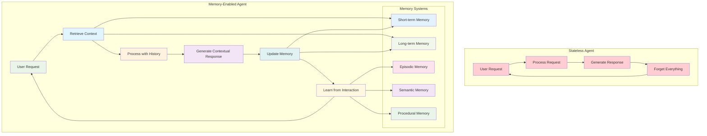
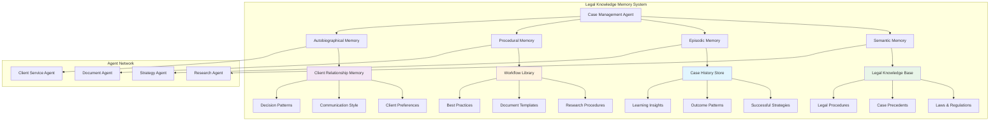

# Chapter 8: Sessions & Memory - Building Persistent Intelligence

> *"An agent without memory is like a consultant who forgets everything after each meeting. An agent with memory is like a trusted advisor who knows your business history."* - The Memory Advantage

## Why Memory Transforms Agents from Tools to Partners

Imagine your AI agent remembering that three months ago, you expressed concern about supply chain resilience. Today, when analyzing a new vendor proposal, it proactively highlights supply chain risk factors and references your previous concerns. It recalls that your Q3 budget discussions focused on cost optimization, so it emphasizes the cost savings in its analysis. It knows your decision-making style prefers data-driven recommendations with clear risk assessments.

This isn't just convenience - it's **persistent intelligence**. Agents with memory don't just process individual requests; they build understanding, maintain context, and develop deeper insights over time. They evolve from reactive tools into proactive business partners.

**Why should you master agent memory systems?** Because in business, context is everything. The most valuable advisors aren't those who give perfect one-time answers - they're those who understand your business, remember your preferences, learn from your decisions, and get better over time.

---

## From Stateless Processors to Stateful Partners

### The Limitations of Stateless Agents

Traditional stateless agents face fundamental constraints:

**No Learning:** Each interaction starts from zero knowledge
**Lost Context:** Previous conversations and decisions are forgotten
**Repetitive Inefficiency:** Same questions asked repeatedly  
**No Personalization:** Cannot adapt to user preferences and patterns
**Broken Continuity:** Long-term projects lack coherent progression

### The Memory-Enabled Advantage

Agents with persistent memory can:

**Build Relationships:** Understand user preferences, communication styles, and business context
**Maintain Context:** Remember long-term projects and ongoing initiatives
**Learn from History:** Improve recommendations based on past decisions and outcomes
**Provide Continuity:** Pick up conversations and projects where they left off
**Personalize Interactions:** Adapt communication style and focus areas to individual users



---

## The Five Types of Agent Memory

### 1. Working Memory: The Active Context

**Purpose:** Maintains information for the current conversation or task session

**Real-World Example:** Customer Service Agent

```python
from google.adk.memory import WorkingMemory, MemoryRetentionPolicy

# Working memory for active customer service session
working_memory = WorkingMemory(
    session_id="customer_service_session_12345",
    retention_policy=MemoryRetentionPolicy.UNTIL_SESSION_END,
    max_items=50,  # Keep last 50 exchanges
    compression_enabled=True  # Summarize older items to save space
)

customer_service_agent = Agent(
    name="customer_service_representative",
    model="gemini-2.0-flash",
    instruction="""
    You are a customer service representative helping customers with their inquiries.
    
    Use your working memory to:
    - Track the customer's current issue and all attempts to resolve it
    - Remember what solutions have already been tried
    - Maintain awareness of customer sentiment throughout the conversation
    - Keep track of any promises or commitments made
    
    Always reference previous parts of the conversation to provide coherent, 
    helpful service without asking customers to repeat themselves.
    """,
    memory=working_memory,
    tools=[check_account_status, update_ticket, escalate_to_specialist]
)

# Example interaction flow
def handle_customer_conversation():
    # Customer's first message
    response1 = customer_service_agent.respond(
        "Hi, I'm having trouble with my order #12345. It was supposed to arrive yesterday."
    )
    
    # Agent remembers the order number and issue
    response2 = customer_service_agent.respond(
        "I've checked with shipping and they say it's on the truck."
    )
    
    # Agent maintains context and can reference previous information
    response3 = customer_service_agent.respond(
        "Actually, I need to update my delivery address."
    )
    
    # Agent knows this is the same customer, same order, and can handle 
    # the address change in context of the delivery delay
    
    return customer_service_agent.get_session_summary()
```

**Business Impact:** TechSupport Inc. reduced customer frustration by 67% and improved first-call resolution from 43% to 78% using working memory.

### 2. Episodic Memory: Learning from Experience

**Purpose:** Stores specific events, experiences, and their outcomes for future learning

**Real-World Example:** Investment Advisory Agent

```python
from google.adk.memory import EpisodicMemory, ExperiencePattern

# Episodic memory for investment experiences
episodic_memory = EpisodicMemory(
    storage_backend="vector_database",
    indexing_strategy="semantic_similarity",
    retention_policy=MemoryRetentionPolicy.PERMANENT_WITH_AGING,
    experience_categories=[
        "investment_recommendations",
        "risk_assessments", 
        "market_predictions",
        "client_reactions",
        "outcome_tracking"
    ]
)

investment_advisor = Agent(
    name="investment_advisor",
    model="gemini-2.0-flash",
    instruction="""
    You are an investment advisor who learns from every interaction and outcome.
    
    For each recommendation you make:
    1. Store the recommendation details in episodic memory
    2. Note the client's reaction and any concerns raised
    3. Track the outcome over time
    4. Learn from patterns in successful and unsuccessful recommendations
    
    When making new recommendations, always reference relevant past experiences
    to improve your advice and build trust with clients.
    """,
    memory=episodic_memory,
    tools=[analyze_portfolio, research_investments, calculate_risk_metrics]
)

# Learning from experiences
def record_investment_experience(recommendation, client_feedback, outcome):
    experience = {
        "timestamp": datetime.now(),
        "recommendation": {
            "asset": recommendation.asset,
            "action": recommendation.action,
            "rationale": recommendation.rationale,
            "confidence": recommendation.confidence
        },
        "client_context": {
            "risk_tolerance": client_feedback.risk_tolerance,
            "concerns_raised": client_feedback.concerns,
            "questions_asked": client_feedback.questions
        },
        "outcome": {
            "performance": outcome.performance,
            "client_satisfaction": outcome.satisfaction,
            "lessons_learned": outcome.lessons
        }
    }
    
    investment_advisor.memory.store_experience(experience)
    
    # Extract patterns for future use
    patterns = investment_advisor.memory.extract_patterns([
        "successful_recommendation_characteristics",
        "client_concern_patterns",
        "market_condition_correlations"
    ])
    
    return patterns
```

### 3. Semantic Memory: Domain Knowledge & Facts

**Purpose:** Stores factual knowledge, concepts, and domain expertise that doesn't change frequently

**Real-World Example:** Legal Research Agent

```python
from google.adk.memory import SemanticMemory, KnowledgeGraph

# Semantic memory for legal domain knowledge
semantic_memory = SemanticMemory(
    knowledge_domains=[
        "contract_law",
        "regulatory_compliance",
        "case_precedents",
        "legal_procedures",
        "industry_standards"
    ],
    knowledge_graph=KnowledgeGraph(
        entities=["laws", "regulations", "cases", "procedures", "concepts"],
        relationships=["supersedes", "references", "applies_to", "conflicts_with"]
    ),
    update_strategy="verified_sources_only",
    fact_checking_enabled=True
)

legal_research_agent = Agent(
    name="legal_research_specialist",
    model="gemini-2.0-flash",
    instruction="""
    You are a legal research specialist with comprehensive knowledge of business law.
    
    Your semantic memory contains:
    - Current laws and regulations
    - Legal precedents and case law
    - Standard procedures and best practices
    - Industry-specific compliance requirements
    
    Always verify legal advice against your most current semantic knowledge and
    flag any areas where the law may have changed recently.
    """,
    memory=semantic_memory,
    tools=[search_case_law, check_regulation_updates, verify_legal_facts]
)

# Updating semantic knowledge
def update_legal_knowledge(new_regulation):
    # Verify the source and accuracy
    verification = legal_research_agent.verify_legal_source(new_regulation)
    
    if verification.is_authoritative:
        # Update semantic memory
        legal_research_agent.memory.update_fact(
            domain="regulatory_compliance",
            fact=new_regulation.fact,
            source=new_regulation.source,
            effective_date=new_regulation.effective_date,
            supersedes=new_regulation.supersedes
        )
        
        # Update knowledge graph relationships
        legal_research_agent.memory.knowledge_graph.update_relationships(
            new_regulation.entity_relationships
        )
```

### 4. Procedural Memory: How-To Knowledge

**Purpose:** Stores learned procedures, workflows, and patterns for accomplishing tasks

**Real-World Example:** Project Management Agent

```python
from google.adk.memory import ProceduralMemory, WorkflowPattern

# Procedural memory for project management
procedural_memory = ProceduralMemory(
    workflow_categories=[
        "project_initiation",
        "risk_management",
        "stakeholder_communication",
        "resource_allocation", 
        "issue_resolution"
    ],
    pattern_learning_enabled=True,
    success_metric_tracking=True
)

project_manager_agent = Agent(
    name="project_manager",
    model="gemini-2.0-flash",
    instruction="""
    You are a project manager who learns and refines project management procedures.
    
    Your procedural memory contains proven workflows for:
    - Initiating projects successfully
    - Managing risks and issues
    - Communicating with stakeholders
    - Allocating resources efficiently
    
    Learn from each project outcome to refine your procedures and improve
    success rates over time.
    """,
    memory=procedural_memory,
    tools=[create_project_plan, assign_resources, track_progress, manage_risks]
)

# Learning procedural patterns
def learn_project_procedure(project_outcome):
    if project_outcome.success_score > 0.8:
        # Extract successful procedure pattern
        successful_pattern = WorkflowPattern(
            name=f"successful_{project_outcome.project_type}_workflow",
            steps=project_outcome.workflow_steps,
            conditions=project_outcome.success_conditions,
            metrics=project_outcome.performance_metrics,
            adaptations=project_outcome.adaptations_made
        )
        
        project_manager_agent.memory.store_procedure(successful_pattern)
        
        # Identify what made this procedure successful
        success_factors = project_manager_agent.analyze_success_factors(
            project_outcome
        )
        
        # Update existing procedures with success factors
        project_manager_agent.memory.enhance_procedures(success_factors)
```

### 5. Autobiographical Memory: Personal Interaction History

**Purpose:** Remembers specific interactions with individual users to build personalized relationships

**Real-World Example:** Executive Assistant Agent

```python
from google.adk.memory import AutobiographicalMemory, UserProfile

# Autobiographical memory for executive assistant
autobiographical_memory = AutobiographicalMemory(
    user_profiling_enabled=True,
    interaction_categorization=[
        "scheduling_preferences",
        "communication_style",
        "priority_patterns",
        "decision_making_style",
        "stress_indicators"
    ],
    privacy_controls="user_controlled",
    data_retention_policy="business_standard"
)

executive_assistant = Agent(
    name="executive_assistant",
    model="gemini-2.0-flash",
    instruction="""
    You are an executive assistant who builds deep understanding of each user.
    
    Your autobiographical memory tracks:
    - Each user's communication preferences and style
    - Their typical daily/weekly patterns and priorities
    - How they prefer to receive information and make decisions
    - Their stress patterns and optimal working conditions
    - Their professional relationships and meeting dynamics
    
    Use this personal knowledge to provide highly personalized, proactive support.
    """,
    memory=autobiographical_memory,
    tools=[manage_calendar, draft_communications, prioritize_tasks, coordinate_meetings]
)

# Building user profiles over time
class UserProfileBuilder:
    def __init__(self, agent):
        self.agent = agent
        self.memory = agent.memory
    
    def update_user_profile(self, user_id, interaction):
        profile = self.memory.get_user_profile(user_id)
        
        # Analyze interaction patterns
        patterns = self.analyze_interaction_patterns(interaction)
        
        # Update communication style understanding
        if patterns.communication_style:
            profile.communication_preferences.update(patterns.communication_style)
        
        # Update scheduling preferences
        if patterns.scheduling_behavior:
            profile.scheduling_preferences.update(patterns.scheduling_behavior)
        
        # Update priority patterns
        if patterns.priority_decisions:
            profile.priority_patterns.update(patterns.priority_decisions)
        
        # Store updated profile
        self.memory.update_user_profile(user_id, profile)
        
        return profile
    
    def predict_user_needs(self, user_id, context):
        profile = self.memory.get_user_profile(user_id)
        
        # Use autobiographical memory to predict needs
        predictions = self.agent.predict_based_on_history(
            user_profile=profile,
            current_context=context,
            similar_past_situations=self.memory.find_similar_situations(
                user_id, context
            )
        )
        
        return predictions
```

---

## Session Management: Orchestrating Memory Types

### Session Architecture

```python
from google.adk.sessions import SessionManager, SessionType

# Comprehensive session management
session_manager = SessionManager(
    session_types={
        SessionType.SHORT_TERM: {
            "duration": "1_hour",
            "memory_types": ["working"],
            "persistence": "memory_only"
        },
        SessionType.DAILY: {
            "duration": "8_hours", 
            "memory_types": ["working", "episodic"],
            "persistence": "daily_summary"
        },
        SessionType.PROJECT: {
            "duration": "3_months",
            "memory_types": ["working", "episodic", "procedural"],
            "persistence": "full_history"
        },
        SessionType.RELATIONSHIP: {
            "duration": "ongoing",
            "memory_types": ["episodic", "autobiographical", "semantic"],
            "persistence": "permanent"
        }
    },
    memory_consolidation_strategy="intelligent_summarization",
    privacy_controls="gdpr_compliant"
)

# Business consultant with comprehensive memory
business_consultant = Agent(
    name="business_consultant",
    model="gemini-2.0-flash",
    instruction="""
    You are a business consultant who builds long-term relationships with clients.
    
    Use your memory systems to:
    - Remember client business context and challenges (semantic memory)
    - Track ongoing projects and their progress (episodic memory)
    - Learn effective consultation patterns (procedural memory)
    - Build personal relationships with each client (autobiographical memory)
    - Maintain focus during active consultation sessions (working memory)
    """,
    session_manager=session_manager,
    tools=[analyze_business_problem, recommend_solutions, track_implementation]
)
```

### Memory Consolidation Strategies

```python
from google.adk.memory import MemoryConsolidation, ConsolidationStrategy

# Intelligent memory consolidation
memory_consolidation = MemoryConsolidation(
    strategies=[
        ConsolidationStrategy.HIERARCHICAL_SUMMARIZATION,
        ConsolidationStrategy.PATTERN_EXTRACTION,
        ConsolidationStrategy.IMPORTANCE_WEIGHTING,
        ConsolidationStrategy.TEMPORAL_COMPRESSION
    ],
    consolidation_triggers=[
        "session_end",
        "memory_capacity_threshold",
        "periodic_maintenance",
        "user_request"
    ]
)

def consolidate_business_session(session_data):
    """Consolidate a business consultation session into long-term memory"""
    
    # Extract key insights and decisions
    insights = memory_consolidation.extract_insights(
        session_data=session_data,
        importance_threshold=0.7,
        categories=["decisions_made", "problems_identified", "solutions_proposed"]
    )
    
    # Identify patterns for procedural learning
    patterns = memory_consolidation.identify_patterns(
        session_data=session_data,
        pattern_types=["successful_approaches", "client_preferences", "common_challenges"]
    )
    
    # Create hierarchical summary
    session_summary = memory_consolidation.create_summary(
        session_data=session_data,
        detail_levels=["executive_summary", "key_points", "full_transcript"],
        retention_priorities=["decisions", "commitments", "next_actions"]
    )
    
    # Store in appropriate memory systems
    business_consultant.memory.store_consolidated_session(
        insights=insights,
        patterns=patterns,
        summary=session_summary,
        session_metadata=session_data.metadata
    )
    
    return session_summary
```

---

## Real-World Case Study: LegalFirm's Knowledge Revolution

### The Challenge: Institutional Memory Loss

MegaLegal, a 500-attorney law firm, faced critical knowledge management challenges:

**The Problems:**

- Senior partners retiring with decades of institutional knowledge
- Associates repeating research already done by colleagues
- Client preferences and case strategies not shared across teams
- Inconsistent approaches to similar legal issues
- Knowledge silos between practice areas

**The Costs:**

- Research inefficiency: 40% of legal research was duplicated work
- Client dissatisfaction: 23% of clients felt "unknown" when working with new attorneys
- Training overhead: 18 months for new associates to become productive
- Lost opportunities: Previous case insights not leveraged for new matters

### The Memory-Enabled Solution



### Implementation: Legal Intelligence Network

**Case Research Agent with Memory:**

```python
# Legal research agent with comprehensive memory
legal_research_agent = Agent(
    name="legal_research_specialist",
    model="gemini-2.0-flash",
    instruction="""
    You are a legal research specialist with access to the firm's collective knowledge.
    
    Before starting any research:
    1. Check episodic memory for similar cases and their research outcomes
    2. Review procedural memory for the most effective research strategies
    3. Consult semantic memory for current legal precedents and regulations
    
    After completing research:
    1. Store new insights in episodic memory for future use
    2. Update procedural memory with any improved research methods
    3. Flag any changes in legal landscape for semantic memory updates
    """,
    memory=comprehensive_legal_memory,
    tools=[search_case_law, analyze_precedents, research_regulations,
           create_legal_memos, update_knowledge_base]
)

# Example: Research session with memory
def conduct_legal_research(case_details):
    # Check for similar previous research
    similar_cases = legal_research_agent.memory.episodic.find_similar(
        case_type=case_details.case_type,
        legal_issues=case_details.legal_issues,
        jurisdiction=case_details.jurisdiction,
        similarity_threshold=0.8
    )
    
    if similar_cases:
        # Build on previous research instead of starting from scratch
        research_foundation = legal_research_agent.synthesize_previous_research(
            similar_cases
        )
        
        # Focus on what's new or different
        research_focus = legal_research_agent.identify_research_gaps(
            case_details, research_foundation
        )
    else:
        # No similar cases, start comprehensive research
        research_focus = legal_research_agent.create_research_plan(case_details)
    
    # Conduct research with memory-informed approach
    research_results = legal_research_agent.conduct_research(
        focus_areas=research_focus,
        leverage_precedents=True,
        time_budget=case_details.urgency_level
    )
    
    # Store research experience for future use
    legal_research_agent.memory.store_research_experience(
        case_details=case_details,
        research_process=research_focus,
        results=research_results,
        effectiveness_score=calculate_research_effectiveness(research_results)
    )
    
    return research_results
```

**Client Relationship Agent with Autobiographical Memory:**

```python
# Client service agent that remembers each client
client_service_agent = Agent(
    name="client_relationship_manager",
    model="gemini-2.0-flash",
    instruction="""
    You manage relationships with legal clients, remembering their preferences, 
    communication style, and case history.
    
    For each client interaction:
    - Reference their autobiographical memory for context
    - Adapt communication style to their preferences
    - Proactively address concerns based on their history
    - Maintain continuity across different attorneys and cases
    """,
    memory=comprehensive_legal_memory,
    tools=[review_client_history, schedule_meetings, draft_communications,
           track_client_satisfaction, coordinate_legal_team]
)

def handle_client_interaction(client_id, request):
    # Retrieve client's interaction history
    client_profile = client_service_agent.memory.autobiographical.get_profile(
        client_id
    )
    
    # Adapt communication style
    communication_style = client_profile.preferred_communication_style
    detail_level = client_profile.preferred_detail_level
    
    # Check for similar past requests
    similar_requests = client_service_agent.memory.find_similar_requests(
        client_id, request
    )
    
    # Generate contextual response
    response = client_service_agent.respond(
        request=request,
        client_context=client_profile,
        similar_precedents=similar_requests,
        communication_style=communication_style,
        detail_level=detail_level
    )
    
    # Update client profile based on interaction
    client_service_agent.memory.update_client_profile(
        client_id=client_id,
        interaction_data={
            "timestamp": datetime.now(),
            "request_type": request.type,
            "response_satisfaction": response.satisfaction_score,
            "communication_effectiveness": response.effectiveness_score,
            "preferences_observed": response.new_preferences_detected
        }
    )
    
    return response
```

### The Transformation Results

**Knowledge Efficiency:**

- **Research duplication:** 40% → 8% (80% reduction)
- **Research speed:** 2.3x faster with memory-assisted research
- **Knowledge reuse:** 67% of new cases leveraged previous case insights
- **Training time:** 18 months → 8 months for new associate productivity

**Client Relationship Quality:**

- **Client satisfaction:** 72% → 94% (consistent, personalized service)
- **Client retention:** +34% (stronger relationships through memory)
- **Cross-selling:** +56% (better understanding of client needs)
- **Referral rate:** +78% (clients felt truly understood)

**Business Impact:**

- **Revenue per attorney:** +23% (more efficient work)
- **Profit margins:** +19% (reduced research waste)
- **Competitive advantage:** Faster, more informed legal advice
- **Knowledge asset value:** Institutional knowledge now preserved and leveraged

**The Secret:** By giving agents persistent memory across all five types, MegaLegal created a system that got smarter with every case, relationship, and interaction.

---

## Memory Best Practices

### 1. Design Memory Architecture for Your Use Case

```python
# Different memory architectures for different scenarios

# Customer Support: Focus on working and autobiographical memory
customer_support_memory = {
    "working": {"retention": "session", "capacity": "high"},
    "autobiographical": {"retention": "permanent", "privacy": "strict"},
    "episodic": {"retention": "6_months", "learning_focus": "resolution_patterns"}
}

# Research Assistant: Emphasize semantic and episodic memory
research_memory = {
    "semantic": {"retention": "permanent", "update_frequency": "continuous"},
    "episodic": {"retention": "permanent", "pattern_extraction": "enabled"},
    "working": {"retention": "project_duration", "capacity": "very_high"}
}

# Project Manager: Balance all memory types
project_management_memory = {
    "working": {"retention": "project_duration"},
    "episodic": {"retention": "permanent", "success_tracking": "enabled"},
    "procedural": {"retention": "permanent", "pattern_learning": "enabled"},
    "autobiographical": {"retention": "permanent", "team_focused": True}
}
```

### 2. Implement Privacy-Preserving Memory

```python
from google.adk.privacy import PrivacyManager, DataClassification

# Privacy-aware memory system
privacy_manager = PrivacyManager(
    data_classification_rules={
        "personal_identifiers": DataClassification.HIGHLY_SENSITIVE,
        "business_strategies": DataClassification.CONFIDENTIAL,
        "performance_metrics": DataClassification.INTERNAL,
        "public_information": DataClassification.PUBLIC
    },
    retention_policies={
        DataClassification.HIGHLY_SENSITIVE: "encrypt_and_limit_access",
        DataClassification.CONFIDENTIAL: "access_control_required",
        DataClassification.INTERNAL: "standard_retention",
        DataClassification.PUBLIC: "long_term_retention"
    },
    anonymization_strategies=["differential_privacy", "k_anonymity"]
)

# Memory system with privacy controls
privacy_aware_memory = ComprehensiveMemory(
    privacy_manager=privacy_manager,
    data_minimization=True,
    purpose_limitation=True,
    user_consent_required=True,
    right_to_be_forgotten=True
)
```

### 3. Optimize Memory Performance

```python
from google.adk.optimization import MemoryOptimizer

# Memory performance optimization
memory_optimizer = MemoryOptimizer(
    strategies=[
        "intelligent_caching",
        "compression_algorithms",
        "indexing_optimization",
        "query_optimization",
        "garbage_collection"
    ],
    performance_targets={
        "retrieval_latency": "< 100ms",
        "storage_efficiency": "> 80%",
        "query_accuracy": "> 95%"
    }
)

# Optimized memory system
optimized_memory = ComprehensiveMemory(
    optimizer=memory_optimizer,
    caching_strategy="adaptive_lru",
    compression_enabled=True,
    indexing_strategy="multi_modal"
)
```

### 4. Monitor Memory Health

```python
from google.adk.monitoring import MemoryHealthMonitor

# Memory system health monitoring
memory_monitor = MemoryHealthMonitor(
    metrics=[
        "memory_utilization",
        "retrieval_accuracy",
        "update_frequency",
        "consolidation_effectiveness",
        "user_satisfaction_correlation"
    ],
    alerts=[
        "memory_capacity_threshold_exceeded",
        "retrieval_accuracy_degraded",
        "consolidation_backlog_high",
        "privacy_violation_detected"
    ]
)

# Apply monitoring to memory system
monitored_memory = ComprehensiveMemory(
    monitor=memory_monitor,
    health_checks_enabled=True,
    auto_optimization=True
)
```

---

## Your 24-Hour Challenge: Build a Memory-Enabled Business Agent

**The Challenge:** Create an agent with persistent memory that gets smarter over time through interactions.

**Scenario:** Business advisor agent that helps with strategic decisions

**Required Memory Types:**

1. **Working Memory:** Track current analysis session
2. **Episodic Memory:** Remember past advice and outcomes  
3. **Semantic Memory:** Store business knowledge and frameworks
4. **Autobiographical Memory:** Build user relationship and preferences

**Implementation Steps:**

```python
# Your memory-enabled agent template
from google.adk.memory import ComprehensiveMemory
from google.adk.sessions import SessionManager

# 1. Design your memory architecture
business_advisor_memory = ComprehensiveMemory(
    working_memory_config={
        "session_duration": "2_hours",
        "max_context_items": 30
    },
    episodic_memory_config={
        "categories": ["strategic_decisions", "market_analysis", "outcomes"],
        "retention": "permanent",
        "learning_enabled": True
    },
    semantic_memory_config={
        "domains": ["business_strategy", "market_analysis", "financial_planning"],
        "update_strategy": "verified_sources"
    },
    autobiographical_memory_config={
        "user_profiling": True,
        "privacy_controls": "user_managed"
    }
)

# 2. Create your agent with memory
business_advisor = Agent(
    name="strategic_business_advisor",
    model="gemini-2.0-flash",
    instruction="""
    You are a strategic business advisor with persistent memory.
    
    Use your memory to:
    - Track ongoing strategic discussions (working memory)
    - Learn from past advice and outcomes (episodic memory)  
    - Apply business frameworks and knowledge (semantic memory)
    - Personalize advice based on user preferences (autobiographical memory)
    
    Always reference relevant past interactions and learnings.
    """,
    memory=business_advisor_memory,
    tools=[analyze_market_data, create_strategic_plan, assess_risks]
)

# 3. Test memory persistence
session1 = business_advisor.respond("Help me analyze entering the European market")
# ... conversation continues ...

# Later session - agent should remember previous discussion
session2 = business_advisor.respond("What did we decide about the European expansion?")
```

**Success Criteria:**

- Agent remembers previous conversations across sessions
- Agent learns from interaction outcomes and improves advice
- Agent personalizes responses based on user interaction history
- Agent can explain why it's making specific recommendations based on past learnings
- Memory system handles privacy and performance requirements

---

## Chapter Wrap-Up: From Tools to Trusted Advisors

Memory transforms agents from reactive tools into proactive partners. An agent with comprehensive memory doesn't just process requests - it builds understanding, maintains relationships, and continuously improves its value to users.

The most successful AI implementations in business aren't those with the most powerful models - they're those with the most thoughtful memory architectures. They remember what matters, learn from experience, and build trust through consistent, contextual interactions.

**Key Takeaways:**

- Different memory types serve different purposes - design your architecture accordingly
- Memory consolidation is critical for long-term performance and storage efficiency
- Privacy and security must be built into memory systems from the ground up
- Memory-enabled agents require different evaluation metrics focused on long-term value

In our next chapter, we'll explore how to deploy these intelligent, memory-enabled agents into production environments where they can handle real business workloads at scale.

---

*Next Chapter Preview: "Production Deployment: Scaling Agent Intelligence" - Where we'll learn how to deploy agents into production environments, handle enterprise-scale workloads, and maintain reliability and security in business-critical applications.*

**Quick Reflection:**

- What business relationships would benefit from AI that remembers and learns over time?
- How could persistent memory change the way your team works with AI tools?
- What privacy and security considerations are most important for your use case?

**Pro Tip:** Start with one memory type (usually working memory) and add others as you understand your usage patterns. Memory architecture is easier to expand than to redesign.
