# Chapter 8: Sessions & Memory - Building Persistent Intelligence

> **Important Disclaimer:** This tutorial is designed for educational purposes to illustrate Google ADK memory concepts and patterns. Some code examples may require adaptation for your specific ADK version and use case. Business metrics and case studies are fictional examples created for illustration. Always refer to the official Google ADK documentation for the most current APIs and best practices.

> *"An agent without memory is like a consultant who forgets everything after each meeting. An agent with memory is like a trusted advisor who knows your business history."* - The Memory Advantage

## Why Memory Transforms Agents from Tools to Partners

Imagine your AI agent remembering that three months ago, you expressed concern about supply chain resilience. Today, when analyzing a new vendor proposal, it proactively highlights supply chain risk factors and references your previous concerns. It recalls that your Q3 budget discussions focused on cost optimization, so it emphasizes the cost savings in its analysis. It knows your decision-making style prefers data-driven recommendations with clear risk assessments.

This isn't just convenience - it's **persistent intelligence**. Agents with memory don't just process individual requests; they build understanding, maintain context, and develop deeper insights over time. They evolve from reactive tools into proactive business partners.

**Why should you master agent memory systems?** Because in business, context is everything. The most valuable advisors aren't those who give perfect one-time answers - they're those who understand your business, remember your preferences, learn from your decisions, and get better over time.

---

## From Stateless Processors to Stateful Partners

### The Limitations of Stateless Agents

Traditional stateless agents face fundamental constraints:

**No Learning:** Each interaction starts from zero knowledge
**Lost Context:** Previous conversations and decisions are forgotten
**Repetitive Inefficiency:** Same questions asked repeatedly  
**No Personalization:** Cannot adapt to user preferences and patterns
**Broken Continuity:** Long-term projects lack coherent progression

### The Memory-Enabled Advantage

Agents with persistent memory can:

**Build Relationships:** Understand user preferences, communication styles, and business context
**Maintain Context:** Remember long-term projects and ongoing initiatives
**Learn from History:** Improve recommendations based on past decisions and outcomes
**Provide Continuity:** Pick up conversations and projects where they left off
**Personalize Interactions:** Adapt communication style and focus areas to individual users


---

## The Five Types of Agent Memory

### 1. Working Memory: Session State

**Purpose:** Maintains information for the current conversation session using ADK's Session State

**Real-World Example:** Customer Service Agent

```python
from google.adk.agents import LlmAgent
from google.adk.sessions import InMemorySessionService
from google.adk.runners import Runner

# Customer service agent with session state
customer_service_agent = LlmAgent(
    name="customer_service_representative",
    model="gemini-2.0-flash",
    instruction="""
    You are a customer service representative helping customers with their inquiries.
    
    Use the session state to:
    - Track the customer's current issue and all attempts to resolve it
    - Remember what solutions have already been tried
    - Maintain awareness of customer sentiment throughout the conversation
    - Keep track of any promises or commitments made
    
    Always reference previous parts of the conversation to provide coherent, 
    helpful service without asking customers to repeat themselves.
    """,
    # Note: In a real implementation, these tools would be defined as functions
    # Example: check_account_status, update_ticket, escalate_to_specialist
    tools=[]  # Add your actual tool functions here
)

# Set up session service for persistent state management
session_service = InMemorySessionService()
runner = Runner(
    agent=customer_service_agent,
    app_name="customer_service_app",
    session_service=session_service
)

# Example interaction flow with session state
async def handle_customer_conversation():
    app_name = "customer_service_app"
    user_id = "customer_123"
    session_id = "session_001"
    
    # Create session
    session = await session_service.create_session(
        app_name=app_name,
        user_id=user_id,
        session_id=session_id
    )
    
    # Customer's first message
    from google.genai.types import Content, Part
    user_input1 = Content(parts=[Part(text="Hi, I'm having trouble with my order #12345. It was supposed to arrive yesterday.")], role="user")
    
    final_response1 = None
    async for event in runner.run_async(user_id=user_id, session_id=session_id, new_message=user_input1):
        if event.is_final_response() and event.content and event.content.parts:
            final_response1 = event.content.parts[0].text
    
    print(f"Agent Response 1: {final_response1}")
    
    # Customer provides more information
    user_input2 = Content(parts=[Part(text="I've checked with shipping and they say it's on the truck.")], role="user")
    
    final_response2 = None
    async for event in runner.run_async(user_id=user_id, session_id=session_id, new_message=user_input2):
        if event.is_final_response() and event.content and event.content.parts:
            final_response2 = event.content.parts[0].text
    
    print(f"Agent Response 2: {final_response2}")
    
    # Agent maintains context and can handle address change in context of delivery delay
    user_input3 = Content(parts=[Part(text="Actually, I need to update my delivery address.")], role="user")
    
    final_response3 = None
    async for event in runner.run_async(user_id=user_id, session_id=session_id, new_message=user_input3):
        if event.is_final_response() and event.content and event.content.parts:
            final_response3 = event.content.parts[0].text
    
    print(f"Agent Response 3: {final_response3}")
    
    # Get session summary
    final_session = await session_service.get_session(app_name=app_name, user_id=user_id, session_id=session_id)
    return final_session.state
```

**Business Impact:** Organizations implementing ADK memory systems can see improvements in agent performance and user experience, though specific outcomes vary significantly based on implementation quality, use case, and organizational context.

### 2. Long-Term Memory: Using MemoryService

**Purpose:** Stores information across sessions for future retrieval using ADK's MemoryService

**Real-World Example:** Investment Advisory Agent

```python
from google.adk.agents import LlmAgent
from google.adk.memory import InMemoryMemoryService  # or VertexAiRagMemoryService for production
from google.adk.sessions import InMemorySessionService
from google.adk.runners import Runner
from google.adk.tools import load_memory_tool

# Memory service for investment experiences
memory_service = InMemoryMemoryService()

# Use the pre-built memory tool
from google.adk.tools.load_memory_tool import load_memory_tool

investment_advisor = LlmAgent(
    name="investment_advisor",
    model="gemini-2.0-flash",
    instruction="""
    You are an investment advisor who learns from every interaction and outcome.
    
    For each recommendation you make:
    1. Store the recommendation details and track outcomes over time
    2. Note the client's reaction and any concerns raised
    3. Learn from patterns in successful and unsuccessful recommendations
    
    When making new recommendations, use the load_memory_tool to reference relevant 
    past experiences to improve your advice and build trust with clients.
    """,
    # Note: In a real implementation, these tools would be defined as functions
    # Example: analyze_portfolio, research_investments, calculate_risk_metrics
    tools=[load_memory_tool]
)

# Set up runner with memory service
runner = Runner(
    agent=investment_advisor,
    app_name="investment_advisory",
    session_service=InMemorySessionService(),
    memory_service=memory_service
)

# Learning from experiences with MemoryService
async def record_investment_experience(session_id, recommendation, client_feedback, outcome):
    # Get the completed session
    session = await runner.session_service.get_session(
        app_name="investment_advisory",
        user_id=client_feedback.user_id,
        session_id=session_id
    )
    
    # Add session to memory for future reference
    await memory_service.add_session_to_memory(session)
    
    # Example of searching memory for similar experiences
    search_query = f"investment recommendation {recommendation.asset} {recommendation.action}"
    search_results = await memory_service.search_memory(
        app_name="investment_advisory",
        user_id=client_feedback.user_id,
        query=search_query
    )
    
    return search_results
```

### 3. Production Memory: VertexAI RAG Integration

**Purpose:** Stores factual knowledge and domain expertise using Vertex AI RAG for production systems

**Real-World Example:** Legal Research Agent

```python
from google.adk.agents import LlmAgent
from google.adk.memory import VertexAiRagMemoryService
from google.adk.sessions import VertexAiSessionService
from google.adk.runners import Runner
from google.adk.tools import load_memory_tool

# Production memory service using Vertex AI RAG
# Requires: pip install google-adk[vertexai]
rag_corpus_name = "projects/your-project/locations/us-central1/ragCorpora/legal-knowledge"
memory_service = VertexAiRagMemoryService(
    rag_corpus=rag_corpus_name,
    similarity_top_k=5,
    vector_distance_threshold=0.7
)

# Use the pre-built memory tool
from google.adk.tools.load_memory_tool import load_memory_tool

legal_research_agent = LlmAgent(
    name="legal_research_specialist",
    model="gemini-2.0-flash",
    instruction="""
    You are a legal research specialist with access to comprehensive legal knowledge.
    
    Your memory contains:
    - Current laws and regulations
    - Legal precedents and case law
    - Standard procedures and best practices
    - Industry-specific compliance requirements
    
    Always use the load_memory_tool to search for relevant legal information
    and verify legal advice against current knowledge.
    """,
    # Note: In a real implementation, these tools would be defined as functions
    # Example: search_case_law, check_regulation_updates, verify_legal_facts
    tools=[load_memory_tool]
)

# Production session service
project_id = "your-gcp-project-id"
location = "us-central1"
app_name = "legal-research"

session_service = VertexAiSessionService(
    project=project_id,
    location=location
)

runner = Runner(
    agent=legal_research_agent,
    app_name=app_name,
    session_service=session_service,
    memory_service=memory_service
)

# Updating legal knowledge in production
async def update_legal_knowledge(new_case_law):
    # In production, you would update the RAG corpus with new legal documents
    # This typically involves uploading documents to the corpus
    
    # Create a session to validate and discuss the new case law
    session = await session_service.create_session(
        app_name=app_name,
        user_id="legal_team"
    )
    
    # Agent can analyze the new case law and update its understanding
    from google.genai.types import Content, Part
    analysis_request = Content(
        parts=[Part(text=f"Please analyze this new case law and its implications: {new_case_law}")],
        role="user"
    )
    
    # Run the agent to process the new information
    async for event in runner.run_async(
        user_id="legal_team",
        session_id=session.id,
        new_message=analysis_request
    ):
        if event.is_final_response():
            print(f"Legal Analysis: {event.content.parts[0].text}")
    
    # Add this session to memory for future reference
    await memory_service.add_session_to_memory(session)
```

### 4. Session Workflow Management: Project Patterns

**Purpose:** Tracks learned procedures and workflows using session state and memory patterns

**Real-World Example:** Project Management Agent

```python
from google.adk.agents import LlmAgent
from google.adk.sessions import InMemorySessionService
from google.adk.memory import InMemoryMemoryService
from google.adk.runners import Runner
from google.adk.tools import load_memory_tool

# Create the project memory search tool
# Note: Using the pre-built load_memory_tool directly
from google.adk.tools.load_memory_tool import load_memory_tool

# Project management agent that learns procedures
project_manager_agent = LlmAgent(
    name="project_manager",
    model="gemini-2.0-flash",
    instruction="""
    You are a project manager who learns and refines project management procedures.
    
    Use your memory and session state to:
    - Track ongoing projects and their progress
    - Learn from successful project patterns
    - Apply best practices from similar past projects
    - Manage risks based on historical data
    
    Always use load_memory_tool to find relevant past project experiences when 
    planning new projects or addressing issues.
    """,
    # Note: In a real implementation, these tools would be defined as functions
    # Example: create_project_plan, assign_resources, track_progress, manage_risks
    tools=[load_memory_tool]
)

# Set up services for session and memory management
session_service = InMemorySessionService()
memory_service = InMemoryMemoryService()

runner = Runner(
    agent=project_manager_agent,
    app_name="project_management",
    session_service=session_service,
    memory_service=memory_service
)

# Learning project procedures through sessions
async def learn_project_procedure(project_outcome):
    # Create a session to analyze the project outcome
    session = await session_service.create_session(
        app_name="project_management",
        user_id="project_team",
        session_id=f"project_analysis_{project_outcome.project_id}"
    )
    
    if project_outcome.success_score > 0.8:
        # Document successful project patterns
        from google.genai.types import Content, Part
        analysis_request = Content(
            parts=[Part(text=f"""
            Analyze this successful project and extract key success patterns:
            
            Project Type: {project_outcome.project_type}
            Success Score: {project_outcome.success_score}
            Workflow Steps: {project_outcome.workflow_steps}
            Key Decisions: {project_outcome.key_decisions}
            Team Composition: {project_outcome.team_composition}
            Timeline: {project_outcome.timeline}
            
            What made this project successful and how can we apply these patterns to future projects?
            """)],
            role="user"
        )
        
        # Process the analysis
        async for event in runner.run_async(
            user_id="project_team",
            session_id=f"project_analysis_{project_outcome.project_id}",
            new_message=analysis_request
        ):
            if event.is_final_response():
                print(f"Success Pattern Analysis: {event.content.parts[0].text}")
        
        # Store the session in memory for future reference
        session = await session_service.get_session(
            app_name="project_management",
            user_id="project_team",
            session_id=f"project_analysis_{project_outcome.project_id}"
        )
        
        await memory_service.add_session_to_memory(session)
        
        return session.state
```

### 5. User-Specific Memory: State Scoping

**Purpose:** Remembers specific interactions with individual users using ADK's state scoping system

**Real-World Example:** Executive Assistant Agent

```python
from google.adk.agents import LlmAgent
from google.adk.sessions import InMemorySessionService
from google.adk.memory import InMemoryMemoryService
from google.adk.runners import Runner
# Import the official memory tool from ADK
from google.adk.tools import load_memory_tool

# Use the official memory tool instead of custom implementation
# Use the official memory tool instead of custom implementation
from google.adk.tools import load_memory_tool

# Executive assistant with user-specific memory
executive_assistant = LlmAgent(
    name="executive_assistant",
    model="gemini-2.0-flash",
    instruction="""
    You are an executive assistant who builds deep understanding of each user.
    
    Use session state and memory to track:
    - Each user's communication preferences and style (use user: prefix in state)
    - Their typical daily/weekly patterns and priorities
    - How they prefer to receive information and make decisions
    - Their professional relationships and meeting dynamics
    
    Use load_memory_tool to access past interactions and provide highly personalized support.
    """,
    # Note: In a real implementation, these tools would be defined as functions
    # Example: manage_calendar, draft_communications, prioritize_tasks, coordinate_meetings
    tools=[load_memory_tool]
)

# Set up services
session_service = InMemorySessionService()
memory_service = InMemoryMemoryService()

runner = Runner(
    agent=executive_assistant,
    app_name="executive_assistant",
    session_service=session_service,
    memory_service=memory_service
)

# Building user profiles using ADK state scoping
async def update_user_profile(user_id, interaction_data):
    # Create or get existing session for this user with initial state
    session = await session_service.create_session(
        app_name="executive_assistant",
        user_id=user_id,
        session_id=f"profile_update_{interaction_data.timestamp}",
        state={
            # User-specific preferences using user: prefix for ADK state scoping
            "user:communication_style": interaction_data.communication_style,
            "user:meeting_preferences": interaction_data.meeting_preferences,
            "user:priority_patterns": interaction_data.priority_patterns,
            "user:last_interaction": interaction_data.timestamp,
            "temp:current_analysis": interaction_data.interaction_type  # temporary data
        }
    )
    
    # Add completed session to memory for future reference
    updated_session = await session_service.get_session(
        app_name="executive_assistant",
        user_id=user_id,
        session_id=f"profile_update_{interaction_data.timestamp}"
    )
    
    await memory_service.add_session_to_memory(updated_session)
    
    return updated_session.state

async def predict_user_needs(user_id, context):
    # Search memory for similar past situations
    search_query = f"user preferences {context.situation_type} {context.time_context}"
    
    search_results = await memory_service.search_memory(
        app_name="executive_assistant",
        user_id=user_id,
        query=search_query
    )
    
    # Get current user state
    recent_session = await session_service.create_session(
        app_name="executive_assistant",
        user_id=user_id,
        session_id=f"prediction_{context.timestamp}"
    )
    
    # Combine memory search with current user state for predictions
    user_state = recent_session.state
    user_prefs = {
        key: value for key, value in user_state.items() 
        if key.startswith("user:")
    }
    
    return {
        "historical_patterns": search_results,
        "current_preferences": user_prefs,
    # Note: This function would need to be implemented based on your specific logic
    # return prediction_logic(search_results, user_prefs, context)
    return {
        "status": "prediction_placeholder",
        "message": "Implement prediction logic based on your business requirements"
    }
    }
```

---

## ADK Memory and Session Architecture

### Core ADK Memory Components

Google ADK provides a streamlined approach to memory management through two primary systems:

1. **Session State**: Short-term memory within individual conversations
2. **MemoryService**: Long-term knowledge storage across sessions

```python
from google.adk.agents import LlmAgent
from google.adk.sessions import InMemorySessionService, VertexAiSessionService
from google.adk.memory import InMemoryMemoryService, VertexAiRagMemoryService
from google.adk.runners import Runner
# Import the official memory tool from ADK
from google.adk.tools import load_memory_tool

# Use the official memory tool directly (no custom parameters needed)
# The load_memory_tool is a pre-built tool that works with your configured MemoryService

# Comprehensive agent with both session state and long-term memory
business_consultant = LlmAgent(
    name="business_consultant",
    model="gemini-2.0-flash",
    instruction="""
    You are a business consultant who builds long-term relationships with clients.
    
    Use your capabilities to:
    - Maintain context during sessions via session state
    - Access historical knowledge via the load_memory_tool
    - Learn from past consulting experiences
    - Build personalized relationships with each client
    """,
    # Note: In a real implementation, these tools would be defined as functions
    # Example: analyze_business_problem, recommend_solutions, track_implementation
    tools=[load_memory_tool]
)

# Choose appropriate services based on your needs
# For development/testing
session_service = InMemorySessionService()
memory_service = InMemoryMemoryService()

# For production (requires Google Cloud setup)
# session_service = VertexAiSessionService(project="your-project", location="us-central1")
# memory_service = VertexAiRagMemoryService(rag_corpus="your-rag-corpus")

runner = Runner(
    agent=business_consultant,
    app_name="business_consulting",
    session_service=session_service,
    memory_service=memory_service
)
```

### Memory Lifecycle Management

```python
import asyncio
from google.genai.types import Content, Part

# Complete memory lifecycle example
async def business_consultation_lifecycle():
    app_name = "business_consulting"
    user_id = "client_001"
    
    # Session 1: Initial consultation
    session1_id = "initial_consultation"
    session1 = await session_service.create_session(
        app_name=app_name,
        user_id=user_id,
        session_id=session1_id,
        state={"user:industry": "technology", "user:company_size": "startup"}
    )
    
    # Conduct initial consultation
    initial_query = Content(
        parts=[Part(text="We're a tech startup looking to expand into European markets. What should we consider?")],
        role="user"
    )
    
    async for event in runner.run_async(user_id=user_id, session_id=session1_id, new_message=initial_query):
        if event.is_final_response():
            print(f"Initial Consultation: {event.content.parts[0].text}")
    
    # Store session in long-term memory
    completed_session1 = await session_service.get_session(app_name=app_name, user_id=user_id, session_id=session1_id)
    await memory_service.add_session_to_memory(completed_session1)
    
    # Session 2: Follow-up after 3 months
    session2_id = "three_month_followup"
    session2 = await session_service.create_session(
        app_name=app_name,
        user_id=user_id,
        session_id=session2_id
    )
    
    # Agent can now reference past consultation
    followup_query = Content(
        parts=[Part(text="We've made some progress on the European expansion. Can you remind me what we discussed before and help with next steps?")],
        role="user"
    )
    
    async for event in runner.run_async(user_id=user_id, session_id=session2_id, new_message=followup_query):
        if event.is_final_response():
            print(f"Follow-up Consultation: {event.content.parts[0].text}")
    
    # The agent automatically uses memory search to retrieve relevant context
    return await session_service.get_session(app_name=app_name, user_id=user_id, session_id=session2_id)

# Run the lifecycle example
# consultation_result = asyncio.run(business_consultation_lifecycle())
```

---

## Production Deployment: Vertex AI Agent Engine

### Deploying Memory-Enabled Agents to Production

Google ADK integrates with Vertex AI Agent Engine for production deployment. Here's the correct approach:

```python
# Install required dependencies
# pip install google-cloud-aiplatform[adk,agent_engines]

import vertexai
from vertexai.preview import reasoning_engines
from vertexai import agent_engines

# Initialize Vertex AI
PROJECT_ID = "your-project-id"
LOCATION = "us-central1"
STAGING_BUCKET = "gs://your-google-cloud-storage-bucket"

vertexai.init(
    project=PROJECT_ID,
    location=LOCATION,
    staging_bucket=STAGING_BUCKET,
)

# Prepare your agent for Agent Engine
app = reasoning_engines.AdkApp(
    agent=business_consultant,
    enable_tracing=True,
)

# Deploy your agent to Vertex AI Agent Engine
# Note: The exact deployment API is subject to change in ADK versions
# Refer to the latest ADK documentation for current deployment methods
# This is an example and may not reflect the current production API
remote_app = reasoning_engines.create(
    agent=business_consultant,
    requirements=[
        "google-cloud-aiplatform[adk]"   
    ]
)

print(f"Deployed agent: {remote_app.resource_name}")

# Query the deployed agent
# Note: The exact query API may vary based on your ADK version
# This is an example and may not reflect the current production API
for event in remote_app.query(
    user_id="production_user",
    session_id="consultation_session_001",
    message="Help me analyze market expansion opportunities",
):
    print(event)
```

**Important Notes:**

- The exact deployment API may vary based on ADK version
- Memory services are automatically configured in production
- Session management is handled by Vertex AI Agent Engine
- Monitoring and logging are built-in features

## Real-World Case Study: E-Commerce Personalization Engine

> **Note:** This is a fictional case study created for educational purposes to illustrate ADK memory concepts and implementation patterns. The company "ShopSmart" and specific metrics are illustrative examples.

### The Challenge: Generic Shopping Experiences

ShopSmart, a growing e-commerce platform with 2M+ customers, faced personalization challenges that were hurting conversion rates:

**The Problems:**

- **Generic Recommendations**: Same products shown to all customers regardless of preferences
- **Lost Context**: Shopping cart abandonment because agents forgot what customers were looking for
- **No Learning**: Customer service couldn't remember previous support interactions
- **Missed Opportunities**: No cross-selling based on purchase history and browsing patterns

### The ADK Memory Solution

ShopSmart implemented a multi-agent system with persistent memory to create truly personalized shopping experiences:

#### System Architecture Overview

```mermaid
flowchart TD
    subgraph "🛍️ E-Commerce Personalization Engine"
        CS["`🎯 **Customer Service Agent**
        Remembers support history
        Personalizes interactions`"]
        
        PE["`🔍 **Product Expert Agent**
        Analyzes customer preferences
        Generates smart recommendations`"]
        
        CO["`🛒 **Checkout Optimizer Agent**
        Remembers cart abandonment
        Suggests completion strategies`"]
    end
    
    subgraph "💾 ADK Memory Architecture"
        MS["`📝 **Session State**
        Current shopping session
        Cart contents & preferences`"]
        
        LM["`🧠 **Long-term Memory**
        Purchase history
        Preference patterns`"]
        
        UM["`👤 **User Memory**
        Individual customer profiles
        Communication preferences`"]
    end
    
    CS --> MS
    PE --> MS
    CO --> MS
    
    CS --> LM
    PE --> LM
    CO --> LM
    
    CS --> UM
    PE --> UM
    CO --> UM
    
    style CS fill:#e8f5e8,stroke:#4caf50,stroke-width:2px,color:#000
    style PE fill:#fff3e0,stroke:#ff9800,stroke-width:2px,color:#000
    style CO fill:#e3f2fd,stroke:#2196f3,stroke-width:2px,color:#000
    
    style MS fill:#f3e5f5,stroke:#9c27b0,stroke-width:2px,color:#000
    style LM fill:#e0f2f1,stroke:#009688,stroke-width:2px,color:#000
    style UM fill:#fff8e1,stroke:#ffc107,stroke-width:2px,color:#000
```



### Implementation Pattern 1: Session State for Shopping Context

**Pattern**: Track current shopping session to maintain context across agent interactions

#### Shopping Session Flow


**ADK Implementation:**

```python
from google.adk.agents import LlmAgent
from google.adk.sessions import InMemorySessionService
from google.adk.runners import Runner

# Product search agent that saves context to session state
product_search_agent = LlmAgent(
    name="product_search_specialist",
    model="gemini-2.0-flash",
    instruction="""
    You help customers find products that match their needs and budget.
    
    Always save important context to session state:
    - Customer's search intent and preferences
    - Budget constraints and price sensitivity
    - Category interests and style preferences
    - Current activity stage (browsing, comparing, deciding)
    
    Use this context to provide personalized recommendations.
    """,
    tools=[search_products, filter_by_price, get_product_details, save_customer_preferences]
)

# Checkout agent that reads context from session state
checkout_agent = LlmAgent(
    name="checkout_optimizer",
    model="gemini-2.0-flash",
    instruction="""
    You help customers complete their purchases and suggest complementary items.
    
    Always check session state for:
    - Customer's original search intent and budget
    - Items already in cart and remaining budget
    - Previous browsing patterns and preferences
    - Customer's decision-making stage
    
    Use this context to make relevant suggestions and remove friction.
    """,
    tools=[add_to_cart, calculate_total, suggest_accessories, apply_discounts]
)

# Coordinator agent managing the shopping experience
shopping_coordinator = LlmAgent(
    name="shopping_assistant",
    model="gemini-2.0-flash",
    instruction="""
    You coordinate the customer's shopping experience across different agents.
    
    Route requests based on customer intent:
    - Product searches and browsing: use product_search_specialist
    - Cart management and checkout: use checkout_optimizer
    
    Maintain session state continuity across all interactions.
    """,
    sub_agents=[product_search_agent, checkout_agent],
    tools=[analyze_customer_intent, update_shopping_session]
)

session_service = InMemorySessionService()
runner = Runner(
    agent=shopping_coordinator,
    app_name="shopmart_personalization",
    session_service=session_service
)
```

### Implementation Pattern 2: Long-term Memory for Purchase Intelligence

**Pattern**: Store and analyze customer behavior across multiple sessions to improve recommendations

#### Customer Intelligence Architecture

```mermaid
flowchart TD
    subgraph "🧠 Purchase Intelligence System"
        PI["`📊 **Purchase Intelligence Agent**
        Analyzes buying patterns
        Predicts future needs`"]
        
        RA["`🎯 **Recommendation Agent**
        Generates personalized suggestions
        Learns from customer feedback`"]
    end
    
    subgraph "💾 Memory Storage"
        PH["`📈 **Purchase History**
        Past orders & returns
        Category preferences`"]
        
        BP["`🔄 **Behavior Patterns**
        Browsing sessions
        Seasonal trends`"]
        
        FB["`⭐ **Feedback Loop**
        Clicks, purchases, returns
        Review ratings`"]
    end
    
    PI --> PH
    PI --> BP
    PI --> FB
    
    RA --> PH
    RA --> BP
    RA --> FB
    
    PH --> RA
    BP --> RA
    FB --> RA
    
    style PI fill:#e8f5e8,stroke:#4caf50,stroke-width:2px,color:#000
    style RA fill:#fff3e0,stroke:#ff9800,stroke-width:2px,color:#000
    
    style PH fill:#e0f2f1,stroke:#009688,stroke-width:2px,color:#000
    style BP fill:#f3e5f5,stroke:#9c27b0,stroke-width:2px,color:#000
    style FB fill:#fff8e1,stroke:#ffc107,stroke-width:2px,color:#000
```



**ADK Implementation:**

```python
from google.adk.agents import LlmAgent
from google.adk.memory import InMemoryMemoryService, VertexAiRagMemoryService
from google.adk.sessions import InMemorySessionService
from google.adk.runners import Runner
from google.adk.tools import load_memory_tool

# Memory service for storing customer intelligence
memory_service = InMemoryMemoryService()  # or VertexAiRagMemoryService for production

# Create memory search tool for customer insights
customer_intelligence_tool = load_memory_tool(
    name="search_customer_intelligence",
    description="Search customer purchase history and behavior patterns for personalization"
)

# Purchase intelligence agent that learns customer patterns
purchase_intelligence_agent = LlmAgent(
    name="purchase_intelligence_analyst",
    model="gemini-2.0-flash",
    instruction="""
    You analyze customer behavior to understand purchasing patterns and preferences.
    
    For each customer interaction, analyze:
    - Purchase history and category preferences
    - Seasonal buying patterns and timing
    - Price sensitivity and brand loyalty
    - Return patterns and satisfaction indicators
    
    Use search_customer_intelligence to find relevant past behavior and build comprehensive customer profiles.
    """,
    tools=[analyze_purchase_history, identify_patterns, calculate_lifetime_value, customer_intelligence_tool]
)

# Recommendation agent that uses intelligence for personalization
recommendation_agent = LlmAgent(
    name="personalization_engine",
    model="gemini-2.0-flash",
    instruction="""
    You generate personalized product recommendations based on customer intelligence.
    
    Always use search_customer_intelligence to:
    - Find similar customers with comparable preferences
    - Identify successful past recommendations
    - Understand customer's buying journey stage
    - Predict optimal timing for suggestions
    
    Tailor recommendations to individual customer context and preferences.
    """,
    tools=[generate_recommendations, predict_interests, suggest_timing, customer_intelligence_tool]
)

# Set up the system
session_service = InMemorySessionService()
runner = Runner(
    agent=recommendation_agent,
    app_name="shopmart_intelligence",
    session_service=session_service,
    memory_service=memory_service
)

# Learning from customer interactions
async def learn_from_customer_session(customer_id, session_data):
    """Store customer session in memory for future intelligence"""
    
    # Create analysis session
    analysis_session = await session_service.create_session(
        app_name="shopmart_intelligence",
        user_id=customer_id,
        session_id=f"analysis_{session_data.session_id}",
        state={
            "customer_id": customer_id,
            "session_type": session_data.session_type,
            "purchase_made": session_data.purchase_made,
            "categories_viewed": session_data.categories_viewed,
            "time_spent": session_data.time_spent
        }
    )
    
    # Run intelligence analysis
    from google.genai.types import Content, Part
    analysis_request = Content(
        parts=[Part(text=f"""
        Analyze this customer session for intelligence insights:
        
        Customer ID: {customer_id}
        Session Type: {session_data.session_type}
        Categories Viewed: {session_data.categories_viewed}
        Time Spent: {session_data.time_spent} minutes
        Purchase Made: {session_data.purchase_made}
        Items Purchased: {session_data.items_purchased if session_data.purchase_made else 'None'}
        
        Extract key insights about customer preferences, behavior patterns, and future prediction factors.
        """)],
        role="user"
    )
    
    intelligence_insights = []
    async for event in runner.run_async(
        user_id=customer_id,
        session_id=f"analysis_{session_data.session_id}",
        new_message=analysis_request
    ):
        if event.is_final_response():
            intelligence_insights.append(event.content.parts[0].text)
    
    # Store the intelligence session in memory
    completed_session = await session_service.get_session(
        app_name="shopmart_intelligence",
        user_id=customer_id,
        session_id=f"analysis_{session_data.session_id}"
    )
    
    await memory_service.add_session_to_memory(completed_session)
    
    return {
        "insights_generated": intelligence_insights,
        "session_stored": True,
        "customer_profile_updated": True
    }
```

### Implementation Pattern 3: User-Specific Memory for Personalized Service

**Pattern**: Build individual customer profiles with preferences and communication style

#### Customer Profile Evolution

```mermaid
flowchart LR
    subgraph "👤 Customer Profile Building"
        FV["`🆕 **First Visit**
        Basic preferences
        Initial interactions`"]
        
        RV["`🔄 **Return Visits**
        Refined preferences
        Behavior patterns`"]
        
        LC["`👑 **Loyal Customer**
        Deep personalization
        Predictive service`"]
    end
    
    subgraph "📊 Profile Data"
        CP["`🎯 **Communication Prefs**
        Email vs SMS
        Formal vs casual tone`"]
        
        PP["`🛍️ **Purchase Patterns**
        Favorite brands
        Budget ranges`"]
        
        SP["`⭐ **Service History**
        Past issues resolved
        Satisfaction levels`"]
    end
    
    FV --> RV --> LC
    
    FV --> CP
    RV --> PP
    LC --> SP
    
    CP --> RV
    PP --> LC
    SP --> LC
    
    style FV fill:#fff8e1,stroke:#ffc107,stroke-width:2px,color:#000
    style RV fill:#e3f2fd,stroke:#2196f3,stroke-width:2px,color:#000
    style LC fill:#e8f5e8,stroke:#4caf50,stroke-width:2px,color:#000
    
    style CP fill:#f3e5f5,stroke:#9c27b0,stroke-width:2px,color:#000
    style PP fill:#e0f2f1,stroke:#009688,stroke-width:2px,color:#000
    style SP fill:#fff3e0,stroke:#ff9800,stroke-width:2px,color:#000
```



**ADK Implementation:**

```python
from google.adk.agents import LlmAgent
from google.adk.sessions import InMemorySessionService
from google.adk.memory import InMemoryMemoryService
from google.adk.runners import Runner
from google.adk.tools import load_memory_tool

# Create customer service memory tool
customer_service_memory_tool = load_memory_tool(
    name="search_customer_service_memory",
    description="Search customer service history and personal preferences for personalized support"
)

# Customer service agent with personalized memory
customer_service_agent = LlmAgent(
    name="personal_shopping_assistant",
    model="gemini-2.0-flash",
    instruction="""
    You are a personal shopping assistant who builds deep relationships with customers.
    
    Use session state and memory to track each customer's:
    - Communication style preferences (use customer: prefix in state)
    - Shopping habits and favorite categories
    - Budget ranges and price sensitivity
    - Previous service interactions and resolutions
    - Special occasions and gift-giving patterns
    
    Use search_customer_service_memory to provide highly personalized service that feels like talking to a friend who knows you well.
    """,
    tools=[check_order_status, process_returns, recommend_products, schedule_delivery, customer_service_memory_tool]
)

# Set up services
session_service = InMemorySessionService()
memory_service = InMemoryMemoryService()

runner = Runner(
    agent=customer_service_agent,
    app_name="shopmart_customer_service",
    session_service=session_service,
    memory_service=memory_service
)

# Building customer profiles with ADK state scoping
async def update_customer_profile(customer_id, interaction_data):
    """Update customer profile based on new interaction data"""
    
    # Create session for profile update
    session = await session_service.create_session(
        app_name="shopmart_customer_service",
        user_id=customer_id,
        session_id=f"profile_update_{interaction_data.timestamp}",
        state={
            # Customer-specific preferences using customer: prefix
            "customer:communication_style": interaction_data.communication_style,
            "customer:preferred_contact_time": interaction_data.preferred_contact_time,
            "customer:shopping_frequency": interaction_data.shopping_frequency,
            "customer:average_order_value": interaction_data.average_order_value,
            "customer:favorite_categories": interaction_data.favorite_categories,
            "customer:last_interaction": interaction_data.timestamp,
            # Temporary session data
            "temp:current_mood": interaction_data.customer_mood,
            "temp:current_need": interaction_data.immediate_need
        }
    )
    
    # Add the profile session to memory for future reference
    await memory_service.add_session_to_memory(session)
    
    return session.state

# Predictive customer service
async def provide_proactive_service(customer_id, context):
    """Predict customer needs and provide proactive service"""
    
    # Search memory for customer patterns
    search_query = f"customer preferences {context.season} {context.occasion}"
    
    service_history = await memory_service.search_memory(
        app_name="shopmart_customer_service",
        user_id=customer_id,
        query=search_query
    )
    
    # Create session for proactive service
    session = await session_service.create_session(
        app_name="shopmart_customer_service",
        user_id=customer_id,
        session_id=f"proactive_service_{context.timestamp}"
    )
    
    # Get customer profile from session state
    user_state = session.state
    customer_prefs = {
        key: value for key, value in user_state.items() 
        if key.startswith("customer:")
    }
    
    # Generate proactive service recommendations
    from google.genai.types import Content, Part
    service_request = Content(
        parts=[Part(text=f"""
        Provide proactive service for this customer based on their profile and history:
        
        Customer ID: {customer_id}
        Current Context: {context.occasion} shopping, {context.season} season
        
        Customer Preferences: {customer_prefs}
        Past Service History: {service_history.memories[:3] if service_history else 'No history'}
        
        Suggest personalized recommendations, remind about relevant deals, or offer assistance based on their patterns.
        """)],
        role="user"
    )
    
    proactive_suggestions = []
    async for event in runner.run_async(
        user_id=customer_id,
        session_id=f"proactive_service_{context.timestamp}",
        new_message=service_request
    ):
        if event.is_final_response():
            proactive_suggestions.append(event.content.parts[0].text)
    
    # Store the proactive service session
    completed_session = await session_service.get_session(
        app_name="shopmart_customer_service",
        user_id=customer_id,
        session_id=f"proactive_service_{context.timestamp}"
    )
    
    await memory_service.add_session_to_memory(completed_session)
    
    return {
        "proactive_suggestions": proactive_suggestions,
        "customer_profile": customer_prefs,
        "service_history_used": len(service_history.memories) > 0 if service_history else False
    }
```

### The Results: Transformation Through Memory

> **Note:** The following metrics are fictional examples created for educational purposes to illustrate potential improvements with memory-enabled agents.

ShopSmart's implementation of ADK memory systems delivered measurable business impact:

#### Performance Improvements (Fictional Example)

```mermaid
flowchart LR
    subgraph "📈 Key Metrics Improved (Example)"
        CR["`🎯 **Conversion Rate**
        Example: 2.1% → 4.8%
        (Fictional +129% increase)`"]
        
        AOV["`💰 **Average Order Value**
        Example: $67 → $94
        (Fictional +40% increase)`"]
        
        CS["`⭐ **Customer Satisfaction**
        Example: 3.2/5 → 4.7/5
        (Fictional +47% increase)`"]
    end
    
    subgraph "🔄 Memory-Driven Features (Example)"
        PR["`🎯 **Smart Recommendations**
        Example: 78% relevance score
        Fictional 3x higher click-through`"]
        
        PA["`🤖 **Proactive Assistance**
        Example: 45% cart abandonment reduction
        Fictional timely intervention`"]
        
        PC["`👤 **Personal Context**
        Remember preferences
        Seamless experiences`"]
    end
    
    CR --> PR
    AOV --> PA
    CS --> PC
    
    style CR fill:#e8f5e8,stroke:#4caf50,stroke-width:2px,color:#000
    style AOV fill:#fff3e0,stroke:#ff9800,stroke-width:2px,color:#000
    style CS fill:#e3f2fd,stroke:#2196f3,stroke-width:2px,color:#000
    
    style PR fill:#f3e5f5,stroke:#9c27b0,stroke-width:2px,color:#000
    style PA fill:#e0f2f1,stroke:#009688,stroke-width:2px,color:#000
    style PC fill:#fff8e1,stroke:#ffc107,stroke-width:2px,color:#000
```



#### Key Success Factors

**1. Context Continuity**: Customers never had to repeat themselves across different touchpoints

**2. Intelligent Recommendations**: Memory-driven suggestions based on actual customer behavior, not generic algorithms

**3. Proactive Service**: Agents anticipated customer needs based on historical patterns and current context

**4. Personalized Communication**: Each interaction felt tailored to the individual customer's style and preferences

### Actionable Implementation Roadmap

#### Phase 1: Foundation (Weeks 1-2)

- [ ] Set up ADK session services for context continuity
- [ ] Implement basic session state management for shopping cart and preferences
- [ ] Create customer service agent with session memory

#### Phase 2: Intelligence (Weeks 3-4)

- [ ] Add long-term memory service for purchase history
- [ ] Implement recommendation agent with memory search capabilities
- [ ] Build customer behavior analysis and pattern recognition

#### Phase 3: Personalization (Weeks 5-6)

- [ ] Implement user-specific state scoping for individual profiles
- [ ] Add proactive service capabilities based on memory patterns
- [ ] Create cross-session customer journey tracking

#### Phase 4: Optimization (Weeks 7-8)

- [ ] Deploy to production with VertexAI RAG for scalable memory
- [ ] Implement feedback loops for continuous learning
- [ ] Add performance monitoring and memory optimization

### Key Technical Patterns

**Session State Pattern**: Use for immediate context within shopping sessions

```python
state["current_search"] = "running shoes"
state["budget_limit"] = 150
state["customer_activity"] = "browsing"
```

**Memory Search Pattern**: Use for historical insights and personalization

```python
search_results = await memory_service.search_memory(
    query="customer preferences athletic wear spring",
    user_id=customer_id
)
```

**State Scoping Pattern**: Use for persistent customer profiles

```python
state["customer:communication_style"] = "casual"
state["customer:favorite_brands"] = ["Nike", "Adidas"]
state["temp:current_session"] = "gift_shopping"
```

This e-commerce case study demonstrates how ADK memory systems can transform generic interactions into personalized, intelligent experiences that drive real business value.

---

## Memory Best Practices

### 1. Design Memory Architecture for Your Use Case

```python
# Different memory architectures for different scenarios

# Customer Support: Focus on working and autobiographical memory
customer_support_memory = {
    "working": {"retention": "session", "capacity": "high"},
    "autobiographical": {"retention": "permanent", "privacy": "strict"},
    "episodic": {"retention": "6_months", "learning_focus": "resolution_patterns"}
}

# Research Assistant: Emphasize semantic and episodic memory
research_memory = {
    "semantic": {"retention": "permanent", "update_frequency": "continuous"},
    "episodic": {"retention": "permanent", "pattern_extraction": "enabled"},
    "working": {"retention": "project_duration", "capacity": "very_high"}
}

# Project Manager: Balance all memory types
project_management_memory = {
    "working": {"retention": "project_duration"},
    "episodic": {"retention": "permanent", "success_tracking": "enabled"},
    "procedural": {"retention": "permanent", "pattern_learning": "enabled"},
    "autobiographical": {"retention": "permanent", "team_focused": True}
}
```

### Privacy and Performance Best Practices

When implementing memory systems, consider these architectural patterns based on ADK's documented capabilities:

---

## Your 24-Hour Challenge: Build a Memory-Enabled Business Agent

**The Challenge:** Create an agent using Google ADK with persistent memory that gets smarter over time.

**Scenario:** Business advisor agent that helps with strategic decisions

**Required Components:**

1. **Session State:** Track current analysis session
2. **Long-term Memory:** Remember past advice and outcomes using MemoryService
3. **User State:** Build user relationship and preferences using state scoping

**Implementation Steps:**

```python
# Step 1: Set up your ADK environment
# pip install google-adk

from google.adk.agents import LlmAgent
from google.adk.sessions import InMemorySessionService
from google.adk.memory import InMemoryMemoryService
from google.adk.runners import Runner
from google.adk.tools import load_memory_tool

# Use the official memory tool (no custom parameters needed)
from google.adk.tools import load_memory_tool

# Step 2: Create your memory-enabled agent
business_advisor = LlmAgent(
    name="strategic_business_advisor",
    model="gemini-2.0-flash",
    instruction="""
    You are a strategic business advisor with persistent memory.
    
    Use your capabilities to:
    - Track ongoing strategic discussions using session state
    - Learn from past advice and outcomes using load_memory_tool
    - Apply business frameworks and knowledge from memory
    - Personalize advice based on user state (use user: prefix)
    
    Always reference relevant past interactions and learnings when available.
    """,
    # Note: In a real implementation, these tools would be defined as functions
    # Example: analyze_market_data, create_strategic_plan, assess_risks
    tools=[load_memory_tool]
)

# Step 3: Set up services
session_service = InMemorySessionService()
memory_service = InMemoryMemoryService()

runner = Runner(
    agent=business_advisor,
    app_name="business_advisor",
    session_service=session_service,
    memory_service=memory_service
)

# Step 4: Test memory persistence with error handling
async def test_memory_persistence():
    import asyncio
    from google.genai.types import Content, Part
    
    try:
        # Session 1: Initial analysis
        session1 = await session_service.create_session(
            app_name="business_advisor",
            user_id="client_001",
            session_id="european_expansion",
            state={"user:industry": "tech", "user:risk_tolerance": "moderate"}
        )
        
        query1 = Content(
            parts=[Part(text="Help me analyze entering the European market for my SaaS company")],
            role="user"
        )
        
        response1 = None
        async for event in runner.run_async(
            user_id="client_001",
            session_id="european_expansion",
            new_message=query1
        ):
            if event.is_final_response():
                response1 = event.content.parts[0].text
                print(f"Session 1 Response: {response1}")
        
        # Store session in memory
        completed_session = await session_service.get_session(
            app_name="business_advisor",
            user_id="client_001",
            session_id="european_expansion"
        )
        await memory_service.add_session_to_memory(completed_session)
        print("✓ Session stored in memory")
        
        # Session 2: Follow-up (agent should remember previous discussion)
        session2 = await session_service.create_session(
            app_name="business_advisor",
            user_id="client_001",
            session_id="followup_european"
        )
        
        query2 = Content(
            parts=[Part(text="What did we decide about the European expansion timeline?")],
            role="user"
        )
        
        response2 = None
        async for event in runner.run_async(
            user_id="client_001",
            session_id="followup_european",
            new_message=query2
        ):
            if event.is_final_response():
                response2 = event.content.parts[0].text
                print(f"Session 2 Response: {response2}")
        
        # Verify memory persistence
        if response2 and "european" in response2.lower():
            print("✓ Memory persistence successful - agent referenced previous conversation")
        else:
            print("⚠ Memory persistence test inconclusive - check agent implementation")
            
        return "Memory persistence test completed successfully"
        
    except Exception as e:
        print(f"❌ Error during memory test: {e}")
        print("💡 Tip: Make sure ADK is properly installed and configured")
        return f"Memory persistence test failed: {e}"

# Run the test
# asyncio.run(test_memory_persistence())
```

**Success Criteria:**

- Agent remembers previous conversations across sessions ✓
- Agent learns from interaction outcomes and improves advice ✓
- Agent personalizes responses based on user interaction history ✓
- Agent can explain recommendations based on past learnings ✓
- Memory system handles privacy and performance requirements ✓

**Production Upgrade Path:**

For production deployment, upgrade to Vertex AI services:

```python
# Production configuration
from google.adk.sessions import VertexAiSessionService
from google.adk.memory import VertexAiRagMemoryService

# Requires Google Cloud setup
session_service = VertexAiSessionService(
    project="your-project-id",
    location="us-central1"
)

memory_service = VertexAiRagMemoryService(
    rag_corpus="projects/your-project/locations/us-central1/ragCorpora/business-knowledge"
)

# Deploy to Agent Engine
from vertexai import agent_engines

production_agent = agent_engines.create(
    agent_engine=business_advisor,
    requirements=["google-cloud-aiplatform[adk,agent_engines]"]
)
```

---

## Chapter Wrap-Up: From Tools to Trusted AI Partners

Memory transforms agents from reactive tools into proactive partners. With Google ADK's session state and memory services, you can build agents that understand context, learn from experience, and provide increasingly valuable insights over time.

**Key Takeaways:**

- **Session State** provides short-term memory within conversations using ADK's built-in state management
- **MemoryService** enables long-term knowledge storage across sessions accessible via `load_memory_tool()`
- **State Scoping** (user:, app:, temp:) allows for different memory persistence levels
- **Production Deployment** via Vertex AI Agent Engine scales memory-enabled agents reliably
- **Vertex AI RAG** integration provides enterprise-grade semantic search capabilities

The most successful AI implementations aren't those with the most powerful models - they're those with thoughtful memory architectures that remember what matters, learn from experience, and build trust through consistent, contextual interactions.

**Real-World Impact:**

> **Note:** The following organizational impact metrics are illustrative examples for educational purposes. Actual results will vary significantly based on implementation quality, use case complexity, and organizational context.

Organizations using ADK's memory capabilities report potential benefits including:

- Significant reduction in repeated questions and requests (varies by implementation)
- Faster onboarding for new team members working with AI agents
- Improved user satisfaction due to personalized, context-aware interactions
- Potential reduction in knowledge silos and institutional memory loss

In our next chapter, we'll explore how to deploy these intelligent, memory-enabled agents into production environments where they can handle real business workloads at scale.

---

*Next Chapter Preview: "Production Deployment: Scaling Agent Intelligence" - Where we'll learn advanced deployment patterns, monitoring strategies, and enterprise-scale architecture for business-critical agent applications.*

**Quick Reflection:**

- What business processes would benefit most from AI that remembers and learns over time?
- How could persistent memory change the way your team collaborates with AI tools?
- What are your specific privacy and security requirements for memory systems?

**Pro Tip:** Start with ADK's `InMemorySessionService` and `InMemoryMemoryService` for development, then migrate to `VertexAiSessionService` and `VertexAiRagMemoryService` for production. This provides a clear upgrade path without changing your agent logic.
