# Chapter 8: Sessions & Memory - Building Persistent Intelligence

> **Important Disclaimer:** This tutorial is designed for educational purposes to illustrate Google ADK memory concepts and patterns. Some code examples may require adaptation for your specific ADK version and use case. Business metrics and case studies are fictional examples created for illustration. Always refer to the official Google ADK documentation for the most current APIs and best practices.

> *"An agent without memory is like a consultant who forgets everything after each meeting. An agent with memory is like a trusted advisor who knows your business history."* - The Memory Advantage

## Why Memory Transforms Agents from Tools to Partners

Imagine your AI agent remembering that three months ago, you expressed concern about supply chain resilience. Today, when analyzing a new vendor proposal, it proactively highlights supply chain risk factors and references your previous concerns. It recalls that your Q3 budget discussions focused on cost optimization, so it emphasizes the cost savings in its analysis. It knows your decision-making style prefers data-driven recommendations with clear risk assessments.

This isn't just convenience - it's **persistent intelligence**. Agents with memory don't just process individual requests; they build understanding, maintain context, and develop deeper insights over time. They evolve from reactive tools into proactive business partners.

**Why should you master agent memory systems?** Because in business, context is everything. The most valuable advisors aren't those who give perfect one-time answers - they're those who understand your business, remember your preferences, learn from your decisions, and get better over time.

---

## From Stateless Processors to Stateful Partners

### The Limitations of Stateless Agents

Traditional stateless agents face fundamental constraints:

**No Learning:** Each interaction starts from zero knowledge
**Lost Context:** Previous conversations and decisions are forgotten
**Repetitive Inefficiency:** Same questions asked repeatedly  
**No Personalization:** Cannot adapt to user preferences and patterns
**Broken Continuity:** Long-term projects lack coherent progression

### The Memory-Enabled Advantage

Agents with persistent memory can:

**Build Relationships:** Understand user preferences, communication styles, and business context
**Maintain Context:** Remember long-term projects and ongoing initiatives
**Learn from History:** Improve recommendations based on past decisions and outcomes
**Provide Continuity:** Pick up conversations and projects where they left off
**Personalize Interactions:** Adapt communication style and focus areas to individual users

#### Stateless vs Memory-Enabled Agent Comparison

```mermaid
flowchart LR
    subgraph "🔄 Stateless Agent Cycle"
        direction TB
        A1["`👤 **User Request**`"] 
        B1["`⚙️ **Process Request**
        No context available`"]
        C1["`💬 **Generate Response**
        Generic output`"]
        D1["`🗑️ **Forget Everything**
        Reset state`"]
        
        A1 --> B1 --> C1 --> D1
        D1 -.-> A1
    end
    
    subgraph "🧠 Memory-Enabled Agent Cycle"
        direction TB
        A2["`👤 **User Request**`"]
        B2["`📚 **Retrieve Context**
        Access memory & history`"]
        C2["`🎯 **Process with History**
        Contextual understanding`"]
        D2["`💡 **Generate Smart Response**
        Personalized output`"]
        E2["`💾 **Update Memory**
        Store new insights`"]
        
        A2 --> B2 --> C2 --> D2 --> E2
        E2 -.-> A2
    end
    
    style A1 fill:#fce4ec,stroke:#d81b60,stroke-width:2px,color:#2d2d2d
    style B1 fill:#ffebee,stroke:#d81b60,stroke-width:2px,color:#2d2d2d
    style C1 fill:#fce4ec,stroke:#d81b60,stroke-width:2px,color:#2d2d2d
    style D1 fill:#ffcdd2,stroke:#d81b60,stroke-width:2px,color:#2d2d2d
    
    style A2 fill:#e8f5e8,stroke:#4caf50,stroke-width:2px,color:#2d2d2d
    style B2 fill:#f1f8e9,stroke:#4caf50,stroke-width:2px,color:#2d2d2d
    style C2 fill:#e8f5e8,stroke:#4caf50,stroke-width:2px,color:#2d2d2d
    style D2 fill:#c8e6c9,stroke:#4caf50,stroke-width:2px,color:#2d2d2d
    style E2 fill:#a5d6a7,stroke:#4caf50,stroke-width:2px,color:#2d2d2d
```



#### ADK Memory Architecture Components

```mermaid
flowchart TD
    subgraph "💾 Google ADK Memory System"
        direction TB
        
        subgraph "🏃‍♂️ Short-Term Memory"
            SS["`📝 **Session State**
            Current conversation
            Temporary context`"]
        end
        
        subgraph "🧠 Long-Term Memory"
            MS["`🗄️ **Memory Service**
            Cross-session storage
            Persistent knowledge`"]
            
            subgraph "Production Options"
                IM["`💻 **InMemoryMemoryService**
                Development & testing`"]
                VM["`☁️ **VertexAiRagMemoryService**
                Production & scale`"]
            end
        end
        
        subgraph "🔍 Memory Access"
            MT["`🛠️ **load_memory_tool**
            Search & retrieve
            Knowledge integration`"]
        end
        
        SS <--> MS
        MS --> IM
        MS --> VM
        MS <--> MT
    end
    
    style SS fill:#e3f2fd,stroke:#1976d2,stroke-width:2px,color:#2d2d2d
    style MS fill:#fff3e0,stroke:#f57c00,stroke-width:2px,color:#2d2d2d
    style IM fill:#f3e5f5,stroke:#7b1fa2,stroke-width:2px,color:#2d2d2d
    style VM fill:#e0f2f1,stroke:#388e3c,stroke-width:2px,color:#2d2d2d
    style MT fill:#fff8e1,stroke:#fbc02d,stroke-width:2px,color:#2d2d2d
```



### Understanding ADK's Context Foundation

Before diving into memory types, it's crucial to understand how ADK's **context system** provides the foundation for all memory and state operations. Think of context as the "nervous system" that connects your agents, tools, and memory services.

```mermaid
flowchart TD
    subgraph "🔄 ADK Context Flow"
        UC["`👤 **User Request**
        Initial message & identity`"]
        
        IC["`🎯 **InvocationContext**
        Complete request lifecycle
        Access to all services`"]
        
        subgraph "Context Types"
            TC["`🛠️ **ToolContext**
            Memory search & state access
            Authentication handling`"]
            
            CC["`📋 **CallbackContext**
            State modification
            Artifact management`"]
            
            RC["`👁️ **ReadonlyContext**
            Safe read-only access
            Basic information`"]
        end
        
        MS["`💾 **Memory Services**
        Cross-session storage
        Knowledge retrieval`"]
        
        SS["`📝 **Session State**
        Current conversation
        Data persistence`"]
    end
    
    UC --> IC
    IC --> TC
    IC --> CC
    IC --> RC
    
    TC --> MS
    TC --> SS
    CC --> SS
    
    style UC fill:#e3f2fd,stroke:#1976d2,stroke-width:2px,color:#000
    style IC fill:#fff3e0,stroke:#ff9800,stroke-width:2px,color:#000
    style TC fill:#e8f5e8,stroke:#4caf50,stroke-width:2px,color:#000
    style CC fill:#f3e5f5,stroke:#9c27b0,stroke-width:2px,color:#000
    style RC fill:#fff8e1,stroke:#ffc107,stroke-width:2px,color:#000
    style MS fill:#e0f2f1,stroke:#009688,stroke-width:2px,color:#000
    style SS fill:#ffebee,stroke:#f44336,stroke-width:2px,color:#000
```



#### Context: The Memory Access Layer

**Why Context Matters for Memory:**

1. **Secure Access**: Context objects ensure memory operations are properly scoped to the right user and session
2. **State Management**: All state modifications flow through context objects for proper tracking
3. **Service Integration**: Context provides the bridge between your tools and ADK's memory services
4. **Authentication**: Memory operations requiring credentials are handled through context

**Key Context Objects for Memory:**

- **`ToolContext`**: Used in tool functions, provides `search_memory()` and `state` access
- **`CallbackContext`**: Used in callbacks, allows state modification and artifact management  
- **`InvocationContext`**: Used in agent core logic, provides complete access to services
- **`ReadonlyContext`**: Used where only read access is needed

#### Context in Action: Memory-Enabled Tool

```python
from google.adk.tools import ToolContext

def analyze_customer_history(
    customer_query: str,
    tool_context: ToolContext
) -> dict:
    """Analyze customer history using ADK's context system."""
    
    # 1. Access current session state through context
    current_session_data = {
        "search_intent": tool_context.state.get("search_intent"),
        "budget_limit": tool_context.state.get("budget_limit"),
        "customer_activity": tool_context.state.get("customer_activity")
    }
    
    # 2. Access user-scoped state for personalization
    user_preferences = {
        "communication_style": tool_context.state.get("user:communication_style", "professional"),
        "preferred_categories": tool_context.state.get("user:preferred_categories", []),
        "past_satisfaction": tool_context.state.get("user:satisfaction_score", 0.5)
    }
    
    # 3. Search memory through context
    try:
        memory_results = tool_context.search_memory(
            f"customer analysis {customer_query} preferences {user_preferences['communication_style']}"
        )
        
        # 4. Update state through context (automatically tracked)
        tool_context.state["temp:last_analysis"] = f"analyzed_{customer_query}"
        tool_context.state["user:last_query_type"] = extract_query_type(customer_query)
        
        return {
            "analysis": f"Found {len(memory_results.results)} relevant memories",
            "session_context": current_session_data,
            "personalization": user_preferences,
            "recommendations": generate_recommendations(memory_results, user_preferences)
        }
        
    except ValueError as e:
        return {"error": f"Memory service error: {e}"}

def extract_query_type(query: str) -> str:
    # Placeholder for query analysis logic
    return "product_inquiry"

def generate_recommendations(memory_results, preferences) -> list:
    # Placeholder for recommendation logic
    return ["personalized recommendations based on memory and preferences"]
```

**Context Benefits:**

- **Automatic State Tracking**: Changes to `tool_context.state` are automatically persisted
- **Secure Memory Access**: `tool_context.search_memory()` respects user and session boundaries
- **Service Integration**: Context provides access to configured memory and session services
- **Error Handling**: Context methods provide consistent error handling for service unavailability

This context foundation enables the sophisticated memory patterns we'll explore next.

---

## The Five Types of Agent Memory

### 1. Working Memory: Session State

**Purpose:** Maintains information for the current conversation session using ADK's Session State

**Real-World Example:** Customer Service Agent

```python
from google.adk.agents import LlmAgent
from google.adk.sessions import InMemorySessionService
from google.adk.runners import Runner

# Customer service agent with session state
customer_service_agent = LlmAgent(
    name="customer_service_representative",
    model="gemini-2.0-flash",
    instruction="""
    You are a customer service representative helping customers with their inquiries.
    
    Use the session state to:
    - Track the customer's current issue and all attempts to resolve it
    - Remember what solutions have already been tried
    - Maintain awareness of customer sentiment throughout the conversation
    - Keep track of any promises or commitments made
    
    Always reference previous parts of the conversation to provide coherent, 
    helpful service without asking customers to repeat themselves.
    """,
    # Note: In a real implementation, these tools would be defined as functions
    # Example: check_account_status, update_ticket, escalate_to_specialist
    tools=[]  # Add your actual tool functions here
)

# Set up session service for persistent state management
session_service = InMemorySessionService()
runner = Runner(
    agent=customer_service_agent,
    app_name="customer_service_app",
    session_service=session_service
)

# Example interaction flow with session state
async def handle_customer_conversation():
    app_name = "customer_service_app"
    user_id = "customer_123"
    session_id = "session_001"
    
    # Create session
    session = await session_service.create_session(
        app_name=app_name,
        user_id=user_id,
        session_id=session_id
    )
    
    # Customer's first message
    from google.genai.types import Content, Part
    user_input1 = Content(parts=[Part(text="Hi, I'm having trouble with my order #12345. It was supposed to arrive yesterday.")], role="user")
    
    final_response1 = None
    async for event in runner.run_async(user_id=user_id, session_id=session_id, new_message=user_input1):
        if event.is_final_response() and event.content and event.content.parts:
            final_response1 = event.content.parts[0].text
    
    print(f"Agent Response 1: {final_response1}")
    
    # Customer provides more information
    user_input2 = Content(parts=[Part(text="I've checked with shipping and they say it's on the truck.")], role="user")
    
    final_response2 = None
    async for event in runner.run_async(user_id=user_id, session_id=session_id, new_message=user_input2):
        if event.is_final_response() and event.content and event.content.parts:
            final_response2 = event.content.parts[0].text
    
    print(f"Agent Response 2: {final_response2}")
    
    # Agent maintains context and can handle address change in context of delivery delay
    user_input3 = Content(parts=[Part(text="Actually, I need to update my delivery address.")], role="user")
    
    final_response3 = None
    async for event in runner.run_async(user_id=user_id, session_id=session_id, new_message=user_input3):
        if event.is_final_response() and event.content and event.content.parts:
            final_response3 = event.content.parts[0].text
    
    print(f"Agent Response 3: {final_response3}")
    
    # Get session summary
    final_session = await session_service.get_session(app_name=app_name, user_id=user_id, session_id=session_id)
    return final_session.state
```

**Business Impact:** Organizations implementing ADK memory systems can see improvements in agent performance and user experience, though specific outcomes vary significantly based on implementation quality, use case, and organizational context.

### 2. Long-Term Memory: Using MemoryService

**Purpose:** Stores information across sessions for future retrieval using ADK's MemoryService

**Real-World Example:** Investment Advisory Agent

```python
from google.adk.agents import LlmAgent
from google.adk.memory import InMemoryMemoryService  # or VertexAiRagMemoryService for production
from google.adk.sessions import InMemorySessionService
from google.adk.runners import Runner
from google.adk.tools import load_memory_tool

# Memory service for investment experiences
memory_service = InMemoryMemoryService()

# Use the pre-built memory tool
from google.adk.tools.load_memory_tool import load_memory_tool

investment_advisor = LlmAgent(
    name="investment_advisor",
    model="gemini-2.0-flash",
    instruction="""
    You are an investment advisor who learns from every interaction and outcome.
    
    For each recommendation you make:
    1. Store the recommendation details and track outcomes over time
    2. Note the client's reaction and any concerns raised
    3. Learn from patterns in successful and unsuccessful recommendations
    
    When making new recommendations, use the load_memory_tool to reference relevant 
    past experiences to improve your advice and build trust with clients.
    """,
    # Note: In a real implementation, these tools would be defined as functions
    # Example: analyze_portfolio, research_investments, calculate_risk_metrics
    tools=[load_memory_tool]
)

# Set up runner with memory service
runner = Runner(
    agent=investment_advisor,
    app_name="investment_advisory",
    session_service=InMemorySessionService(),
    memory_service=memory_service
)

# Learning from experiences with MemoryService
async def record_investment_experience(session_id, recommendation, client_feedback, outcome):
    # Get the completed session
    session = await runner.session_service.get_session(
        app_name="investment_advisory",
        user_id=client_feedback.user_id,
        session_id=session_id
    )
    
    # Add session to memory for future reference
    await memory_service.add_session_to_memory(session)
    
    # Example of searching memory for similar experiences
    search_query = f"investment recommendation {recommendation.asset} {recommendation.action}"
    search_results = await memory_service.search_memory(
        app_name="investment_advisory",
        user_id=client_feedback.user_id,
        query=search_query
    )
    
    return search_results
```

### 3. Production Memory: VertexAI RAG Integration

**Purpose:** Stores factual knowledge and domain expertise using Vertex AI RAG for production systems

**Real-World Example:** Legal Research Agent

```python
from google.adk.agents import LlmAgent
from google.adk.memory import VertexAiRagMemoryService
from google.adk.sessions import VertexAiSessionService
from google.adk.runners import Runner
from google.adk.tools import load_memory_tool

# Production memory service using Vertex AI RAG
# Requires: pip install google-adk[vertexai]
rag_corpus_name = "projects/your-project/locations/us-central1/ragCorpora/legal-knowledge"
memory_service = VertexAiRagMemoryService(
    rag_corpus=rag_corpus_name,
    similarity_top_k=5,
    vector_distance_threshold=0.7
)

# Use the pre-built memory tool
from google.adk.tools.load_memory_tool import load_memory_tool

legal_research_agent = LlmAgent(
    name="legal_research_specialist",
    model="gemini-2.0-flash",
    instruction="""
    You are a legal research specialist with access to comprehensive legal knowledge.
    
    Your memory contains:
    - Current laws and regulations
    - Legal precedents and case law
    - Standard procedures and best practices
    - Industry-specific compliance requirements
    
    Always use the load_memory_tool to search for relevant legal information
    and verify legal advice against current knowledge.
    """,
    # Note: In a real implementation, these tools would be defined as functions
    # Example: search_case_law, check_regulation_updates, verify_legal_facts
    tools=[load_memory_tool]
)

# Production session service
project_id = "your-gcp-project-id"
location = "us-central1"
app_name = "legal-research"

session_service = VertexAiSessionService(
    project=project_id,
    location=location
)

runner = Runner(
    agent=legal_research_agent,
    app_name=app_name,
    session_service=session_service,
    memory_service=memory_service
)

# Updating legal knowledge in production
async def update_legal_knowledge(new_case_law):
    # In production, you would update the RAG corpus with new legal documents
    # This typically involves uploading documents to the corpus
    
    # Create a session to validate and discuss the new case law
    session = await session_service.create_session(
        app_name=app_name,
        user_id="legal_team"
    )
    
    # Agent can analyze the new case law and update its understanding
    from google.genai.types import Content, Part
    analysis_request = Content(
        parts=[Part(text=f"Please analyze this new case law and its implications: {new_case_law}")],
        role="user"
    )
    
    # Run the agent to process the new information
    async for event in runner.run_async(
        user_id="legal_team",
        session_id=session.id,
        new_message=analysis_request
    ):
        if event.is_final_response():
            print(f"Legal Analysis: {event.content.parts[0].text}")
    
    # Add this session to memory for future reference
    await memory_service.add_session_to_memory(session)
```

### 4. Session Workflow Management: Project Patterns

**Purpose:** Tracks learned procedures and workflows using session state and memory patterns

**Real-World Example:** Project Management Agent

```python
from google.adk.agents import LlmAgent
from google.adk.sessions import InMemorySessionService
from google.adk.memory import InMemoryMemoryService
from google.adk.runners import Runner
from google.adk.tools import load_memory_tool

# Create the project memory search tool
# Note: Using the pre-built load_memory_tool directly
from google.adk.tools.load_memory_tool import load_memory_tool

# Project management agent that learns procedures
project_manager_agent = LlmAgent(
    name="project_manager",
    model="gemini-2.0-flash",
    instruction="""
    You are a project manager who learns and refines project management procedures.
    
    Use your memory and session state to:
    - Track ongoing projects and their progress
    - Learn from successful project patterns
    - Apply best practices from similar past projects
    - Manage risks based on historical data
    
    Always use load_memory_tool to find relevant past project experiences when 
    planning new projects or addressing issues.
    """,
    # Note: In a real implementation, these tools would be defined as functions
    # Example: create_project_plan, assign_resources, track_progress, manage_risks
    tools=[load_memory_tool]
)

# Set up services for session and memory management
session_service = InMemorySessionService()
memory_service = InMemoryMemoryService()

runner = Runner(
    agent=project_manager_agent,
    app_name="project_management",
    session_service=session_service,
    memory_service=memory_service
)

# Learning project procedures through sessions
async def learn_project_procedure(project_outcome):
    # Create a session to analyze the project outcome
    session = await session_service.create_session(
        app_name="project_management",
        user_id="project_team",
        session_id=f"project_analysis_{project_outcome.project_id}"
    )
    
    if project_outcome.success_score > 0.8:
        # Document successful project patterns
        from google.genai.types import Content, Part
        analysis_request = Content(
            parts=[Part(text=f"""
            Analyze this successful project and extract key success patterns:
            
            Project Type: {project_outcome.project_type}
            Success Score: {project_outcome.success_score}
            Workflow Steps: {project_outcome.workflow_steps}
            Key Decisions: {project_outcome.key_decisions}
            Team Composition: {project_outcome.team_composition}
            Timeline: {project_outcome.timeline}
            
            What made this project successful and how can we apply these patterns to future projects?
            """)],
            role="user"
        )
        
        # Process the analysis
        async for event in runner.run_async(
            user_id="project_team",
            session_id=f"project_analysis_{project_outcome.project_id}",
            new_message=analysis_request
        ):
            if event.is_final_response():
                print(f"Success Pattern Analysis: {event.content.parts[0].text}")
        
        # Store the session in memory for future reference
        session = await session_service.get_session(
            app_name="project_management",
            user_id="project_team",
            session_id=f"project_analysis_{project_outcome.project_id}"
        )
        
        await memory_service.add_session_to_memory(session)
        
        return session.state
```

### 5. User-Specific Memory: State Scoping

**Purpose:** Remembers specific interactions with individual users using ADK's state scoping system

**Real-World Example:** Executive Assistant Agent

```python
from google.adk.agents import LlmAgent
from google.adk.sessions import InMemorySessionService
from google.adk.memory import InMemoryMemoryService
from google.adk.runners import Runner
# Import the official memory tool from ADK
from google.adk.tools import load_memory_tool

# Use the official memory tool instead of custom implementation
# Use the official memory tool instead of custom implementation
from google.adk.tools import load_memory_tool, ToolContext

# Custom tool demonstrating context integration
def manage_user_preferences(
    preference_type: str,
    preference_value: str,
    tool_context: ToolContext
) -> dict:
    """Manage user preferences using ADK context system."""
    
    # Use context to access and modify user-scoped state
    user_state_key = f"user:{preference_type}"
    
    # Read current preferences through context
    current_prefs = tool_context.state.get(user_state_key, {})
    
    # Update preferences through context (automatically tracked)
    tool_context.state[user_state_key] = preference_value
    tool_context.state["temp:preference_updated"] = preference_type
    
    # Search memory for related user patterns
    try:
        memory_results = tool_context.search_memory(
            f"user preferences {preference_type} patterns"
        )
        
        return {
            "status": "updated",
            "preference": f"{preference_type} = {preference_value}",
            "previous_value": current_prefs,
            "related_patterns": len(memory_results.results) if memory_results else 0
        }
    except ValueError as e:
        return {"status": "updated", "memory_error": str(e)}

# Executive assistant with user-specific memory
executive_assistant = LlmAgent(
    name="executive_assistant",
    model="gemini-2.0-flash",
    instruction="""
    You are an executive assistant who builds deep understanding of each user.
    
    Use session state and memory to track:
    - Each user's communication preferences and style (use user: prefix in state)
    - Their typical daily/weekly patterns and priorities
    - How they prefer to receive information and make decisions
    - Their professional relationships and meeting dynamics
    
    Use load_memory_tool to access past interactions and provide highly personalized support.
    Use manage_user_preferences to update user preferences based on interactions.
    """,
    # Note: In a real implementation, these tools would be defined as functions
    # Example: manage_calendar, draft_communications, prioritize_tasks, coordinate_meetings
    tools=[load_memory_tool, manage_user_preferences]
)

# Set up services
session_service = InMemorySessionService()
memory_service = InMemoryMemoryService()

runner = Runner(
    agent=executive_assistant,
    app_name="executive_assistant",
    session_service=session_service,
    memory_service=memory_service
)

# Building user profiles using ADK state scoping and context
async def update_user_profile(user_id, interaction_data):
    # Create or get existing session for this user with initial state
    session = await session_service.create_session(
        app_name="executive_assistant",
        user_id=user_id,
        session_id=f"profile_update_{interaction_data.timestamp}",
        state={
            # User-specific preferences using user: prefix for ADK state scoping
            "user:communication_style": interaction_data.communication_style,
            "user:meeting_preferences": interaction_data.meeting_preferences,
            "user:priority_patterns": interaction_data.priority_patterns,
            "user:last_interaction": interaction_data.timestamp,
            "temp:current_analysis": interaction_data.interaction_type  # temporary data
        }
    )
    
    # Add completed session to memory for future reference
    updated_session = await session_service.get_session(
        app_name="executive_assistant",
        user_id=user_id,
        session_id=f"profile_update_{interaction_data.timestamp}"
    )
    
    await memory_service.add_session_to_memory(updated_session)
    
    return updated_session.state

async def predict_user_needs(user_id, context):
    # Search memory for similar past situations
    search_query = f"user preferences {context.situation_type} {context.time_context}"
    
    search_results = await memory_service.search_memory(
        app_name="executive_assistant",
        user_id=user_id,
        query=search_query
    )
    
    # Get current user state
    recent_session = await session_service.create_session(
        app_name="executive_assistant",
        user_id=user_id,
        session_id=f"prediction_{context.timestamp}"
    )
    
    # Combine memory search with current user state for predictions
    user_state = recent_session.state
    user_prefs = {
        key: value for key, value in user_state.items() 
        if key.startswith("user:")
    }
    
    return {
        "historical_patterns": search_results,
        "current_preferences": user_prefs,
    # Note: This function would need to be implemented based on your specific logic
    # return prediction_logic(search_results, user_prefs, context)
    return {
        "status": "prediction_placeholder",
        "message": "Implement prediction logic based on your business requirements"
    }
    }
```

---

## ADK Memory and Session Architecture

### Core ADK Memory Components

Google ADK provides a streamlined approach to memory management through two primary systems:

1. **Session State**: Short-term memory within individual conversations
2. **MemoryService**: Long-term knowledge storage across sessions

```python
from google.adk.agents import LlmAgent
from google.adk.sessions import InMemorySessionService, VertexAiSessionService
from google.adk.memory import InMemoryMemoryService, VertexAiRagMemoryService
from google.adk.runners import Runner
# Import the official memory tool from ADK
from google.adk.tools import load_memory_tool

# Use the official memory tool directly (no custom parameters needed)
# The load_memory_tool is a pre-built tool that works with your configured MemoryService

# Comprehensive agent with both session state and long-term memory
business_consultant = LlmAgent(
    name="business_consultant",
    model="gemini-2.0-flash",
    instruction="""
    You are a business consultant who builds long-term relationships with clients.
    
    Use your capabilities to:
    - Maintain context during sessions via session state
    - Access historical knowledge via the load_memory_tool
    - Learn from past consulting experiences
    - Build personalized relationships with each client
    """,
    # Note: In a real implementation, these tools would be defined as functions
    # Example: analyze_business_problem, recommend_solutions, track_implementation
    tools=[load_memory_tool]
)

# Choose appropriate services based on your needs
# For development/testing
session_service = InMemorySessionService()
memory_service = InMemoryMemoryService()

# For production (requires Google Cloud setup)
# session_service = VertexAiSessionService(project="your-project", location="us-central1")
# memory_service = VertexAiRagMemoryService(rag_corpus="your-rag-corpus")

runner = Runner(
    agent=business_consultant,
    app_name="business_consulting",
    session_service=session_service,
    memory_service=memory_service
)
```

### Memory Lifecycle Management

```python
import asyncio
from google.genai.types import Content, Part

# Complete memory lifecycle example
async def business_consultation_lifecycle():
    app_name = "business_consulting"
    user_id = "client_001"
    
    # Session 1: Initial consultation
    session1_id = "initial_consultation"
    session1 = await session_service.create_session(
        app_name=app_name,
        user_id=user_id,
        session_id=session1_id,
        state={"user:industry": "technology", "user:company_size": "startup"}
    )
    
    # Conduct initial consultation
    initial_query = Content(
        parts=[Part(text="We're a tech startup looking to expand into European markets. What should we consider?")],
        role="user"
    )
    
    async for event in runner.run_async(user_id=user_id, session_id=session1_id, new_message=initial_query):
        if event.is_final_response():
            print(f"Initial Consultation: {event.content.parts[0].text}")
    
    # Store session in long-term memory
    completed_session1 = await session_service.get_session(app_name=app_name, user_id=user_id, session_id=session1_id)
    await memory_service.add_session_to_memory(completed_session1)
    
    # Session 2: Follow-up after 3 months
    session2_id = "three_month_followup"
    session2 = await session_service.create_session(
        app_name=app_name,
        user_id=user_id,
        session_id=session2_id
    )
    
    # Agent can now reference past consultation
    followup_query = Content(
        parts=[Part(text="We've made some progress on the European expansion. Can you remind me what we discussed before and help with next steps?")],
        role="user"
    )
    
    async for event in runner.run_async(user_id=user_id, session_id=session2_id, new_message=followup_query):
        if event.is_final_response():
            print(f"Follow-up Consultation: {event.content.parts[0].text}")
    
    # The agent automatically uses memory search to retrieve relevant context
    return await session_service.get_session(app_name=app_name, user_id=user_id, session_id=session2_id)

# Run the lifecycle example
# consultation_result = asyncio.run(business_consultation_lifecycle())
```

---

## Context-Based State Management Patterns

Understanding how to effectively use ADK's context system for state management is crucial for building robust memory-enabled agents. Here are the key patterns:

### State Scoping Through Context

ADK's context system supports different state scopes using prefixes:

```python
from google.adk.tools import ToolContext
from google.adk.agents.callback_context import CallbackContext

def demonstrate_state_scoping(tool_context: ToolContext):
    """Demonstrate different state scoping patterns."""
    
    # Session-scoped state (default)
    tool_context.state["current_task"] = "analyzing_document"
    tool_context.state["session_start_time"] = "2024-01-15T10:00:00Z"
    
    # User-scoped state (persists across sessions for this user)
    tool_context.state["user:preferred_language"] = "english"
    tool_context.state["user:communication_style"] = "formal"
    tool_context.state["user:expertise_level"] = "advanced"
    
    # App-scoped state (shared across all users of this app)
    tool_context.state["app:version"] = "1.2.0"
    tool_context.state["app:feature_flags"] = {"new_ui": True}
    
    # Temporary state (for current invocation only)
    tool_context.state["temp:processing_status"] = "in_progress"
    tool_context.state["temp:debug_info"] = {"step": 1, "timestamp": "now"}
```

### Context-Driven Memory Integration

```mermaid
flowchart TD
    subgraph "🔄 Context-Memory Integration Flow"
        T["`🛠️ **Tool Execution**
        User request + context`"]
        
        SC["`📊 **State Check**
        Read current state
        via tool_context.state`"]
        
        MS["`🔍 **Memory Search**
        Query via tool_context
        .search_memory()`"]
        
        P["`⚙️ **Process**
        Combine state + memory
        Generate response`"]
        
        SU["`💾 **State Update**
        Modify tool_context.state
        Auto-tracked changes`"]
        
        MA["`📝 **Memory Addition**
        Store session in memory
        For future reference`"]
    end
    
    T --> SC
    SC --> MS
    MS --> P
    P --> SU
    SU --> MA
    
    style T fill:#e8f5e8,stroke:#4caf50,stroke-width:2px,color:#000
    style SC fill:#fff3e0,stroke:#ff9800,stroke-width:2px,color:#000
    style MS fill:#e3f2fd,stroke:#2196f3,stroke-width:2px,color:#000
    style P fill:#f3e5f5,stroke:#9c27b0,stroke-width:2px,color:#000
    style SU fill:#e0f2f1,stroke:#009688,stroke-width:2px,color:#000
    style MA fill:#fff8e1,stroke:#ffc107,stroke-width:2px,color:#000
```



### Advanced Context Patterns

#### Pattern 1: Smart State Management

```python
from google.adk.tools import ToolContext

def smart_recommendation_tool(
    user_query: str,
    tool_context: ToolContext
) -> dict:
    """Demonstrate smart state management with context."""
    
    # 1. Read user profile from state
    user_profile = {
        "expertise": tool_context.state.get("user:expertise_level", "beginner"),
        "interests": tool_context.state.get("user:preferred_categories", []),
        "communication": tool_context.state.get("user:communication_style", "casual")
    }
    
    # 2. Track interaction patterns
    interaction_count = tool_context.state.get("user:interaction_count", 0)
    tool_context.state["user:interaction_count"] = interaction_count + 1
    tool_context.state["temp:current_query_type"] = classify_query(user_query)
    
    # 3. Search memory with context-aware query
    memory_query = f"""
    {user_query} 
    expertise:{user_profile['expertise']} 
    style:{user_profile['communication']}
    """
    
    try:
        memory_results = tool_context.search_memory(memory_query)
        
        # 4. Update state based on search results
        if memory_results and len(memory_results.results) > 0:
            tool_context.state["temp:found_relevant_memory"] = True
            tool_context.state["user:successful_queries"] = tool_context.state.get("user:successful_queries", 0) + 1
        
        # 5. Adapt response based on context
        response_style = "detailed" if user_profile["expertise"] == "advanced" else "simplified"
        
        return {
            "recommendations": generate_recommendations(memory_results, user_profile),
            "response_style": response_style,
            "context_used": {
                "user_profile": user_profile,
                "interaction_count": interaction_count + 1,
                "memory_found": len(memory_results.results) if memory_results else 0
            }
        }
        
    except ValueError as e:
        # Handle memory service unavailable
        tool_context.state["temp:memory_error"] = str(e)
        return {"error": "Memory service unavailable", "fallback": True}

def classify_query(query: str) -> str:
    # Placeholder for query classification logic
    return "information_request"

def generate_recommendations(memory_results, user_profile) -> list:
    # Placeholder for recommendation generation
    return ["contextual recommendations based on memory and profile"]
```

#### Pattern 2: Context-Based Authentication

```python
from google.adk.tools import ToolContext
from google.adk.auth import AuthConfig

def secure_api_tool(
    api_request: str,
    tool_context: ToolContext
) -> dict:
    """Demonstrate context-based authentication pattern."""
    
    # 1. Check for existing credentials in state
    api_key = tool_context.state.get("user:api_credentials")
    
    if not api_key:
        # 2. Request authentication through context
        auth_config = AuthConfig(
            # Configure your auth requirements
            # This is placeholder - use actual AuthConfig
        )
        
        try:
            tool_context.request_credential(auth_config)
            return {"status": "authentication_required"}
        except ValueError as e:
            return {"error": f"Authentication error: {e}"}
    
    # 3. Use credentials with memory context
    try:
        # Search memory for similar API requests
        memory_results = tool_context.search_memory(f"api request {api_request}")
        
        # Track API usage in state
        api_calls = tool_context.state.get("user:api_calls", 0)
        tool_context.state["user:api_calls"] = api_calls + 1
        tool_context.state["temp:last_api_request"] = api_request
        
        # Make API call (placeholder)
        api_result = f"API result for {api_request}"
        
        return {
            "result": api_result,
            "context": {
                "api_calls_made": api_calls + 1,
                "similar_requests": len(memory_results.results) if memory_results else 0
            }
        }
        
    except Exception as e:
        tool_context.state["temp:api_error"] = str(e)
        return {"error": f"API call failed: {e}"}
```

#### Pattern 3: Context-Aware Memory Storage

```python
from google.adk.agents.callback_context import CallbackContext

def store_conversation_insights(
    callback_context: CallbackContext,
    conversation_data: dict
) -> None:
    """Store conversation insights using context for proper scoping."""
    
    # 1. Extract key insights from conversation
    insights = {
        "user_satisfaction": analyze_satisfaction(conversation_data),
        "topics_covered": extract_topics(conversation_data),
        "resolution_achieved": conversation_data.get("resolved", False),
        "communication_effectiveness": rate_communication(conversation_data)
    }
    
    # 2. Update user profile in state
    callback_context.state["user:last_interaction_quality"] = insights["user_satisfaction"]
    callback_context.state["user:topics_of_interest"] = insights["topics_covered"]
    
    # 3. Store session-level insights
    callback_context.state["session:resolution_status"] = insights["resolution_achieved"]
    callback_context.state["session:conversation_insights"] = insights
    
    # 4. Mark session for memory storage
    callback_context.state["temp:ready_for_memory"] = True

def analyze_satisfaction(data: dict) -> float:
    # Placeholder for satisfaction analysis
    return 0.8

def extract_topics(data: dict) -> list:
    # Placeholder for topic extraction
    return ["product_inquiry", "technical_support"]

def rate_communication(data: dict) -> float:
    # Placeholder for communication rating
    return 0.9
```

### Context Best Practices

#### 1. Use Appropriate Context Types

- `ToolContext` for tool functions requiring memory/auth access
- `CallbackContext` for lifecycle callbacks needing state modification
- `ReadonlyContext` for read-only scenarios like instruction providers

#### 2. Implement Proper State Scoping

- `user:` prefix for cross-session user data
- `app:` prefix for application-wide settings
- `temp:` prefix for temporary invocation data
- No prefix for session-scoped data

#### 3. Handle Context Errors Gracefully

```python
def robust_memory_tool(tool_context: ToolContext) -> dict:
    try:
        results = tool_context.search_memory("query")
        return {"success": True, "results": results}
    except ValueError as e:
        # Memory service not configured
        return {"success": False, "fallback": "no_memory_available"}
    except Exception as e:
        # Unexpected error
        return {"success": False, "error": str(e)}
```

#### 4. Leverage Context for Service Integration

```python
def multi_service_tool(tool_context: ToolContext) -> dict:
    # Memory search
    memory_data = None
    try:
        memory_data = tool_context.search_memory("relevant info")
    except ValueError:
        pass  # Memory service not available
    
    # Artifact access  
    artifacts = []
    try:
        artifacts = tool_context.list_artifacts()
    except ValueError:
        pass  # Artifact service not available
    
    # State management (always available)
    tool_context.state["temp:services_used"] = {
        "memory": memory_data is not None,
        "artifacts": len(artifacts) > 0
    }
    
    return {"memory_available": memory_data is not None, "artifacts_count": len(artifacts)}
```

This context foundation ensures your memory-enabled agents are robust, secure, and properly integrated with ADK's service ecosystem.

---

## Production Deployment: Vertex AI Agent Engine

### Deploying Memory-Enabled Agents to Production

Google ADK integrates with Vertex AI Agent Engine for production deployment. Here's the correct approach:

```python
# Install required dependencies
# pip install google-cloud-aiplatform[adk,agent_engines]

import vertexai
from vertexai.preview import reasoning_engines
from vertexai import agent_engines

# Initialize Vertex AI
PROJECT_ID = "your-project-id"
LOCATION = "us-central1"
STAGING_BUCKET = "gs://your-google-cloud-storage-bucket"

vertexai.init(
    project=PROJECT_ID,
    location=LOCATION,
    staging_bucket=STAGING_BUCKET,
)

# Prepare your agent for Agent Engine
app = reasoning_engines.AdkApp(
    agent=business_consultant,
    enable_tracing=True,
)

# Deploy your agent to Vertex AI Agent Engine
# Note: The exact deployment API is subject to change in ADK versions
# Refer to the latest ADK documentation for current deployment methods
# This is an example and may not reflect the current production API
remote_app = reasoning_engines.create(
    agent=business_consultant,
    requirements=[
        "google-cloud-aiplatform[adk]"   
    ]
)

print(f"Deployed agent: {remote_app.resource_name}")

# Query the deployed agent
# Note: The exact query API may vary based on your ADK version
# This is an example and may not reflect the current production API
for event in remote_app.query(
    user_id="production_user",
    session_id="consultation_session_001",
    message="Help me analyze market expansion opportunities",
):
    print(event)
```

**Important Notes:**

- The exact deployment API may vary based on ADK version
- Memory services are automatically configured in production
- Session management is handled by Vertex AI Agent Engine
- Monitoring and logging are built-in features

---

## Real-World Case Study: E-Commerce Personalization Engine

> **Note:** This is a fictional case study created for educational purposes to illustrate ADK memory concepts and implementation patterns. The company "ShopSmart" and specific metrics are illustrative examples.

### The Challenge: Generic Shopping Experiences

ShopSmart, a growing e-commerce platform with 2M+ customers, faced personalization challenges that were hurting conversion rates:

**The Problems:**

- **Generic Recommendations**: Same products shown to all customers regardless of preferences
- **Lost Context**: Shopping cart abandonment because agents forgot what customers were looking for
- **No Learning**: Customer service couldn't remember previous support interactions
- **Missed Opportunities**: No cross-selling based on purchase history and browsing patterns

### The ADK Memory Solution

ShopSmart implemented a multi-agent system with persistent memory to create truly personalized shopping experiences:

#### System Architecture Overview

```mermaid
flowchart TD
    subgraph "🛍️ E-Commerce Personalization Engine"
        CS["`🎯 **Customer Service Agent**
        Remembers support history
        Personalizes interactions`"]
        
        PE["`🔍 **Product Expert Agent**
        Analyzes customer preferences
        Generates smart recommendations`"]
        
        CO["`🛒 **Checkout Optimizer Agent**
        Remembers cart abandonment
        Suggests completion strategies`"]
    end
    
    subgraph "💾 ADK Memory Architecture"
        MS["`📝 **Session State**
        Current shopping session
        Cart contents & preferences`"]
        
        LM["`🧠 **Long-term Memory**
        Purchase history
        Preference patterns`"]
        
        UM["`👤 **User Memory**
        Individual customer profiles
        Communication preferences`"]
    end
    
    CS --> MS
    PE --> MS
    CO --> MS
    
    CS --> LM
    PE --> LM
    CO --> LM
    
    CS --> UM
    PE --> UM
    CO --> UM
    
    style CS fill:#e8f5e8,stroke:#4caf50,stroke-width:2px,color:#000
    style PE fill:#fff3e0,stroke:#ff9800,stroke-width:2px,color:#000
    style CO fill:#e3f2fd,stroke:#2196f3,stroke-width:2px,color:#000
    
    style MS fill:#f3e5f5,stroke:#9c27b0,stroke-width:2px,color:#000
    style LM fill:#e0f2f1,stroke:#009688,stroke-width:2px,color:#000
    style UM fill:#fff8e1,stroke:#ffc107,stroke-width:2px,color:#000
```



### Implementation Pattern 1: Session State for Shopping Context

**Pattern**: Track current shopping session to maintain context across agent interactions

#### Shopping Session Flow

```mermaid
sequenceDiagram
    participant C as 👤 Customer
    participant PS as 🔍 Product Search Agent
    participant SS as 💾 Session State
    participant CO as 🛒 Checkout Agent
    
    C->>PS: "Looking for running shoes under $150"
    
    Note over PS: Analyzes request
    PS->>PS: search_products(category="running_shoes", max_price=150)
    
    Note over PS,SS: Saves context to session state
    PS->>SS: state["search_intent"] = "running_shoes"
    PS->>SS: state["budget_limit"] = 150
    PS->>SS: state["customer_activity"] = "browsing"
    
    PS->>C: "Found 15 options. Here are top 3 matches..."
    
    Note over C: Customer adds item to cart but doesn't checkout
    C->>CO: "Add Nike Air Zoom to cart"
    
    Note over CO,SS: Reads context from session state
    CO->>SS: intent = state.get("search_intent")
    CO->>SS: budget = state.get("budget_limit")
    
    Note over CO: Uses context for smart suggestions
    CO->>SS: state["cart_items"] = ["Nike Air Zoom"]
    CO->>SS: state["customer_activity"] = "cart_building"
    
    CO->>C: "Added to cart! Based on your $150 budget, you have $80 left for accessories. Want to see matching socks?"
```



**ADK Implementation:**

```python
from google.adk.agents import LlmAgent
from google.adk.sessions import InMemorySessionService
from google.adk.runners import Runner
from google.adk.tools import ToolContext

# Define shopping tools with context integration
def search_products(query: str, tool_context: ToolContext) -> dict:
    """Search products and save context to session state."""
    # Extract search parameters
    category = extract_category(query)
    budget = extract_budget(query)
    
    # Save search context to session state
    tool_context.state["search_intent"] = category
    tool_context.state["budget_limit"] = budget
    tool_context.state["customer_activity"] = "browsing"
    
    # Perform product search (placeholder)
    products = f"Found products for {category} under ${budget}"
    
    return {"products": products, "context_saved": True}

def add_to_cart(item: str, tool_context: ToolContext) -> dict:
    """Add item to cart with context awareness."""
    # Read previous search context
    search_intent = tool_context.state.get("search_intent", "unknown")
    budget_limit = tool_context.state.get("budget_limit", 0)
    
    # Update cart state
    cart_items = tool_context.state.get("cart_items", [])
    cart_items.append(item)
    tool_context.state["cart_items"] = cart_items
    tool_context.state["customer_activity"] = "cart_building"
    
    # Calculate remaining budget
    item_price = get_item_price(item)  # Placeholder function
    remaining_budget = budget_limit - item_price
    
    return {
        "status": "added",
        "item": item,
        "context": {
            "original_search": search_intent,
            "remaining_budget": remaining_budget,
            "cart_size": len(cart_items)
        }
    }

def extract_category(query: str) -> str:
    # Placeholder for category extraction
    return "running_shoes"

def extract_budget(query: str) -> int:
    # Placeholder for budget extraction
    return 150

def get_item_price(item: str) -> int:
    # Placeholder for price lookup
    return 70

# Product search agent that saves context to session state
product_search_agent = LlmAgent(
    name="product_search_specialist",
    model="gemini-2.0-flash",
    instruction="""
    You help customers find products that match their needs and budget.
    
    Always save important context to session state:
    - Customer's search intent and preferences
    - Budget constraints and price sensitivity
    - Category interests and style preferences
    - Current activity stage (browsing, comparing, deciding)
    
    Use this context to provide personalized recommendations.
    """,
    tools=[search_products, add_to_cart]
)

session_service = InMemorySessionService()
runner = Runner(
    agent=product_search_agent,
    app_name="shopmart_personalization",
    session_service=session_service
)
```

### Implementation Pattern 2: Long-term Memory for Purchase Intelligence

**Pattern**: Store and analyze customer behavior across multiple sessions to improve recommendations

```python
from google.adk.agents import LlmAgent
from google.adk.memory import InMemoryMemoryService
from google.adk.sessions import InMemorySessionService
from google.adk.runners import Runner
from google.adk.tools import load_memory_tool, ToolContext

# Memory service for storing customer intelligence
memory_service = InMemoryMemoryService()

def analyze_purchase_patterns(
    customer_id: str,
    tool_context: ToolContext
) -> dict:
    """Analyze customer purchase patterns using memory."""
    
    try:
        # Search memory for customer's purchase history
        memory_results = tool_context.search_memory(
            f"customer {customer_id} purchases preferences behavior"
        )
        
        # Extract patterns from memory results
        patterns = extract_patterns_from_memory(memory_results)
        
        # Update customer profile in state
        tool_context.state[f"user:purchase_patterns"] = patterns
        tool_context.state["temp:analysis_completed"] = True
        
        return {
            "customer_id": customer_id,
            "patterns_found": len(patterns),
            "memory_entries": len(memory_results.results) if memory_results else 0,
            "patterns": patterns
        }
        
    except ValueError as e:
        return {"error": f"Memory service error: {e}"}

def extract_patterns_from_memory(memory_results) -> dict:
    # Placeholder for pattern extraction logic
    return {
        "favorite_categories": ["electronics", "clothing"],
        "price_sensitivity": "medium",
        "seasonal_trends": ["back_to_school", "holiday_shopping"]
    }

# Purchase intelligence agent
purchase_intelligence_agent = LlmAgent(
    name="purchase_intelligence_analyst",
    model="gemini-2.0-flash",
    instruction="""
    You analyze customer behavior to understand purchasing patterns and preferences.
    
    For each customer interaction, analyze:
    - Purchase history and category preferences
    - Seasonal buying patterns and timing
    - Price sensitivity and brand loyalty
    - Return patterns and satisfaction indicators
    
    Use memory search to find relevant past behavior and build comprehensive customer profiles.
    """,
    tools=[load_memory_tool, analyze_purchase_patterns]
)

runner = Runner(
    agent=purchase_intelligence_agent,
    app_name="shopmart_intelligence",
    session_service=InMemorySessionService(),
    memory_service=memory_service
)
```

### The Results: Transformation Through Memory

> **Note:** The following metrics are fictional examples created for educational purposes to illustrate potential improvements with memory-enabled agents.

#### Performance Improvements (Fictional Example)

```mermaid
flowchart LR
    subgraph "📈 Key Metrics Improved (Example)"
        CR["`🎯 **Conversion Rate**
        Example: 2.1% → 4.8%
        (Fictional +129% increase)`"]
        
        AOV["`💰 **Average Order Value**
        Example: $47 → $69
        (Fictional +47% increase)`"]
        
        CS["`⭐ **Customer Satisfaction**
        Example: 3.2 → 4.6/5
        (Fictional +44% increase)`"]
    end
    
    subgraph "🔄 Memory-Driven Features (Example)"
        PR["`🎯 **Smart Recommendations**
        Context-aware suggestions
        Seamless experiences`"]
        
        PA["`🤖 **Proactive Assistance**
        Anticipate customer needs
        Reduce friction`"]
        
        PC["`💬 **Personalized Communication**
        Individual preferences
        Adaptive responses`"]
    end
    
    CR --> PR
    AOV --> PA
    CS --> PC
    
    style CR fill:#e8f5e8,stroke:#4caf50,stroke-width:2px,color:#000
    style AOV fill:#fff3e0,stroke:#ff9800,stroke-width:2px,color:#000
    style CS fill:#e3f2fd,stroke:#2196f3,stroke-width:2px,color:#000
    
    style PR fill:#f3e5f5,stroke:#9c27b0,stroke-width:2px,color:#000
    style PA fill:#e0f2f1,stroke:#009688,stroke-width:2px,color:#000
    style PC fill:#fff8e1,stroke:#ffc107,stroke-width:2px,color:#000
```



#### Key Success Factors

**1. Context Continuity**: Customers never had to repeat themselves across different touchpoints

**2. Intelligent Recommendations**: Memory-driven suggestions based on actual customer behavior, not generic algorithms

**3. Proactive Service**: Agents anticipated customer needs based on historical patterns and current context

**4. Personalized Communication**: Each interaction felt tailored to the individual customer's style and preferences

---

## Memory Best Practices

### 1. Design Memory Architecture for Your Use Case

```python
# Different memory architectures for different scenarios

# Customer Support: Focus on working and autobiographical memory
customer_support_memory = {
    "working": {"retention": "session", "capacity": "high"},
    "episodic": {"retention": "6_months", "learning_focus": "resolution_patterns"},
    "autobiographical": {"retention": "permanent", "scope": "user_specific"}
}

# Research Assistant: Emphasize semantic and episodic memory
research_memory = {
    "semantic": {"retention": "permanent", "update_frequency": "continuous"},
    "episodic": {"retention": "1_year", "learning_focus": "research_patterns"},
    "working": {"retention": "project_duration", "capacity": "very_high"}
}

# Sales Agent: Balance all memory types
sales_memory = {
    "working": {"retention": "session", "capacity": "medium"},
    "episodic": {"retention": "2_years", "learning_focus": "sales_outcomes"},
    "semantic": {"retention": "permanent", "domain": "product_knowledge"},
    "autobiographical": {"retention": "permanent", "scope": "customer_relationships"},
    "procedural": {"retention": "permanent", "focus": "sales_techniques"}
}
```

### 2. Implement Proper Memory Hygiene

```python
from google.adk.tools import ToolContext
from google.adk.agents.callback_context import CallbackContext

def memory_cleanup_tool(tool_context: ToolContext) -> dict:
    """Implement memory hygiene practices."""
    
    # 1. Clean temporary state
    temp_keys = [key for key in tool_context.state.keys() if key.startswith("temp:")]
    for key in temp_keys:
        if should_cleanup_temp_key(key, tool_context.state[key]):
            del tool_context.state[key]
    
    # 2. Archive old session data
    session_data = tool_context.state.get("session_metadata", {})
    if is_session_old(session_data):
        archive_session_data(session_data)
    
    # 3. Update user profile consolidation
    user_interactions = tool_context.state.get("user:interaction_count", 0)
    if user_interactions % 10 == 0:  # Every 10 interactions
        consolidate_user_profile(tool_context)
    
    return {"cleanup_completed": True, "temp_keys_removed": len(temp_keys)}

def should_cleanup_temp_key(key: str, value: any) -> bool:
    # Implement logic to determine if temporary data should be cleaned
    return True  # Placeholder

def is_session_old(session_data: dict) -> bool:
    # Implement logic to check if session data is old
    return False  # Placeholder

def archive_session_data(session_data: dict) -> None:
    # Implement session data archiving
    pass

def consolidate_user_profile(tool_context: ToolContext) -> None:
    # Implement user profile consolidation logic
    pass
```

### 3. Handle Memory Errors Gracefully

```python
from google.adk.tools import ToolContext

def robust_memory_search(
    query: str,
    tool_context: ToolContext,
    fallback_strategy: str = "local_state"
) -> dict:
    """Robust memory search with fallback strategies."""
    
    try:
        # Primary: Search memory service
        memory_results = tool_context.search_memory(query)
        return {
            "source": "memory_service",
            "results": memory_results.results if memory_results else [],
            "success": True
        }
        
    except ValueError as e:
        # Memory service not configured - use fallback
        if fallback_strategy == "local_state":
            return search_local_state(query, tool_context)
        elif fallback_strategy == "cached_data":
            return search_cached_data(query, tool_context)
        else:
            return {"source": "none", "results": [], "success": False, "error": str(e)}
            
    except Exception as e:
        # Unexpected error - log and return empty results
        tool_context.state["temp:memory_error"] = str(e)
        return {"source": "error", "results": [], "success": False, "error": str(e)}

def search_local_state(query: str, tool_context: ToolContext) -> dict:
    """Fallback to searching session state."""
    relevant_keys = [
        key for key in tool_context.state.keys() 
        if any(term in str(tool_context.state[key]).lower() for term in query.lower().split())
    ]
    
    return {
        "source": "local_state",
        "results": [{"key": key, "value": tool_context.state[key]} for key in relevant_keys],
        "success": True
    }

def search_cached_data(query: str, tool_context: ToolContext) -> dict:
    """Fallback to cached data in state."""
    cached_data = tool_context.state.get("cache:search_results", {})
    
    return {
        "source": "cached_data",
        "results": cached_data.get(query, []),
        "success": True
    }
```

### 4. Monitor Memory Performance

```python
from google.adk.agents.callback_context import CallbackContext

def memory_performance_callback(
    callback_context: CallbackContext,
    **kwargs
) -> None:
    """Monitor memory system performance."""
    
    # Track memory usage metrics
    memory_metrics = {
        "search_count": callback_context.state.get("metrics:memory_searches", 0) + 1,
        "state_size": len(callback_context.state),
        "user_state_keys": len([k for k in callback_context.state.keys() if k.startswith("user:")]),
        "temp_state_keys": len([k for k in callback_context.state.keys() if k.startswith("temp:")])
    }
    
    # Update metrics in state
    for key, value in memory_metrics.items():
        callback_context.state[f"metrics:{key}"] = value
    
    # Check for potential issues
    if memory_metrics["state_size"] > 100:
        callback_context.state["temp:large_state_warning"] = True
    
    if memory_metrics["temp_state_keys"] > 20:
        callback_context.state["temp:cleanup_needed"] = True
```

### 5. Security and Privacy Considerations

```python
from google.adk.tools import ToolContext

def secure_memory_access(
    query: str,
    user_id: str,
    tool_context: ToolContext
) -> dict:
    """Implement secure memory access patterns."""
    
    # 1. Validate user permissions
    if not validate_user_permissions(user_id, query):
        return {"error": "Insufficient permissions", "results": []}
    
    # 2. Sanitize query to prevent injection
    sanitized_query = sanitize_memory_query(query)
    
    # 3. Add user scoping to query
    scoped_query = f"user:{user_id} {sanitized_query}"
    
    try:
        # 4. Search with user-scoped query
        memory_results = tool_context.search_memory(scoped_query)
        
        # 5. Filter results based on user permissions
        filtered_results = filter_results_by_permissions(memory_results, user_id)
        
        # 6. Log access for audit
        log_memory_access(user_id, sanitized_query, len(filtered_results))
        
        return {
            "results": filtered_results,
            "query_used": scoped_query,
            "access_logged": True
        }
        
    except Exception as e:
        log_memory_error(user_id, sanitized_query, str(e))
        return {"error": str(e), "results": []}

def validate_user_permissions(user_id: str, query: str) -> bool:
    # Implement user permission validation
    return True  # Placeholder

def sanitize_memory_query(query: str) -> str:
    # Implement query sanitization
    return query.strip()  # Placeholder

def filter_results_by_permissions(memory_results, user_id: str) -> list:
    # Implement result filtering based on permissions
    return memory_results.results if memory_results else []

def log_memory_access(user_id: str, query: str, result_count: int) -> None:
    # Implement audit logging
    pass

def log_memory_error(user_id: str, query: str, error: str) -> None:
    # Implement error logging
    pass
```

---

## Next Steps: Building Your Memory-Enabled Agent

### Implementation Roadmap

#### Phase 1: Foundation (Week 1)

- [ ] Set up basic ADK project with session services
- [ ] Implement simple session state management
- [ ] Create your first memory-enabled tool using `ToolContext`

#### Phase 2: Memory Integration (Week 2)

- [ ] Add `InMemoryMemoryService` for development
- [ ] Implement the `load_memory_tool` in your agent
- [ ] Create patterns for storing and retrieving conversation history

#### Phase 3: Advanced Patterns (Week 3)

- [ ] Implement user-specific state scoping with prefixes
- [ ] Add context-aware memory search patterns
- [ ] Create memory cleanup and hygiene processes

#### Phase 4: Production Ready (Week 4)

- [ ] Migrate to `VertexAiRagMemoryService` for production
- [ ] Implement security and privacy controls
- [ ] Add monitoring and performance tracking
- [ ] Deploy to Vertex AI Agent Engine

### Key Takeaways

**1. Context is Foundation**: ADK's context system enables all memory operations through `ToolContext`, `CallbackContext`, and other context objects.

**2. Start Simple**: Begin with session state and `InMemoryMemoryService`, then progress to production services.

**3. Design for Scale**: Use proper state scoping, implement memory hygiene, and plan for production deployment.

**4. Security First**: Always implement proper user scoping, permissions, and audit logging for memory operations.

**5. Monitor Performance**: Track memory usage, search patterns, and system performance to optimize over time.

Memory-enabled agents represent the future of AI assistance - agents that learn, remember, and get better over time. By mastering ADK's memory and context systems, you're building the foundation for truly intelligent, persistent AI partners that can understand context, build relationships, and provide increasingly valuable assistance.

The journey from stateless tools to stateful partners begins with understanding that memory isn't just about storage - it's about building intelligence that persists, learns, and evolves. With ADK's robust memory architecture and context system, you have everything needed to create agents that truly understand and remember.
