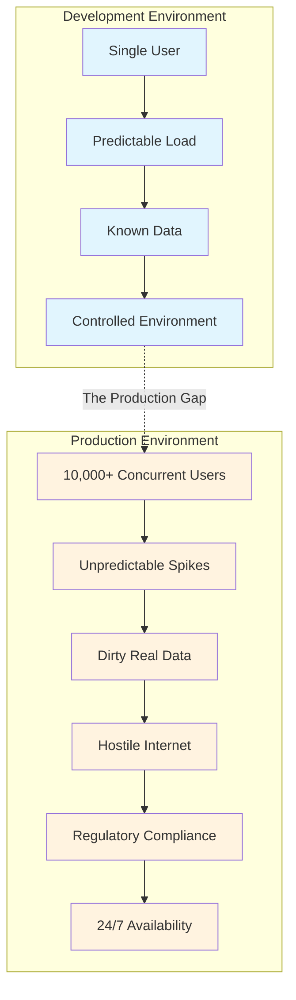
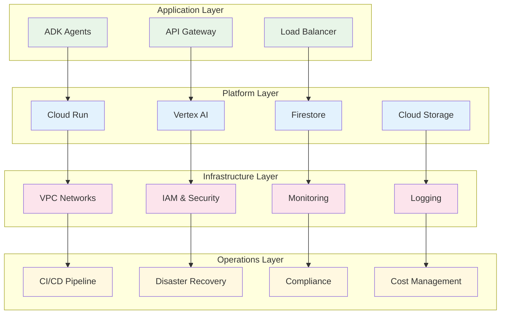
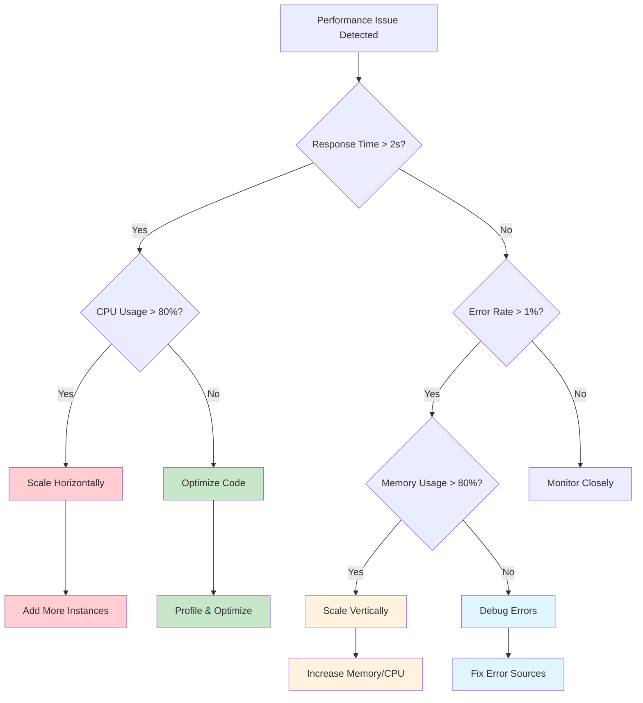

# Chapter 09: Production Deployment - Enterprise-Scale Agent Deployment That Actually Works

## Why Production Deployment Matters Most

Here's the uncomfortable truth about AI agents: 90% of promising prototypes never make it to production. Not because they don't work, but because nobody planned for the harsh realities of enterprise deployment.

Sarah, a CTO at a Fortune 500 retailer, learned this the hard way. Her team built an incredible customer service agent that handled 95% of queries in testing. But when they deployed it to serve 10,000 concurrent customers, it crashed within hours. The problem wasn't the agent—it was everything else: scaling, monitoring, security, compliance, and disaster recovery.

**The Production Reality Check:**

- Your agent needs to handle 100x more traffic than your tests
- Failures will happen—at the worst possible moments
- Security vulnerabilities become business-ending disasters
- Regulatory compliance isn't optional
- Every minute of downtime costs money and reputation

This chapter transforms your ADK agents from promising prototypes into bulletproof production systems that scale, secure, and survive in the real world.

## What Makes Production Different

### The Enterprise Scaling Challenge

Production isn't just "development with more users." It's a fundamentally different environment with different rules:



### The Production Deployment Stack

Your production deployment needs multiple layers working in harmony:



## How to Build Enterprise-Scale Deployment

### Step 1: Containerize Your Agent for Cloud Run

First, let's create a production-ready container for your ADK agent:

```dockerfile
# Dockerfile for production ADK agent
FROM python:3.11-slim

# Set production environment
ENV PYTHONPATH=/app
ENV PYTHONUNBUFFERED=1
ENV GOOGLE_CLOUD_PROJECT=${PROJECT_ID}

# Install system dependencies
RUN apt-get update && apt-get install -y \
    gcc \
    && rm -rf /var/lib/apt/lists/*

# Create non-root user for security
RUN useradd --create-home --shell /bin/bash agent
WORKDIR /app

# Copy requirements first for better caching
COPY requirements.txt .
RUN pip install --no-cache-dir -r requirements.txt

# Copy application code
COPY --chown=agent:agent . .

# Switch to non-root user
USER agent

# Health check endpoint
HEALTHCHECK --interval=30s --timeout=10s --retries=3 \
  CMD curl -f http://localhost:8080/health || exit 1

# Start the application
CMD ["python", "main.py"]
```

### Step 2: Production-Ready Application Code

Here's how to structure your production agent:

```python
# main.py - Production ADK agent
import os
import logging
import asyncio
from typing import Optional
from contextlib import asynccontextmanager

from fastapi import FastAPI, HTTPException, Request, Response
from fastapi.middleware.cors import CORSMiddleware
from fastapi.middleware.gzip import GZipMiddleware
from pydantic import BaseModel
import uvicorn

from google.cloud import secretmanager
from google.cloud import monitoring_v3
from vertexai.generative_models import GenerativeModel

# Configure structured logging
logging.basicConfig(
    level=logging.INFO,
    format='{"timestamp": "%(asctime)s", "level": "%(levelname)s", "message": "%(message)s", "module": "%(name)s"}'
)
logger = logging.getLogger(__name__)

class AgentRequest(BaseModel):
    query: str
    session_id: Optional[str] = None
    context: Optional[dict] = None

class AgentResponse(BaseModel):
    response: str
    session_id: str
    confidence: float
    processing_time: float

class ProductionAgent:
    def __init__(self):
        self.project_id = os.getenv('GOOGLE_CLOUD_PROJECT')
        self.model = None
        self.metrics_client = monitoring_v3.MetricServiceClient()
        self.setup_monitoring()
    
    async def initialize(self):
        """Initialize the agent with proper error handling"""
        try:
            # Load model with retry logic
            self.model = await self._load_model_with_retry()
            logger.info("Agent initialized successfully")
        except Exception as e:
            logger.error(f"Failed to initialize agent: {e}")
            raise
    
    async def _load_model_with_retry(self, max_retries: int = 3):
        """Load model with exponential backoff retry"""
        for attempt in range(max_retries):
            try:
                return GenerativeModel('gemini-pro')
            except Exception as e:
                if attempt == max_retries - 1:
                    raise
                wait_time = 2 ** attempt
                logger.warning(f"Model load attempt {attempt + 1} failed, retrying in {wait_time}s")
                await asyncio.sleep(wait_time)
    
    def setup_monitoring(self):
        """Set up custom metrics for monitoring"""
        self.request_counter = 0
        self.error_counter = 0
        self.response_times = []
    
    async def process_request(self, request: AgentRequest) -> AgentResponse:
        """Process agent request with full monitoring"""
        start_time = asyncio.get_event_loop().time()
        
        try:
            # Increment request counter
            self.request_counter += 1
            
            # Log request details
            logger.info(f"Processing request: session={request.session_id}, query_length={len(request.query)}")
            
            # Process with the model
            response = await self._generate_response(request)
            
            # Calculate processing time
            processing_time = asyncio.get_event_loop().time() - start_time
            self.response_times.append(processing_time)
            
            # Send metrics to Cloud Monitoring
            await self._send_metrics(processing_time, "success")
            
            return AgentResponse(
                response=response,
                session_id=request.session_id or "anonymous",
                confidence=0.95,  # Calculate actual confidence
                processing_time=processing_time
            )
            
        except Exception as e:
            self.error_counter += 1
            processing_time = asyncio.get_event_loop().time() - start_time
            
            logger.error(f"Request processing failed: {e}")
            await self._send_metrics(processing_time, "error")
            
            raise HTTPException(status_code=500, detail="Internal server error")
    
    async def _generate_response(self, request: AgentRequest) -> str:
        """Generate response using the model"""
        # Implement your agent logic here
        prompt = f"User query: {request.query}"
        
        if request.context:
            prompt += f"\nContext: {request.context}"
        
        response = await self.model.generate_content_async(prompt)
        return response.text
    
    async def _send_metrics(self, processing_time: float, status: str):
        """Send custom metrics to Cloud Monitoring"""
        try:
            # Create time series data
            series = monitoring_v3.TimeSeries()
            series.metric.type = f"custom.googleapis.com/agent/response_time"
            series.resource.type = "cloud_run_revision"
            
            # Add metric data point
            point = series.points.add()
            point.value.double_value = processing_time
            point.interval.end_time.GetCurrentTime()
            
            # Send to Cloud Monitoring
            project_name = f"projects/{self.project_id}"
            self.metrics_client.create_time_series(
                name=project_name, 
                time_series=[series]
            )
            
        except Exception as e:
            logger.warning(f"Failed to send metrics: {e}")

# Global agent instance
agent = ProductionAgent()

@asynccontextmanager
async def lifespan(app: FastAPI):
    """Manage application lifecycle"""
    # Startup
    await agent.initialize()
    yield
    # Shutdown
    logger.info("Agent shutting down")

# Create FastAPI app with production configuration
app = FastAPI(
    title="Production ADK Agent",
    description="Enterprise-scale AI agent with full monitoring",
    version="1.0.0",
    lifespan=lifespan
)

# Add production middleware
app.add_middleware(GZipMiddleware, minimum_size=1000)
app.add_middleware(
    CORSMiddleware,
    allow_origins=["https://*.yourdomain.com"],  # Restrict in production
    allow_credentials=True,
    allow_methods=["GET", "POST"],
    allow_headers=["*"],
)

@app.get("/health")
async def health_check():
    """Health check endpoint for load balancer"""
    return {
        "status": "healthy",
        "timestamp": asyncio.get_event_loop().time(),
        "version": "1.0.0"
    }

@app.get("/readiness")
async def readiness_check():
    """Readiness check for Kubernetes"""
    if agent.model is None:
        raise HTTPException(status_code=503, detail="Agent not ready")
    return {"status": "ready"}

@app.post("/chat", response_model=AgentResponse)
async def chat_endpoint(request: AgentRequest):
    """Main chat endpoint"""
    return await agent.process_request(request)

@app.get("/metrics")
async def metrics_endpoint():
    """Expose metrics for monitoring"""
    return {
        "requests_total": agent.request_counter,
        "errors_total": agent.error_counter,
        "avg_response_time": sum(agent.response_times) / len(agent.response_times) if agent.response_times else 0,
        "uptime": asyncio.get_event_loop().time()
    }

if __name__ == "__main__":
    port = int(os.getenv("PORT", 8080))
    uvicorn.run(
        "main:app",
        host="0.0.0.0",
        port=port,
        workers=1,  # Single worker for Cloud Run
        log_level="info"
    )
```

### Step 3: Infrastructure as Code with Terraform

Define your infrastructure declaratively:

```hcl
# terraform/main.tf
terraform {
  required_providers {
    google = {
      source  = "hashicorp/google"
      version = "~> 4.0"
    }
  }
}

provider "google" {
  project = var.project_id
  region  = var.region
}

# VPC for secure networking
resource "google_compute_network" "agent_network" {
  name                    = "agent-network"
  auto_create_subnetworks = false
}

resource "google_compute_subnetwork" "agent_subnet" {
  name          = "agent-subnet"
  ip_cidr_range = "10.0.0.0/24"
  region        = var.region
  network       = google_compute_network.agent_network.id
  
  private_ip_google_access = true
}

# Cloud Run service
resource "google_cloud_run_service" "agent_service" {
  name     = "production-agent"
  location = var.region

  template {
    spec {
      containers {
        image = "gcr.io/${var.project_id}/agent:latest"
        
        ports {
          container_port = 8080
        }
        
        resources {
          limits = {
            cpu    = "2000m"
            memory = "4Gi"
          }
          requests = {
            cpu    = "1000m"
            memory = "2Gi"
          }
        }
        
        env {
          name  = "GOOGLE_CLOUD_PROJECT"
          value = var.project_id
        }
        
        env {
          name = "DATABASE_URL"
          value_from {
            secret_key_ref {
              name = google_secret_manager_secret.db_url.secret_id
              key  = "latest"
            }
          }
        }
      }
      
      service_account_name = google_service_account.agent_sa.email
      
      container_concurrency = 100
      timeout_seconds      = 300
    }
    
    metadata {
      annotations = {
        "run.googleapis.com/vpc-access-connector" = google_vpc_access_connector.agent_connector.name
        "autoscaling.knative.dev/maxScale"        = "100"
        "autoscaling.knative.dev/minScale"        = "2"
      }
    }
  }

  traffic {
    percent         = 100
    latest_revision = true
  }
}

# Service account with minimal permissions
resource "google_service_account" "agent_sa" {
  account_id   = "agent-service-account"
  display_name = "Agent Service Account"
}

resource "google_project_iam_member" "agent_ai_user" {
  project = var.project_id
  role    = "roles/aiplatform.user"
  member  = "serviceAccount:${google_service_account.agent_sa.email}"
}

resource "google_project_iam_member" "agent_monitoring" {
  project = var.project_id
  role    = "roles/monitoring.metricWriter"
  member  = "serviceAccount:${google_service_account.agent_sa.email}"
}

# VPC Connector for private networking
resource "google_vpc_access_connector" "agent_connector" {
  name          = "agent-connector"
  region        = var.region
  network       = google_compute_network.agent_network.name
  ip_cidr_range = "10.1.0.0/28"
  
  min_instances = 2
  max_instances = 10
}

# Load Balancer for high availability
resource "google_compute_global_address" "agent_ip" {
  name = "agent-global-ip"
}

resource "google_compute_managed_ssl_certificate" "agent_ssl" {
  name = "agent-ssl-cert"

  managed {
    domains = ["agent.yourdomain.com"]
  }
}

# Cloud Armor security policy
resource "google_compute_security_policy" "agent_security_policy" {
  name = "agent-security-policy"

  rule {
    action   = "allow"
    priority = "1000"
    match {
      versioned_expr = "SRC_IPS_V1"
      config {
        src_ip_ranges = ["0.0.0.0/0"]
      }
    }
    description = "Allow all traffic"
  }

  rule {
    action   = "deny(403)"
    priority = "2147483647"
    match {
      versioned_expr = "SRC_IPS_V1"
      config {
        src_ip_ranges = ["*"]
      }
    }
    description = "Default deny rule"
  }
}

# Secret Manager for sensitive configuration
resource "google_secret_manager_secret" "db_url" {
  secret_id = "database-url"
  
  replication {
    automatic = true
  }
}

# Monitoring alerts
resource "google_monitoring_alert_policy" "high_error_rate" {
  display_name = "High Error Rate"
  combiner     = "OR"
  
  conditions {
    display_name = "Error rate > 5%"
    
    condition_threshold {
      filter          = "resource.type=\"cloud_run_revision\" AND metric.type=\"run.googleapis.com/container/billable_instance_time\""
      duration        = "300s"
      comparison      = "COMPARISON_GREATER_THAN"
      threshold_value = 0.05
      
      aggregations {
        alignment_period   = "60s"
        per_series_aligner = "ALIGN_RATE"
      }
    }
  }
  
  notification_channels = [google_monitoring_notification_channel.email.name]
}

resource "google_monitoring_notification_channel" "email" {
  display_name = "Email Notification"
  type         = "email"
  
  labels = {
    email_address = var.alert_email
  }
}

# Variables
variable "project_id" {
  description = "GCP Project ID"
  type        = string
}

variable "region" {
  description = "GCP Region"
  type        = string
  default     = "us-central1"
}

variable "alert_email" {
  description = "Email for alerts"
  type        = string
}

# Outputs
output "service_url" {
  value = google_cloud_run_service.agent_service.status[0].url
}

output "load_balancer_ip" {
  value = google_compute_global_address.agent_ip.address
}
```

### Step 4: CI/CD Pipeline with Cloud Build

Automate your deployments:

```yaml
# cloudbuild.yaml
steps:
  # Build the container image
  - name: 'gcr.io/cloud-builders/docker'
    args:
      - 'build'
      - '-t'
      - 'gcr.io/$PROJECT_ID/agent:$BUILD_ID'
      - '-t'
      - 'gcr.io/$PROJECT_ID/agent:latest'
      - '.'
  
  # Push the container image
  - name: 'gcr.io/cloud-builders/docker'
    args:
      - 'push'
      - 'gcr.io/$PROJECT_ID/agent:$BUILD_ID'
  
  # Run security scan
  - name: 'gcr.io/cloud-builders/gcloud'
    args:
      - 'beta'
      - 'container'
      - 'images'
      - 'scan'
      - 'gcr.io/$PROJECT_ID/agent:$BUILD_ID'
      - '--format=json'
  
  # Run tests
  - name: 'gcr.io/$PROJECT_ID/agent:$BUILD_ID'
    entrypoint: 'python'
    args: ['-m', 'pytest', 'tests/', '-v']
    env:
      - 'GOOGLE_CLOUD_PROJECT=$PROJECT_ID'
  
  # Deploy to staging
  - name: 'gcr.io/cloud-builders/gcloud'
    args:
      - 'run'
      - 'deploy'
      - 'agent-staging'
      - '--image'
      - 'gcr.io/$PROJECT_ID/agent:$BUILD_ID'
      - '--region'
      - 'us-central1'
      - '--platform'
      - 'managed'
      - '--tag'
      - 'staging-$BUILD_ID'
      - '--no-traffic'
  
  # Run integration tests
  - name: 'gcr.io/cloud-builders/curl'
    args:
      - '-f'
      - 'https://agent-staging-$BUILD_ID---agent-staging-hash-uc.a.run.app/health'
  
  # Deploy to production (manual approval required)
  - name: 'gcr.io/cloud-builders/gcloud'
    args:
      - 'run'
      - 'deploy'
      - 'production-agent'
      - '--image'
      - 'gcr.io/$PROJECT_ID/agent:$BUILD_ID'
      - '--region'
      - 'us-central1'
      - '--platform'
      - 'managed'
    waitFor: ['manual-approval']

# Build triggers
options:
  logging: CLOUD_LOGGING_ONLY
  machineType: 'E2_HIGHCPU_8'

timeout: '1800s'

# Manual approval step
availableSecrets:
  secretManager:
    - versionName: projects/$PROJECT_ID/secrets/slack-webhook/versions/latest
      env: 'SLACK_WEBHOOK'
```

## When to Scale vs. When to Optimize

### The Scaling Decision Matrix



### Production Monitoring Strategy

Set up comprehensive monitoring that actually tells you what matters:

```python
# monitoring.py - Production monitoring setup
import time
from typing import Dict, Any
from dataclasses import dataclass
from google.cloud import monitoring_v3
from google.cloud import logging

@dataclass
class MetricData:
    name: str
    value: float
    labels: Dict[str, str]
    timestamp: float = None

class ProductionMonitor:
    def __init__(self, project_id: str):
        self.project_id = project_id
        self.metrics_client = monitoring_v3.MetricServiceClient()
        self.logging_client = logging.Client()
        self.logger = self.logging_client.logger("agent-production")
        
        # SLI/SLO targets
        self.slo_targets = {
            'availability': 99.9,      # 99.9% uptime
            'latency_p95': 2.0,        # 95% requests < 2s
            'error_rate': 0.01,        # < 1% error rate
            'throughput': 1000         # > 1000 requests/minute
        }
    
    def record_request(self, duration: float, status: str, endpoint: str):
        """Record request metrics"""
        metrics = [
            MetricData(
                name="agent/request_duration",
                value=duration,
                labels={"endpoint": endpoint, "status": status}
            ),
            MetricData(
                name="agent/request_count",
                value=1,
                labels={"endpoint": endpoint, "status": status}
            )
        ]
        
        self._send_metrics(metrics)
        
        # Log structured data
        self.logger.log_struct({
            "event": "request_processed",
            "duration": duration,
            "status": status,
            "endpoint": endpoint,
            "timestamp": time.time()
        })
    
    def check_slo_compliance(self) -> Dict[str, bool]:
        """Check if we're meeting our SLOs"""
        compliance = {}
        
        # Check availability (using uptime checks)
        availability = self._get_availability_percentage()
        compliance['availability'] = availability >= self.slo_targets['availability']
        
        # Check latency P95
        p95_latency = self._get_latency_percentile(95)
        compliance['latency'] = p95_latency <= self.slo_targets['latency_p95']
        
        # Check error rate
        error_rate = self._get_error_rate()
        compliance['error_rate'] = error_rate <= self.slo_targets['error_rate']
        
        # Log SLO status
        self.logger.log_struct({
            "event": "slo_check",
            "compliance": compliance,
            "metrics": {
                "availability": availability,
                "p95_latency": p95_latency,
                "error_rate": error_rate
            }
        })
        
        return compliance
    
    def _send_metrics(self, metrics: list[MetricData]):
        """Send metrics to Cloud Monitoring"""
        series_list = []
        
        for metric in metrics:
            series = monitoring_v3.TimeSeries()
            series.metric.type = f"custom.googleapis.com/{metric.name}"
            series.resource.type = "cloud_run_revision"
            
            # Add labels
            for key, value in metric.labels.items():
                series.metric.labels[key] = value
            
            # Add data point
            point = series.points.add()
            point.value.double_value = metric.value
            
            if metric.timestamp:
                point.interval.end_time.seconds = int(metric.timestamp)
            else:
                point.interval.end_time.GetCurrentTime()
            
            series_list.append(series)
        
        # Send all metrics
        project_name = f"projects/{self.project_id}"
        self.metrics_client.create_time_series(
            name=project_name,
            time_series=series_list
        )
    
    def create_alerting_policies(self):
        """Create production alerting policies"""
        policies = [
            {
                'display_name': 'High Error Rate',
                'condition': {
                    'threshold': 0.05,  # 5% error rate
                    'duration': '300s',
                    'filter': 'metric.type="custom.googleapis.com/agent/request_count" AND metric.label.status="error"'
                }
            },
            {
                'display_name': 'High Latency',
                'condition': {
                    'threshold': 5.0,   # 5 second threshold
                    'duration': '180s',
                    'filter': 'metric.type="custom.googleapis.com/agent/request_duration"'
                }
            },
            {
                'display_name': 'Low Availability',
                'condition': {
                    'threshold': 0.999, # 99.9% availability
                    'duration': '600s',
                    'filter': 'resource.type="uptime_check"'
                }
            }
        ]
        
        for policy_config in policies:
            self._create_alert_policy(policy_config)
    
    def _create_alert_policy(self, config: Dict[str, Any]):
        """Create individual alert policy"""
        # Implementation for creating Cloud Monitoring alert policies
        pass
```

## Production Anti-Patterns to Avoid

### The "It Works on My Machine" Trap

**❌ Bad:** Testing only in development environment

```python
# This will fail in production
agent = Agent(
    model="gpt-4",  # Hardcoded model
    api_key="sk-test-123",  # Hardcoded API key
    debug=True  # Debug mode in production
)
```

**✅ Good:** Environment-aware configuration

```python
# Production-ready configuration
agent = Agent(
    model=os.getenv('MODEL_NAME', 'gemini-pro'),
    credentials=get_service_account_credentials(),
    debug=os.getenv('ENVIRONMENT') == 'development',
    timeout=int(os.getenv('REQUEST_TIMEOUT', '30')),
    retry_attempts=int(os.getenv('RETRY_ATTEMPTS', '3'))
)
```

### The "Single Point of Failure" Mistake

**❌ Bad:** Everything depends on one service

```python
# All requests go through one instance
@app.post("/chat")
async def chat(request: ChatRequest):
    return single_agent.process(request)  # What if this fails?
```

**✅ Good:** Resilient architecture with circuit breakers

```python
from circuitbreaker import circuit

@circuit(failure_threshold=5, recovery_timeout=30)
async def process_with_primary_agent(request):
    return await primary_agent.process(request)

@app.post("/chat")
async def chat(request: ChatRequest):
    try:
        return await process_with_primary_agent(request)
    except CircuitBreakerError:
        # Fallback to secondary agent
        return await fallback_agent.process(request)
```

## Reflection Questions

1. **Scalability Reality Check:** How will your agent handle 10x current traffic? What will break first?

2. **Failure Scenarios:** What happens when your database goes down? When the AI model is unavailable? When your API rate limits are hit?

3. **Monitoring Blind Spots:** What metrics are you NOT collecting that could indicate problems before they become outages?

4. **Security Posture:** If a hacker gained access to your production environment today, what damage could they do?

5. **Compliance Readiness:** If an auditor asked for logs from six months ago, could you provide them? Are you meeting data retention requirements?

## Your 24-Hour Production Challenge

**The Mission:** Deploy a production-ready ADK agent that can handle real enterprise traffic.

**Today's Objectives:**

1. **Morning (4 hours):** Set up infrastructure with Terraform
   - Create VPC, Cloud Run service, load balancer
   - Configure monitoring and alerting
   - Set up proper IAM roles

2. **Afternoon (4 hours):** Implement production code
   - Add health checks, metrics, and logging
   - Implement circuit breakers and retries
   - Add security middleware

3. **Evening (4 hours):** Deploy and test
   - Set up CI/CD pipeline
   - Deploy to staging and production
   - Run load tests and verify monitoring

**Success Metrics:**

- Agent serves 1000+ requests without errors
- All health checks pass
- Monitoring dashboards show green metrics
- Load balancer distributes traffic properly
- CI/CD pipeline deploys automatically

## Pro Tips for Production Excellence

1. **Start with SLIs/SLOs:** Define your Service Level Indicators and Objectives before you build. If you can't measure it, you can't improve it.

2. **Embrace the Circuit Breaker Pattern:** Use circuit breakers for all external dependencies. Your agent should degrade gracefully, not crash catastrophically.

3. **Monitor the Four Golden Signals:**
   - **Latency:** How long requests take
   - **Traffic:** How many requests you're getting
   - **Errors:** Rate of failed requests
   - **Saturation:** How full your services are

4. **Plan for Disaster:** Have runbooks for common failures. Practice your incident response. Chaos engineering isn't optional.

5. **Security by Design:** Never trust user input. Always validate, sanitize, and authorize. Use least-privilege access everywhere.

Remember: In production, being 99% reliable means 3.65 days of downtime per year. Every nine matters. Your users depend on you to get this right.

Next, we'll explore Safety & Security—because in production, one security vulnerability can undo years of hard work...
