# Chapter 09: Production Deployment - Enterprise-Scale Agent Deployment That Actually Works

> **🚨 Updated for ADK v1.0.0 & Latest Agent Engine Features (June 2025)**
>
> **Key Updates from Official Sources:**
>
> - Python ADK is now officially v1.0.0 for production stability
> - Java ADK v0.1.0 now available for enterprise development
> - Agent Engine supports 13 global regions with production SLAs
> - Simplified deployment: `pip install google-adk` for basic development
> - Enhanced pricing transparency: $0.0994/vCPU-Hr, $0.0105/GiB-Hr
> - Verified Python version support: >=3.9 and <=3.12

## Why Production Deployment Matters Most

Here's the uncomfortable truth about AI agents: 90% of promising prototypes never make it to production. Not because they don't work, but because nobody planned for the harsh realities of enterprise deployment.

Sarah, a CTO at a Fortune 500 retailer, learned this the hard way. Her team built an incredible customer service agent that handled 95% of queries in testing. But when they deployed it to serve 10,000 concurrent customers, it crashed within hours. The problem wasn't the agent—it was everything else: scaling, monitoring, security, compliance, and disaster recovery.

**The Production Reality Check:**

- Your agent needs to handle 100x more traffic than your tests
- Failures will happen—at the worst possible moments
- Security vulnerabilities become business-ending disasters
- Regulatory compliance isn't optional
- Every minute of downtime costs money and reputation

This chapter transforms your ADK agents from promising prototypes into bulletproof production systems that scale, secure, and survive in the real world.

## What Makes Production Different

### The Enterprise Scaling Challenge

Production isn't just "development with more users." It's a fundamentally different environment with different rules:


### The Production Deployment Stack

Your production deployment needs multiple layers working in harmony:


## Google's Official Agent Starter Pack (New 2025)

> **🚀 Official Google Recommendation:** For streamlined production deployment, Google now provides the [Agent Starter Pack](https://github.com/GoogleCloudPlatform/agent-starter-pack) - a collection of production-ready templates.

**What Agent Starter Pack Includes:**

- **Pre-built Templates:** ReAct, RAG, multi-agent patterns
- **Interactive Playground:** Built-in UI for testing and experimentation
- **Automated Infrastructure:** Terraform for streamlined resource management
- **CI/CD Pipelines:** Automated deployment workflows with Cloud Build
- **Built-in Observability:** Cloud Trace and Cloud Logging integration
- **1-Minute Quickstart:** Get started immediately with proven patterns

**Quick Start with Agent Starter Pack:**

```bash
# Clone the official starter pack
git clone https://github.com/GoogleCloudPlatform/agent-starter-pack
cd agent-starter-pack

# Follow the 1-minute quickstart
# Includes automated GCP setup and deployment
```

This is now Google's recommended approach for enterprise teams who want production-ready agents with minimal setup time.

## How to Build Enterprise-Scale Deployment

> **⚠️ Important:** Google ADK provides three deployment options, with **Vertex AI Agent Engine** being the recommended approach for production deployments due to its fully managed nature, built-in scaling capabilities, and enterprise security features.

### Official ADK Deployment Options

Based on the official Google ADK documentation, here are the three deployment paths with **updated framework support levels**:

```mermaid
graph TD
    subgraph "🎯 Recommended: Vertex AI Agent Engine"
        AE1[Fully Managed Runtime] --> AE2[Auto-scaling & Load Balancing]
        AE2 --> AE3[Built-in Session Management]
        AE3 --> AE4[Integrated Observability]
        AE4 --> AE5[VPC-SC Security Support]
        AE5 --> AE6[Production SLAs]
    end

    subgraph "⚙️ Flexible: Cloud Run"
        CR1[Container-based Deployment] --> CR2[ADK CLI Support]
        CR2 --> CR3[Manual Scaling Configuration]
        CR3 --> CR4[Custom Infrastructure Control]
        CR4 --> CR5[UI & API Endpoints]
    end

    subgraph "🔧 Advanced: Google Kubernetes Engine"
        GKE1[Full Infrastructure Control] --> GKE2[Complex Multi-Agent Systems]
        GKE2 --> GKE3[Custom Resource Management]
        GKE3 --> GKE4[Open Source Model Support]
        GKE4 --> GKE5[Advanced Networking]
    end

    style AE1 fill:#e8f5e8
    style AE2 fill:#e8f5e8
    style AE3 fill:#e8f5e8
    style AE4 fill:#e8f5e8
    style AE5 fill:#e8f5e8
    style AE6 fill:#e8f5e8
    style CR1 fill:#fff3e0
    style CR2 fill:#fff3e0
    style CR3 fill:#fff3e0
    style CR4 fill:#fff3e0
    style CR5 fill:#fff3e0
    style GKE1 fill:#fce4ec
    style GKE2 fill:#fce4ec
    style GKE3 fill:#fce4ec
    style GKE4 fill:#fce4ec
    style GKE5 fill:#fce4ec
```



**Framework Support Levels (Official 2025 Status):**

| Framework             | Support Level             | Description                                                                    |
| --------------------- | ------------------------- | ------------------------------------------------------------------------------ |
| **ADK**               | Full integration          | Features integrated across framework, Agent Engine, and Google Cloud ecosystem |
| **LangChain**         | Full integration          | Complete integration with Vertex AI Agent Engine                               |
| **LangGraph**         | Full integration          | Supported with managed templates and documentation                             |
| **AG2**               | Vertex AI SDK integration | Managed templates in Vertex AI SDK                                             |
| **LlamaIndex**        | Vertex AI SDK integration | Managed templates in Vertex AI SDK                                             |
| **CrewAI**            | Custom template           | Adaptable custom template support                                              |
| **Custom frameworks** | Custom template           | Flexible adaptation possible                                                   |

### Real-World Production Considerations

**Agent Engine vs Cloud Run vs GKE Decision Matrix:**

| Factor                   | Agent Engine                   | Cloud Run                   | GKE                         |
| ------------------------ | ------------------------------ | --------------------------- | --------------------------- |
| **Setup Complexity**     | Minimal (2-3 commands)         | Low (ADK CLI)               | High (Full K8s)             |
| **Production Readiness** | Built-in                       | Manual setup                | Extensive setup             |
| **Scaling**              | Automatic                      | Configurable                | Full control                |
| **Monitoring**           | Cloud Trace/Logging integrated | Manual setup                | Custom implementation       |
| **Security**             | VPC-SC compliant               | Custom IAM                  | Full security control       |
| **Cost**                 | Usage-based compute            | Pay-per-request             | Infrastructure costs        |
| **Best For**             | Most production workloads      | Cost-sensitive applications | Complex multi-agent systems |

### Step 1: Set Up Your ADK Agent Project Structure

Before deployment, ensure your agent follows the official ADK project structure:

```bash
my_agent_project/
├── agent.py                 # Main agent file with root_agent variable
├── __init__.py              # Contains: from . import agent
├── requirements.txt         # ADK dependencies
├── .env                     # Environment variables (optional)
└── tests/
    └── test_agent.py        # Agent tests
```

**Key Requirements (Official ADK Standards):**

- Agent code must be in `agent.py`
- Your agent variable must be named `root_agent`
- `__init__.py` must contain `from . import agent`
- Python version: >=3.9 and <=3.12 (Agent Engine requirement)
- Basic ADK: `google-adk`
- Agent Engine deployment: `google-cloud-aiplatform[adk,agent_engines]`

### Step 2: Vertex AI Agent Engine Deployment (Recommended)

The official Google recommendation for production ADK agents is Vertex AI Agent Engine. Here's the complete setup:

```python
# Production ADK Agent for Vertex AI Agent Engine
import datetime
from zoneinfo import ZoneInfo
from google.adk.agents import Agent
import vertexai
from vertexai.preview import reasoning_engines
from vertexai import agent_engines

# Step 1: Initialize Vertex AI (supports 13 global regions)
PROJECT_ID = "your-project-id"
LOCATION = "us-central1"  # Choose from supported regions
STAGING_BUCKET = "gs://your-production-bucket"

vertexai.init(
    project=PROJECT_ID,
    location=LOCATION,
    staging_bucket=STAGING_BUCKET,
)

# Step 2: Create your production agent
def get_weather(city: str) -> dict:
    """Retrieves the current weather report for a specified city.

    Args:
        city (str): The name of the city for which to retrieve the weather report.

    Returns:
        dict: status and result or error msg.
    """
    # Production implementation with real API integration
    try:
        # Your actual weather API integration here
        if city.lower() == "new york":
            return {
                "status": "success",
                "report": "The weather in New York is sunny with a temperature of 25°C (77°F)."
            }
        else:
            return {
                "status": "error",
                "error_message": f"Weather information for '{city}' is not available."
            }
    except Exception as e:
        return {
            "status": "error",
            "error_message": f"Service temporarily unavailable: {str(e)}"
        }

def get_current_time(city: str) -> dict:
    """Returns the current time in a specified city."""
    try:
        timezone_map = {
            "new york": "America/New_York",
            "london": "Europe/London",
            "tokyo": "Asia/Tokyo",
            "sydney": "Australia/Sydney"
        }

        tz_identifier = timezone_map.get(city.lower())
        if not tz_identifier:
            return {
                "status": "error",
                "error_message": f"Timezone information for '{city}' is not available."
            }

        tz = ZoneInfo(tz_identifier)
        now = datetime.datetime.now(tz)
        report = f'The current time in {city} is {now.strftime("%Y-%m-%d %H:%M:%S %Z%z")}'

        return {"status": "success", "report": report}

    except Exception as e:
        return {
            "status": "error",
            "error_message": f"Time service error: {str(e)}"
        }

# Step 3: Create production-ready agent with proper configuration
root_agent = Agent(
    name="production_weather_agent",
    model="gemini-2.0-flash",  # Latest production model
    description="Enterprise weather and time agent with global coverage",
    instruction=(
        "You are a reliable enterprise agent providing weather and time information. "
        "Always provide accurate information and handle errors gracefully. "
        "If a service is unavailable, apologize and suggest alternatives."
    ),
    tools=[get_weather, get_current_time],
)

# Step 4: Prepare for Agent Engine deployment
app = reasoning_engines.AdkApp(
    agent=root_agent,
    enable_tracing=True,  # Essential for production monitoring
)

# Step 5: Test locally before deployment
def test_agent_locally():
    """Test agent functionality before deploying to production"""
    print("Testing agent locally...")

    # Create test session
    session = app.create_session(user_id="test_user")
    print(f"✅ Session created: {session.id}")

    # Test queries
    test_queries = [
        "What's the weather in New York?",
        "What time is it in London?",
        "Tell me about the weather in an unknown city"
    ]

    for query in test_queries:
        print(f"\n🔍 Testing: {query}")
        try:
            for event in app.stream_query(
                user_id="test_user",
                session_id=session.id,
                message=query
            ):
                if 'parts' in event and len(event['parts']) > 0:
                    if 'text' in event['parts'][0]:
                        print(f"✅ Response: {event['parts'][0]['text']}")
        except Exception as e:
            print(f"❌ Error: {e}")

# Step 6: Deploy to Agent Engine
def deploy_to_production():
    """Deploy agent to Vertex AI Agent Engine"""
    print("Deploying to Vertex AI Agent Engine...")

    try:
        # Deploy with production requirements
        remote_app = agent_engines.create(
            agent_engine=root_agent,
            requirements=[
                "google-cloud-aiplatform[adk,agent_engines]>=1.73.0",
                "python-dateutil>=2.8.2",
                "requests>=2.31.0"  # For API integrations
            ]
        )

        print(f"✅ Agent deployed successfully!")
        print(f"🔗 Resource name: {remote_app.resource_name}")

        return remote_app

    except Exception as e:
        print(f"❌ Deployment failed: {e}")
        raise

# Step 7: Production testing
def test_production_deployment(remote_app):
    """Test the deployed agent in production"""
    print("\n🚀 Testing production deployment...")

    # Create production session
    session = remote_app.create_session(user_id="prod_user_001")
    session_id = session["id"]

    # Test production query
    for event in remote_app.stream_query(
        user_id="prod_user_001",
        session_id=session_id,
        message="What's the current weather and time in New York?"
    ):
        if 'parts' in event and len(event['parts']) > 0:
            if 'text' in event['parts'][0]:
                print(f"✅ Production response: {event['parts'][0]['text']}")

if __name__ == "__main__":
    # Production deployment workflow
    test_agent_locally()
    remote_app = deploy_to_production()
    test_production_deployment(remote_app)
```

**Key Agent Engine Production Features:**

- **Automatic Scaling:** Handles 0 to thousands of concurrent users
- **Built-in Monitoring:** Cloud Trace, Cloud Logging, and Cloud Monitoring integration
- **Session Management:** Persistent conversation context across interactions
- **VPC-SC Support:** Enterprise security compliance for data residency
- **Global Availability:** 13 regions with production SLAs (us-central1, us-east4, us-west1, europe-west1, europe-west2, europe-west3, europe-west4, europe-southwest1, asia-east1, asia-northeast1, asia-south1, asia-southeast1, australia-southeast2)
- **Cost Optimization:** Pay only for compute time used ($0.0994/vCPU-Hr, $0.0105/GiB-Hr)
- **Quota Limits:** 60 queries/minute, 100 agent resources per project per region

### Step 3: Cloud Run Deployment (Alternative)

For more control over infrastructure or cost-sensitive deployments, use Cloud Run with the official ADK CLI:

```bash
# Set up environment variables
export GOOGLE_CLOUD_PROJECT="your-gcp-project-id"
export GOOGLE_CLOUD_LOCATION="us-central1"
export AGENT_PATH="./your_agent_directory"
export SERVICE_NAME="production-agent-service"

# Deploy with ADK CLI (Official Method)
adk deploy cloud_run \
  --project=$GOOGLE_CLOUD_PROJECT \
  --region=$GOOGLE_CLOUD_LOCATION \
  --service_name=$SERVICE_NAME \
  --with_ui \
  $AGENT_PATH
```

**Cloud Run Production Configuration:**

```python
# agent.py - Cloud Run optimized agent
from google.adk.agents import Agent
import os

def setup_production_agent():
    """Configure agent for Cloud Run deployment"""

    # Environment-based configuration
    model_name = os.getenv('MODEL_NAME', 'gemini-2.0-flash')
    enable_debug = os.getenv('ENVIRONMENT', 'production') == 'development'

    root_agent = Agent(
        name="cloud_run_agent",
        model=model_name,
        description="Production agent optimized for Cloud Run",
        instruction=(
            "You are a production AI agent running on Cloud Run. "
            "Provide helpful and accurate responses while maintaining "
            "enterprise-level reliability and security."
        ),
        tools=[],  # Add your production tools here
    )

    return root_agent

# This variable name is required by ADK
root_agent = setup_production_agent()
```

**requirements.txt for Cloud Run:**

```txt
google-adk>=1.0.0
google-cloud-aiplatform>=1.73.0
fastapi>=0.104.0
uvicorn[standard]>=0.24.0
```

**Cloud Run vs Agent Engine Trade-offs:**

| Aspect                 | Cloud Run                 | Agent Engine           |
| ---------------------- | ------------------------- | ---------------------- |
| **Setup**              | ADK CLI + configuration   | 3 Python commands      |
| **Scaling**            | Manual configuration      | Automatic              |
| **Monitoring**         | Custom setup required     | Built-in observability |
| **Session Management** | Manual implementation     | Managed service        |
| **Cost**               | $0.000024/vCPU-second     | $0.0994/vCPU-hour      |
| **UI**                 | Optional with `--with_ui` | Not included           |

### Step 4: Production Monitoring & Observability

**Agent Engine Built-in Monitoring:**

```python
# Monitoring is automatic with Agent Engine
# Access via Google Cloud Console:
# - Cloud Trace for request tracing
# - Cloud Logging for application logs
# - Cloud Monitoring for metrics and alerts

# Example: Custom metrics in your agent tools
import time
from google.cloud import monitoring_v3

def monitored_weather_function(city: str) -> dict:
    """Weather function with monitoring"""
    start_time = time.time()

    try:
        # Your weather logic here
        result = {"status": "success", "data": "weather_data"}

        # Record success metric
        record_metric("weather_requests", 1, {"status": "success", "city": city})

        return result
    except Exception as e:
        # Record error metric
        record_metric("weather_requests", 1, {"status": "error", "city": city})
        raise
    finally:
        # Record latency
        latency = time.time() - start_time
        record_metric("weather_latency", latency, {"city": city})

def record_metric(metric_name: str, value: float, labels: dict):
    """Send custom metrics to Cloud Monitoring"""
    # Implementation for Cloud Monitoring
    pass
```

**Production SLO Monitoring:**

```python
# production_monitoring.py
from dataclasses import dataclass
from typing import Dict, List
import time

@dataclass
class SLOTarget:
    name: str
    threshold: float
    description: str

class ProductionSLOMonitor:
    def __init__(self, project_id: str):
        self.project_id = project_id
        self.slo_targets = {
            'availability': SLOTarget('availability', 99.9, '99.9% uptime'),
            'latency_p95': SLOTarget('latency_p95', 2.0, '95% of requests < 2s'),
            'error_rate': SLOTarget('error_rate', 1.0, 'Error rate < 1%'),
            'throughput': SLOTarget('throughput', 1000, '> 1000 requests/minute')
        }

    def check_slo_compliance(self) -> Dict[str, bool]:
        """Check if we're meeting our SLOs"""
        compliance = {}

        # Check each SLO target
        for name, target in self.slo_targets.items():
            current_value = self._get_current_metric_value(name)

            if name == 'error_rate':
                compliance[name] = current_value <= target.threshold
            else:
                compliance[name] = current_value >= target.threshold

        return compliance

    def _get_current_metric_value(self, metric_name: str) -> float:
        """Get current metric value from monitoring"""
        # Implementation to fetch from Cloud Monitoring
        return 0.0
```

```bash
# Set environment variables
export GOOGLE_CLOUD_PROJECT="your-project-id"
export GOOGLE_CLOUD_LOCATION="us-central1"
export GOOGLE_GENAI_USE_VERTEXAI=True
```

**Deploy with ADK CLI (Recommended):**

```bash
# Minimal deployment
adk deploy cloud_run \
  --project=$GOOGLE_CLOUD_PROJECT \
  --region=$GOOGLE_CLOUD_LOCATION \
  ./my_agent_project

# Full deployment with UI
adk deploy cloud_run \
  --project=$GOOGLE_CLOUD_PROJECT \
  --region=$GOOGLE_CLOUD_LOCATION \
  --service_name=production-agent \
  --app_name=weather-agent \
  --with_ui \
  ./my_agent_project
```

**Custom Container Approach:**

```python
# main.py - Production ADK agent with custom monitoring
import os
import logging
import json
from typing import Optional
from contextlib import asynccontextmanager

from fastapi import FastAPI, HTTPException
from fastapi.middleware.cors import CORSMiddleware
from pydantic import BaseModel
import uvicorn

from google.cloud import monitoring_v3
from google.cloud import logging as cloud_logging

# Configure structured logging for Google Cloud
client = cloud_logging.Client()
client.setup_logging()
```

## When to Scale vs. When to Optimize

### The Scaling Decision Matrix (Updated for ADK)

Based on official Google recommendations and real-world Agent Engine performance:

**Agent Engine Auto-Scaling Behavior:**

- **Scale to Zero:** Agents scale down to 0 instances when idle
- **Cold Start:** ~3-5 seconds for first request after idle period
- **Warm Scaling:** Sub-second scaling for traffic spikes
- **Maximum Scale:** 100 concurrent requests per agent by default

### Production Anti-Patterns to Avoid

**❌ Bad: Hardcoded Configuration**

```python
# This will fail in production
root_agent = Agent(
    name="hardcoded_agent",
    model="gemini-pro",  # Should be configurable
    tools=[api_tool(api_key="sk-test-123")]  # Hardcoded secrets
)
```

**✅ Good: Environment-Based Configuration**

```python
# Production-ready configuration
import os

root_agent = Agent(
    name=os.getenv('AGENT_NAME', 'production_agent'),
    model=os.getenv('MODEL_NAME', 'gemini-2.0-flash'),
    tools=[
        weather_tool(api_key=os.getenv('WEATHER_API_KEY')),
        database_tool(connection_url=os.getenv('DATABASE_URL'))
    ]
)
```

**❌ Bad: No Error Handling in Tools**

```python
def fragile_tool(query: str) -> str:
    # This will crash your agent
    response = requests.get(f"https://api.example.com/search?q={query}")
    return response.json()['result']
```

**✅ Good: Resilient Tool Implementation**

```python
def resilient_tool(query: str) -> dict:
    """Production-ready tool with comprehensive error handling"""
    try:
        response = requests.get(
            f"https://api.example.com/search?q={query}",
            timeout=10,
            headers={'User-Agent': 'ProductionAgent/1.0'}
        )
        response.raise_for_status()

        data = response.json()
        if 'result' not in data:
            return {
                "status": "error",
                "message": "API returned unexpected format"
            }

        return {
            "status": "success",
            "result": data['result']
        }

    except requests.exceptions.Timeout:
        return {
            "status": "error",
            "message": "API request timed out"
        }
    except requests.exceptions.HTTPError as e:
        return {
            "status": "error",
            "message": f"API returned error: {e.response.status_code}"
        }
    except Exception as e:
        return {
            "status": "error",
            "message": "Service temporarily unavailable"
        }
```

### Enterprise Security Checklist

**✅ ADK Security Best Practices:**

1. **Use Agent Engine VPC-SC Support**

   ```python
   # VPC-SC is automatically supported in Agent Engine
   # No code changes required for VPC Service Controls
   ```

2. **Implement Proper IAM Roles**

   ```yaml
   # Minimum required permissions
   - roles/aiplatform.user
   - roles/storage.objectViewer
   - roles/monitoring.metricWriter
   ```

3. **Secure Tool Implementation**

   ```python
   def secure_database_tool(query: str) -> dict:
       """Example: Secure database access with input validation"""
       # Input validation
       if not query or len(query) > 1000:
           return {"error": "Invalid query parameters"}

       # SQL injection prevention
       sanitized_query = sanitize_sql_input(query)

       # Use connection pooling and prepared statements
       with get_secure_db_connection() as conn:
           result = conn.execute_prepared(sanitized_query)
           return {"result": result}
   ```

4. **Environment-Based Secrets Management**

   ```python
   from google.cloud import secretmanager

   def get_secret(secret_id: str) -> str:
       """Retrieve secrets from Google Secret Manager"""
       client = secretmanager.SecretManagerServiceClient()
       name = f"projects/{PROJECT_ID}/secrets/{secret_id}/versions/latest"
       response = client.access_secret_version(request={"name": name})
       return response.payload.data.decode("UTF-8")
   ```

## Reflection Questions

1. **Production Readiness:** Is your agent using Agent Engine's built-in features (tracing, logging, auto-scaling) or recreating them manually?

2. **Tool Resilience:** Do all your agent tools handle failures gracefully and return structured error responses?

3. **Security Posture:** Are you using Google Cloud's managed security features (VPC-SC, IAM, Secret Manager) or rolling your own?

4. **Monitoring Strategy:** Can you identify and debug issues using Cloud Trace and Cloud Logging, or do you need custom dashboards?

5. **Cost Optimization:** Are you using Agent Engine's scale-to-zero capability, or maintaining unnecessary always-on infrastructure?

## Your Production Deployment Checklist

**🎯 Agent Engine Deployment (Recommended Path):**

- [ ] **Setup (15 minutes)**

  - [ ] Install `google-cloud-aiplatform[adk,agent_engines]>=1.73.0`
  - [ ] Configure project and staging bucket in one of 13 supported regions
  - [ ] Set up proper IAM roles (roles/aiplatform.user, roles/storage.objectViewer)

- [ ] **Development (30 minutes)**

  - [ ] Structure agent with proper error handling in agent.py
  - [ ] Test locally with `reasoning_engines.AdkApp.stream_query()`
  - [ ] Add custom metrics for business logic

- [ ] **Deployment (10 minutes)**

  - [ ] Deploy with `agent_engines.create(agent_engine=root_agent)`
  - [ ] Test production endpoint with session management
  - [ ] Verify observability in Cloud Console (Trace, Logging, Monitoring)

- [ ] **Production Monitoring (20 minutes)**
  - [ ] Set up Cloud Monitoring alerts for error rates and latency
  - [ ] Configure SLO monitoring (99.9% uptime, <2s latency, <1% errors)
  - [ ] Test error scenarios and auto-recovery
  - [ ] Verify quota limits (60 queries/minute, 100 agents/region)

**📊 Success Metrics (Verified Targets):**

- Agent handles 100+ concurrent requests without errors
- 95th percentile latency < 2 seconds
- Automatic scaling from 0 to peak load (scale-to-zero capability)
- Error rate < 1%
- Complete request tracing in Cloud Trace
- Session persistence across conversations
- VPC-SC compliance for enterprise security

## Pro Tips for ADK Production Excellence (Verified 2025)

1. **Use Official Google Resources:** Start with the [Agent Starter Pack](https://github.com/GoogleCloudPlatform/agent-starter-pack) for production-ready templates and automated infrastructure.

2. **Leverage Agent Engine's Built-ins:** Don't reinvent monitoring, scaling, or session management. Agent Engine provides enterprise-grade features out-of-the-box.

3. **Follow Official Project Structure:** Use exactly `agent.py` with `root_agent` variable and `__init__.py` with `from . import agent` - these are hard requirements.

4. **Design Resilient Tools:** Every tool function should handle errors gracefully and return structured responses. Your agent's reliability depends on tool reliability.

5. **Use Verified Versions:** Python ADK v1.0.0 is production-stable. Java ADK v0.1.0 is now available for enterprise development.

6. **Monitor with Cloud-Native Tools:** Agent Engine integrates with Cloud Trace, Cloud Logging, and Cloud Monitoring. Use structured logging for better observability.

7. **Optimize for Real Costs:** Agent Engine pricing is $0.0994/vCPU-Hr and $0.0105/GiB-Hr with scale-to-zero capability - design accordingly.

8. **Respect Quota Limits:** 60 queries/minute and 100 agent resources per project per region. Plan your scaling strategy within these bounds.

**Fact-Checked Key Changes from Official Sources:**

- ✅ ADK is now v1.0.0 (production stable)
- ✅ 13 global regions confirmed for Agent Engine
- ✅ VPC-SC support verified for enterprise security
- ✅ Official Agent Starter Pack available for rapid deployment
- ✅ Framework support levels clarified (ADK/LangChain/LangGraph = full integration)

Remember: With Agent Engine and the official Agent Starter Pack, focus on building great agent logic rather than infrastructure. Google Cloud handles the production complexities for you.

Next, we'll explore Safety & Security—because production agents need bulletproof safety measures...

resource "google_project_iam_member" "agent_monitoring" {
project = var.project_id
role = "roles/monitoring.metricWriter"
member = "serviceAccount:${google_service_account.agent_sa.email}"
}

# VPC Connector for private networking

resource "google_vpc_access_connector" "agent_connector" {
name = "agent-connector"
region = var.region
network = google_compute_network.agent_network.name
ip_cidr_range = "10.1.0.0/28"

min_instances = 2
max_instances = 10
}

# Load Balancer for high availability

resource "google_compute_global_address" "agent_ip" {
name = "agent-global-ip"
}

resource "google_compute_managed_ssl_certificate" "agent_ssl" {
name = "agent-ssl-cert"

managed {
domains = ["agent.yourdomain.com"]
}
}

# Cloud Armor security policy

resource "google_compute_security_policy" "agent_security_policy" {
name = "agent-security-policy"

rule {
action = "allow"
priority = "1000"
match {
versioned_expr = "SRC_IPS_V1"
config {
src_ip_ranges = ["0.0.0.0/0"]
}
}
description = "Allow all traffic"
}

rule {
action = "deny(403)"
priority = "2147483647"
match {
versioned_expr = "SRC_IPS_V1"
config {
src_ip_ranges = ["*"]
}
}
description = "Default deny rule"
}
}

# Secret Manager for sensitive configuration

resource "google_secret_manager_secret" "db_url" {
secret_id = "database-url"

replication {
automatic = true
}
}

# Monitoring alerts

resource "google_monitoring_alert_policy" "high_error_rate" {
display_name = "High Error Rate"
combiner = "OR"

conditions {
display_name = "Error rate > 5%"

    condition_threshold {
      filter          = "resource.type=\"cloud_run_revision\" AND metric.type=\"run.googleapis.com/container/billable_instance_time\""
      duration        = "300s"
      comparison      = "COMPARISON_GREATER_THAN"
      threshold_value = 0.05

      aggregations {
        alignment_period   = "60s"
        per_series_aligner = "ALIGN_RATE"
      }
    }

}

notification_channels = [google_monitoring_notification_channel.email.name]
}

resource "google_monitoring_notification_channel" "email" {
display_name = "Email Notification"
type = "email"

labels = {
email_address = var.alert_email
}
}

# Variables

variable "project_id" {
description = "GCP Project ID"
type = string
}

variable "region" {
description = "GCP Region"
type = string
default = "us-central1"
}

variable "alert_email" {
description = "Email for alerts"
type = string
}

# Outputs

output "service_url" {
value = google_cloud_run_service.agent_service.status[0].url
}

output "load_balancer_ip" {
value = google_compute_global_address.agent_ip.address
}

````

### Step 6: CI/CD Pipeline for ADK Agents

**For Vertex AI Agent Engine Deployments:**

```yaml
# .github/workflows/deploy-agent-engine.yml
name: Deploy to Vertex AI Agent Engine

on:
  push:
    branches: [main]
  pull_request:
    branches: [main]

env:
  PROJECT_ID: ${{ secrets.GCP_PROJECT_ID }}
  LOCATION: us-central1

jobs:
  test:
    runs-on: ubuntu-latest
    steps:
      - uses: actions/checkout@v4

      - name: Set up Python
        uses: actions/setup-python@v4
        with:
          python-version: '3.11'

      - name: Install dependencies
        run: |
          pip install -r requirements.txt
          pip install pytest

      - name: Run tests
        run: |
          pytest tests/ -v

      - name: Validate agent structure
        run: |
          python -c "
          import importlib.util
          spec = importlib.util.spec_from_file_location('agent', 'agent.py')
          module = importlib.util.module_from_spec(spec)

└── requirements.txt
````

### The "Version Compatibility" Error

**❌ Bad:** Using unsupported Python versions

```python
# This will fail - Python 3.8 not supported by Agent Engine
FROM python:3.8-slim
```

**✅ Good:** Using supported Python versions

```python
# Supported versions: Python >=3.9 and <=3.12
FROM python:3.11-slim
```

### The "Custom Session Management" Trap

**❌ Bad:** Building custom session management

```python
# Reinventing session management
class CustomSessionManager:
    def __init__(self):
        self.sessions = {}

    def create_session(self, user_id):
        # Custom implementation that duplicates ADK functionality
        pass
```

**✅ Good:** Using built-in ADK session management

```python
# ADK provides built-in session management
app = reasoning_engines.AdkApp(agent=root_agent, enable_tracing=True)
session = app.create_session(user_id="user_123")
```

## Reflection Questions

1. **Deployment Strategy:** Should you use Vertex AI Agent Engine for full management, or Cloud Run for custom control? What are the trade-offs for your use case?

2. **Session Management:** How will you handle user sessions and state? Are you leveraging ADK's built-in session management effectively?

3. **Monitoring & Observability:** What metrics matter most for your ADK agent? How will you monitor agent performance, tool usage, and user satisfaction?

4. **Scaling Considerations:** How will your agent handle traffic spikes? What's your strategy for scaling tools and external API calls?

5. **Cost Optimization:** Are you using the right model for your workload? How will you optimize costs while maintaining performance?

## Your 24-Hour ADK Production Challenge

**The Mission:** Deploy a production-ready ADK agent using Google's recommended practices.

**Today's Objectives:**

1. **Morning (4 hours):** Set up proper ADK project structure

   - Create agent.py with root_agent variable
   - Set up proper **init**.py
   - Configure requirements.txt with correct dependencies
   - Write tests for your agent

2. **Afternoon (4 hours):** Deploy to Vertex AI Agent Engine

   - Initialize Vertex AI with proper project settings
   - Deploy using reasoning_engines.AdkApp()
   - Test local and remote deployment
   - Set up monitoring and logging

3. **Evening (4 hours):** Implement production best practices
   - Set up CI/CD pipeline for automated deployments
   - Configure monitoring alerts and SLOs
   - Test session management and scaling
   - Document deployment process

**Success Metrics:**

- Agent successfully deployed to Agent Engine
- Session management working correctly
- Built-in tracing and monitoring active
- CI/CD pipeline deploying automatically
- All health checks passing

## Pro Tips for ADK Production Excellence

1. **Start with Agent Engine:** Unless you have specific containerization needs, start with Vertex AI Agent Engine for the simplest production deployment.

2. **Follow ADK Conventions:** Use the exact file naming conventions (agent.py, root_agent variable) to avoid deployment issues.

3. **Leverage Built-in Features:** Don't reinvent session management, tracing, or monitoring—ADK provides these out of the box.

4. **Version Compatibility:** Always use supported Python versions (>=3.9, <=3.12) for Agent Engine compatibility.

5. **Test Locally First:** Always test your agent locally with reasoning_engines.AdkApp() before deploying to production.

6. **Monitor Agent-Specific Metrics:** Focus on tool usage, conversation flows, and user intent completion rates, not just generic web metrics.

Remember: ADK is designed to simplify AI agent deployment. Don't over-engineer what Google has already solved for you. The best production deployments are often the simplest ones that leverage the platform's built-in capabilities.

Next, we'll explore Safety & Security—because even the most robust deployment means nothing if your agent isn't secure and safe...
