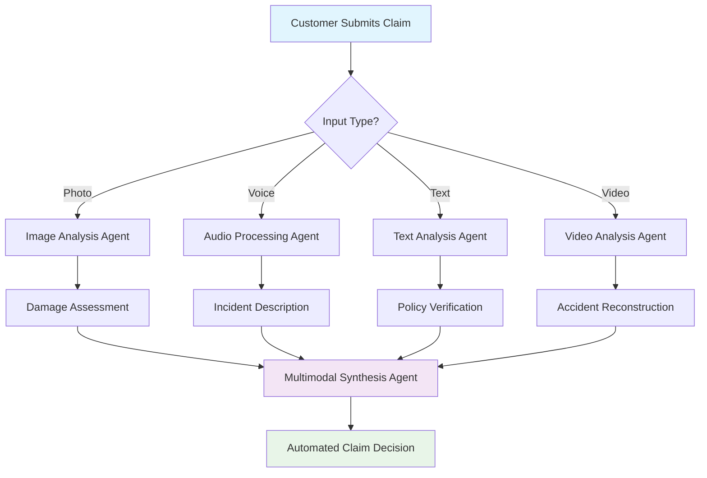
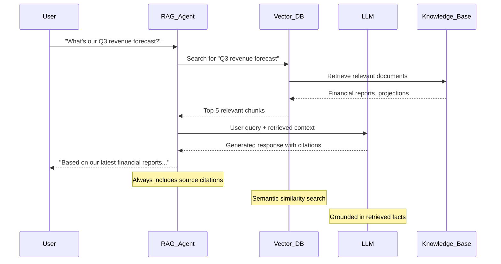
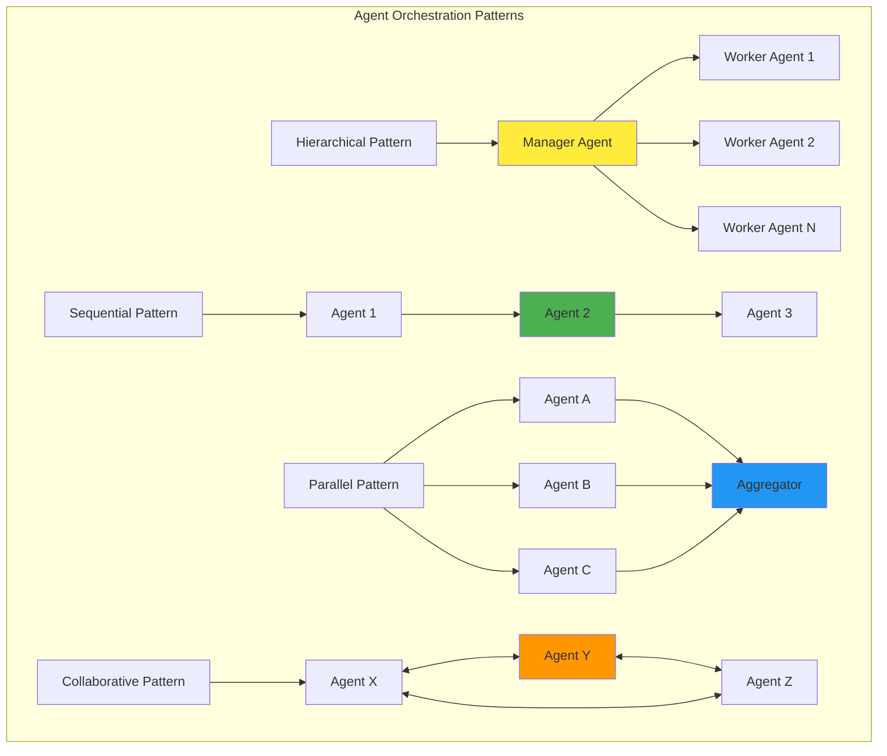
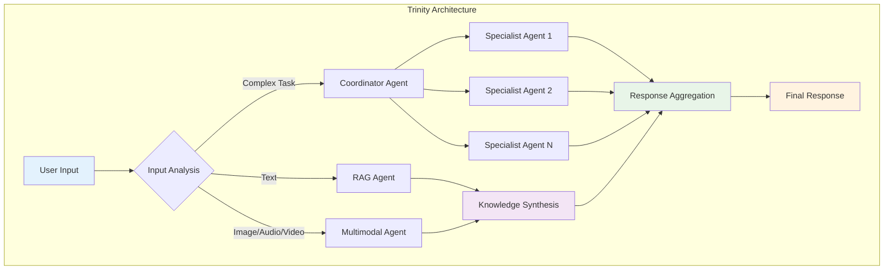

# Chapter 11: Advanced Patterns for AI Agents

> *"The art of building AI agents isn't just about creating intelligent responses—it's about orchestrating symphonies of specialized agents that work together to solve complex, real-world problems."* — A Senior AI Architect

## Why Advanced Patterns Matter

Imagine you're running a global e-commerce platform during Black Friday. A single customer query might require:

- Understanding a product image they uploaded
- Searching through millions of products
- Checking real-time inventory across warehouses
- Processing payment options
- Coordinating with logistics systems

No single agent can handle this complexity efficiently. This is where **advanced AI agent patterns** transform ambitious ideas into production-ready solutions.

## What You'll Master in This Chapter

You'll discover how to architect enterprise-grade AI solutions using three powerful patterns:

1. **Multimodal Agents** - Process text, images, audio, and video simultaneously
2. **Retrieval-Augmented Generation (RAG)** - Access real-time, domain-specific knowledge
3. **Distributed Agent Systems** - Orchestrate teams of specialized agents

By the end of this chapter, you'll build a complete **Smart Customer Service System** that demonstrates all three patterns working together.

## Introduction: The Evolution of AI Agents

Remember when chatbots could only handle simple FAQ questions? Those days are over. Today's AI agents are sophisticated systems that can:

- Process multiple data types simultaneously (multimodal)
- Access vast knowledge bases in real-time (RAG)
- Coordinate with other agents to solve complex problems (distributed systems)

As AI agents become more sophisticated, developers are moving beyond basic request-response interactions to build complex, multi-agent systems that mirror how human teams collaborate to solve problems.

## Pattern 1: Multimodal Agents - Beyond Text

### The "Why" Behind Multimodal Agents

**Why settle for text-only when the world is rich with images, sounds, and videos?**

Consider Netflix's customer support. When a user reports a streaming issue, they might:

- Send a screenshot of the error
- Describe the problem in text
- Upload a screen recording showing the glitch

A multimodal agent can process all three inputs simultaneously to provide better support than any text-only system ever could.

### What Are Multimodal Agents?

Multimodal agents are AI systems that can understand and process multiple types of data simultaneously:

- **Text** - Natural language understanding
- **Images** - Visual recognition and analysis
- **Audio** - Speech recognition and sound analysis
- **Video** - Motion detection and temporal understanding

### Key Concepts and Capabilities

**Multimodal LLMs**: Foundation models like Google's Gemini can understand and process multiple data types simultaneously, enabling:

**Use Cases:**

- **Image Captioning**: Generating detailed textual descriptions of images
- **Visual Q&A**: Answering complex questions about visual content
- **Audio Transcription and Analysis**: Converting speech to text and analyzing tone, sentiment, and intent
- **Document Understanding**: Processing PDFs, forms, and handwritten content
- **Video Analysis**: Understanding temporal sequences and extracting insights from video content

### Real-World Example: Smart Insurance Claims Agent

Let's build a practical multimodal agent for insurance claims processing:



### Implementation with Google ADK

Here's how to build a multimodal insurance claims agent using Google ADK:

```python
from google.adk.agents import LlmAgent
from google.adk.tools import FunctionTool
from google.genai import types
import vertexai
from vertexai.generative_models import GenerativeModel, Part

class MultimodalClaimsAgent:
    def __init__(self, project_id: str):
        vertexai.init(project=project_id, location="us-central1")
        self.multimodal_model = GenerativeModel("gemini-2.0-flash")
        
    def analyze_damage_photo(self, image_url: str, description: str = "") -> dict:
        """Analyzes damage from uploaded photos for insurance claims.
        
        Args:
            image_url: URL of the damage photo
            description: Optional text description from the claimant
            
        Returns:
            Dictionary with damage assessment, severity, and estimated costs
        """
        try:
            # Load the image
            image_part = Part.from_uri(image_url, mime_type="image/jpeg")
            
            # Create analysis prompt
            prompt = f"""
            Analyze this insurance claim photo for damage assessment.
            Additional context: {description}
            
            Provide a detailed analysis including:
            1. Type of damage visible
            2. Severity assessment (Minor/Moderate/Severe)
            3. Estimated repair complexity
            4. Recommended next steps
            5. Potential cost category (Low/Medium/High)
            
            Format your response as a structured assessment.
            """
            
            # Generate analysis
            response = self.multimodal_model.generate_content([prompt, image_part])
            
            return {
                "status": "success",
                "analysis": response.text,
                "confidence": "high",
                "requires_adjuster": "severe" in response.text.lower()
            }
            
        except Exception as e:
            return {
                "status": "error",
                "error_message": f"Failed to analyze image: {str(e)}"
            }
    
    def process_audio_statement(self, audio_url: str) -> dict:
        """Processes audio statements from claimants.
        
        Args:
            audio_url: URL of the audio recording
            
        Returns:
            Dictionary with transcription and sentiment analysis
        """
        # Note: In production, you'd integrate with Speech-to-Text API
        # This is a simplified example
        return {
            "status": "success",
            "transcription": "Sample transcription of the incident description",
            "sentiment": "concerned_but_cooperative",
            "key_points": [
                "Accident occurred at 2:30 PM",
                "Weather conditions were clear",
                "No injuries reported"
            ]
        }

# Create the main multimodal agent
def create_multimodal_claims_agent():
    claims_processor = MultimodalClaimsAgent(project_id="your-project-id")
    
    # Create function tools
    damage_analysis_tool = FunctionTool(func=claims_processor.analyze_damage_photo)
    audio_analysis_tool = FunctionTool(func=claims_processor.process_audio_statement)
    
    # Create the main agent
    agent = LlmAgent(
        name="MultimodalClaimsAgent",
        model="gemini-2.0-flash",
        instruction="""You are an intelligent insurance claims processing agent.
        
        Your capabilities:
        - Analyze damage photos using analyze_damage_photo
        - Process audio statements using process_audio_statement
        - Synthesize information from multiple sources
        - Make preliminary claim assessments
        
        Always use available tools to analyze multimedia content before making decisions.
        Provide clear, structured assessments with confidence levels.
        Flag cases requiring human adjuster review when appropriate.""",
        tools=[damage_analysis_tool, audio_analysis_tool]
    )
    
    return agent

# Usage example
multimodal_agent = create_multimodal_claims_agent()
```

### Advanced Multimodal Use Case: Video Analysis

For more complex scenarios, you can process video content:

```python
def analyze_security_footage(self, video_url: str, incident_time: str) -> dict:
    """Analyzes security footage for incident verification.
    
    Args:
        video_url: URL of the security video
        incident_time: Timestamp of the reported incident
        
    Returns:
        Dictionary with video analysis results
    """
    # Extract frames around the incident time
    video_part = Part.from_uri(video_url, mime_type="video/mp4")
    
    prompt = f"""
    Analyze this security footage around timestamp {incident_time}.
    
    Look for:
    1. Vehicle movements and positions
    2. Weather conditions
    3. Lighting conditions
    4. Any unusual activities
    5. Timeline of events
    
    Provide a chronological description of what occurred.
    """
    
    response = self.multimodal_model.generate_content([prompt, video_part])
    
    return {
        "status": "success",
        "timeline_analysis": response.text,
        "incident_confirmed": True,
        "additional_evidence_needed": False
    }
```

### Pro Tips for Multimodal Agents

1. **Input Validation**: Always validate file types and sizes before processing
2. **Error Handling**: Gracefully handle corrupted media files
3. **Cost Management**: Multimodal processing can be expensive; implement smart caching
4. **Privacy Compliance**: Ensure sensitive media data is handled according to regulations

### Pause and Reflect 🤔

**Quick Challenge**: Think of a business problem in your industry where combining text, image, and audio analysis could provide breakthrough insights. How would you structure the agent workflow?

---

## Pattern 2: Retrieval-Augmented Generation (RAG) - Knowledge on Demand

### The "Why" Behind RAG

**Why train massive models when you can teach them to research?**

Here's a story that illustrates the power of RAG: A pharmaceutical company's AI assistant needed to answer questions about drug interactions. Training a model on all medical literature would be:

- Impossibly expensive
- Quickly outdated  
- Legally risky (what if the training data was wrong?)

Instead, they built a RAG system that retrieves the latest, verified medical information in real-time. The result? An AI assistant that's always current, factual, and traceable to authoritative sources.

### What Is RAG?

**Retrieval-Augmented Generation (RAG)** enhances AI responses by dynamically retrieving relevant information from external knowledge bases. Instead of relying solely on training data, RAG agents actively search for current, domain-specific information to inform their responses.



### How RAG Works in Practice

The RAG process follows a clear sequence:

1. **Query Processing**: The user's question is analyzed and converted into search terms
2. **Information Retrieval**: Relevant documents are found using semantic search
3. **Context Augmentation**: Retrieved information is added to the user's original query
4. **Generation**: The LLM generates a response based on both the query and retrieved context
5. **Source Attribution**: The response includes citations to original sources

### Building a Production RAG System with Google ADK

Let's create a comprehensive enterprise knowledge assistant:

```python
from google.adk.agents import LlmAgent, SequentialAgent
from google.adk.tools import FunctionTool
from google.cloud import discoveryengine_v1beta
import vertexai
from vertexai.language_models import TextEmbeddingModel

class EnterpriseRAGSystem:
    def __init__(self, project_id: str, search_engine_id: str):
        self.project_id = project_id
        self.search_engine_id = search_engine_id
        self.search_client = discoveryengine_v1beta.SearchServiceClient()
        
        # Initialize embedding model for semantic search
        vertexai.init(project=project_id, location="us-central1")
        self.embedding_model = TextEmbeddingModel.from_pretrained("textembedding-gecko@003")
    
    def search_enterprise_knowledge(self, query: str, context: str = "") -> dict:
        """Searches enterprise knowledge base using Vertex AI Search.
        
        Args:
            query: User's search query
            context: Additional context to improve search relevance
            
        Returns:
            Dictionary with search results and metadata
        """
        try:
            # Enhance query with context if provided
            enhanced_query = f"{query} {context}".strip()
            
            # Configure search request
            request = discoveryengine_v1beta.SearchRequest(
                serving_config=f"projects/{self.project_id}/locations/global/"
                              f"collections/default_collection/engines/{self.search_engine_id}/"
                              f"servingConfigs/default_config",
                query=enhanced_query,
                page_size=5,  # Retrieve top 5 most relevant results
                query_expansion_spec=discoveryengine_v1beta.SearchRequest.QueryExpansionSpec(
                    condition=discoveryengine_v1beta.SearchRequest.QueryExpansionSpec.Condition.AUTO,
                ),
                spell_correction_spec=discoveryengine_v1beta.SearchRequest.SpellCorrectionSpec(
                    mode=discoveryengine_v1beta.SearchRequest.SpellCorrectionSpec.Mode.AUTO
                )
            )
            
            # Execute search
            response = self.search_client.search(request=request)
            
            # Extract and format results
            results = []
            for result in response.results:
                doc_data = result.document.derived_struct_data
                results.append({
                    "title": doc_data.get("title", "Unknown Document"),
                    "content": doc_data.get("extractive_answers", [{}])[0].get("content", ""),
                    "source": doc_data.get("link", ""),
                    "confidence": result.relevance_score if hasattr(result, 'relevance_score') else 0.8
                })
            
            return {
                "status": "success",
                "results": results,
                "total_results": len(results),
                "search_quality": "high" if results else "low"
            }
            
        except Exception as e:
            return {
                "status": "error",
                "error_message": f"Search failed: {str(e)}",
                "results": []
            }
    
    def synthesize_answer(self, query: str, search_results: list, context: str = "") -> dict:
        """Synthesizes search results into a coherent answer.
        
        Args:
            query: Original user query
            search_results: Results from knowledge search
            context: Additional context for better synthesis
            
        Returns:
            Dictionary with synthesized answer and citations
        """
        if not search_results:
            return {
                "status": "no_results",
                "answer": "I couldn't find relevant information to answer your question.",
                "confidence": 0.0,
                "sources": []
            }
        
        # Prepare context from search results
        context_chunks = []
        sources = []
        
        for i, result in enumerate(search_results):
            context_chunks.append(f"Source {i+1}: {result['content']}")
            sources.append({
                "index": i+1,
                "title": result["title"],
                "url": result["source"],
                "confidence": result["confidence"]
            })
        
        combined_context = "\n\n".join(context_chunks)
        
        # Calculate overall confidence
        avg_confidence = sum(r["confidence"] for r in search_results) / len(search_results)
        
        return {
            "status": "success",
            "context": combined_context,
            "sources": sources,
            "confidence": avg_confidence,
            "query": query
        }

def create_enterprise_rag_agent(project_id: str, search_engine_id: str):
    """Creates a complete RAG-enabled enterprise assistant."""
    
    rag_system = EnterpriseRAGSystem(project_id, search_engine_id)
    
    # Create function tools
    search_tool = FunctionTool(func=rag_system.search_enterprise_knowledge)
    synthesis_tool = FunctionTool(func=rag_system.synthesize_answer)
    
    # Knowledge Retrieval Agent
    retriever_agent = LlmAgent(
        name="KnowledgeRetriever",
        model="gemini-2.0-flash",
        instruction="""You are a knowledge retrieval specialist.
        
        Your role:
        1. Analyze user queries to extract key search terms
        2. Use search_enterprise_knowledge to find relevant information
        3. Return structured search results
        
        Always search for information before attempting to answer questions.
        Focus on finding the most current and authoritative sources.""",
        tools=[search_tool],
        output_key="search_results"
    )
    
    # Answer Synthesis Agent
    synthesizer_agent = LlmAgent(
        name="AnswerSynthesizer",
        model="gemini-2.0-flash",
        instruction="""You are an expert at synthesizing information into clear, accurate answers.
        
        Your role:
        1. Read the search results from the previous agent
        2. Create comprehensive, well-structured answers
        3. Always include proper citations
        4. Indicate confidence levels
        
        Guidelines:
        - Base answers strictly on provided search results
        - Use numbered citations [1], [2], etc.
        - If information is incomplete, say so explicitly
        - Maintain professional, helpful tone
        
        Format your response as:
        
        **Answer:**
        [Your comprehensive answer here]
        
        **Sources:**
        [1] Source Title - URL
        [2] Source Title - URL
        
        **Confidence:** [High/Medium/Low] based on source quality and relevance.""",
        tools=[synthesis_tool]
    )
    
    # Main RAG Pipeline
    rag_pipeline = SequentialAgent(
        name="EnterpriseRAGAssistant",
        sub_agents=[retriever_agent, synthesizer_agent],
        description="Enterprise knowledge assistant with real-time information retrieval"
    )
    
    return rag_pipeline

# Usage example
enterprise_assistant = create_enterprise_rag_agent(
    project_id="your-project-id",
    search_engine_id="your-search-engine-id"
)
```

### Advanced RAG Techniques

#### 1. Multi-Source RAG

Combine multiple knowledge sources for comprehensive answers:

```python
def multi_source_search(self, query: str) -> dict:
    """Searches across multiple knowledge sources."""
    sources = {
        "internal_docs": self.search_internal_documents(query),
        "external_apis": self.search_external_apis(query),
        "real_time_data": self.get_real_time_data(query)
    }
    
    return {
        "status": "success",
        "multi_source_results": sources,
        "synthesis_required": True
    }
```

#### 2. Contextual RAG

Maintain conversation context for better retrieval:

```python
def contextual_search(self, query: str, conversation_history: list) -> dict:
    """Performs context-aware search using conversation history."""
    # Build context from previous interactions
    context = self.build_conversation_context(conversation_history)
    
    # Enhance query with context
    enhanced_query = f"Context: {context}\nCurrent question: {query}"
    
    return self.search_enterprise_knowledge(enhanced_query, context)
```

### RAG Best Practices and Common Pitfalls

**✅ Do:**

- Always cite sources in your responses
- Implement semantic chunking for better retrieval
- Use hybrid search (keyword + semantic)
- Regularly update your knowledge base
- Monitor retrieval quality metrics

**❌ Avoid:**

- Generating answers without retrieved context
- Using stale or outdated information
- Ignoring source credibility
- Over-relying on single sources
- Forgetting to handle empty search results

### Pro Tips for Production RAG

1. **Chunk Optimization**: Test different chunk sizes (256, 512, 1024 tokens) for your domain
2. **Reranking**: Implement a reranking step to improve result quality
3. **Caching**: Cache frequent queries to reduce latency and costs
4. **Monitoring**: Track retrieval accuracy and answer quality metrics
5. **Fallback Strategies**: Have fallback responses when retrieval fails

---

---

## Pattern 3: Distributed Agent Systems - Teamwork at Scale

### The "Why" Behind Distributed Agents

**Why have one superhero when you can have the Avengers?**

Think about how a successful software company operates:

- **Product Managers** gather requirements and prioritize features
- **Architects** design system blueprints  
- **Developers** implement the features
- **QA Engineers** test and validate
- **DevOps Engineers** deploy and monitor

Each role has specialized expertise. Similarly, distributed agent systems break complex problems into smaller, manageable tasks handled by specialized agents working together.

### What Are Distributed Agent Systems?

**Distributed agent systems** consist of multiple specialized agents collaborating to achieve a common goal. This approach mirrors human teamwork, allowing for:

- **Specialization**: Each agent excels at specific tasks
- **Scalability**: Add more agents as needs grow
- **Reliability**: If one agent fails, others can continue
- **Maintainability**: Update individual agents without affecting the entire system

### Orchestration Patterns in Google ADK

Google ADK provides powerful primitives for building distributed agent systems:



#### 1. Hierarchical Pattern - The Manager-Worker Model

**When to use**: Complex tasks requiring delegation and coordination.

```python
from google.adk.agents import LlmAgent, SequentialAgent
from google.adk.tools import FunctionTool, agent_tool

class SoftwareDevelopmentTeam:
    def __init__(self):
        self.setup_specialized_agents()
    
    def setup_specialized_agents(self):
        # Specialized worker agents
        self.requirements_agent = LlmAgent(
            name="RequirementsAnalyst",
            model="gemini-2.0-flash",
            description="Analyzes and clarifies project requirements",
            instruction="""You are a senior business analyst specializing in requirements gathering.
            
            Your expertise:
            - Break down high-level requests into detailed requirements
            - Identify potential edge cases and constraints
            - Clarify ambiguous specifications
            - Estimate complexity and effort
            
            Always ask clarifying questions when requirements are unclear."""
        )
        
        self.architect_agent = LlmAgent(
            name="SolutionArchitect",
            model="gemini-2.0-flash",
            description="Designs technical architecture and system blueprints",
            instruction="""You are a senior solution architect with expertise in scalable systems.
            
            Your role:
            - Design technical architecture based on requirements
            - Select appropriate technologies and patterns
            - Identify potential bottlenecks and risks
            - Create implementation roadmaps
            
            Focus on scalability, maintainability, and best practices."""
        )
        
        self.developer_agent = LlmAgent(
            name="SeniorDeveloper",
            model="gemini-2.0-flash",
            description="Implements features based on architecture and requirements",
            instruction="""You are a senior developer with expertise in multiple programming languages.
            
            Your responsibilities:
            - Implement features according to architectural guidelines
            - Write clean, maintainable code
            - Follow coding standards and best practices
            - Provide implementation estimates
            
            Always consider code quality, performance, and security."""
        )
        
        # Manager agent that coordinates the team
        self.project_manager = LlmAgent(
            name="ProjectManager",
            model="gemini-2.0-flash",
            description="Coordinates software development projects and manages team workflow",
            instruction="""You are an experienced project manager leading a software development team.
            
            Your team consists of:
            - RequirementsAnalyst: Clarifies and documents requirements
            - SolutionArchitect: Designs technical solutions
            - SeniorDeveloper: Implements the features
            
            Your process:
            1. Start with requirements analysis
            2. Move to architectural design
            3. Proceed with implementation planning
            4. Coordinate between team members
            5. Ensure quality and completeness
            
            Use transfer_to_agent() to delegate tasks to appropriate specialists.
            Always synthesize inputs from all team members into coherent project plans.""",
            sub_agents=[
                self.requirements_agent,
                self.architect_agent,
                self.developer_agent
            ]
        )

# Create the development team
dev_team = SoftwareDevelopmentTeam()
project_manager = dev_team.project_manager
```

#### 2. Sequential Pattern - Pipeline Processing

**When to use**: Multi-step processes where each stage depends on the previous one.

```python
from google.adk.agents import SequentialAgent, LlmAgent

def create_content_creation_pipeline():
    """Creates a content creation pipeline with sequential agents."""
    
    # Research Agent
    researcher = LlmAgent(
        name="ContentResearcher",
        model="gemini-2.0-flash",
        instruction="""You are a content researcher specializing in gathering information for articles.
        
        Your process:
        1. Analyze the topic and target audience
        2. Identify key points to cover
        3. Gather supporting facts and statistics
        4. Note current trends and insights
        
        Save your research findings to state with key 'research_data'.""",
        output_key="research_data"
    )
    
    # Writer Agent  
    writer = LlmAgent(
        name="ContentWriter",
        model="gemini-2.0-flash",
        instruction="""You are a skilled content writer who creates engaging articles.
        
        Your process:
        1. Review research data from state key 'research_data'
        2. Create a compelling article structure
        3. Write engaging, informative content
        4. Include relevant examples and insights
        
        Save your draft to state with key 'article_draft'.""",
        output_key="article_draft"
    )
    
    # Editor Agent
    editor = LlmAgent(
        name="ContentEditor",
        model="gemini-2.0-flash",
        instruction="""You are an experienced editor who polishes content for publication.
        
        Your process:
        1. Review the article draft from state key 'article_draft'
        2. Check for clarity, flow, and engagement
        3. Correct grammar and style issues
        4. Ensure consistency and accuracy
        5. Optimize for target audience
        
        Provide the final, publication-ready version."""
    )
    
    # Sequential pipeline
    content_pipeline = SequentialAgent(
        name="ContentCreationPipeline",
        sub_agents=[researcher, writer, editor],
        description="End-to-end content creation from research to publication"
    )
    
    return content_pipeline
```

#### 3. Parallel Pattern - Concurrent Processing

**When to use**: Independent tasks that can be executed simultaneously.

```python
from google.adk.agents import ParallelAgent, SequentialAgent, LlmAgent

def create_market_analysis_system():
    """Creates a comprehensive market analysis system using parallel processing."""
    
    # Parallel analysis agents
    competitor_analyst = LlmAgent(
        name="CompetitorAnalyst",
        model="gemini-2.0-flash",
        instruction="""Analyze competitor landscape and market positioning.
        
        Focus on:
        - Key competitors and their strategies
        - Market share analysis
        - Pricing strategies
        - Competitive advantages and weaknesses
        
        Save findings to state key 'competitor_analysis'.""",
        output_key="competitor_analysis"
    )
    
    trend_analyst = LlmAgent(
        name="TrendAnalyst", 
        model="gemini-2.0-flash",
        instruction="""Analyze market trends and future opportunities.
        
        Focus on:
        - Emerging market trends
        - Consumer behavior shifts
        - Technology disruptions
        - Growth opportunities
        
        Save findings to state key 'trend_analysis'.""",
        output_key="trend_analysis"
    )
    
    financial_analyst = LlmAgent(
        name="FinancialAnalyst",
        model="gemini-2.0-flash", 
        instruction="""Analyze financial metrics and market performance.
        
        Focus on:
        - Revenue and profit trends
        - Market valuation analysis
        - Financial health indicators
        - Investment opportunities
        
        Save findings to state key 'financial_analysis'.""",
        output_key="financial_analysis"
    )
    
    # Parallel execution of analysis
    parallel_analysis = ParallelAgent(
        name="ParallelMarketAnalysis",
        sub_agents=[competitor_analyst, trend_analyst, financial_analyst],
        description="Concurrent analysis of different market aspects"
    )
    
    # Synthesis agent to combine results
    synthesis_agent = LlmAgent(
        name="MarketSynthesizer",
        model="gemini-2.0-flash",
        instruction="""Synthesize parallel analysis results into comprehensive market report.
        
        Combine insights from:
        - Competitor analysis (state key 'competitor_analysis')
        - Trend analysis (state key 'trend_analysis') 
        - Financial analysis (state key 'financial_analysis')
        
        Create a unified market assessment with strategic recommendations."""
    )
    
    # Complete analysis workflow
    market_analysis_system = SequentialAgent(
        name="ComprehensiveMarketAnalysis",
        sub_agents=[parallel_analysis, synthesis_agent],
        description="Complete market analysis with parallel processing and synthesis"
    )
    
    return market_analysis_system
```

#### 4. Collaborative Pattern - Dynamic Interaction

**When to use**: Complex problem-solving requiring dynamic collaboration and iteration.

```python
from google.adk.agents import LlmAgent
from google.adk.tools import agent_tool

def create_research_collaboration_system():
    """Creates a collaborative research system where agents can call each other as tools."""
    
    # Specialized research agents
    data_scientist = LlmAgent(
        name="DataScientist",
        model="gemini-2.0-flash",
        description="Analyzes data patterns and statistical insights",
        instruction="""You are a senior data scientist specializing in data analysis and machine learning.
        
        Your expertise includes:
        - Statistical analysis and hypothesis testing
        - Machine learning model recommendations
        - Data visualization strategies
        - Pattern recognition and insights extraction
        
        Provide data-driven recommendations with confidence levels."""
    )
    
    domain_expert = LlmAgent(
        name="DomainExpert",
        model="gemini-2.0-flash",
        description="Provides domain-specific knowledge and context",
        instruction="""You are a domain expert with deep industry knowledge.
        
        Your role:
        - Provide context for technical findings
        - Validate assumptions against industry practices
        - Suggest practical implementation approaches
        - Identify potential challenges and solutions
        
        Ground technical insights in real-world practicality."""
    )
    
    # Create agent tools for cross-collaboration
    data_scientist_tool = agent_tool.AgentTool(agent=data_scientist)
    domain_expert_tool = agent_tool.AgentTool(agent=domain_expert)
    
    # Research coordinator that can collaborate with specialists
    research_coordinator = LlmAgent(
        name="ResearchCoordinator",
        model="gemini-2.0-flash",
        instruction="""You are a research coordinator leading interdisciplinary projects.
        
        Available specialists:
        - DataScientist: For statistical analysis and ML insights
        - DomainExpert: For industry context and practical validation
        
        Your approach:
        1. Break down complex research questions
        2. Consult appropriate specialists using available tools
        3. Synthesize insights from multiple perspectives
        4. Iterate based on specialist feedback
        5. Provide comprehensive, actionable conclusions
        
        Always validate technical findings with domain expertise.""",
        tools=[data_scientist_tool, domain_expert_tool]
    )
    
    return research_coordinator
```

### Real-World Example: Smart Customer Service System

Let's combine all three patterns into a comprehensive customer service system:

```python
def create_smart_customer_service():
    """Creates an enterprise-grade customer service system combining all patterns."""
    
    # Multimodal intake agent
    intake_agent = create_multimodal_claims_agent()  # From earlier example
    
    # RAG-enabled knowledge agent  
    knowledge_agent = create_enterprise_rag_agent(
        project_id="your-project-id",
        search_engine_id="customer-service-kb"
    )
    
    # Specialized service agents
    technical_support = LlmAgent(
        name="TechnicalSupport",
        model="gemini-2.0-flash",
        description="Handles technical issues and troubleshooting",
        instruction="""You are a senior technical support specialist.
        
        Your expertise:
        - Troubleshoot technical issues
        - Provide step-by-step solutions
        - Escalate complex technical problems
        - Document solutions for knowledge base"""
    )
    
    billing_support = LlmAgent(
        name="BillingSupport", 
        model="gemini-2.0-flash",
        description="Handles billing inquiries and account issues",
        instruction="""You are a billing support specialist.
        
        Your expertise:
        - Resolve billing discrepancies
        - Explain charges and fees
        - Process refunds and adjustments
        - Update account information"""
    )
    
    # Supervisor agent for coordination
    customer_service_supervisor = LlmAgent(
        name="CustomerServiceSupervisor",
        model="gemini-2.0-flash",
        instruction="""You are a customer service supervisor managing a team of specialists.
        
        Your team:
        - TechnicalSupport: For technical issues
        - BillingSupport: For billing and account questions
        
        Process:
        1. Analyze customer inquiry
        2. Route to appropriate specialist using transfer_to_agent
        3. Monitor case progression
        4. Ensure customer satisfaction
        
        Always prioritize customer experience and resolution quality.""",
        sub_agents=[technical_support, billing_support]
    )
    
    # Complete service pipeline
    service_pipeline = SequentialAgent(
        name="SmartCustomerService",
        sub_agents=[
            intake_agent,           # Multimodal input processing
            knowledge_agent,        # RAG-based knowledge retrieval
            customer_service_supervisor  # Distributed agent coordination
        ],
        description="Complete customer service system with multimodal, RAG, and distributed capabilities"
    )
    
    return service_pipeline

# Deploy the complete system
smart_service = create_smart_customer_service()
```

### Best Practices for Distributed Agent Systems

**✅ Do:**

- **Define Clear Responsibilities**: Each agent should have a specific, well-defined role
- **Implement Graceful Handoffs**: Use proper state management for agent transitions  
- **Monitor Agent Performance**: Track individual agent metrics and overall system health
- **Plan for Failures**: Implement fallback strategies when agents are unavailable
- **Document Agent Interactions**: Maintain clear logs of agent-to-agent communications

**❌ Avoid:**

- **Creating Too Many Agents**: Start simple and add complexity gradually
- **Circular Dependencies**: Prevent infinite loops in agent interactions
- **Shared State Conflicts**: Use proper state management to avoid race conditions
- **Single Points of Failure**: Ensure system can function with degraded capabilities
- **Ignoring Latency**: Consider performance implications of agent orchestration

### Pro Tips for Production Systems

1. **Start Small**: Begin with 2-3 agents and expand based on needs
2. **Use Circuit Breakers**: Implement fallback mechanisms for failed agents
3. **Monitor Token Usage**: Distributed systems can consume tokens quickly
4. **Implement Caching**: Cache agent responses for common scenarios
5. **Version Your Agents**: Track agent updates and their impact on system behavior

---

## Building Your First Advanced Agent System

### When to Use Each Pattern

Understanding **when** to apply each pattern is crucial for success:

| Pattern | Best For | Complexity | Implementation Time |
|---------|----------|------------|-------------------|
| **Multimodal** | Rich media processing, customer support, content analysis | Medium | 1-2 weeks |
| **RAG** | Knowledge-intensive tasks, dynamic information needs | Medium | 2-3 weeks |
| **Distributed** | Complex workflows, scalable systems, team-like behavior | High | 3-6 weeks |

### Quick Assessment Quiz 🧠

**Scenario 1**: A real estate company wants an AI assistant that can analyze property photos, search MLS listings, and coordinate with different specialists (financing, inspection, legal).

**Which patterns would you combine?**

- A) Just RAG
- B) Multimodal + RAG
- C) All three patterns
- D) Just Distributed Agents

**Answer: C) All three patterns**

**Why?**

- **Multimodal**: For analyzing property photos and documents
- **RAG**: For searching MLS listings and market data
- **Distributed**: For coordinating specialists (financing, inspection, legal)

This scenario perfectly demonstrates how advanced patterns work together in real-world applications.

**Scenario 2**: A financial services company needs an AI that can answer questions about their investment products using the latest regulatory documents.

**Which pattern is most important?**

- A) Multimodal
- B) RAG
- C) Distributed
- D) None needed

**Answer: B) RAG**

**Why?**

- Financial regulations change frequently
- Accuracy is critical (can't rely on training data alone)
- Must cite authoritative sources
- Perfect use case for real-time document retrieval

## Advanced Integration Patterns

### Pattern Combination: The Trinity Architecture

The most powerful AI systems combine all three patterns:



### Implementation Strategy: The 3-Phase Approach

#### Phase 1: Foundation (Weeks 1-2)

- Start with a single pattern (usually RAG)
- Implement basic functionality
- Establish monitoring and logging
- Validate with real users

#### Phase 2: Enhancement (Weeks 3-4)

- Add multimodal capabilities
- Improve RAG with better retrieval
- Implement basic error handling
- Optimize performance

#### Phase 3: Scale (Weeks 5-8)

- Introduce distributed agent patterns
- Add specialized agents
- Implement advanced orchestration
- Build production monitoring

## Production Deployment with Vertex AI Agent Engine

### Deploying Your Advanced Agents

Google's **Vertex AI Agent Engine** provides enterprise-grade deployment for your advanced agent systems:

```python
from google.adk.runners import Runner
from google.adk.sessions import InMemorySessionService

# Configure production deployment
def deploy_to_agent_engine(agent_system):
    """Deploy advanced agent system to production."""
    
    # Production session service with persistence
    session_service = CloudSessionService(
        project_id="your-project-id",
        region="us-central1"
    )
    
    # Production runner with monitoring
    runner = Runner(
        agent=agent_system,
        app_name="advanced-agent-system",
        session_service=session_service,
        monitoring_enabled=True,
        tracing_enabled=True
    )
    
    # Deploy to Agent Engine
    deployment = AgentEngineDeployment(
        runner=runner,
        auto_scaling=True,
        max_instances=10,
        health_checks=True
    )
    
    return deployment.deploy()

# Deploy your complete system
deployment_url = deploy_to_agent_engine(smart_service)
print(f"Advanced agent system deployed at: {deployment_url}")
```

### Monitoring and Optimization

**Key Metrics to Track:**

1. **Response Quality**: User satisfaction scores, accuracy metrics
2. **Performance**: Latency, throughput, error rates
3. **Cost Efficiency**: Token usage, compute costs per interaction
4. **Agent Coordination**: Handoff success rates, agent utilization

**Optimization Strategies:**

- **Caching**: Cache RAG results and multimodal analyses
- **Load Balancing**: Distribute requests across agent instances  
- **Model Selection**: Use appropriate model sizes for each agent
- **Batch Processing**: Group similar requests for efficiency

## Common Pitfalls and How to Avoid Them

### Pitfall #1: The "Everything Agent" Trap

**Problem**: Trying to build one agent that does everything.

**Solution**: Embrace specialization. Each agent should excel at one specific task.

```python
# ❌ DON'T: One agent for everything
massive_agent = LlmAgent(
    instruction="Handle customer service, technical support, billing, legal questions, image analysis, document processing, and financial advice..."
)

# ✅ DO: Specialized agents working together
customer_service_team = SequentialAgent(
    sub_agents=[
        intake_agent,      # Input processing
        routing_agent,     # Intelligent routing  
        specialist_pool    # Specialized handlers
    ]
)
```

### Pitfall #2: Ignoring Error Propagation

**Problem**: One failed agent breaks the entire system.

**Solution**: Implement graceful degradation and fallback strategies.

```python
def create_resilient_agent_system():
    """Create agent system with built-in resilience."""
    
    primary_agent = LlmAgent(name="PrimaryAgent", ...)
    fallback_agent = LlmAgent(name="FallbackAgent", ...)
    
    # Implement circuit breaker pattern
    resilient_system = ResilientAgentWrapper(
        primary=primary_agent,
        fallback=fallback_agent,
        failure_threshold=3,
        recovery_timeout=60
    )
    
    return resilient_system
```

### Pitfall #3: Neglecting Context Management

**Problem**: Agents lose context between interactions.

**Solution**: Implement proper state management and memory systems.

```python
# Use persistent session state
session_service = CloudSessionService(
    memory_enabled=True,
    context_window=10,  # Remember last 10 interactions
    state_persistence=True
)
```

## Your 24-Hour Challenge 🚀

### Build a Mini Smart Assistant in 24 Hours

Create a simple system that combines all three patterns:

**Requirements:**

1. **Multimodal**: Accept text and image inputs
2. **RAG**: Search a small knowledge base (your company docs)
3. **Distributed**: Use 2-3 specialized agents

**Suggested Architecture:**

```text
Input Handler → RAG Researcher → Response Synthesizer
      ↓              ↓              ↓
  Multimodal    Knowledge Base   Final Output
  Processing      Search
```

**Success Metrics:**

- ✅ Handles both text and image queries
- ✅ Retrieves relevant information from knowledge base
- ✅ Agents coordinate effectively
- ✅ Provides coherent, helpful responses

**Pro Tip**: Start with the RAG pattern, then add multimodal, then distributed coordination.

## Conclusion: The Future is Multi-Agent

Advanced patterns like multimodality, RAG, and distributed systems aren't just technical features—they're the foundation of the next generation of AI applications. By mastering these patterns with Google ADK, you're not just building agents; you're architecting intelligent systems that can:

- **Understand** the richness of human communication (multimodal)
- **Learn** from vast, current knowledge sources (RAG)  
- **Collaborate** like expert human teams (distributed)

The companies that master these patterns first will define the future of AI-powered business solutions.

**What's Next?**

In the next chapter, we'll explore **Agent Safety and Security**, covering how to build trustworthy, secure, and reliable agent systems that enterprises can confidently deploy at scale.

---

### Key Takeaways 📝

- **Multimodal agents** process multiple data types simultaneously for richer interactions
- **RAG systems** provide real-time, factual knowledge retrieval with source attribution
- **Distributed agents** enable complex problem-solving through specialized collaboration
- **Combining patterns** creates enterprise-grade AI solutions that exceed single-agent capabilities
- **Production deployment** requires careful planning for monitoring, scaling, and error handling

**Remember**: The art of advanced AI agents isn't just about the technology—it's about understanding when and how to apply these patterns to solve real business problems effectively.
