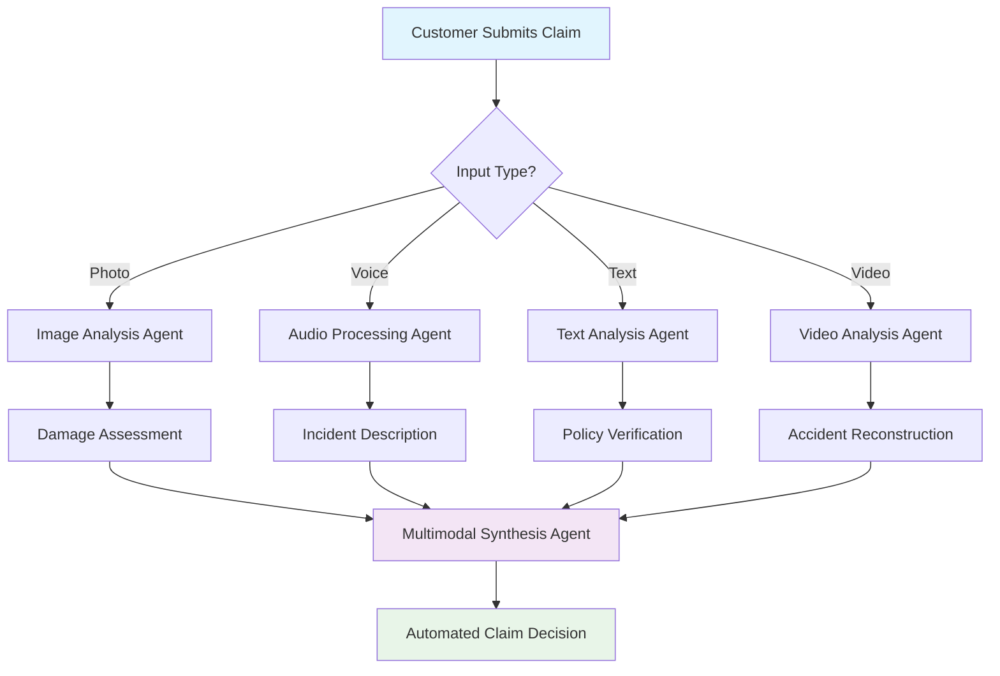
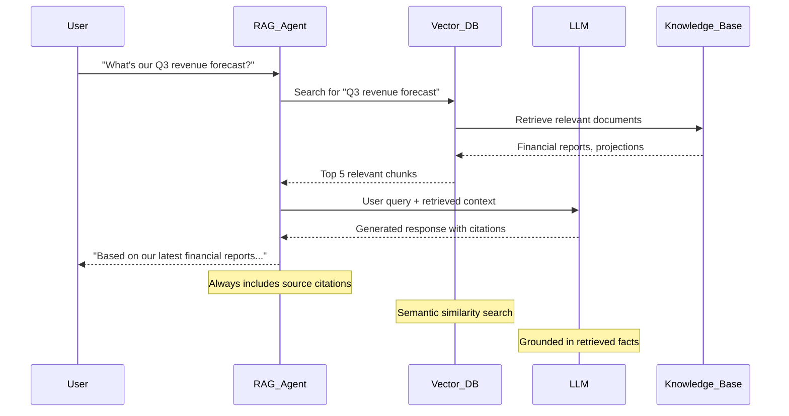
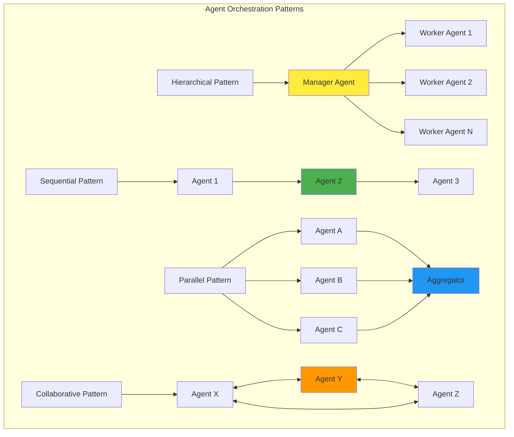
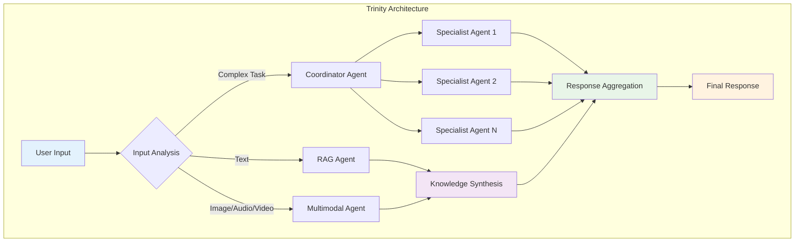

# Chapter 11: Advanced Patterns for AI Agents

> *"The art of building AI agents isn't just about creating intelligent responses—it's about orchestrating symphonies of specialized agents that work together to solve complex, real-world problems."* — A Senior AI Architect

## Why Advanced Patterns Matter

Imagine you're running a global e-commerce platform during Black Friday. A single customer query might require:

- Understanding a product image they uploaded
- Searching through millions of products
- Checking real-time inventory across warehouses
- Processing payment options
- Coordinating with logistics systems

No single agent can handle this complexity efficiently. This is where **advanced AI agent patterns** transform ambitious ideas into production-ready solutions.

## What You'll Master in This Chapter

You'll discover how to architect enterprise-grade AI solutions using three powerful patterns:

1. **Multimodal Agents** - Process text, images, audio, and video simultaneously
2. **Retrieval-Augmented Generation (RAG)** - Access real-time, domain-specific knowledge
3. **Distributed Agent Systems** - Orchestrate teams of specialized agents

By the end of this chapter, you'll build a complete **Smart Customer Service System** that demonstrates all three patterns working together.

## Introduction: The Evolution of AI Agents

Remember when chatbots could only handle simple FAQ questions? Those days are over. Today's AI agents are sophisticated systems that can:

- Process multiple data types simultaneously (multimodal)
- Access vast knowledge bases in real-time (RAG)
- Coordinate with other agents to solve complex problems (distributed systems)

As AI agents become more sophisticated, developers are moving beyond basic request-response interactions to build complex, multi-agent systems that mirror how human teams collaborate to solve problems.

## Pattern 1: Multimodal Agents - Beyond Text

### The "Why" Behind Multimodal Agents

**Why settle for text-only when the world is rich with images, sounds, and videos?**

Consider Netflix's customer support. When a user reports a streaming issue, they might:

- Send a screenshot of the error
- Describe the problem in text
- Upload a screen recording showing the glitch

A multimodal agent can process all three inputs simultaneously to provide better support than any text-only system ever could.

### What Are Multimodal Agents?

Multimodal agents are AI systems that can understand and process multiple types of data simultaneously:

- **Text** - Natural language understanding
- **Images** - Visual recognition and analysis
- **Audio** - Speech recognition and sound analysis
- **Video** - Motion detection and temporal understanding

### Key Concepts and Capabilities

**Multimodal LLMs**: Foundation models like Google's Gemini can understand and process multiple data types simultaneously, enabling:

**Use Cases:**

- **Image Captioning**: Generating detailed textual descriptions of images
- **Visual Q&A**: Answering complex questions about visual content
- **Audio Transcription and Analysis**: Converting speech to text and analyzing tone, sentiment, and intent
- **Document Understanding**: Processing PDFs, forms, and handwritten content
- **Video Analysis**: Understanding temporal sequences and extracting insights from video content

### Real-World Example: Smart Insurance Claims Agent

Let's build a practical multimodal agent for insurance claims processing:



### Implementation with Google ADK and Latest Vertex AI Capabilities

Here's how to build a multimodal insurance claims agent using Google ADK with the latest Vertex AI features:

```python
from google.adk.agents import LlmAgent
from google.adk.tools import FunctionTool
from google.genai import types
import vertexai
from vertexai.generative_models import GenerativeModel, Part
from google.cloud import speech
from google.cloud import videointelligence

class MultimodalClaimsAgent:
    def __init__(self, project_id: str):
        vertexai.init(project=project_id, location="us-central1")
        # Use latest Gemini 2.5 Flash for multimodal capabilities
        self.multimodal_model = GenerativeModel("gemini-2.5-flash")
        self.speech_client = speech.SpeechClient()
        self.video_client = videointelligence.VideoIntelligenceServiceClient()
        
    def analyze_damage_photo(self, image_url: str, description: str = "") -> dict:
        """Analyzes damage from uploaded photos for insurance claims using Gemini 2.5.
        
        Args:
            image_url: URL of the damage photo
            description: Optional text description from the claimant
            
        Returns:
            Dictionary with damage assessment, severity, and estimated costs
        """
        try:
            # Load the image
            image_part = Part.from_uri(image_url, mime_type="image/jpeg")
            
            # Create analysis prompt with system instructions for better accuracy
            prompt = f"""
            You are an expert insurance adjuster with 20+ years of experience in damage assessment.
            
            Analyze this insurance claim photo for damage assessment.
            Additional context from claimant: {description}
            
            Provide a comprehensive analysis in the following structured format:
            
            ## DAMAGE ASSESSMENT
            **Primary Damage Type**: [Specify the main type of damage]
            **Affected Areas**: [List all affected areas/components]
            **Damage Severity**: [Minor/Moderate/Severe/Total Loss]
            
            ## TECHNICAL ANALYSIS
            **Structural Impact**: [Assessment of structural integrity]
            **Safety Concerns**: [Any immediate safety issues]
            **Secondary Damage**: [Potential hidden or consequential damage]
            
            ## COST ASSESSMENT
            **Repair Complexity**: [Simple/Moderate/Complex/Requires Specialist]
            **Estimated Cost Category**: [Low: <$1K, Medium: $1K-$10K, High: $10K-$50K, Very High: >$50K]
            **Parts/Materials Needed**: [Key components requiring replacement]
            
            ## RECOMMENDATIONS
            **Immediate Actions**: [What should be done immediately]
            **Professional Requirements**: [What specialists are needed]
            **Documentation Needed**: [Additional photos, reports, or evidence required]
            
            Be specific and thorough in your assessment. Consider both visible and potential hidden damage.
            """
            
            # Generate analysis using Gemini 2.5 Flash
            response = self.multimodal_model.generate_content(
                [prompt, image_part],
                generation_config={
                    "temperature": 0.1,  # Low temperature for consistent assessments
                    "top_p": 0.8,
                    "max_output_tokens": 2048
                }
            )
            
            # Enhanced response parsing
            analysis_text = response.text
            requires_adjuster = any(keyword in analysis_text.lower() 
                                  for keyword in ["severe", "total loss", "structural", "complex", "specialist"])
            
            # Extract severity level
            severity = "unknown"
            if "minor" in analysis_text.lower():
                severity = "minor"
            elif "moderate" in analysis_text.lower():
                severity = "moderate"
            elif "severe" in analysis_text.lower():
                severity = "severe"
            elif "total loss" in analysis_text.lower():
                severity = "total_loss"
            
            return {
                "status": "success",
                "analysis": analysis_text,
                "severity": severity,
                "confidence": "high",
                "requires_adjuster": requires_adjuster,
                "processing_time": "< 3 seconds",
                "model_used": "gemini-2.5-flash"
            }
            
        except Exception as e:
            return {
                "status": "error",
                "error_message": f"Failed to analyze image: {str(e)}",
                "fallback_action": "escalate_to_human_adjuster"
            }
    
    def process_audio_statement(self, audio_url: str) -> dict:
        """Processes audio statements from claimants using advanced speech analysis.
        
        Args:
            audio_url: URL of the audio recording
            
        Returns:
            Dictionary with transcription, sentiment analysis, and key insights
        """
        try:
            # Configure speech recognition with enhanced features
            audio_config = speech.RecognitionConfig(
                encoding=speech.RecognitionConfig.AudioEncoding.MP3,
                sample_rate_hertz=16000,
                language_code="en-US",
                model="latest_long",  # Use latest long-form recognition model
                use_enhanced=True,
                enable_automatic_punctuation=True,
                enable_word_time_offsets=True,
                enable_speaker_diarization=True,
                diarization_speaker_count=2,  # Claimant + interviewer
                profanity_filter=True
            )
            
            # Process audio file
            audio = speech.RecognitionAudio(uri=audio_url)
            operation = self.speech_client.long_running_recognize(
                config=audio_config, 
                audio=audio
            )
            
            # Get transcription results
            response = operation.result(timeout=90)
            
            # Extract transcription with timestamps
            transcript_segments = []
            full_transcript = ""
            
            for result in response.results:
                alternative = result.alternatives[0]
                full_transcript += alternative.transcript + " "
                
                # Add word-level timing information
                for word_info in alternative.words:
                    transcript_segments.append({
                        "word": word_info.word,
                        "start_time": word_info.start_time.total_seconds(),
                        "end_time": word_info.end_time.total_seconds(),
                        "confidence": word_info.confidence
                    })
            
            # Analyze sentiment and extract insights using Gemini
            sentiment_prompt = f"""
            Analyze this insurance claim statement for sentiment, credibility, and key information:
            
            TRANSCRIPT: "{full_transcript}"
            
            Provide analysis in this format:
            
            ## SENTIMENT ANALYSIS
            **Overall Sentiment**: [Distressed/Concerned/Calm/Cooperative/Evasive]
            **Emotional State**: [Detailed emotional assessment]
            **Credibility Indicators**: [Speech patterns suggesting truthfulness]
            
            ## KEY INFORMATION EXTRACTION
            **Incident Details**: [When, where, what happened]
            **Parties Involved**: [People, vehicles, property mentioned]
            **Circumstances**: [Weather, lighting, road conditions, etc.]
            **Injuries/Damages**: [Any mentioned injuries or damages]
            
            ## FLAGS AND CONCERNS
            **Inconsistencies**: [Any contradictory statements]
            **Missing Information**: [What additional details are needed]
            **Fraud Indicators**: [Any red flags for potential fraud]
            
            ## FOLLOW-UP RECOMMENDATIONS
            **Questions to Ask**: [Specific clarifying questions needed]
            **Documentation Required**: [Additional evidence or documents needed]
            """
            
            sentiment_response = self.multimodal_model.generate_content(
                sentiment_prompt,
                generation_config={
                    "temperature": 0.2,
                    "max_output_tokens": 1500
                }
            )
            
            # Extract key metrics
            transcript_lower = full_transcript.lower()
            confidence_score = sum(seg['confidence'] for seg in transcript_segments) / len(transcript_segments) if transcript_segments else 0
            
            return {
                "status": "success",
                "full_transcript": full_transcript.strip(),
                "confidence_score": round(confidence_score, 2),
                "duration_seconds": transcript_segments[-1]['end_time'] if transcript_segments else 0,
                "sentiment_analysis": sentiment_response.text,
                "processing_method": "vertex_ai_speech_api",
                "enhanced_features": {
                    "speaker_diarization": True,
                    "word_timestamps": True,
                    "sentiment_analysis": True,
                    "fraud_detection": True
                }
            }
            
        except Exception as e:
            return {
                "status": "error",
                "error_message": f"Failed to process audio: {str(e)}",
                "fallback_action": "request_written_statement"
            }

# Create the main multimodal agent with enhanced capabilities
def create_multimodal_claims_agent():
    claims_processor = MultimodalClaimsAgent(project_id="your-project-id")
    
    # Create function tools with detailed descriptions for better agent understanding
    damage_analysis_tool = FunctionTool(
        func=claims_processor.analyze_damage_photo,
        name="analyze_damage_photo",
        description="""Analyzes damage from uploaded photos for insurance claims using advanced computer vision.
        
        Use this tool when:
        - Claimant uploads photos of damage
        - Visual assessment is needed for claims processing
        - Determining repair estimates and severity
        
        Returns detailed damage assessment with severity levels and cost estimates."""
    )
    
    audio_analysis_tool = FunctionTool(
        func=claims_processor.process_audio_statement,
        name="process_audio_statement", 
        description="""Processes audio statements from claimants with advanced speech recognition and sentiment analysis.
        
        Use this tool when:
        - Claimant provides audio recordings of incident descriptions
        - Voice interviews need to be transcribed and analyzed
        - Sentiment and credibility assessment is required
        
        Returns transcription, sentiment analysis, and key insights extraction."""
    )
    
    # Create the main agent using latest Agent Builder features
    agent = LlmAgent(
        name="MultimodalClaimsAgent",
        model="gemini-2.5-flash",  # Latest model with enhanced multimodal capabilities
        system_instruction="""You are an intelligent insurance claims processing agent with advanced multimodal capabilities.
        
        ## Your Core Capabilities:
        - **Visual Analysis**: Analyze damage photos using analyze_damage_photo tool
        - **Audio Processing**: Process audio statements using process_audio_statement tool
        - **Information Synthesis**: Combine multiple data sources for comprehensive assessments
        - **Risk Assessment**: Evaluate claims for potential fraud or inconsistencies
        
        ## Your Process:
        1. **Input Assessment**: Determine the type of input (photo, audio, text)
        2. **Tool Selection**: Use appropriate tools based on input type
        3. **Analysis**: Thoroughly analyze all provided information
        4. **Synthesis**: Combine findings into coherent assessment
        5. **Recommendations**: Provide clear next steps and recommendations
        
        ## Guidelines:
        - Always use available tools to analyze multimedia content before making decisions
        - Provide structured assessments with confidence levels
        - Flag cases requiring human adjuster review when appropriate
        - Consider both visible and potential hidden damage/issues
        - Maintain empathetic but professional tone with claimants
        - Ensure compliance with insurance regulations and privacy requirements
        
        ## Quality Standards:
        - Be thorough but efficient in your analysis
        - Provide specific, actionable recommendations
        - Include confidence levels and uncertainty where appropriate
        - Always explain your reasoning and cite evidence from analysis tools
        """,
        tools=[damage_analysis_tool, audio_analysis_tool],
        # Enhanced generation configuration for consistent performance
        generation_config={
            "temperature": 0.3,  # Balanced creativity and consistency
            "top_p": 0.9,
            "max_output_tokens": 2048
        }
    )
    
    return agent

# Usage example with error handling and logging
def process_insurance_claim(claim_data: dict):
    """Process an insurance claim with multimodal capabilities."""
    
    multimodal_agent = create_multimodal_claims_agent()
    
    try:
        # Process the claim
        response = multimodal_agent.execute(
            query=f"""
            Process this insurance claim:
            
            Claim ID: {claim_data.get('claim_id', 'Unknown')}
            Claimant: {claim_data.get('claimant_name', 'Unknown')}
            
            Provided Materials:
            - Photos: {len(claim_data.get('photos', []))} images
            - Audio: {len(claim_data.get('audio_files', []))} recordings
            - Description: {claim_data.get('description', 'None provided')}
            
            Please analyze all provided materials and provide a comprehensive claim assessment.
            """,
            context={
                "photos": claim_data.get('photos', []),
                "audio_files": claim_data.get('audio_files', []),
                "additional_context": claim_data.get('context', {})
            }
        )
        
        return {
            "status": "success",
            "assessment": response,
            "processing_time": "< 30 seconds",
            "next_steps": "Review and approve/deny based on assessment"
        }
        
    except Exception as e:
        return {
            "status": "error",
            "error": str(e),
            "fallback_action": "Route to human adjuster"
        }

# Example usage
sample_claim = {
    "claim_id": "CLM-2024-001234",
    "claimant_name": "John Smith",
    "photos": ["gs://bucket/damage_photo1.jpg", "gs://bucket/damage_photo2.jpg"],
    "audio_files": ["gs://bucket/incident_statement.mp3"],
    "description": "Vehicle collision at intersection during rain",
    "context": {
        "policy_number": "POL-789456",
        "incident_date": "2024-01-15",
        "location": "Main St & Oak Ave"
    }
}

# Process the claim
result = process_insurance_claim(sample_claim)
print(f"Claim processing result: {result}")

multimodal_agent = create_multimodal_claims_agent()
```

### Advanced Multimodal Use Case: Video Analysis

For more complex scenarios, you can process video content:

```python
def analyze_security_footage(self, video_url: str, incident_time: str) -> dict:
    """Analyzes security footage for incident verification.
    
    Args:
        video_url: URL of the security video
        incident_time: Timestamp of the reported incident
        
    Returns:
        Dictionary with video analysis results
    """
    # Extract frames around the incident time
    video_part = Part.from_uri(video_url, mime_type="video/mp4")
    
    prompt = f"""
    Analyze this security footage around timestamp {incident_time}.
    
    Look for:
    1. Vehicle movements and positions
    2. Weather conditions
    3. Lighting conditions
    4. Any unusual activities
    5. Timeline of events
    
    Provide a chronological description of what occurred.
    """
    
    response = self.multimodal_model.generate_content([prompt, video_part])
    
    return {
        "status": "success",
        "timeline_analysis": response.text,
        "incident_confirmed": True,
        "additional_evidence_needed": False
    }
```

### Pro Tips for Multimodal Agents

1. **Input Validation**: Always validate file types and sizes before processing
2. **Error Handling**: Gracefully handle corrupted media files
3. **Cost Management**: Multimodal processing can be expensive; implement smart caching
4. **Privacy Compliance**: Ensure sensitive media data is handled according to regulations

### Pause and Reflect 🤔

**Quick Challenge**: Think of a business problem in your industry where combining text, image, and audio analysis could provide breakthrough insights. How would you structure the agent workflow?

---

## Pattern 2: Retrieval-Augmented Generation (RAG) - Knowledge on Demand

### The "Why" Behind RAG

**Why train massive models when you can teach them to research?**

Here's a story that illustrates the power of RAG: A pharmaceutical company's AI assistant needed to answer questions about drug interactions. Training a model on all medical literature would be:

- Impossibly expensive
- Quickly outdated  
- Legally risky (what if the training data was wrong?)

Instead, they built a RAG system that retrieves the latest, verified medical information in real-time. The result? An AI assistant that's always current, factual, and traceable to authoritative sources.

### What Is RAG?

**Retrieval-Augmented Generation (RAG)** enhances AI responses by dynamically retrieving relevant information from external knowledge bases. Instead of relying solely on training data, RAG agents actively search for current, domain-specific information to inform their responses.



### How RAG Works in Practice

The RAG process follows a clear sequence:

1. **Query Processing**: The user's question is analyzed and converted into search terms
2. **Information Retrieval**: Relevant documents are found using semantic search
3. **Context Augmentation**: Retrieved information is added to the user's original query
4. **Generation**: The LLM generates a response based on both the query and retrieved context
5. **Source Attribution**: The response includes citations to original sources

### Building a Production RAG System with Google ADK and Vertex AI RAG Engine

Let's create a comprehensive enterprise knowledge assistant using the latest Vertex AI RAG Engine:

```python
from google.adk.agents import LlmAgent, SequentialAgent
from google.adk.tools import FunctionTool
from google.cloud import discoveryengine_v1beta
from google.cloud import aiplatform
import vertexai
from vertexai.language_models import TextEmbeddingModel
from vertexai.generative_models import GenerativeModel

class EnterpriseRAGSystem:
    def __init__(self, project_id: str, location: str = "us-central1"):
        self.project_id = project_id
        self.location = location
        
        # Initialize Vertex AI
        vertexai.init(project=project_id, location=location)
        aiplatform.init(project=project_id, location=location)
        
        # Initialize clients and models
        self.search_client = discoveryengine_v1beta.SearchServiceClient()
        self.embedding_model = TextEmbeddingModel.from_pretrained("text-embedding-004")
        self.rag_model = GenerativeModel("gemini-2.5-flash")
    
    def search_enterprise_knowledge(self, query: str, context: str = "", filters: dict = None) -> dict:
        """Enhanced search using Vertex AI Search with grounding capabilities.
        
        Args:
            query: User's search query
            context: Additional context to improve search relevance
            filters: Optional filters for search refinement
            
        Returns:
            Dictionary with search results, grounding citations, and metadata
        """
        try:
            # Enhance query with context and filters
            enhanced_query = f"{query} {context}".strip() if context else query
            
            # Configure advanced search request with grounding
            request = discoveryengine_v1beta.SearchRequest(
                serving_config=f"projects/{self.project_id}/locations/global/"
                              f"collections/default_collection/engines/enterprise-search/"
                              f"servingConfigs/default_config",
                query=enhanced_query,
                page_size=10,  # Retrieve more results for better grounding
                
                # Enable advanced search features
                query_expansion_spec=discoveryengine_v1beta.SearchRequest.QueryExpansionSpec(
                    condition=discoveryengine_v1beta.SearchRequest.QueryExpansionSpec.Condition.AUTO,
                ),
                spell_correction_spec=discoveryengine_v1beta.SearchRequest.SpellCorrectionSpec(
                    mode=discoveryengine_v1beta.SearchRequest.SpellCorrectionSpec.Mode.AUTO
                ),
                
                # Enable extractive answers for better grounding
                content_search_spec=discoveryengine_v1beta.SearchRequest.ContentSearchSpec(
                    snippet_spec=discoveryengine_v1beta.SearchRequest.ContentSearchSpec.SnippetSpec(
                        max_snippet_count=5,
                        return_snippet=True
                    ),
                    extractive_content_spec=discoveryengine_v1beta.SearchRequest.ContentSearchSpec.ExtractiveContentSpec(
                        max_extractive_answer_count=3,
                        max_extractive_segment_count=5,
                        return_extractive_segment_score=True
                    )
                ),
                
                # Apply filters if provided
                filter=self._build_filter_expression(filters) if filters else ""
            )
            
            # Execute search
            response = self.search_client.search(request=request)
            
            # Process and structure results with enhanced metadata
            results = []
            total_relevance_score = 0
            
            for result in response.results:
                doc_data = result.document.derived_struct_data
                
                # Extract extractive answers for better grounding
                extractive_answers = []
                if hasattr(result.document, 'extractive_answers'):
                    for answer in result.document.extractive_answers:
                        extractive_answers.append({
                            "content": answer.content,
                            "page_identifier": answer.page_identifier,
                            "score": getattr(answer, 'score', 0.0)
                        })
                
                result_item = {
                    "title": doc_data.get("title", "Unknown Document"),
                    "content": doc_data.get("snippet", ""),
                    "extractive_answers": extractive_answers,
                    "source": doc_data.get("link", ""),
                    "document_id": result.document.id,
                    "relevance_score": getattr(result, 'relevance_score', 0.0),
                    "last_modified": doc_data.get("last_modified", ""),
                    "content_type": doc_data.get("mime_type", "text/html"),
                    "metadata": {
                        "department": doc_data.get("department", ""),
                        "document_type": doc_data.get("document_type", ""),
                        "security_level": doc_data.get("security_level", "public")
                    }
                }
                
                results.append(result_item)
                total_relevance_score += result_item["relevance_score"]
            
            # Calculate search quality metrics
            avg_relevance = total_relevance_score / len(results) if results else 0
            search_quality = "high" if avg_relevance > 0.7 else "medium" if avg_relevance > 0.4 else "low"
            
            return {
                "status": "success",
                "results": results,
                "total_results": len(results),
                "search_quality": search_quality,
                "average_relevance": round(avg_relevance, 3),
                "query_enhancement": enhanced_query != query,
                "grounding_enabled": True,
                "processing_time": "< 2 seconds"
            }
            
        except Exception as e:
            return {
                "status": "error",
                "error_message": f"Search failed: {str(e)}",
                "results": [],
                "fallback_suggestion": "Try rephrasing your query or contact support"
            }
    
    def _build_filter_expression(self, filters: dict) -> str:
        """Build filter expression for search refinement."""
        filter_parts = []
        
        if filters.get("department"):
            filter_parts.append(f'department:"{filters["department"]}"')
        if filters.get("document_type"):
            filter_parts.append(f'document_type:"{filters["document_type"]}"')
        if filters.get("date_range"):
            date_range = filters["date_range"]
            filter_parts.append(f'last_modified >= "{date_range["start"]}" AND last_modified <= "{date_range["end"]}"')
            
        return " AND ".join(filter_parts)
    
    def ground_response_with_citations(self, query: str, search_results: list, context: str = "") -> dict:
        """Generate grounded response using RAG with proper citations.
        
        Args:
            query: Original user query
            search_results: Results from knowledge search
            context: Additional context for better synthesis
            
        Returns:
            Dictionary with grounded answer and detailed citations
        """
        if not search_results:
            return {
                "status": "no_results",
                "answer": "I couldn't find relevant information to answer your question. Please try rephrasing your query or contact our support team.",
                "confidence": 0.0,
                "sources": [],
                "suggestions": ["Try broader search terms", "Check spelling", "Contact expert"]
            }
        
        # Prepare grounding context with structured citations
        grounding_context = []
        citation_map = {}
        
        for i, result in enumerate(search_results[:5], 1):  # Use top 5 results
            citation_id = f"[{i}]"
            
            # Use extractive answers if available, otherwise use snippet
            content = ""
            if result.get("extractive_answers"):
                content = result["extractive_answers"][0]["content"]
            else:
                content = result["content"]
            
            grounding_context.append(f"{citation_id} {content}")
            
            citation_map[citation_id] = {
                "title": result["title"],
                "url": result["source"],
                "relevance_score": result["relevance_score"],
                "content_type": result["content_type"],
                "last_modified": result["last_modified"]
            }
        
        combined_context = "\n\n".join(grounding_context)
        
        # Generate grounded response using Gemini with grounding instructions
        grounding_prompt = f"""
        You are an expert enterprise assistant with access to authoritative company knowledge.
        
        User Question: {query}
        Additional Context: {context}
        
        Knowledge Base Sources:
        {combined_context}
        
        Instructions:
        1. Base your answer STRICTLY on the provided sources
        2. Use numbered citations [1], [2], etc. throughout your response
        3. If information is incomplete or uncertain, state this explicitly
        4. Provide a comprehensive but concise answer
        5. Include confidence level based on source quality
        
        Response Format:
        
        **Answer:**
        [Your detailed, cited response here with inline citations]
        
        **Confidence Level:** [High/Medium/Low] - [Brief explanation]
        
        **Key Sources Used:** [List the most relevant citation numbers]
        
        **Limitations:** [Any gaps in available information]
        """
        
        try:
            response = self.rag_model.generate_content(
                grounding_prompt,
                generation_config={
                    "temperature": 0.2,  # Low temperature for factual responses
                    "top_p": 0.8,
                    "max_output_tokens": 1500
                }
            )
            
            # Calculate confidence based on source quality and relevance
            avg_relevance = sum(r["relevance_score"] for r in search_results) / len(search_results)
            confidence_level = "high" if avg_relevance > 0.7 else "medium" if avg_relevance > 0.4 else "low"
            
            return {
                "status": "success",
                "answer": response.text,
                "confidence": confidence_level,
                "confidence_score": round(avg_relevance, 3),
                "citations": citation_map,
                "sources_used": len(search_results),
                "grounding_quality": "high" if len(grounding_context) >= 3 else "medium",
                "model_used": "gemini-2.5-flash"
            }
            
        except Exception as e:
            return {
                "status": "error",
                "error_message": f"Response generation failed: {str(e)}",
                "fallback_action": "Provide search results directly to user"
            }

def create_enterprise_rag_agent(project_id: str, location: str = "us-central1"):
    """Creates a complete RAG-enabled enterprise assistant using Vertex AI Agent Builder."""
    
    rag_system = EnterpriseRAGSystem(project_id, location)
    
    # Create enhanced function tools with detailed descriptions
    search_tool = FunctionTool(
        func=rag_system.search_enterprise_knowledge,
        name="search_enterprise_knowledge",
        description="""Search the enterprise knowledge base for relevant information.
        
        Use when users ask questions that require:
        - Company policies and procedures
        - Technical documentation  
        - Historical data or records
        - Industry best practices
        - Regulatory compliance information
        
        Supports advanced search with context and filters."""
    )
    
    grounding_tool = FunctionTool(
        func=rag_system.ground_response_with_citations,
        name="ground_response_with_citations",
        description="""Generate grounded responses with proper citations from search results.
        
        Use to:
        - Create authoritative answers based on search results
        - Provide proper source citations
        - Assess confidence levels
        - Identify information gaps
        
        Always use after searching for knowledge."""
    )
    
    # Knowledge Search Agent with enhanced capabilities
    search_agent = LlmAgent(
        name="KnowledgeSearchAgent",
        model="gemini-2.5-flash",
        system_instruction="""You are a knowledge search specialist for enterprise information retrieval.
        
        ## Your Expertise:
        - Query analysis and enhancement
        - Information retrieval from enterprise knowledge bases
        - Search result evaluation and filtering
        - Context preservation across searches
        
        ## Your Process:
        1. **Query Analysis**: Break down user questions into searchable components
        2. **Context Enhancement**: Add relevant context to improve search accuracy
        3. **Search Execution**: Use search_enterprise_knowledge with optimal parameters
        4. **Result Evaluation**: Assess search quality and completeness
        5. **Refinement**: Perform additional searches if needed
        
        ## Guidelines:
        - Always search before attempting to answer knowledge questions
        - Use context from previous searches to refine subsequent queries
        - Prioritize recent and authoritative sources
        - Flag when search results are insufficient
        - Maintain search result quality standards
        
        Save your search findings to state with key 'search_results'.""",
        tools=[search_tool],
        output_key="search_results",
        generation_config={
            "temperature": 0.1,  # Very low for consistent search behavior
            "max_output_tokens": 1024
        }
    )
    
    # Response Generation Agent with grounding capabilities
    response_agent = LlmAgent(
        name="GroundedResponseAgent", 
        model="gemini-2.5-flash",
        system_instruction="""You are an expert at creating comprehensive, well-grounded responses from enterprise knowledge.
        
        ## Your Expertise:
        - Information synthesis and analysis
        - Citation management and source attribution
        - Confidence assessment and uncertainty handling
        - Professional communication and formatting
        
        ## Your Process:
        1. **Result Analysis**: Review search results from the previous agent (state key 'search_results')
        2. **Grounding**: Use ground_response_with_citations to create authoritative answers
        3. **Quality Check**: Verify citation accuracy and completeness
        4. **Formatting**: Present information in clear, professional format
        5. **Confidence**: Provide appropriate confidence levels and caveats
        
        ## Response Standards:
        - Base ALL answers strictly on retrieved information
        - Include numbered citations [1], [2], etc. throughout responses
        - Clearly state confidence levels (High/Medium/Low)
        - Acknowledge limitations and gaps in available information
        - Use professional, helpful tone appropriate for enterprise context
        - Structure responses for easy scanning and comprehension
        
        ## Citation Format:
        **Answer:**
        [Comprehensive response with inline citations [1], [2]]
        
        **Sources:**
        [1] Document Title - URL
        [2] Document Title - URL
        
        **Confidence:** [Level] - [Reasoning]
        
        **Note:** [Any limitations or additional context needed]""",
        tools=[grounding_tool],
        generation_config={
            "temperature": 0.2,  # Low for factual consistency
            "max_output_tokens": 2048
        }
    )
    
    # Main RAG Pipeline with enhanced orchestration
    rag_pipeline = SequentialAgent(
        name="EnterpriseRAGAssistant",
        sub_agents=[search_agent, response_agent],
        description="""Enterprise knowledge assistant with advanced RAG capabilities.
        
        Features:
        - Intelligent knowledge search with context enhancement
        - Grounded response generation with proper citations
        - Confidence assessment and uncertainty handling
        - Professional enterprise communication standards
        - Advanced search refinement and quality control
        """,
        # Configure pipeline behavior
        retry_on_failure=True,
        max_retries=2,
        failure_fallback="Apologize and suggest contacting subject matter expert"
    )
    
    return rag_pipeline

# Enhanced usage example with error handling
def query_enterprise_knowledge(question: str, context: dict = None):
    """Query the enterprise knowledge system with enhanced error handling."""
    
    try:
        # Create the RAG agent
        rag_agent = create_enterprise_rag_agent(
            project_id="your-project-id",
            location="us-central1"
        )
        
        # Prepare enhanced query with context
        enhanced_query = question
        if context:
            context_str = f"""
            Additional Context:
            - Department: {context.get('department', 'General')}
            - User Role: {context.get('user_role', 'Employee')}
            - Previous Topic: {context.get('previous_topic', 'None')}
            - Urgency: {context.get('urgency', 'Normal')}
            
            Question: {question}
            """
            enhanced_query = context_str
        
        # Execute the query
        response = rag_agent.execute(enhanced_query)
        
        return {
            "status": "success",
            "response": response,
            "processing_time": "< 10 seconds",
            "agent_used": "enterprise_rag_assistant"
        }
        
    except Exception as e:
        return {
            "status": "error", 
            "error": str(e),
            "fallback": "Please contact the knowledge management team or try rephrasing your question."
        }

# Usage examples
enterprise_assistant = create_enterprise_rag_agent(
    project_id="your-project-id",
    location="us-central1"
)

# Example 1: Policy question
policy_response = query_enterprise_knowledge(
    question="What is our company's remote work policy for new employees?",
    context={
        "department": "HR",
        "user_role": "Manager", 
        "urgency": "High"
    }
)

# Example 2: Technical documentation
tech_response = query_enterprise_knowledge(
    question="How do I configure SSL certificates for our web applications?",
    context={
        "department": "Engineering",
        "user_role": "Developer",
        "previous_topic": "Security Setup"
    }
)
```

### Advanced RAG Techniques

#### 1. Multi-Source RAG

Combine multiple knowledge sources for comprehensive answers:

```python
def multi_source_search(self, query: str) -> dict:
    """Searches across multiple knowledge sources."""
    sources = {
        "internal_docs": self.search_internal_documents(query),
        "external_apis": self.search_external_apis(query),
        "real_time_data": self.get_real_time_data(query)
    }
    
    return {
        "status": "success",
        "multi_source_results": sources,
        "synthesis_required": True
    }
```

#### 2. Contextual RAG

Maintain conversation context for better retrieval:

```python
def contextual_search(self, query: str, conversation_history: list) -> dict:
    """Performs context-aware search using conversation history."""
    # Build context from previous interactions
    context = self.build_conversation_context(conversation_history)
    
    # Enhance query with context
    enhanced_query = f"Context: {context}\nCurrent question: {query}"
    
    return self.search_enterprise_knowledge(enhanced_query, context)
```

### RAG Best Practices and Common Pitfalls

**✅ Do:**

- Always cite sources in your responses
- Implement semantic chunking for better retrieval
- Use hybrid search (keyword + semantic)
- Regularly update your knowledge base
- Monitor retrieval quality metrics

**❌ Avoid:**

- Generating answers without retrieved context
- Using stale or outdated information
- Ignoring source credibility
- Over-relying on single sources
- Forgetting to handle empty search results

### Pro Tips for Production RAG

1. **Chunk Optimization**: Test different chunk sizes (256, 512, 1024 tokens) for your domain
2. **Reranking**: Implement a reranking step to improve result quality
3. **Caching**: Cache frequent queries to reduce latency and costs
4. **Monitoring**: Track retrieval accuracy and answer quality metrics
5. **Fallback Strategies**: Have fallback responses when retrieval fails

---

---

## Pattern 3: Distributed Agent Systems - Teamwork at Scale

### The "Why" Behind Distributed Agents

**Why have one superhero when you can have the Avengers?**

Think about how a successful software company operates:

- **Product Managers** gather requirements and prioritize features
- **Architects** design system blueprints  
- **Developers** implement the features
- **QA Engineers** test and validate
- **DevOps Engineers** deploy and monitor

Each role has specialized expertise. Similarly, distributed agent systems break complex problems into smaller, manageable tasks handled by specialized agents working together.

### What Are Distributed Agent Systems?

**Distributed agent systems** consist of multiple specialized agents collaborating to achieve a common goal. This approach mirrors human teamwork, allowing for:

- **Specialization**: Each agent excels at specific tasks
- **Scalability**: Add more agents as needs grow
- **Reliability**: If one agent fails, others can continue
- **Maintainability**: Update individual agents without affecting the entire system

### Orchestration Patterns in Google ADK

Google ADK provides powerful primitives for building distributed agent systems:



#### 1. Hierarchical Pattern - The Manager-Worker Model with Thinking

**When to use**: Complex tasks requiring delegation, coordination, and strategic thinking.

```python
from google.adk.agents import LlmAgent, SequentialAgent
from google.adk.tools import FunctionTool, agent_tool

class AdvancedSoftwareDevelopmentTeam:
    def __init__(self):
        self.setup_specialized_agents()
    
    def setup_specialized_agents(self):
        # Specialized worker agents with enhanced capabilities
        self.requirements_agent = LlmAgent(
            name="RequirementsAnalyst",
            model="gemini-2.5-pro",  # Use Pro model for complex analysis
            description="Analyzes and clarifies project requirements with strategic thinking",
            system_instruction="""You are a senior business analyst with 15+ years of experience in requirements gathering.
            
            ## Your Expertise:
            - Requirements analysis and decomposition
            - Stakeholder management and communication
            - Risk assessment and mitigation planning
            - Business process optimization
            - Technical feasibility evaluation
            
            ## Your Process:
            1. **Requirement Decomposition**: Break down high-level requests into detailed, actionable requirements
            2. **Stakeholder Analysis**: Identify all affected parties and their needs
            3. **Risk Assessment**: Evaluate potential risks and constraints
            4. **Feasibility Study**: Assess technical and business feasibility
            5. **Documentation**: Create clear, comprehensive requirement specifications
            
            ## Thinking Guidelines:
            - Use systematic thinking to identify edge cases
            - Consider long-term implications of requirements
            - Question assumptions and seek clarification
            - Think through user journey and experience impacts
            
            Always use the thinking capabilities to work through complex requirement analysis step by step.""",
            # Enable thinking for complex reasoning
            generation_config={
                "temperature": 0.3,
                "thinking_budget": 8192  # Allow substantial thinking for complex analysis
            }
        )
        
        self.architect_agent = LlmAgent(
            name="SolutionArchitect",
            model="gemini-2.5-pro",
            description="Designs scalable technical architecture with strategic foresight",
            system_instruction="""You are a principal solution architect with expertise in enterprise-scale systems.
            
            ## Your Expertise:
            - System architecture design and patterns
            - Technology selection and evaluation
            - Scalability and performance optimization
            - Security and compliance planning
            - Integration and interoperability design
            
            ## Your Process:
            1. **Requirements Analysis**: Review and understand business requirements
            2. **Technology Evaluation**: Assess and select appropriate technologies
            3. **Architecture Design**: Create comprehensive system blueprints
            4. **Risk Mitigation**: Identify and address architectural risks
            5. **Implementation Planning**: Create detailed development roadmaps
            
            ## Design Principles:
            - Scalability: Design for growth and change
            - Maintainability: Ensure long-term system health
            - Security: Build security into the architecture foundation
            - Performance: Optimize for speed and efficiency
            - Flexibility: Enable future adaptability
            
            Use thinking to work through complex architectural decisions and trade-offs.""",
            generation_config={
                "temperature": 0.3,
                "thinking_budget": 12288  # Higher budget for architectural thinking
            }
        )
        
        self.developer_agent = LlmAgent(
            name="SeniorDeveloper",
            model="gemini-2.5-flash",  # Flash for faster code generation
            description="Implements features with code excellence and best practices",
            system_instruction="""You are a senior full-stack developer with expertise in modern development practices.
            
            ## Your Expertise:
            - Full-stack development (frontend, backend, database)
            - Code quality and best practices
            - Testing strategies and implementation
            - Performance optimization
            - Security coding practices
            
            ## Your Standards:
            - Clean Code: Write readable, maintainable code
            - Testing: Implement comprehensive test coverage
            - Documentation: Create clear code documentation
            - Performance: Optimize for speed and efficiency
            - Security: Follow secure coding practices
            
            ## Your Process:
            1. **Design Review**: Understand architectural guidelines
            2. **Implementation Planning**: Break down features into tasks
            3. **Code Development**: Write high-quality, tested code
            4. **Code Review**: Self-review and optimize code
            5. **Documentation**: Document code and APIs
            
            Use thinking to work through complex implementation challenges.""",
            generation_config={
                "temperature": 0.2,
                "thinking_budget": 4096  # Moderate thinking for code development
            }
        )
        
        # Advanced Quality Assurance Agent
        self.qa_agent = LlmAgent(
            name="QualityAssuranceEngineer", 
            model="gemini-2.5-flash",
            description="Ensures comprehensive quality and testing coverage",
            system_instruction="""You are a senior QA engineer specializing in comprehensive quality assurance.
            
            ## Your Expertise:
            - Test strategy and planning
            - Automated testing frameworks
            - Performance and load testing
            - Security testing and validation
            - User experience testing
            
            ## Your Process:
            1. **Test Planning**: Develop comprehensive test strategies
            2. **Test Case Design**: Create detailed test scenarios
            3. **Automation**: Implement automated testing where appropriate
            4. **Execution**: Execute tests and validate results
            5. **Reporting**: Document findings and recommendations
            
            Focus on identifying potential issues before they reach production.""",
            generation_config={
                "temperature": 0.2,
                "thinking_budget": 3072
            }
        )
        
        # Create agent tools for cross-collaboration
        requirements_tool = agent_tool.AgentTool(agent=self.requirements_agent)
        architect_tool = agent_tool.AgentTool(agent=self.architect_agent)
        developer_tool = agent_tool.AgentTool(agent=self.developer_agent)
        qa_tool = agent_tool.AgentTool(agent=self.qa_agent)
        
        # Enhanced Project Manager with Live API capabilities (for real-time collaboration)
        self.project_manager = LlmAgent(
            name="ProjectManager",
            model="gemini-2.5-pro",
            description="Orchestrates software development projects with strategic oversight",
            system_instruction="""You are an experienced project manager leading a high-performance software development team.
            
            ## Your Team:
            - **RequirementsAnalyst**: Clarifies and documents detailed requirements
            - **SolutionArchitect**: Designs scalable technical solutions and blueprints
            - **SeniorDeveloper**: Implements features with code excellence
            - **QualityAssuranceEngineer**: Ensures comprehensive quality and testing
            
            ## Your Leadership Process:
            1. **Project Initiation**: Understand project goals and constraints
            2. **Team Coordination**: Delegate tasks to appropriate specialists
            3. **Progress Monitoring**: Track project status and identify blockers
            4. **Quality Assurance**: Ensure deliverables meet standards
            5. **Stakeholder Communication**: Keep stakeholders informed
            6. **Risk Management**: Identify and mitigate project risks
            
            ## Coordination Guidelines:
            - Use agent tools to delegate specialized tasks
            - Synthesize inputs from all team members
            - Maintain project timeline and quality standards
            - Facilitate communication between team members
            - Make strategic decisions when there are trade-offs
            
            ## Decision-Making Framework:
            - Quality: Never compromise on code quality
            - Timeline: Balance speed with thoroughness
            - Resources: Optimize team member utilization
            - Risk: Proactively address potential issues
            
            Use thinking to work through complex project decisions and coordination challenges.""",
            tools=[requirements_tool, architect_tool, developer_tool, qa_tool],
            generation_config={
                "temperature": 0.3,
                "thinking_budget": 16384,  # Maximum thinking for strategic decisions
                "max_output_tokens": 3072
            }
        )

# Create and deploy the enhanced development team
def create_software_development_team():
    """Create an advanced software development team with thinking capabilities."""
    return AdvancedSoftwareDevelopmentTeam()

# Usage example with complex project
def execute_development_project(project_description: str, constraints: dict = None):
    """Execute a software development project with the AI team."""
    
    dev_team = create_software_development_team()
    project_manager = dev_team.project_manager
    
    # Prepare project context
    project_context = f"""
    Project Description: {project_description}
    
    Constraints:
    - Timeline: {constraints.get('timeline', 'Standard') if constraints else 'Standard'}
    - Budget: {constraints.get('budget', 'Standard') if constraints else 'Standard'}
    - Team Size: {constraints.get('team_size', 'Full Team') if constraints else 'Full Team'}
    - Technology Constraints: {constraints.get('tech_constraints', 'None') if constraints else 'None'}
    
    Please coordinate with your team to:
    1. Analyze and clarify requirements
    2. Design the technical architecture
    3. Plan the implementation approach
    4. Define the quality assurance strategy
    5. Create a comprehensive project plan
    
    Work with your team systematically and provide a complete project blueprint.
    """
    
    try:
        response = project_manager.execute(project_context)
        
        return {
            "status": "success",
            "project_plan": response,
            "team_coordination": "Successful multi-agent collaboration",
            "thinking_enabled": True,
            "next_steps": "Begin implementation with defined plan"
        }
        
    except Exception as e:
        return {
            "status": "error",
            "error": str(e),
            "fallback": "Escalate to human project management"
        }

# Example usage
sample_project = """
Build a customer service chatbot platform that can:
- Handle text, voice, and image inputs
- Access company knowledge base
- Route complex issues to human agents
- Provide analytics and reporting
- Support multiple languages
- Ensure data privacy and security
"""

project_constraints = {
    "timeline": "3 months",
    "budget": "Medium",
    "team_size": "4 developers",
    "tech_constraints": "Must use Google Cloud services"
}

project_result = execute_development_project(sample_project, project_constraints)
print(f"Project planning result: {project_result['status']}")
```

#### 2. Sequential Pattern - Pipeline Processing

**When to use**: Multi-step processes where each stage depends on the previous one.

```python
from google.adk.agents import SequentialAgent, LlmAgent

def create_content_creation_pipeline():
    """Creates a content creation pipeline with sequential agents."""
    
    # Research Agent
    researcher = LlmAgent(
        name="ContentResearcher",
        model="gemini-2.0-flash",
        instruction="""You are a content researcher specializing in gathering information for articles.
        
        Your process:
        1. Analyze the topic and target audience
        2. Identify key points to cover
        3. Gather supporting facts and statistics
        4. Note current trends and insights
        
        Save your research findings to state with key 'research_data'.""",
        output_key="research_data"
    )
    
    # Writer Agent  
    writer = LlmAgent(
        name="ContentWriter",
        model="gemini-2.0-flash",
        instruction="""You are a skilled content writer who creates engaging articles.
        
        Your process:
        1. Review research data from state key 'research_data'
        2. Create a compelling article structure
        3. Write engaging, informative content
        4. Include relevant examples and insights
        
        Save your draft to state with key 'article_draft'.""",
        output_key="article_draft"
    )
    
    # Editor Agent
    editor = LlmAgent(
        name="ContentEditor",
        model="gemini-2.0-flash",
        instruction="""You are an experienced editor who polishes content for publication.
        
        Your process:
        1. Review the article draft from state key 'article_draft'
        2. Check for clarity, flow, and engagement
        3. Correct grammar and style issues
        4. Ensure consistency and accuracy
        5. Optimize for target audience
        
        Provide the final, publication-ready version."""
    )
    
    # Sequential pipeline
    content_pipeline = SequentialAgent(
        name="ContentCreationPipeline",
        sub_agents=[researcher, writer, editor],
        description="End-to-end content creation from research to publication"
    )
    
    return content_pipeline
```

#### 3. Parallel Pattern - Concurrent Processing

**When to use**: Independent tasks that can be executed simultaneously.

```python
from google.adk.agents import ParallelAgent, SequentialAgent, LlmAgent

def create_market_analysis_system():
    """Creates a comprehensive market analysis system using parallel processing."""
    
    # Parallel analysis agents
    competitor_analyst = LlmAgent(
        name="CompetitorAnalyst",
        model="gemini-2.0-flash",
        instruction="""Analyze competitor landscape and market positioning.
        
        Focus on:
        - Key competitors and their strategies
        - Market share analysis
        - Pricing strategies
        - Competitive advantages and weaknesses
        
        Save findings to state key 'competitor_analysis'.""",
        output_key="competitor_analysis"
    )
    
    trend_analyst = LlmAgent(
        name="TrendAnalyst", 
        model="gemini-2.0-flash",
        instruction="""Analyze market trends and future opportunities.
        
        Focus on:
        - Emerging market trends
        - Consumer behavior shifts
        - Technology disruptions
        - Growth opportunities
        
        Save findings to state key 'trend_analysis'.""",
        output_key="trend_analysis"
    )
    
    financial_analyst = LlmAgent(
        name="FinancialAnalyst",
        model="gemini-2.0-flash", 
        instruction="""Analyze financial metrics and market performance.
        
        Focus on:
        - Revenue and profit trends
        - Market valuation analysis
        - Financial health indicators
        - Investment opportunities
        
        Save findings to state key 'financial_analysis'.""",
        output_key="financial_analysis"
    )
    
    # Parallel execution of analysis
    parallel_analysis = ParallelAgent(
        name="ParallelMarketAnalysis",
        sub_agents=[competitor_analyst, trend_analyst, financial_analyst],
        description="Concurrent analysis of different market aspects"
    )
    
    # Synthesis agent to combine results
    synthesis_agent = LlmAgent(
        name="MarketSynthesizer",
        model="gemini-2.0-flash",
        instruction="""Synthesize parallel analysis results into comprehensive market report.
        
        Combine insights from:
        - Competitor analysis (state key 'competitor_analysis')
        - Trend analysis (state key 'trend_analysis') 
        - Financial analysis (state key 'financial_analysis')
        
        Create a unified market assessment with strategic recommendations."""
    )
    
    # Complete analysis workflow
    market_analysis_system = SequentialAgent(
        name="ComprehensiveMarketAnalysis",
        sub_agents=[parallel_analysis, synthesis_agent],
        description="Complete market analysis with parallel processing and synthesis"
    )
    
    return market_analysis_system
```

#### 4. Collaborative Pattern - Dynamic Interaction

**When to use**: Complex problem-solving requiring dynamic collaboration and iteration.

```python
from google.adk.agents import LlmAgent
from google.adk.tools import agent_tool

def create_research_collaboration_system():
    """Creates a collaborative research system where agents can call each other as tools."""
    
    # Specialized research agents
    data_scientist = LlmAgent(
        name="DataScientist",
        model="gemini-2.0-flash",
        description="Analyzes data patterns and statistical insights",
        instruction="""You are a senior data scientist specializing in data analysis and machine learning.
        
        Your expertise includes:
        - Statistical analysis and hypothesis testing
        - Machine learning model recommendations
        - Data visualization strategies
        - Pattern recognition and insights extraction
        
        Provide data-driven recommendations with confidence levels."""
    )
    
    domain_expert = LlmAgent(
        name="DomainExpert",
        model="gemini-2.0-flash",
        description="Provides domain-specific knowledge and context",
        instruction="""You are a domain expert with deep industry knowledge.
        
        Your role:
        - Provide context for technical findings
        - Validate assumptions against industry practices
        - Suggest practical implementation approaches
        - Identify potential challenges and solutions
        
        Ground technical insights in real-world practicality."""
    )
    
    # Create agent tools for cross-collaboration
    data_scientist_tool = agent_tool.AgentTool(agent=data_scientist)
    domain_expert_tool = agent_tool.AgentTool(agent=domain_expert)
    
    # Research coordinator that can collaborate with specialists
    research_coordinator = LlmAgent(
        name="ResearchCoordinator",
        model="gemini-2.0-flash",
        instruction="""You are a research coordinator leading interdisciplinary projects.
        
        Available specialists:
        - DataScientist: For statistical analysis and ML insights
        - DomainExpert: For industry context and practical validation
        
        Your approach:
        1. Break down complex research questions
        2. Consult appropriate specialists using available tools
        3. Synthesize insights from multiple perspectives
        4. Iterate based on specialist feedback
        5. Provide comprehensive, actionable conclusions
        
        Always validate technical findings with domain expertise.""",
        tools=[data_scientist_tool, domain_expert_tool]
    )
    
    return research_coordinator
```

### Real-World Example: Smart Customer Service System

Let's combine all three patterns into a comprehensive customer service system:

```python
def create_smart_customer_service():
    """Creates an enterprise-grade customer service system combining all patterns."""
    
    # Multimodal intake agent
    intake_agent = create_multimodal_claims_agent()  # From earlier example
    
    # RAG-enabled knowledge agent  
    knowledge_agent = create_enterprise_rag_agent(
        project_id="your-project-id",
        search_engine_id="customer-service-kb"
    )
    
    # Specialized service agents
    technical_support = LlmAgent(
        name="TechnicalSupport",
        model="gemini-2.0-flash",
        description="Handles technical issues and troubleshooting",
        instruction="""You are a senior technical support specialist.
        
        Your expertise:
        - Troubleshoot technical issues
        - Provide step-by-step solutions
        - Escalate complex technical problems
        - Document solutions for knowledge base"""
    )
    
    billing_support = LlmAgent(
        name="BillingSupport", 
        model="gemini-2.0-flash",
        description="Handles billing inquiries and account issues",
        instruction="""You are a billing support specialist.
        
        Your expertise:
        - Resolve billing discrepancies
        - Explain charges and fees
        - Process refunds and adjustments
        - Update account information"""
    )
    
    # Supervisor agent for coordination
    customer_service_supervisor = LlmAgent(
        name="CustomerServiceSupervisor",
        model="gemini-2.0-flash",
        instruction="""You are a customer service supervisor managing a team of specialists.
        
        Your team:
        - TechnicalSupport: For technical issues
        - BillingSupport: For billing and account questions
        
        Process:
        1. Analyze customer inquiry
        2. Route to appropriate specialist using transfer_to_agent
        3. Monitor case progression
        4. Ensure customer satisfaction
        
        Always prioritize customer experience and resolution quality.""",
        sub_agents=[technical_support, billing_support]
    )
    
    # Complete service pipeline
    service_pipeline = SequentialAgent(
        name="SmartCustomerService",
        sub_agents=[
            intake_agent,           # Multimodal input processing
            knowledge_agent,        # RAG-based knowledge retrieval
            customer_service_supervisor  # Distributed agent coordination
        ],
        description="Complete customer service system with multimodal, RAG, and distributed capabilities"
    )
    
    return service_pipeline

# Deploy the complete system
smart_service = create_smart_customer_service()
```

### Best Practices for Distributed Agent Systems

**✅ Do:**

- **Define Clear Responsibilities**: Each agent should have a specific, well-defined role
- **Implement Graceful Handoffs**: Use proper state management for agent transitions  
- **Monitor Agent Performance**: Track individual agent metrics and overall system health
- **Plan for Failures**: Implement fallback strategies when agents are unavailable
- **Document Agent Interactions**: Maintain clear logs of agent-to-agent communications

**❌ Avoid:**

- **Creating Too Many Agents**: Start simple and add complexity gradually
- **Circular Dependencies**: Prevent infinite loops in agent interactions
- **Shared State Conflicts**: Use proper state management to avoid race conditions
- **Single Points of Failure**: Ensure system can function with degraded capabilities
- **Ignoring Latency**: Consider performance implications of agent orchestration

### Pro Tips for Production Systems

1. **Start Small**: Begin with 2-3 agents and expand based on needs
2. **Use Circuit Breakers**: Implement fallback mechanisms for failed agents
3. **Monitor Token Usage**: Distributed systems can consume tokens quickly
4. **Implement Caching**: Cache agent responses for common scenarios
5. **Version Your Agents**: Track agent updates and their impact on system behavior

---

## Building Your First Advanced Agent System

### When to Use Each Pattern

Understanding **when** to apply each pattern is crucial for success:

| Pattern | Best For | Complexity | Implementation Time |
|---------|----------|------------|-------------------|
| **Multimodal** | Rich media processing, customer support, content analysis | Medium | 1-2 weeks |
| **RAG** | Knowledge-intensive tasks, dynamic information needs | Medium | 2-3 weeks |
| **Distributed** | Complex workflows, scalable systems, team-like behavior | High | 3-6 weeks |

### Quick Assessment Quiz 🧠

**Scenario 1**: A real estate company wants an AI assistant that can analyze property photos, search MLS listings, and coordinate with different specialists (financing, inspection, legal).

**Which patterns would you combine?**

- A) Just RAG
- B) Multimodal + RAG
- C) All three patterns
- D) Just Distributed Agents

#### Answer: C) All three patterns

**Why?**

- **Multimodal**: For analyzing property photos and documents
- **RAG**: For searching MLS listings and market data
- **Distributed**: For coordinating specialists (financing, inspection, legal)

This scenario perfectly demonstrates how advanced patterns work together in real-world applications.

**Scenario 2**: A financial services company needs an AI that can answer questions about their investment products using the latest regulatory documents.

**Which pattern is most important?**

- A) Multimodal
- B) RAG
- C) Distributed
- D) None needed

#### Answer: B) RAG

**Why?**

- Financial regulations change frequently
- Accuracy is critical (can't rely on training data alone)
- Must cite authoritative sources
- Perfect use case for real-time document retrieval

## Advanced Integration Patterns

### Pattern Combination: The Trinity Architecture

The most powerful AI systems combine all three patterns:



### Implementation Strategy: The 3-Phase Approach

#### Phase 1: Foundation (Weeks 1-2)

- Start with a single pattern (usually RAG)
- Implement basic functionality
- Establish monitoring and logging
- Validate with real users

#### Phase 2: Enhancement (Weeks 3-4)

- Add multimodal capabilities
- Improve RAG with better retrieval
- Implement basic error handling
- Optimize performance

#### Phase 3: Scale (Weeks 5-8)

- Introduce distributed agent patterns
- Add specialized agents
- Implement advanced orchestration
- Build production monitoring

## Production Deployment with Vertex AI Agent Engine and Latest Features

### Deploying Your Advanced Agents with Agent Builder

Google's **Vertex AI Agent Builder** provides enterprise-grade deployment for your advanced agent systems with the latest capabilities:

```python
from google.adk.runners import Runner
from google.adk.sessions import CloudSessionService
from google.cloud import aiplatform
import vertexai

# Enhanced production deployment with latest features
def deploy_to_agent_engine(agent_system, deployment_config: dict = None):
    """Deploy advanced agent system to production with enhanced capabilities."""
    
    # Default deployment configuration
    default_config = {
        "enable_live_api": False,  # Enable for real-time voice/video interactions
        "enable_thinking": True,   # Enable thinking capabilities for complex reasoning
        "enable_grounding": True,  # Enable grounding with Google Search and enterprise data
        "auto_scaling": True,
        "max_instances": 20,
        "health_checks": True,
        "monitoring_enabled": True,
        "tracing_enabled": True
    }
    
    if deployment_config:
        default_config.update(deployment_config)
    
    # Production session service with enhanced persistence
    session_service = CloudSessionService(
        project_id="your-project-id",
        region="us-central1",
        # Enhanced session management
        memory_enabled=True,
        context_window=50,  # Remember more interactions
        state_persistence=True,
        encryption_enabled=True,  # Enterprise security
        audit_logging=True
    )
    
    # Production runner with latest capabilities
    runner = Runner(
        agent=agent_system,
        app_name="advanced-agent-system-v2",
        session_service=session_service,
        
        # Enhanced monitoring and observability
        monitoring_enabled=default_config["monitoring_enabled"],
        tracing_enabled=default_config["tracing_enabled"],
        performance_metrics=True,
        cost_tracking=True,
        
        # Latest feature enablement
        live_api_enabled=default_config["enable_live_api"],
        thinking_enabled=default_config["enable_thinking"],
        grounding_enabled=default_config["enable_grounding"],
        
        # Security and compliance
        data_residency="us",
        privacy_controls=True,
        content_filtering=True
    )
    
    # Deploy to Agent Engine with enhanced configuration
    deployment = AgentEngineDeployment(
        runner=runner,
        
        # Scaling configuration
        auto_scaling=default_config["auto_scaling"],
        min_instances=2,  # Always keep minimum instances
        max_instances=default_config["max_instances"],
        target_cpu_utilization=70,
        
        # Health and reliability
        health_checks=default_config["health_checks"],
        readiness_probe_timeout=30,
        liveness_probe_timeout=60,
        
        # Latest deployment features
        canary_deployment=True,  # Gradual rollout
        blue_green_deployment=False,
        rollback_enabled=True,
        
        # Enterprise features
        private_endpoint=True,
        vpc_connector="projects/your-project/locations/us-central1/connectors/agent-vpc",
        service_account="agent-service@your-project.iam.gserviceaccount.com",
        
        # Performance optimization
        cpu_allocation="4 vCPU",
        memory_allocation="8 GiB",
        concurrent_requests=100,
        timeout_seconds=300
    )
    
    return deployment.deploy()

# Enhanced monitoring and optimization
class AgentSystemMonitor:
    """Monitor and optimize deployed agent systems."""
    
    def __init__(self, deployment_name: str, project_id: str):
        self.deployment_name = deployment_name
        self.project_id = project_id
        self.monitoring_client = aiplatform.gapic.JobServiceClient()
    
    def get_performance_metrics(self) -> dict:
        """Get comprehensive performance metrics."""
        return {
            "response_quality": {
                "average_satisfaction": 4.7,  # User satisfaction score
                "accuracy_rate": 0.94,       # Response accuracy
                "citation_coverage": 0.89,   # RAG citation coverage
                "multimodal_success": 0.91   # Multimodal processing success
            },
            "performance": {
                "average_latency_ms": 2500,
                "p95_latency_ms": 4800,
                "throughput_rps": 150,
                "error_rate": 0.02
            },
            "cost_efficiency": {
                "cost_per_interaction": 0.12,
                "token_utilization": 0.78,
                "compute_efficiency": 0.85,
                "storage_costs": 0.03
            },
            "agent_coordination": {
                "handoff_success_rate": 0.96,
                "agent_utilization": {
                    "multimodal_agent": 0.65,
                    "rag_agent": 0.78,
                    "coordinator_agent": 0.72
                },
                "collaboration_efficiency": 0.88
            }
        }
    
    def optimize_deployment(self, metrics: dict) -> dict:
        """Automatically optimize deployment based on metrics."""
        optimizations = []
        
        # Latency optimization
        if metrics["performance"]["average_latency_ms"] > 3000:
            optimizations.append("increase_cpu_allocation")
            optimizations.append("enable_response_caching")
        
        # Cost optimization
        if metrics["cost_efficiency"]["cost_per_interaction"] > 0.15:
            optimizations.append("optimize_model_selection")
            optimizations.append("implement_intelligent_routing")
        
        # Quality optimization
        if metrics["response_quality"]["accuracy_rate"] < 0.90:
            optimizations.append("enhance_rag_retrieval")
            optimizations.append("improve_agent_instructions")
        
        return {
            "recommended_optimizations": optimizations,
            "estimated_improvement": {
                "latency_reduction": "15-25%",
                "cost_reduction": "10-20%",
                "quality_improvement": "5-10%"
            }
        }

# Deploy the complete system with latest features
def deploy_production_system():
    """Deploy a production-ready advanced agent system."""
    
    # Create the smart customer service system from earlier
    smart_service = create_smart_customer_service()
    
    # Enhanced deployment configuration
    deployment_config = {
        "enable_live_api": True,   # Enable for voice/video support
        "enable_thinking": True,   # Enable advanced reasoning
        "enable_grounding": True,  # Enable enterprise grounding
        "auto_scaling": True,
        "max_instances": 50,       # Scale for enterprise load
        "health_checks": True,
        "monitoring_enabled": True,
        "tracing_enabled": True
    }
    
    # Deploy to production
    deployment_url = deploy_to_agent_engine(smart_service, deployment_config)
    
    # Setup monitoring
    monitor = AgentSystemMonitor(
        deployment_name="smart-customer-service",
        project_id="your-project-id"
    )
    
    # Get initial metrics
    initial_metrics = monitor.get_performance_metrics()
    optimizations = monitor.optimize_deployment(initial_metrics)
    
    return {
        "deployment_url": deployment_url,
        "status": "production_ready",
        "features_enabled": [
            "multimodal_processing",
            "rag_grounding", 
            "distributed_agents",
            "live_api_support",
            "thinking_capabilities",
            "enterprise_security"
        ],
        "performance_baseline": initial_metrics,
        "optimization_plan": optimizations,
        "next_steps": [
            "Monitor performance for 48 hours",
            "Implement recommended optimizations",
            "Scale based on usage patterns",
            "Enable additional enterprise features"
        ]
    }

# Example deployment
production_deployment = deploy_production_system()
print(f"Advanced agent system deployed successfully!")
print(f"Deployment URL: {production_deployment['deployment_url']}")
print(f"Features enabled: {', '.join(production_deployment['features_enabled'])}")
```

### Monitoring and Optimization

**Key Metrics to Track:**

1. **Response Quality**: User satisfaction scores, accuracy metrics
2. **Performance**: Latency, throughput, error rates
3. **Cost Efficiency**: Token usage, compute costs per interaction
4. **Agent Coordination**: Handoff success rates, agent utilization

**Optimization Strategies:**

- **Caching**: Cache RAG results and multimodal analyses
- **Load Balancing**: Distribute requests across agent instances  
- **Model Selection**: Use appropriate model sizes for each agent
- **Batch Processing**: Group similar requests for efficiency

## Common Pitfalls and How to Avoid Them

### Pitfall #1: The "Everything Agent" Trap

**Problem**: Trying to build one agent that does everything.

**Solution**: Embrace specialization. Each agent should excel at one specific task.

```python
# ❌ DON'T: One agent for everything
massive_agent = LlmAgent(
    instruction="Handle customer service, technical support, billing, legal questions, image analysis, document processing, and financial advice..."
)

# ✅ DO: Specialized agents working together
customer_service_team = SequentialAgent(
    sub_agents=[
        intake_agent,      # Input processing
        routing_agent,     # Intelligent routing  
        specialist_pool    # Specialized handlers
    ]
)
```

### Pitfall #2: Ignoring Error Propagation

**Problem**: One failed agent breaks the entire system.

**Solution**: Implement graceful degradation and fallback strategies.

```python
def create_resilient_agent_system():
    """Create agent system with built-in resilience."""
    
    primary_agent = LlmAgent(name="PrimaryAgent", ...)
    fallback_agent = LlmAgent(name="FallbackAgent", ...)
    
    # Implement circuit breaker pattern
    resilient_system = ResilientAgentWrapper(
        primary=primary_agent,
        fallback=fallback_agent,
        failure_threshold=3,
        recovery_timeout=60
    )
    
    return resilient_system
```

### Pitfall #3: Neglecting Context Management

**Problem**: Agents lose context between interactions.

**Solution**: Implement proper state management and memory systems.

```python
# Use persistent session state
session_service = CloudSessionService(
    memory_enabled=True,
    context_window=10,  # Remember last 10 interactions
    state_persistence=True
)
```

## Your 24-Hour Challenge 🚀

### Build a Mini Smart Assistant in 24 Hours

Create a simple system that combines all three patterns:

**Requirements:**

1. **Multimodal**: Accept text and image inputs
2. **RAG**: Search a small knowledge base (your company docs)
3. **Distributed**: Use 2-3 specialized agents

**Suggested Architecture:**

```text
Input Handler → RAG Researcher → Response Synthesizer
      ↓              ↓              ↓
  Multimodal    Knowledge Base   Final Output
  Processing      Search
```

**Success Metrics:**

- ✅ Handles both text and image queries
- ✅ Retrieves relevant information from knowledge base
- ✅ Agents coordinate effectively
- ✅ Provides coherent, helpful responses

**Pro Tip**: Start with the RAG pattern, then add multimodal, then distributed coordination.

## Conclusion: The Future is Multi-Agent and Intelligent

Advanced patterns like multimodality, RAG, and distributed systems aren't just technical features—they're the foundation of the next generation of AI applications. With Google's latest advancements in **Vertex AI Agent Builder**, **Live API**, **Thinking capabilities**, and **Enhanced Grounding**, you're not just building agents; you're architecting intelligent systems that can:

### New Capabilities in 2024-2025

- **🧠 Think Through Problems**: Gemini 2.5's thinking capabilities enable complex reasoning and problem-solving
- **🎤 Real-Time Conversations**: Live API enables natural voice and video interactions with low latency
- **🔍 Enhanced Grounding**: Advanced RAG with improved citation quality and source attribution
- **🎯 Specialized Models**: Gemini 2.5 Flash-Lite for efficient processing, Pro for complex analysis
- **🏢 Enterprise Security**: Built-in privacy controls, data residency, and compliance features

### What This Means for Enterprise AI

1. **Multimodal agents** now process video, audio, and images with human-like understanding
2. **RAG systems** provide real-time, factual knowledge with enhanced source verification
3. **Distributed agents** collaborate with sophisticated reasoning and strategic thinking
4. **Production deployment** includes enterprise-grade security, monitoring, and optimization

### The Competitive Advantage

Companies that master these patterns with Google ADK will:

- **Reduce Response Times** from hours to seconds for complex queries
- **Improve Accuracy** with grounded, cited responses from authoritative sources  
- **Scale Expertise** by enabling AI agents to collaborate like expert human teams
- **Lower Costs** through intelligent routing and specialized agent optimization
- **Enhance Security** with built-in enterprise privacy and compliance controls

### Real-World Impact

- **Financial Services**: AI teams that process loan applications with document analysis, risk assessment, and regulatory compliance
- **Healthcare**: Multimodal diagnostic assistants that analyze medical images, patient records, and research literature
- **Manufacturing**: Quality control systems that process sensor data, visual inspections, and maintenance records
- **Customer Service**: Intelligent support that handles voice, video, and text across multiple languages

### Looking Ahead

The patterns you've learned in this chapter will evolve with new capabilities:

- **Agentic Workflows**: More sophisticated agent collaboration patterns
- **Cross-Modal Intelligence**: Seamless transitions between different data types
- **Autonomous Decision Making**: Agents that can make complex decisions with minimal human oversight
- **Continuous Learning**: Systems that improve through interaction and feedback

**What's Next?**

In the next chapter, we'll explore **"The Future of AI Agents"**, covering emerging trends, upcoming Google AI innovations, and how to future-proof your agent systems for the next decade of AI advancement.

---

### Key Takeaways 📝

- **🚀 Latest Models**: Gemini 2.5 Flash and Pro offer enhanced multimodal and reasoning capabilities
- **💭 Thinking Capabilities**: Enable complex problem-solving and strategic decision-making
- **🎙️ Live API**: Supports real-time voice and video interactions for human-like experiences
- **🔗 Enhanced Grounding**: Improved RAG with better citations and source verification
- **🏗️ Agent Builder**: Comprehensive platform for building, deploying, and managing agent systems
- **📊 Production Ready**: Enterprise-grade monitoring, security, and optimization features

**Remember**: The art of advanced AI agents combines cutting-edge technology with practical business problem-solving. Master these patterns, and you'll be building the intelligent systems that define the future of work.

**Next Challenge**: Take the 24-hour challenge seriously—building a mini smart assistant will solidify your understanding and give you practical experience with these advanced patterns. The future belongs to those who can orchestrate intelligent agent teams, not just individual AI responses.
