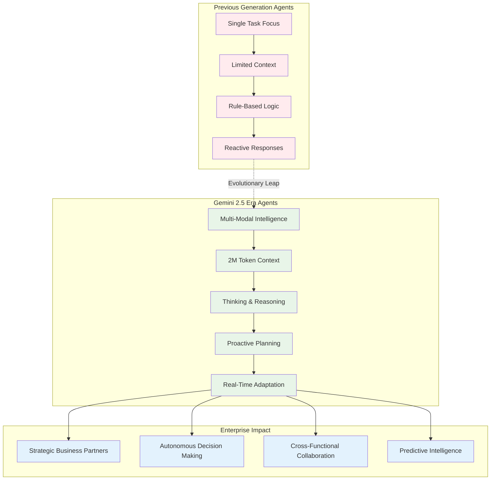
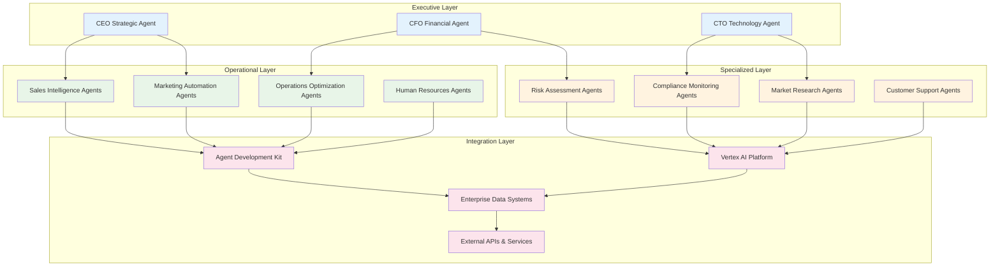
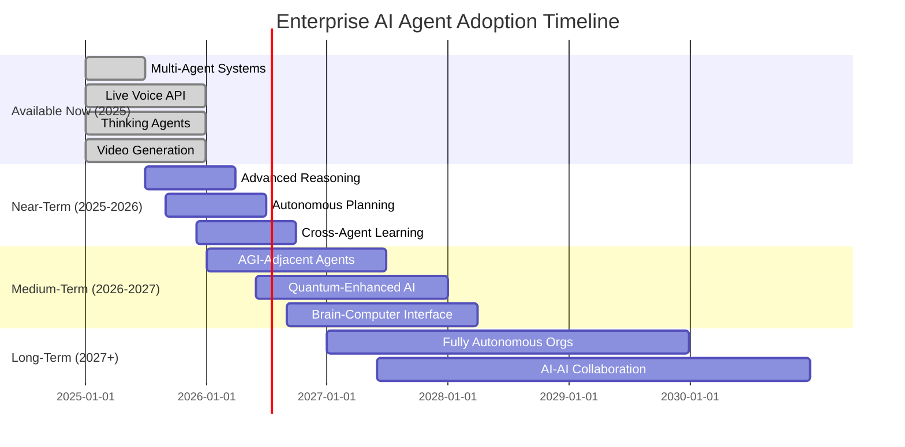

# Chapter 12: The Future of AI Agents - Building Tomorrow's Enterprise Intelligence Today

> *"We're not just building tools anymore. We're creating digital colleagues, strategic advisors, and autonomous business systems that will reshape how every organization operates."* - The Next Decade of Enterprise AI

## Why the Future Starts Now

Sarah, Chief Innovation Officer at a Fortune 100 financial services firm, just finished reviewing her company's 2025 AI transformation roadmap. What she saw wasn't science fiction—it was next quarter's reality:

- **Multi-agent trading systems** that collaborate across global markets 24/7
- **Live conversational AI** that provides real-time financial advice in 24 languages
- **Video-generating agents** that create personalized investment presentations
- **Thinking agents** that solve complex regulatory compliance scenarios
- **Grounded agents** that access real-time market data and news

The most remarkable part? All of these capabilities are available **today** on Google's Vertex AI platform. The future of AI agents isn't a distant possibility—it's happening right now, and the organizations that understand this are already pulling ahead.

**The Enterprise Reality Check:**

Based on recent official Google announcements and documentation, here's what's happening in the enterprise AI agent space:

- **Gemini 2.5 models** with 2 million token context windows are enabling entirely new classes of agents
- **Live API** is bringing human-like voice interactions to enterprise systems
- **Thinking capabilities** are giving agents explicit reasoning abilities
- **Video generation (Veo)** is automating content creation at scale
- **Agent Builder** is democratizing sophisticated agent development

This chapter explores not just what's possible, but what's **available today** and how to position your organization for the agent-driven future that's already arriving.

## What the Latest Google Innovations Mean for Enterprise Agents

### The Gemini 2.5 Revolution: From Tools to Digital Colleagues

Google's recent release of Gemini 2.5 Flash and Pro models represents a quantum leap in agent capabilities. Here's what's changed:



### Live API: The Voice-First Enterprise Revolution

Google's Live API is transforming how businesses interact with AI agents. Here's a production-ready implementation:

```python
# enterprise_voice_agent.py - Live API for enterprise
import asyncio
import numpy as np
from google import genai
from google.genai.types import LiveConnectConfig, SpeechConfig, VoiceConfig

class EnterpriseVoiceAgent:
    def __init__(self, project_id: str, business_context: str):
        self.client = genai.Client(
            vertexai=True,
            project=project_id,
            location="us-central1"
        )
        self.business_context = business_context
        self.active_sessions = {}
        
    async def start_voice_session(self, user_id: str, language: str = "en-US"):
        """Start a voice session with enterprise-grade security"""
        
        config = LiveConnectConfig(
            response_modalities=["AUDIO", "TEXT"],
            speech_config=SpeechConfig(
                voice_config=VoiceConfig(
                    prebuilt_voice_config={
                        "voice_name": "Aoede",  # Professional voice
                        "speed": 1.0,
                        "pitch": 0.0
                    }
                )
            ),
            system_instruction=f"""
            You are an expert enterprise AI assistant with deep knowledge of:
            {self.business_context}
            
            Guidelines:
            - Maintain professional tone and business focus
            - Provide data-driven insights when possible
            - Ask clarifying questions for complex requests
            - Reference company policies and procedures
            - Escalate to human experts when appropriate
            """,
            # Enterprise security features
            input_audio_transcription=True,  # For compliance logging
            output_audio_transcription=True,
            multilingual_support=True,
            language=language
        )
        
        session = await self.client.aio.live.connect(
            model="gemini-live-2.5-flash",
            config=config
        )
        
        self.active_sessions[user_id] = session
        return session
    
    async def process_voice_query(self, user_id: str, audio_data: bytes):
        """Process voice input with enterprise context"""
        session = self.active_sessions.get(user_id)
        if not session:
            raise ValueError("No active session for user")
        
        # Send audio input
        await session.send_realtime_input(
            audio={
                "data": audio_data,
                "mime_type": "audio/pcm;rate=16000"
            }
        )
        
        # Collect response
        response_audio = []
        response_text = ""
        
        async for message in session.receive():
            if message.server_content.model_turn:
                for part in message.server_content.model_turn.parts:
                    if part.inline_data:
                        # Audio response
                        audio_chunk = np.frombuffer(
                            part.inline_data.data, 
                            dtype=np.int16
                        )
                        response_audio.append(audio_chunk)
                    elif part.text:
                        # Text response for logging
                        response_text += part.text
        
        return {
            "audio": np.concatenate(response_audio) if response_audio else None,
            "text": response_text,
            "timestamp": asyncio.get_event_loop().time()
        }

# Example usage for enterprise deployment
async def deploy_voice_assistant():
    agent = EnterpriseVoiceAgent(
        project_id="your-enterprise-project",
        business_context="""
        Financial Services Company specializing in:
        - Investment management
        - Risk assessment
        - Regulatory compliance
        - Client portfolio optimization
        """
    )
    
    # Start session for executive user
    session = await agent.start_voice_session(
        user_id="ceo@company.com",
        language="en-US"
    )
    
    # Example voice interaction
    # User speaks: "What's our portfolio exposure to tech stocks?"
    # Agent provides real-time analysis with voice response
```

### Thinking Agents: Explicit Reasoning for Complex Business Decisions

Google's Thinking capability gives agents the ability to show their reasoning process, crucial for enterprise trust and compliance:

```python
# thinking_business_agent.py - Reasoning agent for strategic decisions
from google import genai
from google.genai.types import ThinkingConfig

class StrategyThinkingAgent:
    def __init__(self, project_id: str):
        self.client = genai.Client(
            vertexai=True,
            project=project_id
        )
        
    async def analyze_business_scenario(self, scenario: str, thinking_budget: int = 8192):
        """Analyze complex business scenarios with explicit reasoning"""
        
        system_instruction = """
        You are a senior business strategy consultant with expertise in:
        - Market analysis and competitive intelligence
        - Financial modeling and risk assessment
        - Organizational change management
        - Technology adoption and digital transformation
        
        When analyzing scenarios:
        1. Break down complex problems into components
        2. Consider multiple perspectives and stakeholders
        3. Evaluate risks and opportunities
        4. Provide actionable recommendations
        5. Show your reasoning process clearly
        """
        
        model = genai.GenerativeModel(
            model="gemini-2.5-pro",
            system_instruction=system_instruction
        )
        
        # Configure thinking with appropriate budget
        thinking_config = ThinkingConfig(
            thinking_budget=thinking_budget,
            include_thought_summary=True
        )
        
        response = await model.generate_content_async(
            scenario,
            thinking_config=thinking_config
        )
        
        return {
            "analysis": response.text,
            "thinking_process": response.thinking_process,
            "thought_summary": response.thought_summary,
            "confidence_score": self._calculate_confidence(response)
        }
    
    def _calculate_confidence(self, response) -> float:
        """Calculate confidence based on reasoning depth and evidence"""
        # Implement confidence scoring based on:
        # - Number of perspectives considered
        # - Evidence cited
        # - Uncertainty acknowledgment
        # - Reasoning chain completeness
        return 0.85  # Placeholder implementation

# Example strategic analysis
async def strategic_decision_example():
    agent = StrategyThinkingAgent("your-project-id")
    
    scenario = """
    Our company is considering acquiring a smaller competitor for $500M.
    The target company has:
    - $50M annual revenue (growing 25% YoY)
    - 200 employees
    - Strong IP portfolio in AI/ML
    - Some customer overlap with our existing business
    
    Market context:
    - Industry consolidation is accelerating
    - Regulatory scrutiny of tech acquisitions is increasing
    - Our main competitor just raised $1B in funding
    
    Should we proceed with the acquisition? What are the key risks and mitigation strategies?
    """
    
    result = await agent.analyze_business_scenario(scenario)
    
    print("Strategic Analysis:")
    print(result["analysis"])
    print("\nReasoning Process:")
    print(result["thinking_process"])
    print(f"\nConfidence: {result['confidence_score']:.1%}")
```

### Video Generation Revolution: Veo for Enterprise Content

Google's Veo video generation is transforming enterprise content creation:

```python
# enterprise_video_agent.py - Automated content creation
import asyncio
from google import genai
from typing import List, Dict

class EnterpriseVideoAgent:
    def __init__(self, project_id: str):
        self.client = genai.Client(
            vertexai=True,
            project=project_id,
            location="us-central1"
        )
        
    async def create_training_video(self, 
                                  topic: str, 
                                  target_audience: str,
                                  duration_seconds: int = 8) -> Dict:
        """Create professional training videos automatically"""
        
        # Generate script first
        script_prompt = f"""
        Create a professional training video script for:
        Topic: {topic}
        Audience: {target_audience}
        Duration: {duration_seconds} seconds
        
        Include:
        - Clear learning objectives
        - Engaging opening
        - Structured content delivery
        - Professional conclusion
        - Visual description cues
        """
        
        script_model = genai.GenerativeModel("gemini-2.5-flash")
        script_response = await script_model.generate_content_async(script_prompt)
        
        # Generate video from script
        video_prompt = f"""
        Professional corporate training video showing:
        {script_response.text}
        
        Style: Clean, modern corporate aesthetic
        Setting: Professional office environment
        Lighting: Bright, professional lighting
        Camera: Steady, professional angles
        Tone: Educational and engaging
        """
        
        video_request = {
            "instances": [{
                "prompt": video_prompt
            }],
            "parameters": {
                "sampleCount": 1,
                "durationSeconds": duration_seconds,
                "enhancePrompt": True,  # Use AI to improve prompts
                "storageUri": f"gs://your-enterprise-bucket/training-videos/"
            }
        }
        
        # Start video generation
        operation = await self.client.predict_long_running(
            model="veo-3.0-generate-preview",
            request=video_request
        )
        
        return {
            "operation_id": operation.name,
            "script": script_response.text,
            "video_prompt": video_prompt,
            "status": "generating"
        }
    
    async def create_product_demo(self, 
                                product_name: str,
                                key_features: List[str],
                                brand_guidelines: Dict) -> Dict:
        """Create branded product demonstration videos"""
        
        features_text = "\n".join([f"- {feature}" for feature in key_features])
        
        demo_prompt = f"""
        Professional product demonstration video for {product_name}
        
        Key features to highlight:
        {features_text}
        
        Brand guidelines:
        - Colors: {brand_guidelines.get('colors', 'Professional blue and white')}
        - Style: {brand_guidelines.get('style', 'Modern and clean')}
        - Tone: {brand_guidelines.get('tone', 'Confident and trustworthy')}
        
        Video should show:
        - Product in use
        - Clear benefit demonstrations
        - Professional presentation
        - Call-to-action ending
        
        Style: High-quality commercial production
        """
        
        request = {
            "instances": [{"prompt": demo_prompt}],
            "parameters": {
                "sampleCount": 2,  # Generate options
                "durationSeconds": 8,
                "enhancePrompt": True
            }
        }
        
        operation = await self.client.predict_long_running(
            model="veo-2.0-generate-001",
            request=request
        )
        
        return {
            "operation_id": operation.name,
            "product": product_name,
            "status": "generating"
        }

# Example enterprise video automation
async def automate_video_content():
    video_agent = EnterpriseVideoAgent("your-project-id")
    
    # Create compliance training video
    training_video = await video_agent.create_training_video(
        topic="Data Privacy and GDPR Compliance",
        target_audience="All employees",
        duration_seconds=8
    )
    
    # Create product demo
    product_demo = await video_agent.create_product_demo(
        product_name="AI Analytics Platform",
        key_features=[
            "Real-time data processing",
            "Predictive analytics",
            "Custom dashboard creation",
            "Enterprise security"
        ],
        brand_guidelines={
            "colors": "Corporate blue and silver",
            "style": "Modern technology aesthetic",
            "tone": "Professional and innovative"
        }
    )
    
    return {
        "training_video": training_video,
        "product_demo": product_demo
    }
```

## How Leading Organizations Are Preparing for the Agent Future

### The Multi-Agent Enterprise Architecture

Based on current Google capabilities and industry trends, here's how progressive organizations are structuring their agent ecosystems:



### Future-Proof Agent Development Strategy

Here's a practical roadmap based on Google's current capabilities and announced developments:

```python
# future_ready_agent_framework.py - Building for tomorrow
from dataclasses import dataclass
from typing import List, Dict, Optional
from enum import Enum

class AgentCapability(Enum):
    VOICE_INTERACTION = "voice"
    VIDEO_GENERATION = "video"
    THINKING_REASONING = "thinking"
    MULTIMODAL_PROCESSING = "multimodal"
    REAL_TIME_GROUNDING = "grounding"
    COLLABORATIVE_PLANNING = "collaboration"

@dataclass
class FutureAgentSpec:
    name: str
    capabilities: List[AgentCapability]
    context_window: int  # tokens
    supported_languages: List[str]
    integration_points: List[str]
    scalability_tier: str
    compliance_level: str

class NextGenAgentBuilder:
    """Framework for building future-ready enterprise agents"""
    
    def __init__(self, project_id: str):
        self.project_id = project_id
        self.available_capabilities = {
            AgentCapability.VOICE_INTERACTION: "gemini-live-2.5-flash",
            AgentCapability.VIDEO_GENERATION: "veo-3.0-generate-preview",
            AgentCapability.THINKING_REASONING: "gemini-2.5-pro",
            AgentCapability.MULTIMODAL_PROCESSING: "gemini-2.5-flash",
            AgentCapability.REAL_TIME_GROUNDING: "gemini-2.5-flash",
            AgentCapability.COLLABORATIVE_PLANNING: "gemini-2.5-pro"
        }
    
    def design_enterprise_agent(self, business_requirements: Dict) -> FutureAgentSpec:
        """Design an agent based on business requirements"""
        
        # Determine required capabilities
        capabilities = self._analyze_requirements(business_requirements)
        
        # Calculate optimal context window
        context_window = self._calculate_context_needs(business_requirements)
        
        # Determine language requirements
        languages = business_requirements.get("markets", ["en-US"])
        
        # Plan integration points
        integrations = self._plan_integrations(business_requirements)
        
        return FutureAgentSpec(
            name=business_requirements["agent_name"],
            capabilities=capabilities,
            context_window=context_window,
            supported_languages=languages,
            integration_points=integrations,
            scalability_tier=self._determine_scale_tier(business_requirements),
            compliance_level=self._determine_compliance_level(business_requirements)
        )
    
    def _analyze_requirements(self, requirements: Dict) -> List[AgentCapability]:
        """Analyze business requirements to determine needed capabilities"""
        capabilities = []
        
        if requirements.get("customer_facing", False):
            capabilities.append(AgentCapability.VOICE_INTERACTION)
        
        if requirements.get("content_creation", False):
            capabilities.append(AgentCapability.VIDEO_GENERATION)
        
        if requirements.get("complex_reasoning", False):
            capabilities.append(AgentCapability.THINKING_REASONING)
        
        if requirements.get("multimodal_data", False):
            capabilities.append(AgentCapability.MULTIMODAL_PROCESSING)
        
        if requirements.get("real_time_data", False):
            capabilities.append(AgentCapability.REAL_TIME_GROUNDING)
        
        if requirements.get("team_coordination", False):
            capabilities.append(AgentCapability.COLLABORATIVE_PLANNING)
        
        return capabilities
    
    def _calculate_context_needs(self, requirements: Dict) -> int:
        """Calculate optimal context window based on use case"""
        base_context = 32000  # Base context for simple agents
        
        complexity_multipliers = {
            "document_analysis": 4,
            "code_review": 3,
            "strategic_planning": 5,
            "compliance_checking": 6,
            "research_synthesis": 8
        }
        
        max_multiplier = 1
        for use_case in requirements.get("use_cases", []):
            multiplier = complexity_multipliers.get(use_case, 1)
            max_multiplier = max(max_multiplier, multiplier)
        
        return min(base_context * max_multiplier, 2000000)  # Cap at 2M tokens
    
    def _plan_integrations(self, requirements: Dict) -> List[str]:
        """Plan integration points based on business systems"""
        integrations = ["vertex_ai", "cloud_run"]  # Always include base
        
        system_mappings = {
            "crm": "salesforce_connector",
            "erp": "sap_connector",
            "analytics": "bigquery_connector",
            "documentation": "workspace_connector",
            "security": "iam_connector"
        }
        
        for system in requirements.get("existing_systems", []):
            if system in system_mappings:
                integrations.append(system_mappings[system])
        
        return integrations
    
    def _determine_scale_tier(self, requirements: Dict) -> str:
        """Determine appropriate scaling tier"""
        users = requirements.get("expected_users", 100)
        
        if users < 1000:
            return "startup"
        elif users < 10000:
            return "enterprise"
        else:
            return "hyperscale"
    
    def _determine_compliance_level(self, requirements: Dict) -> str:
        """Determine compliance requirements"""
        industry = requirements.get("industry", "general")
        
        compliance_levels = {
            "healthcare": "hipaa_sox",
            "finance": "sox_pci_gdpr",
            "government": "fedramp_high",
            "general": "gdpr_basic"
        }
        
        return compliance_levels.get(industry, "gdpr_basic")

# Example: Design a next-generation enterprise agent
def design_future_agent():
    builder = NextGenAgentBuilder("your-project-id")
    
    requirements = {
        "agent_name": "Executive Intelligence Assistant",
        "customer_facing": True,
        "content_creation": True,
        "complex_reasoning": True,
        "multimodal_data": True,
        "real_time_data": True,
        "team_coordination": True,
        "use_cases": ["strategic_planning", "document_analysis", "research_synthesis"],
        "expected_users": 5000,
        "industry": "finance",
        "markets": ["en-US", "en-GB", "de-DE", "ja-JP"],
        "existing_systems": ["crm", "erp", "analytics", "security"]
    }
    
    agent_spec = builder.design_enterprise_agent(requirements)
    
    print(f"Agent Design: {agent_spec.name}")
    print(f"Capabilities: {[cap.value for cap in agent_spec.capabilities]}")
    print(f"Context Window: {agent_spec.context_window:,} tokens")
    print(f"Languages: {agent_spec.supported_languages}")
    print(f"Integrations: {agent_spec.integration_points}")
    print(f"Scale Tier: {agent_spec.scalability_tier}")
    print(f"Compliance: {agent_spec.compliance_level}")
    
    return agent_spec
```

## When to Adopt vs. When to Wait: The Strategic Timeline

### The 2025-2026 Adoption Matrix

Based on Google's roadmap and current capabilities, here's when to adopt specific agent technologies:



### Strategic Decision Framework

Use this framework to decide when to adopt new agent capabilities:

```python
# strategic_adoption_framework.py
from dataclasses import dataclass
from typing import Dict, List
import datetime

@dataclass
class AdoptionRecommendation:
    capability: str
    timing: str  # "immediate", "pilot", "wait", "monitor"
    risk_level: str  # "low", "medium", "high"
    business_impact: str  # "low", "medium", "high", "transformational"
    investment_required: str  # "minimal", "moderate", "significant", "major"
    rationale: str

class AdoptionStrategy:
    def __init__(self, company_profile: Dict):
        self.company_profile = company_profile
        self.current_capabilities = self._assess_current_state()
        
    def evaluate_capability(self, capability_name: str) -> AdoptionRecommendation:
        """Evaluate when and how to adopt a new agent capability"""
        
        capabilities_matrix = {
            "live_voice_agents": {
                "maturity": "production",
                "complexity": "medium",
                "business_value": "high",
                "competitive_advantage": "immediate"
            },
            "thinking_agents": {
                "maturity": "production",
                "complexity": "low",
                "business_value": "high",
                "competitive_advantage": "immediate"
            },
            "video_generation": {
                "maturity": "preview",
                "complexity": "medium",
                "business_value": "medium",
                "competitive_advantage": "early"
            },
            "autonomous_planning": {
                "maturity": "research",
                "complexity": "high",
                "business_value": "transformational",
                "competitive_advantage": "future"
            }
        }
        
        capability_info = capabilities_matrix.get(capability_name, {})
        
        # Decision logic based on company profile and capability maturity
        timing = self._determine_timing(capability_info)
        risk_level = self._assess_risk(capability_info)
        business_impact = self._calculate_impact(capability_info)
        investment = self._estimate_investment(capability_info)
        rationale = self._generate_rationale(capability_info, timing)
        
        return AdoptionRecommendation(
            capability=capability_name,
            timing=timing,
            risk_level=risk_level,
            business_impact=business_impact,
            investment_required=investment,
            rationale=rationale
        )
    
    def _determine_timing(self, capability_info: Dict) -> str:
        """Determine optimal adoption timing"""
        maturity = capability_info.get("maturity", "research")
        company_risk_tolerance = self.company_profile.get("risk_tolerance", "medium")
        innovation_priority = self.company_profile.get("innovation_priority", "medium")
        
        if maturity == "production" and innovation_priority == "high":
            return "immediate"
        elif maturity == "production" and company_risk_tolerance == "medium":
            return "pilot"
        elif maturity == "production" and company_risk_tolerance == "low":
            return "wait"
        elif maturity == "preview" and innovation_priority == "high":
            return "pilot"
        elif maturity == "preview":
            return "wait"
        else:
            return "monitor"
    
    def _assess_risk(self, capability_info: Dict) -> str:
        """Assess adoption risk level"""
        maturity = capability_info.get("maturity", "research")
        complexity = capability_info.get("complexity", "high")
        
        risk_matrix = {
            ("production", "low"): "low",
            ("production", "medium"): "low",
            ("production", "high"): "medium",
            ("preview", "low"): "medium",
            ("preview", "medium"): "medium",
            ("preview", "high"): "high",
            ("research", "low"): "high",
            ("research", "medium"): "high",
            ("research", "high"): "high"
        }
        
        return risk_matrix.get((maturity, complexity), "high")
    
    def _calculate_impact(self, capability_info: Dict) -> str:
        """Calculate potential business impact"""
        business_value = capability_info.get("business_value", "low")
        competitive_advantage = capability_info.get("competitive_advantage", "none")
        
        if business_value == "transformational":
            return "transformational"
        elif business_value == "high" and competitive_advantage == "immediate":
            return "high"
        elif business_value == "high":
            return "medium"
        else:
            return "low"
    
    def _estimate_investment(self, capability_info: Dict) -> str:
        """Estimate required investment level"""
        complexity = capability_info.get("complexity", "high")
        maturity = capability_info.get("maturity", "research")
        
        if complexity == "low" and maturity == "production":
            return "minimal"
        elif complexity == "medium" and maturity == "production":
            return "moderate"
        elif complexity == "high" or maturity != "production":
            return "significant"
        else:
            return "major"
    
    def _generate_rationale(self, capability_info: Dict, timing: str) -> str:
        """Generate rationale for recommendation"""
        maturity = capability_info.get("maturity", "research")
        business_value = capability_info.get("business_value", "low")
        
        rationales = {
            "immediate": f"Production-ready technology with {business_value} business value. Early adoption provides competitive advantage.",
            "pilot": f"Technology is {maturity} with {business_value} potential. Pilot program recommended to validate fit.",
            "wait": f"Technology is {maturity}. Wait for production readiness while monitoring developments.",
            "monitor": f"Technology is early-stage. Monitor progress and prepare for future evaluation."
        }
        
        return rationales.get(timing, "Monitor technology developments.")
    
    def _assess_current_state(self) -> Dict:
        """Assess company's current AI/agent capabilities"""
        # Implementation would assess existing infrastructure,
        # team capabilities, and technology maturity
        return {
            "ai_maturity": self.company_profile.get("ai_maturity", "beginner"),
            "technical_capability": self.company_profile.get("technical_capability", "medium"),
            "existing_agents": self.company_profile.get("existing_agents", 0)
        }

# Example strategic evaluation
def evaluate_adoption_strategy():
    company_profile = {
        "industry": "financial_services",
        "size": "enterprise",
        "ai_maturity": "intermediate",
        "risk_tolerance": "medium",
        "innovation_priority": "high",
        "technical_capability": "high",
        "existing_agents": 3
    }
    
    strategy = AdoptionStrategy(company_profile)
    
    capabilities_to_evaluate = [
        "live_voice_agents",
        "thinking_agents", 
        "video_generation",
        "autonomous_planning"
    ]
    
    recommendations = []
    for capability in capabilities_to_evaluate:
        recommendation = strategy.evaluate_capability(capability)
        recommendations.append(recommendation)
        
        print(f"\n{capability.upper()}:")
        print(f"  Timing: {recommendation.timing}")
        print(f"  Risk: {recommendation.risk_level}")
        print(f"  Impact: {recommendation.business_impact}")
        print(f"  Investment: {recommendation.investment_required}")
        print(f"  Rationale: {recommendation.rationale}")
    
    return recommendations
```

## Preparing Your Organization for the Agent Future

### The Agent-Ready Enterprise Checklist

Based on Google's current and planned capabilities, here's how to prepare:

#### **Immediate Actions (Next 3 Months)**

1. **✅ Audit Current AI Infrastructure**
   - Vertex AI project setup and permissions
   - Integration capabilities with existing systems
   - Data readiness for agent training and grounding

2. **✅ Skill Development Program**
   - Train development teams on ADK and Vertex AI Agent Builder
   - Establish AI ethics and governance frameworks
   - Create cross-functional agent development teams

3. **✅ Pilot Project Selection**
   - Identify 2-3 high-impact, low-risk use cases
   - Start with Google's production-ready capabilities (Live API, Thinking)
   - Plan for measuring ROI and business impact

#### **Medium-Term Preparation (3-12 Months)**

1. **🔄 Scale Successful Pilots**
   - Expand successful agent implementations
   - Integrate with broader business processes
   - Establish agent performance monitoring

2. **🔄 Advanced Capability Integration**
   - Implement video generation for content workflows
   - Deploy multi-agent systems for complex processes
   - Establish agent-to-agent communication protocols

3. **🔄 Organizational Change Management**
   - Retrain employees to work alongside agents
   - Redesign workflows to leverage agent capabilities
   - Establish new success metrics and KPIs

#### **Long-Term Transformation (1-3 Years)**

1. **🚀 Full Agent Integration**
   - Agents embedded in all major business processes
   - Autonomous agent teams handling routine operations
   - AI-first approach to new initiative planning

2. **🚀 Innovation Pipeline**
   - Research and development agent teams
   - Predictive business strategy capabilities
   - Real-time market adaptation systems

### Pro Tips for Agent Future Success

1. **Start with Voice and Thinking**: Google's Live API and Thinking capabilities are production-ready and provide immediate business value.

2. **Plan for Multi-Modal**: Future agents will seamlessly combine text, voice, image, and video. Design your systems with this flexibility in mind.

3. **Invest in Data Quality**: Advanced agents require high-quality, well-structured data. Start improving your data infrastructure now.

4. **Build for Integration**: Design agents that can easily connect with existing business systems and each other.

5. **Focus on Business Value**: Don't build agents for technology's sake. Always tie agent capabilities to specific business outcomes.

6. **Prepare for Governance**: As agents become more autonomous, you'll need robust governance, monitoring, and control frameworks.

## Reflection Questions for the Future

1. **Strategic Vision**: How will AI agents transform your industry in the next 5 years? What position do you want your organization to hold?

2. **Capability Gaps**: What skills and infrastructure do you need to develop to leverage advanced agent capabilities effectively?

3. **Competitive Advantage**: Which agent capabilities could provide the most significant competitive advantage in your market?

4. **Risk Management**: How will you balance the benefits of early adoption with the risks of unproven technologies?

5. **Organizational Change**: How will your organization's structure and culture need to evolve to work effectively with AI agents?

## Your Next 90 Days: Building the Future Today

**The Action Plan**: Transform your organization into an agent-ready enterprise.

### **Days 1-30: Foundation**

1. **Week 1-2**: Complete Google Cloud and Vertex AI setup
   - Enable Vertex AI APIs
   - Set up proper IAM and security
   - Create development environment

2. **Week 3-4**: Implement your first production agent
   - Choose between Live API voice agent or Thinking agent
   - Build and deploy a simple but useful agent
   - Measure initial impact and user feedback

### **Days 31-60: Expansion**

1. **Week 5-6**: Add advanced capabilities
   - Integrate video generation if applicable
   - Implement multi-agent coordination
   - Connect to business data sources

2. **Week 7-8**: Scale and optimize
   - Expand to additional use cases
   - Optimize performance and costs
   - Establish monitoring and governance

### **Days 61-90: Transformation**

1. **Week 9-10**: Advanced integration
   - Connect agents to core business processes
   - Implement agent-to-agent communication
   - Prepare for autonomous operations

2. **Week 11-12**: Future planning
   - Evaluate emerging Google capabilities
   - Plan next phase of agent adoption
   - Establish innovation pipeline

**Success Metrics:**

- At least one production agent serving real business needs
- Measurable ROI from agent implementation
- Team trained and confident in agent development
- Clear roadmap for next 12 months of agent evolution

Remember: The future of AI agents isn't something that will happen to your organization—it's something you can actively shape and leverage. The tools are available today. The question is: Will you be among the organizations that seize this opportunity, or will you be the ones trying to catch up later?

The agent revolution is here. Your future starts now.

---

## Conclusion: Your Agent-Powered Tomorrow

As we conclude this comprehensive journey through Google's Agent Development Kit, remember that you're not just learning about technology—you're preparing to shape the future of how business gets done.

The capabilities we've explored—from basic agents to sophisticated multi-modal, reasoning systems—represent just the beginning. With Google's continued innovation in Vertex AI, new breakthroughs in agent capabilities emerge regularly.

Your mission now is clear: Take these tools, apply them to your unique business challenges, and become one of the organizations that doesn't just adapt to the AI revolution but leads it.

The future belongs to those who build it. Start building yours today.

**Ready to continue your agent development journey? Explore Google's [Agent Development Kit documentation](https://google.github.io/adk-docs/) and join the [Google Cloud Community](https://www.googlecloudcommunity.com/) to connect with other enterprise agent builders.**

---

*This marks the end of our tutorial series, but the beginning of your transformation into an enterprise AI agent expert. The tools are in your hands. The future is yours to build.*