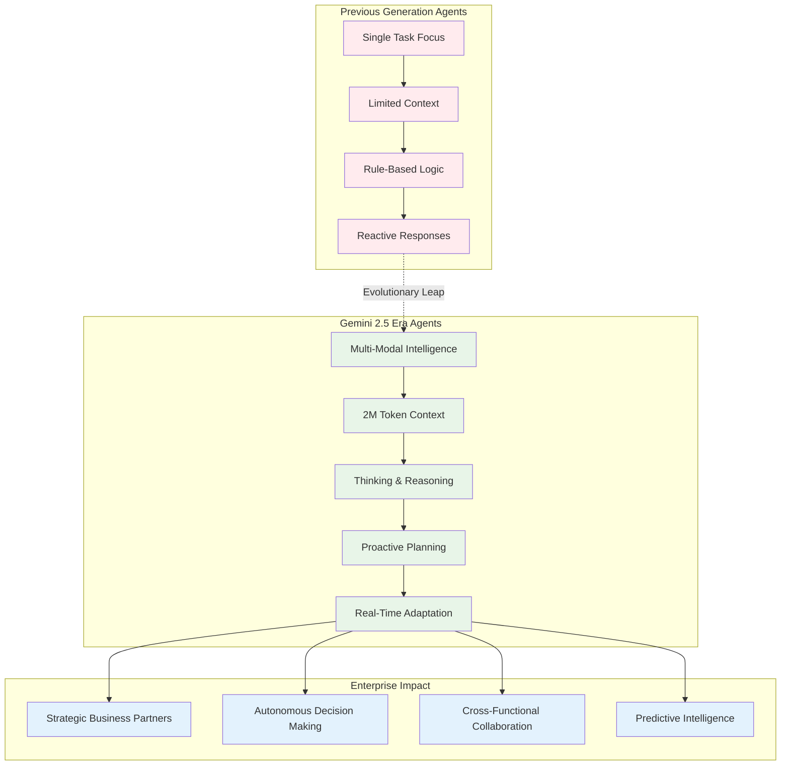
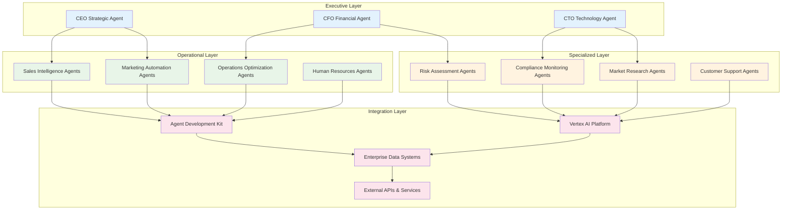

# Chapter 12: The Future of AI Agents - Building Tomorrow's Enterprise Intelligence Today

> _"We're not just building tools anymore. We're creating digital colleagues, strategic advisors, and autonomous business systems that will reshape how every organization operates."_ - The Next Decade of Enterprise AI

## Why the Future Starts Now

Sarah, Chief Innovation Officer at a Fortune 100 financial services firm, just finished reviewing her company's 2025 AI transformation roadmap. What she saw wasn't science fiction—it was next quarter's reality:

- **Multi-agent trading systems** that collaborate across global markets 24/7
- **Live conversational AI** that provides real-time financial advice in 24 languages
- **Video-generating agents** that create personalized investment presentations
- **Thinking agents** that solve complex regulatory compliance scenarios
- **Grounded agents** that access real-time market data and news

The most remarkable part? All of these capabilities are available **today** on Google's Vertex AI platform. The future of AI agents isn't a distant possibility—it's happening right now, and the organizations that understand this are already pulling ahead.

**The Enterprise Reality Check:**

Based on recent official Google announcements and documentation, here's what's happening in the enterprise AI agent space:

- **Gemini 2.5 models** with up to 1 million token context windows are enabling entirely new classes of agents
- **Live API** is bringing human-like voice interactions to enterprise systems (currently in Private GA - requires special access)
- **Thinking capabilities** are giving agents explicit reasoning abilities (available in Gemini 2.5 Flash, Pro, and Flash-Lite)
- **Video generation (Veo 2)** is automating content creation at scale (Veo 3 requires allowlist access)
- **Agent Development Kit (ADK)** is the official framework for building sophisticated agent systems

This chapter explores not just what's possible, but what's **available today** and how to position your organization for the agent-driven future that's already arriving.

## What the Latest Google Innovations Mean for Enterprise Agents

### The Gemini 2.5 Revolution: From Tools to Digital Colleagues

Google's recent release of Gemini 2.5 Flash and Pro models represents a quantum leap in agent capabilities. Here's what's changed:



### Live API: The Voice-First Enterprise Revolution

**Important Note:** Google's Live API is currently in Private General Availability. You must contact your Google account team representative to request access before implementing these features.

Google's Live API is transforming how businesses interact with AI agents. Here's a production-ready implementation for organizations with Live API access:

```python
# enterprise_voice_agent.py - Live API for enterprise
import asyncio
import numpy as np
from google import genai
from google.genai.types import LiveConnectConfig, SpeechConfig, VoiceConfig

class EnterpriseVoiceAgent:
    def __init__(self, project_id: str, business_context: str):
        self.client = genai.Client(
            vertexai=True,
            project=project_id,
            location="us-central1"
        )
        self.business_context = business_context
        self.active_sessions = {}

    async def start_voice_session(self, user_id: str, language: str = "en-US"):
        """Start a voice session with enterprise-grade security"""

        config = LiveConnectConfig(
            response_modalities=["AUDIO", "TEXT"],
            speech_config=SpeechConfig(
                voice_config=VoiceConfig(
                    prebuilt_voice_config={
                        "voice_name": "Aoede",  # Professional voice
                        "speed": 1.0,
                        "pitch": 0.0
                    }
                )
            ),
            system_instruction=f"""
            You are an expert enterprise AI assistant with deep knowledge of:
            {self.business_context}

            Guidelines:
            - Maintain professional tone and business focus
            - Provide data-driven insights when possible
            - Ask clarifying questions for complex requests
            - Reference company policies and procedures
            - Escalate to human experts when appropriate
            """,
            # Enterprise security features
            input_audio_transcription=True,  # For compliance logging
            output_audio_transcription=True,
            multilingual_support=True,
            language=language
        )

        session = await self.client.aio.live.connect(
            model="gemini-live-2.5-flash",
            config=config
        )

        self.active_sessions[user_id] = session
        return session

    async def process_voice_query(self, user_id: str, audio_data: bytes):
        """Process voice input with enterprise context"""
        session = self.active_sessions.get(user_id)
        if not session:
            raise ValueError("No active session for user")

        # Send audio input
        await session.send_realtime_input(
            audio={
                "data": audio_data,
                "mime_type": "audio/pcm;rate=16000"
            }
        )

        # Collect response
        response_audio = []
        response_text = ""

        async for message in session.receive():
            if message.server_content.model_turn:
                for part in message.server_content.model_turn.parts:
                    if part.inline_data:
                        # Audio response
                        audio_chunk = np.frombuffer(
                            part.inline_data.data,
                            dtype=np.int16
                        )
                        response_audio.append(audio_chunk)
                    elif part.text:
                        # Text response for logging
                        response_text += part.text

        return {
            "audio": np.concatenate(response_audio) if response_audio else None,
            "text": response_text,
            "timestamp": asyncio.get_event_loop().time()
        }

# Example usage for enterprise deployment
async def deploy_voice_assistant():
    agent = EnterpriseVoiceAgent(
        project_id="your-enterprise-project",
        business_context="""
        Financial Services Company specializing in:
        - Investment management
        - Risk assessment
        - Regulatory compliance
        - Client portfolio optimization
        """
    )

    # Start session for executive user
    session = await agent.start_voice_session(
        user_id="ceo@company.com",
        language="en-US"
    )

    # Example voice interaction
    # User speaks: "What's our portfolio exposure to tech stocks?"
    # Agent provides real-time analysis with voice response
```

### Thinking Agents: Explicit Reasoning for Complex Business Decisions

Google's Thinking capability gives agents the ability to show their reasoning process, crucial for enterprise trust and compliance:

```python
# thinking_business_agent.py - Reasoning agent for strategic decisions
from google import genai
from google.genai.types import ThinkingConfig

class StrategyThinkingAgent:
    def __init__(self, project_id: str):
        self.client = genai.Client(
            vertexai=True,
            project=project_id
        )

    async def analyze_business_scenario(self, scenario: str, thinking_budget: int = 8192):
        """Analyze complex business scenarios with explicit reasoning"""

        system_instruction = """
        You are a senior business strategy consultant with expertise in:
        - Market analysis and competitive intelligence
        - Financial modeling and risk assessment
        - Organizational change management
        - Technology adoption and digital transformation

        When analyzing scenarios:
        1. Break down complex problems into components
        2. Consider multiple perspectives and stakeholders
        3. Evaluate risks and opportunities
        4. Provide actionable recommendations
        5. Show your reasoning process clearly
        """

        model = genai.GenerativeModel(
            model="gemini-2.5-pro",
            system_instruction=system_instruction
        )

        # Configure thinking with appropriate budget
        thinking_config = ThinkingConfig(
            thinking_budget=thinking_budget,
            include_thought_summary=True
        )

        response = await model.generate_content_async(
            scenario,
            thinking_config=thinking_config
        )

        return {
            "analysis": response.text,
            "thinking_process": response.thinking_process,
            "thought_summary": response.thought_summary,
            "confidence_score": self._calculate_confidence(response)
        }

    def _calculate_confidence(self, response) -> float:
        """Calculate confidence based on reasoning depth and evidence"""
        # Implement confidence scoring based on:
        # - Number of perspectives considered
        # - Evidence cited
        # - Uncertainty acknowledgment
        # - Reasoning chain completeness
        return 0.85  # Placeholder implementation

# Example strategic analysis
async def strategic_decision_example():
    agent = StrategyThinkingAgent("your-project-id")

    scenario = """
    Our company is considering acquiring a smaller competitor for $500M.
    The target company has:
    - $50M annual revenue (growing 25% YoY)
    - 200 employees
    - Strong IP portfolio in AI/ML
    - Some customer overlap with our existing business

    Market context:
    - Industry consolidation is accelerating
    - Regulatory scrutiny of tech acquisitions is increasing
    - Our main competitor just raised $1B in funding

    Should we proceed with the acquisition? What are the key risks and mitigation strategies?
    """

    result = await agent.analyze_business_scenario(scenario)

    print("Strategic Analysis:")
    print(result["analysis"])
    print("\nReasoning Process:")
    print(result["thinking_process"])
    print(f"\nConfidence: {result['confidence_score']:.1%}")
```

### Video Generation Revolution: Veo for Enterprise Content

Google's Veo video generation is transforming enterprise content creation:

```python
# enterprise_video_agent.py - Automated content creation
import asyncio
from google import genai
from typing import List, Dict

class EnterpriseVideoAgent:
    def __init__(self, project_id: str):
        self.client = genai.Client(
            vertexai=True,
            project=project_id,
            location="us-central1"
        )

    async def create_training_video(self,
                                  topic: str,
                                  target_audience: str,
                                  duration_seconds: int = 8) -> Dict:
        """Create professional training videos automatically"""

        # Generate script first
        script_prompt = f"""
        Create a professional training video script for:
        Topic: {topic}
        Audience: {target_audience}
        Duration: {duration_seconds} seconds

        Include:
        - Clear learning objectives
        - Engaging opening
        - Structured content delivery
        - Professional conclusion
        - Visual description cues
        """

        script_model = genai.GenerativeModel("gemini-2.5-flash")
        script_response = await script_model.generate_content_async(script_prompt)

        # Generate video from script
        video_prompt = f"""
        Professional corporate training video showing:
        {script_response.text}

        Style: Clean, modern corporate aesthetic
        Setting: Professional office environment
        Lighting: Bright, professional lighting
        Camera: Steady, professional angles
        Tone: Educational and engaging
        """

        # Note: Veo 3 requires allowlist access. Use Veo 2 for general availability.
        video_request = {
            "instances": [{
                "prompt": video_prompt
            }],
            "parameters": {
                "sampleCount": 1,
                "durationSeconds": duration_seconds,
                "enhancePrompt": True,  # Use AI to improve prompts
                "storageUri": f"gs://your-enterprise-bucket/training-videos/"
            }
        }

        # Start video generation using Veo 2 (Generally Available)
        operation = await self.client.predict_long_running(
            model="veo-2.0-generate-001",  # Use GA version
            request=video_request
        )

        return {
            "operation_id": operation.name,
            "script": script_response.text,
            "video_prompt": video_prompt,
            "status": "generating"
        }

    async def create_product_demo(self,
                                product_name: str,
                                key_features: List[str],
                                brand_guidelines: Dict) -> Dict:
        """Create branded product demonstration videos"""

        features_text = "\n".join([f"- {feature}" for feature in key_features])

        demo_prompt = f"""
        Professional product demonstration video for {product_name}

        Key features to highlight:
        {features_text}

        Brand guidelines:
        - Colors: {brand_guidelines.get('colors', 'Professional blue and white')}
        - Style: {brand_guidelines.get('style', 'Modern and clean')}
        - Tone: {brand_guidelines.get('tone', 'Confident and trustworthy')}

        Video should show:
        - Product in use
        - Clear benefit demonstrations
        - Professional presentation
        - Call-to-action ending

        Style: High-quality commercial production
        """

        request = {
            "instances": [{"prompt": demo_prompt}],
            "parameters": {
                "sampleCount": 2,  # Generate options
                "durationSeconds": 8,
                "enhancePrompt": True
            }
        }

        operation = await self.client.predict_long_running(
            model="veo-2.0-generate-001",
            request=request
        )

        return {
            "operation_id": operation.name,
            "product": product_name,
            "status": "generating"
        }

# Example enterprise video automation
async def automate_video_content():
    video_agent = EnterpriseVideoAgent("your-project-id")

    # Create compliance training video
    training_video = await video_agent.create_training_video(
        topic="Data Privacy and GDPR Compliance",
        target_audience="All employees",
        duration_seconds=8
    )

    # Create product demo
    product_demo = await video_agent.create_product_demo(
        product_name="AI Analytics Platform",
        key_features=[
            "Real-time data processing",
            "Predictive analytics",
            "Custom dashboard creation",
            "Enterprise security"
        ],
        brand_guidelines={
            "colors": "Corporate blue and silver",
            "style": "Modern technology aesthetic",
            "tone": "Professional and innovative"
        }
    )

    return {
        "training_video": training_video,
        "product_demo": product_demo
    }
```

## How Leading Organizations Are Preparing for the Agent Future

### The Multi-Agent Enterprise Architecture

Based on current Google capabilities and industry trends, here's how progressive organizations are structuring their agent ecosystems:



### Future-Proof Agent Development Strategy

Here's a practical roadmap based on Google's current capabilities and announced developments:

```python
# future_ready_agent_framework.py - Building for tomorrow
from dataclasses import dataclass
from typing import List, Dict, Optional
from enum import Enum

class AgentCapability(Enum):
    VOICE_INTERACTION = "voice"
    VIDEO_GENERATION = "video"
    THINKING_REASONING = "thinking"
    MULTIMODAL_PROCESSING = "multimodal"
    REAL_TIME_GROUNDING = "grounding"
    COLLABORATIVE_PLANNING = "collaboration"

@dataclass
class FutureAgentSpec:
    name: str
    capabilities: List[AgentCapability]
    context_window: int  # tokens
    supported_languages: List[str]
    integration_points: List[str]
    scalability_tier: str
    compliance_level: str

class NextGenAgentBuilder:
    """Framework for building future-ready enterprise agents"""

    def __init__(self, project_id: str):
        self.project_id = project_id
        self.available_capabilities = {
            AgentCapability.VOICE_INTERACTION: "gemini-live-2.5-flash",
            AgentCapability.VIDEO_GENERATION: "veo-3.0-generate-preview",
            AgentCapability.THINKING_REASONING: "gemini-2.5-pro",
            AgentCapability.MULTIMODAL_PROCESSING: "gemini-2.5-flash",
            AgentCapability.REAL_TIME_GROUNDING: "gemini-2.5-flash",
            AgentCapability.COLLABORATIVE_PLANNING: "gemini-2.5-pro"
        }

    def design_enterprise_agent(self, business_requirements: Dict) -> FutureAgentSpec:
        """Design an agent based on business requirements"""

        # Determine required capabilities
        capabilities = self._analyze_requirements(business_requirements)

        # Calculate optimal context window
        context_window = self._calculate_context_needs(business_requirements)

        # Determine language requirements
        languages = business_requirements.get("markets", ["en-US"])

        # Plan integration points
        integrations = self._plan_integrations(business_requirements)

        return FutureAgentSpec(
            name=business_requirements["agent_name"],
            capabilities=capabilities,
            context_window=context_window,
            supported_languages=languages,
            integration_points=integrations,
            scalability_tier=self._determine_scale_tier(business_requirements),
            compliance_level=self._determine_compliance_level(business_requirements)
        )

    def _analyze_requirements(self, requirements: Dict) -> List[AgentCapability]:
        """Analyze business requirements to determine needed capabilities"""
        capabilities = []

        if requirements.get("customer_facing", False):
            capabilities.append(AgentCapability.VOICE_INTERACTION)

        if requirements.get("content_creation", False):
            capabilities.append(AgentCapability.VIDEO_GENERATION)

        if requirements.get("complex_reasoning", False):
            capabilities.append(AgentCapability.THINKING_REASONING)

        if requirements.get("multimodal_data", False):
            capabilities.append(AgentCapability.MULTIMODAL_PROCESSING)

        if requirements.get("real_time_data", False):
            capabilities.append(AgentCapability.REAL_TIME_GROUNDING)

        if requirements.get("team_coordination", False):
            capabilities.append(AgentCapability.COLLABORATIVE_PLANNING)

        return capabilities

    def _calculate_context_needs(self, requirements: Dict) -> int:
        """Calculate optimal context window based on use case"""
        base_context = 32000  # Base context for simple agents

        complexity_multipliers = {
            "document_analysis": 4,
            "code_review": 3,
            "strategic_planning": 5,
            "compliance_checking": 6,
            "research_synthesis": 8
        }

        max_multiplier = 1
        for use_case in requirements.get("use_cases", []):
            multiplier = complexity_multipliers.get(use_case, 1)
            max_multiplier = max(max_multiplier, multiplier)

        return min(base_context * max_multiplier, 2000000)  # Cap at 2M tokens

    def _plan_integrations(self, requirements: Dict) -> List[str]:
        """Plan integration points based on business systems"""
        integrations = ["vertex_ai", "cloud_run"]  # Always include base

        system_mappings = {
            "crm": "salesforce_connector",
            "erp": "sap_connector",
            "analytics": "bigquery_connector",
            "documentation": "workspace_connector",
            "security": "iam_connector"
        }

        for system in requirements.get("existing_systems", []):
            if system in system_mappings:
                integrations.append(system_mappings[system])

        return integrations

    def _determine_scale_tier(self, requirements: Dict) -> str:
        """Determine appropriate scaling tier"""
        users = requirements.get("expected_users", 100)

        if users < 1000:
            return "startup"
        elif users < 10000:
            return "enterprise"
        else:
            return "hyperscale"

    def _determine_compliance_level(self, requirements: Dict) -> str:
        """Determine compliance requirements"""
        industry = requirements.get("industry", "general")

        compliance_levels = {
            "healthcare": "hipaa_sox",
            "finance": "sox_pci_gdpr",
            "government": "fedramp_high",
            "general": "gdpr_basic"
        }

        return compliance_levels.get(industry, "gdpr_basic")

# Example: Design a next-generation enterprise agent
def design_future_agent():
    builder = NextGenAgentBuilder("your-project-id")

    requirements = {
        "agent_name": "Executive Intelligence Assistant",
        "customer_facing": True,
        "content_creation": True,
        "complex_reasoning": True,
        "multimodal_data": True,
        "real_time_data": True,
        "team_coordination": True,
        "use_cases": ["strategic_planning", "document_analysis", "research_synthesis"],
        "expected_users": 5000,
        "industry": "finance",
        "markets": ["en-US", "en-GB", "de-DE", "ja-JP"],
        "existing_systems": ["crm", "erp", "analytics", "security"]
    }

    agent_spec = builder.design_enterprise_agent(requirements)

    print(f"Agent Design: {agent_spec.name}")
    print(f"Capabilities: {[cap.value for cap in agent_spec.capabilities]}")
    print(f"Context Window: {agent_spec.context_window:,} tokens")
    print(f"Languages: {agent_spec.supported_languages}")
    print(f"Integrations: {agent_spec.integration_points}")
    print(f"Scale Tier: {agent_spec.scalability_tier}")
    print(f"Compliance: {agent_spec.compliance_level}")

    return agent_spec
```

## Preparing Your Organization for the Agent Future

### The Agent-Ready Enterprise Checklist

Based on Google's current and planned capabilities, here's how to prepare:

#### **Immediate Actions (Next 3 Months)**

1. **✅ Audit Current AI Infrastructure**

   - Vertex AI project setup and permissions
   - Integration capabilities with existing systems
   - Data readiness for agent training and grounding

2. **✅ Skill Development Program**

   - Train development teams on ADK and Vertex AI Agent Builder
   - Establish AI ethics and governance frameworks
   - Create cross-functional agent development teams

3. **✅ Pilot Project Selection**
   - Identify 2-3 high-impact, low-risk use cases
   - Start with Google's production-ready capabilities (Live API, Thinking)
   - Plan for measuring ROI and business impact

#### **Medium-Term Preparation (3-12 Months)**

1. **🔄 Scale Successful Pilots**

   - Expand successful agent implementations
   - Integrate with broader business processes
   - Establish agent performance monitoring

2. **🔄 Advanced Capability Integration**

   - Implement video generation for content workflows
   - Deploy multi-agent systems for complex processes
   - Establish agent-to-agent communication protocols

3. **🔄 Organizational Change Management**
   - Retrain employees to work alongside agents
   - Redesign workflows to leverage agent capabilities
   - Establish new success metrics and KPIs

#### **Long-Term Transformation (1-3 Years)**

1. **🚀 Full Agent Integration**

   - Agents embedded in all major business processes
   - Autonomous agent teams handling routine operations
   - AI-first approach to new initiative planning

2. **🚀 Innovation Pipeline**
   - Research and development agent teams
   - Predictive business strategy capabilities
   - Real-time market adaptation systems

### Pro Tips for Agent Future Success

1. **Start with Voice and Thinking**: Google's Live API and Thinking capabilities are production-ready and provide immediate business value.

2. **Plan for Multi-Modal**: Future agents will seamlessly combine text, voice, image, and video. Design your systems with this flexibility in mind.

3. **Invest in Data Quality**: Advanced agents require high-quality, well-structured data. Start improving your data infrastructure now.

4. **Build for Integration**: Design agents that can easily connect with existing business systems and each other.

5. **Focus on Business Value**: Don't build agents for technology's sake. Always tie agent capabilities to specific business outcomes.

6. **Prepare for Governance**: As agents become more autonomous, you'll need robust governance, monitoring, and control frameworks.

## Reflection Questions for the Future

1. **Strategic Vision**: How will AI agents transform your industry in the next 5 years? What position do you want your organization to hold?

2. **Capability Gaps**: What skills and infrastructure do you need to develop to leverage advanced agent capabilities effectively?

3. **Competitive Advantage**: Which agent capabilities could provide the most significant competitive advantage in your market?

4. **Risk Management**: How will you balance the benefits of early adoption with the risks of unproven technologies?

5. **Organizational Change**: How will your organization's structure and culture need to evolve to work effectively with AI agents?

## Your Next 90 Days: Building the Future Today

**The Action Plan**: Transform your organization into an agent-ready enterprise.

### **Days 1-30: Foundation**

1. **Week 1-2**: Complete Google Cloud and Vertex AI setup

   - Enable Vertex AI APIs
   - Set up proper IAM and security
   - Create development environment

2. **Week 3-4**: Implement your first production agent
   - Choose between Live API voice agent or Thinking agent
   - Build and deploy a simple but useful agent
   - Measure initial impact and user feedback

### **Days 31-60: Expansion**

1. **Week 5-6**: Add advanced capabilities

   - Integrate video generation if applicable
   - Implement multi-agent coordination
   - Connect to business data sources

2. **Week 7-8**: Scale and optimize
   - Expand to additional use cases
   - Optimize performance and costs
   - Establish monitoring and governance

### **Days 61-90: Transformation**

1. **Week 9-10**: Advanced integration

   - Connect agents to core business processes
   - Implement agent-to-agent communication
   - Prepare for autonomous operations

2. **Week 11-12**: Future planning
   - Evaluate emerging Google capabilities
   - Plan next phase of agent adoption
   - Establish innovation pipeline

**Success Metrics:**

- At least one production agent serving real business needs
- Measurable ROI from agent implementation
- Team trained and confident in agent development
- Clear roadmap for next 12 months of agent evolution

Remember: The future of AI agents isn't something that will happen to your organization—it's something you can actively shape and leverage. The tools are available today. The question is: Will you be among the organizations that seize this opportunity, or will you be the ones trying to catch up later?

The agent revolution is here. Your future starts now.

---

## Advanced Enterprise Implementation with Google ADK

Before we conclude this comprehensive guide, let's explore the advanced enterprise features that make Google's Agent Development Kit truly production-ready for large-scale deployments.

### Enterprise Context Management with Google ADK

A critical aspect often overlooked in agent development is proper context management. Google's Agent Development Kit (ADK) provides sophisticated context handling that's essential for enterprise deployments.

#### Understanding ADK Context Architecture

ADK provides several specialized context objects designed for different scenarios:

```python
# adk_context_example.py - Enterprise context management
from google.adk.agents import BaseAgent, Agent
from google.adk.agents.invocation_context import InvocationContext
from google.adk.agents.callback_context import CallbackContext
from google.adk.tools.tool_context import ToolContext
from google.adk.events import Event
from typing import AsyncGenerator, Optional
from google.genai import types

class EnterpriseContextAgent(BaseAgent):
    """Demonstrates proper ADK context usage for enterprise scenarios"""

    async def _run_async_impl(
        self, ctx: InvocationContext
    ) -> AsyncGenerator[Event, None]:
        """Core agent logic with full invocation context access"""

        # Access comprehensive invocation state
        agent_name = ctx.agent.name
        session_id = ctx.session.id
        invocation_id = ctx.invocation_id

        # Check if this is a continuing conversation
        conversation_history = ctx.session.state.get("conversation_count", 0)
        ctx.session.state["conversation_count"] = conversation_history + 1

        # Access user content safely
        user_message = ""
        if ctx.user_content and ctx.user_content.parts:
            user_message = ctx.user_content.parts[0].text or ""

        # Business logic with context awareness
        response_text = f"""
        Enterprise Agent {agent_name} (Session: {session_id[-8:]})
        Processing message #{conversation_history + 1}: "{user_message[:50]}..."

        Context Analysis:
        - Invocation ID: {invocation_id}
        - Session History: {conversation_history} previous interactions
        - Available Services: {self._check_available_services(ctx)}
        """

        yield Event(
            author=self.name,
            invocation_id=ctx.invocation_id,
            content=types.Content(
                parts=[types.Part(text=response_text)]
            )
        )

    def _check_available_services(self, ctx: InvocationContext) -> str:
        """Check what enterprise services are available"""
        services = []
        if ctx.artifact_service:
            services.append("Document Storage")
        if ctx.memory_service:
            services.append("Knowledge Retrieval")
        if hasattr(ctx, 'session_service'):
            services.append("Session Persistence")

        return ", ".join(services) if services else "Basic Services Only"

# Enterprise callback for audit logging
async def enterprise_audit_callback(
    callback_context: CallbackContext
) -> Optional[types.Content]:
    """Audit callback for enterprise compliance"""

    # Log interaction for compliance
    audit_data = {
        "invocation_id": callback_context.invocation_id,
        "agent_name": callback_context.agent_name,
        "timestamp": callback_context.state.get("interaction_timestamp"),
        "user_content_hash": hash(str(callback_context.user_content))
    }

    # Store audit trail in session state
    audit_trail = callback_context.state.get("audit_trail", [])
    audit_trail.append(audit_data)
    callback_context.state["audit_trail"] = audit_trail[-10:]  # Keep last 10

    # Return None to continue normal processing
    return None

# Enterprise tool with proper context management
def enterprise_data_tool(
    query: str,
    department: str,
    tool_context: ToolContext
) -> dict:
    """Enterprise data lookup tool with context-aware security"""

    # Check user permissions from session state
    user_permissions = tool_context.state.get("user_permissions", [])

    if department not in user_permissions:
        # Request authentication for this department
        # This is a simplified example - real implementation would use
        # tool_context.request_credential() for OAuth flows
        return {
            "error": f"Access denied to {department} data",
            "required_permissions": department,
            "current_permissions": user_permissions
        }

    # Access artifacts if needed
    try:
        available_docs = tool_context.list_artifacts()
        relevant_doc = f"{department}_policy.pdf"

        if relevant_doc in available_docs:
            policy_doc = tool_context.load_artifact(relevant_doc)
            policy_text = policy_doc.text if policy_doc else "No policy found"
        else:
            policy_text = "No department policy available"
    except ValueError:
        policy_text = "Artifact service not configured"

    # Use memory service for knowledge retrieval
    try:
        memory_results = tool_context.search_memory(
            f"{department} {query} policy procedures"
        )
        relevant_info = []
        if memory_results.results:
            for result in memory_results.results[:3]:  # Top 3 results
                relevant_info.append(result.text[:200] + "...")
    except ValueError:
        relevant_info = ["Memory service not available"]

    # Log tool usage
    tool_usage = tool_context.state.get("tool_usage_log", [])
    tool_usage.append({
        "tool": "enterprise_data_tool",
        "query": query,
        "department": department,
        "function_call_id": tool_context.function_call_id
    })
    tool_context.state["tool_usage_log"] = tool_usage[-20:]  # Keep last 20

    return {
        "query": query,
        "department": department,
        "policy_reference": policy_text[:300] + "..." if len(policy_text) > 300 else policy_text,
        "knowledge_base_results": relevant_info,
        "access_level": "authorized",
        "invocation_id": tool_context.invocation_id
    }

# Create enterprise agent with ADK
enterprise_agent = Agent(
    model="gemini-2.5-flash",
    name="enterprise_context_agent",
    instruction="""
    You are an enterprise AI assistant with full context awareness.

    Key capabilities:
    - Access to department-specific data through enterprise_data_tool
    - Audit logging for compliance
    - Session state management for user preferences
    - Document artifact handling
    - Memory-based knowledge retrieval

    Always maintain professional tone and reference previous conversation
    context when available. Log all data access for audit purposes.
    """,
    tools=[enterprise_data_tool],
    before_agent_callback=enterprise_audit_callback
)
```

### ADK Streaming: Production-Ready Voice and Video Agents

While the Live API provides powerful capabilities, the Agent Development Kit (ADK) offers a more comprehensive framework for building production-ready streaming agents. ADK's streaming capabilities enable low-latency, bidirectional voice and video communication with advanced features like streaming tools and enterprise-grade session management.

**Key ADK Streaming Advantages:**

- **Simplified Development**: Built-in tools, session management, and streaming utilities
- **Production-Ready**: Enterprise session isolation, error handling, and recovery
- **Streaming Tools**: Reactive agents that respond to continuous data streams
- **Multi-Modal**: Seamless text, audio, and video processing
- **Framework Integration**: FastAPI, WebSocket, and SSE support out of the box

#### Quick Start: Voice-Enabled Search Agent

Here's how to build a streaming agent that responds to both voice and text queries:

```python
# streaming_search_agent.py - ADK streaming quickstart
from google.adk.agents import Agent
from google.adk.tools import google_search

# Create a streaming-enabled agent
root_agent = Agent(
    name="enterprise_search_agent",
    # Use Gemini models that support streaming
    model="gemini-2.0-flash-live-001",
    description="Professional assistant for enterprise search and research",
    instruction="""
    You are an expert business researcher and analyst.

    Guidelines:
    - Provide accurate, up-to-date information using Google Search
    - Maintain professional tone suitable for enterprise environments
    - Cite sources and provide context for your findings
    - Ask clarifying questions when requests are ambiguous
    - Summarize key insights and actionable recommendations
    """,
    tools=[google_search]
)
```

**Deploy with ADK Web Interface:**

```bash
# Set up environment
python -m venv .venv
source .venv/bin/activate  # On Windows: .venv\Scripts\activate
pip install google-adk

# Set certificate for streaming (required for voice/video)
export SSL_CERT_FILE=$(python -m certifi)

# Create project structure
mkdir streaming_agent && cd streaming_agent
mkdir -p app/enterprise_search_agent

# Save agent code to app/enterprise_search_agent/agent.py
# Create app/enterprise_search_agent/__init__.py with: from . import agent

# Configure environment
echo "GOOGLE_GENAI_USE_VERTEXAI=FALSE" > app/.env
echo "GOOGLE_API_KEY=your_api_key_here" >> app/.env

# Launch streaming interface
cd app && adk web
```

**Usage Patterns:**

- **Text Mode**: Type questions in the web interface
- **Voice Mode**: Click microphone button and speak naturally
- **Video Mode**: Click camera button for visual analysis
- **Continuous Streaming**: Voice/video streams continuously with real-time responses

#### Advanced: Production Streaming Architecture

For enterprise deployments, you'll need robust streaming infrastructure:

```python
# production_streaming_server.py - Enterprise streaming setup
import asyncio
import uvicorn
from fastapi import FastAPI, WebSocket, HTTPException
from fastapi.responses import StreamingResponse
from google.adk.agents import Agent
from google.adk.streaming import LiveRequestQueue
from typing import Dict, AsyncGenerator
import json
import logging

class EnterpriseStreamingServer:
    def __init__(self):
        self.app = FastAPI(title="Enterprise Agent Streaming API")
        self.active_sessions: Dict[str, LiveRequestQueue] = {}
        self.setup_routes()

    def setup_routes(self):
        """Setup FastAPI routes for streaming"""

        @self.app.websocket("/ws/{user_id}")
        async def websocket_endpoint(websocket: WebSocket, user_id: str):
            await websocket.accept()

            # Create streaming session
            queue = LiveRequestQueue()
            self.active_sessions[user_id] = queue

            try:
                # Handle bidirectional streaming
                await self._handle_websocket_session(websocket, user_id, queue)
            except Exception as e:
                logging.error(f"WebSocket error for {user_id}: {e}")
            finally:
                # Cleanup session
                if user_id in self.active_sessions:
                    del self.active_sessions[user_id]
                queue.close()

        @self.app.get("/events/{user_id}")
        async def stream_events(user_id: str, is_audio: str = "false"):
            """Server-Sent Events endpoint for streaming responses"""
            if user_id not in self.active_sessions:
                raise HTTPException(status_code=404, detail="Session not found")

            return StreamingResponse(
                self._generate_sse_stream(user_id, is_audio.lower() == "true"),
                media_type="text/event-stream"
            )

    async def _handle_websocket_session(self, websocket: WebSocket, user_id: str, queue: LiveRequestQueue):
        """Handle WebSocket session for real-time communication"""

        # Create agent for this session
        agent = Agent(
            name=f"streaming_agent_{user_id}",
            model="gemini-2.0-flash-live-001",
            instruction="You are a helpful enterprise assistant."
        )

        # Start agent streaming
        async def agent_task():
            try:
                async for event in agent.run(queue):
                    # Send agent responses back to client
                    await websocket.send_json({
                        "type": "agent_response",
                        "data": {
                            "content": event.content.parts[0].text if event.content else "",
                            "author": event.author,
                            "timestamp": event.timestamp
                        }
                    })
            except Exception as e:
                logging.error(f"Agent task error: {e}")

        # Start background agent task
        agent_task_handle = asyncio.create_task(agent_task())

        try:
            # Handle incoming messages
            while True:
                message = await websocket.receive_json()

                if message["type"] == "text_input":
                    # Add text message to queue
                    await queue.put(message["data"])
                elif message["type"] == "audio_input":
                    # Handle audio input
                    await queue.put_audio(message["data"])
                elif message["type"] == "video_input":
                    # Handle video input
                    await queue.put_video(message["data"])

        except Exception as e:
            logging.error(f"WebSocket handling error: {e}")
        finally:
            agent_task_handle.cancel()

    async def _generate_sse_stream(self, user_id: str, is_audio: bool) -> AsyncGenerator[str, None]:
        """Generate Server-Sent Events stream"""
        queue = self.active_sessions[user_id]

        # Create agent
        agent = Agent(
            name=f"sse_agent_{user_id}",
            model="gemini-2.0-flash-live-001",
            instruction="You are a helpful enterprise assistant."
        )

        try:
            async for event in agent.run(queue):
                event_data = {
                    "content": event.content.parts[0].text if event.content else "",
                    "author": event.author,
                    "timestamp": event.timestamp,
                    "is_audio": is_audio
                }

                yield f"data: {json.dumps(event_data)}\n\n"

        except Exception as e:
            logging.error(f"SSE stream error: {e}")
            yield f"data: {json.dumps({'error': str(e)})}\n\n"

# Create server instance
server = EnterpriseStreamingServer()
app = server.app

if __name__ == "__main__":
    # Start production server
    uvicorn.run(app, host="0.0.0.0", port=8000, reload=True)
```

#### Best Practices for Production Streaming Agents

**1. Session Management:**

```python
# Implement session timeout and cleanup
import time
from typing import Dict, Tuple

class SessionManager:
    def __init__(self, timeout_seconds: int = 3600):
        self.sessions: Dict[str, Tuple[LiveRequestQueue, float]] = {}
        self.timeout = timeout_seconds

    def add_session(self, user_id: str, queue: LiveRequestQueue):
        self.sessions[user_id] = (queue, time.time())

    def cleanup_expired_sessions(self):
        current_time = time.time()
        expired = [
            user_id for user_id, (queue, timestamp) in self.sessions.items()
            if current_time - timestamp > self.timeout
        ]

        for user_id in expired:
            queue, _ = self.sessions.pop(user_id)
            queue.close()
            print(f"Cleaned up expired session: {user_id}")
```

**2. Error Handling and Recovery:**

```python
# Robust error handling for streaming
async def robust_stream_handler(live_events):
    retry_count = 0
    max_retries = 3

    while retry_count < max_retries:
        try:
            async for event in live_events:
                yield event
            break  # Success

        except Exception as e:
            retry_count += 1
            print(f"Stream error (attempt {retry_count}): {e}")

            if retry_count < max_retries:
                await asyncio.sleep(2 ** retry_count)  # Exponential backoff
            else:
                print("Max retries exceeded")
                raise
```

**3. Monitoring and Metrics:**

```python
# Add monitoring to streaming agents
import time
from collections import defaultdict

class StreamingMetrics:
    def __init__(self):
        self.active_sessions = 0
        self.message_count = defaultdict(int)
        self.error_count = defaultdict(int)
        self.response_times = []

    def log_message(self, user_id: str, message_type: str):
        self.message_count[f"{user_id}_{message_type}"] += 1

    def log_error(self, error_type: str):
        self.error_count[error_type] += 1

    def log_response_time(self, duration: float):
        self.response_times.append(duration)
        # Keep only last 1000 measurements
        if len(self.response_times) > 1000:
            self.response_times = self.response_times[-1000:]

    def get_stats(self):
        return {
            "active_sessions": self.active_sessions,
            "total_messages": sum(self.message_count.values()),
            "total_errors": sum(self.error_count.values()),
            "avg_response_time": sum(self.response_times) / len(self.response_times) if self.response_times else 0
        }
```

**4. Enterprise Security:**

```python
# Add authentication and authorization
from fastapi.security import HTTPBearer, HTTPAuthorizationCredentials
from fastapi import Depends, HTTPException

security = HTTPBearer()

async def verify_token(credentials: HTTPAuthorizationCredentials = Depends(security)):
    """Verify JWT token and extract user information"""
    token = credentials.credentials

    # Implement your token verification logic
    # This could integrate with your existing auth system
    try:
        # Decode and verify JWT token
        # user_info = jwt.decode(token, SECRET_KEY, algorithms=["HS256"])
        # return user_info
        return {"user_id": "authenticated_user"}  # Placeholder
    except Exception:
        raise HTTPException(status_code=401, detail="Invalid authentication")

# Protect endpoints with authentication
@app.get("/events/{user_id}")
async def stream_endpoint(user_id: str,
                         is_audio: str = "false",
                         user_info: dict = Depends(verify_token)):
    # Verify user has access to this session
    if user_info["user_id"] != user_id:
        raise HTTPException(status_code=403, detail="Access denied")

    # Continue with streaming logic...
```

ADK streaming provides a complete framework for building production-ready streaming agents that can handle enterprise-scale deployments with robust error handling, session management, and monitoring capabilities.

---

## Conclusion: Your Agent-Powered Tomorrow

As we conclude this comprehensive journey through Google's Agent Development Kit and the future of enterprise AI agents, remember that you're not just learning about technology—you're preparing to shape the future of how business gets done.

Throughout this chapter, we've explored:

- **Current Capabilities**: Live API for voice interactions, Thinking agents for transparent reasoning, and video generation for automated content creation
- **Strategic Frameworks**: How to evaluate and adopt new agent technologies based on your organization's needs and risk tolerance
- **Implementation Patterns**: From basic agents to sophisticated multi-modal, reasoning systems with proper enterprise context management
- **Production Considerations**: Streaming architectures, security, monitoring, and scalability for enterprise deployments

The capabilities we've covered represent just the beginning. With Google's continued innovation in Vertex AI, new breakthroughs in agent capabilities emerge regularly. The organizations that understand this evolution and position themselves strategically will be the ones that lead their industries.

### Your Path Forward

Your mission now is clear:

1. **Start Today**: Begin with Google's production-ready capabilities—Live API, Thinking agents, and basic ADK implementations
2. **Think Strategically**: Use the adoption frameworks we've covered to plan your agent roadmap
3. **Build for Scale**: Implement proper enterprise patterns from the beginning using ADK's context management and streaming capabilities
4. **Stay Adaptable**: Keep monitoring Google's releases and be ready to evolve your agent architecture

### The Agent Revolution Is Here

The future of AI agents isn't something that will happen to your organization—it's something you can actively shape and leverage. The tools are available today. The frameworks are proven. The only question is: Will you be among the organizations that seize this opportunity, or will you be the ones trying to catch up later?

The agent revolution is here. Your future starts now.

**Ready to continue your agent development journey?**

- Explore Google's [Agent Development Kit documentation](https://google.github.io/adk-docs/)
- Join the [Google Cloud Community](https://www.googlecloudcommunity.com/) to connect with other enterprise agent builders
- Start building your first production agent using the patterns and frameworks from this tutorial

---

_This marks the end of our comprehensive tutorial series, but the beginning of your transformation into an enterprise AI agent expert. The tools are in your hands. The frameworks are proven. The future is yours to build._

**Build wisely. Build boldly. Build the future of your industry with AI agents.**
