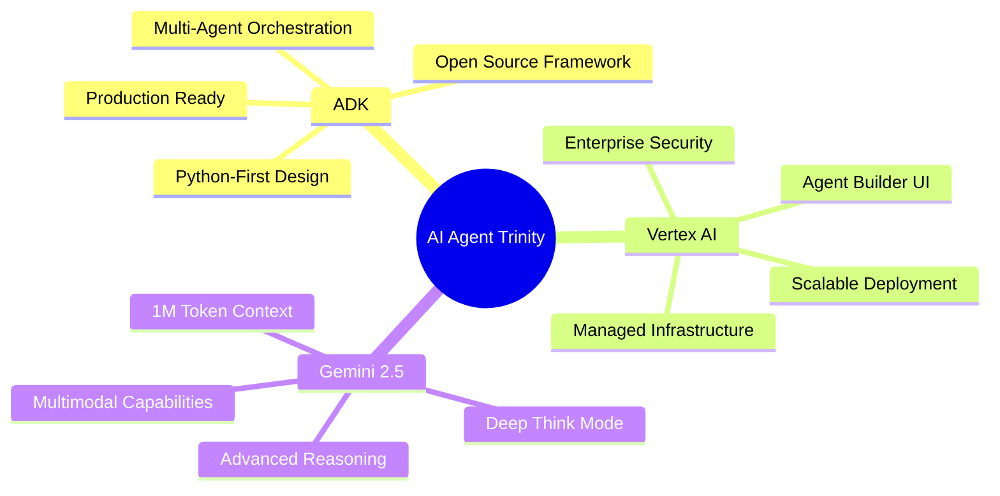
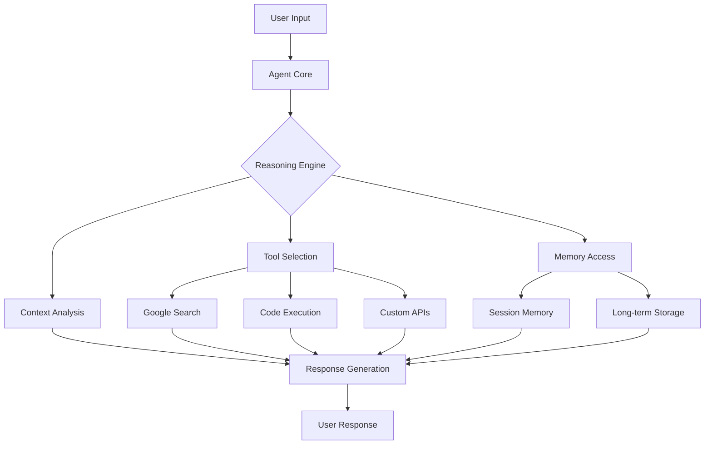
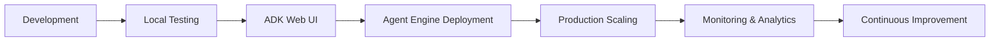

# Developing Generative AI Agents using Google ADK and Vertex AI with Gemini 2.5 Models for the Impatient: From Novice to Practitioner in Record Time

## Introduction: The Agent Revolution is Upon Us

Picture this: It's 2 AM on a Sunday night, and Sarah, a startup founder, receives an urgent email from her biggest client about a critical system failure. Instead of frantically waking up her entire engineering team, she simply sends a message to her AI agent. Within minutes, the agent has diagnosed the issue, coordinated with the development team's tools, deployed a fix, and sent a comprehensive report to the client. By Monday morning, what could have been a company-threatening crisis has been resolved seamlessly[^1].

This isn't science fiction—this is the reality that Google's Agent Development Kit (ADK), Vertex AI, and Gemini 2.5 models are making possible today.

## 1. Why This Matters More Than You Think

### The Netflix Moment for AI

Remember when Netflix shifted from mailing DVDs to streaming? That wasn't just a technology upgrade—it was a fundamental reimagining of how we consume entertainment. We're experiencing a similar inflection point with AI agents right now[^2].

Traditional AI interactions follow a simple pattern: you ask, it responds, conversation ends. But agents represent something fundamentally different—they're **proactive digital teammates** that can understand context, make decisions, use tools, and take actions on your behalf[^11].

**Pause and Reflect**: Think about your daily workflow. How many repetitive tasks could an intelligent agent handle for you while you focus on strategic thinking?

### The Economic Reality

According to research and industry studies, companies implementing AI automation systems are seeing significant benefits:

- Software developers using AI coding assistants complete tasks up to 55% faster[^1a]
- Generative AI could increase productivity by 0.1 to 0.6 percentage points annually[^1b]
- Customer service applications show substantial improvements in efficiency and satisfaction[^14]

But here's the kicker: most organizations are still treating AI like a fancy search engine rather than the autonomous workforce multiplier it can be[^2].

## 2. What Makes Google's Approach Revolutionary

### The Trinity of Power

Google's approach combines three game-changing technologies:




### ADK: The Framework That Changes Everything

The Agent Development Kit isn't just another Python library—it's the same framework powering agents inside Google products like Agentspace and Customer Engagement Suite[^1a][^2]. Think of it as the Django for AI agents: opinionated, batteries-included, and designed for rapid development.

**Pro Tip**: Unlike other agent frameworks that require extensive boilerplate, ADK lets you build production-ready agents in under 100 lines of code[^3].

### Vertex AI: Your AI Infrastructure, Managed

Vertex AI Agent Builder eliminates the complexity of managing AI infrastructure. It's like having a dedicated DevOps team for your AI agents, handling scaling, monitoring, and deployment automatically[^4].

### Gemini 2.5: The Brain Behind It All

Gemini 2.5 Pro isn't just another large language model—it's a **thinking model** with Deep Think Mode that reasons through problems before responding[^6]. Imagine having a team member who actually thinks through problems instead of just reacting.

## 3. Your First Agent in 5 Minutes

Let's dive straight into code. Here's how you build your first intelligent agent:

### Step 1: Setup (2 minutes)

```bash
# Create virtual environment
python -m venv agent_env
source agent_env/bin/activate  # On Windows: agent_env\Scripts\activate

# Install ADK
pip install google-adk

# Verify installation
adk --version
```


### Step 2: Your First Agent (3 minutes)

First, create the proper project structure:

```bash
# Create project structure
mkdir weather_assistant
cd weather_assistant
touch __init__.py
touch agent.py
touch .env
```

Create `__init__.py`:

```python
from . import agent
```

Create `agent.py`:

```python
from google.adk.agents import Agent
from google.adk.tools import google_search

# Define your first intelligent agent
weather_agent = Agent(
    name="weather_assistant",
    model="gemini-2.0-flash",
    instruction="You are a helpful weather assistant. Use Google Search to find current weather information and provide detailed, actionable advice.",
    description="Provides weather information and recommendations",
    tools=[google_search]
)

# Export as root_agent for ADK discovery
root_agent = weather_agent

if __name__ == "__main__":
    weather_agent.run()
```


### Step 3: Test It Out

```bash
# Navigate to parent directory (important!)
cd ..

# Start the development server
adk web
```

Open `http://localhost:8000` in your browser, select your agent, and ask: "What's the weather like in San Francisco, and should I bring an umbrella?"[^8]

**What Just Happened?**

You created an agent that:

1. Understands natural language queries
2. Knows when to search for current information
3. Combines multiple data points into actionable advice
4. Maintains conversation context

This isn't just a search wrapper—it's an intelligent assistant that reasons about information and provides contextual responses[^7].

## 4. The Anatomy of Intelligence

### Understanding Agent Components




### Example 2: The Multi-Tool Agent

Let's build something more sophisticated—an agent that can search the web, execute code, and remember previous conversations:

```python
import datetime
from zoneinfo import ZoneInfo
from google.adk.agents import Agent
from google.adk.tools import google_search
from google.adk.code_executors import BuiltInCodeExecutor

def get_current_time(timezone: str = "UTC") -> str:
    """Get current time in specified timezone."""
    try:
        tz = ZoneInfo(timezone)
        current_time = datetime.datetime.now(tz)
        return f"Current time in {timezone}: {current_time.strftime('%Y-%m-%d %H:%M:%S %Z')}"
    except:
        return f"Invalid timezone: {timezone}"

# Create a more sophisticated agent
multi_tool_agent = Agent(
    name="research_assistant",
    model="gemini-2.5-pro-preview-06-05",  # Using the more powerful model
    instruction="""You are a brilliant research assistant with access to web search, 
    code execution, and time functions. When users ask questions:
    
    1. Search for current information when needed
    2. Use code execution for calculations or data analysis
    3. Provide comprehensive, well-structured responses
    4. Remember context from previous conversations""",
    
    description="Advanced research assistant with search and timing capabilities",
    tools=[google_search, get_current_time]
)

# Separate code execution agent (due to ADK built-in tool limitations)
code_agent = LlmAgent(
    name="code_agent",
    model="gemini-2.5-pro-preview-06-05",
    instruction="You are a code execution specialist. Execute Python code for calculations and data analysis.",
    description="Code execution and mathematical analysis specialist", 
    code_executor=[BuiltInCodeExecutor]
)
```

**Test this agent with**: "Research the latest developments in quantum computing, calculate the potential market size growth rate, and remind me to follow up on this next week."

> **Important**: Each agent can only use one built-in tool. To use both search and code execution, create separate agents and coordinate them using `agent_tool.AgentTool()` pattern.

### The Magic of Advanced Reasoning

Gemini 2.5 models offer enhanced thinking capabilities when configured appropriately. Models like `gemini-2.5-flash-preview-05-20` support adaptive thinking, which allows the model to pause and consider multiple possibilities before responding[^6].

**Example**: Ask your agent a complex question like "Should I invest in renewable energy stocks given the current political climate?" Watch how it considers multiple angles before responding.

**Note**: Thinking capabilities vary by model version and may require specific configuration.

## 5. Multi-Agent Orchestration: Building Your AI Team

### The Restaurant Analogy

Think of multi-agent systems like a high-end restaurant kitchen. You wouldn't want one chef trying to handle appetizers, main courses, desserts, and drinks simultaneously. Instead, you have specialized stations working in coordination[^15].

```python
from google.adk.agents import LlmAgent, BaseAgent
import datetime

# Specialized agents for different tasks
greeter_agent = LlmAgent(
    name="customer_greeter",
    model="gemini-2.0-flash",
    instruction="Warmly welcome users and understand their needs. Be friendly and professional.",
    description="Handles initial customer interactions"
)

research_agent = LlmAgent(
    name="researcher", 
    model="gemini-2.5-pro-preview-06-05",
    instruction="Conduct thorough research using available tools. Provide detailed, accurate information.",
    description="Handles complex research tasks",
    tools=[google_search]
)

# Custom task execution agent
class TaskExecutor(BaseAgent):
    def __init__(self):
        super().__init__(name="task_executor")
    
    async def handle_request(self, request):
        return {
            "response": f"Executing task: {request}",
            "status": "completed",
            "timestamp": datetime.datetime.now().isoformat()
        }

task_agent = TaskExecutor()

# Coordinator that manages the team
coordinator = LlmAgent(
    name="team_coordinator",
    model="gemini-2.5-pro-preview-06-05",
    instruction="""You coordinate a team of specialists:
    - customer_greeter: handles welcomes and initial interactions
    - researcher: conducts detailed research and analysis  
    - task_executor: handles action items and task completion
    
    Route requests to the appropriate specialist and synthesize their responses.""",
    description="Coordinates team of specialized agents",
    sub_agents=[greeter_agent, research_agent, task_agent]
)
```


### Example 3: The Travel Planning Team

Let's build a practical multi-agent system for travel planning:

```python
from google.adk.agents import LlmAgent
from google.adk.tools import google_search

# Flight specialist
flight_agent = LlmAgent(
    name="flight_specialist",
    model="gemini-2.0-flash",
    instruction="""You specialize in flight research and booking assistance.
    Search for flight options, compare prices, and provide recommendations
    based on user preferences for dates, budget, and travel class.""",
    tools=[google_search]
)

# Hotel specialist  
hotel_agent = LlmAgent(
    name="hotel_specialist", 
    model="gemini-2.0-flash",
    instruction="""You specialize in accommodation research.
    Find hotels, compare amenities, locations, and prices.
    Consider user preferences for location, budget, and hotel type.""",
    tools=[google_search]
)

# Activity specialist
activity_agent = LlmAgent(
    name="activity_specialist",
    model="gemini-2.0-flash", 
    instruction="""You specialize in destination activities and attractions.
    Research local attractions, restaurants, events, and experiences
    based on traveler interests and travel dates.""",
    tools=[google_search]
)

# Master travel coordinator
travel_coordinator = LlmAgent(
    name="travel_planner",
    model="gemini-2.5-pro-preview-06-05",
    instruction="""You are a master travel coordinator managing specialists:
    - flight_specialist: handles flight research and recommendations
    - hotel_specialist: handles accommodation research  
    - activity_specialist: handles attractions and activities
    
    Coordinate their work to create comprehensive travel plans.
    Consider budget, preferences, and logistics when making recommendations.""",
    sub_agents=[flight_agent, hotel_agent, activity_agent]
)
```

**Test Query**: "Plan a 5-day trip to Tokyo for two people in March, budget \$3000, interested in technology, food, and traditional culture."

**Pro Tip**: Start with 2-3 specialized agents before scaling up. Each agent should have a clear, distinct purpose[^12].

## 6. Multimodal Magic: Beyond Text

### The Sensory Revolution

Gemini 2.5's multimodal capabilities mean your agents can process text, images, audio, and video simultaneously[^5]. It's like giving your agent human-like senses.

### Example 4: The Visual Analysis Agent

```python
from google.adk.agents import Agent
from google.adk.tools import google_search

visual_analyst = Agent(
    name="visual_analyst",
    model="gemini-2.5-pro-preview-06-05",
    instruction="""You are an expert visual analyst. When users share images:
    1. Analyze the visual content in detail
    2. Identify objects, people, scenes, text, or data visualizations
    3. Search for additional context when helpful
    4. Provide insights and answer questions about the image
    5. Suggest related information or next steps""",
    description="Analyzes images and provides detailed insights",
    tools=[google_search]
)
```

**Real-world use cases**:

- Upload a photo of a plant → Get care instructions
- Share a screenshot of an error → Get troubleshooting steps
- Send a chart image → Get data analysis and insights


### Example 5: The Code Review Agent

```python
code_reviewer = Agent(
    name="code_reviewer",
    model="gemini-2.5-pro-preview-06-05", 
    instruction="""You are a senior software engineer providing code reviews.
    When users share code:
    1. Analyze for bugs, security issues, and performance problems
    2. Check adherence to best practices and coding standards
    3. Suggest improvements and optimizations
    4. Search for relevant documentation or examples when helpful
    5. Provide educational explanations for your suggestions""",
    tools=[google_search]
)
```

Share a code snippet and get expert-level feedback instantly[^9].

## 7. Production Deployment: Making It Real

### The Vertex AI Advantage

Moving from prototype to production is where many AI projects fail. Vertex AI Agent Engine eliminates this gap by providing enterprise-grade deployment infrastructure[^16].

> **Important**: Agent Engine requires the `vertexai` SDK, not `google.cloud.aiplatform`. The agent must be wrapped with `reasoning_engines.AdkApp()` before deployment.




### Deployment Configuration

```python
# deployment.py
import vertexai
from vertexai import agent_engines  
from vertexai.preview import reasoning_engines

# Initialize Vertex AI
PROJECT_ID = "your-project-id"
LOCATION = "us-central1"  # Choose from supported regions
STAGING_BUCKET = "gs://your-staging-bucket"

vertexai.init(
    project=PROJECT_ID,
    location=LOCATION,
    staging_bucket=STAGING_BUCKET,
)

# Wrap your agent for deployment
app = reasoning_engines.AdkApp(
    agent=root_agent,  # Your ADK agent
    enable_tracing=True,  # Enable observability
)

# Test locally first
session = app.create_session(user_id="test_user")
for event in app.stream_query(
    user_id="test_user",
    session_id=session.id,
    message="Test query"
):
    print(event)

# Deploy to Agent Engine
remote_agent = agent_engines.create(
    agent_engine=root_agent,
    requirements=[
        "google-cloud-aiplatform[adk,agent_engines]>=1.88.0",
        "google-adk>=1.0.0"
    ]
)

print(f"Deployed agent: {remote_agent.resource_name}")
```


### Monitoring and Observability

Agent Engine provides built-in observability through Google Cloud's monitoring stack:

```python
# observability.py
import logging
from google.cloud import trace_v1

# Built-in tracing (enabled via enable_tracing=True in AdkApp)
# No additional setup required - traces appear automatically in Cloud Trace

# Custom metrics (optional)
def log_agent_metrics(response_time: float, success: bool):
    """Log custom metrics for agent performance"""
    logging.info(
        "Agent response",
        extra={
            "response_time_ms": response_time * 1000,
            "success": success,
            "agent_version": "1.0.0"
        }
    )

# Query deployed agent with monitoring
async def monitored_query(remote_agent, user_id: str, message: str):
    import time
    start_time = time.time()
    
    try:
        session = remote_agent.create_session(user_id=user_id)
        
        for event in remote_agent.stream_query(
            user_id=user_id,
            session_id=session["id"],  # Note: session["id"], not session.id
            message=message
        ):
            print(event)
        
        response_time = time.time() - start_time
        log_agent_metrics(response_time, True)
        
    except Exception as e:
        response_time = time.time() - start_time
        log_agent_metrics(response_time, False)
        logging.error(f"Agent query failed: {e}")
        raise
```

**Built-in monitoring includes:**

- Request/response tracing in Cloud Trace
- Error logging in Cloud Logging  
- Performance metrics in Cloud Monitoring
- Resource usage tracking


### Resource Management

```python
# cleanup.py
# Clean up deployed resources to avoid charges

# Delete the deployed agent
remote_agent.delete(force=True)  # force=True deletes child resources like sessions

# List and clean up sessions if needed
sessions = remote_agent.list_sessions(user_id="user_123")
for session_id in sessions.session_ids:
    remote_agent.delete_session(user_id="user_123", session_id=session_id)
```

### Production Checklist

Before deploying to production, ensure:

- ✅ **Authentication**: Service account has proper IAM roles
- ✅ **Monitoring**: Tracing enabled (`enable_tracing=True`)
- ✅ **Security**: VPC-SC configured if required
- ✅ **Dependencies**: All requirements pinned to specific versions
- ✅ **Testing**: Agent tested locally with `AdkApp`
- ✅ **Regions**: Deployed in [supported regions](https://cloud.google.com/vertex-ai/generative-ai/docs/agent-engine/overview#supported-regions)
- ✅ **Quotas**: Within [Agent Engine limits](https://cloud.google.com/vertex-ai/generative-ai/docs/agent-engine/overview#quota)

## References

[^1a]: https://github.blog/2022-09-07-research-quantifying-github-copilots-impact-on-developer-productivity-and-happiness/

[^1b]: https://www.mckinsey.com/capabilities/mckinsey-digital/our-insights/the-economic-potential-of-generative-ai-the-next-productivity-frontier

[^2]: https://google.github.io/adk-docs/

[^3]: https://cloud.google.com/products/agent-builder

[^4]: https://cloud.google.com/vertex-ai/generative-ai/docs/agent-builder/overview

[^5]: https://www.thecommerceshop.com/blog/everything-you-need-to-know-about-the-latest-gemini-2-5-pro/

[^6]: https://blog.google/technology/google-deepmind/gemini-model-thinking-updates-march-2025/

[^7]: https://google.github.io/adk-docs/tutorials/

[^8]: https://google.github.io/adk-docs/get-started/quickstart/

[^9]: https://github.com/google/adk-python

[^10]: https://hackmd.io/@Ibi/S1eddH53tyl

[^11]: https://valanor.co/design-patterns-for-ai-agents/

[^12]: https://docs.databricks.com/aws/en/generative-ai/guide/agent-system-design-patterns

[^14]: https://www.squareshift.co/post/best-practices-for-building-agent-apps-with-vertex-ai

[^15]: https://www.datacamp.com/tutorial/agent-development-kit-adk

[^16]: https://cloud.google.com/vertex-ai/generative-ai/docs/agent-engine/deploy

[^17]: https://platform.relativity.com/RelativityOne/Content/Background_processing/Best_practices_for_agents.htm

[^18]: https://www.anthropic.com/engineering/building-effective-agents

---

*Ready to build your first agent? Set a timer, open your code editor, and let's make some AI magic happen. The revolution starts with a single line of code: `from google.adk.agents import Agent`*


