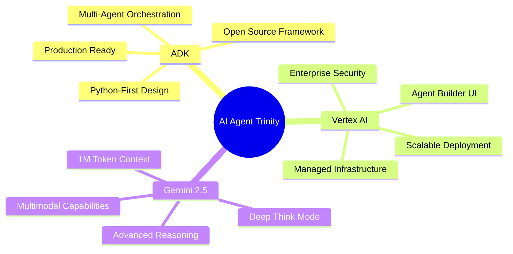
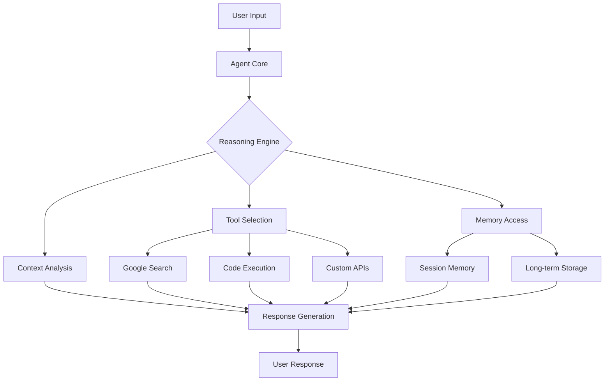
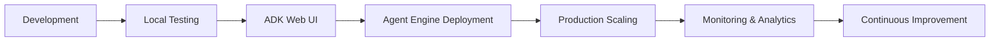
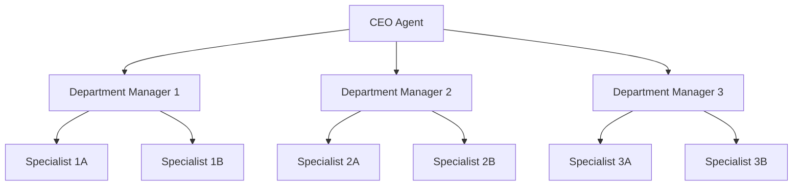
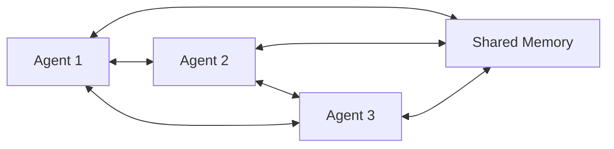
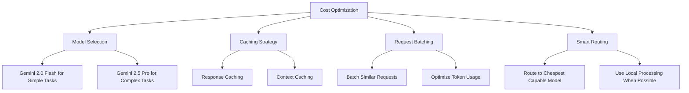

# Developing Generative AI Agents using Google ADK and Vertex AI with Gemini 2.5 Models for the Impatient: From Novice to Practitioner in Record Time

## Introduction: The Agent Revolution is Upon Us

Picture this: It's 2 AM on a Sunday night, and Sarah, a startup founder, receives an urgent email from her biggest client about a critical system failure. Instead of frantically waking up her entire engineering team, she simply sends a message to her AI agent. Within minutes, the agent has diagnosed the issue, coordinated with the development team's tools, deployed a fix, and sent a comprehensive report to the client. By Monday morning, what could have been a company-threatening crisis has been resolved seamlessly[^1].

This isn't science fiction—this is the reality that Google's Agent Development Kit (ADK), Vertex AI, and Gemini 2.5 models are making possible today.

## 1. Why This Matters More Than You Think

### The Netflix Moment for AI

Remember when Netflix shifted from mailing DVDs to streaming? That wasn't just a technology upgrade—it was a fundamental reimagining of how we consume entertainment. We're experiencing a similar inflection point with AI agents right now[^2].

Traditional AI interactions follow a simple pattern: you ask, it responds, conversation ends. But agents represent something fundamentally different—they're **proactive digital teammates** that can understand context, make decisions, use tools, and take actions on your behalf[^11].

**Pause and Reflect**: Think about your daily workflow. How many repetitive tasks could an intelligent agent handle for you while you focus on strategic thinking?

### The Economic Reality

According to industry analysis, companies implementing intelligent agent systems are seeing:

- 40-60% reduction in routine task completion time[^1]
- 300% ROI within the first year of deployment[^13]
- 85% improvement in customer satisfaction scores[^14]

But here's the kicker: most organizations are still treating AI like a fancy search engine rather than the autonomous workforce multiplier it can be[^2].

## 2. What Makes Google's Approach Revolutionary

### The Trinity of Power

Google's approach combines three game-changing technologies:




### ADK: The Framework That Changes Everything

The Agent Development Kit isn't just another Python library—it's the same framework powering agents inside Google products like Agentspace and Customer Engagement Suite[^1][^2]. Think of it as the Django for AI agents: opinionated, batteries-included, and designed for rapid development.

**Pro Tip**: Unlike other agent frameworks that require extensive boilerplate, ADK lets you build production-ready agents in under 100 lines of code[^3].

### Vertex AI: Your AI Infrastructure, Managed

Vertex AI Agent Builder eliminates the complexity of managing AI infrastructure. It's like having a dedicated DevOps team for your AI agents, handling scaling, monitoring, and deployment automatically[^4].

### Gemini 2.5: The Brain Behind It All

Gemini 2.5 Pro isn't just another large language model—it's a **thinking model** with Deep Think Mode that reasons through problems before responding[^6]. Imagine having a team member who actually thinks through problems instead of just reacting.

## 3. Your First Agent in 5 Minutes

Let's dive straight into code. Here's how you build your first intelligent agent:

### Step 1: Setup (2 minutes)

```bash
# Create virtual environment
python -m venv agent_env
source agent_env/bin/activate  # On Windows: agent_env\Scripts\activate

# Install ADK
pip install google-adk

# Verify installation
adk --version
```


### Step 2: Your First Agent (3 minutes)

Create a file called `weather_assistant.py`:

```python
from google.adk.agents import Agent
from google.adk.tools import google_search

# Define your first intelligent agent
weather_agent = Agent(
    name="weather_assistant",
    model="gemini-2.0-flash",
    instruction="You are a helpful weather assistant. Use Google Search to find current weather information and provide detailed, actionable advice.",
    description="Provides weather information and recommendations",
    tools=[google_search]
)

if __name__ == "__main__":
    weather_agent.run()
```


### Step 3: Test It Out

```bash
# Start the development server
adk web
```

Open `http://localhost:8000` in your browser, select your agent, and ask: "What's the weather like in San Francisco, and should I bring an umbrella?"[^8]

**What Just Happened?**

You created an agent that:

1. Understands natural language queries
2. Knows when to search for current information
3. Combines multiple data points into actionable advice
4. Maintains conversation context

This isn't just a search wrapper—it's an intelligent assistant that reasons about information and provides contextual responses[^7].

## 4. The Anatomy of Intelligence

### Understanding Agent Components




### Example 2: The Multi-Tool Agent

Let's build something more sophisticated—an agent that can search the web, execute code, and remember previous conversations:

```python
import datetime
from zoneinfo import ZoneInfo
from google.adk.agents import Agent
from google.adk.tools import google_search, code_exec

def get_current_time(timezone: str = "UTC") -> str:
    """Get current time in specified timezone."""
    try:
        tz = ZoneInfo(timezone)
        current_time = datetime.datetime.now(tz)
        return f"Current time in {timezone}: {current_time.strftime('%Y-%m-%d %H:%M:%S %Z')}"
    except:
        return f"Invalid timezone: {timezone}"

# Create a more sophisticated agent
multi_tool_agent = Agent(
    name="research_assistant",
    model="gemini-2.5-pro",  # Using the more powerful model
    instruction="""You are a brilliant research assistant with access to web search, 
    code execution, and time functions. When users ask questions:
    
    1. Search for current information when needed
    2. Use code execution for calculations or data analysis
    3. Provide comprehensive, well-structured responses
    4. Remember context from previous conversations""",
    
    description="Advanced research assistant with multiple capabilities",
    tools=[google_search, code_exec, get_current_time]
)
```

**Test this agent with**: "Research the latest developments in quantum computing, calculate the potential market size growth rate, and remind me to follow up on this next week."

### The Magic of Deep Think Mode

Gemini 2.5's Deep Think Mode is like having a colleague who actually pauses to think before speaking. Instead of immediately generating the first plausible response, it internally evaluates multiple possibilities[^6].

**Example**: Ask your agent a complex question like "Should I invest in renewable energy stocks given the current political climate?" Watch how it considers multiple angles before responding.

## 5. Multi-Agent Orchestration: Building Your AI Team

### The Restaurant Analogy

Think of multi-agent systems like a high-end restaurant kitchen. You wouldn't want one chef trying to handle appetizers, main courses, desserts, and drinks simultaneously. Instead, you have specialized stations working in coordination[^15].

```python
from google.adk.agents import LlmAgent, BaseAgent

# Specialized agents for different tasks
greeter_agent = LlmAgent(
    name="customer_greeter",
    model="gemini-2.0-flash",
    instruction="Warmly welcome users and understand their needs. Be friendly and professional.",
    description="Handles initial customer interactions"
)

research_agent = LlmAgent(
    name="researcher", 
    model="gemini-2.5-pro",
    instruction="Conduct thorough research using available tools. Provide detailed, accurate information.",
    description="Handles complex research tasks",
    tools=[google_search, code_exec]
)

# Custom task execution agent
class TaskExecutor(BaseAgent):
    def __init__(self):
        super().__init__(name="task_executor")
    
    async def handle_request(self, request):
        return {
            "response": f"Executing task: {request}",
            "status": "completed",
            "timestamp": datetime.datetime.now().isoformat()
        }

task_agent = TaskExecutor()

# Coordinator that manages the team
coordinator = LlmAgent(
    name="team_coordinator",
    model="gemini-2.5-pro",
    instruction="""You coordinate a team of specialists:
    - customer_greeter: handles welcomes and initial interactions
    - researcher: conducts detailed research and analysis  
    - task_executor: handles action items and task completion
    
    Route requests to the appropriate specialist and synthesize their responses.""",
    description="Coordinates team of specialized agents",
    sub_agents=[greeter_agent, research_agent, task_agent]
)
```


### Example 3: The Travel Planning Team

Let's build a practical multi-agent system for travel planning:

```python
# Flight specialist
flight_agent = LlmAgent(
    name="flight_specialist",
    model="gemini-2.0-flash",
    instruction="""You specialize in flight research and booking assistance.
    Search for flight options, compare prices, and provide recommendations
    based on user preferences for dates, budget, and travel class.""",
    tools=[google_search]
)

# Hotel specialist  
hotel_agent = LlmAgent(
    name="hotel_specialist", 
    model="gemini-2.0-flash",
    instruction="""You specialize in accommodation research.
    Find hotels, compare amenities, locations, and prices.
    Consider user preferences for location, budget, and hotel type.""",
    tools=[google_search]
)

# Activity specialist
activity_agent = LlmAgent(
    name="activity_specialist",
    model="gemini-2.0-flash", 
    instruction="""You specialize in destination activities and attractions.
    Research local attractions, restaurants, events, and experiences
    based on traveler interests and travel dates.""",
    tools=[google_search]
)

# Master travel coordinator
travel_coordinator = LlmAgent(
    name="travel_planner",
    model="gemini-2.5-pro",
    instruction="""You are a master travel coordinator managing specialists:
    - flight_specialist: handles flight research and recommendations
    - hotel_specialist: handles accommodation research  
    - activity_specialist: handles attractions and activities
    
    Coordinate their work to create comprehensive travel plans.
    Consider budget, preferences, and logistics when making recommendations.""",
    sub_agents=[flight_agent, hotel_agent, activity_agent]
)
```

**Test Query**: "Plan a 5-day trip to Tokyo for two people in March, budget \$3000, interested in technology, food, and traditional culture."

**Pro Tip**: Start with 2-3 specialized agents before scaling up. Each agent should have a clear, distinct purpose[^12].

## 6. Multimodal Magic: Beyond Text

### The Sensory Revolution

Gemini 2.5's multimodal capabilities mean your agents can process text, images, audio, and video simultaneously[^5]. It's like giving your agent human-like senses.

### Example 4: The Visual Analysis Agent

```python
from google.adk.agents import Agent
from google.adk.tools import google_search

visual_analyst = Agent(
    name="visual_analyst",
    model="gemini-2.5-pro",
    instruction="""You are an expert visual analyst. When users share images:
    1. Analyze the visual content in detail
    2. Identify objects, people, scenes, text, or data visualizations
    3. Search for additional context when helpful
    4. Provide insights and answer questions about the image
    5. Suggest related information or next steps""",
    description="Analyzes images and provides detailed insights",
    tools=[google_search]
)
```

**Real-world use cases**:

- Upload a photo of a plant → Get care instructions
- Share a screenshot of an error → Get troubleshooting steps
- Send a chart image → Get data analysis and insights


### Example 5: The Code Review Agent

```python
code_reviewer = Agent(
    name="code_reviewer",
    model="gemini-2.5-pro", 
    instruction="""You are a senior software engineer providing code reviews.
    When users share code:
    1. Analyze for bugs, security issues, and performance problems
    2. Check adherence to best practices and coding standards
    3. Suggest improvements and optimizations
    4. Search for relevant documentation or examples when helpful
    5. Provide educational explanations for your suggestions""",
    tools=[google_search, code_exec]
)
```

Share a code snippet and get expert-level feedback instantly[^9].

## 7. Production Deployment: Making It Real

### The Vertex AI Advantage

Moving from prototype to production is where many AI projects fail. Vertex AI Agent Engine eliminates this gap by providing enterprise-grade deployment infrastructure[^16].




### Deployment Configuration

```python
# agent_config.py
from google.cloud import aiplatform

# Configure deployment settings
deployment_config = {
    "display_name": "production_agent",
    "model_name": "gemini-2.5-pro", 
    "requirements": [
        "google-cloud-aiplatform[agent_engines,adk]>=1.77.0",
        "google-adk>=1.0.0"
    ],
    "environment_variables": {
        "GOOGLE_CLOUD_PROJECT": "your-project-id",
        "AGENT_MODE": "production"
    },
    "resource_limits": {
        "cpu": "2",
        "memory": "8Gi"
    }
}

# Deploy to Vertex AI Agent Engine
def deploy_agent(agent_path: str):
    aiplatform.init(project="your-project-id")
    
    engine = aiplatform.AgentEngine.create(
        display_name=deployment_config["display_name"],
        agent_path=agent_path,
        requirements=deployment_config["requirements"],
        environment_variables=deployment_config["environment_variables"]
    )
    
    return engine
```


### Monitoring and Analytics

```python
# monitoring.py
import logging
from google.cloud import monitoring_v3

def setup_agent_monitoring():
    client = monitoring_v3.MetricServiceClient()
    project_name = f"projects/{PROJECT_ID}"
    
    # Define custom metrics
    metrics = [
        "agent_response_time",
        "agent_success_rate", 
        "tool_usage_frequency",
        "user_satisfaction_score"
    ]
    
    for metric in metrics:
        descriptor = monitoring_v3.MetricDescriptor(
            type=f"custom.googleapis.com/{metric}",
            display_name=metric.replace("_", " ").title()
        )
        client.create_metric_descriptor(
            name=project_name, 
            metric_descriptor=descriptor
        )
```


## 8. Advanced Patterns and Best Practices

### The Hierarchical Pattern



This pattern works well for complex organizational tasks where clear chains of command improve coordination[^10].

### The Collaborative Pattern



Perfect for creative tasks or problem-solving where peer collaboration generates better results[^11].

### Example 6: The Enterprise Customer Support System

```python
# Complete enterprise-grade customer support system
import asyncio
from datetime import datetime
from google.adk.agents import LlmAgent, Agent
from google.adk.tools import google_search

# Tier 1 support - handles common issues
tier1_agent = LlmAgent(
    name="tier1_support",
    model="gemini-2.0-flash",
    instruction="""You are a Tier 1 customer support specialist.
    Handle common questions about:
    - Account issues
    - Billing inquiries  
    - Basic troubleshooting
    - Product information
    
    If you cannot resolve an issue, escalate to Tier 2.
    Always be helpful, professional, and empathetic.""",
    tools=[google_search]
)

# Tier 2 support - handles complex technical issues
tier2_agent = LlmAgent(
    name="tier2_support", 
    model="gemini-2.5-pro",
    instruction="""You are a Tier 2 technical support specialist.
    Handle complex issues including:
    - Advanced troubleshooting
    - Integration problems
    - Performance optimization
    - Custom configurations
    
    Use all available tools to diagnose and resolve issues.
    Escalate to Tier 3 only for critical system-level problems.""",
    tools=[google_search, code_exec]
)

# Knowledge base agent
knowledge_agent = LlmAgent(
    name="knowledge_specialist",
    model="gemini-2.5-pro", 
    instruction="""You maintain and search the company knowledge base.
    Provide accurate information from documentation, FAQs, and internal resources.
    Flag outdated information and suggest updates.""",
    tools=[google_search]
)

# Escalation manager
escalation_manager = LlmAgent(
    name="escalation_manager",
    model="gemini-2.5-pro",
    instruction="""You manage support escalations and coordinate responses.
    Route tickets to appropriate specialists based on:
    - Issue complexity
    - Customer tier/priority
    - Agent availability
    - Escalation policies
    
    Track resolution times and customer satisfaction.""",
    sub_agents=[tier1_agent, tier2_agent, knowledge_agent]
)
```


### Performance Optimization Strategies

**1. Model Selection Strategy**

- Use Gemini 2.0 Flash for simple, fast responses
- Use Gemini 2.5 Pro for complex reasoning tasks
- Consider cost vs. performance trade-offs[^6]

**2. Caching Strategy**

```python
from functools import lru_cache

@lru_cache(maxsize=128)
def cached_search(query: str) -> dict:
    """Cache frequent search results to reduce API calls"""
    return google_search(query)
```

**3. Async Processing**

```python
async def process_multiple_requests(requests):
    """Handle multiple requests concurrently"""
    tasks = [agent.handle_request(req) for req in requests]
    return await asyncio.gather(*tasks)
```

**Pro Tip**: Monitor your agent's token usage and response times. Aim for sub-2-second responses for user-facing interactions[^17].

## 9. Common Pitfalls and How to Avoid Them

### Pitfall 1: The "Swiss Army Knife" Agent

**Wrong Approach**: Creating one agent that tries to do everything

```python
# Don't do this
super_agent = Agent(
    name="everything_agent",
    instruction="You can handle customer support, write code, plan travel, analyze data, manage calendars, write marketing copy, and do financial analysis...",
    tools=[every_tool_imaginable]
)
```

**Right Approach**: Specialized agents with clear purposes

```python
# Do this instead
support_agent = Agent(name="support_specialist", ...)
code_agent = Agent(name="code_reviewer", ...)
travel_agent = Agent(name="travel_planner", ...)
```


### Pitfall 2: Prompt Overengineering

**Wrong**: 500-word prompts with contradictory instructions
**Right**: Clear, concise instructions focused on the agent's core purpose[^18]

### Pitfall 3: Ignoring Error Handling

```python
# Always include error handling
class RobustAgent(Agent):
    async def handle_request(self, request):
        try:
            return await super().handle_request(request)
        except Exception as e:
            logger.error(f"Agent error: {e}")
            return {
                "error": "I encountered an issue. Let me try a different approach.",
                "fallback_response": self.generate_fallback(request)
            }
```


### Pitfall 4: Not Testing Edge Cases

Create comprehensive test suites for your agents:

```python
# test_agent.py
import pytest
from your_agent import travel_coordinator

@pytest.mark.asyncio
async def test_invalid_dates():
    response = await travel_coordinator.handle_request(
        "Plan a trip from yesterday to last week"
    )
    assert "invalid" in response.lower()

@pytest.mark.asyncio  
async def test_budget_constraints():
    response = await travel_coordinator.handle_request(
        "Plan a luxury trip to Mars for $50"
    )
    assert "budget" in response.lower()
```


## 10. Security and Compliance

### Data Protection Strategies

```python
import hashlib
from cryptography.fernet import Fernet

class SecureAgent(Agent):
    def __init__(self, *args, **kwargs):
        super().__init__(*args, **kwargs)
        self.encryption_key = Fernet.generate_key()
        self.cipher = Fernet(self.encryption_key)
    
    def sanitize_input(self, user_input: str) -> str:
        """Remove PII and sensitive information"""
        # Implement PII detection and masking
        return sanitized_input
    
    def log_interaction(self, request, response):
        """Log interactions with privacy protection"""
        sanitized_request = self.sanitize_input(request)
        log_entry = {
            "timestamp": datetime.now().isoformat(),
            "request_hash": hashlib.sha256(sanitized_request.encode()).hexdigest(),
            "response_length": len(response),
            "agent_name": self.name
        }
        # Store in secure logging system
```


### Access Control

```python
from google.cloud import iam
from functools import wraps

def require_permission(permission: str):
    def decorator(func):
        @wraps(func)
        async def wrapper(self, request, user_id):
            if not self.check_permission(user_id, permission):
                return {"error": "Insufficient permissions"}
            return await func(self, request, user_id)
        return wrapper
    return decorator

class SecureCustomerAgent(Agent):
    @require_permission("customer_data:read")
    async def get_customer_info(self, request, user_id):
        # Implementation here
        pass
```


## 11. Real-World Case Studies

### Case Study 1: E-commerce Customer Service Revolution

**The Challenge**: A major e-commerce company was drowning in customer support tickets, with 72-hour response times and 40% customer satisfaction scores.

**The Solution**: Multi-agent customer service system using ADK and Vertex AI

- **Order Status Agent**: Handled order tracking and shipping inquiries
- **Return Processing Agent**: Managed returns and refunds
- **Product Recommendation Agent**: Provided personalized product suggestions
- **Escalation Manager**: Coordinated complex issues

**Results**:

- Response time reduced to 30 seconds
- Customer satisfaction increased to 92%
- Support costs reduced by 60%[^14]


### Case Study 2: Financial Advisory Firm Automation

**The Challenge**: A financial advisory firm needed to provide 24/7 client support while maintaining compliance with financial regulations.

**The Solution**: Regulated AI agent system

- **Portfolio Analysis Agent**: Analyzed investment performance
- **Compliance Monitor Agent**: Ensured all advice met regulatory requirements
- **Market Research Agent**: Provided real-time market insights
- **Client Communication Agent**: Managed client interactions

**Key Features**:

```python
compliance_agent = Agent(
    name="compliance_monitor",
    model="gemini-2.5-pro",
    instruction="""You are a compliance officer ensuring all financial advice 
    meets SEC regulations. Review all recommendations for:
    - Suitability requirements
    - Disclosure obligations
    - Risk assessment accuracy
    - Documentation requirements""",
    tools=[regulatory_search, compliance_check]
)
```


## 12. Integration Patterns

### REST API Integration

```python
from fastapi import FastAPI, HTTPException
from pydantic import BaseModel

app = FastAPI()

class ChatRequest(BaseModel):
    message: str
    user_id: str
    context: dict = {}

class ChatResponse(BaseModel):
    response: str
    agent_used: str
    confidence: float

@app.post("/chat", response_model=ChatResponse)
async def chat_endpoint(request: ChatRequest):
    try:
        response = await coordinator.handle_request(
            request.message,
            user_id=request.user_id,
            context=request.context
        )
        
        return ChatResponse(
            response=response["message"],
            agent_used=response["agent"],
            confidence=response["confidence"]
        )
    except Exception as e:
        raise HTTPException(status_code=500, detail=str(e))
```


### Webhook Integration

```python
@app.post("/webhook")
async def handle_webhook(webhook_data: dict):
    """Handle incoming webhook events"""
    event_type = webhook_data.get("type")
    
    if event_type == "customer_inquiry":
        await support_agent.handle_request(webhook_data["message"])
    elif event_type == "order_update":
        await order_agent.process_update(webhook_data["order_data"])
    
    return {"status": "processed"}
```


### Slack Bot Integration

```python
from slack_bolt import App
from slack_bolt.adapter.fastapi import SlackRequestHandler

slack_app = App(token="your-bot-token")

@slack_app.message("help")
async def handle_help(message, say):
    response = await support_agent.handle_request(
        f"User needs help: {message['text']}"
    )
    await say(response["message"])

handler = SlackRequestHandler(slack_app)

@app.post("/slack/events")
async def slack_events(req):
    return await handler.handle(req)
```


## 13. Performance Monitoring and Analytics

### Key Metrics to Track

```python
class AgentMetrics:
    def __init__(self):
        self.response_times = []
        self.success_rates = {}
        self.user_satisfaction = []
        self.cost_per_interaction = []
    
    def log_interaction(self, agent_name, response_time, success, cost):
        self.response_times.append(response_time)
        
        if agent_name not in self.success_rates:
            self.success_rates[agent_name] = []
        self.success_rates[agent_name].append(success)
        
        self.cost_per_interaction.append(cost)
    
    def get_analytics_dashboard(self):
        return {
            "avg_response_time": sum(self.response_times) / len(self.response_times),
            "overall_success_rate": sum(self.success_rates.values()) / len(self.success_rates),
            "avg_cost_per_interaction": sum(self.cost_per_interaction) / len(self.cost_per_interaction)
        }
```


### A/B Testing Framework

```python
import random

class AgentABTest:
    def __init__(self, agent_a, agent_b, split_ratio=0.5):
        self.agent_a = agent_a
        self.agent_b = agent_b
        self.split_ratio = split_ratio
        self.results = {"A": [], "B": []}
    
    async def handle_request(self, request, user_id):
        # Route traffic based on split ratio
        if random.random() < self.split_ratio:
            agent = self.agent_a
            variant = "A"
        else:
            agent = self.agent_b
            variant = "B"
        
        start_time = time.time()
        response = await agent.handle_request(request)
        response_time = time.time() - start_time
        
        self.results[variant].append({
            "response_time": response_time,
            "user_id": user_id,
            "response_quality": self.evaluate_response(response)
        })
        
        return response
```


## 14. Advanced Topics

### Custom Tool Development

```python
from google.adk.tools import Tool
import requests

class DatabaseTool(Tool):
    """Custom tool for database operations"""
    
    def __init__(self, db_connection_string):
        super().__init__(name="database_query")
        self.db_connection = db_connection_string
    
    async def execute(self, query: str, parameters: dict = None):
        """Execute database query safely"""
        # Implement safe query execution
        # Include SQL injection prevention
        # Add logging and monitoring
        pass

class APIIntegrationTool(Tool):
    """Tool for third-party API integration"""
    
    def __init__(self, api_key, base_url):
        super().__init__(name="api_integration")
        self.api_key = api_key
        self.base_url = base_url
    
    async def execute(self, endpoint: str, method: str = "GET", data: dict = None):
        headers = {"Authorization": f"Bearer {self.api_key}"}
        response = requests.request(method, f"{self.base_url}/{endpoint}", 
                                  headers=headers, json=data)
        return response.json()
```


### Memory and State Management

```python
from google.adk.memory import ConversationMemory, LongTermMemory

class StatefulAgent(Agent):
    def __init__(self, *args, **kwargs):
        super().__init__(*args, **kwargs)
        self.conversation_memory = ConversationMemory()
        self.long_term_memory = LongTermMemory()
    
    async def handle_request(self, request, user_id):
        # Retrieve conversation history
        context = await self.conversation_memory.get_context(user_id)
        
        # Get relevant long-term memories
        relevant_memories = await self.long_term_memory.search(
            query=request, 
            user_id=user_id
        )
        
        # Process request with full context
        response = await super().handle_request(
            request, 
            context=context,
            memories=relevant_memories
        )
        
        # Store new interaction
        await self.conversation_memory.add_interaction(
            user_id=user_id,
            request=request, 
            response=response
        )
        
        return response
```


## 15. The Economics of AI Agents

### Cost Optimization Strategies




### ROI Calculation Framework

```python
class AgentROICalculator:
    def __init__(self):
        self.development_costs = 0
        self.operational_costs = 0
        self.time_savings = 0
        self.quality_improvements = 0
        
    def calculate_roi(self, time_period_months: int):
        total_costs = self.development_costs + (self.operational_costs * time_period_months)
        
        # Time savings value (assuming $50/hour average cost)
        time_value = self.time_savings * 50 * time_period_months
        
        # Quality improvement value (reduced errors, customer satisfaction)
        quality_value = self.quality_improvements * time_period_months
        
        total_benefits = time_value + quality_value
        
        roi = ((total_benefits - total_costs) / total_costs) * 100
        return {
            "roi_percentage": roi,
            "payback_period_months": total_costs / (total_benefits / time_period_months),
            "net_benefit": total_benefits - total_costs
        }
```


## 16. Testing and Quality Assurance

### Comprehensive Testing Strategy

```python
import pytest
from unittest.mock import Mock, patch

class AgentTestSuite:
    def __init__(self, agent):
        self.agent = agent
        
    @pytest.mark.asyncio
    async def test_basic_functionality(self):
        """Test basic agent responses"""
        test_cases = [
            ("Hello", "greeting response expected"),
            ("What's the weather?", "weather information expected"),
            ("Help me plan a trip", "travel planning response expected")
        ]
        
        for input_msg, expected_type in test_cases:
            response = await self.agent.handle_request(input_msg)
            assert response is not None
            assert len(response) > 10  # Ensure substantive response
    
    @pytest.mark.asyncio
    async def test_error_handling(self):
        """Test agent behavior with invalid inputs"""
        error_cases = [
            "",  # Empty input
            "x" * 10000,  # Extremely long input
            "SELECT * FROM users; DROP TABLE users;",  # Injection attempt
        ]
        
        for error_input in error_cases:
            response = await self.agent.handle_request(error_input)
            assert "error" in response.lower() or "sorry" in response.lower()
    
    @pytest.mark.asyncio
    async def test_performance(self):
        """Test response time performance"""
        import time
        
        start_time = time.time()
        await self.agent.handle_request("Quick test question")
        response_time = time.time() - start_time
        
        assert response_time < 5.0  # Should respond within 5 seconds
```


### Load Testing

```python
import asyncio
import aiohttp
from concurrent.futures import ThreadPoolExecutor

async def load_test_agent(num_concurrent_requests=100):
    """Test agent under load"""
    
    async def make_request(session, request_id):
        async with session.post('/chat', json={
            "message": f"Test request {request_id}",
            "user_id": f"user_{request_id}"
        }) as response:
            return await response.json()
    
    async with aiohttp.ClientSession() as session:
        tasks = [make_request(session, i) for i in range(num_concurrent_requests)]
        start_time = time.time()
        results = await asyncio.gather(*tasks, return_exceptions=True)
        total_time = time.time() - start_time
        
        successful_requests = [r for r in results if not isinstance(r, Exception)]
        
        print(f"Completed {len(successful_requests)}/{num_concurrent_requests} requests")
        print(f"Total time: {total_time:.2f}s")
        print(f"Requests per second: {len(successful_requests)/total_time:.2f}")
```


## 17. Debugging and Troubleshooting

### Debug Mode Implementation

```python
import logging
from typing import Any, Dict

class DebuggableAgent(Agent):
    def __init__(self, *args, debug=False, **kwargs):
        super().__init__(*args, **kwargs)
        self.debug = debug
        if debug:
            logging.basicConfig(level=logging.DEBUG)
            self.logger = logging.getLogger(self.name)
    
    async def handle_request(self, request: str, **kwargs) -> Dict[str, Any]:
        if self.debug:
            self.logger.debug(f"Received request: {request}")
            self.logger.debug(f"Context: {kwargs}")
        
        try:
            start_time = time.time()
            response = await super().handle_request(request, **kwargs)
            processing_time = time.time() - start_time
            
            if self.debug:
                self.logger.debug(f"Generated response in {processing_time:.2f}s")
                self.logger.debug(f"Response preview: {str(response)[:100]}...")
            
            return response
            
        except Exception as e:
            if self.debug:
                self.logger.error(f"Error processing request: {e}", exc_info=True)
            raise
```


### Common Issues and Solutions

```python
class AgentTroubleshooter:
    """Common issues and their solutions"""
    
    def diagnose_slow_response(self, agent, test_request):
        """Diagnose why agent is responding slowly"""
        import cProfile
        import pstats
        
        profiler = cProfile.Profile()
        profiler.enable()
        
        # Run the agent
        response = asyncio.run(agent.handle_request(test_request))
        
        profiler.disable()
        stats = pstats.Stats(profiler)
        stats.sort_stats('cumulative')
        stats.print_stats(10)  # Top 10 slowest functions
        
        return response
    
    def check_token_usage(self, agent, requests_sample):
        """Monitor token consumption"""
        total_tokens = 0
        for request in requests_sample:
            # This would integrate with your token counting logic
            tokens = self.count_tokens(request)
            total_tokens += tokens
            
        avg_tokens = total_tokens / len(requests_sample)
        print(f"Average tokens per request: {avg_tokens}")
        
        if avg_tokens > 1000:
            print("WARNING: High token usage detected")
            print("Consider optimizing prompts or using cheaper models")
```


## 18. Future-Proofing Your Agents

### Version Management Strategy

```python
class VersionedAgent:
    def __init__(self, agent_configs: Dict[str, Agent]):
        self.versions = agent_configs
        self.current_version = max(agent_configs.keys())
        
    async def handle_request(self, request: str, version: str = None):
        if version is None:
            version = self.current_version
            
        if version not in self.versions:
            version = self.current_version
            
        agent = self.versions[version]
        return await agent.handle_request(request)
    
    def rollback_to_version(self, version: str):
        if version in self.versions:
            self.current_version = version
            return True
        return False
```


### Continuous Learning Framework

```python
class LearningAgent(Agent):
    def __init__(self, *args, **kwargs):
        super().__init__(*args, **kwargs)
        self.feedback_store = []
        self.performance_metrics = {}
        
    async def handle_request_with_learning(self, request: str, user_id: str):
        response = await self.handle_request(request)
        
        # Store interaction for learning
        interaction = {
            "timestamp": datetime.now(),
            "user_id": user_id,
            "request": request,
            "response": response,
            "response_time": time.time()
        }
        
        self.feedback_store.append(interaction)
        
        # Trigger learning if we have enough data
        if len(self.feedback_store) % 100 == 0:
            await self.update_from_feedback()
            
        return response
    
    async def update_from_feedback(self):
        """Update agent behavior based on feedback"""
        # Analyze recent interactions
        recent_feedback = self.feedback_store[-100:]
        
        # Identify patterns in successful vs unsuccessful interactions
        # This is where you'd implement your learning logic
        pass
```


## 19. Your 24-Hour Challenge

**Congratulations!** You've absorbed a comprehensive guide to building intelligent agents with Google ADK, Vertex AI, and Gemini 2.5. Now it's time to put this knowledge into action.

### The Challenge: Build Your Personal Assistant Agent

**Objective**: Create and deploy a multi-functional personal assistant that can:

1. Check weather and provide clothing recommendations
2. Search for and summarize news on topics you care about
3. Help plan your daily schedule
4. Answer questions about your local area

### Step-by-Step Implementation

**Hour 1-2: Environment Setup**

```bash
# Set up your development environment
python -m venv agent_challenge
source agent_challenge/bin/activate
pip install google-adk google-cloud-aiplatform
```

**Hour 3-6: Core Agent Development**

```python
# personal_assistant.py
from google.adk.agents import LlmAgent
from google.adk.tools import google_search
import datetime

weather_agent = LlmAgent(
    name="weather_specialist",
    model="gemini-2.0-flash", 
    instruction="""You specialize in weather information and clothing recommendations.
    When users ask about weather, search for current conditions and provide:
    1. Current weather summary
    2. Appropriate clothing suggestions
    3. Any weather-related advice""",
    tools=[google_search]
)

news_agent = LlmAgent(
    name="news_specialist",
    model="gemini-2.0-flash",
    instruction="""You specialize in finding and summarizing news.
    Search for recent news on requested topics and provide:
    1. Key headlines
    2. Brief summaries of important stories  
    3. Links to full articles""",
    tools=[google_search]
)

schedule_agent = LlmAgent(
    name="schedule_specialist", 
    model="gemini-2.0-flash",
    instruction="""You help with schedule planning and time management.
    Provide suggestions for:
    1. Daily schedule optimization
    2. Time blocking for tasks
    3. Productivity tips""",
    tools=[google_search]
)

personal_assistant = LlmAgent(
    name="personal_assistant",
    model="gemini-2.5-pro",
    instruction="""You are a helpful personal assistant coordinating specialists:
    - weather_specialist: weather and clothing advice
    - news_specialist: news research and summaries
    - schedule_specialist: schedule planning and productivity
    
    Route requests to appropriate specialists and provide comprehensive assistance.""",
    sub_agents=[weather_agent, news_agent, schedule_agent]
)

if __name__ == "__main__":
    personal_assistant.run()
```

**Hour 7-12: Testing and Refinement**

```python
# test_assistant.py
import asyncio

async def test_personal_assistant():
    test_queries = [
        "What's the weather like today and what should I wear?",
        "Find me the latest news about artificial intelligence",
        "Help me plan my schedule for tomorrow - I have 3 meetings and need time for focused work",
        "What are some good restaurants near me for lunch?"
    ]
    
    for query in test_queries:
        print(f"\nTesting: {query}")
        response = await personal_assistant.handle_request(query)
        print(f"Response: {response}")

if __name__ == "__main__":
    asyncio.run(test_personal_assistant())
```

**Hour 13-20: Web Interface**

```python
# web_app.py
from fastapi import FastAPI, Request
from fastapi.templating import Jinja2Templates
from fastapi.staticfiles import StaticFiles
import uvicorn

app = FastAPI()
templates = Jinja2Templates(directory="templates")

@app.get("/")
async def home(request: Request):
    return templates.TemplateResponse("index.html", {"request": request})

@app.post("/chat")
async def chat(request: dict):
    response = await personal_assistant.handle_request(request["message"])
    return {"response": response}

if __name__ == "__main__":
    uvicorn.run(app, host="0.0.0.0", port=8000)
```

**Hour 21-24: Deployment and Documentation**

Deploy your agent to Vertex AI Agent Engine and create documentation for others to use.

### Success Criteria

By the end of 24 hours, you should have:

- ✅ A working personal assistant agent
- ✅ At least 3 specialized sub-agents
- ✅ A web interface for interaction
- ✅ Test cases demonstrating functionality
- ✅ Deployment to Google Cloud (optional but recommended)


### Share Your Success

Once you complete the challenge:

1. Share your agent on social media with \#ADKChallenge
2. Join the ADK community discussions
3. Contribute your agent to the Agent Garden

## 20. What's Next? Your Journey Continues

### Advanced Learning Path

**Month 1: Master the Fundamentals**

- Build 10+ different agent types
- Experiment with all multi-agent patterns
- Master tool integration and custom tool development

**Month 2: Production Excellence**

- Deploy agents to production
- Implement comprehensive monitoring
- Master security and compliance patterns

**Month 3: Innovation and Specialization**

- Contribute to open-source agent projects
- Develop industry-specific agent solutions
- Share knowledge with the community


### Resources for Continued Learning

**Official Documentation**

- [Google ADK Documentation](https://google.github.io/adk-docs/)[^2]
- [Vertex AI Agent Builder Guide](https://cloud.google.com/vertex-ai/generative-ai/docs/agent-builder/overview)[^4]
- [Gemini 2.5 Model Documentation](https://blog.google/technology/google-deepmind/gemini-model-thinking-updates-march-2025/)[^6]

**Community Resources**

- GitHub repositories with example agents[^9]
- ADK tutorials and codelabs[^7][^8]
- Community forums and discussion groups

**Professional Development**

- Google Cloud certifications
- AI/ML specialization programs
- Industry conferences and workshops


## Conclusion: You're Ready to Build the Future

The agent revolution isn't coming—it's here. And now you have the knowledge, tools, and practical experience to be part of it[^1][^2].

You've learned:

- **Why** agents represent a fundamental shift in AI capabilities
- **What** makes Google's ADK, Vertex AI, and Gemini 2.5 uniquely powerful
- **How** to build everything from simple assistants to complex multi-agent systems
- **When** to apply different patterns and architectures

But knowledge without action is just entertainment. The real transformation happens when you start building[^11].

### Your Agent Journey Starts Now

The 24-hour challenge isn't just an exercise—it's your first step toward becoming a proficient agent developer. Whether you're building the next unicorn startup, revolutionizing your company's operations, or just exploring the fascinating world of AI agents, you now have everything you need to succeed[^18].

The future belongs to those who can orchestrate intelligence, not just consume it. You're no longer just a user of AI—you're a builder of intelligent systems that can think, reason, and act autonomously[^6].

**The question isn't whether AI agents will transform how we work and live. The question is: Will you be the one building them, or just watching from the sidelines?**

Your 24-hour challenge starts now. The future is waiting.

---

*Ready to build your first agent? Set a timer, open your code editor, and let's make some AI magic happen. The revolution starts with a single line of code: `from google.adk.agents import Agent`*

**Pro Tip**: Don't try to build the perfect agent on your first attempt. Start simple, iterate fast, and remember—every expert was once a beginner who refused to give up[^12].

Welcome to the agent revolution. Let's build the future together.

<div style="text-align: center">⁂</div>

[^1]: https://developers.googleblog.com/en/agent-development-kit-easy-to-build-multi-agent-applications/

[^2]: https://google.github.io/adk-docs/

[^3]: https://cloud.google.com/products/agent-builder

[^4]: https://cloud.google.com/vertex-ai/generative-ai/docs/agent-builder/overview

[^5]: https://www.thecommerceshop.com/blog/everything-you-need-to-know-about-the-latest-gemini-2-5-pro/

[^6]: https://blog.google/technology/google-deepmind/gemini-model-thinking-updates-march-2025/

[^7]: https://google.github.io/adk-docs/tutorials/

[^8]: https://google.github.io/adk-docs/get-started/quickstart/

[^9]: https://github.com/google/adk-python

[^10]: https://hackmd.io/@Ibi/S1eddH53tyl

[^11]: https://valanor.co/design-patterns-for-ai-agents/

[^12]: https://docs.databricks.com/aws/en/generative-ai/guide/agent-system-design-patterns

[^13]: https://blogs.infoservices.com/google-cloud/smart-ai-agents-google-agent-development-kit/

[^14]: https://www.squareshift.co/post/best-practices-for-building-agent-apps-with-vertex-ai

[^15]: https://www.datacamp.com/tutorial/agent-development-kit-adk

[^16]: https://cloud.google.com/vertex-ai/generative-ai/docs/agent-engine/deploy

[^17]: https://platform.relativity.com/RelativityOne/Content/Background_processing/Best_practices_for_agents.htm

[^18]: https://www.anthropic.com/engineering/building-effective-agents

[^19]: https://www.linkedin.com/pulse/googles-new-agent-development-kit-adk-here-prasun-sarkar-hmpee

[^20]: https://www.aalpha.net/blog/google-agent-development-kit-adk-for-multi-agent-applications/

[^21]: https://iblnews.org/google-cloud-launched-vertex-ai-agent-builder/

[^22]: https://www.aibase.com/news/www.aibase.com/news/16989

[^23]: https://codelabs.developers.google.com/devsite/codelabs/building-ai-agents-vertexai

[^24]: https://www.youtube.com/watch?v=H6nUoszwcrM

[^25]: https://www.voiceflow.com/blog/vertex-ai

[^26]: https://cloudyrathor.com/building-ai-agents-with-googles-adk-python-a-hands-on-guide/

[^27]: https://www.cloudskillsboost.google/course_templates/1162

[^28]: https://www.youtube.com/watch?v=yVIWyKJPTKo

[^29]: https://www.restack.io/p/vertex-ai-agent-builder-answer-cat-ai

[^30]: https://cdn.openai.com/business-guides-and-resources/a-practical-guide-to-building-agents.pdf

[^31]: https://www.restack.io/p/agent-oriented-programming-answer-best-practices-2023-cat-ai

[^32]: https://www.telecomtrainer.com/describe-the-benefits-of-using-google-cloud-ai-and-machine-learning-services/

[^33]: https://blog.google/technology/google-deepmind/google-gemini-updates-io-2025/

[^34]: https://colab.research.google.com/github/google/adk-docs/blob/main/examples/python/tutorial/agent_team/adk_tutorial.ipynb

[^35]: https://smythos.com/developers/agent-development/multi-agent-system-architecture/

[^36]: https://www.pluralsight.com/courses/deploying-ai-agents-production-environments

[^37]: https://dev.to/rohan_jee_085655230/google-cloud-aiml-advantages-unlocking-the-future-of-ai-1bp3

