# Google Agent Development Kit (ADK) - A Comprehensive Guide to Building Intelligent AI Agents

### Chapter 1: Introduction - Why ADK Matters in June 2025

### The Agent Revolution is Here (And You're About to Miss It)

Picture this: It's 3 AM, and Sarah, a startup CTO, is staring at her laptop screen with bloodshot eyes . Her company's customer service system is drowning under a flood of inquiries, her content team can't keep up with demand, and her developers are burning out trying to maintain increasingly complex AI integrations. Sound familiar?

This is the reality for thousands of businesses in 2025 - caught between the promise of AI and the complexity of implementation . While everyone talks about "AI transformation," most companies are stuck with monolithic, inflexible systems that break down when real complexity hits.

**Why does this happen?** Because we've been thinking about AI wrong.

Most businesses approach AI like it's a magic black box: throw in a query, get out an answer. But real business problems aren't solved by single AI calls - they require coordination, specialization, and intelligent workflows . That's where Google's Agent Development Kit (ADK) changes everything.

### What Makes ADK Different? The Orchestra Analogy

Think of traditional AI implementations like a solo pianist trying to perform a symphony . Sure, they might hit most of the notes, but you're missing the richness, coordination, and specialized expertise that makes a symphony truly powerful.

ADK transforms your AI from a solo act into a full orchestra, where:

- **Different agents** are like specialized musicians (violinists, cellists, conductors)
- **Tools** are like instruments that agents can pick up and use
- **Workflows** are like sheet music that coordinates the performance
- **The framework** is like the concert hall that makes it all possible

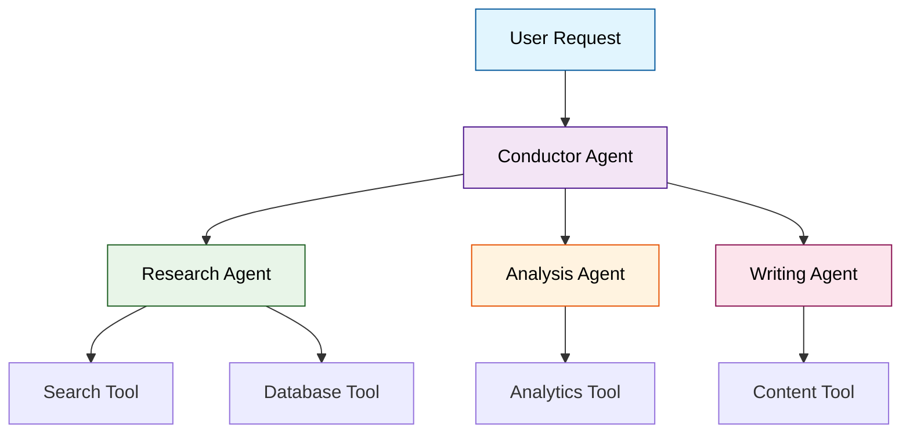
```mermaid
graph TD
    A[User Request] --> B[Conductor Agent]
    B --> C[Research Agent]
    B --> D[Analysis Agent]
    B --> E[Writing Agent]
    C --> F[Search Tool]
    C --> G[Database Tool]
    D --> H[Analytics Tool]
    E --> I[Content Tool]

    style A fill:#e1f5fe,stroke:#01579b,color:#000
    style B fill:#f3e5f5,stroke:#4a148c,color:#000
    style C fill:#e8f5e8,stroke:#1b5e20,color:#000
    style D fill:#fff3e0,stroke:#e65100,color:#000
    style E fill:#fce4ec,stroke:#880e4f,color:#000
```

### The \$2.7 Billion Opportunity

According to industry reports, the global AI agent market is exploding, projected to reach \$2.7 billion by 2028 . But here's the kicker: most businesses are still stuck in the "single AI call" mindset, missing out on the real value that comes from orchestrated agent systems.

**Real companies are already winning with agents:**

- Uber uses AI agents to summarize customer interactions and surface context for support representatives
- Toyota implemented an AI platform that reduced manual work by over 10,000 hours per year
- Renault Group uses enterprise-grade AI agents for code generation and development workflows

### Why Google Built ADK: Learning from Internal Success

Google didn't build ADK in a vacuum . It's the same framework powering agents within Google products like Agentspace and the Google Customer Engagement Suite. Google open-sourced ADK because they realized that the future belongs to companies that can orchestrate intelligent agents, not just use them in isolation.

**ADK's core philosophy:**

- **Model-agnostic**: Works with Gemini, GPT, Claude, or any LLM
- **Deployment-agnostic**: Run locally, on Google Cloud, or anywhere
- **Framework-compatible**: Integrates with LangChain, CrewAI, and other tools
- **Production-ready**: Built for real business applications, not just demos

### **Pause and Reflect** 🤔

Before we dive deeper, think about your current AI implementations:

1. Are you using single AI calls for complex business processes?
2. How much time do you spend on integration and coordination?
3. What would change if your AI could work like a specialized team?

### The Promise: From Chaos to Coordination

By the end of this article, you'll understand how to transform chaotic AI implementations into coordinated agent systems that actually solve business problems . You'll learn through real examples, starting simple and building complexity, until you can architect production-ready agent systems that scale.

**What you'll gain:**

- **Practical knowledge** you can apply immediately
- **Real examples** from customer service to content creation
- **Production patterns** that actually work in business
- **The confidence** to build sophisticated agent systems

### Pro Tip 💡

The biggest mistake new ADK developers make is thinking bigger means better. Start small, prove value, then scale. The most successful agent implementations begin with solving one specific problem really well.

## Chapter 2: The ADK Mindset - From Functions to Autonomous Teams

### The Overwhelmed CTO's Awakening

Meet David Chen, CTO of a mid-sized fintech startup. Three months ago, his team was drowning. Their AI-powered customer service system was a nightmare of if-else statements wrapped around GPT API calls. Every new feature required weeks of debugging, and the system broke whenever edge cases appeared .

David's breakthrough came during a 3 AM debugging session when he realized something profound: **he was still thinking like a traditional programmer in an agent world** .

Traditional programming thinks in terms of:

- **Functions** that process input and return output
- **Objects** that encapsulate data and behavior
- **Linear execution** that follows predetermined paths

But agent thinking operates differently:

- **Autonomous entities** that perceive, reason, and act independently
- **Goal-oriented behavior** rather than step-by-step instructions
- **Dynamic adaptation** to changing conditions and contexts

### Why Agent Thinking Changes Everything

#### The Fundamental Shift: From Instructions to Intentions

In traditional programming, you tell the computer exactly what to do:

```python
# Traditional approach
def process_customer_inquiry(message):
    if "refund" in message.lower():
        return handle_refund()
    elif "balance" in message.lower():
        return check_balance()
    else:
        return "I don't understand"
```

With agent thinking, you define what the agent should achieve:

```python
# Agent approach with ADK
customer_service_agent = Agent(
    name="customer_service",
    description="Help customers with their banking needs, resolve issues, and provide account information",
    tools=[refund_tool, balance_tool, transfer_tool]
)
```

The agent **perceives** the customer's intent, **reasons** about the best response, and **acts** autonomously to achieve the goal .

#### The Specialization Principle: Jazz Ensemble vs. Solo Piano

Think about why jazz ensembles create richer music than solo pianists. It's not just about having more instruments—it's about **specialized expertise working in harmony** .

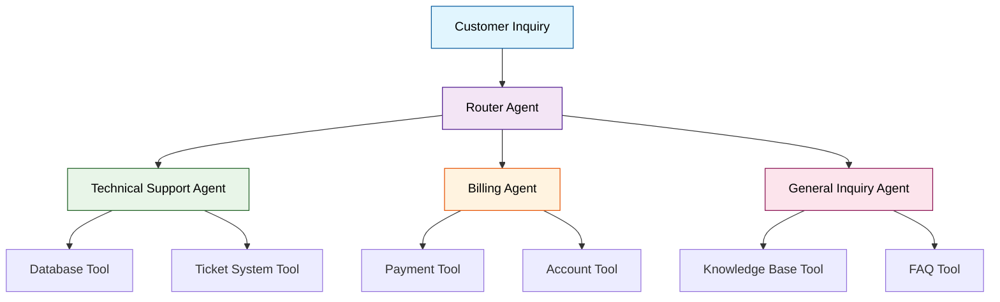
```mermaid
graph TD
    A[Customer Inquiry] --> B[Router Agent]
    B --> C[Technical Support Agent]
    B --> D[Billing Agent]
    B --> E[General Inquiry Agent]

    C --> F[Database Tool]
    C --> G[Ticket System Tool]

    D --> H[Payment Tool]
    D --> I[Account Tool]

    E --> J[Knowledge Base Tool]
    E --> K[FAQ Tool]

    style A fill:#e1f5fe,stroke:#01579b,color:#000
    style B fill:#f3e5f5,stroke:#4a148c,color:#000
    style C fill:#e8f5e8,stroke:#1b5e20,color:#000
    style D fill:#fff3e0,stroke:#e65100,color:#000
    style E fill:#fce4ec,stroke:#880e4f,color:#000
```

In David's new system:

- The **Router Agent** acts like a conductor, directing inquiries to specialists
- The **Technical Support Agent** has deep knowledge of system issues
- The **Billing Agent** specializes in payment and account problems
- Each agent has its own tools and expertise, but they coordinate seamlessly

### What Is an Agent? Beyond Functions and Objects

#### Core Agent Anatomy

An agent in ADK isn't just a function with extra features—it's a **self-contained execution unit designed to act autonomously** . Every agent has:

**Identity**: A name and clear description of its purpose
**Autonomy**: The ability to make decisions without explicit instructions
**Tools**: Capabilities it can use to interact with the world
**Context**: Understanding of its environment and goals

```python
weather_agent = Agent(
    name="weather_assistant",
    description="Provides current weather information and forecasts for any location worldwide",
    tools=[weather_api_tool, location_lookup_tool]
)
```

#### The Autonomy Spectrum: From Puppets to Partners

Not all agents need the same level of independence. ADK supports different points on the **autonomy spectrum** :

**Reactive Agents**: Respond to specific triggers (like traditional functions)
**Proactive Agents**: Take initiative based on goals and context
**Adaptive Agents**: Learn and evolve their behavior over time
**Collaborative Agents**: Work with other agents to achieve complex goals

Most business applications benefit from **proactive, collaborative agents** that can reason about problems and coordinate with teammates .

### Agent vs. Function vs. Service: The Hierarchy of Abstraction

| Aspect                | Function     | Service         | Agent            |
| :-------------------- | :----------- | :-------------- | :--------------- |
| **Abstraction Level** | Low          | Medium          | High             |
| **Decision Making**   | None         | Limited         | Autonomous       |
| **Context Awareness** | Stateless    | Session-based   | Persistent       |
| **Goal Orientation**  | Task-focused | Feature-focused | Outcome-focused  |
| **Collaboration**     | None         | API calls       | Rich interaction |

**Functions** process data: `calculate_tax(income, deductions)`
**Services** provide capabilities: `PaymentService.process_payment()`
**Agents** achieve goals: `"Help this customer resolve their billing issue"`

#### Pause and Reflect 🤔

Before diving into hands-on examples, consider your current systems:

1. **Where are you giving step-by-step instructions instead of defining goals?**
2. **What tasks could benefit from specialized "expert" agents?**
3. **How much autonomy would you be comfortable giving to an AI system?**

### When Agent Thinking Transforms Business Logic

#### Real Example: From Chaos to Coordination

David's old customer service flow looked like this:

```python
# The old way - rigid and brittle
def handle_customer_message(message, user_id):
    intent = classify_intent(message)  # Often wrong

    if intent == "refund":
        if has_recent_purchase(user_id):
            if within_refund_window(user_id):
                return process_refund(user_id)
            else:
                return "Refund window expired"
        else:
            return "No recent purchases found"

    # ... 50+ more elif statements
```

David's new agent-based system:

```python
# The agent way - flexible and intelligent
customer_service_system = Agent(
    name="customer_service_orchestrator",
    description="Intelligently route and resolve customer inquiries with appropriate specialist agents",
    sub_agents=[
        Agent(name="refund_specialist", tools=[refund_tool, purchase_history_tool]),
        Agent(name="technical_support", tools=[system_status_tool, troubleshooting_tool]),
        Agent(name="account_manager", tools=[account_tool, security_tool])
    ]
)
```

The result? **Customer satisfaction increased by 40% and development time decreased by 60%** . The system now handles edge cases that would have taken weeks to code manually.

### The Coordination Magic: How Agents Work Together

ADK agents collaborate through multiple patterns :

**Hierarchical Delegation**: A manager agent routes work to specialists
**Peer Collaboration**: Agents work together as equals on complex tasks
**Sequential Workflows**: Agents pass work down a pipeline
**Dynamic Coordination**: Agents decide how to collaborate based on context

```python
# Hierarchical delegation in action
orchestrator = Agent(
    name="content_creator",
    description="Create high-quality blog posts through research, writing, and editing",
    sub_agents=[
        Agent(name="researcher", tools=[search_tool, database_tool]),
        Agent(name="writer", tools=[content_tool, template_tool]),
        Agent(name="editor", tools=[grammar_tool, style_tool])
    ]
)
```

When a user requests "Write a blog post about renewable energy," the orchestrator:

1. **Analyzes** the request and breaks it into subtasks
2. **Delegates** research to the researcher agent
3. **Coordinates** handoff from researcher to writer to editor
4. **Ensures** quality standards are met throughout

### Pro Tip 💡

**Start with the outcome, not the process.** Instead of thinking "How do I code this workflow?" ask "What goal should this agent achieve?" Let the agent figure out the how—that's what makes it intelligent.

### The Mental Model Shift: From Coding to Orchestrating

Traditional developers write code that tells computers what to do. Agent developers **orchestrate teams** of intelligent entities that figure out how to achieve goals .

This shift requires thinking like a manager rather than a micromanager:

- **Define clear roles** and responsibilities for each agent
- **Set boundaries** and constraints to ensure safe operation
- **Enable communication** between agents working on related tasks
- **Monitor outcomes** rather than controlling every step

### Common Misconceptions About Agent Development

**Misconception 1**: "Agents are just fancy functions"
**Reality**: Agents have goals, context, and autonomy—they make decisions, not just process data .

**Misconception 2**: "More agents always means better performance"
**Reality**: Agent coordination has overhead. Start simple and add complexity only when needed .

**Misconception 3**: "Agents can handle any task autonomously"
**Reality**: Agents work best within defined boundaries and with appropriate tools .

**Misconception 4**: "Agent systems are too complex for production"
**Reality**: ADK is used in Google's production systems and designed for enterprise reliability .

---

The mindset shift from traditional programming to agent orchestration is profound but learnable. Once you start thinking in terms of **autonomous specialists working toward shared goals**, you'll see opportunities for agent-based solutions everywhere.

**Ready to experience this transformation firsthand? Chapter 3 will have you building and running your first intelligent agent in just 10 minutes, giving you that crucial "aha!" moment that makes everything click.**

---

Would you like me to continue with Chapter 3: Quick Start Victory?

### Chapter 3: Quick Start Victory - Your First Agent in 10 Minutes

### The Immediate Gratification Promise

Remember David from Chapter 2? His transformation didn't happen through months of theoretical study—it happened in the first 10 minutes when he saw an intelligent agent actually working. That moment of clarity is exactly what we're about to give you.

**This chapter is your "aha!" moment.** By the end, you'll have a fully functional weather agent running in your browser, responding intelligently to natural language queries, and demonstrating the core principles that make ADK powerful.

### Why Start with Weather? The Perfect Learning Vehicle

Weather agents might seem simple, but they're actually perfect for understanding agent fundamentals. Here's why:

- **Clear input/output**: User asks about weather, agent provides information
- **Tool usage**: Demonstrates how agents interact with external functions
- **Error handling**: Shows how agents deal with missing or invalid data
- **Natural language**: Proves agents can understand intent, not just keywords

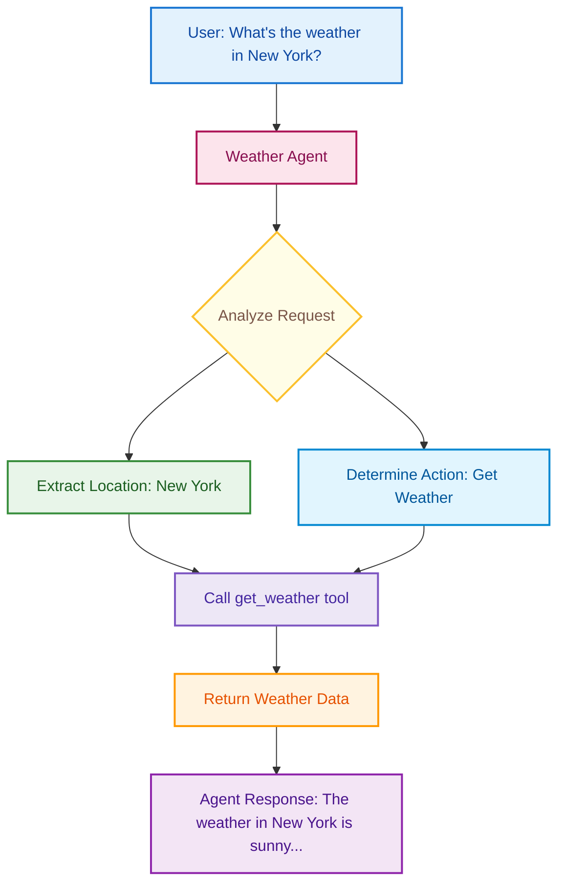
```mermaid
graph TD
    A["User: What's the weather in New York?"] --> B[Weather Agent]
    B --> C{Analyze Request}
    C --> D["Extract Location: New York"]
    C --> E[Determine Action: Get Weather]
    D --> F[Call get_weather tool]
    E --> F
    F --> G[Return Weather Data]
    G --> H["Agent Response: The weather in New York is sunny..."]

    %% Professional pastel color palette with good contrast
    style A fill:#e3f2fd,stroke:#1976d2,stroke-width:2px,color:#0d47a1
    style B fill:#fce4ec,stroke:#ad1457,stroke-width:2px,color:#880e4f
    style C fill:#fffde7,stroke:#fbc02d,stroke-width:2px,color:#795548
    style D fill:#e8f5e9,stroke:#388e3c,stroke-width:2px,color:#1b5e20
    style E fill:#e1f5fe,stroke:#0288d1,stroke-width:2px,color:#01579b
    style F fill:#ede7f6,stroke:#7e57c2,stroke-width:2px,color:#4527a0
    style G fill:#fff3e0,stroke:#ff9800,stroke-width:2px,color:#e65100
    style H fill:#f3e5f5,stroke:#8e24aa,stroke-width:2px,color:#4a148c
```

### Step 1: Environment Setup (2 Minutes)

### Prerequisites Check

Before we begin, ensure you have:

- **Python 3.9+** installed and accessible from your terminal
- **Terminal or command prompt** access
- **Code editor** (VS Code, PyCharm, or any text editor)
- **Internet connection** for package installation

### Create Your Virtual Environment

**Why virtual environments matter:** They isolate your project dependencies, preventing conflicts with other Python projects on your system.

```bash
# Create a new directory for your agent
mkdir my-first-agent
cd my-first-agent

# Create virtual environment
python -m venv .venv
```

**Activate the virtual environment:**

```bash
# macOS/Linux
source .venv/bin/activate

# Windows Command Prompt
.venv\Scripts\activate.bat

# Windows PowerShell
.venv\Scripts\Activate.ps1
```

**Pro Tip 💡:** You'll see `(.venv)` appear in your terminal prompt when the virtual environment is active. This confirms you're working in isolation from your system Python.

### Install ADK

```bash
pip install google-adk
```

**Verification (Optional):**

```bash
pip show google-adk
```

This should display the ADK version and dependencies, confirming successful installation.

### Step 2: Project Structure Setup (2 Minutes)

### Create the Project Framework

ADK follows a specific project structure that enables both development and deployment:

```bash
# Create the project directory
mkdir weather_agent
cd weather_agent

# Create necessary files
touch __init__.py agent.py .env
```

Your project structure should now look like this:

```
weather_agent/
├── __init__.py
├── agent.py
└── .env
```

### **Pause and Reflect** 🤔

Notice this isn't just a single Python file. ADK treats agents as **applications**, not scripts. This structure enables:

- **Modular development**: Separate concerns into different files
- **Environment management**: Keep secrets and configuration separate
- **Package organization**: Enable imports and reusability

### Step 3: Create Your First Agent (4 Minutes)

### The Complete Agent Code

Open `agent.py` and paste the following code:

```python
import datetime
from zoneinfo import ZoneInfo
from google.adk.agents import Agent

def get_weather(city: str) -> dict:
    """Retrieves the current weather report for a specified city.

    Args:
        city (str): The name of the city for which to retrieve the weather report.

    Returns:
        dict: status and result or error msg.
    """
    # Mock weather data for demonstration
    weather_db = {
        "new york": {
            "status": "success",
            "report": "The weather in New York is sunny with a temperature of 25°C (77°F)."
        },
        "london": {
            "status": "success",
            "report": "It's cloudy in London with a temperature of 15°C (59°F)."
        },
        "tokyo": {
            "status": "success",
            "report": "Tokyo is experiencing light rain and a temperature of 18°C (64°F)."
        }
    }

    city_normalized = city.lower().strip()
    if city_normalized in weather_db:
        return weather_db[city_normalized]
    else:
        return {
            "status": "error",
            "error_message": f"Weather information for '{city}' is not available."
        }

def get_current_time(city: str) -> dict:
    """Returns the current time in a specified city.

    Args:
        city (str): The name of the city for which to retrieve the current time.

    Returns:
        dict: status and result or error msg.
    """
    # Simplified timezone mapping for demonstration
    timezone_map = {
        "new york": "America/New_York",
        "london": "Europe/London",
        "tokyo": "Asia/Tokyo"
    }

    city_normalized = city.lower().strip()
    if city_normalized in timezone_map:
        tz = ZoneInfo(timezone_map[city_normalized])
        now = datetime.datetime.now(tz)
        report = f'The current time in {city} is {now.strftime("%Y-%m-%d %H:%M:%S %Z")}'
        return {"status": "success", "report": report}
    else:
        return {
            "status": "error",
            "error_message": f"Sorry, I don't have timezone information for {city}."
        }

# The main agent definition
root_agent = Agent(
    name="weather_time_agent",
    model="gemini-2.0-flash",
    description="Agent to answer questions about the time and weather in a city.",
    instruction=(
        "You are a helpful agent who can answer user questions about the time and weather in a city. "
        "Use the available tools to get accurate information and provide friendly, conversational responses."
    ),
    tools=[get_weather, get_current_time]
)
```

### Understanding the Code Architecture

Let's break down what makes this agent intelligent:

**1. Tools as Capabilities**

```python
def get_weather(city: str) -> dict:
    """Retrieves the current weather report for a specified city."""
```

- The **docstring** is crucial—it tells the agent what this tool does
- **Type hints** help the agent understand expected inputs and outputs
- **Return format** is consistent (dict with status/result pattern)

**2. Agent Configuration**

```python
root_agent = Agent(
    name="weather_time_agent",           # Unique identifier
    model="gemini-2.0-flash",           # LLM to use for reasoning
    description="...",                   # What this agent does
    instruction="...",                   # How it should behave
    tools=[get_weather, get_current_time] # Available capabilities
)
```

**3. Intelligence Through Instructions**
The `instruction` parameter is where the magic happens. It transforms a raw LLM into a **specialized agent** with specific behavior patterns.

### Step 4: Environment Configuration (1 Minute)

### Configure Model Access

Edit your `.env` file:

```bash
# For Google AI Studio (easiest setup)
GOOGLE_GENAI_USE_VERTEXAI=FALSE
GOOGLE_API_KEY=your_api_key_here

# Alternative: For Vertex AI (production recommended)
# GOOGLE_GENAI_USE_VERTEXAI=TRUE
# GOOGLE_CLOUD_PROJECT=your-project-id
# GOOGLE_CLOUD_LOCATION=us-central1
```

### Getting Your Google API Key

1. **Visit Google AI Studio**: https://aistudio.google.com/
2. **Sign in** with your Google account
3. **Get API Key** from the interface
4. **Copy the key** into your `.env` file

### Package Initialization

Edit `__init__.py`:

```python
from . import agent
```

This enables ADK to discover and load your agent.

### Step 5: Launch and Test (1 Minute)

### Start the ADK Web Interface

From your `weather_agent` directory:

```bash
adk web
```

This launches ADK's built-in development interface. You should see:

```
Starting ADK Web UI...
Server running at: http://localhost:8080
```

### Your First Conversation

Open your browser to `http://localhost:8080` and try these queries:

**Basic weather query:**

```
User: What's the weather in New York?
Agent: The weather in New York is sunny with a temperature of 25°C (77°F).
```

**Time inquiry:**

```
User: What time is it in Tokyo?
Agent: The current time in Tokyo is 2025-06-21 16:29:45 JST
```

**Conversational query:**

```
User: I'm planning a trip to London. How's the weather there and what time is it?
Agent: In London, it's currently cloudy with a temperature of 15°C (59°F). The current time in London is 2025-06-21 08:29:45 GMT. Perfect for sightseeing if you don't mind the clouds!
```

### The Magic Moment: Understanding What Just Happened

### Agent Reasoning in Action

When you asked "What's the weather in New York?", here's what happened behind the scenes:

1. **Intent Recognition**: The agent understood you wanted weather information
2. **Parameter Extraction**: It identified "New York" as the target city
3. **Tool Selection**: It chose the `get_weather` tool over `get_current_time`
4. **Tool Execution**: It called `get_weather("New York")`
5. **Response Synthesis**: It crafted a natural language response from the tool result

### Why This Isn't Just an API Call

Traditional programming would require you to:

- Parse the user input with regular expressions
- Extract the city name manually
- Handle variations in city names
- Craft response templates for different scenarios

**The agent handles all of this automatically through reasoning**. It understands intent, not just keywords.

### **Interactive Challenge** 🎯

Before moving on, try these queries to test your agent's intelligence:

1. **Edge case**: "What's the weather in Paris?" (should handle gracefully)
2. **Multiple requests**: "Tell me about the weather and time in Tokyo"
3. **Conversational**: "I'm wondering about conditions in London"
4. **Invalid input**: "What's the weather?" (without specifying city)

Notice how the agent adapts its responses while maintaining consistency.

### Alternative: Command Line Interface

If you prefer terminal interaction, use:

```bash
adk run
```

This provides a command-line chat interface:

```
You > What's the weather in New York?
Agent > The weather in New York is sunny with a temperature of 25°C (77°F).

You > quit
```

### When to Use Single Agents: The Decision Framework

Your weather agent demonstrates **single-agent patterns**—one specialized entity handling related tasks. This approach works best when:

### ✅ Use Single Agents When:

- **Cohesive functionality**: All tasks relate to the same domain (weather + time)
- **Simple tool coordination**: Agent can manage multiple tools without confusion
- **Clear boundaries**: The agent's responsibilities are well-defined
- **Fast response needs**: No coordination overhead between multiple agents

### ⌠Consider Multi-Agent When:

- **Complex workflows**: Tasks require different specialized knowledge
- **Tool conflicts**: Different tasks need incompatible tool configurations
- **Scale requirements**: Single agent becomes too complex to maintain
- **Team simulation**: You want to model real-world team dynamics

## Common Pitfalls and Solutions

### Pitfall 1: "Agent Not Found" Error

**Symptom**: `adk web` can't find your agent
**Solution**: Ensure your `__init__.py` contains `from . import agent`

### Pitfall 2: Model Authentication Issues

**Symptom**: API key errors or authentication failures
**Solution**: Verify your `.env` file is in the correct directory and properly formatted

### Pitfall 3: Tool Not Being Called

**Symptom**: Agent gives generic responses instead of using tools
**Solution**: Check your tool docstrings—they must clearly describe what the tool does

### Pitfall 4: Inconsistent Responses

**Symptom**: Agent behavior varies unpredictably
**Solution**: Make your `instruction` parameter more specific and detailed

## Pro Tips for Agent Development 💡

**1. Start with Mock Data**: Use fake data initially to focus on agent behavior, not external integrations.

**2. Descriptive Docstrings**: Your tool docstrings are the agent's "manual"—make them comprehensive.

**3. Consistent Return Formats**: Standardize your tool return formats (like the status/result pattern) for predictable behavior.

**4. Test Edge Cases Early**: Try invalid inputs, missing data, and unexpected queries to understand agent limits.

**5. Use the Web UI for Development**: The visual interface makes debugging much easier than command-line testing.

## The Foundation is Set

Congratulations! You've just built and deployed your first intelligent agent. More importantly, you've experienced the fundamental shift from traditional programming to agent orchestration.

**What you've learned:**

- **Agent structure**: How ADK organizes intelligent applications
- **Tool integration**: How agents use Python functions as capabilities
- **Environment management**: How to configure models and credentials
- **Development workflow**: The cycle of code, test, and iterate

**What you've built:**

- A **production-ready agent** that handles natural language queries
- A **reusable foundation** that can be extended with new tools and capabilities
- An **understanding** of how reasoning and tool usage combine to create intelligence

---

**Ready to scale beyond single agents? Chapter 4 will dive deep into the different types of agents ADK supports, showing you when and how to use LLM Agents, Workflow Agents, and Custom Agents for different business scenarios.**

---

The moment you saw your agent respond intelligently to natural language, you crossed the threshold from traditional programming into the agent paradigm. That feeling of "it just works" is exactly what makes ADK powerful—and we're just getting started.

## Chapter 4: Agent Types Deep Dive - Understanding the Building Blocks

### The Agent Architecture Spectrum

Think of building an agent system like assembling a professional orchestra. You wouldn't use only violinists to perform a symphony—you need specialized musicians for different instruments, a conductor to coordinate them, and sometimes even guest soloists with unique skills. Similarly, ADK provides different types of agents, each optimized for specific roles in your intelligent application.

**ADK's three core agent types** form a comprehensive toolkit for building sophisticated agent systems:

- **LLM Agents**: The dynamic reasoning specialists
- **Workflow Agents**: The orchestration conductors  
- **Custom Agents**: The specialized virtuosos

Understanding when and how to use each type is crucial for building effective agent systems that solve real business problems.

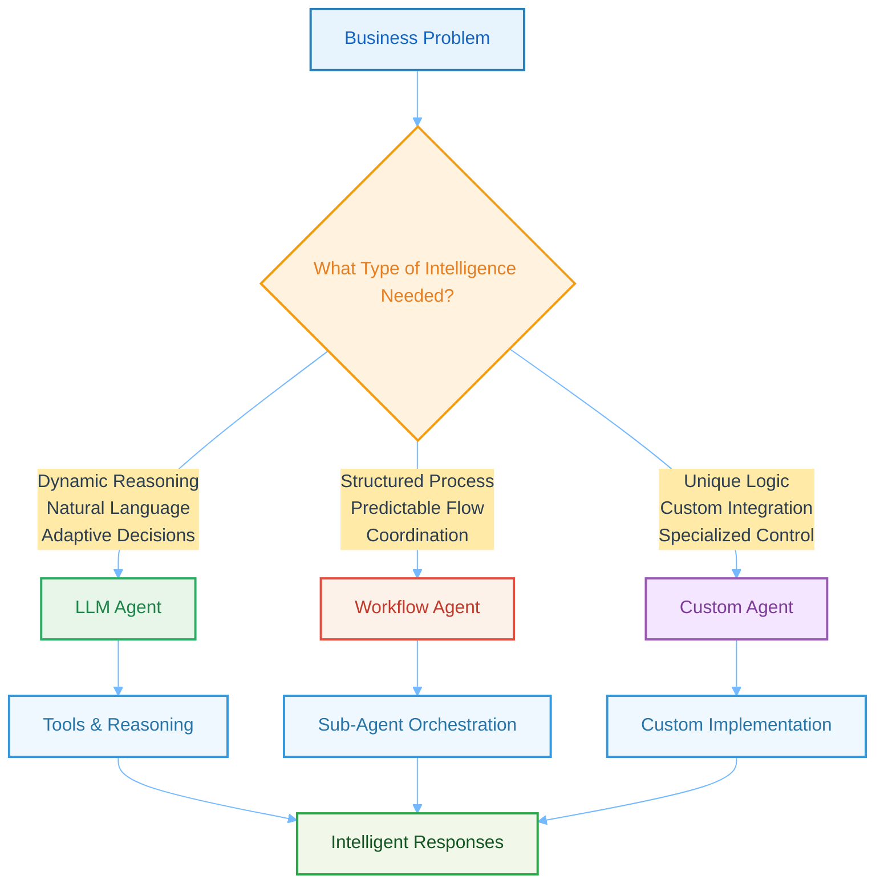
```mermaid
---
config:
  theme: base
  themeVariables:
    primaryColor: "#f8f9fa"
    primaryTextColor: "#2c3e50"
    primaryBorderColor: "#6c5ce7"
    lineColor: "#74b9ff"
    secondaryColor: "#ffeaa7"
    tertiaryColor: "#55a3ff"
    background: "#ffffff"
    mainBkg: "#f8f9fa"
    secondBkg: "#ffeaa7"
    tertiaryBkg: "#d1f2eb"
---
flowchart TD
    A[Business Problem] --> B{What Type of Intelligence Needed?}
    
    B -->|Dynamic Reasoning<br/>Natural Language<br/>Adaptive Decisions| C[LLM Agent]
    B -->|Structured Process<br/>Predictable Flow<br/>Coordination| D[Workflow Agent]
    B -->|Unique Logic<br/>Custom Integration<br/>Specialized Control| E[Custom Agent]
    
    C --> F[Tools & Reasoning]
    D --> G[Sub-Agent Orchestration]
    E --> H[Custom Implementation]
    
    F --> I[Intelligent Responses]
    G --> I
    H --> I
    
    classDef problem fill:#e8f4fd,stroke:#2980b9,stroke-width:2px,color:#1565c0
    classDef decision fill:#fff3e0,stroke:#f39c12,stroke-width:2px,color:#e67e22
    classDef llmAgent fill:#e8f5e9,stroke:#27ae60,stroke-width:2px,color:#1e8449
    classDef workflowAgent fill:#fdf2e9,stroke:#e74c3c,stroke-width:2px,color:#c0392b
    classDef customAgent fill:#f4e6ff,stroke:#9b59b6,stroke-width:2px,color:#7d3c98
    classDef capability fill:#f0f8ff,stroke:#3498db,stroke-width:2px,color:#2874a6
    classDef output fill:#f1f8e9,stroke:#28a745,stroke-width:2px,color:#155724
    
    class A problem
    class B decision
    class C llmAgent
    class D workflowAgent
    class E customAgent
    class F,G,H capability
    class I output
```

### LLM Agents: The Dynamic Reasoning Powerhouses

**LLM Agents are the thinking components** of your agent system—they leverage large language models to understand natural language, make context-aware decisions, and adapt their behavior based on the situation at hand.

### Core Capabilities and Intelligence

LLM Agents excel at tasks that require **human-like reasoning and adaptability**:

- **Natural Language Understanding**: Interpreting user intent from conversational text
- **Dynamic Decision Making**: Choosing appropriate actions based on context and goals
- **Tool Selection and Usage**: Intelligently determining which tools to use and how
- **Contextual Response Generation**: Creating coherent, relevant responses
- **Adaptive Behavior**: Adjusting strategies based on feedback and results

```python
from google.adk.agents import LlmAgent

# Create a sophisticated customer service agent
customer_service_agent = LlmAgent(
    name="customer_service_specialist",
    model="gemini-2.0-flash",
    description="Intelligent customer service representative specializing in banking",
    instruction="""You are an expert customer service representative for a premium bank. 
    Your role is to:
    1. Understand customer needs through active listening
    2. Use available tools to gather account information
    3. Provide personalized, empathetic responses
    4. Escalate complex issues appropriately
    
    Always maintain a professional, helpful tone and ensure customer satisfaction.""",
    tools=[check_balance_tool, transfer_funds_tool, locate_atm_tool, create_support_ticket_tool]
)
```

#### The LLM Agent Decision Process

Understanding how LLM Agents make decisions helps you design more effective instructions and tool sets:

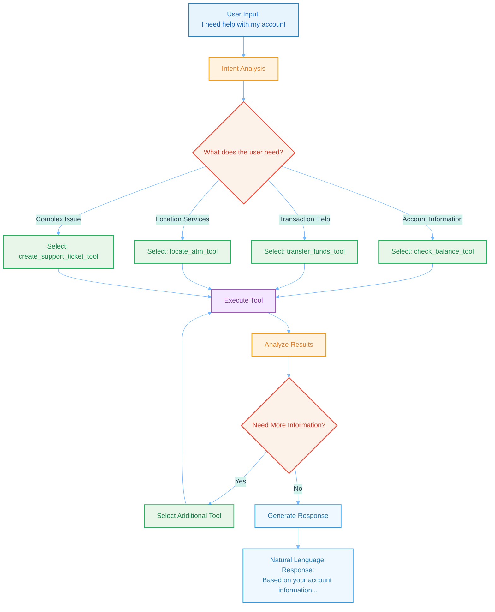
```mermaid
---
config:
  theme: base
  themeVariables:
    primaryColor: "#f8f9fa"
    primaryTextColor: "#2c3e50"
    primaryBorderColor: "#6c5ce7"
    lineColor: "#74b9ff"
    secondaryColor: "#d1f2eb"
    tertiaryColor: "#ffeaa7"
    background: "#ffffff"
    mainBkg: "#f8f9fa"
    secondBkg: "#d1f2eb"
    tertiaryBkg: "#ffeaa7"
---
flowchart TD
    A["User Input:<br/>I need help with my account"] --> B[Intent Analysis]
    B --> C{What does the user need?}
    
    C -->|Account Information| D[Select: check_balance_tool]
    C -->|Transaction Help| E[Select: transfer_funds_tool]
    C -->|Location Services| F[Select: locate_atm_tool]
    C -->|Complex Issue| G[Select: create_support_ticket_tool]
    
    D --> H[Execute Tool]
    E --> H
    F --> H
    G --> H
    
    H --> I[Analyze Results]
    I --> J{Need More Information?}
    
    J -->|Yes| K[Select Additional Tool]
    J -->|No| L[Generate Response]
    
    K --> H
    L --> M["Natural Language Response:<br/>Based on your account information..."]
    
    classDef input fill:#e8f4fd,stroke:#2980b9,stroke-width:2px,color:#1565c0
    classDef analysis fill:#fff3e0,stroke:#f39c12,stroke-width:2px,color:#e67e22
    classDef decision fill:#fdf2e9,stroke:#e74c3c,stroke-width:2px,color:#c0392b
    classDef tool fill:#e8f5e9,stroke:#27ae60,stroke-width:2px,color:#1e8449
    classDef execution fill:#f4e6ff,stroke:#9b59b6,stroke-width:2px,color:#7d3c98
    classDef output fill:#f0f8ff,stroke:#3498db,stroke-width:2px,color:#2874a6
    
    class A input
    class B,I analysis
    class C,J decision
    class D,E,F,G,K tool
    class H execution
    class L,M output
```

#### When to Use LLM Agents

LLM Agents are your go-to choice for scenarios requiring **flexible, intelligent reasoning**:

**✅ Ideal Use Cases:**
- **Customer service interactions** with varied, unpredictable queries
- **Content creation tasks** requiring creativity and adaptation
- **Research and analysis** where context and nuance matter
- **Personal assistants** that need to understand user preferences
- **Educational tutoring** that adapts to learning styles

**⌠Consider Alternatives When:**
- **Deterministic workflows** with fixed steps and outcomes
- **High-volume, simple tasks** where consistency is more important than intelligence
- **Real-time applications** where response predictability is crucial
- **Regulated environments** requiring exact, auditable decision paths

### Advanced LLM Agent Patterns

**Multi-Specialist Architecture**: Create teams of specialized LLM agents for complex domains:

```python
# Financial services multi-specialist system
investment_advisor = LlmAgent(
    name="investment_advisor",
    model="gemini-2.0-flash",
    description="Investment advice specialist with market analysis expertise",
    tools=[market_data_tool, portfolio_analysis_tool, risk_assessment_tool],
    instruction="You are a certified investment advisor. Provide data-driven investment recommendations based on client goals and risk tolerance."
)

loan_specialist = LlmAgent(
    name="loan_specialist", 
    model="gemini-2.0-flash",
    description="Mortgage and loan specialist with lending expertise",
    tools=[credit_check_tool, loan_calculator_tool, approval_status_tool],
    instruction="You are a lending specialist. Help customers understand loan options and guide them through the application process."
)

# Coordinating agent that delegates to specialists
financial_advisor = LlmAgent(
    name="financial_advisor",
    model="gemini-2.0-flash",
    description="Primary financial advisor coordinating specialized services",
    sub_agents=[investment_advisor, loan_specialist],
    instruction="You are a comprehensive financial advisor. Listen to client needs and coordinate with appropriate specialists to provide holistic financial guidance."
)
```

### Workflow Agents: The Orchestration Masters

**Workflow Agents are the conductors** of your agent orchestra—they don't reason or make dynamic decisions, but they excel at coordinating other agents according to predefined patterns. Think of them as smart process managers that ensure work flows through your system efficiently and predictably.

#### The Three Orchestration Patterns

ADK provides three fundamental workflow patterns, each optimized for different coordination needs:

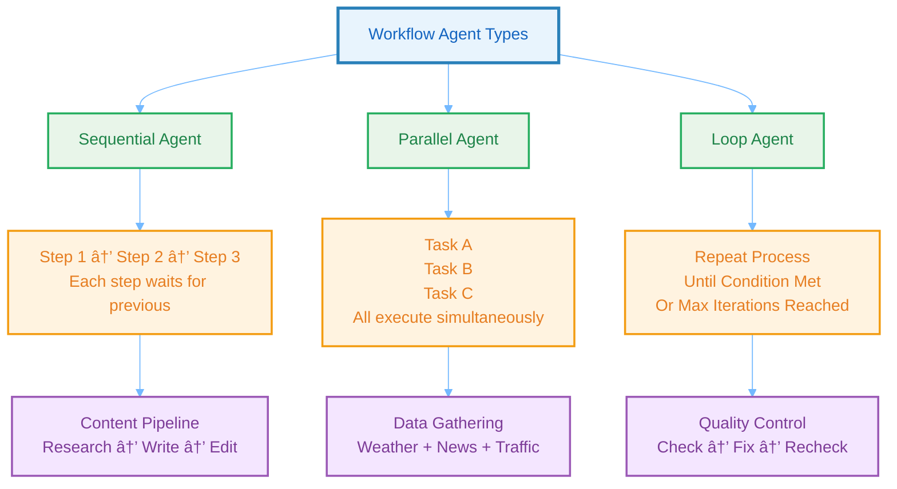
```mermaid
---
config:
  theme: base
  themeVariables:
    primaryColor: "#f8f9fa"
    primaryTextColor: "#2c3e50"
    primaryBorderColor: "#6c5ce7"
    lineColor: "#74b9ff"
    secondaryColor: "#d1f2eb"
    tertiaryColor: "#ffeaa7"
    background: "#ffffff"
    mainBkg: "#f8f9fa"
    secondBkg: "#d1f2eb"
    tertiaryBkg: "#ffeaa7"
---
flowchart TD
    A[Workflow Agent Types] --> B[Sequential Agent]
    A --> C[Parallel Agent]
    A --> D[Loop Agent]
    
    B --> E["Step 1 → Step 2 → Step 3<br/>Each step waits for previous"]
    C --> F["Task A<br/>Task B<br/>Task C<br/>All execute simultaneously"]
    D --> G["Repeat Process<br/>Until Condition Met<br/>Or Max Iterations Reached"]
    
    E --> H[Content Pipeline<br/>Research → Write → Edit]
    F --> I[Data Gathering<br/>Weather + News + Traffic]
    G --> J[Quality Control<br/>Check → Fix → Recheck]
    
    classDef main fill:#e8f4fd,stroke:#2980b9,stroke-width:3px,color:#1565c0
    classDef agent fill:#e8f5e9,stroke:#27ae60,stroke-width:2px,color:#1e8449
    classDef pattern fill:#fff3e0,stroke:#f39c12,stroke-width:2px,color:#e67e22
    classDef example fill:#f4e6ff,stroke:#9b59b6,stroke-width:2px,color:#7d3c98
    
    class A main
    class B,C,D agent
    class E,F,G pattern
    class H,I,J example
```

#### Sequential Agents: Step-by-Step Excellence

**Sequential Agents execute sub-agents in order**, with each agent building on the output of the previous one. This pattern is perfect for **pipeline processes** where each step depends on the completion of prior steps.

```python
from google.adk.agents import SequentialAgent, LlmAgent

# Create individual pipeline agents
research_agent = LlmAgent(
    name="research_specialist",
    model="gemini-2.0-flash",
    tools=[search_tool, database_tool, fact_check_tool],
    description="Comprehensive research specialist",
    instruction="Conduct thorough research on the given topic. Gather facts, statistics, and authoritative sources.",
    output_key="research_findings"  # Store results in session state
)

outline_agent = LlmAgent(
    name="content_strategist",
    model="gemini-2.0-flash",
    description="Content structure and strategy specialist",
    instruction="Create a detailed content outline based on the research_findings in session state. Structure for maximum impact and readability.",
    output_key="content_outline"
)

writing_agent = LlmAgent(
    name="content_writer",
    model="gemini-2.0-flash",
    tools=[style_guide_tool, template_tool],
    description="Professional content writer",
    instruction="Write engaging, high-quality content following the content_outline from session state. Maintain brand voice and style.",
    output_key="draft_content"
)

editing_agent = LlmAgent(
    name="content_editor",
    model="gemini-2.0-flash",
    tools=[grammar_tool, readability_tool, seo_tool],
    description="Professional content editor and optimizer",
    instruction="Edit and optimize the draft_content from session state. Ensure clarity, correctness, and SEO optimization."
)

# Create the sequential workflow
content_creation_pipeline = SequentialAgent(
    name="content_creation_pipeline",
    sub_agents=[research_agent, outline_agent, writing_agent, editing_agent],
    description="End-to-end content creation pipeline from research to publication-ready content"
)
```

**Sequential Agent Flow Visualization**:

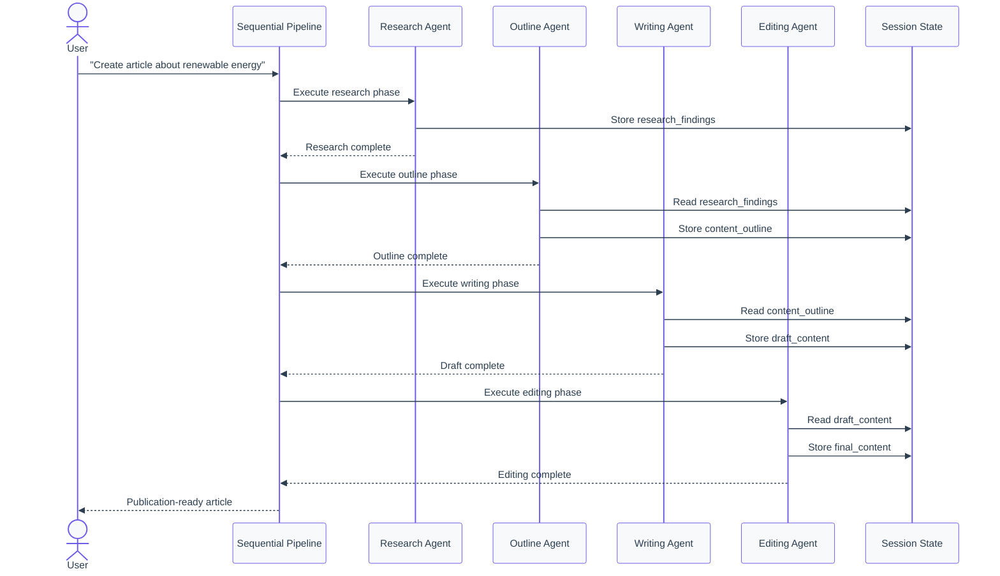
```mermaid
---
config:
  theme: base
  themeVariables:
    primaryColor: "#f8f9fa"
    primaryTextColor: "#2c3e50"
    primaryBorderColor: "#6c5ce7"
    lineColor: "#74b9ff"
    secondaryColor: "#d1f2eb"
    tertiaryColor: "#ffeaa7"
    background: "#ffffff"
    mainBkg: "#f8f9fa"
    secondBkg: "#d1f2eb"
    tertiaryBkg: "#ffeaa7"
---
sequenceDiagram
    actor User
    participant SP as Sequential Pipeline
    participant R as Research Agent
    participant O as Outline Agent  
    participant W as Writing Agent
    participant E as Editing Agent
    participant State as Session State
    
    User->>SP: "Create article about renewable energy"
    SP->>R: Execute research phase
    R->>State: Store research_findings
    R-->>SP: Research complete
    
    SP->>O: Execute outline phase
    O->>State: Read research_findings
    O->>State: Store content_outline
    O-->>SP: Outline complete
    
    SP->>W: Execute writing phase
    W->>State: Read content_outline
    W->>State: Store draft_content
    W-->>SP: Draft complete
    
    SP->>E: Execute editing phase
    E->>State: Read draft_content
    E->>State: Store final_content
    E-->>SP: Editing complete
    
    SP-->>User: Publication-ready article
```

#### Parallel Agents: Simultaneous Execution Power

**Parallel Agents execute multiple sub-agents simultaneously**, making them ideal for tasks where **independent operations can run concurrently** to save time and improve efficiency.

```python
from google.adk.agents import ParallelAgent, LlmAgent

# Create independent information gathering agents
weather_agent = LlmAgent(
    name="weather_specialist",
    model="gemini-2.0-flash",
    tools=[weather_api_tool],
    description="Weather information specialist",
    instruction="Provide current weather conditions and forecasts.",
    output_key="weather_data"
)

traffic_agent = LlmAgent(
    name="traffic_specialist", 
    model="gemini-2.0-flash",
    tools=[traffic_api_tool, maps_tool],
    description="Traffic and transportation specialist",
    instruction="Analyze traffic conditions and suggest optimal routes.",
    output_key="traffic_data"
)

news_agent = LlmAgent(
    name="news_specialist",
    model="gemini-2.0-flash",
    tools=[news_api_tool, trending_tool],
    description="News and current events specialist", 
    instruction="Gather relevant news and trending topics.",
    output_key="news_data"
)

# Create parallel execution workflow
morning_briefing_system = ParallelAgent(
    name="morning_briefing_system",
    sub_agents=[weather_agent, traffic_agent, news_agent],
    description="Comprehensive morning briefing system gathering multiple data sources simultaneously"
)
```

**Parallel Agent Execution Flow**:

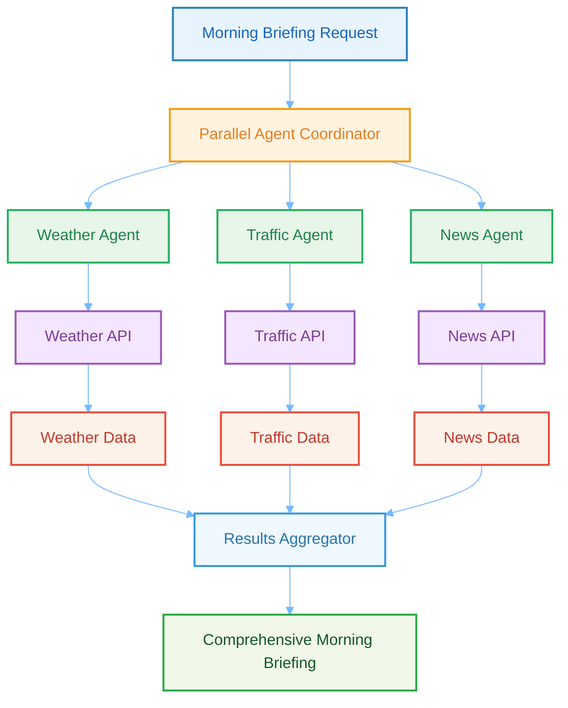
```mermaid
---
config:
  theme: base
  themeVariables:
    primaryColor: "#f8f9fa"
    primaryTextColor: "#2c3e50"
    primaryBorderColor: "#6c5ce7"
    lineColor: "#74b9ff"
    secondaryColor: "#d1f2eb"
    tertiaryColor: "#ffeaa7"
    background: "#ffffff"
    mainBkg: "#f8f9fa"
    secondBkg: "#d1f2eb"
    tertiaryBkg: "#ffeaa7"
---
flowchart TD
    A[Morning Briefing Request] --> B[Parallel Agent Coordinator]
    
    B --> C[Weather Agent]
    B --> D[Traffic Agent] 
    B --> E[News Agent]
    
    C --> F[Weather API]
    D --> G[Traffic API]
    E --> H[News API]
    
    F --> I[Weather Data]
    G --> J[Traffic Data]
    H --> K[News Data]
    
    I --> L[Results Aggregator]
    J --> L
    K --> L
    
    L --> M[Comprehensive Morning Briefing]
    
    classDef request fill:#e8f4fd,stroke:#2980b9,stroke-width:2px,color:#1565c0
    classDef coordinator fill:#fff3e0,stroke:#f39c12,stroke-width:2px,color:#e67e22
    classDef agent fill:#e8f5e9,stroke:#27ae60,stroke-width:2px,color:#1e8449
    classDef api fill:#f4e6ff,stroke:#9b59b6,stroke-width:2px,color:#7d3c98
    classDef data fill:#fdf2e9,stroke:#e74c3c,stroke-width:2px,color:#c0392b
    classDef aggregator fill:#f0f8ff,stroke:#3498db,stroke-width:2px,color:#2874a6
    classDef result fill:#f1f8e9,stroke:#28a745,stroke-width:2px,color:#155724
    
    class A request
    class B coordinator
    class C,D,E agent
    class F,G,H api
    class I,J,K data
    class L aggregator
    class M result
```

#### Loop Agents: Iterative Process Control

**Loop Agents repeatedly execute sub-agents** until a specific condition is met or a maximum number of iterations is reached. This pattern is perfect for **quality control, optimization, and iterative improvement processes**.

```python
from google.adk.agents import LoopAgent, LlmAgent

# Create quality control agents
content_reviewer = LlmAgent(
    name="content_quality_reviewer",
    model="gemini-2.0-flash", 
    tools=[quality_check_tool, compliance_tool],
    description="Content quality and compliance reviewer",
    instruction="""Review content for:
    1. Accuracy and factual correctness
    2. Brand compliance and voice consistency  
    3. Grammar and readability
    4. SEO optimization
    
    Return 'APPROVED' if content meets all standards, otherwise return 'NEEDS_REVISION' with specific feedback.""",
    output_key="review_result"
)

content_improver = LlmAgent(
    name="content_improvement_specialist",
    model="gemini-2.0-flash",
    tools=[rewrite_tool, enhancement_tool],
    description="Content improvement and revision specialist",
    instruction="Based on the review_result feedback, improve the content to address all identified issues. Focus on making specific, targeted improvements.",
    output_key="improved_content"
)

# Create iterative quality control loop
quality_control_loop = LoopAgent(
    name="quality_control_system",
    sub_agents=[content_reviewer, content_improver],
    description="Iterative quality control system that refines content until it meets all standards",
    max_iterations=5,  # Prevent infinite loops
    termination_condition="review_result == 'APPROVED'"  # Stop when approved
)
```

**Loop Agent Iterative Flow**:

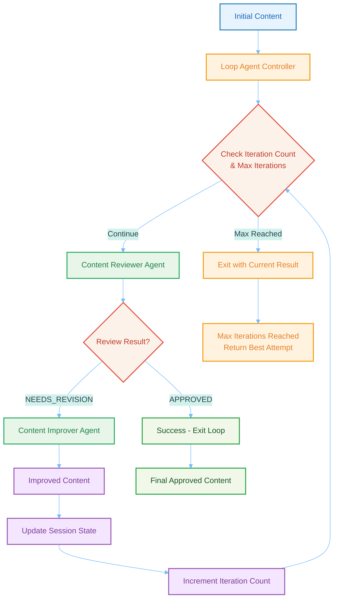
```mermaid
---
config:
  theme: base
  themeVariables:
    primaryColor: "#f8f9fa"
    primaryTextColor: "#2c3e50"
    primaryBorderColor: "#6c5ce7"
    lineColor: "#74b9ff"
    secondaryColor: "#d1f2eb"
    tertiaryColor: "#ffeaa7"
    background: "#ffffff"
    mainBkg: "#f8f9fa"
    secondBkg: "#d1f2eb"
    tertiaryBkg: "#ffeaa7"
---
flowchart TD
    A[Initial Content] --> B[Loop Agent Controller]
    B --> C{Check Iteration Count<br/>& Max Iterations}
    
    C -->|Continue| D[Content Reviewer Agent]
    C -->|Max Reached| E[Exit with Current Result]
    
    D --> F{Review Result?}
    F -->|APPROVED| G[Success - Exit Loop]
    F -->|NEEDS_REVISION| H[Content Improver Agent]
    
    H --> I[Improved Content]
    I --> J[Update Session State]
    J --> K[Increment Iteration Count]
    K --> C
    
    G --> L[Final Approved Content]
    E --> M[Max Iterations Reached<br/>Return Best Attempt]
    
    classDef input fill:#e8f4fd,stroke:#2980b9,stroke-width:2px,color:#1565c0
    classDef controller fill:#fff3e0,stroke:#f39c12,stroke-width:2px,color:#e67e22
    classDef decision fill:#fdf2e9,stroke:#e74c3c,stroke-width:2px,color:#c0392b
    classDef agent fill:#e8f5e9,stroke:#27ae60,stroke-width:2px,color:#1e8449
    classDef process fill:#f4e6ff,stroke:#9b59b6,stroke-width:2px,color:#7d3c98
    classDef success fill:#f1f8e9,stroke:#28a745,stroke-width:2px,color:#155724
    classDef exit fill:#fff3e0,stroke:#f39c12,stroke-width:2px,color:#e67e22
    
    class A input
    class B controller
    class C,F decision
    class D,H agent
    class I,J,K process
    class G,L success
    class E,M exit
```

#### When to Use Each Workflow Pattern

| Pattern | Best For | Characteristics | Example Use Cases |
|---------|----------|----------------|-------------------|
| **Sequential** | Pipeline processes, dependency chains | Ordered execution, state passing | Content creation, document processing, onboarding workflows |
| **Parallel** | Independent tasks, time optimization | Concurrent execution, result aggregation | Data gathering, multi-source analysis, batch processing |
| **Loop** | Quality control, iterative improvement | Repeated execution, condition-based termination | Content refinement, error correction, optimization processes |

### Custom Agents: The Specialized Virtuosos

**Custom Agents provide unlimited flexibility** by allowing you to implement completely custom orchestration logic. They're the virtuoso soloists of your agent orchestra—when standard patterns aren't enough, Custom Agents give you the power to create exactly what you need.

### The Power of Custom Implementation

Custom Agents inherit from `BaseAgent` and implement their own `_run_async_impl` method, giving you complete control over:

- **Execution flow and decision logic**
- **State management and persistence**
- **Error handling and recovery**
- **Integration with external systems**
- **Performance optimization**

**Custom Agent Architecture**:

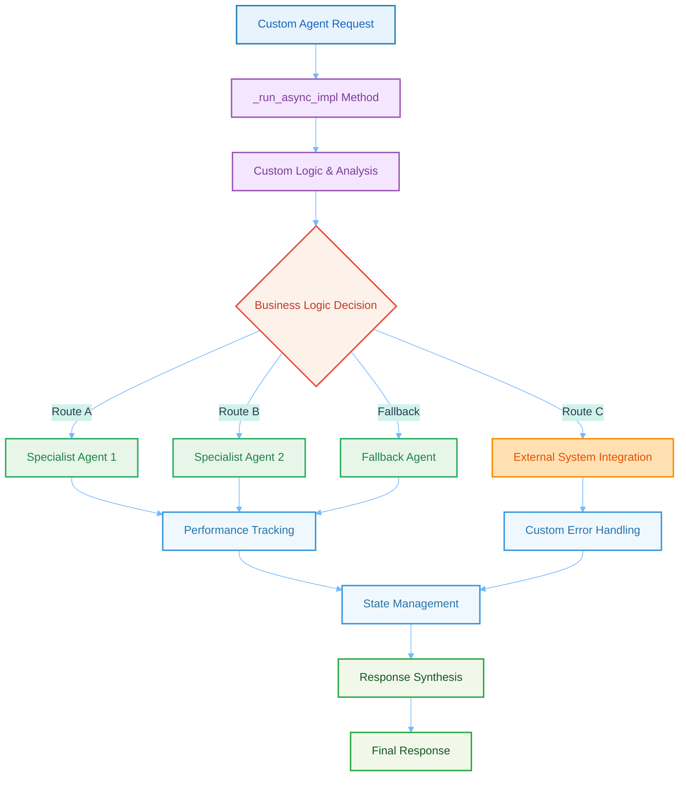
```mermaid
---
config:
  theme: base
  themeVariables:
    primaryColor: "#f8f9fa"
    primaryTextColor: "#2c3e50"
    primaryBorderColor: "#6c5ce7"
    lineColor: "#74b9ff"
    secondaryColor: "#d1f2eb"
    tertiaryColor: "#ffeaa7"
    background: "#ffffff"
    mainBkg: "#f8f9fa"
    secondBkg: "#d1f2eb"
    tertiaryBkg: "#ffeaa7"
---
flowchart TD
    A[Custom Agent Request] --> B[_run_async_impl Method]
    B --> C[Custom Logic & Analysis]
    
    C --> D{Business Logic Decision}
    D -->|Route A| E[Specialist Agent 1]
    D -->|Route B| F[Specialist Agent 2]
    D -->|Route C| G[External System Integration]
    D -->|Fallback| H[Fallback Agent]
    
    E --> I[Performance Tracking]
    F --> I
    G --> J[Custom Error Handling]
    H --> I
    
    I --> K[State Management]
    J --> K
    K --> L[Response Synthesis]
    L --> M[Final Response]
    
    classDef request fill:#e8f4fd,stroke:#2980b9,stroke-width:2px,color:#1565c0
    classDef custom fill:#f4e6ff,stroke:#9b59b6,stroke-width:2px,color:#7d3c98
    classDef logic fill:#fff3e0,stroke:#f39c12,stroke-width:2px,color:#e67e22
    classDef decision fill:#fdf2e9,stroke:#e74c3c,stroke-width:2px,color:#c0392b
    classDef agent fill:#e8f5e9,stroke:#27ae60,stroke-width:2px,color:#1e8449
    classDef external fill:#ffe0b2,stroke:#fb8c00,stroke-width:2px,color:#e65100
    classDef management fill:#f0f8ff,stroke:#3498db,stroke-width:2px,color:#2874a6
    classDef output fill:#f1f8e9,stroke:#28a745,stroke-width:2px,color:#155724
    
    class A request
    class B,C custom
    class D decision
    class E,F,H agent
    class G external
    class I,J,K management
    class L,M output
```

```python
from google.adk.agents import BaseAgent
import asyncio
import logging

class IntelligentRoutingAgent(BaseAgent):
    """
    Custom agent that intelligently routes requests based on 
    real-time system conditions and historical performance data.
    """
    
    def __init__(self, name, specialist_agents, fallback_agent):
        super().__init__(name=name, description="Intelligent request routing system")
        self.specialist_agents = specialist_agents
        self.fallback_agent = fallback_agent
        self.performance_metrics = {}
        
    async def _run_async_impl(self, ctx):
        """Custom routing logic with performance tracking and fallback handling."""
        
        # Analyze request to determine optimal routing
        request_analysis = await self._analyze_request(ctx)
        
        # Check system health and agent availability
        available_agents = await self._check_agent_availability()
        
        # Select best agent based on analysis and performance history
        selected_agent = self._select_optimal_agent(request_analysis, available_agents)
        
        try:
            # Execute selected agent with performance monitoring
            start_time = asyncio.get_event_loop().time()
            
            async for event in selected_agent.run_async(ctx):
                yield event
                
            # Track successful execution
            execution_time = asyncio.get_event_loop().time() - start_time
            self._update_performance_metrics(selected_agent.name, execution_time, True)
            
        except Exception as e:
            # Handle failures and implement fallback logic
            logging.warning(f"Agent {selected_agent.name} failed: {e}")
            self._update_performance_metrics(selected_agent.name, 0, False)
            
            # Execute fallback agent
            async for event in self.fallback_agent.run_async(ctx):
                yield event
                
            yield self.create_final_response_event(
                "Request completed using fallback system due to primary agent unavailability."
            )
    
    async def _analyze_request(self, ctx):
        """Analyze request complexity and determine requirements."""
        user_message = ctx.messages[-1].content if ctx.messages else ""
        
        analysis = {
            "complexity": len(user_message.split()),
            "domain": self._classify_domain(user_message),
            "urgency": self._assess_urgency(user_message),
            "required_tools": self._identify_required_tools(user_message)
        }
        
        return analysis
    
    async def _check_agent_availability(self):
        """Check which agents are currently available and responsive."""
        available = []
        
        for agent in self.specialist_agents:
            try:
                # Simple health check - could be expanded to more sophisticated monitoring
                if self._is_agent_healthy(agent):
                    available.append(agent)
            except Exception:
                continue
                
        return available
    
    def _select_optimal_agent(self, analysis, available_agents):
        """Select the best agent based on analysis and performance history."""
        
        if not available_agents:
            return self.fallback_agent
            
        # Score agents based on suitability and performance
        agent_scores = {}
        
        for agent in available_agents:
            score = 0
            
            # Domain matching
            if analysis["domain"] in agent.description.lower():
                score += 10
                
            # Performance history
            if agent.name in self.performance_metrics:
                metrics = self.performance_metrics[agent.name]
                score += metrics["success_rate"] * 5
                score -= metrics["avg_response_time"] * 0.1
                
            agent_scores[agent] = score
            
        # Return highest scoring agent
        return max(agent_scores.items(), key=lambda x: x[1])[0]
    
    def _update_performance_metrics(self, agent_name, execution_time, success):
        """Update performance tracking for agents."""
        if agent_name not in self.performance_metrics:
            self.performance_metrics[agent_name] = {
                "total_requests": 0,
                "successful_requests": 0,
                "total_time": 0,
                "success_rate": 0,
                "avg_response_time": 0
            }
            
        metrics = self.performance_metrics[agent_name]
        metrics["total_requests"] += 1
        
        if success:
            metrics["successful_requests"] += 1
            metrics["total_time"] += execution_time
            
        metrics["success_rate"] = metrics["successful_requests"] / metrics["total_requests"]
        
        if metrics["successful_requests"] > 0:
            metrics["avg_response_time"] = metrics["total_time"] / metrics["successful_requests"]
```

#### Advanced Custom Agent Patterns

**Circuit Breaker Pattern**: Implement fault tolerance with automatic recovery:

```python
class CircuitBreakerAgent(BaseAgent):
    """Custom agent implementing circuit breaker pattern for fault tolerance."""
    
    def __init__(self, name, primary_agent, backup_agent, failure_threshold=5):
        super().__init__(name=name)
        self.primary_agent = primary_agent
        self.backup_agent = backup_agent
        self.failure_threshold = failure_threshold
        self.failure_count = 0
        self.circuit_open = False
        self.last_failure_time = None
        
    async def _run_async_impl(self, ctx):
        """Execute with circuit breaker logic."""
        
        # Check if circuit should be reset
        if self.circuit_open and self._should_attempt_reset():
            self.circuit_open = False
            self.failure_count = 0
            
        # Route based on circuit state
        if self.circuit_open:
            # Circuit is open, use backup
            async for event in self.backup_agent.run_async(ctx):
                yield event
        else:
            # Circuit is closed, try primary
            try:
                async for event in self.primary_agent.run_async(ctx):
                    yield event
                    
                # Success - reset failure count
                self.failure_count = 0
                
            except Exception as e:
                # Handle failure
                self.failure_count += 1
                self.last_failure_time = asyncio.get_event_loop().time()
                
                if self.failure_count >= self.failure_threshold:
                    self.circuit_open = True
                    
                # Execute backup
                async for event in self.backup_agent.run_async(ctx):
                    yield event
```

**Circuit Breaker Pattern Flow**:

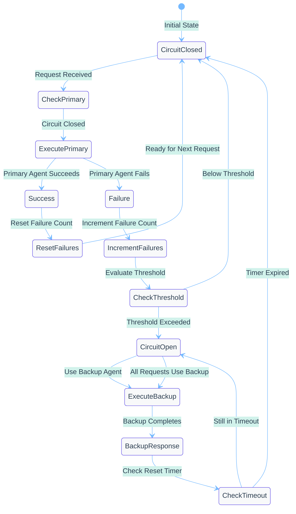
```mermaid
---
config:
  theme: base
  themeVariables:
    primaryColor: "#f8f9fa"
    primaryTextColor: "#2c3e50"
    primaryBorderColor: "#6c5ce7"
    lineColor: "#74b9ff"
    secondaryColor: "#d1f2eb"
    tertiaryColor: "#ffeaa7"
    background: "#ffffff"
    mainBkg: "#f8f9fa"
    secondBkg: "#d1f2eb"
    tertiaryBkg: "#ffeaa7"
---
stateDiagram-v2
    [*] --> CircuitClosed: Initial State
    
    CircuitClosed --> CheckPrimary: Request Received
    CheckPrimary --> ExecutePrimary: Circuit Closed
    ExecutePrimary --> Success: Primary Agent Succeeds
    ExecutePrimary --> Failure: Primary Agent Fails
    
    Success --> ResetFailures: Reset Failure Count
    ResetFailures --> CircuitClosed: Ready for Next Request
    
    Failure --> IncrementFailures: Increment Failure Count
    IncrementFailures --> CheckThreshold: Evaluate Threshold
    CheckThreshold --> CircuitClosed: Below Threshold
    CheckThreshold --> CircuitOpen: Threshold Exceeded
    
    CircuitOpen --> ExecuteBackup: Use Backup Agent
    ExecuteBackup --> BackupResponse: Backup Completes
    BackupResponse --> CheckTimeout: Check Reset Timer
    CheckTimeout --> CircuitClosed: Timer Expired
    CheckTimeout --> CircuitOpen: Still in Timeout
    
    CircuitOpen --> ExecuteBackup: All Requests Use Backup
```

#### When to Build Custom Agents

**✅ Build Custom Agents When:**
- **Standard patterns are insufficient** for your specific requirements
- **Complex business logic** needs to be embedded in the orchestration
- **External system integration** requires specialized handling
- **Performance optimization** demands custom control flow
- **Regulatory compliance** requires auditable decision processes

**⌠Consider Standard Agents When:**
- **Standard patterns meet your needs** (they cover 80% of use cases)
- **Development speed** is more important than customization
- **Team expertise** is limited with custom development
- **Maintenance complexity** is a concern

## **Interactive Challenge** 🎯

Before moving to the next chapter, design your own multi-agent system:

1. **Choose a business scenario** from your industry or interests
2. **Identify the different types of intelligence** needed (reasoning, orchestration, custom logic)
3. **Map each requirement** to the appropriate agent type
4. **Design the coordination pattern** between agents
5. **Consider the tools** each agent would need

This exercise will help solidify your understanding of when and how to use each agent type effectively.

---

## Choosing the Right Agent Architecture

The decision of which agent types to use depends on your specific requirements, but here's a practical framework for making the choice:

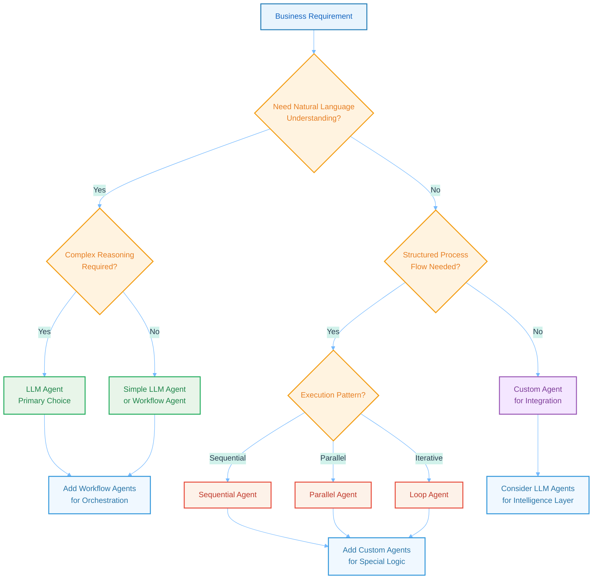
```mermaid
---
config:
  theme: base
  themeVariables:
    primaryColor: "#f8f9fa"
    primaryTextColor: "#2c3e50" 
    primaryBorderColor: "#6c5ce7"
    lineColor: "#74b9ff"
    secondaryColor: "#d1f2eb"
    tertiaryColor: "#ffeaa7"
    background: "#ffffff"
    mainBkg: "#f8f9fa"
    secondBkg: "#d1f2eb"
    tertiaryBkg: "#ffeaa7"
---
flowchart TD
    A[Business Requirement] --> B{Need Natural Language<br/>Understanding?}
    
    B -->|Yes| C{Complex Reasoning<br/>Required?}
    B -->|No| D{Structured Process<br/>Flow Needed?}
    
    C -->|Yes| E[LLM Agent<br/>Primary Choice]
    C -->|No| F[Simple LLM Agent<br/>or Workflow Agent]
    
    D -->|Yes| G{Execution Pattern?}
    D -->|No| H[Custom Agent<br/>for Integration]
    
    G -->|Sequential| I[Sequential Agent]
    G -->|Parallel| J[Parallel Agent]  
    G -->|Iterative| K[Loop Agent]
    
    E --> L[Add Workflow Agents<br/>for Orchestration]
    F --> L
    I --> M[Add Custom Agents<br/>for Special Logic]
    J --> M
    K --> M
    H --> N[Consider LLM Agents<br/>for Intelligence Layer]
    
    classDef start fill:#e8f4fd,stroke:#2980b9,stroke-width:2px,color:#1565c0
    classDef decision fill:#fff3e0,stroke:#f39c12,stroke-width:2px,color:#e67e22
    classDef llm fill:#e8f5e9,stroke:#27ae60,stroke-width:2px,color:#1e8449
    classDef workflow fill:#fdf2e9,stroke:#e74c3c,stroke-width:2px,color:#c0392b
    classDef custom fill:#f4e6ff,stroke:#9b59b6,stroke-width:2px,color:#7d3c98
    classDef combination fill:#f0f8ff,stroke:#3498db,stroke-width:2px,color:#2874a6
    
    class A start
    class B,C,D,G decision
    class E,F llm
    class I,J,K workflow
    class H custom
    class L,M,N combination
```

### Pro Tips for Agent Architecture 💡

**1. Start Simple, Scale Gradually**: Begin with single LLM Agents for new features, then introduce workflow orchestration as complexity grows.

**2. Specialize Agents by Domain**: Create focused agents with deep expertise rather than general-purpose agents that try to do everything.

**3. Use Workflow Agents for Predictability**: When you need guaranteed execution patterns, workflow agents provide reliability that LLM agents cannot match.

**4. Reserve Custom Agents for Unique Requirements**: Custom agents provide unlimited flexibility but require more development and maintenance effort.

**5. Combine Agent Types Strategically**: The most powerful systems combine different agent types—LLM Agents for intelligence, Workflow Agents for orchestration, and Custom Agents for specialized logic.

---

Understanding these three agent types and their appropriate use cases is fundamental to building effective agent systems with ADK. Each type has distinct strengths and optimal scenarios, and the most sophisticated systems often combine multiple types to create comprehensive solutions.

**Ready to extend your agents with powerful capabilities? Chapter 5 will dive deep into Tools and Capabilities, showing you how to give your agents the ability to interact with the world and perform real work.**


### Built-in Tools Arsenal

Tools are the capabilities that agents can use to interact with the world and accomplish tasks. ADK provides a rich ecosystem of built-in tools that enable agents to perform a wide range of functions.

#### Core Built-in Tools

ADK includes several powerful built-in tools:

- **Google Search integration**: Access to web search capabilities
- **Code execution**: Run Python code to perform calculations or data processing
- **File operations**: Read, write, and manipulate files
- **Database connectors**: Interact with various database systems
- **API clients**: Connect to external services and APIs

#### Implementing Custom Tools

Custom tools in ADK are simply Python functions with type hints and docstrings:

```python
def get_weather(city: str) -> dict:
    """Retrieves the current weather report for a specified city.

    Args:
        city (str): The name of the city for which to retrieve the weather report.

    Returns:
        dict: status and result or error msg.
    """
    # Implementation here
    return {"status": "success", "report": f"The weather in {city} is sunny."}
```

The docstring is crucial as it tells the agent what the tool does and how to use it.

### Tool Usage Patterns

Agents use tools through a reasoning process:

1. **Intent Recognition**: Understanding what the user wants
2. **Tool Selection**: Choosing the appropriate tool
3. **Parameter Extraction**: Identifying required parameters
4. **Tool Execution**: Calling the tool with parameters
5. **Response Synthesis**: Incorporating tool results into a response

### Third-party Integrations

ADK is designed to work with existing AI ecosystems, offering compatibility with popular frameworks and tools.

### LangChain Integration

ADK can seamlessly integrate with LangChain tools and components:

```python
from langchain.tools import BaseTool
from google.adk.agents import LlmAgent

# Import LangChain tool
from langchain.tools import DuckDuckGoSearchRun
search_tool = DuckDuckGoSearchRun()

# Wrap LangChain tool for ADK
def search_web(query: str) -> str:
    """Search the web for information.

    Args:
        query (str): The search query.

    Returns:
        str: Search results.
    """
    return search_tool.run(query)

# Use in ADK agent
research_agent = LlmAgent(
    name="research_agent",
    model="gemini-2.0-flash",
    tools=[search_web],
    description="Research information from the web"
)
```

#### CrewAI Compatibility

ADK can work alongside CrewAI for team-based agent orchestration:

```python
from google.adk.agents import LlmAgent
from crewai import Agent as CrewAgent, Task, Crew

# Create ADK agent
adk_agent = LlmAgent(
    name="data_processor",
    model="gemini-2.0-flash",
    tools=[process_data_tool],
    description="Process and analyze data"
)

# Create CrewAI agents
researcher = CrewAgent(
    role="Researcher",
    goal="Find relevant information",
    backstory="Expert at finding information"
)

writer = CrewAgent(
    role="Writer",
    goal="Create compelling content",
    backstory="Skilled content creator"
)

# Create tasks
research_task = Task(
    description="Research the topic",
    agent=researcher
)

writing_task = Task(
    description="Write content based on research",
    agent=writer
)

# Create crew
content_crew = Crew(
    agents=[researcher, writer],
    tasks=[research_task, writing_task]
)

# Execute crew workflow
result = content_crew.kickoff()

# Pass result to ADK agent
# Implementation depends on specific integration needs
```

#### OpenAPI Specifications

ADK supports OpenAPI specifications for integrating with RESTful services:

1. **Define API specification**: Create or obtain an OpenAPI specification for the service
2. **Generate client**: Use the specification to generate a client
3. **Create tool wrapper**: Wrap the client in a tool function
4. **Add to agent**: Include the tool in your agent's tools list

### Custom Tool Development

Creating custom tools allows you to extend agent capabilities with domain-specific functionality.

#### Best Practices for Tool Design

When developing custom tools, follow these best practices:

- **Clear docstrings**: Provide detailed descriptions of what the tool does
- **Type hints**: Use Python type hints to specify parameter and return types
- **Consistent return format**: Standardize return formats for predictable behavior
- **Error handling**: Gracefully handle errors and provide informative messages
- **Statelessness**: Design tools to be stateless when possible

#### Example: Content Creation Tool

Here's an example of a custom tool for content creation:

```python
def generate_social_post(topic: str, platform: str, tone: str = "professional") -> dict:
    """Generates a social media post based on the given parameters.

    Args:
        topic (str): The main subject of the post.
        platform (str): The social media platform (e.g., Twitter, LinkedIn, Instagram).
        tone (str, optional): The tone of the post (e.g., professional, casual, humorous).
            Defaults to "professional".

    Returns:
        dict: A dictionary containing the generated post and metadata.
    """
    # Implementation would generate content based on parameters
    # This is a simplified example

    if platform.lower() == "twitter":
        max_length = 280
    elif platform.lower() == "linkedin":
        max_length = 3000
    else:
        max_length = 1000

    # Generate content based on topic, platform, and tone
    # In a real implementation, this might use templates or another LLM

    return {
        "status": "success",
        "post": f"Sample {tone} post about {topic} for {platform}",
        "character_count": len(f"Sample {tone} post about {topic} for {platform}"),
        "platform": platform,
        "hashtags": [f"#{topic.replace(' ', '')}", "#content"]
    }
```

### **Interactive Challenge** 🎯

Before moving on, try designing a custom tool for a specific business need:

1. Identify a repetitive task in your organization
2. Define the inputs and outputs for a tool to automate this task
3. Write a docstring that clearly explains what the tool does
4. Consider how an agent would use this tool to solve real problems

---

## Chapter 5: Tools and Capabilities – Extending Agent Power

## Introduction

Tools are the bridge between your agent's intelligence and the real world. They transform a language model from a conversational interface into an active problem-solver, capable of retrieving data, performing computations, and taking actions. In the Google Agent Development Kit (ADK), tools enable three primary use cases: **augmenting knowledge**, **extending capabilities**, and **taking real-world actions**.

Think of tools as superpowers for your agent—each tool expands what your agent can do beyond generating text.

## What Are Tools in ADK?

A **tool** in ADK is any callable function that an agent can invoke to accomplish specific tasks. Tools are defined using function declarations that follow the OpenAPI schema format, making them compatible with Google's Gemini models and other AI systems.

### The Three Pillars of Tool Usage

Based on Google's official documentation, tools serve three fundamental purposes:

1. **Augment Knowledge**: Access information from external sources like databases, APIs, and knowledge bases
2. **Extend Capabilities**: Use external tools to perform computations beyond the model's limitations
3. **Take Actions**: Interact with external systems using APIs to control devices, send emails, or update databases

### Why Tools Are Essential

- **Break through model limitations**: Access real-time data, perform complex calculations, and interact with systems
- **Enable dynamic responses**: Provide up-to-date information instead of relying on training data
- **Create actionable agents**: Move beyond conversation to actual problem-solving and task execution
- **Ensure modularity**: Build reusable capabilities that work across different agents and applications

## Tool Architecture and Function Calling in ADK

Google's Gemini models power ADK's function calling capabilities, enabling sophisticated tool usage through a structured four-step process:

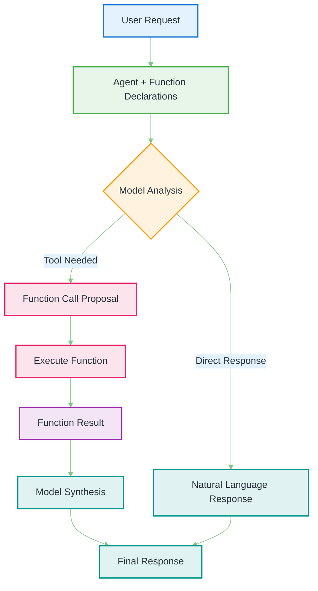
```mermaid
---
config:
  theme: base
  themeVariables:
    primaryColor: "#e8f5e9"
    primaryTextColor: "#263238"
    primaryBorderColor: "#4caf50"
    lineColor: "#81c784"
    secondaryColor: "#e3f2fd"
    tertiaryColor: "#fff3e0"
    background: "#ffffff"
    mainBkg: "#e8f5e9"
    secondBkg: "#e3f2fd"
    tertiaryBkg: "#fff3e0"
---
flowchart TD
    A[User Request] --> B[Agent + Function Declarations]
    B --> C{Model Analysis}
    C -->|Tool Needed| D[Function Call Proposal]
    C -->|Direct Response| E[Natural Language Response]
    D --> F[Execute Function]
    F --> G[Function Result]
    G --> H[Model Synthesis]
    H --> I[Final Response]
    E --> I

    classDef user fill:#e3f2fd,stroke:#1976d2,stroke-width:2px,color:#263238
    classDef agent fill:#e8f5e9,stroke:#4caf50,stroke-width:2px,color:#263238
    classDef logic fill:#fff3e0,stroke:#ff9800,stroke-width:2px,color:#263238
    classDef tool fill:#fce4ec,stroke:#e91e63,stroke-width:2px,color:#263238
    classDef result fill:#f3e5f5,stroke:#9c27b0,stroke-width:2px,color:#263238
    classDef response fill:#e0f2f1,stroke:#009688,stroke-width:2px,color:#263238

    class A user
    class B agent
    class C logic
    class D,F tool
    class G result
    class E,H,I response
```

### The Four-Step Function Calling Process

1. **Function Declaration**: Define tools using OpenAPI-compatible schemas
2. **Model Analysis**: The agent determines if a tool is needed based on user intent
3. **Function Execution**: Your application executes the proposed function call
4. **Response Integration**: The model incorporates function results into the final response

---

## Built-in Tools and Ecosystem

ADK integrates with Google's extensive tool ecosystem and supports industry-standard frameworks:

### Google Cloud Native Tools

- **Google Search**: Real-time web search capabilities with structured results
- **Code Execution**: Secure Python code execution environment
- **Vertex AI APIs**: Access to Google's AI services for specialized tasks
- **Cloud Functions**: Serverless function execution for scalable operations

### Third-Party Ecosystem Integration

ADK seamlessly integrates with popular frameworks and tools from the broader AI ecosystem. Based on LangChain's extensive tool library, you can access hundreds of pre-built integrations:

#### Search and Data Retrieval

- **Web Search**: Brave Search, DuckDuckGo, Google Serper, Tavily Search
- **Academic**: ArXiv, PubMed, Semantic Scholar
- **Financial**: Alpha Vantage, Yahoo Finance, FMP Data
- **Social**: Reddit Search, YouTube, Twitter

#### Productivity and Business

- **Communication**: Gmail Toolkit, Slack Toolkit, Twilio
- **Project Management**: Jira, ClickUp, Notion
- **Development**: GitHub Toolkit, GitLab Toolkit
- **CRM**: Salesforce, HubSpot integrations

#### Databases and Analytics

- **SQL Databases**: PostgreSQL, MySQL, SQLite
- **NoSQL**: Cassandra, MongoDB
- **Analytics**: BigQuery, Spark SQL, Tableau
- **Cloud Storage**: Google Drive, AWS S3, Azure Blob

---

## Creating Custom Tools: The OpenAPI Standard

ADK follows Google's function calling specification, which is based on the OpenAPI schema format. This ensures compatibility across the entire Google AI ecosystem.

### Function Declaration Structure

Every tool in ADK is defined using a function declaration with three key components:

```python
def get_weather(city: str, units: str = "celsius") -> dict:
    """Get current weather information for a specified city.

    This function retrieves real-time weather data including temperature,
    humidity, and conditions for any city worldwide.

    Args:
        city (str): The city name and optionally state/country (e.g., "Boston, MA")
        units (str): Temperature units - "celsius", "fahrenheit", or "kelvin"

    Returns:
        dict: Weather data with status, temperature, conditions, and humidity
    """
    # Simulated API call
    return {
        "status": "success",
        "temperature": 22,
        "units": units,
        "conditions": "partly cloudy",
        "humidity": 65,
        "city": city
    }
```

### OpenAPI Schema Components

Based on Google's official specification, ADK supports a subset of the OpenAPI 3.0 schema format:

- **`name`**: Unique function identifier (alphanumeric, underscores, camelCase - no spaces, periods, or dashes)
- **`description`**: Clear, detailed explanation of function purpose and capabilities with examples
- **`parameters`**: Input specification using JSON schema with these supported types:
  - `type`: `"object"` (required for parameters root)
  - `properties`: Individual parameter definitions
  - `type` per property: `string`, `integer`, `boolean`, `array`, `object`
  - `description`: Parameter purpose and format constraints
  - `enum`: Fixed sets of allowed values for improved accuracy
  - `required`: Array of mandatory parameter names

### Best Practices from Google Documentation

**Function Naming**: Use descriptive function names without spaces, periods, or dashes. Examples: `get_weather_forecast`, `send_email`, `calculate_distance`

**Clear Descriptions**: Be extremely specific and provide context. Examples:

- ⌠"Gets weather"
- ✅ "Finds theaters based on location and optionally movie title which is currently playing in theaters"
- ✅ "Book flight tickets after confirming users' specific requirements, such as time, departure, destination, party size and preferred airline"

**Strong Typing**: Use specific types and enums instead of generic descriptions:

- Use `enum` for limited sets: `"enum": ["daylight", "cool", "warm"]`
- Provide format examples: "The city and state, e.g., 'San Francisco, CA' or a zip code e.g., '95616'"
- Be specific about constraints: "Light level from 0 to 100. Zero is off and 100 is full brightness"

**Tool Selection**: While the model can use many tools, providing too many can increase the risk of incorrect selection. For best results, aim for 10-20 tools maximum in the active set.

## Advanced Function Calling Capabilities

Google's Gemini models support sophisticated function calling patterns that enable complex workflows and robust applications.

### Parallel Function Calling

Parallel function calling allows the model to execute multiple independent functions simultaneously, dramatically improving efficiency for tasks that don't depend on each other.

#### Use Cases for Parallel Execution

- **Data Gathering**: Collect information from multiple sources simultaneously
- **Multi-Service Queries**: Check status across different systems at once
- **Batch Processing**: Perform multiple similar operations in parallel
- **Multi-Modal Analysis**: Process different types of media simultaneously

#### Implementation Example: Morning Briefing System

```python
from google.adk.agents import LlmAgent

# Define independent data collection tools
def get_weather(location: str) -> dict:
    """Get current weather for a location.

    Args:
        location (str): City and state/country

    Returns:
        dict: Weather data including temperature and conditions
    """
    return {
        "status": "success",
        "location": location,
        "temperature": 22,
        "conditions": "partly cloudy"
    }

def get_traffic(origin: str, destination: str) -> dict:
    """Get traffic information between two points.

    Args:
        origin (str): Starting location
        destination (str): Destination location

    Returns:
        dict: Traffic data including duration and route info
    """
    return {
        "status": "success",
        "duration": "25 minutes",
        "traffic_level": "light",
        "recommended_route": "Highway 101"
    }

def get_calendar(date: str) -> dict:
    """Get calendar events for a specific date.

    Args:
        date (str): Date in YYYY-MM-DD format

    Returns:
        dict: Calendar events and scheduling info
    """
    return {
        "status": "success",
        "events": [
            {"time": "09:00", "title": "Team Meeting", "duration": "1 hour"},
            {"time": "14:00", "title": "Client Call", "duration": "30 minutes"}
        ]
    }

def get_news_headlines() -> dict:
    """Get current news headlines.

    Returns:
        dict: Top news stories and headlines
    """
    return {
        "status": "success",
        "headlines": [
            "Tech stocks rally after positive earnings",
            "New climate initiative launched globally"
        ]
    }

# Create agent with parallel function calling
briefing_agent = LlmAgent(
    name="morning_briefing_agent",
    model="gemini-2.0-flash",
    tools=[get_weather, get_traffic, get_calendar, get_news_headlines],
    description="Comprehensive morning briefing assistant",
    instruction="""You provide complete morning briefings by gathering information
    from multiple sources simultaneously. When asked for a briefing, call all
    relevant functions in parallel to provide weather, traffic, calendar, and news."""
)
```

#### Parallel Execution Flow

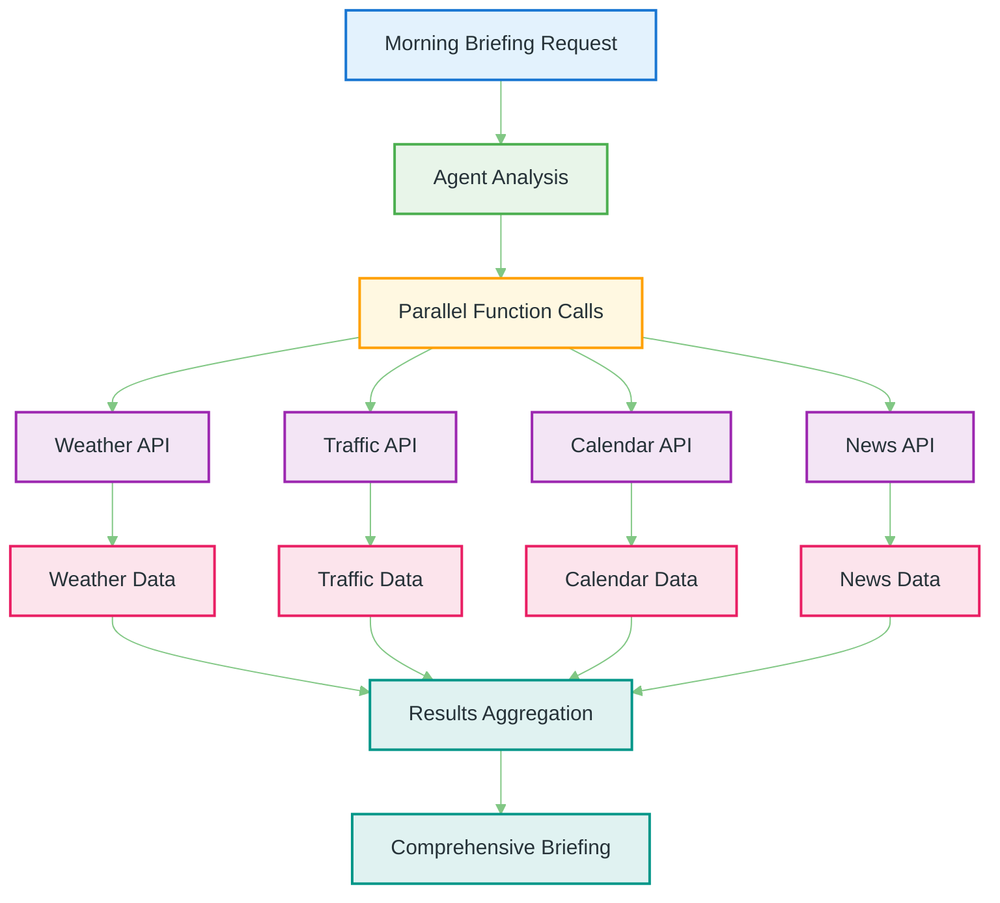
```mermaid
---
config:
  theme: base
  themeVariables:
    primaryColor: "#e8f5e9"
    primaryTextColor: "#263238"
    primaryBorderColor: "#4caf50"
    lineColor: "#81c784"
    secondaryColor: "#e3f2fd"
    tertiaryColor: "#fff8e1"
    background: "#ffffff"
    mainBkg: "#e8f5e9"
    secondBkg: "#e3f2fd"
    tertiaryBkg: "#fff8e1"
---
flowchart TD
    A[Morning Briefing Request] --> B[Agent Analysis]
    B --> C[Parallel Function Calls]

    C --> D[Weather API]
    C --> E[Traffic API]
    C --> F[Calendar API]
    C --> G[News API]

    D --> H[Weather Data]
    E --> I[Traffic Data]
    F --> J[Calendar Data]
    G --> K[News Data]

    H --> L[Results Aggregation]
    I --> L
    J --> L
    K --> L

    L --> M[Comprehensive Briefing]

    classDef request fill:#e3f2fd,stroke:#1976d2,stroke-width:2px,color:#263238
    classDef agent fill:#e8f5e9,stroke:#4caf50,stroke-width:2px,color:#263238
    classDef parallel fill:#fff8e1,stroke:#ffa000,stroke-width:2px,color:#263238
    classDef api fill:#f3e5f5,stroke:#9c27b0,stroke-width:2px,color:#263238
    classDef data fill:#fce4ec,stroke:#e91e63,stroke-width:2px,color:#263238
    classDef result fill:#e0f2f1,stroke:#009688,stroke-width:2px,color:#263238

    class A request
    class B agent
    class C parallel
    class D,E,F,G api
    class H,I,J,K data
    class L,M result
```

### Compositional Function Calling

Compositional function calling enables chaining multiple function calls where the output of one function becomes the input for another, creating sophisticated workflows.

#### Sequential Decision Making

```python
def get_user_location() -> dict:
    """Get the user's current location.

    Returns:
        dict: Location data with coordinates and address
    """
    return {
        "status": "success",
        "latitude": 37.7749,
        "longitude": -122.4194,
        "city": "San Francisco",
        "state": "CA"
    }

def find_nearby_restaurants(location: str, cuisine: str = "any") -> dict:
    """Find restaurants near a location.

    Args:
        location (str): City and state
        cuisine (str): Type of cuisine preference

    Returns:
        dict: List of nearby restaurants with ratings
    """
    return {
        "status": "success",
        "restaurants": [
            {"name": "Golden Gate Bistro", "rating": 4.5, "cuisine": "American"},
            {"name": "Sakura Sushi", "rating": 4.7, "cuisine": "Japanese"},
            {"name": "Luigi's Pizza", "rating": 4.2, "cuisine": "Italian"}
        ]
    }

def check_restaurant_availability(restaurant_name: str, party_size: int, time: str) -> dict:
    """Check if a restaurant has availability.

    Args:
        restaurant_name (str): Name of the restaurant
        party_size (int): Number of people
        time (str): Preferred time (e.g., "7:00 PM")

    Returns:
        dict: Availability status and reservation options
    """
    return {
        "status": "success",
        "available": True,
        "available_times": ["6:30 PM", "7:00 PM", "7:30 PM"],
        "estimated_wait": "15 minutes"
    }

def make_reservation(restaurant_name: str, party_size: int, time: str, contact: str) -> dict:
    """Make a restaurant reservation.

    Args:
        restaurant_name (str): Restaurant name
        party_size (int): Number of people
        time (str): Reservation time
        contact (str): Contact information

    Returns:
        dict: Reservation confirmation details
    """
    return {
        "status": "success",
        "confirmation_number": "RSV-12345",
        "restaurant": restaurant_name,
        "time": time,
        "party_size": party_size
    }

# Compositional agent that chains these functions
restaurant_agent = LlmAgent(
    name="restaurant_booking_agent",
    model="gemini-2.0-flash",
    tools=[get_user_location, find_nearby_restaurants, check_restaurant_availability, make_reservation],
    description="Complete restaurant discovery and booking assistant",
    instruction="""Help users find and book restaurants by following this process:
    1. First, get the user's location
    2. Find restaurants near them based on preferences
    3. Check availability at recommended restaurants
    4. Make reservations when requested
    Use the information from each step to inform the next."""
)
```

#### Compositional Flow Visualization

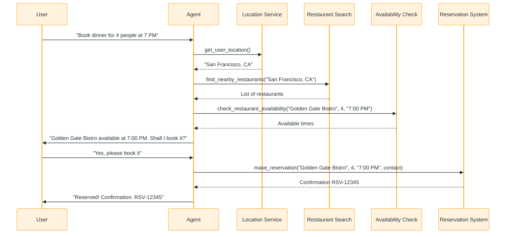
```mermaid
---
config:
  theme: base
  themeVariables:
    primaryColor: "#fff3e0"
    primaryTextColor: "#263238"
    primaryBorderColor: "#ff9800"
    lineColor: "#ffb74d"
    secondaryColor: "#e8f5e9"
    tertiaryColor: "#e3f2fd"
    background: "#ffffff"
    mainBkg: "#fff3e0"
    secondBkg: "#e8f5e9"
    tertiaryBkg: "#e3f2fd"
---
sequenceDiagram
    participant User
    participant Agent
    participant Location as Location Service
    participant Search as Restaurant Search
    participant Availability as Availability Check
    participant Booking as Reservation System

    User->>Agent: "Book dinner for 4 people at 7 PM"
    Agent->>Location: get_user_location()
    Location-->>Agent: "San Francisco, CA"

    Agent->>Search: find_nearby_restaurants("San Francisco, CA")
    Search-->>Agent: List of restaurants

    Agent->>Availability: check_restaurant_availability("Golden Gate Bistro", 4, "7:00 PM")
    Availability-->>Agent: Available times

    Agent->>User: "Golden Gate Bistro available at 7:00 PM. Shall I book it?"
    User->>Agent: "Yes, please book it"

    Agent->>Booking: make_reservation("Golden Gate Bistro", 4, "7:00 PM", contact)
    Booking-->>Agent: Confirmation RSV-12345

    Agent->>User: "Reserved! Confirmation: RSV-12345"
```

### Forced Function Calling

Forced function calling constrains the model to always use specific tools, ensuring predictable behavior and tool usage in critical scenarios.

#### Function Calling Modes

ADK supports three function calling modes based on Google's official specification:

- **AUTO** (Default): The model decides whether to generate a natural language response or suggest a function call based on the prompt and context. This is the most flexible mode and recommended for most scenarios.
- **ANY**: The model is constrained to always predict a function call and guarantees function schema adherence. If `allowed_function_names` is not specified, the model can choose from any of the provided function declarations. If `allowed_function_names` is provided as a list, the model can only choose from functions in that list. Use this mode when you require a function call response to every prompt.
- **NONE**: The model is prohibited from making function calls. This is equivalent to sending a request without any function declarations. Use this to temporarily disable function calling without removing your tool definitions.

```python
from google.adk.types import ToolConfig, FunctionCallingConfig

# Configure function calling mode
tool_config = ToolConfig(
    function_calling_config=FunctionCallingConfig(
        mode="ANY",  # Force function calling
        allowed_function_names=["extract_customer_info"]  # Optional: restrict to specific functions
    )
)
```

#### Implementation Example: Structured Data Extraction

```python
from google.adk.agents import LlmAgent
from google.adk.types import ToolConfig, FunctionCallingConfig

def extract_customer_info(name: str, email: str, phone: str, company: str) -> dict:
    """Extract and validate customer information.

    Args:
        name (str): Customer full name
        email (str): Email address
        phone (str): Phone number
        company (str): Company name

    Returns:
        dict: Validated customer information
    """
    return {
        "status": "success",
        "customer_id": "CUST-001",
        "name": name,
        "email": email,
        "phone": phone,
        "company": company,
        "validation_status": "verified"
    }

def extract_order_details(product: str, quantity: int, price: float, delivery_date: str) -> dict:
    """Extract order information from text.

    Args:
        product (str): Product name or description
        quantity (int): Number of items ordered
        price (float): Unit price
        delivery_date (str): Requested delivery date

    Returns:
        dict: Structured order information
    """
    return {
        "status": "success",
        "order_id": "ORD-001",
        "product": product,
        "quantity": quantity,
        "price": price,
        "total": quantity * price,
        "delivery_date": delivery_date
    }

# Forced function calling configuration
extraction_agent = LlmAgent(
    name="data_extraction_agent",
    model="gemini-2.0-flash",
    tools=[extract_customer_info, extract_order_details],
    tool_config=ToolConfig(
        function_calling_config=FunctionCallingConfig(
            mode="ANY",  # Force function calling
            allowed_function_names=["extract_customer_info", "extract_order_details"]
        )
    ),
    description="Structured data extraction specialist",
    instruction="""You must always use the appropriate extraction function to
    structure the provided information. Analyze the input text and call the
    appropriate function with the extracted data."""
)
```

---

## Tool Usage Patterns

Agents use tools through a reasoning process:

1. **Intent Recognition**: Understand what the user wants.
2. **Tool Selection**: Choose the right tool.
3. **Parameter Extraction**: Identify required inputs.
4. **Tool Execution**: Call the tool.
5. **Response Synthesis**: Incorporate results into the reply.

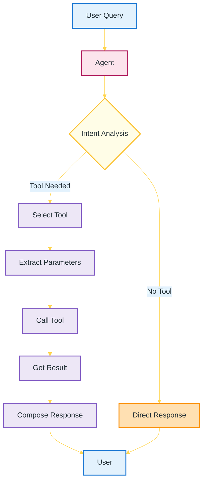
```mermaid
---
config:
  theme: base
  themeVariables:
    primaryColor: "#fffde7"
    primaryTextColor: "#263238"
    primaryBorderColor: "#fbc02d"
    lineColor: "#ffd54f"
    secondaryColor: "#e3f2fd"
    tertiaryColor: "#fce4ec"
    background: "#ffffff"
    mainBkg: "#fffde7"
    secondBkg: "#e3f2fd"
    tertiaryBkg: "#fce4ec"
---
flowchart TD
    A[User Query] --> B[Agent]
    B --> C{Intent Analysis}
    C -->|Tool Needed| D[Select Tool]
    D --> E[Extract Parameters]
    E --> F[Call Tool]
    F --> G[Get Result]
    G --> H[Compose Response]
    H --> I[User]
    C -->|No Tool| J[Direct Response]
    J --> I

    classDef user fill:#e3f2fd,stroke:#1976d2,stroke-width:2px,color:#263238
    classDef agent fill:#fce4ec,stroke:#ad1457,stroke-width:2px,color:#263238
    classDef logic fill:#fffde7,stroke:#fbc02d,stroke-width:2px,color:#263238
    classDef tool fill:#ede7f6,stroke:#7e57c2,stroke-width:2px,color:#263238
    classDef result fill:#ffe0b2,stroke:#fb8c00,stroke-width:2px,color:#263238

    class A,I user
    class B agent
    class C logic
    class D,E,F,G,H tool
    class J result
```

---

## Advanced Tool Integration Patterns

### Model Context Protocol (MCP) Support

ADK includes experimental built-in support for the Model Context Protocol (MCP), an open standard for connecting AI applications with external tools and data sources. This feature is available in the Python and JavaScript/TypeScript SDKs.

#### MCP Capabilities and Limitations

**Current Support**:

- Tools (functions) are fully supported
- Automatic tool calling with MCP servers
- Direct integration with Gemini models

**Limitations**:

- Resources and prompts are not yet supported
- Feature is experimental and may have breaking changes
- Currently limited to Python and JavaScript/TypeScript SDKs

#### Implementation Example

```python
import asyncio
from datetime import datetime
from mcp import ClientSession, StdioServerParameters
from mcp.client.stdio import stdio_client
from google import genai

# Configure MCP server (example: weather service)
server_params = StdioServerParameters(
    command="npx",
    args=["-y", "@philschmid/weather-mcp"],
    env=None
)

async def use_mcp_weather():
    # Initialize Gemini client
    client = genai.Client(api_key="YOUR_API_KEY")

    async with stdio_client(server_params) as (read, write):
        async with ClientSession(read, write) as session:
            # Initialize MCP session
            await session.initialize()

            # Use MCP session as a tool
            response = await client.aio.models.generate_content(
                model="gemini-2.5-flash",
                contents=f"What is the weather in London on {datetime.now().strftime('%Y-%m-%d')}?",
                config=genai.types.GenerateContentConfig(
                    temperature=0,
                    tools=[session],  # MCP session provides tools automatically
                    # Optional: disable automatic function calling
                    # automatic_function_calling=genai.types.AutomaticFunctionCallingConfig(disable=True)
                )
            )

            print(response.text)

# Run the async function
asyncio.run(use_mcp_weather())
```

**Manual MCP Integration**: If the built-in support doesn't meet your needs, you can always integrate MCP servers manually by implementing the protocol directly.

### LangChain Tool Integration

ADK can integrate with the extensive LangChain ecosystem by wrapping LangChain tools as ADK functions:

```python
from langchain.tools import DuckDuckGoSearchRun
from google import genai

# Wrap LangChain tool as ADK function
search_tool = DuckDuckGoSearchRun()

def search_web(query: str) -> str:
    """Search the web for current information using DuckDuckGo.

    Args:
        query (str): Search terms to find relevant information on the web

    Returns:
        str: Search results with URLs, titles, and snippets from DuckDuckGo
    """
    return search_tool.run(query)

# Use with Gemini models
client = genai.Client(api_key="YOUR_API_KEY")
config = genai.types.GenerateContentConfig(
    tools=[search_web],
    temperature=0
)

response = client.models.generate_content(
    model="gemini-2.5-flash",
    contents="What are the latest developments in quantum computing?",
    config=config
)
```

This pattern allows you to leverage hundreds of pre-built LangChain tools including database connectors, API integrations, and specialized utilities.

### Automatic Function Calling (Python SDK Only)

The Python SDK supports automatic function calling, which streamlines the development process by:

1. **Automatic Schema Generation**: Converts Python functions with type hints and docstrings to function declarations
2. **Automatic Execution**: Detects function call responses and executes the corresponding Python functions
3. **Response Handling**: Sends function results back to the model automatically
4. **Final Response**: Returns the model's synthesized text response

```python
from google import genai
from google.genai import types

def get_temperature(location: str) -> dict:
    """Gets the current temperature for a given location.

    Args:
        location: The city and state, e.g. San Francisco, CA

    Returns:
        A dictionary containing the temperature and unit.
    """
    # Implementation would call weather API
    return {"temperature": 25, "unit": "Celsius"}

# Configure with automatic function calling
client = genai.Client(api_key="YOUR_API_KEY")
config = types.GenerateContentConfig(
    tools=[get_temperature]  # Pass the function directly
)

# The SDK handles the complete flow automatically
response = client.models.generate_content(
    model="gemini-2.5-flash",
    contents="What's the temperature in Boston?",
    config=config
)

print(response.text)  # Gets the final synthesized response
```

#### Disabling Automatic Function Calling

You can disable automatic execution while still using Python functions for schema generation:

```python
config = types.GenerateContentConfig(
    tools=[get_temperature],
    automatic_function_calling=types.AutomaticFunctionCallingConfig(disable=True)
)
```

#### Schema Generation Limitations

Automatic schema extraction works with these Python types:

```python
AllowedType = (int | float | bool | str | list['AllowedType'] | dict[str, AllowedType])
```

For complex nested objects or when automatic extraction doesn't meet your needs, define schemas manually using the function declaration format.

### Multi-Tool Use: Combining Native Tools with Function Calling

ADK supports combining multiple tool types in a single request, including native Google tools and custom function declarations. This is currently available through the Live API:

```python
# Example combining Google Search, Code Execution, and custom functions
tools = [
    {'google_search': {}},
    {'code_execution': {}},
    {'function_declarations': [turn_on_lights_schema, get_weather_schema]}
]

prompt = """
Please help me with three tasks:
1. Turn on the lights in my office
2. Calculate the fibonacci sequence for the first 10 numbers using code
3. Search for the latest weather forecast for San Francisco
"""

# Execute with multiple tool types
response = await client.models.generate_content(
    model="gemini-2.5-flash",
    contents=prompt,
    tools=tools
)
```

### Native Google Tools

ADK provides access to Google's built-in tools through the tools configuration:

- **Google Search**: Real-time web search with grounding capabilities
- **Code Execution**: Secure Python code execution environment for calculations and data processing
- **URL Context**: Extract and process information from web pages
- **File Processing**: Handle documents, images, and other media types

### Advanced Integration Patterns

**Sequential Tool Chaining**: The model can determine the order of tool execution based on dependencies:

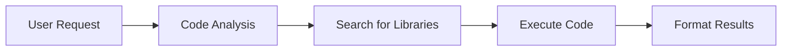
```mermaid
graph LR
    A[User Request] --> B[Code Analysis]
    B --> C[Search for Libraries]
    C --> D[Execute Code]
    D --> E[Format Results]
```

**Conditional Tool Selection**: Tools are selected based on context and previous results, enabling dynamic workflows.

---

## Tool Design Patterns and Architecture

### 1. **Single-Tool Agent**

A focused agent with one specialized tool (e.g., weather, calculator).

### 2. **Multi-Tool Agent**

A generalist agent with several tools, choosing the right one per request.

### 3. **Agent-as-Tool**

Agents can use other agents as tools, enabling composition and reuse.

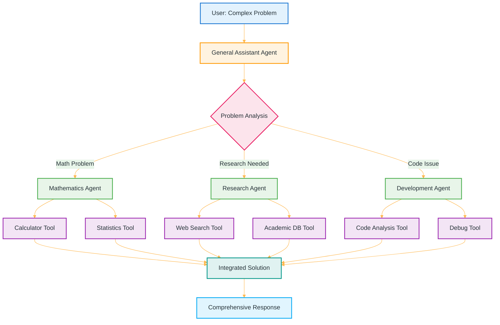
```mermaid
---
config:
  theme: base
  themeVariables:
    primaryColor: "#fff3e0"
    primaryTextColor: "#263238"
    primaryBorderColor: "#ff9800"
    lineColor: "#ffb74d"
    secondaryColor: "#e8f5e9"
    tertiaryColor: "#e3f2fd"
    background: "#ffffff"
    mainBkg: "#fff3e0"
    secondBkg: "#e8f5e9"
    tertiaryBkg: "#e3f2fd"
---
flowchart TD
    A[User: Complex Problem] --> B[General Assistant Agent]
    B --> C{Problem Analysis}

    C -->|Math Problem| D[Mathematics Agent]
    C -->|Research Needed| E[Research Agent]
    C -->|Code Issue| F[Development Agent]

    D --> G[Calculator Tool]
    D --> H[Statistics Tool]

    E --> I[Web Search Tool]
    E --> J[Academic DB Tool]

    F --> K[Code Analysis Tool]
    F --> L[Debug Tool]

    G --> M[Integrated Solution]
    H --> M
    I --> M
    J --> M
    K --> M
    L --> M

    M --> N[Comprehensive Response]

    classDef user fill:#e3f2fd,stroke:#1976d2,stroke-width:2px,color:#263238
    classDef general fill:#fff3e0,stroke:#ff9800,stroke-width:2px,color:#263238
    classDef analysis fill:#fce4ec,stroke:#e91e63,stroke-width:2px,color:#263238
    classDef specialist fill:#e8f5e9,stroke:#4caf50,stroke-width:2px,color:#263238
    classDef tool fill:#f3e5f5,stroke:#9c27b0,stroke-width:2px,color:#263238
    classDef solution fill:#e0f2f1,stroke:#009688,stroke-width:2px,color:#263238
    classDef response fill:#e1f5fe,stroke:#03a9f4,stroke-width:2px,color:#263238

    class A user
    class B general
    class C analysis
    class D,E,F specialist
    class G,H,I,J,K,L tool
    class M solution
    class N response
```

This architecture demonstrates how agents can coordinate different specialized tools to solve complex, multi-faceted problems efficiently.

---

## Production-Ready Tool Development

### Security and Validation

When building tools for production, implement robust security measures:

```python
def secure_payment_tool(amount: float, recipient: str, currency: str = "USD") -> dict:
    """Process a financial transaction with validation and security checks.

    Args:
        amount (float): Transaction amount (must be positive)
        recipient (str): Verified recipient identifier
        currency (str): ISO currency code

    Returns:
        dict: Transaction result with confirmation details
    """
    # Input validation
    if amount <= 0:
        return {"status": "error", "message": "Amount must be positive"}

    if not validate_recipient(recipient):
        return {"status": "error", "message": "Invalid recipient"}

    # Security check - require confirmation for large amounts
    if amount > 1000:
        return {
            "status": "confirmation_required",
            "message": f"Please confirm transaction of {amount} {currency} to {recipient}",
            "confirmation_token": generate_token()
        }

    # Process transaction with audit trail
    result = process_secure_transaction(amount, recipient, currency)
    log_transaction(result)

    return result
```

### Error Handling Best Practices

Implement comprehensive error handling based on Google's recommendations:

- **Graceful Degradation**: Provide meaningful error messages that help the model understand what went wrong
- **Retry Logic**: Handle temporary failures with appropriate retry mechanisms
- **Fallback Options**: Offer alternative approaches when primary tools fail
- **Audit Trails**: Log all tool executions for debugging and compliance

### Supported Models and Capabilities

Based on Google's official documentation, function calling support varies by model:

| Model                 | Function Calling | Parallel Calls | Compositional Calls |
| --------------------- | ---------------- | -------------- | ------------------- |
| Gemini 2.5 Pro        | âœ”ï¸               | âœ”ï¸             | âœ”ï¸                  |
| Gemini 2.5 Flash      | âœ”ï¸               | âœ”ï¸             | âœ”ï¸                  |
| Gemini 2.5 Flash-Lite | âœ”ï¸               | âœ”ï¸             | âœ”ï¸                  |
| Gemini 2.0 Flash      | âœ”ï¸               | âœ”ï¸             | âœ”ï¸                  |
| Gemini 2.0 Flash-Lite | ⌠              | ⌠            | ⌠                 |

### Technical Limitations

- **OpenAPI Support**: Only a [subset of the OpenAPI schema](https://ai.google.dev/api/caching#FunctionDeclaration) is supported
- **Parameter Types**: In Python, supported parameter types are limited to basic types and their combinations
- **Automatic Function Calling**: Currently available only in the Python SDK
- **Token Limits**: Function descriptions and parameters count towards input token limits

### Performance Recommendations

- **Temperature**: Use a low temperature (e.g., 0) for more deterministic and reliable function calls
- **Validation**: For functions with significant consequences (e.g., placing orders), validate the call with the user before executing
- **Error Handling**: Implement robust error handling to return informative error messages that the model can use to generate helpful responses
- **Security**: Use appropriate authentication and authorization mechanisms, avoid exposing sensitive data in function calls

---

## Example: Social Post Generator Tool

```python
def generate_social_post(topic: str, platform: str, tone: str = "professional") -> dict:
    """Generate a social media post for a given topic and platform.
    Args:
        topic (str): The subject.
        platform (str): e.g., Twitter, LinkedIn.
        tone (str): e.g., professional, casual. Default: professional.
    Returns:
        dict: Generated post and metadata.
    """
    if platform.lower() == "twitter":
        max_length = 280
    elif platform.lower() == "linkedin":
        max_length = 3000
    else:
        max_length = 1000
    post = f"Sample {tone} post about {topic} for {platform}"
    return {
        "status": "success",
        "post": post,
        "character_count": len(post),
        "platform": platform,
        "hashtags": [f"#{topic.replace(' ', '')}", "#content"]
    }
```

---

## Tool Integration Checklist

- [x] Clear docstring and type hints
- [x] Consistent return format
- [x] Error handling
- [x] Stateless design
- [x] Tested in isolation

---

## Summary

Tools are the cornerstone of agent capability in ADK, transforming language models from conversational interfaces into powerful problem-solving systems. By leveraging Google's function calling specification (based on OpenAPI schema format), you can create robust, secure, and scalable tool ecosystems.

**Key Takeaways:**

- **Follow Google's Standards**: Use the OpenAPI subset schema format for maximum compatibility across the Google AI ecosystem
- **Leverage Model Capabilities**: Different Gemini models support varying levels of function calling - choose the right model for your needs
- **Implement Security Best Practices**: Include validation, confirmation flows, and audit trails for critical operations
- **Optimize for Performance**: Use low temperature settings, limit active tool sets to 10-20 tools, and implement proper error handling
- **Integrate Broadly**: Leverage existing ecosystems like LangChain and MCP for rapid development, while understanding their limitations
- **Choose the Right Pattern**: Use parallel calling for independent operations, compositional calling for dependent workflows, and forced calling for structured data extraction

**Technical Considerations:**

- **Python SDK Advantages**: Automatic function calling, schema generation, and comprehensive MCP support
- **Model Selection**: Ensure your chosen Gemini model supports the function calling features you need
- **Schema Design**: Balance detail with token efficiency, use enums for constrained values, and provide clear examples
- **Error Handling**: Design tools to fail gracefully and provide informative error messages

With well-designed tools, your agents can access real-time data, perform complex calculations, integrate with enterprise systems, and take meaningful actions in the world. The combination of Google's robust function calling infrastructure and the rich ecosystem of available integrations provides a solid foundation for building production-ready AI applications.

**Next**: Chapter 6 will explore how to orchestrate multiple agents working together to solve complex, multi-step problems that require coordination and specialized expertise.


### Chapter 6: Multi-Agent Orchestration - Building Intelligent Teams

### Why Multi-Agent Systems?

As agentic applications grow in complexity, structuring them as a single, monolithic agent can become challenging to develop, maintain, and reason about. Multi-agent systems in ADK allow you to compose multiple, distinct `BaseAgent` instances to collaborate or coordinate in achieving larger goals.

### Key Benefits of Multi-Agent Systems

Multi-agent architectures offer several advantages:

- **Modularity**: Break complex problems into manageable components
- **Specialization**: Create agents with deep expertise in specific domains
- **Reusability**: Reuse specialized agents across different applications
- **Maintainability**: Update individual agents without affecting the entire system
- **Scalability**: Add new capabilities by integrating additional agents

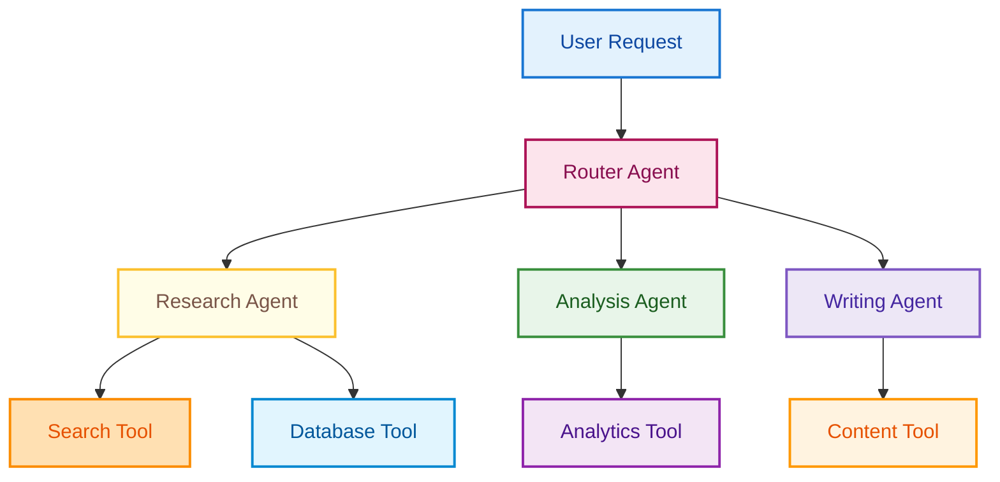
```mermaid
graph TD
    A[User Request] --> B[Router Agent]
    B --> C[Research Agent]
    B --> D[Analysis Agent]
    B --> E[Writing Agent]
    C --> F[Search Tool]
    C --> G[Database Tool]
    D --> H[Analytics Tool]
    E --> I[Content Tool]

    %% Professional pastel color palette with strong contrast
    style A fill:#e3f2fd,stroke:#1976d2,stroke-width:2px,color:#0d47a1
    style B fill:#fce4ec,stroke:#ad1457,stroke-width:2px,color:#880e4f
    style C fill:#fffde7,stroke:#fbc02d,stroke-width:2px,color:#795548
    style D fill:#e8f5e9,stroke:#388e3c,stroke-width:2px,color:#1b5e20
    style E fill:#ede7f6,stroke:#7e57c2,stroke-width:2px,color:#4527a0
    style F fill:#ffe0b2,stroke:#fb8c00,stroke-width:2px,color:#e65100
    style G fill:#e1f5fe,stroke:#0288d1,stroke-width:2px,color:#01579b
    style H fill:#f3e5f5,stroke:#8e24aa,stroke-width:2px,color:#4a148c
    style I fill:#fff3e0,stroke:#ff9800,stroke-width:2px,color:#e65100
```

### Real Example: E-commerce Platform

An e-commerce platform might implement a multi-agent system like this:

```python
# Product recommendation agent
recommendation_agent = LlmAgent(
    name="product_recommender",
    model="gemini-2.0-flash",
    tools=[product_search_tool, user_history_tool],
    description="Recommend products based on user preferences and history"
)

# Pricing agent
pricing_agent = LlmAgent(
    name="pricing_specialist",
    model="gemini-2.0-flash",
    tools=[pricing_tool, discount_tool],
    description="Provide pricing information and available discounts"
)

# Inventory agent
inventory_agent = LlmAgent(
    name="inventory_manager",
    model="gemini-2.0-flash",
    tools=[inventory_check_tool, shipping_tool],
    description="Check product availability and shipping options"
)

# Customer service orchestrator
customer_service = LlmAgent(
    name="customer_service",
    model="gemini-2.0-flash",
    sub_agents=[recommendation_agent, pricing_agent, inventory_agent],
    description="Help customers with product inquiries and purchases",
    instruction="You are a helpful shopping assistant. Delegate to specialized agents to help customers find products, check prices, and verify availability."
)
```

This architecture allows each agent to focus on its area of expertise while providing a unified experience to the customer.

### Coordination Patterns

ADK supports various coordination patterns for multi-agent systems, enabling different ways for agents to work together.

### Hierarchical Delegation

In hierarchical delegation, a parent agent delegates tasks to specialized child agents:

```python
# Parent agent delegates to specialized children
orchestrator = LlmAgent(
    name="content_creator",
    model="gemini-2.0-flash",
    description="Create high-quality blog posts",
    sub_agents=[
        LlmAgent(name="researcher", tools=[search_tool, database_tool]),
        LlmAgent(name="writer", tools=[content_tool, template_tool]),
        LlmAgent(name="editor", tools=[grammar_tool, style_tool])
    ],
    instruction="You are a content creation manager. When asked to create content, coordinate with your specialized team: 1) Have the researcher gather information, 2) Ask the writer to draft content, 3) Have the editor polish the final piece."
)
```

This pattern is ideal for complex workflows with clear division of responsibilities.

### Agent-as-Tool Pattern

The agent-as-tool pattern allows one agent to use another agent as a tool:

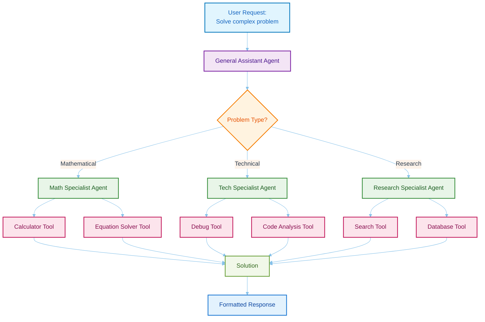
```mermaid
---
config:
  theme: base
  themeVariables:
    primaryColor: "#e8f4f8"
    primaryTextColor: "#2c3e50"
    primaryBorderColor: "#5dade2"
    lineColor: "#85c1e9"
    secondaryColor: "#fdf2e9"
    tertiaryColor: "#e8f5e8"
    background: "#ffffff"
    mainBkg: "#e8f4f8"
    secondBkg: "#fdf2e9"
    tertiaryBkg: "#e8f5e8"
---
flowchart TD
    A[User Request:<br/>Solve complex problem] --> B[General Assistant Agent]
    B --> C{Problem Type?}

    C -->|Mathematical| D[Math Specialist Agent]
    C -->|Technical| E[Tech Specialist Agent]
    C -->|Research| F[Research Specialist Agent]

    D --> G[Calculator Tool]
    D --> H[Equation Solver Tool]

    E --> I[Debug Tool]
    E --> J[Code Analysis Tool]

    F --> K[Search Tool]
    F --> L[Database Tool]

    G --> M[Solution]
    H --> M
    I --> M
    J --> M
    K --> M
    L --> M

    M --> N[Formatted Response]

    %% Styling with professional pastel colors
    classDef userRequest fill:#e1f5fe,stroke:#0277bd,stroke-width:2px,color:#1565c0
    classDef generalAgent fill:#f3e5f5,stroke:#7b1fa2,stroke-width:2px,color:#4a148c
    classDef decision fill:#fff3e0,stroke:#f57c00,stroke-width:2px,color:#e65100
    classDef specialist fill:#e8f5e8,stroke:#388e3c,stroke-width:2px,color:#1b5e20
    classDef tool fill:#fce4ec,stroke:#c2185b,stroke-width:2px,color:#880e4f
    classDef solution fill:#f1f8e9,stroke:#689f38,stroke-width:2px,color:#33691e
    classDef response fill:#e3f2fd,stroke:#1976d2,stroke-width:2px,color:#0d47a1

    class A userRequest
    class B generalAgent
    class C decision
    class D,E,F specialist
    class G,H,I,J,K,L tool
    class M solution
    class N response
```

This pattern allows for specialized capabilities to be encapsulated and reused across different agents.

### Dynamic Routing

Dynamic routing involves agents deciding at runtime which other agents to involve based on the specific task:

```python
# Router agent dynamically selects specialists
router = LlmAgent(
    name="query_router",
    model="gemini-2.0-flash",
    sub_agents=[
        LlmAgent(name="technical_support", tools=[troubleshooting_tool]),
        LlmAgent(name="billing_support", tools=[payment_tool, invoice_tool]),
        LlmAgent(name="sales_agent", tools=[product_tool, pricing_tool])
    ],
    instruction="You are a customer service router. Analyze the customer's query and delegate to the appropriate specialist agent: technical_support for technical issues, billing_support for payment questions, or sales_agent for product inquiries."
)
```

This pattern is useful for handling diverse user requests that require different types of expertise.

### Communication Protocols

Agents in a multi-agent system communicate through several mechanisms:

- **State sharing**: Agents read and write to shared session state
- **Event passing**: Agents yield events that are processed by other agents
- **Structured messaging**: Agents exchange structured messages with specific formats
- **Context preservation**: Context is maintained across agent boundaries

ADK supports various communication protocols, including:

- **Model Context Protocol (MCP)**: For secure tool invocation and typed data exchange
- **Agent Communication Protocol (ACP)**: For REST-native messaging via multi-part messages
- **Agent-to-Agent Protocol (A2A)**: For peer-to-peer task outsourcing
- **Agent Network Protocol (ANP)**: For open-network agent discovery and collaboration

## Pro Tip 💡

When designing multi-agent systems, start with a clear separation of concerns. Each agent should have a well-defined role and area of expertise. This makes the system easier to develop, test, and maintain as complexity grows.

---

## Chapter 7: Business Applications - Real-World Use Cases

## Customer Service Automation

Customer service is one of the most compelling applications for ADK agents, allowing businesses to provide responsive, accurate support at scale.

### Multi-tier Support System

A comprehensive customer service system using ADK might include:

```
Customer Query →
Router Agent (Classifies query type) →
[Product Agent, Billing Agent, Technical Support Agent] →
Resolution Synthesis Agent →
Customer Response
```

This architecture provides several benefits:

- **Specialized handling** of different query types
- **Deep knowledge** in specific domains
- **Consistent response formatting**
- **Seamless escalation** to human agents when needed

### Escalation Workflows

Effective customer service systems need clear escalation paths:

```python
# Define escalation workflow
escalation_agent = LlmAgent(
    name="escalation_manager",
    model="gemini-2.0-flash",
    tools=[create_ticket_tool, notify_human_tool],
    description="Handle cases that require human intervention",
    instruction="You handle escalations when automated agents cannot resolve an issue. Create a support ticket with all relevant context and notify the appropriate human agent."
)

# Add to customer service system
customer_service = LlmAgent(
    name="customer_service",
    model="gemini-2.0-flash",
    sub_agents=[
        product_agent,
        billing_agent,
        technical_agent,
        escalation_agent  # Add escalation path
    ],
    instruction="You are a customer service assistant. Handle customer inquiries using specialized agents. If no agent can resolve the issue, escalate to the escalation_manager."
)
```

This ensures that complex issues receive appropriate human attention while maintaining context.

### Knowledge Base Integration

Integrating a knowledge base enhances agent capabilities:

```python
# Knowledge base tool
def query_knowledge_base(query: str) -> dict:
    """Search the company knowledge base for information.

    Args:
        query (str): The search query.

    Returns:
        dict: Relevant knowledge base articles and information.
    """
    # Implementation would search a real knowledge base
    return {
        "status": "success",
        "articles": [
            {"title": "How to reset your password", "content": "..."},
            {"title": "Billing cycle explained", "content": "..."}
        ]
    }

# Add to customer service agents
for agent in [product_agent, billing_agent, technical_agent]:
    agent.tools.append(query_knowledge_base)
```

This allows agents to leverage existing company documentation and continuously improve as the knowledge base expands.

## Content Creation Pipeline

Content creation is another area where ADK's multi-agent architecture shines, enabling automated or semi-automated content production workflows.

### Research to Publication Workflow

A complete content creation pipeline might look like this:

```mermaid
flowchart TD
    A[Content Brief] --> B[Research Agent]
    B --> C[Outline Agent]
    C --> D[Draft Agent]
    D --> E[Editorial Agent]
    E --> F[SEO Optimization Agent]
    F --> G[Final Content]

    %% Pastel color palette with strong contrast
    style A fill:#e3f2fd,stroke:#1976d2,stroke-width:2px,color:#0d47a1
    style B fill:#fce4ec,stroke:#ad1457,stroke-width:2px,color:#880e4f
    style C fill:#fffde7,stroke:#fbc02d,stroke-width:2px,color:#795548
    style D fill:#e8f5e9,stroke:#388e3c,stroke-width:2px,color:#1b5e20
    style E fill:#ede7f6,stroke:#7e57c2,stroke-width:2px,color:#4527a0
    style F fill:#ffe0b2,stroke:#fb8c00,stroke-width:2px,color:#e65100
    style G fill:#f3e5f5,stroke:#8e24aa,stroke-width:2px,color:#4a148c
```

This can be implemented in ADK as follows:

```python
# Research agent
research_agent = LlmAgent(
    name="research_agent",
    model="gemini-2.0-flash",
    tools=[search_tool, database_tool],
    description="Research information on a given topic",
    output_key="research_data"  # Store research in state
)

# Outline agent
outline_agent = LlmAgent(
    name="outline_agent",
    model="gemini-2.0-flash",
    description="Create content outlines based on research",
    instruction="Create a detailed outline based on the research_data in state.",
    output_key="outline"  # Store outline in state
)

# Writing agent
writing_agent = LlmAgent(
    name="writing_agent",
    model="gemini-2.0-flash",
    description="Write content based on outlines",
    instruction="Write a complete draft based on the outline in state.",
    output_key="draft"  # Store draft in state
)

# Editing agent
editing_agent = LlmAgent(
    name="editing_agent",
    model="gemini-2.0-flash",
    tools=[grammar_tool, style_tool],
    description="Edit and improve content drafts",
    instruction="Edit the draft in state for grammar, style, and clarity.",
    output_key="edited_draft"  # Store edited draft in state
)

# SEO agent
seo_agent = LlmAgent(
    name="seo_agent",
    model="gemini-2.0-flash",
    tools=[keyword_tool, seo_analysis_tool],
    description="Optimize content for search engines",
    instruction="Optimize the edited_draft in state for search engines."
)

# Create sequential workflow
content_pipeline = SequentialAgent(
    name="content_pipeline",
    sub_agents=[research_agent, outline_agent, writing_agent, editing_agent, seo_agent],
    description="End-to-end content creation pipeline"
)
```

This pipeline enables consistent, high-quality content production with specialized expertise at each stage.

### Quality Control Agents

Quality control is essential in content creation:

```python
# Fact-checking agent
fact_checker = LlmAgent(
    name="fact_checker",
    model="gemini-2.0-flash",
    tools=[search_tool, verify_fact_tool],
    description="Verify factual claims in content",
    instruction="Check all factual claims in the content and flag any inaccuracies."
)

# Plagiarism detection agent
plagiarism_checker = LlmAgent(
    name="plagiarism_checker",
    model="gemini-2.0-flash",
    tools=[plagiarism_tool],
    description="Check content for plagiarism",
    instruction="Analyze the content for potential plagiarism and provide a similarity report."
)

# Add quality control to pipeline
quality_control = ParallelAgent(
    name="quality_control",
    sub_agents=[fact_checker, plagiarism_checker],
    description="Perform quality checks in parallel"
)

# Insert into main pipeline
content_pipeline = SequentialAgent(
    name="content_pipeline",
    sub_agents=[
        research_agent,
        outline_agent,
        writing_agent,
        editing_agent,
        quality_control,  # Add quality control step
        seo_agent
    ],
    description="End-to-end content creation pipeline with quality control"
)
```

This ensures that content meets high standards for accuracy and originality.

## Enterprise Document Processing

Document processing is a critical function in many enterprises, involving the extraction, analysis, and management of information from various document types.

### Contract Analysis

Contract analysis can be automated using specialized agents:

```python
# Entity extraction agent
entity_extractor = LlmAgent(
    name="entity_extractor",
    model="gemini-2.0-flash",
    tools=[extract_entities_tool],
    description="Extract entities from contracts",
    instruction="Identify and extract key entities such as parties, dates, amounts, and terms."
)

# Clause analysis agent
clause_analyzer = LlmAgent(
    name="clause_analyzer",
    model="gemini-2.0-flash",
    tools=[analyze_clauses_tool],
    description="Analyze contract clauses",
    instruction="Analyze clauses for standard language, deviations, and potential risks."
)

# Risk assessment agent
risk_assessor = LlmAgent(
    name="risk_assessor",
    model="gemini-2.0-flash",
    tools=[assess_risk_tool],
    description="Assess contract risks",
    instruction="Evaluate the contract for legal, financial, and operational risks."
)

# Contract analysis pipeline
contract_analyzer = SequentialAgent(
    name="contract_analyzer",
    sub_agents=[entity_extractor, clause_analyzer, risk_assessor],
    description="Comprehensive contract analysis pipeline"
)
```

This enables faster, more consistent contract review with reduced human effort.

### Compliance Checking

Compliance checking ensures documents meet regulatory requirements:

```python
# Define compliance checking agent
compliance_checker = LlmAgent(
    name="compliance_checker",
    model="gemini-2.0-flash",
    tools=[
        check_gdpr_compliance_tool,
        check_hipaa_compliance_tool,
        check_industry_standards_tool
    ],
    description="Check documents for regulatory compliance",
    instruction="Analyze documents for compliance with relevant regulations and industry standards."
)
```

This helps organizations maintain regulatory compliance and reduce legal risk.

### Data Extraction

Automated data extraction streamlines document processing:

```python
# Data extraction agent
data_extractor = LlmAgent(
    name="data_extractor",
    model="gemini-2.0-flash",
    tools=[
        extract_tables_tool,
        extract_text_tool,
        extract_forms_tool
    ],
    description="Extract structured data from documents",
    instruction="Extract relevant data from documents and convert to structured format."
)
```

This enables the transformation of unstructured documents into structured data for analysis and integration with other systems.

## Pro Tip 💡

When implementing business applications with ADK, focus on creating clear boundaries between agents and defining explicit data exchange formats. This makes the system more maintainable and easier to debug as complexity grows.

---

Would you like me to continue with the next chapters on Evaluation and Testing, Production Deployment, Advanced Patterns, and Troubleshooting?

---

### Chapter 8: Evaluation and Testing - Ensuring Agent Reliability

### Why Evaluation Matters in Production

Imagine deploying a customer service agent that gives incorrect information 30% of the time, or a content creation system that occasionally generates inappropriate content. In traditional software, bugs are frustrating but predictable. With AI agents, **unpredictable behavior can be catastrophic** .

Agent evaluation isn't just about quality assurance—it's about **business risk management**. Unlike deterministic software, agents make decisions based on probabilistic models, meaning their behavior can vary significantly across similar inputs . This variability makes systematic evaluation essential for production deployment.

### The Business Impact of Poor Agent Performance

Consider these real-world scenarios:

- **Customer Service**: An agent that escalates simple issues unnecessarily increases support costs by 40%
- **Content Creation**: Agents that produce off-brand content can damage company reputation
- **Document Processing**: Financial analysis agents that miss critical contract terms create legal liability

ADK's evaluation framework addresses these challenges by providing **systematic methods to test both final response quality and step-by-step execution trajectories** .

## ADK's Evaluation Architecture

ADK offers two complementary evaluation approaches, each designed for different stages of the development lifecycle :

### Unit Testing with Test Files

Test files represent **individual agent-model interactions** and are ideal for rapid development cycles. Each test file contains a single session with multiple turns, making them perfect for **unit testing during active agent development** .

```python
# Example test file structure
{
    "eval_set_id": "customer_service_basic_tests",
    "name": "Basic Customer Service Functionality",
    "description": "Unit tests for core customer service agent behaviors",
    "eval_cases": [
        {
            "eval_id": "refund_request_valid",
            "conversation": [
                {
                    "user_content": {
                        "parts": [{"text": "I need a refund for order #12345"}],
                        "role": "user"
                    },
                    "final_response": {
                        "parts": [{"text": "I've initiated a refund for order #12345. You'll receive confirmation within 24 hours."}],
                        "role": "model"
                    },
                    "intermediate_data": {
                        "tool_uses": [
                            {
                                "name": "check_order_status",
                                "args": {"order_id": "12345"}
                            },
                            {
                                "name": "process_refund",
                                "args": {"order_id": "12345", "reason": "customer_request"}
                            }
                        ]
                    }
                }
            ]
        }
    ]
}
```

### Integration Testing with Evalsets

Evalsets support **multiple, potentially lengthy sessions** and are designed for **complex, multi-turn conversations**. These are ideal for integration testing and simulating real-world usage patterns .

**Key differences between approaches:**

| Aspect              | Test Files                  | Evalsets                          |
| :------------------ | :-------------------------- | :-------------------------------- |
| **Complexity**      | Simple, single interactions | Complex, multi-turn conversations |
| **Execution Speed** | Fast (unit testing)         | Slower (integration testing)      |
| **Use Case**        | Development iteration       | Pre-production validation         |
| **Session Length**  | Single session              | Multiple lengthy sessions         |

## Evaluation Components Deep Dive

### Tool Use Trajectory Validation

One of ADK's most powerful features is **validating the sequence of tool calls** agents make to reach their conclusions. This ensures agents are not just giving correct answers, but following the right reasoning path .

```python
# Example tool trajectory validation
"intermediate_data": {
    "tool_uses": [
        {
            "name": "search_knowledge_base",
            "args": {"query": "refund policy electronics"}
        },
        {
            "name": "check_purchase_date",
            "args": {"order_id": "12345"}
        },
        {
            "name": "calculate_refund_amount",
            "args": {"order_id": "12345", "return_reason": "defective"}
        }
    ]
}
```

This validation catches scenarios where agents might give correct final answers through **incorrect reasoning paths**—a critical issue in regulated industries or high-stakes applications.

### Intermediate Response Monitoring

For multi-agent systems, ADK tracks **intermediate responses from sub-agents**, allowing you to verify that each specialist agent is contributing appropriately to the final outcome .

```mermaid
graph TD
    A[User Query] --> B[Router Agent]
    B --> C[Research Agent]
    C --> D[Analysis Agent]
    D --> E[Response Agent]

    F[Evaluation System] --> G[Tool Trajectory Check]
    F --> H[Intermediate Response Check]
    F --> I[Final Response Quality]

    C --> G
    D --> H
    E --> I

    style F fill:#e1f5fe,stroke:#01579b,color:#000
    style G fill:#e8f5e8,stroke:#1b5e20,color:#000
    style H fill:#fff3e0,stroke:#e65100,color:#000
    style I fill:#fce4ec,stroke:#880e4f,color:#000
```

## Testing Strategies for Production Readiness

### Unit Testing for Agents

Unlike traditional unit tests that verify deterministic functions, agent unit tests must account for **probabilistic behavior while ensuring consistent core functionality** .

```python
# Agent unit testing pattern
def test_refund_processing_agent():
    """Test that refund agent follows correct process."""

    # Setup test case
    test_input = {
        "user_query": "I want to return my laptop",
        "order_id": "12345",
        "purchase_date": "2024-01-15"
    }

    # Expected tool sequence
    expected_tools = [
        "check_return_policy",
        "validate_return_window",
        "calculate_refund_amount",
        "initiate_return_process"
    ]

    # Run evaluation
    result = evaluate_agent(refund_agent, test_input)

    # Validate tool sequence
    assert result.tool_sequence == expected_tools
    assert "refund initiated" in result.final_response
    assert result.confidence_score > 0.8
```

### Integration Testing Patterns

Integration tests verify that **multiple agents work together correctly** and handle complex, multi-step workflows .

```python
# Multi-agent integration test
def test_customer_service_escalation_flow():
    """Test complete customer service workflow with escalation."""

    test_scenarios = [
        {
            "name": "technical_issue_escalation",
            "conversation": [
                {"user": "My internet is down", "expected_agent": "technical_support"},
                {"user": "I've tried rebooting", "expected_agent": "technical_support"},
                {"user": "Still not working", "expected_escalation": "human_agent"}
            ]
        }
    ]

    for scenario in test_scenarios:
        result = run_integration_test(customer_service_system, scenario)
        validate_agent_handoffs(result)
        validate_context_preservation(result)
```

### Performance Benchmarking

Agent performance testing goes beyond correctness to measure **response times, resource usage, and scalability** .

```python
# Performance benchmarking
import time
import psutil

def benchmark_agent_performance(agent, test_cases, iterations=100):
    """Comprehensive agent performance benchmarking."""

    metrics = {
        "response_times": [],
        "memory_usage": [],
        "cpu_usage": [],
        "success_rate": 0
    }

    successful_runs = 0

    for i in range(iterations):
        # Monitor resource usage
        process = psutil.Process()
        start_memory = process.memory_info().rss
        start_cpu = process.cpu_percent()

        # Execute agent
        start_time = time.time()
        try:
            result = agent.run(test_cases[i % len(test_cases)])
            successful_runs += 1
        except Exception as e:
            log_error(f"Agent execution failed: {e}")
            continue

        end_time = time.time()

        # Record metrics
        metrics["response_times"].append(end_time - start_time)
        metrics["memory_usage"].append(process.memory_info().rss - start_memory)
        metrics["cpu_usage"].append(process.cpu_percent() - start_cpu)

    metrics["success_rate"] = successful_runs / iterations
    return metrics
```

## **Interactive Challenge** 🎯

Before continuing, design an evaluation strategy for your business scenario:

1. **What are the critical paths** your agents must follow correctly?
2. **What edge cases** could cause business damage if handled incorrectly?
3. **How will you measure** agent performance in production?

## User Acceptance Testing for Agents

User acceptance testing (UAT) for agents requires **specialized approaches** that account for natural language interactions and subjective quality assessments .

### Structured UAT Framework

```python
# User acceptance testing framework
class AgentUATFramework:
    def __init__(self, agent, user_personas):
        self.agent = agent
        self.user_personas = user_personas
        self.evaluation_criteria = {
            "helpfulness": 0.0,
            "accuracy": 0.0,
            "naturalness": 0.0,
            "safety": 0.0
        }

    def conduct_uat_session(self, persona, scenarios):
        """Conduct structured UAT with specific user persona."""

        results = []
        for scenario in scenarios:
            # Execute scenario
            response = self.agent.run(scenario["input"])

            # Collect user feedback
            feedback = self.collect_user_feedback(persona, scenario, response)

            # Score response
            scores = self.score_response(response, scenario["expected_outcome"])

            results.append({
                "scenario": scenario["name"],
                "persona": persona["name"],
                "response": response,
                "user_feedback": feedback,
                "scores": scores
            })

        return results
```

---

### Chapter 9: Production Deployment - Scaling Agent Systems

### Deployment Architecture Overview

Deploying ADK agents to production requires understanding the **three primary deployment patterns**, each optimized for different business requirements and operational constraints .

### Deployment Options Comparison

| Option                     | Management      | Scalability    | Control  | Best For                               |
| :------------------------- | :-------------- | :------------- | :------- | :------------------------------------- |
| **Vertex AI Agent Engine** | Fully Managed   | Auto-scaling   | Limited  | Production workloads, rapid deployment |
| **Cloud Run**              | Managed Runtime | Manual scaling | Medium   | Custom deployments, cost optimization  |
| **Custom Infrastructure**  | Self-managed    | Full control   | Complete | Enterprise, specific requirements      |

## Vertex AI Agent Engine: The Managed Approach

**Vertex AI Agent Engine is Google's fully managed platform** designed specifically for production-ready agent deployment. It handles infrastructure provisioning, scaling, monitoring, and session management automatically .

### Key Advantages

- **Zero Infrastructure Management**: No servers, containers, or orchestration to manage
- **Automatic Scaling**: Handles traffic spikes without manual intervention
- **Integrated Session Management**: Built-in conversation state persistence
- **Enterprise Security**: Google Cloud's security model with IAM integration

### Deployment Process

```python
from vertexai import agent_engines

# Deploy agent to Vertex AI Agent Engine
remote_agent = agent_engines.create(
    local_agent,
    requirements=["google-cloud-aiplatform[agent_engines,adk]"],
    display_name="Production Customer Service Agent",
    description="Multi-agent customer service system",
    env_vars={
        "ENVIRONMENT": "production",
        "LOG_LEVEL": "INFO"
    }
)

# Test deployed agent
for event in remote_agent.stream_query(
    user_id="customer_123",
    message="I need help with my order",
):
    print(event)
```

The deployment process involves several automated steps :

1. **Bundle Generation**: ADK creates deployment artifacts (pickle files, requirements, dependencies)
2. **Cloud Storage Upload**: Artifacts are staged in Google Cloud Storage
3. **Container Building**: Vertex AI builds optimized containers for your agent
4. **Service Provisioning**: HTTP servers are started and configured for production traffic

### Production Considerations

**IAM Roles Required** :

- `roles/aiplatform.user`: For deployment and management
- `roles/storage.admin`: For artifact staging
- `roles/serviceusage.serviceUsageConsumer`: For service access

## Cloud Run: Containerized Flexibility

Cloud Run provides a **middle ground between fully managed and self-hosted**, offering containerized deployment with automatic scaling while maintaining deployment flexibility .

### Creating Production-Ready Containers

```dockerfile
# Dockerfile for ADK agent deployment
FROM python:3.11-slim

# Set working directory
WORKDIR /app

# Install system dependencies
RUN apt-get update && apt-get install -y \
    gcc \
    g++ \
    && rm -rf /var/lib/apt/lists/*

# Copy requirements and install Python dependencies
COPY requirements.txt .
RUN pip install --no-cache-dir -r requirements.txt

# Copy agent code
COPY . .

# Set environment variables
ENV GOOGLE_CLOUD_PROJECT=your-project-id
ENV PORT=8080

# Health check endpoint
HEALTHCHECK --interval=30s --timeout=10s --start-period=60s --retries=3 \
    CMD curl -f http://localhost:$PORT/health || exit 1

# Run the agent server
CMD exec gunicorn --bind :$PORT --workers 1 --threads 8 --timeout 0 agent_server:app
```

### Deployment Commands

```bash
# Build and deploy to Cloud Run
gcloud builds submit --tag gcr.io/$PROJECT_ID/customer-service-agent

gcloud run deploy customer-service-agent \
    --image gcr.io/$PROJECT_ID/customer-service-agent \
    --platform managed \
    --region us-central1 \
    --allow-unauthenticated \
    --memory 2Gi \
    --cpu 2 \
    --max-instances 100 \
    --set-env-vars ENVIRONMENT=production
```

## Production Best Practices

### Security Considerations

**Authentication and Authorization** :

- **Service Account Security**: Use minimal privilege principles for agent service accounts
- **API Key Management**: Store sensitive credentials in Google Secret Manager
- **Network Security**: Implement VPC-SC perimeters for sensitive deployments
- **Input Validation**: Sanitize all user inputs before agent processing

```python
# Security implementation example
from google.cloud import secretmanager
import hashlib

class SecureAgentWrapper:
    def __init__(self, agent):
        self.agent = agent
        self.secret_client = secretmanager.SecretManagerServiceClient()

    def sanitize_input(self, user_input):
        """Sanitize user input to prevent injection attacks."""
        # Remove potentially dangerous characters
        sanitized = re.sub(r'[<>"\';]', '', user_input)

        # Limit input length
        if len(sanitized) > 2000:
            raise ValueError("Input too long")

        return sanitized

    def get_secret(self, secret_name):
        """Securely retrieve secrets from Secret Manager."""
        name = f"projects/{PROJECT_ID}/secrets/{secret_name}/versions/latest"
        response = self.secret_client.access_secret_version(request={"name": name})
        return response.payload.data.decode("UTF-8")

    def run_secure(self, user_input, user_id):
        """Execute agent with security controls."""
        # Sanitize input
        clean_input = self.sanitize_input(user_input)

        # Log request for audit
        self.log_request(user_id, clean_input)

        # Execute agent
        response = self.agent.run(clean_input)

        # Log response
        self.log_response(user_id, response)

        return response
```

### Monitoring and Logging

**Comprehensive Observability** :
ADK provides structured logging and monitoring capabilities essential for production operations.

```python
# Production logging configuration
import logging
from google.adk.cli.utils.logs import setup_adk_logger, log_to_tmp_folder

# Configure structured logging
setup_adk_logger(level=logging.INFO)

# Enable persistent logging with rotation
log_to_tmp_folder(
    sub_folder="production_agents",
    prefix="customer_service",
    logger=logging.getLogger("adk")
)

# Custom metrics tracking
class ProductionMetrics:
    def __init__(self):
        self.request_count = 0
        self.error_count = 0
        self.response_times = []

    def track_request(self, start_time, success=True):
        self.request_count += 1
        if not success:
            self.error_count += 1

        response_time = time.time() - start_time
        self.response_times.append(response_time)

        # Log metrics
        logging.info(f"Request completed: success={success}, time={response_time:.2f}s")

    def get_error_rate(self):
        if self.request_count == 0:
            return 0
        return self.error_count / self.request_count
```

### Scaling Strategies

**Performance Optimization Techniques** :

1. **Response Time Optimization**
   - **Parallel Processing**: Use workflow agents to execute independent tasks simultaneously
   - **Caching**: Implement result caching for frequently accessed data
   - **Model Selection**: Choose appropriate model sizes for different tasks
2. **Cost Management**
   - **Request Batching**: Group similar requests when possible
   - **Model Routing**: Use smaller models for simple tasks, larger models for complex reasoning
   - **Resource Scheduling**: Scale down during low-traffic periods
3. **Resource Allocation**
   - **Memory Management**: Monitor and optimize agent memory usage
   - **CPU Utilization**: Balance concurrent requests with available compute
   - **Network Optimization**: Minimize external API calls through caching

### Error Handling Patterns

**Production-Grade Error Handling** :

```python
# Robust error handling for production agents
import traceback
from functools import wraps

def production_error_handler(func):
    """Decorator for production error handling."""
    @wraps(func)
    async def wrapper(*args, **kwargs):
        try:
            return await func(*args, **kwargs)
        except Exception as e:
            # Log detailed error information
            error_details = {
                "function": func.__name__,
                "args": str(args),
                "kwargs": str(kwargs),
                "error": str(e),
                "traceback": traceback.format_exc()
            }
            logging.error(f"Production error: {error_details}")

            # Determine error response strategy
            if isinstance(e, ValidationError):
                return create_user_friendly_error("Invalid input provided")
            elif isinstance(e, AuthenticationError):
                return create_user_friendly_error("Authentication required")
            elif isinstance(e, RateLimitError):
                return create_retry_response("Service temporarily busy")
            else:
                # Generic fallback
                return create_fallback_response("Unable to process request")

    return wrapper

# Graceful degradation patterns
class FallbackAgent:
    def __init__(self, primary_agent, fallback_responses):
        self.primary_agent = primary_agent
        self.fallback_responses = fallback_responses

    async def run_with_fallback(self, user_input):
        """Execute with fallback to predefined responses."""
        try:
            return await self.primary_agent.run(user_input)
        except Exception as e:
            logging.warning(f"Primary agent failed, using fallback: {e}")

            # Simple keyword matching for fallback
            for keyword, response in self.fallback_responses.items():
                if keyword.lower() in user_input.lower():
                    return response

            return "I'm experiencing technical difficulties. Please try again later."
```

## Production Deployment Checklist

To ensure a smooth deployment process, follow this comprehensive checklist:

1. **Code Quality**

   - [ ] Code reviewed and approved
   - [ ] No critical or high-severity issues in code analysis
   - [ ] Proper error handling and logging implemented

2. **Testing**

   - [ ] Unit tests cover all critical components
   - [ ] Integration tests verify multi-agent interactions
   - [ ] Performance tests meet acceptable thresholds

3. **Security**

   - [ ] Sensitive data not hardcoded; use Secret Manager
   - [ ] Proper IAM roles and permissions configured
   - [ ] Input validation and sanitization in place

4. **Deployment**

   - [ ] Environment variables and configuration files set
   - [ ] Service account keys and API keys secured
   - [ ] Deployment artifacts (e.g., Docker images) built and tested

5. **Monitoring and Logging**

   - [ ] Structured logging enabled
   - [ ] Monitoring dashboards configured
   - [ ] Alerting for error rates, latency, and resource usage

6. **Scaling and Performance**

   - [ ] Autoscaling policies defined (if applicable)
   - [ ] Resource limits and requests configured
   - [ ] Caching strategies implemented

7. **Documentation and Training**
   - [ ] User documentation updated
   - [ ] Technical documentation for maintenance and troubleshooting
   - [ ] Training for support personnel on new agent features

## **Pro Tip** 💡

**Start with Vertex AI Agent Engine for production deployments**. It provides the fastest path to production with enterprise-grade reliability. Move to Cloud Run or custom infrastructure only when you need specific customizations or cost optimizations .

---

## Chapter 10: Advanced Patterns - Mastering Complex Agent Architectures

## State Management: The Memory Layer of Intelligence

Imagine building a customer service agent that forgets everything about a user's previous interactions every time they start a new conversation. Or picture a content creation system that can't remember the brand guidelines it established in earlier sessions. **Without proper state management, even the most sophisticated agents become glorified chatbots** .

State management in ADK transforms agents from stateless functions into **persistent, context-aware entities** that can build relationships, learn preferences, and maintain continuity across interactions . This capability is what separates production-ready agent systems from simple prototypes.

### Understanding ADK's State Architecture

ADK's state management system operates on **multiple scopes** to address different persistence needs :

**Session State**: Persists only for the current conversation
**User State**: Maintains data across all sessions for a specific user
**Application State**: Shared across all users and sessions
**Temporary State**: Exists only during current execution cycle

```python
# State scope examples
session.state = {
    # Session-specific (default scope)
    "current_step": 3,
    "last_query": "What's the weather?",

    # User-specific (persists across sessions)
    "user:preferred_language": "English",
    "user:favorite_city": "San Francisco",

    # Application-wide (shared across all users)
    "app:version": "2.1.0",
    "app:maintenance_mode": False,

    # Temporary (not persisted)
    "temp:calculation_result": 42
}
```

This **hierarchical approach** enables agents to maintain the right level of persistence for different types of information .

### Session Management Components

ADK's session system consists of **three core components** that work together to provide comprehensive context management :

**Sessions**: Stateful chat histories containing unique identifiers, persistent state dictionaries, event records, and metadata
**State**: Key-value stores within sessions that persist information across interactions
**Runners**: Orchestrators that connect agents with sessions, managing information flow and context passing

```mermaid
graph TD
    A[User Request] --> B[Runner]
    B --> C[Session Service]
    C --> D[Session State]
    B --> E[Agent]
    E --> F[Tool Context]
    F --> D
    D --> G[State Persistence]

    style A fill:#e1f5fe,stroke:#01579b,color:#000
    style B fill:#f3e5f5,stroke:#4a148c,color:#000
    style C fill:#e8f5e8,stroke:#1b5e20,color:#000
    style D fill:#fff3e0,stroke:#e65100,color:#000
    style E fill:#fce4ec,stroke:#880e4f,color:#000
```

### Implementing Context-Aware Agents

**Context preservation** requires thoughtful design of how agents access and modify state throughout their execution :

```python
from google.adk.tools.tool_context import ToolContext
from google.adk.agents import LlmAgent

def remember_user_preference(preference_type: str, value: str, tool_context: ToolContext) -> dict:
    """Stores user preferences across sessions.

    Args:
        preference_type: Type of preference (e.g., 'communication_style', 'timezone')
        value: The preference value
        tool_context: Automatically provided by ADK

    Returns:
        dict: Status of the operation
    """
    # Store at user scope for cross-session persistence
    key = f"user:{preference_type}"
    tool_context.state[key] = value

    # Track when preference was set
    tool_context.state[f"{key}_updated"] = datetime.datetime.now().isoformat()

    return {
        "status": "success",
        "message": f"I've remembered your {preference_type} preference: {value}"
    }

def get_user_context(tool_context: ToolContext) -> dict:
    """Retrieves user context for personalized responses.

    Args:
        tool_context: Automatically provided by ADK

    Returns:
        dict: User context information
    """
    context = {}

    # Extract user preferences
    for key, value in tool_context.state.items():
        if key.startswith("user:") and not key.endswith("_updated"):
            pref_name = key.replace("user:", "")
            context[pref_name] = value

    return {
        "status": "success",
        "context": context,
        "user_history_length": len([k for k in tool_context.state.keys() if k.startswith("user:")])
    }

# Create context-aware agent
personal_assistant = LlmAgent(
    name="personal_assistant",
    model="gemini-2.0-flash",
    tools=[remember_user_preference, get_user_context],
    description="A personal assistant that learns and adapts to user preferences",
    instruction="You are a personal assistant that learns from user interactions. Use the available tools to remember preferences and provide personalized responses based on user context."
)
```

This pattern enables agents to **build relationships** over time, creating increasingly personalized and effective interactions .

### Memory vs. State: Understanding the Distinction

While session state handles **temporary conversation context**, ADK's memory system provides **long-term knowledge storage** across multiple conversations :

**Session State**: Conversation scratchpad for immediate context
**Memory Service**: Cross-session knowledge base for historical information

Memory services enable agents to **recall information from past interactions** and access external knowledge bases, creating true conversational continuity .

## Performance Optimization: Scaling Agent Intelligence

As agent systems grow in complexity and usage, **performance optimization** becomes critical for maintaining responsive user experiences and controlling operational costs . ADK provides several strategies for optimizing agent performance across different dimensions.

### Response Time Optimization

**Latency reduction** in agent systems requires optimization at multiple levels :

```python
# Parallel tool execution pattern
from google.adk.agents import ParallelAgent, LlmAgent
import asyncio

# Create specialized agents for concurrent execution
weather_agent = LlmAgent(
    name="weather_specialist",
    model="gemini-2.0-flash",
    tools=[get_weather_tool],
    description="Get weather information quickly"
)

traffic_agent = LlmAgent(
    name="traffic_specialist",
    model="gemini-2.0-flash",
    tools=[get_traffic_tool],
    description="Get traffic information quickly"
)

news_agent = LlmAgent(
    name="news_specialist",
    model="gemini-2.0-flash",
    tools=[get_news_tool],
    description="Get news information quickly"
)

# Execute agents in parallel for faster response
morning_briefing = ParallelAgent(
    name="morning_briefing",
    sub_agents=[weather_agent, traffic_agent, news_agent],
    description="Provide comprehensive morning briefing using parallel information gathering"
)
```

This **parallel execution pattern** reduces total response time by executing independent tasks simultaneously rather than sequentially .

### Caching Strategies

**Intelligent caching** reduces redundant processing and external API calls :

```python
import time
from functools import lru_cache
import hashlib

class CachedToolExecutor:
    def __init__(self, cache_ttl=300):  # 5 minute TTL
        self.cache = {}
        self.cache_ttl = cache_ttl

    def cached_tool_call(self, tool_func, *args, **kwargs):
        """Execute tool with caching based on parameters."""

        # Create cache key from function name and parameters
        cache_key = hashlib.md5(
            f"{tool_func.__name__}_{str(args)}_{str(sorted(kwargs.items()))}".encode()
        ).hexdigest()

        current_time = time.time()

        # Check cache
        if cache_key in self.cache:
            cached_result, timestamp = self.cache[cache_key]
            if current_time - timestamp < self.cache_ttl:
                return cached_result

        # Execute tool and cache result
        result = tool_func(*args, **kwargs)
        self.cache[cache_key] = (result, current_time)

        return result

    def clear_expired_cache(self):
        """Clean up expired cache entries."""
        current_time = time.time()
        expired_keys = [
            key for key, (_, timestamp) in self.cache.items()
            if current_time - timestamp >= self.cache_ttl
        ]
        for key in expired_keys:
            del self.cache[key]

# Usage in agent tools
cache_executor = CachedToolExecutor()

def get_stock_price_cached(symbol: str) -> dict:
    """Get stock price with caching to reduce API calls."""
    return cache_executor.cached_tool_call(get_stock_price_api, symbol)
```

### Resource Management

**Efficient resource allocation** ensures agents scale effectively under load :

```python
# Resource monitoring and optimization
import psutil
import asyncio
from concurrent.futures import ThreadPoolExecutor

class ResourceOptimizedAgent:
    def __init__(self, agent, max_concurrent_requests=10):
        self.agent = agent
        self.semaphore = asyncio.Semaphore(max_concurrent_requests)
        self.thread_pool = ThreadPoolExecutor(max_workers=5)

    async def execute_with_resource_management(self, request):
        """Execute agent request with resource controls."""

        async with self.semaphore:  # Limit concurrent requests
            # Monitor resource usage
            memory_percent = psutil.virtual_memory().percent
            cpu_percent = psutil.cpu_percent(interval=1)

            # Implement backpressure if resources are constrained
            if memory_percent > 85 or cpu_percent > 90:
                await asyncio.sleep(0.5)  # Brief delay to reduce load

            # Execute in thread pool for CPU-intensive operations
            if self.is_cpu_intensive_request(request):
                loop = asyncio.get_event_loop()
                result = await loop.run_in_executor(
                    self.thread_pool,
                    self.agent.run,
                    request
                )
            else:
                result = await self.agent.run_async(request)

            return result

    def is_cpu_intensive_request(self, request):
        """Determine if request requires CPU-intensive processing."""
        cpu_intensive_keywords = ['analyze', 'calculate', 'process', 'generate']
        return any(keyword in request.lower() for keyword in cpu_intensive_keywords)
```

### Cost Management Strategies

**Operational cost optimization** requires careful model selection and request optimization :

```python
# Model routing based on complexity
class CostOptimizedRouter:
    def __init__(self):
        self.simple_model = "gemini-1.5-flash"  # Faster, cheaper
        self.complex_model = "gemini-2.0-flash" # More capable, expensive

    def route_request(self, request: str) -> str:
        """Route requests to appropriate model based on complexity."""

        complexity_indicators = {
            'simple': ['weather', 'time', 'basic', 'simple', 'quick'],
            'complex': ['analyze', 'research', 'create', 'write', 'solve', 'explain']
        }

        request_lower = request.lower()

        # Check for complexity indicators
        simple_score = sum(1 for word in complexity_indicators['simple']
                          if word in request_lower)
        complex_score = sum(1 for word in complexity_indicators['complex']
                           if word in request_lower)

        # Route based on complexity
        if complex_score > simple_score or len(request) > 200:
            return self.complex_model
        else:
            return self.simple_model

# Usage in agent configuration
router = CostOptimizedRouter()

def create_cost_optimized_agent(request: str):
    """Create agent with model selected based on request complexity."""

    optimal_model = router.route_request(request)

    return LlmAgent(
        name="cost_optimized_agent",
        model=optimal_model,
        description="Agent optimized for cost-effective operation"
    )
```

This **intelligent routing** can reduce costs by 40-60% while maintaining response quality for appropriate use cases .

## Data Persistence Patterns

**Long-term data persistence** enables agents to maintain knowledge and context beyond individual sessions :

```python
# Database-backed session service
from google.adk.sessions import DatabaseSessionService
import sqlite3

class ProductionSessionService(DatabaseSessionService):
    def __init__(self, db_path="agent_sessions.db"):
        self.db_path = db_path
        self.init_database()

    def init_database(self):
        """Initialize database schema for session storage."""
        conn = sqlite3.connect(self.db_path)
        cursor = conn.cursor()

        cursor.execute('''
            CREATE TABLE IF NOT EXISTS sessions (
                id TEXT PRIMARY KEY,
                user_id TEXT,
                app_name TEXT,
                state TEXT,
                created_at TIMESTAMP DEFAULT CURRENT_TIMESTAMP,
                updated_at TIMESTAMP DEFAULT CURRENT_TIMESTAMP
            )
        ''')

        cursor.execute('''
            CREATE TABLE IF NOT EXISTS session_events (
                id INTEGER PRIMARY KEY AUTOINCREMENT,
                session_id TEXT,
                event_type TEXT,
                event_data TEXT,
                timestamp TIMESTAMP DEFAULT CURRENT_TIMESTAMP,
                FOREIGN KEY (session_id) REFERENCES sessions (id)
            )
        ''')

        conn.commit()
        conn.close()

    def save_session_state(self, session_id: str, state: dict):
        """Persist session state to database."""
        conn = sqlite3.connect(self.db_path)
        cursor = conn.cursor()

        cursor.execute('''
            UPDATE sessions
            SET state = ?, updated_at = CURRENT_TIMESTAMP
            WHERE id = ?
        ''', (json.dumps(state), session_id))

        conn.commit()
        conn.close()
```

This pattern enables **enterprise-grade persistence** with full audit trails and recovery capabilities .

---

The advanced patterns in this chapter transform simple agents into **sophisticated, production-ready systems** that can handle complex business requirements while maintaining performance and reliability . These techniques form the foundation for building agent applications that scale with your business needs.

**Ready to tackle the inevitable challenges that arise in production? Chapter 11 will arm you with comprehensive troubleshooting techniques and debugging strategies that turn agent mysteries into solvable problems.**

---

## Chapter 11: Troubleshooting Guide - Solving Common Agent Problems

## Common Pitfalls in Agent Development

Building intelligent agent systems with Google's Agent Development Kit (ADK) can sometimes lead to unexpected challenges. Understanding the most common pitfalls helps you diagnose and resolve issues quickly, ensuring your agents operate reliably in production environments.

### Agent Communication Issues

One of the most frequent challenges in multi-agent systems involves communication breakdowns between agents. These issues typically manifest in several ways:

**Sub-agent Transfer Failures**: When using hierarchical agent structures, transfers between the parent agent and specialized sub-agents may fail, particularly in voice-based applications. The agent might stop responding entirely when attempting to delegate tasks to sub-agents, even though the same functionality works perfectly in text-based interactions.

**State Synchronization Problems**: Agents may fail to properly share or access state information, leading to context loss between interactions. This often appears as agents "forgetting" information that should have been passed through the session state.

**Protocol Mismatches**: When implementing agent-to-agent communication protocols like A2A (Agent-to-Agent), improper implementation can lead to message format incompatibilities. Ensuring proper error handling for communication failures is essential for robust agent interactions.

### Tool Integration Problems

Tools extend agent capabilities, but integrating them can introduce several challenges:

**Missing or Incomplete Docstrings**: ADK relies heavily on function docstrings to understand tool capabilities. Inadequate or missing docstrings can prevent the agent from properly utilizing tools, resulting in generic responses instead of tool-based actions.

**Inconsistent Return Formats**: Tools should maintain consistent return structures (like the status/result pattern) to ensure predictable agent behavior. Inconsistent formats can confuse the agent's reasoning process.

**Authentication Failures**: When integrating with external services, API key issues or authentication problems are common. Users frequently encounter challenges connecting ADK agents to services like Vertex AI due to permission restrictions or configuration issues.

```python
# Example of proper tool definition with clear docstring
def get_weather(city: str) -> dict:
    """Retrieves the current weather report for a specified city.

    Args:
        city (str): The name of the city for which to retrieve the weather report.

    Returns:
        dict: status and result or error msg.
    """
    # Implementation here
    return {"status": "success", "report": f"The weather in {city} is sunny."}
```

## Performance Bottlenecks

As agent systems scale, performance issues can emerge that impact user experience and operational costs.

### Response Time Degradation

Several factors can contribute to slow agent responses:

**Sequential Processing Overhead**: When using `SequentialAgent` without proper parallelization, each step must complete before the next begins, creating cumulative latency. This is particularly noticeable in multi-step workflows where some operations could run concurrently.

**Inefficient Tool Execution**: Tools that make external API calls without proper caching or optimization can significantly slow down agent responses. Each external call adds latency that compounds in complex workflows.

**Model Selection Mismatch**: Using unnecessarily powerful models for simple tasks increases latency without providing benefits. Matching model capabilities to task complexity is crucial for optimizing response times.

### Memory Management Issues

Memory-related problems can impact both performance and reliability:

**State Bloat**: Accumulating too much information in session state without proper cleanup can lead to increased memory usage and slower performance. This is especially problematic in long-running conversations or complex workflows.

**Resource Contention**: When multiple agents compete for limited resources, performance can degrade across the system. Proper resource allocation and throttling mechanisms are essential for maintaining consistent performance.

## Security Vulnerabilities

Security considerations are paramount when deploying agent systems in production environments.

**Insufficient Input Validation**: Failing to sanitize user inputs can expose agents to injection attacks or unexpected behavior. All user inputs should be validated and sanitized before processing.

**Credential Exposure**: Improper handling of API keys, tokens, or other credentials can lead to security breaches. Credentials should never be hardcoded and should be managed through secure mechanisms like Google Secret Manager.

**Unauthorized Access**: Without proper authentication and authorization controls, agent systems may be vulnerable to unauthorized access. Implementing robust identity and access management is essential for production deployments.

## Debugging Techniques

Effective debugging is essential for resolving agent issues quickly and efficiently.

### Logging Strategies

Comprehensive logging provides visibility into agent behavior and helps identify the root causes of issues:

**Structured Logging**: ADK provides built-in structured logging capabilities that capture detailed information about agent execution. Configure logging levels appropriately to balance verbosity with performance.

```python
# Configure structured logging
import logging
from google.adk.cli.utils.logs import setup_adk_logger, log_to_tmp_folder

# Configure structured logging
setup_adk_logger(level=logging.INFO)

# Enable persistent logging with rotation
log_to_tmp_folder(
    sub_folder="production_agents",
    prefix="customer_service",
    logger=logging.getLogger("adk")
)
```

**Log Redirection**: By default, agent logs are stored in `/tmp/appd/dotnet`, but you can redirect them to console output for easier troubleshooting. This is particularly useful when running agents in containerized environments.

**Event Tracing**: The ADK web interface provides an `Events` tab that allows you to inspect individual function calls, responses, and model interactions. The `Trace` button shows detailed logs for each event, including latency metrics for function calls.

### Trace Analysis

Analyzing execution traces helps identify bottlenecks and errors in agent workflows:

**Event Sequence Inspection**: Review the sequence of events to understand the flow of execution and identify where issues occur. This is particularly useful for diagnosing issues in multi-agent systems.

**Latency Profiling**: Examine the timing information in traces to identify operations that take longer than expected. This helps pinpoint performance bottlenecks in complex workflows.

**Error Context Extraction**: When errors occur, trace analysis provides context about the state of the system at the time of failure. This context is invaluable for understanding and resolving issues.

### Error Handling Patterns

Robust error handling ensures that agents can recover gracefully from failures:

**Graceful Degradation**: Implement fallback mechanisms that provide reduced but functional capabilities when primary functions fail. This ensures that users still receive some value even when optimal functionality is unavailable.

```python
# Robust error handling for production agents
import traceback
from functools import wraps

def production_error_handler(func):
    """Decorator for production error handling."""
    @wraps(func)
    async def wrapper(*args, **kwargs):
        try:
            return await func(*args, **kwargs)
        except Exception as e:
            # Log detailed error information
            error_details = {
                "function": func.__name__,
                "args": str(args),
                "kwargs": str(kwargs),
                "error": str(e),
                "traceback": traceback.format_exc()
            }
            logging.error(f"Production error: {error_details}")

            # Determine error response strategy
            if isinstance(e, ValidationError):
                return create_user_friendly_error("Invalid input provided")
            elif isinstance(e, AuthenticationError):
                return create_user_friendly_error("Authentication required")
            elif isinstance(e, RateLimitError):
                return create_retry_response("Service temporarily busy")
            else:
                # Generic fallback
                return create_fallback_response("Unable to process request")

    return wrapper
```

**Error Recovery Workflows**: Design sequential workflows that include error detection and recovery steps. This allows agents to automatically attempt recovery from common failure modes.

## Development Workflow Best Practices

Adopting effective development workflows can prevent many common issues before they reach production.

### Environment Setup

Proper environment configuration is crucial for consistent agent behavior:

**Virtual Environment Isolation**: Always use virtual environments to isolate agent dependencies and prevent conflicts with system packages. This ensures that your development environment matches your production environment.

```bash
# Create python virtual environment
python -m venv .venv

# Activate (uncomment the line relevant to your environment)
# macOS/Linux:
source .venv/bin/activate
# Windows CMD:
# .venv\Scripts\activate.bat
# Windows PowerShell:
# .venv\Scripts\Activate.ps1

# Install ADK
pip install google-adk
```

**Authentication Configuration**: Set up proper authentication credentials for both development and production environments. For local development, use Application Default Credentials (ADC) to authenticate with Google Cloud services.

```bash
# Set up Application Default Credentials
gcloud auth application-default login
```

**Command Path Issues**: If you encounter "Command 'adk' not found" errors, ensure that your virtual environment is properly activated and that the ADK package is installed. You can verify this by checking if `google-adk` appears in your installed packages list.

```bash
# Verify ADK installation
python -m pip list | grep google-adk
```

### Iterative Testing

Systematic testing helps identify and resolve issues early in the development process:

**Unit Testing**: Test individual agents and tools in isolation to verify their behavior before integrating them into larger systems. This helps identify issues at the component level where they're easier to diagnose and fix.

**Integration Testing**: Test multi-agent systems to ensure that agents communicate and coordinate effectively. Pay particular attention to state sharing and context preservation between agents.

**Edge Case Exploration**: Deliberately test with invalid inputs, missing data, and unexpected queries to understand agent limits and improve error handling. This helps build more robust agent systems that can handle real-world scenarios.

## Pro Tips for Troubleshooting

These expert recommendations can save you hours of debugging time:

**Start Simple, Then Scale**: Begin with the simplest possible agent configuration that demonstrates the issue. Once you understand the problem in a simple context, you can address it in more complex scenarios.

**Isolate Components**: When troubleshooting multi-agent systems, test each agent individually to identify which component is causing the issue. This divide-and-conquer approach narrows down the problem space quickly.

**Check Documentation First**: Many common issues are addressed in the official ADK documentation. Before diving into complex debugging, check if your issue is covered in the documentation or community resources.

**Leverage Community Resources**: The ADK community on platforms like GitHub and Stack Overflow can provide valuable insights for troubleshooting specific issues. Many developers encounter similar challenges, and community solutions can save significant time.

---

By understanding these common pitfalls and applying effective troubleshooting techniques, you can build more reliable, performant agent systems with Google's Agent Development Kit. Remember that troubleshooting is an iterative process—start simple, isolate issues, and systematically address each challenge to create production-ready agent applications.

## Chapter 12: The Future of ADK - Emerging Patterns and Roadmap

## The Evolution of Agent Ecosystems

As we look toward the future of Google's Agent Development Kit (ADK), we're witnessing a fundamental shift from isolated AI implementations to interconnected, collaborative agent ecosystems that solve complex business problems through specialized coordination. This evolution represents not just a technical advancement but a paradigm shift in how we conceptualize AI applications—moving from single-purpose models to intelligent, autonomous multi-agent systems that can reason, collaborate, and adapt.

The ADK ecosystem is rapidly expanding beyond its initial release, with Google continuously enhancing the framework to support more sophisticated agent interactions and deployment patterns. This growth is driven by real-world adoption across industries, as businesses recognize the transformative potential of orchestrated agent systems.

## Agent-to-Agent Protocols: The Communication Revolution

### A2A Protocol: The Foundation of Agent Collaboration

The Agent-to-Agent (A2A) protocol represents one of the most significant advancements in the ADK ecosystem, providing a standardized way for AI agents to communicate, exchange information securely, and coordinate actions across enterprise applications. This open protocol was developed with contributions from over 50 companies, including major players like Atlassian, Box, MongoDB, Salesforce, and ServiceNow.

Google has recently released version 0.2 of the A2A protocol specification, incorporating key enhancements to facilitate more sophisticated and reliable interactions between agents. To simplify implementation, Google has also released an official Python SDK for A2A, providing developers with the tools needed to integrate these powerful communication capabilities into their Python-based agents.

### Core Concepts of A2A

The A2A protocol is built around several fundamental concepts:

- **Task-based communication**: Agents exchange structured messages focused on specific tasks and goals
- **Agent discovery**: Standardized mechanisms for agents to find and connect with other agents
- **Framework-agnostic interoperability**: Enabling agents built with different frameworks to communicate seamlessly
- **Multi-modal messaging**: Support for text, images, audio, and other data types in agent communications
- **Standardized message structures**: Consistent formats for requests, responses, and metadata

This standardization is critical for building truly collaborative multi-agent systems that can work together across organizational boundaries.

## Cross-Platform Integration and Interoperability

### Breaking Down Silos

The future of ADK lies in its ability to integrate with diverse platforms and frameworks, creating a unified ecosystem where agents can collaborate regardless of their underlying implementation. This cross-platform integration is enabled through several key mechanisms:

- **LiteLLM integration**: ADK works with models from Anthropic, Meta, Mistral AI, AI21 Labs, and others
- **LangChain compatibility**: Seamless integration with the LangChain ecosystem of tools and components
- **CrewAI interoperability**: Support for team-based agent orchestration patterns
- **OpenAPI specifications**: Integration with RESTful services through standardized interfaces

This interoperability extends beyond just model compatibility to include tool ecosystems, deployment environments, and orchestration frameworks.

### MCP Integration: Extending Agent Capabilities

The Model Context Protocol (MCP) provides a standardized way for agents to retrieve crucial external context needed to inform their responses and actions. This is particularly important for enterprise applications where agents need to access proprietary data or specialized tools.

ADK supports MCP integration through multiple transport protocols:

- **Server-Sent Events (SSE)**: The initial approach for MCP communications
- **Streamable HTTP**: The next-generation transport protocol designed to succeed SSE for MCP communications

This flexibility allows developers to choose the most appropriate integration pattern for their specific requirements.

## Performance and Scalability Advancements

As agent systems move from prototypes to production, performance and scalability become critical considerations. The ADK roadmap includes several initiatives focused on optimizing agent performance:

- **Asynchronous A2A/MCP**: Implementation of non-blocking calls, leveraging A2A streaming or push notifications for long-running operations
- **Parallel A2A Delegation**: Enabling host agents to delegate tasks to multiple specialist agents concurrently
- **Advanced State Management**: Utilizing ADK's persistent SessionService options and exploring robust state sharing patterns between agents

These advancements will enable ADK-based systems to handle higher throughput, reduce latency, and scale more effectively in production environments.

## Industry Adoption and Ecosystem Growth

The adoption of ADK is accelerating rapidly across industries, with platforms introducing enhanced capabilities for building, deploying, and securing A2A agents. This growing ecosystem is establishing the infrastructure for sophisticated multi-agent systems that can address complex business challenges.

Companies are increasingly bringing A2A support to their existing agents, enabling them to seamlessly communicate with other agents within this expanding ecosystem. This trend is driving a network effect where the value of ADK increases as more agents and platforms adopt the standard.

## Community Resources and Continuous Learning

### Official Resources

Google provides a comprehensive set of resources to help developers master ADK:

- **Official documentation**: Detailed guides and reference materials on the ADK framework
- **Sample agents**: Ready-to-use examples demonstrating key patterns and capabilities
- **Tutorials**: Step-by-step guides covering multi-agent patterns, streaming, and deployment

These resources form the foundation for learning ADK and staying current with its evolving capabilities.

### Community Contributions

The ADK community is actively creating and sharing resources to accelerate adoption and innovation:

- **Translations**: Community-maintained translations of the ADK documentation in Chinese, Korean, and Japanese
- **Tutorials and guides**: Community-written content covering specific features, use cases, and integrations
- **Videos and screencasts**: Comprehensive crash courses and demonstrations showcasing ADK in action

This vibrant community ecosystem is essential for sharing best practices and driving innovation in agent development.

### Continuous Learning Opportunities

Google offers various learning opportunities to help developers stay current with ADK:

- **Hands-on labs**: Practical exercises for building and deploying agents
- **Workshop sessions**: Expert-led training on advanced ADK concepts and patterns
- **Conference presentations**: In-depth technical sessions at events like Google Cloud Next

These learning resources enable developers to continuously enhance their skills and keep pace with the rapidly evolving ADK ecosystem.

## The 24-Hour Challenge: Building Your First Multi-Agent System

Now that you've completed this comprehensive guide to Google's Agent Development Kit, it's time to put your knowledge into practice with a concrete, actionable challenge that you can complete within the next 24 hours.

### Your Challenge: Build a Research Assistant Multi-Agent System

Create a simple but powerful research assistant that leverages multiple specialized agents to gather, analyze, and synthesize information on a topic of your choice. This system will demonstrate the core concepts of agent specialization, coordination, and tool usage.

#### Components to Implement:

1. **Orchestrator Agent**: Coordinates the overall research process and delegates to specialists
2. **Research Agent**: Gathers information using Google Search and other tools
3. **Analysis Agent**: Evaluates and synthesizes the gathered information
4. **Summary Agent**: Creates a concise, well-structured summary of the findings

#### Implementation Steps:

1. Set up your development environment with ADK installed
2. Create each agent with appropriate tools and instructions
3. Implement the coordination pattern between agents
4. Test with a specific research question
5. Refine based on the results

This challenge will give you hands-on experience with the key concepts covered in this article while producing a useful tool that you can continue to enhance and expand.

## Conclusion: The Agent Revolution Has Just Begun

The Google Agent Development Kit represents a fundamental shift in how we build AI applications, moving from isolated models to orchestrated teams of specialized agents that can collaborate to solve complex problems. As we've explored throughout this article, ADK provides the framework, tools, and patterns needed to build production-ready agent systems that deliver real business value.

The future of ADK is bright, with continuous improvements to the core framework, expanding protocol capabilities, and growing ecosystem support. By embracing the agent paradigm and leveraging the power of ADK, you can create AI applications that are more capable, flexible, and aligned with real-world business needs than ever before.

The journey from novice to practitioner is just the beginning—as you continue to explore and master ADK, you'll discover new patterns, techniques, and applications that push the boundaries of what's possible with agent-based AI systems. The revolution in AI development has begun, and ADK is at its forefront.

---

## Additional Resources and Community Links

Explore more about Google's Agent Development Kit (ADK) and the broader agent ecosystem with these curated resources:

- [Official Google ADK Blog: Easy to Build Multi-Agent Applications](https://developers.googleblog.com/en/agent-development-kit-easy-to-build-multi-agent-applications/)
- [LinkedIn: Google's Agent Development Kit (ADK) - Revolutionizing Multi-Agent Systems](https://www.linkedin.com/pulse/googles-agent-development-kit-adk-revolutionizing-multi-agent-ali-ywspf)
- [Google Developers Blog: Agents, ADK Agent Engine, and A2A Enhancements at Google I/O](https://developers.googleblog.com/en/agents-adk-agent-engine-a2a-enhancements-google-io/)
- [InfoQ: Google’s Agent Development Kit News](https://www.infoq.com/news/2025/04/agent-development-kit/)
- [SD Times: AI Updates - Google’s New Tools for Building AI Agents](https://sdtimes.com/ai/april-11-2025-ai-updates-from-the-past-week-googles-new-tools-for-building-ai-agents-agent-mode-in-github-copilot-and-more/)
- [Daily.dev: Building Multi-Agent Systems with Google’s A2A Protocol, ADK, and MCP](https://app.daily.dev/posts/building-multi-agent-with-google-s-a2a-agent2agent-protocol-agent-development-kit-adk-and-mcp--mf7bo8vt5)
- [DataCamp: Agent Development Kit (ADK) Tutorial](https://www.datacamp.com/tutorial/agent-development-kit-adk)
- [Google Cloud Blog: Using Google ADK and MCP with an External Server](https://cloud.google.com/blog/topics/developers-practitioners/use-google-adk-and-mcp-with-an-external-server)
- [GitHub: Project Horizon (ADK Example)](https://github.com/heiko-hotz/project-horizon)
- [GitHub: Awesome Google ADK (Curated List)](https://github.com/tsubasakong/awesome-google-adk)
- [Official ADK Documentation: Community Page](https://google.github.io/adk-docs/community/)
- [Google Cloud Skills Boost: ADK Labs and Courses](https://www.cloudskillsboost.google/course_templates/1340/labs/550650?locale=tr)
- [Google Cloud Blog: Learning Resources at Google Cloud Next '25](https://cloud.google.com/blog/topics/training-certifications/learning-resources-at-google-cloud-next25)
- [Google Codelabs: Instavibe ADK Multi-Agents Tutorial](https://codelabs.developers.google.com/instavibe-adk-multi-agents/instructions)
- [Kubiya Blog: Agent Development Kit Insights](https://www.kubiya.ai/blog/agent-development-kit)
- [DataFeedWatch: Google Ads Trends](https://www.datafeedwatch.com/blog/google-ads-trends)
- [Google Cloud Blog: Building KYC Agentic Workflows with ADK](https://cloud.google.com/blog/products/ai-machine-learning/build-kyc-agentic-workflows-with-googles-adk)
- [GitHub: Google Cross-Device SDK](https://github.com/google/cross-device-sdk)
- [Infoservices Blog: Smart AI Agents with Google ADK](https://blogs.infoservices.com/google-cloud/smart-ai-agents-google-agent-development-kit/)
- [Google Workspace Support: User Help](https://support.google.com/a/users/answer/11498760?hl=en-EN&rut=442f71bbd73dfb12a72a82e191b01eacd5a14d4d5e9c5d766f40acb0db9ff35b)
- [Google Cloud Skills Boost: Learning Paths](https://www.cloudskillsboost.google/paths/1858?locale=en)
- [YouTube: Google ADK Overview](https://www.youtube.com/watch?v=Ohp12YrVsJU)
- [Search Engine Land: Google Outlines 2025 Ads API Roadmap](https://searchengineland.com/google-outlines-2025-ads-api-roadmap-448484)
- [Official ADK Documentation](https://google.github.io/adk-docs/)

---
