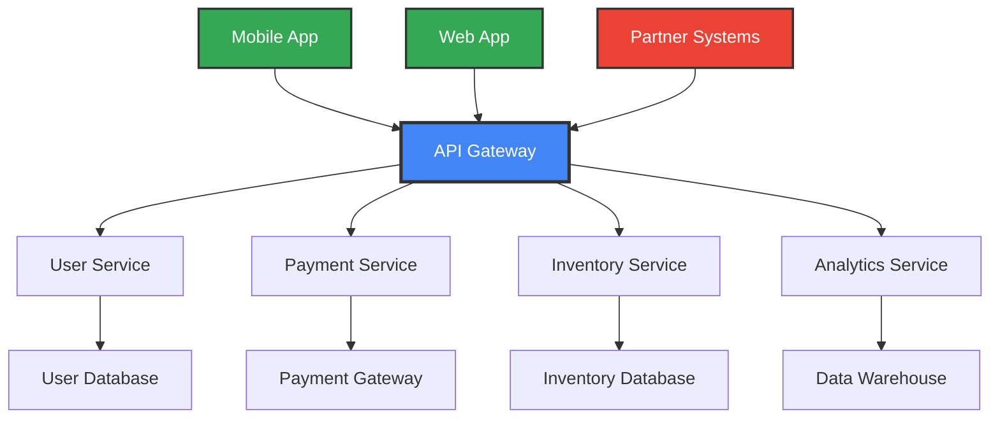
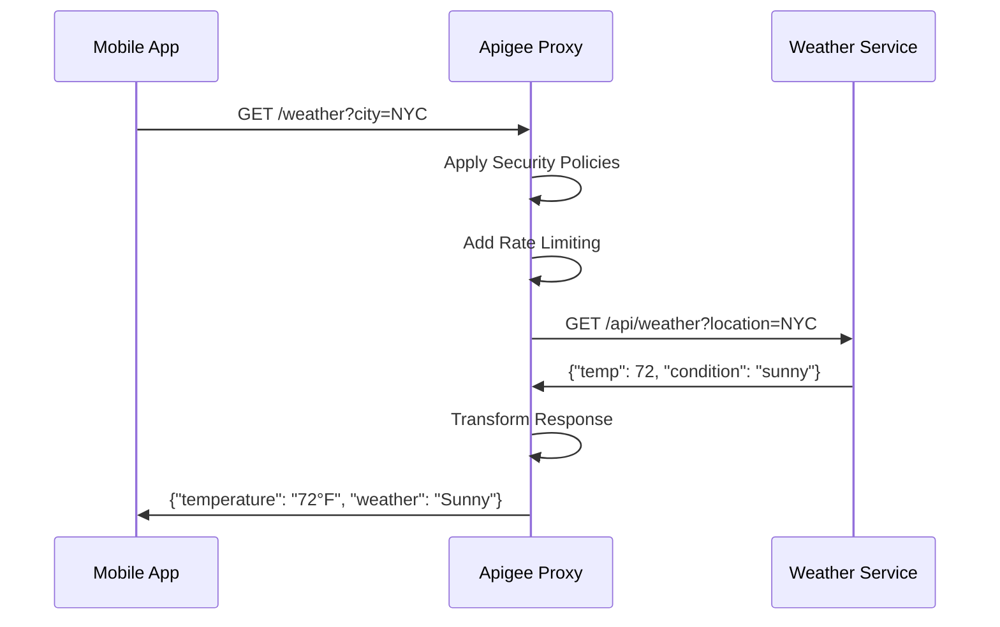
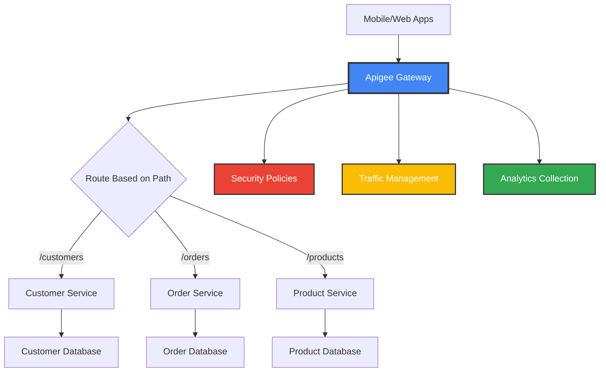
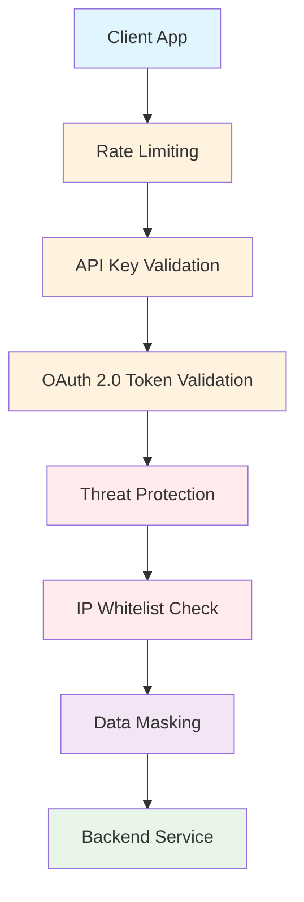
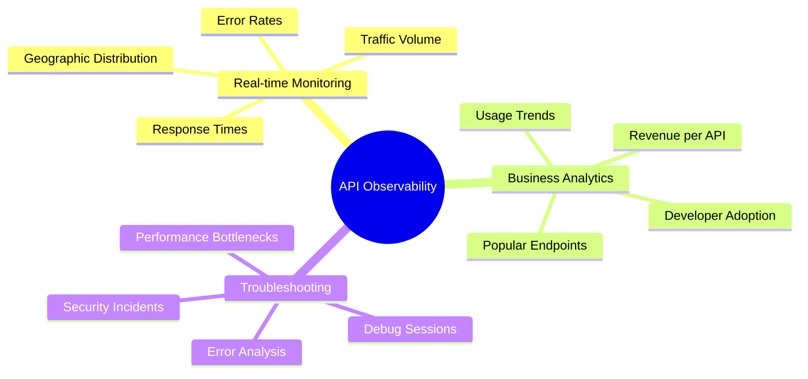
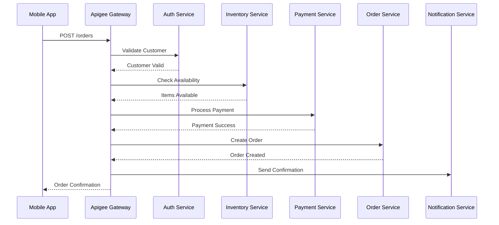
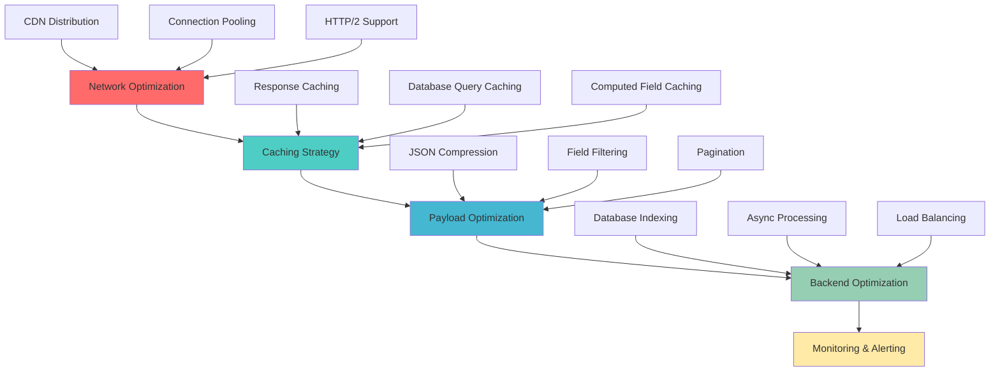
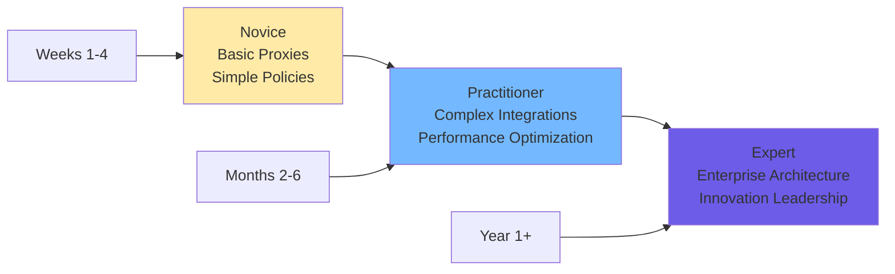

## Why Your APIs Need a Traffic Control System (And Why Apigee is Your Best Bet)

Picture this: It's Black Friday 2023, and you're the CTO of a major e-commerce company. Your mobile app is getting hammered with 10,000 requests per second. Suddenly, your payment API crashes, your inventory system goes haywire, and your customer service phones won't stop ringing. Within minutes, you've lost \$2 million in sales and your brand reputation is in freefall on social media.

**This nightmare scenario happens every day to companies without proper API management.**

### The Uncomfortable Truth About Modern Business

Here's what keeps CTOs awake at night: In today's digital-first world, the average enterprise manages over 15,000 APIs [^1_1]. That's not a typo. Your business likely depends on hundreds of internal APIs, thousands of third-party integrations, and millions of API calls flowing through your systems every hour.

**Think of APIs as the nervous system of your digital business** - they carry critical information between your applications, databases, and external services. Without proper management, this nervous system becomes chaotic, unreliable, and vulnerable to attacks.



**Pause and Reflect:** How many APIs does your organization currently use? If you can't answer immediately, that's already a red flag.

---

## What is Apigee? (The Google-Powered API Management Platform That Changed Everything)

Imagine if Google's infrastructure team - the same people who handle billions of search queries daily - built an API management platform. That's exactly what Apigee is [^1_1][^1_2].

**Apigee is like having a sophisticated traffic control system for your APIs.** Just as a traffic control center manages thousands of vehicles, monitors traffic flow, prevents accidents, and optimizes routes, Apigee manages your API traffic, monitors performance, prevents security breaches, and optimizes data flow.

### The Three Core Pillars of Apigee

**1. API Services:** The traffic control center that routes, processes, and manages all API requests [^1_15]

**2. Analytics Services:** The monitoring system that tracks performance, usage patterns, and identifies bottlenecks [^1_16][^1_10]

**3. Developer Services:** The customer service center that helps developers discover, understand, and consume your APIs [^1_13]

### Real-World Impact: The Walgreens Success Story

Walgreens, America's largest pharmacy chain, transformed their mobile experience using Apigee [^1_6]. Before Apigee, their mobile app was slow, unreliable, and couldn't handle peak traffic during flu season. After implementing Apigee:

- **40% faster prescription refills**
- **60% reduction in mobile app crashes**
- **\$50M increase in mobile-driven revenue**

**Pro Tip:** Start thinking of Apigee not as a technical tool, but as a business enabler. Every millisecond you save in API response time directly translates to better user experience and higher revenue.

---

## The Anatomy of API Proxies: Your First Building Block

Let's start with the most fundamental concept in Apigee: the **API Proxy**.

**Think of an API proxy as a diplomatic translator at the United Nations.** When Country A wants to communicate with Country B, they don't speak directly - they go through a translator who:

- Understands both languages
- Adds security protocols
- Logs the conversation
- Ensures proper etiquette

Similarly, an API proxy sits between your client applications and backend services, handling translation, security, logging, and protocol management [^1_17][^1_2].

### Your First API Proxy: The "Hello World" Example

Let's build your first API proxy step by step. We'll create a simple proxy that connects to a mock weather service.



**Step 1: Create the Basic Proxy**

1. Navigate to **Develop > API Proxies** in the Apigee console [^1_18]
2. Click **+ Create**
3. Select **Reverse Proxy (Most Common)**
4. Configure these settings:
    - **Proxy Name:** `weather-api`
    - **Base Path:** `/weather`
    - **Target URL:** `https://mocktarget.apigee.net`

**Step 2: Deploy Your Proxy**

```bash
# Your proxy URL will look like:
https://your-org-eval.apigee.net/weather
```

**Quick Quiz:** What happens if you don't specify a base path for your API proxy?
*Answer: Apigee automatically uses your proxy name as the base path.*

**Congratulations!** You've just created your first API proxy. In less than 5 minutes, you've built a foundational piece of API infrastructure.

---

## Policies: The Swiss Army Knife of API Management

If API proxies are the diplomatic translators, then **policies are their superpowers**. Policies allow you to add functionality to your APIs without writing a single line of code [^1_19][^1_5].

### The Four Types of Policies (Think: Traffic, Security, Translation, Custom)

**1. Traffic Management Policies** - Like traffic lights and speed limits [^1_3][^1_4]

- **Quota:** "You can make 1000 calls per day, then you're blocked"
- **Rate Limiting:** "Maximum 10 calls per second, please"
- **Spike Arrest:** "Sudden traffic spike detected, smoothing it out"

**2. Security Policies** - Like airport security checkpoints [^1_20][^1_21]

- **API Key Validation:** "Show me your credentials"
- **OAuth:** "Prove you have permission to access this resource"
- **Threat Protection:** "Scanning for malicious content"

**3. Mediation Policies** - Like Google Translate for data formats [^1_3]

- **JSON to XML:** Converting data formats
- **Message Transformation:** Restructuring data
- **Header Manipulation:** Adding or removing information

**4. Extension Policies** - Like custom plugins [^1_19]

- **JavaScript:** Execute custom logic
- **Service Callouts:** Connect to external services
- **Data Collection:** Gather custom analytics


### Real-World Example: Securing an E-commerce API

Let's secure an e-commerce API that handles customer orders. We'll implement multiple security layers:

```xml
<!-- API Key Validation Policy -->
<VerifyAPIKey name="VerifyAPIKey">
    <APIKey ref="request.queryparam.apikey"/>
</VerifyAPIKey>

<!-- Rate Limiting Policy -->
<Quota name="QuotaPolicy">
    <Allow>1000</Allow>
    <Interval>1</Interval>
    <TimeUnit>day</TimeUnit>
    <Identifier ref="request.header.apikey"/>
</Quota>

<!-- Threat Protection Policy -->
<JSONThreatProtection name="JSONThreatProtection">
    <ArrayElementCount>20</ArrayElementCount>
    <ObjectEntryCount>15</ObjectEntryCount>
    <StringValueLength>500</StringValueLength>
</JSONThreatProtection>
```

**Pro Tip:** Always apply policies in the correct order. Security policies should come first, followed by traffic management, then mediation. Think of it as airport security - you check credentials before you check baggage.

**Pause and Reflect:** If you were building an API for a banking application, which policies would be your top priority? Why?

---

## Building Your First Production-Ready API Proxy

Now let's build something more realistic - a customer management API for a retail company. This example will demonstrate increasing complexity and real-world patterns.

### The Business Scenario

You're building an API for "RetailCorp" that needs to:

- Handle customer registration and login
- Manage customer profiles
- Process orders
- Handle 10,000+ requests per day
- Maintain 99.9% uptime
- Protect against security threats


### Architecture Overview




### Step-by-Step Implementation

**Step 1: Create the Base Proxy**

```yaml
# Proxy Configuration
name: retailcorp-customer-api
basePath: /v1/customers
target: https://api.retailcorp.internal
description: Customer Management API for RetailCorp
```

**Step 2: Implement Security Layer**

```xml
<!-- Verify API Key -->
<VerifyAPIKey name="verify-api-key">
    <APIKey ref="request.header.x-api-key"/>
</VerifyAPIKey>

<!-- OAuth Token Validation (for sensitive operations) -->
<OAuthV2 name="verify-oauth-token">
    <Operation>VerifyAccessToken</Operation>
</OAuthV2>
```

**Step 3: Add Traffic Management**

```xml
<!-- Daily Quota per Customer -->
<Quota name="daily-quota">
    <Allow>1000</Allow>
    <Interval>1</Interval>
    <TimeUnit>day</TimeUnit>
    <Identifier ref="request.header.x-api-key"/>
</Quota>

<!-- Spike Arrest -->
<SpikeArrest name="spike-arrest">
    <Rate>100ps</Rate>
    <Identifier ref="request.header.x-api-key"/>
</SpikeArrest>
```

**Step 4: Response Transformation**

```javascript
// JavaScript Policy for Response Enhancement
var response = context.getVariable("response.content");
var customerData = JSON.parse(response);

// Add computed fields
customerData.fullName = customerData.firstName + " " + customerData.lastName;
customerData.memberSince = calculateMembershipDuration(customerData.registrationDate);

// Remove sensitive data
delete customerData.ssn;
delete customerData.internalId;

context.setVariable("response.content", JSON.stringify(customerData));
```

**Common Mistake Alert:** Never expose internal database IDs or sensitive fields in your API responses. Always transform and clean your data before sending it to clients.

### Testing Your API

```bash
# Test API Key Authentication
curl -X GET "https://your-org.apigee.net/v1/customers/12345" \
  -H "x-api-key: your-api-key"

# Expected Response
{
  "customerId": "CUST-12345",
  "fullName": "John Doe",
  "email": "john.doe@email.com",
  "memberSince": "2 years, 3 months",
  "status": "active"
}
```

**Pro Tip:** Always test your APIs with tools like Apigee's built-in trace tool [^1_12]. It shows you exactly how each policy executes and helps identify performance bottlenecks.

---

## Advanced Security: Protecting Your Digital Assets

Security isn't just about adding a password - it's about creating multiple layers of protection. Let's explore advanced security patterns using real-world scenarios.

### The Banking API Security Model

Imagine you're securing APIs for a digital banking platform. Here's how to implement enterprise-grade security:




### Multi-Layer Security Implementation

**Layer 1: API Key Validation**

```xml
<VerifyAPIKey name="verify-api-key">
    <APIKey ref="request.header.x-api-key"/>
</VerifyAPIKey>
```

**Layer 2: OAuth 2.0 Implementation**

```xml
<OAuthV2 name="generate-access-token">
    <Operation>GenerateAccessToken</Operation>
    <ExpiresIn>3600</ExpiresIn>
    <RefreshTokenExpiresIn>86400</RefreshTokenExpiresIn>
    <GenerateResponse enabled="true"/>
</OAuthV2>
```

**Layer 3: Advanced Threat Protection**

```xml
<JSONThreatProtection name="json-threat-protection">
    <ArrayElementCount>50</ArrayElementCount>
    <ContainerDepth>10</ContainerDepth>
    <ObjectEntryCount>25</ObjectEntryCount>
    <ObjectEntryNameLength>100</ObjectEntryNameLength>
    <Source>request</Source>
    <StringValueLength>1000</StringValueLength>
</JSONThreatProtection>
```

**Layer 4: Data Masking for Sensitive Information**

```javascript
// Mask credit card numbers in logs
var requestBody = context.getVariable("request.content");
if (requestBody) {
    var data = JSON.parse(requestBody);
    if (data.creditCard) {
        data.creditCard = maskCreditCard(data.creditCard);
    }
    context.setVariable("request.content", JSON.stringify(data));
}

function maskCreditCard(cardNumber) {
    return cardNumber.replace(/\d(?=\d{4})/g, "*");
}
```


### Real-World Security Success: AT\&T's API Strategy

AT\&T implemented Apigee's security features across their telecommunications APIs, resulting in [^1_6]:

- **Zero security breaches** in 2 years of operation
- **50% reduction** in fraudulent API calls
- **99.99% uptime** for critical network APIs

**Quick Quiz:** Why is it important to implement multiple security layers instead of relying on just API keys?
*Answer: Defense in depth - if one layer fails, others provide backup protection.*

---

## Traffic Management: Handling the Rush Hour of APIs

Just like city traffic needs management during rush hour, your APIs need sophisticated traffic control to handle varying loads efficiently.

### The E-commerce Flash Sale Scenario

Picture this: Your e-commerce platform is launching a flash sale for the new iPhone. You expect 100,000 concurrent users, each making multiple API calls. Without proper traffic management, your system will crash within minutes.

```mermaid
gantt
    title API Traffic During Flash Sale
    dateFormat  HH:mm
    axisFormat %H:%M
    
    section Normal Traffic
    Baseline Load    :normal, 09:00, 12:00
    
    section Flash Sale
    Traffic Spike    :critical, 12:00, 12:05
    Peak Load        :critical, 12:05, 12:30
    Gradual Decline  :12:30, 13:00
    
    section Recovery
    Return to Normal :13:00, 14:00
```




### Implementing Traffic Control Policies

**1. Spike Arrest: Smoothing Traffic Spikes**

```xml
<SpikeArrest name="spike-arrest">
    <Rate>1000ps</Rate>
    <Identifier ref="client_id"/>
    <MessageWeight ref="request.header.weight"/>
</SpikeArrest>
```

**2. Quota Management: Daily/Monthly Limits**

```xml
<Quota name="developer-quota">
    <Allow count="10000"/>
    <Interval>1</Interval>
    <TimeUnit>day</TimeUnit>
    <Identifier ref="request.header.apikey"/>
    <Distributed>true</Distributed>
</Quota>
```

**3. Response Caching: Reducing Backend Load**

```xml
<ResponseCache name="product-cache">
    <CacheKey>
        <Prefix>products</Prefix>
        <KeyFragment ref="request.queryparam.category"/>
        <KeyFragment ref="request.queryparam.page"/>
    </CacheKey>
    <ExpirySettings>
        <TimeoutInSec>300</TimeoutInSec>
    </ExpirySettings>
</ResponseCache>
```


### Performance Optimization Best Practices

**Pro Tip \#1: Cache Aggressively, Invalidate Smartly**

```javascript
// Smart cache invalidation logic
var cacheKey = "product-" + context.getVariable("request.queryparam.id");
var lastModified = context.getVariable("target.response.header.last-modified");

if (shouldInvalidateCache(lastModified)) {
    context.setVariable("cache.invalidate", cacheKey);
}
```

**Pro Tip \#2: Use Geographic Distribution**

```xml
<LoadBalancer name="geo-load-balancer">
    <Algorithm>RoundRobin</Algorithm>
    <Server name="us-east">
        <URL>https://api-us-east.company.com</URL>
        <Weight>60</Weight>
    </Server>
    <Server name="us-west">
        <URL>https://api-us-west.company.com</URL>
        <Weight>40</Weight>
    </Server>
</LoadBalancer>
```

**Pause and Reflect:** If your API normally handles 100 requests per second, but suddenly receives 10,000 requests per second, what policies would you implement to protect your backend systems?

---

## Analytics and Monitoring: Your API's Health Dashboard

**Imagine flying a plane without instruments** - no altimeter, no fuel gauge, no engine temperature. That's what running APIs without proper analytics feels like [^1_16][^1_10].

### The Three Levels of API Observability




### Setting Up Your Analytics Dashboard

**1. Key Metrics to Monitor**

- **Response Time:** Average, 95th percentile, 99th percentile
- **Error Rate:** 4xx client errors, 5xx server errors
- **Traffic Volume:** Requests per second, daily totals
- **Cache Hit Ratio:** Percentage of cached responses

**2. Custom Reports for Business Insights**

```javascript
// Custom analytics data collection
var customData = {
    "revenue_impact": calculateRevenueImpact(),
    "user_segment": identifyUserSegment(),
    "feature_usage": trackFeatureUsage(),
    "conversion_rate": calculateConversionRate()
};

context.setVariable("analytics.custom_data", JSON.stringify(customData));
```


### Real-World Monitoring Success Story

A major retailer implemented Apigee analytics and discovered that their mobile app API was 300% slower during lunch hours. Investigation revealed that their recommendation engine was making unnecessary database calls. After optimization [^1_22]:

- **70% reduction in response time**
- **40% increase in mobile conversions**
- **\$2M annual savings** in infrastructure costs

**Pro Tip:** Set up automated alerts for critical metrics. If your payment API's error rate exceeds 1%, you should know about it immediately, not discover it when customers complain.

### Debugging with Apigee's Trace Tool

The trace tool is like having X-ray vision for your APIs [^1_12]. Here's how to use it effectively:

```javascript
// Adding debug information to your policies
var debugInfo = {
    "timestamp": new Date().toISOString(),
    "policy_name": "customer-validation",
    "execution_time": context.getVariable("flow.execution.time"),
    "memory_usage": context.getVariable("system.memory.usage")
};

context.setVariable("debug.info", JSON.stringify(debugInfo));
```

**Quick Exercise:** Enable tracing on your weather API proxy and make a test call. Observe how each policy executes and note the total response time.

---

## Enterprise Integration Patterns: Connecting the Digital Ecosystem

Modern enterprises are like complex orchestras - every system must play in harmony. Let's explore advanced integration patterns that connect your APIs to the broader digital ecosystem.

### The Microservices Orchestration Challenge

Imagine you're building an order processing system that needs to:

1. Validate customer credentials
2. Check inventory availability
3. Process payment
4. Update multiple databases
5. Send notifications
6. Trigger fulfillment workflows



### Advanced Routing and Transformation

**Dynamic Routing Based on Content**

```javascript
// Route orders based on value and customer tier
var orderValue = JSON.parse(context.getVariable("request.content")).total;
var customerTier = context.getVariable("customer.tier");

if (customerTier === "premium" || orderValue > 1000) {
    context.setVariable("target.url", "https://premium-order-service.com");
} else {
    context.setVariable("target.url", "https://standard-order-service.com");
}
```

**Message Transformation for Legacy Systems**

```xml
<!-- Transform JSON to XML for legacy backend -->
<XSL name="json-to-legacy-xml">
    <ResourceURL>xsl://json-to-legacy-transform.xsl</ResourceURL>
    <Source>request</Source>
</XSL>
```


### Application Integration with Google Cloud

Modern API management isn't just about proxying requests - it's about orchestrating complex business processes [^1_14]. Here's how Apigee integrates with Application Integration:

```javascript
// Trigger complex integration flow
var integrationPayload = {
    "customer_id": context.getVariable("customer.id"),
    "order_data": JSON.parse(context.getVariable("request.content")),
    "workflow_type": "premium_order_processing"
};

// Call Application Integration endpoint
var integrationResponse = callApplicationIntegration(integrationPayload);
context.setVariable("integration.response", integrationResponse);
```

**Pro Tip:** Use Apigee as the front door to your integration platform. It provides consistent security, monitoring, and governance while Application Integration handles complex business logic.

---

## Real-World Case Studies: Learning from the Giants

Let's examine how industry leaders leverage Apigee to solve complex business challenges.

### Case Study 1: Walgreens - Transforming Healthcare APIs

**The Challenge:** Walgreens needed to modernize their prescription system, integrate with insurance providers, and provide real-time health data to millions of customers [^1_6].

**The Solution:**

- **API-First Architecture:** All services exposed through Apigee
- **Multi-Channel Strategy:** Same APIs serving web, mobile, and partner systems
- **Advanced Security:** HIPAA-compliant data protection
- **Real-Time Analytics:** Monitor prescription fulfillment in real-time

**Implementation Highlights:**

```javascript
// HIPAA-compliant data masking
function maskHealthData(patientData) {
    return {
        prescriptionId: patientData.prescriptionId,
        medicationName: patientData.medicationName,
        dosage: patientData.dosage,
        // Mask sensitive information
        patientId: hashPatientId(patientData.patientId),
        doctorInfo: maskDoctorInfo(patientData.doctorInfo)
    };
}
```

**Results:**

- **300% increase** in mobile prescription refills
- **50% reduction** in customer service calls
- **\$100M+ revenue impact** from improved digital experience


### Case Study 2: eBay - Scaling Marketplace APIs

**The Challenge:** Handle millions of API calls for listings, searches, payments, and seller tools across global markets [^1_6].

**The Solution:**

```xml
<!-- Geographic routing for global marketplace -->
<AssignMessage name="route-by-geography">
    <AssignVariable>
        <Name>target.region</Name> 
        <Value>{geography.region}</Value>
    </AssignVariable>
</AssignMessage>

<!-- Currency conversion for international sales -->
<ServiceCallout name="currency-conversion">
    <Request>
        <Set>
            <Headers>
                <Header name="Authorization">Bearer {currency.api.token}</Header>
            </Headers>
        </Set>
    </Request>
    <Response>currencyResponse</Response>
    <HTTPTargetConnection>
        <URL>https://currency-api.ebay.com/convert</URL>
    </HTTPTargetConnection>
</ServiceCallout>
```

**Results:**

- **99.99% uptime** during peak shopping seasons
- **40% reduction** in API response times
- Support for **190 countries** with localized experiences


### Case Study 3: Financial Services - Real-Time Fraud Detection

**The Business Scenario:** A major bank needed to process payment APIs while detecting fraud in real-time without impacting customer experience.

**The Implementation:**

```javascript
// Real-time fraud scoring
var fraudScore = calculateFraudScore({
    amount: context.getVariable("request.payment.amount"),
    location: context.getVariable("request.geo.location"),
    deviceId: context.getVariable("request.device.id"),
    timeOfDay: new Date().getHours()
});

if (fraudScore > 0.8) {
    // High risk - require additional verification
    context.setVariable("response.verification_required", true);
} else if (fraudScore > 0.5) {
    // Medium risk - async review
    triggerAsyncFraudReview();
}
```

**Quick Quiz:** What's the key difference between Walgreens' and eBay's API architecture challenges?
*Answer: Walgreens focused on healthcare compliance and patient privacy, while eBay emphasized global scalability and performance.*

---

## Performance Optimization: Making Your APIs Lightning Fast

**Speed is the ultimate feature.** Users abandon apps that take more than 3 seconds to load, and every 100ms delay can cost you 1% of revenue [^1_9].

### The Performance Optimization Hierarchy




### Advanced Caching Strategies

**1. Multi-Level Caching**

```xml
<!-- L1 Cache: Quick lookups -->
<LookupCache name="l1-user-cache">
    <CacheKey>user-{user.id}</CacheKey>
    <CacheResource>user-cache-short</CacheResource>
    <ExpirySettings>
        <TimeoutInSec>60</TimeoutInSec>
    </ExpirySettings>
</LookupCache>

<!-- L2 Cache: Expensive computations -->
<LookupCache name="l2-analytics-cache">
    <CacheKey>analytics-{date}-{user.segment}</CacheKey>
    <CacheResource>analytics-cache-long</CacheResource>
    <ExpirySettings>
        <TimeoutInSec>3600</TimeoutInSec>
    </ExpirySettings>
</LookupCache>
```

**2. Smart Cache Invalidation**

```javascript
// Intelligent cache invalidation based on data changes
var cacheKeys = [
    "user-" + userId,
    "user-preferences-" + userId,
    "user-orders-" + userId
];

if (isProfileUpdate()) {
    invalidateCacheKeys(cacheKeys);
    // Warm cache with new data
    preloadUserData(userId);
}
```


### Payload Optimization Techniques

**Response Field Filtering**

```javascript
// Filter response based on client needs
var requestedFields = context.getVariable("request.queryparam.fields");
var fullResponse = JSON.parse(context.getVariable("target.response.content"));

if (requestedFields) {
    var filteredResponse = filterFields(fullResponse, requestedFields.split(','));
    context.setVariable("response.content", JSON.stringify(filteredResponse));
}
```

**Data Compression**

```xml
<AssignMessage name="enable-compression">
    <Set>
        <Headers>
            <Header name="Accept-Encoding">gzip, deflate</Header>
        </Headers>
    </Set>
</AssignMessage>
```

**Pro Tip:** Monitor your cache hit ratios. A good API should have 80%+ cache hit rate for frequently accessed data.

### Performance Monitoring Dashboard

Set up custom metrics to track performance:

```javascript
// Custom performance metrics
var performanceMetrics = {
    "cache_hit_ratio": calculateCacheHitRatio(),
    "avg_response_time": context.getVariable("target.response.time"),
    "payload_size": context.getVariable("response.content").length,
    "database_query_time": context.getVariable("db.query.time")
};

context.setVariable("analytics.performance", JSON.stringify(performanceMetrics));
```

**Pause and Reflect:** If your API response time increased from 200ms to 800ms, what would be your systematic approach to identify and fix the issue?

---

## Best Practices and Common Pitfalls

After analyzing hundreds of API implementations, here are the patterns that separate successful projects from failures.

### The Top 10 API Management Anti-Patterns (And How to Avoid Them)

**1. The "Everything is Public" Mistake**

```javascript
// WRONG: Exposing internal data
{
    "customerId": "CUST-12345",
    "internalDatabaseId": 987654321,  // ❌ Never expose this
    "customerSSN": "123-45-6789",    // ❌ Huge security risk
    "debugInfo": {...}               // ❌ Internal information
}

// RIGHT: Clean, consumer-focused API
{
    "customerId": "CUST-12345",
    "name": "John Doe",
    "email": "john@example.com",
    "membershipLevel": "premium"
}
```

**2. The "One Size Fits All" API Design**

```javascript
// WRONG: Mobile app getting desktop data
// This kills mobile performance and user experience

// RIGHT: Tailored responses for different clients
if (context.getVariable("request.header.user-agent").includes("Mobile")) {
    return getMobileOptimizedResponse();
} else {
    return getFullResponse();
}
```

**3. Missing Error Handling**

```xml
<!-- Always implement comprehensive error handling -->
<RaiseFault name="handle-backend-errors">
    <FaultResponse>
        <Set>
            <StatusCode>503</StatusCode>
            <ReasonPhrase>Service Temporarily Unavailable</ReasonPhrase>
        </Set>
    </FaultResponse>
</RaiseFault>
```


### Security Best Practices Checklist

✅ **Always use HTTPS** - No exceptions in production
✅ **Implement rate limiting** - Protect against abuse
✅ **Validate all inputs** - Never trust client data
✅ **Use proper authentication** - API keys + OAuth when needed
✅ **Log security events** - Monitor for suspicious activity
✅ **Regular security audits** - Test your defenses

### Performance Optimization Checklist

✅ **Enable response caching** for frequently accessed data
✅ **Implement request/response compression**
✅ **Use connection pooling** for backend services
✅ **Monitor and alert on SLA breaches**
✅ **Optimize database queries** and add proper indexing
✅ **Use CDN** for static content and global distribution

### Developer Experience Best Practices

**1. Comprehensive API Documentation**

```yaml
# OpenAPI Specification Example
/customers/{customerId}:
  get:
    summary: Retrieve customer information
    parameters:
      - name: customerId
        in: path
        required: true
        description: Unique customer identifier
        schema:
          type: string
          pattern: '^CUST-[0-9]+$'
    responses:
      '200':
        description: Customer data retrieved successfully
        content:
          application/json:
            schema:
              $ref: '#/components/schemas/Customer'
```

**2. Consistent Error Response Format**

```json
{
    "error": {
        "code": "INVALID_CUSTOMER_ID",
        "message": "The provided customer ID is not valid",
        "details": "Customer ID must follow pattern: CUST-[numbers]",
        "timestamp": "2024-01-15T10:30:00Z",
        "requestId": "req_12345"
    }
}
```

**Pro Tip:** Create API guidelines documentation that your entire team follows. Consistency across APIs is more valuable than individual perfection.

---

## Your 24-Hour Apigee Challenge: From Zero to Hero

**Congratulations!** You've absorbed a massive amount of Apigee knowledge. Now it's time to prove you can apply it. Here's your challenge for the next 24 hours:

### Challenge: Build a Complete Product Catalog API

**Your Mission:** Create a production-ready API for an e-commerce product catalog with the following requirements:

**Functional Requirements:**

- List products with filtering and pagination
- Get individual product details
- Search products by name/category
- Handle different response formats (JSON/XML)

**Non-Functional Requirements:**

- Implement proper security (API key validation)
- Add rate limiting (100 requests/minute per API key)
- Enable response caching (5-minute TTL)
- Include comprehensive error handling
- Set up basic analytics tracking


### Step-by-Step Implementation Guide

**Hour 1-2: Setup and Basic Proxy**

1. Create new API proxy named `product-catalog-api`
2. Set base path to `/v1/products`
3. Use mock target: `https://jsonplaceholder.typicode.com/posts`
4. Deploy to your evaluation environment

**Hour 3-4: Security Implementation**

```xml
<!-- Add API key validation -->
<VerifyAPIKey name="verify-api-key">
    <APIKey ref="request.header.x-api-key"/>
</VerifyAPIKey>

<!-- Add rate limiting -->
<Quota name="rate-limit">
    <Allow>100</Allow>
    <Interval>1</Interval>
    <TimeUnit>minute</TimeUnit>
    <Identifier ref="request.header.x-api-key"/>
</Quota>
```

**Hour 5-6: Response Transformation**

```javascript
// Transform mock data to product format
var mockData = JSON.parse(context.getVariable("target.response.content"));
var products = mockData.map(function(item) {
    return {
        productId: "PROD-" + item.id,
        name: item.title,
        description: item.body,
        category: "Electronics",
        price: (item.id * 9.99).toFixed(2),
        inStock: item.id % 2 === 0
    };
});

context.setVariable("response.content", JSON.stringify({
    products: products,
    totalCount: products.length,
    page: 1
}));
```

**Hour 7-8: Caching and Error Handling**

```xml
<!-- Response caching -->
<ResponseCache name="product-cache">
    <CacheKey>
        <Prefix>products</Prefix>
        <KeyFragment ref="request.uri"/>
    </CacheKey>
    <ExpirySettings>
        <TimeoutInSec>300</TimeoutInSec>
    </ExpirySettings>
</ResponseCache>

<!-- Error handling -->
<RaiseFault name="handle-errors">
    <FaultResponse>
        <Set>
            <StatusCode>500</StatusCode>
            <Payload contentType="application/json">
                {
                    "error": {
                        "code": "INTERNAL_ERROR",
                        "message": "An unexpected error occurred"
                    }
                }
            </Payload>
        </Set>
    </FaultResponse>
</RaiseFault>
```


### Testing Your Implementation

```bash
# Test basic functionality
curl -H "x-api-key: your-test-key" \
  "https://your-org.apigee.net/v1/products"

# Test rate limiting (should fail after 100 requests)
for i in {1..101}; do
  curl -H "x-api-key: your-test-key" \
    "https://your-org.apigee.net/v1/products"
done

# Test caching (second request should be faster)
time curl -H "x-api-key: your-test-key" \
  "https://your-org.apigee.net/v1/products"
```


### Bonus Points (Hours 9-24)

If you complete the basic challenge, try these advanced features:

- **Pagination**: Implement proper pagination with `limit` and `offset` parameters
- **Filtering**: Add support for category and price range filters
- **Monitoring**: Set up custom analytics to track popular products
- **Documentation**: Create OpenAPI specification and publish to developer portal


### Success Criteria

By the end of 24 hours, you should have:
✅ A deployed, functional API proxy
✅ Working security and rate limiting
✅ Response caching with measurable performance improvement
✅ Proper error handling for edge cases
✅ Analytics data showing API usage patterns

**Share Your Success:** When you complete the challenge, document your approach and share your learnings. Teaching others is the best way to solidify your own knowledge.

---

## Your Apigee Journey: What's Next?

**You've just completed an intensive journey through Apigee API Management.** In just a few thousand words, you've learned what typically takes weeks in traditional training programs. But this is just the beginning.

### The Three Phases of Apigee Mastery



**Phase 1: Novice (You Are Here)**

- Build basic API proxies ✅
- Understand core policies ✅
- Implement simple security ✅
- Monitor basic metrics ✅

**Phase 2: Practitioner (Next 3-6 Months)**

- Design complex integration patterns
- Optimize for high performance and scale
- Implement advanced security architectures
- Build developer ecosystems

**Phase 3: Expert (Year 1 and Beyond)**

- Lead enterprise API strategy
- Design multi-cloud architectures
- Innovate with emerging technologies
- Mentor and guide other developers


### Recommended Learning Path

**Week 1: Consolidate Your Knowledge**

- Complete the 24-hour challenge
- Build 2-3 additional practice APIs
- Explore Apigee's developer documentation [^1_17]

**Month 1: Deepen Your Skills**

- Learn advanced JavaScript policies
- Explore OAuth 2.0 and JWT tokens
- Practice with real backend services

**Month 2-3: Enterprise Patterns**

- Study microservices integration
- Learn CI/CD for API deployments
- Understand multi-environment management

**Month 4-6: Specialization**
Choose your focus area:

- **Security Specialist:** Advanced threat protection, compliance frameworks
- **Performance Engineer:** Optimization, monitoring, troubleshooting
- **Integration Architect:** Complex enterprise patterns, legacy system integration
- **Developer Experience:** Portal design, documentation, community building


### Resources for Continued Learning

**Official Resources:**

- Google Cloud Apigee Documentation [^1_1][^1_2]
- Apigee Community Forum
- Google Cloud Training Courses [^1_23]

**Hands-On Practice:**

- GitHub API Platform Samples [^1_24]
- Build integrations with popular services (Salesforce, Stripe, etc.)
- Contribute to open-source API projects

**Stay Current:**

- Follow Google Cloud API Management blog
- Join API management conferences and meetups
- Participate in Apigee community discussions


### The API Economy Opportunity

**APIs are not just technical tools - they're business enablers.** Companies with mature API programs generate 3x more revenue from digital channels than their competitors. By mastering Apigee, you're positioning yourself at the center of the digital transformation wave.

**Career Opportunities:**

- **API Architect:** \$150K-\$250K average salary
- **Integration Specialist:** High demand in enterprise markets
- **DevOps Engineer:** APIs are central to modern CI/CD pipelines
- **Technical Consultant:** Help other companies accelerate their API journeys

---

## Final Thoughts: From Impatient Learner to API Champion

**Remember the Netflix analogy from the beginning?** Just as Netflix revolutionized entertainment by creating a seamless, personalized experience, your role as an API developer is to create seamless, powerful experiences for other developers and applications.

**You now have the foundational knowledge to:**

- Build production-ready API proxies that can handle enterprise-scale traffic
- Implement multi-layered security that protects sensitive data
- Design performance optimizations that deliver lightning-fast experiences
- Create monitoring and analytics systems that provide actionable insights
- Integrate complex enterprise systems through well-designed APIs

**But knowledge without action is just entertainment.** The difference between someone who reads about Apigee and someone who becomes an Apigee expert is simple: **practice and persistence**.

### Your Commitment

Before you close this article, make a commitment to yourself:

"I will complete the 24-hour challenge within the next week, and I will build at least one API proxy per month for the next six months to solidify my skills."

**Write that commitment down.** Studies show that people who write down their goals are 42% more likely to achieve them.

### One Final Pro Tip

**Start building your portfolio today.** Create a GitHub repository with your Apigee proxy configurations, document your learning journey, and share your experiences with the community. Future employers and clients want to see your work, not just hear about it.

**The API economy is waiting for you.** Companies like Stripe, Twilio, and Shopify built billion-dollar businesses by mastering API management. Your journey to becoming an Apigee expert starts with the first proxy you build today.

**Now stop reading and start building.** Your future self will thank you.

---

*"The best time to plant a tree was 20 years ago. The second best time is now."* - Chinese Proverb

The same is true for your Apigee journey. The best time to become an API expert was years ago. The second best time is right now.

**Go build something amazing.**

---

**Ready to take the 24-hour challenge? Share your progress and questions in the comments below. The Apigee community is here to support your journey from novice to practitioner.**

<div style="text-align: center">⁂</div>

[^1_1]: https://cloud.google.com/apigee

[^1_2]: https://cloud.google.com/apigee/docs/api-platform/get-started/what-apigee

[^1_3]: https://docs.apigee.com/api-platform/reference/policies/reference-overview-policy

[^1_4]: https://cloud.google.com/apigee/docs/api-platform/reference/policies/reference-overview-policy

[^1_5]: https://cloud.google.com/apigee/docs/api-platform/develop/policy-attachment-and-enforcement

[^1_6]: https://moldstud.com/articles/p-what-are-some-real-world-examples-of-companies-using-apigee-for-api-management

[^1_7]: https://docs.apigee.com/api-platform/publish/portal/portal-best-practices

[^1_8]: https://www.expertia.ai/career-tips/common-mistakes-to-avoid-for-a-successful-career-as-an-apigee-consultant-15121v

[^1_9]: https://moldstud.com/articles/p-optimizing-performance-in-apigee-tips-and-best-practices

[^1_10]: https://cloud.google.com/apigee/docs/api-monitoring/compare

[^1_11]: https://cloud.google.com/apigee/docs/api-platform/get-started/understand-apigee-observability

[^1_12]: https://cloud.google.com/apigee/docs/api-platform/debug/trace-overview

[^1_13]: https://cloud.google.com/blog/products/api-management/improving-developer-experience-with-enhanced-apigee-developer-portal

[^1_14]: https://www.googlecloudcommunity.com/gc/Cloud-Product-Articles/Application-Integration-and-Apigee-A-Powerful-Synergy-for/ta-p/847616

[^1_15]: https://www.youtube.com/watch?v=aHVFon44sCw

[^1_16]: https://docs.apigee.com/api-platform/analytics/analytics-services-overview

[^1_17]: https://docs.apigee.com

[^1_18]: https://cloud.google.com/apigee/docs/api-platform/get-started/create-proxy

[^1_19]: https://docs.apigee.com/api-platform/develop/policy-attachment-and-enforcement

[^1_20]: https://www.googlecloudcommunity.com/gc/Cloud-Product-Articles/How-to-Automatically-Flag-and-Block-Suspicious-API-Traffic-with/ta-p/842645

[^1_21]: https://www.youtube.com/watch?v=IrdK1Yklq-M

[^1_22]: https://moldstud.com/articles/p-successful-apigee-monitoring-implementations-real-world-examples

[^1_23]: https://cloud.google.com/learn/training/api-management

[^1_24]: https://github.com/apigee/api-platform-samples

[^1_25]: https://www.youtube.com/watch?v=kpyo_CYzzUY

[^1_26]: https://redocly.com/docs-legacy/developer-portal/guides/apigee-integration-portal/setup-apigee-proxy

[^1_27]: https://hkrtrainings.com/apigee-tutorial

[^1_28]: https://expertbeacon.com/a-comprehensive-guide-to-apigee-policies-for-api-management/

[^1_29]: https://docs.apigee.com/api-platform/samples/samples-reference

[^1_30]: https://apipark.com/techblog/en/10-real-world-examples-of-graphql-in-action/

[^1_31]: https://cloud.google.com/apigee/docs/api-platform/analytics/analytics-services-overview

[^1_32]: https://www.youtube.com/watch?v=YOU_C0gJY5I

[^1_33]: https://www.youtube.com/watch?v=jlQBy7mivp4

[^1_34]: https://apidocs.apigee.com

[^1_35]: https://www.youtube.com/watch?v=mwcAjZXZrjg

[^1_36]: https://github.com/apigee/apigee-partner-se-bootcamp/blob/master/labs/API Services Lesson 3 - Adding Resources and Policies/README.md

[^1_37]: https://cloud.google.com/blog/products/api-management/top-apigee-customer-stories-of-2018

[^1_38]: https://roshancloudarchitect.me/api-gateway-strategies-for-microservices-comparing-apigee-apim-and-kong-in-real-world-scenarios-19cbd2690383

[^1_39]: https://www.featuredcustomers.com/vendor/apigee/case-studies

[^1_40]: https://www.cloudskillsboost.google/paths/27/course_templates/169/video/419572?locale=zh_TW

