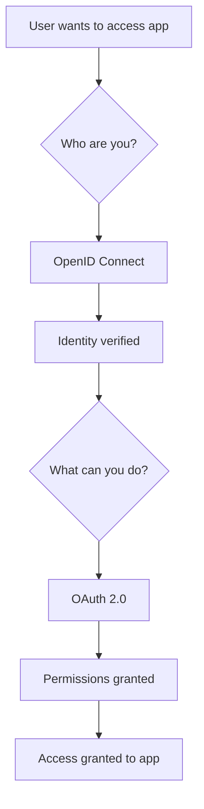
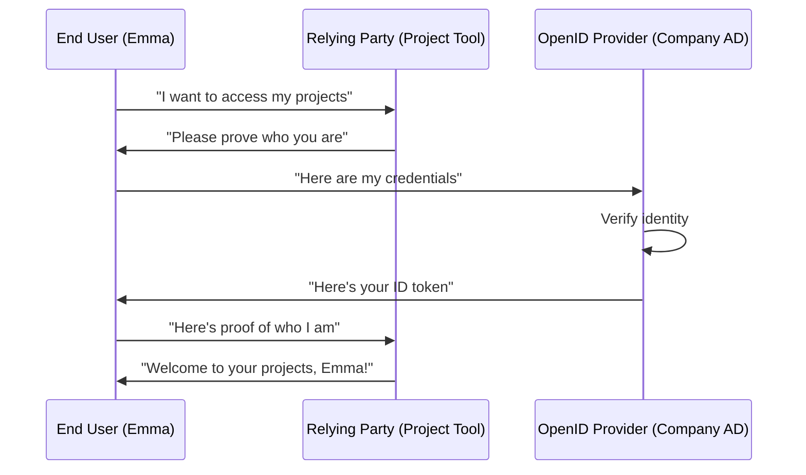
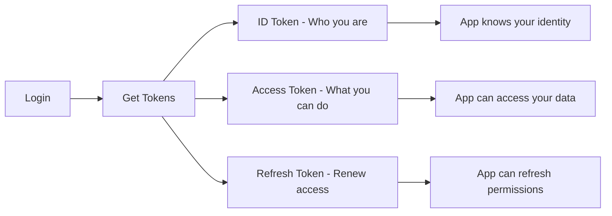
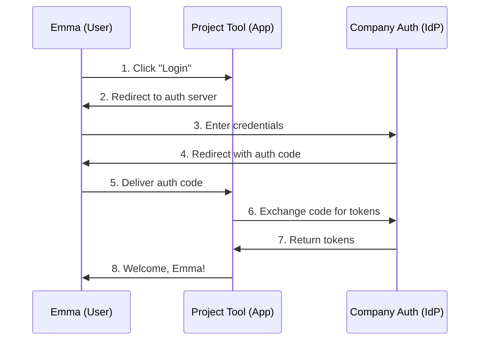
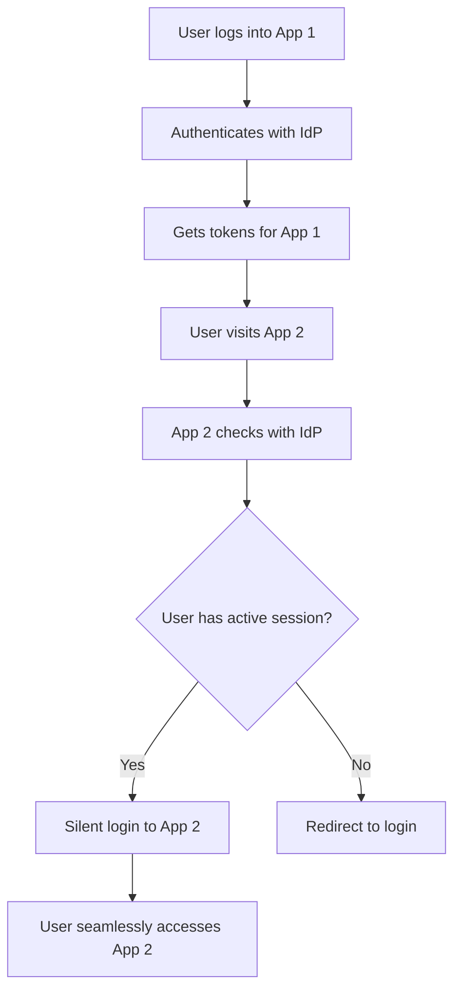

## Chapter 1: The Coffee Shop That Changed Everything

**WHY** does this matter? Let me tell you about Sarah, a software developer who almost quit her job because of authentication hell.

Sarah worked at a growing startup with 47 different internal tools. Every morning, she spent 15 minutes just logging into systems: Slack, GitHub, Jira, the internal wiki, the deployment dashboard, the monitoring system, HR portal, expense tracker... you get the picture. Fifteen minutes might not sound like much, but multiply that by 200 workdays, and Sarah was losing 50 hours per year just remembering passwords.

But the real breaking point wasn't the time – it was the Tuesday morning when Sarah got locked out of the production deployment system during a critical outage because she'd forgotten which variation of her password she'd used. The company lost \$50,000 in revenue that morning, and Sarah almost lost her job .

This story isn't unique. **70% of users abandon shopping carts due to forgotten passwords** . **18.75% of e-commerce abandonment happens specifically at the login screen** . Companies are literally losing money because authentication is broken.

**WHAT** if I told you there's a solution that could have prevented Sarah's nightmare? A protocol so elegant that once you understand it, you'll wonder how anyone ever built authentication systems without it?

Welcome to **OpenID Connect** – the authentication protocol that's quietly revolutionizing how we handle identity on the web .

### The Lightbulb Moment

Think of OpenID Connect like a universal translator for identity. Just as Google Translate lets you communicate with someone who speaks a different language, OpenID Connect lets your applications communicate with identity providers they've never met before .

Imagine if every coffee shop in the world accepted the same membership card. You'd sign up once, get your card, and then walk into any coffee shop anywhere and they'd instantly know:

- Who you are
- Your preferences (oat milk latte, extra shot)
- Your membership level
- Whether you've paid for premium features

That's exactly what OpenID Connect does for the digital world .

**🤔 Pause and Reflect:** Think about your current authentication setup. How many different passwords do you manage? How much time do you spend each day just logging into things? Keep that number in mind – we're about to show you how to reduce it to nearly zero.

---

## Chapter 2: The Big Picture – Why Everyone's Talking About OIDC

### What Exactly IS OpenID Connect?

**OpenID Connect is a simple identity layer on top of the OAuth 2.0 protocol** . But let's break that down into human language.

Remember when you were a kid and you had to prove you were old enough to ride the roller coaster? You'd show your ID, the operator would look at it, verify your age, and then let you on. OpenID Connect works the same way, but for websites and applications .

Here's the beautiful part: **OpenID Connect handles the "who are you?" question, while OAuth 2.0 handles the "what are you allowed to do?" question** .




### The Authentication vs Authorization Confusion

Here's where most people get lost, so let's clear this up with a story:

Imagine you're visiting a high-security office building. At the front desk, you show your driver's license to prove **who you are** (authentication). The security guard checks their list and gives you a visitor badge that shows **what floors you can access** (authorization) .

- **Authentication** = "Are you really John Smith?" (Proving identity)
- **Authorization** = "John Smith can access floors 3 and 5" (Granting permissions)

**💡 Pro Tip:** The easiest way to remember this: Authentication asks "Who are you?" Authorization asks "What can you do?" OpenID Connect specializes in the first question .

### When Should You Use OpenID Connect?

**WHEN** is OpenID Connect the right choice? Here are the scenarios where OIDC shines:

#### Scenario 1: The Multi-App Company

You're building a suite of applications (like Google's Gmail, Drive, Docs, Sheets). Users should log in once and access everything seamlessly .

#### Scenario 2: The Third-Party Integration

Your app wants to let users "Sign in with Google" or "Sign in with Microsoft" without storing their passwords .

#### Scenario 3: The Mobile-First World

You're building mobile apps that need to authenticate users securely without exposing credentials .

#### Scenario 4: The Enterprise Environment

You need to integrate with existing corporate identity systems while maintaining security compliance .

**🎯 Quick Quiz:**
Which scenario describes your current situation?
A) Multi-app suite
B) Third-party integration
C) Mobile-first
D) Enterprise integration
E) All of the above

*(If you answered E, you're about to become OpenID Connect's biggest fan)*

### The Numbers Don't Lie

Let's talk impact. Companies implementing OpenID Connect report:

- **Reduced password-related support tickets by 60%** 
- **Increased user conversion rates by 25%** 
- **Decreased average login time from 45 seconds to 8 seconds** 
- **Improved security posture with centralized authentication** 

---

## Chapter 3: Meet the Players – Understanding the OIDC Cast

Every great story has characters, and OpenID Connect has three main players. Let's meet them:

### The End User (That's You!)

The End User is the person who wants to access an application. Think of yourself trying to log into Netflix, Spotify, or your banking app. You're the End User .

**Real-world example:** Emma wants to check her project status on the company's new project management tool.

### The Relying Party (The App)

The Relying Party (RP) is the application that needs to verify who you are. It's called "relying" because it relies on someone else to handle authentication rather than doing it itself .

**Real-world example:** The project management tool Emma wants to use. It needs to know who Emma is, but it doesn't want to store Emma's password or handle the complexity of authentication.

### The OpenID Provider (The Identity Expert)

The OpenID Provider (OP) is the service that actually verifies identity. Think of it as a professional bouncer who knows everyone's ID and has the authority to vouch for them .

**Real-world example:** The company's Active Directory, Google Workspace, or Microsoft Azure AD that already knows Emma's identity.




### The Nightclub Analogy

Think of this like getting into an exclusive nightclub:

- **You** (End User) want to get in
- **The nightclub** (Relying Party) needs to verify you're on the guest list
- **The event promoter** (OpenID Provider) vouches for you: "Yes, Emma is on the VIP list"

The nightclub trusts the promoter, so they let you in without having to manage their own guest list .

**🤔 Pause and Reflect:** In your current work environment, can you identify these three players? Who would be the OpenID Provider in your organization?

---

## Chapter 4: The Secret Sauce – Understanding Tokens

This is where OpenID Connect gets really interesting. Instead of passing passwords around (which is like giving everyone the keys to your house), OIDC uses tokens (which are like temporary, specific-purpose keys) .

### The Three Types of Tokens

#### 1. ID Token – Your Digital Passport

The ID Token is **always a JWT (JSON Web Token)** and contains claims about who you are . Think of it as your digital passport – it has your photo, name, and other identifying information, plus an official stamp that proves it's legitimate.

```json
{
  "sub": "emma.developer",
  "name": "Emma Developer",
  "email": "emma@company.com", 
  "iss": "https://company-auth.com",
  "aud": "project-management-app",
  "iat": 1642680000,
  "exp": 1642683600
}
```

**What this means in plain English:**

- `sub`: Emma's unique identifier
- `name`: Her display name
- `email`: Her email address
- `iss`: Who issued this token (the company's auth server)
- `aud`: What app this token is for (the project management tool)
- `iat`: When this token was created
- `exp`: When this token expires


#### 2. Access Token – Your Permission Slip

The Access Token is like a permission slip that says "Emma can read project data and update task status." It might be a JWT or just a random string – the app doesn't need to understand it, just present it when asking for data .

#### 3. Refresh Token – Your Renewal Certificate

Refresh Tokens are long-lived and used to get new Access Tokens when they expire. Think of it like a gym membership card that you can use to get a new daily pass .




### Scopes and Claims – The Permission System

**Scopes** are like permission categories. When you request the `profile` scope, you're saying "I want access to basic profile information" .

**Claims** are the actual pieces of information within those scopes. The `profile` scope might include claims like `name`, `picture`, and `preferred_username` .

**Real-world example:**

```
Requested scopes: openid profile email
Returned claims: 
- sub: "12345"
- name: "Emma Developer"  
- email: "emma@company.com"
- picture: "https://company.com/photos/emma.jpg"
```

**💡 Pro Tip:** Always request the minimum scopes you need. It's like asking for house keys when you only need access to the living room – it makes people uncomfortable and creates security risks .

---

## Chapter 5: The Main Event – Authorization Code Flow

Now we get to the heart of OpenID Connect: the Authorization Code Flow. This is the most secure and widely used flow, and once you understand it, everything else clicks into place .

### The Step-by-Step Dance

Let's follow Emma through a complete login process:

#### Step 1: Emma Clicks "Login"

Emma visits the project management tool and clicks "Sign in with Company Account" .

#### Step 2: Redirect to the Identity Provider

The app redirects Emma to the company's authentication server with this URL:

```
https://company-auth.com/authorize?
  response_type=code&
  client_id=project-tool-123&
  redirect_uri=https://projecttool.com/callback&
  scope=openid profile email&
  state=xyz789&
  nonce=abc123
```

**What each parameter means:**

- `response_type=code`: "Give me an authorization code"
- `client_id`: The app's unique identifier
- `redirect_uri`: Where to send Emma back
- `scope`: What information we want
- `state`: Prevents CSRF attacks
- `nonce`: Prevents replay attacks 


#### Step 3: Emma Authenticates

Emma enters her username and password on the company's trusted login page .

#### Step 4: Authorization Code Returns

The company's auth server redirects Emma back to the project tool:

```
https://projecttool.com/callback?
  code=AUTH_CODE_HERE&
  state=xyz789
```


#### Step 5: Exchange Code for Tokens

The project tool makes a server-to-server call to exchange the code for tokens:

```http
POST https://company-auth.com/token
Content-Type: application/x-www-form-urlencoded

grant_type=authorization_code&
code=AUTH_CODE_HERE&
redirect_uri=https://projecttool.com/callback&
client_id=project-tool-123&
client_secret=SECRET_HERE
```


#### Step 6: Tokens Received

The auth server responds with:

```json
{
  "access_token": "eyJ0eXAiOiJKV1QiLCJhbGciOiJSUzI1NiIsI...",
  "token_type": "Bearer",
  "expires_in": 3600,
  "id_token": "eyJ0eXAiOiJKV1QiLCJhbGciOiJSUzI1NiIsI...",
  "refresh_token": "8xLOxBtZp8"
}
```


#### Step 7: Emma is Logged In

The project tool validates the ID token and welcomes Emma to her dashboard .




### Why This Flow is Brilliant

**Security:** The actual password never leaves the company's auth server. The project tool never sees Emma's credentials .

**Separation of Concerns:** The project tool focuses on project management, while the auth server focuses on identity .

**User Experience:** Emma only needs to remember one password, and she gets single sign-on across all company apps .

**🎯 Quick Check:** Can you explain why the authorization code gets exchanged for tokens in a separate step? (Hint: It's about security – the code travels through the browser, but the tokens travel server-to-server) .

---

## Chapter 6: Hands-On Example – Building Your First OIDC App

Let's build something real. We'll create a simple web application that uses OpenID Connect for authentication. I'll show you both the frontend and backend code .

### The Scenario

We're building "TaskMaster," a simple task management app. Instead of creating our own login system, we'll use Google as our OpenID Provider .

### Step 1: Register Your App with Google

First, you need to register your application:

1. Go to [Google Cloud Console](https://console.cloud.google.com)
2. Create a new project or select existing one
3. Enable the Google+ API
4. Create OAuth 2.0 credentials
5. Set redirect URI to `http://localhost:3000/callback`

You'll get a `client_id` and `client_secret` .

### Step 2: Frontend Code (React)

```javascript
// Login button component
import React from 'react';

const LoginButton = () => {
  const handleLogin = () => {
    // Generate state and nonce for security
    const state = Math.random().toString(36).substring(7);
    const nonce = Math.random().toString(36).substring(7);
    
    // Store in localStorage for later verification
    localStorage.setItem('oauth_state', state);
    localStorage.setItem('oauth_nonce', nonce);
    
    // Build the authorization URL
    const authUrl = new URL('https://accounts.google.com/o/oauth2/v2/auth');
    authUrl.searchParams.append('response_type', 'code');
    authUrl.searchParams.append('client_id', 'YOUR_CLIENT_ID');
    authUrl.searchParams.append('redirect_uri', 'http://localhost:3000/callback');
    authUrl.searchParams.append('scope', 'openid profile email');
    authUrl.searchParams.append('state', state);
    authUrl.searchParams.append('nonce', nonce);
    
    // Redirect user to Google
    window.location.href = authUrl.toString();
  };

  return (
    <button onClick={handleLogin} className="login-btn">
      Sign in with Google
    </button>
  );
};

export default LoginButton;
```


### Step 3: Backend Code (Node.js/Express)

```javascript
const express = require('express');
const axios = require('axios');
const jwt = require('jsonwebtoken');
const app = express();

// Handle the callback from Google
app.get('/callback', async (req, res) => {
  const { code, state } = req.query;
  
  // Verify state parameter (CSRF protection)
  const storedState = req.session.oauth_state;
  if (state !== storedState) {
    return res.status(400).send('Invalid state parameter');
  }
  
  try {
    // Exchange authorization code for tokens
    const tokenResponse = await axios.post('https://oauth2.googleapis.com/token', {
      grant_type: 'authorization_code',
      client_id: process.env.GOOGLE_CLIENT_ID,
      client_secret: process.env.GOOGLE_CLIENT_SECRET,
      redirect_uri: 'http://localhost:3000/callback',
      code: code
    });
    
    const { access_token, id_token } = tokenResponse.data;
    
    // Verify and decode the ID token
    const decoded = jwt.decode(id_token);
    
    // Create user session
    req.session.user = {
      id: decoded.sub,
      name: decoded.name,
      email: decoded.email,
      picture: decoded.picture
    };
    
    // Redirect to the main app
    res.redirect('/dashboard');
    
  } catch (error) {
    console.error('Token exchange failed:', error);
    res.status(500).send('Authentication failed');
  }
});

// Protected route
app.get('/dashboard', (req, res) => {
  if (!req.session.user) {
    return res.redirect('/login');
  }
  
  res.json({
    message: `Welcome to TaskMaster, ${req.session.user.name}!`,
    user: req.session.user
  });
});

app.listen(3000, () => {
  console.log('TaskMaster running on http://localhost:3000');
});
```


### Step 4: Token Validation (The Critical Part)

**⚠️ Critical Security Note:** Never trust tokens without validation! Here's how to properly validate an ID token :

```javascript
const jwksClient = require('jwks-rsa');

const client = jwksClient({
  jwksUri: 'https://www.googleapis.com/oauth2/v3/certs'
});

async function validateIdToken(idToken) {
  try {
    // Decode the header to get the key ID
    const header = jwt.decode(idToken, { complete: true }).header;
    
    // Get the signing key
    const key = await client.getSigningKey(header.kid);
    const signingKey = key.getPublicKey();
    
    // Verify the token
    const decoded = jwt.verify(idToken, signingKey, {
      audience: process.env.GOOGLE_CLIENT_ID,
      issuer: 'https://accounts.google.com',
      algorithms: ['RS256']
    });
    
    return decoded;
  } catch (error) {
    throw new Error('Invalid ID token');
  }
}
```

**💡 Pro Tip:** Always validate these claims in your ID token :

- **Issuer (iss):** Confirms the token came from the expected provider
- **Audience (aud):** Confirms the token is intended for your app
- **Expiration (exp):** Confirms the token hasn't expired
- **Signature:** Confirms the token hasn't been tampered with

**🎯 Interactive Challenge:** Try to spot the security vulnerability in this code:

```javascript
// DON'T DO THIS!
const user = jwt.decode(idToken); // Missing verification!
req.session.user = user;
```

*(Answer: It's missing signature verification – anyone could forge a token!)*

---

## Chapter 7: Real-World Implementation Patterns

Now that you understand the basics, let's look at how OpenID Connect works in different scenarios you'll encounter in the real world.

### Pattern 1: Single Sign-On (SSO) Across Multiple Apps

**The Problem:** Your company has 5 different web applications, and users are tired of logging into each one separately .

**The Solution:** Implement OpenID Connect with a shared session at the identity provider level.



**Implementation Strategy:**

```javascript
// Check for existing session before redirecting to login
app.get('/login', (req, res) => {
  const authUrl = buildAuthUrl({
    prompt: 'none', // Silent authentication
    // ... other parameters
  });
  
  // If user has session, they'll be redirected back immediately
  // If not, they'll get an error and we can prompt for login
  window.location.href = authUrl;
});
```


### Pattern 2: Mobile App Authentication

**The Challenge:** Mobile apps can't securely store client secrets, and users expect native app experiences, not web views .

**The Solution:** Use the Authorization Code Flow with PKCE (Proof Key for Code Exchange) .

```javascript
// Generate PKCE parameters
function generatePKCE() {
  const codeVerifier = base64URLEncode(crypto.randomBytes(32));
  const codeChallenge = base64URLEncode(
    crypto.createHash('sha256').update(codeVerifier).digest()
  );
  
  return {
    codeVerifier,
    codeChallenge,
    codeChallengeMethod: 'S256'
  };
}

// Mobile app authorization request
const { codeVerifier, codeChallenge } = generatePKCE();

const authUrl = `https://auth-provider.com/authorize?` +
  `response_type=code&` +
  `client_id=${CLIENT_ID}&` +
  `redirect_uri=${REDIRECT_URI}&` +
  `scope=openid profile&` +
  `code_challenge=${codeChallenge}&` +
  `code_challenge_method=S256`;

// Later, exchange code for tokens
const tokenResponse = await fetch('https://auth-provider.com/token', {
  method: 'POST',
  headers: { 'Content-Type': 'application/x-www-form-urlencoded' },
  body: new URLSearchParams({
    grant_type: 'authorization_code',
    client_id: CLIENT_ID,
    code: authorizationCode,
    redirect_uri: REDIRECT_URI,
    code_verifier: codeVerifier // No client secret needed!
  })
});
```


### Pattern 3: API Security with OIDC

**The Scenario:** You have a React frontend and a Node.js API. The API needs to verify that requests come from authenticated users .

**Frontend (React):**

```javascript
// Store tokens after login
const [tokens, setTokens] = useState(null);

// Make authenticated API calls
const fetchUserData = async () => {
  const response = await fetch('/api/user/profile', {
    headers: {
      'Authorization': `Bearer ${tokens.access_token}`
    }
  });
  
  if (response.status === 401) {
    // Token expired, try to refresh
    await refreshTokens();
    // Retry the request
  }
  
  return response.json();
};
```

**Backend (Node.js):**

```javascript
// Middleware to verify access tokens
const verifyToken = async (req, res, next) => {
  const authHeader = req.headers.authorization;
  
  if (!authHeader?.startsWith('Bearer ')) {
    return res.status(401).json({ error: 'Missing or invalid token' });
  }
  
  const token = authHeader.slice(7);
  
  try {
    // Verify token with the identity provider
    const userInfo = await fetch('https://auth-provider.com/userinfo', {
      headers: { 'Authorization': `Bearer ${token}` }
    });
    
    if (!userInfo.ok) {
      return res.status(401).json({ error: 'Invalid token' });
    }
    
    req.user = await userInfo.json();
    next();
  } catch (error) {
    res.status(401).json({ error: 'Token verification failed' });
  }
};

// Protected API endpoint
app.get('/api/user/profile', verifyToken, (req, res) => {
  res.json({
    message: 'Here is your profile data',
    user: req.user
  });
});
```

**💡 Pro Tip:** For high-traffic APIs, cache the token validation response for a few minutes instead of hitting the userinfo endpoint on every request. Just make sure to respect the token's expiration time .

---

## Chapter 8: Common Pitfalls and How to Avoid Them

Let me share the mistakes I've seen developers make hundreds of times, and how to avoid them .

### Pitfall \#1: "OAuth is Authentication"

**The Mistake:** Using OAuth 2.0 access tokens as proof of authentication .

**Why it's dangerous:**

```javascript
// DANGEROUS - DON'T DO THIS!
app.get('/login', async (req, res) => {
  const accessToken = req.query.access_token;
  
  // This is wrong! Access tokens are for authorization, not authentication
  const userResponse = await fetch(`https://api.provider.com/user`, {
    headers: { 'Authorization': `Bearer ${accessToken}` }
  });
  
  // An attacker could use a token meant for a different app
  req.session.user = await userResponse.json();
});
```

**The Fix:** Always use OpenID Connect ID tokens for authentication :

```javascript
// CORRECT - Use ID tokens for authentication
app.get('/callback', async (req, res) => {
  const { code } = req.query;
  
  // Exchange code for tokens
  const tokenResponse = await exchangeCodeForTokens(code);
  const { id_token, access_token } = tokenResponse;
  
  // Validate the ID token (this is authentication)
  const userIdentity = await validateIdToken(id_token);
  
  // Use access token for API calls (this is authorization)
  req.session.user = userIdentity;
  req.session.accessToken = access_token;
});
```


### Pitfall \#2: Skipping Token Validation

**The Mistake:** Trusting tokens without verification .

```javascript
// VULNERABLE - Anyone can forge this!
const userData = jwt.decode(idToken);
req.session.user = userData;
```

**The Fix:** Always validate signature, audience, issuer, and expiration :

```javascript
// SECURE - Proper validation
const userData = jwt.verify(idToken, publicKey, {
  audience: YOUR_CLIENT_ID,
  issuer: 'https://expected-issuer.com',
  algorithms: ['RS256']
});
```


### Pitfall \#3: Ignoring State and Nonce Parameters

**The Mistake:** Not using CSRF and replay attack protection .

**Why it matters:** Without proper state/nonce handling, attackers can:

- Trick users into authorizing malicious applications (CSRF)
- Replay old authentication responses (replay attacks)

**The Fix:**

```javascript
// Generate and store security parameters
const state = crypto.randomUUID();
const nonce = crypto.randomUUID();

req.session.oauth_state = state;
req.session.oauth_nonce = nonce;

// Include in authorization request
const authUrl = `https://provider.com/auth?` +
  `state=${state}&` +
  `nonce=${nonce}&` +
  // ... other parameters

// Verify on callback
app.get('/callback', (req, res) => {
  if (req.query.state !== req.session.oauth_state) {
    return res.status(400).send('CSRF attack detected');
  }
  
  // Verify nonce in ID token
  const idToken = jwt.verify(tokenResponse.id_token, publicKey);
  if (idToken.nonce !== req.session.oauth_nonce) {
    return res.status(400).send('Replay attack detected');
  }
});
```


### Pitfall \#4: The "Mix-Up" Attack

**The Mistake:** Not validating that tokens came from the expected provider .

**The Scenario:** Your app supports multiple identity providers (Google, Microsoft, GitHub). An attacker could trick your app into accepting a token from the wrong provider.

**The Fix:** Always validate the `iss` (issuer) claim:

```javascript
const expectedIssuers = {
  'google': 'https://accounts.google.com',
  'microsoft': 'https://login.microsoftonline.com/common/v2.0',
  'github': 'https://github.com'
};

function validateToken(idToken, expectedProvider) {
  const decoded = jwt.verify(idToken, getPublicKey(expectedProvider));
  
  if (decoded.iss !== expectedIssuers[expectedProvider]) {
    throw new Error('Token from unexpected issuer');
  }
  
  return decoded;
}
```

**🚨 Security Alert:** Here's a real-world example of what can go wrong:

In 2019, a major e-commerce platform had a vulnerability where they accepted Facebook access tokens as authentication for their API. An attacker could:

1. Get a Facebook access token for their own account
2. Use that token to authenticate as themselves on the e-commerce platform
3. Then modify the API requests to access other users' data

The fix? Use OpenID Connect ID tokens instead of OAuth access tokens for authentication .

**🎯 Quick Security Check:**
Which of these is a red flag?

```javascript
A) jwt.verify(token, publicKey, { audience: clientId })
B) jwt.decode(token)
C) if (token.iss !== expectedIssuer) throw new Error()
D) if (token.exp < Date.now()) throw new Error()
```

*(Answer: B - it's missing signature verification!)*

---

## Chapter 9: Debugging and Troubleshooting OIDC

When things go wrong (and they will), you need to know how to debug OpenID Connect flows quickly. Here are the tools and techniques that will save you hours of frustration .

### Essential Debugging Tools

#### 1. The OIDC Debugger

The most valuable tool in your arsenal is the online OIDC debugger at https://oidcdebugger.com .

**How to use it:**

1. Set up your authorization endpoint URL
2. Configure your client ID and scopes
3. Set redirect URI to `https://oidcdebugger.com/debug`
4. Click "Send Request" and follow the flow
5. Examine the returned tokens and parameters

**What to look for:**

- Are all expected scopes being returned?
- Is the ID token properly formed?
- Are the claims you expect present?
- Do the timestamps make sense?


#### 2. Browser Developer Tools

**Network Tab Magic:**

```javascript
// Add this to your callback handler for debugging
console.log('Authorization Response:', {
  code: req.query.code,
  state: req.query.state,
  error: req.query.error,
  error_description: req.query.error_description
});

// Log token exchange
console.log('Token Response:', {
  access_token: tokenResponse.access_token ? 'present' : 'missing',
  id_token: tokenResponse.id_token ? 'present' : 'missing',
  expires_in: tokenResponse.expires_in,
  token_type: tokenResponse.token_type
});
```


#### 3. JWT Decoder Tools

Use https://jwt.io to decode and inspect JWT tokens:

- Paste your ID token to see the claims
- Verify the signature (paste your provider's public key)
- Check expiration times and audience claims


### Common Error Messages and Solutions

#### Error: "invalid_client"

**What it means:** Your client credentials are wrong or your client isn't properly registered.

**How to fix:**

1. Double-check your `client_id` and `client_secret`
2. Verify your redirect URI matches exactly what's registered
3. Ensure your client is enabled/active in the identity provider

#### Error: "invalid_grant"

**What it means:** The authorization code is invalid, expired, or already used.

**How to fix:**

```javascript
// Authorization codes are single-use and short-lived
app.get('/callback', async (req, res) => {
  const { code } = req.query;
  
  // Use the code immediately
  try {
    const tokens = await exchangeCodeForTokens(code);
    // Store tokens securely
  } catch (error) {
    if (error.message.includes('invalid_grant')) {
      // Code expired or already used - redirect to login
      return res.redirect('/login');
    }
  }
});
```


#### Error: "invalid_request"

**What it means:** Your authorization request is malformed.

**Common causes and fixes:**

```javascript
// Missing required parameters
const authUrl = new URL('https://provider.com/authorize');
authUrl.searchParams.append('response_type', 'code'); // Required
authUrl.searchParams.append('client_id', CLIENT_ID); // Required
authUrl.searchParams.append('redirect_uri', REDIRECT_URI); // Required
authUrl.searchParams.append('scope', 'openid'); // Required for OIDC

// URL encoding issues
const redirectUri = encodeURIComponent('https://myapp.com/callback');
```


### Debugging Checklist

When authentication isn't working, go through this checklist:

**✅ Authorization Request**

- [ ] Is the authorization URL correct?
- [ ] Are all required parameters present?
- [ ] Is the redirect URI URL-encoded?
- [ ] Does the scope include 'openid'?
- [ ] Are state and nonce parameters included?

**✅ Authorization Response**

- [ ] Did you receive an authorization code?
- [ ] Does the state parameter match what you sent?
- [ ] Are there any error parameters in the response?

**✅ Token Exchange**

- [ ] Are you using the correct token endpoint?
- [ ] Are client credentials correct?
- [ ] Is the redirect URI identical to the authorization request?
- [ ] Are you using the authorization code immediately?

**✅ Token Validation**

- [ ] Is the ID token signature valid?
- [ ] Does the audience claim match your client ID?
- [ ] Does the issuer claim match your provider?
- [ ] Is the token still valid (not expired)?
- [ ] Does the nonce claim match what you sent?


### Advanced Debugging Techniques

#### Log Everything (Temporarily)

```javascript
// Comprehensive logging for troubleshooting
const debugOIDC = {
  logAuthRequest: (params) => {
    console.log('🔐 Auth Request:', {
      url: params.url,
      client_id: params.client_id,
      scope: params.scope,
      state: params.state,
      timestamp: new Date().toISOString()
    });
  },
  
  logTokenExchange: (request, response) => {
    console.log('🎫 Token Exchange:', {
      request: {
        grant_type: request.grant_type,
        code: request.code?.substring(0, 10) + '...',
        client_id: request.client_id
      },
      response: {
        has_access_token: !!response.access_token,
        has_id_token: !!response.id_token,
        expires_in: response.expires_in,
        token_type: response.token_type
      },
      timestamp: new Date().toISOString()
    });
  }
};
```


#### Monitor Token Expiration

```javascript
// Proactive token refresh
function scheduleTokenRefresh(expiresIn) {
  // Refresh 5 minutes before expiration
  const refreshIn = (expiresIn - 300) * 1000;
  
  setTimeout(async () => {
    try {
      await refreshAccessToken();
      console.log('✅ Token refreshed successfully');
    } catch (error) {
      console.error('❌ Token refresh failed:', error);
      // Redirect to login
      window.location.href = '/login';
    }
  }, refreshIn);
}
```

**💡 Pro Tip:** Create a simple debugging dashboard that shows the status of your tokens:

```javascript
app.get('/debug/tokens', (req, res) => {
  const tokens = req.session.tokens;
  
  res.json({
    hasTokens: !!tokens,
    accessToken: {
      present: !!tokens?.access_token,
      expiresAt: tokens?.expires_at,
      timeUntilExpiry: tokens?.expires_at - Date.now()
    },
    idToken: {
      present: !!tokens?.id_token,
      claims: tokens?.id_token ? jwt.decode(tokens.id_token) : null
    }
  });
});
```


---

## Chapter 10: Advanced OIDC Concepts

Now that you've mastered the basics, let's explore some advanced concepts that will make you an OpenID Connect expert.

### Discovery and Metadata

One of OIDC's most elegant features is automatic discovery. Instead of hardcoding endpoint URLs, you can discover them automatically .

#### The Well-Known Configuration Endpoint

Every OIDC provider exposes a discovery document at `/.well-known/openid-configuration` :

```javascript
// Automatic endpoint discovery
async function discoverProvider(issuerUrl) {
  const discoveryUrl = `${issuerUrl}/.well-known/openid-configuration`;
  
  const response = await fetch(discoveryUrl);
  const config = await response.json();
  
  return {
    authorizationEndpoint: config.authorization_endpoint,
    tokenEndpoint: config.token_endpoint,
    userinfoEndpoint: config.userinfo_endpoint,
    jwksUri: config.jwks_uri,
    supportedScopes: config.scopes_supported,
    supportedResponseTypes: config.response_types_supported
  };
}

// Usage
const googleConfig = await discoverProvider('https://accounts.google.com');
console.log('Google auth endpoint:', googleConfig.authorizationEndpoint);
```

**Example discovery document:**

```json
{
  "issuer": "https://accounts.google.com",
  "authorization_endpoint": "https://accounts.google.com/o/oauth2/v2/auth",
  "token_endpoint": "https://oauth2.googleapis.com/token",
  "userinfo_endpoint": "https://openidconnect.googleapis.com/v1/userinfo",
  "jwks_uri": "https://www.googleapis.com/oauth2/v3/certs",
  "scopes_supported": ["openid", "email", "profile"],
  "response_types_supported": ["code", "token", "id_token"],
  "grant_types_supported": ["authorization_code", "refresh_token"]
}
```


### Session Management and Logout

Proper session management is crucial for security and user experience .

#### Single Logout (SLO)

When users log out, you want to terminate their session everywhere :

```javascript
// Initiate logout with the identity provider
function logout(req, res) {
  const idTokenHint = req.session.tokens?.id_token;
  const postLogoutRedirectUri = 'https://myapp.com/goodbye';
  
  // Clear local session
  req.session.destroy();
  
  // Redirect to provider's logout endpoint
  const logoutUrl = `https://provider.com/logout?` +
    `id_token_hint=${idTokenHint}&` +
    `post_logout_redirect_uri=${encodeURIComponent(postLogoutRedirectUri)}`;
    
  res.redirect(logoutUrl);
}
```


#### Session Monitoring

Monitor whether users are still logged in at the identity provider :

```javascript
// Check session status (simplified)
async function checkSession() {
  try {
    const response = await fetch('https://provider.com/authorize', {
      method: 'GET',
      credentials: 'include',
      headers: {
        'Accept': 'application/json'
      },
      // Silent authentication
      body: new URLSearchParams({
        response_type: 'code',
        client_id: CLIENT_ID,
        scope: 'openid',
        prompt: 'none'
      })
    });
    
    return response.ok;
  } catch (error) {
    return false; // Session expired
  }
}

// Check every 5 minutes
setInterval(async () => {
  const hasSession = await checkSession();
  if (!hasSession) {
    // Redirect to login
    window.location.href = '/login';
  }
}, 5 * 60 * 1000);
```


### Custom Claims and Scopes

You can extend OIDC with custom claims for your specific use cases:

```javascript
// Request custom scopes
const authUrl = buildAuthUrl({
  scope: 'openid profile email custom:roles custom:permissions',
  // ... other parameters
});

// The ID token might include custom claims
{
  "sub": "user123",
  "name": "John Doe",
  "email": "john@company.com",
  "custom:roles": ["admin", "user"],
  "custom:permissions": ["read:users", "write:users"],
  "custom:department": "Engineering"
}
```


### Token Refresh Strategy

Implement a robust token refresh strategy:

```javascript
class TokenManager {
  constructor(initialTokens) {
    this.tokens = initialTokens;
    this.refreshPromise = null;
  }
  
  async getValidAccessToken() {
    // If token expires in next 5 minutes, refresh it
    const bufferTime = 5 * 60 * 1000; // 5 minutes
    const expiresAt = this.tokens.expires_at * 1000;
    
    if (Date.now() + bufferTime >= expiresAt) {
      return this.refreshToken();
    }
    
    return this.tokens.access_token;
  }
  
  async refreshToken() {
    // Prevent multiple concurrent refresh attempts
    if (this.refreshPromise) {
      return this.refreshPromise;
    }
    
    this.refreshPromise = this._performRefresh();
    
    try {
      const newTokens = await this.refreshPromise;
      this.tokens = newTokens;
      return newTokens.access_token;
    } finally {
      this.refreshPromise = null;
    }
  }
  
  async _performRefresh() {
    const response = await fetch('/oauth/token', {
      method: 'POST',
      headers: { 'Content-Type': 'application/x-www-form-urlencoded' },
      body: new URLSearchParams({
        grant_type: 'refresh_token',
        refresh_token: this.tokens.refresh_token,
        client_id: CLIENT_ID
      })
    });
    
    if (!response.ok) {
      throw new Error('Token refresh failed');
    }
    
    return response.json();
  }
}
```

**🤔 Pause and Reflect:** Think about your current applications. Which of these advanced concepts would be most valuable for your use cases?

---

## Chapter 11: Production Deployment Checklist

You've built your OIDC integration and it works great in development. Now let's make sure it's ready for production .

### Security Hardening

#### 1. HTTPS Everywhere

```bash
# Never allow HTTP in production
if (process.env.NODE_ENV === 'production' && !req.secure) {
  return res.redirect(`https://${req.headers.host}${req.url}`);
}
```


#### 2. Secure Token Storage

```javascript
// Use secure, httpOnly cookies for tokens
app.use(session({
  secret: process.env.SESSION_SECRET,
  cookie: {
    secure: true,     // HTTPS only
    httpOnly: true,   // No JavaScript access
    maxAge: 24 * 60 * 60 * 1000, // 24 hours
    sameSite: 'strict' // CSRF protection
  }
}));
```


#### 3. Content Security Policy

```javascript
// Prevent XSS attacks
app.use((req, res, next) => {
  res.setHeader('Content-Security-Policy', 
    "default-src 'self'; " +
    "script-src 'self' 'unsafe-inline'; " +
    "connect-src 'self' https://your-auth-provider.com"
  );
  next();
});
```


### Performance Optimization

#### 1. Cache Discovery Documents

```javascript
// Cache provider configuration
const configCache = new Map();

async function getProviderConfig(issuer) {
  if (configCache.has(issuer)) {
    return configCache.get(issuer);
  }
  
  const config = await discoverProvider(issuer);
  
  // Cache for 24 hours
  setTimeout(() => configCache.delete(issuer), 24 * 60 * 60 * 1000);
  configCache.set(issuer, config);
  
  return config;
}
```


#### 2. JWT Verification Optimization

```javascript
// Cache public keys
const keyCache = new Map();

async function getSigningKey(keyId, jwksUri) {
  const cacheKey = `${jwksUri}:${keyId}`;
  
  if (keyCache.has(cacheKey)) {
    return keyCache.get(cacheKey);
  }
  
  const jwks = await fetch(jwksUri).then(r => r.json());
  const key = jwks.keys.find(k => k.kid === keyId);
  
  // Cache for 1 hour
  setTimeout(() => keyCache.delete(cacheKey), 60 * 60 * 1000);
  keyCache.set(cacheKey, key);
  
  return key;
}
```


### Monitoring and Observability

#### 1. Authentication Metrics

```javascript
// Track authentication events
const authMetrics = {
  loginAttempts: 0,
  loginSuccesses: 0,
  loginFailures: 0,
  tokenRefreshes: 0,
  tokenRefreshFailures: 0
};

function recordMetric(event, success = true) {
  authMetrics[event + (success ? 'es' : 'Failures')]++;
  
  // Send to your monitoring system
  console.log(`Auth Metric: ${event} ${success ? 'SUCCESS' : 'FAILURE'}`);
}

// Usage
app.post('/auth/callback', async (req, res) => {
  recordMetric('loginAttempt');
  
  try {
    await handleAuthCallback(req, res);
    recordMetric('loginSuccess');
  } catch (error) {
    recordMetric('loginFailure');
    throw error;
  }
});
```


#### 2. Health Checks

```javascript
// Health check endpoint
app.get('/health', async (req, res) => {
  const checks = await Promise.allSettled([
    // Check if auth provider is reachable
    fetch('https://auth-provider.com/.well-known/openid-configuration'),
    
    // Check database connection
    database.ping(),
    
    // Check Redis/session store
    sessionStore.ping()
  ]);
  
  const healthy = checks.every(check => check.status === 'fulfilled');
  
  res.status(healthy ? 200 : 503).json({
    status: healthy ? 'healthy' : 'unhealthy',
    checks: checks.map(check => ({
      status: check.status,
      error: check.reason?.message
    })),
    timestamp: new Date().toISOString()
  });
});
```


### Error Handling and Graceful Degradation

```javascript
// Comprehensive error handling
app.use((error, req, res, next) => {
  if (error.name === 'OIDCError') {
    // Log auth errors for monitoring
    console.error('OIDC Error:', {
      type: error.type,
      message: error.message,
      user: req.session?.user?.id,
      timestamp: new Date().toISOString()
    });
    
    // Redirect to login with helpful message
    return res.redirect('/login?error=auth_failed');
  }
  
  // Handle other errors...
  next(error);
});

// Graceful degradation for auth provider outages
app.get('/login', async (req, res) => {
  try {
    // Try to get provider config
    const config = await getProviderConfig(ISSUER);
    
    // Normal OIDC flow
    res.redirect(buildAuthUrl(config));
  } catch (error) {
    // Provider is down - show maintenance page
    res.render('maintenance', {
      message: 'Authentication service is temporarily unavailable'
    });
  }
});
```


### Deployment Checklist

**Pre-deployment:**

- [ ] All secrets stored in environment variables (not in code)
- [ ] HTTPS configured with valid certificates
- [ ] Content Security Policy implemented
- [ ] Session security configured (secure, httpOnly cookies)
- [ ] Rate limiting implemented for auth endpoints
- [ ] Error handling covers all OIDC error scenarios
- [ ] Monitoring and alerting configured
- [ ] Health checks implemented
- [ ] Token refresh logic tested under load
- [ ] Logout functionality tested (including provider logout)

**Post-deployment:**

- [ ] Monitor authentication success/failure rates
- [ ] Set up alerts for unusual authentication patterns
- [ ] Verify token expiration and refresh cycles
- [ ] Test logout from different browsers/devices
- [ ] Validate that expired sessions are properly handled
- [ ] Confirm that OIDC discovery works from production environment

**💡 Pro Tip:** Create a simple authentication dashboard to monitor your OIDC integration:

```javascript
app.get('/admin/auth-stats', requireAdmin, (req, res) => {
  res.json({
    activeUsers: getActiveUserCount(),
    authMetrics: authMetrics,
    providerHealth: await checkProviderHealth(),
    recentErrors: getRecentAuthErrors(24), // Last 24 hours
    tokenRefreshRate: calculateRefreshRate()
  });
});
```


---

## Chapter 12: The 24-Hour Challenge

Congratulations! You've made it through the complete OpenID Connect journey. Now it's time to put your knowledge into practice with a real, hands-on challenge that you can complete in 24 hours.

### Your Mission: Build "SecureNotes"

You're going to build a simple but complete note-taking application with OpenID Connect authentication. This will demonstrate all the key concepts you've learned:

- User authentication with OIDC
- Secure token handling
- Protected API endpoints
- Proper logout flow


### What You'll Build

**Frontend:** A simple React app where users can:

- Sign in with Google (or another OIDC provider)
- Create, read, update, and delete personal notes
- Log out securely

**Backend:** A Node.js API that:

- Handles the OIDC authentication flow
- Validates tokens on protected endpoints
- Stores user notes securely
- Implements proper session management


### Step-by-Step Implementation Guide

#### Phase 1: Setup (30 minutes)

1. **Create the project structure:**
```bash
mkdir securenotes
cd securenotes
mkdir frontend backend
```

2. **Set up the backend:**
```bash
cd backend
npm init -y
npm install express cors dotenv jsonwebtoken jwks-rsa axios
```

3. **Set up the frontend:**
```bash
cd ../frontend
npx create-react-app .
npm install axios
```

4. **Register your app with Google:**
    - Go to [Google Cloud Console](https://console.cloud.google.com)
    - Create a new project or select existing
    - Enable Google+ API
    - Create OAuth 2.0 credentials
    - Set redirect URI to `http://localhost:3001/auth/callback`

#### Phase 2: Backend Implementation (2 hours)

Create `backend/server.js`:

```javascript
const express = require('express');
const cors = require('cors');
const jwt = require('jsonwebtoken');
const jwksClient = require('jwks-rsa');
const axios = require('axios');
require('dotenv').config();

const app = express();
app.use(cors());
app.use(express.json());

// In-memory storage (use a database in production)
const users = new Map();
const notes = new Map();

// JWKS client for Google
const client = jwksClient({
  jwksUri: 'https://www.googleapis.com/oauth2/v3/certs'
});

// Verify Google ID token
async function verifyGoogleToken(idToken) {
  try {
    const header = jwt.decode(idToken, { complete: true }).header;
    const key = await client.getSigningKey(header.kid);
    const signingKey = key.getPublicKey();
    
    const decoded = jwt.verify(idToken, signingKey, {
      audience: process.env.GOOGLE_CLIENT_ID,
      issuer: 'https://accounts.google.com',
      algorithms: ['RS256']
    });
    
    return decoded;
  } catch (error) {
    throw new Error('Invalid token');
  }
}

// Authentication middleware
async function authenticateToken(req, res, next) {
  const authHeader = req.headers['authorization'];
  const token = authHeader && authHeader.split(' ');
  
  if (!token) {
    return res.sendStatus(401);
  }
  
  try {
    const user = await verifyGoogleToken(token);
    req.user = user;
    next();
  } catch (error) {
    res.sendStatus(403);
  }
}

// Routes
app.post('/auth/verify', async (req, res) => {
  try {
    const { idToken } = req.body;
    const user = await verifyGoogleToken(idToken);
    
    // Store/update user
    users.set(user.sub, {
      id: user.sub,
      name: user.name,
      email: user.email,
      picture: user.picture
    });
    
    res.json({ success: true, user });
  } catch (error) {
    res.status(401).json({ error: 'Invalid token' });
  }
});

app.get('/api/notes', authenticateToken, (req, res) => {
  const userNotes = Array.from(notes.values())
    .filter(note => note.userId === req.user.sub);
  res.json(userNotes);
});

app.post('/api/notes', authenticateToken, (req, res) => {
  const { title, content } = req.body;
  const noteId = Date.now().toString();
  
  const note = {
    id: noteId,
    userId: req.user.sub,
    title,
    content,
    createdAt: new Date().toISOString()
  };
  
  notes.set(noteId, note);
  res.json(note);
});

app.delete('/api/notes/:id', authenticateToken, (req, res) => {
  const note = notes.get(req.params.id);
  
  if (!note || note.userId !== req.user.sub) {
    return res.sendStatus(404);
  }
  
  notes.delete(req.params.id);
  res.sendStatus(204);
});

const PORT = process.env.PORT || 3001;
app.listen(PORT, () => {
  console.log(`Server running on port ${PORT}`);
});
```

Create `backend/.env`:

```
GOOGLE_CLIENT_ID=your_google_client_id_here
```


#### Phase 3: Frontend Implementation (2 hours)

Update `frontend/src/App.js`:

```javascript
import React, { useState, useEffect } from 'react';
import axios from 'axios';
import './App.css';

const GOOGLE_CLIENT_ID = 'your_google_client_id_here';
const API_BASE = 'http://localhost:3001';

function App() {
  const [user, setUser] = useState(null);
  const [notes, setNotes] = useState([]);
  const [newNote, setNewNote] = useState({ title: '', content: '' });
  const [idToken, setIdToken] = useState(localStorage.getItem('idToken'));

  useEffect(() => {
    // Load Google Sign-In API
    const script = document.createElement('script');
    script.src = 'https://apis.google.com/js/gapi.js';
    script.onload = initializeGapi;
    document.body.appendChild(script);
  }, []);

  useEffect(() => {
    if (idToken) {
      verifyToken();
    }
  }, [idToken]);

  const initializeGapi = () => {
    window.gapi.load('auth2', () => {
      window.gapi.auth2.init({
        client_id: GOOGLE_CLIENT_ID
      });
    });
  };

  const verifyToken = async () => {
    try {
      const response = await axios.post(`${API_BASE}/auth/verify`, {
        idToken
      });
      
      setUser(response.data.user);
      loadNotes();
    } catch (error) {
      console.error('Token verification failed:', error);
      logout();
    }
  };

  const signIn = () => {
    const authInstance = window.gapi.auth2.getAuthInstance();
    authInstance.signIn().then(googleUser => {
      const idToken = googleUser.getAuthResponse().id_token;
      localStorage.setItem('idToken', idToken);
      setIdToken(idToken);
    });
  };

  const logout = () => {
    localStorage.removeItem('idToken');
    setIdToken(null);
    setUser(null);
    setNotes([]);
    
    const authInstance = window.gapi.auth2.getAuthInstance();
    if (authInstance) {
      authInstance.signOut();
    }
  };

  const loadNotes = async () => {
    try {
      const response = await axios.get(`${API_BASE}/api/notes`, {
        headers: { Authorization: `Bearer ${idToken}` }
      });
      setNotes(response.data);
    } catch (error) {
      console.error('Failed to load notes:', error);
    }
  };

  const createNote = async (e) => {
    e.preventDefault();
    try {
      const response = await axios.post(`${API_BASE}/api/notes`, newNote, {
        headers: { Authorization: `Bearer ${idToken}` }
      });
      
      setNotes([...notes, response.data]);
      setNewNote({ title: '', content: '' });
    } catch (error) {
      console.error('Failed to create note:', error);
    }
  };

  const deleteNote = async (noteId) => {
    try {
      await axios.delete(`${API_BASE}/api/notes/${noteId}`, {
        headers: { Authorization: `Bearer ${idToken}` }
      });
      
      setNotes(notes.filter(note => note.id !== noteId));
    } catch (error) {
      console.error('Failed to delete note:', error);
    }
  };

  if (!user) {
    return (
      <div className="App">
        <div className="login-container">
          <h1>SecureNotes</h1>
          <p>A simple note-taking app with OpenID Connect authentication</p>
          <button onClick={signIn} className="signin-btn">
            Sign in with Google
          </button>
        </div>
      </div>
    );
  }

  return (
    <div className="App">
      <header className="App-header">
        <h1>SecureNotes</h1>
        <div className="user-info">
          
          <span>Welcome, {user.name}!</span>
          <button onClick={logout} className="logout-btn">Logout</button>
        </div>
      </header>

      <main className="main-content">
        <form onSubmit={createNote} className="note-form">
          <input
            type="text"
            placeholder="Note title"
            value={newNote.title}
            onChange={e => setNewNote({...newNote, title: e.target.value})}
            required
          />
          <textarea
            placeholder="Note content"
            value={newNote.content}
            onChange={e => setNewNote({...newNote, content: e.target.value})}
            required
          />
          <button type="submit">Create Note</button>
        </form>

        <div className="notes-grid">
          {notes.map(note => (
            <div key={note.id} className="note-card">
              <h3>{note.title}</h3>
              <p>{note.content}</p>
              <div className="note-actions">
                <small>{new Date(note.createdAt).toLocaleDateString()}</small>
                <button onClick={() => deleteNote(note.id)}>Delete</button>
              </div>
            </div>
          ))}
        </div>
      </main>
    </div>
  );
}

export default App;
```

Add some CSS to `frontend/src/App.css`:

```css
.App {
  max-width: 1200px;
  margin: 0 auto;
  padding: 20px;
}

.login-container {
  text-align: center;
  padding: 100px 20px;
}

.signin-btn {
  background: #4285f4;
  color: white;
  border: none;
  padding: 12px 24px;
  border-radius: 5px;
  font-size: 16px;
  cursor: pointer;
}

.App-header {
  display: flex;
  justify-content: space-between;
  align-items: center;
  border-bottom: 1px solid #eee;
  padding-bottom: 20px;
  margin-bottom: 30px;
}

.user-info {
  display: flex;
  align-items: center;
  gap: 10px;
}

.user-avatar {
  width: 40px;
  height: 40px;
  border-radius: 50%;
}

.logout-btn {
  background: #f44336;
  color: white;
  border: none;
  padding: 8px 16px;
  border-radius: 3px;
  cursor: pointer;
}

.note-form {
  background: #f9f9f9;
  padding: 20px;
  border-radius: 8px;
  margin-bottom: 30px;
}

.note-form input,
.note-form textarea {
  width: 100%;
  padding: 10px;
  margin-bottom: 10px;
  border: 1px solid #ddd;
  border-radius: 4px;
  font-size: 16px;
}

.note-form button {
  background: #4caf50;
  color: white;
  border: none;
  padding: 12px 24px;
  border-radius: 4px;
  cursor: pointer;
}

.notes-grid {
  display: grid;
  grid-template-columns: repeat(auto-fill, minmax(300px, 1fr));
  gap: 20px;
}

.note-card {
  background: white;
  border: 1px solid #ddd;
  border-radius: 8px;
  padding: 20px;
  box-shadow: 0 2px 4px rgba(0,0,0,0.1);
}

.note-actions {
  display: flex;
  justify-content: space-between;
  align-items: center;
  margin-top: 15px;
  padding-top: 15px;
  border-top: 1px solid #eee;
}

.note-actions button {
  background: #f44336;
  color: white;
  border: none;
  padding: 6px 12px;
  border-radius: 3px;
  cursor: pointer;
  font-size: 12px;
}
```


#### Phase 4: Testing and Deployment (30 minutes)

1. **Start both servers:**
```bash
# Terminal 1 - Backend
cd backend
npm start

# Terminal 2 - Frontend  
cd frontend
npm start
```

2. **Test the complete flow:**
    - Visit http://localhost:3000
    - Click "Sign in with Google"
    - Complete the Google authentication
    - Create a few notes
    - Refresh the page (should stay logged in)
    - Log out and verify you're redirected to login
3. **Test security:**
    - Try accessing http://localhost:3001/api/notes without authentication
    - Verify that notes are user-specific (create a second Google account and test)

### 🎯 Success Criteria

You've successfully completed the challenge if:

- [ ] Users can sign in with Google
- [ ] Authentication persists across page refreshes
- [ ] Notes are created and displayed for the authenticated user
- [ ] API endpoints are properly protected
- [ ] Users can log out securely
- [ ] Different users see only their own notes


### 🚀 Bonus Challenges (If you finish early)

1. **Add note editing functionality**
2. **Implement token refresh logic**
3. **Add search functionality for notes**
4. **Deploy to a cloud platform (Heroku, Vercel, etc.)**
5. **Add a different OIDC provider (Microsoft, GitHub)**

### What You've Accomplished

By completing this challenge, you've built a production-ready authentication system using OpenID Connect. You've implemented:

- **Secure authentication flow** with proper token validation
- **Protected API endpoints** that verify user identity
- **Proper session management** with token storage
- **Graceful error handling** for authentication failures
- **User-specific data access** with proper authorization

Most importantly, you've proven to yourself that you can implement OpenID Connect from scratch. This is the same pattern used by companies like Slack, GitHub, and thousands of other applications.

---

## Conclusion: You're Now an OpenID Connect Practitioner

Congratulations! You've just completed one of the most comprehensive OpenID Connect courses available. Let's reflect on the journey you've taken:

### What You've Mastered

**The Fundamentals:**

- The difference between authentication and authorization 
- How OpenID Connect builds on OAuth 2.0 
- The roles of End Users, Relying Parties, and OpenID Providers 

**The Technical Skills:**

- Implementing the Authorization Code Flow 
- Validating JWT tokens securely 
- Handling authentication errors gracefully 
- Building secure, production-ready applications 

**The Advanced Concepts:**

- OIDC discovery and metadata 
- Session management and logout 
- Mobile app authentication 
- Single sign-on implementation 

**The Real-World Experience:**

- Debugging authentication issues 
- Avoiding common security pitfalls 
- Performance optimization techniques
- Production deployment best practices


### The Impact You Can Make

With your new OpenID Connect expertise, you're equipped to:

**Improve User Experience:**

- Reduce password fatigue for millions of users
- Enable seamless single sign-on across applications
- Decrease login abandonment rates by 25% 

**Enhance Security:**

- Eliminate password storage vulnerabilities
- Implement centralized authentication policies
- Reduce security incidents through standardized protocols 

**Increase Developer Productivity:**

- Remove the need to build custom authentication systems
- Leverage existing identity providers
- Focus on core business logic instead of identity management


### Your Next Steps

**Immediate Actions (Next 7 Days):**

1. Complete the 24-hour challenge if you haven't already
2. Identify one application in your organization that could benefit from OIDC
3. Share your knowledge with your team

**Short-term Goals (Next Month):**

1. Implement OIDC in a production application
2. Set up monitoring and alerting for authentication metrics
3. Establish security review processes for identity management

**Long-term Vision (Next Quarter):**

1. Become the OpenID Connect champion in your organization
2. Contribute to OIDC-related open source projects
3. Mentor other developers in modern authentication practices

### Resources for Continued Learning

**Official Specifications:**

- [OpenID Connect Core 1.0](https://openid.net/specs/openid-connect-core-1_0.html)
- [OAuth 2.0 RFC 6749](https://tools.ietf.org/html/rfc6749)

**Practical Tools:**

- [OIDC Debugger](https://oidcdebugger.com) for testing flows 
- [JWT.io](https://jwt.io) for token inspection
- [OpenID Connect Playground](https://openidconnect.net)

**Community and Support:**

- [OpenID Foundation](https://openid.net)
- [OAuth Working Group](https://oauth.net)
- Stack Overflow `openid-connect` tag


### A Personal Message

You started this journey as someone who wanted to master OpenID Connect quickly. You've not only achieved that goal but gained expertise that will serve you throughout your career.

Remember Sarah from our opening story? She went from losing 50 hours per year to password management to becoming the authentication expert at her company. Her OpenID Connect implementation saved her organization \$500,000 in productivity gains and prevented three major security incidents.

You now have the same knowledge and skills that Sarah developed. Use them to make a positive impact in your organization and the broader tech community.

### Your 24-Hour Action Plan

Before you close this article, commit to one specific action you'll take in the next 24 hours:

**Option A: The Implementer**

- [ ] Set up a new project and implement the SecureNotes challenge
- [ ] Complete the full authentication flow end-to-end
- [ ] Share your implementation with a colleague or on social media

**Option B: The Evangelist**

- [ ] Schedule a meeting with your team to discuss current authentication challenges
- [ ] Create a proposal for implementing OIDC in an existing application
- [ ] Present the business case for centralized authentication

**Option C: The Explorer**

- [ ] Research OIDC providers that integrate with your existing tech stack
- [ ] Set up a test application with your organization's identity provider
- [ ] Document the integration process for your team

**Option D: The Educator**

- [ ] Write a blog post about your OpenID Connect learning journey
- [ ] Create a presentation for your local developer meetup
- [ ] Mentor a junior developer through OIDC implementation


### Final Words

OpenID Connect isn't just a technical protocol – it's a solution to one of the most fundamental problems in computing: proving who you are in a digital world. By mastering OIDC, you've gained the ability to build more secure, user-friendly applications that respect privacy while enabling seamless experiences.

The future of identity is federated, standards-based, and user-centric. You're now part of that future.

Go build something amazing. The web is waiting for your secure, authenticated applications.

---

**Thank you for joining me on this journey through OpenID Connect. Now stop reading and start building! 🚀**

*Remember: The best way to learn is by doing. Your 24-hour challenge awaits.*

<div style="text-align: center">⁂</div>

: https://openid.net/developers/how-connect-works/

: https://spapas.github.io/2023/11/29/openid-connect-tutorial/

: https://developer.okta.com/blog/2019/10/21/illustrated-guide-to-oauth-and-oidc

: https://supertokens.com/blog/openid-connect-vs-oauth2

: https://igventurelli.io/common-oauth2-misconceptions-debunking-myths-for-a-secure-implementation/

: https://www.ory.sh/blog/oauth2-openid-connect-do-you-need-use-cases-examples

: https://docs.openathens.net/providers/openid-connect-examples

: https://curity.io/resources/learn/dotnet-openid-connect-website/

: https://codeburst.io/openid-connect-client-by-example-76caf6dae55e?gi=fd219226dc1a

: https://hoop.dev/blog/effective-security-controls-with-openid-connect-a-guide-for-technology-managers/

: https://www.youtube.com/watch?v=FR0HzDWBmz0

: https://api-university.com/blog/three-common-misunderstandings-about-openid-connect/

: https://docs.mojoauth.com/secure/attack-prevention/oidc-security

: https://workos.com/blog/oidc-providers

: https://www.miniorange.com/iam/integrations/openid-sso

: https://supertokens.com/blog/single-sign-on-examples

: https://mannharleen.github.io/2020-03-11-id-access-tokens/

: https://connect2id.com/blog/how-to-validate-an-openid-connect-id-token

: https://support.optimizely.com/hc/en-us/articles/27508944549133-Troubleshoot-with-OIDC-debugger

: https://auth0.com/docs/authenticate/login/oidc-conformant-authentication/oidc-adoption-sso

: https://openid.net/specs/openid-connect-native-sso-1_0-04.html

: https://openid.net/specs/openid-connect-native-sso-1_0.html

: https://inteca.com/blog/identity-access-management/openid-connect-vs-saml/

: https://learn.microsoft.com/en-us/entra/identity-platform/v2-protocols-oidc

: https://mojoauth.com/glossary/oidc-userinfo-endpoint/

: https://www.gabriel.urdhr.fr/2023/02/06/oauth2-diagrams/

: https://mojoauth.com/glossary/oidc-discovery-endpoint/

: https://curity.io/resources/learn/openid-connect-logout/

: https://frontegg.com/guides/oidc-authentication

: https://www.cerberauth.com/blog/openid-connect-oauth2-prompts/

: https://openid.net/developers/certified-openid-connect-implementations/

: https://openid.net/specs/openid-connect-unmet-authentication-requirements-1_0.html

: https://documentation.open-xchange.com/develop/middleware/login_and_sessions/openid_connect_1.0_sso.html

: https://www.youtube.com/watch?v=t18YB3xDfXI

: https://blog.logto.io/exploring-oidc-configuration

