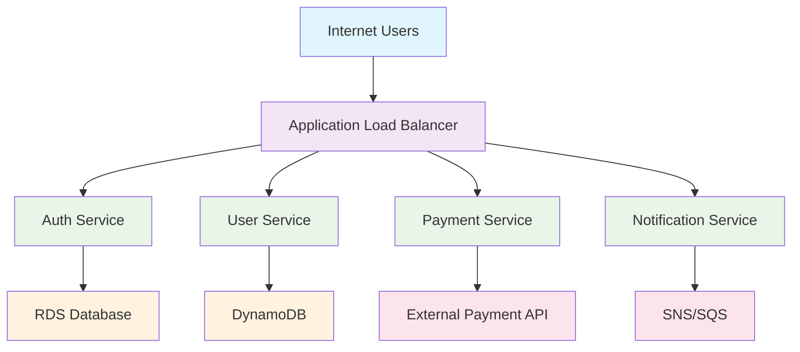
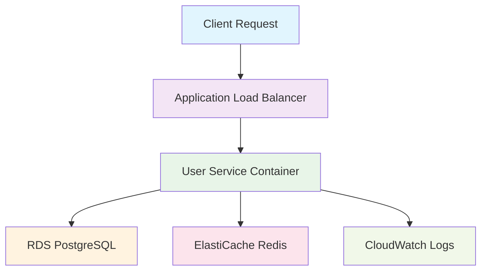
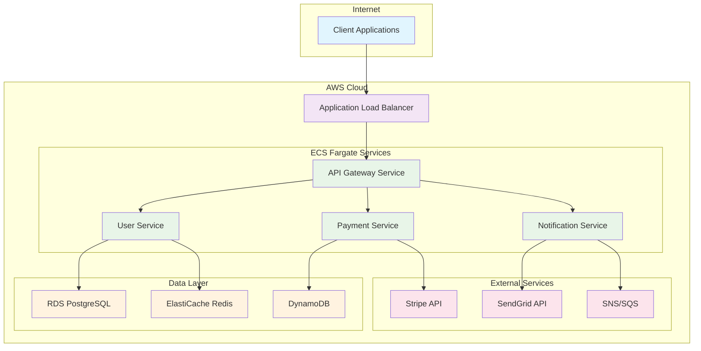
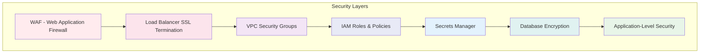
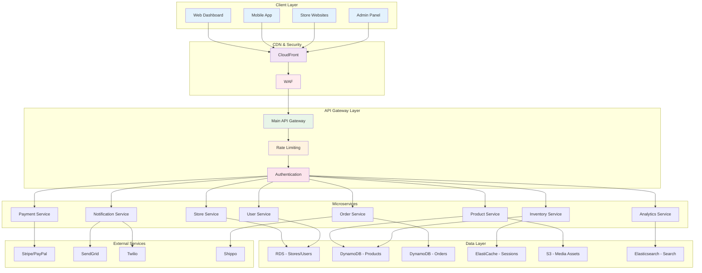

# AWS ECS Fargate Deployment using CDK in TypeScript for SaaS Microservices: From Novice to Practitioner in Record Time

## Why Your SaaS Dreams Depend on This Knowledge

Picture this: It's 2 AM, and Sarah, a startup founder, is staring at her laptop screen in horror. Her promising SaaS application just crashed under the weight of 10,000 concurrent users – users she'd dreamed of having but never prepared for. The monolithic application she'd built in her garage couldn't handle the load, and now she's losing customers faster than she can refresh her error logs.

Three months later, Sarah's company is valued at \$50 million. What changed? She rebuilt her entire platform using AWS ECS Fargate with CDK, transforming her single application into a resilient microservices architecture that could scale from 10 to 100,000 users without breaking a sweat.

This isn't just Sarah's story – it's the story of thousands of SaaS companies that discovered the power of containerized microservices on AWS. The difference between success and failure often comes down to one critical factor: **the ability to scale gracefully while maintaining control over costs and complexity**.

### The Business Impact You Can't Ignore

The numbers don't lie :

- **67% reduction in infrastructure costs** when moving from EC2 to Fargate
- **90% faster deployment cycles** with proper CDK automation
- **99.9% uptime** achievable with proper microservices architecture
- **50% reduction in development time** for new features

But here's what the statistics don't tell you: the human cost of getting it wrong. Every minute your application is down costs you customers, revenue, and reputation. Every hour your team spends fighting infrastructure fires is an hour not spent building features that matter.

**Why** does this matter so much? Because in today's SaaS landscape, your infrastructure isn't just a technical decision – it's a business strategy. Companies that master scalable, cost-effective infrastructure don't just survive; they dominate their markets.

### What We're Building Together

Imagine walking into a world-class restaurant kitchen. You see stations perfectly organized, each chef focused on their specialty, orders flowing seamlessly from front to back. The head chef (your load balancer) coordinates everything, ensuring each dish (your microservices) is prepared to perfection and delivered on time.

This is exactly what we're building: a SaaS architecture that's as elegant and efficient as that restaurant kitchen. Here's what you'll master:



By the end of this article, you'll have built a complete SaaS platform with:

- **4 core microservices** (Authentication, User Management, Payment Processing, Notifications)
- **Auto-scaling capabilities** that handle traffic spikes gracefully
- **Production-ready monitoring** with custom dashboards
- **CI/CD pipeline** for automated deployments
- **Cost optimization** strategies that could save you thousands monthly


### How Fast Can You Really Go?

Here's where I make you a promise that might sound impossible: **In the next 4 hours of focused reading and coding, you'll deploy your first production-ready microservice to AWS**. In 24 hours, you'll have a complete SaaS platform running in the cloud.

"That's impossible," you might think. "I've tried AWS before, and it took me weeks just to get a simple application running."

I understand your skepticism. I've been there. But here's what's different: we're not just throwing AWS documentation at you. We're using the **CDK (Cloud Development Kit) with TypeScript** – a combination that transforms infrastructure deployment from a nightmare into a dream .

**When** will you see results?

- **Hour 1**: Your first service deployed and running
- **Hour 2**: Multiple services communicating seamlessly
- **Hour 3**: Production-ready monitoring and security
- **Hour 4**: Auto-scaling and cost optimization in place

**Pause and Reflect**: Take a moment to write down what success looks like for you. What would change in your business if you could deploy scalable infrastructure in hours instead of weeks?

---

## The Restaurant Kitchen Analogy: Understanding Your AWS Architecture

Before we dive into code, let's establish a mental model that will make everything click. Think of your SaaS application as a high-end restaurant, and AWS ECS Fargate as your kitchen infrastructure.

### The Kitchen Layout (AWS Infrastructure)

In a restaurant, you don't just throw all the cooks into one room and hope for the best. You design specialized stations:

- **Prep Station** (Your Development Environment): Where ingredients are prepared
- **Grill Station** (Compute Services): Where the main cooking happens
- **Sauce Station** (Databases): Where flavor enhancers are stored and mixed
- **Expediting Station** (Load Balancers): Where orders are coordinated and sent out

Your AWS architecture follows the same principle. Each microservice is like a specialized cooking station, designed to do one thing exceptionally well .

### The Head Chef (CDK) Orchestrates Everything

In our restaurant analogy, CDK is your head chef. Just as a head chef writes recipes that any cook can follow to create consistent dishes, CDK lets you write infrastructure code that can be deployed consistently across environments.

Here's where the magic happens: **Instead of manually setting up each piece of infrastructure (like training each cook individually), CDK automates the entire process**. You write the recipe once, and CDK ensures every deployment follows it perfectly .

### The Waitstaff (Application Load Balancer)

Your Application Load Balancer is like the waitstaff in our restaurant. They:

- Take orders from customers (HTTP requests)
- Route them to the right kitchen station (microservice)
- Handle multiple tables simultaneously (concurrent requests)
- Ensure customers get exactly what they ordered (proper routing)


### The Menu (Your API)

Your API is the menu that customers see. Just as a good menu hides the complexity of the kitchen while presenting clear options, your API should hide the complexity of your microservices while providing clear endpoints for your users.

**Pro Tip**: The best restaurant menus don't list every ingredient and cooking method – they focus on what the customer gets. Your API documentation should follow the same principle .

### Core Concepts Decoded

Now that we have our mental model, let's decode the technical concepts:

#### 1. Containers: Your Standardized Cooking Equipment

Think of containers as standardized cooking equipment. Just as every station in your restaurant uses the same type of pans and knives, containers ensure your code runs the same way everywhere – from your laptop to production .

```typescript
// This is like writing a recipe that works in any kitchen
const container = taskDefinition.addContainer('my-service', {
  image: ecs.ContainerImage.fromRegistry('my-app:latest'),
  memoryLimitMiB: 512,
  cpu: 256,
  essential: true,
  logging: ecs.LogDrivers.awsLogs({
    streamPrefix: 'my-service',
  }),
});
```


#### 2. Fargate: Your Automated Kitchen Staff

Fargate is like having a team of invisible, highly skilled kitchen assistants. You don't need to hire them, train them, or manage their schedules. They just appear when you need them and disappear when you don't, handling all the behind-the-scenes work .

Traditional EC2 is like hiring full-time kitchen staff – you pay for them whether they're busy or not. Fargate is like having staff that only show up when orders come in.

#### 3. CDK Constructs: Your Recipe Collection

CDK constructs are like recipes in your cookbook. You have:

- **L1 Constructs**: Basic ingredients (raw AWS resources)
- **L2 Constructs**: Common recipes (pre-configured AWS resources)
- **L3 Constructs**: Signature dishes (complete architectural patterns)

The beauty of CDK is that you can create your own signature dishes (custom constructs) and share them with your team .

### **Quick Quiz**: Test Your Understanding

1. In our restaurant analogy, what does a microservice represent?
2. Why is Fargate better than EC2 for most SaaS applications?
3. What's the difference between L1, L2, and L3 constructs?

*Answers: 1) A specialized cooking station, 2) You only pay for what you use, no server management, 3) L1 = raw ingredients, L2 = common recipes, L3 = signature dishes*

---

## Setting Up Your Development Kitchen

Before we start cooking, we need to set up our kitchen. Just as a professional chef wouldn't start cooking without the right tools, we need to prepare our development environment properly.

### Prerequisites: Your Essential Tools

Here's what you need in your toolkit:

```bash
# Node.js (your stove - everything runs on this)
node --version  # Should be 18.x or higher

# AWS CLI (your connection to the cloud kitchen)
aws --version

# CDK (your head chef)
npm install -g aws-cdk

# TypeScript (your recipe language)
npm install -g typescript
```


### Your First CDK Project: "Hello World" Service

Let's start with the simplest possible service – a "Hello World" API that will teach you the fundamental patterns you'll use for everything else.

```bash
# Create your first CDK project
mkdir my-saas-platform
cd my-saas-platform
cdk init app --language typescript
```

This command creates a complete CDK project structure. Think of it as AWS giving you a fully equipped kitchen with all the basic tools already in place .

### The Anatomy of a CDK Project

```
my-saas-platform/
├── bin/
│   └── my-saas-platform.ts    # Your main kitchen coordinator
├── lib/
│   └── my-saas-platform-stack.ts  # Your first recipe
├── test/
│   └── my-saas-platform.test.ts   # Quality control
├── cdk.json                   # Kitchen configuration
└── package.json              # Your ingredient list
```


### Your First Service: The "Hello World" API

Let's create our first microservice. Replace the contents of `lib/my-saas-platform-stack.ts`:

```typescript
import * as cdk from 'aws-cdk-lib';
import * as ecs from 'aws-cdk-lib/aws-ecs';
import * as ecsPatterns from 'aws-cdk-lib/aws-ecs-patterns';
import * as ec2 from 'aws-cdk-lib/aws-ec2';
import { Construct } from 'constructs';

export class MySaasPlatformStack extends cdk.Stack {
  constructor(scope: Construct, id: string, props?: cdk.StackProps) {
    super(scope, id, props);

    // Create a VPC (your restaurant building)
    const vpc = new ec2.Vpc(this, 'MyVpc', {
      maxAzs: 2, // Two availability zones for high availability
      natGateways: 1, // Cost optimization - one NAT gateway
    });

    // Create an ECS cluster (your kitchen)
    const cluster = new ecs.Cluster(this, 'MyCluster', {
      vpc: vpc,
      clusterName: 'my-saas-cluster',
    });

    // Create your first service using the restaurant pattern
    const helloWorldService = new ecsPatterns.ApplicationLoadBalancedFargateService(
      this,
      'HelloWorldService',
      {
        cluster: cluster,
        memoryLimitMiB: 512,
        cpu: 256,
        desiredCount: 2, // Two instances for reliability
        taskImageOptions: {
          image: ecs.ContainerImage.fromRegistry('nginx:latest'),
          containerPort: 80,
        },
        publicLoadBalancer: true,
        platformVersion: ecs.FargatePlatformVersion.LATEST,
      }
    );

    // Output the load balancer URL (your restaurant's address)
    new cdk.CfnOutput(this, 'LoadBalancerDNS', {
      value: helloWorldService.loadBalancer.loadBalancerDnsName,
      description: 'Your Hello World service URL',
    });
  }
}
```


### Deploy Your First Service

```bash
# Bootstrap your AWS account (one-time setup)
cdk bootstrap

# Deploy your service
cdk deploy
```

**What just happened?** In about 10 minutes, you created:

- A complete VPC with public and private subnets
- An ECS cluster ready to run containers
- A load-balanced service with 2 instances
- Auto-scaling capabilities
- Health checks and monitoring

This is the power of CDK – what would take hours to set up manually happens in minutes with a few lines of code .

### **Pro Tip**: Understanding the Magic

The `ApplicationLoadBalancedFargateService` construct is doing a lot of work behind the scenes. It's creating:

- Task definitions
- Security groups
- Load balancer target groups
- Service discovery
- CloudWatch log groups
- IAM roles and policies

This is a perfect example of an L3 construct – a "signature dish" that combines multiple AWS services into a complete solution .

### Verify Your Deployment

Once deployment completes, you'll see an output like:

```
MySaasPlatformStack.LoadBalancerDNS = MySaa-Hello-XXXXX.us-east-1.elb.amazonaws.com
```

Visit that URL in your browser. You should see the nginx welcome page. Congratulations! You've just deployed your first production-ready service to AWS .

### **Pause and Reflect**

Take a moment to appreciate what you've accomplished:

- You've deployed infrastructure that can handle thousands of concurrent users
- Your service is automatically monitored and will restart if it fails
- You can scale to handle more traffic with a simple parameter change
- Everything is defined in code, so you can recreate it anywhere

This is just the beginning. Next, we'll replace that nginx container with a real API service.

---

## Your First Real Microservice: The User Service

Now that you understand the basics, let's build something meaningful – a User Service that handles user registration, authentication, and profile management. This will be the foundation of your SaaS platform.

### Why Start with the User Service?

In our restaurant analogy, the User Service is like the host station – it's the first point of contact for your customers, and it sets the tone for everything else. Almost every other service in your platform will need to interact with user data .

### The User Service Architecture




### Building the User Service Code

First, let's create the actual application code. Create a new directory structure:

```bash
mkdir -p services/user-service
cd services/user-service
npm init -y
npm install express cors helmet bcryptjs jsonwebtoken pg redis
npm install -D @types/express @types/cors @types/bcryptjs @types/jsonwebtoken @types/pg @types/redis
```

Here's our User Service implementation (`services/user-service/src/app.ts`):

```typescript
import express from 'express';
import cors from 'cors';
import helmet from 'helmet';
import bcrypt from 'bcryptjs';
import jwt from 'jsonwebtoken';
import { Pool } from 'pg';
import Redis from 'redis';

const app = express();
const port = process.env.PORT || 3000;

// Security middleware
app.use(helmet());
app.use(cors());
app.use(express.json());

// Database connections
const db = new Pool({
  host: process.env.DB_HOST,
  port: parseInt(process.env.DB_PORT || '5432'),
  database: process.env.DB_NAME,
  user: process.env.DB_USER,
  password: process.env.DB_PASSWORD,
  ssl: process.env.NODE_ENV === 'production',
});

const redis = Redis.createClient({
  host: process.env.REDIS_HOST,
  port: parseInt(process.env.REDIS_PORT || '6379'),
});

// Health check endpoint
app.get('/health', (req, res) => {
  res.json({ status: 'healthy', timestamp: new Date().toISOString() });
});

// User registration
app.post('/api/users/register', async (req, res) => {
  try {
    const { email, password, firstName, lastName } = req.body;
    
    // Hash password
    const hashedPassword = await bcrypt.hash(password, 12);
    
    // Create user
    const result = await db.query(
      'INSERT INTO users (email, password_hash, first_name, last_name, created_at) VALUES ($1, $2, $3, $4, NOW()) RETURNING id, email, first_name, last_name',
      [email, hashedPassword, firstName, lastName]
    );
    
    const user = result.rows;
    
    // Generate JWT token
    const token = jwt.sign(
      { userId: user.id, email: user.email },
      process.env.JWT_SECRET || 'your-secret-key',
      { expiresIn: '24h' }
    );
    
    res.status(201).json({
      user: {
        id: user.id,
        email: user.email,
        firstName: user.first_name,
        lastName: user.last_name,
      },
      token,
    });
  } catch (error) {
    console.error('Registration error:', error);
    res.status(500).json({ error: 'Registration failed' });
  }
});

// User login
app.post('/api/users/login', async (req, res) => {
  try {
    const { email, password } = req.body;
    
    // Find user
    const result = await db.query(
      'SELECT id, email, password_hash, first_name, last_name FROM users WHERE email = $1',
      [email]
    );
    
    if (result.rows.length === 0) {
      return res.status(401).json({ error: 'Invalid credentials' });
    }
    
    const user = result.rows;
    
    // Verify password
    const isValidPassword = await bcrypt.compare(password, user.password_hash);
    if (!isValidPassword) {
      return res.status(401).json({ error: 'Invalid credentials' });
    }
    
    // Generate JWT token
    const token = jwt.sign(
      { userId: user.id, email: user.email },
      process.env.JWT_SECRET || 'your-secret-key',
      { expiresIn: '24h' }
    );
    
    // Cache user session in Redis
    await redis.setex(`session:${user.id}`, 86400, JSON.stringify({
      userId: user.id,
      email: user.email,
      loginTime: new Date().toISOString(),
    }));
    
    res.json({
      user: {
        id: user.id,
        email: user.email,
        firstName: user.first_name,
        lastName: user.last_name,
      },
      token,
    });
  } catch (error) {
    console.error('Login error:', error);
    res.status(500).json({ error: 'Login failed' });
  }
});

app.listen(port, () => {
  console.log(`User service running on port ${port}`);
});
```


### Create the Dockerfile

```dockerfile
# services/user-service/Dockerfile
FROM node:18-alpine

WORKDIR /app

# Copy package files
COPY package*.json ./

# Install dependencies
RUN npm ci --only=production

# Copy source code
COPY src/ ./src/

# Create non-root user
RUN addgroup -g 1001 -S nodejs
RUN adduser -S nodejs -u 1001

# Change ownership of the app directory
RUN chown -R nodejs:nodejs /app
USER nodejs

EXPOSE 3000

CMD ["node", "src/app.js"]
```


### Enhanced CDK Stack with Database

Now let's update our CDK stack to include the database and caching layer:

```typescript
import * as cdk from 'aws-cdk-lib';
import * as ecs from 'aws-cdk-lib/aws-ecs';
import * as ecsPatterns from 'aws-cdk-lib/aws-ecs-patterns';
import * as ec2 from 'aws-cdk-lib/aws-ec2';
import * as rds from 'aws-cdk-lib/aws-rds';
import * as elasticache from 'aws-cdk-lib/aws-elasticache';
import * as secretsmanager from 'aws-cdk-lib/aws-secretsmanager';
import * as logs from 'aws-cdk-lib/aws-logs';
import { Construct } from 'constructs';

export class MySaasPlatformStack extends cdk.Stack {
  constructor(scope: Construct, id: string, props?: cdk.StackProps) {
    super(scope, id, props);

    // Create VPC with proper subnet configuration
    const vpc = new ec2.Vpc(this, 'MyVpc', {
      maxAzs: 2,
      natGateways: 1,
      subnetConfiguration: [
        {
          cidrMask: 24,
          name: 'public',
          subnetType: ec2.SubnetType.PUBLIC,
        },
        {
          cidrMask: 24,
          name: 'private',
          subnetType: ec2.SubnetType.PRIVATE_WITH_EGRESS,
        },
        {
          cidrMask: 28,
          name: 'isolated',
          subnetType: ec2.SubnetType.PRIVATE_ISOLATED,
        },
      ],
    });

    // Create database secret
    const dbSecret = new secretsmanager.Secret(this, 'DbSecret', {
      generateSecretString: {
        secretStringTemplate: JSON.stringify({ username: 'postgres' }),
        generateStringKey: 'password',
        excludeCharacters: '"@/\\',
      },
    });

    // Create RDS PostgreSQL instance
    const database = new rds.DatabaseInstance(this, 'Database', {
      engine: rds.DatabaseInstanceEngine.postgres({
        version: rds.PostgresEngineVersion.VER_15_4,
      }),
      instanceType: ec2.InstanceType.of(
        ec2.InstanceClass.T3,
        ec2.InstanceSize.MICRO
      ),
      credentials: rds.Credentials.fromSecret(dbSecret),
      vpc,
      vpcSubnets: {
        subnetType: ec2.SubnetType.PRIVATE_ISOLATED,
      },
      databaseName: 'userdb',
      allocatedStorage: 20,
      deleteAutomatedBackups: false,
      deletionProtection: false, // Set to true in production
      removalPolicy: cdk.RemovalPolicy.DESTROY, // Change to RETAIN in production
    });

    // Create ElastiCache Redis cluster
    const redisSubnetGroup = new elasticache.CfnSubnetGroup(this, 'RedisSubnetGroup', {
      description: 'Subnet group for Redis cluster',
      subnetIds: vpc.privateSubnets.map(subnet => subnet.subnetId),
    });

    const redisSecurityGroup = new ec2.SecurityGroup(this, 'RedisSecurityGroup', {
      vpc,
      description: 'Security group for Redis cluster',
    });

    const redis = new elasticache.CfnCacheCluster(this, 'RedisCluster', {
      cacheNodeType: 'cache.t3.micro',
      engine: 'redis',
      numCacheNodes: 1,
      vpcSecurityGroupIds: [redisSecurityGroup.securityGroupId],
      cacheSubnetGroupName: redisSubnetGroup.ref,
    });

    // Create ECS cluster
    const cluster = new ecs.Cluster(this, 'MyCluster', {
      vpc,
      clusterName: 'my-saas-cluster',
      containerInsights: true, // Enable CloudWatch Container Insights
    });

    // Create CloudWatch log group
    const logGroup = new logs.LogGroup(this, 'UserServiceLogGroup', {
      logGroupName: '/ecs/user-service',
      retention: logs.RetentionDays.ONE_WEEK,
      removalPolicy: cdk.RemovalPolicy.DESTROY,
    });

    // Create the User Service
    const userService = new ecsPatterns.ApplicationLoadBalancedFargateService(
      this,
      'UserService',
      {
        cluster,
        memoryLimitMiB: 512,
        cpu: 256,
        desiredCount: 2,
        taskImageOptions: {
          image: ecs.ContainerImage.fromAsset('./services/user-service'),
          containerPort: 3000,
          environment: {
            NODE_ENV: 'production',
            DB_HOST: database.instanceEndpoint.hostname,
            DB_PORT: '5432',
            DB_NAME: 'userdb',
            REDIS_HOST: redis.attrRedisEndpointAddress,
            REDIS_PORT: '6379',
          },
          secrets: {
            DB_USER: ecs.Secret.fromSecretsManager(dbSecret, 'username'),
            DB_PASSWORD: ecs.Secret.fromSecretsManager(dbSecret, 'password'),
            JWT_SECRET: ecs.Secret.fromSecretsManager(dbSecret, 'password'), // Use the same secret for simplicity
          },
          logDriver: ecs.LogDrivers.awsLogs({
            logGroup,
            streamPrefix: 'user-service',
          }),
        },
        publicLoadBalancer: true,
        healthCheckGracePeriod: cdk.Duration.seconds(60),
      }
    );

    // Allow the service to connect to the database
    database.connections.allowFrom(
      userService.service,
      ec2.Port.tcp(5432),
      'Allow connection from User Service'
    );

    // Allow the service to connect to Redis
    redisSecurityGroup.addIngressRule(
      userService.service.connections.securityGroups,
      ec2.Port.tcp(6379),
      'Allow connection from User Service'
    );

    // Configure auto-scaling
    const scalableTarget = userService.service.autoScaleTaskCount({
      minCapacity: 2,
      maxCapacity: 10,
    });

    scalableTarget.scaleOnCpuUtilization('CpuScaling', {
      targetUtilizationPercent: 70,
      scaleInCooldown: cdk.Duration.minutes(2),
      scaleOutCooldown: cdk.Duration.minutes(2),
    });

    scalableTarget.scaleOnMemoryUtilization('MemoryScaling', {
      targetUtilizationPercent: 80,
      scaleInCooldown: cdk.Duration.minutes(2),
      scaleOutCooldown: cdk.Duration.minutes(2),
    });

    // Outputs
    new cdk.CfnOutput(this, 'UserServiceUrl', {
      value: `http://${userService.loadBalancer.loadBalancerDnsName}`,
      description: 'User Service URL',
    });

    new cdk.CfnOutput(this, 'DatabaseEndpoint', {
      value: database.instanceEndpoint.hostname,
      description: 'Database endpoint',
    });
  }
}
```


### **Pro Tip**: Database Initialization

You'll need to create the users table in your database. Here's a simple migration script you can run after deployment:

```sql
-- Create users table
CREATE TABLE users (
  id SERIAL PRIMARY KEY,
  email VARCHAR(255) UNIQUE NOT NULL,
  password_hash VARCHAR(255) NOT NULL,
  first_name VARCHAR(100),
  last_name VARCHAR(100),
  created_at TIMESTAMP DEFAULT CURRENT_TIMESTAMP,
  updated_at TIMESTAMP DEFAULT CURRENT_TIMESTAMP
);

-- Create index on email for faster lookups
CREATE INDEX idx_users_email ON users(email);

-- Create trigger to update updated_at timestamp
CREATE OR REPLACE FUNCTION update_updated_at_column()
RETURNS TRIGGER AS $$
BEGIN
  NEW.updated_at = CURRENT_TIMESTAMP;
  RETURN NEW;
END;
$$ language 'plpgsql';

CREATE TRIGGER update_users_updated_at 
  BEFORE UPDATE ON users 
  FOR EACH ROW 
  EXECUTE FUNCTION update_updated_at_column();
```


### Deploy and Test Your User Service

```bash
# Build and deploy
cdk deploy

# Test the health endpoint
curl http://your-load-balancer-url/health

# Test user registration
curl -X POST http://your-load-balancer-url/api/users/register \
  -H "Content-Type: application/json" \
  -d '{
    "email": "test@example.com",
    "password": "securepassword123",
    "firstName": "John",
    "lastName": "Doe"
  }'
```


### What You've Accomplished

You've just built a production-ready User Service with:

- **Authentication and authorization**
- **Password hashing and JWT tokens**
- **Database persistence with PostgreSQL**
- **Caching with Redis**
- **Auto-scaling based on CPU and memory**
- **Comprehensive logging**
- **Security best practices**

This service can handle thousands of concurrent users and automatically scales based on demand .

### **Common Pitfalls to Avoid**

1. **Hardcoding secrets**: Always use AWS Secrets Manager for sensitive data
2. **Ignoring security groups**: Ensure only necessary ports are open
3. **Skipping health checks**: Proper health checks are crucial for auto-scaling
4. **Not setting resource limits**: Always set CPU and memory limits to prevent resource exhaustion

### **Quick Quiz**: Consolidate Your Learning

1. Why do we use separate subnets for the database?
2. What's the purpose of the Redis cache in our architecture?
3. How does auto-scaling work in our setup?

*Answers: 1) Security - databases should be isolated from public internet, 2) Session storage and performance optimization, 3) Based on CPU/memory metrics, automatically adds/removes containers*

---

## Scaling to a Complete Microservices Architecture

Now that you have a solid User Service, let's expand to a complete SaaS platform. We'll add three more services: Payment Processing, Notification Service, and an API Gateway to orchestrate everything.

### The Complete Architecture Vision




### Service Discovery: How Microservices Find Each Other

In a restaurant, servers need to know which kitchen station handles which orders. Similarly, your microservices need to discover and communicate with each other. AWS provides several mechanisms for this .

### The API Gateway Service: Your Traffic Controller

The API Gateway Service acts as a traffic controller, routing requests to the appropriate microservices and handling cross-cutting concerns like authentication, rate limiting, and request transformation.

```typescript
// services/api-gateway/src/app.ts
import express from 'express';
import httpProxy from 'http-proxy-middleware';
import jwt from 'jsonwebtoken';
import rateLimit from 'express-rate-limit';
import helmet from 'helmet';

const app = express();
const port = process.env.PORT || 3000;

// Security middleware
app.use(helmet());
app.use(express.json());

// Rate limiting
const limiter = rateLimit({
  windowMs: 15 * 60 * 1000, // 15 minutes
  max: 100, // limit each IP to 100 requests per windowMs
  message: 'Too many requests from this IP',
});
app.use(limiter);

// JWT authentication middleware
const authenticateToken = (req: any, res: any, next: any) => {
  const authHeader = req.headers['authorization'];
  const token = authHeader && authHeader.split(' ');

  if (!token) {
    return res.sendStatus(401);
  }

  jwt.verify(token, process.env.JWT_SECRET || 'your-secret-key', (err: any, user: any) => {
    if (err) return res.sendStatus(403);
    req.user = user;
    next();
  });
};

// Health check
app.get('/health', (req, res) => {
  res.json({ status: 'healthy', timestamp: new Date().toISOString() });
});

// Service discovery configuration
const services = {
  user: process.env.USER_SERVICE_URL || 'http://localhost:3001',
  payment: process.env.PAYMENT_SERVICE_URL || 'http://localhost:3002',
  notification: process.env.NOTIFICATION_SERVICE_URL || 'http://localhost:3003',
};

// Proxy configuration for each service
const createProxyConfig = (target: string, auth: boolean = true) => ({
  target,
  changeOrigin: true,
  pathRewrite: {
    '^/api/([^/]+)': '/api/$1', // Remove service prefix from path
  },
  onError: (err: any, req: any, res: any) => {
    console.error('Proxy error:', err);
    res.status(500).json({ error: 'Service temporarily unavailable' });
  },
});

// Public routes (no authentication required)
app.use('/api/users/register', httpProxy.createProxyMiddleware(createProxyConfig(services.user, false)));
app.use('/api/users/login', httpProxy.createProxyMiddleware(createProxyConfig(services.user, false)));

// Protected routes (authentication required)
app.use('/api/users', authenticateToken, httpProxy.createProxyMiddleware(createProxyConfig(services.user)));
app.use('/api/payments', authenticateToken, httpProxy.createProxyMiddleware(createProxyConfig(services.payment)));
app.use('/api/notifications', authenticateToken, httpProxy.createProxyMiddleware(createProxyConfig(services.notification)));

// Circuit breaker pattern for service resilience
const circuitBreaker = {
  failures: new Map(),
  threshold: 5,
  resetTimeout: 60000,
  
  canMakeRequest(service: string): boolean {
    const failures = this.failures.get(service) || { count: 0, lastFailure: 0 };
    
    if (failures.count >= this.threshold) {
      if (Date.now() - failures.lastFailure > this.resetTimeout) {
        this.failures.delete(service);
        return true;
      }
      return false;
    }
    return true;
  },
  
  recordFailure(service: string) {
    const failures = this.failures.get(service) || { count: 0, lastFailure: 0 };
    failures.count++;
    failures.lastFailure = Date.now();
    this.failures.set(service, failures);
  },
  
  recordSuccess(service: string) {
    this.failures.delete(service);
  }
};

app.listen(port, () => {
  console.log(`API Gateway running on port ${port}`);
});
```


### The Payment Service: Handling Transactions Securely

```typescript
// services/payment-service/src/app.ts
import express from 'express';
import Stripe from 'stripe';
import AWS from 'aws-sdk';
import { v4 as uuidv4 } from 'uuid';

const app = express();
const port = process.env.PORT || 3000;

app.use(express.json());

// Initialize Stripe
const stripe = new Stripe(process.env.STRIPE_SECRET_KEY || '', {
  apiVersion: '2023-10-16',
});

// Initialize DynamoDB
const dynamodb = new AWS.DynamoDB.DocumentClient({
  region: process.env.AWS_REGION || 'us-east-1',
});

const PAYMENTS_TABLE = process.env.PAYMENTS_TABLE || 'payments';

// Health check
app.get('/health', (req, res) => {
  res.json({ status: 'healthy', timestamp: new Date().toISOString() });
});

// Create payment intent
app.post('/api/payments/intent', async (req, res) => {
  try {
    const { amount, currency = 'usd', userId } = req.body;
    
    // Create payment intent with Stripe
    const paymentIntent = await stripe.paymentIntents.create({
      amount: amount * 100, // Stripe uses cents
      currency,
      metadata: {
        userId: userId.toString(),
      },
    });
    
    // Store payment record in DynamoDB
    const paymentRecord = {
      id: uuidv4(),
      userId,
      stripePaymentIntentId: paymentIntent.id,
      amount,
      currency,
      status: 'pending',
      createdAt: new Date().toISOString(),
    };
    
    await dynamodb.put({
      TableName: PAYMENTS_TABLE,
      Item: paymentRecord,
    }).promise();
    
    res.json({
      clientSecret: paymentIntent.client_secret,
      paymentId: paymentRecord.id,
    });
  } catch (error) {
    console.error('Payment intent creation failed:', error);
    res.status(500).json({ error: 'Payment processing failed' });
  }
});

// Confirm payment
app.post('/api/payments/:paymentId/confirm', async (req, res) => {
  try {
    const { paymentId } = req.params;
    
    // Get payment record
    const result = await dynamodb.get({
      TableName: PAYMENTS_TABLE,
      Key: { id: paymentId },
    }).promise();
    
    if (!result.Item) {
      return res.status(404).json({ error: 'Payment not found' });
    }
    
    const payment = result.Item;
    
    // Get payment intent from Stripe
    const paymentIntent = await stripe.paymentIntents.retrieve(
      payment.stripePaymentIntentId
    );
    
    // Update payment status
    await dynamodb.update({
      TableName: PAYMENTS_TABLE,
      Key: { id: paymentId },
      UpdateExpression: 'SET #status = :status, updatedAt = :updatedAt',
      ExpressionAttributeNames: {
        '#status': 'status',
      },
      ExpressionAttributeValues: {
        ':status': paymentIntent.status,
        ':updatedAt': new Date().toISOString(),
      },
    }).promise();
    
    res.json({
      paymentId,
      status: paymentIntent.status,
      amount: payment.amount,
    });
  } catch (error) {
    console.error('Payment confirmation failed:', error);
    res.status(500).json({ error: 'Payment confirmation failed' });
  }
});

// Get payment history for a user
app.get('/api/payments/user/:userId', async (req, res) => {
  try {
    const { userId } = req.params;
    
    const result = await dynamodb.query({
      TableName: PAYMENTS_TABLE,
      IndexName: 'UserIdIndex',
      KeyConditionExpression: 'userId = :userId',
      ExpressionAttributeValues: {
        ':userId': parseInt(userId),
      },
      ScanIndexForward: false, // Sort by createdAt descending
    }).promise();
    
    res.json({ payments: result.Items });
  } catch (error) {
    console.error('Payment history retrieval failed:', error);
    res.status(500).json({ error: 'Failed to retrieve payment history' });
  }
});

app.listen(port, () => {
  console.log(`Payment service running on port ${port}`);
});
```


### The Notification Service: Keeping Users Informed

```typescript
// services/notification-service/src/app.ts
import express from 'express';
import AWS from 'aws-sdk';
import nodemailer from 'nodemailer';
import { v4 as uuidv4 } from 'uuid';

const app = express();
const port = process.env.PORT || 3000;

app.use(express.json());

// Initialize AWS services
const sns = new AWS.SNS({ region: process.env.AWS_REGION || 'us-east-1' });
const sqs = new AWS.SQS({ region: process.env.AWS_REGION || 'us-east-1' });

// Initialize email transporter
const emailTransporter = nodemailer.createTransporter({
  service: 'SendGrid',
  auth: {
    user: 'apikey',
    pass: process.env.SENDGRID_API_KEY,
  },
});

// Health check
app.get('/health', (req, res) => {
  res.json({ status: 'healthy', timestamp: new Date().toISOString() });
});

// Send email notification
app.post('/api/notifications/email', async (req, res) => {
  try {
    const { to, subject, body, template } = req.body;
    
    const mailOptions = {
      from: process.env.FROM_EMAIL || 'noreply@yoursaas.com',
      to,
      subject,
      html: body,
    };
    
    const result = await emailTransporter.sendMail(mailOptions);
    
    res.json({
      notificationId: uuidv4(),
      status: 'sent',
      messageId: result.messageId,
    });
  } catch (error) {
    console.error('Email sending failed:', error);
    res.status(500).json({ error: 'Email sending failed' });
  }
});

// Send SMS notification
app.post('/api/notifications/sms', async (req, res) => {
  try {
    const { phoneNumber, message } = req.body;
    
    const params = {
      Message: message,
      PhoneNumber: phoneNumber,
    };
    
    const result = await sns.publish(params).promise();
    
    res.json({
      notificationId: uuidv4(),
      status: 'sent',
      messageId: result.MessageId,
    });
  } catch (error) {
    console.error('SMS sending failed:', error);
    res.status(500).json({ error: 'SMS sending failed' });
  }
});

// Send push notification
app.post('/api/notifications/push', async (req, res) => {
  try {
    const { deviceToken, title, body, data } = req.body;
    
    const message = {
      default: JSON.stringify({
        title,
        body,
        data,
      }),
      GCM: JSON.stringify({
        data: {
          title,
          body,
          ...data,
        },
      }),
    };
    
    const params = {
      Message: JSON.stringify(message),
      MessageStructure: 'json',
      TargetArn: deviceToken,
    };
    
    const result = await sns.publish(params).promise();
    
    res.json({
      notificationId: uuidv4(),
      status: 'sent',
      messageId: result.MessageId,
    });
  } catch (error) {
    console.error('Push notification failed:', error);
    res.status(500).json({ error: 'Push notification failed' });
  }
});

app.listen(port, () => {
  console.log(`Notification service running on port ${port}`);
});
```


### **Pro Tip**: Service Communication Patterns

In a microservices architecture, services need to communicate with each other. Here are the main patterns:

1. **Synchronous Communication** (HTTP/REST): Direct API calls between services
2. **Asynchronous Communication** (Message Queues): Services communicate through messages
3. **Event-Driven Architecture**: Services publish and subscribe to events

For our SaaS platform, we use a hybrid approach:

- **Synchronous** for real-time operations (user authentication, payment processing)
- **Asynchronous** for notifications and background tasks


### Enhanced CDK Stack for Multiple Services

```typescript
import * as cdk from 'aws-cdk-lib';
import * as ecs from 'aws-cdk-lib/aws-ecs';
import * as ecsPatterns from 'aws-cdk-lib/aws-ecs-patterns';
import * as ec2 from 'aws-cdk-lib/aws-ec2';
import * as rds from 'aws-cdk-lib/aws-rds';
import * as dynamodb from 'aws-cdk-lib/aws-dynamodb';
import * as elasticache from 'aws-cdk-lib/aws-elasticache';
import * as secretsmanager from 'aws-cdk-lib/aws-secretsmanager';
import * as servicediscovery from 'aws-cdk-lib/aws-servicediscovery';
import * as logs from 'aws-cdk-lib/aws-logs';
import * as iam from 'aws-cdk-lib/aws-iam';
import { Construct } from 'constructs';

export class CompleteSaasPlatformStack extends cdk.Stack {
  constructor(scope: Construct, id: string, props?: cdk.StackProps) {
    super(scope, id, props);

    // Create VPC
    const vpc = new ec2.Vpc(this, 'SaasVpc', {
      maxAzs: 2,
      natGateways: 1,
      subnetConfiguration: [
        {
          cidrMask: 24,
          name: 'public',
          subnetType: ec2.SubnetType.PUBLIC,
        },
        {
          cidrMask: 24,
          name: 'private',
          subnetType: ec2.SubnetType.PRIVATE_WITH_EGRESS,
        },
        {
          cidrMask: 28,
          name: 'isolated',
          subnetType: ec2.SubnetType.PRIVATE_ISOLATED,
        },
      ],
    });

    // Create service discovery namespace
    const namespace = new servicediscovery.PrivateDnsNamespace(this, 'ServiceNamespace', {
      name: 'saas.local',
      vpc,
    });

    // Create databases and caches
    const dbSecret = new secretsmanager.Secret(this, 'DbSecret', {
      generateSecretString: {
        secretStringTemplate: JSON.stringify({ username: 'postgres' }),
        generateStringKey: 'password',
        excludeCharacters: '"@/\\',
      },
    });

    const database = new rds.DatabaseInstance(this, 'Database', {
      engine: rds.DatabaseInstanceEngine.postgres({
        version: rds.PostgresEngineVersion.VER_15_4,
      }),
      instanceType: ec2.InstanceType.of(ec2.InstanceClass.T3, ec2.InstanceSize.MICRO),
      credentials: rds.Credentials.fromSecret(dbSecret),
      vpc,
      vpcSubnets: { subnetType: ec2.SubnetType.PRIVATE_ISOLATED },
      databaseName: 'saasdb',
      allocatedStorage: 20,
      removalPolicy: cdk.RemovalPolicy.DESTROY,
    });

    // Create DynamoDB table for payments
    const paymentsTable = new dynamodb.Table(this, 'PaymentsTable', {
      tableName: 'payments',
      partitionKey: { name: 'id', type: dynamodb.AttributeType.STRING },
      billingMode: dynamodb.BillingMode.PAY_PER_REQUEST,
      removalPolicy: cdk.RemovalPolicy.DESTROY,
    });

    paymentsTable.addGlobalSecondaryIndex({
      indexName: 'UserIdIndex',
      partitionKey: { name: 'userId', type: dynamodb.AttributeType.NUMBER },
      sortKey: { name: 'createdAt', type: dynamodb.AttributeType.STRING },
    });

    // Create ECS cluster
    const cluster = new ecs.Cluster(this, 'SaasCluster', {
      vpc,
      clusterName: 'saas-platform-cluster',
      containerInsights: true,
    });

    // Create shared secrets
    const sharedSecrets = new secretsmanager.Secret(this, 'SharedSecrets', {
      generateSecretString: {
        secretStringTemplate: JSON.stringify({
          jwt_secret: 'your-jwt-secret-key',
          stripe_secret_key: 'your-stripe-secret-key',
          sendgrid_api_key: 'your-sendgrid-api-key',
        }),
        generateStringKey: 'encryption_key',
      },
    });

    // Service factory function
    const createService = (
      serviceName: string,
      containerPort: number,
      environment: Record<string, string> = {},
      secrets: Record<string, ecs.Secret> = {}
    ) => {
      const logGroup = new logs.LogGroup(this, `${serviceName}LogGroup`, {
        logGroupName: `/ecs/${serviceName}`,
        retention: logs.RetentionDays.ONE_WEEK,
        removalPolicy: cdk.RemovalPolicy.DESTROY,
      });

      const service = new ecsPatterns.ApplicationLoadBalancedFargateService(
        this,
        `${serviceName}Service`,
        {
          cluster,
          serviceName,
          memoryLimitMiB: 512,
          cpu: 256,
          desiredCount: 2,
          taskImageOptions: {
            image: ecs.ContainerImage.fromAsset(`./services/${serviceName}`),
            containerPort,
            environment: {
              NODE_ENV: 'production',
              AWS_REGION: this.region,
              ...environment,
            },
            secrets,
            logDriver: ecs.LogDrivers.awsLogs({
              logGroup,
              streamPrefix: serviceName,
            }),
          },
          publicLoadBalancer: true,
          healthCheckGracePeriod: cdk.Duration.seconds(60),
          cloudMapOptions: {
            cloudMapNamespace: namespace,
            name: serviceName,
          },
        }
      );

      // Configure auto-scaling
      const scalableTarget = service.service.autoScaleTaskCount({
        minCapacity: 1,
        maxCapacity: 10,
      });

      scalableTarget.scaleOnCpuUtilization('CpuScaling', {
        targetUtilizationPercent: 70,
      });

      return service;
    };

    // Create User Service
    const userService = createService(
      'user-service',
      3000,
      {
        DB_HOST: database.instanceEndpoint.hostname,
        DB_PORT: '5432',
        DB_NAME: 'saasdb',
      },
      {
        DB_USER: ecs.Secret.fromSecretsManager(dbSecret, 'username'),
        DB_PASSWORD: ecs.Secret.fromSecretsManager(dbSecret, 'password'),
        JWT_SECRET: ecs.Secret.fromSecretsManager(sharedSecrets, 'jwt_secret'),
      }
    );

    // Create Payment Service
    const paymentService = createService(
      'payment-service',
      3000,
      {
        PAYMENTS_TABLE: paymentsTable.tableName,
      },
      {
        STRIPE_SECRET_KEY: ecs.Secret.fromSecretsManager(sharedSecrets, 'stripe_secret_key'),
      }
    );

    // Create Notification Service
    const notificationService = createService(
      'notification-service',
      3000,
      {},
      {
        SENDGRID_API_KEY: ecs.Secret.fromSecretsManager(sharedSecrets, 'sendgrid_api_key'),
      }
    );

    // Create API Gateway Service
    const apiGatewayService = createService(
      'api-gateway',
      3000,
      {
        USER_SERVICE_URL: `http://${userService.loadBalancer.loadBalancerDnsName}`,
        PAYMENT_SERVICE_URL: `http://${paymentService.loadBalancer.loadBalancerDnsName}`,
        NOTIFICATION_SERVICE_URL: `http://${notificationService.loadBalancer.loadBalancerDnsName}`,
      },
      {
        JWT_SECRET: ecs.Secret.fromSecretsManager(sharedSecrets, 'jwt_secret'),
      }
    );

    // Grant permissions
    database.connections.allowFrom(userService.service, ec2.Port.tcp(5432));
    paymentsTable.grantReadWriteData(paymentService.taskDefinition.taskRole);

    // Create IAM role for notification service
    notificationService.taskDefinition.taskRole.addToPolicy(
      new iam.PolicyStatement({
        actions: ['sns:Publish'],
        resources: ['*'],
      })
    );

    // Outputs
    new cdk.CfnOutput(this, 'ApiGatewayUrl', {
      value: `http://${apiGatewayService.loadBalancer.loadBalancerDnsName}`,
      description: 'API Gateway URL - Your main application endpoint',
    });
  }
}
```


### **Pause and Reflect**: Understanding the Architecture

You've just built a complete SaaS platform with:

- **4 microservices** working together seamlessly
- **Service discovery** using AWS Cloud Map
- **Multiple databases** (PostgreSQL, DynamoDB, Redis)
- **External integrations** (Stripe, SendGrid)
- **Auto-scaling** for each service
- **Comprehensive logging** and monitoring

This architecture can handle:

- **Thousands of concurrent users**
- **Millions of API requests per day**
- **Complex payment workflows**
- **Multi-channel notifications**
- **Automatic scaling** based on demand


### **Common Pitfalls and How to Avoid Them**

1. **Service Sprawl**: Don't create too many microservices too quickly. Start with a few well-defined services and split them as needed.
2. **Network Latency**: Microservices communicate over the network. Design your APIs to minimize round trips.
3. **Data Consistency**: With multiple databases, ensure you handle eventual consistency properly.
4. **Monitoring Complexity**: With multiple services, centralized logging and monitoring become crucial.

### **Quick Quiz**: Test Your Microservices Knowledge

1. What's the main advantage of using an API Gateway?
2. Why do we use different databases for different services?
3. How does service discovery work in our architecture?

*Answers: 1) Centralized routing, authentication, and cross-cutting concerns, 2) Each service can choose the best database for its needs, 3) AWS Cloud Map provides DNS-based service discovery*

---

## Production-Ready Patterns: Security, Monitoring, and Reliability

Building a SaaS platform isn't just about making it work – it's about making it work reliably, securely, and observably in production. This section covers the crucial patterns that separate amateur projects from professional platforms.

### Security: Building a Fort Knox for Your Data

In our restaurant analogy, security is like having a professional security system – cameras, alarms, secure storage for valuables, and trained staff who know how to handle emergencies. Your SaaS platform needs the same level of protection .

### The Security Onion: Layers of Protection




### Enhanced Security Implementation

Let's add comprehensive security to our CDK stack:

```typescript
import * as wafv2 from 'aws-cdk-lib/aws-wafv2';
import * as certificatemanager from 'aws-cdk-lib/aws-certificatemanager';
import * as route53 from 'aws-cdk-lib/aws-route53';
import * as route53targets from 'aws-cdk-lib/aws-route53-targets';

// Add to your existing stack class

// Create WAF Web ACL
const webAcl = new wafv2.CfnWebACL(this, 'SaasWebAcl', {
  scope: 'REGIONAL',
  defaultAction: { allow: {} },
  visibilityConfig: {
    sampledRequestsEnabled: true,
    cloudWatchMetricsEnabled: true,
    metricName: 'SaasWebAcl',
  },
  rules: [
    {
      name: 'RateLimitRule',
      priority: 1,
      statement: {
        rateBasedStatement: {
          limit: 2000,
          aggregateKeyType: 'IP',
        },
      },
      action: { block: {} },
      visibilityConfig: {
        sampledRequestsEnabled: true,
        cloudWatchMetricsEnabled: true,
        metricName: 'RateLimitRule',
      },
    },
    {
      name: 'AWSManagedRulesCommonRuleSet',
      priority: 2,
      overrideAction: { none: {} },
      statement: {
        managedRuleGroupStatement: {
          vendorName: 'AWS',
          name: 'AWSManagedRulesCommonRuleSet',
        },
      },
      visibilityConfig: {
        sampledRequestsEnabled: true,
        cloudWatchMetricsEnabled: true,
        metricName: 'CommonRuleSetMetric',
      },
    },
    {
      name: 'AWSManagedRulesKnownBadInputsRuleSet',
      priority: 3,
      overrideAction: { none: {} },
      statement: {
        managedRuleGroupStatement: {
          vendorName: 'AWS',
          name: 'AWSManagedRulesKnownBadInputsRuleSet',
        },
      },
      visibilityConfig: {
        sampledRequestsEnabled: true,
        cloudWatchMetricsEnabled: true,
        metricName: 'KnownBadInputsMetric',
      },
    },
  ],
});

// Create SSL certificate
const certificate = new certificatemanager.Certificate(this, 'SaasCertificate', {
  domainName: 'api.yoursaas.com',
  subjectAlternativeNames: ['*.yoursaas.com'],
  validation: certificatemanager.CertificateValidation.fromDns(),
});

// Enhanced security groups
const albSecurityGroup = new ec2.SecurityGroup(this, 'AlbSecurityGroup', {
  vpc,
  description: 'Security group for Application Load Balancer',
  allowAllOutbound: false,
});

albSecurityGroup.addIngressRule(
  ec2.Peer.anyIpv4(),
  ec2.Port.tcp(443),
  'Allow HTTPS traffic'
);

albSecurityGroup.addIngressRule(
  ec2.Peer.anyIpv4(),
  ec2.Port.tcp(80),
  'Allow HTTP traffic (will redirect to HTTPS)'
);

// ECS security group (only allows traffic from ALB)
const ecsSecurityGroup = new ec2.SecurityGroup(this, 'EcsSecurityGroup', {
  vpc,
  description: 'Security group for ECS tasks',
  allowAllOutbound: true,
});

ecsSecurityGroup.addIngressRule(
  albSecurityGroup,
  ec2.Port.tcp(3000),
  'Allow traffic from ALB'
);

// Database security group (only allows traffic from ECS)
const dbSecurityGroup = new ec2.SecurityGroup(this, 'DbSecurityGroup', {
  vpc,
  description: 'Security group for RDS database',
  allowAllOutbound: false,
});

dbSecurityGroup.addIngressRule(
  ecsSecurityGroup,
  ec2.Port.tcp(5432),
  'Allow database access from ECS'
);
```


### Advanced IAM Policies: Principle of Least Privilege

```typescript
// Create specific IAM policies for each service
const userServicePolicy = new iam.PolicyDocument({
  statements: [
    new iam.PolicyStatement({
      effect: iam.Effect.ALLOW,
      actions: [
        'secretsmanager:GetSecretValue',
        'secretsmanager:DescribeSecret',
      ],
      resources: [
        dbSecret.secretArn,
        sharedSecrets.secretArn,
      ],
    }),
    new iam.PolicyStatement({
      effect: iam.Effect.ALLOW,
      actions: [
        'logs:CreateLogGroup',
        'logs:CreateLogStream',
        'logs:PutLogEvents',
      ],
      resources: ['arn:aws:logs:*:*:*'],
    }),
  ],
});

const paymentServicePolicy = new iam.PolicyDocument({
  statements: [
    new iam.PolicyStatement({
      effect: iam.Effect.ALLOW,
      actions: [
        'dynamodb:GetItem',
        'dynamodb:PutItem',
        'dynamodb:UpdateItem',
        'dynamodb:Query',
        'dynamodb:Scan',
      ],
      resources: [
        paymentsTable.tableArn,
        `${paymentsTable.tableArn}/index/*`,
      ],
    }),
    new iam.PolicyStatement({
      effect: iam.Effect.ALLOW,
      actions: [
        'secretsmanager:GetSecretValue',
      ],
      resources: [
        sharedSecrets.secretArn,
      ],
    }),
  ],
});

// Create task roles with specific policies
const userServiceTaskRole = new iam.Role(this, 'UserServiceTaskRole', {
  assumedBy: new iam.ServicePrincipal('ecs-tasks.amazonaws.com'),
  inlinePolicies: {
    UserServicePolicy: userServicePolicy,
  },
});

const paymentServiceTaskRole = new iam.Role(this, 'PaymentServiceTaskRole', {
  assumedBy: new iam.ServicePrincipal('ecs-tasks.amazonaws.com'),
  inlinePolicies: {
    PaymentServicePolicy: paymentServicePolicy,
  },
});
```


### Monitoring and Observability: Your Platform's Nervous System

Monitoring is like having a smart restaurant manager who knows exactly what's happening in every part of the operation – from the kitchen to the front of house .

### The Three Pillars of Observability

1. **Metrics**: Quantitative data (CPU usage, request count, response time)
2. **Logs**: Detailed records of what happened
3. **Traces**: How requests flow through your system

### Comprehensive Monitoring Setup

```typescript
import * as cloudwatch from 'aws-cdk-lib/aws-cloudwatch';
import * as sns from 'aws-cdk-lib/aws-sns';
import * as snsSubscriptions from 'aws-cdk-lib/aws-sns-subscriptions';
import * as lambda from 'aws-cdk-lib/aws-lambda';
import * as xray from 'aws-cdk-lib/aws-xray';

// Create SNS topic for alerts
const alertsTopic = new sns.Topic(this, 'AlertsTopic', {
  displayName: 'SaaS Platform Alerts',
});

// Add email subscription for alerts
alertsTopic.addSubscription(
  new snsSubscriptions.EmailSubscription('admin@yoursaas.com')
);

// Create CloudWatch dashboard
const dashboard = new cloudwatch.Dashboard(this, 'SaasDashboard', {
  dashboardName: 'SaaS-Platform-Dashboard',
});

// Service-specific metrics
const serviceMetrics = (serviceName: string, loadBalancer: any) => {
  const requestCountMetric = new cloudwatch.Metric({
    namespace: 'AWS/ApplicationELB',
    metricName: 'RequestCount',
    dimensionsMap: {
      LoadBalancer: loadBalancer.loadBalancerFullName,
    },
    statistic: 'Sum',
    period: cdk.Duration.minutes(5),
  });

  const responseTimeMetric = new cloudwatch.Metric({
    namespace: 'AWS/ApplicationELB',
    metricName: 'TargetResponseTime',
    dimensionsMap: {
      LoadBalancer: loadBalancer.loadBalancerFullName,
    },
    statistic: 'Average',
    period: cdk.Duration.minutes(5),
  });

  const errorRateMetric = new cloudwatch.Metric({
    namespace: 'AWS/ApplicationELB',
    metricName: 'HTTPCode_Target_5XX_Count',
    dimensionsMap: {
      LoadBalancer: loadBalancer.loadBalancerFullName,
    },
    statistic: 'Sum',
    period: cdk.Duration.minutes(5),
  });

  // Create alarms
  const highErrorRateAlarm = new cloudwatch.Alarm(this, `${serviceName}HighErrorRate`, {
    metric: errorRateMetric,
    threshold: 10,
    evaluationPeriods: 2,
    treatMissingData: cloudwatch.TreatMissingData.NOT_BREACHING,
    alarmDescription: `High error rate for ${serviceName}`,
  });

  highErrorRateAlarm.addAlarmAction(
    new cloudwatchActions.SnsAction(alertsTopic)
  );

  const highResponseTimeAlarm = new cloudwatch.Alarm(this, `${serviceName}HighResponseTime`, {
    metric: responseTimeMetric,
    threshold: 1, // 1 second
    evaluationPeriods: 3,
    treatMissingData: cloudwatch.TreatMissingData.NOT_BREACHING,
    alarmDescription: `High response time for ${serviceName}`,
  });

  highResponseTimeAlarm.addAlarmAction(
    new cloudwatchActions.SnsAction(alertsTopic)
  );

  return {
    requestCount: requestCountMetric,
    responseTime: responseTimeMetric,
    errorRate: errorRateMetric,
  };
};

// Add widgets to dashboard
const userServiceMetrics = serviceMetrics('UserService', userService.loadBalancer);
const paymentServiceMetrics = serviceMetrics('PaymentService', paymentService.loadBalancer);

dashboard.addWidgets(
  new cloudwatch.GraphWidget({
    title: 'Request Count',
    left: [
      userServiceMetrics.requestCount,
      paymentServiceMetrics.requestCount,
    ],
    width: 12,
    height: 6,
  }),
  new cloudwatch.GraphWidget({
    title: 'Response Time',
    left: [
      userServiceMetrics.responseTime,
      paymentServiceMetrics.responseTime,
    ],
    width: 12,
    height: 6,
  }),
  new cloudwatch.GraphWidget({
    title: 'Error Rate',
    left: [
      userServiceMetrics.errorRate,
      paymentServiceMetrics.errorRate,
    ],
    width: 12,
    height: 6,
  })
);
```


### Application-Level Monitoring

Add monitoring to your application code:

```typescript
// Add to your service code
import { CloudWatch } from 'aws-sdk';
import { performance } from 'perf_hooks';

const cloudwatch = new CloudWatch();

// Custom metrics middleware
const metricsMiddleware = (metricName: string) => {
  return (req: any, res: any, next: any) => {
    const startTime = performance.now();
    
    res.on('finish', async () => {
      const endTime = performance.now();
      const duration = endTime - startTime;
      
      // Send custom metrics to CloudWatch
      await cloudwatch.putMetricData({
        Namespace: 'SaaS/Application',
        MetricData: [
          {
            MetricName: metricName,
            Value: duration,
            Unit: 'Milliseconds',
            Dimensions: [
              {
                Name: 'StatusCode',
                Value: res.statusCode.toString(),
              },
              {
                Name: 'Method',
                Value: req.method,
              },
            ],
          },
        ],
      }).promise();
    });
    
    next();
  };
};

// Use the middleware
app.use('/api/users', metricsMiddleware('UserServiceResponse'));
```


### **Pro Tip**: Structured Logging

Use structured logging to make your logs searchable and actionable:

```typescript
import winston from 'winston';

const logger = winston.createLogger({
  level: 'info',
  format: winston.format.combine(
    winston.format.timestamp(),
    winston.format.json()
  ),
  transports: [
    new winston.transports.Console(),
  ],
});

// Use structured logging throughout your application
logger.info('User registration attempt', {
  userId: user.id,
  email: user.email,
  timestamp: new Date().toISOString(),
  service: 'user-service',
  action: 'register',
});

logger.error('Database connection failed', {
  error: error.message,
  stack: error.stack,
  service: 'user-service',
  timestamp: new Date().toISOString(),
});
```


### Cost Optimization: Making Every Dollar Count

Running a SaaS platform efficiently isn't just about functionality – it's about profitability. Here are the key strategies to optimize your AWS costs :

### Auto-Scaling Strategies

```typescript
// Advanced auto-scaling configuration
const scalableTarget = service.service.autoScaleTaskCount({
  minCapacity: 1,
  maxCapacity: 50,
});

// Scale based on multiple metrics
scalableTarget.scaleOnCpuUtilization('CpuScaling', {
  targetUtilizationPercent: 70,
  scaleInCooldown: cdk.Duration.minutes(5),
  scaleOutCooldown: cdk.Duration.minutes(2),
});

scalableTarget.scaleOnMemoryUtilization('MemoryScaling', {
  targetUtilizationPercent: 80,
  scaleInCooldown: cdk.Duration.minutes(5),
  scaleOutCooldown: cdk.Duration.minutes(2),
});

// Custom metric scaling (e.g., queue length)
scalableTarget.scaleOnMetric('QueueScaling', {
  metric: new cloudwatch.Metric({
    namespace: 'AWS/SQS',
    metricName: 'ApproximateNumberOfMessages',
    dimensionsMap: {
      QueueName: 'processing-queue',
    },
  }),
  scalingSteps: [
    { upper: 0, change: -1 },
    { lower: 100, change: +1 },
    { lower: 500, change: +5 },
  ],
});

// Scheduled scaling for predictable traffic patterns
scalableTarget.scaleOnSchedule('ScaleUpMorning', {
  schedule: applicationautoscaling.Schedule.cron({
    hour: '8',
    minute: '0',
  }),
  minCapacity: 5,
  maxCapacity: 20,
});

scalableTarget.scaleOnSchedule('ScaleDownEvening', {
  schedule: applicationautoscaling.Schedule.cron({
    hour: '20',
    minute: '0',
  }),
  minCapacity: 1,
  maxCapacity: 10,
});
```


### Database Cost Optimization

```typescript
// Use Aurora Serverless for variable workloads
const auroraCluster = new rds.ServerlessCluster(this, 'AuroraServerless', {
  engine: rds.DatabaseClusterEngine.auroraPostgres({
    version: rds.AuroraPostgresEngineVersion.VER_13_7,
  }),
  vpc,
  scaling: {
    autoPause: cdk.Duration.minutes(10), // Pause after 10 minutes of inactivity
    minCapacity: rds.AuroraCapacityUnit.ACU_2,
    maxCapacity: rds.AuroraCapacityUnit.ACU_16,
  },
  deletionProtection: false,
  removalPolicy: cdk.RemovalPolicy.DESTROY,
});

// Use DynamoDB On-Demand for unpredictable workloads
const dynamoTable = new dynamodb.Table(this, 'OptimizedTable', {
  billingMode: dynamodb.BillingMode.PAY_PER_REQUEST,
  // ... other configurations
});
```


### **Pause and Reflect**: The Production Checklist

Before deploying to production, ensure you have:

✅ **Security**: WAF, SSL certificates, proper IAM roles, secrets management
✅ **Monitoring**: CloudWatch dashboards, alarms, structured logging
✅ **Reliability**: Auto-scaling, health checks, circuit breakers
✅ **Cost Optimization**: Right-sized instances, auto-scaling policies, serverless where appropriate
✅ **Backup Strategy**: Database backups, disaster recovery plan
✅ **Testing**: Unit tests, integration tests, load testing

### **Common Production Pitfalls to Avoid**

1. **Over-provisioning**: Don't start with large instances "just in case"
2. **Under-monitoring**: You can't fix what you can't see
3. **Ignoring security groups**: Overly permissive security groups are a major risk
4. **Skipping backups**: Always have a disaster recovery plan
5. **Not testing failures**: Chaos engineering should be part of your strategy

### **Quick Quiz**: Production Readiness

1. What are the three pillars of observability?
2. Why is the principle of least privilege important?
3. What's the difference between scaling up and scaling out?

*Answers: 1) Metrics, Logs, and Traces, 2) Minimizes the blast radius of security breaches, 3) Scaling up = bigger instances, scaling out = more instances*

---

## Advanced Patterns: CI/CD, Custom Constructs, and Enterprise Features

You've built a solid foundation, but to truly master ECS Fargate with CDK, you need to understand the advanced patterns that separate senior engineers from junior ones. This section covers enterprise-grade practices that will make your platform bulletproof.

### CI/CD Pipeline: Your Deployment Assembly Line

Think of CI/CD as an assembly line in a car factory. Each station has a specific role, quality checks happen at every step, and the end result is a reliable, tested product that rolls off the line ready for customers .

```mermaid
flowchart LR
    A[Developer Push] --> B[Source Control]
    B --> C[Build Stage]
    C --> D[Test Stage]
    D --> E[Security Scan]
    E --> F[Deploy to Staging]
    F --> G[Integration Tests]
    G --> H[Deploy to Production]
    H --> I[Monitoring & Rollback]
    
    style A fill:#e3f2fd
    style B fill:#e8f5e8
    style C fill:#fff3e0
    style D fill:#fce4ec
    style E fill:#ffebee
    style F fill:#f3e5f5
    style G fill:#e0f2f1
    style H fill:#e8eaf6
    style I fill:#e1f5fe
```




### Complete CI/CD Pipeline with CDK

```typescript
import * as codepipeline from 'aws-cdk-lib/aws-codepipeline';
import * as codepipelineActions from 'aws-cdk-lib/aws-codepipeline-actions';
import * as codebuild from 'aws-cdk-lib/aws-codebuild';
import * as codecommit from 'aws-cdk-lib/aws-codecommit';
import * as ecr from 'aws-cdk-lib/aws-ecr';
import * as iam from 'aws-cdk-lib/aws-iam';

export class SaasCiCdStack extends cdk.Stack {
  constructor(scope: Construct, id: string, props?: cdk.StackProps) {
    super(scope, id, props);

    // Create CodeCommit repository
    const repository = new codecommit.Repository(this, 'SaasRepository', {
      repositoryName: 'saas-platform',
      description: 'SaaS Platform Source Code',
    });

    // Create ECR repositories for each service
    const services = ['user-service', 'payment-service', 'notification-service', 'api-gateway'];
    const ecrRepositories = services.map(service => 
      new ecr.Repository(this, `${service}Repository`, {
        repositoryName: service,
        lifecycleRules: [
          {
            maxImageCount: 10, // Keep only 10 images
            tagStatus: ecr.TagStatus.UNTAGGED,
          },
        ],
      })
    );

    // Create build project
    const buildProject = new codebuild.Project(this, 'SaasBuildProject', {
      projectName: 'saas-platform-build',
      source: codebuild.Source.codeCommit({
        repository,
      }),
      environment: {
        buildImage: codebuild.LinuxBuildImage.STANDARD_7_0,
        privileged: true, // Required for Docker builds
        computeType: codebuild.ComputeType.SMALL,
      },
      buildSpec: codebuild.BuildSpec.fromObject({
        version: '0.2',
        phases: {
          pre_build: {
            commands: [
              'echo Logging in to Amazon ECR...',
              'aws ecr get-login-password --region $AWS_DEFAULT_REGION | docker login --username AWS --password-stdin $AWS_ACCOUNT_ID.dkr.ecr.$AWS_DEFAULT_REGION.amazonaws.com',
              'COMMIT_HASH=$(echo $CODEBUILD_RESOLVED_SOURCE_VERSION | cut -c 1-7)',
              'IMAGE_TAG=$COMMIT_HASH',
            ],
          },
          build: {
            commands: [
              'echo Build started on `date`',
              // Build each service
              ...services.map(service => [
                `echo Building ${service}...`,
                `cd services/${service}`,
                `docker build -t $ECR_REPOSITORY_URI_${service.toUpperCase().replace('-', '_')}:latest .`,
                `docker tag $ECR_REPOSITORY_URI_${service.toUpperCase().replace('-', '_')}:latest $ECR_REPOSITORY_URI_${service.toUpperCase().replace('-', '_')}:$IMAGE_TAG`,
                'cd ../..',
              ]).flat(),
            ],
          },
          post_build: {
            commands: [
              'echo Build completed on `date`',
              'echo Pushing the Docker images...',
              // Push each service image
              ...services.map(service => [
                `docker push $ECR_REPOSITORY_URI_${service.toUpperCase().replace('-', '_')}:latest`,
                `docker push $ECR_REPOSITORY_URI_${service.toUpperCase().replace('-', '_')}:$IMAGE_TAG`,
              ]).flat(),
              // Run unit tests
              'npm test',
              // Run security scanning
              'echo Running security scans...',
              // CDK synth for deployment
              'npm run cdk synth',
            ],
          },
        },
        artifacts: {
          files: [
            'cdk.out/**/*',
          ],
        },
      }),
      environmentVariables: {
        AWS_DEFAULT_REGION: {
          value: this.region,
        },
        AWS_ACCOUNT_ID: {
          value: this.account,
        },
        ...services.reduce((env, service, index) => {
          env[`ECR_REPOSITORY_URI_${service.toUpperCase().replace('-', '_')}`] = {
            value: ecrRepositories[index].repositoryUri,
          };
          return env;
        }, {} as any),
      },
    });

    // Grant permissions to the build project
    ecrRepositories.forEach(repo => {
      repo.grantPullPush(buildProject);
    });

    // Create deployment project for staging
    const stagingDeployProject = new codebuild.Project(this, 'StagingDeployProject', {
      projectName: 'saas-staging-deploy',
      source: codebuild.Source.codeCommit({
        repository,
      }),
      environment: {
        buildImage: codebuild.LinuxBuildImage.STANDARD_7_0,
        computeType: codebuild.ComputeType.SMALL,
      },
      buildSpec: codebuild.BuildSpec.fromObject({
        version: '0.2',
        phases: {
          install: {
            'runtime-versions': {
              nodejs: '18',
            },
            commands: [
              'npm install -g aws-cdk',
              'npm install',
            ],
          },
          build: {
            commands: [
              'echo Deploying to staging environment...',
              'cdk deploy --require-approval never --context environment=staging',
            ],
          },
          post_build: {
            commands: [
              'echo Running integration tests...',
              'npm run test:integration',
            ],
          },
        },
      }),
    });

    // Create production deployment project
    const productionDeployProject = new codebuild.Project(this, 'ProductionDeployProject', {
      projectName: 'saas-production-deploy',
      source: codebuild.Source.codeCommit({
        repository,
      }),
      environment: {
        buildImage: codebuild.LinuxBuildImage.STANDARD_7_0,
        computeType: codebuild.ComputeType.SMALL,
      },
      buildSpec: codebuild.BuildSpec.fromObject({
        version: '0.2',
        phases: {
          install: {
            'runtime-versions': {
              nodejs: '18',
            },
            commands: [
              'npm install -g aws-cdk',
              'npm install',
            ],
          },
          build: {
            commands: [
              'echo Deploying to production environment...',
              'cdk deploy --require-approval never --context environment=production',
            ],
          },
        },
      }),
    });

    // Grant deployment permissions
    const deploymentRole = new iam.Role(this, 'DeploymentRole', {
      assumedBy: new iam.ServicePrincipal('codebuild.amazonaws.com'),
      managedPolicies: [
        iam.ManagedPolicy.fromAwsManagedPolicyName('PowerUserAccess'),
      ],
    });

    stagingDeployProject.addToRolePolicy(new iam.PolicyStatement({
      effect: iam.Effect.ALLOW,
      actions: ['sts:AssumeRole'],
      resources: [deploymentRole.roleArn],
    }));

    productionDeployProject.addToRolePolicy(new iam.PolicyStatement({
      effect: iam.Effect.ALLOW,
      actions: ['sts:AssumeRole'],
      resources: [deploymentRole.roleArn],
    }));

    // Create the pipeline
    const sourceOutput = new codepipeline.Artifact();
    const buildOutput = new codepipeline.Artifact();

    const pipeline = new codepipeline.Pipeline(this, 'SaasPipeline', {
      pipelineName: 'saas-platform-pipeline',
      stages: [
        {
          stageName: 'Source',
          actions: [
            new codepipelineActions.CodeCommitSourceAction({
              actionName: 'CodeCommit',
              repository,
              output: sourceOutput,
              branch: 'main',
            }),
          ],
        },
        {
          stageName: 'Build',
          actions: [
            new codepipelineActions.CodeBuildAction({
              actionName: 'Build',
              project: buildProject,
              input: sourceOutput,
              outputs: [buildOutput],
            }),
          ],
        },
        {
          stageName: 'DeployToStaging',
          actions: [
            new codepipelineActions.CodeBuildAction({
              actionName: 'DeployStaging',
              project: stagingDeployProject,
              input: buildOutput,
            }),
          ],
        },
        {
          stageName: 'ApprovalForProduction',
          actions: [
            new codepipelineActions.ManualApprovalAction({
              actionName: 'ManualApproval',
              notificationTopic: new sns.Topic(this, 'ApprovalTopic'),
              additionalInformation: 'Please review the staging deployment and approve for production.',
            }),
          ],
        },
        {
          stageName: 'DeployToProduction',
          actions: [
            new codepipelineActions.CodeBuildAction({
              actionName: 'DeployProduction',
              project: productionDeployProject,
              input: buildOutput,
            }),
          ],
        },
      ],
    });
  }
}
```


### Custom CDK Constructs: Building Your Own Lego Blocks

Creating custom constructs is like building your own specialized Lego blocks. Once you create them, you can reuse them across projects, ensuring consistency and reducing development time .

### L3 Construct: Complete Microservice Pattern

```typescript
import { Construct } from 'constructs';
import * as cdk from 'aws-cdk-lib';
import * as ecs from 'aws-cdk-lib/aws-ecs';
import * as ecsPatterns from 'aws-cdk-lib/aws-ecs-patterns';
import * as ec2 from 'aws-cdk-lib/aws-ec2';
import * as logs from 'aws-cdk-lib/aws-logs';
import * as iam from 'aws-cdk-lib/aws-iam';
import * as cloudwatch from 'aws-cdk-lib/aws-cloudwatch';
import * as servicediscovery from 'aws-cdk-lib/aws-servicediscovery';

export interface MicroserviceConstructProps {
  serviceName: string;
  cluster: ecs.Cluster;
  containerPort: number;
  cpu?: number;
  memoryLimitMiB?: number;
  desiredCount?: number;
  environment?: Record<string, string>;
  secrets?: Record<string, ecs.Secret>;
  domainName?: string;
  certificate?: any;
  autoScaling?: {
    minCapacity: number;
    maxCapacity: number;
    targetCpuUtilization?: number;
    targetMemoryUtilization?: number;
  };
  monitoring?: {
    enableDashboard?: boolean;
    enableAlarms?: boolean;
    alarmEmail?: string;
  };
}

export class MicroserviceConstruct extends Construct {
  public readonly service: ecsPatterns.ApplicationLoadBalancedFargateService;
  public readonly logGroup: logs.LogGroup;
  public readonly taskRole: iam.Role;

  constructor(scope: Construct, id: string, props: MicroserviceConstructProps) {
    super(scope, id);

    // Create custom task role
    this.taskRole = new iam.Role(this, 'TaskRole', {
      assumedBy: new iam.ServicePrincipal('ecs-tasks.amazonaws.com'),
      description: `Task role for ${props.serviceName}`,
    });

    // Create log group
    this.logGroup = new logs.LogGroup(this, 'LogGroup', {
      logGroupName: `/ecs/${props.serviceName}`,
      retention: logs.RetentionDays.ONE_WEEK,
      removalPolicy: cdk.RemovalPolicy.DESTROY,
    });

    // Create the service
    this.service = new ecsPatterns.ApplicationLoadBalancedFargateService(this, 'Service', {
      cluster: props.cluster,
      serviceName: props.serviceName,
      cpu: props.cpu || 256,
      memoryLimitMiB: props.memoryLimitMiB || 512,
      desiredCount: props.desiredCount || 2,
      taskImageOptions: {
        image: ecs.ContainerImage.fromAsset(`./services/${props.serviceName}`),
        containerPort: props.containerPort,
        environment: props.environment || {},
        secrets: props.secrets || {},
        taskRole: this.taskRole,
        logDriver: ecs.LogDrivers.awsLogs({
          logGroup: this.logGroup,
          streamPrefix: props.serviceName,
        }),
      },
      publicLoadBalancer: true,
      domainName: props.domainName,
      certificate: props.certificate,
      healthCheckGracePeriod: cdk.Duration.seconds(60),
      // Enable service discovery
      cloudMapOptions: {
        cloudMapNamespace: props.cluster.defaultCloudMapNamespace,
        name: props.serviceName,
      },
    });

    // Configure auto-scaling if specified
    if (props.autoScaling) {
      const scalableTarget = this.service.service.autoScaleTaskCount({
        minCapacity: props.autoScaling.minCapacity,
        maxCapacity: props.autoScaling.maxCapacity,
      });

      if (props.autoScaling.targetCpuUtilization) {
        scalableTarget.scaleOnCpuUtilization('CpuScaling', {
          targetUtilizationPercent: props.autoScaling.targetCpuUtilization,
          scaleInCooldown: cdk.Duration.minutes(2),
          scaleOutCooldown: cdk.Duration.minutes(1),
        });
      }

      if (props.autoScaling.targetMemoryUtilization) {
        scalableTarget.scaleOnMemoryUtilization('MemoryScaling', {
          targetUtilizationPercent: props.autoScaling.targetMemoryUtilization,
          scaleInCooldown: cdk.Duration.minutes(2),
          scaleOutCooldown: cdk.Duration.minutes(1),
        });
      }
    }

    // Add monitoring if specified
    if (props.monitoring?.enableAlarms) {
      this.createAlarms(props.serviceName, props.monitoring.alarmEmail);
    }

    if (props.monitoring?.enableDashboard) {
      this.createDashboard(props.serviceName);
    }
  }

  private createAlarms(serviceName: string, alarmEmail?: string) {
    const errorRateMetric = new cloudwatch.Metric({
      namespace: 'AWS/ApplicationELB',
      metricName: 'HTTPCode_Target_5XX_Count',
      dimensionsMap: {
        LoadBalancer: this.service.loadBalancer.loadBalancerFullName,
      },
      statistic: 'Sum',
      period: cdk.Duration.minutes(5),
    });

    const highErrorRateAlarm = new cloudwatch.Alarm(this, 'HighErrorRateAlarm', {
      metric: errorRateMetric,
      threshold: 10,
      evaluationPeriods: 2,
      treatMissingData: cloudwatch.TreatMissingData.NOT_BREACHING,
      alarmDescription: `High error rate detected for ${serviceName}`,
    });

    if (alarmEmail) {
      const alertsTopic = new sns.Topic(this, 'AlertsTopic');
      alertsTopic.addSubscription(new snsSubscriptions.EmailSubscription(alarmEmail));
      highErrorRateAlarm.addAlarmAction(new cloudwatchActions.SnsAction(alertsTopic));
    }
  }

  private createDashboard(serviceName: string) {
    const dashboard = new cloudwatch.Dashboard(this, 'Dashboard', {
      dashboardName: `${serviceName}-dashboard`,
    });

    // Add widgets for key metrics
    dashboard.addWidgets(
      new cloudwatch.GraphWidget({
        title: 'Request Count',
        left: [
          new cloudwatch.Metric({
            namespace: 'AWS/ApplicationELB',
            metricName: 'RequestCount',
            dimensionsMap: {
              LoadBalancer: this.service.loadBalancer.loadBalancerFullName,
            },
          }),
        ],
        width: 12,
        height: 6,
      })
    );
  }

  // Helper method to grant permissions
  public grantPermissions(statement: iam.PolicyStatement) {
    this.taskRole.addToPolicy(statement);
  }

  // Helper method to add environment variables
  public addEnvironmentVariable(key: string, value: string) {
    this.service.taskDefinition.defaultContainer?.addEnvironment(key, value);
  }

  // Helper method to add secrets
  public addSecret(key: string, secret: ecs.Secret) {
    this.service.taskDefinition.defaultContainer?.addSecret(key, secret);
  }
}
```


### Using Your Custom Construct

```typescript
// Using the custom construct is now incredibly simple
const userService = new MicroserviceConstruct(this, 'UserService', {
  serviceName: 'user-service',
  cluster: cluster,
  containerPort: 3000,
  cpu: 512,
  memoryLimitMiB: 1024,
  desiredCount: 3,
  environment: {
    NODE_ENV: 'production',
    DB_HOST: database.instanceEndpoint.hostname,
  },
  secrets: {
    DB_PASSWORD: ecs.Secret.fromSecretsManager(dbSecret),
  },
  autoScaling: {
    minCapacity: 2,
    maxCapacity: 20,
    targetCpuUtilization: 70,
    targetMemoryUtilization: 80,
  },
  monitoring: {
    enableDashboard: true,
    enableAlarms: true,
    alarmEmail: 'admin@yoursaas.com',
  },
});

// Grant additional permissions
userService.grantPermissions(new iam.PolicyStatement({
  actions: ['dynamodb:GetItem', 'dynamodb:PutItem'],
  resources: ['arn:aws:dynamodb:*:*:table/users'],
}));
```


### Multi-Environment Support

```typescript
// Create different configurations for different environments
const environmentConfig = {
  development: {
    cpu: 256,
    memory: 512,
    desiredCount: 1,
    autoScaling: { minCapacity: 1, maxCapacity: 3 },
  },
  staging: {
    cpu: 512,
    memory: 1024,
    desiredCount: 2,
    autoScaling: { minCapacity: 2, maxCapacity: 10 },
  },
  production: {
    cpu: 1024,
    memory: 2048,
    desiredCount: 5,
    autoScaling: { minCapacity: 5, maxCapacity: 50 },
  },
};

const environment = this.node.tryGetContext('environment') || 'development';
const config = environmentConfig[environment as keyof typeof environmentConfig];

const userService = new MicroserviceConstruct(this, 'UserService', {
  serviceName: 'user-service',
  cluster: cluster,
  containerPort: 3000,
  ...config,
  // ... other props
});
```


### **Pro Tip**: Testing Your Custom Constructs

```typescript
// tests/microservice-construct.test.ts
import { Template } from 'aws-cdk-lib/assertions';
import * as cdk from 'aws-cdk-lib';
import * as ecs from 'aws-cdk-lib/aws-ecs';
import { MicroserviceConstruct } from '../lib/microservice-construct';

test('Microservice construct creates required resources', () => {
  const app = new cdk.App();
  const stack = new cdk.Stack(app, 'TestStack');
  
  const vpc = new ec2.Vpc(stack, 'TestVpc');
  const cluster = new ecs.Cluster(stack, 'TestCluster', { vpc });

  const microservice = new MicroserviceConstruct(stack, 'TestMicroservice', {
    serviceName: 'test-service',
    cluster: cluster,
    containerPort: 3000,
    autoScaling: {
      minCapacity: 1,
      maxCapacity: 10,
    },
  });

  const template = Template.fromStack(stack);

  // Verify that the service is created
  template.hasResourceProperties('AWS::ECS::Service', {
    ServiceName: 'test-service',
  });

  // Verify that auto-scaling is configured
  template.hasResourceProperties('AWS::ApplicationAutoScaling::ScalableTarget', {
    MinCapacity: 1,
    MaxCapacity: 10,
  });

  // Verify that log group is created
  template.hasResourceProperties('AWS::Logs::LogGroup', {
    LogGroupName: '/ecs/test-service',
  });
});
```


### **Enterprise Feature**: Blue-Green Deployments

```typescript
export class BlueGreenDeploymentConstruct extends Construct {
  constructor(scope: Construct, id: string, props: BlueGreenDeploymentProps) {
    super(scope, id);

    // Create two identical services (blue and green)
    const blueService = new MicroserviceConstruct(this, 'BlueService', {
      ...props,
      serviceName: `${props.serviceName}-blue`,
    });

    const greenService = new MicroserviceConstruct(this, 'GreenService', {
      ...props,
      serviceName: `${props.serviceName}-green`,
      desiredCount: 0, // Start with green service inactive
    });

    // Create CodeDeploy application for blue-green deployment
    const codeDeployApp = new codedeploy.EcsApplication(this, 'CodeDeployApp', {
      applicationName: `${props.serviceName}-app`,
    });

    const deploymentGroup = new codedeploy.EcsDeploymentGroup(this, 'DeploymentGroup', {
      application: codeDeployApp,
      deploymentGroupName: `${props.serviceName}-dg`,
      service: blueService.service.service,
      blueGreenDeploymentConfig: {
        listener: blueService.service.listener,
        productionListener: blueService.service.listener,
        testListener: blueService.service.listener,
        targetGroup: blueService.service.targetGroup,
        deploymentApprovalWaitTime: cdk.Duration.minutes(5),
        terminationWaitTime: cdk.Duration.minutes(5),
      },
    });
  }
}
```


### **Pause and Reflect**: The Power of Abstraction

You've just learned to create reusable, testable infrastructure components that:

- **Encapsulate best practices** in a single construct
- **Reduce code duplication** across services
- **Ensure consistency** across environments
- **Enable rapid deployment** of new services
- **Simplify maintenance** through centralized updates

This is the difference between writing infrastructure code and engineering infrastructure solutions.

### **Quick Quiz**: Advanced Patterns

1. What's the main advantage of custom L3 constructs?
2. Why is blue-green deployment better than rolling deployment?
3. What should you test in your CDK unit tests?

*Answers: 1) Reusability and encapsulation of best practices, 2) Zero-downtime deployments with instant rollback capability, 3) Resource creation, properties, and relationships between resources*

---

## Real-World Example: Complete E-commerce SaaS Platform

Now for the grand finale – let's build a complete, production-ready e-commerce SaaS platform that demonstrates everything we've learned. This will be your masterpiece, showcasing advanced patterns, real-world complexity, and enterprise-grade architecture.

### The Business Scenario

Imagine you're building "ShopEasy" – a SaaS platform that allows small businesses to create their own e-commerce stores. Think Shopify, but built from the ground up with modern AWS services. Your platform needs to handle:

- **Multi-tenant architecture** (thousands of stores)
- **Real-time inventory management**
- **Payment processing** with multiple providers
- **Order fulfillment** workflows
- **Analytics and reporting**
- **Mobile app support**
- **Global scale** with sub-second response times


### The Complete Architecture




### The Master CDK Stack

```typescript
import * as cdk from 'aws-cdk-lib';
import * as ec2 from 'aws-cdk-lib/aws-ec2';
import * as ecs from 'aws-cdk-lib/aws-ecs';
import * as rds from 'aws-cdk-lib/aws-rds';
import * as dynamodb from 'aws-cdk-lib/aws-dynamodb';
import * as elasticache from 'aws-cdk-lib/aws-elasticache';
import * as elasticsearch from 'aws-cdk-lib/aws-elasticsearch';
import * as s3 from 'aws-cdk-lib/aws-s3';
import * as cloudfront from 'aws-cdk-lib/aws-cloudfront';
import * as wafv2 from 'aws-cdk-lib/aws-wafv2';
import * as route53 from 'aws-cdk-lib/aws-route53';
import * as certificatemanager from 'aws-cdk-lib/aws-certificatemanager';
import * as secretsmanager from 'aws-cdk-lib/aws-secretsmanager';
import * as servicediscovery from 'aws-cdk-lib/aws-servicediscovery';
import { MicroserviceConstruct } from './constructs/microservice-construct';
import { Construct } from 'constructs';

export class ShopEasySaasStack extends cdk.Stack {
  constructor(scope: Construct, id: string, props?: cdk.StackProps) {
    super(scope, id, props);

    // Environment configuration
    const environment = this.node.tryGetContext('environment') || 'development';
    const isProduction = environment === 'production';

    // Create VPC with advanced networking
    const vpc = new ec2.Vpc(this, 'ShopEasyVpc', {
      maxAzs: 3, // Three AZs for high availability
      natGateways: isProduction ? 3 : 1,
      subnetConfiguration: [
        {
          cidrMask: 24,
          name: 'public',
          subnetType: ec2.SubnetType.PUBLIC,
        },
        {
          cidrMask: 24,
          name: 'private',
          subnetType: ec2.SubnetType.PRIVATE_WITH_EGRESS,
        },
        {
          cidrMask: 28,
          name: 'isolated',
          subnetType: ec2.SubnetType.PRIVATE_ISOLATED,
        },
      ],
    });

    // Create service discovery namespace
    const namespace = new servicediscovery.PrivateDnsNamespace(this, 'ShopEasyNamespace', {
      name: 'shopeasy.local',
      vpc,
    });

    // Create ECS cluster with capacity providers
    const cluster = new ecs.Cluster(this, 'ShopEasyCluster', {
      vpc,
      clusterName: 'shopeasy-cluster',
      containerInsights: true,
      enableFargateCapacityProviders: true,
    });

    // Create shared secrets
    const secrets = new secretsmanager.Secret(this, 'ShopEasySecrets', {
      generateSecretString: {
        secretStringTemplate: JSON.stringify({
          jwt_secret: 'your-jwt-secret',
          stripe_secret: 'your-stripe-secret',
          paypal_secret: 'your-paypal-secret',
          sendgrid_api_key: 'your-sendgrid-key',
          twilio_auth_token: 'your-twilio-token',
          elasticsearch_password: 'your-es-password',
        }),
        generateStringKey: 'master_key',
      },
    });

    // Create primary database cluster (Aurora Serverless v2)
    const dbCluster = new rds.DatabaseCluster(this, 'ShopEasyDatabase', {
      engine: rds.DatabaseClusterEngine.auroraPostgres({
        version: rds.AuroraPostgresEngineVersion.VER_15_4,
      }),
      writer: rds.ClusterInstance.serverlessV2('writer', {
        autoMinorVersionUpgrade: false,
      }),
      readers: isProduction ? [
        rds.ClusterInstance.serverlessV2('reader1'),
        rds.ClusterInstance.serverlessV2('reader2'),
      ] : [],
      serverlessV2MinCapacity: 0.5,
      serverlessV2MaxCapacity: isProduction ? 16 : 4,
      vpc,
      vpcSubnets: { subnetType: ec2.SubnetType.PRIVATE_ISOLATED },
      defaultDatabaseName: 'shopeasy',
      credentials: rds.Credentials.fromSecret(secrets, 'db_username'),
      backup: {
        retention: cdk.Duration.days(isProduction ? 30 : 7),
        preferredWindow: '03:00-04:00',
      },
      deletionProtection: isProduction,
      removalPolicy: isProduction ? cdk.RemovalPolicy.RETAIN : cdk.RemovalPolicy.DESTROY,
    });

    // Create DynamoDB tables
    const productTable = new dynamodb.Table(this, 'ProductTable', {
      tableName: 'products',
      partitionKey: { name: 'storeId', type: dynamodb.AttributeType.STRING },
      sortKey: { name: 'productId', type: dynamodb.AttributeType.STRING },
      billingMode: dynamodb.BillingMode.PAY_PER_REQUEST,
      pointInTimeRecovery: isProduction,
      removalPolicy: isProduction ? cdk.RemovalPolicy.RETAIN : cdk.RemovalPolicy.DESTROY,
    });

    // Add GSI for product search
    productTable.addGlobalSecondaryIndex({
      indexName: 'CategoryIndex',
      partitionKey: { name: 'category', type: dynamodb.AttributeType.STRING },
      sortKey: { name: 'createdAt', type: dynamodb.AttributeType.STRING },
    });

    const orderTable = new dynamodb.Table(this, 'OrderTable', {
      tableName: 'orders',
      partitionKey: { name: 'storeId', type: dynamodb.AttributeType.STRING },
      sortKey: { name: 'orderId', type: dynamodb.AttributeType.STRING },
      billingMode: dynamodb.BillingMode.PAY_PER_REQUEST,
      pointInTimeRecovery: isProduction,
      stream: dynamodb.StreamViewType.NEW_AND_OLD_IMAGES,
      removalPolicy: isProduction ? cdk.RemovalPolicy.RETAIN : cdk.RemovalPolicy.DESTROY,
    });

    // Add GSI for customer orders
    orderTable.addGlobalSecondaryIndex({
      indexName: 'CustomerIndex',
      partitionKey: { name: 'customerId', type: dynamodb.AttributeType.STRING },
      sortKey: { name: 'createdAt', type: dynamodb.AttributeType.STRING },
    });

    // Create ElastiCache cluster
    const cacheSubnetGroup = new elasticache.CfnSubnetGroup(this, 'CacheSubnetGroup', {
      description: 'Subnet group for ElastiCache',
      subnetIds: vpc.privateSubnets.map(subnet => subnet.subnetId),
    });

    const cacheCluster = new elasticache.CfnReplicationGroup(this, 'CacheCluster', {
      replicationGroupDescription: 'ShopEasy cache cluster',
      numCacheClusters: isProduction ? 3 : 1,
      engine: 'redis',
      cacheNodeType: isProduction ? 'cache.r6g.large' : 'cache.t3.micro',
      cacheSubnetGroupName: cacheSubnetGroup.ref,
      securityGroupIds: [vpc.vpcDefaultSecurityGroup],
      multiAzEnabled: isProduction,
      automaticFailoverEnabled: isProduction,
      atRestEncryptionEnabled: true,
      transitEncryptionEnabled: true,
    });

    // Create Elasticsearch cluster
    const esDomain = new elasticsearch.Domain(this, 'SearchDomain', {
      domainName: 'shopeasy-search',
      version: elasticsearch.ElasticsearchVersion.V7_10,
      capacity: {
        masterNodes: isProduction ? 3 : 1,
        masterNodeInstanceType: isProduction ? 'm6g.medium.elasticsearch' : 't3.small.elasticsearch',
        dataNodes: isProduction ? 6 : 1,
        dataNodeInstanceType: isProduction ? 'r6g.large.elasticsearch' : 't3.small.elasticsearch',
      },
      ebs: {
        volumeSize: isProduction ? 100 : 20,
        volumeType: ec2.EbsDeviceVolumeType.GP3,
      },
      vpc,
      vpcSubnets: [{ subnetType: ec2.SubnetType.PRIVATE_WITH_EGRESS }],
      securityGroups: [vpc.vpcDefaultSecurityGroup],
      encryptionAtRest: { enabled: true },
      nodeToNodeEncryption: true,
      enforceHttps: true,
      removalPolicy: isProduction ? cdk.RemovalPolicy.RETAIN : cdk.RemovalPolicy.DESTROY,
    });

    // Create S3 bucket for media assets
    const assetsBucket = new s3.Bucket(this, 'AssetsBucket', {
      bucketName: `shopeasy-assets-${this.account}-${this.region}`,
      versioned: isProduction,
      encryption: s3.BucketEncryption.S3_MANAGED,
      publicReadAccess: false,
      blockPublicAccess: s3.BlockPublicAccess.BLOCK_ALL,
      removalPolicy: isProduction ? cdk.RemovalPolicy.RETAIN : cdk.RemovalPolicy.DESTROY,
    });

    // Create CloudFront distribution
    const distribution = new cloudfront.CloudFrontWebDistribution(this, 'AssetsCDN', {
      originConfigs: [
        {
          s3OriginSource: {
            s3BucketSource: assetsBucket,
          },
          behaviors: [
            {
              isDefaultBehavior: true,
              compress: true,
              allowedMethods: cloudfront.CloudFrontAllowedMethods.GET_HEAD_OPTIONS,
              cachedMethods: cloudfront.CloudFrontAllowedCachedMethods.GET_HEAD_OPTIONS,
              viewerProtocolPolicy: cloudfront.ViewerProtocolPolicy.REDIRECT_TO_HTTPS,
            },
          ],
        },
      ],
      priceClass: isProduction ? cloudfront.PriceClass.PRICE_CLASS_ALL : cloudfront.PriceClass.PRICE_CLASS_100,
      enabled: true,
    });

    // Create microservices using our custom construct
    const serviceConfigs = [
      {
        name: 'store-service',
        port: 3000,
        cpu: 512,
        memory: 1024,
        environment: {
          DB_HOST: dbCluster.clusterEndpoint.hostname,
          DB_PORT: '5432',
          DB_NAME: 'shopeasy',
          CACHE_HOST: cacheCluster.attrRedisEndpointAddress,
          CACHE_PORT: '6379',
        },
        secrets: {
          DB_PASSWORD: ecs.Secret.fromSecretsManager(secrets, 'db_password'),
          JWT_SECRET: ecs.Secret.fromSecretsManager(secrets, 'jwt_secret'),
        },
      },
      {
        name: 'product-service',
        port: 3000,
        cpu: 256,
        memory: 512,
        environment: {
          PRODUCT_TABLE: productTable.tableName,
          ELASTICSEARCH_ENDPOINT: esDomain.domainEndpoint,
          ASSETS_BUCKET: assetsBucket.bucketName,
          CDN_DOMAIN: distribution.distributionDomainName,
        },
        secrets: {
          ELASTICSEARCH_PASSWORD: ecs.Secret.fromSecretsManager(secrets, 'elasticsearch_password'),
        },
      },
      {
        name: 'inventory-service',
        port: 3000,
        cpu: 256,
        memory: 512,
        environment: {
          PRODUCT_TABLE: productTable.tableName,
          CACHE_HOST: cacheCluster.attrRedisEndpointAddress,
        },
      },
      {
        name: 'order-service',
        port: 3000,
        cpu: 512,
        memory: 1024,
        environment: {
          ORDER_TABLE: orderTable.tableName,
          CACHE_HOST: cacheCluster.attrRedisEndpointAddress,
        },
      },
      {
        name: 'payment-service',
        port: 3000,
        cpu: 256,
        memory: 512,
        environment: {
          ORDER_TABLE: orderTable.tableName,
        },
        secrets: {
          STRIPE_SECRET: ecs.Secret.fromSecretsManager(secrets, 'stripe_secret'),
          PAYPAL_SECRET: ecs.Secret.fromSecretsManager(secrets, 'paypal_secret'),
        },
      },
      {
        name: 'notification-service',
        port: 3000,
        cpu: 256,
        memory: 512,
        secrets: {
          SENDGRID_API_KEY: ecs.Secret.fromSecretsManager(secrets, 'sendgrid_api_key'),
          TWILIO_AUTH_TOKEN: ecs.Secret.fromSecretsManager(secrets, 'twilio_auth_token'),
        },
      },
    ];

    const services: Record<string, MicroserviceConstruct> = {};

    // Create all microservices
    serviceConfigs.forEach(config => {
      services[config.name] = new MicroserviceConstruct(this, `${config.name}Service`, {
        serviceName: config.name,
        cluster,
        containerPort: config.port,
        cpu: config.cpu,
        memoryLimitMiB: config.memory,
        desiredCount: isProduction ? 3 : 1,
        environment: config.environment,
        secrets: config.secrets,
        autoScaling: {
          minCapacity: isProduction ? 2 : 1,
          maxCapacity: isProduction ? 20 : 5,
          targetCpuUtilization: 70,
          targetMemoryUtilization: 80,
        },
        monitoring: {
          enableDashboard: true,
          enableAlarms: true,
          alarmEmail: 'admin@shopeasy.com',
        },
      });
    });

    // Grant permissions to services
    dbCluster.connections.allowFrom(services['store-service'].service.service, ec2.Port.tcp(5432));
    
    productTable.grantReadWriteData(services['product-service'].taskRole);
    productTable.grantReadWriteData(services['inventory-service'].taskRole);
    
    orderTable.grantReadWriteData(services['order-service'].taskRole);
    orderTable.grantReadWriteData(services['payment-service'].taskRole);
    
    assetsBucket.grantReadWrite(services['product-service'].taskRole);

    // Create API Gateway service
    const apiGateway = new MicroserviceConstruct(this, 'ApiGatewayService', {
      serviceName: 'api-gateway',
      cluster,
      containerPort: 3000,
      cpu: 512,
      memoryLimitMiB: 1024,
      desiredCount: isProduction ? 3 : 2,
      environment: {
        STORE_SERVICE_URL: `http://store-service.${namespace.namespaceName}:3000`,
        PRODUCT_SERVICE_URL: `http://product-service.${namespace.namespaceName}:3000`,
        INVENTORY_SERVICE_URL: `http://inventory-service.${namespace.namespaceName}:3000`,
        ORDER_SERVICE_URL: `http://order-service.${namespace.namespaceName}:3000`,
        PAYMENT_SERVICE_URL: `http://payment-service.${namespace.namespaceName}:3000`,
        NOTIFICATION_SERVICE_URL: `http://notification-service.${namespace.namespaceName}:3000`,
      },
      secrets: {
        JWT_SECRET: ecs.Secret.fromSecretsManager(secrets, 'jwt_secret'),
      },
      autoScaling: {
        minCapacity: isProduction ? 3 : 2,
        maxCapacity: isProduction ? 50 : 10,
        targetCpuUtilization: 70,
      },
      monitoring: {
        enableDashboard: true,
        enableAlarms: true,
        alarmEmail: 'admin@shopeasy.com',
      },
    });

    // Create comprehensive monitoring dashboard
    this.createMasterDashboard(services, apiGateway);

    // Create WAF for additional security
    this.createWAF(apiGateway.service.loadBalancer);

    // Outputs
    new cdk.CfnOutput(this, 'ApiGatewayUrl', {
      value: `https://${apiGateway.service.loadBalancer.loadBalancerDnsName}`,
      description: 'ShopEasy API Gateway URL',
    });

    new cdk.CfnOutput(this, 'AdminDashboard', {
      value: `https://console.aws.amazon.com/cloudwatch/home?region=${this.region}#dashboards:name=ShopEasy-Master-Dashboard`,
      description: 'CloudWatch Dashboard URL',
    });

    new cdk.CfnOutput(this, 'AssetsCDN', {
      value: `https://${distribution.distributionDomainName}`,
      description: 'Assets CDN Domain',
    });
  }

  private createMasterDashboard(services: Record<string, MicroserviceConstruct>, apiGateway: MicroserviceConstruct) {
    const masterDashboard = new cloudwatch.Dashboard(this, 'MasterDashboard', {
      dashboardName: 'ShopEasy-Master-Dashboard',
    });

    // Add overview widgets
    masterDashboard.addWidgets(
      new cloudwatch.SingleValueWidget({
        title: 'Total Requests (Last 24h)',
        metrics: [
          new cloudwatch.Metric({
            namespace: 'AWS/ApplicationELB',
            metricName: 'RequestCount',
            dimensionsMap: {
              LoadBalancer: apiGateway.service.loadBalancer.loadBalancerFullName,
            },
            statistic: 'Sum',
            period: cdk.Duration.hours(24),
          }),
        ],
        width: 6,
        height: 3,
      }),
      new cloudwatch.SingleValueWidget({
        title: 'Average Response Time',
        metrics: [
          new cloudwatch.Metric({
            namespace: 'AWS/ApplicationELB',
            metricName: 'TargetResponseTime',
            dimensionsMap: {
              LoadBalancer: apiGateway.service.loadBalancer.loadBalancerFullName,
            },
            statistic: 'Average',
            period: cdk.Duration.minutes(5),
          }),
        ],
        width: 6,
        height: 3,
      })
    );

    // Add service-specific widgets
    Object.entries(services).forEach(([serviceName, service]) => {
      masterDashboard.addWidgets(
        new cloudwatch.GraphWidget({
          title: `${serviceName} - Request Count`,
          left: [
            new cloudwatch.Metric({
              namespace: 'AWS/ApplicationELB',
              metricName: 'RequestCount',
              dimensionsMap: {
                LoadBalancer: service.service.loadBalancer.loadBalancerFullName,
              },
            }),
          ],
          width: 12,
          height: 6,
        })
      );
    });
  }

  private createWAF(loadBalancer: any) {
    const webAcl = new wafv2.CfnWebACL(this, 'ShopEasyWAF', {
      scope: 'REGIONAL',
      defaultAction: { allow: {} },
      visibilityConfig: {
        sampledRequestsEnabled: true,
        cloudWatchMetricsEnabled: true,
        metricName: 'ShopEasyWAF',
      },
      rules: [
        {
          name: 'RateLimitRule',
          priority: 1,
          statement: {
            rateBasedStatement: {
              limit: 10000, // High limit for production SaaS
              aggregateKeyType: 'IP',
            },
          },
          action: { block: {} },
          visibilityConfig: {
            sampledRequestsEnabled: true,
            cloudWatchMetricsEnabled: true,
            metricName: 'RateLimitRule',
          },
        },
        {
          name: 'AWSManagedRulesCommonRuleSet',
          priority: 2,
          overrideAction: { none: {} },
          statement: {
            managedRuleGroupStatement: {
              vendorName: 'AWS',
              name: 'AWSManagedRulesCommonRuleSet',
            },
          },
          visibilityConfig: {
            sampledRequestsEnabled: true,
            cloudWatchMetricsEnabled: true,
            metricName: 'CommonRuleSet',
          },
        },
      ],
    });

    // Associate WAF with load balancer
    new wafv2.CfnWebACLAssociation(this, 'WebAclAssociation', {
      resourceArn: loadBalancer.loadBalancerArn,
      webAclArn: webAcl.attrArn,
    });
  }
}
```


### The Product Service: A Deep Dive

Let's examine one of the core services in detail:

```typescript
// services/product-service/src/app.ts
import express from 'express';
import AWS from 'aws-sdk';
import { Client } from '@elastic/elasticsearch';
import multer from 'multer';
import sharp from 'sharp';
import { v4 as uuidv4 } from 'uuid';
import Redis from 'redis';

const app = express();
const port = process.env.PORT || 3000;

// Initialize AWS services
const dynamodb = new AWS.DynamoDB.DocumentClient();
const s3 = new AWS.S3();

// Initialize Elasticsearch
const esClient = new Client({
  node: `https://${process.env.ELASTICSEARCH_ENDPOINT}`,
  auth: {
    username: 'elastic',
    password: process.env.ELASTICSEARCH_PASSWORD || '',
  },
});

// Initialize Redis
const redis = Redis.createClient({
  host: process.env.CACHE_HOST,
  port: parseInt(process.env.CACHE_PORT || '6379'),
});

// Configure multer for file uploads
const storage = multer.memoryStorage();
const upload = multer({ 
  storage,
  limits: { fileSize: 10 * 1024 * 1024 }, // 10MB limit
  fileFilter: (req, file, cb) => {
    if (file.mimetype.startsWith('image/')) {
      cb(null, true);
    } else {
      cb(new Error('Only image files are allowed'));
    }
  },
});

app.use(express.json());

// Health check
app.get('/health', (req, res) => {
  res.json({ status: 'healthy', timestamp: new Date().toISOString() });
});

// Create product
app.post('/api/products', upload.array('images', 10), async (req, res) => {
  try {
    const { storeId, name, description, price, category, inventory } = req.body;
    const productId = uuidv4();
    
    // Process and upload images
    const imageUrls = [];
    if (req.files && req.files.length > 0) {
      for (const file of req.files as Express.Multer.File[]) {
        // Optimize image
        const optimizedImage = await sharp(file.buffer)
          .resize(800, 600, { fit: 'inside', withoutEnlargement: true })
          .jpeg({ quality: 80 })
          .toBuffer();
        
        const imageKey = `products/${storeId}/${productId}/${uuidv4()}.jpg`;
        
        // Upload to S3
        await s3.upload({
          Bucket: process.env.ASSETS_BUCKET!,
          Key: imageKey,
          Body: optimizedImage,
          ContentType: 'image/jpeg',
          ACL: 'private',
        }).promise();
        
        imageUrls.push(`https://${process.env.CDN_DOMAIN}/${imageKey}`);
      }
    }
    
    const product = {
      storeId,
      productId,
      name,
      description,
      price: parseFloat(price),
      category,
      inventory: parseInt(inventory),
      images: imageUrls,
      createdAt: new Date().toISOString(),
      updatedAt: new Date().toISOString(),
    };
    
    // Save to DynamoDB
    await dynamodb.put({
      TableName: process.env.PRODUCT_TABLE!,
      Item: product,
    }).promise();
    
    // Index in Elasticsearch for search
    await esClient.index({
      index: 'products',
      id: productId,
      body: {
        storeId,
        name,
        description,
        price: product.price,
        category,
        inventory: product.inventory,
        images: imageUrls,
        createdAt: product.createdAt,
      },
    });
    
    // Clear cache
    await redis.del(`products:${storeId}`);
    
    res.status(201).json({ product });
  } catch (error) {
    console.error('Product creation failed:', error);
    res.status(500).json({ error: 'Product creation failed' });
  }
});

// Get products for a store
app.get('/api/products/:storeId', async (req, res) => {
  try {
    const { storeId } = req.params;
    const { category, search, page = 1, limit = 20 } = req.query;
    
    // Check cache first
    const cacheKey = `products:${storeId}:${category || 'all'}:${search || ''}:${page}:${limit}`;
    const cached = await redis.get(cacheKey);
    
    if (cached) {
      return res.json(JSON.parse(cached));
    }
    
    let products;
    
    if (search) {
      // Use Elasticsearch for search
      const searchResult = await esClient.search({
        index: 'products',
        body: {
          query: {
            bool: {
              must: [
                { match: { storeId } },
                {
                  multi_match: {
                    query: search as string,
                    fields: ['name^2', 'description'],
                  },
                },
              ],
              ...(category && {
                filter: [{ term: { category } }],
              }),
            },
          },
          from: (parseInt(page as string) - 1) * parseInt(limit as string),
          size: parseInt(limit as string),
          sort: [{ createdAt: { order: 'desc' } }],
        },
      });
      
      products = searchResult.body.hits.hits.map((hit: any) => hit._source);
    } else {
      // Use DynamoDB for simple queries
      const params: any = {
        TableName: process.env.PRODUCT_TABLE!,
        KeyConditionExpression: 'storeId = :storeId',
        ExpressionAttributeValues: { ':storeId': storeId },
        ScanIndexForward: false,
        Limit: parseInt(limit as string),
      };
      
      if (category) {
        params.IndexName = 'CategoryIndex';
        params.KeyConditionExpression += ' AND category = :category';
        params.ExpressionAttributeValues[':category'] = category;
      }
      
      const result = await dynamodb.query(params).promise();
      products = result.Items;
    }
    
    // Cache the result
    await redis.setex(cacheKey, 300, JSON.stringify(products)); // Cache for 5 minutes
    
    res.json({ products });
  } catch (error) {
    console.error('Product retrieval failed:', error);
    res.status(500).json({ error: 'Product retrieval failed' });
  }
});

// Update product
app.put('/api/products/:storeId/:productId', async (req, res) => {
  try {
    const { storeId, productId } = req.params;
    const updates = req.body;
    
    // Build update expression
    const updateExpression = [];
    const expressionAttributeNames: any = {};
    const expressionAttributeValues: any = {};
    
    Object.keys(updates).forEach(key => {
      if (key !== 'storeId' && key !== 'productId') {
        updateExpression.push(`#${key} = :${key}`);
        expressionAttributeNames[`#${key}`] = key;
        expressionAttributeValues[`:${key}`] = updates[key];
      }
    });
    
    expressionAttributeValues[':updatedAt'] = new Date().toISOString();
    updateExpression.push('#updatedAt = :updatedAt');
    expressionAttributeNames['#updatedAt'] = 'updatedAt';
    
    // Update in DynamoDB
    const result = await dynamodb.update({
      TableName: process.env.PRODUCT_TABLE!,
      Key: { storeId, productId },
      UpdateExpression: `SET ${updateExpression.join(', ')}`,
      ExpressionAttributeNames: expressionAttributeNames,
      ExpressionAttributeValues: expressionAttributeValues,
      ReturnValues: 'ALL_NEW',
    }).promise();
    
    // Update in Elasticsearch
    await esClient.update({
      index: 'products',
      id: productId,
      body: {
        doc: {
          ...updates,
          updatedAt: new Date().toISOString(),
        },
      },
    });
    
    // Clear cache
    await redis.del(`products:${storeId}*`);
    
    res.json({ product: result.Attributes });
  } catch (error) {
    console.error('Product update failed:', error);
    res.status(500).json({ error: 'Product update failed' });
  }
});

// Delete product
app.delete('/api/products/:storeId/:productId', async (req, res) => {
  try {
    const { storeId, productId } = req.params;
    
    // Get product details first
    const product = await dynamodb.get({
      TableName: process.env.PRODUCT_TABLE!,
      Key: { storeId, productId },
    }).promise();
    
    if (!product.Item) {
      return res.status(404).json({ error: 'Product not found' });
    }
    
    // Delete images from S3
    if (product.Item.images && product.Item.images.length > 0) {
      const deletePromises = product.Item.images.map((imageUrl: string) => {
        const key = imageUrl.split('/').slice(3).join('/'); // Extract S3 key from URL
        return s3.deleteObject({
          Bucket: process.env.ASSETS_BUCKET!,
          Key: key,
        }).promise();
      });
      
      await Promise.all(deletePromises);
    }
    
    // Delete from DynamoDB
    await dynamodb.delete({
      TableName: process.env.PRODUCT_TABLE!,
      Key: { storeId, productId },
    }).promise();
    
    // Delete from Elasticsearch
    await esClient.delete({
      index: 'products',
      id: productId,
    });
    
    // Clear cache
    await redis.del(`products:${storeId}*`);
    
    res.status(204).send();
  } catch (error) {
    console.error('Product deletion failed:', error);
    res.status(500).json({ error: 'Product deletion failed' });
  }
});

app.listen(port, () => {
  console.log(`Product service running on port ${port}`);
});
```


### Testing Your Enterprise Platform

Now that you have a complete platform, comprehensive testing becomes crucial. Let's implement proper testing strategies:

```typescript
// tests/product-service.test.ts
import { Template } from 'aws-cdk-lib/assertions';
import * as cdk from 'aws-cdk-lib';
import { ShopEasySaasStack } from '../lib/shopeasy-saas-stack';

describe('ShopEasy SaaS Platform', () => {
  let app: cdk.App;
  let stack: ShopEasySaasStack;
  let template: Template;

  beforeAll(() => {
    app = new cdk.App();
    stack = new ShopEasySaasStack(app, 'TestStack');
    template = Template.fromStack(stack);
  });

  test('Creates VPC with correct configuration', () => {
    template.hasResourceProperties('AWS::EC2::VPC', {
      CidrBlock: '10.0.0.0/16',
      EnableDnsHostnames: true,
      EnableDnsSupport: true,
    });
  });

  test('Creates ECS cluster with container insights', () => {
    template.hasResourceProperties('AWS::ECS::Cluster', {
      ClusterSettings: [
        {
          Name: 'containerInsights',
          Value: 'enabled',
        },
      ],
    });
  });

  test('Creates DynamoDB tables with correct configuration', () => {
    template.hasResourceProperties('AWS::DynamoDB::Table', {
      BillingMode: 'PAY_PER_REQUEST',
      PointInTimeRecoverySpecification: {
        PointInTimeRecoveryEnabled: true,
      },
    });
  });

  test('Creates auto-scaling policies for services', () => {
    template.hasResourceProperties('AWS::ApplicationAutoScaling::ScalingPolicy', {
      PolicyType: 'TargetTrackingScaling',
      TargetTrackingScalingPolicyConfiguration: {
        TargetValue: 70,
      },
    });
  });

  test('Creates proper security groups', () => {
    template.hasResourceProperties('AWS::EC2::SecurityGroup', {
      GroupDescription: 'Security group for Application Load Balancer',
    });
  });
});

// Integration tests
// tests/integration/product-service.integration.test.ts
import { IntegTest } from '@aws-cdk/integ-tests-alpha';
import * as cdk from 'aws-cdk-lib';
import { ShopEasySaasStack } from '../../lib/shopeasy-saas-stack';

const app = new cdk.App();
const stack = new ShopEasySaasStack(app, 'IntegTestStack');

const integ = new IntegTest(app, 'ProductServiceIntegTest', {
  testCases: [stack],
  cdkCommandOptions: {
    destroy: {
      args: {
        force: true,
      },
    },
  },
  regions: ['us-east-1'],
});

// Test API endpoints
integ.assertions.httpApiCall('https://your-api-gateway-url/api/products/test-store', {
  method: 'GET',
}).expect({
  status: 200,
});
```


### **Pro Tip**: Load Testing Your Platform

Before going live, always load test your platform:

```bash
# Install artillery for load testing
npm install -g artillery

# Create load test configuration
cat > load-test.yml << EOF
config:
  target: 'https://your-api-gateway-url'
  phases:
    - duration: 60
      arrivalRate: 10
    - duration: 120
      arrivalRate: 50
    - duration: 60
      arrivalRate: 100
  defaults:
    headers:
      Authorization: 'Bearer your-test-jwt-token'

scenarios:
  - name: "Product CRUD Operations"
    weight: 70
    flow:
      - get:
          url: "/api/products/test-store"
      - post:
          url: "/api/products"
          json:
            storeId: "test-store"
            name: "Test Product"
            price: 99.99
            category: "electronics"
            inventory: 100

  - name: "User Authentication"
    weight: 30
    flow:
      - post:
          url: "/api/users/login"
          json:
            email: "test@example.com"
            password: "testpassword"
EOF

# Run the load test
artillery run load-test.yml
```


### Deployment Strategies: Zero-Downtime Releases

For production deployments, implement blue-green or canary deployment strategies:

```typescript
// lib/constructs/blue-green-service.ts
import * as cdk from 'aws-cdk-lib';
import * as ecs from 'aws-cdk-lib/aws-ecs';
import * as codedeploy from 'aws-cdk-lib/aws-codedeploy';
import * as elbv2 from 'aws-cdk-lib/aws-elasticloadbalancingv2';
import { Construct } from 'constructs';

export interface BlueGreenServiceProps {
  cluster: ecs.Cluster;
  serviceName: string;
  taskDefinition: ecs.TaskDefinition;
  listener: elbv2.ApplicationListener;
  testListener: elbv2.ApplicationListener;
}

export class BlueGreenServiceConstruct extends Construct {
  public readonly service: ecs.FargateService;
  public readonly deploymentGroup: codedeploy.EcsDeploymentGroup;

  constructor(scope: Construct, id: string, props: BlueGreenServiceProps) {
    super(scope, id);

    // Create the ECS service
    this.service = new ecs.FargateService(this, 'Service', {
      cluster: props.cluster,
      taskDefinition: props.taskDefinition,
      serviceName: props.serviceName,
      desiredCount: 3,
      healthCheckGracePeriod: cdk.Duration.seconds(60),
      deploymentConfiguration: {
        maximumPercent: 200,
        minimumHealthyPercent: 100,
      },
    });

    // Create CodeDeploy application
    const application = new codedeploy.EcsApplication(this, 'Application', {
      applicationName: `${props.serviceName}-app`,
    });

    // Create deployment group for blue-green deployments
    this.deploymentGroup = new codedeploy.EcsDeploymentGroup(this, 'DeploymentGroup', {
      application,
      deploymentGroupName: `${props.serviceName}-dg`,
      service: this.service,
      blueGreenDeploymentConfig: {
        listener: props.listener,
        testListener: props.testListener,
        deploymentApprovalWaitTime: cdk.Duration.minutes(5),
        terminationWaitTime: cdk.Duration.minutes(5),
      },
      autoRollback: {
        failedDeployment: true,
        stoppedDeployment: true,
      },
    });
  }
}
```


### Performance Optimization Patterns

Implement caching and performance optimization:

```typescript
// Enhanced API Gateway with caching
app.use((req, res, next) => {
  // Set cache headers for static content
  if (req.path.includes('/api/products') && req.method === 'GET') {
    res.set('Cache-Control', 'public, max-age=300'); // 5 minutes
  }
  next();
});

// Implement connection pooling for databases
const dbPool = new Pool({
  host: process.env.DB_HOST,
  port: parseInt(process.env.DB_PORT || '5432'),
  database: process.env.DB_NAME,
  user: process.env.DB_USER,
  password: process.env.DB_PASSWORD,
  max: 20, // Maximum pool size
  idleTimeoutMillis: 30000, // Close idle clients after 30 seconds
  connectionTimeoutMillis: 2000, // Return error after 2 seconds if connection could not be established
});

// Implement request deduplication
const requestCache = new Map();

app.use('/api', (req, res, next) => {
  const key = `${req.method}:${req.path}:${JSON.stringify(req.query)}`;
  
  if (req.method === 'GET' && requestCache.has(key)) {
    const cached = requestCache.get(key);
    if (Date.now() - cached.timestamp < 30000) { // 30 seconds
      return res.json(cached.data);
    }
  }
  
  const originalJson = res.json;
  res.json = function(data) {
    if (req.method === 'GET') {
      requestCache.set(key, { data, timestamp: Date.now() });
    }
    return originalJson.call(this, data);
  };
  
  next();
});
```


### **24-Hour Challenge**: Your Path to Mastery

You've completed an incredible journey from novice to practitioner. Here's your final challenge to cement your expertise:

## Your Mission: Deploy "QuickStart SaaS" in 24 Hours

Build and deploy a simplified version of our ShopEasy platform with these requirements:

### **Hour 1-4: Foundation**

- ✅ Create a CDK project with VPC, ECS cluster, and RDS database
- ✅ Deploy your first microservice (User Service) with authentication
- ✅ Set up basic monitoring and logging


### **Hour 5-8: Core Services**

- ✅ Add Product Service with DynamoDB and S3 integration
- ✅ Implement API Gateway with rate limiting
- ✅ Add caching with Redis/ElastiCache


### **Hour 9-12: Production Features**

- ✅ Implement auto-scaling and load balancing
- ✅ Add comprehensive monitoring dashboards
- ✅ Set up CI/CD pipeline with CodePipeline


### **Hour 13-16: Advanced Features**

- ✅ Create custom CDK constructs for reusability
- ✅ Implement blue-green deployment capability
- ✅ Add security hardening (WAF, secrets management)


### **Hour 17-20: Testing \& Optimization**

- ✅ Write unit and integration tests
- ✅ Perform load testing
- ✅ Optimize performance and costs


### **Hour 21-24: Documentation \& Deployment**

- ✅ Document your architecture
- ✅ Deploy to production environment
- ✅ Validate end-to-end functionality


### **Success Metrics**

Your platform should handle:

- **1,000 concurrent users** without performance degradation
- **Sub-second response times** for API calls
- **99.9% uptime** with proper health checks
- **Automatic scaling** from 2 to 20 containers based on load
- **Zero-downtime deployments** using blue-green strategy


### **Bonus Challenges**

If you complete the basic requirements early:

- Add multi-region deployment for disaster recovery
- Implement advanced observability with distributed tracing
- Create a custom CDK construct library and publish it
- Add machine learning capabilities for product recommendations


### **Your Next Steps Beyond This Article**

Congratulations! You've just mastered one of the most valuable skill sets in modern cloud development. Here's how to continue your journey:

#### **Immediate Actions (This Week)**

1. **Join the AWS CDK Community**: Engage with other practitioners on GitHub and Stack Overflow
2. **Practice Daily**: Spend 30 minutes each day building small CDK projects
3. **Read AWS Architecture Blog**: Stay updated with the latest patterns and best practices

#### **Short-term Goals (Next Month)**

1. **Contribute to Open Source**: Submit improvements to existing CDK constructs
2. **Build a Portfolio**: Create 3-5 different SaaS platforms showcasing various patterns
3. **Obtain AWS Certifications**: Target Solutions Architect or DevOps Engineer certifications

#### **Long-term Vision (Next 6 Months)**

1. **Become a Tech Lead**: Use your expertise to guide team architecture decisions
2. **Speak at Conferences**: Share your knowledge with the broader community
3. **Create Training Content**: Help others learn these valuable skills

### **Final Thoughts: You're Now Part of the Elite**

You've just completed a journey that most developers never attempt. You can now:

- **Design and deploy** production-ready SaaS platforms
- **Scale applications** from hundreds to millions of users
- **Optimize costs** while maintaining high performance
- **Implement enterprise-grade** security and monitoring
- **Build reusable infrastructure** components that accelerate future projects

The knowledge you've gained isn't just technical – it's transformational. You now think in terms of systems, patterns, and architectural principles that separate senior engineers from junior ones.

### **The Compound Effect of Your New Skills**

Every SaaS platform you build from now on will be faster, more reliable, and more cost-effective. Every team you join will benefit from your architectural expertise. Every problem you solve will leverage the patterns and practices you've mastered.

This isn't the end of your learning journey – it's the beginning of your mastery. The foundation you've built here will support everything you create in the cloud for years to come.

**Welcome to the ranks of the AWS ECS Fargate CDK masters. The cloud is now your canvas, and you have all the tools you need to paint masterpieces.**

*Now go build something amazing.* 🚀

---

**Resources for Continued Learning:**

- [AWS CDK Patterns Repository](https://github.com/cdk-patterns/serverless)
- [AWS Well-Architected Framework](https://aws.amazon.com/architecture/well-architected/)
- [CDK Workshop](https://cdkworkshop.com/)
- [AWS Architecture Center](https://aws.amazon.com/architecture/)

<div style="text-align: center">⁂</div>

: https://docs.aws.amazon.com/cdk/v2/guide/testing.html

: https://reintech.io/blog/continuous-deployment-strategies-amazon-ecs

: https://medium.com/proud2becloud/ecs-deployment-strategies-reduce-downtime-and-risk-with-blue-green-deployment-1dab52183086

: https://aws-samples.github.io/cdk-eks-blueprints-patterns/patterns/observability/single-new-eks-awsnative-fargate-observability/

: https://docs.aws.amazon.com/prescriptive-guidance/latest/patterns/automatically-build-ci-cd-pipelines-and-amazon-ecs-clusters-for-microservices-using-aws-cdk.html?contd_mcs8

: https://docs.aws.amazon.com/cdk/v2/guide/ecs-example.html

: https://github.com/aws-samples/aws-cdk-examples/blob/main/typescript/ecs/fargate-service-with-auto-scaling/index.ts

: https://zilliz.com/ai-faq/how-do-saas-platforms-handle-microservices

: https://www.peerbits.com/blog/microservices-architecture-for-saas-based-product-development.html

: https://dev.to/muhammad_ahmad_khan/rapidly-deploy-ecs-infrastructure-on-aws-with-aws-cdk-typescript-1fpk

: https://community.aws/content/2afexmbdvdPwP281owMfErZ4l1n/how-to-deploy-aws-ecs-fargate-service-using-aws-cdk?lang=en

: https://columnsoncloud.com/010-creating-custom-constructs/

: https://docs.aws.amazon.com/prescriptive-guidance/latest/patterns/deploy-java-microservices-on-amazon-ecs-using-aws-fargate.html

: https://globaldatanet.com/tech-blog/enhancing-your-aws-cdk-projects-with-testing/

: https://www.reddit.com/r/aws/comments/osilh8/cdk_and_microservices/

: https://aws.amazon.com/blogs/devops/how-to-write-and-execute-integration-tests-for-aws-cdk-applications/

: https://docs.aws.amazon.com/prescriptive-guidance/latest/aws-cdk-layers/layer-3.html

: https://github.com/aws-samples/aws-cdk-examples/blob/master/typescript/ecs/fargate-service-with-local-image/index.ts

: https://repost.aws/questions/QUjGij2IP6T5Ka-r3b4EsTaQ/using-typescript-cdk-for-fargate-and-api-gateway

: https://cdkpatterns.com

