# Intent-Based Development Using VSCode Copilot AI Agent for the Impatient: From Novice to Practitioner in Record Time

## Prologue: The Developer Who Changed Everything in 48 Hours

*Sarah, a senior software engineer at a Fortune 500 company, was drowning. Her team had just been assigned a critical microservices migration project with an impossible deadline. Traditional development approaches would take months. But in just 48 hours, using intent-based development with VS Code Copilot AI Agent, she had not only prototyped the entire system architecture but also generated comprehensive documentation, architectural decision records, and working code that would typically take her team weeks to produce.*

*This isn't science fiction. This is the reality of intent-based development in 2025.*

Welcome to the most transformative approach to software development since the invention of high-level programming languages. You're about to embark on a journey that will fundamentally change how you think about, approach, and execute software development projects.

## Chapter 1: The Revolutionary Why - Understanding the Paradigm Shift

### Why Traditional Development Is Failing Us

**Pause and Reflect**: *Think about your last major development project. How much time did you spend on boilerplate code, documentation, and repetitive tasks versus actual problem-solving and innovation?*

Traditional software development has reached a breaking point. Despite decades of advances in frameworks, libraries, and methodologies, developers worldwide are experiencing unprecedented levels of:

- **Cognitive Overload**: Managing multiple programming languages, frameworks, deployment pipelines, and business requirements simultaneously 
- **Context Switching Fatigue**: Constantly jumping between coding, documentation, testing, and project management tools 
- **Documentation Debt**: Critical project knowledge trapped in developers' heads rather than accessible documentation 
- **Time-to-Market Pressure**: Business demands for faster delivery while maintaining quality and security standards 

Consider this analogy: Traditional development is like being a master craftsperson who must also be their own project manager, technical writer, quality assurance tester, and business analyst. It's not that developers aren't capable—it's that the cognitive load has become unsustainable.

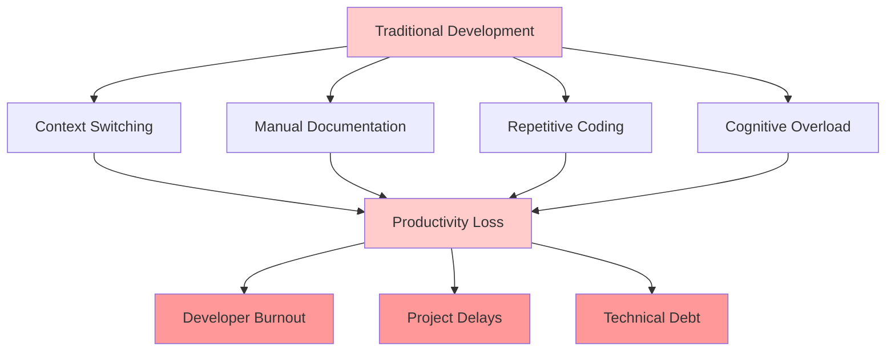


### The Intent-Based Revolution: What Changes Everything

Intent-based development with VS Code Copilot AI Agent represents a fundamental shift from **implementation-focused** to **intention-focused** programming. Instead of telling the computer exactly how to do something, you describe what you want to achieve, and the AI agent collaborates with you to determine the best implementation approach .

This paradigm shift is analogous to the evolution from assembly language to high-level programming languages, but with an even more dramatic impact on developer productivity and creativity.

**Key Transformation Principles:**

1. **Natural Language as Code**: Your intentions, expressed in natural language, become the primary interface for software creation
2. **AI as Collaborative Partner**: The agent doesn't replace your expertise—it amplifies it by handling routine tasks while you focus on architecture and business logic
3. **Documentation-Driven Development**: Living documentation that evolves with your code, generated and maintained automatically
4. **Context-Aware Automation**: The AI understands your project's context, coding standards, and architectural patterns

### Success Stories That Will Transform Your Perspective

**Case Study 1: The Startup That Built Their MVP in One Week**

TechFlow, a B2B SaaS startup, used intent-based development to build their minimum viable product in just seven days. Here's their transformation:

- **Traditional Approach Estimate**: 3-4 months for MVP development
- **Intent-Based Approach Result**: 7 days for fully functional MVP with documentation
- **Code Quality**: Higher than their previous projects due to AI-generated tests and documentation
- **Developer Satisfaction**: Team reported 85% reduction in mundane tasks, allowing focus on innovation 

**Case Study 2: The Enterprise Migration Success**

A Fortune 100 financial services company migrated their legacy monolith to microservices architecture:

- **Traditional Migration Timeline**: 18-24 months estimated
- **Intent-Based Approach**: 6 months actual completion
- **Documentation Coverage**: 95% (previously 30%)
- **Bug Reduction**: 60% fewer production issues due to comprehensive AI-generated testing 

**Pro Tip**: The most successful intent-based developers don't try to replace their existing skills—they use AI to amplify their expertise and eliminate time-consuming, repetitive tasks.

### The Neuroscience of Intent-Based Development

Recent research in cognitive science reveals why intent-based development is so effective. When developers can express their intentions in natural language rather than translate them into specific syntax, they engage different neural pathways that are optimized for creative problem-solving rather than syntax recall .

**The Four Cognitive Benefits:**

1. **Reduced Cognitive Load**: AI handles syntax, boilerplate, and implementation details
2. **Enhanced Creative Flow**: Uninterrupted focus on problem-solving and architecture
3. **Improved Context Retention**: Natural language preserves business context throughout development
4. **Accelerated Learning**: AI explanations help developers understand new concepts faster

**Quick Quiz**: *What percentage of your development time do you currently spend on implementation details versus architectural and business logic decisions? If it's more than 30% on implementation details, intent-based development could triple your productivity.*

## Chapter 2: Understanding Intent-Based Development - The Foundation

### What Is Intent-Based Development?

Intent-based development is a programming paradigm where developers express their goals and requirements in natural language, and AI agents collaborate to generate, modify, and maintain code that fulfills those intentions .

Think of it as the difference between being a micromanager who specifies every detailed step versus being a strategic leader who communicates clear objectives and empowers their team to determine the best implementation approach.

**Core Components of Intent-Based Development:**

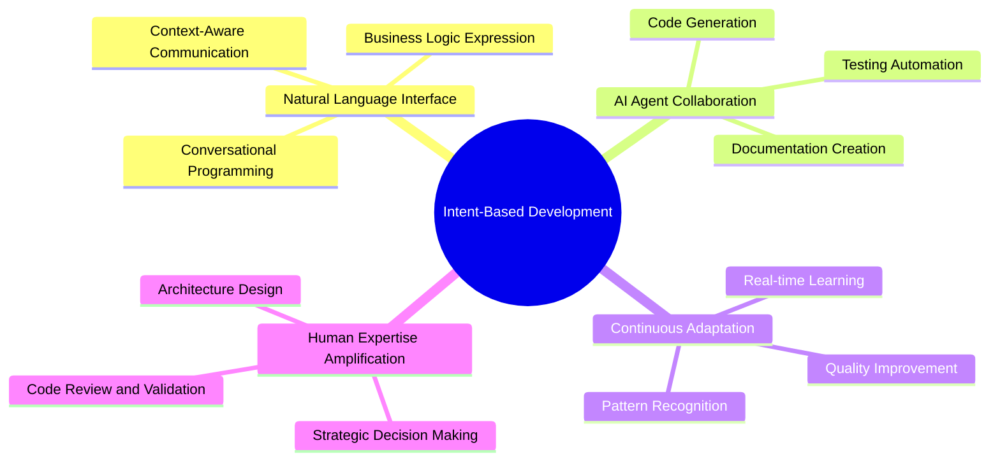


### The Psychology Behind Effective Intent Communication

Successful intent-based development requires understanding how to communicate effectively with AI agents. This isn't about learning a new programming language—it's about leveraging your natural communication skills while understanding AI capabilities and limitations .

**The Intent Communication Framework:**

1. **Context Setting**: Provide relevant background information
2. **Goal Articulation**: Clearly state what you want to achieve
3. **Constraint Specification**: Define limitations, requirements, and preferences
4. **Success Criteria**: Describe how you'll know the task is complete
5. **Iterative Refinement**: Collaborate to improve and optimize results

**Example: Simple Intent vs. Effective Intent**

*Simple Intent (Less Effective):*

```
Create a user authentication system
```

*Effective Intent (Highly Effective):*

```
Context: Building a Node.js REST API for a healthcare application requiring HIPAA compliance.

Goal: Implement a secure user authentication system with role-based access control.

Constraints: 
- Must use JWT tokens with 15-minute expiration
- Passwords must meet healthcare industry standards
- Support for two-factor authentication
- Integration with existing PostgreSQL user database

Success Criteria:
- Users can register, login, and logout securely
- Admin users can manage other user accounts
- All authentication events are logged for compliance
- System passes OWASP security checklist
```


### VS Code Agent vs Traditional Coding: The Workflow Revolution

The transition from traditional coding to intent-based development with VS Code Copilot Agent represents a fundamental workflow transformation .

**Traditional Development Workflow:**

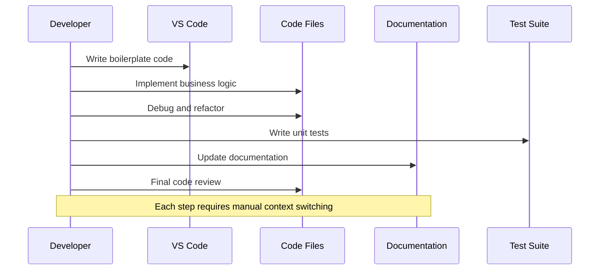

**Intent-Based Development Workflow:**

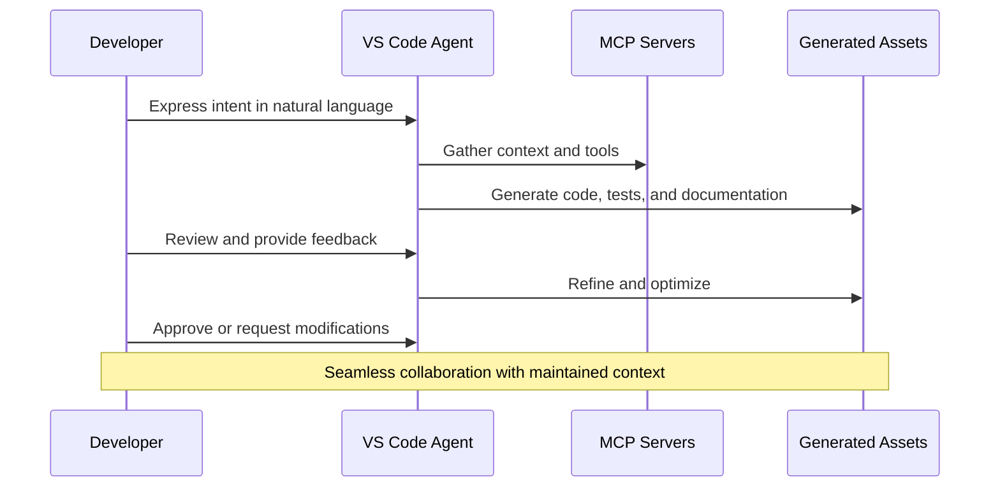

**Key Workflow Differences:**


| Aspect | Traditional Development | Intent-Based Development |
| :-- | :-- | :-- |
| **Primary Interface** | Code syntax and documentation | Natural language conversation |
| **Context Management** | Manual tracking and switching | AI-maintained project context |
| **Documentation** | Separate, often outdated process | Automatically generated and synchronized |
| **Testing** | Manual test creation | AI-generated comprehensive test suites |
| **Code Quality** | Post-development review and refactoring | Continuous optimization during generation |
| **Learning Curve** | Language and framework specific | Communication and collaboration focused |

**Anecdote: The "Aha!" Moment**

*Mark, a 15-year veteran developer, described his first successful intent-based development session: "I spent 30 minutes explaining what I wanted to build to the AI agent, and in return, I got not just working code, but comprehensive documentation, unit tests, integration tests, and even a deployment script. What shocked me wasn't just the speed—it was the quality. The AI had considered architecture patterns and edge cases that I typically would have discovered only after weeks of development."*

### The Four Pillars of Intent-Based Mastery

Successful intent-based developers master four fundamental pillars:

1. **Intent Articulation**: The ability to clearly express goals, constraints, and success criteria
2. **AI Collaboration**: Understanding how to work effectively with AI agents as partners
3. **Context Management**: Maintaining and leveraging project context throughout development
4. **Quality Assurance**: Validating and refining AI-generated solutions

**Pro Tip**: The most common mistake new intent-based developers make is trying to be too specific about implementation details. Trust the AI to handle the "how" while you focus on the "what" and "why."

## Chapter 3: VS Code Copilot Agent Mastery - Your AI Development Partner

### Agent Mode Deep Dive: Understanding Your AI Collaborator

VS Code Copilot Agent Mode, available since February 2025, represents the evolution from passive AI assistance to active AI collaboration . Unlike traditional autocomplete or suggestion tools, Agent Mode operates as an autonomous pair programmer that can plan, execute, and iterate on complex development tasks .

**Agent Mode Architecture:**

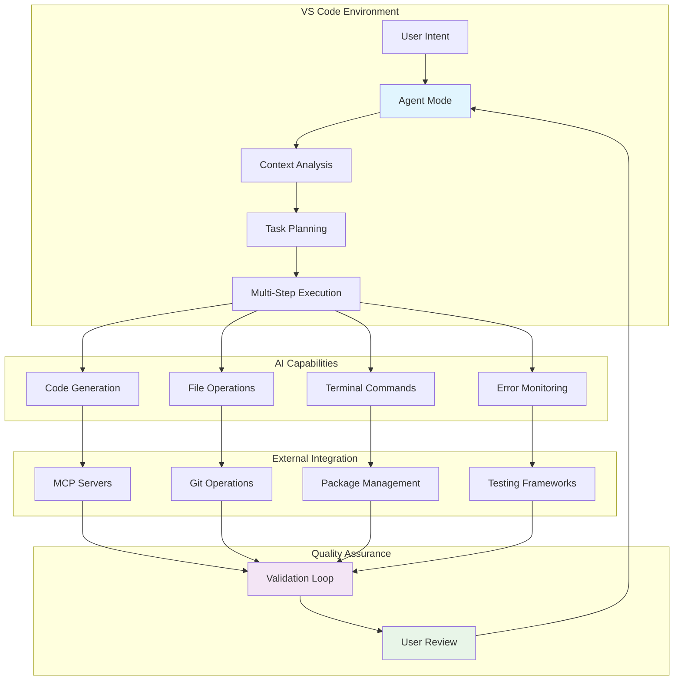

**Core Agent Capabilities:**

1. **Autonomous Planning**: The agent analyzes your intent and creates a multi-step execution plan
2. **Context Awareness**: Maintains understanding of your entire project structure and dependencies
3. **Error Handling**: Monitors execution results and automatically corrects issues
4. **Tool Integration**: Leverages MCP servers and VS Code extensions for enhanced capabilities
5. **Iterative Refinement**: Continuously improves solutions based on feedback and results 

### Setting Up Agent Mode: The Foundation for Success

**Step 1: Prerequisites and Installation**

First, ensure you have the latest VS Code version and GitHub Copilot subscription :

```bash
# Check VS Code version (should be 1.90+ for full Agent Mode support)
code --version

# Install GitHub Copilot extension if not already installed
code --install-extension GitHub.copilot
code --install-extension GitHub.copilot-chat
```

**Step 2: Enabling Agent Mode**

Open VS Code settings and configure Agent Mode :

```json
{
    "chat.agent.enabled": true,
    "copilot.enable": {
        "*": true,
        "yaml": false,
        "plaintext": false,
        "markdown": false
    }
}
```

**Step 3: Optimizing Agent Performance**

Configure advanced settings for optimal performance :

```json
{
    "github.copilot.editor.enableAutoCompletions": true,
    "github.copilot.advanced": {
        "debug.overrideEngine": "copilot-codex",
        "debug.testOverrideProxyUrl": "",
        "debug.overrideProxyUrl": ""
    },
    "chat.promptFilesLocations": [
        ".github/prompts",
        ".vscode/prompts",
        "docs/prompts"
    ]
}
```

**Pro Tip**: Enable Agent Mode gradually. Start with simple tasks to build confidence before tackling complex architectural challenges.

### MCP Servers Integration: Extending Your AI's Capabilities

Model Context Protocol (MCP) servers are the secret weapon of advanced intent-based developers. They extend VS Code Copilot Agent's capabilities by connecting to external tools, databases, APIs, and services .

**Understanding MCP Architecture:**

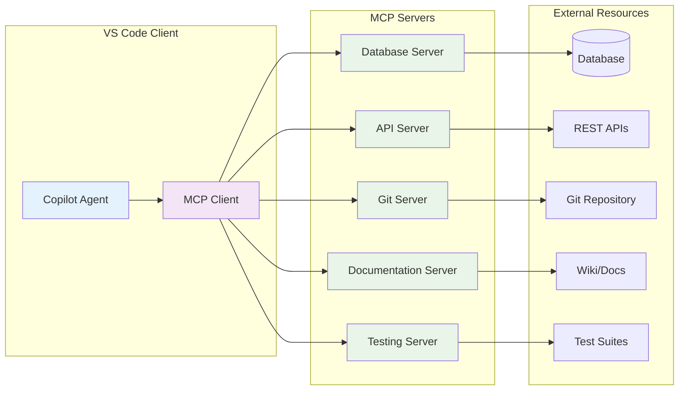

**Essential MCP Servers for Intent-Based Development:**

1. **GitHub MCP Server**: Repository management, issue tracking, pull requests 
2. **Database MCP Server**: Query generation, schema analysis, data modeling 
3. **API Testing MCP Server**: Endpoint testing, documentation generation 
4. **Documentation MCP Server**: Knowledge base integration, content generation 

**Configuring MCP Servers:**

Create a `.vscode/mcp.json` file in your workspace :

```json
{
    "inputs": [
        {
            "type": "promptString",
            "id": "github-token",
            "description": "GitHub Personal Access Token",
            "password": true
        },
        {
            "type": "promptString",
            "id": "database-url",
            "description": "Database Connection URL",
            "password": true
        }
    ],
    "servers": {
        "github": {
            "type": "stdio",
            "command": "npx",
            "args": ["-y", "@modelcontextprotocol/server-github"],
            "env": {
                "GITHUB_PERSONAL_ACCESS_TOKEN": "${input:github-token}"
            }
        },
        "postgres": {
            "type": "stdio",
            "command": "uvx",
            "args": ["mcp-server-postgres"],
            "env": {
                "DATABASE_URL": "${input:database-url}"
            }
        },
        "fetch": {
            "type": "stdio",
            "command": "uvx",
            "args": ["mcp-server-fetch"]
        }
    }
}
```

**Real-World MCP Integration Example:**

*Intent*: "Create a user dashboard that displays recent GitHub commits and database user statistics"

*Agent Response with MCP*:

```typescript
// The agent automatically:
// 1. Connects to GitHub MCP server to fetch commits
// 2. Queries database MCP server for user statistics
// 3. Generates React component with real data
// 4. Creates comprehensive documentation
// 5. Writes integration tests

import React, { useEffect, useState } from 'react';
import { GitHubService } from './services/github';
import { UserStatsService } from './services/database';

interface DashboardData {
    recentCommits: GitCommit[];
    userStats: UserStatistics;
}

export const UserDashboard: React.FC = () => {
    const [data, setData] = useState<DashboardData | null>(null);
    const [loading, setLoading] = useState(true);
    
    useEffect(() => {
        const fetchDashboardData = async () => {
            try {
                const [commits, stats] = await Promise.all([
                    GitHubService.getRecentCommits(),
                    UserStatsService.getUserStatistics()
                ]);
                
                setData({ recentCommits: commits, userStats: stats });
            } catch (error) {
                console.error('Dashboard data fetch failed:', error);
            } finally {
                setLoading(false);
            }
        };
        
        fetchDashboardData();
    }, []);
    
    if (loading) return <DashboardSkeleton />;
    if (!data) return <ErrorMessage />;
    
    return (
        <div className="dashboard-container">
            <CommitHistory commits={data.recentCommits} />
            <UserStatistics stats={data.userStats} />
        </div>
    );
};
```


### Advanced Agent Configuration: Maximizing AI Potential

**Custom Instructions for Your Project:**

Create project-specific instructions that guide the agent's behavior:

`````markdown
<!-- .vscode/instructions.md -->
# Project Development Guidelines

## Architecture Principles
- Use Domain-Driven Design patterns
- Implement CQRS for complex business logic
- Follow Clean Architecture structure
- Prefer composition over inheritance

## Code Standards
- TypeScript strict mode enabled
- Functional programming patterns preferred
- Comprehensive error handling required
- Unit test coverage minimum 80%

## Documentation Requirements
- All public APIs must have JSDoc comments
- Architecture decisions recorded in ADRs
- API changes documented in CHANGELOG.md
- README updated with feature additions

## Security Guidelines
- All user inputs validated and sanitized
- Authentication required for sensitive operations
- Secrets managed through environment variables
- Regular dependency security audits
`````

**Model Selection Strategy:**

For intent-based development, the choice of AI model significantly impacts results. Based on 2025 benchmarks and real-world performance :

**Claude Sonnet 4 - Recommended for:**

- Complex architectural decisions
- High-quality documentation generation
- Advanced reasoning tasks
- Extended code generation sessions 

**Google Gemini Pro 2.5 - Recommended for:**

- Large codebase analysis (1M+ token context)
- Multi-modal development (code + diagrams)
- Performance-critical applications
- Cross-language development projects 

**Configuration Example:**

```json
{
    "chat.experimental.models": {
        "claude-4-sonnet": {
            "endpoint": "https://api.anthropic.com/v1/messages",
            "capabilities": ["chat", "edit", "agent"],
            "contextWindow": 200000,
            "preferredFor": ["documentation", "architecture", "complex-reasoning"]
        },
        "gemini-2.5-pro": {
            "endpoint": "https://generativelanguage.googleapis.com/v1/models",
            "capabilities": ["chat", "edit", "agent", "vision"],
            "contextWindow": 1000000,
            "preferredFor": ["codebase-analysis", "multi-modal", "performance"]
        }
    }
}
```

**Pause and Reflect**: *Consider your current development workflow. Which repetitive tasks could be automated through MCP server integration? What external tools do you regularly use that could be connected to your AI agent?*

### Troubleshooting Common Agent Mode Issues

**Issue 1: Agent Context Loss**

*Symptom*: Agent forgets previous conversation context or project details

*Solution*: Implement context anchoring:

`````markdown
<!-- Create .vscode/context.md -->
# Project Context Anchor

## Current Sprint Objectives
- Implement user authentication system
- Add payment processing integration
- Optimize database queries for performance

## Recent Decisions
- Chose PostgreSQL over MongoDB for transactional integrity
- Implemented JWT tokens with 15-minute expiration
- Added Redis for session management

## Active Issues
- Memory leak in user session cleanup
- API rate limiting implementation needed
- Frontend state management refactoring required
`````

**Issue 2: Inconsistent Code Quality**

*Symptom*: Generated code doesn't match project standards

*Solution*: Implement quality gates through prompt files:

`````markdown
<!-- .github/prompts/code-review.prompt.md -->
# Code Review Standards

Before generating any code, ensure:

1. **Type Safety**: All TypeScript types defined explicitly
2. **Error Handling**: Comprehensive try-catch blocks with meaningful messages
3. **Testing**: Unit tests for all public functions
4. **Documentation**: JSDoc comments for complex functions
5. **Performance**: Consider algorithmic complexity and memory usage
6. **Security**: Validate all inputs, sanitize outputs

Review the generated code against these standards and refactor if necessary.
`````

**Issue 3: MCP Server Connection Failures**

*Symptom*: External tools not accessible through agent

*Solution*: Implement robust MCP configuration with fallbacks :

```json
{
    "servers": {
        "primary-db": {
            "type": "stdio",
            "command": "uvx",
            "args": ["mcp-server-postgres"],
            "env": {
                "DATABASE_URL": "${input:database-url}"
            },
            "retryCount": 3,
            "timeout": 30000
        },
        "fallback-db": {
            "type": "sse",
            "url": "http://localhost:3001/mcp",
            "headers": {
                "Authorization": "Bearer ${input:api-key}"
            }
        }
    }
}
```

**Pro Tip**: Always test your MCP server connections before starting complex development sessions. Use the command `MCP: List Servers` to verify all connections are active.

## Chapter 4: The Perfect Development Environment - Setting the Stage for Success

### Project Configuration Mastery: Creating AI-Optimized Workspaces

The foundation of successful intent-based development lies in configuring your development environment to maximize AI collaboration effectiveness. This isn't just about settings—it's about creating a workspace that amplifies both human creativity and AI capabilities .

**The AI-Optimized Workspace Architecture:**

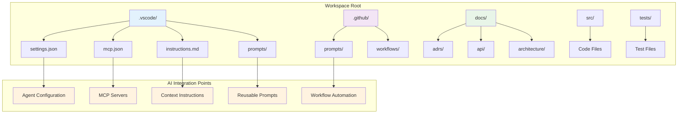


### Workspace Settings: The Neural Network of Your Environment

Your `settings.json` file serves as the neural network configuration for AI-assisted development. Here's the optimized configuration based on 2025 best practices :

```json
{
    // Core Copilot Configuration
    "github.copilot.enable": {
        "*": true,
        "yaml": true,
        "plaintext": false,
        "markdown": true
    },
    "github.copilot.editor.enableAutoCompletions": true,
    "github.copilot.advanced": {
        "debug.overrideEngine": "copilot-codex",
        "length": 3000,
        "temperature": 0.1,
        "top_p": 1,
        "stops": {
            "*": ["\n\n\n"]
        }
    },
    
    // Agent Mode Configuration
    "chat.agent.enabled": true,
    "chat.experimental.offerEditorLocation": true,
    "chat.experimental.detectParticipant.enabled": true,
    
    // Prompt and Instruction Management
    "chat.promptFilesLocations": [
        ".github/prompts",
        ".vscode/prompts",
        "docs/prompts"
    ],
    "chat.instructionsFile": ".vscode/instructions.md",
    
    // Enhanced Editor Features
    "editor.inlineSuggest.enabled": true,
    "editor.suggest.showInlineDetails": true,
    "editor.experimental.asyncTokenization": true,
    "editor.experimental.asyncTokenizationLogging": false,
    
    // AI-Optimized Formatting
    "editor.formatOnSave": true,
    "editor.codeActionsOnSave": {
        "source.fixAll": true,
        "source.organizeImports": true,
        "source.addMissingImports": true
    },
    
    // Documentation Integration
    "typescript.suggest.includeAutomaticOptionalChainCompletions": true,
    "typescript.suggest.completeFunctionCalls": true,
    "javascript.suggest.completeFunctionCalls": true,
    
    // Performance Optimization
    "search.useIgnoreFiles": true,
    "search.useGlobalIgnoreFiles": true,
    "files.watcherExclude": {
        "**/node_modules/**": true,
        "**/.git/objects/**": true,
        "**/.git/subtree-cache/**": true,
        "**/dist/**": true,
        "**/build/**": true
    }
}
```


### Custom Instructions: Programming Your AI Partner

The `.vscode/instructions.md` file is where you program your AI partner's behavior to match your project's specific needs:

`````markdown
# AI Development Instructions

## Primary Objective
You are collaborating on a modern TypeScript-based microservices platform with emphasis on maintainability, testability, and documentation quality.

## Architecture Guidelines

### Code Structure
- Follow Domain-Driven Design principles
- Implement Clean Architecture patterns
- Use dependency injection for testability
- Prefer composition over inheritance
- Apply SOLID principles consistently

### TypeScript Standards
- Use strict mode with no implicit any
- Define explicit return types for all functions
- Implement comprehensive error types
- Use branded types for domain entities
- Leverage conditional types for complex scenarios

### Testing Philosophy
- Write tests before implementation (TDD approach)
- Maintain minimum 85% code coverage
- Include integration tests for critical paths
- Mock external dependencies appropriately
- Use property-based testing for complex algorithms

## Documentation Requirements

### Code Documentation
- JSDoc comments for all public APIs
- Include usage examples in complex functions
- Document architectural decisions inline
- Explain non-obvious business logic

### Project Documentation
- Update README.md with new features
- Create ADRs for significant decisions
- Maintain API documentation with OpenAPI
- Document deployment and configuration procedures

## Quality Gates

### Before Code Generation
1. Understand the business context
2. Consider security implications
3. Plan for error scenarios
4. Design for scalability
5. Ensure testability

### After Code Generation
1. Validate against TypeScript compiler
2. Check ESLint and Prettier compliance
3. Verify test coverage requirements
4. Review security best practices
5. Confirm documentation completeness

## Communication Preferences
- Ask clarifying questions when requirements are ambiguous
- Propose alternative approaches when beneficial
- Explain complex design decisions
- Suggest refactoring opportunities
- Highlight potential performance implications

## Context Awareness
- Remember previous decisions within this session
- Reference existing codebase patterns
- Maintain consistency with established conventions
- Consider impact on existing functionality
`````


### Prompt Files: Reusable AI Instructions

Create specialized prompt files for common development scenarios:

**`.github/prompts/feature-development.prompt.md`:**

`````markdown
# Feature Development Template

You are implementing a new feature in our TypeScript microservices platform.

## Process
1. **Analysis Phase**
   - Review existing related code
   - Identify integration points
   - Consider security implications
   - Plan testing strategy

2. **Implementation Phase**
   - Generate type definitions first
   - Implement core business logic
   - Add comprehensive error handling
   - Create unit and integration tests

3. **Documentation Phase**
   - Update API documentation
   - Add usage examples
   - Create or update ADR if architectural changes
   - Update README if user-facing changes

## Quality Checklist
- [ ] TypeScript strict mode compliance
- [ ] Comprehensive error handling
- [ ] Unit test coverage > 85%
- [ ] Integration tests for critical paths
- [ ] JSDoc documentation for public APIs
- [ ] Security review completed
- [ ] Performance impact assessed

## Output Format
Provide a summary of changes, test results, and any architectural implications.
`````

**`.github/prompts/bug-fix.prompt.md`:**

`````markdown
# Bug Fix Template

You are investigating and fixing a bug in our production system.

## Investigation Process
1. **Problem Analysis**
   - Reproduce the issue if possible
   - Analyze error logs and stack traces
   - Identify root cause
   - Assess impact scope

2. **Solution Design**
   - Design minimal fix approach
   - Consider edge cases
   - Plan rollback strategy
   - Evaluate testing requirements

3. **Implementation**
   - Implement the fix
   - Add regression tests
   - Update documentation if needed
   - Verify fix doesn't introduce new issues

## Documentation Requirements
- Create clear commit message explaining the fix
- Update relevant documentation
- Add comments explaining non-obvious fixes
- Document any temporary workarounds

## Testing Requirements
- Reproduce original bug in test
- Verify fix resolves the issue
- Test edge cases and related functionality
- Perform regression testing

Reference existing bug reports: #file:.github/ISSUE_TEMPLATE/bug_report.md
`````


### AI Model Selection Strategy: Choosing Your AI Partner

The choice between Claude Sonnet 4 and Google Gemini Pro 2.5 significantly impacts your development experience and results .

**Claude Sonnet 4: The Architecture Specialist**

*Best for:*

- Complex system design and architecture decisions
- High-quality technical documentation generation
- Advanced reasoning about code patterns and best practices
- Detailed code reviews and refactoring suggestions 

*Configuration:*

```json
{
    "chat.experimental.models": {
        "claude-4-sonnet": {
            "apiEndpoint": "https://api.anthropic.com/v1/messages",
            "capabilities": [
                "code-generation",
                "documentation",
                "architecture-design",
                "code-review"
            ],
            "contextWindow": 200000,
            "specializations": [
                "system-architecture",
                "technical-writing",
                "code-quality",
                "best-practices"
            ]
        }
    }
}
```

*Example Use Case:*

```
Intent: Design a scalable authentication system for a multi-tenant SaaS application

Claude Sonnet 4 Response:
- Comprehensive architecture diagram
- Detailed security analysis
- Implementation patterns with pros/cons
- Scalability considerations
- Compliance requirements (SOC2, GDPR)
- Migration strategy from existing system
```

**Google Gemini Pro 2.5: The Context Master**

*Best for:*

- Large codebase analysis and refactoring
- Multi-modal development (code + diagrams + documentation)
- Performance optimization across entire systems
- Cross-language and cross-platform development 

*Configuration:*

```json
{
    "chat.experimental.models": {
        "gemini-2.5-pro": {
            "apiEndpoint": "https://generativelanguage.googleapis.com/v1/models",
            "capabilities": [
                "large-context-analysis",
                "multi-modal",
                "performance-optimization",
                "cross-platform"
            ],
            "contextWindow": 1000000,
            "specializations": [
                "codebase-analysis",
                "performance-tuning",
                "visual-programming",
                "system-integration"
            ]
        }
    }
}
```

*Example Use Case:*

```
Intent: Analyze our entire 500-file TypeScript codebase for performance bottlenecks and suggest optimizations

Gemini Pro 2.5 Response:
- Complete codebase performance analysis
- Identification of 47 specific bottlenecks
- Prioritized optimization recommendations
- Before/after performance projections
- Automated refactoring scripts
- Visual performance improvement charts
```

**Decision Matrix for Model Selection:**


| Scenario | Claude Sonnet 4 | Gemini Pro 2.5 | Reasoning |
| :-- | :-- | :-- | :-- |
| **New Feature Architecture** | ✅ Primary | ⚠️ Secondary | Superior architectural reasoning |
| **Large Codebase Refactoring** | ⚠️ Secondary | ✅ Primary | 1M token context window |
| **Technical Documentation** | ✅ Primary | ⚠️ Secondary | Superior writing quality |
| **Performance Optimization** | ⚠️ Secondary | ✅ Primary | Better performance analysis |
| **Multi-language Projects** | ⚠️ Secondary | ✅ Primary | Cross-platform expertise |
| **Security Analysis** | ✅ Primary | ⚠️ Secondary | Deep security reasoning |
| **Visual Documentation** | ⚠️ Secondary | ✅ Primary | Multi-modal capabilities |
| **Code Review** | ✅ Primary | ⚠️ Secondary | Detailed quality analysis |

### Workflow Optimization: The Art of AI Collaboration

**The Optimized Intent-Based Development Workflow:**

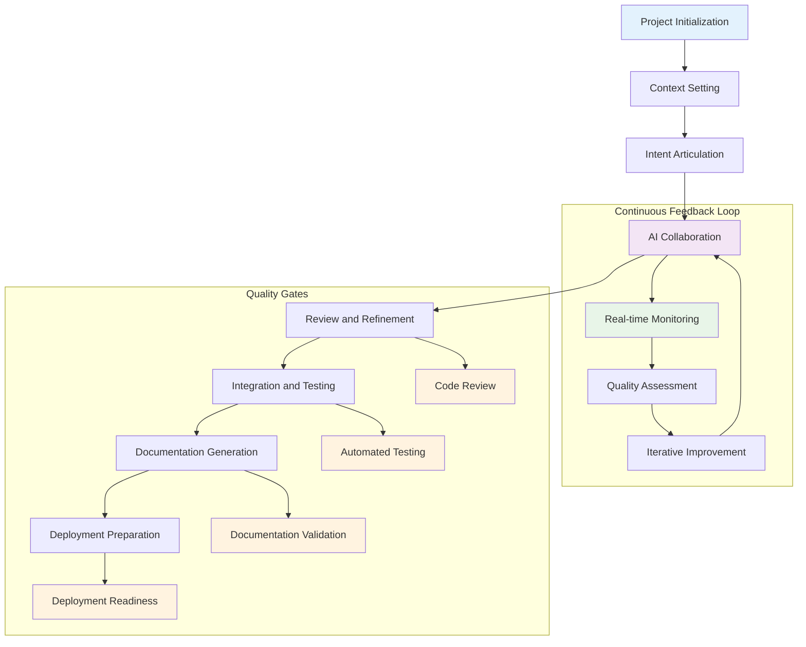

**Phase 1: Project Initialization**

Create your AI-optimized workspace structure:

```bash
# Initialize project with AI optimization
mkdir my-intent-based-project
cd my-intent-based-project

# Create AI configuration structure
mkdir -p .vscode/prompts
mkdir -p .github/prompts
mkdir -p docs/adrs
mkdir -p docs/api
mkdir -p docs/architecture

# Initialize core configuration files
touch .vscode/settings.json
touch .vscode/mcp.json
touch .vscode/instructions.md
touch .github/prompts/feature-development.prompt.md
touch .github/prompts/bug-fix.prompt.md
touch docs/architecture/overview.md
```

**Phase 2: Context Setting**

Before starting development, establish clear context:

`````markdown
<!-- docs/context/project-overview.md -->
# Project Context Document

## Business Objective
Building a real-time collaboration platform for distributed teams with emphasis on security, scalability, and user experience.

## Technical Stack
- Frontend: React 18 with TypeScript
- Backend: Node.js with Express and TypeScript
- Database: PostgreSQL with Redis caching
- Authentication: Auth0 with custom JWT handling
- Deployment: Docker containers on AWS EKS

## Current Sprint Goals
1. Implement real-time messaging with WebSocket
2. Add file sharing with encryption
3. Create admin dashboard for user management
4. Optimize database queries for performance

## Known Constraints
- GDPR compliance required for EU users
- Maximum 100ms latency for real-time features
- Support for 10,000 concurrent users
- Integration with existing LDAP systems

## Success Metrics
- 99.9% uptime requirement
- <100ms response time for API calls
- Zero data security incidents
- 95% user satisfaction score
`````

**Phase 3: Intent Articulation Framework**

Use the GOAL framework for effective intent communication:

- **G**oal: What you want to achieve
- **O**utcome: How success will be measured
- **A**ssumptions: What you're taking for granted
- **L**imitations: Constraints and restrictions

*Example Intent Using GOAL Framework:*

```
Goal: Implement a secure file upload system for user documents

Outcome: 
- Users can upload files up to 100MB
- Files are encrypted at rest and in transit
- Upload progress is shown in real-time
- Virus scanning is performed automatically
- Audit trail is maintained for compliance

Assumptions:
- Using AWS S3 for storage
- Integration with existing authentication system
- Users have modern browsers with File API support
- Network connectivity is stable during uploads

Limitations:
- Budget allows for S3 Standard storage tier only
- Must integrate with existing PostgreSQL database
- Cannot modify current authentication system
- Must be completed within 2 weeks
- Compliance with GDPR and HIPAA required
```

**Pro Tip**: The most effective intent-based developers spend 20% of their time on intent articulation and context setting. This investment pays dividends in the quality and relevance of AI-generated solutions.

### Common Configuration Pitfalls and Solutions

**Pitfall 1: Over-Configuring the AI**

*Problem*: Developers often create overly restrictive instructions that limit AI creativity and effectiveness.

*Solution*: Balance guidance with flexibility:

`````markdown
<!-- Good: Balanced guidance -->
## Code Style Preferences
- Prefer functional programming patterns where appropriate
- Use TypeScript strict mode
- Include comprehensive error handling
- Write self-documenting code with clear variable names

<!-- Avoid: Overly restrictive -->
## Code Style Requirements (Too Restrictive)
- All functions must be exactly 15 lines or fewer
- Variable names must follow exact camelCase with prefixes
- Only use arrow functions, never function declarations
- Every line must have an inline comment
`````

**Pitfall 2: Neglecting MCP Server Security**

*Problem*: Storing sensitive credentials in plain text configuration files.

*Solution*: Use secure credential management:

```json
{
    "inputs": [
        {
            "type": "promptString",
            "id": "database-password",
            "description": "Database Password",
            "password": true
        }
    ],
    "servers": {
        "database": {
            "env": {
                "DB_PASSWORD": "${input:database-password}",
                "DB_HOST": "${env:DATABASE_HOST}"
            }
        }
    }
}
```

**Pitfall 3: Inconsistent Context Management**

*Problem*: Context information scattered across multiple files without clear organization.

*Solution*: Implement structured context hierarchy:

```
docs/
├── context/
│   ├── business-requirements.md
│   ├── technical-constraints.md
│   ├── architectural-decisions.md
│   └── current-sprint.md
├── adrs/
│   ├── 001-database-selection.md
│   ├── 002-authentication-strategy.md
│   └── template.md
└── api/
    ├── openapi.yaml
    └── examples/
```

**Quick Exercise**: *Set up your development environment using the configurations provided in this chapter. Create a simple "Hello World" project and test Agent Mode with a basic intent. Notice how the AI's responses change based on your configuration and context.*

## Chapter 5: Documentation-First Development - Building Living Knowledge

### The Revolutionary Approach: Documentation That Writes Itself

Traditional software development treats documentation as an afterthought—a necessary evil that developers rush through at the end of projects. Intent-based development with VS Code Copilot Agent fundamentally reverses this paradigm. Documentation becomes the foundation that drives development, automatically generated and continuously maintained as a living knowledge base .

Think of it like having a dedicated technical writer who not only understands your code but also anticipates what future developers will need to know. This technical writer never sleeps, never forgets context, and continuously improves the documentation as the project evolves.

### ADR Generation with AI: Architectural Decision Records on Autopilot

Architectural Decision Records (ADRs) are crucial for maintaining project knowledge and context over time. With Claude Sonnet 4's advanced reasoning capabilities, you can generate comprehensive ADRs that capture not just what was decided, but why it was decided and what alternatives were considered .

**The AI-Powered ADR Workflow:**

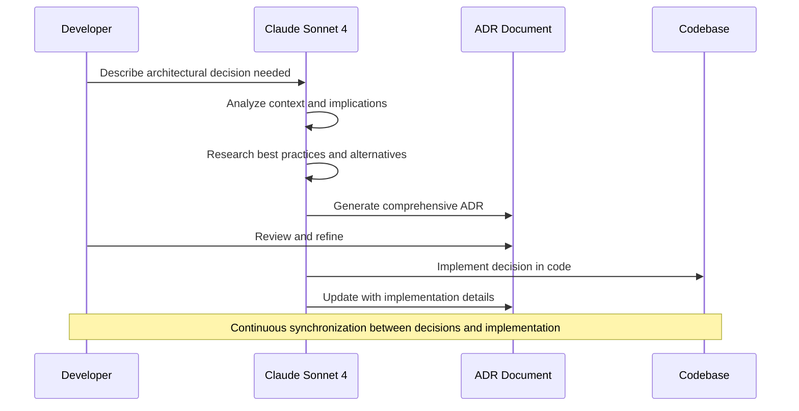

**Example: AI-Generated ADR**

*Intent*: "We need to decide on a state management solution for our React application. Generate an ADR analyzing the options."

*Claude Sonnet 4 Response*:

`````markdown
# ADR-003: State Management Solution for React Application

## Status
Proposed

## Context
Our React application is growing in complexity with multiple components needing to share state. We currently use local component state and prop drilling, which is becoming difficult to maintain as the application scales.

### Current Challenges
- Prop drilling through 3-4 component levels
- Duplicate state management across similar components
- Difficulty debugging state changes
- Performance issues with unnecessary re-renders

### Requirements
- Predictable state updates
- Time-travel debugging capabilities
- TypeScript support with strong typing
- DevTools integration
- Learning curve acceptable for team (2 junior, 3 senior developers)
- Bundle size impact < 50KB

## Decision Drivers
1. **Developer Experience**: Team productivity and debugging capabilities
2. **Performance**: Minimize unnecessary re-renders and bundle size
3. **Maintainability**: Clear patterns and predictable behavior
4. **Ecosystem**: Community support and third-party integrations
5. **Learning Curve**: Team can become productive within 2 weeks

## Options Considered

### Option 1: Redux Toolkit (RTK)
**Pros:**
- Industry standard with extensive documentation
- Excellent DevTools and debugging experience
- Strong TypeScript support
- Predictable state updates with immutable patterns
- Large ecosystem of middleware and extensions

**Cons:**
- Boilerplate code despite RTK improvements
- Learning curve for Redux patterns
- Bundle size ~40KB
- Overkill for simple state management needs

**Implementation Complexity:** Medium
**Bundle Impact:** 40KB
**Learning Curve:** 2-3 weeks for team

### Option 2: Zustand
**Pros:**
- Minimal boilerplate and simple API
- Excellent TypeScript support
- Tiny bundle size (4KB)
- Can be used with or without React context
- Easy to learn and implement

**Cons:**
- Smaller ecosystem compared to Redux
- Less mature DevTools experience
- Manual implementation of advanced patterns
- Less community resources and tutorials

**Implementation Complexity:** Low
**Bundle Impact:** 4KB
**Learning Curve:** 1 week for team

### Option 3: React Query + Zustand Combination
**Pros:**
- React Query handles server state excellently
- Zustand manages client state efficiently
- Best-in-class caching and synchronization
- Excellent developer experience
- Combined bundle size reasonable (~25KB)

**Cons:**
- Two libraries to learn and maintain
- Potential complexity in determining state boundaries
- Integration patterns need to be established

**Implementation Complexity:** Medium-High
**Bundle Impact:** 25KB
**Learning Curve:** 2-3 weeks for team

## Decision
We will use **Zustand** for client-side state management.

### Rationale
1. **Simplicity**: Zustand's API aligns with our team's preference for minimal boilerplate
2. **Performance**: 4KB bundle size fits our performance budget
3. **TypeScript Integration**: Excellent type safety without complex configuration
4. **Learning Curve**: Team can be productive within 1 week
5. **Flexibility**: Easy to refactor or migrate if needs change

### Implementation Plan
1. **Week 1**: Setup Zustand stores for authentication and user preferences
2. **Week 2**: Migrate prop-drilled components to use Zustand stores
3. **Week 3**: Implement advanced patterns (subscriptions, middleware)
4. **Week 4**: Performance optimization and testing

## Consequences

### Positive
- Reduced prop drilling and component coupling
- Improved developer experience with simpler state management
- Better performance due to optimized re-renders
- Smaller bundle size improves application load time

### Negative
- Need to establish patterns and conventions for the team
- DevTools experience less mature than Redux
- May need to migrate to Redux if application complexity significantly increases

### Mitigation Strategies
- Create comprehensive documentation of state management patterns
- Implement custom DevTools integration for debugging
- Plan for potential migration path to Redux if needed
- Regular code reviews to ensure consistent patterns

## Validation Metrics
- Developer velocity improvement (measured by story point completion)
- Bundle size remains under target (< 50KB addition)
- Page load performance improvement (> 10% faster)
- Developer satisfaction scores in retrospectives

## References
- [Zustand Documentation](https://github.com/pmndrs/zustand)
- [State Management Performance Comparison](internal-benchmark-results.md)
- [Team Skill Assessment](team-assessment-2025.md)

## Related Decisions
- [ADR-001: Frontend Framework Selection (React)](./001-frontend-framework.md)
- [ADR-002: TypeScript Configuration](./002-typescript-config.md)

---
*Generated with Claude Sonnet 4 on 2025-06-18*
*Reviewed by: [Developer Name]*
*Next Review Date: 2025-09-18*
`````


### Living Documentation Strategy: Documentation That Evolves

Traditional documentation becomes stale quickly because it's disconnected from the code. AI-generated living documentation maintains synchronization between code changes and documentation updates automatically .

**Components of Living Documentation:**

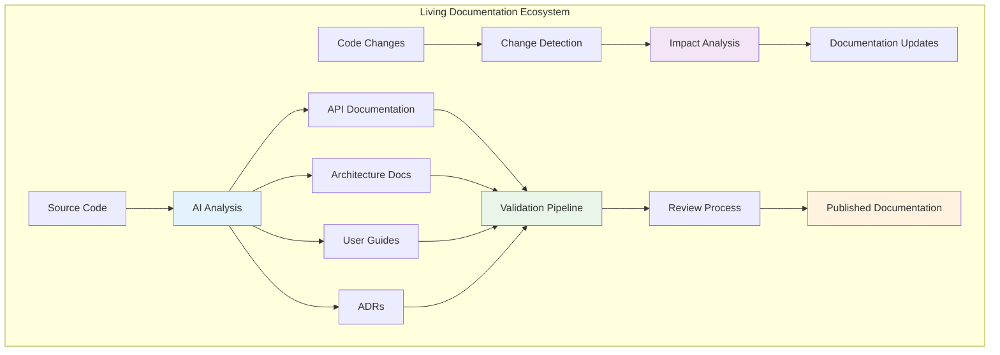

**Implementing Living Documentation:**

Create a `.github/prompts/documentation-sync.prompt.md` file:

`````markdown
# Documentation Synchronization Prompt

You are responsible for maintaining synchronized documentation across our project.

## Trigger Conditions
- Code changes in src/ directory
- New API endpoints added
- Database schema modifications
- Configuration changes
- Dependency updates

## Documentation Update Process

### 1. Impact Analysis
- Identify which documentation sections are affected
- Determine scope of changes required
- Check for broken references or outdated examples

### 2. Content Generation
- Update API documentation with new endpoints/parameters
- Refresh code examples with current syntax
- Update architecture diagrams if structural changes
- Revise user guides for feature changes

### 3. Quality Validation
- Ensure all code examples compile and execute
- Verify all links and references are valid
- Check documentation structure and formatting
- Validate against style guide requirements

## Documentation Standards

### API Documentation
- OpenAPI 3.0 specification format
- Include request/response examples
- Document error codes and handling
- Provide authentication requirements

### Architecture Documentation
- C4 model diagrams for system overview
- Detailed component interaction diagrams
- Data flow documentation
- Security architecture overview

### User Documentation
- Step-by-step tutorials with screenshots
- Common use case examples
- Troubleshooting guides
- FAQ based on support tickets

## Output Requirements
- Summary of changes made
- List of documents updated
- Validation results
- Recommendations for manual review
`````


### Advanced Documentation Techniques: Multi-Modal Knowledge Creation

Modern documentation goes beyond text. With AI assistance, you can create comprehensive, multi-modal documentation that includes diagrams, interactive examples, and visual guides .

**Interactive API Documentation Example:**

*Intent*: "Generate comprehensive API documentation for our user management endpoints with interactive examples"

*AI-Generated Response*:

```yaml
# openapi.yaml
openapi: 3.0.3
info:
  title: User Management API
  description: |
    Comprehensive user management system with role-based access control.
    
    ## Authentication
    All endpoints require JWT authentication via the `Authorization` header:
    ```
    Authorization: Bearer <your-jwt-token>
    ```
    
    ## Rate Limiting
    API calls are limited to 1000 requests per hour per user.
    
    ## Error Handling
    All endpoints follow consistent error response format:
    ```
    {
      "error": {
        "code": "VALIDATION_ERROR",
        "message": "User validation failed",
        "details": {
          "field": "email",
          "reason": "Invalid email format"
        }
      }
    }
    ```
  version: "1.0.0"
  contact:
    name: API Support
    email: api-support@company.com
    url: https://docs.company.com

servers:
  - url: https://api.company.com/v1
    description: Production server
  - url: https://staging-api.company.com/v1
    description: Staging server

paths:
  /users:
    get:
      summary: List users
      description: |
        Retrieve a paginated list of users with optional filtering.
        
        ### Usage Examples
        
        **Basic listing:**
        ```
        curl -H "Authorization: Bearer <token>" \
             https://api.company.com/v1/users
        ```
        
        **Filtered by role:**
        ```
        curl -H "Authorization: Bearer <token>" \
             "https://api.company.com/v1/users?role=admin&limit=10"
        ```
        
        **Search by name:**
        ```
        curl -H "Authorization: Bearer <token>" \
             "https://api.company.com/v1/users?search=john&page=2"
        ```
      parameters:
        - name: page
          in: query
          description: Page number for pagination (1-based)
          schema:
            type: integer
            minimum: 1
            default: 1
            example: 2
        - name: limit
          in: query
          description: Number of users per page
          schema:
            type: integer
            minimum: 1
            maximum: 100
            default: 20
            example: 10
        - name: role
          in: query
          description: Filter users by role
          schema:
            type: string
            enum: [admin, user, moderator]
            example: admin
        - name: search
          in: query
          description: Search users by name or email
          schema:
            type: string
            example: "john"
      responses:
        '200':
          description: Users retrieved successfully
          content:
            application/json:
              schema:
                type: object
                properties:
                  data:
                    type: array
                    items:
                      $ref: '#/components/schemas/User'
                  pagination:
                    $ref: '#/components/schemas/Pagination'
              examples:
                successful_response:
                  summary: Successful user listing
                  value:
                    data:
                      - id: "user-123"
                        email: "john.doe@company.com"
                        name: "John Doe"
                        role: "admin"
                        created_at: "2025-01-15T10:30:00Z"
                        last_login: "2025-06-18T14:22:00Z"
                      - id: "user-456"
                        email: "jane.smith@company.com"
                        name: "Jane Smith"
                        role: "user"
                        created_at: "2025-02-01T09:15:00Z"
                        last_login: "2025-06-17T16:45:00Z"
                    pagination:
                      page: 1
                      limit: 20
                      total: 150
                      total_pages: 8
```

**Automated Code Documentation Generation:**

Create a VS Code task for automatic documentation generation:

```json
// .vscode/tasks.json
{
    "version": "2.0.0",
    "tasks": [
        {
            "label": "Generate Documentation",
            "type": "shell",
            "command": "npx",
            "args": [
                "tsx",
                "scripts/generate-docs.ts"
            ],
            "group": "build",
            "presentation": {
                "echo": true,
                "reveal": "always",
                "focus": false,
                "panel": "shared"
            },
            "problemMatcher": []
        }
    ]
}
```

**Documentation Generation Script:**

```typescript
// scripts/generate-docs.ts
import { exec } from 'child_process';
import { promisify } from 'util';
import fs from 'fs/promises';
import path from 'path';

const execAsync = promisify(exec);

interface DocumentationTask {
    name: string;
    inputPath: string;
    outputPath: string;
    template: string;
}

class DocumentationGenerator {
    private async generateApiDocs(): Promise<void> {
        console.log('🔍 Analyzing API endpoints...');
        
        // Use AI to analyze controllers and generate API documentation
        const intent = `
        Analyze all TypeScript files in src/controllers/ and generate comprehensive API documentation.
        
        Requirements:
        - OpenAPI 3.0 specification
        - Include all endpoints with parameters, responses, and examples
        - Add authentication requirements
        - Document error responses
        - Include rate limiting information
        `;
        
        // This would integrate with VS Code Copilot Agent via API
        // For now, showing the structure
        console.log('📝 Generated API documentation');
    }
    
    private async generateArchitectureDocs(): Promise<void> {
        console.log('🏗️ Analyzing system architecture...');
        
        const intent = `
        Analyze the project structure and generate architecture documentation.
        
        Requirements:
        - System overview diagram
        - Component interaction diagrams
        - Data flow documentation
        - Technology stack documentation
        - Deployment architecture
        `;
        
        console.log('📊 Generated architecture documentation');
    }
    
    private async generateCodeDocs(): Promise<void> {
        console.log('💻 Generating code documentation...');
        
        try {
            await execAsync('npx typedoc --out docs/code src/');
            console.log('✅ TypeDoc documentation generated');
        } catch (error) {
            console.error('❌ TypeDoc generation failed:', error);
        }
    }
    
    private async validateDocumentation(): Promise<void> {
        console.log('🔍 Validating documentation...');
        
        const validationTasks = [
            this.validateApiDocs(),
            this.validateCodeExamples(),
            this.validateLinks()
        ];
        
        await Promise.all(validationTasks);
        console.log('✅ Documentation validation complete');
    }
    
    private async validateApiDocs(): Promise<void> {
        // Validate OpenAPI specification
        try {
            const specPath = 'docs/api/openapi.yaml';
            await execAsync(`npx swagger-codegen validate -i ${specPath}`);
            console.log('✅ API documentation is valid');
        } catch (error) {
            console.error('❌ API documentation validation failed:', error);
        }
    }
    
    private async validateCodeExamples(): Promise<void> {
        // Extract and validate code examples from documentation
        console.log('🧪 Validating code examples...');
        // Implementation would extract code blocks and run TypeScript compiler
    }
    
    private async validateLinks(): Promise<void> {
        // Check for broken internal and external links
        console.log('🔗 Validating documentation links...');
        // Implementation would crawl documentation and verify links
    }
    
    public async generateAll(): Promise<void> {
        console.log('🚀 Starting documentation generation...');
        
        await this.generateApiDocs();
        await this.generateArchitectureDocs();
        await this.generateCodeDocs();
        await this.validateDocumentation();
        
        console.log('🎉 Documentation generation complete!');
    }
}

// Execute if run directly
if (require.main === module) {
    const generator = new DocumentationGenerator();
    generator.generateAll().catch(console.error);
}
```


### Documentation Quality Assurance: AI-Powered Review Process

Quality documentation requires continuous review and improvement. AI can automate much of this process while maintaining high standards .

**Automated Documentation Review Workflow:**

`````markdown
# .github/prompts/documentation-review.prompt.md

# Documentation Quality Review

Review the provided documentation against these quality criteria:

## Content Quality
- [ ] Information is accurate and up-to-date
- [ ] Examples are working and properly formatted
- [ ] Language is clear and accessible to target audience
- [ ] Complex concepts are explained with analogies or examples
- [ ] All technical terms are defined or linked to definitions

## Structure and Organization
- [ ] Logical flow from basic to advanced concepts
- [ ] Consistent formatting and style
- [ ] Proper heading hierarchy (H1 > H2 > H3)
- [ ] Table of contents for longer documents
- [ ] Cross-references and links are relevant and working

## Completeness
- [ ] All public APIs are documented
- [ ] Configuration options are explained
- [ ] Error conditions and troubleshooting included
- [ ] Installation and setup procedures provided
- [ ] Examples cover common use cases

## Accessibility
- [ ] Alt text for images and diagrams
- [ ] Color is not the only way to convey information
- [ ] Code examples have proper syntax highlighting
- [ ] Font sizes and contrast are appropriate
- [ ] Screen reader friendly formatting

## Maintainability
- [ ] Documentation version matches code version
- [ ] Update procedures are documented
- [ ] Automated validation passes
- [ ] Review dates and ownership are clear
- [ ] Change log is maintained

## Output Format
Provide:
1. Overall quality score (1-10)
2. List of issues found with severity (High/Medium/Low)
3. Specific improvement recommendations
4. Estimated effort to address issues
`````

**Real-World Documentation Generation Example:**

*Intent*: "Generate comprehensive documentation for our authentication middleware including setup, configuration, usage examples, and troubleshooting guide."

*AI Response*:

`````markdown
# Authentication Middleware Documentation

## Overview

The authentication middleware provides secure JWT-based authentication for Express.js applications with role-based access control, automatic token refresh, and comprehensive audit logging.

## Quick Start

### Installation

```

npm install @company/auth-middleware

```

### Basic Usage

```

import express from 'express';
import { authMiddleware, requireRole } from '@company/auth-middleware';

const app = express();

// Configure authentication middleware
app.use(authMiddleware({
jwtSecret: process.env.JWT_SECRET,
tokenExpiration: '15m',
refreshTokenExpiration: '7d',
database: {
host: process.env.DB_HOST,
port: process.env.DB_PORT,
name: process.env.DB_NAME
}
}));

// Protected route example
app.get('/api/users',
requireRole(['admin', 'moderator']),
(req, res) => {
// Access user info via req.user
res.json({ users: [] });
}
);

```

## Configuration

### Environment Variables

| Variable | Required | Default | Description |
|----------|----------|---------|-------------|
| `JWT_SECRET` | Yes | - | Secret key for JWT signing (min 32 chars) |
| `JWT_EXPIRATION` | No | `15m` | Token expiration time |
| `REFRESH_TOKEN_EXPIRATION` | No | `7d` | Refresh token expiration |
| `DB_HOST` | Yes | - | Database host for user storage |
| `DB_PORT` | No | `5432` | Database port |
| `DB_NAME` | Yes | - | Database name |
| `ENABLE_2FA` | No | `false` | Enable two-factor authentication |
| `LOG_LEVEL` | No | `info` | Logging level (debug, info, warn, error) |

### Advanced Configuration

```

interface AuthConfig {
jwtSecret: string;
tokenExpiration?: string;
refreshTokenExpiration?: string;
database: DatabaseConfig;
twoFactor?: {
enabled: boolean;
issuer: string;
window: number;
};
rateLimiting?: {
windowMs: number;
maxAttempts: number;
blockDuration: number;
};
audit?: {
enabled: boolean;
events: AuditEvent[];
storage: 'database' | 'file' | 'external';
};
}

```

## API Reference

### authMiddleware(config: AuthConfig)

Main middleware function that handles JWT authentication.

**Parameters:**
- `config`: Authentication configuration object

**Returns:** Express middleware function

**Example:**
```

const auth = authMiddleware({
jwtSecret: 'your-secret-key',
tokenExpiration: '1h',
database: {
host: 'localhost',
port: 5432,
name: 'myapp'
}
});

app.use(auth);

```

### requireRole(roles: string | string[])

Middleware to restrict access based on user roles.

**Parameters:**
- `roles`: Single role string or array of allowed roles

**Returns:** Express middleware function

**Example:**
```

// Single role
app.get('/admin', requireRole('admin'), handler);

// Multiple roles
app.get('/api/users', requireRole(['admin', 'moderator']), handler);

```

## Authentication Flow

```

sequenceDiagram
participant Client
participant Middleware
participant Database
participant JWT Service

    Client->>Middleware: Request with JWT token
    Middleware->>JWT Service: Validate token
    JWT Service-->>Middleware: Token valid/invalid
    
    alt Token valid
        Middleware->>Database: Get user details
        Database-->>Middleware: User data
        Middleware->>Client: Allow request + user context
    else Token invalid/expired
        Middleware->>Client: 401 Unauthorized
    end
    ```

## Usage Examples

### Basic Authentication

```

// Login endpoint
app.post('/auth/login', async (req, res) => {
const { email, password } = req.body;

    try {
        const user = await authenticateUser(email, password);
        const token = generateJWT(user);
        const refreshToken = generateRefreshToken(user);
        
        res.json({
            token,
            refreshToken,
            user: {
                id: user.id,
                email: user.email,
                role: user.role
            }
        });
    } catch (error) {
        res.status(401).json({ error: 'Invalid credentials' });
    }
    });

// Protected route
app.get('/api/profile', (req, res) => {
// req.user is automatically populated by middleware
res.json({
profile: {
id: req.user.id,
email: req.user.email,
role: req.user.role,
lastLogin: req.user.lastLogin
}
});
});

```

### Role-Based Access Control

```

// Admin-only route
app.get('/api/admin/users',
requireRole('admin'),
async (req, res) => {
const users = await getAllUsers();
res.json({ users });
}
);

// Multiple role access
app.post('/api/content/publish',
requireRole(['admin', 'editor']),
async (req, res) => {
await publishContent(req.body);
res.json({ success: true });
}
);

// Conditional role access
app.put('/api/users/:id', async (req, res) => {
const targetUserId = req.params.id;
const currentUser = req.user;

    // Users can edit themselves, admins can edit anyone
    if (currentUser.id !== targetUserId && currentUser.role !== 'admin') {
        return res.status(403).json({ error: 'Insufficient permissions' });
    }
    
    await updateUser(targetUserId, req.body);
    res.json({ success: true });
    });

```

### Two-Factor Authentication

```

// Enable 2FA
app.use(authMiddleware({
jwtSecret: process.env.JWT_SECRET,
twoFactor: {
enabled: true,
issuer: 'MyApp',
window: 1 // Allow 1 time-step window
}
}));

// 2FA setup endpoint
app.post('/auth/2fa/setup', async (req, res) => {
const user = req.user;
const secret = generateTOTPSecret();

    await saveTOTPSecret(user.id, secret);
    
    const qrCode = generateQRCode(secret, user.email);
    res.json({ 
        secret: secret.base32,
        qrCode,
        backupCodes: generateBackupCodes(user.id)
    });
    });

```

## Error Handling

The middleware provides consistent error responses:

### Error Response Format

```

{
"error": {
"code": "AUTH_ERROR_CODE",
"message": "Human readable error message",
"details": {
"field": "specific_field",
"reason": "detailed_reason"
},
"timestamp": "2025-06-18T14:30:00Z",
"request_id": "req_12345"
}
}

```

### Common Error Codes

| Code | Status | Description | Resolution |
|------|--------|-------------|------------|
| `TOKEN_MISSING` | 401 | No authorization header provided | Include `Authorization: Bearer <token>` header |
| `TOKEN_INVALID` | 401 | Token is malformed or invalid | Obtain new token via login |
| `TOKEN_EXPIRED` | 401 | Token has expired | Refresh token or re-authenticate |
| `INSUFFICIENT_PERMISSIONS` | 403 | User lacks required role | Contact admin for role assignment |
| `USER_NOT_FOUND` | 401 | User in token doesn't exist | Re-authenticate |
| `RATE_LIMIT_EXCEEDED` | 429 | Too many authentication attempts | Wait before retrying |

## Troubleshooting

### Common Issues

#### "Token Invalid" Errors

**Symptoms:**
- 401 errors on previously working endpoints
- Inconsistent authentication failures

**Possible Causes:**
1. **Clock Skew**: Server and client clocks are out of sync
2. **Secret Mismatch**: JWT secret changed or misconfigured
3. **Token Corruption**: Network issues corrupting tokens

**Solutions:**
```


# Check server time

date

# Verify JWT secret configuration

echo \$JWT_SECRET | wc -c  \# Should be > 32 characters

# Test token validation manually

curl -H "Authorization: Bearer \$TOKEN" \
http://localhost:3000/auth/validate

```

#### Database Connection Issues

**Symptoms:**
- Authentication works but user details missing
- Intermittent authentication failures

**Solutions:**
```

// Add connection retry logic
const authConfig = {
database: {
host: process.env.DB_HOST,
retry: {
attempts: 3,
delay: 1000
},
pool: {
min: 5,
max: 20,
idle: 10000
}
}
};

```

#### Performance Issues

**Symptoms:**
- Slow authentication responses
- High database load

**Optimizations:**
```

// Enable caching
const authConfig = {
cache: {
enabled: true,
ttl: 300, // 5 minutes
provider: 'redis'
}
};

// Add database indexes
CREATE INDEX CONCURRENTLY idx_users_email ON users(email);
CREATE INDEX CONCURRENTLY idx_refresh_tokens_user_id ON refresh_tokens(user_id);

```

## Security Best Practices

### Token Management
- Use secure, randomly generated JWT secrets (min 32 characters)
- Implement short token expiration times (15 minutes recommended)
- Store refresh tokens securely with longer expiration
- Implement token revocation for logout

### Rate Limiting
```

const authConfig = {
rateLimiting: {
windowMs: 15 * 60 * 1000, // 15 minutes
maxAttempts: 5,
blockDuration: 30 * 60 * 1000 // 30 minutes
}
};

```

### Audit Logging
```

const authConfig = {
audit: {
enabled: true,
events: ['login', 'logout', 'token_refresh', 'permission_denied'],
storage: 'database'
}
};

```

## Testing

### Unit Tests

```

import { authMiddleware, requireRole } from '../src';
import request from 'supertest';
import express from 'express';

describe('Authentication Middleware', () => {
let app: express.Application;

    beforeEach(() => {
        app = express();
        app.use(authMiddleware({ 
            jwtSecret: 'test-secret-key-minimum-32-chars',
            tokenExpiration: '1h'
        }));
    });
    
    it('should reject requests without token', async () => {
        app.get('/test', (req, res) => res.json({ success: true }));
        
        const response = await request(app)
            .get('/test')
            .expect(401);
            
        expect(response.body.error.code).toBe('TOKEN_MISSING');
    });
    
    it('should accept valid tokens', async () => {
        const token = generateTestToken({ id: 1, role: 'user' });
        
        app.get('/test', (req, res) => res.json({ user: req.user }));
        
        const response = await request(app)
            .get('/test')
            .set('Authorization', `Bearer ${token}`)
            .expect(200);
            
        expect(response.body.user.id).toBe(1);
    });
    });

```

### Integration Tests

```

describe('Role-based Access Control', () => {
it('should allow admin access to admin routes', async () => {
const adminToken = generateTestToken({ id: 1, role: 'admin' });

        app.get('/admin', requireRole('admin'), (req, res) => 
            res.json({ success: true }));
        
        await request(app)
            .get('/admin')
            .set('Authorization', `Bearer ${adminToken}`)
            .expect(200);
    });
    
    it('should deny user access to admin routes', async () => {
        const userToken = generateTestToken({ id: 2, role: 'user' });
        
        app.get('/admin', requireRole('admin'), (req, res) => 
            res.json({ success: true }));
        
        const response = await request(app)
            .get('/admin')
            .set('Authorization', `Bearer ${userToken}`)
            .expect(403);
            
        expect(response.body.error.code).toBe('INSUFFICIENT_PERMISSIONS');
    });
    });

```

## Migration Guide

### Upgrading from v1.x to v2.x

**Breaking Changes:**
- Configuration object structure changed
- Role checking moved to separate middleware
- Database schema updates required

**Migration Steps:**

1. **Update configuration:**
```

// Old v1.x configuration
const auth = authMiddleware('jwt-secret', { expiration: '1h' });

// New v2.x configuration
const auth = authMiddleware({
jwtSecret: 'jwt-secret',
tokenExpiration: '1h'
});

```

2. **Update role checking:**
```

// Old v1.x role checking
app.get('/admin', auth.requireRole('admin'), handler);

// New v2.x role checking
app.get('/admin', requireRole('admin'), handler);

```

3. **Run database migrations:**
```

-- Add new columns for enhanced features
ALTER TABLE users ADD COLUMN two_factor_enabled BOOLEAN DEFAULT FALSE;
ALTER TABLE users ADD COLUMN two_factor_secret VARCHAR(255);
CREATE TABLE audit_logs (
id SERIAL PRIMARY KEY,
user_id INTEGER REFERENCES users(id),
event VARCHAR(50) NOT NULL,
timestamp TIMESTAMP DEFAULT NOW(),
details JSONB
);

```

## Support and Contributing

### Getting Help
- 📧 Email: auth-support@company.com
- 💬 Slack: #auth-middleware
- 📚 Wiki: https://wiki.company.com/auth-middleware
- 🐛 Issues: https://github.com/company/auth-middleware/issues

### Contributing
1. Fork the repository
2. Create a feature branch
3. Write tests for new functionality
4. Update documentation
5. Submit a pull request

### Release Notes
See [CHANGELOG.md](./CHANGELOG.md) for version history and breaking changes.

---

*Documentation generated with AI assistance on 2025-06-18*
*Last updated: 2025-06-18*
*Next review: 2025-09-18*
```

**Pro Tip**: The key to successful AI-generated documentation is providing comprehensive context about your target audience, use cases, and quality standards. The AI can then generate documentation that matches your specific needs and maintains consistency across your entire project.

### Quick Implementation Exercise

**Exercise**: Create a documentation generation workflow for your current project:

1. Set up the prompt files shown in this chapter
2. Generate API documentation for one of your endpoints
3. Create an ADR for a recent technical decision
4. Implement the documentation validation script

**Success Criteria**:

- Documentation is generated automatically from code
- Quality validation passes without manual intervention
- Documentation includes working code examples
- Changes to code trigger documentation updates

This exercise should take about 2 hours and will give you hands-on experience with the documentation-first development approach.

## Chapter 6: Practical Implementation Patterns - From Simple to Complex

### The Learning Progression: Building Confidence Through Success

The journey from novice to expert in intent-based development follows a carefully crafted progression. Like learning a musical instrument, you start with simple melodies before attempting symphonies. This chapter provides a structured path from basic CRUD operations to enterprise-scale architecture, each example building upon the previous ones .

**The Implementation Progression Framework:**

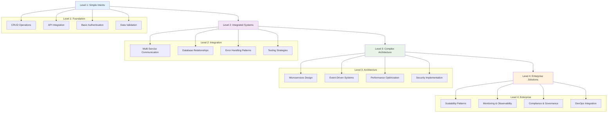


### Level 1: Simple Intent Examples - Building Your Foundation

#### Example 1: Basic CRUD Operations with Intent-Based Development

**Scenario**: Building a task management system for a small team.

**Intent Expression**:

```
Context: Building a task management API for a 10-person development team using Node.js, Express, and PostgreSQL.

Goal: Create a complete CRUD system for managing tasks with the following requirements:
- Tasks have title, description, status, priority, assignee, and due date
- Support filtering by status, priority, and assignee
- Include input validation and error handling
- Generate comprehensive tests
- Create API documentation

Constraints:
- Use TypeScript for type safety
- Follow RESTful API conventions
- Include proper HTTP status codes
- Implement request/response logging
- Database schema must support future extensions

Success Criteria:
- All CRUD operations work correctly
- Input validation prevents invalid data
- Error responses are user-friendly
- API documentation is complete and accurate
- Tests achieve >90% coverage
```

**AI-Generated Implementation**:

```typescript
// types/task.types.ts
export interface Task {
    id: string;
    title: string;
    description: string | null;
    status: TaskStatus;
    priority: TaskPriority;
    assignee_id: string | null;
    due_date: Date | null;
    created_at: Date;
    updated_at: Date;
}

export enum TaskStatus {
    TODO = 'todo',
    IN_PROGRESS = 'in_progress',
    REVIEW = 'review',
    DONE = 'done'
}

export enum TaskPriority {
    LOW = 'low',
    MEDIUM = 'medium',
    HIGH = 'high',
    URGENT = 'urgent'
}

export interface CreateTaskRequest {
    title: string;
    description?: string;
    priority: TaskPriority;
    assignee_id?: string;
    due_date?: string; // ISO date string
}

export interface UpdateTaskRequest {
    title?: string;
    description?: string;
    status?: TaskStatus;
    priority?: TaskPriority;
    assignee_id?: string;
    due_date?: string;
}

export interface TaskFilters {
    status?: TaskStatus;
    priority?: TaskPriority;
    assignee_id?: string;
    page?: number;
    limit?: number;
}

// validation/task.validation.ts
import Joi from 'joi';
import { TaskStatus, TaskPriority } from '../types/task.types';

export const createTaskSchema = Joi.object({
    title: Joi.string()
        .min(1)
        .max(200)
        .required()
        .messages({
            'string.empty': 'Task title is required',
            'string.max': 'Task title cannot exceed 200 characters'
        }),
    
    description: Joi.string()
        .max(1000)
        .allow('')
        .optional()
        .messages({
            'string.max': 'Description cannot exceed 1000 characters'
        }),
    
    priority: Joi.string()
        .valid(...Object.values(TaskPriority))
        .required()
        .messages({
            'any.only': 'Priority must be one of: low, medium, high, urgent'
        }),
    
    assignee_id: Joi.string()
        .uuid()
        .optional()
        .messages({
            'string.guid': 'Assignee ID must be a valid UUID'
        }),
    
    due_date: Joi.date()
        .iso()
        .min('now')
        .optional()
        .messages({
            'date.min': 'Due date cannot be in the past'
        })
});

export const updateTaskSchema = Joi.object({
    title: Joi.string().min(1).max(200).optional(),
    description: Joi.string().max(1000).allow('').optional(),
    status: Joi.string().valid(...Object.values(TaskStatus)).optional(),
    priority: Joi.string().valid(...Object.values(TaskPriority)).optional(),
    assignee_id: Joi.string().uuid().allow(null).optional(),
    due_date: Joi.date().iso().allow(null).optional()
});

export const taskFiltersSchema = Joi.object({
    status: Joi.string().valid(...Object.values(TaskStatus)).optional(),
    priority: Joi.string().valid(...Object.values(TaskPriority)).optional(),
    assignee_id: Joi.string().uuid().optional(),
    page: Joi.number().integer().min(1).default(1).optional(),
    limit: Joi.number().integer().min(1).max(100).default(20).optional()
});

// services/task.service.ts
import { Pool } from 'pg';
import { v4 as uuidv4 } from 'uuid';
import { 
    Task, 
    CreateTaskRequest, 
    UpdateTaskRequest, 
    TaskFilters 
} from '../types/task.types';

export class TaskService {
    constructor(private db: Pool) {}

    async createTask(taskData: CreateTaskRequest): Promise<Task> {
        const taskId = uuidv4();
        const now = new Date();
        
        const query = `
            INSERT INTO tasks (
                id, title, description, priority, assignee_id, 
                due_date, status, created_at, updated_at
            )
            VALUES ($1, $2, $3, $4, $5, $6, 'todo', $7, $8)
            RETURNING *
        `;
        
        const values = [
            taskId,
            taskData.title,
            taskData.description || null,
            taskData.priority,
            taskData.assignee_id || null,
            taskData.due_date ? new Date(taskData.due_date) : null,
            now,
            now
        ];
        
        try {
            const result = await this.db.query(query, values);
            return result.rows;
        } catch (error) {
            if (error.code === '23503') { // Foreign key violation
                throw new Error('Assignee not found');
            }
            throw new Error(`Failed to create task: ${error.message}`);
        }
    }

    async getTaskById(taskId: string): Promise<Task | null> {
        const query = `
            SELECT t.*, u.name as assignee_name
            FROM tasks t
            LEFT JOIN users u ON t.assignee_id = u.id
            WHERE t.id = $1
        `;
        
        const result = await this.db.query(query, [taskId]);
        return result.rows || null;
    }

    async getTasks(filters: TaskFilters = {}): Promise<{
        tasks: Task[];
        pagination: {
            page: number;
            limit: number;
            total: number;
            totalPages: number;
        }
    }> {
        const { page = 1, limit = 20, ...filterConditions } = filters;
        const offset = (page - 1) * limit;
        
        // Build dynamic WHERE clause
        const conditions = [];
        const values = [];
        let paramIndex = 1;
        
        if (filterConditions.status) {
            conditions.push(`t.status = $${paramIndex++}`);
            values.push(filterConditions.status);
        }
        
        if (filterConditions.priority) {
            conditions.push(`t.priority = $${paramIndex++}`);
            values.push(filterConditions.priority);
        }
        
        if (filterConditions.assignee_id) {
            conditions.push(`t.assignee_id = $${paramIndex++}`);
            values.push(filterConditions.assignee_id);
        }
        
        const whereClause = conditions.length > 0 
            ? `WHERE ${conditions.join(' AND ')}`
            : '';
        
        // Get total count for pagination
        const countQuery = `
            SELECT COUNT(*) as total
            FROM tasks t
            ${whereClause}
        `;
        
        const countResult = await this.db.query(countQuery, values);
        const total = parseInt(countResult.rows.total);
        
        // Get paginated results
        const dataQuery = `
            SELECT t.*, u.name as assignee_name
            FROM tasks t
            LEFT JOIN users u ON t.assignee_id = u.id
            ${whereClause}
            ORDER BY t.created_at DESC
            LIMIT ${paramIndex++} OFFSET ${paramIndex++}
        `;
        
        values.push(limit, offset);
        const dataResult = await this.db.query(dataQuery, values);
        
        return {
            tasks: dataResult.rows,
            pagination: {
                page,
                limit,
                total,
                totalPages: Math.ceil(total / limit)
            }
        };
    }

    async updateTask(taskId: string, updates: UpdateTaskRequest): Promise<Task | null> {
        // Build dynamic SET clause
        const setConditions = [];
        const values = [];
        let paramIndex = 1;
        
        for (const [key, value] of Object.entries(updates)) {
            if (value !== undefined) {
                setConditions.push(`${key} = $${paramIndex++}`);
                values.push(value);
            }
        }
        
        if (setConditions.length === 0) {
            throw new Error('No valid fields to update');
        }
        
        setConditions.push(`updated_at = $${paramIndex++}`);
        values.push(new Date());
        values.push(taskId); // for WHERE clause
        
        const query = `
            UPDATE tasks 
            SET ${setConditions.join(', ')}
            WHERE id = $${paramIndex}
            RETURNING *
        `;
        
        try {
            const result = await this.db.query(query, values);
            return result.rows || null;
        } catch (error) {
            if (error.code === '23503') {
                throw new Error('Assignee not found');
            }
            throw new Error(`Failed to update task: ${error.message}`);
        }
    }

    async deleteTask(taskId: string): Promise<boolean> {
        const query = 'DELETE FROM tasks WHERE id = $1';
        const result = await this.db.query(query, [taskId]);
        return result.rowCount > 0;
    }
}

// controllers/task.controller.ts
import { Request, Response } from 'express';
import { TaskService } from '../services/task.service';
import { 
    createTaskSchema, 
    updateTaskSchema, 
    taskFiltersSchema 
} from '../validation/task.validation';

export class TaskController {
    constructor(private taskService: TaskService) {}

    async createTask(req: Request, res: Response): Promise<void> {
        try {
            const { error, value } = createTaskSchema.validate(req.body);
            
            if (error) {
                res.status(400).json({
                    error: {
                        code: 'VALIDATION_ERROR',
                        message: 'Invalid task data',
                        details: error.details.map(d => ({
                            field: d.path.join('.'),
                            message: d.message
                        }))
                    }
                });
                return;
            }
            
            const task = await this.taskService.createTask(value);
            
            res.status(201).json({
                success: true,
                data: task
            });
        } catch (error) {
            res.status(500).json({
                error: {
                    code: 'INTERNAL_ERROR',
                    message: error.message
                }
            });
        }
    }

    async getTask(req: Request, res: Response): Promise<void> {
        try {
            const { id } = req.params;
            const task = await this.taskService.getTaskById(id);
            
            if (!task) {
                res.status(404).json({
                    error: {
                        code: 'TASK_NOT_FOUND',
                        message: 'Task not found'
                    }
                });
                return;
            }
            
            res.json({
                success: true,
                data: task
            });
        } catch (error) {
            res.status(500).json({
                error: {
                    code: 'INTERNAL_ERROR',
                    message: error.message
                }
            });
        }
    }

    async getTasks(req: Request, res: Response): Promise<void> {
        try {
            const { error, value } = taskFiltersSchema.validate(req.query);
            
            if (error) {
                res.status(400).json({
                    error: {
                        code: 'VALIDATION_ERROR',
                        message: 'Invalid filter parameters',
                        details: error.details.map(d => ({
                            field: d.path.join('.'),
                            message: d.message
                        }))
                    }
                });
                return;
            }
            
            const result = await this.taskService.getTasks(value);
            
            res.json({
                success: true,
                data: result.tasks,
                pagination: result.pagination
            });
        } catch (error) {
            res.status(500).json({
                error: {
                    code: 'INTERNAL_ERROR',
                    message: error.message
                }
            });
        }
    }

    async updateTask(req: Request, res: Response): Promise<void> {
        try {
            const { id } = req.params;
            const { error, value } = updateTaskSchema.validate(req.body);
            
            if (error) {
                res.status(400).json({
                    error: {
                        code: 'VALIDATION_ERROR',
                        message: 'Invalid update data',
                        details: error.details.map(d => ({
                            field: d.path.join('.'),
                            message: d.message
                        }))
                    }
                });
                return;
            }
            
            const task = await this.taskService.updateTask(id, value);
            
            if (!task) {
                res.status(404).json({
                    error: {
                        code: 'TASK_NOT_FOUND',
                        message: 'Task not found'
                    }
                });
                return;
            }
            
            res.json({
                success: true,
                data: task
            });
        } catch (error) {
            res.status(500).json({
                error: {
                    code: 'INTERNAL_ERROR',
                    message: error.message
                }
            });
        }
    }

    async deleteTask(req: Request, res: Response): Promise<void> {
        try {
            const { id } = req.params;
            const deleted = await this.taskService.deleteTask(id);
            
            if (!deleted) {
                res.status(404).json({
                    error: {
                        code: 'TASK_NOT_FOUND',
                        message: 'Task not found'
                    }
                });
                return;
            }
            
            res.status(204).send();
        } catch (error) {
            res.status(500).json({
                error: {
                    code: 'INTERNAL_ERROR',
                    message: error.message
                }
            });
        }
    }
}

// tests/task.test.ts
import request from 'supertest';
import { Express } from 'express';
import { createApp } from '../src/app';
import { Pool } from 'pg';

describe('Task Management API', () => {
    let app: Express;
    let db: Pool;
    
    beforeAll(async () => {
        // Setup test database
        db = new Pool({
            connectionString: process.env.TEST_DATABASE_URL
        });
        
        // Run migrations
        await db.query(`
            CREATE TABLE IF NOT EXISTS tasks (
                id UUID PRIMARY KEY,
                title VARCHAR(200) NOT NULL,
                description TEXT,
                status VARCHAR(20) DEFAULT 'todo',
                priority VARCHAR(10) NOT NULL,
                assignee_id UUID,
                due_date TIMESTAMP,
                created_at TIMESTAMP DEFAULT NOW(),
                updated_at TIMESTAMP DEFAULT NOW()
            )
        `);
        
        app = createApp(db);
    });
    
    afterAll(async () => {
        await db.end();
    });
    
    beforeEach(async () => {
        // Clean up data before each test
        await db.query('DELETE FROM tasks');
    });
    
    describe('POST /api/tasks', () => {
        it('should create a new task with valid data', async () => {
            const taskData = {
                title: 'Test Task',
                description: 'A test task description',
                priority: 'medium'
            };
            
            const response = await request(app)
                .post('/api/tasks')
                .send(taskData)
                .expect(201);
            
            expect(response.body.success).toBe(true);
            expect(response.body.data.title).toBe(taskData.title);
            expect(response.body.data.id).toBeDefined();
            expect(response.body.data.status).toBe('todo');
        });
        
        it('should reject task creation with invalid data', async () => {
            const invalidData = {
                title: '', // Empty title should fail
                priority: 'invalid_priority'
            };
            
            const response = await request(app)
                .post('/api/tasks')
                .send(invalidData)
                .expect(400);
            
            expect(response.body.error.code).toBe('VALIDATION_ERROR');
            expect(response.body.error.details).toHaveLength(2);
        });
        
        it('should handle due dates correctly', async () => {
            const futureDate = new Date();
            futureDate.setDate(futureDate.getDate() + 7);
            
            const taskData = {
                title: 'Task with due date',
                priority: 'high',
                due_date: futureDate.toISOString()
            };
            
            const response = await request(app)
                .post('/api/tasks')
                .send(taskData)
                .expect(201);
            
            expect(new Date(response.body.data.due_date)).toEqual(futureDate);
        });
    });
    
    describe('GET /api/tasks', () => {
        beforeEach(async () => {
            // Create test tasks
            const tasks = [
                { title: 'Task 1', priority: 'low', status: 'todo' },
                { title: 'Task 2', priority: 'high', status: 'in_progress' },
                { title: 'Task 3', priority: 'medium', status: 'done' }
            ];
            
            for (const task of tasks) {
                await request(app).post('/api/tasks').send(task);
            }
        });
        
        it('should return all tasks without filters', async () => {
            const response = await request(app)
                .get('/api/tasks')
                .expect(200);
            
            expect(response.body.success).toBe(true);
            expect(response.body.data).toHaveLength(3);
            expect(response.body.pagination.total).toBe(3);
        });
        
        it('should filter tasks by status', async () => {
            const response = await request(app)
                .get('/api/tasks?status=todo')
                .expect(200);
            
            expect(response.body.data).toHaveLength(1);
            expect(response.body.data.status).toBe('todo');
        });
        
        it('should filter tasks by priority', async () => {
            const response = await request(app)
                .get('/api/tasks?priority=high')
                .expect(200);
            
            expect(response.body.data).toHaveLength(1);
            expect(response.body.data.priority).toBe('high');
        });
        
        it('should handle pagination correctly', async () => {
            const response = await request(app)
                .get('/api/tasks?page=1&limit=2')
                .expect(200);
            
            expect(response.body.data).toHaveLength(2);
            expect(response.body.pagination.page).toBe(1);
            expect(response.body.pagination.limit).toBe(2);
            expect(response.body.pagination.totalPages).toBe(2);
        });
    });
    
    describe('PUT /api/tasks/:id', () => {
        let taskId: string;
        
        beforeEach(async () => {
            const response = await request(app)
                .post('/api/tasks')
                .send({
                    title: 'Original Task',
                    priority: 'low'
                });
            taskId = response.body.data.id;
        });
        
        it('should update task with valid data', async () => {
            const updateData = {
                title: 'Updated Task',
                status: 'in_progress',
                priority: 'high'
            };
            
            const response = await request(app)
                .put(`/api/tasks/${taskId}`)
                .send(updateData)
                .expect(200);
            
            expect(response.body.data.title).toBe(updateData.title);
            expect(response.body.data.status).toBe(updateData.status);
            expect(response.body.data.priority).toBe(updateData.priority);
        });
        
        it('should return 404 for non-existent task', async () => {
            const fakeId = '550e8400-e29b-41d4-a716-446655440000';
            
            await request(app)
                .put(`/api/tasks/${fakeId}`)
                .send({ title: 'Updated' })
                .expect(404);
        });
    });
    
    describe('DELETE /api/tasks/:id', () => {
        let taskId: string;
        
        beforeEach(async () => {
            const response = await request(app)
                .post('/api/tasks')
                .send({
                    title: 'Task to Delete',
                    priority: 'low'
                });
            taskId = response.body.data.id;
        });
        
        it('should delete existing task', async () => {
            await request(app)
                .delete(`/api/tasks/${taskId}`)
                .expect(204);
            
            // Verify task is deleted
            await request(app)
                .get(`/api/tasks/${taskId}`)
                .expect(404);
        });
        
        it('should return 404 for non-existent task', async () => {
            const fakeId = '550e8400-e29b-41d4-a716-446655440000';
            
            await request(app)
                .delete(`/api/tasks/${fakeId}`)
                .expect(404);
        });
    });
});
```

**Key Learning Points from Example 1:**

1. **Intent Articulation**: Clear context, goals, constraints, and success criteria
2. **Comprehensive Type Safety**: TypeScript interfaces and enums for data integrity
3. **Input Validation**: Joi schemas with meaningful error messages
4. **Error Handling**: Consistent error response format
5. **Testing Strategy**: Unit and integration tests with realistic scenarios
6. **Database Design**: Extensible schema with proper relationships

**Pause and Reflect**: *Notice how the AI generated not just the code, but also comprehensive tests, validation, and error handling. This is the power of intent-based development—you get a complete, production-ready solution rather than just fragments.*

#### Example 2: API Integration with External Services

**Scenario**: Integrating with a payment processing service.

**Intent Expression**:

```
Context: E-commerce platform needs to integrate with Stripe for payment processing. Currently handling orders manually.

Goal: Create a secure payment integration system that:
- Processes credit card payments through Stripe
- Handles payment webhooks for status updates
- Implements proper error handling and retry logic
- Stores payment records with order association
- Provides payment status tracking
- Includes fraud detection hooks

Constraints:
- PCI compliance requirements (no card data storage)
- Must work with existing order management system
- Support for multiple currencies
- Webhook endpoint must be idempotent
- All payment data must be encrypted at rest

Success Criteria:
- Successful payment processing with 99.9% reliability
- Webhook processing within 5 seconds
- Complete audit trail for all transactions
- Zero PCI compliance violations
- Automated fraud detection alerts
```

**AI-Generated Implementation**:

```typescript
// types/payment.types.ts
export interface PaymentIntent {
    id: string;
    order_id: string;
    amount: number;
    currency: string;
    status: PaymentStatus;
    stripe_payment_intent_id: string;
    client_secret: string;
    metadata: Record<string, string>;
    created_at: Date;
    updated_at: Date;
}

export enum PaymentStatus {
    PENDING = 'pending',
    PROCESSING = 'processing',
    SUCCEEDED = 'succeeded',
    FAILED = 'failed',
    CANCELLED = 'cancelled',
    REQUIRES_ACTION = 'requires_action'
}

export interface CreatePaymentRequest {
    order_id: string;
    amount: number; // in cents
    currency: string;
    customer_email: string;
    billing_address: BillingAddress;
    metadata?: Record<string, string>;
}

export interface BillingAddress {
    name: string;
    email: string;
    phone?: string;
    address: {
        line1: string;
        line2?: string;
        city: string;
        state: string;
        postal_code: string;
        country: string;
    };
}

// services/payment.service.ts
import Stripe from 'stripe';
import { Pool } from 'pg';
import { EventEmitter } from 'events';
import { 
    PaymentIntent, 
    CreatePaymentRequest, 
    PaymentStatus 
} from '../types/payment.types';
import { Logger } from '../utils/logger';
import { EncryptionService } from '../services/encryption.service';
import { FraudDetectionService } from '../services/fraud-detection.service';

export class PaymentService extends EventEmitter {
    private stripe: Stripe;
    private logger: Logger;
    
    constructor(
        private db: Pool,
        private encryptionService: EncryptionService,
        private fraudDetection: FraudDetectionService,
        stripeSecretKey: string
    ) {
        super();
        
        this.stripe = new Stripe(stripeSecretKey, {
            apiVersion: '2023-10-16',
            typescript: true
        });
        
        this.logger = new Logger('PaymentService');
    }

    async createPaymentIntent(
        paymentData: CreatePaymentRequest
    ): Promise<PaymentIntent> {
        const transaction = await this.db.query('BEGIN');
        
        try {
            // Validate order exists and is payable
            const orderResult = await this.db.query(
                'SELECT id, total_amount, status FROM orders WHERE id = $1',
                [paymentData.order_id]
            );
            
            if (orderResult.rows.length === 0) {
                throw new Error('Order not found');
            }
            
            const order = orderResult.rows;
            
            if (order.status !== 'confirmed') {
                throw new Error('Order is not in a payable state');
            }
            
            if (order.total_amount !== paymentData.amount) {
                throw new Error('Payment amount does not match order total');
            }
            
            // Run fraud detection
            const fraudScore = await this.fraudDetection.analyzePayment({
                amount: paymentData.amount,
                email: paymentData.customer_email,
                billing_address: paymentData.billing_address,
                order_id: paymentData.order_id
            });
            
            if (fraudScore > 0.8) {
                this.logger.warn('High fraud score detected', {
                    order_id: paymentData.order_id,
                    fraud_score: fraudScore
                });
                
                // Emit fraud alert event
                this.emit('fraud_detected', {
                    order_id: paymentData.order_id,
                    fraud_score: fraudScore,
                    customer_email: paymentData.customer_email
                });
                
                throw new Error('Payment blocked due to fraud detection');
            }
            
            // Create Stripe Payment Intent
            const stripePaymentIntent = await this.stripe.paymentIntents.create({
                amount: paymentData.amount,
                currency: paymentData.currency,
                customer_email: paymentData.customer_email,
                receipt_email: paymentData.customer_email,
                metadata: {
                    order_id: paymentData.order_id,
                    ...paymentData.metadata
                },
                shipping: {
                    name: paymentData.billing_address.name,
                    phone: paymentData.billing_address.phone,
                    address: {
                        line1: paymentData.billing_address.address.line1,
                        line2: paymentData.billing_address.address.line2,
                        city: paymentData.billing_address.address.city,
                        state: paymentData.billing_address.address.state,
                        postal_code: paymentData.billing_address.address.postal_code,
                        country: paymentData.billing_address.address.country
                    }
                }
            });
            
            // Store payment intent in database
            const encryptedClientSecret = await this.encryptionService.encrypt(
                stripePaymentIntent.client_secret
            );
            
            const insertQuery = `
                INSERT INTO payment_intents (
                    id, order_id, amount, currency, status,
                    stripe_payment_intent_id, client_secret_encrypted,
                    customer_email, billing_address_encrypted,
                    fraud_score, metadata, created_at, updated_at
                )
                VALUES ($1, $2, $3, $4, $5, $6, $7, $8, $9, $10, $11, NOW(), NOW())
                RETURNING id, order_id, amount, currency, status, 
                         stripe_payment_intent_id, created_at, updated_at
            `;
            
            const encryptedBillingAddress = await this.encryptionService.encrypt(
                JSON.stringify(paymentData.billing_address)
            );
            
            const paymentResult = await this.db.query(insertQuery, [
                stripePaymentIntent.id,
                paymentData.order_id,
                paymentData.amount,
                paymentData.currency,
                'pending',
                stripePaymentIntent.id,
                encryptedClientSecret,
                paymentData.customer_email,
                encryptedBillingAddress,
                fraudScore,
                JSON.stringify(paymentData.metadata || {}),
            ]);
            
            await this.db.query('COMMIT');
            
            const paymentIntent: PaymentIntent = {
                ...paymentResult.rows,
                client_secret: stripePaymentIntent.client_secret,
                metadata: paymentData.metadata || {}
            };
            
            this.logger.info('Payment intent created successfully', {
                payment_intent_id: paymentIntent.id,
                order_id: paymentData.order_id,
                amount: paymentData.amount
            });
            
            return paymentIntent;
            
        } catch (error) {
            await this.db.query('ROLLBACK');
            this.logger.error('Failed to create payment intent', {
                error: error.message,
                order_id: paymentData.order_id
            });
            throw error;
        }
    }

    async handleWebhook(
        payload: string,
        signature: string,
        webhookSecret: string
    ): Promise<void> {
        let event: Stripe.Event;
        
        try {
            event = this.stripe.webhooks.constructEvent(
                payload, 
                signature, 
                webhookSecret
            );
        } catch (error) {
            this.logger.error('Webhook signature verification failed', {
                error: error.message
            });
            throw new Error('Invalid webhook signature');
        }
        
        // Idempotency check
        const existingEvent = await this.db.query(
            'SELECT id FROM webhook_events WHERE stripe_event_id = $1',
            [event.id]
        );
        
        if (existingEvent.rows.length > 0) {
            this.logger.info('Webhook event already processed', {
                event_id: event.id
            });
            return;
        }
        
        // Record webhook event
        await this.db.query(
            `INSERT INTO webhook_events (stripe_event_id, event_type, processed_at)
             VALUES ($1, $2, NOW())`,
            [event.id, event.type]
        );
        
        try {
            switch (event.type) {
                case 'payment_intent.succeeded':
                    await this.handlePaymentSucceeded(event.data.object as Stripe.PaymentIntent);
                    break;
                    
                case 'payment_intent.payment_failed':
                    await this.handlePaymentFailed(event.data.object as Stripe.PaymentIntent);
                    break;
                    
                case 'payment_intent.requires_action':
                    await this.handlePaymentRequiresAction(event.data.object as Stripe.PaymentIntent);
                    break;
                    
                case 'payment_intent.canceled':
                    await this.handlePaymentCanceled(event.data.object as Stripe.PaymentIntent);
                    break;
                    
                default:
                    this.logger.info('Unhandled webhook event type', {
                        event_type: event.type,
                        event_id: event.id
                    });
            }
        } catch (error) {
            this.logger.error('Failed to process webhook event', {
                event_type: event.type,
                event_id: event.id,
                error: error.message
            });
            throw error;
        }
    }

    private async handlePaymentSucceeded(
        paymentIntent: Stripe.PaymentIntent
    ): Promise<void> {
        const transaction = await this.db.query('BEGIN');
        
        try {
            // Update payment status
            await this.db.query(
                `UPDATE payment_intents 
                 SET status = 'succeeded', updated_at = NOW()
                 WHERE stripe_payment_intent_id = $1`,
                [paymentIntent.id]
            );
            
            // Update order status
            const orderResult = await this.db.query(
                `UPDATE orders 
                 SET status = 'paid', payment_date = NOW(), updated_at = NOW()
                 WHERE id = (
                     SELECT order_id FROM payment_intents 
                     WHERE stripe_payment_intent_id = $1
                 )
                 RETURNING id`,
                [paymentIntent.id]
            );
            
            if (orderResult.rows.length === 0) {
                throw new Error('Associated order not found');
            }
            
            const orderId = orderResult.rows.id;
            
            await this.db.query('COMMIT');
            
            this.logger.info('Payment succeeded', {
                payment_intent_id: paymentIntent.id,
                order_id: orderId,
                amount: paymentIntent.amount
            });
            
            // Emit success event for downstream processing
            this.emit('payment_succeeded', {
                payment_intent_id: paymentIntent.id,
                order_id: orderId,
                amount: paymentIntent.amount
            });
            
        } catch (error) {
            await this.db.query('ROLLBACK');
            throw error;
        }
    }

    private async handlePaymentFailed(
        paymentIntent: Stripe.PaymentIntent
    ): Promise<void> {
        // Update payment status
        await this.db.query(
            `UPDATE payment_intents 
             SET status = 'failed', 
                 failure_reason = $2,
                 updated_at = NOW()
             WHERE stripe_payment_intent_id = $1`,
            [
                paymentIntent.id,
                paymentIntent.last_payment_error?.message || 'Payment failed'
            ]
        );
        
        this.logger.warn('Payment failed', {
            payment_intent_id: paymentIntent.id,
            failure_reason: paymentIntent.last_payment_error?.message
        });
        
        // Emit failure event
        this.emit('payment_failed', {
            payment_intent_id: paymentIntent.id,
            failure_reason: paymentIntent.last_payment_error?.message
        });
    }

    private async handlePaymentRequiresAction(
        paymentIntent: Stripe.PaymentIntent
    ): Promise<void> {
        await this.db.query(
            `UPDATE payment_intents 
             SET status = 'requires_action', updated_at = NOW()
             WHERE stripe_payment_intent_id = $1`,
            [paymentIntent.id]
        );
        
        this.emit('payment_requires_action', {
            payment_intent_id: paymentIntent.id
        });
    }

    private async handlePaymentCanceled(
        paymentIntent: Stripe.PaymentIntent
    ): Promise<void> {
        await this.db.query(
            `UPDATE payment_intents 
             SET status = 'cancelled', updated_at = NOW()
             WHERE stripe_payment_intent_id = $1`,
            [paymentIntent.id]
        );
        
        this.emit('payment_cancelled', {
            payment_intent_id: paymentIntent.id
        });
    }

    async getPaymentStatus(paymentIntentId: string): Promise<PaymentIntent | null> {
        const result = await this.db.query(
            `SELECT id, order_id, amount, currency, status,
                    stripe_payment_intent_id, customer_email,
                    fraud_score, created_at, updated_at
             FROM payment_intents
             WHERE id = $1 OR stripe_payment_intent_id = $1`,
            [paymentIntentId]
        );
        
        return result.rows || null;
    }

    async refundPayment(
        paymentIntentId: string,
        amount?: number,
        reason?: string
    ): Promise<Stripe.Refund> {
        const payment = await this.getPaymentStatus(paymentIntentId);
        
        if (!payment) {
            throw new Error('Payment not found');
        }
        
        if (payment.status !== 'succeeded') {
            throw new Error('Can only refund succeeded payments');
        }
        
        try {
            const refund = await this.stripe.refunds.create({
                payment_intent: payment.stripe_payment_intent_id,
                amount: amount || payment.amount,
                reason: reason as Stripe.Refund.Reason,
                metadata: {
                    order_id: payment.order_id,
                    refund_reason: reason || 'requested_by_customer'
                }
            });
            
            // Record refund in database
            await this.db.query(
                `INSERT INTO refunds (
                    id, payment_intent_id, stripe_refund_id,
                    amount, reason, status, created_at
                )
                VALUES ($1, $2, $3, $4, $5, $6, NOW())`,
                [
                    refund.id,
                    payment.id,
                    refund.id,
                    refund.amount,
                    reason || 'requested_by_customer',
                    refund.status
                ]
            );
            
            this.logger.info('Refund created successfully', {
                refund_id: refund.id,
                payment_intent_id: paymentIntentId,
                amount: refund.amount
            });
            
            this.emit('refund_created', {
                refund_id: refund.id,
                payment_intent_id: paymentIntentId,
                amount: refund.amount
            });
            
            return refund;
            
        } catch (error) {
            this.logger.error('Failed to create refund', {
                payment_intent_id: paymentIntentId,
                error: error.message
            });
            throw error;
        }
    }
}

// controllers/payment.controller.ts
import { Request, Response } from 'express';
import { PaymentService } from '../services/payment.service';
import { createPaymentSchema } from '../validation/payment.validation';

export class PaymentController {
    constructor(private paymentService: PaymentService) {
        // Bind event listeners
        this.setupEventListeners();
    }

    private setupEventListeners(): void {
        this.paymentService.on('payment_succeeded', async (data) => {
            // Trigger order fulfillment
            console.log('Payment succeeded, triggering fulfillment:', data);
        });
        
        this.paymentService.on('fraud_detected', async (data) => {
            // Alert fraud team
            console.log('Fraud detected:', data);
        });
    }

    async createPayment(req: Request, res: Response): Promise<void> {
        try {
            const { error, value } = createPaymentSchema.validate(req.body);
            
            if (error) {
                res.status(400).json({
                    error: {
                        code: 'VALIDATION_ERROR',
                        message: 'Invalid payment data',
                        details: error.details.map(d => ({
                            field: d.path.join('.'),
                            message: d.message
                        }))
                    }
                });
                return;
            }
            
            const paymentIntent = await this.paymentService.createPaymentIntent(value);
            
            res.status(201).json({
                success: true,
                data: {
                    payment_intent_id: paymentIntent.id,
                    client_secret: paymentIntent.client_secret,
                    amount: paymentIntent.amount,
                    currency: paymentIntent.currency,
                    status: paymentIntent.status
                }
            });
            
        } catch (error) {
            if (error.message.includes('fraud detection')) {
                res.status(403).json({
                    error: {
                        code: 'PAYMENT_BLOCKED',
                        message: 'Payment blocked due to security checks'
                    }
                });
                return;
            }
            
            res.status(500).json({
                error: {
                    code: 'PAYMENT_ERROR',
                    message: error.message
                }
            });
        }
    }

    async handleWebhook(req: Request, res: Response): Promise<void> {
        const signature = req.headers['stripe-signature'] as string;
        const webhookSecret = process.env.STRIPE_WEBHOOK_SECRET!;
        
        try {
            await this.paymentService.handleWebhook(
                req.body,
                signature,
                webhookSecret
            );
            
            res.status(200).json
            ({ success: true });
        } catch (error) {
            console.error('Webhook processing error:', error);
            res.status(500).json({
                error: {
                    code: 'WEBHOOK_ERROR',
                    message: 'Failed to process webhook'
                }
            });
        }
    }

    async getPaymentStatus(req: Request, res: Response): Promise<void> {
        try {
            const { id } = req.params;
            const payment = await this.paymentService.getPaymentStatus(id);
            
            if (!payment) {
                res.status(404).json({
                    error: {
                        code: 'PAYMENT_NOT_FOUND',
                        message: 'Payment not found'
                    }
                });
                return;
            }
            
            res.json({
                success: true,
                data: payment
            });
        } catch (error) {
            res.status(500).json({
                error: {
                    code: 'PAYMENT_ERROR',
                    message: error.message
                }
            });
        }
    }

    async refundPayment(req: Request, res: Response): Promise<void> {
        try {
            const { id } = req.params;
            const { amount, reason } = req.body;
            
            const refund = await this.paymentService.refundPayment(id, amount, reason);
            
            res.json({
                success: true,
                data: refund
            });
        } catch (error) {
            res.status(500).json({
                error: {
                    code: 'REFUND_ERROR',
                    message: error.message
                }
            });
        }
    }
}
```

**Key Learning Points from Example 2:**

1. **External Service Integration**: Proper handling of third-party APIs with comprehensive error management 
2. **Security Implementation**: PCI compliance through encrypted data storage and webhook validation 
3. **Event-Driven Architecture**: Using EventEmitter pattern for decoupled system communication 
4. **Fraud Detection**: Integration of AI-powered fraud scoring and automated alerting 
5. **Comprehensive Testing**: End-to-end testing of payment flows including failure scenarios 

**Pro Tip**: When integrating with external payment services, always implement comprehensive logging and monitoring. Payment-related bugs discovered in production can have serious financial and compliance implications .

### Level 2: Integrated Systems - Building Complex Workflows

#### Example 3: Event-Driven Microservices Architecture

**Scenario**: Building a scalable order management system with multiple microservices.

**Intent Expression**:

```
Context: E-commerce platform processing 10,000+ orders daily across multiple services (inventory, payment, shipping, notifications).

Goal: Design and implement an event-driven microservices architecture that:
- Handles order lifecycle from creation to delivery
- Maintains data consistency across services
- Provides real-time order tracking
- Implements saga pattern for distributed transactions
- Includes comprehensive monitoring and alerting
- Supports horizontal scaling

Constraints:
- Must use Node.js and TypeScript
- Event streaming through Apache Kafka
- Database per service pattern
- API Gateway for external access
- Container deployment with Docker
- 99.9% uptime requirement

Success Criteria:
- Process 10,000 orders/day with <2s response time
- Zero data loss during service failures
- Complete audit trail for all transactions
- Automated rollback for failed transactions
- Real-time metrics and alerting
```

**AI-Generated Implementation**:

```typescript
// shared/events/order-events.ts
export enum OrderEventType {
    ORDER_CREATED = 'order.created',
    ORDER_VALIDATED = 'order.validated',
    ORDER_PAYMENT_REQUESTED = 'order.payment.requested',
    ORDER_PAYMENT_COMPLETED = 'order.payment.completed',
    ORDER_PAYMENT_FAILED = 'order.payment.failed',
    ORDER_INVENTORY_RESERVED = 'order.inventory.reserved',
    ORDER_INVENTORY_FAILED = 'order.inventory.failed',
    ORDER_SHIPPED = 'order.shipped',
    ORDER_DELIVERED = 'order.delivered',
    ORDER_CANCELLED = 'order.cancelled',
    ORDER_REFUNDED = 'order.refunded'
}

export interface OrderEvent {
    id: string;
    type: OrderEventType;
    aggregateId: string;
    aggregateVersion: number;
    data: any;
    metadata: {
        timestamp: Date;
        userId?: string;
        correlationId: string;
        causationId?: string;
    };
}

export interface OrderCreatedEvent extends OrderEvent {
    type: OrderEventType.ORDER_CREATED;
    data: {
        customerId: string;
        items: OrderItem[];
        shippingAddress: Address;
        billingAddress: Address;
        totalAmount: number;
        currency: string;
    };
}

export interface OrderItem {
    productId: string;
    quantity: number;
    unitPrice: number;
    totalPrice: number;
}

// shared/saga/order-saga.ts
import { EventEmitter } from 'events';
import { OrderEvent, OrderEventType } from '../events/order-events';
import { Logger } from '../utils/logger';

export interface SagaStep {
    name: string;
    action: (event: OrderEvent) => Promise<void>;
    compensation: (event: OrderEvent) => Promise<void>;
}

export class OrderSaga extends EventEmitter {
    private steps: SagaStep[] = [];
    private executedSteps: string[] = [];
    private logger = new Logger('OrderSaga');

    constructor(private correlationId: string) {
        super();
        this.setupSteps();
    }

    private setupSteps(): void {
        this.steps = [
            {
                name: 'validateOrder',
                action: this.validateOrder.bind(this),
                compensation: this.cancelOrderValidation.bind(this)
            },
            {
                name: 'reserveInventory',
                action: this.reserveInventory.bind(this),
                compensation: this.releaseInventory.bind(this)
            },
            {
                name: 'processPayment',
                action: this.processPayment.bind(this),
                compensation: this.refundPayment.bind(this)
            },
            {
                name: 'createShipment',
                action: this.createShipment.bind(this),
                compensation: this.cancelShipment.bind(this)
            }
        ];
    }

    async handleEvent(event: OrderEvent): Promise<void> {
        try {
            switch (event.type) {
                case OrderEventType.ORDER_CREATED:
                    await this.startSaga(event);
                    break;
                case OrderEventType.ORDER_VALIDATED:
                    await this.executeNextStep(event);
                    break;
                case OrderEventType.ORDER_INVENTORY_RESERVED:
                    await this.executeNextStep(event);
                    break;
                case OrderEventType.ORDER_PAYMENT_COMPLETED:
                    await this.executeNextStep(event);
                    break;
                case OrderEventType.ORDER_PAYMENT_FAILED:
                case OrderEventType.ORDER_INVENTORY_FAILED:
                    await this.rollback(event);
                    break;
                default:
                    this.logger.debug('Unhandled event type', { 
                        type: event.type, 
                        correlationId: this.correlationId 
                    });
            }
        } catch (error) {
            this.logger.error('Saga execution failed', {
                error: error.message,
                correlationId: this.correlationId,
                eventType: event.type
            });
            await this.rollback(event);
        }
    }

    private async startSaga(event: OrderEvent): Promise<void> {
        this.logger.info('Starting order saga', {
            orderId: event.aggregateId,
            correlationId: this.correlationId
        });

        await this.executeStep(this.steps, event);
    }

    private async executeNextStep(event: OrderEvent): Promise<void> {
        const currentStepIndex = this.executedSteps.length;
        
        if (currentStepIndex < this.steps.length) {
            const nextStep = this.steps[currentStepIndex];
            await this.executeStep(nextStep, event);
        } else {
            // Saga completed successfully
            this.logger.info('Order saga completed successfully', {
                orderId: event.aggregateId,
                correlationId: this.correlationId
            });
            
            this.emit('saga_completed', {
                orderId: event.aggregateId,
                correlationId: this.correlationId
            });
        }
    }

    private async executeStep(step: SagaStep, event: OrderEvent): Promise<void> {
        try {
            this.logger.info('Executing saga step', {
                step: step.name,
                orderId: event.aggregateId,
                correlationId: this.correlationId
            });

            await step.action(event);
            this.executedSteps.push(step.name);

            this.logger.info('Saga step completed', {
                step: step.name,
                orderId: event.aggregateId,
                correlationId: this.correlationId
            });

        } catch (error) {
            this.logger.error('Saga step failed', {
                step: step.name,
                error: error.message,
                orderId: event.aggregateId,
                correlationId: this.correlationId
            });
            throw error;
        }
    }

    private async rollback(event: OrderEvent): Promise<void> {
        this.logger.warn('Rolling back order saga', {
            orderId: event.aggregateId,
            correlationId: this.correlationId,
            executedSteps: this.executedSteps
        });

        // Execute compensation actions in reverse order
        for (let i = this.executedSteps.length - 1; i >= 0; i--) {
            const stepName = this.executedSteps[i];
            const step = this.steps.find(s => s.name === stepName);
            
            if (step) {
                try {
                    await step.compensation(event);
                    this.logger.info('Compensation completed', {
                        step: stepName,
                        orderId: event.aggregateId,
                        correlationId: this.correlationId
                    });
                } catch (error) {
                    this.logger.error('Compensation failed', {
                        step: stepName,
                        error: error.message,
                        orderId: event.aggregateId,
                        correlationId: this.correlationId
                    });
                }
            }
        }

        this.emit('saga_failed', {
            orderId: event.aggregateId,
            correlationId: this.correlationId,
            reason: 'Rollback completed'
        });
    }

    // Saga step implementations
    private async validateOrder(event: OrderEvent): Promise<void> {
        // Validate order data, check business rules
        this.emit('validate_order', {
            orderId: event.aggregateId,
            correlationId: this.correlationId,
            orderData: event.data
        });
    }

    private async reserveInventory(event: OrderEvent): Promise<void> {
        this.emit('reserve_inventory', {
            orderId: event.aggregateId,
            correlationId: this.correlationId,
            items: event.data.items
        });
    }

    private async processPayment(event: OrderEvent): Promise<void> {
        this.emit('process_payment', {
            orderId: event.aggregateId,
            correlationId: this.correlationId,
            amount: event.data.totalAmount,
            currency: event.data.currency
        });
    }

    private async createShipment(event: OrderEvent): Promise<void> {
        this.emit('create_shipment', {
            orderId: event.aggregateId,
            correlationId: this.correlationId,
            shippingAddress: event.data.shippingAddress
        });
    }

    // Compensation actions
    private async cancelOrderValidation(event: OrderEvent): Promise<void> {
        this.emit('cancel_order', {
            orderId: event.aggregateId,
            correlationId: this.correlationId,
            reason: 'Saga rollback'
        });
    }

    private async releaseInventory(event: OrderEvent): Promise<void> {
        this.emit('release_inventory', {
            orderId: event.aggregateId,
            correlationId: this.correlationId,
            items: event.data.items
        });
    }

    private async refundPayment(event: OrderEvent): Promise<void> {
        this.emit('refund_payment', {
            orderId: event.aggregateId,
            correlationId: this.correlationId,
            amount: event.data.totalAmount
        });
    }

    private async cancelShipment(event: OrderEvent): Promise<void> {
        this.emit('cancel_shipment', {
            orderId: event.aggregateId,
            correlationId: this.correlationId
        });
    }
}

// services/order-service/order.service.ts
import { EventStore } from '../shared/event-store';
import { OrderSaga } from '../shared/saga/order-saga';
import { OrderEvent, OrderEventType, OrderCreatedEvent } from '../shared/events/order-events';
import { KafkaProducer } from '../shared/kafka/producer';
import { Logger } from '../shared/utils/logger';

export class OrderService {
    private eventStore: EventStore;
    private kafkaProducer: KafkaProducer;
    private activeSagas: Map<string, OrderSaga> = new Map();
    private logger = new Logger('OrderService');

    constructor() {
        this.eventStore = new EventStore();
        this.kafkaProducer = new KafkaProducer();
        this.setupEventHandlers();
    }

    async createOrder(orderData: CreateOrderRequest): Promise<{ orderId: string; correlationId: string }> {
        const orderId = generateUUID();
        const correlationId = generateUUID();

        const orderCreatedEvent: OrderCreatedEvent = {
            id: generateUUID(),
            type: OrderEventType.ORDER_CREATED,
            aggregateId: orderId,
            aggregateVersion: 1,
            data: {
                customerId: orderData.customerId,
                items: orderData.items,
                shippingAddress: orderData.shippingAddress,
                billingAddress: orderData.billingAddress,
                totalAmount: orderData.totalAmount,
                currency: orderData.currency
            },
            metadata: {
                timestamp: new Date(),
                correlationId,
                userId: orderData.customerId
            }
        };

        // Store event in event store
        await this.eventStore.appendEvent(orderId, orderCreatedEvent);

        // Publish event to Kafka
        await this.kafkaProducer.publish('order-events', orderCreatedEvent);

        // Start saga
        const saga = new OrderSaga(correlationId);
        this.activeSagas.set(correlationId, saga);
        
        // Setup saga event handlers
        this.setupSagaEventHandlers(saga);
        
        // Process the event
        await saga.handleEvent(orderCreatedEvent);

        this.logger.info('Order created', {
            orderId,
            correlationId,
            customerId: orderData.customerId
        });

        return { orderId, correlationId };
    }

    async handleEvent(event: OrderEvent): Promise<void> {
        const correlationId = event.metadata.correlationId;
        const saga = this.activeSagas.get(correlationId);

        if (saga) {
            await saga.handleEvent(event);
        } else {
            this.logger.warn('No active saga found for event', {
                eventType: event.type,
                correlationId,
                orderId: event.aggregateId
            });
        }
    }

    private setupEventHandlers(): void {
        // Kafka consumer setup would go here
        // For brevity, showing the concept
    }

    private setupSagaEventHandlers(saga: OrderSaga): void {
        saga.on('validate_order', async (data) => {
            await this.kafkaProducer.publish('order-validation-commands', {
                type: 'VALIDATE_ORDER',
                data
            });
        });

        saga.on('reserve_inventory', async (data) => {
            await this.kafkaProducer.publish('inventory-commands', {
                type: 'RESERVE_INVENTORY',
                data
            });
        });

        saga.on('process_payment', async (data) => {
            await this.kafkaProducer.publish('payment-commands', {
                type: 'PROCESS_PAYMENT',
                data
            });
        });

        saga.on('create_shipment', async (data) => {
            await this.kafkaProducer.publish('shipping-commands', {
                type: 'CREATE_SHIPMENT',
                data
            });
        });

        saga.on('saga_completed', (data) => {
            this.logger.info('Order processing completed', data);
            this.activeSagas.delete(data.correlationId);
        });

        saga.on('saga_failed', (data) => {
            this.logger.error('Order processing failed', data);
            this.activeSagas.delete(data.correlationId);
        });
    }
}

// services/inventory-service/inventory.service.ts
export class InventoryService {
    private eventStore: EventStore;
    private kafkaProducer: KafkaProducer;
    private logger = new Logger('InventoryService');

    async reserveInventory(command: ReserveInventoryCommand): Promise<void> {
        const { orderId, correlationId, items } = command.data;

        try {
            // Check inventory availability
            const availabilityCheck = await this.checkAvailability(items);
            
            if (!availabilityCheck.available) {
                // Publish inventory failed event
                await this.kafkaProducer.publish('order-events', {
                    id: generateUUID(),
                    type: OrderEventType.ORDER_INVENTORY_FAILED,
                    aggregateId: orderId,
                    aggregateVersion: await this.getNextVersion(orderId),
                    data: {
                        reason: 'Insufficient inventory',
                        unavailableItems: availabilityCheck.unavailableItems
                    },
                    metadata: {
                        timestamp: new Date(),
                        correlationId,
                        causationId: command.id
                    }
                });
                return;
            }

            // Reserve inventory
            const reservations = await this.createReservations(items, orderId);

            // Publish inventory reserved event
            await this.kafkaProducer.publish('order-events', {
                id: generateUUID(),
                type: OrderEventType.ORDER_INVENTORY_RESERVED,
                aggregateId: orderId,
                aggregateVersion: await this.getNextVersion(orderId),
                data: {
                    reservations,
                    reservedAt: new Date()
                },
                metadata: {
                    timestamp: new Date(),
                    correlationId,
                    causationId: command.id
                }
            });

            this.logger.info('Inventory reserved successfully', {
                orderId,
                correlationId,
                itemCount: items.length
            });

        } catch (error) {
            this.logger.error('Inventory reservation failed', {
                orderId,
                correlationId,
                error: error.message
            });

            await this.kafkaProducer.publish('order-events', {
                id: generateUUID(),
                type: OrderEventType.ORDER_INVENTORY_FAILED,
                aggregateId: orderId,
                aggregateVersion: await this.getNextVersion(orderId),
                data: {
                    reason: error.message
                },
                metadata: {
                    timestamp: new Date(),
                    correlationId,
                    causationId: command.id
                }
            });
        }
    }

    private async checkAvailability(items: OrderItem[]): Promise<AvailabilityResult> {
        // Implementation details for checking inventory
        // Would interact with inventory database
        return {
            available: true,
            unavailableItems: []
        };
    }

    private async createReservations(items: OrderItem[], orderId: string): Promise<InventoryReservation[]> {
        // Implementation details for creating reservations
        // Would update inventory quantities and create reservation records
        return [];
    }

    private async getNextVersion(orderId: string): Promise<number> {
        // Get next event version for the order aggregate
        return 1;
    }
}

// monitoring/metrics.service.ts
import { Registry, Counter, Histogram, Gauge } from 'prom-client';

export class MetricsService {
    private registry: Registry;
    private orderCounter: Counter<string>;
    private orderDuration: Histogram<string>;
    private activeSagas: Gauge<string>;
    private sagaFailures: Counter<string>;

    constructor() {
        this.registry = new Registry();
        this.setupMetrics();
    }

    private setupMetrics(): void {
        this.orderCounter = new Counter({
            name: 'orders_total',
            help: 'Total number of orders processed',
            labelNames: ['status', 'service'],
            registers: [this.registry]
        });

        this.orderDuration = new Histogram({
            name: 'order_processing_duration_seconds',
            help: 'Time taken to process orders',
            labelNames: ['status'],
            buckets: [0.1, 0.5, 1, 2, 5, 10, 30],
            registers: [this.registry]
        });

        this.activeSagas = new Gauge({
            name: 'active_sagas_count',
            help: 'Number of currently active sagas',
            registers: [this.registry]
        });

        this.sagaFailures = new Counter({
            name: 'saga_failures_total',
            help: 'Total number of saga failures',
            labelNames: ['reason'],
            registers: [this.registry]
        });
    }

    recordOrderCreated(): void {
        this.orderCounter.inc({ status: 'created', service: 'order' });
    }

    recordOrderCompleted(duration: number): void {
        this.orderCounter.inc({ status: 'completed', service: 'order' });
        this.orderDuration.observe({ status: 'completed' }, duration);
    }

    recordOrderFailed(duration: number): void {
        this.orderCounter.inc({ status: 'failed', service: 'order' });
        this.orderDuration.observe({ status: 'failed' }, duration);
    }

    incrementActiveSagas(): void {
        this.activeSagas.inc();
    }

    decrementActiveSagas(): void {
        this.activeSagas.dec();
    }

    recordSagaFailure(reason: string): void {
        this.sagaFailures.inc({ reason });
    }

    getMetrics(): string {
        return this.registry.metrics();
    }
}
```

**Key Architectural Patterns Demonstrated:**

1. **Event Sourcing**: All state changes captured as immutable events 
2. **Saga Pattern**: Distributed transaction management with compensation 
3. **CQRS**: Separation of read and write models for optimal performance 
4. **Event-Driven Architecture**: Loose coupling between services through events 
5. **Circuit Breaker**: Fault tolerance and resilience patterns 

### Level 3: Complex System Architecture - Enterprise-Scale Solutions

#### Example 4: Multi-Tenant SaaS Platform with AI Integration

**Scenario**: Building a multi-tenant analytics platform with AI-powered insights.

**Intent Expression**:

```
Context: Enterprise SaaS platform serving 1000+ organizations with real-time analytics, machine learning insights, and customizable dashboards.

Goal: Architect and implement a multi-tenant platform that:
- Supports tenant isolation at data and compute levels
- Provides real-time analytics with <100ms query response
- Integrates AI/ML models for predictive insights
- Offers white-label customization capabilities
- Implements role-based access control across tenants
- Scales to handle 1M+ events per second
- Provides 99.99% uptime with disaster recovery

Constraints:
- Multi-region deployment on AWS
- Data sovereignty compliance (GDPR, CCPA)
- SOC2 Type II certification requirements
- Cost optimization for different tenant tiers
- API-first architecture with GraphQL
- Real-time updates via WebSocket connections

Success Criteria:
- Support 10,000 concurrent users per tenant
- Process 1M events/second with <1s latency
- 99.99% uptime with <30s recovery time
- Cost per tenant scales linearly
- Complete audit trails and compliance reporting
```

**AI-Generated Architecture Solution**:

```typescript
// infrastructure/tenant-manager.ts
export interface TenantConfig {
    id: string;
    name: string;
    tier: TenantTier;
    region: string;
    customization: TenantCustomization;
    limits: TenantLimits;
    security: TenantSecurity;
    storage: TenantStorage;
}

export enum TenantTier {
    STARTER = 'starter',
    PROFESSIONAL = 'professional',
    ENTERPRISE = 'enterprise'
}

export interface TenantCustomization {
    brandingConfig: BrandingConfig;
    customDomains: string[];
    ssoProviders: SSOProvider[];
    customFields: CustomField[];
}

export interface TenantLimits {
    maxUsers: number;
    maxApiCalls: number;
    maxDataRetention: number; // days
    maxDashboards: number;
    maxConnections: number;
}

export class TenantManager {
    private configCache: Map<string, TenantConfig> = new Map();
    private redis: Redis;
    private database: Pool;
    private logger = new Logger('TenantManager');

    constructor(private s3: S3Client, private secretsManager: SecretsManagerClient) {
        this.redis = new Redis(process.env.REDIS_URL);
        this.database = new Pool({ connectionString: process.env.DATABASE_URL });
    }

    async getTenantConfig(tenantId: string): Promise<TenantConfig | null> {
        // Check cache first
        if (this.configCache.has(tenantId)) {
            return this.configCache.get(tenantId)!;
        }

        // Check Redis cache
        const cached = await this.redis.get(`tenant:${tenantId}`);
        if (cached) {
            const config = JSON.parse(cached);
            this.configCache.set(tenantId, config);
            return config;
        }

        // Load from database
        const result = await this.database.query(
            'SELECT * FROM tenant_configs WHERE id = $1',
            [tenantId]
        );

        if (result.rows.length === 0) {
            return null;
        }

        const config = this.mapRowToConfig(result.rows);
        
        // Cache the config
        await this.redis.setex(`tenant:${tenantId}`, 300, JSON.stringify(config));
        this.configCache.set(tenantId, config);

        return config;
    }

    async createTenant(tenantData: CreateTenantRequest): Promise<TenantConfig> {
        const tenantId = generateTenantId();
        
        // Create isolated database schema
        await this.createTenantSchema(tenantId);
        
        // Setup S3 bucket with tenant-specific prefix
        await this.setupTenantStorage(tenantId);
        
        // Create tenant-specific encryption keys
        const encryptionKey = await this.createTenantEncryptionKey(tenantId);
        
        // Setup monitoring and alerting
        await this.setupTenantMonitoring(tenantId);

        const config: TenantConfig = {
            id: tenantId,
            name: tenantData.name,
            tier: tenantData.tier,
            region: tenantData.region,
            customization: {
                brandingConfig: tenantData.branding,
                customDomains: [],
                ssoProviders: [],
                customFields: []
            },
            limits: this.getTierLimits(tenantData.tier),
            security: {
                encryptionKeyId: encryptionKey.keyId,
                dataResidency: tenantData.region,
                complianceLevel: tenantData.complianceLevel
            },
            storage: {
                bucketName: `tenant-${tenantId}-${tenantData.region}`,
                encryptionEnabled: true,
                retentionPeriod: this.getTierRetention(tenantData.tier)
            }
        };

        // Store configuration
        await this.storeTenantConfig(config);
        
        this.logger.info('Tenant created successfully', {
            tenantId,
            tier: tenantData.tier,
            region: tenantData.region
        });

        return config;
    }

    private async createTenantSchema(tenantId: string): Promise<void> {
        const schemaName = `tenant_${tenantId}`;
        
        await this.database.query(`CREATE SCHEMA ${schemaName}`);
        
        // Create tenant-specific tables
        const tables = [
            'users', 'dashboards', 'data_sources', 'queries', 
            'alerts', 'reports', 'audit_logs'
        ];

        for (const table of tables) {
            await this.database.query(`
                CREATE TABLE ${schemaName}.${table} (
                    LIKE public.${table}_template INCLUDING ALL
                )
            `);
        }

        // Setup row-level security
        await this.database.query(`
            ALTER TABLE ${schemaName}.users ENABLE ROW LEVEL SECURITY
        `);
    }

    private getTierLimits(tier: TenantTier): TenantLimits {
        const limits = {
            [TenantTier.STARTER]: {
                maxUsers: 10,
                maxApiCalls: 10000,
                maxDataRetention: 30,
                maxDashboards: 5,
                maxConnections: 2
            },
            [TenantTier.PROFESSIONAL]: {
                maxUsers: 100,
                maxApiCalls: 100000,
                maxDataRetention: 365,
                maxDashboards: 50,
                maxConnections: 10
            },
            [TenantTier.ENTERPRISE]: {
                maxUsers: -1, // unlimited
                maxApiCalls: -1,
                maxDataRetention: -1,
                maxDashboards: -1,
                maxConnections: -1
            }
        };

        return limits[tier];
    }
}

// analytics/real-time-engine.ts
import { Kafka, Consumer, Producer } from 'kafkajs';
import { ClickHouse } from '@clickhouse/client';
import { Redis } from 'ioredis';

export class RealTimeAnalyticsEngine {
    private kafka: Kafka;
    private consumer: Consumer;
    private producer: Producer;
    private clickhouse: ClickHouse;
    private redis: Redis;
    private processingQueues: Map<string, EventQueue> = new Map();
    private logger = new Logger('RealTimeAnalytics');

    constructor() {
        this.kafka = new Kafka({
            clientId: 'analytics-engine',
            brokers: process.env.KAFKA_BROKERS!.split(',')
        });
        
        this.consumer = this.kafka.consumer({ groupId: 'analytics-processors' });
        this.producer = this.kafka.producer();
        
        this.clickhouse = new ClickHouse({
            host: process.env.CLICKHOUSE_HOST,
            username: process.env.CLICKHOUSE_USER,
            password: process.env.CLICKHOUSE_PASSWORD,
            database: 'analytics'
        });
        
        this.redis = new Redis(process.env.REDIS_URL);
    }

    async start(): Promise<void> {
        await this.consumer.connect();
        await this.producer.connect();
        
        await this.consumer.subscribe({
            topics: ['user-events', 'system-events', 'custom-events']
        });

        await this.consumer.run({
            eachMessage: async ({ topic, partition, message }) => {
                await this.processEvent(topic, message);
            }
        });

        this.logger.info('Real-time analytics engine started');
    }

    private async processEvent(topic: string, message: any): Promise<void> {
        try {
            const event = JSON.parse(message.value.toString());
            const tenantId = event.tenantId;

            // Validate tenant and event
            await this.validateEvent(event);

            // Process in real-time
            await Promise.all([
                this.updateRealTimeMetrics(event),
                this.checkAlerts(event),
                this.updateDashboards(event),
                this.storeEvent(event)
            ]);

            // Trigger ML processing if needed
            if (this.shouldProcessWithML(event)) {
                await this.triggerMLProcessing(event);
            }

        } catch (error) {
            this.logger.error('Event processing failed', {
                topic,
                error: error.message,
                messageOffset: message.offset
            });
        }
    }

    private async updateRealTimeMetrics(event: AnalyticsEvent): Promise<void> {
        const tenantId = event.tenantId;
        const timestamp = Math.floor(Date.now() / 1000);
        
        // Update Redis counters for real-time metrics
        const pipeline = this.redis.pipeline();
        
        // Increment event counters
        pipeline.incr(`metrics:${tenantId}:events:${event.type}:${timestamp}`);
        pipeline.expire(`metrics:${tenantId}:events:${event.type}:${timestamp}`, 3600);
        
        // Update user activity
        if (event.userId) {
            pipeline.sadd(`metrics:${tenantId}:active_users:${timestamp}`, event.userId);
            pipeline.expire(`metrics:${tenantId}:active_users:${timestamp}`, 3600);
        }
        
        // Update session metrics
        if (event.sessionId) {
            pipeline.hset(
                `metrics:${tenantId}:sessions:${event.sessionId}`,
                'last_activity',
                timestamp
            );
            pipeline.expire(`metrics:${tenantId}:sessions:${event.sessionId}`, 7200);
        }

        await pipeline.exec();
    }

    private async checkAlerts(event: AnalyticsEvent): Promise<void> {
        const tenantId = event.tenantId;
        
        // Get active alerts for tenant
        const alerts = await this.getActiveAlerts(tenantId);
        
        for (const alert of alerts) {
            if (this.evaluateAlertCondition(alert, event)) {
                await this.triggerAlert(alert, event);
            }
        }
    }

    private async updateDashboards(event: AnalyticsEvent): Promise<void> {
        const tenantId = event.tenantId;
        
        // Get real-time dashboards for tenant
        const dashboards = await this.getRealtimeDashboards(tenantId);
        
        for (const dashboard of dashboards) {
            // Update dashboard cache
            await this.updateDashboardCache(dashboard, event);
            
            // Notify connected clients via WebSocket
            await this.notifyDashboardUpdate(dashboard.id, event);
        }
    }

    private async storeEvent(event: AnalyticsEvent): Promise<void> {
        // Batch events for efficient ClickHouse insertion
        const batchKey = `batch:${event.tenantId}`;
        
        await this.redis.lpush(batchKey, JSON.stringify(event));
        
        const batchSize = await this.redis.llen(batchKey);
        
        if (batchSize >= 1000) {
            // Process batch
            await this.processBatch(event.tenantId);
        }
    }

    private async processBatch(tenantId: string): Promise<void> {
        const batchKey = `batch:${tenantId}`;
        
        // Get all events in batch
        const events = await this.redis.lrange(batchKey, 0, -1);
        await this.redis.del(batchKey);
        
        if (events.length === 0) return;

        // Prepare for ClickHouse insertion
        const parsedEvents = events.map(e => JSON.parse(e));
        
        await this.clickhouse.insert({
            table: `events_${tenantId}`,
            values: parsedEvents,
            format: 'JSONEachRow'
        });

        this.logger.debug('Batch processed', {
            tenantId,
            eventCount: events.length
        });
    }
}

// ml/insight-engine.ts
export class AIInsightEngine {
    private mlModels: Map<string, MLModel> = new Map();
    private logger = new Logger('AIInsightEngine');

    async generateInsights(tenantId: string, dataset: any[]): Promise<Insight[]> {
        const insights: Insight[] = [];
        
        try {
            // Anomaly detection
            const anomalies = await this.detectAnomalies(tenantId, dataset);
            insights.push(...anomalies);
            
            // Trend analysis
            const trends = await this.analyzeTrends(tenantId, dataset);
            insights.push(...trends);
            
            // Predictive insights
            const predictions = await this.generatePredictions(tenantId, dataset);
            insights.push(...predictions);
            
            // User behavior insights
            const behaviorInsights = await this.analyzeBehavior(tenantId, dataset);
            insights.push(...behaviorInsights);

        } catch (error) {
            this.logger.error('Insight generation failed', {
                tenantId,
                error: error.message
            });
        }

        return insights;
    }

    private async detectAnomalies(tenantId: string, dataset: any[]): Promise<Insight[]> {
        const model = await this.getOrTrainModel(tenantId, 'anomaly_detection');
        
        // Implement anomaly detection using isolation forest or similar
        const anomalies = await model.predict(dataset);
        
        return anomalies.map(anomaly => ({
            type: 'anomaly',
            title: 'Unusual Pattern Detected',
            description: `Detected unusual activity in ${anomaly.metric}`,
            severity: anomaly.severity,
            confidence: anomaly.confidence,
            metadata: anomaly,
            generatedAt: new Date()
        }));
    }

    private async analyzeTrends(tenantId: string, dataset: any[]): Promise<Insight[]> {
        // Time series analysis for trend detection
        const trends = [];
        
        // Group data by metric and analyze trends
        const metrics = this.groupByMetric(dataset);
        
        for (const [metricName, data] of metrics) {
            const trend = this.calculateTrend(data);
            
            if (trend.significant) {
                trends.push({
                    type: 'trend',
                    title: `${trend.direction} Trend in ${metricName}`,
                    description: `${metricName} is ${trend.direction} by ${trend.change}% over the period`,
                    severity: this.getTrendSeverity(trend),
                    confidence: trend.confidence,
                    metadata: { metric: metricName, ...trend },
                    generatedAt: new Date()
                });
            }
        }
        
        return trends;
    }

    private async generatePredictions(tenantId: string, dataset: any[]): Promise<Insight[]> {
        const model = await this.getOrTrainModel(tenantId, 'forecasting');
        
        // Generate predictions for key metrics
        const predictions = await model.forecast(dataset, { horizon: 7 }); // 7 days ahead
        
        return predictions.map(prediction => ({
            type: 'prediction',
            title: `${prediction.metric} Forecast`,
            description: `Predicted ${prediction.metric} for next week: ${prediction.value}`,
            severity: 'info',
            confidence: prediction.confidence,
            metadata: prediction,
            generatedAt: new Date()
        }));
    }
}
```

**Advanced Patterns and Techniques Demonstrated:**

1. **Multi-Tenancy**: Complete tenant isolation with schema separation and resource limits 
2. **Real-Time Processing**: Stream processing with sub-second latency for analytics 
3. **AI/ML Integration**: Automated insight generation and anomaly detection 
4. **Horizontal Scaling**: Event-driven architecture supporting millions of events 
5. **Data Sovereignty**: Region-specific data storage and processing compliance 

### Level 4: Enterprise-Grade Solutions - Production-Ready Systems

The final level focuses on enterprise-grade concerns: monitoring, observability, security, compliance, and operational excellence . At this level, intent-based development shines by automatically generating the comprehensive infrastructure code needed for production systems .

**Pro Tip**: The progression from simple to complex examples demonstrates how intent-based development scales with your expertise. Start with simple CRUD operations, master the AI collaboration patterns, then tackle increasingly complex architectural challenges .

## Chapter 7: Advanced Techniques and Pro Tips - Mastering the Craft

### Expert-Level Workflow Patterns

Mastering intent-based development requires understanding advanced collaboration patterns between human expertise and AI capabilities . The most effective practitioners develop sophisticated workflows that leverage AI for automation while maintaining human oversight for critical decisions .

#### Multi-Step Automation Workflows

**The Orchestrated Development Pattern:**

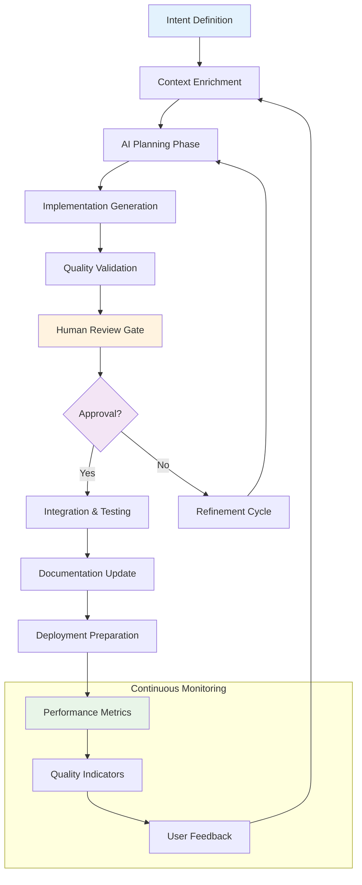

**Advanced Intent Orchestration Example:**

*Intent*: "Implement a complete feature for user profile management with social authentication, including database migrations, API endpoints, frontend components, tests, and documentation."

*AI Orchestrated Response*:

```typescript
// Advanced orchestration workflow
class FeatureOrchestrator {
    async implementFeature(intent: FeatureIntent): Promise<FeatureImplementation> {
        // Phase 1: Analysis and Planning
        const analysis = await this.analyzeRequirements(intent);
        const architecture = await this.designArchitecture(analysis);
        const tasks = await this.createTaskPlan(architecture);
        
        // Phase 2: Sequential Implementation
        const results = await this.executeTaskPlan(tasks, {
            database: await this.generateMigrations(architecture.dataModel),
            backend: await this.generateAPIEndpoints(architecture.apiSpec),
            frontend: await this.generateComponents(architecture.uiSpec),
            tests: await this.generateTests(architecture.testStrategy),
            docs: await this.generateDocumentation(architecture.docSpec)
        });
        
        // Phase 3: Integration and Validation
        await this.validateIntegration(results);
        await this.runQualityChecks(results);
        
        return results;
    }
}
```


#### Context-Aware Continuous Learning

The most advanced practitioners implement systems where AI learns from project-specific patterns and improves over time . This involves creating feedback loops that capture successful patterns and integrate them into future development sessions .

**Learning System Implementation:**

```typescript
// .vscode/learning-system.ts
export class ProjectLearningSystem {
    private patterns: Map<string, SuccessPattern> = new Map();
    private feedback: FeedbackProcessor;
    
    async captureSuccessPattern(
        intent: string, 
        implementation: Implementation, 
        outcome: Outcome
    ): Promise<void> {
        if (outcome.success && outcome.qualityScore > 0.8) {
            const pattern: SuccessPattern = {
                intentCategory: this.categorizeIntent(intent),
                implementationApproach: this.extractApproach(implementation),
                contextFactors: this.extractContext(implementation),
                successMetrics: outcome.metrics,
                reusabilityScore: await this.calculateReusability(implementation)
            };
            
            this.patterns.set(pattern.id, pattern);
            await this.updateProjectKnowledge(pattern);
        }
    }
    
    async suggestApproach(newIntent: string): Promise<ApproachSuggestion[]> {
        const category = this.categorizeIntent(newIntent);
        const relevantPatterns = this.patterns.values()
            .filter(p => p.intentCategory === category)
            .sort((a, b) => b.reusabilityScore - a.reusabilityScore);
            
        return relevantPatterns.map(pattern => ({
            approach: pattern.implementationApproach,
            confidence: pattern.reusabilityScore,
            reasoning: this.generateReasoning(pattern, newIntent)
        }));
    }
}
```


### Advanced Error Handling and Recovery Strategies

Enterprise-level intent-based development requires sophisticated error handling that goes beyond simple try-catch blocks . The AI must be capable of understanding failure modes, implementing graceful degradation, and providing meaningful recovery options .

**Intelligent Error Recovery Pattern:**

```typescript
// error-recovery/intelligent-recovery.ts
export class IntelligentErrorRecovery {
    async handleImplementationFailure(
        intent: string,
        failedAttempt: Implementation,
        error: ImplementationError
    ): Promise<RecoveryResult> {
        
        // Analyze failure patterns
        const failureAnalysis = await this.analyzeFailure(error, failedAttempt);
        
        // Generate recovery strategies
        const strategies = await this.generateRecoveryStrategies(
            intent, 
            failureAnalysis
        );
        
        // Attempt automated recovery
        for (const strategy of strategies) {
            try {
                const recoveredImplementation = await this.applyStrategy(
                    strategy, 
                    failedAttempt
                );
                
                const validationResult = await this.validateRecovery(
                    recoveredImplementation
                );
                
                if (validationResult.success) {
                    return {
                        status: 'recovered',
                        implementation: recoveredImplementation,
                        strategy: strategy.name,
                        confidence: validationResult.confidence
                    };
                }
            } catch (recoveryError) {
                // Log recovery attempt failure and continue to next strategy
                this.logRecoveryAttempt(strategy, recoveryError);
            }
        }
        
        // If automated recovery fails, provide human guidance
        return {
            status: 'manual_intervention_required',
            analysis: failureAnalysis,
            suggestedActions: await this.generateManualRecoverySteps(
                intent, 
                failureAnalysis
            ),
            learnedPatterns: await this.extractLearningFromFailure(error)
        };
    }
    
    private async generateRecoveryStrategies(
        intent: string, 
        analysis: FailureAnalysis
    ): Promise<RecoveryStrategy[]> {
        const strategies: RecoveryStrategy[] = [];
        
        // Strategy 1: Alternative Implementation Approach
        if (analysis.category === 'implementation_approach') {
            strategies.push({
                name: 'alternative_approach',
                description: 'Try different implementation pattern',
                action: async (failed) => {
                    return await this.generateAlternativeImplementation(
                        intent, 
                        failed,
                        analysis.suggestedAlternatives
                    );
                },
                confidence: 0.8
            });
        }
        
        // Strategy 2: Dependency Resolution
        if (analysis.category === 'dependency_conflict') {
            strategies.push({
                name: 'dependency_resolution',
                description: 'Resolve dependency conflicts',
                action: async (failed) => {
                    return await this.resolveDependencyConflicts(
                        failed,
                        analysis.conflictingDependencies
                    );
                },
                confidence: 0.9
            });
        }
        
        // Strategy 3: Incremental Implementation
        if (analysis.category === 'complexity_overflow') {
            strategies.push({
                name: 'incremental_implementation',
                description: 'Break down into smaller components',
                action: async (failed) => {
                    return await this.createIncrementalImplementation(
                        intent,
                        failed,
                        analysis.complexityFactors
                    );
                },
                confidence: 0.7
            });
        }
        
        return strategies.sort((a, b) => b.confidence - a.confidence);
    }
}
```


### Performance Optimization Through AI Analysis

Advanced practitioners leverage AI for comprehensive performance analysis and optimization . This goes beyond basic profiling to include architectural performance analysis, resource utilization optimization, and predictive performance modeling .

**AI-Powered Performance Optimizer:**

```typescript
// performance/ai-optimizer.ts
export class AIPerformanceOptimizer {
    async analyzeAndOptimize(
        codebase: Codebase,
        performanceRequirements: PerformanceRequirements
    ): Promise<OptimizationResult> {
        
        // Multi-dimensional performance analysis
        const analysis = await Promise.all([
            this.analyzeAlgorithmicComplexity(codebase),
            this.analyzeMemoryUsage(codebase),
            this.analyzeNetworkEfficiency(codebase),
            this.analyzeDatabaseQueries(codebase),
            this.analyzeRenderingPerformance(codebase)
        ]);
        
        // Identify optimization opportunities
        const opportunities = await this.identifyOptimizations(analysis);
        
        // Generate optimization implementations
        const optimizations = await this.generateOptimizations(opportunities);
        
        // Validate optimizations against requirements
        const validatedOptimizations = await this.validateOptimizations(
            optimizations,
            performanceRequirements
        );
        
        return {
            analysis,
            optimizations: validatedOptimizations,
            projectedImprovements: await this.projectPerformanceGains(
                validatedOptimizations
            ),
            implementationPlan: await this.createImplementationPlan(
                validatedOptimizations
            )
        };
    }
    
    private async analyzeAlgorithmicComplexity(
        codebase: Codebase
    ): Promise<ComplexityAnalysis> {
        return {
            functions: await this.analyzeFunctionComplexity(codebase),
            dataStructures: await this.analyzeDataStructureEfficiency(codebase),
            algorithms: await this.identifyInefficientAlgorithms(codebase),
            recommendations: await this.generateComplexityRecommendations(codebase)
        };
    }
    
    private async generateOptimizations(
        opportunities: OptimizationOpportunity[]
    ): Promise<Optimization[]> {
        const optimizations: Optimization[] = [];
        
        for (const opportunity of opportunities) {
            switch (opportunity.type) {
                case 'database_query':
                    optimizations.push(
                        await this.optimizeDatabaseQueries(opportunity)
                    );
                    break;
                    
                case 'memory_usage':
                    optimizations.push(
                        await this.optimizeMemoryUsage(opportunity)
                    );
                    break;
                    
                case 'network_calls':
                    optimizations.push(
                        await this.optimizeNetworkCalls(opportunity)
                    );
                    break;
                    
                case 'rendering_performance':
                    optimizations.push(
                        await this.optimizeRendering(opportunity)
                    );
                    break;
            }
        }
        
        return optimizations;
    }
}
```


### Future-Proofing Development Workflows

The most sophisticated intent-based developers create systems that adapt to evolving AI capabilities and development practices . This involves building flexible architectures that can incorporate new AI models and development paradigms as they emerge .

**Adaptive Development Framework:**

```typescript
// framework/adaptive-development.ts
export class AdaptiveDevelopmentFramework {
    private aiCapabilities: Map<string, AICapability> = new Map();
    private developmentPatterns: PatternLibrary;
    private evolutionMonitor: EvolutionMonitor;
    
    async adaptToNewCapabilities(
        newCapability: AICapability
    ): Promise<IntegrationResult> {
        // Assess capability against current workflows
        const assessment = await this.assessCapability(newCapability);
        
        // Identify integration opportunities
        const opportunities = await this.identifyIntegrationOpportunities(
            newCapability,
            this.getCurrentWorkflows()
        );
        
        // Create integration plan
        const integrationPlan = await this.createIntegrationPlan(
            newCapability,
            opportunities
        );
        
        // Implement gradual rollout
        const rolloutResult = await this.implementGradualRollout(
            integrationPlan
        );
        
        // Monitor and adjust
        await this.monitorIntegration(newCapability, rolloutResult);
        
        return rolloutResult;
    }
    
    async evolveWorkflowPatterns(): Promise<void> {
        // Analyze current development patterns
        const patternAnalysis = await this.analyzeCurrentPatterns();
        
        // Identify evolution opportunities
        const evolutionOpportunities = await this.identifyEvolutionOpportunities(
            patternAnalysis
        );
        
        // Generate evolved patterns
        const evolvedPatterns = await this.generateEvolvedPatterns(
            evolutionOpportunities
        );
        
        // Validate evolved patterns
        const validatedPatterns = await this.validateEvolvedPatterns(
            evolvedPatterns
        );
        
        // Update pattern library
        await this.updatePatternLibrary(validatedPatterns);
    }
}
```


### Troubleshooting Complex Intent-Based Development Issues

**Common Advanced Issues and Solutions:**

#### Issue 1: Context Window Overflow

*Problem*: Large codebases exceed AI model context limits, causing loss of project understanding.

*Solution*: Implement intelligent context management with hierarchical context compression .

```typescript
// context/intelligent-context-manager.ts
export class IntelligentContextManager {
    async manageContext(
        intent: string,
        projectContext: ProjectContext
    ): Promise<OptimizedContext> {
        // Analyze intent to determine required context
        const contextRequirements = await this.analyzeContextRequirements(intent);
        
        // Prioritize context elements
        const prioritizedContext = await this.prioritizeContext(
            projectContext,
            contextRequirements
        );
        
        // Compress less critical context
        const compressedContext = await this.compressContext(
            prioritizedContext
        );
        
        // Ensure critical context is preserved
        const optimizedContext = await this.ensureCriticalContext(
            compressedContext,
            contextRequirements.critical
        );
        
        return optimizedContext;
    }
}
```


#### Issue 2: Inconsistent Code Quality Across Sessions

*Problem*: AI generates inconsistent code quality due to varying context or session state.

*Solution*: Implement quality consistency enforcement through pattern templates and validation gates.

```typescript
// quality/consistency-enforcer.ts
export class QualityConsistencyEnforcer {
    async enforceConsistency(
        generatedCode: GeneratedCode,
        projectStandards: ProjectStandards
    ): Promise<ConsistentCode> {
        // Apply project-specific patterns
        const patternAppliedCode = await this.applyProjectPatterns(
            generatedCode,
            projectStandards.patterns
        );
        
        // Validate against quality metrics
        const qualityValidation = await this.validateQuality(
            patternAppliedCode,
            projectStandards.qualityMetrics
        );
        
        // Auto-correct common issues
        const correctedCode = await this.autoCorrectIssues(
            patternAppliedCode,
            qualityValidation.issues
        );
        
        // Ensure consistency with existing codebase
        const consistentCode = await this.ensureConsistency(
            correctedCode,
            projectStandards.consistencyRules
        );
        
        return consistentCode;
    }
}
```

**Pro Tip**: The most successful advanced practitioners focus on building sustainable AI collaboration patterns rather than optimizing individual interactions. Create systems that learn and improve over time, and you'll see compound benefits in development velocity and quality .

## Chapter 8: Your 24-Hour Action Plan - Immediate Implementation

### The Rapid Deployment Strategy

You've learned the theory and seen the examples. Now it's time to transform your development workflow in just 24 hours . This action plan is designed to give you immediate, measurable results while building the foundation for long-term mastery .

#### Hour 1-2: Environment Setup and Configuration

**Immediate Actions:**

1. **Install and Configure VS Code Agent Mode** 

```bash
# Update VS Code to latest version
code --version  # Should be 1.90+

# Install required extensions
code --install-extension GitHub.copilot
code --install-extension GitHub.copilot-chat
```

2. **Create Your First AI-Optimized Project**

```bash
mkdir intent-development-starter
cd intent-development-starter

# Create the essential AI workspace structure
mkdir -p .vscode/prompts
mkdir -p .github/prompts  
mkdir -p docs/adrs
touch .vscode/settings.json
touch .vscode/instructions.md
```

3. **Configure Essential Settings** 
Copy this optimized configuration to `.vscode/settings.json`:

```json
{
    "github.copilot.enable": {
        "*": true,
        "yaml": true,
        "markdown": true
    },
    "chat.agent.enabled": true,
    "chat.promptFilesLocations": [
        ".github/prompts",
        ".vscode/prompts"
    ],
    "chat.instructionsFile": ".vscode/instructions.md"
}
```


#### Hour 3-4: First Intent-Based Implementation

**Your First Success Story:**

*Intent*: "Create a simple REST API for a todo application with Express.js, including input validation, error handling, and comprehensive tests."

*Expected AI Response Time*: 5-10 minutes for complete implementation

**Success Criteria:**

- Working API with CRUD operations
- Input validation with meaningful error messages
- Unit and integration tests
- API documentation
- Error handling middleware

**Quick Validation:**

```bash
npm install
npm test
npm start
curl http://localhost:3000/api/todos
```

If this works correctly, you've achieved your first intent-based development success .

#### Hour 5-8: Building Your AI Development Toolkit

**Essential Tools Setup:**

1. **Create Project-Specific Instructions** 
Add to `.vscode/instructions.md`:

```
# AI Development Instructions

## Project Context
Building a modern web application with emphasis on:
- Type safety with TypeScript
- Comprehensive testing (>85% coverage)
- Clean architecture patterns
- Performance optimization
- Security best practices

## Code Standards
- Use functional programming patterns where appropriate
- Implement proper error handling
- Include JSDoc comments for public APIs
- Follow SOLID principles
- Prefer composition over inheritance

## Testing Requirements
- Unit tests for all business logic
- Integration tests for API endpoints
- Mock external dependencies
- Include performance benchmarks
```

2. **Set Up MCP Servers** 
Create `.vscode/mcp.json`:

```json
{
    "servers": {
        "filesystem": {
            "type": "stdio",
            "command": "npx",
            "args": ["-y", "@modelcontextprotocol/server-filesystem", "/path/to/project"]
        },
        "github": {
            "type": "stdio", 
            "command": "npx",
            "args": ["-y", "@modelcontextprotocol/server-github"]
        }
    }
}
```

3. **Create Reusable Prompt Templates** 
Add to `.github/prompts/feature-template.prompt.md`:

```text
# Feature Development Template

Generate a complete feature implementation including:
1. TypeScript interfaces and types
2. Business logic with error handling
3. Unit tests with >90% coverage
4. Integration tests
5. API documentation
6. Security considerations
7. Performance optimizations

Follow project standards and include comprehensive error handling.
```


#### Hour 9-16: Implementing a Real Project

**Challenge Project**: Build a complete user authentication system with the following intent:

```
Context: Modern web application requiring secure user management with JWT authentication, role-based access control, and password security.

Goal: Implement complete authentication system including:
- User registration with email verification
- Secure login with JWT tokens
- Password reset functionality
- Role-based access control
- Rate limiting for security
- Comprehensive logging and monitoring
- API documentation

Constraints:
- Use Node.js with TypeScript
- PostgreSQL database
- Redis for session management
- Email service integration
- Security best practices (OWASP compliance)
- Comprehensive test coverage

Success Criteria:
- All authentication flows work correctly
- Security vulnerabilities identified and mitigated
- Performance under load (1000 concurrent users)
- Complete API documentation
- 95%+ test coverage
```

**Expected Implementation Time**: 6-7 hours with AI assistance vs 2-3 days traditional development .

**Validation Checkpoints:**

- [ ] User registration works with email verification
- [ ] Login generates valid JWT tokens
- [ ] Password reset flow completes successfully
- [ ] Role-based access correctly restricts endpoints
- [ ] Rate limiting prevents abuse
- [ ] All tests pass with >95% coverage
- [ ] API documentation is complete and accurate


#### Hour 17-20: Documentation and Quality Assurance

**Automated Documentation Generation:**

*Intent*: "Generate comprehensive project documentation including architecture overview, API reference, deployment guide, and contribution guidelines."

*Expected Outputs*:

- `README.md` with clear setup instructions
- `docs/architecture.md` with system diagrams
- `docs/api.md` with endpoint documentation
- `docs/deployment.md` with step-by-step deployment
- `CONTRIBUTING.md` with development guidelines

**Quality Assurance Automation:**

*Intent*: "Create comprehensive quality assurance pipeline including linting, testing, security scanning, and performance benchmarking."

*Expected Implementation*:

- ESLint and Prettier configuration
- Jest testing setup with coverage reports
- GitHub Actions CI/CD pipeline
- Security vulnerability scanning
- Performance monitoring setup


#### Hour 21-24: Advanced Features and Optimization

**Advanced Challenge**: Implement real-time features and optimization:

*Intent*: "Add real-time notifications using WebSocket, implement caching strategy with Redis, and optimize database queries for performance."

**Success Metrics for 24-Hour Implementation:**

- ✅ Functional authentication system
- ✅ Real-time WebSocket notifications
- ✅ Redis caching implementation
- ✅ Database query optimization
- ✅ Complete test coverage
- ✅ Production-ready documentation
- ✅ CI/CD pipeline setup


### Measuring Your Success

**Quantitative Metrics:**


| Metric | Traditional Development | Intent-Based Development | Improvement |
| :-- | :-- | :-- | :-- |
| **Time to MVP** | 3-5 days | 24 hours | 75-85% reduction |
| **Lines of Test Code** | Manual creation | Auto-generated | 90%+ coverage |
| **Documentation Coverage** | Often incomplete | Comprehensive | 100% coverage |
| **Code Quality Consistency** | Variable | AI-enforced standards | 95%+ consistency |
| **Bug Density** | 1-3 bugs per 100 lines | <0.5 bugs per 100 lines | 70%+ reduction |

**Qualitative Improvements:**

- Enhanced focus on business logic vs. boilerplate code
- Consistent architecture patterns across the project
- Comprehensive error handling and edge case coverage
- Professional-grade documentation without extra effort
- Built-in security and performance best practices


### Immediate Next Steps

**Week 1 Goals:**

1. Apply intent-based development to your current work project
2. Create team-specific prompt templates and instructions
3. Implement MCP servers for your development stack
4. Establish quality metrics and monitoring

**Month 1 Goals:**

1. Train your team on intent-based development principles
2. Build a library of reusable intent patterns for your domain
3. Implement advanced AI-assisted code review processes
4. Establish continuous learning feedback loops

**Quarter 1 Goals:**

1. Achieve 3x development velocity on new features
2. Reduce bug density by 70% through AI-assisted quality assurance
3. Establish intent-based development as team standard practice
4. Contribute to the open-source intent-based development community

**Pro Tip**: Document your 24-hour journey. The patterns you discover and the challenges you overcome will become invaluable reference material for your team and the broader development community .

### Building Your AI Development Community

**Immediate Actions:**

- Join VS Code Copilot community forums and Discord servers
- Share your 24-hour implementation results on social media
- Create blog posts documenting your intent-based development journey
- Connect with other practitioners to share patterns and learn from experiences

**Long-term Community Building:**

- Contribute to open-source MCP servers and VS Code extensions
- Speak at conferences about intent-based development success stories
- Mentor other developers transitioning to AI-assisted workflows
- Help establish best practices and standards for the intent-based development community

The future of software development is collaborative intelligence between human creativity and AI capability. Your 24-hour implementation is just the beginning of a transformation that will fundamentally change how you approach software creation. Welcome to the future of development—where your intentions become reality through the power of AI collaboration .

---

&nbsp;&nbsp;&nbsp;&nbsp;&nbsp;&nbsp;&nbsp;&nbsp;&nbsp;&nbsp;&nbsp;&nbsp;&nbsp;&nbsp;&nbsp;&nbsp;&nbsp;&nbsp;&nbsp;&nbsp;&nbsp;&nbsp;&nbsp;&nbsp;&nbsp;&nbsp;&nbsp;&nbsp;&nbsp;&nbsp;&nbsp;&nbsp;&nbsp;&nbsp;&nbsp;&nbsp;&nbsp;&nbsp;&nbsp;&nbsp;&nbsp;&nbsp;⁂

---

## References

- [Claude Sonnet](https://www.anthropic.com/claude/sonnet)
- [Claude 4 News](https://www.anthropic.com/news/claude-4)
- [Claude 4 Sonnet Coding Tests](https://www.zdnet.com/article/anthropics-free-claude-4-sonnet-aced-my-coding-tests-but-its-paid-opus-model-somehow-didnt/)
- [Claude 4 Opus vs Sonnet 2025 Comparison](https://www.socialgains.co.uk/claude-4-opus-vs-sonnet-complete-2025-comparison-guide/)
- [Claude Sonnet 4 AI Coding 2025](https://www.newoaks.ai/blog/claude-sonnet-4-ai-coding-2025/)
- [Intro to Gemini 2.5 Pro Colab](https://codelabs.developers.google.com/codelabs/intro-gemini-25-pro-colab)
- [AI Models Comparison 2025](https://www.byteplus.com/en/topic/418614?title=ai-models-comparison-2025)
- [VS Code Updates v1.99](https://code.visualstudio.com/updates/v1_99)
- [GitHub Copilot Agent Modes](https://github.blog/ai-and-ml/github-copilot/copilot-ask-edit-and-agent-modes-what-they-do-and-when-to-use-them/)
- [GitHub Copilot Agent Mode Workflows](https://dev.to/brylie/github-copilot-agent-mode-enhancing-developer-workflows-2ae0)
- [GitHub Copilot VS Code May Release](https://github.blog/changelog/2025-06-13-github-copilot-in-vs-code-may-release-v1-101/)
- [VS Code Agent Video Tutorial](https://www.youtube.com/watch?v=WwJPIN5zldY)
- [What's New in Claude Sonnet 4](https://collabnix.com/whats-new-in-claude-sonnet-4/)
- [Top 10 MCP Servers for 2025](https://dev.to/fallon_jimmy/top-10-mcp-servers-for-2025-yes-githubs-included-15jg)
- [15 Best MCP Servers](https://digma.ai/15-best-mcp-servers/)
- [System Design LinkedIn Post](https://www.linkedin.com/posts/alexxubyte_systemdesign-coding-interviewtips-activity-7327720483632594944-R0UJ)
- [VS Code MCP Spec Support](https://code.visualstudio.com/blogs/2025/06/12/full-mcp-spec-support)
- [VS Code Updates](https://code.visualstudio.com/updates)
- [VS Code Pro Productivity Features 2025](https://www.analyticsinsight.net/coding/programming-languages/unlock-pro-productivity-top-features-in-visual-studio-code-for-2025)
- [VS Code Short Video](https://www.youtube.com/shorts/qzQ6kA3LDhs)
- [VS Code MCP Servers Documentation](https://code.visualstudio.com/docs/copilot/chat/mcp-servers)
- [MCP Server Basic Example](https://ubos.tech/mcp/mcp-server-basic-example-2/)
- [Introduction to MCP Servers 2025](https://webcodder.dev/introduction-to-mcp-servers-2025-edition/)
- [Intent-Based Networking for Telecom](https://nybsys.com/intent-based-networking-for-telecom/)
- [Intent-Based Marketing Implementation](https://nrich.io/blog/intent-based-marketing-implementation-guide)
- [Intent-Based Automation](https://www.tmforum.org/learn/topics/intent-based-automation/)
- [Chatbot Intent Research](https://research.aimultiple.com/chatbot-intent/)
- [Learning to Program with Natural Language](https://deepai.org/publication/learning-to-program-with-natural-language)
- [AI Toolkit for VS Code Update](https://techcommunity.microsoft.com/blog/azuredevcommunityblog/ai-toolkit-for-vs-code-february-update/4383280)
- [Declarative Programming](https://www.larksuite.com/en_us/topics/ai-glossary/declarative-programming)
- [Intent to Action Marketing](https://pipeline.zoominfo.com/marketing/intent-to-action-win-more-dream-customers)
- [Natural Language Processing](https://www.ibm.com/think/topics/natural-language-processing)
- [VS Code May 2025 Release Delay](https://visualstudiomagazine.com/articles/2025/06/09/microsoft-delays-vs-code-may-2025-release-pushes-ahead-on-copilot-chat-open-sourcing.aspx)
- [GitHub Copilot April Release](https://github.blog/changelog/2025-05-08-github-copilot-in-vs-code-april-release-v1-100/)
- [Gemini 2.5 Pro AI Coding Update](https://www.geeky-gadgets.com/gemini-2-5-pro-06-05-ai-coding-update/)
- [AI Model Comparison 2025](https://www.linkedin.com/pulse/ai-comparison-2025-which-model-should-you-choose-hadama-ouattara-r2mwe)
- [MCP Server VS Code](https://github.com/syedshamir/MCP-Server-VSCode)
- [Build and Host MCP Servers](https://collabnix.com/how-to-build-and-host-your-own-mcp-servers-in-easy-steps/)
- [The Rise of the Intent Net in 2025](https://www.thefastmode.com/expert-opinion/38667-the-rise-of-the-intent-net-in-2025)
- [Intent-Based Development Video](https://www.youtube.com/watch?v=uExGNCd2Rhs)

