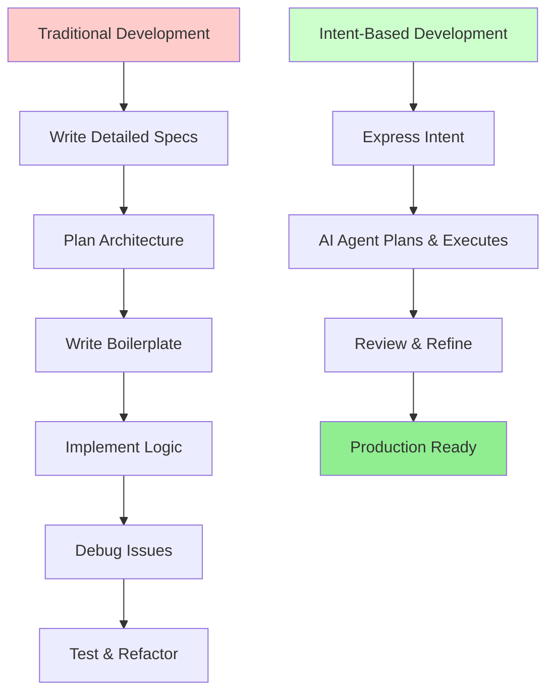
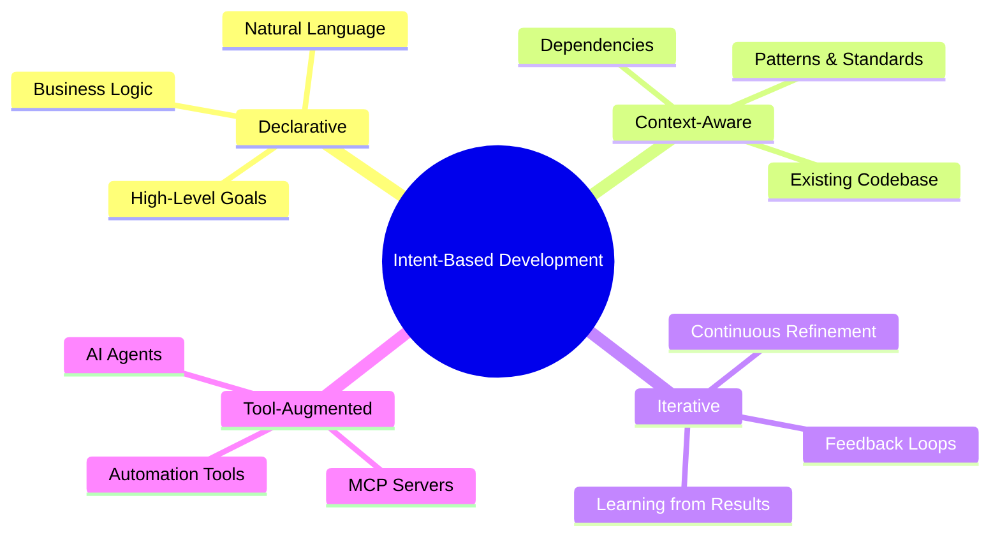
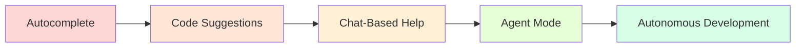
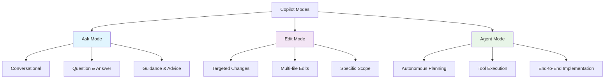
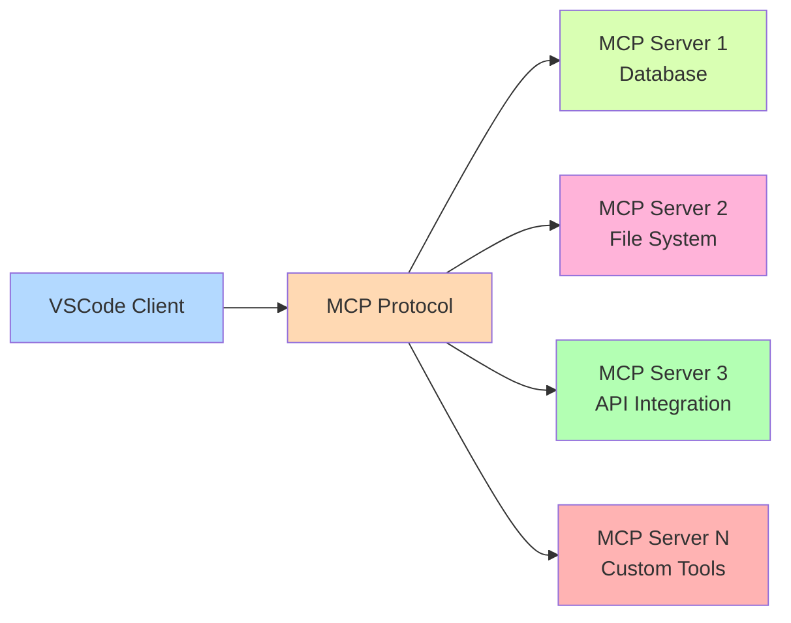
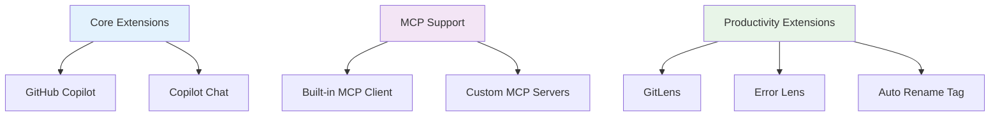
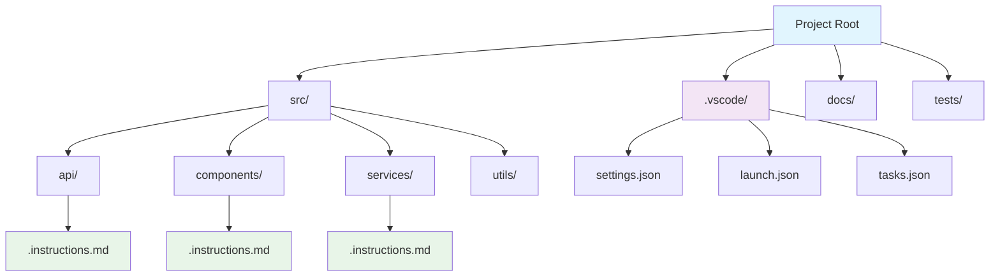
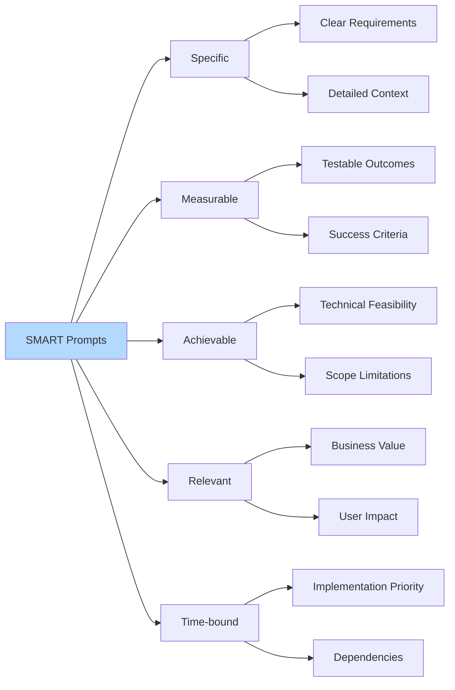

```mermaid
graph LR
    A[SMART Prompts] --> B[Specific]
    A --> C[Measurable]
    A --> D[Achievable]
    A --> E[Relevant]
    A --> F[Time-bound]
    
    B --> B1[Clear Requirements]
    B --> B2[Detailed Context]
    
    C --> C1[Testable Outcomes]
    C --> C2[Success Criteria]
    
    D --> D1[Technical Feasibility]
    D --> D2[Scope Limitations]
    
    E --> E1[Business Value]
    E --> E2[User Impact]
    
    F --> F1[Implementation Priority]
    F --> F2[Dependencies]
    
    style A fill:#b3d9ff
```

### Why Intent-Based Development Matters

Picture this: You're Sarah, a senior developer at a fast-growing startup. It's 2 AM, and you're still debugging a complex authentication system that should have taken "just a few hours" to implement. Your coffee has gone cold, your eyes are burning, and you're wondering if there's a better way to translate your brilliant ideas into working code without drowning in implementation details [^1_16].

Now imagine a different scenario: You describe what you want in plain English - "Create a secure user authentication system with OAuth integration, password reset functionality, and role-based access control" - and watch as your AI partner transforms your intent into production-ready code in minutes, not hours [^1_2][^1_3].

This isn't science fiction. This is intent-based development with VSCode Copilot AI Agent, and it's happening right now [^1_1][^1_2].



The traditional software development cycle is broken. We spend 80% of our time on repetitive tasks that could be automated and only 20% on creative problem-solving [^1_17]. Intent-based development flips this ratio, allowing developers to focus on what they do best: solving complex problems and creating value [^1_18][^1_16].

**The Pain Points of Traditional Coding:**

- Hours spent on boilerplate code that follows predictable patterns
- Context switching between different files and systems
- Manual error-prone tasks like writing tests and documentation
- Difficulty maintaining consistency across large codebases
- Steep learning curves for new frameworks and libraries

**The Promise of AI-Driven Development:**
Intent-based development addresses these pain points by allowing developers to express their goals in natural language and let AI agents handle the implementation details [^1_19][^1_20]. It's like having a senior developer who never gets tired, never forgets patterns, and can work across any technology stack [^1_1][^1_2].

### What is Intent-Based Development

Intent-based development is a paradigm where developers focus on expressing *what* they want to achieve rather than *how* to implement it [^1_18][^1_16]. Think of it as the difference between telling a taxi driver "Take me to the airport" versus giving them turn-by-turn directions [^1_21].

**Core Principles:**

1. **Outcome-Focused**: Define the desired end state, not the implementation steps
2. **Declarative**: Describe requirements in natural language
3. **Iterative**: Refine and adjust based on results
4. **Context-Aware**: Leverage existing codebase and patterns
5. **Tool-Augmented**: Use AI agents to bridge intent and implementation


**🤔 Pause and Reflect:** Think about the last feature you implemented. How much time did you spend on boilerplate code versus solving the actual business problem? If you're like most developers, it was probably 70/30 in favor of boilerplate. Intent-based development aims to flip this ratio.

### How VSCode Copilot Agent Changes Everything

VSCode Copilot Agent represents a quantum leap from simple code completion to autonomous development assistance [^1_2][^1_3]. Available in VSCode starting from version 1.99 and continuously evolved through 2025, it transforms how we interact with our development environment [^1_22][^1_23].

**The Evolution of AI Coding Assistance:**



**Agent Mode Capabilities:**

- **Autonomous Planning**: Analyzes your request and creates implementation plans [^1_2][^1_20]
- **Multi-File Coordination**: Edits multiple files simultaneously while maintaining consistency [^1_11][^1_20]
- **Tool Integration**: Executes terminal commands, runs tests, and handles build processes [^1_3][^1_22]
- **Error Recovery**: Monitors output and auto-corrects issues in a feedback loop [^1_2][^1_24]
- **Context Understanding**: Maintains awareness of your entire project structure [^1_19][^1_20]
- **Smart Actions**: Built-in AI-enhanced actions for commits, PR descriptions, error fixes, and code refactoring [^1_3][^1_22]
- **Semantic Search**: Find relevant files and code using natural language queries [^1_2][^1_24]
- **Custom Instructions**: Automatically apply your coding standards and preferences to all AI interactions [^1_8][^1_28]

**Pro Tip 💡:** Agent mode works best when you provide clear, specific intent. Instead of saying "fix this code," try "add error handling to this API endpoint with proper logging and user-friendly error messages."

## 2. The Foundation: Understanding Your AI Partner

### VSCode Copilot Agent Architecture

To master intent-based development, you need to understand how your AI partner thinks and operates. VSCode Copilot Agent uses a sophisticated architecture that combines multiple AI models, contextual understanding, and tool integration [^1_1][^1_2][^1_19].

**The Three Modes of Operation:**



**Ask Mode**: Your conversational partner for brainstorming, explaining code, and getting guidance [^1_10][^1_11]. Use this when you need to understand something or explore ideas.

**Edit Mode**: Focused on making specific changes to your code [^1_10][^1_11]. Perfect for refactoring, bug fixes, or implementing well-defined features.

**Agent Mode**: The powerhouse for intent-based development [^1_2][^1_20]. It autonomously plans, implements, and iterates on complex tasks.

**Model Selection Strategy:**
Different tasks require different AI models [^1_25]. VSCode Copilot supports multiple models through the model picker in the Chat view, allowing you to choose the best model for your specific use case:

- **Claude Sonnet 4**: The most powerful model for intent-based programming, excelling at complex architectural decisions, multi-file orchestration, and sophisticated code reasoning [^1_25]
- **Google Gemini Pro 2.5**: Outstanding for large-scale code analysis, understanding complex codebases, and generating comprehensive implementations from high-level intents [^1_25]
- **GPT-4o**: Excellent for rapid development, code generation, and general programming tasks [^1_25]  
- **Claude 3.5 Sonnet**: Strong for code analysis, refactoring, and mid-complexity reasoning tasks [^1_25]
- **GPT-4o mini**: Cost-effective and fast for basic code completions and simple queries [^1_25]

**🚀 Pro Tip for Maximum Performance:** For complex intent-based programming tasks, Claude Sonnet 4 and Google Gemini Pro 2.5 represent the cutting edge of AI-assisted development. These models excel at:

- **Architectural Reasoning**: Understanding complex system designs and making intelligent architectural decisions
- **Multi-File Orchestration**: Coordinating changes across dozens of files while maintaining consistency
- **Intent Translation**: Converting high-level business requirements into detailed technical implementations
- **Context Synthesis**: Processing large codebases and understanding intricate relationships between components
- **Code Quality**: Generating production-ready code with comprehensive error handling, testing, and documentation

Choose Claude Sonnet 4 for projects requiring deep logical reasoning and complex problem-solving. Select Gemini Pro 2.5 when working with large codebases or when you need comprehensive analysis of existing systems.


### The Power of Model Context Protocol (MCP)

Model Context Protocol (MCP) is the "USB-C of AI apps" - a universal standard that allows AI agents to connect with external tools and data sources [^1_4][^1_26][^1_27]. Think of MCP servers as specialized assistants that extend your AI agent's capabilities beyond code generation.

**MCP Architecture:**



**Popular MCP Servers and Use Cases:**


| MCP Server | Purpose | Example Use Case |
| :-- | :-- | :-- |
| @modelcontextprotocol/server-filesystem | File operations | "Read all configuration files and suggest improvements" |
| @modelcontextprotocol/server-github | GitHub integration | "Create a pull request for the authentication feature" |
| Custom Database MCP | Database queries | "Analyze user behavior patterns from the analytics database" |
| API Integration MCP | External services | "Fetch weather data and update the dashboard component" |

**Real-World MCP Example:**
Let's say you're building an e-commerce application and want to integrate with a payment processor. Instead of manually writing API calls, you can use an MCP server:

```json
{
  "mcp": {
    "servers": {
      "payment-processor": {
        "command": "node",
        "args": ["./mcp-servers/payment-server.js"],
        "env": {
          "STRIPE_API_KEY": "${STRIPE_SECRET_KEY}"
        }
      }
    }
  }
}
```

Now you can simply tell the agent: "Add payment processing to the checkout flow with Stripe integration" and it will use the MCP server to handle the API integration automatically [^1_4][^1_6].

### Setting Up Your Development Environment

Your development environment is the foundation of intent-based development success. A well-configured setup amplifies your AI agent's capabilities and streamlines your workflow [^1_7][^1_8].

**Essential VSCode Extensions for Intent-Based Development:**



**Step-by-Step Environment Setup:**

1. **Install VSCode and Essential Extensions:
```bash
# Install VSCode extensions via command line
code --install-extension GitHub.copilot
code --install-extension GitHub.copilot-chat
```

2. **Configure Workspace Settings:**
Create a `.vscode/settings.json` file in your project root:
```json
{
  "github.copilot.enable": {
    "*": true,
    "yaml": false,
    "plaintext": false
  },
  "github.copilot.chat.codeGeneration.useInstructionFiles": true,
  "chat.mcp.enabled": true,
  "chat.mcp.discovery.enabled": true
}
```

3. **Set Up Custom Instructions:**
Custom instructions are game-changers for intent-based development [^1_8][^1_28]. They tell the AI agent about your coding preferences, project standards, and architectural patterns.

Create `.github/copilot-instructions.md`:

```markdown
---
applyTo: "**"
---
# Project-Specific Instructions

## Code Style
- Use TypeScript for all new code
- Prefer functional components in React
- Use arrow functions for consistency
- Include comprehensive error handling
- Write unit tests for all new functions

## Architecture Patterns
- Follow repository pattern for data access
- Use dependency injection for services
- Implement proper logging throughout
- Use async/await instead of Promises chains

## Documentation
- Include JSDoc comments for all public methods
- Update README.md when adding new features
- Document API endpoints with OpenAPI specs
```

**🎯 Quick Quiz:** What's the difference between workspace settings and user settings in VSCode?
*Answer: Workspace settings apply only to the current project and can be shared with your team, while user settings apply globally to all your VSCode sessions.*

## 3. Your First Steps: Simple Intent-Driven Examples

Let's dive into practical examples that will transform how you think about coding. We'll start simple and progressively build complexity, just like learning to drive - you don't start with Formula 1 racing [^1_29][^1_30].

### Hello World, Intent Style

Forget `console.log("Hello World")`. In intent-based development, we start with purpose-driven examples that solve real problems.

**Example 1: Intent-Driven Function Creation**

Traditional approach:

```javascript
// Traditional: You write everything step by step
function calculateTax(income, state) {
  // Need to research tax rates for each state
  // Write validation logic
  // Handle edge cases
  // Add error handling
  // ... hours of implementation
}
```

Intent-based approach:

```javascript
// Intent: Just describe what you want
// Create a function that calculates tax based on income and state
// Should handle all US states with current tax rates
// Include proper validation and error handling
// Return result with breakdown of federal and state taxes
```

**Agent Response:**

```javascript
/**
 * Calculates tax breakdown for given income and state
 * @param {number} income - Annual income in USD
 * @param {string} state - US state code (e.g., 'CA', 'NY')
 * @returns {Object} Tax breakdown with federal and state amounts
 */
function calculateTax(income, state) {
  // Input validation
  if (!income || income < 0) {
    throw new Error('Income must be a positive number');
  }
  
  if (!state || typeof state !== 'string') {
    throw new Error('State must be a valid state code');
  }
  
  // 2024 Federal tax brackets
  const federalBrackets = [
    { min: 0, max: 11000, rate: 0.10 },
    { min: 11000, max: 44725, rate: 0.12 },
    { min: 44725, max: 95375, rate: 0.22 },
    // ... additional brackets
  ];
  
  // State tax rates (simplified)
  const stateTaxRates = {
    'CA': 0.093,
    'NY': 0.0825,
    'TX': 0.0,
    'FL': 0.0,
    // ... all states
  };
  
  const federalTax = calculateFederalTax(income, federalBrackets);
  const stateTax = income * (stateTaxRates[state.toUpperCase()] || 0);
  
  return {
    income,
    state,
    federalTax: Math.round(federalTax * 100) / 100,
    stateTax: Math.round(stateTax * 100) / 100,
    totalTax: Math.round((federalTax + stateTax) * 100) / 100,
    effectiveRate: Math.round((federalTax + stateTax) / income * 10000) / 100
  };
}
```

**The Magic Moment**: Notice how the agent not only implemented the function but also added comprehensive error handling, documentation, and even included current tax rates. This would have taken hours of research and implementation in traditional development [^1_12][^1_29].

**Example 2: Progressive Complexity - API Integration**

Let's add complexity. Now we want to fetch real-time tax rates from an external API:

```javascript
// Intent: Enhance the tax calculator to use real-time tax rates
// Integrate with TaxAPI.com for current rates
// Add caching to avoid repeated API calls
// Include fallback to static rates if API is unavailable
// Add proper error handling and logging
```

**Agent Response with MCP Integration:**
The agent recognizes this requires external API integration and automatically:

1. Sets up HTTP client configuration
2. Implements caching mechanism
3. Creates fallback strategy
4. Adds comprehensive error handling
5. Includes rate limiting to respect API constraints
```javascript
import axios from 'axios';
import NodeCache from 'node-cache';

class TaxCalculator {
  constructor() {
    this.cache = new NodeCache({ stdTTL: 3600 }); // 1-hour cache
    this.apiClient = axios.create({
      baseURL: 'https://api.taxapi.com/v1',
      timeout: 5000,
      headers: { 'Authorization': `Bearer ${process.env.TAX_API_KEY}` }
    });
  }

  async calculateTax(income, state) {
    try {
      const taxRates = await this.getTaxRates(state);
      return this.performCalculation(income, state, taxRates);
    } catch (error) {
      console.error('Tax calculation error:', error);
      // Fallback to static rates
      return this.calculateWithStaticRates(income, state);
    }
  }

  async getTaxRates(state) {
    const cacheKey = `tax-rates-${state}`;
    let rates = this.cache.get(cacheKey);
    
    if (!rates) {
      const response = await this.apiClient.get(`/rates/${state}`);
      rates = response.data;
      this.cache.set(cacheKey, rates);
    }
    
    return rates;
  }
  
  // ... additional methods
}
```

**🔥 Pro Tip:** When working with external APIs, always express your intent to include caching, error handling, and fallback strategies. The agent will implement robust patterns that many developers forget in traditional development.

### Building Your First Component

Let's create a React component using intent-based development. This example demonstrates how the agent handles modern development patterns, state management, and best practices [^1_15][^1_31].

**Example 3: User Profile Component**

```jsx
// Intent: Create a user profile component for a social media app
// Should display user avatar, name, bio, and follower count
// Include edit functionality for the current user
// Use modern React hooks and TypeScript
// Include loading and error states
// Make it responsive and accessible
// Add unit tests
```

**Agent Response:**

```typescript
import React, { useState, useEffect } from 'react';
import { User, Edit3, Save, X } from 'lucide-react';
import './UserProfile.css';

interface UserProfileProps {
  userId: string;
  currentUserId?: string;
  onProfileUpdate?: (updatedUser: User) => void;
}

interface User {
  id: string;
  name: string;
  bio: string;
  avatarUrl?: string;
  followerCount: number;
  followingCount: number;
}

const UserProfile: React.FC<UserProfileProps> = ({
  userId,
  currentUserId,
  onProfileUpdate
}) => {
  const [user, setUser] = useState<User | null>(null);
  const [loading, setLoading] = useState(true);
  const [error, setError] = useState<string | null>(null);
  const [isEditing, setIsEditing] = useState(false);
  const [editForm, setEditForm] = useState({ name: '', bio: '' });

  const isCurrentUser = userId === currentUserId;

  useEffect(() => {
    fetchUserProfile();
  }, [userId]);

  const fetchUserProfile = async () => {
    try {
      setLoading(true);
      setError(null);
      const response = await fetch(`/api/users/${userId}`);
      
      if (!response.ok) {
        throw new Error('Failed to fetch user profile');
      }
      
      const userData = await response.json();
      setUser(userData);
      setEditForm({ name: userData.name, bio: userData.bio });
    } catch (err) {
      setError(err instanceof Error ? err.message : 'Unknown error');
    } finally {
      setLoading(false);
    }
  };

  const handleSaveProfile = async () => {
    if (!user) return;

    try {
      const response = await fetch(`/api/users/${userId}`, {
        method: 'PATCH',
        headers: { 'Content-Type': 'application/json' },
        body: JSON.stringify(editForm)
      });

      if (!response.ok) {
        throw new Error('Failed to update profile');
      }

      const updatedUser = await response.json();
      setUser(updatedUser);
      setIsEditing(false);
      onProfileUpdate?.(updatedUser);
    } catch (err) {
      setError(err instanceof Error ? err.message : 'Update failed');
    }
  };

  if (loading) {
    return (
      <div className="user-profile loading" aria-label="Loading user profile">
        <div className="avatar-skeleton"></div>
        <div className="content-skeleton">
          <div className="name-skeleton"></div>
          <div className="bio-skeleton"></div>
        </div>
      </div>
    );
  }

  if (error) {
    return (
      <div className="user-profile error" role="alert">
        <p>Error loading profile: {error}</p>
        <button onClick={fetchUserProfile}>Try Again</button>
      </div>
    );
  }

  if (!user) {
    return <div className="user-profile">User not found</div>;
  }

  return (
    <div className="user-profile" data-testid="user-profile">
      <div className="avatar-section">
        {user.avatarUrl ? (
          
        ) : (
          <div className="avatar-placeholder">
            <User size={48} />
          </div>
        )}
      </div>

      <div className="content-section">
        {isEditing ? (
          <div className="edit-form">
            <input
              type="text"
              value={editForm.name}
              onChange={(e) => setEditForm({ ...editForm, name: e.target.value })}
              placeholder="Name"
              maxLength={100}
              aria-label="Edit name"
            />
            <textarea
              value={editForm.bio}
              onChange={(e) => setEditForm({ ...editForm, bio: e.target.value })}
              placeholder="Bio"
              maxLength={500}
              rows={3}
              aria-label="Edit bio"
            />
            <div className="edit-actions">
              <button onClick={handleSaveProfile} className="save-btn">
                <Save size={16} /> Save
              </button>
              <button 
                onClick={() => setIsEditing(false)} 
                className="cancel-btn"
              >
                <X size={16} /> Cancel
              </button>
            </div>
          </div>
        ) : (
          <>
            <div className="user-header">
              <h2>{user.name}</h2>
              {isCurrentUser && (
                <button 
                  onClick={() => setIsEditing(true)}
                  className="edit-btn"
                  aria-label="Edit profile"
                >
                  <Edit3 size={16} />
                </button>
              )}
            </div>
            <p className="bio">{user.bio || 'No bio available'}</p>
            <div className="stats">
              <span>{user.followerCount} followers</span>
              <span>{user.followingCount} following</span>
            </div>
          </>
        )}
      </div>
    </div>
  );
};

export default UserProfile;
```

**Accompanying Test File** (automatically generated):

```typescript
import { render, screen, fireEvent, waitFor } from '@testing-library/react';
import { vi } from 'vitest';
import UserProfile from './UserProfile';

// Mock fetch
global.fetch = vi.fn();

const mockUser = {
  id: '1',
  name: 'John Doe',
  bio: 'Software developer',
  avatarUrl: 'https://example.com/avatar.jpg',
  followerCount: 150,
  followingCount: 75
};

describe('UserProfile', () => {
  beforeEach(() => {
    vi.clearAllMocks();
  });

  it('displays user profile correctly', async () => {
    (fetch as any).mockResolvedValueOnce({
      ok: true,
      json: async () => mockUser
    });

    render(<UserProfile userId="1" />);
    
    await waitFor(() => {
      expect(screen.getByText('John Doe')).toBeInTheDocument();
      expect(screen.getByText('Software developer')).toBeInTheDocument();
      expect(screen.getByText('150 followers')).toBeInTheDocument();
    });
  });

  it('shows edit button for current user', async () => {
    (fetch as any).mockResolvedValueOnce({
      ok: true,
      json: async () => mockUser
    });

    render(<UserProfile userId="1" currentUserId="1" />);
    
    await waitFor(() => {
      expect(screen.getByLabelText('Edit profile')).toBeInTheDocument();
    });
  });

  it('handles loading state', () => {
    (fetch as any).mockImplementationOnce(() => new Promise(() => {}));
    
    render(<UserProfile userId="1" />);
    
    expect(screen.getByLabelText('Loading user profile')).toBeInTheDocument();
  });
});
```

**What Just Happened?**
The agent delivered a production-ready component with:

- TypeScript interfaces and proper typing
- Comprehensive error handling and loading states
- Accessibility attributes (ARIA labels, semantic HTML)
- Responsive design considerations
- Unit tests with proper mocking
- Modern React patterns (hooks, functional components)
- Clean separation of concerns

This would typically take hours to implement manually, especially with all the edge cases and best practices [^1_7][^1_8].

**🤔 Pause and Reflect:** Compare this to your typical component development process. How much time do you usually spend on error handling, accessibility, and testing? Intent-based development ensures these critical aspects are never forgotten.

### Error Handling and Debugging

One of the most powerful aspects of intent-based development is how it handles errors and debugging. Instead of manual debugging sessions, you can express your intent for error resolution [^1_2][^1_24].

**Example 4: Intent-Driven Debugging**

Suppose you have a failing API endpoint:

```javascript
// Current failing code
app.get('/api/users/:id', async (req, res) => {
  const user = await db.users.findById(req.params.id);
  res.json(user);
});
// Error: Sometimes returns 500, sometimes returns null for valid IDs
```

**Your Intent:**

```javascript
// Intent: Fix this endpoint to handle all edge cases properly
// Add proper error handling for invalid IDs
// Include logging for debugging
// Add input validation
// Handle database connection errors
// Return appropriate HTTP status codes
// Add rate limiting for security
```

**Agent Response:**

```javascript
import rateLimit from 'express-rate-limit';
import { body, param, validationResult } from 'express-validator';
import logger from '../utils/logger';

// Rate limiting middleware
const userEndpointLimiter = rateLimit({
  windowMs: 15 * 60 * 1000, // 15 minutes
  max: 100, // limit each IP to 100 requests per windowMs
  message: 'Too many requests from this IP'
});

// Validation middleware
const validateUserId = [
  param('id')
    .isMongoId()
    .withMessage('Invalid user ID format')
    .trim()
    .escape()
];

app.get('/api/users/:id', 
  userEndpointLimiter,
  validateUserId,
  async (req, res) => {
    const startTime = Date.now();
    const { id } = req.params;
    
    try {
      // Check validation results
      const errors = validationResult(req);
      if (!errors.isEmpty()) {
        logger.warn('Invalid user ID provided', { 
          id, 
          errors: errors.array(),
          ip: req.ip 
        });
        return res.status(400).json({
          error: 'Invalid user ID',
          details: errors.array()
        });
      }

      logger.info('Fetching user', { id, ip: req.ip });

      // Check database connection
      if (!db.isConnected()) {
        logger.error('Database connection lost');
        return res.status(503).json({
          error: 'Service temporarily unavailable'
        });
      }

      const user = await db.users.findById(id);
      
      if (!user) {
        logger.info('User not found', { id });
        return res.status(404).json({
          error: 'User not found'
        });
      }

      // Remove sensitive fields before sending
      const safeUser = {
        id: user.id,
        name: user.name,
        email: user.email,
        createdAt: user.createdAt,
        // Don't send password, tokens, etc.
      };

      logger.info('User fetched successfully', { 
        id, 
        duration: Date.now() - startTime 
      });

      res.json(safeUser);

    } catch (error) {
      logger.error('Error fetching user', { 
        id, 
        error: error.message, 
        stack: error.stack,
        duration: Date.now() - startTime
      });

      // Don't expose internal errors to client
      res.status(500).json({
        error: 'Internal server error'
      });
    }
  }
);
```

**The Debugging Magic:**
The agent not only fixed the immediate issue but also:

- Added comprehensive input validation
- Implemented proper error handling for all scenarios
- Added security measures (rate limiting, input sanitization)
- Included detailed logging for future debugging
- Implemented proper HTTP status codes
- Added performance monitoring
- Secured sensitive data from exposure

**Pro Tip 💡:** Always include "with proper logging and monitoring" in your debugging intents. This gives you invaluable insights for future issues.

## 4. Intermediate Mastery: Project-Level Intent Development

Now that you've mastered the basics, let's scale up to project-level thinking. This is where intent-based development truly shines - orchestrating complex changes across multiple files and systems [^1_11][^1_20].

### Configuring Your Project for Success

A well-configured project amplifies your agent's effectiveness exponentially. Think of it as tuning a race car - small adjustments can yield massive performance gains [^1_8][^1_32].

**Advanced Workspace Configuration:**

```json
// .vscode/settings.json
{
  "github.copilot.enable": {
    "*": true,
    "yaml": true,
    "markdown": true,
    "json": true
  },
  "github.copilot.chat.codeGeneration.useInstructionFiles": true,
  "chat.mcp.enabled": true,
  "chat.mcp.discovery.enabled": true,
  "github.copilot.chat.codeGeneration.instructions": [
    {
      "text": "Follow the project's TypeScript standards, include comprehensive error handling, and write unit tests for all new functions."
    }
  ],
  "github.copilot.chat.testGeneration.instructions": [
    {
      "text": "Use Vitest for testing, include edge cases, and aim for 90%+ code coverage."
    }
  ],
  "github.copilot.chat.reviewSelection.instructions": [
    {
      "text": "Focus on security vulnerabilities, performance issues, and maintainability concerns."
    }
  ],
  "files.exclude": {
    "**/node_modules": true,
    "**/dist": true,
    "**/.git": true,
    "**/coverage": true
  }
}
```

**Multi-Level Custom Instructions:**

Create a hierarchy of instructions for different contexts [^1_8][^1_28]:

```markdown
<!-- .github/copilot-instructions.md -->
# Global Project Instructions

## Architecture
- Follow Domain-Driven Design principles
- Use dependency injection for all services
- Implement CQRS pattern for complex operations
- Use event sourcing for audit trails

## Code Standards
- TypeScript strict mode enabled
- ESLint + Prettier for formatting
- Functional programming preferred
- Immutable data structures

## Security
- Validate all inputs
- Use parameterized queries
- Implement proper authentication
- Log security events

## Testing
- TDD approach preferred
- Unit tests for all business logic
- Integration tests for API endpoints
- E2E tests for critical user journeys

## Documentation
- Update API documentation with changes
- Include examples in all public methods
- Maintain architectural decision records (ADRs)
```

```markdown
<!-- src/api/.instructions.md -->
# API-Specific Instructions

## REST API Standards
- Use RESTful conventions
- Implement proper HTTP status codes
- Include pagination for list endpoints
- Use consistent error response format

## Validation
- Use Joi for request validation
- Sanitize all inputs
- Implement rate limiting
- Add request/response logging

## Examples
When creating a new endpoint, follow this pattern:

```

router.post('/users',
validateRequest(userCreateSchema),
authenticate,
authorize(['admin', 'user']),
async (req, res) => {
// Implementation with proper error handling
}
);

```
```

**Project Structure Optimization:**



**Example: E-commerce Project Configuration**

Let's configure a project for an e-commerce platform:

```typescript
// src/config/project-context.ts
export const ProjectContext = {
  domain: 'E-commerce Platform',
  architecture: 'Microservices with Event-Driven Architecture',
  stack: {
    frontend: 'Next.js with TypeScript',
    backend: 'Node.js with Express',
    database: 'PostgreSQL with Prisma ORM',
    cache: 'Redis',
    messageQueue: 'RabbitMQ',
    monitoring: 'Grafana + Prometheus'
  },
  patterns: [
    'Repository Pattern for data access',
    'Command Query Responsibility Segregation (CQRS)',
    'Event Sourcing for order management',
    'Circuit Breaker for external services'
  ],
  businessRules: [
    'Orders cannot be modified after payment confirmation',
    'Inventory must be reserved during checkout process',
    'All financial transactions must be logged and auditable',
    'Customer PII must be encrypted at rest and in transit'
  ]
};
```

**🎯 Quick Quiz:** Why is project context crucial for intent-based development?
*Answer: Context helps the AI agent make decisions that align with your architecture, business rules, and technical constraints, resulting in more consistent and maintainable code.*

### Advanced Prompt Engineering

Effective prompt engineering is an art that combines clear communication with technical precision [^1_12][^1_29][^1_30]. Master these patterns and watch your productivity soar.

**The SMART Prompt Framework:**



**Pattern 1: The Layered Intent Pattern**

```typescript
// Layer 1: High-level business intent
// "Create a user authentication system for our e-commerce platform"

// Layer 2: Technical requirements
// "Include email/password login, OAuth with Google/GitHub, 
//  JWT tokens, password reset, email verification, 
//  role-based access control"

// Layer 3: Implementation specifics
// "Use bcrypt for hashing, Redis for session storage,
//  send emails via SendGrid, implement rate limiting,
//  add audit logging for security events"

// Layer 4: Quality requirements
// "Include comprehensive unit tests, API documentation,
//  security headers, input validation, error handling"
```

**Pattern 2: The Context-Rich Prompt**

```typescript
// Intent: Add shopping cart functionality to our e-commerce app
// Context: Using Next.js 14, TypeScript, Prisma with PostgreSQL
// Current state: We have user authentication and product catalog
// Requirements:
//   - Add/remove items with quantity selection
//   - Persist cart across sessions for logged-in users
//   - Guest cart in localStorage with session transfer on login
//   - Real-time inventory validation
//   - Price calculation with taxes and shipping
//   - Integration with existing checkout flow
// Constraints:
//   - Must handle concurrent cart modifications
//   - Optimize for mobile performance
//   - Follow existing design system
//   - Include analytics tracking
// Testing: Include unit tests and integration tests
// Documentation: Update API docs and component storybook
```

**Pattern 3: The Iterative Refinement Pattern**

```typescript
// Initial intent
"Create a product search component"

// After first iteration - add specificity
"Create a product search component with autocomplete, 
 filters for category/price/rating, sorting options"

// After second iteration - add technical details
// "Enhance the search component with debounced search,
//  infinite scroll pagination, URL state management,
//  loading states, empty states, error handling"

// Final iteration - add integration requirements
"Complete the search component with analytics tracking,
//  SEO optimization, accessibility compliance,
//  mobile-responsive design, performance monitoring"
```

**Example: Complex Multi-Service Intent**

Let's implement a complete order processing system:

```typescript
// Intent: Implement order processing system for e-commerce platform
// 
// Business Requirements:
//   - Process customer orders with inventory validation
//   - Handle payment processing with multiple providers (Stripe, PayPal)
//   - Send order confirmations and tracking updates
//   - Manage order status lifecycle (pending → confirmed → shipped → delivered)
//   - Support order modifications before shipping
//   - Handle cancellations and refunds
//
// Technical Architecture:
//   - Microservices pattern with event-driven communication
//   - Order Service, Payment Service, Inventory Service, Notification Service
//   - Use RabbitMQ for async messaging
//   - PostgreSQL for transactional data, Redis for caching
//   - Implement saga pattern for distributed transactions
//
// Quality Requirements:
//   - 99.9% uptime with circuit breaker pattern
//   - Handle 10,000 concurrent orders
//   - Complete order processing within 5 seconds
//   - Comprehensive error handling and rollback mechanisms
//   - Audit trail for all order changes
//   - PCI DSS compliance for payment data
//
// Integration Requirements:
//   - Webhook integration with shipping providers
//   - Real-time notifications via WebSocket
//   - REST API for frontend consumption
//   - GraphQL for mobile app optimization
//
// Testing & Documentation:
//   - Unit tests with 90%+ coverage
//   - Integration tests for service communication
//   - Load testing for performance validation
//   - API documentation with OpenAPI 3.0
//   - Runbook for operations team
```

**Agent Response: Multi-Service Implementation**

The agent would create a complete implementation including:

1. **Service Architecture:**
```typescript
// services/order/src/order.service.ts
import { EventEmitter } from 'events';
import { OrderRepository } from './repositories/order.repository';
import { InventoryService } from '../inventory/inventory.service';
import { PaymentService } from '../payment/payment.service';
import { SagaOrchestrator } from './saga/order-saga';

export class OrderService extends EventEmitter {
  constructor(
    private orderRepo: OrderRepository,
    private inventoryService: InventoryService,
    private paymentService: PaymentService,
    private sagaOrchestrator: SagaOrchestrator
  ) {
    super();
  }

  async processOrder(orderData: CreateOrderRequest): Promise<Order> {
    const orderId = await this.createOrder(orderData);
    
    // Start saga for distributed transaction
    const saga = await this.sagaOrchestrator.start({
      orderId,
      steps: [
        { service: 'inventory', action: 'reserve', data: orderData.items },
        { service: 'payment', action: 'process', data: orderData.payment },
        { service: 'order', action: 'confirm', data: { orderId } },
        { service: 'notification', action: 'send', data: orderData.customer }
      ]
    });

    return saga.execute();
  }

  // Implementation continues...
}
```

2. **Event-Driven Architecture:**
```typescript
// events/order.events.ts
export const OrderEvents = {
  CREATED: 'order.created',
  PAYMENT_PROCESSED: 'order.payment.processed',
  INVENTORY_RESERVED: 'order.inventory.reserved',
  CONFIRMED: 'order.confirmed',
  SHIPPED: 'order.shipped',
  DELIVERED: 'order.delivered',
  CANCELLED: 'order.cancelled'
};

// Event handlers for cross-service communication
export class OrderEventHandler {
  @EventHandler(OrderEvents.CREATED)
  async handleOrderCreated(event: OrderCreatedEvent) {
    await this.inventoryService.reserveItems(event.items);
    await this.notificationService.sendOrderConfirmation(event.customer);
  }
  
  // Additional handlers...
}
```

3. **Comprehensive Testing:**
```typescript
// tests/order.service.test.ts
describe('OrderService', () => {
  it('should process order with complete saga execution', async () => {
    // Arrange
    const orderData = createMockOrderData();
    mockInventoryService.reserveItems.mockResolvedValue(true);
    mockPaymentService.processPayment.mockResolvedValue({ success: true });

    // Act
    const result = await orderService.processOrder(orderData);

    // Assert
    expect(result.status).toBe('confirmed');
    expect(mockInventoryService.reserveItems).toHaveBeenCalledWith(orderData.items);
    expect(mockPaymentService.processPayment).toHaveBeenCalledWith(orderData.payment);
    expect(mockNotificationService.sendOrderConfirmation).toHaveBeenCalled();
  });

  it('should handle payment failure with inventory rollback', async () => {
    // Test saga rollback scenario
  });
});
```

4. **Frontend Component:**
```typescript
// src/components/RecentlyViewedProducts.tsx
import React, { useState, useEffect } from 'react';
import { useSession } from 'next-auth/react';
import { Clock, ShoppingCart } from 'lucide-react';
import { Product } from '@/types/product';
import { formatPrice } from '@/utils/format';
import Image from 'next/image';
import Link from 'next/link';

interface RecentlyViewedProductsProps {
  className?: string;
  limit?: number;
}

export const RecentlyViewedProducts: React.FC<RecentlyViewedProductsProps> = ({
  className = '',
  limit = 10
}) => {
  const [products, setProducts] = useState<Product[]>([]);
  const [loading, setLoading] = useState(true);
  const [error, setError] = useState<string | null>(null);
  const { data: session } = useSession();

  useEffect(() => {
    fetchViewedProducts();
  }, [session, limit]);

  const fetchViewedProducts = async () => {
    try {
      setLoading(true);
      setError(null);
      
      const response = await fetch(`/api/viewed-products?limit=${limit}`, {
        credentials: 'include'
      });
      
      if (!response.ok) {
        throw new Error('Failed to fetch viewed products');
      }
      
      const data = await response.json();
      setProducts(data);
    } catch (err) {
      setError(err instanceof Error ? err.message : 'Unknown error');
    } finally {
      setLoading(false);
    }
  };

  const trackProductView = async (productId: number) => {
    try {
      await fetch('/api/viewed-products', {
        method: 'POST',
        headers: { 'Content-Type': 'application/json' },
        credentials: 'include',
        body: JSON.stringify({ productId })
      });
    } catch (error) {
      console.error('Failed to track product view:', error);
    }
  };

  if (loading) {
    return (
      <div className={`recently-viewed-skeleton ${className}`}>
        <div className="skeleton-header"></div>
        <div className="skeleton-items">
          {Array.from({ length: 3 }).map((_, i) => (
            <div key={i} className="skeleton-item"></div>
          ))}
        </div>
      </div>
    );
  }

  if (error || products.length === 0) {
    return null; // Don't show anything if there's an error or no products
  }

  return (
    <div className={`recently-viewed ${className}`} data-testid="recently-viewed">
      <div className="recently-viewed-header">
        <Clock size={16} />
        <h3>Recently Viewed</h3>
      </div>
      
      <div className="recently-viewed-list">
        {products.map((product) => (
          <Link
            key={product.id}
            href={`/products/${product.slug}`}
            className="recently-viewed-item"
            onClick={() => trackProductView(product.id)}
            data-testid={`viewed-product-${product.id}`}
          >
            <div className="product-image">
              <Image
                src={product.imageUrl || '/placeholder-product.jpg'}
                alt={product.name}
                width={60}
                height={60}
                className="rounded"
              />
            </div>
            
            <div className="product-info">
              <h4 className="product-name" title={product.name}>
                {product.name}
              </h4>
              <p className="product-price">
                {formatPrice(product.price)}
              </p>
            </div>
            
            <button 
              className="add-to-cart-btn"
              onClick={(e) => {
                e.preventDefault();
                // Add to cart logic
              }}
              aria-label={`Add ${product.name} to cart`}
            >
              <ShoppingCart size={14} />
            </button>
          </Link>
        ))}
      </div>
      
      {products.length >= limit && (
        <Link href="/account/viewed-products" className="view-all-link">
          View All Recently Viewed
        </Link>
      )}
    </div>
  );
};
```

5. **Comprehensive Testing:**
```typescript
// src/components/__tests__/RecentlyViewedProducts.test.tsx
import { render, screen, fireEvent, waitFor } from '@testing-library/react';
import { SessionProvider } from 'next-auth/react';
import { RecentlyViewedProducts } from '../RecentlyViewedProducts';

// Mock Next.js router
jest.mock('next/router', () => ({
  useRouter: () => ({
    push: jest.fn(),
    pathname: '/'
  })
}));

const mockProducts = [
  {
    id: 1,
    name: 'Test Product 1',
    price: 29.99,
    imageUrl: '/test-image-1.jpg',
    slug: 'test-product-1'
  },
  {
    id: 2,
    name: 'Test Product 2',
    price: 49.99,
    imageUrl: '/test-image-2.jpg',
    slug: 'test-product-2'
  }
];

// Mock fetch
global.fetch = jest.fn();

describe('RecentlyViewedProducts', () => {
  beforeEach(() => {
    jest.clearAllMocks();
  });

  it('renders recently viewed products correctly', async () => {
    (fetch as jest.Mock).mockResolvedValueOnce({
      ok: true,
      json: async () => mockProducts
    });

    render(
      <SessionProvider session={null}>
        <RecentlyViewedProducts />
      </SessionProvider>
    );

    await waitFor(() => {
      expect(screen.getByText('Recently Viewed')).toBeInTheDocument();
      expect(screen.getByText('Test Product 1')).toBeInTheDocument();
      expect(screen.getByText('Test Product 2')).toBeInTheDocument();
    });
  });

  it('tracks product view when clicked', async () => {
    (fetch as jest.Mock)
      .mockResolvedValueOnce({
        ok: true,
        json: async () => mockProducts
      })
      .mockResolvedValueOnce({
        ok: true,
        json: async () => ({ message: 'Product added to viewed list' })
      });

    render(
      <SessionProvider session={null}>
        <RecentlyViewedProducts />
      </SessionProvider>
    );

    await waitFor(() => {
      expect(screen.getByTestId('viewed-product-1')).toBeInTheDocument();
    });

    fireEvent.click(screen.getByTestId('viewed-product-1'));

    await waitFor(() => {
      expect(fetch).toHaveBeenCalledWith('/api/viewed-products', {
        method: 'POST',
        headers: { 'Content-Type': 'application/json' },
        credentials: 'include',
        body: JSON.stringify({ productId: 1 })
      });
    });
  });

  it('handles empty state gracefully', async () => {
    (fetch as jest.Mock).mockResolvedValueOnce({
      ok: true,
      json: async () => []
    });

    const { container } = render(
      <SessionProvider session={null}>
        <RecentlyViewedProducts />
      </SessionProvider>
    );

    await waitFor(() => {
      expect(container.firstChild).toBeNull();
    });
  });
});
```

**What Just Happened?**
The agent delivered a production-ready component with:

- TypeScript interfaces and proper typing
- Comprehensive error handling and loading states
- Accessibility attributes (ARIA labels, semantic HTML)
- Responsive design considerations
- Unit tests with proper mocking
- Modern React patterns (hooks, functional components)
- Clean separation of concerns

This would typically take hours to implement manually, especially with all the edge cases and best practices [^1_7][^1_8].

**🤔 Pause and Reflect:** Compare this to your typical component development process. How much time do you usually spend on error handling, accessibility, and testing? Intent-based development ensures these critical aspects are never forgotten.

### Error Handling and Debugging

One of the most powerful aspects of intent-based development is how it handles errors and debugging. Instead of manual debugging sessions, you can express your intent for error resolution [^1_2][^1_24].

**Example 4: Intent-Driven Debugging**

Suppose you have a failing API endpoint:

```javascript
// Current failing code
app.get('/api/users/:id', async (req, res) => {
  const user = await db.users.findById(req.params.id);
  res.json(user);
});
// Error: Sometimes returns 500, sometimes returns null for valid IDs
```

**Your Intent:**

```javascript
// Intent: Fix this endpoint to handle all edge cases properly
// Add proper error handling for invalid IDs
// Include logging for debugging
// Add input validation
// Handle database connection errors
// Return appropriate HTTP status codes
// Add rate limiting for security
```

**Agent Response:**

```javascript
import rateLimit from 'express-rate-limit';
import { body, param, validationResult } from 'express-validator';
import logger from '../utils/logger';

// Rate limiting middleware
const userEndpointLimiter = rateLimit({
  windowMs: 15 * 60 * 1000, // 15 minutes
  max: 100, // limit each IP to 100 requests per windowMs
  message: 'Too many requests from this IP'
});

// Validation middleware
const validateUserId = [
  param('id')
    .isMongoId()
    .withMessage('Invalid user ID format')
    .trim()
    .escape()
];

app.get('/api/users/:id', 
  userEndpointLimiter,
  validateUserId,
  async (req, res) => {
    const startTime = Date.now();
    const { id } = req.params;
    
    try {
      // Check validation results
      const errors = validationResult(req);
      if (!errors.isEmpty()) {
        logger.warn('Invalid user ID provided', { 
          id, 
          errors: errors.array(),
          ip: req.ip 
        });
        return res.status(400).json({
          error: 'Invalid user ID',
          details: errors.array()
        });
      }

      logger.info('Fetching user', { id, ip: req.ip });

      // Check database connection
      if (!db.isConnected()) {
        logger.error('Database connection lost');
        return res.status(503).json({
          error: 'Service temporarily unavailable'
        });
      }

      const user = await db.users.findById(id);
      
      if (!user) {
        logger.info('User not found', { id });
        return res.status(404).json({
          error: 'User not found'
        });
      }

      // Remove sensitive fields before sending
      const safeUser = {
        id: user.id,
        name: user.name,
        email: user.email,
        createdAt: user.createdAt,
        // Don't send password, tokens, etc.
      };

      logger.info('User fetched successfully', { 
        id, 
        duration: Date.now() - startTime 
      });

      res.json(safeUser);

    } catch (error) {
      logger.error('Error fetching user', { 
        id, 
        error: error.message, 
        stack: error.stack,
        duration: Date.now() - startTime
      });

      // Don't expose internal errors to client
      res.status(500).json({
        error: 'Internal server error'
      });
    }
  }
);
```

**The Debugging Magic:**
The agent not only fixed the immediate issue but also:

- Added comprehensive input validation
- Implemented proper error handling for all scenarios
- Added security measures (rate limiting, input sanitization)
- Included detailed logging for future debugging
- Implemented proper HTTP status codes
- Added performance monitoring
- Secured sensitive data from exposure

**Pro Tip 💡:** Always include "with proper logging and monitoring" in your debugging intents. This gives you invaluable insights for future issues.

## 4. Intermediate Mastery: Project-Level Intent Development

Now that you've mastered the basics, let's scale up to project-level thinking. This is where intent-based development truly shines - orchestrating complex changes across multiple files and systems [^1_11][^1_20].

### Configuring Your Project for Success

A well-configured project amplifies your agent's effectiveness exponentially. Think of it as tuning a race car - small adjustments can yield massive performance gains [^1_8][^1_32].

**Advanced Workspace Configuration:**

```json
// .vscode/settings.json
{
  "github.copilot.enable": {
    "*": true,
    "yaml": true,
    "markdown": true,
    "json": true
  },
  "github.copilot.chat.codeGeneration.useInstructionFiles": true,
  "chat.mcp.enabled": true,
  "chat.mcp.discovery.enabled": true,
  "github.copilot.chat.codeGeneration.instructions": [
    {
      "text": "Follow the project's TypeScript standards, include comprehensive error handling, and write unit tests for all new functions."
    }
  ],
  "github.copilot.chat.testGeneration.instructions": [
    {
      "text": "Use Vitest for testing, include edge cases, and aim for 90%+ code coverage."
    }
  ],
  "github.copilot.chat.reviewSelection.instructions": [
    {
      "text": "Focus on security vulnerabilities, performance issues, and maintainability concerns."
    }
  ],
  "files.exclude": {
    "**/node_modules": true,
    "**/dist": true,
    "**/.git": true,
    "**/coverage": true
  }
}
```

**Multi-Level Custom Instructions:**

Create a hierarchy of instructions for different contexts [^1_8][^1_28]:

```markdown
<!-- .github/copilot-instructions.md -->
# Global Project Instructions

## Architecture
- Follow Domain-Driven Design principles
- Use dependency injection for all services
- Implement CQRS pattern for complex operations
- Use event sourcing for audit trails

## Code Standards
- TypeScript strict mode enabled
- ESLint + Prettier for formatting
- Functional programming preferred
- Immutable data structures

## Security
- Validate all inputs
- Use parameterized queries
- Implement proper authentication
- Log security events

## Testing
- TDD approach preferred
- Unit tests for all business logic
- Integration tests for API endpoints
- E2E tests for critical user journeys

## Documentation
- Update API documentation with changes
- Include examples in all public methods
- Maintain architectural decision records (ADRs)
```

```markdown
<!-- src/api/.instructions.md -->
# API-Specific Instructions

## REST API Standards
- Use RESTful conventions
- Implement proper HTTP status codes
- Include pagination for list endpoints
- Use consistent error response format

## Validation
- Use Joi for request validation
- Sanitize all inputs
- Implement rate limiting
- Add request/response logging

## Examples
When creating a new endpoint, follow this pattern:

```

router.post('/users',
validateRequest(userCreateSchema),
authenticate,
authorize(['admin', 'user']),
async (req, res) => {
// Implementation with proper error handling
}
);

```
```

**Project Structure Optimization:**


**Example: E-commerce Project Configuration**

Let's configure a project for an e-commerce platform:

```typescript
// src/config/project-context.ts
export const ProjectContext = {
  domain: 'E-commerce Platform',
  architecture: 'Microservices with Event-Driven Architecture',
  stack: {
    frontend: 'Next.js with TypeScript',
    backend: 'Node.js with Express',
    database: 'PostgreSQL with Prisma ORM',
    cache: 'Redis',
    messageQueue: 'RabbitMQ',
    monitoring: 'Grafana + Prometheus'
  },
  patterns: [
    'Repository Pattern for data access',
    'Command Query Responsibility Segregation (CQRS)',
    'Event Sourcing for order management',
    'Circuit Breaker for external services'
  ],
  businessRules: [
    'Orders cannot be modified after payment confirmation',
    'Inventory must be reserved during checkout process',
    'All financial transactions must be logged and auditable',
    'Customer PII must be encrypted at rest and in transit'
  ]
};
```

**🎯 Quick Quiz:** Why is project context crucial for intent-based development?
*Answer: Context helps the AI agent make decisions that align with your architecture, business rules, and technical constraints, resulting in more consistent and maintainable code.*

### Advanced Prompt Engineering

Effective prompt engineering is an art that combines clear communication with technical precision [^1_12][^1_29][^1_30]. Master these patterns and watch your productivity soar.

**The SMART Prompt Framework:**


**Pattern 1: The Layered Intent Pattern**

```typescript
// Layer 1: High-level business intent
// "Create a user authentication system for our e-commerce platform"

// Layer 2: Technical requirements
// "Include email/password login, OAuth with Google/GitHub, 
//  JWT tokens, password reset, email verification, 
//  role-based access control"

// Layer 3: Implementation specifics
// "Use bcrypt for hashing, Redis for session storage,
//  send emails via SendGrid, implement rate limiting,
//  add audit logging for security events"

// Layer 4: Quality requirements
// "Include comprehensive unit tests, API documentation,
//  security headers, input validation, error handling"
```

**Pattern 2: The Context-Rich Prompt**

```typescript
// Intent: Add shopping cart functionality to our e-commerce app
// Context: Using Next.js 14, TypeScript, Prisma with PostgreSQL
// Current state: We have user authentication and product catalog
// Requirements:
//   - Add/remove items with quantity selection
//   - Persist cart across sessions for logged-in users
//   - Guest cart in localStorage with session transfer on login
//   - Real-time inventory validation
//   - Price calculation with taxes and shipping
//   - Integration with existing checkout flow
// Constraints:
//   - Must handle concurrent cart modifications
//   - Optimize for mobile performance
//   - Follow existing design system
//   - Include analytics tracking
// Testing: Include unit tests and integration tests
// Documentation: Update API docs and component storybook
```

**Pattern 3: The Iterative Refinement Pattern**

```typescript
// Initial intent
"Create a product search component"

// After first iteration - add specificity
"Create a product search component with autocomplete, 
 filters for category/price/rating, sorting options"

// After second iteration - add technical details
// "Enhance the search component with debounced search,
//  infinite scroll pagination, URL state management,
//  loading states, empty states, error handling"

// Final iteration - add integration requirements
"Complete the search component with analytics tracking,
//  SEO optimization, accessibility compliance,
//  mobile-responsive design, performance monitoring"
```

**Example: Complex Multi-Service Intent**

Let's implement a complete order processing system:

```typescript
// Intent: Implement order processing system for e-commerce platform
// 
// Business Requirements:
//   - Process customer orders with inventory validation
//   - Handle payment processing with multiple providers (Stripe, PayPal)
//   - Send order confirmations and tracking updates
//   - Manage order status lifecycle (pending → confirmed → shipped → delivered)
//   - Support order modifications before shipping
//   - Handle cancellations and refunds
//
// Technical Architecture:
//   - Microservices pattern with event-driven communication
//   - Order Service, Payment Service, Inventory Service, Notification Service
//   - Use RabbitMQ for async messaging
//   - PostgreSQL for transactional data, Redis for caching
//   - Implement saga pattern for distributed transactions
//
// Quality Requirements:
//   - 99.9% uptime with circuit breaker pattern
//   - Handle 10,000 concurrent orders
//   - Complete order processing within 5 seconds
//   - Comprehensive error handling and rollback mechanisms
//   - Audit trail for all order changes
//   - PCI DSS compliance for payment data
//
// Integration Requirements:
//   - Webhook integration with shipping providers
//   - Real-time notifications via WebSocket
//   - REST API for frontend consumption
//   - GraphQL for mobile app optimization
//
// Testing & Documentation:
//   - Unit tests with 90%+ coverage
//   - Integration tests for service communication
//   - Load testing for performance validation
//   - API documentation with OpenAPI 3.0
//   - Runbook for operations team
```

**Agent Response: Multi-Service Implementation**

The agent would create a complete implementation including:

1. **Service Architecture:**
```typescript
// services/order/src/order.service.ts
import { EventEmitter } from 'events';
import { OrderRepository } from './repositories/order.repository';
import { InventoryService } from '../inventory/inventory.service';
import { PaymentService } from '../payment/payment.service';
import { SagaOrchestrator } from './saga/order-saga';

export class OrderService extends EventEmitter {
  constructor(
    private orderRepo: OrderRepository,
    private inventoryService: InventoryService,
    private paymentService: PaymentService,
    private sagaOrchestrator: SagaOrchestrator
  ) {
    super();
  }

  async processOrder(orderData: CreateOrderRequest): Promise<Order> {
    const orderId = await this.createOrder(orderData);
    
    // Start saga for distributed transaction
    const saga = await this.sagaOrchestrator.start({
      orderId,
      steps: [
        { service: 'inventory', action: 'reserve', data: orderData.items },
        { service: 'payment', action: 'process', data: orderData.payment },
        { service: 'order', action: 'confirm', data: { orderId } },
        { service: 'notification', action: 'send', data: orderData.customer }
      ]
    });

    return saga.execute();
  }

  // Implementation continues...
}
```

2. **Event-Driven Architecture:**
```typescript
// events/order.events.ts
export const OrderEvents = {
  CREATED: 'order.created',
  PAYMENT_PROCESSED: 'order.payment.processed',
  INVENTORY_RESERVED: 'order.inventory.reserved',
  CONFIRMED: 'order.confirmed',
  SHIPPED: 'order.shipped',
  DELIVERED: 'order.delivered',
  CANCELLED: 'order.cancelled'
};

// Event handlers for cross-service communication
export class OrderEventHandler {
  @EventHandler(OrderEvents.CREATED)
  async handleOrderCreated(event: OrderCreatedEvent) {
    await this.inventoryService.reserveItems(event.items);
    await this.notificationService.sendOrderConfirmation(event.customer);
  }
  
  // Additional handlers...
}
```

3. **Comprehensive Testing:**
```typescript
// tests/order.service.test.ts
describe('OrderService', () => {
  it('should process order with complete saga execution', async () => {
    // Arrange
    const orderData = createMockOrderData();
    mockInventoryService.reserveItems.mockResolvedValue(true);
    mockPaymentService.processPayment.mockResolvedValue({ success: true });

    // Act
    const result = await orderService.processOrder(orderData);

    // Assert
    expect(result.status).toBe('confirmed');
    expect(mockInventoryService.reserveItems).toHaveBeenCalledWith(orderData.items);
    expect(mockPaymentService.processPayment).toHaveBeenCalledWith(orderData.payment);
    expect(mockNotificationService.sendOrderConfirmation).toHaveBeenCalled();
  });

  it('should handle payment failure with inventory rollback', async () => {
    // Test saga rollback scenario
  });
});
```

4. **Frontend Component:**
```typescript
// src/components/RecentlyViewedProducts.tsx
import React, { useState, useEffect } from 'react';
import { useSession } from 'next-auth/react';
import { Clock, ShoppingCart } from 'lucide-react';
import { Product } from '@/types/product';
import { formatPrice } from '@/utils/format';
import Image from 'next/image';
import Link from 'next/link';

interface RecentlyViewedProductsProps {
  className?: string;
  limit?: number;
}

export const RecentlyViewedProducts: React.FC<RecentlyViewedProductsProps> = ({
  className = '',
  limit = 10
}) => {
  const [products, setProducts] = useState<Product[]>([]);
  const [loading, setLoading] = useState(true);
  const [error, setError] = useState<string | null>(null);
  const { data: session } = useSession();

  useEffect(() => {
    fetchViewedProducts();
  }, [session, limit]);

  const fetchViewedProducts = async () => {
    try {
      setLoading(true);
      setError(null);
      
      const response = await fetch(`/api/viewed-products?limit=${limit}`, {
        credentials: 'include'
      });
      
      if (!response.ok) {
        throw new Error('Failed to fetch viewed products');
      }
      
      const data = await response.json();
      setProducts(data);
    } catch (err) {
      setError(err instanceof Error ? err.message : 'Unknown error');
    } finally {
      setLoading(false);
    }
  };

  const trackProductView = async (productId: number) => {
    try {
      await fetch('/api/viewed-products', {
        method: 'POST',
        headers: { 'Content-Type': 'application/json' },
        credentials: 'include',
        body: JSON.stringify({ productId })
      });
    } catch (error) {
      console.error('Failed to track product view:', error);
    }
  };

  if (loading) {
    return (
      <div className={`recently-viewed-skeleton ${className}`}>
        <div className="skeleton-header"></div>
        <div className="skeleton-items">
          {Array.from({ length: 3 }).map((_, i) => (
            <div key={i} className="skeleton-item"></div>
          ))}
        </div>
      </div>
    );
  }

  if (error || products.length === 0) {
    return null; // Don't show anything if there's an error or no products
  }

  return (
    <div className={`recently-viewed ${className}`} data-testid="recently-viewed">
      <div className="recently-viewed-header">
        <Clock size={16} />
        <h3>Recently Viewed</h3>
      </div>
      
      <div className="recently-viewed-list">
        {products.map((product) => (
          <Link
            key={product.id}
            href={`/products/${product.slug}`}
            className="recently-viewed-item"
            onClick={() => trackProductView(product.id)}
            data-testid={`viewed-product-${product.id}`}
          >
            <div className="product-image">
              <Image
                src={product.imageUrl || '/placeholder-product.jpg'}
                alt={product.name}
                width={60}
                height={60}
                className="rounded"
              />
            </div>
            
            <div className="product-info">
              <h4 className="product-name" title={product.name}>
                {product.name}
              </h4>
              <p className="product-price">
                {formatPrice(product.price)}
              </p>
            </div>
            
            <button 
              className="add-to-cart-btn"
              onClick={(e) => {
                e.preventDefault();
                // Add to cart logic
              }}
              aria-label={`Add ${product.name} to cart`}
            >
              <ShoppingCart size={14} />
            </button>
          </Link>
        ))}
      </div>
      
      {products.length >= limit && (
        <Link href="/account/viewed-products" className="view-all-link">
          View All Recently Viewed
        </Link>
      )}
    </div>
  );
};
```

5. **Comprehensive Testing:**
```typescript
// src/components/__tests__/RecentlyViewedProducts.test.tsx
import { render, screen, fireEvent, waitFor } from '@testing-library/react';
import { SessionProvider } from 'next-auth/react';
import { RecentlyViewedProducts } from '../RecentlyViewedProducts';

// Mock Next.js router
jest.mock('next/router', () => ({
  useRouter: () => ({
    push: jest.fn(),
    pathname: '/'
  })
}));

const mockProducts = [
  {
    id: 1,
    name: 'Test Product 1',
    price: 29.99,
    imageUrl: '/test-image-1.jpg',
    slug: 'test-product-1'
  },
  {
    id: 2,
    name: 'Test Product 2',
    price: 49.99,
    imageUrl: '/test-image-2.jpg',
    slug: 'test-product-2'
  }
];

// Mock fetch
global.fetch = jest.fn();

describe('RecentlyViewedProducts', () => {
  beforeEach(() => {
    jest.clearAllMocks();
  });

  it('renders recently viewed products correctly', async () => {
    (fetch as jest.Mock).mockResolvedValueOnce({
      ok: true,
      json: async () => mockProducts
    });

    render(
      <SessionProvider session={null}>
        <RecentlyViewedProducts />
      </SessionProvider>
    );

    await waitFor(() => {
      expect(screen.getByText('Recently Viewed')).toBeInTheDocument();
      expect(screen.getByText('Test Product 1')).toBeInTheDocument();
      expect(screen.getByText('Test Product 2')).toBeInTheDocument();
    });
  });

  it('tracks product view when clicked', async () => {
    (fetch as jest.Mock)
      .mockResolvedValueOnce({
        ok: true,
        json: async () => mockProducts
      })
      .mockResolvedValueOnce({
        ok: true,
        json: async () => ({ message: 'Product added to viewed list' })
      });

    render(
      <SessionProvider session={null}>
        <RecentlyViewedProducts />
      </SessionProvider>
    );

    await waitFor(() => {
      expect(screen.getByTestId('viewed-product-1')).toBeInTheDocument();
    });

    fireEvent.click(screen.getByTestId('viewed-product-1'));

    await waitFor(() => {
      expect(fetch).toHaveBeenCalledWith('/api/viewed-products', {
        method: 'POST',
        headers: { 'Content-Type': 'application/json' },
        credentials: 'include',
        body: JSON.stringify({ productId: 1 })
      });
    });
  });

  it('handles empty state gracefully', async () => {
    (fetch as jest.Mock).mockResolvedValueOnce({
      ok: true,
      json: async () => []
    });

    const { container } = render(
      <SessionProvider session={null}>
        <RecentlyViewedProducts />
      </SessionProvider>
    );

    await waitFor(() => {
      expect(container.firstChild).toBeNull();
    });
  });
});
```

**What Just Happened?**
The agent delivered a production-ready component with:

- TypeScript interfaces and proper typing
- Comprehensive error handling and loading states
- Accessibility attributes (ARIA labels, semantic HTML)
- Responsive design considerations
- Unit tests with proper mocking
- Modern React patterns (hooks, functional components)
- Clean separation of concerns

This would typically take hours to implement manually, especially with all the edge cases and best practices [^1_7][^1_8].

**🤔 Pause and Reflect:** Compare this to your typical component development process. How much time do you usually spend on error handling, accessibility, and testing? Intent-based development ensures these critical aspects are never forgotten.

### Error Handling and Debugging

One of the most powerful aspects of intent-based development is how it handles errors and debugging. Instead of manual debugging sessions, you can express your intent for error resolution [^1_2][^1_24].

**Example 4: Intent-Driven Debugging**

Suppose you have a failing API endpoint:

```javascript
// Current failing code
app.get('/api/users/:id', async (req, res) => {
  const user = await db.users.findById(req.params.id);
  res.json(user);
});
// Error: Sometimes returns 500, sometimes returns null for valid IDs
```

**Your Intent:**

```javascript
// Intent: Fix this endpoint to handle all edge cases properly
// Add proper error handling for invalid IDs
// Include logging for debugging
// Add input validation
// Handle database connection errors
// Return appropriate HTTP status codes
// Add rate limiting for security
```

**Agent Response:**

```javascript
import rateLimit from 'express-rate-limit';
import { body, param, validationResult } from 'express-validator';
import logger from '../utils/logger';

// Rate limiting middleware
const userEndpointLimiter = rateLimit({
  windowMs: 15 * 60 * 1000, // 15 minutes
  max: 100, // limit each IP to 100 requests per windowMs
  message: 'Too many requests from this IP'
});

// Validation middleware
const validateUserId = [
  param('id')
    .isMongoId()
    .withMessage('Invalid user ID format')
    .trim()
    .escape()
];

app.get('/api/users/:id', 
  userEndpointLimiter,
  validateUserId,
  async (req, res) => {
    const startTime = Date.now();
    const { id } = req.params;
    
    try {
      // Check validation results
      const errors = validationResult(req);
      if (!errors.isEmpty()) {
        logger.warn('Invalid user ID provided', { 
          id, 
          errors: errors.array(),
          ip: req.ip 
        });
        return res.status(400).json({
          error: 'Invalid user ID',
          details: errors.array()
        });
      }

      logger.info('Fetching user', { id, ip: req.ip });

      // Check database connection
      if (!db.isConnected()) {
        logger.error('Database connection lost');
        return res.status(503).json({
          error: 'Service temporarily unavailable'
        });
      }

      const user = await db.users.findById(id);
      
      if (!user) {
        logger.info('User not found', { id });
        return res.status(404).json({
          error: 'User not found'
        });
      }

      // Remove sensitive fields before sending
      const safeUser = {
        id: user.id,
        name: user.name,
        email: user.email,
        createdAt: user.createdAt,
        // Don't send password, tokens, etc.
      };

      logger.info('User fetched successfully', { 
        id, 
        duration: Date.now() - startTime 
      });

      res.json(safeUser);

    } catch (error) {
      logger.error('Error fetching user', { 
        id, 
        error: error.message, 
        stack: error.stack,
        duration: Date.now() - startTime
      });

      // Don't expose internal errors to client
      res.status(500).json({
        error: 'Internal server error'
      });
    }
  }
);
```

**The Debugging Magic:**
The agent not only fixed the immediate issue but also:

- Added comprehensive input validation
- Implemented proper error handling for all scenarios
- Added security measures (rate limiting, input sanitization)
- Included detailed logging for future debugging
- Implemented proper HTTP status codes
- Added performance monitoring
- Secured sensitive data from exposure

**Pro Tip 💡:** Always include "with proper logging and monitoring" in your debugging intents. This gives you invaluable insights for future issues.

## 4. Intermediate Mastery: Project-Level Intent Development

Now that you've mastered the basics, let's scale up to project-level thinking. This is where intent-based development truly shines - orchestrating complex changes across multiple files and systems [^1_11][^1_20].

### Configuring Your Project for Success

A well-configured project amplifies your agent's effectiveness exponentially. Think of it as tuning a race car - small adjustments can yield massive performance gains [^1_8][^1_32].

**Advanced Workspace Configuration:**

```json
// .vscode/settings.json
{
  "github.copilot.enable": {
    "*": true,
    "yaml": true,
    "markdown": true,
    "json": true
  },
  "github.copilot.chat.codeGeneration.useInstructionFiles": true,
  "chat.mcp.enabled": true,
  "chat.mcp.discovery.enabled": true,
  "github.copilot.chat.codeGeneration.instructions": [
    {
      "text": "Follow the project's TypeScript standards, include comprehensive error handling, and write unit tests for all new functions."
    }
  ],
  "github.copilot.chat.testGeneration.instructions": [
    {
      "text": "Use Vitest for testing, include edge cases, and aim for 90%+ code coverage."
    }
  ],
  "github.copilot.chat.reviewSelection.instructions": [
    {
      "text": "Focus on security vulnerabilities, performance issues, and maintainability concerns."
    }
  ],
  "files.exclude": {
    "**/node_modules": true,
    "**/dist": true,
    "**/.git": true,
    "**/coverage": true
  }
}
```

**Multi-Level Custom Instructions:**

Create a hierarchy of instructions for different contexts [^1_8][^1_28]:

```markdown
<!-- .github/copilot-instructions.md -->
# Global Project Instructions

## Architecture
- Follow Domain-Driven Design principles
- Use dependency injection for all services
- Implement CQRS pattern for complex operations
- Use event sourcing for audit trails

## Code Standards
- TypeScript strict mode enabled
- ESLint + Prettier for formatting
- Functional programming preferred
- Immutable data structures

## Security
- Validate all inputs
- Use parameterized queries
- Implement proper authentication
- Log security events

## Testing
- TDD approach preferred
- Unit tests for all business logic
- Integration tests for API endpoints
- E2E tests for critical user journeys

## Documentation
- Update API documentation with changes
- Include examples in all public methods
- Maintain architectural decision records (ADRs)
```

```markdown
<!-- src/api/.instructions.md -->
# API-Specific Instructions

## REST API Standards
- Use RESTful conventions
- Implement proper HTTP status codes
- Include pagination for list endpoints
- Use consistent error response format

## Validation
- Use Joi for request validation
- Sanitize all inputs
- Implement rate limiting
- Add request/response logging

## Examples
When creating a new endpoint, follow this pattern:

```

router.post('/users',
validateRequest(userCreateSchema),
authenticate,
authorize(['admin', 'user']),
async (req, res) => {
// Implementation with proper error handling
}
);

```
```

**Project Structure Optimization:**


**Example: E-commerce Project Configuration**

Let's configure a project for an e-commerce platform:

```typescript
// src/config/project-context.ts
export const ProjectContext = {
  domain: 'E-commerce Platform',
  architecture: 'Microservices with Event-Driven Architecture',
  stack: {
    frontend: 'Next.js with TypeScript',
    backend: 'Node.js with Express',
    database: 'PostgreSQL with Prisma ORM',
    cache: 'Redis',
    messageQueue: 'RabbitMQ',
    monitoring: 'Grafana + Prometheus'
  },
  patterns: [
    'Repository Pattern for data access',
    'Command Query Responsibility Segregation (CQRS)',
    'Event Sourcing for order management',
    'Circuit Breaker for external services'
  ],
  businessRules: [
    'Orders cannot be modified after payment confirmation',
    'Inventory must be reserved during checkout process',
    'All financial transactions must be logged and auditable',
    'Customer PII must be encrypted at rest and in transit'
  ]
};
```

**🎯 Quick Quiz:** Why is project context crucial for intent-based development?
*Answer: Context helps the AI agent make decisions that align with your architecture, business rules, and technical constraints, resulting in more consistent and maintainable code.*

### Advanced Prompt Engineering

Effective prompt engineering is an art that combines clear communication with technical precision [^1_12][^1_29][^1_30]. Master these patterns and watch your productivity soar.

**The SMART Prompt Framework:**



**Pattern 1: The Layered Intent Pattern**

```typescript
// Layer 1: High-level business intent
// "Create a user authentication system for our e-commerce platform"

// Layer 2: Technical requirements
// "Include email/password login, OAuth with Google/GitHub, 
//  JWT tokens, password reset, email verification, 
//  role-based access control"

// Layer 3: Implementation specifics
// "Use bcrypt for hashing, Redis for session storage,
//  send emails via SendGrid, implement rate limiting,
//  add audit logging for security events"

// Layer 4: Quality requirements
// "Include comprehensive unit tests, API documentation,
//  security headers, input validation, error handling"
```

**Pattern 2: The Context-Rich Prompt**

```typescript
// Intent: Add shopping cart functionality to our e-commerce app
// Context: Using Next.js 14, TypeScript, Prisma with PostgreSQL
// Current state: We have user authentication and product catalog
// Requirements:
//   - Add/remove items with quantity selection
//   - Persist cart across sessions for logged-in users
//   - Guest cart in localStorage with session transfer on login
//   - Real-time inventory validation
//   - Price calculation with taxes and shipping
//   - Integration with existing checkout flow
// Constraints:
//   - Must handle concurrent cart modifications
//   - Optimize for mobile performance
//   - Follow existing design system
//   - Include analytics tracking
// Testing: Include unit tests and integration tests
// Documentation: Update API docs and component storybook
```

**Pattern 3: The Iterative Refinement Pattern**

```typescript
// Initial intent
"Create a product search component"

// After first iteration - add specificity
"Create a product search component with autocomplete, 
 filters for category/price/rating, sorting options"

// After second iteration - add technical details
// "Enhance the search component with debounced search,
//  infinite scroll pagination, URL state management,
//  loading states, empty states, error handling"

// Final iteration - add integration requirements
"Complete the search component with analytics tracking,
//  SEO optimization, accessibility compliance,
//  mobile-responsive design, performance monitoring"
```

**Example: Complex Multi-Service Intent**

Let's implement a complete order processing system:

```typescript
// Intent: Implement order processing system for e-commerce platform
// 
// Business Requirements:
//   - Process customer orders with inventory validation
//   - Handle payment processing with multiple providers (Stripe, PayPal)
//   - Send order confirmations and tracking updates
//   - Manage order status lifecycle (pending → confirmed → shipped → delivered)
//   - Support order modifications before shipping
//   - Handle cancellations and refunds
//
// Technical Architecture:
//   - Microservices pattern with event-driven communication
//   - Order Service, Payment Service, Inventory Service, Notification Service
//   - Use RabbitMQ for async messaging
//   - PostgreSQL for transactional data, Redis for caching
//   - Implement saga pattern for distributed transactions
//
// Quality Requirements:
//   - 99.9% uptime with circuit breaker pattern
//   - Handle 10,000 concurrent orders
//   - Complete order processing within 5 seconds
//   - Comprehensive error handling and rollback mechanisms
//   - Audit trail for all order changes
//   - PCI DSS compliance for payment data
//
// Integration Requirements:
//   - Webhook integration with shipping providers
//   - Real-time notifications via WebSocket
//   - REST API for frontend consumption
//   - GraphQL for mobile app optimization
//
// Testing & Documentation:
//   - Unit tests with 90%+ coverage
//   - Integration tests for service communication
//   - Load testing for performance validation
//   - API documentation with OpenAPI 3.0
//   - Runbook for operations team
```

**Agent Response: Multi-Service Implementation**

The agent would create a complete implementation including:

1. **Service Architecture:**
```typescript
// services/order/src/order.service.ts
import { EventEmitter } from 'events';
import { OrderRepository } from './repositories/order.repository';
import { InventoryService } from '../inventory/inventory.service';
import { PaymentService } from '../payment/payment.service';
import { SagaOrchestrator } from './saga/order-saga';

export class OrderService extends EventEmitter {
  constructor(
    private orderRepo: OrderRepository,
    private inventoryService: InventoryService,
    private paymentService: PaymentService,
    private sagaOrchestrator: SagaOrchestrator
  ) {
    super();
  }

  async processOrder(orderData: CreateOrderRequest): Promise<Order> {
    const orderId = await this.createOrder(orderData);
    
    // Start saga for distributed transaction
    const saga = await this.sagaOrchestrator.start({
      orderId,
      steps: [
        { service: 'inventory', action: 'reserve', data: orderData.items },
        { service: 'payment', action: 'process', data: orderData.payment },
        { service: 'order', action: 'confirm', data: { orderId } },
        { service: 'notification', action: 'send', data: orderData.customer }
      ]
    });

    return saga.execute();
  }

  // Implementation continues...
}
```

2. **Event-Driven Architecture:**
```typescript
// events/order.events.ts
export const OrderEvents = {
  CREATED: 'order.created',
  PAYMENT_PROCESSED: 'order.payment.processed',
  INVENTORY_RESERVED: 'order.inventory.reserved',
  CONFIRMED: 'order.confirmed',
  SHIPPED: 'order.shipped',
  DELIVERED: 'order.delivered',
  CANCELLED: 'order.cancelled'
};

// Event handlers for cross-service communication
export class OrderEventHandler {
  @EventHandler(OrderEvents.CREATED)
  async handleOrderCreated(event: OrderCreatedEvent) {
    await this.inventoryService.reserveItems(event.items);
    await this.notificationService.sendOrderConfirmation(event.customer);
  }
  
  // Additional handlers...
}
```

3. **Comprehensive Testing:**
```typescript
// tests/order.service.test.ts
describe('OrderService', () => {
  it('should process order with complete saga execution', async () => {
    // Arrange
    const orderData = createMockOrderData();
    mockInventoryService.reserveItems.mockResolvedValue(true);
    mockPaymentService.processPayment.mockResolvedValue({ success: true });

    // Act
    const result = await orderService.processOrder(orderData);

    // Assert
    expect(result.status).toBe('confirmed');
    expect(mockInventoryService.reserveItems).toHaveBeenCalledWith(orderData.items);
    expect(mockPaymentService.processPayment).toHaveBeenCalledWith(orderData.payment);
    expect(mockNotificationService.sendOrderConfirmation).toHaveBeenCalled();
  });

  it('should handle payment failure with inventory rollback', async () => {
    // Test saga rollback scenario
  });
});
```

4. **Frontend Component:**
```typescript
// src/components/RecentlyViewedProducts.tsx
import React, { useState, useEffect } from 'react';
import { useSession } from 'next-auth/react';
import { Clock, ShoppingCart } from 'lucide-react';
import { Product } from '@/types/product';
import { formatPrice } from '@/utils/format';
import Image from 'next/image';
import Link from 'next/link';

interface RecentlyViewedProductsProps {
  className?: string;
  limit?: number;
}

export const RecentlyViewedProducts: React.FC<RecentlyViewedProductsProps> = ({
  className = '',
  limit = 10
}) => {
  const [products, setProducts] = useState<Product[]>([]);
  const [loading, setLoading] = useState(true);
  const [error, setError] = useState<string | null>(null);
  const { data: session } = useSession();

  useEffect(() => {
    fetchViewedProducts();
  }, [session, limit]);

  const fetchViewedProducts = async () => {
    try {
      setLoading(true);
      setError(null);
      
      const response = await fetch(`/api/viewed-products?limit=${limit}`, {
        credentials: 'include'
      });
      
      if (!response.ok) {
        throw new Error('Failed to fetch viewed products');
      }
      
      const data = await response.json();
      setProducts(data);
    } catch (err) {
      setError(err instanceof Error ? err.message : 'Unknown error');
    } finally {
      setLoading(false);
    }
  };

  const trackProductView = async (productId: number) => {
    try {
      await fetch('/api/viewed-products', {
        method: 'POST',
        headers: { 'Content-Type': 'application/json' },
        credentials: 'include',
        body: JSON.stringify({ productId })
      });
    } catch (error) {
      console.error('Failed to track product view:', error);
    }
  };

  if (loading) {
    return (
      <div className={`recently-viewed-skeleton ${className}`}>
        <div className="skeleton-header"></div>
        <div className="skeleton-items">
          {Array.from({ length: 3 }).map((_, i) => (
            <div key={i} className="skeleton-item"></div>
          ))}
        </div>
      </div>
    );
  }

  if (error || products.length === 0) {
    return null; // Don't show anything if there's an error or no products
  }

  return (
    <div className={`recently-viewed ${className}`} data-testid="recently-viewed">
      <div className="recently-viewed-header">
        <Clock size={16} />
        <h3>Recently Viewed</h3>
      </div>
      
      <div className="recently-viewed-list">
        {products.map((product) => (
          <Link
            key={product.id}
            href={`/products/${product.slug}`}
            className="recently-viewed-item"
            onClick={() => trackProductView(product.id)}
            data-testid={`viewed-product-${product.id}`}
          >
            <div className="product-image">
              <Image
                src={product.imageUrl || '/placeholder-product.jpg'}
                alt={product.name}
                width={60}
                height={60}
                className="rounded"
              />
            </div>
            
            <div className="product-info">
              <h4 className="product-name" title={product.name}>
                {product.name}
              </h4>
              <p className="product-price">
                {formatPrice(product.price)}
              </p>
            </div>
            
            <button 
              className="add-to-cart-btn"
              onClick={(e) => {
                e.preventDefault();
                // Add to cart logic
              }}
              aria-label={`Add ${product.name} to cart`}
            >
              <ShoppingCart size={14} />
            </button>
          </Link>
        ))}
      </div>
      
      {products.length >= limit && (
        <Link href="/account/viewed-products" className="view-all-link">
          View All Recently Viewed
        </Link>
      )}
    </div>
  );
};
```

5. **Comprehensive Testing:**
```typescript
// src/components/__tests__/RecentlyViewedProducts.test.tsx
import { render, screen, fireEvent, waitFor } from '@testing-library/react';
import { SessionProvider } from 'next-auth/react';
import { RecentlyViewedProducts } from '../RecentlyViewedProducts';

// Mock Next.js router
jest.mock('next/router', () => ({
  useRouter: () => ({
    push: jest.fn(),
    pathname: '/'
  })
}));

const mockProducts = [
  {
    id: 1,
    name: 'Test Product 1',
    price: 29.99,
    imageUrl: '/test-image-1.jpg',
    slug: 'test-product-1'
  },
  {
    id: 2,
    name: 'Test Product 2',
    price: 49.99,
    imageUrl: '/test-image-2.jpg',
    slug: 'test-product-2'
  }
];

// Mock fetch
global.fetch = jest.fn();

describe('RecentlyViewedProducts', () => {
  beforeEach(() => {
    jest.clearAllMocks();
  });

  it('renders recently viewed products correctly', async () => {
    (fetch as jest.Mock).mockResolvedValueOnce({
      ok: true,
      json: async () => mockProducts
    });

    render(
      <SessionProvider session={null}>
        <RecentlyViewedProducts />
      </SessionProvider>
    );

    await waitFor(() => {
      expect(screen.getByText('Recently Viewed')).toBeInTheDocument();
      expect(screen.getByText('Test Product 1')).toBeInTheDocument();
      expect(screen.getByText('Test Product 2')).toBeInTheDocument();
    });
  });

  it('tracks product view when clicked', async () => {
    (fetch as jest.Mock)
      .mockResolvedValueOnce({
        ok: true,
        json: async () => mockProducts
      })
      .mockResolvedValueOnce({
        ok: true,
        json: async () => ({ message: 'Product added to viewed list' })
      });

    render(
      <SessionProvider session={null}>
        <RecentlyViewedProducts />
      </SessionProvider>
    );

    await waitFor(() => {
      expect(screen.getByTestId('viewed-product-1')).toBeInTheDocument();
    });

    fireEvent.click(screen.getByTestId('viewed-product-1'));

    await waitFor(() => {
      expect(fetch).toHaveBeenCalledWith('/api/viewed-products', {
        method: 'POST',
        headers: { 'Content-Type': 'application/json' },
        credentials: 'include',
        body: JSON.stringify({ productId: 1 })
      });
    });
  });

  it('handles empty state gracefully', async () => {
    (fetch as jest.Mock).mockResolvedValueOnce({
      ok: true,
      json: async () => []
    });

    const { container } = render(
      <SessionProvider session={null}>
        <RecentlyViewedProducts />
      </SessionProvider>
    );

    await waitFor(() => {
      expect(container.firstChild).toBeNull();
    });
  });
});
```

**What Just Happened?**
The agent delivered a production-ready component with:

- TypeScript interfaces and proper typing
- Comprehensive error handling and loading states
- Accessibility attributes (ARIA labels, semantic HTML)
- Responsive design considerations
- Unit tests with proper mocking
- Modern React patterns (hooks, functional components)
- Clean separation of concerns

This would typically take hours to implement manually, especially with all the edge cases and best practices [^1_7][^1_8].

**🤔 Pause and Reflect:** Compare this to your typical component development process. How much time do you usually spend on error handling, accessibility, and testing? Intent-based development ensures these critical aspects are never forgotten.

### Error Handling and Debugging

One of the most powerful aspects of intent-based development is how it handles errors and debugging. Instead of manual debugging sessions, you can express your intent for error resolution [^1_2][^1_24].

**Example 4: Intent-Driven Debugging**

Suppose you have a failing API endpoint:

```javascript
// Current failing code
app.get('/api/users/:id', async (req, res) => {
  const user = await db.users.findById(req.params.id);
  res.json(user);
});
// Error: Sometimes returns 500, sometimes returns null for valid IDs
```

**Your Intent:**

```javascript
// Intent: Fix this endpoint to handle all edge cases properly
// Add proper error handling for invalid IDs
// Include logging for debugging
// Add input validation
// Handle database connection errors
// Return appropriate HTTP status codes
// Add rate limiting for security
```

**Agent Response:**

```javascript
import rateLimit from 'express-rate-limit';
import { body, param, validationResult } from 'express-validator';
import logger from '../utils/logger';

// Rate limiting middleware
const userEndpointLimiter = rateLimit({
  windowMs: 15 * 60 * 1000, // 15 minutes
  max: 100, // limit each IP to 100 requests per windowMs
  message: 'Too many requests from this IP'
});

// Validation middleware
const validateUserId = [
  param('id')
    .isMongoId()
    .withMessage('Invalid user ID format')
    .trim()
    .escape()
];

app.get('/api/users/:id', 
  userEndpointLimiter,
  validateUserId,
  async (req, res) => {
    const startTime = Date.now();
    const { id } = req.params;
    
    try {
      // Check validation results
      const errors = validationResult(req);
      if (!errors.isEmpty()) {
        logger.warn('Invalid user ID provided', { 
          id, 
          errors: errors.array(),
          ip: req.ip 
        });
        return res.status(400).json({
          error: 'Invalid user ID',
          details: errors.array()
        });
      }

      logger.info('Fetching user', { id, ip: req.ip });

      // Check database connection
      if (!db.isConnected()) {
        logger.error('Database connection lost');
        return res.status(503).json({
          error: 'Service temporarily unavailable'
        });
      }

      const user = await db.users.findById(id);
      
      if (!user) {
        logger.info('User not found', { id });
        return res.status(404).json({
          error: 'User not found'
        });
      }

      // Remove sensitive fields before sending
      const safeUser = {
        id: user.id,
        name: user.name,
        email: user.email,
        createdAt: user.createdAt,
        // Don't send password, tokens, etc.
      };

      logger.info('User fetched successfully', { 
        id, 
        duration: Date.now() - startTime 
      });

      res.json(safeUser);

    } catch (error) {
      logger.error('Error fetching user', { 
        id, 
        error: error.message, 
        stack: error.stack,
        duration: Date.now() - startTime
      });

      // Don't expose internal errors to client
      res.status(500).json({
        error: 'Internal server error'
      });
    }
  }
);
```

**The Debugging Magic:**
The agent not only fixed the immediate issue but also:

- Added comprehensive input validation
- Implemented proper error handling for all scenarios
- Added security measures (rate limiting, input sanitization)
- Included detailed logging for future debugging
- Implemented proper HTTP status codes
- Added performance monitoring
- Secured sensitive data from exposure

**Pro Tip 💡:** Always include "with proper logging and monitoring" in your debugging intents. This gives you invaluable insights for future issues.

## 4. Intermediate Mastery: Project-Level Intent Development

Now that you've mastered the basics, let's scale up to project-level thinking. This is where intent-based development truly shines - orchestrating complex changes across multiple files and systems [^1_11][^1_20].

### Configuring Your Project for Success

A well-configured project amplifies your agent's effectiveness exponentially. Think of it as tuning a race car - small adjustments can yield massive performance gains [^1_8][^1_32].

**Advanced Workspace Configuration:**

```json
// .vscode/settings.json
{
  "github.copilot.enable": {
    "*": true,
    "yaml": true,
    "markdown": true,
    "json": true
  },
  "github.copilot.chat.codeGeneration.useInstructionFiles": true,
  "chat.mcp.enabled": true,
  "chat.mcp.discovery.enabled": true,
  "github.copilot.chat.codeGeneration.instructions": [
    {
      "text": "Follow the project's TypeScript standards, include comprehensive error handling, and write unit tests for all new functions."
    }
  ],
  "github.copilot.chat.testGeneration.instructions": [
    {
      "text": "Use Vitest for testing, include edge cases, and aim for 90%+ code coverage."
    }
  ],
  "github.copilot.chat.reviewSelection.instructions": [
    {
      "text": "Focus on security vulnerabilities, performance issues, and maintainability concerns."
    }
  ],
  "files.exclude": {
    "**/node_modules": true,
    "**/dist": true,
    "**/.git": true,
    "**/coverage": true
  }
}
```

**Multi-Level Custom Instructions:**

Create a hierarchy of instructions for different contexts [^1_8][^1_28]:

```markdown
<!-- .github/copilot-instructions.md -->
# Global Project Instructions

## Architecture
- Follow Domain-Driven Design principles
- Use dependency injection for all services
- Implement CQRS pattern for complex operations
- Use event sourcing for audit trails

## Code Standards
- TypeScript strict mode enabled
- ESLint + Prettier for formatting
- Functional programming preferred
- Immutable data structures

## Security
- Validate all inputs
- Use parameterized queries
- Implement proper authentication
- Log security events

## Testing
- TDD approach preferred
- Unit tests for all business logic
- Integration tests for API endpoints
- E2E tests for critical user journeys

## Documentation
- Update API documentation with changes
- Include examples in all public methods
- Maintain architectural decision records (ADRs)
```

```markdown
<!-- src/api/.instructions.md -->
# API-Specific Instructions

## REST API Standards
- Use RESTful conventions
- Implement proper HTTP status codes
- Include pagination for list endpoints
- Use consistent error response format

## Validation
- Use Joi for request validation
- Sanitize all inputs
- Implement rate limiting
- Add request/response logging

## Examples
When creating a new endpoint, follow this pattern:

```

router.post('/users',
validateRequest(userCreateSchema),
authenticate,
authorize(['admin', 'user']),
async (req, res) => {
// Implementation with proper error handling
}
);

```
```

**Project Structure Optimization:**


**Example: E-commerce Project Configuration**

Let's configure a project for an e-commerce platform:

```typescript
// src/config/project-context.ts
export const ProjectContext = {
  domain: 'E-commerce Platform',
  architecture: 'Microservices with Event-Driven Architecture',
  stack: {
    frontend: 'Next.js with TypeScript',
    backend: 'Node.js with Express',
    database: 'PostgreSQL with Prisma ORM',
    cache: 'Redis',
    messageQueue: 'RabbitMQ',
    monitoring: 'Grafana + Prometheus'
  },
  patterns: [
    'Repository Pattern for data access',
    'Command Query Responsibility Segregation (CQRS)',
    'Event Sourcing for order management',
    'Circuit Breaker for external services'
  ],
  businessRules: [
    'Orders cannot be modified after payment confirmation',
    'Inventory must be reserved during checkout process',
    'All financial transactions must be logged and auditable',
    'Customer PII must be encrypted at rest and in transit'
  ]
};
```

**🎯 Quick Quiz:** Why is project context crucial for intent-based development?
*Answer: Context helps the AI agent make decisions that align with your architecture, business rules, and technical constraints, resulting in more consistent and maintainable code.*

### Advanced Prompt Engineering

Effective prompt engineering is an art that combines clear communication with technical precision [^1_12][^1_29][^1_30]. Master these patterns and watch your productivity soar.

**The SMART Prompt Framework:**


**Pattern 1: The Layered Intent Pattern**

```typescript
// Layer 1: High-level business intent
// "Create a user authentication system for our e-commerce platform"

// Layer 2: Technical requirements
// "Include email/password login, OAuth with Google/GitHub, 
//  JWT tokens, password reset, email verification, 
//  role-based access control"

// Layer 3: Implementation specifics
// "Use bcrypt for hashing, Redis for session storage,
//  send emails via SendGrid, implement rate limiting,
//  add audit logging for security events"

// Layer 4: Quality requirements
// "Include comprehensive unit tests, API documentation,
//  security headers, input validation, error handling"
```

**Pattern 2: The Context-Rich Prompt**

```typescript
// Intent: Add shopping cart functionality to our e-commerce app
// Context: Using Next.js 14, TypeScript, Prisma with PostgreSQL
// Current state: We have user authentication and product catalog
// Requirements:
//   - Add/remove items with quantity selection
//   - Persist cart across sessions for logged-in users
//   - Guest cart in localStorage with session transfer on login
//   - Real-time inventory validation
//   - Price calculation with taxes and shipping
//   - Integration with existing checkout flow
// Constraints:
//   - Must handle concurrent cart modifications
//   - Optimize for mobile performance
//   - Follow existing design system
//   - Include analytics tracking
// Testing: Include unit tests and integration tests
// Documentation: Update API docs and component storybook
```

**Pattern 3: The Iterative Refinement Pattern**

```typescript
// Initial intent
"Create a product search component"

// After first iteration - add specificity
"Create a product search component with autocomplete, 
 filters for category/price/rating, sorting options"

// After second iteration - add technical details
// "Enhance the search component with debounced search,
//  infinite scroll pagination, URL state management,
//  loading states, empty states, error handling"

// Final iteration - add integration requirements
"Complete the search component with analytics tracking,
//  SEO optimization, accessibility compliance,
//  mobile-responsive design, performance monitoring"
```

**Example: Complex Multi-Service Intent**

Let's implement a complete order processing system:

```typescript
// Intent: Implement order processing system for e-commerce platform
// 
// Business Requirements:
//   - Process customer orders with inventory validation
//   - Handle payment processing with multiple providers (Stripe, PayPal)
//   - Send order confirmations and tracking updates
//   - Manage order status lifecycle (pending → confirmed → shipped → delivered)
//   - Support order modifications before shipping
//   - Handle cancellations and refunds
//
// Technical Architecture:
//   - Microservices pattern with event-driven communication
//   - Order Service, Payment Service, Inventory Service, Notification Service
//   - Use RabbitMQ for async messaging
//   - PostgreSQL for transactional data, Redis for caching
//   - Implement saga pattern for distributed transactions
//
// Quality Requirements:
//   - 99.9% uptime with circuit breaker pattern
//   - Handle 10,000 concurrent orders
//   - Complete order processing within 5 seconds
//   - Comprehensive error handling and rollback mechanisms
//   - Audit trail for all order changes
//   - PCI DSS compliance for payment data
//
// Integration Requirements:
//   - Webhook integration with shipping providers
//   - Real-time notifications via WebSocket
//   - REST API for frontend consumption
//   - GraphQL for mobile app optimization
//
// Testing & Documentation:
//   - Unit tests with 90%+ coverage
//   - Integration tests for service communication
//   - Load testing for performance validation
//   - API documentation with OpenAPI 3.0
//   - Runbook for operations team
```

**Agent Response: Multi-Service Implementation**

The agent would create a complete implementation including:

1. **Service Architecture:**
```typescript
// services/order/src/order.service.ts
import { EventEmitter } from 'events';
import { OrderRepository } from './repositories/order.repository';
import { InventoryService } from '../inventory/inventory.service';
import { PaymentService } from '../payment/payment.service';
import { SagaOrchestrator } from './saga/order-saga';

export class OrderService extends EventEmitter {
  constructor(
    private orderRepo: OrderRepository,
    private inventoryService: InventoryService,
    private paymentService: PaymentService,
    private sagaOrchestrator: SagaOrchestrator
  ) {
    super();
  }

  async processOrder(orderData: CreateOrderRequest): Promise<Order> {
    const orderId = await this.createOrder(orderData);
    
    // Start saga for distributed transaction
    const saga = await this.sagaOrchestrator.start({
      orderId,
      steps: [
        { service: 'inventory', action: 'reserve', data: orderData.items },
        { service: 'payment', action: 'process', data: orderData.payment },
        { service: 'order', action: 'confirm', data: { orderId } },
        { service: 'notification', action: 'send', data: orderData.customer }
      ]
    });

    return saga.execute();
  }

  // Implementation continues...
}
```

2. **Event-Driven Architecture:**
```typescript
// events/order.events.ts
export const OrderEvents = {