# Intent-Based Development Using VSCode Copilot AI Agent for the Impatient: From Novice to Practitioner in Record Time

## Prologue: The Developer Who Changed Everything in 48 Hours

_Sarah, a senior software engineer at a Fortune 500 company, was drowning. Her team had just been assigned a critical microservices migration project with an impossible deadline. Traditional development approaches would take months. But in just 48 hours, using intent-based development with VS Code Copilot AI Agent, she had not only prototyped the entire system architecture but also generated comprehensive documentation, architectural decision records, and working code that would typically take her team weeks to produce._

_This isn't science fiction. This is the reality of intent-based development in 2025._

Welcome to the most transformative approach to software development since the invention of high-level programming languages. You're about to embark on a journey that will fundamentally change how you think about, approach, and execute software development projects.

## Chapter 1: The Revolutionary Why - Understanding the Paradigm Shift

### Why Traditional Development Is Failing Us

**Pause and Reflect**: _Think about your last major development project. How much time did you spend on boilerplate code, documentation, and repetitive tasks versus actual problem-solving and innovation?_

Traditional software development has reached a breaking point. Despite decades of advances in frameworks, libraries, and methodologies, developers worldwide are experiencing unprecedented levels of:

- **Cognitive Overload**: Managing multiple programming languages, frameworks, deployment pipelines, and business requirements simultaneously
- **Context Switching Fatigue**: Constantly jumping between coding, documentation, testing, and project management tools
- **Documentation Debt**: Critical project knowledge trapped in developers' heads rather than accessible documentation
- **Time-to-Market Pressure**: Business demands for faster delivery while maintaining quality and security standards

Consider this analogy: Traditional development is like being a master craftsperson who must also be their own project manager, technical writer, quality assurance tester, and business analyst. It's not that developers aren't capable—it's that the cognitive load has become unsustainable.


### The Intent-Based Revolution: What Changes Everything

Intent-based development with VS Code Copilot AI Agent represents a fundamental shift from **implementation-focused** to **intention-focused** programming. Instead of telling the computer exactly how to do something, you describe what you want to achieve, and the AI agent collaborates with you to determine the best implementation approach .

This paradigm shift is analogous to the evolution from assembly language to high-level programming languages, but with an even more dramatic impact on developer productivity and creativity.

**Key Transformation Principles:**

1. **Natural Language as Code**: Your intentions, expressed in natural language, become the primary interface for software creation
2. **AI as Collaborative Partner**: The agent doesn't replace your expertise—it amplifies it by handling routine tasks while you focus on architecture and business logic
3. **Documentation-Driven Development**: Living documentation that evolves with your code, generated and maintained automatically
4. **Context-Aware Automation**: The AI understands your project's context, coding standards, and architectural patterns

## The Three Laws of AI-Augmented Development

As you embark on this journey of intent-based development, remember these fundamental principles that govern successful AI-augmented software development:

```mermaid
---
title: The Three Laws of AI-Augmented Development
config:
  theme: base
  themeVariables:
    primaryColor: "#E8F5E8"
    primaryTextColor: "#2D5A2D"
    primaryBorderColor: "#7FB069"
    secondaryColor: "#F0F7FF"
    secondaryTextColor: "#2A3D7A"
    secondaryBorderColor: "#5B8DEF"
    tertiaryColor: "#FFF5E6"
    tertiaryTextColor: "#8B4513"
    tertiaryBorderColor: "#D4A574"
    background: "#FAFAFA"
    lineColor: "#6B7280"
    textColor: "#1F2937"
---
flowchart TD
    A["`**The Three Laws of**
    **AI-Augmented Development**`"]:::title

    A --> B["`**Law 1: The Law of Specificity**

    *The quality of your output is*
    *directly proportional to the*
    *clarity of your input*`"]:::law1

    A --> C["`**Law 2: The Law of Iteration**

    *Complex solutions emerge through*
    *progressive refinement,*
    *not single prompts*`"]:::law2

    A --> D["`**Law 3: The Law of Understanding**

    *Always comprehend what you implement*
    *AI amplifies intelligence,*
    *not replaces it*`"]:::law3

    B --> E["`🎯 **Clear Input**

    • Specific requirements
    • Detailed context
    • Explicit constraints
    • Expected outcomes`"]:::detail1

    B --> F["`✨ **Quality Output**

    • Precise solutions
    • Relevant code
    • Targeted results
    • Efficient implementation`"]:::detail1

    C --> G["`🔄 **Iterative Process**

    • Start simple
    • Refine gradually
    • Test frequently
    • Improve continuously`"]:::detail2

    C --> H["`🚀 **Progressive Enhancement**

    • Build incrementally
    • Learn from feedback
    • Adapt and evolve
    • Achieve complexity`"]:::detail2

    D --> I["`🧠 **Human Intelligence**

    • Critical thinking
    • Code review
    • Design decisions
    • Strategic planning`"]:::detail3

    D --> J["`🤖 **AI Amplification**

    • Code generation
    • Pattern recognition
    • Rapid prototyping
    • Documentation help`"]:::detail3

    E -.-> F
    G -.-> H
    I -.-> J

    %% Styling
    classDef title fill:#E6F3FF,stroke:#1E40AF,stroke-width:3px,color:#1E40AF,font-size:16px,font-weight:bold

    classDef law1 fill:#E8F5E8,stroke:#059669,stroke-width:2px,color:#065F46,font-size:14px
    classDef law2 fill:#FEF3C7,stroke:#D97706,stroke-width:2px,color:#92400E,font-size:14px
    classDef law3 fill:#F3E8FF,stroke:#7C3AED,stroke-width:2px,color:#5B21B6,font-size:14px

    classDef detail1 fill:#F0FDF4,stroke:#16A34A,stroke-width:1px,color:#15803D,font-size:12px
    classDef detail2 fill:#FFFBEB,stroke:#EA580C,stroke-width:1px,color:#C2410C,font-size:12px
    classDef detail3 fill:#FAF5FF,stroke:#9333EA,stroke-width:1px,color:#7C2D12,font-size:12px
```



These three laws form the foundation of successful intent-based development:

### Law 1: The Law of Specificity

_"The quality of your output is directly proportional to the clarity of your input"_

The more specific and detailed your intentions, the better the AI can understand and deliver what you need. Vague requests lead to generic solutions, while precise, contextual prompts result in targeted, high-quality code and documentation.

**Example of Poor Specificity:**

```
Create a user authentication system
```

**Example of High Specificity:**

```
Context: Building a Node.js REST API for a healthcare application requiring HIPAA compliance.

Goal: Implement a secure user authentication system with role-based access control supporting healthcare professionals and patients.

Constraints:
- Must use JWT tokens with 15-minute expiration and refresh tokens
- Passwords must meet healthcare industry standards (NIST guidelines)
- Support for two-factor authentication via SMS and authenticator apps
- Integration with existing PostgreSQL user database
- Audit logging for all authentication events

Success Criteria:
- Users can register, login, and logout securely
- Admin users can manage other user accounts and permissions
- All authentication events are logged for compliance auditing
- System passes OWASP security checklist validation
- Load testing supports 1000 concurrent users
```

### Law 2: The Law of Iteration

_"Complex solutions emerge through progressive refinement, not single prompts"_

Don't expect perfect solutions from a single interaction. Start with basic implementations and progressively refine them through multiple iterations. Each iteration builds upon the previous one, allowing the AI to understand your evolving requirements and preferences.

**Iteration Pattern Example:**

1. **First iteration**: Basic user authentication with email/password
2. **Second iteration**: Add JWT token management and refresh logic
3. **Third iteration**: Implement role-based access control
4. **Fourth iteration**: Add two-factor authentication
5. **Fifth iteration**: Implement audit logging and compliance features

### Law 3: The Law of Understanding

_"Always comprehend what you implement—AI amplifies intelligence, not replaces it"_

You remain responsible for understanding, reviewing, and validating all AI-generated code. AI is a powerful amplifier of your existing knowledge and skills, not a replacement for developer expertise. Always review generated solutions for correctness, security, and alignment with your architecture.

**Critical Review Checklist:**

- [ ] Do I understand how this code works?
- [ ] Does it follow our architectural patterns?
- [ ] Are there any security vulnerabilities?
- [ ] Is it properly tested and documented?
- [ ] Does it handle edge cases appropriately?
- [ ] Is it maintainable by the team?

**Remember**: The goal is not to eliminate the need for developer expertise, but to free developers from repetitive tasks so they can focus on higher-level problem-solving, architecture decisions, and creative solutions.

### Success Stories That Will Transform Your Perspective

**Case Study 1: The Startup That Built Their MVP in One Week**

TechFlow, a B2B SaaS startup, used intent-based development to build their minimum viable product in just seven days. Here's their transformation:

- **Traditional Approach Estimate**: 3-4 months for MVP development
- **Intent-Based Approach Result**: 7 days for fully functional MVP with documentation
- **Code Quality**: Higher than their previous projects due to AI-generated tests and documentation
- **Developer Satisfaction**: Team reported 85% reduction in mundane tasks, allowing focus on innovation

**Case Study 2: The Enterprise Migration Success**

A Fortune 100 financial services company migrated their legacy monolith to microservices architecture:

- **Traditional Migration Timeline**: 18-24 months estimated
- **Intent-Based Approach**: 6 months actual completion
- **Documentation Coverage**: 95% (previously 30%)
- **Bug Reduction**: 60% fewer production issues due to comprehensive AI-generated testing

**Pro Tip**: The most successful intent-based developers don't try to replace their existing skills—they use AI to amplify their expertise and eliminate time-consuming, repetitive tasks.

### The Neuroscience of Intent-Based Development

Recent research in cognitive science reveals why intent-based development is so effective. When developers can express their intentions in natural language rather than translate them into specific syntax, they engage different neural pathways that are optimized for creative problem-solving rather than syntax recall .

**The Four Cognitive Benefits:**

1. **Reduced Cognitive Load**: AI handles syntax, boilerplate, and implementation details
2. **Enhanced Creative Flow**: Uninterrupted focus on problem-solving and architecture
3. **Improved Context Retention**: Natural language preserves business context throughout development
4. **Accelerated Learning**: AI explanations help developers understand new concepts faster

**Quick Quiz**: _What percentage of your development time do you currently spend on implementation details versus architectural and business logic decisions? If it's more than 30% on implementation details, intent-based development could triple your productivity._

## Chapter 2: Understanding Intent-Based Development - The Foundation

### What Is Intent-Based Development?

Intent-based development is a programming paradigm where developers express their goals and requirements in natural language, and AI agents collaborate to generate, modify, and maintain code that fulfills those intentions .

Think of it as the difference between being a micromanager who specifies every detailed step versus being a strategic leader who communicates clear objectives and empowers their team to determine the best implementation approach.

**Core Components of Intent-Based Development:**


### The Psychology Behind Effective Intent Communication

Successful intent-based development requires understanding how to communicate effectively with AI agents. This isn't about learning a new programming language—it's about leveraging your natural communication skills while understanding AI capabilities and limitations .


**The Intent Communication Framework:**

1. **Context Setting**: Provide relevant background information
2. **Goal Articulation**: Clearly state what you want to achieve
3. **Constraint Specification**: Define limitations, requirements, and preferences
4. **Success Criteria**: Describe how you'll know the task is complete
5. **Iterative Refinement**: Collaborate to improve and optimize results

**Example: Simple Intent vs. Effective Intent**

_Simple Intent (Less Effective):_

```
Create a user authentication system
```

_Effective Intent (Highly Effective):_

```
Context: Building a Node.js REST API for a healthcare application requiring HIPAA compliance.

Goal: Implement a secure user authentication system with role-based access control.

Constraints:
- Must use JWT tokens with 15-minute expiration
- Passwords must meet healthcare industry standards
- Support for two-factor authentication
- Integration with existing PostgreSQL user database

Success Criteria:
- Users can register, login, and logout securely
- Admin users can manage other user accounts
- All authentication events are logged for compliance
- System passes OWASP security checklist
```

### VS Code Agent vs Traditional Coding: The Workflow Revolution

The transition from traditional coding to intent-based development with VS Code Copilot Agent represents a fundamental workflow transformation .

**Traditional Development Workflow:**


**Intent-Based Development Workflow:**


**Key Workflow Differences:**

| Aspect                 | Traditional Development                 | Intent-Based Development                  |
| :--------------------- | :-------------------------------------- | :---------------------------------------- |
| **Primary Interface**  | Code syntax and documentation           | Natural language conversation             |
| **Context Management** | Manual tracking and switching           | AI-maintained project context             |
| **Documentation**      | Separate, often outdated process        | Automatically generated and synchronized  |
| **Testing**            | Manual test creation                    | AI-generated comprehensive test suites    |
| **Code Quality**       | Post-development review and refactoring | Continuous optimization during generation |
| **Learning Curve**     | Language and framework specific         | Communication and collaboration focused   |

**Anecdote: The "Aha!" Moment**

_Mark, a 15-year veteran developer, described his first successful intent-based development session: "I spent 30 minutes explaining what I wanted to build to the AI agent, and in return, I got not just working code, but comprehensive documentation, unit tests, integration tests, and even a deployment script. What shocked me wasn't just the speed—it was the quality. The AI had considered architecture patterns and edge cases that I typically would have discovered only after weeks of development."_

### The Four Pillars of Intent-Based Mastery

Successful intent-based developers master four fundamental pillars:

1. **Intent Articulation**: The ability to clearly express goals, constraints, and success criteria
2. **AI Collaboration**: Understanding how to work effectively with AI agents as partners
3. **Context Management**: Maintaining and leveraging project context throughout development
4. **Quality Assurance**: Validating and refining AI-generated solutions

**Pro Tip**: The most common mistake new intent-based developers make is trying to be too specific about implementation details. Trust the AI to handle the "how" while you focus on the "what" and "why."

```mermaid
---
title: Four Pillars of Intent-Based Mastery
config:
  theme: base
  themeVariables:
    primaryColor: "#E8F4FD"
    primaryTextColor: "#1A365D"
    primaryBorderColor: "#2B6CB0"
    lineColor: "#4A5568"
    secondaryColor: "#F0FFF4"
    tertiaryColor: "#FFF5F5"
    background: "#FAFAFA"
    mainBkg: "#E8F4FD"
    secondBkg: "#F0FFF4"
    tertiaryBkg: "#FFF5F5"
---
flowchart TD
    A["`**INTENT-BASED MASTERY**
    🎯 Four Fundamental Pillars`"]:::centerTitle

    A --> B["`**1. Intent Articulation** 🎯
    The ability to clearly express:
    • Goals & objectives
    • Constraints & requirements
    • Success criteria
    • Context & background`"]:::pillar1

    A --> C["`**2. AI Collaboration** 🤝
    Understanding how to work
    effectively with AI agents:
    • Partner relationship
    • Trust & validation
    • Iterative refinement
    • Feedback loops`"]:::pillar2

    A --> D["`**3. Context Management** 📋
    Maintaining & leveraging
    project context:
    • State awareness
    • History tracking
    • Knowledge transfer
    • Continuous alignment`"]:::pillar3

    A --> E["`**4. Quality Assurance** ✅
    Validating & refining
    AI-generated solutions:
    • Code review
    • Testing strategies
    • Performance validation
    • Security assessment`"]:::pillar4

    F["`⚠️ **PRO TIP**
    The most common mistake new intent-based
    developers make is trying to be too specific
    about implementation details.

    🎯 **Focus on the 'WHAT' and 'WHY'**
    🤖 **Trust AI to handle the 'HOW'**`"]:::protip

    B -.-> F
    C -.-> F
    D -.-> F
    E -.-> F

    %% Styling classes
    classDef centerTitle fill:#E8F4FD,stroke:#2B6CB0,stroke-width:3px,color:#1A365D,font-weight:bold,font-size:16px
    classDef pillar1 fill:#F0FFF4,stroke:#38A169,stroke-width:2px,color:#1A202C,font-size:14px
    classDef pillar2 fill:#FFF5F5,stroke:#E53E3E,stroke-width:2px,color:#1A202C,font-size:14px
    classDef pillar3 fill:#FFFBEB,stroke:#D69E2E,stroke-width:2px,color:#1A202C,font-size:14px
    classDef pillar4 fill:#F7FAFC,stroke:#4299E1,stroke-width:2px,color:#1A202C,font-size:14px
    classDef protip fill:#EDF2F7,stroke:#805AD5,stroke-width:3px,color:#2D3748,font-weight:bold,font-size:13px
```



## Chapter 3: VS Code Copilot Agent Mastery - Your AI Development Partner

### Agent Mode Deep Dive: Understanding Your AI Collaborator

VS Code Copilot Agent Mode, available since February 2025, represents the evolution from passive AI assistance to active AI collaboration . Unlike traditional autocomplete or suggestion tools, Agent Mode operates as an autonomous pair programmer that can plan, execute, and iterate on complex development tasks .

**Agent Mode Architecture:**


**Core Agent Capabilities:**

1. **Autonomous Planning**: The agent analyzes your intent and creates a multi-step execution plan
2. **Context Awareness**: Maintains understanding of your entire project structure and dependencies
3. **Error Handling**: Monitors execution results and automatically corrects issues
4. **Tool Integration**: Leverages MCP servers and VS Code extensions for enhanced capabilities
5. **Iterative Refinement**: Continuously improves solutions based on feedback and results

### Setting Up Agent Mode: The Foundation for Success

**Step 1: Prerequisites and Installation**

First, ensure you have the latest VS Code version and GitHub Copilot subscription :

```bash
# Check VS Code version (should be 1.90+ for full Agent Mode support)
code --version

# Install GitHub Copilot extension if not already installed
code --install-extension GitHub.copilot
code --install-extension GitHub.copilot-chat
```

**Step 2: Enabling Agent Mode**

Open VS Code settings and configure Agent Mode :

```json
{
  "chat.agent.enabled": true,
  "copilot.enable": {
    "*": true,
    "yaml": false,
    "plaintext": false,
    "markdown": false
  }
}
```

**Step 3: Optimizing Agent Performance**

Configure advanced settings for optimal performance :

```json
{
  "github.copilot.editor.enableAutoCompletions": true,
  "github.copilot.advanced": {
    "debug.overrideEngine": "copilot-codex",
    "debug.testOverrideProxyUrl": "",
    "debug.overrideProxyUrl": ""
  },
  "chat.promptFilesLocations": [
    ".github/prompts",
    ".vscode/prompts",
    "docs/prompts"
  ]
}
```

**Pro Tip**: Enable Agent Mode gradually. Start with simple tasks to build confidence before tackling complex architectural challenges.

### MCP Servers Integration: Extending Your AI's Capabilities

Model Context Protocol (MCP) servers are the secret weapon of advanced intent-based developers. They extend VS Code Copilot Agent's capabilities by connecting to external tools, databases, APIs, and services .

**Understanding MCP Architecture:**


**Essential MCP Servers for Intent-Based Development:**

1. **GitHub MCP Server**: Repository management, issue tracking, pull requests
2. **Database MCP Server**: Query generation, schema analysis, data modeling
3. **API Testing MCP Server**: Endpoint testing, documentation generation
4. **Documentation MCP Server**: Knowledge base integration, content generation

**Configuring MCP Servers:**

Create a `.vscode/mcp.json` file in your workspace :

```json
{
  "inputs": [
    {
      "type": "promptString",
      "id": "github-token",
      "description": "GitHub Personal Access Token",
      "password": true
    },
    {
      "type": "promptString",
      "id": "database-url",
      "description": "Database Connection URL",
      "password": true
    }
  ],
  "servers": {
    "github": {
      "type": "stdio",
      "command": "npx",
      "args": ["-y", "@modelcontextprotocol/server-github"],
      "env": {
        "GITHUB_PERSONAL_ACCESS_TOKEN": "${input:github-token}"
      }
    },
    "postgres": {
      "type": "stdio",
      "command": "uvx",
      "args": ["mcp-server-postgres"],
      "env": {
        "DATABASE_URL": "${input:database-url}"
      }
    },
    "fetch": {
      "type": "stdio",
      "command": "uvx",
      "args": ["mcp-server-fetch"]
    }
  }
}
```

**Real-World MCP Integration Example:**

_Intent_: "Create a user dashboard that displays recent GitHub commits and database user statistics"

_Agent Response with MCP_:

```typescript
// The agent automatically:
// 1. Connects to GitHub MCP server to fetch commits
// 2. Queries database MCP server for user statistics
// 3. Generates React component with real data
// 4. Creates comprehensive documentation
// 5. Writes integration tests

import React, { useEffect, useState } from "react";
import { GitHubService } from "./services/github";
import { UserStatsService } from "./services/database";

interface DashboardData {
  recentCommits: GitCommit[];
  userStats: UserStatistics;
}

export const UserDashboard: React.FC = () => {
  const [data, setData] = useState<DashboardData | null>(null);
  const [loading, setLoading] = useState(true);

  useEffect(() => {
    const fetchDashboardData = async () => {
      try {
        const [commits, stats] = await Promise.all([
          GitHubService.getRecentCommits(),
          UserStatsService.getUserStatistics(),
        ]);

        setData({ recentCommits: commits, userStats: stats });
      } catch (error) {
        console.error("Dashboard data fetch failed:", error);
      } finally {
        setLoading(false);
      }
    };

    fetchDashboardData();
  }, []);

  if (loading) return <DashboardSkeleton />;
  if (!data) return <ErrorMessage />;

  return (
    <div className="dashboard-container">
      <CommitHistory commits={data.recentCommits} />
      <UserStatistics stats={data.userStats} />
    </div>
  );
};
```

### Advanced Agent Configuration: Maximizing AI Potential

**Custom Instructions for Your Project:**

Create project-specific instructions that guide the agent's behavior:

```markdown
<!-- .vscode/instructions.md -->

# Project Development Guidelines

## Architecture Principles

- Use Domain-Driven Design patterns
- Implement CQRS for complex business logic
- Follow Clean Architecture structure
- Prefer composition over inheritance

## Code Standards

- TypeScript strict mode enabled
- Functional programming patterns preferred
- Comprehensive error handling required
- Unit test coverage minimum 80%

## Documentation Requirements

- All public APIs must have JSDoc comments
- Architecture decisions recorded in ADRs
- API changes documented in CHANGELOG.md
- README updated with feature additions

## Security Guidelines

- All user inputs validated and sanitized
- Authentication required for sensitive operations
- Secrets managed through environment variables
- Regular dependency security audits
```

**Model Selection Strategy:**

For intent-based development, the choice of AI model significantly impacts results. Based on 2025 benchmarks and real-world performance :

**Claude Sonnet 4 - Recommended for:**

- Complex architectural decisions
- High-quality documentation generation
- Advanced reasoning tasks
- Extended code generation sessions

**Google Gemini Pro 2.5 - Recommended for:**

- Large codebase analysis (1M+ token context)
- Multi-modal development (code + diagrams)
- Performance-critical applications
- Cross-language development projects

**Configuration Example:**

```json
{
  "chat.experimental.models": {
    "claude-4-sonnet": {
      "endpoint": "https://api.anthropic.com/v1/messages",
      "capabilities": ["chat", "edit", "agent"],
      "contextWindow": 200000,
      "preferredFor": ["documentation", "architecture", "complex-reasoning"]
    },
    "gemini-2.5-pro": {
      "endpoint": "https://generativelanguage.googleapis.com/v1/models",
      "capabilities": ["chat", "edit", "agent", "vision"],
      "contextWindow": 1000000,
      "preferredFor": ["codebase-analysis", "multi-modal", "performance"]
    }
  }
}
```

**Pause and Reflect**: _Consider your current development workflow. Which repetitive tasks could be automated through MCP server integration? What external tools do you regularly use that could be connected to your AI agent?_

### Troubleshooting Common Agent Mode Issues

**Issue 1: Agent Context Loss**

_Symptom_: Agent forgets previous conversation context or project details

_Solution_: Implement context anchoring:

```markdown
<!-- Create .vscode/context.md -->

# Project Context Anchor

## Current Sprint Objectives

- Implement user authentication system
- Add payment processing integration
- Optimize database queries for performance

## Recent Decisions

- Chose PostgreSQL over MongoDB for transactional integrity
- Implemented JWT tokens with 15-minute expiration
- Added Redis for session management

## Active Issues

- Memory leak in user session cleanup
- API rate limiting implementation needed
- Frontend state management refactoring required
```

**Issue 2: Inconsistent Code Quality**

_Symptom_: Generated code doesn't match project standards

_Solution_: Implement quality gates through prompt files:

```markdown
<!-- .github/prompts/code-review.prompt.md -->

# Code Review Standards

Before generating any code, ensure:

1. **Type Safety**: All TypeScript types defined explicitly
2. **Error Handling**: Comprehensive try-catch blocks with meaningful messages
3. **Testing**: Unit tests for all public functions
4. **Documentation**: JSDoc comments for complex functions
5. **Performance**: Consider algorithmic complexity and memory usage
6. **Security**: Validate all inputs, sanitize outputs

Review the generated code against these standards and refactor if necessary.
```

**Issue 3: MCP Server Connection Failures**

_Symptom_: External tools not accessible through agent

_Solution_: Implement robust MCP configuration with fallbacks :

```json
{
  "servers": {
    "primary-db": {
      "type": "stdio",
      "command": "uvx",
      "args": ["mcp-server-postgres"],
      "env": {
        "DATABASE_URL": "${input:database-url}"
      },
      "retryCount": 3,
      "timeout": 30000
    },
    "fallback-db": {
      "type": "sse",
      "url": "http://localhost:3001/mcp",
      "headers": {
        "Authorization": "Bearer ${input:api-key}"
      }
    }
  }
}
```

**Pro Tip**: Always test your MCP server connections before starting complex development sessions. Use the command `MCP: List Servers` to verify all connections are active.

## Chapter 4: The Perfect Development Environment - Setting the Stage for Success

### Project Configuration Mastery: Creating AI-Optimized Workspaces

The foundation of successful intent-based development lies in configuring your development environment to maximize AI collaboration effectiveness. This isn't just about settings—it's about creating a workspace that amplifies both human creativity and AI capabilities .

**The AI-Optimized Workspace Architecture:**


### Workspace Settings: The Neural Network of Your Environment

Your `settings.json` file serves as the neural network configuration for AI-assisted development. Here's the optimized configuration based on 2025 best practices :

```json
{
  // Core Copilot Configuration
  "github.copilot.enable": {
    "*": true,
    "yaml": true,
    "plaintext": false,
    "markdown": true
  },
  "github.copilot.editor.enableAutoCompletions": true,
  "github.copilot.advanced": {
    "debug.overrideEngine": "copilot-codex",
    "length": 3000,
    "temperature": 0.1,
    "top_p": 1,
    "stops": {
      "*": ["\n\n\n"]
    }
  },

  // Agent Mode Configuration
  "chat.agent.enabled": true,
  "chat.experimental.offerEditorLocation": true,
  "chat.experimental.detectParticipant.enabled": true,

  // Prompt and Instruction Management
  "chat.promptFilesLocations": [
    ".github/prompts",
    ".vscode/prompts",
    "docs/prompts"
  ],
  "chat.instructionsFile": ".vscode/instructions.md",

  // Enhanced Editor Features
  "editor.inlineSuggest.enabled": true,
  "editor.suggest.showInlineDetails": true,
  "editor.experimental.asyncTokenization": true,
  "editor.experimental.asyncTokenizationLogging": false,

  // AI-Optimized Formatting
  "editor.formatOnSave": true,
  "editor.codeActionsOnSave": {
    "source.fixAll": true,
    "source.organizeImports": true,
    "source.addMissingImports": true
  },

  // Documentation Integration
  "typescript.suggest.includeAutomaticOptionalChainCompletions": true,
  "typescript.suggest.completeFunctionCalls": true,
  "javascript.suggest.completeFunctionCalls": true,

  // Performance Optimization
  "search.useIgnoreFiles": true,
  "search.useGlobalIgnoreFiles": true,
  "files.watcherExclude": {
    "**/node_modules/**": true,
    "**/.git/objects/**": true,
    "**/.git/subtree-cache/**": true,
    "**/dist/**": true,
    "**/build/**": true
  }
}
```

### Custom Instructions: Programming Your AI Partner

The `.vscode/instructions.md` file is where you program your AI partner's behavior to match your project's specific needs:

``````markdown
# AI Development Instructions

## Primary Objective

You are collaborating on a modern TypeScript-based microservices platform with emphasis on maintainability, testability, and documentation quality.

## Architecture Guidelines

### Code Structure

- Follow Domain-Driven Design principles
- Implement Clean Architecture patterns
- Use dependency injection for testability
- Prefer composition over inheritance
- Apply SOLID principles consistently

### TypeScript Standards

- Use strict mode with no implicit any
- Define explicit return types for all functions
- Implement comprehensive error types
- Use branded types for domain entities
- Leverage conditional types for complex scenarios

### Testing Philosophy

- Write tests before implementation (TDD approach)
- Maintain minimum 85% code coverage
- Include integration tests for critical paths
- Mock external dependencies appropriately
- Use property-based testing for complex algorithms

## Documentation Requirements

### Code Documentation

- JSDoc comments for all public APIs
- Include usage examples in complex functions
- Document architectural decisions inline
- Explain non-obvious business logic

### Project Documentation

- Update README.md with new features
- Create ADRs for significant decisions
- Maintain API documentation with OpenAPI
- Document deployment and configuration procedures

## Quality Gates

### Before Code Generation

1. Understand the business context
2. Consider security implications
3. Plan for error scenarios
4. Design for scalability
5. Ensure testability

### After Code Generation

1. Validate against TypeScript compiler
2. Check ESLint and Prettier compliance
3. Verify test coverage requirements
4. Review security best practices
5. Confirm documentation completeness

## Communication Preferences

- Ask clarifying questions when requirements are ambiguous
- Propose alternative approaches when beneficial
- Explain complex design decisions
- Suggest refactoring opportunities
- Highlight potential performance implications

## Context Awareness

- Remember previous decisions within this session
- Reference existing codebase patterns
- Maintain consistency with established conventions
- Consider impact on existing functionality

``````


### Prompt Files: Reusable AI Instructions

Create specialized prompt files for common development scenarios:

**`.github/prompts/feature-development.prompt.md`:**

`````markdown
# Feature Development Template

You are implementing a new feature in our TypeScript microservices platform.

## Process
1. **Analysis Phase**
   - Review existing related code
   - Identify integration points
   - Consider security implications
   - Plan testing strategy

2. **Implementation Phase**
   - Generate type definitions first
   - Implement core business logic
   - Add comprehensive error handling
   - Create unit and integration tests

3. **Documentation Phase**
   - Update API documentation
   - Add usage examples
   - Create or update ADR if architectural changes
   - Update README if user-facing changes

## Quality Checklist
- [ ] TypeScript strict mode compliance
- [ ] Comprehensive error handling
- [ ] Unit test coverage > 85%
- [ ] Integration tests for critical paths
- [ ] JSDoc documentation for public APIs
- [ ] Security review completed
- [ ] Performance impact assessed

## Output Format
Provide a summary of changes, test results, and any architectural implications.
``````
``````

**`.github/prompts/bug-fix.prompt.md`:**

```markdown
# Bug Fix Template

You are investigating and fixing a bug in our production system.

## Investigation Process

1. **Problem Analysis**

   - Reproduce the issue if possible
   - Analyze error logs and stack traces
   - Identify root cause
   - Assess impact scope

2. **Solution Design**

   - Design minimal fix approach
   - Consider edge cases
   - Plan rollback strategy
   - Evaluate testing requirements

3. **Implementation**
   - Implement the fix
   - Add regression tests
   - Update documentation if needed
   - Verify fix doesn't introduce new issues

## Documentation Requirements

- Create clear commit message explaining the fix
- Update relevant documentation
- Add comments explaining non-obvious fixes
- Document any temporary workarounds

## Testing Requirements

- Reproduce original bug in test
- Verify fix resolves the issue
- Test edge cases and related functionality
- Perform regression testing

Reference existing bug reports: #file:.github/ISSUE_TEMPLATE/bug_report.md
```

**`.github/prompts/adr-template.prompt.md`:**

```markdown
# ADR Template

# Architectural Decision Record

## Status

Proposed

## Context

[Provide context about the decision, why it's needed, and what problem it solves.]

## Decision Drivers

[What are the key factors that will influence this decision?]

## Options Considered

1. [Option 1]
2. [Option 2]
3. [Option 3]

## Decision

[Clearly state the decision made and why it was chosen.]

## Consequences

[What are the expected consequences of this decision?]

## References

- [Link to relevant documents, designs, or discussions]
```

**`.github/prompts/documentation-sync.prompt.md`:**

```markdown
# Documentation Synchronization Prompt

You are responsible for maintaining synchronized documentation across our project.

## Trigger Conditions

- Code changes in src/ directory
- New API endpoints added
- Database schema modifications
- Configuration changes
- Dependency updates

## Documentation Update Process

### 1. Impact Analysis

- Identify which documentation sections are affected
- Determine scope of changes required
- Check for broken references or outdated examples

### 2. Content Generation

- Update API documentation with new endpoints/parameters
- Refresh code examples with current syntax
- Update architecture diagrams if structural changes
- Revise user guides for feature changes

### 3. Quality Validation

- Ensure all code examples compile and execute
- Verify all links and references are valid
- Check documentation structure and formatting
- Validate against style guide requirements

## Documentation Standards

### API Documentation

- OpenAPI 3.0 specification format
- Include request/response examples
- Document error codes and handling
- Provide authentication requirements

### Architecture Documentation

- C4 model diagrams for system overview
- Detailed component interaction diagrams
- Data flow documentation
- Security architecture overview

### User Documentation

- Step-by-step tutorials with screenshots
- Common use case examples
- Troubleshooting guides
- FAQ based on support tickets

## Output Requirements

- Summary of changes made
- List of documents updated
- Validation results
- Recommendations for manual review
```

**`.github/prompts/code-review.prompt.md`:**

```markdown
# Code Review Standards

Before generating any code, ensure:

1. **Type Safety**: All TypeScript types defined explicitly
2. **Error Handling**: Comprehensive try-catch blocks with meaningful messages
3. **Testing**: Unit tests for all public functions
4. **Documentation**: JSDoc comments for complex functions
5. **Performance**: Consider algorithmic complexity and memory usage
6. **Security**: Validate all inputs, sanitize outputs

Review the generated code against these standards and refactor if necessary.
```

### AI Model Selection Strategy: Choosing Your AI Partner

The choice between Claude Sonnet 4 and Google Gemini Pro 2.5 significantly impacts your development experience and results .

**Claude Sonnet 4: The Architecture Specialist**

_Best for:_

- Complex system design and architecture decisions
- High-quality technical documentation generation
- Advanced reasoning about code patterns and best practices
- Detailed code reviews and refactoring suggestions

_Configuration:_

```json
{
  "chat.experimental.models": {
    "claude-4-sonnet": {
      "apiEndpoint": "https://api.anthropic.com/v1/messages",
      "capabilities": [
        "code-generation",
        "documentation",
        "architecture-design",
        "code-review"
      ],
      "contextWindow": 200000,
      "specializations": [
        "system-architecture",
        "technical-writing",
        "code-quality",
        "best-practices"
      ]
    }
  }
}
```

_Example Use Case:_

```
Intent: Design a scalable authentication system for a multi-tenant SaaS application

Claude Sonnet 4 Response:
- Comprehensive architecture diagram
- Detailed security analysis
- Implementation patterns with pros/cons
- Scalability considerations
- Compliance requirements (SOC2, GDPR)
- Migration strategy from existing system
```

**Google Gemini Pro 2.5: The Context Master**

_Best for:_

- Large codebase analysis and refactoring
- Multi-modal development (code + diagrams + documentation)
- Performance optimization across entire systems
- Cross-language and cross-platform development

_Configuration:_

```json
{
  "chat.experimental.models": {
    "gemini-2.5-pro": {
      "apiEndpoint": "https://generativelanguage.googleapis.com/v1/models",
      "capabilities": [
        "large-context-analysis",
        "multi-modal",
        "performance-optimization",
        "cross-platform"
      ],
      "contextWindow": 1000000,
      "specializations": [
        "codebase-analysis",
        "performance-tuning",
        "visual-programming",
        "system-integration"
      ]
    }
  }
}
```

_Example Use Case:_

```
Intent: Analyze our entire 500-file TypeScript codebase for performance bottlenecks and suggest optimizations

Gemini Pro 2.5 Response:
- Complete codebase performance analysis
- Identification of 47 specific bottlenecks
- Prioritized optimization recommendations
- Before/after performance projections
- Automated refactoring scripts
- Visual performance improvement charts
```

**Decision Matrix for Model Selection:**

| Scenario                       | Claude Sonnet 4 | Gemini Pro 2.5 | Reasoning                        |
| :----------------------------- | :-------------- | :------------- | :------------------------------- |
| **New Feature Architecture**   | ✅ Primary      | ⚠️ Secondary   | Superior architectural reasoning |
| **Large Codebase Refactoring** | ⚠️ Secondary    | ✅ Primary     | 1M token context window          |
| **Technical Documentation**    | ✅ Primary      | ⚠️ Secondary   | Superior writing quality         |
| **Performance Optimization**   | ⚠️ Secondary    | ✅ Primary     | Better performance analysis      |
| **Multi-language Projects**    | ⚠️ Secondary    | ✅ Primary     | Cross-platform expertise         |
| **Security Analysis**          | ✅ Primary      | ⚠️ Secondary   | Deep security reasoning          |
| **Visual Documentation**       | ⚠️ Secondary    | ✅ Primary     | Multi-modal capabilities         |
| **Code Review**                | ✅ Primary      | ⚠️ Secondary   | Detailed quality analysis        |

### Workflow Optimization: The Art of AI Collaboration

**The Optimized Intent-Based Development Workflow:**


**Phase 1: Project Initialization**

Create your AI-optimized workspace structure:

```bash
# Initialize project with AI optimization
mkdir my-intent-based-project
cd my-intent-based-project

# Create AI configuration structure
mkdir -p .vscode/prompts
mkdir -p .github/prompts
mkdir -p docs/adrs
mkdir -p docs/api
mkdir -p docs/architecture

# Initialize core configuration files
touch .vscode/settings.json
touch .vscode/mcp.json
touch .vscode/instructions.md
touch .github/prompts/feature-development.prompt.md
touch .github/prompts/bug-fix.prompt.md
touch docs/architecture/overview.md
```

**Phase 2: Context Setting**

Before starting development, establish clear context:

```markdown
<!-- docs/context/project-overview.md -->

# Project Context Document

## Business Objective

Building a real-time collaboration platform for distributed teams with emphasis on security, scalability, and user experience.

## Technical Stack

- Frontend: React 18 with TypeScript
- Backend: Node.js with Express and TypeScript
- Database: PostgreSQL with Redis caching
- Authentication: Auth0 with custom JWT handling
- Deployment: Docker containers on AWS EKS

## Current Sprint Goals

1. Implement real-time messaging with WebSocket
2. Add file sharing with encryption
3. Create admin dashboard for user management
4. Optimize database queries for performance

## Known Constraints

- GDPR compliance required for EU users
- Maximum 100ms latency for real-time features
- Support for 10,000 concurrent users
- Integration with existing LDAP systems

## Success Metrics

- 99.9% uptime requirement
- <100ms response time for API calls
- Zero data security incidents
- 95% user satisfaction score
```

**Phase 3: Intent Articulation Framework**

Use the GOAL framework for effective intent communication:

- **G**oal: What you want to achieve
- **O**utcome: How success will be measured
- **A**ssumptions: What you're taking for granted
- **L**imitations: Constraints and restrictions

_Example Intent Using GOAL Framework:_

```
Goal: Implement a secure file upload system for user documents

Outcome:
- Users can upload files up to 100MB
- Files are encrypted at rest and in transit
- Upload progress is shown in real-time
- Virus scanning is performed automatically
- Audit trail is maintained for compliance

Assumptions:
- Using AWS S3 for storage
- Integration with existing authentication system
- Users have modern browsers with File API support
- Network connectivity is stable during uploads

Limitations:
- Budget allows for S3 Standard storage tier only
- Must integrate with existing PostgreSQL database
- Cannot modify current authentication system
- Must be completed within 2 weeks
- Compliance with GDPR and HIPAA required
```

**Pro Tip**: The most effective intent-based developers spend 20% of their time on intent articulation and context setting. This investment pays dividends in the quality and relevance of AI-generated solutions.

### Common Configuration Pitfalls and Solutions

**Pitfall 1: Over-Configuring the AI**

_Problem_: Developers often create overly restrictive instructions that limit AI creativity and effectiveness.

_Solution_: Balance guidance with flexibility:

```markdown
<!-- Good: Balanced guidance -->

## Code Style Preferences

- Prefer functional programming patterns where appropriate
- Use TypeScript strict mode
- Include comprehensive error handling
- Write self-documenting code with clear variable names

<!-- Avoid: Overly restrictive -->

## Code Style Requirements (Too Restrictive)

- All functions must be exactly 15 lines or fewer
- Variable names must follow exact camelCase with prefixes
- Only use arrow functions, never function declarations
- Every line must have an inline comment
```

**Pitfall 2: Neglecting MCP Server Security**

_Problem_: Storing sensitive credentials in plain text configuration files.

_Solution_: Use secure credential management:

```json
{
  "inputs": [
    {
      "type": "promptString",
      "id": "database-password",
      "description": "Database Password",
      "password": true
    }
  ],
  "servers": {
    "database": {
      "env": {
        "DB_PASSWORD": "${input:database-password}",
        "DB_HOST": "${env:DATABASE_HOST}"
      }
    }
  }
}
```

**Pitfall 3: Inconsistent Context Management**

_Problem_: Context information scattered across multiple files without clear organization.

_Solution_: Implement structured context hierarchy:

```
docs/
├── context/
│   ├── business-requirements.md
│   ├── technical-constraints.md
│   ├── architectural-decisions.md
│   └── current-sprint.md
├── adrs/
│   ├── 001-database-selection.md
│   ├── 002-authentication-strategy.md
│   └── template.md
└── api/
    ├── openapi.yaml
    └── examples/
```

**Quick Exercise**: _Set up your development environment using the configurations provided in this chapter. Create a simple "Hello World" project and test Agent Mode with a basic intent. Notice how the AI's responses change based on your configuration and context._

## Chapter 5: Documentation-First Development - Building Living Knowledge

### The Revolutionary Approach: Documentation That Writes Itself

Traditional software development treats documentation as an afterthought—a necessary evil that developers rush through at the end of projects. Intent-based development with VS Code Copilot Agent fundamentally reverses this paradigm. Documentation becomes the foundation that drives development, automatically generated and continuously maintained as a living knowledge base .

Think of it like having a dedicated technical writer who not only understands your code but also anticipates what future developers will need to know. This technical writer never sleeps, never forgets context, and continuously improves the documentation as the project evolves.

### ADR Generation with AI: Architectural Decision Records on Autopilot

Architectural Decision Records (ADRs) are crucial for maintaining project knowledge and context over time. With Claude Sonnet 4's advanced reasoning capabilities, you can generate comprehensive ADRs that capture not just what was decided, but why it was decided and what alternatives were considered .

**The AI-Powered ADR Workflow:**


**Example: AI-Generated ADR**

_Intent_: "We need to decide on a state management solution for our React application. Generate an ADR analyzing the options."

_Claude Sonnet 4 Response_:

```markdown
# ADR-003: State Management Solution for React Application

## Status

Proposed

## Context

Our React application is growing in complexity with multiple components needing to share state. We currently use local component state and prop drilling, which is becoming difficult to maintain as the application scales.

### Current Challenges

- Prop drilling through 3-4 component levels
- Duplicate state management across similar components
- Difficulty debugging state changes
- Performance issues with unnecessary re-renders

### Requirements

- Predictable state updates
- Time-travel debugging capabilities
- TypeScript support with strong typing
- DevTools integration
- Learning curve acceptable for team (2 junior, 3 senior developers)
- Bundle size impact < 50KB

## Decision Drivers

1. **Developer Experience**: Team productivity and debugging capabilities
2. **Performance**: Minimize unnecessary re-renders and bundle size
3. **Maintainability**: Clear patterns and predictable behavior
4. **Ecosystem**: Community support and third-party integrations
5. **Learning Curve**: Team can become productive within 2 weeks

## Options Considered

### Option 1: Redux Toolkit (RTK)

**Pros:**

- Industry standard with extensive documentation
- Excellent DevTools and debugging experience
- Strong TypeScript support
- Predictable state updates with immutable patterns
- Large ecosystem of middleware and extensions

**Cons:**

- Boilerplate code despite RTK improvements
- Learning curve for Redux patterns
- Bundle size ~40KB
- Overkill for simple state management needs

**Implementation Complexity:** Medium
**Bundle Impact:** 40KB
**Learning Curve:** 2-3 weeks for team

### Option 2: Zustand

**Pros:**

- Minimal boilerplate and simple API
- Excellent TypeScript support
- Tiny bundle size (4KB)
- Can be used with or without React context
- Easy to learn and implement

**Cons:**

- Smaller ecosystem compared to Redux
- Less mature DevTools experience
- Manual implementation of advanced patterns
- Less community resources and tutorials

**Implementation Complexity:** Low
**Bundle Impact:** 4KB
**Learning Curve:** 1 week for team

### Option 3: React Query + Zustand Combination

**Pros:**

- React Query handles server state excellently
- Zustand manages client state efficiently
- Best-in-class caching and synchronization
- Excellent developer experience
- Combined bundle size reasonable (~25KB)

**Cons:**

- Two libraries to learn and maintain
- Potential complexity in determining state boundaries
- Integration patterns need to be established

**Implementation Complexity:** Medium-High
**Bundle Impact:** 25KB
**Learning Curve:** 2-3 weeks for team

## Decision

We will use **Zustand** for client-side state management.

### Rationale

1. **Simplicity**: Zustand's API aligns with our team's preference for minimal boilerplate
2. **Performance**: 4KB bundle size fits our performance budget
3. **TypeScript Integration**: Excellent type safety without complex configuration
4. **Learning Curve**: Team can be productive within 1 week
5. **Flexibility**: Easy to refactor or migrate if needs change

### Implementation Plan

1. **Week 1**: Setup Zustand stores for authentication and user preferences
2. **Week 2**: Migrate prop-drilled components to use Zustand stores
3. **Week 3**: Implement advanced patterns (subscriptions, middleware)
4. **Week 4**: Performance optimization and testing

## Consequences

### Positive

- Reduced prop drilling and component coupling
- Improved developer experience with simpler state management
- Better performance due to optimized re-renders
- Smaller bundle size improves application load time

### Negative

- Need to establish patterns and conventions for the team
- DevTools experience less mature than Redux
- May need to migrate to Redux if application complexity significantly increases

### Mitigation Strategies

- Create comprehensive documentation of state management patterns
- Implement custom DevTools integration for debugging
- Plan for potential migration path to Redux if needed
- Regular code reviews to ensure consistent patterns

## Validation Metrics

- Developer velocity improvement (measured by story point completion)
- Bundle size remains under target (< 50KB addition)
- Page load performance improvement (> 10% faster)
- Developer satisfaction scores in retrospectives

## References

- [Zustand Documentation](https://github.com/pmndrs/zustand)
- [State Management Performance Comparison](internal-benchmark-results.md)
- [Team Skill Assessment](team-assessment-2025.md)

## Related Decisions

- [ADR-001: Frontend Framework Selection (React)](./001-frontend-framework.md)
- [ADR-002: TypeScript Configuration](./002-typescript-config.md)

---

_Generated with Claude Sonnet 4 on 2025-06-18_
_Reviewed by: [Developer Name]_
_Next Review Date: 2025-09-18_
```

### Living Documentation Strategy: Documentation That Evolves

Traditional documentation becomes stale quickly because it's disconnected from the code. AI-generated living documentation maintains synchronization between code changes and documentation updates automatically .

**Components of Living Documentation:**


**Implementing Living Documentation:**

Create a `.github/prompts/documentation-sync.prompt.md` file:

```markdown
# Documentation Synchronization Prompt

You are responsible for maintaining synchronized documentation across our project.

## Trigger Conditions

- Code changes in src/ directory
- New API endpoints added
- Database schema modifications
- Configuration changes
- Dependency updates

## Documentation Update Process

### 1. Impact Analysis

- Identify which documentation sections are affected
- Determine scope of changes required
- Check for broken references or outdated examples

### 2. Content Generation

- Update API documentation with new endpoints/parameters
- Refresh code examples with current syntax
- Update architecture diagrams if structural changes
- Revise user guides for feature changes

### 3. Quality Validation

- Ensure all code examples compile and execute
- Verify all links and references are valid
- Check documentation structure and formatting
- Validate against style guide requirements

## Documentation Standards

### API Documentation

- OpenAPI 3.0 specification format
- Include request/response examples
- Document error codes and handling
- Provide authentication requirements

### Architecture Documentation

- C4 model diagrams for system overview
- Detailed component interaction diagrams
- Data flow documentation
- Security architecture overview

### User Documentation

- Step-by-step tutorials with screenshots
- Common use case examples
- Troubleshooting guides
- FAQ based on support tickets

## Output Requirements

- Summary of changes made
- List of documents updated
- Validation results
- Recommendations for manual review
```

**Automated Code Documentation Generation:**

Create a VS Code task for automatic documentation generation:

```json
// .vscode/tasks.json
{
  "version": "2.0.0",
  "tasks": [
    {
      "label": "Generate Documentation",
      "type": "shell",
      "command": "npx",
      "args": ["tsx", "scripts/generate-docs.ts"],
      "group": "build",
      "presentation": {
        "echo": true,
        "reveal": "always",
        "focus": false,
        "panel": "shared"
      },
      "problemMatcher": []
    }
  ]
}
```

**Documentation Generation Script:**

```typescript
// scripts/generate-docs.ts
import { exec } from "child_process";
import { promisify } from "util";
import fs from "fs/promises";
import path from "path";

const execAsync = promisify(exec);

interface DocumentationTask {
  name: string;
  inputPath: string;
  outputPath: string;
  template: string;
}

class DocumentationGenerator {
  private async generateApiDocs(): Promise<void> {
    console.log("🔍 Analyzing API endpoints...");

    // Use AI to analyze controllers and generate API documentation
    const intent = `
        Analyze all TypeScript files in src/controllers/ and generate comprehensive API documentation.
        
        Requirements:
        - OpenAPI 3.0 specification
        - Include all endpoints with parameters, responses, and examples
        - Add authentication requirements
        - Document error responses
        - Include rate limiting information
        `;

    // This would integrate with VS Code Copilot Agent via API
    // For now, showing the structure
    console.log("📝 Generated API documentation");
  }

  private async generateArchitectureDocs(): Promise<void> {
    console.log("🏗️ Analyzing system architecture...");

    const intent = `
        Analyze the project structure and generate architecture documentation.
        
        Requirements:
        - System overview diagram
        - Component interaction diagrams
        - Data flow documentation
        - Technology stack documentation
        - Deployment architecture
        `;

    console.log("📊 Generated architecture documentation");
  }

  private async generateCodeDocs(): Promise<void> {
    console.log("💻 Generating code documentation...");

    try {
      await execAsync("npx typedoc --out docs/code src/");
      console.log("✅ TypeDoc documentation generated");
    } catch (error) {
      console.error("❌ TypeDoc generation failed:", error);
    }
  }

  private async validateDocumentation(): Promise<void> {
    console.log("🔍 Validating documentation...");

    const validationTasks = [
      this.validateApiDocs(),
      this.validateCodeExamples(),
      this.validateLinks(),
    ];

    await Promise.all(validationTasks);
    console.log("✅ Documentation validation complete");
  }

  private async validateApiDocs(): Promise<void> {
    // Validate OpenAPI specification
    try {
      const specPath = "docs/api/openapi.yaml";
      await execAsync(`npx swagger-codegen validate -i ${specPath}`);
      console.log("✅ API documentation is valid");
    } catch (error) {
      console.error("❌ API documentation validation failed:", error);
    }
  }

  private async validateCodeExamples(): Promise<void> {
    // Extract and validate code examples from documentation
    console.log("🧪 Validating code examples...");
    // Implementation would extract code blocks and run TypeScript compiler
  }

  private async validateLinks(): Promise<void> {
    // Check for broken internal and external links
    console.log("🔗 Validating documentation links...");
    // Implementation would crawl documentation and verify links
  }

  public async generateAll(): Promise<void> {
    console.log("🚀 Starting documentation generation...");

    await this.generateApiDocs();
    await this.generateArchitectureDocs();
    await this.generateCodeDocs();
    await this.validateDocumentation();

    console.log("🎉 Documentation generation complete!");
  }
}

// Execute if run directly
if (require.main === module) {
  const generator = new DocumentationGenerator();
  generator.generateAll().catch(console.error);
}
```

### Advanced Documentation Techniques: Multi-Modal Knowledge Creation

Modern documentation goes beyond text. With AI assistance, you can create comprehensive, multi-modal documentation that includes diagrams, interactive examples, and visual guides .

**Interactive API Documentation Example:**

_Intent_: "Generate comprehensive API documentation for our user management endpoints with interactive examples"

_AI-Generated Response_:

````yaml
# openapi.yaml
openapi: 3.0.3
info:
  title: User Management API
  description: |
    Comprehensive user management system with role-based access control.

    ## Authentication
    All endpoints require JWT authentication via the `Authorization` header:
    ```
    Authorization: Bearer <your-jwt-token>
    ```

    ## Rate Limiting
    API calls are limited to 1000 requests per hour per user.

    ## Error Handling
    All endpoints follow consistent error response format:
    ```
    {
      "error": {
        "code": "VALIDATION_ERROR",
        "message": "User validation failed",
        "details": {
          "field": "email",
          "reason": "Invalid email format"
        }
      }
    }
    ```
  version: "1.0.0"
  contact:
    name: API Support
    email: api-support@company.com
    url: https://docs.company.com

servers:
  - url: https://api.company.com/v1
    description: Production server
  - url: https://staging-api.company.com/v1
    description: Staging server

paths:
  /users:
    get:
      summary: List users
      description: |
        Retrieve a paginated list of users with optional filtering.

        ### Usage Examples

        **Basic listing:**
        ```
        curl -H "Authorization: Bearer <token>" \
             https://api.company.com/v1/users
        ```

        **Filtered by role:**
        ```
        curl -H "Authorization: Bearer <token>" \
             "https://api.company.com/v1/users?role=admin&limit=10"
        ```

        **Search by name:**
        ```
        curl -H "Authorization: Bearer <token>" \
             "https://api.company.com/v1/users?search=john&page=2"
        ```
      parameters:
        - name: page
          in: query
          description: Page number for pagination (1-based)
          schema:
            type: integer
            minimum: 1
            default: 1
            example: 2
        - name: limit
          in: query
          description: Number of users per page
          schema:
            type: integer
            minimum: 1
            maximum: 100
            default: 20
            example: 10
        - name: role
          in: query
          description: Filter users by role
          schema:
            type: string
            enum: [admin, user, moderator]
            example: admin
        - name: search
          in: query
          description: Search users by name or email
          schema:
            type: string
            example: "john"
      responses:
        "200":
          description: Users retrieved successfully
          content:
            application/json:
              schema:
                type: object
                properties:
                  data:
                    type: array
                    items:
                      $ref: "#/components/schemas/User"
                  pagination:
                    $ref: "#/components/schemas/Pagination"
              examples:
                successful_response:
                  summary: Successful user listing
                  value:
                    data:
                      - id: "user-123"
                        email: "john.doe@company.com"
                        name: "John Doe"
                        role: "admin"
                        created_at: "2025-01-15T10:30:00Z"
                        last_login: "2025-06-18T14:22:00Z"
                      - id: "user-456"
                        email: "jane.smith@company.com"
                        name: "Jane Smith"
                        role: "user"
                        created_at: "2025-02-01T09:15:00Z"
                        last_login: "2025-06-17T16:45:00Z"
                    pagination:
                      page: 1
                      limit: 20
                      total: 150
                      total_pages: 8
````

**Automated Documentation Generation Script:**

```typescript
// scripts/generate-docs.ts
import { exec } from "child_process";
import { promisify } from "util";
import fs from "fs/promises";
import path from "path";

const execAsync = promisify(exec);

interface DocumentationTask {
  name: string;
  inputPath: string;
  outputPath: string;
  template: string;
}

class DocumentationGenerator {
  private async generateApiDocs(): Promise<void> {
    console.log("🔍 Analyzing API endpoints...");

    // Use AI to analyze controllers and generate API documentation
    const intent = `
        Analyze all TypeScript files in src/controllers/ and generate comprehensive API documentation.
        
        Requirements:
        - OpenAPI 3.0 specification
        - Include all endpoints with parameters, responses, and examples
        - Add authentication requirements
        - Document error responses
        - Include rate limiting information
        `;

    // This would integrate with VS Code Copilot Agent via API
    // For now, showing the structure
    console.log("📝 Generated API documentation");
  }

  private async generateArchitectureDocs(): Promise<void> {
    console.log("🏗️ Analyzing system architecture...");

    const intent = `
        Analyze the project structure and generate architecture documentation.
        
        Requirements:
        - System overview diagram
        - Component interaction diagrams
        - Data flow documentation
        - Technology stack documentation
        - Deployment architecture
        `;

    console.log("📊 Generated architecture documentation");
  }

  private async generateCodeDocs(): Promise<void> {
    console.log("💻 Generating code documentation...");

    try {
      await execAsync("npx typedoc --out docs/code src/");
      console.log("✅ TypeDoc documentation generated");
    } catch (error) {
      console.error("❌ TypeDoc generation failed:", error);
    }
  }

  private async validateDocumentation(): Promise<void> {
    console.log("🔍 Validating documentation...");

    const validationTasks = [
      this.validateApiDocs(),
      this.validateCodeExamples(),
      this.validateLinks(),
    ];

    await Promise.all(validationTasks);
    console.log("✅ Documentation validation complete");
  }

  private async validateApiDocs(): Promise<void> {
    // Validate OpenAPI specification
    try {
      const specPath = "docs/api/openapi.yaml";
      await execAsync(`npx swagger-codegen validate -i ${specPath}`);
      console.log("✅ API documentation is valid");
    } catch (error) {
      console.error("❌ API documentation validation failed:", error);
    }
  }

  private async validateCodeExamples(): Promise<void> {
    // Extract and validate code examples from documentation
    console.log("🧪 Validating code examples...");
    // Implementation would extract code blocks and run TypeScript compiler
  }

  private async validateLinks(): Promise<void> {
    // Check for broken internal and external links
    console.log("🔗 Validating documentation links...");
    // Implementation would crawl documentation and verify links
  }

  public async generateAll(): Promise<void> {
    console.log("🚀 Starting documentation generation...");

    await this.generateApiDocs();
    await this.generateArchitectureDocs();
    await this.generateCodeDocs();
    await this.validateDocumentation();

    console.log("🎉 Documentation generation complete!");
  }
}

// Execute if run directly
if (require.main === module) {
  const generator = new DocumentationGenerator();
  generator.generateAll().catch(console.error);
}
```

### Advanced Documentation Techniques: Multi-Modal Knowledge Creation

Modern documentation goes beyond text. With AI assistance, you can create comprehensive, multi-modal documentation that includes diagrams, interactive examples, and visual guides .

**Interactive API Documentation Example:**

_Intent_: "Generate comprehensive API documentation for our user management endpoints with interactive examples"

_AI-Generated Response_:

````yaml
# openapi.yaml
openapi: 3.0.3
info:
  title: User Management API
  description: |
    Comprehensive user management system with role-based access control.

    ## Authentication
    All endpoints require JWT authentication via the `Authorization` header:
    ```
    Authorization: Bearer <your-jwt-token>
    ```

    ## Rate Limiting
    API calls are limited to 1000 requests per hour per user.

    ## Error Handling
    All endpoints follow consistent error response format:
    ```
    {
      "error": {
        "code": "VALIDATION_ERROR",
        "message": "User validation failed",
        "details": {
          "field": "email",
          "reason": "Invalid email format"
        }
      }
    }
    ```
  version: "1.0.0"
  contact:
    name: API Support
    email: api-support@company.com
    url: https://docs.company.com

servers:
  - url: https://api.company.com/v1
    description: Production server  - url: https://staging-api.company.com/v1
    description: Staging server

paths:
  /users:
    get:
      summary: List users
      description: |
        Retrieve a paginated list of users with optional filtering.

        ### Usage Examples

        **Basic listing:**
        ```
        curl -H "Authorization: Bearer <token>" \
             https://api.company.com/v1/users
        ```

        **Filtered by role:**
        ```
        curl -H "Authorization: Bearer <token>" \
             "https://api.company.com/v1/users?role=admin&limit=10"
        ```

        **Search by name:**
        ```
        curl -H "Authorization: Bearer <token>" \
             "https://api.company.com/v1/users?search=john&page=2"
        ```
      parameters:
        - name: page
          in: query
          description: Page number for pagination (1-based)
          schema:
            type: integer
            minimum: 1
            default: 1
            example: 2
        - name: limit
          in: query
          description: Number of users per page
          schema:
            type: integer
            minimum: 1
            maximum: 100
            default: 20
            example: 10
        - name: role
          in: query
          description: Filter users by role
          schema:
            type: string
            enum: [admin, user, moderator]
            example: admin
        - name: search
          in: query
          description: Search users by name or email
          schema:
            type: string
            example: "john"
      responses:
        '200':
          description: Users retrieved successfully
          content:
            application/json:
              schema:
                type: object
                properties:
                  data:
                    type: array
                    items:
                      $ref: '#/components/schemas/User'
                  pagination:
                    $ref: '#/components/schemas/Pagination'
              examples:
                successful_response:
                  summary: Successful user listing
                  value:
                    data:
                      - id: "user-123"
                        email: "john.doe@company.com"
                        name: "John Doe"
                        role: "admin"
                        created_at: "2025-01-15T10:30:00Z"
                        last_login: "2025-06-18T14:22:00Z"
                      - id: "user-456"
                        email: "jane.smith@company.com"
                        name: "Jane Smith"
                        role: "user"
                        created_at: "2025-02-01T09:15:00Z"
                        last_login: "2025-06-17T16:45:00Z"
                    pagination:
                      page: 1
                      limit: 20
                      total: 150
                      total_pages: 8
````

**Automated Documentation Generation Script:**

```typescript
// scripts/generate-docs.ts
import { exec } from "child_process";
import { promisify } from "util";
import fs from "fs/promises";
import path from "path";

const execAsync = promisify(exec);

interface DocumentationTask {
  name: string;
  inputPath: string;
  outputPath: string;
  template: string;
}

class DocumentationGenerator {
  private async generateApiDocs(): Promise<void> {
    console.log("🔍 Analyzing API endpoints...");

    // Use AI to analyze controllers and generate API documentation
    const intent = `
        Analyze all TypeScript files in src/controllers/ and generate comprehensive API documentation.
        
        Requirements:
        - OpenAPI 3.0 specification
        - Include all endpoints with parameters, responses, and examples
        - Add authentication requirements
        - Document error responses
        - Include rate limiting information
        `;

    // This would integrate with VS Code Copilot Agent via API
    // For now, showing the structure
    console.log("📝 Generated API documentation");
  }

  private async generateArchitectureDocs(): Promise<void> {
    console.log("🏗️ Analyzing system architecture...");

    const intent = `
        Analyze the project structure and generate architecture documentation.
        
        Requirements:
        - System overview diagram
        - Component interaction diagrams
        - Data flow documentation
        - Technology stack documentation
        - Deployment architecture
        `;

    console.log("📊 Generated architecture documentation");
  }

  private async generateCodeDocs(): Promise<void> {
    console.log("💻 Generating code documentation...");

    try {
      await execAsync("npx typedoc --out docs/code src/");
      console.log("✅ TypeDoc documentation generated");
    } catch (error) {
      console.error("❌ TypeDoc generation failed:", error);
    }
  }

  private async validateDocumentation(): Promise<void> {
    console.log("🔍 Validating documentation...");

    const validationTasks = [
      this.validateApiDocs(),
      this.validateCodeExamples(),
      this.validateLinks(),
    ];

    await Promise.all(validationTasks);
    console.log("✅ Documentation validation complete");
  }

  private async validateApiDocs(): Promise<void> {
    // Validate OpenAPI specification
    try {
      const specPath = "docs/api/openapi.yaml";
      await execAsync(`npx swagger-codegen validate -i ${specPath}`);
      console.log("✅ API documentation is valid");
    } catch (error) {
      console.error("❌ API documentation validation failed:", error);
    }
  }

  private async validateCodeExamples(): Promise<void> {
    // Extract and validate code examples from documentation
    console.log("🧪 Validating code examples...");
    // Implementation would extract code blocks and run TypeScript compiler
  }

  private async validateLinks(): Promise<void> {
    // Check for broken internal and external links
    console.log("🔗 Validating documentation links...");
    // Implementation would crawl documentation and verify links
  }

  public async generateAll(): Promise<void> {
    console.log("🚀 Starting documentation generation...");

    await this.generateApiDocs();
    await this.generateArchitectureDocs();
    await this.generateCodeDocs();
    await this.validateDocumentation();

    console.log("🎉 Documentation generation complete!");
  }
}

// Execute if run directly
if (require.main === module) {
  const generator = new DocumentationGenerator();
  generator.generateAll().catch(console.error);
}
```

### Advanced Documentation Techniques: Multi-Modal Knowledge Creation

Modern documentation goes beyond text. With AI assistance, you can create comprehensive, multi-modal documentation that includes diagrams, interactive examples, and visual guides .

**Interactive API Documentation Example:**

_Intent_: "Generate comprehensive API documentation for our user management endpoints with interactive examples"

_AI-Generated Response_:

````yaml
# openapi.yaml
openapi: 3.0.3
info:
  title: User Management API
  description: |
    Comprehensive user management system with role-based access control.

    ## Authentication
    All endpoints require JWT authentication via the `Authorization` header:
    ```
    Authorization: Bearer <your-jwt-token>
    ```

    ## Rate Limiting
    API calls are limited to 1000 requests per hour per user.

    ## Error Handling
    All endpoints follow consistent error response format:
    ```
    {
      "error": {
        "code": "VALIDATION_ERROR",
        "message": "User validation failed",
        "details": {
          "field": "email",
          "reason": "Invalid email format"
        }
      }
    }
    ```
  version: "1.0.0"
  contact:
    name: API Support
    email: api-support@company.com
    url: https://docs.company.com

servers:
  - url: https://api.company.com/v1
    description: Production server
  - url: https://staging-api.company.com/v1
    description: Staging server

paths:
  /users:
    get:
      summary: List users
      description: |
        Retrieve a paginated list of users with optional filtering.

        ### Usage Examples

        **Basic listing:**
        ```
        curl -H "Authorization: Bearer <token>" \
             https://api.company.com/v1/users
        ```

        **Filtered by role:**
        ```
        curl -H "Authorization: Bearer <token>" \
             "https://api.company.com/v1/users?role=admin&limit=10"
        ```

        **Search by name:**
        ```
        curl -H "Authorization: Bearer <token>" \
             "https://api.company.com/v1/users?search=john&page=2"
        ```
      parameters:
        - name: page
          in: query
          description: Page number for pagination (1-based)
          schema:
            type: integer
            minimum: 1
            default: 1
            example: 2
        - name: limit
          in: query
          description: Number of users per page
          schema:
            type: integer
            minimum: 1
            maximum: 100
            default: 20
            example: 10
        - name: role
          in: query
          description: Filter users by role
          schema:
            type: string
            enum: [admin, user, moderator]
            example: admin
        - name: search
          in: query
          description: Search users by name or email
          schema:
            type: string
            example: "john"
      responses:
        "200":
          description: Users retrieved successfully
          content:
            application/json:
              schema:
                type: object
                properties:
                  data:
                    type: array
                    items:
                      $ref: "#/components/schemas/User"
                  pagination:
                    $ref: "#/components/schemas/Pagination"
              examples:
                successful_response:
                  summary: Successful user listing
                  value:
                    data:
                      - id: "user-123"
                        email: "john.doe@company.com"
                        name: "John Doe"
                        role: "admin"
                        created_at: "2025-01-15T10:30:00Z"
                        last_login: "2025-06-18T14:22:00Z"
                      - id: "user-456"
                        email: "jane.smith@company.com"
                        name: "Jane Smith"
                        role: "user"
                        created_at: "2025-02-01T09:15:00Z"
                        last_login: "2025-06-17T16:45:00Z"
                    pagination:
                      page: 1
                      limit: 20
                      total: 150
                      total_pages: 8
````

**Automated Documentation Generation Script:**

```typescript
// scripts/generate-docs.ts
import { exec } from "child_process";
import { promisify } from "util";
import fs from "fs/promises";
import path from "path";

const execAsync = promisify(exec);

interface DocumentationTask {
  name: string;
  inputPath: string;
  outputPath: string;
  template: string;
}

class DocumentationGenerator {
  private async generateApiDocs(): Promise<void> {
    console.log("🔍 Analyzing API endpoints...");

    // Use AI to analyze controllers and generate API documentation
    const intent = `
        Analyze all TypeScript files in src/controllers/ and generate comprehensive API documentation.
        
        Requirements:
        - OpenAPI 3.0 specification
        - Include all endpoints with parameters, responses, and examples
        - Add authentication requirements
        - Document error responses
        - Include rate limiting information
        `;

    // This would integrate with VS Code Copilot Agent via API
    // For now, showing the structure
    console.log("📝 Generated API documentation");
  }

  private async generateArchitectureDocs(): Promise<void> {
    console.log("🏗️ Analyzing system architecture...");

    const intent = `
        Analyze the project structure and generate architecture documentation.
        
        Requirements:
        - System overview diagram
        - Component interaction diagrams
        - Data flow documentation
        - Technology stack documentation
        - Deployment architecture
        `;

    console.log("📊 Generated architecture documentation");
  }

  private async generateCodeDocs(): Promise<void> {
    console.log("💻 Generating code documentation...");

    try {
      await execAsync("npx typedoc --out docs/code src/");
      console.log("✅ TypeDoc documentation generated");
    } catch (error) {
      console.error("❌ TypeDoc generation failed:", error);
    }
  }

  private async validateDocumentation(): Promise<void> {
    console.log("🔍 Validating documentation...");

    const validationTasks = [
      this.validateApiDocs(),
      this.validateCodeExamples(),
      this.validateLinks(),
    ];

    await Promise.all(validationTasks);
    console.log("✅ Documentation validation complete");
  }

  private async validateApiDocs(): Promise<void> {
    // Validate OpenAPI specification
    try {
      const specPath = "docs/api/openapi.yaml";
      await execAsync(`npx swagger-codegen validate -i ${specPath}`);
      console.log("✅ API documentation is valid");
    } catch (error) {
      console.error("❌ API documentation validation failed:", error);
    }
  }

  private async validateCodeExamples(): Promise<void> {
    // Extract and validate code examples from documentation
    console.log("🧪 Validating code examples...");
    // Implementation would extract code blocks and run TypeScript compiler
  }

  private async validateLinks(): Promise<void> {
    // Check for broken internal and external links
    console.log("🔗 Validating documentation links...");
    // Implementation would crawl documentation and verify links
  }

  public async generateAll(): Promise<void> {
    console.log("🚀 Starting documentation generation...");

    await this.generateApiDocs();
    await this.generateArchitectureDocs();
    await this.generateCodeDocs();
    await this.validateDocumentation();

    console.log("🎉 Documentation generation complete!");
  }
}

// Execute if run directly
if (require.main === module) {
  const generator = new DocumentationGenerator();
  generator.generateAll().catch(console.error);
}
```

### Advanced Documentation Techniques: Multi-Modal Knowledge Creation

Modern documentation goes beyond text. With AI assistance, you can create comprehensive, multi-modal documentation that includes diagrams, interactive examples, and visual guides .

**Interactive API Documentation Example:**

_Intent_: "Generate comprehensive API documentation for our user management endpoints with interactive examples"

_AI-Generated Response_:

````yaml
# openapi.yaml
openapi: 3.0.3
info:
  title: User Management API
  description: |
    Comprehensive user management system with role-based access control.

    ## Authentication
    All endpoints require JWT authentication via the `Authorization` header:
    ```
    Authorization: Bearer <your-jwt-token>
    ```

    ## Rate Limiting
    API calls are limited to 1000 requests per hour per user.

    ## Error Handling
    All endpoints follow consistent error response format:
    ```
    {
      "error": {
        "code": "VALIDATION_ERROR",
        "message": "User validation failed",
        "details": {
          "field": "email",
          "reason": "Invalid email format"
        }
      }
    }
    ```
  version: "1.0.0"
  contact:
    name: API Support
    email: api-support@company.com
    url: https://docs.company.com

servers:
  - url: https://api.company.com/v1
    description: Production server
  - url: https://staging-api.company.com/v1
    description: Staging server

paths:
  /users:
    get:
      summary: List users
      description: |
        Retrieve a paginated list of users with optional filtering.

        ### Usage Examples

        **Basic listing:**
        ```
        curl -H "Authorization: Bearer <token>" \
             https://api.company.com/v1/users
        ```

        **Filtered by role:**
        ```
        curl -H "Authorization: Bearer <token>" \
             "https://api.company.com/v1/users?role=admin&limit=10"
        ```

        **Search by name:**
        ```
        curl -H "Authorization: Bearer <token>" \
             "https://api.company.com/v1/users?search=john&page=2"
        ```
      parameters:
        - name: page
          in: query
          description: Page number for pagination (1-based)
          schema:
            type: integer
            minimum: 1
            default: 1
            example: 2
        - name: limit
          in: query
          description: Number of users per page
          schema:
            type: integer
            minimum: 1
            maximum: 100
            default: 20
            example: 10
        - name: role
          in: query
          description: Filter users by role
          schema:
            type: string
            enum: [admin, user, moderator]
            example: admin
        - name: search
          in: query
          description: Search users by name or email
          schema:
            type: string
            example: "john"
      responses:
        "200":
          description: Users retrieved successfully
          content:
            application/json:
              schema:
                type: object
                properties:
                  data:
                    type: array
                    items:
                      $ref: "#/components/schemas/User"
                  pagination:
                    $ref: "#/components/schemas/Pagination"
              examples:
                successful_response:
                  summary: Successful user listing
                  value:
                    data:
                      - id: "user-123"
                        email: "john.doe@company.com"
                        name: "John Doe"
                        role: "admin"
                        created_at: "2025-01-15T10:30:00Z"
                        last_login: "2025-06-18T14:22:00Z"
                      - id: "user-456"
                        email: "jane.smith@company.com"
                        name: "Jane Smith"
                        role: "user"
                        created_at: "2025-02-01T09:15:00Z"
                        last_login: "2025-06-17T16:45:00Z"
                    pagination:
                      page: 1
                      limit: 20
                      total: 150
                      total_pages: 8
````

**Automated Documentation Generation Script:**

```typescript
// scripts/generate-docs.ts
import { exec } from "child_process";
import { promisify } from "util";
import fs from "fs/promises";
import path from "path";

const execAsync = promisify(exec);

interface DocumentationTask {
  name: string;
  inputPath: string;
  outputPath: string;
  template: string;
}

class DocumentationGenerator {
  private async generateApiDocs(): Promise<void> {
    console.log("🔍 Analyzing API endpoints...");

    // Use AI to analyze controllers and generate API documentation
    const intent = `
        Analyze all TypeScript files in src/controllers/ and generate comprehensive API documentation.
        
        Requirements:
        - OpenAPI 3.0 specification
        - Include all endpoints with parameters, responses, and examples
        - Add authentication requirements
        - Document error responses
        - Include rate limiting information
        `;

    // This would integrate with VS Code Copilot Agent via API
    // For now, showing the structure
    console.log("📝 Generated API documentation");
  }

  private async generateArchitectureDocs(): Promise<void> {
    console.log("🏗️ Analyzing system architecture...");

    const intent = `
        Analyze the project structure and generate architecture documentation.
        
        Requirements:
        - System overview diagram
        - Component interaction diagrams
        - Data flow documentation
        - Technology stack documentation
        - Deployment architecture
        `;

    console.log("📊 Generated architecture documentation");
  }

  private async generateCodeDocs(): Promise<void> {
    console.log("💻 Generating code documentation...");

    try {
      await execAsync("npx typedoc --out docs/code src/");
      console.log("✅ TypeDoc documentation generated");
    } catch (error) {
      console.error("❌ TypeDoc generation failed:", error);
    }
  }

  private async validateDocumentation(): Promise<void> {
    console.log("🔍 Validating documentation...");

    const validationTasks = [
      this.validateApiDocs(),
      this.validateCodeExamples(),
      this.validateLinks(),
    ];

    await Promise.all(validationTasks);
    console.log("✅ Documentation validation complete");
  }

  private async validateApiDocs(): Promise<void> {
    // Validate OpenAPI specification
    try {
      const specPath = "docs/api/openapi.yaml";
      await execAsync(`npx swagger-codegen validate -i ${specPath}`);
      console.log("✅ API documentation is valid");
    } catch (error) {
      console.error("❌ API documentation validation failed:", error);
    }
  }

  private async validateCodeExamples(): Promise<void> {
    // Extract and validate code examples from documentation
    console.log("🧪 Validating code examples...");
    // Implementation would extract code blocks and run TypeScript compiler
  }

  private async validateLinks(): Promise<void> {
    // Check for broken internal and external links
    console.log("🔗 Validating documentation links...");
    // Implementation would crawl documentation and verify links
  }

  public async generateAll(): Promise<void> {
    console.log("🚀 Starting documentation generation...");

    await this.generateApiDocs();
    await this.generateArchitectureDocs();
    await this.generateCodeDocs();
    await this.validateDocumentation();

    console.log("🎉 Documentation generation complete!");
  }
}

// Execute if run directly
if (require.main === module) {
  const generator = new DocumentationGenerator();
  generator.generateAll().catch(console.error);
}
```

### Advanced Documentation Techniques: Multi-Modal Knowledge Creation

Modern documentation goes beyond text. With AI assistance, you can create comprehensive, multi-modal documentation that includes diagrams, interactive examples, and visual guides .

**Interactive API Documentation Example:**

_Intent_: "Generate comprehensive API documentation for our user management endpoints with interactive examples"

_AI-Generated Response_:

````yaml
# openapi.yaml
openapi: 3.0.3
info:
  title: User Management API
  description: |
    Comprehensive user management system with role-based access control.

    ## Authentication
    All endpoints require JWT authentication via the `Authorization` header:
    ```
    Authorization: Bearer <your-jwt-token>
    ```

    ## Rate Limiting
    API calls are limited to 1000 requests per hour per user.

    ## Error Handling
    All endpoints follow consistent error response format:
    ```
    {
      "error": {
        "code": "VALIDATION_ERROR",
        "message": "User validation failed",
        "details": {
          "field": "email",
          "reason": "Invalid email format"
        }
      }
    }
    ```
  version: "1.0.0"
  contact:
    name: API Support
    email: api-support@company.com
    url: https://docs.company.com

servers:
  - url: https://api.company.com/v1
    description: Production server
  - url: https://staging-api.company.com/v1
    description: Staging server

paths:
  /users:
    get:
      summary: List users
      description: |
        Retrieve a paginated list of users with optional filtering.

        ### Usage Examples

        **Basic listing:**
        ```
        curl -H "Authorization: Bearer <token>" \
             https://api.company.com/v1/users
        ```

        **Filtered by role:**
        ```
        curl -H "Authorization: Bearer <token>" \
             "https://api.company.com/v1/users?role=admin&limit=10"
        ```

        **Search by name:**
        ```
        curl -H "Authorization: Bearer <token>" \
             "https://api.company.com/v1/users?search=john&page=2"
        ```
      parameters:
        - name: page
          in: query
          description: Page number for pagination (1-based)
          schema:
            type: integer
            minimum: 1
            default: 1
            example: 2
        - name: limit
          in: query
          description: Number of users per page
          schema:
            type: integer
            minimum: 1
            maximum: 100
            default: 20
            example: 10
        - name: role
          in: query
          description: Filter users by role
          schema:
            type: string
            enum: [admin, user, moderator]
            example: admin
        - name: search
          in: query
          description: Search users by name or email
          schema:
            type: string
            example: "john"
      responses:
        "200":
          description: Users retrieved successfully
          content:
            application/json:
              schema:
                type: object
                properties:
                  data:
                    type: array
                    items:
                      $ref: "#/components/schemas/User"
                  pagination:
                    $ref: "#/components/schemas/Pagination"
              examples:
                successful_response:
                  summary: Successful user listing
                  value:
                    data:
                      - id: "user-123"
                        email: "john.doe@company.com"
                        name: "John Doe"
                        role: "admin"
                        created_at: "2025-01-15T10:30:00Z"
                        last_login: "2025-06-18T14:22:00Z"
                      - id: "user-456"
                        email: "jane.smith@company.com"
                        name: "Jane Smith"
                        role: "user"
                        created_at: "2025-02-01T09:15:00Z"
                        last_login: "2025-06-17T16:45:00Z"
                    pagination:
                      page: 1
                      limit: 20
                      total: 150
                      total_pages: 8
````

**Automated Documentation Generation Script:**

```typescript
// scripts/generate-docs.ts
import { exec } from "child_process";
import { promisify } from "util";
import fs from "fs/promises";
import path from "path";

const execAsync = promisify(exec);

interface DocumentationTask {
  name: string;
  inputPath: string;
  outputPath: string;
  template: string;
}

class DocumentationGenerator {
  private async generateApiDocs(): Promise<void> {
    console.log("🔍 Analyzing API endpoints...");

    // Use AI to analyze controllers and generate API documentation
    const intent = `
        Analyze all TypeScript files in src/controllers/ and generate comprehensive API documentation.
        
        Requirements:
        - OpenAPI 3.0 specification
        - Include all endpoints with parameters, responses, and examples
        - Add authentication requirements
        - Document error responses
        - Include rate limiting information
        `;

    // This would integrate with VS Code Copilot Agent via API
    // For now, showing the structure
    console.log("📝 Generated API documentation");
  }

  private async generateArchitectureDocs(): Promise<void> {
    console.log("🏗️ Analyzing system architecture...");

    const intent = `
        Analyze the project structure and generate architecture documentation.
        
        Requirements:
        - System overview diagram
        - Component interaction diagrams
        - Data flow documentation
        - Technology stack documentation
        - Deployment architecture
        `;

    console.log("📊 Generated architecture documentation");
  }

  private async generateCodeDocs(): Promise<void> {
    console.log("💻 Generating code documentation...");

    try {
      await execAsync("npx typedoc --out docs/code src/");
      console.log("✅ TypeDoc documentation generated");
    } catch (error) {
      console.error("❌ TypeDoc generation failed:", error);
    }
  }

  private async validateDocumentation(): Promise<void> {
    console.log("🔍 Validating documentation...");

    const validationTasks = [
      this.validateApiDocs(),
      this.validateCodeExamples(),
      this.validateLinks(),
    ];

    await Promise.all(validationTasks);
    console.log("✅ Documentation validation complete");
  }

  private async validateApiDocs(): Promise<void> {
    // Validate OpenAPI specification
    try {
      const specPath = "docs/api/openapi.yaml";
      await execAsync(`npx swagger-codegen validate -i ${specPath}`);
      console.log("✅ API documentation is valid");
    } catch (error) {
      console.error("❌ API documentation validation failed:", error);
    }
  }

  private async validateCodeExamples(): Promise<void> {
    // Extract and validate code examples from documentation
    console.log("🧪 Validating code examples...");
    // Implementation would extract code blocks and run TypeScript compiler
  }

  private async validateLinks(): Promise<void> {
    // Check for broken internal and external links
    console.log("🔗 Validating documentation links...");
    // Implementation would crawl documentation and verify links
  }

  public async generateAll(): Promise<void> {
    console.log("🚀 Starting documentation generation...");

    await this.generateApiDocs();
    await this.generateArchitectureDocs();
    await this.generateCodeDocs();
    await this.validateDocumentation();

    console.log("🎉 Documentation generation complete!");
  }
}

// Execute if run directly
if (require.main === module) {
  const generator = new DocumentationGenerator();
  generator.generateAll().catch(console.error);
}
```

### Advanced Documentation Techniques: Multi-Modal Knowledge Creation

Modern documentation goes beyond text. With AI assistance, you can create comprehensive, multi-modal documentation that includes diagrams, interactive examples, and visual guides .

**Interactive API Documentation Example:**

_Intent_: "Generate comprehensive API documentation for our user management endpoints with interactive examples"

_AI-Generated Response_:

````yaml
# openapi.yaml
openapi: 3.0.3
info:
  title: User Management API
  description: |
    Comprehensive user management system with role-based access control.

    ## Authentication
    All endpoints require JWT authentication via the `Authorization` header:
    ```
    Authorization: Bearer <your-jwt-token>
    ```

    ## Rate Limiting
    API calls are limited to 1000 requests per hour per user.

    ## Error Handling
    All endpoints follow consistent error response format:
    ```
    {
      "error": {
        "code": "VALIDATION_ERROR",
        "message": "User validation failed",
        "details": {
          "field": "email",
          "reason": "Invalid email format"
        }
      }
    }
    ```
  version: "1.0.0"
  contact:
    name: API Support
    email: api-support@company.com
    url: https://docs.company.com

servers:
  - url: https://api.company.com/v1
    description: Production server
  - url: https://staging-api.company.com/v1
    description: Staging server

paths:
  /users:
    get:
      summary: List users
      description: |
        Retrieve a paginated list of users with optional filtering.

        ### Usage Examples

        **Basic listing:**
        ```
        curl -H "Authorization: Bearer <token>" \
             https://api.company.com/v1/users
        ```

        **Filtered by role:**
        ```
        curl -H "Authorization: Bearer <token>" \
             "https://api.company.com/v1/users?role=admin&limit=10"
        ```

        **Search by name:**
        ```
        curl -H "Authorization: Bearer <token>" \
             "https://api.company.com/v1/users?search=john&page=2"
        ```
      parameters:
        - name: page
          in: query
          description: Page number for pagination (1-based)
          schema:
            type: integer
            minimum: 1
            default: 1
            example: 2
        - name: limit
          in: query
          description: Number of users per page
          schema:
            type: integer
            minimum: 1
            maximum: 100
            default: 20
            example: 10
        - name: role
          in: query
          description: Filter users by role
          schema:
            type: string
            enum: [admin, user, moderator]
            example: admin
        - name: search
          in: query
          description: Search users by name or email
          schema:
            type: string
            example: "john"
      responses:
        "200":
          description: Users retrieved successfully
          content:
            application/json:
              schema:
                type: object
                properties:
                  data:
                    type: array
                    items:
                      $ref: "#/components/schemas/User"
                  pagination:
                    $ref: "#/components/schemas/Pagination"
              examples:
                successful_response:
                  summary: Successful user listing
                  value:
                    data:
                      - id: "user-123"
                        email: "john.doe@company.com"
                        name: "John Doe"
                        role: "admin"
                        created_at: "2025-01-15T10:30:00Z"
                        last_login: "2025-06-18T14:22:00Z"
                      - id: "user-456"
                        email: "jane.smith@company.com"
                        name: "Jane Smith"
                        role: "user"
                        created_at: "2025-02-01T09:15:00Z"
                        last_login: "2025-06-17T16:45:00Z"
                    pagination:
                      page: 1
                      limit: 20
                      total: 150
                      total_pages: 8
````

**Automated Documentation Generation Script:**

```typescript
// scripts/generate-docs.ts
import { exec } from "child_process";
import { promisify } from "util";
import fs from "fs/promises";
import path from "path";

const execAsync = promisify(exec);

interface DocumentationTask {
  name: string;
  inputPath: string;
  outputPath: string;
  template: string;
}

class DocumentationGenerator {
  private async generateApiDocs(): Promise<void> {
    console.log("🔍 Analyzing API endpoints...");

    // Use AI to analyze controllers and generate API documentation
    const intent = `
        Analyze all TypeScript files in src/controllers/ and generate comprehensive API documentation.
        
        Requirements:
        - OpenAPI 3.0 specification
        - Include all endpoints with parameters, responses, and examples
        - Add authentication requirements
        - Document error responses
        - Include rate limiting information
        `;

    // This would integrate with VS Code Copilot Agent via API
    // For now, showing the structure
    console.log("📝 Generated API documentation");
  }

  private async generateArchitectureDocs(): Promise<void> {
    console.log("🏗️ Analyzing system architecture...");

    const intent = `
        Analyze the project structure and generate architecture documentation.
        
        Requirements:
        - System overview diagram
        - Component interaction diagrams
        - Data flow documentation
        - Technology stack documentation
        - Deployment architecture
        `;

    console.log("📊 Generated architecture documentation");
  }

  private async generateCodeDocs(): Promise<void> {
    console.log("💻 Generating code documentation...");

    try {
      await execAsync("npx typedoc --out docs/code src/");
      console.log("✅ TypeDoc documentation generated");
    } catch (error) {
      console.error("❌ TypeDoc generation failed:", error);
    }
  }

  private async validateDocumentation(): Promise<void> {
    console.log("🔍 Validating documentation...");

    const validationTasks = [
      this.validateApiDocs(),
      this.validateCodeExamples(),
      this.validateLinks(),
    ];

    await Promise.all(validationTasks);
    console.log("✅ Documentation validation complete");
  }

  private async validateApiDocs(): Promise<void> {
    // Validate OpenAPI specification
    try {
      const specPath = "docs/api/openapi.yaml";
      await execAsync(`npx swagger-codegen validate -i ${specPath}`);
      console.log("✅ API documentation is valid");
    } catch (error) {
      console.error("❌ API documentation validation failed:", error);
    }
  }

  private async validateCodeExamples(): Promise<void> {
    // Extract and validate code examples from documentation
    console.log("🧪 Validating code examples...");
    // Implementation would extract code blocks and run TypeScript compiler
  }

  private async validateLinks(): Promise<void> {
    // Check for broken internal and external links
    console.log("🔗 Validating documentation links...");
    // Implementation would crawl documentation and verify links
  }

  public async generateAll(): Promise<void> {
    console.log("🚀 Starting documentation generation...");

    await this.generateApiDocs();
    await this.generateArchitectureDocs();
    await this.generateCodeDocs();
    await this.validateDocumentation();

    console.log("🎉 Documentation generation complete!");
  }
}

// Execute if run directly
if (require.main === module) {
  const generator = new DocumentationGenerator();
  generator.generateAll().catch(console.error);
}
```

### Advanced Documentation Techniques: Multi-Modal Knowledge Creation

Modern documentation goes beyond text. With AI assistance, you can create comprehensive, multi-modal documentation that includes diagrams, interactive examples, and visual guides .

**Interactive API Documentation Example:**

_Intent_: "Generate comprehensive API documentation for our user management endpoints with interactive examples"

_AI-Generated Response_:

````yaml
# openapi.yaml
openapi: 3.0.3
info:
  title: User Management API
  description: |
    Comprehensive user management system with role-based access control.

    ## Authentication
    All endpoints require JWT authentication via the `Authorization` header:
    ```
    Authorization: Bearer <your-jwt-token>
    ```

    ## Rate Limiting
    API calls are limited to 1000 requests per hour per user.

    ## Error Handling
    All endpoints follow consistent error response format:
    ```
    {
      "error": {
        "code": "VALIDATION_ERROR",
        "message": "User validation failed",
        "details": {
          "field": "email",
          "reason": "Invalid email format"
        }
      }
    }
    ```
  version: "1.0.0"
  contact:
    name: API Support
    email: api-support@company.com
    url: https://docs.company.com

servers:
  - url: https://api.company.com/v1
    description: Production server
  - url: https://staging-api.company.com/v1
    description: Staging server

paths:
  /users:
    get:
      summary: List users
      description: |
        Retrieve a paginated list of users with optional filtering.

        ### Usage Examples

        **Basic listing:**
        ```
        curl -H "Authorization: Bearer <token>" \
             https://api.company.com/v1/users
        ```

        **Filtered by role:**
        ```
        curl -H "Authorization: Bearer <token>" \
             "https://api.company.com/v1/users?role=admin&limit=10"
        ```

        **Search by name:**
        ```
        curl -H "Authorization: Bearer <token>" \
             "https://api.company.com/v1/users?search=john&page=2"
        ```
      parameters:
        - name: page
          in: query
          description: Page number for pagination (1-based)
          schema:
            type: integer
            minimum: 1
            default: 1
            example: 2
        - name: limit
          in: query
          description: Number of users per page
          schema:
            type: integer
            minimum: 1
            maximum: 100
            default: 20
            example: 10
        - name: role
          in: query
          description: Filter users by role
          schema:
            type: string
            enum: [admin, user, moderator]
            example: admin
        - name: search
          in: query
          description: Search users by name or email
          schema:
            type: string
            example: "john"
      responses:
        "200":
          description: Users retrieved successfully
          content:
            application/json:
              schema:
                type: object
                properties:
                  data:
                    type: array
                    items:
                      $ref: "#/components/schemas/User"
                  pagination:
                    $ref: "#/components/schemas/Pagination"
              examples:
                successful_response:
                  summary: Successful user listing
                  value:
                    data:
                      - id: "user-123"
                        email: "john.doe@company.com"
                        name: "John Doe"
                        role: "admin"
                        created_at: "2025-01-15T10:30:00Z"
                        last_login: "2025-06-18T14:22:00Z"
                      - id: "user-456"
                        email: "jane.smith@company.com"
                        name: "Jane Smith"
                        role: "user"
                        created_at: "2025-02-01T09:15:00Z"
                        last_login: "2025-06-17T16:45:00Z"
                    pagination:
                      page: 1
                      limit: 20
                      total: 150
                      total_pages: 8
````

**Automated Documentation Generation Script:**

```typescript
// scripts/generate-docs.ts
import { exec } from "child_process";
import { promisify } from "util";
import fs from "fs/promises";
import path from "path";

const execAsync = promisify(exec);

interface DocumentationTask {
  name: string;
  inputPath: string;
  outputPath: string;
  template: string;
}

class DocumentationGenerator {
  private async generateApiDocs(): Promise<void> {
    console.log("🔍 Analyzing API endpoints...");

    // Use AI to analyze controllers and generate API documentation
    const intent = `
        Analyze all TypeScript files in src/controllers/ and generate comprehensive API documentation.
        
        Requirements:
        - OpenAPI 3.0 specification
        - Include all endpoints with parameters, responses, and examples
        - Add authentication requirements
        - Document error responses
        - Include rate limiting information
        `;

    // This would integrate with VS Code Copilot Agent via API
    // For now, showing the structure
    console.log("📝 Generated API documentation");
  }

  private async generateArchitectureDocs(): Promise<void> {
    console.log("🏗️ Analyzing system architecture...");

    const intent = `
        Analyze the project structure and generate architecture documentation.
        
        Requirements:
        - System overview diagram
        - Component interaction diagrams
        - Data flow documentation
        - Technology stack documentation
        - Deployment architecture
        `;

    console.log("📊 Generated architecture documentation");
  }

  private async generateCodeDocs(): Promise<void> {
    console.log("💻 Generating code documentation...");

    try {
      await execAsync("npx typedoc --out docs/code src/");
      console.log("✅ TypeDoc documentation generated");
    } catch (error) {
      console.error("❌ TypeDoc generation failed:", error);
    }
  }

  private async validateDocumentation(): Promise<void> {
    console.log("🔍 Validating documentation...");

    const validationTasks = [
      this.validateApiDocs(),
      this.validateCodeExamples(),
      this.validateLinks(),
    ];

    await Promise.all(validationTasks);
    console.log("✅ Documentation validation complete");
  }

  private async validateApiDocs(): Promise<void> {
    // Validate OpenAPI specification
    try {
      const specPath = "docs/api/openapi.yaml";
      await execAsync(`npx swagger-codegen validate -i ${specPath}`);
      console.log("✅ API documentation is valid");
    } catch (error) {
      console.error("❌ API documentation validation failed:", error);
    }
  }

  private async validateCodeExamples(): Promise<void> {
    // Extract and validate code examples from documentation
    console.log("🧪 Validating code examples...");
    // Implementation would extract code blocks and run TypeScript compiler
  }

  private async validateLinks(): Promise<void> {
    // Check for broken internal and external links
    console.log("🔗 Validating documentation links...");
    // Implementation would crawl documentation and verify links
  }

  public async generateAll(): Promise<void> {
    console.log("🚀 Starting documentation generation...");

    await this.generateApiDocs();
    await this.generateArchitectureDocs();
    await this.generateCodeDocs();
    await this.validateDocumentation();

    console.log("🎉 Documentation generation complete!");
  }
}

// Execute if run directly
if (require.main === module) {
  const generator = new DocumentationGenerator();
  generator.generateAll().catch(console.error);
}
```

### Advanced Documentation Techniques: Multi-Modal Knowledge Creation

Modern documentation goes beyond text. With AI assistance, you can create comprehensive, multi-modal documentation that includes diagrams, interactive examples, and visual guides .

**Interactive API Documentation Example:**

_Intent_: "Generate comprehensive API documentation for our user management endpoints with interactive examples"

_AI-Generated Response_:

````yaml
# openapi.yaml
openapi: 3.0.3
info:
  title: User Management API
  description: |
    Comprehensive user management system with role-based access control.

    ## Authentication
    All endpoints require JWT authentication via the `Authorization` header:
    ```
    Authorization: Bearer <your-jwt-token>
    ```

    ## Rate Limiting
    API calls are limited to 1000 requests per hour per user.

    ## Error Handling
    All endpoints follow consistent error response format:
    ```
    {
      "error": {
        "code": "VALIDATION_ERROR",
        "message": "User validation failed",
        "details": {
          "field": "email",
          "reason": "Invalid email format"
        }
      }
    }
    ```
  version: "1.0.0"
  contact:
    name: API Support
    email: api-support@company.com
    url: https://docs.company.com

servers:
  - url: https://api.company.com/v1
    description: Production server
  - url: https://staging-api.company.com/v1
    description: Staging server

paths:
  /users:
    get:
      summary: List users
      description: |
        Retrieve a paginated list of users with optional filtering.

        ### Usage Examples

        **Basic listing:**
        ```
        curl -H "Authorization: Bearer <token>" \
             https://api.company.com/v1/users
        ```

        **Filtered by role:**
        ```
        curl -H "Authorization: Bearer <token>" \
             "https://api.company.com/v1/users?role=admin&limit=10"
        ```

        **Search by name:**
        ```
        curl -H "Authorization: Bearer <token>" \
             "https://api.company.com/v1/users?search=john&page=2"
        ```
      parameters:
        - name: page
          in: query
          description: Page number for pagination (1-based)
          schema:
            type: integer
            minimum: 1
            default: 1
            example: 2
        - name: limit
          in: query
          description: Number of users per page
          schema:
            type: integer
            minimum: 1
            maximum: 100
            default: 20
            example: 10
        - name: role
          in: query
          description: Filter users by role
          schema:
            type: string
            enum: [admin, user, moderator]
            example: admin
        - name: search
          in: query
          description: Search users by name or email
          schema:
            type: string
            example: "john"
      responses:
        "200":
          description: Users retrieved successfully
          content:
            application/json:
              schema:
                type: object
                properties:
                  data:
                    type: array
                    items:
                      $ref: "#/components/schemas/User"
                  pagination:
                    $ref: "#/components/schemas/Pagination"
              examples:
                successful_response:
                  summary: Successful user listing
                  value:
                    data:
                      - id: "user-123"
                        email: "john.doe@company.com"
                        name: "John Doe"
                        role: "admin"
                        created_at: "2025-01-15T10:30:00Z"
                        last_login: "2025-06-18T14:22:00Z"
                      - id: "user-456"
                        email: "jane.smith@company.com"
                        name: "Jane Smith"
                        role: "user"
                        created_at: "2025-02-01T09:15:00Z"
                        last_login: "2025-06-17T16:45:00Z"
                    pagination:
                      page: 1
                      limit: 20
                      total: 150
                      total_pages: 8
````

**Automated Documentation Generation Script:**

```typescript
// scripts/generate-docs.ts
import { exec } from "child_process";
import { promisify } from "util";
import fs from "fs/promises";
import path from "path";

const execAsync = promisify(exec);

interface DocumentationTask {
  name: string;
  inputPath: string;
  outputPath: string;
  template: string;
}

class DocumentationGenerator {
  private async generateApiDocs(): Promise<void> {
    console.log("🔍 Analyzing API endpoints...");

    // Use AI to analyze controllers and generate API documentation
    const intent = `
        Analyze all TypeScript files in src/controllers/ and generate comprehensive API documentation.
        
        Requirements:
        - OpenAPI 3.0 specification
        - Include all endpoints with parameters, responses, and examples
        - Add authentication requirements
        - Document error responses
        - Include rate limiting information
        `;

    // This would integrate with VS Code Copilot Agent via API
    // For now, showing the structure
    console.log("📝 Generated API documentation");
  }

  private async generateArchitectureDocs(): Promise<void> {
    console.log("🏗️ Analyzing system architecture...");

    const intent = `
        Analyze the project structure and generate architecture documentation.
        
        Requirements:
        - System overview diagram
        - Component interaction diagrams
        - Data flow documentation
        - Technology stack documentation
        - Deployment architecture
        `;

    console.log("📊 Generated architecture documentation");
  }

  private async generateCodeDocs(): Promise<void> {
    console.log("💻 Generating code documentation...");

    try {
      await execAsync("npx typedoc --out docs/code src/");
      console.log("✅ TypeDoc documentation generated");
    } catch (error) {
      console.error("❌ TypeDoc generation failed:", error);
    }
  }

  private async validateDocumentation(): Promise<void> {
    console.log("🔍 Validating documentation...");

    const validationTasks = [
      this.validateApiDocs(),
      this.validateCodeExamples(),
      this.validateLinks(),
    ];

    await Promise.all(validationTasks);
    console.log("✅ Documentation validation complete");
  }

  private async validateApiDocs(): Promise<void> {
    // Validate OpenAPI specification
    try {
      const specPath = "docs/api/openapi.yaml";
      await execAsync(`npx swagger-codegen validate -i ${specPath}`);
      console.log("✅ API documentation is valid");
    } catch (error) {
      console.error("❌ API documentation validation failed:", error);
    }
  }

  private async validateCodeExamples(): Promise<void> {
    // Extract and validate code examples from documentation
    console.log("🧪 Validating code examples...");
    // Implementation would extract code blocks and run TypeScript compiler
  }

  private async validateLinks(): Promise<void> {
    // Check for broken internal and external links
    console.log("🔗 Validating documentation links...");
    // Implementation would crawl documentation and verify links
  }

  public async generateAll(): Promise<void> {
    console.log("🚀 Starting documentation generation...");

    await this.generateApiDocs();
    await this.generateArchitectureDocs();
    await this.generateCodeDocs();
    await this.validateDocumentation();

    console.log("🎉 Documentation generation complete!");
  }
}

// Execute if run directly
if (require.main === module) {
  const generator = new DocumentationGenerator();
  generator.generateAll().catch(console.error);
}
```

### Advanced Documentation Techniques: Multi-Modal Knowledge Creation

Modern documentation goes beyond text. With AI assistance, you can create comprehensive, multi-modal documentation that includes diagrams, interactive examples, and visual guides .

**Interactive API Documentation Example:**

_Intent_: "Generate comprehensive API documentation for our user management endpoints with interactive examples"

_AI-Generated Response_:

````yaml
# openapi.yaml
openapi: 3.0.3
info:
  title: User Management API
  description: |
    Comprehensive user management system with role-based access control.

    ## Authentication
    All endpoints require JWT authentication via the `Authorization` header:
    ```
    Authorization: Bearer <your-jwt-token>
    ```

    ## Rate Limiting
    API calls are limited to 1000 requests per hour per user.

    ## Error Handling
    All endpoints follow consistent error response format:
    ```
    {
      "error": {
        "code": "VALIDATION_ERROR",
        "message": "User validation failed",
        "details": {
          "field": "email",
          "reason": "Invalid email format"
        }
      }
    }
    ```
  version: "1.0.0"
  contact:
    name: API Support
    email: api-support@company.com
    url: https://docs.company.com

servers:
  - url: https://api.company.com/v1
    description: Production server
  - url: https://staging-api.company.com/v1
    description: Staging server

paths:
  /users:
    get:
      summary: List users
      description: |
        Retrieve a paginated list of users with optional filtering.

        ### Usage Examples

        **Basic listing:**
        ```
        curl -H "Authorization: Bearer <token>" \
             https://api.company.com/v1/users
        ```

        **Filtered by role:**
        ```
        curl -H "Authorization: Bearer <token>" \
             "https://api.company.com/v1/users?role=admin&limit=10"
        ```

        **Search by name:**
        ```
        curl -H "Authorization: Bearer <token>" \
             "https://api.company.com/v1/users?search=john&page=2"
        ```
      parameters:
        - name: page
          in: query
          description: Page number for pagination (1-based)
          schema:
            type: integer
            minimum: 1
            default: 1
            example: 2
        - name: limit
          in: query
          description: Number of users per page
          schema:
            type: integer
            minimum: 1
            maximum: 100
            default: 20
            example: 10
        - name: role
          in: query
          description: Filter users by role
          schema:
            type: string
            enum: [admin, user, moderator]
            example: admin
        - name: search
          in: query
          description: Search users by name or email
          schema:
            type: string
            example: "john"
      responses:
        "200":
          description: Users retrieved successfully
          content:
            application/json:
              schema:
                type: object
                properties:
                  data:
                    type: array
                    items:
                      $ref: "#/components/schemas/User"
                  pagination:
                    $ref: "#/components/schemas/Pagination"
              examples:
                successful_response:
                  summary: Successful user listing
                  value:
                    data:
                      - id: "user-123"
                        email: "john.doe@company.com"
                        name: "John Doe"
                        role: "admin"
                        created_at: "2025-01-15T10:30:00Z"
                        last_login: "2025-06-18T14:22:00Z"
                      - id: "user-456"
                        email: "jane.smith@company.com"
                        name: "Jane Smith"
                        role: "user"
                        created_at: "2025-02-01T09:15:00Z"
                        last_login: "2025-06-17T16:45:00Z"
                    pagination:
                      page: 1
                      limit: 20
                      total: 150
                      total_pages: 8
````

**Automated Documentation Generation Script:**

```typescript
// scripts/generate-docs.ts
import { exec } from "child_process";
import { promisify } from "util";
import fs from "fs/promises";
import path from "path";

const execAsync = promisify(exec);

interface DocumentationTask {
  name: string;
  inputPath: string;
  outputPath: string;
  template: string;
}

class DocumentationGenerator {
  private async generateApiDocs(): Promise<void> {
    console.log("🔍 Analyzing API endpoints...");

    // Use AI to analyze controllers and generate API documentation
    const intent = `
        Analyze all TypeScript files in src/controllers/ and generate comprehensive API documentation.
        
        Requirements:
        - OpenAPI 3.0 specification
        - Include all endpoints with parameters, responses, and examples
        - Add authentication requirements
        - Document error responses
        - Include rate limiting information
        `;

    // This would integrate with VS Code Copilot Agent via API
    // For now, showing the structure
    console.log("📝 Generated API documentation");
  }

  private async generateArchitectureDocs(): Promise<void> {
    console.log("🏗️ Analyzing system architecture...");

    const intent = `
        Analyze the project structure and generate architecture documentation.
        
        Requirements:
        - System overview diagram
        - Component interaction diagrams
        - Data flow documentation
        - Technology stack documentation
        - Deployment architecture
        `;

    console.log("📊 Generated architecture documentation");
  }

  private async generateCodeDocs(): Promise<void> {
    console.log("💻 Generating code documentation...");

    try {
      await execAsync("npx typedoc --out docs/code src/");
      console.log("✅ TypeDoc documentation generated");
    } catch (error) {
      console.error("❌ TypeDoc generation failed:", error);
    }
  }

  private async validateDocumentation(): Promise<void> {
    console.log("🔍 Validating documentation...");

    const validationTasks = [
      this.validateApiDocs(),
      this.validateCodeExamples(),
      this.validateLinks(),
    ];

    await Promise.all(validationTasks);
    console.log("✅ Documentation validation complete");
  }

  private async validateApiDocs(): Promise<void> {
    // Validate OpenAPI specification
    try {
      const specPath = "docs/api/openapi.yaml";
      await execAsync(`npx swagger-codegen validate -i ${specPath}`);
      console.log("✅ API documentation is valid");
    } catch (error) {
      console.error("❌ API documentation validation failed:", error);
    }
  }

  private async validateCodeExamples(): Promise<void> {
    // Extract and validate code examples from documentation
    console.log("🧪 Validating code examples...");
    // Implementation would extract code blocks and run TypeScript compiler
  }

  private async validateLinks(): Promise<void> {
    // Check for broken internal and external links
    console.log("🔗 Validating documentation links...");
    // Implementation would crawl documentation and verify links
  }

  public async generateAll(): Promise<void> {
    console.log("🚀 Starting documentation generation...");

    await this.generateApiDocs();
    await this.generateArchitectureDocs();
    await this.generateCodeDocs();
    await this.validateDocumentation();

    console.log("🎉 Documentation generation complete!");
  }
}

// Execute if run directly
if (require.main === module) {
  const generator = new DocumentationGenerator();
  generator.generateAll().catch(console.error);
}
```

### Advanced Documentation Techniques: Multi-Modal Knowledge Creation

Modern documentation goes beyond text. With AI assistance, you can create comprehensive, multi-modal documentation that includes diagrams, interactive examples, and visual guides .

**Interactive API Documentation Example:**

_Intent_: "Generate comprehensive API documentation for our user management endpoints with interactive examples"

_AI-Generated Response_:

````yaml
# openapi.yaml
openapi: 3.0.3
info:
  title: User Management API
  description: |
    Comprehensive user management system with role-based access control.

    ## Authentication
    All endpoints require JWT authentication via the `Authorization` header:
    ```
    Authorization: Bearer <your-jwt-token>
    ```

    ## Rate Limiting
    API calls are limited to 1000 requests per hour per user.

    ## Error Handling
    All endpoints follow consistent error response format:
    ```
    {
      "error": {
        "code": "VALIDATION_ERROR",
        "message": "User validation failed",
        "details": {
          "field": "email",
          "reason": "Invalid email format"
        }
      }
    }
    ```
  version: "1.0.0"
  contact:
    name: API Support
    email: api-support@company.com
    url: https://docs.company.com

servers:
  - url: https://api.company.com/v1
    description: Production server
  - url: https://staging-api.company.com/v1
    description: Staging server

paths:
  /users:
    get:
      summary: List users
      description: |
        Retrieve a paginated list of users with optional filtering.

        ### Usage Examples

        **Basic listing:**
        ```
        curl -H "Authorization: Bearer <token>" \
             https://api.company.com/v1/users
        ```

        **Filtered by role:**
        ```
        curl -H "Authorization: Bearer <token>" \
             "https://api.company.com/v1/users?role=admin&limit=10"
        ```

        **Search by name:**
        ```
        curl -H "Authorization: Bearer <token>" \
             "https://api.company.com/v1/users?search=john&page=2"
        ```
      parameters:
        - name: page
          in: query
          description: Page number for pagination (1-based)
          schema:
            type: integer
            minimum: 1
            default: 1
            example: 2
        - name: limit
          in: query
          description: Number of users per page
          schema:
            type: integer
            minimum: 1
            maximum: 100
            default: 20
            example: 10
        - name: role
          in: query
          description: Filter users by role
          schema:
            type: string
            enum: [admin, user, moderator]
            example: admin
        - name: search
          in: query
          description: Search users by name or email
          schema:
            type: string
            example: "john"
      responses:
        "200":
          description: Users retrieved successfully
          content:
            application/json:
              schema:
                type: object
                properties:
                  data:
                    type: array
                    items:
                      $ref: "#/components/schemas/User"
                  pagination:
                    $ref: "#/components/schemas/Pagination"
              examples:
                successful_response:
                  summary: Successful user listing
                  value:
                    data:
                      - id: "user-123"
                        email: "john.doe@company.com"
                        name: "John Doe"
                        role: "admin"
                        created_at: "2025-01-15T10:30:00Z"
                        last_login: "2025-06-18T14:22:00Z"
                      - id: "user-456"
                        email: "jane.smith@company.com"
                        name: "Jane Smith"
                        role: "user"
                        created_at: "2025-02-01T09:15:00Z"
                        last_login: "2025-06-17T16:45:00Z"
                    pagination:
                      page: 1
                      limit: 20
                      total: 150
                      total_pages: 8
````

**Automated Documentation Generation Script:**

```typescript
// scripts/generate-docs.ts
import { exec } from "child_process";
import { promisify } from "util";
import fs from "fs/promises";
import path from "path";

const execAsync = promisify(exec);

interface DocumentationTask {
  name: string;
  inputPath: string;
  outputPath: string;
  template: string;
}

class DocumentationGenerator {
  private async generateApiDocs(): Promise<void> {
    console.log("🔍 Analyzing API endpoints...");

    // Use AI to analyze controllers and generate API documentation
    const intent = `
        Analyze all TypeScript files in src/controllers/ and generate comprehensive API documentation.
        
        Requirements:
        - OpenAPI 3.0 specification
        - Include all endpoints with parameters, responses, and examples
        - Add authentication requirements
        - Document error responses
        - Include rate limiting information
        `;

    // This would integrate with VS Code Copilot Agent via API
    // For now, showing the structure
    console.log("📝 Generated API documentation");
  }

  private async generateArchitectureDocs(): Promise<void> {
    console.log("🏗️ Analyzing system architecture...");

    const intent = `
        Analyze the project structure and generate architecture documentation.
        
        Requirements:
        - System overview diagram
        - Component interaction diagrams
        - Data flow documentation
        - Technology stack documentation
        - Deployment architecture
        `;

    console.log("📊 Generated architecture documentation");
  }

  private async generateCodeDocs(): Promise<void> {
    console.log("💻 Generating code documentation...");

    try {
      await execAsync("npx typedoc --out docs/code src/");
      console.log("✅ TypeDoc documentation generated");
    } catch (error) {
      console.error("❌ TypeDoc generation failed:", error);
    }
  }

  private async validateDocumentation(): Promise<void> {
    console.log("🔍 Validating documentation...");

    const validationTasks = [
      this.validateApiDocs(),
      this.validateCodeExamples(),
      this.validateLinks(),
    ];

    await Promise.all(validationTasks);
    console.log("✅ Documentation validation complete");
  }

  private async validateApiDocs(): Promise<void> {
    // Validate OpenAPI specification
    try {
      const specPath = "docs/api/openapi.yaml";
      await execAsync(`npx swagger-codegen validate -i ${specPath}`);
      console.log("✅ API documentation is valid");
    } catch (error) {
      console.error("❌ API documentation validation failed:", error);
    }
  }

  private async validateCodeExamples(): Promise<void> {
    // Extract and validate code examples from documentation
    console.log("🧪 Validating code examples...");
    // Implementation would extract code blocks and run TypeScript compiler
  }

  private async validateLinks(): Promise<void> {
    // Check for broken internal and external links
    console.log("🔗 Validating documentation links...");
    // Implementation would crawl documentation and verify links
  }

  public async generateAll(): Promise<void> {
    console.log("🚀 Starting documentation generation...");

    await this.generateApiDocs();
    await this.generateArchitectureDocs();
    await this.generateCodeDocs();
    await this.validateDocumentation();

    console.log("🎉 Documentation generation complete!");
  }
}

// Execute if run directly
if (require.main === module) {
  const generator = new DocumentationGenerator();
  generator.generateAll().catch(console.error);
}
```

### Advanced Documentation Techniques: Multi-Modal Knowledge Creation

Modern documentation goes beyond text. With AI assistance, you can create comprehensive, multi-modal documentation that includes diagrams, interactive examples, and visual guides .

**Interactive API Documentation Example:**

_Intent_: "Generate comprehensive API documentation for our user management endpoints with interactive examples"

_AI-Generated Response_:

````yaml
# openapi.yaml
openapi: 3.0.3
info:
  title: User Management API
  description: |
    Comprehensive user management system with role-based access control.

    ## Authentication
    All endpoints require JWT authentication via the `Authorization` header:
    ```
    Authorization: Bearer <your-jwt-token>
    ```

    ## Rate Limiting
    API calls are limited to 1000 requests per hour per user.

    ## Error Handling
    All endpoints follow consistent error response format:
    ```
    {
      "error": {
        "code": "VALIDATION_ERROR",
        "message": "User validation failed",
        "details": {
          "field": "email",
          "reason": "Invalid email format"
        }
      }
    }
    ```
  version: "1.0.0"
  contact:
    name: API Support
    email: api-support@company.com
    url: https://docs.company.com

servers:
  - url: https://api.company.com/v1
    description: Production server
  - url: https://staging-api.company.com/v1
    description: Staging server

paths:
  /users:
    get:
      summary: List users
      description: |
        Retrieve a paginated list of users with optional filtering.

        ### Usage Examples

        **Basic listing:**
        ```
        curl -H "Authorization: Bearer <token>" \
             https://api.company.com/v1/users
        ```

        **Filtered by role:**
        ```
        curl -H "Authorization: Bearer <token>" \
             "https://api.company.com/v1/users?role=admin&limit=10"
        ```

        **Search by name:**
        ```
        curl -H "Authorization: Bearer <token>" \
             "https://api.company.com/v1/users?search=john&page=2"
        ```
      parameters:
        - name: page
          in: query
          description: Page number for pagination (1-based)
          schema:
            type: integer
            minimum: 1
            default: 1
            example: 2
        - name: limit
          in: query
          description: Number of users per page
          schema:
            type: integer
            minimum: 1
            maximum: 100
            default: 20
            example: 10
        - name: role
          in: query
          description: Filter users by role
          schema:
            type: string
            enum: [admin, user, moderator]
            example: admin
        - name: search
          in: query
          description: Search users by name or email
          schema:
            type: string
            example: "john"
      responses:
        "200":
          description: Users retrieved successfully
          content:
            application/json:
              schema:
                type: object
                properties:
                  data:
                    type: array
                    items:
                      $ref: "#/components/schemas/User"
                  pagination:
                    $ref: "#/components/schemas/Pagination"
              examples:
                successful_response:
                  summary: Successful user listing
                  value:
                    data:
                      - id: "user-123"
                        email: "john.doe@company.com"
                        name: "John Doe"
                        role: "admin"
                        created_at: "2025-01-15T10:30:00Z"
                        last_login: "2025-06-18T14:22:00Z"
                      - id: "user-456"
                        email: "jane.smith@company.com"
                        name: "Jane Smith"
                        role: "user"
                        created_at: "2025-02-01T09:15:00Z"
                        last_login: "2025-06-17T16:45:00Z"
                    pagination:
                      page: 1
                      limit: 20
                      total: 150
                      total_pages: 8
````

**Automated Documentation Generation Script:**

```typescript
// scripts/generate-docs.ts
import { exec } from "child_process";
import { promisify } from "util";
import fs from "fs/promises";
import path from "path";

const execAsync = promisify(exec);

interface DocumentationTask {
  name: string;
  inputPath: string;
  outputPath: string;
  template: string;
}

class DocumentationGenerator {
  private async generateApiDocs(): Promise<void> {
    console.log("🔍 Analyzing API endpoints...");

    // Use AI to analyze controllers and generate API documentation
    const intent = `
        Analyze all TypeScript files in src/controllers/ and generate comprehensive API documentation.
        
        Requirements:
        - OpenAPI 3.0 specification
        - Include all endpoints with parameters, responses, and examples
        - Add authentication requirements
        - Document error responses
        - Include rate limiting information
        `;

    // This would integrate with VS Code Copilot Agent via API
    // For now, showing the structure
    console.log("📝 Generated API documentation");
  }

  private async generateArchitectureDocs(): Promise<void> {
    console.log("🏗️ Analyzing system architecture...");

    const intent = `
        Analyze the project structure and generate architecture documentation.
        
        Requirements:
        - System overview diagram
        - Component interaction diagrams
        - Data flow documentation
        - Technology stack documentation
        - Deployment architecture
        `;

    console.log("📊 Generated architecture documentation");
  }

  private async generateCodeDocs(): Promise<void> {
    console.log("💻 Generating code documentation...");

    try {
      await execAsync("npx typedoc --out docs/code src/");
      console.log("✅ TypeDoc documentation generated");
    } catch (error) {
      console.error("❌ TypeDoc generation failed:", error);
    }
  }

  private async validateDocumentation(): Promise<void> {
    console.log("🔍 Validating documentation...");

    const validationTasks = [
      this.validateApiDocs(),
      this.validateCodeExamples(),
      this.validateLinks(),
    ];

    await Promise.all(validationTasks);
    console.log("✅ Documentation validation complete");
  }

  private async validateApiDocs(): Promise<void> {
    // Validate OpenAPI specification
    try {
      const specPath = "docs/api/openapi.yaml";
      await execAsync(`npx swagger-codegen validate -i ${specPath}`);
      console.log("✅ API documentation is valid");
    } catch (error) {
      console.error("❌ API documentation validation failed:", error);
    }
  }

  private async validateCodeExamples(): Promise<void> {
    // Extract and validate code examples from documentation
    console.log("🧪 Validating code examples...");
    // Implementation would extract code blocks and run TypeScript compiler
  }

  private async validateLinks(): Promise<void> {
    // Check for broken internal and external links
    console.log("🔗 Validating documentation links...");
    // Implementation would crawl documentation and verify links
  }

  public async generateAll(): Promise<void> {
    console.log("🚀 Starting documentation generation...");

    await this.generateApiDocs();
    await this.generateArchitectureDocs();
    await this.generateCodeDocs();
    await this.validateDocumentation();

    console.log("🎉 Documentation generation complete!");
  }
}

// Execute if run directly
if (require.main === module) {
  const generator = new DocumentationGenerator();
  generator.generateAll().catch(console.error);
}
```

### Advanced Documentation Techniques: Multi-Modal Knowledge Creation

Modern documentation goes beyond text. With AI assistance, you can create comprehensive, multi-modal documentation that includes diagrams, interactive examples, and visual guides .

**Interactive API Documentation Example:**

_Intent_: "Generate comprehensive API documentation for our user management endpoints with interactive examples"

_AI-Generated Response_:

````yaml
# openapi.yaml
openapi: 3.0.3
info:
  title: User Management API
  description: |
    Comprehensive user management system with role-based access control.

    ## Authentication
    All endpoints require JWT authentication via the `Authorization` header:
    ```
    Authorization: Bearer <your-jwt-token>
    ```

    ## Rate Limiting
    API calls are limited to  1000 requests per hour per user.

    ## Error Handling
    All endpoints follow consistent error response format:
    ```
    {
      "error": {
        "code": "VALIDATION_ERROR",
        "message": "User validation failed",
        "details": {
          "field": "email",
          "reason": "Invalid email format"
        }
      }
    }
    ```
  version: "1.0.0"
  contact:
    name: API Support
    email: api-support@company.com
    url: https://docs.company.com

servers:
  - url: https://api.company.com/v1
    description: Production server
  - url: https://staging-api.company.com/v1
    description: Staging server

paths:
  /users:
    get:
      summary: List users
      description: |
        Retrieve a paginated list of users with optional filtering.

        ### Usage Examples

        **Basic listing:**
        ```
        curl -H "Authorization: Bearer <token>" \
             https://api.company.com/v1/users
        ```

        **Filtered by role:**
        ```
        curl -H "Authorization: Bearer <token>" \
             "https://api.company.com/v1/users?role=admin&limit=10"
        ```

        **Search by name:**
        ```
        curl -H "Authorization: Bearer <token>" \
             "https://api.company.com/v1/users?search=john&page=2"
        ```
      parameters:
        - name: page
          in: query
          description: Page number for pagination (1-based)
          schema:
            type: integer
            minimum: 1
            default: 1
            example: 2
        - name: limit
          in: query
          description: Number of users per page
          schema:
            type: integer
            minimum: 1
            maximum: 100
            default: 20
            example: 10
        - name: role
          in: query
          description: Filter users by role
          schema:
            type: string
            enum: [admin, user, moderator]
            example: admin
        - name: search
          in: query
          description: Search users by name or email
          schema:
            type: string
            example: "john"
      responses:
        "200":
          description: Users retrieved successfully
          content:
            application/json:
              schema:
                type: object
                properties:
                  data:
                    type: array
                    items:
                      $ref: "#/components/schemas/User"
                  pagination:
                    $ref: "#/components/schemas/Pagination"
              examples:
                successful_response:
                  summary: Successful user listing
                  value:
                    data:
                      - id: "user-123"
                        email: "john.doe@company.com"
                        name: "John Doe"
                        role: "admin"
                        created_at: "2025-01-15T10:30:00Z"
                        last_login: "2025-06-18T14:22:00Z"
                      - id: "user-456"
                        email: "jane.smith@company.com"
                        name: "Jane Smith"
                        role: "user"
                        created_at: "2025-02-01T09:15:00Z"
                        last_login: "2025-06-17T16:45:00Z"
                    pagination:
                      page: 1
                      limit: 20
                      total: 150
                      total_pages: 8
````

**Automated Documentation Generation Script:**

```typescript
// scripts/generate-docs.ts
import { exec } from "child_process";
import { promisify } from "util";
import fs from "fs/promises";
import path from "path";

const execAsync = promisify(exec);

interface DocumentationTask {
  name: string;
  inputPath: string;
  outputPath: string;
  template: string;
}

class DocumentationGenerator {
  private async generateApiDocs(): Promise<void> {
    console.log("🔍 Analyzing API endpoints...");

    // Use AI to analyze controllers and generate API documentation
    const intent = `
        Analyze all TypeScript files in src/controllers/ and generate comprehensive API documentation.
        
        Requirements:
        - OpenAPI 3.0 specification
        - Include all endpoints with parameters, responses, and examples
        - Add authentication requirements
        - Document error responses
        - Include rate limiting information
        `;

    // This would integrate with VS Code Copilot Agent via API
    // For now, showing the structure
    console.log("📝 Generated API documentation");
  }

  private async generateArchitectureDocs(): Promise<void> {
    console.log("🏗️ Analyzing system architecture...");

    const intent = `
        Analyze the project structure and generate architecture documentation.
        
        Requirements:
        - System overview diagram
        - Component interaction diagrams
        - Data flow documentation
        - Technology stack documentation
        - Deployment architecture
        `;

    console.log("📊 Generated architecture documentation");
  }

  private async generateCodeDocs(): Promise<void> {
    console.log("💻 Generating code documentation...");

    try {
      await execAsync("npx typedoc --out docs/code src/");
      console.log("✅ TypeDoc documentation generated");
    } catch (error) {
      console.error("❌ TypeDoc generation failed:", error);
    }
  }

  private async validateDocumentation(): Promise<void> {
    console.log("🔍 Validating documentation...");

    const validationTasks = [
      this.validateApiDocs(),
      this.validateCodeExamples(),
      this.validateLinks(),
    ];

    await Promise.all(validationTasks);
    console.log("✅ Documentation validation complete");
  }

  private async validateApiDocs(): Promise<void> {
    // Validate OpenAPI specification
    try {
      const specPath = "docs/api/openapi.yaml";
      await execAsync(`npx swagger-codegen validate -i ${specPath}`);
      console.log("✅ API documentation is valid");
    } catch (error) {
      console.error("❌ API documentation validation failed:", error);
    }
  }

  private async validateCodeExamples(): Promise<void> {
    // Extract and validate code examples from documentation
    console.log("🧪 Validating code examples...");
    // Implementation would extract code blocks and run TypeScript compiler
  }

  private async validateLinks(): Promise<void> {
    // Check for broken internal and external links
    console.log("🔗 Validating documentation links...");
    // Implementation would crawl documentation and verify links
  }

  public async generateAll(): Promise<void> {
    console.log("🚀 Starting documentation generation...");

    await this.generateApiDocs();
    await this.generateArchitectureDocs();
    await this.generateCodeDocs();
    await this.validateDocumentation();

    console.log("🎉 Documentation generation complete!");
  }
}

// Execute if run directly
if (require.main === module) {
  const generator = new DocumentationGenerator();
  generator.generateAll().catch(console.error);
}
```

### Advanced Documentation Techniques: Multi-Modal Knowledge Creation

Modern documentation goes beyond text. With AI assistance, you can create comprehensive, multi-modal documentation that includes diagrams, interactive examples, and visual guides .

**Interactive API Documentation Example:**

_Intent_: "Generate comprehensive API documentation for our user management endpoints with interactive examples"

_AI-Generated Response_:

````yaml
# openapi.yaml
openapi: 3.0.3
info:
  title: User Management API
  description: |
    Comprehensive user management system with role-based access control.

    ## Authentication
    All endpoints require JWT authentication via the `Authorization` header:
    ```
    Authorization: Bearer <your-jwt-token>
    ```

    ## Rate Limiting
    API calls are limited to 1000 requests per hour per user.

    ## Error Handling
    All endpoints follow consistent error response format:
    ```
    {
      "error": {
        "code": "VALIDATION_ERROR",
        "message": "User validation failed",
        "details": {
          "field": "email",
          "reason": "Invalid email format"
        }
      }
    }
    ```
  version: "1.0.0"
  contact:
    name: API Support
    email: api-support@company.com
    url: https://docs.company.com

servers:
  - url: https://api.company.com/v1
    description: Production server
  - url: https://staging-api.company.com/v1
    description: Staging server

paths:
  /users:
    get:
      summary: List users
      description: |
        Retrieve a paginated list of users with optional filtering.

        ### Usage Examples

        **Basic listing:**
        ```
        curl -H "Authorization: Bearer <token>" \
             https://api.company.com/v1/users
        ```

        **Filtered by role:**
        ```
        curl -H "Authorization: Bearer <token>" \
             "https://api.company.com/v1/users?role=admin&limit=10"
        ```

        **Search by name:**
        ```
        curl -H "Authorization: Bearer <token>" \
             "https://api.company.com/v1/users?search=john&page=2"
        ```
      parameters:
        - name: page
          in: query
          description: Page number for pagination (1-based)
          schema:
            type: integer
            minimum: 1
            default: 1
            example: 2
        - name: limit
          in: query
          description: Number of users per page
          schema:
            type: integer
            minimum: 1
            maximum: 100
            default: 20
            example: 10
        - name: role
          in: query
          description: Filter users by role
          schema:
            type: string
            enum: [admin, user, moderator]
            example: admin
        - name: search
          in: query
          description: Search users by name or email
          schema:
            type: string
            example: "john"
      responses:
        "200":
          description: Users retrieved successfully
          content:
            application/json:
              schema:
                type: object
                properties:
                  data:
                    type: array
                    items:
                      $ref: "#/components/schemas/User"
                  pagination:
                    $ref: "#/components/schemas/Pagination"
              examples:
                successful_response:
                  summary: Successful user listing
                  value:
                    data:
                      - id: "user-123"
                        email: "john.doe@company.com"
                        name: "John Doe"
                        role: "admin"
                        created_at: "2025-01-15T10:30:00Z"
                        last_login: "2025-06-18T14:22:00Z"
                      - id: "user-456"
                        email: "jane.smith@company.com"
                        name: "Jane Smith"
                        role: "user"
                        created_at: "2025-02-01T09:15:00Z"
                        last_login: "2025-06-17T16:45:00Z"
                    pagination:
                      page: 1
                      limit: 20
                      total: 150
                      total_pages: 8
````

**Automated Documentation Generation Script:**

```typescript
// scripts/generate-docs.ts
import { exec } from "child_process";
import { promisify } from "util";
import fs from "fs/promises";
import path from "path";

const execAsync = promisify(exec);

interface DocumentationTask {
  name: string;
  inputPath: string;
  outputPath: string;
  template: string;
}

class DocumentationGenerator {
  private async generateApiDocs(): Promise<void> {
    console.log("🔍 Analyzing API endpoints...");

    // Use AI to analyze controllers and generate API documentation
    const intent = `
        Analyze all TypeScript files in src/controllers/ and generate comprehensive API documentation.
        
        Requirements:
        - OpenAPI 3.0 specification
        - Include all endpoints with parameters, responses, and examples
        - Add authentication requirements
        - Document error responses
        - Include rate limiting information
        `;

    // This would integrate with VS Code Copilot Agent via API
    // For now, showing the structure
    console.log("📝 Generated API documentation");
  }

  private async generateArchitectureDocs(): Promise<void> {
    console.log("🏗️ Analyzing system architecture...");

    const intent = `
        Analyze the project structure and generate architecture documentation.
        
        Requirements:
        - System overview diagram
        - Component interaction diagrams
        - Data flow documentation
        - Technology stack documentation
        - Deployment architecture
        `;

    console.log("📊 Generated architecture documentation");
  }

  private async generateCodeDocs(): Promise<void> {
    console.log("💻 Generating code documentation...");

    try {
      await execAsync("npx typedoc --out docs/code src/");
      console.log("✅ TypeDoc documentation generated");
    } catch (error) {
      console.error("❌ TypeDoc generation failed:", error);
    }
  }

  private async validateDocumentation(): Promise<void> {
    console.log("🔍 Validating documentation...");

    const validationTasks = [
      this.validateApiDocs(),
      this.validateCodeExamples(),
      this.validateLinks(),
    ];

    await Promise.all(validationTasks);
    console.log("✅ Documentation validation complete");
  }

  private async validateApiDocs(): Promise<void> {
    // Validate OpenAPI specification
    try {
      const specPath = "docs/api/openapi.yaml";
      await execAsync(`npx swagger-codegen validate -i ${specPath}`);
      console.log("✅ API documentation is valid");
    } catch (error) {
      console.error("❌ API documentation validation failed:", error);
    }
  }

  private async validateCodeExamples(): Promise<void> {
    // Extract and validate code examples from documentation
    console.log("🧪 Validating code examples...");
    // Implementation would extract code blocks and run TypeScript compiler
  }

  private async validateLinks(): Promise<void> {
    // Check for broken internal and external links
    console.log("🔗 Validating documentation links...");
    // Implementation would crawl documentation and verify links
  }

  public async generateAll(): Promise<void> {
    console.log("🚀 Starting documentation generation...");

    await this.generateApiDocs();
    await this.generateArchitectureDocs();
    await this.generateCodeDocs();
    await this.validateDocumentation();

    console.log("🎉 Documentation generation complete!");
  }
}

// Execute if run directly
if (require.main === module) {
  const generator = new DocumentationGenerator();
  generator.generateAll().catch(console.error);
}
```

### Advanced Documentation Techniques: Multi-Modal Knowledge Creation

Modern documentation goes beyond text. With AI assistance, you can create comprehensive, multi-modal documentation that includes diagrams, interactive examples, and visual guides .

**Interactive API Documentation Example:**

_Intent_: "Generate comprehensive API documentation for our user management endpoints with interactive examples"

_AI-Generated Response_:

````yaml
# openapi.yaml
openapi: 3.0.3
info:
  title: User Management API
  description: |
    Comprehensive user management system with role-based access control.

    ## Authentication
    All endpoints require JWT authentication via the `Authorization` header:
    ```
    Authorization: Bearer <your-jwt-token>
    ```

    ## Rate Limiting
    API calls are limited to 1000 requests per hour per user.

    ## Error Handling
    All endpoints follow consistent error response format:
    ```
    {
      "error": {
        "code": "VALIDATION_ERROR",
        "message": "User validation failed",
        "details": {
          "field": "email",
          "reason": "Invalid email format"
        }
      }
    }
    ```
  version: "1.0.0"
  contact:
    name: API Support
    email: api-support@company.com
    url: https://docs.company.com

servers:
  - url: https://api.company.com/v1
    description: Production server
  - url: https://staging-api.company.com/v1
    description: Staging server

paths:
  /users:
    get:
      summary: List users
      description: |
        Retrieve a paginated list of users with optional filtering.

        ### Usage Examples

        **Basic listing:**
        ```
        curl -H "Authorization: Bearer <token>" \
             https://api.company.com/v1/users
        ```

        **Filtered by role:**
        ```
        curl -H "Authorization: Bearer <token>" \
             "https://api.company.com/v1/users?role=admin&limit=10"
        ```

        **Search by name:**
        ```
        curl -H "Authorization: Bearer <token>" \
             "https://api.company.com/v1/users?search=john&page=2"
        ```
      parameters:
        - name: page
          in: query
          description: Page number for pagination (1-based)
          schema:
            type: integer
            minimum: 1
            default: 1
            example: 2
        - name: limit
          in: query
          description: Number of users per page
          schema:
            type: integer
            minimum: 1
            maximum: 100
            default: 20
            example: 10
        - name: role
          in: query
          description: Filter users by role
          schema:
            type: string
            enum: [admin, user, moderator]
            example: admin
        - name: search
          in: query
          description: Search users by name or email
          schema:
            type: string
            example: "john"
      responses:
        "200":
          description: Users retrieved successfully
          content:
            application/json:
              schema:
                type: object
                properties:
                  data:
                    type: array
                    items:
                      $ref: "#/components/schemas/User"
                  pagination:
                    $ref: "#/components/schemas/Pagination"
              examples:
                successful_response:
                  summary: Successful user listing
                  value:
                    data:
                      - id: "user-123"
                        email: "john.doe@company.com"
                        name: "John Doe"
                        role: "admin"
                        created_at: "2025-01-15T10:30:00Z"
                        last_login: "2025-06-18T14:22:00Z"
                      - id: "user-456"
                        email: "jane.smith@company.com"
                        name: "Jane Smith"
                        role: "user"
                        created_at: "2025-02-01T09:15:00Z"
                        last_login: "2025-06-17T16:45:00Z"
                    pagination:
                      page: 1
                      limit: 20
                      total: 150
                      total_pages: 8
````

**Automated Documentation Generation Script:**

```typescript
// scripts/generate-docs.ts
import { exec } from "child_process";
import { promisify } from "util";
import fs from "fs/promises";
import path from "path";

const execAsync = promisify(exec);

interface DocumentationTask {
  name: string;
  inputPath: string;
  outputPath: string;
  template: string;
}

class DocumentationGenerator {
  private async generateApiDocs(): Promise<void> {
    console.log("🔍 Analyzing API endpoints...");

    // Use AI to analyze controllers and generate API documentation
    const intent = `
        Analyze all TypeScript files in src/controllers/ and generate comprehensive API documentation.
        
        Requirements:
        - OpenAPI 3.0 specification
        - Include all endpoints with parameters, responses, and examples
        - Add authentication requirements
        - Document error responses
        - Include rate limiting information
        `;

    // This would integrate with VS Code Copilot Agent via API
    // For now, showing the structure
    console.log("📝 Generated API documentation");
  }

  private async generateArchitectureDocs(): Promise<void> {
    console.log("🏗️ Analyzing system architecture...");

    const intent = `
        Analyze the project structure and generate architecture documentation.
        
        Requirements:
        - System overview diagram
        - Component interaction diagrams
        - Data flow documentation
        - Technology stack documentation
        - Deployment architecture
        `;

    console.log("📊 Generated architecture documentation");
  }

  private async generateCodeDocs(): Promise<void> {
    console.log("💻 Generating code documentation...");

    try {
      await execAsync("npx typedoc --out docs/code src/");
      console.log("✅ TypeDoc documentation generated");
    } catch (error) {
      console.error("❌ TypeDoc generation failed:", error);
    }
  }

  private async validateDocumentation(): Promise<void> {
    console.log("🔍 Validating documentation...");

    const validationTasks = [
      this.validateApiDocs(),
      this.validateCodeExamples(),
      this.validateLinks(),
    ];

    await Promise.all(validationTasks);
    console.log("✅ Documentation validation complete");
  }

  private async validateApiDocs(): Promise<void> {
    // Validate OpenAPI specification
    try {
      const specPath = "docs/api/openapi.yaml";
      await execAsync(`npx swagger-codegen validate -i ${specPath}`);
      console.log("✅ API documentation is valid");
    } catch (error) {
      console.error("❌ API documentation validation failed:", error);
    }
  }

  private async validateCodeExamples(): Promise<void> {
    // Extract and validate code examples from documentation
    console.log("🧪 Validating code examples...");
    // Implementation would extract code blocks and run TypeScript compiler
  }

  private async validateLinks(): Promise<void> {
    // Check for broken internal and external links
    console.log("🔗 Validating documentation links...");
    // Implementation would crawl documentation and verify links
  }

  public async generateAll(): Promise<void> {
    console.log("🚀 Starting documentation generation...");

    await this.generateApiDocs();
    await this.generateArchitectureDocs();
    await this.generateCodeDocs();
    await this.validateDocumentation();

    console.log("🎉 Documentation generation complete!");
  }
}

// Execute if run directly
if (require.main === module) {
  const generator = new DocumentationGenerator();
  generator.generateAll().catch(console.error);
}
```

### Advanced Documentation Techniques: Multi-Modal Knowledge Creation

Modern documentation goes beyond text. With AI assistance, you can create comprehensive, multi-modal documentation that includes diagrams, interactive examples, and visual guides .

**Interactive API Documentation Example:**

_Intent_: "Generate comprehensive API documentation for our user management endpoints with interactive examples"

_AI-Generated Response_:

````yaml
# openapi.yaml
openapi: 3.0.3
info:
  title: User Management API
  description: |
    Comprehensive user management system with role-based access control.

    ## Authentication
    All endpoints require JWT authentication via the `Authorization` header:
    ```
    Authorization: Bearer <your-jwt-token>
    ```

    ## Rate Limiting
    API calls are limited to 1000 requests per hour per user.

    ## Error Handling
    All endpoints follow consistent error response format:
    ```
    {
      "error": {
        "code": "VALIDATION_ERROR",
        "message": "User validation failed",
        "details": {
          "field": "email",
          "reason": "Invalid email format"
        }
      }
    }
    ```
  version: "1.0.0"
  contact:
    name: API Support
    email: api-support@company.com
    url: https://docs.company.com

servers:
  - url: https://api.company.com/v1
    description: Production server
  - url: https://staging-api.company.com/v1
    description: Staging server

paths:
  /users:
    get:
      summary: List users
      description: |
        Retrieve a paginated list of users with optional filtering.

        ### Usage Examples

        **Basic listing:**
        ```
        curl -H "Authorization: Bearer <token>" \
             https://api.company.com/v1/users
        ```

        **Filtered by role:**
        ```
        curl -H "Authorization: Bearer <token>" \
             "https://api.company.com/v1/users?role=admin&limit=10"
        ```

        **Search by name:**
        ```
        curl -H "Authorization: Bearer <token>" \
             "https://api.company.com/v1/users?search=john&page=2"
        ```
      parameters:
        - name: page
          in: query
          description: Page number for pagination (1-based)
          schema:
            type: integer
            minimum: 1
            default: 1
            example: 2
        - name: limit
          in: query
          description: Number of users per page
          schema:
            type: integer
            minimum: 1
            maximum: 100
            default: 20
            example: 10
        - name: role
          in: query
          description: Filter users by role
          schema:
            type: string
            enum: [admin, user, moderator]
            example: admin
        - name: search
          in: query
          description: Search users by name or email
          schema:
            type: string
            example: "john"
      responses:
        '200':
          description: Users retrieved successfully
          content:
            application/json:
              schema:
                type: object
                properties:
                  data:
                    type: array
                    items:
                      $ref: '#/components/schemas/User'
                  pagination:
                    $ref: '#/components/schemas/Pagination'
              examples:
                successful_response:
                  summary: Successful user listing
                  value:
                    data:
                      - id: "user-123"
                        email: "john.doe@company.com"
                        name: "John Doe"
**Code Ownership and Attribution**
- When AI generates significant portions of code, questions arise about intellectual property
- Best practices are emerging around documenting AI assistance in commit messages and comments
- Organizations are developing policies for AI-generated code attribution

**Skill Atrophy Concerns**
- Over-reliance on AI could lead to degradation of fundamental programming skills
- Balanced approach: use AI for efficiency, maintain understanding of underlying concepts
- Importance of code review and manual verification processes

**Accessibility and Equity**
- AI-assisted development tools could democratize software creation
- Concern about widening gaps between those with and without access to advanced AI tools
- Need for inclusive approaches to AI development education

**Quality and Security Implications**
- AI-generated code requires rigorous review and testing
- New categories of vulnerabilities may emerge from AI assistance patterns
- Importance of maintaining human oversight in critical system components

### Community and Collaboration in the AI Era

**Building the Intent-Based Development Community**

The future of development is collaborative—not just between humans and AI, but among developers sharing knowledge, patterns, and best practices for AI collaboration.

**Immediate Community Actions:**
- Join VS Code Copilot community forums and Discord servers
- Share your intent-based development experiences on social media and blogs
- Contribute to open-source MCP servers and development tools
- Participate in local meetups and conferences focused on AI-assisted development

**Long-term Community Building:**
- Mentor newcomers to intent-based development
- Contribute to industry standards and best practices
- Help establish educational curricula for AI-augmented development
- Advocate for responsible and ethical AI development practices

### Your Competitive Edge: Starting Today

The transformation to intent-based development is not a distant future—it's happening now. Every day you delay adoption, you fall further behind early adopters who are already experiencing dramatic productivity gains.

**Your Immediate Advantages:**

1. **First-Mover Benefit**: Master these skills while they're still emerging
2. **Compounding Returns**: AI assistance improvements accelerate your learning
3. **Network Effects**: Connect with other early adopters forming the future development community
4. **Career Acceleration**: Position yourself for leadership roles in AI-augmented organizations

**The Time to Act is Now**

History shows that technological paradigm shifts happen gradually, then suddenly. We're at the "gradually" phase of the intent-based development revolution. The developers who recognize this shift and adapt now will be the leaders when the change becomes sudden and unavoidable.

Your journey with VS Code Copilot Agent and intent-based development isn't just about becoming more productive—it's about positioning yourself at the forefront of the most significant transformation in software development history.

The future belongs to developers who can fluently collaborate with AI to turn intentions into reality. That future starts with your next VS Code session.

## Chapter 9: Your 24-Hour Action Plan - Immediate Implementation

### The Rapid Deployment Strategy

You've learned the theory and seen the examples. Now it's time to transform your development workflow in just 24 hours . This action plan is designed to give you immediate, measurable results while building the foundation for long-term mastery .

#### Hour 1-2: Environment Setup and Configuration

**Immediate Actions:**

1. **Install and Configure VS Code Agent Mode**

```bash
# Update VS Code to latest version
code --version  # Should be 1.90+

# Install required extensions
code --install-extension GitHub.copilot
code --install-extension GitHub.copilot-chat
````

2. **Create Your First AI-Optimized Project**

```bash
mkdir intent-development-starter
cd intent-development-starter

# Create the essential AI workspace structure
mkdir -p .vscode/prompts
mkdir -p .github/prompts
mkdir -p docs/adrs
touch .vscode/settings.json
touch .vscode/instructions.md
```

3. **Configure Essential Settings**
   Copy this optimized configuration to `.vscode/settings.json`:

```json
{
  "github.copilot.enable": {
    "*": true,
    "yaml": true,
    "markdown": true
  },
  "chat.agent.enabled": true,
  "chat.promptFilesLocations": [".github/prompts", ".vscode/prompts"],
  "chat.instructionsFile": ".vscode/instructions.md"
}
```

#### Hour 3-4: First Intent-Based Implementation

**Your First Success Story:**

_Intent_: "Create a simple REST API for a todo application with Express.js, including input validation, error handling, and comprehensive tests."

_Expected AI Response Time_: 5-10 minutes for complete implementation

**Success Criteria:**

- Working API with CRUD operations
- Input validation with meaningful error messages
- Unit and integration tests
- API documentation
- Error handling middleware

**Quick Validation:**

```bash
npm install
npm test
npm start
curl http://localhost:3000/api/todos
```

If this works correctly, you've achieved your first intent-based development success .

#### Hour 5-8: Building Your AI Development Toolkit

**Essential Tools Setup:**

1. **Create Project-Specific Instructions**
   Add to `.vscode/instructions.md`:

```
# AI Development Instructions

## Project Context
Building a modern web application with emphasis on:
- Type safety with TypeScript
- Comprehensive testing (>85% coverage)
- Clean architecture patterns
- Performance optimization
- Security best practices

## Code Standards
- Use functional programming patterns where appropriate
- Implement proper error handling
- Include JSDoc comments for public APIs
- Follow SOLID principles
- Prefer composition over inheritance

## Testing Requirements
- Unit tests for all business logic
- Integration tests for API endpoints
- Mock external dependencies
- Include performance benchmarks
```

2. **Set Up MCP Servers**
   Create `.vscode/mcp.json`:

```json
{
  "servers": {
    "filesystem": {
      "type": "stdio",
      "command": "npx",
      "args": [
        "-y",
        "@modelcontextprotocol/server-filesystem",
        "/path/to/project"
      ]
    },
    "github": {
      "type": "stdio",
      "command": "npx",
      "args": ["-y", "@modelcontextprotocol/server-github"]
    }
  }
}
```

3. **Create Reusable Prompt Templates**
   Add to `.github/prompts/feature-template.prompt.md`:

```text
# Feature Development Template

Generate a complete feature implementation including:
1. TypeScript interfaces and types
2. Business logic with error handling
3. Unit tests with >90% coverage
4. Integration tests
5. API documentation
6. Security considerations
7. Performance optimizations

Follow project standards and include comprehensive error handling.
```

#### Hour 9-16: Implementing a Real Project

**Challenge Project**: Build a complete user authentication system with the following intent:

```
Context: Modern web application requiring secure user management with JWT authentication, role-based access control, and password security.

Goal: Implement complete authentication system including:
- User registration with email verification
- Secure login with JWT tokens
- Password reset functionality
- Role-based access control
- Rate limiting for security
- Comprehensive logging and monitoring
- API documentation

Constraints:
- Use Node.js with TypeScript
- PostgreSQL database
- Redis for session management
- Email service integration
- Security best practices (OWASP compliance)
- Comprehensive test coverage

Success Criteria:
- All authentication flows work correctly
- Security vulnerabilities identified and mitigated
- Performance under load (1000 concurrent users)
- Complete API documentation
- 95%+ test coverage
```

**Expected Implementation Time**: 6-7 hours with AI assistance vs 2-3 days traditional development .

**Validation Checkpoints:**

- [ ] User registration works with email verification
- [ ] Login generates valid JWT tokens
- [ ] Password reset flow completes successfully
- [ ] Role-based access correctly restricts endpoints
- [ ] Rate limiting prevents abuse
- [ ] All tests pass with >95% coverage
- [ ] API documentation is complete and accurate

#### Hour 17-20: Documentation and Quality Assurance

**Automated Documentation Generation:**

_Intent_: "Generate comprehensive project documentation including architecture overview, API reference, deployment guide, and contribution guidelines."

_Expected Outputs_:

- `README.md` with clear setup instructions
- `docs/architecture.md` with system diagrams
- `docs/api.md` with endpoint documentation
- `docs/deployment.md` with step-by-step deployment
- `CONTRIBUTING.md` with development guidelines

**Quality Assurance Automation:**

_Intent_: "Create comprehensive quality assurance pipeline including linting, testing, security scanning, and performance benchmarking."

_Expected Implementation_:

- ESLint and Prettier configuration
- Jest testing setup with coverage reports
- GitHub Actions CI/CD pipeline
- Security vulnerability scanning
- Performance monitoring setup

#### Hour 21-24: Advanced Features and Optimization

**Advanced Challenge**: Implement real-time features and optimization:

_Intent_: "Add real-time notifications using WebSocket, implement caching strategy with Redis, and optimize database queries for performance."

**Success Metrics for 24-Hour Implementation:**

- ✅ Functional authentication system
- ✅ Real-time WebSocket notifications
- ✅ Redis caching implementation
- ✅ Database query optimization
- ✅ Complete test coverage
- ✅ Production-ready documentation
- ✅ CI/CD pipeline setup

### Measuring Your Success

**Quantitative Metrics:**

| Metric                       | Traditional Development | Intent-Based Development | Improvement      |
| :--------------------------- | :---------------------- | :----------------------- | :--------------- |
| **Time to MVP**              | 3-5 days                | 24 hours                 | 75-85% reduction |
| **Lines of Test Code**       | Manual creation         | Auto-generated           | 90%+ coverage    |
| **Documentation Coverage**   | Often incomplete        | Comprehensive            | 100% coverage    |
| **Code Quality Consistency** | Variable                | AI-enforced standards    | 95%+ consistency |
| **Bug Density**              | 1-3 bugs per 100 lines  | <0.5 bugs per 100 lines  | 70%+ reduction   |

**Qualitative Improvements:**

- Enhanced focus on business logic vs. boilerplate code
- Consistent architecture patterns across the project
- Comprehensive error handling and edge case coverage
- Professional-grade documentation without extra effort
- Built-in security and performance best practices

### Immediate Next Steps

**Week 1 Goals:**

1. Apply intent-based development to your current work project
2. Create team-specific prompt templates and instructions
3. Implement MCP servers for your development stack
4. Establish quality metrics and monitoring

**Month 1 Goals:**

1. Train your team on intent-based development principles
2. Build a library of reusable intent patterns for your domain
3. Implement advanced AI-assisted code review processes
4. Establish continuous learning feedback loops

**Quarter 1 Goals:**

1. Achieve 3x development velocity on new features
2. Reduce bug density by 70% through AI-assisted quality assurance
3. Establish intent-based development as team standard practice
4. Contribute to the open-source intent-based development community

**Pro Tip**: Document your 24-hour journey. The patterns you discover and the challenges you overcome will become invaluable reference material for your team and the broader development community .

### Building Your AI Development Community

**Immediate Actions:**

- Join VS Code Copilot community forums and Discord servers
- Share your 24-hour implementation results on social media
- Create blog posts documenting your intent-based development journey
- Connect with other practitioners to share patterns and learn from experiences

**Long-term Community Building:**

- Contribute to open-source MCP servers and VS Code extensions
- Speak at conferences about intent-based development success stories
- Mentor other developers transitioning to AI-assisted workflows
- Help establish best practices and standards for the intent-based development community

The future of software development is collaborative intelligence between human creativity and AI capability. Your 24-hour implementation is just the beginning of a transformation that will fundamentally change how you approach software creation. Welcome to the future of development—where your intentions become reality through the power of AI collaboration .

---

&nbsp;&nbsp;&nbsp;&nbsp;&nbsp;&nbsp;&nbsp;&nbsp;&nbsp;&nbsp;&nbsp;&nbsp;&nbsp;&nbsp;&nbsp;&nbsp;&nbsp;&nbsp;&nbsp;&nbsp;&nbsp;&nbsp;&nbsp;&nbsp;&nbsp;&nbsp;&nbsp;&nbsp;&nbsp;&nbsp;&nbsp;&nbsp;&nbsp;&nbsp;&nbsp;&nbsp;&nbsp;&nbsp;&nbsp;&nbsp;&nbsp;&nbsp;⁂

---

## References

- [Claude Sonnet](https://www.anthropic.com/claude/sonnet)
- [Claude 4 News](https://www.anthropic.com/news/claude-4)
- [Claude 4 Sonnet Coding Tests](https://www.zdnet.com/article/anthropics-free-claude-4-sonnet-aced-my-coding-tests-but-its-paid-opus-model-somehow-didnt/)
- [Claude 4 Opus vs Sonnet 2025 Comparison](https://www.socialgains.co.uk/claude-4-opus-vs-sonnet-complete-2025-comparison-guide/)
- [Claude Sonnet 4 AI Coding 2025](https://www.newoaks.ai/blog/claude-sonnet-4-ai-coding-2025/)
- [Intro to Gemini 2.5 Pro Colab](https://codelabs.developers.google.com/codelabs/intro-gemini-25-pro-colab)
- [AI Models Comparison 2025](https://www.byteplus.com/en/topic/418614?title=ai-models-comparison-2025)
- [VS Code Updates v1.99](https://code.visualstudio.com/updates/v1_99)
- [GitHub Copilot Agent Modes](https://github.blog/ai-and-ml/github-copilot/copilot-ask-edit-and-agent-modes-what-they-do-and-when-to-use-them/)
- [GitHub Copilot Agent Mode Workflows](https://dev.to/brylie/github-copilot-agent-mode-enhancing-developer-workflows-2ae0)
- [GitHub Copilot VS Code May Release](https://github.blog/changelog/2025-06-13-github-copilot-in-vs-code-may-release-v1-101/)
- [VS Code Agent Video Tutorial](https://www.youtube.com/watch?v=WwJPIN5zldY)
- [What's New in Claude Sonnet 4](https://collabnix.com/whats-new-in-claude-sonnet-4/)
- [Top 10 MCP Servers for 2025](https://dev.to/fallon_jimmy/top-10-mcp-servers-for-2025-yes-githubs-included-15jg)
- [15 Best MCP Servers](https://digma.ai/15-best-mcp-servers/)
- [System Design LinkedIn Post](https://www.linkedin.com/posts/alexxubyte_systemdesign-coding-interviewtips-activity-7327720483632594944-R0UJ)
- [VS Code MCP Spec Support](https://code.visualstudio.com/blogs/2025/06/12/full-mcp-spec-support)
- [VS Code Updates](https://code.visualstudio.com/updates)
- [VS Code Pro Productivity Features 2025](https://www.analyticsinsight.net/coding/programming-languages/unlock-pro-productivity-top-features-in-visual-studio-code-for-2025)
- [VS Code Short Video](https://www.youtube.com/shorts/qzQ6kA3LDhs)
- [VS Code MCP Servers Documentation](https://code.visualstudio.com/docs/copilot/chat/mcp-servers)
- [MCP Server Basic Example](https://ubos.tech/mcp/mcp-server-basic-example-2/)
- [Introduction to MCP Servers 2025](https://webcodder.dev/introduction-to-mcp-servers-2025-edition/)
- [Intent-Based Networking for Telecom](https://nybsys.com/intent-based-networking-for-telecom/)
- [Intent-Based Marketing Implementation](https://nrich.io/blog/intent-based-marketing-implementation-guide)
- [Intent-Based Automation](https://www.tmforum.org/learn/topics/intent-based-automation/)
- [Chatbot Intent Research](https://research.aimultiple.com/chatbot-intent/)
- [Learning to Program with Natural Language](https://deepai.org/publication/learning-to-program-with-natural-language)
- [AI Toolkit for VS Code Update](https://techcommunity.microsoft.com/blog/azuredevcommunityblog/ai-toolkit-for-vs-code-february-update/4383280)
- [Declarative Programming](https://www.larksuite.com/en_us/topics/ai-glossary/declarative-programming)
- [Intent to Action Marketing](https://pipeline.zoominfo.com/marketing/intent-to-action-win-more-dream-customers)
- [Natural Language Processing](https://www.ibm.com/think/topics/natural-language-processing)
- [VS Code May 2025 Release Delay](https://visualstudiomagazine.com/articles/2025/06/09/microsoft-delays-vs-code-may-2025-release-pushes-ahead-on-copilot-chat-open-sourcing.aspx)
- [GitHub Copilot April Release](https://github.blog/changelog/2025-05-08-github-copilot-in-vs-code-april-release-v1-100/)
- [Gemini 2.5 Pro AI Coding Update](https://www.geeky-gadgets.com/gemini-2-5-pro-06-05-ai-coding-update/)
- [AI Model Comparison 2025](https://www.linkedin.com/pulse/ai-comparison-2025-which-model-should-you-choose-hadama-ouattara-r2mwe)
- [MCP Server VS Code](https://github.com/syedshamir/MCP-Server-VSCode)
- [Build and Host MCP Servers](https://collabnix.com/how-to-build-and-host-your-own-mcp-servers-in-easy-steps/)
- [The Rise of the Intent Net in 2025](https://www.thefastmode.com/expert-opinion/38667-the-rise-of-the-intent-net-in-2025)
- [Intent-Based Development Video](https://www.youtube.com/watch?v=uExGNCd2Rhs)
