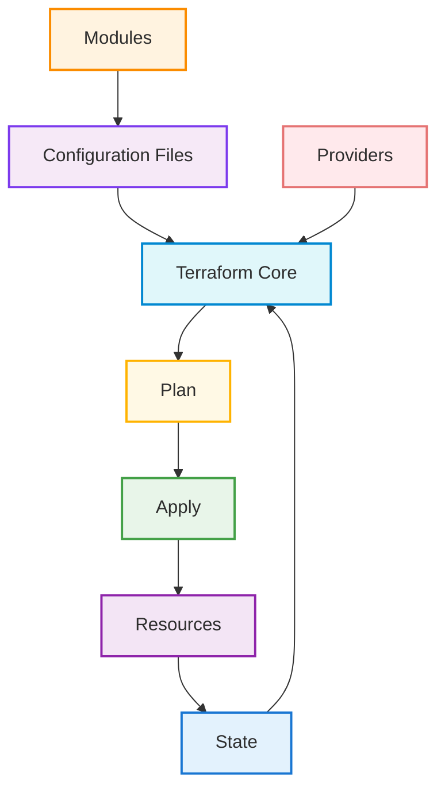
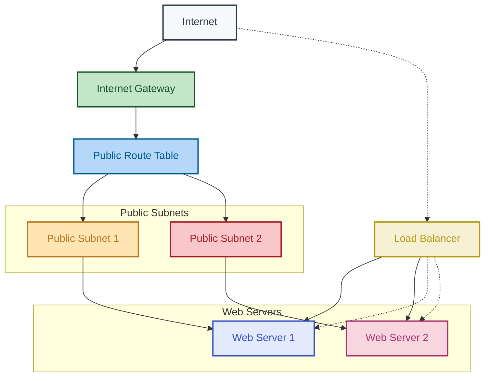
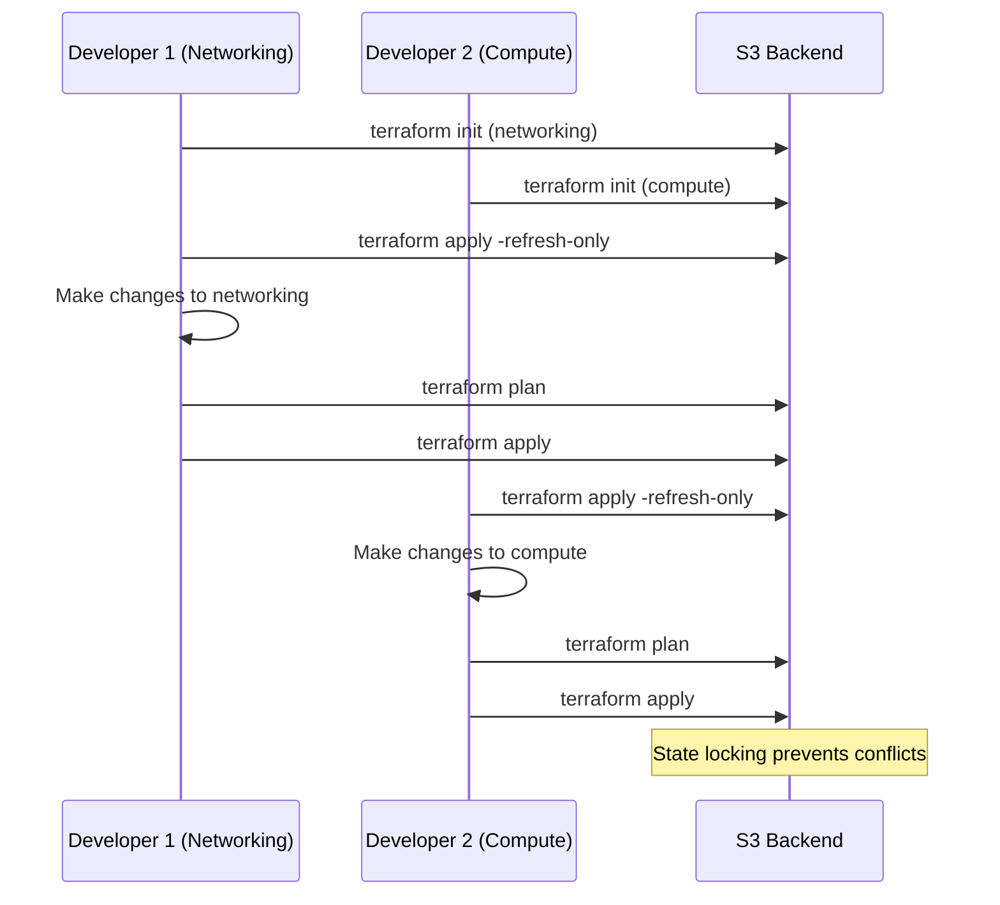

# Terraform for the Impatient: From Novice to Practitioner in Record Time

## 1. Introduction

### 1.1 Why Infrastructure as Code Matters

Picture this: It's 3 AM, and you've just received a frantic call. The production server is down, and nobody remembers exactly how it was configured. Sound familiar? If you've ever experienced this nightmare scenario, you already understand why Infrastructure as Code (IaC) matters.

In the not-so-distant past, infrastructure management was a manual, error-prone process. System administrators would click through user interfaces or run commands on servers, often without documenting their actions. This approach led to "configuration drift," where environments became increasingly different over time, making troubleshooting nearly impossible.

IaC transforms this chaotic approach by treating infrastructure configuration like software code. Instead of manually setting up servers, networks, and databases, you define them in code files that can be version-controlled, tested, and automatically deployed. This paradigm shift brings several game-changing benefits:

1. **Consistency**: Every environment—from development to production—is built from the same code, eliminating the "it works on my machine" problem.
2. **Speed**: Provisioning that once took days or weeks can be accomplished in minutes or hours.
3. **Risk Reduction**: Human error is minimized through automation and testing.
4. **Documentation**: The code itself serves as living documentation of your infrastructure.
5. **Scalability**: Need ten more servers? Change a number in your code and apply it.

Let me share a quick anecdote from my early days as a system administrator. Before adopting IaC, my team spent three full days setting up a new environment for a critical application. Despite our best efforts to follow documentation, subtle differences crept in, causing mysterious bugs that took weeks to resolve. After implementing IaC, we could spin up identical environments in under an hour, with confidence that they would behave consistently.

> **Pause and Reflect**: Think about your current infrastructure management approach. How much time do you spend on repetitive manual tasks? How confident are you that you could recreate your production environment exactly if needed?

The business impact of IaC is substantial. Organizations report 70-80% faster infrastructure deployment, 60% fewer configuration errors, and 30-40% reduction in operational costs after adopting IaC practices. In today's competitive landscape, these efficiencies aren't just nice-to-have—they're essential for survival.

### 1.2 Why Terraform?

With several IaC tools available—including AWS CloudFormation, Azure Resource Manager, Ansible, and Puppet—why should you choose Terraform? The answer lies in Terraform's unique combination of power, flexibility, and usability.

Unlike cloud-specific tools like CloudFormation (AWS) or ARM templates (Azure), Terraform is cloud-agnostic, allowing you to manage resources across multiple providers with a single tool and consistent workflow. This becomes increasingly valuable as organizations adopt multi-cloud strategies.

Compared to configuration management tools like Ansible, Terraform excels at provisioning infrastructure rather than configuring software on existing servers. While Ansible is excellent for application deployment and configuration management, Terraform is purpose-built for creating and managing infrastructure resources.

Here's a quick comparison of Terraform versus other popular IaC tools:


| Feature | Terraform | CloudFormation | Ansible |
| :-- | :-- | :-- | :-- |
| Multi-cloud support | Excellent | AWS only | Good |
| Declarative approach | Yes | Yes | Can be both |
| State management | Explicit | Managed by AWS | Stateless |
| Learning curve | Moderate | Steep | Gentle |
| Community support | Extensive | Good | Extensive |

Terraform's declarative approach means you specify the desired end state of your infrastructure, and Terraform figures out how to achieve it. This is fundamentally different from imperative approaches where you must define each step of the process.

Another key advantage is Terraform's rich ecosystem. The Terraform Registry contains thousands of providers and modules contributed by both HashiCorp (the company behind Terraform) and the community. These ready-made components accelerate development and promote best practices.

> **Pro Tip**: When evaluating IaC tools, consider not just your current cloud provider but your future needs. Terraform's provider-agnostic approach gives you flexibility as your infrastructure evolves, preventing vendor lock-in.

Industry adoption of Terraform has been remarkable. According to recent surveys, over 65% of Fortune 500 companies use Terraform for at least some of their infrastructure management. This widespread adoption means abundant resources, community support, and job opportunities for those skilled in Terraform.

### 1.3 What You'll Learn

This course is designed for the impatient learner—someone who wants to become productive with Terraform quickly without wading through theoretical concepts that don't immediately translate to practical skills. By the end of this article, you'll be able to:

1. Install and configure Terraform for your environment
2. Understand Terraform's core concepts and workflow
3. Write Terraform code to provision real infrastructure
4. Manage state effectively for team collaboration
5. Create reusable modules for infrastructure components
6. Implement best practices for security and maintainability
7. Troubleshoot common issues and optimize performance

We'll follow a practical, example-first approach. Rather than starting with abstract concepts, we'll dive into real-world scenarios and extract the principles as we go. Each section builds on the previous one, gradually increasing in complexity while reinforcing core concepts.

The course is structured around a central project: building a scalable web application infrastructure. We'll start with a simple web server and progressively add components like load balancers, databases, and monitoring—all defined as code with Terraform.

> **Quick Quiz**:
> 1. What is the primary advantage of Infrastructure as Code?
> 2. How does Terraform differ from cloud-specific tools like CloudFormation?
> 3. What type of approach does Terraform use to manage infrastructure?

Let's embark on this journey to Terraform mastery. Remember, the goal isn't just to learn Terraform—it's to transform how you manage infrastructure, making it more reliable, scalable, and maintainable.

## 2. Getting Started with Terraform

### 2.1 Installation and Setup

Before we can start building infrastructure with Terraform, we need to install it on our local machine. The good news is that Terraform has a straightforward installation process across all major operating systems.

#### Why proper installation matters

You might be tempted to skip ahead to writing Terraform code, but a proper installation ensures you'll avoid frustrating errors later. I once spent hours debugging a mysterious issue that turned out to be a PATH configuration problem—a mistake that could have been avoided with a proper installation.

#### What you'll need

- A computer running Windows, macOS, or Linux
- Administrative privileges (for some installation methods)
- Internet access to download Terraform
- A text editor (VS Code, Sublime Text, etc.)
- Basic command-line familiarity


#### How to install Terraform

**For Windows:**

1. Download the appropriate zip file from the [Terraform website](https://www.terraform.io/downloads.html)
2. Extract the zip file to a directory of your choice (e.g., `C:\terraform`)
3. Add this directory to your system PATH
4. Open a new command prompt and verify the installation with `terraform -v`

**For macOS:**

Using Homebrew (recommended):

```bash
brew tap hashicorp/tap
brew install hashicorp/tap/terraform
```

Verify the installation:

```bash
terraform -v
```

**For Linux:**

Using package manager (Ubuntu/Debian example):

```bash
sudo apt-get update && sudo apt-get install -y gnupg software-properties-common
wget -O- https://apt.releases.hashicorp.com/gpg | gpg --dearmor | sudo tee /usr/share/keyrings/hashicorp-archive-keyring.gpg
echo "deb [signed-by=/usr/share/keyrings/hashicorp-archive-keyring.gpg] https://apt.releases.hashicorp.com $(lsb_release -cs) main" | sudo tee /etc/apt/sources.list.d/hashicorp.list
sudo apt-get update && sudo apt-get install terraform
```

Verify the installation:

```bash
terraform -v
```

> **Pro Tip**: Consider using [tfenv](https://github.com/tfutils/tfenv) to manage multiple Terraform versions, especially if you work on different projects with different version requirements. It's like nvm for Node.js or rbenv for Ruby, allowing you to switch between Terraform versions easily.

#### When to update Terraform

Terraform is actively developed, with new versions released regularly. Major versions (e.g., 1.0.0) may introduce breaking changes, while minor versions (e.g., 1.1.0) add features in a backward-compatible way.

As a best practice, pin your Terraform version in your configuration to ensure consistency across your team and CI/CD pipelines:

```hcl
terraform {
  required_version = "~> 1.5.0"
}
```

This example specifies that any 1.5.x version is acceptable, but not 1.6.0 or higher.

> **Pause and Reflect**: Have you successfully installed Terraform? Run `terraform -v` to confirm. If you encounter any issues, consult the [official documentation](https://learn.hashicorp.com/tutorials/terraform/install-cli) for troubleshooting.

### 2.2 Understanding Terraform's Core Concepts

Now that Terraform is installed, let's explore the fundamental concepts that form the foundation of how Terraform works. Understanding these concepts is crucial for effective infrastructure management.

#### Why understanding core concepts matters

I once worked with a team that jumped straight into writing Terraform code without grasping the core concepts. The result? A tangled mess of resources with unclear dependencies and state conflicts that took weeks to untangle. A solid understanding of Terraform's core concepts would have prevented these issues.

#### What are Terraform's core concepts?

**1. Providers**

Providers are plugins that Terraform uses to interact with cloud platforms, SaaS providers, and other APIs. They serve as the bridge between Terraform and the services you want to manage.

Examples of providers include:

- AWS
- Azure
- Google Cloud
- Kubernetes
- GitHub
- DataDog

Here's how you declare a provider in your Terraform configuration:

```hcl
provider "aws" {
  region = "us-west-2"
}
```

This tells Terraform to use the AWS provider and interact with the us-west-2 region.

**2. Resources**

Resources are the most important element in Terraform. They represent infrastructure objects that Terraform will create, update, or delete.

Each resource belongs to a specific provider and has a type and a name. The syntax follows this pattern:

```hcl
resource "provider_resourcetype" "name" {
  attribute1 = value1
  attribute2 = value2
}
```

For example, to create an AWS EC2 instance:

```hcl
resource "aws_instance" "web_server" {
  ami           = "ami-0c55b159cbfafe1f0"
  instance_type = "t2.micro"
  tags = {
    Name = "Web Server"
  }
}
```

**3. State**

Terraform's state is a crucial concept that often confuses beginners. The state is Terraform's way of keeping track of the real-world resources it manages.

When you run `terraform apply`, Terraform:

1. Reads your configuration files
2. Compares them with the current state
3. Determines what changes need to be made
4. Updates the state after making changes

By default, Terraform stores state in a local file called `terraform.tfstate`. However, in team environments, it's best practice to use remote state storage (more on this later).

**4. Modules**

Modules are containers for multiple resources that are used together. Think of them as reusable components or functions in programming.

A module can be as simple as a few resources grouped together or as complex as an entire application stack. Modules promote code reuse and help organize your Terraform configuration.

Here's how you use a module:

```hcl
module "vpc" {
  source = "terraform-aws-modules/vpc/aws"
  version = "3.14.0"
  
  name = "my-vpc"
  cidr = "10.0.0.0/16"
  
  azs             = ["us-west-2a", "us-west-2b", "us-west-2c"]
  private_subnets = ["10.0.1.0/24", "10.0.2.0/24", "10.0.3.0/24"]
  public_subnets  = ["10.0.101.0/24", "10.0.102.0/24", "10.0.103.0/24"]
  
  enable_nat_gateway = true
}
```


#### How these concepts work together

Let's visualize how these concepts interact:



1. You write configuration files that define your desired infrastructure
2. Terraform Core processes these files and communicates with providers
3. Providers interact with external APIs to create, update, or delete resources
4. Terraform tracks the state of these resources
5. Modules help organize and reuse your configuration

> **Pro Tip**: Think of Terraform as a declarative system where you describe what you want (the desired state), not how to get there. This is fundamentally different from imperative approaches like shell scripts where you define each step.

#### When to use each concept

- **Providers**: When you need to interact with a specific platform or service
- **Resources**: When you need to create and manage infrastructure objects
- **State**: Always—it's an integral part of Terraform's operation
- **Modules**: When you want to create reusable components or organize complex configurations

> **Quick Quiz**:
> 1. What is the purpose of a Terraform provider?
> 2. How does Terraform determine what changes to make to your infrastructure?
> 3. What is the benefit of using modules in Terraform?

### 2.3 Your First Terraform Project

Now that we understand the core concepts, let's put them into practice by creating our first Terraform project. We'll start with something simple: deploying a single web server on AWS.

#### Why start with a simple example

Starting with a simple example allows you to experience the full Terraform workflow without getting bogged down in complexity. It's like learning to ride a bicycle with training wheels before tackling a mountain trail.

#### What we'll build

We'll create a basic EC2 instance running a web server that displays a "Hello, World!" message. This example will demonstrate:

1. Defining a provider
2. Creating a resource
3. Running the Terraform workflow
4. Verifying the result

#### How to create your first Terraform project

**Step 1: Create a new directory and initialize it**

```bash
mkdir terraform-webserver
cd terraform-webserver
```

**Step 2: Create a main.tf file**

Using your favorite text editor, create a file named `main.tf` with the following content:

```hcl
# Configure the AWS Provider
provider "aws" {
  region = "us-west-2"
}

# Create a security group for the web server
resource "aws_security_group" "web_sg" {
  name        = "web-server-sg"
  description = "Allow HTTP and SSH traffic"

  ingress {
    from_port   = 80
    to_port     = 80
    protocol    = "tcp"
    cidr_blocks = ["0.0.0.0/0"]
  }

  ingress {
    from_port   = 22
    to_port     = 22
    protocol    = "tcp"
    cidr_blocks = ["0.0.0.0/0"]
  }

  egress {
    from_port   = 0
    to_port     = 0
    protocol    = "-1"
    cidr_blocks = ["0.0.0.0/0"]
  }
}

# Create an EC2 instance
resource "aws_instance" "web_server" {
  ami           = "ami-0c55b159cbfafe1f0"  # Amazon Linux 2 AMI (adjust for your region)
  instance_type = "t2.micro"
  
  security_groups = [aws_security_group.web_sg.name]
  
  user_data = <<-EOF
              #!/bin/bash
              yum update -y
              yum install -y httpd
              systemctl start httpd
              systemctl enable httpd
              echo "<h1>Hello, World from Terraform!</h1>" > /var/www/html/index.html
              EOF
  
  tags = {
    Name = "Terraform-WebServer"
  }
}

# Output the public IP address
output "web_server_ip" {
  value = aws_instance.web_server.public_ip
}
```

Let's break down what this configuration does:

1. The `provider` block configures the AWS provider with the specified region
2. The `aws_security_group` resource creates a security group that allows HTTP and SSH traffic
3. The `aws_instance` resource creates an EC2 instance with a user data script that installs and configures Apache
4. The `output` block defines a value that Terraform will display after applying the configuration

**Step 3: Initialize Terraform**

```bash
terraform init
```

This command initializes your Terraform working directory, downloads the AWS provider, and sets up the backend.

**Step 4: Plan the changes**

```bash
terraform plan
```

This command shows you what Terraform will do before making any changes. It's a preview of the actions Terraform will take to create your infrastructure.

**Step 5: Apply the changes**

```bash
terraform apply
```

When prompted, type `yes` to confirm. Terraform will create the security group and EC2 instance according to your configuration.

After the apply completes, Terraform will output the public IP address of your web server. You can visit this IP address in a web browser to see your "Hello, World!" message.

**Step 6: Destroy the resources (when you're done)**

```bash
terraform destroy
```

When prompted, type `yes` to confirm. This will remove all the resources Terraform created, avoiding unnecessary AWS charges.

> **Pro Tip**: Always run `terraform plan` before `terraform apply` to review the changes Terraform will make. This helps prevent unexpected modifications to your infrastructure.

#### When to use this approach

This simple example is perfect for:

- Learning the Terraform workflow
- Testing your AWS credentials
- Understanding basic resource creation
- Demonstrating the power of infrastructure as code

As you become more comfortable with Terraform, you'll build more complex infrastructures with multiple resources, variables, and modules.

> **Pause and Reflect**: Did your web server deploy successfully? If not, check the error messages for clues. Common issues include incorrect AWS credentials, invalid AMI IDs, or networking restrictions.

## 3. Terraform Basics in Action

### 3.1 Terraform Configuration Language

Now that you've created your first Terraform project, let's dive deeper into the Terraform Configuration Language (HCL), which is the language you use to define your infrastructure.

#### Why understanding HCL matters

HCL is designed to be both human-readable and machine-friendly. A solid grasp of HCL syntax will make your Terraform code more efficient, maintainable, and less prone to errors. I've seen teams struggle with complex infrastructure because they didn't take the time to understand HCL fundamentals.

#### What is HCL?

HCL (HashiCorp Configuration Language) is a declarative language specifically designed for defining infrastructure. It's similar to JSON but with added features that make it more suitable for configuration, such as comments, variables, and expressions.

Key elements of HCL include:

**1. Blocks**

Blocks are containers for configuration that group related settings. They have a type, optional labels, and a body containing arguments:

```hcl
block_type "label1" "label2" {
  // Block body
  argument1 = value1
  argument2 = value2
}
```

Common block types include:

- `resource`: Defines infrastructure resources
- `provider`: Configures a provider
- `variable`: Declares input variables
- `output`: Defines output values
- `module`: Includes a module
- `data`: Retrieves data from existing resources

**2. Arguments**

Arguments assign values to names within blocks:

```hcl
resource "aws_instance" "example" {
  ami           = "ami-0c55b159cbfafe1f0"
  instance_type = "t2.micro"
}
```

Here, `ami` and `instance_type` are arguments with string values.

**3. Expressions**

Expressions represent values:

```hcl
resource "aws_instance" "example" {
  instance_type = var.instance_type
  count         = var.environment == "production" ? 2 : 1
  tags          = {
    Name        = "${var.prefix}-instance"
  }
}
```

This example shows:

- Reference to a variable: `var.instance_type`
- Conditional expression: `var.environment == "production" ? 2 : 1`
- String interpolation: `"${var.prefix}-instance"`

**4. Comments**

HCL supports both single-line and multi-line comments:

```hcl
# This is a single-line comment

/* This is
   a multi-line
   comment */
```


#### How to write effective HCL

Let's look at a more comprehensive example that demonstrates HCL features:

```hcl
# Define variables
variable "region" {
  description = "The AWS region to deploy resources"
  type        = string
  default     = "us-west-2"
}

variable "instance_count" {
  description = "Number of instances to create"
  type        = number
  default     = 1
}

variable "instance_type" {
  description = "Type of EC2 instance"
  type        = string
  default     = "t2.micro"
}

# Configure the provider
provider "aws" {
  region = var.region
}

# Create a security group
resource "aws_security_group" "web" {
  name        = "web-server-sg"
  description = "Allow HTTP traffic"

  ingress {
    from_port   = 80
    to_port     = 80
    protocol    = "tcp"
    cidr_blocks = ["0.0.0.0/0"]
  }

  egress {
    from_port   = 0
    to_port     = 0
    protocol    = "-1"
    cidr_blocks = ["0.0.0.0/0"]
  }

  tags = {
    Name = "web-server-security-group"
    Environment = "development"
  }
}

# Create EC2 instances
resource "aws_instance" "web" {
  count         = var.instance_count
  ami           = "ami-0c55b159cbfafe1f0"
  instance_type = var.instance_type
  
  security_groups = [aws_security_group.web.name]
  
  user_data = <<-EOF
              #!/bin/bash
              echo "<h1>Hello from Instance ${count.index + 1}</h1>" > index.html
              nohup python -m SimpleHTTPServer 80 &
              EOF
  
  tags = {
    Name = "web-server-${count.index + 1}"
  }
}

# Define outputs
output "instance_ips" {
  description = "Public IPs of the web servers"
  value       = aws_instance.web[*].public_ip
}
```

This configuration:

1. Defines variables for customization
2. Configures the AWS provider
3. Creates a security group for web traffic
4. Launches multiple EC2 instances based on the `instance_count` variable
5. Outputs the public IPs of the instances

> **Pro Tip**: Use consistent formatting in your HCL files. The `terraform fmt` command automatically formats your configuration files according to the standard style conventions, making your code more readable and consistent.

#### When to use different HCL features

- **Variables**: When you need to parameterize your configuration or make it reusable
- **Count**: When you need multiple similar resources
- **Conditional expressions**: When resource creation or configuration depends on conditions
- **String interpolation**: When you need to combine strings with variable values
- **Heredoc syntax (`<<-EOF`)**: When you need to include multi-line strings, like scripts

> **Quick Quiz**:
> 1. What is the difference between a block and an argument in HCL?
> 2. How would you reference a variable named "environment" in your configuration?
> 3. What does the `count` parameter do in a resource block?

### 3.2 Managing Resources

Resources are the heart of Terraform—they represent the infrastructure components you want to create, modify, or delete. Let's explore how to effectively manage resources throughout their lifecycle.

#### Why resource management matters

Proper resource management ensures that your infrastructure evolves predictably and reliably. Without a systematic approach, you risk creating orphaned resources, unexpected dependencies, or difficult-to-maintain configurations.

#### What are resources in Terraform?

A resource in Terraform represents an infrastructure object, such as a virtual machine, database, or network interface. Each resource is associated with a specific provider and has a type and a name.

The basic syntax for a resource is:

```hcl
resource "provider_resourcetype" "name" {
  attribute1 = value1
  attribute2 = value2
}
```

For example:

```hcl
resource "aws_s3_bucket" "logs" {
  bucket = "my-app-logs"
  acl    = "private"
}
```


#### How to manage resources effectively

**1. Creating Resources**

To create a resource, you define it in your configuration and run `terraform apply`. Let's look at a more complex example that creates multiple related resources:

```hcl
# Create a VPC
resource "aws_vpc" "main" {
  cidr_block = "10.0.0.0/16"
  
  tags = {
    Name = "main-vpc"
  }
}

# Create a subnet within the VPC
resource "aws_subnet" "public" {
  vpc_id            = aws_vpc.main.id
  cidr_block        = "10.0.1.0/24"
  availability_zone = "us-west-2a"
  
  tags = {
    Name = "public-subnet"
  }
}

# Create an internet gateway
resource "aws_internet_gateway" "gw" {
  vpc_id = aws_vpc.main.id
  
  tags = {
    Name = "main-igw"
  }
}

# Create a route table
resource "aws_route_table" "public" {
  vpc_id = aws_vpc.main.id
  
  route {
    cidr_block = "0.0.0.0/0"
    gateway_id = aws_internet_gateway.gw.id
  }
  
  tags = {
    Name = "public-route-table"
  }
}

# Associate the route table with the subnet
resource "aws_route_table_association" "public" {
  subnet_id      = aws_subnet.public.id
  route_table_id = aws_route_table.public.id
}
```

This configuration creates a VPC with a public subnet, internet gateway, and route table. Notice how resources reference each other using the `resource_type.name.attribute` syntax.

**2. Updating Resources**

To update a resource, modify its configuration and run `terraform apply`. Terraform will determine which attributes need to change and update only those parts.

For example, to add tags to our VPC:

```hcl
resource "aws_vpc" "main" {
  cidr_block = "10.0.0.0/16"
  
  tags = {
    Name        = "main-vpc"
    Environment = "production"
    Project     = "example"
  }
}
```

When you apply this change, Terraform will only update the tags without recreating the VPC.

**3. Destroying Resources**

To destroy resources, you can either:

- Remove them from your configuration and run `terraform apply`
- Keep the configuration and run `terraform destroy`

**4. Resource Dependencies**

Terraform automatically determines dependencies between resources based on references in your configuration. In our VPC example, Terraform knows that the subnet depends on the VPC because it references `aws_vpc.main.id`.

Sometimes, you need to explicitly define dependencies using the `depends_on` meta-argument:

```hcl
resource "aws_instance" "web" {
  ami           = "ami-0c55b159cbfafe1f0"
  instance_type = "t2.micro"
  
  depends_on = [
    aws_route_table_association.public
  ]
}
```

This ensures that the EC2 instance is created only after the route table association is complete.

**5. Resource Meta-Arguments**

Terraform provides several meta-arguments that change how resources are created:

- `count`: Create multiple instances of a resource
- `for_each`: Create multiple instances with different configurations
- `provider`: Specify a non-default provider
- `lifecycle`: Control how Terraform handles resource updates
- `depends_on`: Specify explicit dependencies

Example using `count`:

```hcl
resource "aws_instance" "web" {
  count         = 3
  ami           = "ami-0c55b159cbfafe1f0"
  instance_type = "t2.micro"
  
  tags = {
    Name = "web-server-${count.index + 1}"
  }
}
```

This creates three EC2 instances with names "web-server-1", "web-server-2", and "web-server-3".

Example using `lifecycle`:

```hcl
resource "aws_instance" "database" {
  ami           = "ami-0c55b159cbfafe1f0"
  instance_type = "t2.micro"
  
  lifecycle {
    prevent_destroy = true
    ignore_changes  = [tags]
  }
}
```

This configuration prevents accidental destruction of the database instance and ignores changes to tags during updates.

> **Pro Tip**: Use the `terraform state list` command to see all resources in your state, and `terraform state show [resource]` to inspect a specific resource's current state. These commands are invaluable for troubleshooting.

#### When to use different resource management techniques

- **Simple resources**: For standalone components with few dependencies
- **Resource references**: When resources depend on each other
- **Count**: For identical resources that differ only by an index
- **For_each**: For similar resources with different configurations
- **Lifecycle rules**: For critical resources that need special handling during updates or destruction

> **Pause and Reflect**: Think about your current infrastructure. How would you model it using Terraform resources? Which resources would have dependencies on others?

### 3.3 Practical Example: Building a Simple Web Infrastructure

Let's put our knowledge into practice by building a more complete web infrastructure. This example will create a VPC, subnets, security groups, and EC2 instances running a simple web application.

#### Why build a complete example

A complete example helps solidify your understanding by showing how different resources work together to create a functional infrastructure. It's like moving from learning individual chess pieces to playing an actual game.

#### What we'll build

We'll create:

1. A VPC with public and private subnets
2. Security groups for web and database tiers
3. EC2 instances for web servers
4. A load balancer to distribute traffic
5. Outputs for accessing the application

#### How to build the web infrastructure

Create a new directory for this project and add the following files:

**main.tf**:

```hcl
provider "aws" {
  region = var.region
}

# Create a VPC
resource "aws_vpc" "main" {
  cidr_block           = var.vpc_cidr
  enable_dns_hostnames = true
  
  tags = {
    Name = "${var.project_name}-vpc"
  }
}

# Create public subnets
resource "aws_subnet" "public" {
  count             = length(var.public_subnet_cidrs)
  vpc_id            = aws_vpc.main.id
  cidr_block        = var.public_subnet_cidrs[count.index]
  availability_zone = var.availability_zones[count.index]
  
  map_public_ip_on_launch = true
  
  tags = {
    Name = "${var.project_name}-public-subnet-${count.index + 1}"
  }
}

# Create private subnets
resource "aws_subnet" "private" {
  count             = length(var.private_subnet_cidrs)
  vpc_id            = aws_vpc.main.id
  cidr_block        = var.private_subnet_cidrs[count.index]
  availability_zone = var.availability_zones[count.index]
  
  tags = {
    Name = "${var.project_name}-private-subnet-${count.index + 1}"
  }
}

# Create Internet Gateway
resource "aws_internet_gateway" "igw" {
  vpc_id = aws_vpc.main.id
  
  tags = {
    Name = "${var.project_name}-igw"
  }
}

# Create public route table
resource "aws_route_table" "public" {
  vpc_id = aws_vpc.main.id
  
  route {
    cidr_block = "0.0.0.0/0"
    gateway_id = aws_internet_gateway.igw.id
  }
  
  tags = {
    Name = "${var.project_name}-public-rt"
  }
}

# Associate public subnets with public route table
resource "aws_route_table_association" "public" {
  count          = length(var.public_subnet_cidrs)
  subnet_id      = aws_subnet.public[count.index].id
  route_table_id = aws_route_table.public.id
}

# Create security group for web servers
resource "aws_security_group" "web" {
  name        = "${var.project_name}-web-sg"
  description = "Security group for web servers"
  vpc_id      = aws_vpc.main.id
  
  ingress {
    from_port   = 80
    to_port     = 80
    protocol    = "tcp"
    cidr_blocks = ["0.0.0.0/0"]
  }
  
  ingress {
    from_port   = 22
    to_port     = 22
    protocol    = "tcp"
    cidr_blocks = [var.admin_cidr]
  }
  
  egress {
    from_port   = 0
    to_port     = 0
    protocol    = "-1"
    cidr_blocks = ["0.0.0.0/0"]
  }
  
  tags = {
    Name = "${var.project_name}-web-sg"
  }
}

# Create web servers
resource "aws_instance" "web" {
  count         = var.web_instance_count
  ami           = var.web_ami
  instance_type = var.web_instance_type
  subnet_id     = aws_subnet.public[count.index % length(var.public_subnet_cidrs)].id
  
  vpc_security_group_ids = [aws_security_group.web.id]
  key_name               = var.key_name
  
  user_data = <<-EOF
              #!/bin/bash
              yum update -y
              yum install -y httpd
              systemctl start httpd
              systemctl enable httpd
              echo "<h1>Hello from Web Server ${count.index + 1}</h1>" > /var/www/html/index.html
              EOF
  
  tags = {
    Name = "${var.project_name}-web-${count.index + 1}"
  }
}

# Create security group for load balancer
resource "aws_security_group" "alb" {
  name        = "${var.project_name}-alb-sg"
  description = "Security group for application load balancer"
  vpc_id      = aws_vpc.main.id
  
  ingress {
    from_port   = 80
    to_port     = 80
    protocol    = "tcp"
    cidr_blocks = ["0.0.0.0/0"]
  }
  
  egress {
    from_port   = 0
    to_port     = 0
    protocol    = "-1"
    cidr_blocks = ["0.0.0.0/0"]
  }
  
  tags = {
    Name = "${var.project_name}-alb-sg"
  }
}

# Create Application Load Balancer
resource "aws_lb" "web" {
  name               = "${var.project_name}-alb"
  internal           = false
  load_balancer_type = "application"
  security_groups    = [aws_security_group.alb.id]
  subnets            = aws_subnet.public[*].id
  
  tags = {
    Name = "${var.project_name}-alb"
  }
}

# Create target group
resource "aws_lb_target_group" "web" {
  name     = "${var.project_name}-tg"
  port     = 80
  protocol = "HTTP"
  vpc_id   = aws_vpc.main.id
  
  health_check {
    path                = "/"
    interval            = 30
    timeout             = 5
    healthy_threshold   = 2
    unhealthy_threshold = 2
  }
}

# Register instances with target group
resource "aws_lb_target_group_attachment" "web" {
  count            = var.web_instance_count
  target_group_arn = aws_lb_target_group.web.arn
  target_id        = aws_instance.web[count.index].id
  port             = 80
}

# Create listener
resource "aws_lb_listener" "web" {
  load_balancer_arn = aws_lb.web.arn
  port              = 80
  protocol          = "HTTP"
  
  default_action {
    type             = "forward"
    target_group_arn = aws_lb_target_group.web.arn
  }
}
```

**variables.tf**:

```hcl
variable "region" {
  description = "AWS region"
  type        = string
  default     = "us-west-2"
}

variable "project_name" {
  description = "Name of the project"
  type        = string
  default     = "web-app"
}

variable "vpc_cidr" {
  description = "CIDR block for VPC"
  type        = string
  default     = "10.0.0.0/16"
}

variable "public_subnet_cidrs" {
  description = "CIDR blocks for public subnets"
  type        = list(string)
  default     = ["10.0.1.0/24", "10.0.2.0/24"]
}

variable "private_subnet_cidrs" {
  description = "CIDR blocks for private subnets"
  type        = list(string)
  default     = ["10.0.3.0/24", "10.0.4.0/24"]
}

variable "availability_zones" {
  description = "Availability zones"
  type        = list(string)
  default     = ["us-west-2a", "us-west-2b"]
}

variable "admin_cidr" {
  description = "CIDR block for admin access"
  type        = string
  default     = "0.0.0.0/0"  # In production, restrict this to your IP
}

variable "web_instance_count" {
  description = "Number of web instances"
  type        = number
  default     = 2
}

variable "web_ami" {
  description = "AMI for web instances"
  type        = string
  default     = "ami-0c55b159cbfafe1f0"  # Amazon Linux 2 (adjust for your region)
}

variable "web_instance_type" {
  description = "Instance type for web servers"
  type        = string
  default     = "t2.micro"
}

variable "key_name" {
  description = "Key pair name"
  type        = string
  default     = ""  # Set your key pair name here
}
```

**outputs.tf**:

```hcl
output "vpc_id" {
  description = "ID of the VPC"
  value       = aws_vpc.main.id
}

output "web_instance_ips" {
  description = "Public IPs of web instances"
  value       = aws_instance.web[*].public_ip
}

output "load_balancer_dns" {
  description = "DNS name of the load balancer"
  value       = aws_lb.web.dns_name
}
```

To deploy this infrastructure:

1. Initialize Terraform:

```bash
terraform init
```

2. Review the plan:

```bash
terraform plan
```

3. Apply the configuration:

```bash
terraform apply
```

4. When finished, destroy the resources:

```bash
terraform destroy
```


Let's visualize the infrastructure we've created:



#### When to use this approach

This example is suitable for:

- Learning how to create a multi-tier architecture
- Understanding resource dependencies
- Practicing with variables and outputs
- Testing load balancing and high availability concepts

In a production environment, you would likely add more components such as:

- Auto Scaling Groups for dynamic scaling
- RDS for database services
- CloudWatch for monitoring
- Route 53 for DNS management

> **Pro Tip**: When building complex infrastructures, start with a diagram or sketch of what you want to create. This helps you identify the resources you need and their relationships before writing any code.

## 4. Working with Terraform State

### 4.1 Understanding State Management

Terraform's state is one of its most important yet often misunderstood concepts. Let's demystify state management and understand why it's crucial for effective infrastructure management.

#### Why state management matters

I once consulted for a company where multiple team members were running Terraform from their local machines without proper state management. The result? Resources were constantly being recreated or modified unexpectedly, causing production outages and data loss. Proper state management would have prevented these issues.

#### What is Terraform state?

Terraform state is a snapshot of your infrastructure that maps Terraform resources to real-world resources. It serves several critical purposes:

1. **Mapping to Real Resources**: Terraform uses state to map resources in your configuration to real-world resources. This mapping allows Terraform to know what exists and what needs to be created, updated, or deleted.
2. **Metadata Storage**: State stores metadata about your resources, such as dependencies between resources.
3. **Performance Optimization**: For large infrastructures, Terraform uses state to optimize performance by avoiding unnecessary API calls to check resource status.
4. **Concurrency Control**: When working in teams, state helps prevent concurrent modifications that could conflict with each other.

By default, Terraform stores state in a local file named `terraform.tfstate`. This file is in JSON format and contains sensitive information, so it should be handled carefully.

Here's a simplified example of what a state file might contain:

```json
{
  "version": 4,
  "terraform_version": "1.5.0",
  "serial": 3,
  "lineage": "3f8a5c5c-5c1c-4f1c-8c5c-5c1c4f1c8c5c",
  "outputs": {
    "instance_ip": {
      "value": "203.0.113.10",
      "type": "string"
    }
  },
  "resources": [
    {
      "mode": "managed",
      "type": "aws_instance",
      "name": "example",
      "provider": "provider[\"registry.terraform.io/hashicorp/aws\"]",
      "instances": [
        {
          "schema_version": 1,
          "attributes": {
            "ami": "ami-0c55b159cbfafe1f0",
            "instance_type": "t2.micro",
            "id": "i-1234567890abcdef0",
            "private_ip": "10.0.1.10",
            "public_ip": "203.0.113.10",
            "tags": {
              "Name": "example-instance"
            }
          }
        }
      ]
    }
  ]
}
```


#### How state works

Let's understand the state workflow:

1. When you run `terraform apply`, Terraform:
    - Reads your configuration files
    - Reads the current state
    - Determines the differences
    - Makes API calls to create, update, or delete resources
    - Updates the state file with the new resource information
2. If you modify your configuration and run `terraform apply` again, Terraform:
    - Compares the updated configuration with the current state
    - Determines what changes are needed
    - Makes only the necessary API calls
    - Updates the state file again

This process ensures that Terraform makes only the changes required to match your configuration, rather than recreating everything from scratch each time.

#### When to use different state management approaches

**Local State**:

- For personal projects or learning
- When you're the only one managing the infrastructure
- For non-critical environments

**Remote State**:

- For team environments
- For production or critical infrastructure
- When you need state locking to prevent concurrent modifications
- When you want to keep sensitive information out of version control

> **Pro Tip**: Never edit the state file manually. If you need to modify state, use Terraform commands like `terraform state mv`, `terraform state rm`, or `terraform import`.

### 4.2 Remote State Configuration

For team environments or production workloads, storing state locally is not sufficient. Remote state storage provides better security, collaboration, and reliability.

#### Why use remote state

Remote state offers several advantages over local state:

1. **Collaboration**: Multiple team members can work on the same infrastructure without state conflicts.
2. **Security**: Sensitive information in the state file can be better protected.
3. **Reliability**: Remote backends often provide features like versioning and backup.
4. **State Locking**: Prevents concurrent modifications that could corrupt the state.

#### What remote backends are available

Terraform supports various remote backends, including:

- **AWS S3**: Store state in an S3 bucket with optional DynamoDB locking
- **Azure Storage**: Use Azure Blob Storage for state
- **Google Cloud Storage**: Store state in GCS buckets
- **HashiCorp Terraform Cloud/Enterprise**: Managed service with additional features
- **HashiCorp Consul**: Distributed key-value store
- **PostgreSQL**: Store state in a PostgreSQL database
- **HTTP**: Custom HTTP endpoint for state storage


#### How to configure remote state

Let's set up remote state using AWS S3 with DynamoDB for state locking:

**Step 1: Create the S3 bucket and DynamoDB table**

You can create these resources manually or using Terraform. Here's a Terraform configuration to create them:

```hcl
provider "aws" {
  region = "us-west-2"
}

resource "aws_s3_bucket" "terraform_state" {
  bucket = "my-terraform-state-bucket"
  
  # Enable versioning for state history
  versioning {
    enabled = true
  }
  
  # Enable server-side encryption
  server_side_encryption_configuration {
    rule {
      apply_server_side_encryption_by_default {
        sse_algorithm = "AES256"
      }
    }
  }
}

resource "aws_dynamodb_table" "terraform_locks" {
  name         = "terraform-locks"
  billing_mode = "PAY_PER_REQUEST"
  hash_key     = "LockID"
  
  attribute {
    name = "LockID"
    type = "S"
  }
}
```

Apply this configuration to create the resources:

```bash
terraform init
terraform apply
```

**Step 2: Configure the backend in your Terraform configuration**

Once the S3 bucket and DynamoDB table are created, you can configure your main Terraform project to use them:

```hcl
terraform {
  backend "s3" {
    bucket         = "my-terraform-state-bucket"
    key            = "prod/terraform.tfstate"
    region         = "us-west-2"
    dynamodb_table = "terraform-locks"
    encrypt        = true
  }
}

# Rest of your configuration...
```

**Step 3: Initialize Terraform with the new backend**

```bash
terraform init
```

Terraform will prompt you to migrate your local state to the remote backend. Type "yes" to proceed.

#### When to use different remote backends

- **AWS S3**: When you're primarily using AWS and want a simple, reliable solution
- **Azure Storage**: When your infrastructure is primarily in Azure
- **Google Cloud Storage**: When you're using GCP
- **Terraform Cloud/Enterprise**: When you need advanced features like workspace management, policy enforcement, and team collaboration
- **Consul**: When you already use Consul for service discovery or configuration
- **PostgreSQL**: When you want to store state in a database you control

> **Pro Tip**: Use different state file paths (the `key` parameter in S3 backend) for different environments (dev, staging, prod) to keep them isolated. For example, `dev/terraform.tfstate`, `staging/terraform.tfstate`, and `prod/terraform.tfstate`.

### 4.3 Practical Example: Team Collaboration with Remote State

Let's put our knowledge of remote state into practice with a real-world example of team collaboration.

#### Why team collaboration matters

In enterprise environments, multiple teams often need to work on different parts of the infrastructure simultaneously. Without proper state management, this can lead to conflicts, overwrites, and inconsistencies.

#### What we'll build

We'll create a setup that allows multiple team members to work on the same infrastructure without conflicts. This includes:

1. Remote state configuration with S3 and DynamoDB
2. State organization for different components
3. Output sharing between components

#### How to implement team collaboration

**Step 1: Create a backend configuration file**

Create a file named `backend.tf` with the following content:

```hcl
terraform {
  backend "s3" {
    bucket         = "my-company-terraform-state"
    region         = "us-west-2"
    encrypt        = true
    dynamodb_table = "terraform-locks"
  }
}
```

**Step 2: Organize your infrastructure into components**

Create separate directories for different infrastructure components:

```
infrastructure/
├── networking/
│   ├── main.tf
│   ├── variables.tf
│   ├── outputs.tf
│   └── backend.tf
├── compute/
│   ├── main.tf
│   ├── variables.tf
│   ├── outputs.tf
│   └── backend.tf
└── database/
    ├── main.tf
    ├── variables.tf
    ├── outputs.tf
    └── backend.tf
```

**Step 3: Configure unique state paths for each component**

In each component's `backend.tf`, specify a unique key:

For networking:

```hcl
terraform {
  backend "s3" {
    bucket         = "my-company-terraform-state"
    key            = "prod/networking/terraform.tfstate"
    region         = "us-west-2"
    encrypt        = true
    dynamodb_table = "terraform-locks"
  }
}
```

For compute:

```hcl
terraform {
  backend "s3" {
    bucket         = "my-company-terraform-state"
    key            = "prod/compute/terraform.tfstate"
    region         = "us-west-2"
    encrypt        = true
    dynamodb_table = "terraform-locks"
  }
}
```

For database:

```hcl
terraform {
  backend "s3" {
    bucket         = "my-company-terraform-state"
    key            = "prod/database/terraform.tfstate"
    region         = "us-west-2"
    encrypt        = true
    dynamodb_table = "terraform-locks"
  }
}
```

**Step 4: Share outputs between components using data sources**

To allow components to reference resources created by other components, use the `terraform_remote_state` data source:

In the compute component's `main.tf`:

```hcl
# Retrieve networking information from remote state
data "terraform_remote_state" "networking" {
  backend = "s3"
  config = {
    bucket = "my-company-terraform-state"
    key    = "prod/networking/terraform.tfstate"
    region = "us-west-2"
  }
}

# Create EC2 instances in the subnets created by the networking component
resource "aws_instance" "web" {
  count         = 2
  ami           = "ami-0c55b159cbfafe1f0"
  instance_type = "t2.micro"
  subnet_id     = data.terraform_remote_state.networking.outputs.public_subnet_ids[count.index]
  
  tags = {
    Name = "web-server-${count.index + 1}"
  }
}
```

In the networking component's `outputs.tf`:

```hcl
output "vpc_id" {
  description = "ID of the VPC"
  value       = aws_vpc.main.id
}

output "public_subnet_ids" {
  description = "IDs of the public subnets"
  value       = aws_subnet.public[*].id
}

output "private_subnet_ids" {
  description = "IDs of the private subnets"
  value       = aws_subnet.private[*].id
}
```

**Step 5: Implement a workflow for team collaboration**

1. Each team member initializes their component:

```bash
cd infrastructure/networking
terraform init
```

2. Before making changes, always pull the latest state:

```bash
terraform apply -refresh-only
```

3. Make changes and create a plan:

```bash
terraform plan -out=plan.out
```

4. Review the plan with team members if necessary
5. Apply the changes:

```bash
terraform apply plan.out
```


Let's visualize this workflow:



> **Pro Tip**: Always use meaningful commit messages when checking in Terraform configuration changes, and consider using pull requests for code review before applying changes to production environments.

#### When to use this approach

This team collaboration approach is ideal for:

- Organizations with multiple teams managing different infrastructure components
- Projects where different components have different update schedules
- Environments where you need to maintain separation of concerns
- Cases where you want to limit blast radius of changes


## 5. Variables, Outputs, and Dependencies

### 5.1 Working with Variables

Variables are the foundation of reusable and flexible Terraform configurations. They allow you to parameterize your infrastructure code, making it adaptable to different environments and use cases.

#### Why variables matter

Without variables, your Terraform configurations become rigid and difficult to maintain. I've seen teams create separate configuration files for each environment, leading to code duplication and inconsistencies. Variables solve this problem by allowing you to write once and deploy anywhere.

#### What are Terraform variables?

Variables in Terraform are parameters that allow external input into your configuration. They make your configurations more flexible and reusable by allowing values to be set at runtime rather than hardcoded in the configuration.

There are several types of variables in Terraform:

**1. String Variables**

```
variable "region" {
  description = "The AWS region to deploy resources"
  type        = string
  default     = "us-west-2"
}
```

**2. Number Variables**

```
variable "instance_count" {
  description = "Number of instances to create"
  type        = number
  default     = 2
  
  validation {
    condition     = var.instance_count > 0 && var.instance_count <= 10
    error_message = "Instance count must be between 1 and 10."
  }
}
```

**3. Boolean Variables**

```
variable "enable_monitoring" {
  description = "Enable CloudWatch monitoring"
  type        = bool
  default     = true
}
```

**4. List Variables**

```
variable "availability_zones" {
  description = "List of availability zones"
  type        = list(string)
  default     = ["us-west-2a", "us-west-2b", "us-west-2c"]
}
```

**5. Map Variables**

```
variable "instance_types" {
  description = "Instance types for different environments"
  type        = map(string)
  default = {
    dev  = "t2.micro"
    test = "t2.small"
    prod = "t3.medium"
  }
}
```

**6. Object Variables**

```
variable "database_config" {
  description = "Database configuration"
  type = object({
    engine         = string
    engine_version = string
    instance_class = string
    allocated_storage = number
  })
  default = {
    engine         = "mysql"
    engine_version = "8.0"
    instance_class = "db.t3.micro"
    allocated_storage = 20
  }
}
```


#### How to use variables effectively

**1. Variable Declaration**

Variables are typically declared in a `variables.tf` file:

```
variable "environment" {
  description = "Environment name (dev, test, prod)"
  type        = string
  
  validation {
    condition     = contains(["dev", "test", "prod"], var.environment)
    error_message = "Environment must be dev, test, or prod."
  }
}

variable "project_name" {
  description = "Name of the project"
  type        = string
}

variable "instance_config" {
  description = "Configuration for EC2 instances"
  type = object({
    count = number
    type  = string
    ami   = string
  })
  default = {
    count = 2
    type  = "t2.micro"
    ami   = "ami-0c55b159cbfafe1f0"
  }
}
```

**2. Using Variables in Configuration**

Reference variables in your configuration using the `var.` prefix:

```
resource "aws_instance" "web" {
  count         = var.instance_config.count
  ami           = var.instance_config.ami
  instance_type = var.instance_config.type
  
  tags = {
    Name        = "${var.project_name}-web-${count.index + 1}"
    Environment = var.environment
  }
}
```

**3. Setting Variable Values**

There are several ways to set variable values:

**Using terraform.tfvars files:**

```
# terraform.tfvars
environment  = "prod"
project_name = "my-web-app"
instance_config = {
  count = 3
  type  = "t3.small"
  ami   = "ami-0c55b159cbfafe1f0"
}
```

**Using environment-specific .tfvars files:**

```
# prod.tfvars
environment  = "prod"
project_name = "my-web-app"
instance_config = {
  count = 5
  type  = "t3.medium"
  ami   = "ami-0c55b159cbfafe1f0"
}
```

Apply with: `terraform apply -var-file="prod.tfvars"`

**Using command-line flags:**

```
terraform apply -var="environment=prod" -var="project_name=my-app"
```

**Using environment variables:**

```
export TF_VAR_environment="prod"
export TF_VAR_project_name="my-app"
terraform apply
```


#### When to use different variable approaches

- **terraform.tfvars**: For default values shared across environments
- **Environment-specific .tfvars files**: For environment-specific configurations
- **Command-line vars**: For one-off values or CI/CD pipelines
- **Environment variables**: For sensitive values or automated deployments
- **Variable validation**: For ensuring input values meet specific criteria

> **Pro Tip**: Use variable validation to catch configuration errors early. This prevents deployment failures and makes your configurations more robust.

### 5.2 Output Values

Output values make information about your infrastructure available for use by other Terraform configurations or for display to users. They're essential for creating modular and interconnected infrastructure components.

#### Why outputs matter

Outputs serve as the interface between different parts of your infrastructure. Without them, you'd have to hardcode resource IDs and other values, making your configurations brittle and difficult to maintain.

#### What are output values?

Outputs are a way to return values from a Terraform configuration. They can expose information about resources you've created, such as IP addresses, DNS names, or resource IDs.

Here's the basic syntax for an output:

```
output "name" {
  description = "Description of the output"
  value       = expression
  sensitive   = false  # Set to true for sensitive values
}
```


#### How to create effective outputs

**1. Basic Outputs**

```
output "vpc_id" {
  description = "ID of the VPC"
  value       = aws_vpc.main.id
}

output "web_server_ips" {
  description = "Public IP addresses of web servers"
  value       = aws_instance.web[*].public_ip
}

output "database_endpoint" {
  description = "RDS instance endpoint"
  value       = aws_db_instance.main.endpoint
  sensitive   = true
}
```

**2. Complex Outputs**

```
output "load_balancer_info" {
  description = "Load balancer information"
  value = {
    dns_name = aws_lb.web.dns_name
    zone_id  = aws_lb.web.zone_id
    arn      = aws_lb.web.arn
  }
}

output "subnet_info" {
  description = "Information about all subnets"
  value = {
    public = {
      ids   = aws_subnet.public[*].id
      cidrs = aws_subnet.public[*].cidr_block
    }
    private = {
      ids   = aws_subnet.private[*].id
      cidrs = aws_subnet.private[*].cidr_block
    }
  }
}
```

**3. Conditional Outputs**

```
output "database_password" {
  description = "Database password"
  value       = var.create_database ? aws_db_instance.main.password : null
  sensitive   = true
}
```

**4. Formatted Outputs**

```
output "connection_string" {
  description = "Database connection string"
  value       = format("mysql://%s:%s@%s:%s/%s",
    var.db_username,
    random_password.db_password.result,
    aws_db_instance.main.endpoint,
    aws_db_instance.main.port,
    aws_db_instance.main.db_name
  )
  sensitive = true
}
```


#### When to use outputs

- **Resource IDs**: For referencing resources in other configurations
- **Connection Information**: For applications that need to connect to your infrastructure
- **Debugging**: For troubleshooting and understanding your infrastructure
- **Documentation**: For providing information about deployed resources
- **Chaining Configurations**: For passing information between different Terraform projects

> **Quick Quiz**:
> 1. What's the difference between a variable and an output in Terraform?
> 2. When should you mark an output as sensitive?
> 3. How would you output a list of all subnet IDs created by a configuration?

### 5.3 Managing Dependencies

Dependencies are fundamental to Terraform's operation. Understanding how to manage them properly ensures that your infrastructure is created, updated, and destroyed in the correct order.

#### Why dependency management matters

Incorrect dependency management can lead to resources being created in the wrong order, causing deployment failures. I once saw a team struggle for days with intermittent deployment failures because they didn't understand implicit dependencies, leading to race conditions in their infrastructure creation.

#### What are dependencies in Terraform?

Dependencies define the order in which Terraform creates, updates, or destroys resources. There are two types of dependencies:

**1. Implicit Dependencies**

These are automatically determined by Terraform based on resource references in your configuration:

```
resource "aws_vpc" "main" {
  cidr_block = "10.0.0.0/16"
}

resource "aws_subnet" "public" {
  vpc_id     = aws_vpc.main.id  # This creates an implicit dependency
  cidr_block = "10.0.1.0/24"
}

resource "aws_instance" "web" {
  ami       = "ami-0c55b159cbfafe1f0"
  subnet_id = aws_subnet.public.id  # This creates another implicit dependency
}
```

In this example, Terraform automatically understands that:

- The subnet depends on the VPC
- The instance depends on the subnet
- Therefore, the creation order is: VPC → Subnet → Instance

**2. Explicit Dependencies**

Sometimes you need to define dependencies that aren't obvious from resource references. Use the `depends_on` meta-argument:

```
resource "aws_instance" "web" {
  ami           = "ami-0c55b159cbfafe1f0"
  instance_type = "t2.micro"
  
  depends_on = [
    aws_internet_gateway.main,
    aws_route_table_association.public
  ]
}
```

This ensures the instance is created only after the internet gateway and route table association are complete, even though there's no direct reference between them.

#### How to manage dependencies effectively

**1. Understanding Terraform's Dependency Graph**

Terraform builds a dependency graph of all resources and determines the order of operations. You can visualize this graph:

```
terraform graph | dot -Tpng > graph.png
```

**2. Data Sources and Dependencies**

Data sources can also create dependencies:

```
data "aws_ami" "latest" {
  most_recent = true
  owners      = ["amazon"]
  
  filter {
    name   = "name"
    values = ["amzn2-ami-hvm-*-x86_64-gp2"]
  }
}

resource "aws_instance" "web" {
  ami           = data.aws_ami.latest.id  # Implicit dependency on the data source
  instance_type = "t2.micro"
}
```

**3. Module Dependencies**

Dependencies can exist between modules:

```
module "networking" {
  source = "./modules/networking"
  
  vpc_cidr = "10.0.0.0/16"
}

module "compute" {
  source = "./modules/compute"
  
  vpc_id    = module.networking.vpc_id
  subnet_id = module.networking.public_subnet_id
  
  depends_on = [module.networking]  # Explicit dependency on the entire module
}
```

**4. Complex Dependency Scenarios**

Sometimes you need more sophisticated dependency management:

```
# Create multiple resources with interdependencies
resource "aws_iam_role" "ec2_role" {
  name = "ec2-role"
  
  assume_role_policy = jsonencode({
    Version = "2012-10-17"
    Statement = [
      {
        Action = "sts:AssumeRole"
        Effect = "Allow"
        Principal = {
          Service = "ec2.amazonaws.com"
        }
      }
    ]
  })
}

resource "aws_iam_instance_profile" "ec2_profile" {
  name = "ec2-profile"
  role = aws_iam_role.ec2_role.name
}

resource "aws_instance" "web" {
  ami                  = "ami-0c55b159cbfafe1f0"
  instance_type        = "t2.micro"
  iam_instance_profile = aws_iam_instance_profile.ec2_profile.name
  
  # This instance depends on the IAM role and profile being fully configured
  depends_on = [
    aws_iam_role.ec2_role,
    aws_iam_instance_profile.ec2_profile
  ]
}
```


#### When to use explicit dependencies

Use `depends_on` when:

- There's a logical dependency that's not expressed through resource references
- You need to ensure a resource is fully configured before another resource uses it
- You're working with external systems that require specific ordering
- You need to prevent race conditions in resource creation

> **Pro Tip**: Avoid overusing `depends_on`. In most cases, implicit dependencies through resource references are sufficient and make your configuration more maintainable.

### 5.4 Practical Example: Multi-Environment Deployment

Let's put our knowledge of variables, outputs, and dependencies together in a practical example that demonstrates deploying the same infrastructure to multiple environments.

#### Why multi-environment deployment matters

Most organizations need to maintain separate environments for development, testing, and production. Each environment might have different resource sizes, configurations, or networking requirements, but the basic structure remains the same.

#### What we'll build

We'll create a flexible configuration that can deploy to multiple environments with different characteristics:

- Development: Small, cost-optimized resources
- Testing: Medium resources with monitoring enabled
- Production: Large, highly available resources with enhanced security


#### How to implement multi-environment deployment

**Step 1: Create a flexible variables structure**

Create `variables.tf`:

```
variable "environment" {
  description = "Environment name"
  type        = string
  
  validation {
    condition     = contains(["dev", "test", "prod"], var.environment)
    error_message = "Environment must be dev, test, or prod."
  }
}

variable "project_name" {
  description = "Name of the project"
  type        = string
}

variable "region" {
  description = "AWS region"
  type        = string
  default     = "us-west-2"
}

variable "environment_configs" {
  description = "Environment-specific configurations"
  type = map(object({
    instance_type     = string
    instance_count    = number
    enable_monitoring = bool
    backup_retention  = number
    multi_az         = bool
  }))
  default = {
    dev = {
      instance_type     = "t2.micro"
      instance_count    = 1
      enable_monitoring = false
      backup_retention  = 1
      multi_az         = false
    }
    test = {
      instance_type     = "t2.small"
      instance_count    = 2
      enable_monitoring = true
      backup_retention  = 7
      multi_az         = false
    }
    prod = {
      instance_type     = "t3.medium"
      instance_count    = 3
      enable_monitoring = true
      backup_retention  = 30
      multi_az         = true
    }
  }
}

variable "vpc_cidr" {
  description = "CIDR block for VPC"
  type        = string
  default     = "10.0.0.0/16"
}

locals {
  common_tags = {
    Environment = var.environment
    Project     = var.project_name
    ManagedBy   = "Terraform"
  }
  
  env_config = var.environment_configs[var.environment]
}
```

**Step 2: Create the main infrastructure configuration**

Create `main.tf`:

```
provider "aws" {
  region = var.region
  
  default_tags {
    tags = local.common_tags
  }
}

# Data source for availability zones
data "aws_availability_zones" "available" {
  state = "available"
}

# Create VPC
resource "aws_vpc" "main" {
  cidr_block           = var.vpc_cidr
  enable_dns_hostnames = true
  enable_dns_support   = true
  
  tags = {
    Name = "${var.project_name}-${var.environment}-vpc"
  }
}

# Create public subnets
resource "aws_subnet" "public" {
  count = min(length(data.aws_availability_zones.available.names), 3)
  
  vpc_id            = aws_vpc.main.id
  cidr_block        = "10.0.${count.index + 1}.0/24"
  availability_zone = data.aws_availability_zones.available.names[count.index]
  
  map_public_ip_on_launch = true
  
  tags = {
    Name = "${var.project_name}-${var.environment}-public-${count.index + 1}"
    Type = "Public"
  }
}

# Create private subnets
resource "aws_subnet" "private" {
  count = min(length(data.aws_availability_zones.available.names), 3)
  
  vpc_id            = aws_vpc.main.id
  cidr_block        = "10.0.${count.index + 10}.0/24"
  availability_zone = data.aws_availability_zones.available.names[count.index]
  
  tags = {
    Name = "${var.project_name}-${var.environment}-private-${count.index + 1}"
    Type = "Private"
  }
}

# Internet Gateway
resource "aws_internet_gateway" "igw" {
  vpc_id = aws_vpc.main.id
  
  tags = {
    Name = "${var.project_name}-${var.environment}-igw"
  }
}

# Public Route Table
resource "aws_route_table" "public" {
  vpc_id = aws_vpc.main.id
  
  route {
    cidr_block = "0.0.0.0/0"
    gateway_id = aws_internet_gateway.igw.id
  }
  
  tags = {
    Name = "${var.project_name}-${var.environment}-public-rt"
  }
}

# Associate public subnets with public route table
resource "aws_route_table_association" "public" {
  count = length(aws_subnet.public)
  
  subnet_id      = aws_subnet.public[count.index].id
  route_table_id = aws_route_table.public.id
}

# Security group for web servers
resource "aws_security_group" "web" {
  name        = "${var.project_name}-${var.environment}-web-sg"
  description = "Security group for web servers"
  vpc_id      = aws_vpc.main.id
  
  ingress {
    from_port   = 80
    to_port     = 80
    protocol    = "tcp"
    cidr_blocks = ["0.0.0.0/0"]
  }
  
  ingress {
    from_port   = 443
    to_port     = 443
    protocol    = "tcp"
    cidr_blocks = ["0.0.0.0/0"]
  }
  
  egress {
    from_port   = 0
    to_port     = 0
    protocol    = "-1"
    cidr_blocks = ["0.0.0.0/0"]
  }
  
  tags = {
    Name = "${var.project_name}-${var.environment}-web-sg"
  }
}

# Launch template for web servers
resource "aws_launch_template" "web" {
  name_prefix   = "${var.project_name}-${var.environment}-web-"
  image_id      = data.aws_ami.latest.id
  instance_type = local.env_config.instance_type
  
  vpc_security_group_ids = [aws_security_group.web.id]
  
  monitoring {
    enabled = local.env_config.enable_monitoring
  }
  
  user_data = base64encode(templatefile("${path.module}/user_data.sh", {
    environment = var.environment
    project     = var.project_name
  }))
  
  tag_specifications {
    resource_type = "instance"
    tags = merge(local.common_tags, {
      Name = "${var.project_name}-${var.environment}-web"
    })
  }
}

# Auto Scaling Group
resource "aws_autoscaling_group" "web" {
  name                = "${var.project_name}-${var.environment}-asg"
  vpc_zone_identifier = aws_subnet.public[*].id
  target_group_arns   = [aws_lb_target_group.web.arn]
  health_check_type   = "ELB"
  health_check_grace_period = 300
  
  min_size         = 1
  max_size         = local.env_config.instance_count * 2
  desired_capacity = local.env_config.instance_count
  
  launch_template {
    id      = aws_launch_template.web.id
    version = "$Latest"
  }
  
  depends_on = [
    aws_lb_target_group.web,
    aws_launch_template.web
  ]
  
  tag {
    key                 = "Name"
    value               = "${var.project_name}-${var.environment}-asg"
    propagate_at_launch = false
  }
}

# Application Load Balancer (only for test and prod)
resource "aws_lb" "web" {
  count = var.environment != "dev" ? 1 : 0
  
  name               = "${var.project_name}-${var.environment}-alb"
  internal           = false
  load_balancer_type = "application"
  security_groups    = [aws_security_group.web.id]
  subnets            = aws_subnet.public[*].id
  
  enable_deletion_protection = var.environment == "prod"
  
  tags = {
    Name = "${var.project_name}-${var.environment}-alb"
  }
}

# Target Group
resource "aws_lb_target_group" "web" {
  name     = "${var.project_name}-${var.environment}-tg"
  port     = 80
  protocol = "HTTP"
  vpc_id   = aws_vpc.main.id
  
  health_check {
    enabled             = true
    healthy_threshold   = 2
    interval            = 30
    matcher             = "200"
    path                = "/"
    port                = "traffic-port"
    protocol            = "HTTP"
    timeout             = 5
    unhealthy_threshold = 2
  }
  
  tags = {
    Name = "${var.project_name}-${var.environment}-tg"
  }
}

# Load Balancer Listener (only for test and prod)
resource "aws_lb_listener" "web" {
  count = var.environment != "dev" ? 1 : 0
  
  load_balancer_arn = aws_lb.web.arn
  port              = "80"
  protocol          = "HTTP"
  
  default_action {
    type             = "forward"
    target_group_arn = aws_lb_target_group.web.arn
  }
}

# RDS Subnet Group
resource "aws_db_subnet_group" "main" {
  count = var.environment != "dev" ? 1 : 0
  
  name       = "${var.project_name}-${var.environment}-db-subnet-group"
  subnet_ids = aws_subnet.private[*].id
  
  tags = {
    Name = "${var.project_name}-${var.environment}-db-subnet-group"
  }
}

# RDS Instance (only for test and prod)
resource "aws_db_instance" "main" {
  count = var.environment != "dev" ? 1 : 0
  
  identifier     = "${var.project_name}-${var.environment}-db"
  engine         = "mysql"
  engine_version = "8.0"
  instance_class = var.environment == "prod" ? "db.t3.small" : "db.t3.micro"
  
  allocated_storage     = 20
  max_allocated_storage = var.environment == "prod" ? 100 : 50
  storage_encrypted     = true
  
  db_name  = replace("${var.project_name}${var.environment}", "-", "")
  username = "admin"
  password = random_password.db_password.result
  
  vpc_security_group_ids = [aws_security_group.db.id]
  db_subnet_group_name   = aws_db_subnet_group.main.name
  
  backup_retention_period = local.env_config.backup_retention
  backup_window          = "03:00-04:00"
  maintenance_window     = "sun:04:00-sun:05:00"
  
  multi_az               = local.env_config.multi_az
  publicly_accessible    = false
  
  skip_final_snapshot = var.environment != "prod"
  deletion_protection = var.environment == "prod"
  
  depends_on = [
    aws_security_group.db,
    aws_db_subnet_group.main
  ]
  
  tags = {
    Name = "${var.project_name}-${var.environment}-db"
  }
}

# Security group for database (only for test and prod)
resource "aws_security_group" "db" {
  count = var.environment != "dev" ? 1 : 0
  
  name        = "${var.project_name}-${var.environment}-db-sg"
  description = "Security group for database"
  vpc_id      = aws_vpc.main.id
  
  ingress {
    from_port       = 3306
    to_port         = 3306
    protocol        = "tcp"
    security_groups = [aws_security_group.web.id]
  }
  
  tags = {
    Name = "${var.project_name}-${var.environment}-db-sg"
  }
}

# Random password for database
resource "random_password" "db_password" {
  count = var.environment != "dev" ? 1 : 0
  
  length  = 16
  special = true
}

# Data source for latest Amazon Linux AMI
data "aws_ami" "latest" {
  most_recent = true
  owners      = ["amazon"]
  
  filter {
    name   = "name"
    values = ["amzn2-ami-hvm-*-x86_64-gp2"]
  }
}
```

**Step 3: Create environment-specific variable files**

Create `dev.tfvars`:

```
environment  = "dev"
project_name = "my-web-app"
region      = "us-west-2"
```

Create `test.tfvars`:

```
environment  = "test"
project_name = "my-web-app"
region      = "us-west-2"
```

Create `prod.tfvars`:

```
environment  = "prod"
project_name = "my-web-app"
region      = "us-west-2"
```

**Step 4: Create outputs**

Create `outputs.tf`:

```
output "vpc_id" {
  description = "ID of the VPC"
  value       = aws_vpc.main.id
}

output "public_subnet_ids" {
  description = "IDs of the public subnets"
  value       = aws_subnet.public[*].id
}

output "private_subnet_ids" {
  description = "IDs of the private subnets"
  value       = aws_subnet.private[*].id
}

output "load_balancer_dns" {
  description = "DNS name of the load balancer"
  value       = var.environment != "dev" ? aws_lb.web.dns_name : "No load balancer in dev environment"
}

output "database_endpoint" {
  description = "RDS instance endpoint"
  value       = var.environment != "dev" ? aws_db_instance.main.endpoint : "No database in dev environment"
  sensitive   = true
}

output "autoscaling_group_name" {
  description = "Name of the Auto Scaling Group"
  value       = aws_autoscaling_group.web.name
}

output "environment_config" {
  description = "Configuration used for this environment"
  value       = local.env_config
}
```

**Step 5: Create user data script**

Create `user_data.sh`:

```
#!/bin/bash
yum update -y
yum install -y httpd
systemctl start httpd
systemctl enable httpd

cat > /var/www/html/index.html << EOF
<!DOCTYPE html>
<html>
<head>
    <title>${project} - ${environment}</title>
    <style>
        body { font-family: Arial, sans-serif; margin: 40px; }
        .header { color: #333; }
        .environment { color: #007cba; font-weight: bold; }
    </style>
</head>
<body>
    <h1 class="header">Welcome to ${project}</h1>
    <p>Environment: <span class="environment">${environment}</span></p>
    <p>Instance ID: $(curl -s http://169.254.169.254/latest/meta-data/instance-id)</p>
    <p>Availability Zone: $(curl -s http://169.254.169.254/latest/meta-data/placement/availability-zone)</p>
</body>
</html>
EOF
```

**Step 6: Deploy to different environments**

Deploy to development:

```
terraform init
terraform apply -var-file="dev.tfvars"
```

Deploy to testing:

```
terraform apply -var-file="test.tfvars"
```

Deploy to production:

```
terraform apply -var-file="prod.tfvars"
```

Let's visualize how this configuration adapts to different environments:

```
graph TD
    A[Configuration Files] --> B{Environment}
    B -->|dev| C[Dev Environment]
    B -->|test| D[Test Environment]
    B -->|prod| E[Prod Environment]
    
    C --> F[1 t2.micro instance<br/>No load balancer<br/>No database<br/>No monitoring]
    D --> G[2 t2.small instances<br/>Load balancer<br/>MySQL database<br/>Monitoring enabled]
    E --> H[3 t3.medium instances<br/>Load balancer<br/>Multi-AZ MySQL<br/>Monitoring enabled<br/>Deletion protection]
    
    style A fill:#f9d5e5,stroke:#333,stroke-width:2px
    style B fill:#eeac99,stroke:#333,stroke-width:2px
    style C fill:#e06377,stroke:#333,stroke-width:2px
    style D fill:#c83349,stroke:#333,stroke-width:2px
    style E fill:#5b9aa0,stroke:#333,stroke-width:2px
    style F fill:#d8e2dc,stroke:#333,stroke-width:2px
    style G fill:#ffe5d9,stroke:#333,stroke-width:2px
    style H fill:#ffcad4,stroke:#333,stroke-width:2px
```


#### When to use this approach

This multi-environment approach is ideal for:

- Organizations that maintain separate dev, test, and production environments
- Projects where different environments have different resource requirements
- Teams that want to maintain configuration consistency across environments
- Cases where you need to gradually roll out changes from dev to prod

> **Pro Tip**: Use Terraform workspaces for environment isolation when the infrastructure is identical but you want separate state files. Use variable files (like in this example) when environments have different configurations.

> **Pause and Reflect**: How would you modify this configuration to add a staging environment between test and production? What additional variables or resources might you need?

## 6. Terraform Modules

### 6.1 Module Basics

Modules are Terraform's way of organizing and reusing code. They allow you to create reusable components that can be shared across projects and teams, promoting consistency and reducing duplication.

#### Why modules matter

Without modules, you'll find yourself copying and pasting Terraform code between projects, leading to inconsistencies and maintenance nightmares. I've worked with organizations where they had dozens of similar but slightly different VPC configurations scattered across different projects—a perfect use case for modules.

#### What are Terraform modules?

A module is a container for multiple resources that are used together. Every Terraform configuration has at least one module, known as the root module, which consists of the resources defined in the `.tf` files in the main working directory.

Modules can call other modules, which allows you to include the child module's resources into the configuration in a concise way. Modules can also be called multiple times, either within the same configuration or in separate configurations.

#### How to create and use modules

**Basic Module Structure**

A typical module has this structure:

```
modules/
└── vpc/
    ├── main.tf          # Main configuration
    ├── variables.tf     # Input variables
    ├── outputs.tf      # Output values
    └── README.md       # Documentation
```

Let's create a simple VPC module:

**modules/vpc/variables.tf**:

```
variable "vpc_cidr" {
  description = "CIDR block for VPC"
  type        = string
  default     = "10.0.0.0/16"
}

variable "project_name" {
  description = "Name of the project"
  type        = string
}

variable "environment" {
  description = "Environment name"
  type        = string
}

variable "availability_zones" {
  description = "List of availability zones"
  type        = list(string)
}

variable "public_subnet_cidrs" {
  description = "CIDR blocks for public subnets"
  type        = list(string)
}

variable "private_subnet_cidrs" {
  description = "CIDR blocks for private subnets"
  type        = list(string)
}

variable "enable_nat_gateway" {
  description = "Enable NAT Gateway for private subnets"
  type        = bool
  default     = true
}

variable "enable_vpn_gateway" {
  description = "Enable VPN Gateway"
  type        = bool
  default     = false
}

variable "tags" {
  description = "Additional tags for resources"
  type        = map(string)
  default     = {}
}
```

**modules/vpc/main.tf**:

```
locals {
  common_tags = merge(
    {
      Name        = "${var.project_name}-${var.environment}"
      Environment = var.environment
      Project     = var.project_name
      ManagedBy   = "Terraform"
    },
    var.tags
  )
}

# Create VPC
resource "aws_vpc" "main" {
  cidr_block           = var.vpc_cidr
  enable_dns_hostnames = true
  enable_dns_support   = true
  
  tags = merge(local.common_tags, {
    Name = "${var.project_name}-${var.environment}-vpc"
  })
}

# Create public subnets
resource "aws_subnet" "public" {
  count = length(var.public_subnet_cidrs)
  
  vpc_id            = aws_vpc.main.id
  cidr_block        = var.public_subnet_cidrs[count.index]
  availability_zone = var.availability_zones[count.index]
  
  map_public_ip_on_launch = true
  
  tags = merge(local.common_tags, {
    Name = "${var.project_name}-${var.environment}-public-${count.index + 1}"
    Type = "Public"
  })
}

# Create private subnets
resource "aws_subnet" "private" {
  count = length(var.private_subnet_cidrs)
  
  vpc_id            = aws_vpc.main.id
  cidr_block        = var.private_subnet_cidrs[count.index]
  availability_zone = var.availability_zones[count.index]
  
  tags = merge(local.common_tags, {
    Name = "${var.project_name}-${var.environment}-private-${count.index + 1}"
    Type = "Private"
  })
}

# Internet Gateway
resource "aws_internet_gateway" "igw" {
  vpc_id = aws_vpc.main.id
  
  tags = merge(local.common_tags, {
    Name = "${var.project_name}-${var.environment}-igw"
  })
}

# Elastic IPs for NAT Gateways
resource "aws_eip" "nat" {
  count = var.enable_nat_gateway ? length(var.public_subnet_cidrs) : 0
  
  domain = "vpc"
  
  depends_on = [aws_internet_gateway.igw]
  
  tags = merge(local.common_tags, {
    Name = "${var.project_name}-${var.environment}-nat-eip-${count.index + 1}"
  })
}

# NAT Gateways
resource "aws_nat_gateway" "nat" {
  count = var.enable_nat_gateway ? length(var.public_subnet_cidrs) : 0
  
  allocation_id = aws_eip.nat[count.index].id
  subnet_id     = aws_subnet.public[count.index].id
  
  depends_on = [aws_internet_gateway.igw]
  
  tags = merge(local.common_tags, {
    Name = "${var.project_name}-${var.environment}-nat-${count.index + 1}"
  })
}

# Public Route Table
resource "aws_route_table" "public" {
  vpc_id = aws_vpc.main.id
  
  route {
    cidr_block = "0.0.0.0/0"
    gateway_id = aws_internet_gateway.igw.id
  }
  
  tags = merge(local.common_tags, {
    Name = "${var.project_name}-${var.environment}-public-rt"
  })
}

# Private Route Tables
resource "aws_route_table" "private" {
  count = var.enable_nat_gateway ? length(var.private_subnet_cidrs) : 1
  
  vpc_id = aws_vpc.main.id
  
  dynamic "route" {
    for_each = var.enable_nat_gateway ?  : []
    content {
      cidr_block     = "0.0.0.0/0"
      nat_gateway_id = aws_nat_gateway.nat[count.index].id
    }
  }
  
  tags = merge(local.common_tags, {
    Name = "${var.project_name}-${var.environment}-private-rt-${count.index + 1}"
  })
}

# Associate public subnets with public route table
resource "aws_route_table_association" "public" {
  count = length(var.public_subnet_cidrs)
  
  subnet_id      = aws_subnet.public[count.index].id
  route_table_id = aws_route_table.public.id
}

# Associate private subnets with private route tables
resource "aws_route_table_association" "private" {
  count = length(var.private_subnet_cidrs)
  
  subnet_id      = aws_subnet.private[count.index].id
  route_table_id = var.enable_nat_gateway ? aws_route_table.private[count.index].id : aws_route_table.private.id
}

# VPN Gateway (optional)
resource "aws_vpn_gateway" "vpn_gw" {
  count = var.enable_vpn_gateway ? 1 : 0
  
  vpc_id = aws_vpc.main.id
  
  tags = merge(local.common_tags, {
    Name = "${var.project_name}-${var.environment}-vpn-gw"
  })
}
```

**modules/vpc/outputs.tf**:

```
output "vpc_id" {
  description = "ID of the VPC"
  value       = aws_vpc.main.id
}

output "vpc_cidr_block" {
  description = "CIDR block of the VPC"
  value       = aws_vpc.main.cidr_block
}

output "public_subnet_ids" {
  description = "IDs of the public subnets"
  value       = aws_subnet.public[*].id
}

output "private_subnet_ids" {
  description = "IDs of the private subnets"
  value       = aws_subnet.private[*].id
}

output "public_subnet_cidrs" {
  description = "CIDR blocks of the public subnets"
  value       = aws_subnet.public[*].cidr_block
}

output "private_subnet_cidrs" {
  description = "CIDR blocks of the private subnets"
  value       = aws_subnet.private[*].cidr_block
}

output "internet_gateway_id" {
  description = "ID of the Internet Gateway"
  value       = aws_internet_gateway.igw.id
}

output "nat_gateway_ids" {
  description = "IDs of the NAT Gateways"
  value       = aws_nat_gateway.nat[*].id
}

output "public_route_table_id" {
  description = "ID of the public route table"
  value       = aws_route_table.public.id
}

output "private_route_table_ids" {
  description = "IDs of the private route tables"
  value       = aws_route_table.private[*].id
}
```

**Using the Module**

Now you can use this module in your main configuration:

```
module "vpc" {
  source = "./modules/vpc"
  
  project_name     = "my-web-app"
  environment      = "production"
  vpc_cidr         = "10.0.0.0/16"
  availability_zones = ["us-west-2a", "us-west-2b", "us-west-2c"]
  
  public_subnet_cidrs  = ["10.0.1.0/24", "10.0.2.0/24", "10.0.3.0/24"]
  private_subnet_cidrs = ["10.0.11.0/24", "10.0.12.0/24", "10.0.13.0/24"]
  
  enable_nat_gateway = true
  enable_vpn_gateway = false
  
  tags = {
    Owner       = "Platform Team"
    CostCenter  = "Engineering"
  }
}

# Use module outputs in other resources
resource "aws_instance" "web" {
  ami           = "ami-0c55b159cbfafe1f0"
  instance_type = "t2.micro"
  subnet_id     = module.vpc.public_subnet_ids
  
  tags = {
    Name = "Web Server"
  }
}
```


#### When to create modules

Create modules when you have:

- Reusable infrastructure patterns
- Complex configurations that need to be abstracted
- Components that are used across multiple projects
- Infrastructure that needs to maintain consistency across environments

> **Pro Tip**: Start with inline resources and extract them into modules when you find yourself repeating the same patterns. This evolutionary approach ensures your modules solve real problems rather than being over-engineered from the start.

### 6.2 Using Public Modules

The Terraform Registry contains thousands of community-contributed modules that can accelerate your infrastructure development. Learning to effectively use public modules is a key skill for productive Terraform usage.

#### Why use public modules?

Public modules save time and leverage community expertise. Rather than reinventing the wheel, you can use battle-tested modules that follow best practices and handle edge cases you might not have considered.

#### What is the Terraform Registry?

The Terraform Registry (registry.terraform.io) is the public repository for Terraform modules. It contains modules for all major cloud providers and many third-party services. Modules in the registry are versioned, documented, and often maintained by the provider or active community members.

#### How to evaluate and use public modules

**1. Finding Modules**

Search the Terraform Registry for modules relevant to your needs. For example, to find AWS VPC modules, search for "vpc aws".

**2. Evaluating Module Quality**

Before using a public module, evaluate its quality:

- **Download count**: Higher download counts often indicate popularity and reliability
- **Documentation**: Well-documented modules are easier to use and maintain
- **Recent updates**: Actively maintained modules are more likely to work with current provider versions
- **Source code**: Review the source code for quality and security
- **Issues and pull requests**: Check for open issues and how responsive maintainers are

**3. Using Public Modules**

Here's how to use the popular AWS VPC module:

```
module "vpc" {
  source  = "terraform-aws-modules/vpc/aws"
  version = "~> 5.0"
  
  name = "my-vpc"
  cidr = "10.0.0.0/16"
  
  azs             = ["us-west-2a", "us-west-2b", "us-west-2c"]
  private_subnets = ["10.0.1.0/24", "10.0.2.0/24", "10.0.3.0/24"]
  public_subnets  = ["10.0.101.0/24", "10.0.102.0/24", "10.0.103.0/24"]
  
  enable_nat_gateway = true
  enable_vpn_gateway = true
  
  tags = {
    Terraform   = "true"
    Environment = "dev"
  }
}
```

**4. Advanced Module Usage**

Many public modules offer advanced configuration options:

```
module "eks" {
  source  = "terraform-aws-modules/eks/aws"
  version = "~> 19.0"
  
  cluster_name    = "my-cluster"
  cluster_version = "1.27"
  
  vpc_id     = module.vpc.vpc_id
  subnet_ids = module.vpc.private_subnets
  
  # EKS Managed Node Groups
  eks_managed_node_groups = {
    blue = {
      min_size     = 1
      max_size     = 10
      desired_size = 1
      
      instance_types = ["t3.medium"]
      capacity_type  = "SPOT"
      
      k8s_labels = {
        Environment = "test"
        GithubRepo  = "terraform-aws-eks"
        GithubOrg   = "terraform-aws-modules"
      }
    }
    green = {
      min_size     = 1
      max_size     = 10
      desired_size = 1
      
      instance_types = ["t3.medium"]
      capacity_type  = "ON_DEMAND"
      
      k8s_labels = {
        Environment = "test"
        GithubRepo  = "terraform-aws-eks"
        GithubOrg   = "terraform-aws-modules"
      }
    }
  }
  
  # aws-auth configmap
  manage_aws_auth_configmap = true
  
  aws_auth_roles = [
    {
      rolearn  = "arn:aws:iam::66666666666:role/role1"
      username = "role1"
      groups   = ["system:masters"]
    },
  ]
  
  aws_auth_users = [
    {
      userarn  = "arn:aws:iam::66666666666:user/user1"
      username = "user1"
      groups   = ["system:masters"]
    },
  ]
  
  tags = {
    Environment = "test"
    Terraform   = "true"
  }
}
```

**5. Version Pinning**

Always pin module versions to ensure reproducible deployments:

```
module "vpc" {
  source  = "terraform-aws-modules/vpc/aws"
  version = "5.1.2"  # Exact version
  # or
  version = "~> 5.1"  # Allow patch updates
  # or  
  version = ">= 5.0, < 6.0"  # Version constraints
  
  # module configuration...
}
```


#### When to use public modules vs custom modules

**Use public modules when:**

- A well-maintained module exists for your use case
- You want to follow community best practices
- You need to get started quickly
- The module provides most of what you need with minimal customization

**Create custom modules when:**

- No suitable public module exists
- You have specific requirements that public modules don't address
- You need complete control over the implementation
- You're building organization-specific patterns

> **Pro Tip**: You can combine public modules with custom resources. Use public modules for standard components and add custom resources for your specific requirements.

### 6.3 Building Reusable Modules

Creating well-designed, reusable modules is both an art and a science. Let's explore the principles and practices for building modules that are flexible, maintainable, and easy to use.

#### Why build reusable modules?

Reusable modules promote consistency across your organization, reduce development time, and encapsulate best practices. They also make it easier to apply security policies and compliance requirements consistently.

#### What makes a good module?

A good module should be:

1. **Single Purpose**: Each module should have a clear, single responsibility
2. **Configurable**: Provide sensible defaults but allow customization
3. **Well-Documented**: Include clear documentation and examples
4. **Versioned**: Use semantic versioning for releases
5. **Tested**: Include tests to ensure the module works as expected
6. **Minimal**: Only include what's necessary for the module's purpose

#### How to design reusable modules

**1. Module Design Principles**

Let's create a comprehensive web application module that demonstrates good design principles:

**modules/web-app/variables.tf**:

```
variable "name" {
  description = "Name of the web application"
  type        = string
  
  validation {
    condition     = can(regex("^[a-z0-9-]+$", var.name))
    error_message = "Name must contain only lowercase letters, numbers, and hyphens."
  }
}

variable "environment" {
  description = "Environment name"
  type        = string
  
  validation {
    condition     = contains(["dev", "test", "staging", "prod"], var.environment)
    error_message = "Environment must be one of: dev, test, staging, prod."
  }
}

variable "vpc_id" {
  description = "ID of the VPC where resources will be created"
  type        = string
}

variable "subnet_ids" {
  description = "List of subnet IDs for the application"
  type        = list(string)
  
  validation {
    condition     = length(var.subnet_ids) >= 2
    error_message = "At least 2 subnets are required for high availability."
  }
}

variable "instance_type" {
  description = "EC2 instance type"
  type        = string
  default     = "t3.micro"
}

variable "min_size" {
  description = "Minimum number of instances in ASG"
  type        = number
  default     = 1
}

variable "max_size" {
  description = "Maximum number of instances in ASG"
  type        = number
  default     = 3
}

variable "desired_capacity" {
  description = "Desired number of instances in ASG"
  type        = number
  default     = 2
}

variable "health_check_path" {
  description = "Path for health check"
  type        = string
  default     = "/"
}

variable "certificate_arn" {
  description = "ARN of SSL certificate for HTTPS"
  type        = string
  default     = null
}

variable "domain_name" {
  description = "Domain name for the application"
  type        = string
  default     = null
}

variable "route53_zone_id" {
  description = "Route53 hosted zone ID"
  type        = string
  default     = null
}

variable "enable_https" {
  description = "Enable HTTPS listener"
  type        = bool
  default     = false
}

variable "enable_logging" {
  description = "Enable access logging for load balancer"
  type        = bool
  default     = true
}

variable "log_bucket_name" {
  description = "S3 bucket name for access logs"
  type        = string
  default     = null
}

variable "user_data" {
  description = "User data script for EC2 instances"
  type        = string
  default     = null
}

variable "key_name" {
  description = "EC2 Key Pair name"
  type        = string
  default     = null
}

variable "additional_security_group_ids" {
  description = "Additional security group IDs to attach to instances"
  type        = list(string)
  default     = []
}

variable "tags" {
  description = "Additional tags to apply to resources"
  type        = map(string)
  default     = {}
}

# Advanced configuration options
variable "autoscaling_policies" {
  description = "Auto scaling policies configuration"
  type = object({
    scale_up_cooldown    = optional(number, 300)
    scale_down_cooldown  = optional(number, 300)
    target_cpu_utilization = optional(number, 70)
  })
  default = {}
}

variable "load_balancer_config" {
  description = "Load balancer configuration"
  type = object({
    internal                   = optional(bool, false)
    enable_deletion_protection = optional(bool, false)
    idle_timeout              = optional(number, 60)
    enable_http2              = optional(bool, true)
  })
  default = {}
}
```

**modules/web-app/main.tf**:

```
locals {
  name_prefix = "${var.name}-${var.environment}"
  
  common_tags = merge({
    Name        = local.name_prefix
    Environment = var.environment
    Application = var.name
    ManagedBy   = "Terraform"
  }, var.tags)
  
  # Default user data if none provided
  default_user_data = <<-EOF
    #!/bin/bash
    yum update -y
    yum install -y httpd
    systemctl start httpd
    systemctl enable httpd
    echo "<h1>Hello from ${var.name} (${var.environment})</h1>" > /var/www/html/index.html
    echo "<p>Instance ID: $(curl -s http://169.254.169.254/latest/meta-data/instance-id)</p>" >> /var/www/html/index.html
  EOF
  
  user_data = var.user_data != null ? var.user_data : local.default_user_data
}

# Data source for latest Amazon Linux AMI
data "aws_ami" "amazon_linux" {
  most_recent = true
  owners      = ["amazon"]
  
  filter {
    name   = "name"
    values = ["amzn2-ami-hvm-*-x86_64-gp2"]
  }
}

# Security group for load balancer
resource "aws_security_group" "alb" {
  name        = "${local.name_prefix}-alb-sg"
  description = "Security group for ${var.name} load balancer"
  vpc_id      = var.vpc_id
  
  ingress {
    from_port   = 80
    to_port     = 80
    protocol    = "tcp"
    cidr_blocks = ["0.0.0.0/0"]
  }
  
  dynamic "ingress" {
    for_each = var.enable_https ?  : []
    content {
      from_port   = 443
      to_port     = 443
      protocol    = "tcp"
      cidr_blocks = ["0.0.0.0/0"]
    }
  }
  
  egress {
    from_port   = 0
    to_port     = 0
    protocol    = "-1"
    cidr_blocks = ["0.0.0.0/0"]
  }
  
  tags = merge(local.common_tags, {
    Name = "${local.name_prefix}-alb-sg"
  })
}

# Security group for web servers
resource "aws_security_group" "web" {
  name        = "${local.name_prefix}-web-sg"
  description = "Security group for ${var.name} web servers"
  vpc_id      = var.vpc_id
  
  ingress {
    from_port       = 80
    to_port         = 80
    protocol        = "tcp"
    security_groups = [aws_security_group.alb.id]
  }
  
  dynamic "ingress" {
    for_each = var.key_name != null ?  : []
    content {
      from_port   = 22
      to_port     = 22
      protocol    = "tcp"
      cidr_blocks = ["10.0.0.0/8"]  # Restrict to VPC
    }
  }
  
  egress {
    from_port   = 0
    to_port     = 0
    protocol    = "-1"
    cidr_blocks = ["0.0.0.0/0"]
  }
  
  tags = merge(local.common_tags, {
    Name = "${local.name_prefix}-web-sg"
  })
}

# Launch template
resource "aws_launch_template" "web" {
  name_prefix   = "${local.name_prefix}-"
  image_id      = data.aws_ami.amazon_linux.id
  instance_type = var.instance_type
  key_name      = var.key_name
  
  vpc_security_group_ids = concat(
    [aws_security_group.web.id],
    var.additional_security_group_ids
  )
  
  user_data = base64encode(local.user_data)
  
  tag_specifications {
    resource_type = "instance"
    tags = merge(local.common_tags, {
      Name = "${local.name_prefix}-web"
    })
  }
  
  tags = local.common_tags
}

# Application Load Balancer
resource "aws_lb" "web" {
  name               = "${local.name_prefix}-alb"
  internal           = var.load_balancer_config.internal
  load_balancer_type = "application"
  security_groups    = [aws_security_group.alb.id]
  subnets            = var.subnet_ids
  
  enable_deletion_protection = var.load_balancer_config.enable_deletion_protection
  idle_timeout              = var.load_balancer_config.idle_timeout
  enable_http2              = var.load_balancer_config.enable_http2
  
  dynamic "access_logs" {
    for_each = var.enable_logging && var.log_bucket_name != null ?  : []
    content {
      bucket  = var.log_bucket_name
      prefix  = "${var.name}-${var.environment}"
      enabled = true
    }
  }
  
  tags = merge(local.common_tags, {
    Name = "${local.name_prefix}-alb"
  })
}

# Target Group
resource "aws_lb_target_group" "web" {
  name     = "${local.name_prefix}-tg"
  port     = 80
  protocol = "HTTP"
  vpc_id   = var.vpc_id
  
  health_check {
    enabled             = true
    healthy_threshold   = 2
    interval            = 30
    matcher             = "200"
    path                = var.health_check_path
    port                = "traffic-port"
    protocol            = "HTTP"
    timeout             = 5
    unhealthy_threshold = 2
  }
  
  tags = merge(local.common_tags, {
    Name = "${local.name_prefix}-tg"
  })
}

# HTTP Listener
resource "aws_lb_listener" "web_http" {
  load_balancer_arn = aws_lb.web.arn
  port              = "80"
  protocol          = "HTTP"
  
  default_action {
    type = var.enable_https ? "redirect" : "forward"
    
    dynamic "redirect" {
      for_each = var.enable_https ?  : []
      content {
        port        = "443"
        protocol    = "HTTPS"
        status_code = "HTTP_301"
      }
    }
    
    dynamic "forward" {
      for_each = var.enable_https ? [] : 
      content {
        target_group {
          arn = aws_lb_target_group.web.arn
        }
      }
    }
  }
  
  tags = local.common_tags
}

# HTTPS Listener (conditional)
resource "aws_lb_listener" "web_https" {
  count = var.enable_https ? 1 : 0
  
  load_balancer_arn = aws_lb.web.arn
  port              = "443"
  protocol          = "HTTPS"
  ssl_policy        = "ELBSecurityPolicy-TLS-1-2-2017-01"
  certificate_arn   = var.certificate_arn
  
  default_action {
    type             = "forward"
    target_group_arn = aws_lb_target_group.web.arn
  }
  
  tags = local.common_tags
}

# Auto Scaling Group
resource "aws_autoscaling_group" "web" {
  name                = "${local.name_prefix}-asg"
  vpc_zone_identifier = var.subnet_ids
  target_group_arns   = [aws_lb_target_group.web.arn]
  health_check_type   = "ELB"
  health_check_grace_period = 300
  
  min_size         = var.min_size
  max_size         = var.max_size
  desired_capacity = var.desired_capacity
  
  launch_template {
    id      = aws_launch_template.web.id
    version = "$Latest"
  }
  
  tag {
    key                 = "Name"
    value               = "${local.name_prefix}-asg"
    propagate_at_launch = false
  }
  
  dynamic "tag" {
    for_each = local.common_tags
    content {
      key                 = tag.key
      value               = tag.value
      propagate_at_launch = tag.key == "Name" ? true : false
    }
  }
}

# Auto Scaling Policies
resource "aws_autoscaling_policy" "scale_up" {
  name                   = "${local.name_prefix}-scale-up"
  scaling_adjustment     = 1
  adjustment_type        = "ChangeInCapacity"
  cooldown              = var.autoscaling_policies.scale_up_cooldown
  autoscaling_group_name = aws_autoscaling_group.web.name
}

resource "aws_autoscaling_policy" "scale_down" {
  name                   = "${local.name_prefix}-scale-down"
  scaling_adjustment     = -1
  adjustment_type        = "ChangeInCapacity"
  cooldown              = var.autoscaling_policies.scale_down_cooldown
  autoscaling_group_name = aws_autoscaling_group.web.name
}

# CloudWatch Alarms
resource "aws_cloudwatch_metric_alarm" "cpu_high" {
  alarm_name          = "${local.name_prefix}-cpu-high"
  comparison_operator = "GreaterThanThreshold"
  evaluation_periods  = "2"
  metric_name         = "CPUUtilization"
  namespace           = "AWS/EC2"
  period              = "120"
  statistic           = "Average"
  threshold           = var.autoscaling_policies.target_cpu_utilization
  alarm_description   = "This metric monitors ec2 cpu utilization"
  alarm_actions       = [aws_autoscaling_policy.scale_up.arn]
  
  dimensions = {
    AutoScalingGroupName = aws_autoscaling_group.web.name
  }
  
  tags = local.common_tags
}

resource "aws_cloudwatch_metric_alarm" "cpu_low" {
  alarm_name          = "${local.name_prefix}-cpu-low"
  comparison_operator = "LessThanThreshold"
  evaluation_periods  = "2"
  metric_name         = "CPUUtilization"
  namespace           = "AWS/EC2"
  period              = "120"
  statistic           = "Average"
  threshold           = var.autoscaling_policies.target_cpu_utilization / 2
  alarm_description   = "This metric monitors ec2 cpu utilization"
  alarm_actions       = [aws_autoscaling_policy.scale_down.arn]
  
  dimensions = {
    AutoScalingGroupName = aws_autoscaling_group.web.name
  }
  
  tags = local.common_tags
}

# Route53 Record (conditional)
resource "aws_route53_record" "web" {
  count = var.domain_name != null && var.route53_zone_id != null ? 1 : 0
  
  zone_id = var.route53_zone_id
  name    = var.domain_name
  type    = "A"
  
  alias {
    name                   = aws_lb.web.dns_name
    zone_id                = aws_lb.web.zone_id
    evaluate_target_health = true
  }
}
```

**modules/web-app/outputs.tf**:

```
output "load_balancer_arn" {
  description = "ARN of the load balancer"
  value       = aws_lb.web.arn
}

output "load_balancer_dns_name" {
  description = "DNS name of the load balancer"
  value       = aws_lb.web.dns_name
}

output "load_balancer_zone_id" {
  description = "Zone ID of the load balancer"
  value       = aws_lb.web.zone_id
}

output "target_group_arn" {
  description = "ARN of the target group"
  value       = aws_lb_target_group.web.arn
}

output "autoscaling_group_arn" {
  description = "ARN of the Auto Scaling Group"
  value       = aws_autoscaling_group.web.arn
}

output "autoscaling_group_name" {
  description = "Name of the Auto Scaling Group"
  value       = aws_autoscaling_group.web.name
}

output "security_group_alb_id" {
  description = "ID of the load balancer security group"
  value       = aws_security_group.alb.id
}

output "security_group_web_id" {
  description = "ID of the web server security group"
  value       = aws_security_group.web.id
}

output "launch_template_id" {
  description = "ID of the launch template"
  value       = aws_launch_template.web.id
}

output "url" {
  description = "URL of the application"
  value       = var.domain_name != null ? "https://${var.domain_name}" : "http://${aws_lb.web.dns_name}"
}
```

**2. Module Documentation**

Create a comprehensive README.md for your module:

``````
# Web Application Module

This module creates a highly available web application infrastructure on AWS, including:

- Application Load Balancer with health checks
- Auto Scaling Group with launch template
- Security groups with least privilege access
- CloudWatch alarms and auto scaling policies
- Optional HTTPS with SSL certificate
- Optional Route53 DNS record

## Usage

```hcl
module "web_app" {
  source = "./modules/web-app"
  
  name        = "my-app"
  environment = "prod"
  vpc_id      = module.vpc.vpc_id
  subnet_ids  = module.vpc.public_subnet_ids
  
  instance_type    = "t3.small"
  min_size         = 2
  max_size         = 10
  desired_capacity = 3
  
  enable_https    = true
  certificate_arn = aws_acm_certificate.web.arn
  domain_name     = "app.example.com"
  route53_zone_id = data.aws_route53_zone.main.zone_id
  
  tags = {
    Owner = "Platform Team"
  }
}
```


## Requirements

| Name | Version |
| :-- | :-- |
| terraform | >= 1.0 |
| aws | >= 4.0 |

## Providers

| Name | Version |
| :-- | :-- |
| aws | >= 4.0 |

## Inputs

| Name | Description | Type | Default | Required |
| :-- | :-- | :-- | :-- | :--: |
| name | Name of the web application | `string` | n/a | yes |
| environment | Environment name | `string` | n/a | yes |
| vpc_id | ID of the VPC where resources will be created | `string` | n/a | yes |
| subnet_ids | List of subnet IDs for the application | `list(string)` | n/a | yes |
| instance_type | EC2 instance type | `string` | `"t3.micro"` | no |
| min_size | Minimum number of instances in ASG | `number` | `1` | no |
| max_size | Maximum number of instances in ASG | `number` | `3` | no |
| desired_capacity | Desired number of instances in ASG | `number` | `2` | no |

## Outputs

| Name | Description |
| :-- | :-- |
| load_balancer_dns_name | DNS name of the load balancer |
| url | URL of the application |
| autoscaling_group_name | Name of the Auto Scaling Group |

## Examples

See the `examples/` directory for complete examples.


**3. Module Versioning**

Use semantic versioning for your modules:

```


# In your module usage

module "web_app" {
source  = "github.com/myorg/terraform-modules//web-app?ref=v1.2.0"

# module configuration...

}

```

#### When to create reusable modules

Create reusable modules when you have:
- Infrastructure patterns used across multiple projects
- Complex configurations that benefit from abstraction
- Components that need to enforce organizational standards
- Infrastructure that requires consistent security or compliance settings

> **Pro Tip**: Include examples in your module repository. Examples serve as both documentation and tests, showing users how to use your module effectively.

### 6.4 Practical Example: Building a Modular Infrastructure

Let's bring together everything we've learned about modules by building a complete, modular infrastructure for a three-tier web application.

#### Why build modular infrastructure?

Modular infrastructure promotes reusability, maintainability, and team collaboration. Different teams can own different modules while still working together on the overall system architecture.

#### What we'll build

We'll create a modular infrastructure consisting of:

1. **Network Module**: VPC, subnets, routing
2. **Database Module**: RDS with proper security
3. **Web Application Module**: Load balancer, auto scaling, compute
4. **Monitoring Module**: CloudWatch dashboards and alarms

#### How to implement modular infrastructure

**Project Structure**:

```

infrastructure/
├── modules/
│   ├── networking/
│   ├── database/
│   ├── web-app/
│   └── monitoring/
├── environments/
│   ├── dev/
│   ├── staging/
│   └── prod/
└── examples/
└── complete/

```

**Root Configuration (environments/prod/main.tf)**:

```

terraform {
required_version = ">= 1.0"

required_providers {
aws = {
source  = "hashicorp/aws"
version = "~> 5.0"
}
}

backend "s3" {
bucket         = "my-terraform-state"
key            = "prod/terraform.tfstate"
region         = "us-west-2"
dynamodb_table = "terraform-locks"
encrypt        = true
}
}

provider "aws" {
region = var.aws_region

default_tags {
tags = local.common_tags
}
}

locals {
environment = "prod"
project     = "ecommerce-platform"

common_tags = {
Environment = local.environment
Project     = local.project
ManagedBy   = "Terraform"
Owner       = "Platform Team"
}
}

# Data sources

data "aws_availability_zones" "available" {
state = "available"
}

# Networking Module

module "networking" {
source = "../../modules/networking"

project_name       = local.project
environment        = local.environment
vpc_cidr           = var.vpc_cidr
availability_zones = data.aws_availability_zones.available.names

public_subnet_cidrs  = var.public_subnet_cidrs
private_subnet_cidrs = var.private_subnet_cidrs
database_subnet_cidrs = var.database_subnet_cidrs

enable_nat_gateway = true
enable_flow_logs   = true

tags = local.common_tags
}

# Database Module

module "database" {
source = "../../modules/database"

project_name = local.project
environment  = local.environment

vpc_id     = module.networking.vpc_id
subnet_ids = module.networking.database_subnet_ids

engine         = "mysql"
engine_version = "8.0"
instance_class = var.db_instance_class

allocated_storage     = var.db_allocated_storage
max_allocated_storage = var.db_max_allocated_storage
storage_encrypted     = true

database_name = var.db_name
username      = var.db_username

backup_retention_period = var.db_backup_retention
backup_window          = "03:00-04:00"
maintenance_window     = "sun:04:00-sun:05:00"

multi_az               = var.db_multi_az
deletion_protection    = var.db_deletion_protection

allowed_security_group_ids = [module.web_app.security_group_web_id]

tags = local.common_tags

depends_on = [module.networking]
}

# Web Application Module

module "web_app" {
source = "../../modules/web-app"

name        = local.project
environment = local.environment

vpc_id     = module.networking.vpc_id
subnet_ids = module.networking.public_subnet_ids

instance_type    = var.web_instance_type
min_size         = var.web_min_size
max_size         = var.web_max_size
desired_capacity = var.web_desired_capacity

enable_https    = true
certificate_arn = aws_acm_certificate.web.arn
domain_name     = var.domain_name
route53_zone_id = data.aws_route53_zone.main.zone_id

enable_logging   = true
log_bucket_name  = aws_s3_bucket.alb_logs.bucket

user_data = templatefile("\${path.module}/templates/user_data.sh", {
db_endpoint = module.database.endpoint
db_name     = var.db_name
db_username = var.db_username
db_password = module.database.password
})

autoscaling_policies = {
target_cpu_utilization = 70
scale_up_cooldown      = 300
scale_down_cooldown    = 300
}

load_balancer_config = {
enable_deletion_protection = true
idle_timeout              = 60
}

tags = local.common_tags

depends_on = [module.networking, module.database]
}

# Monitoring Module

module "monitoring" {
source = "../../modules/monitoring"

project_name = local.project
environment  = local.environment

# Web application monitoring

autoscaling_group_name = module.web_app.autoscaling_group_name
load_balancer_arn_suffix = module.web_app.load_balancer_arn_suffix
target_group_arn_suffix  = module.web_app.target_group_arn_suffix

# Database monitoring

db_instance_identifier = module.database.identifier

# Notification settings

sns_topic_arn = aws_sns_topic.alerts.arn

# Alert thresholds

cpu_threshold_high    = 80
cpu_threshold_low     = 10
response_time_threshold = 2
error_rate_threshold   = 5

tags = local.common_tags

depends_on = [module.web_app, module.database]
}

# Supporting resources

resource "aws_s3_bucket" "alb_logs" {
bucket        = "${local.project}-${local.environment}-alb-logs"
force_destroy = local.environment != "prod"

tags = local.common_tags
}

resource "aws_s3_bucket_versioning" "alb_logs" {
bucket = aws_s3_bucket.alb_logs.id
versioning_configuration {
status = "Enabled"
}
}

resource "aws_s3_bucket_lifecycle_configuration" "alb_logs" {
bucket = aws_s3_bucket.alb_logs.id

rule {
id     = "delete_old_logs"
status = "Enabled"

    expiration {
      days = var.log_retention_days
    }
    }
}

# SSL Certificate

resource "aws_acm_certificate" "web" {
domain_name       = var.domain_name
validation_method = "DNS"

subject_alternative_names = [
"*.\${var.domain_name}"
]

lifecycle {
create_before_destroy = true
}

tags = local.common_tags
}

# Route53 Zone Data Source

data "aws_route53_zone" "main" {
name         = var.domain_name
private_zone = false
}

# Certificate Validation

resource "aws_route53_record" "cert_validation" {
for_each = {
for dvo in aws_acm_certificate.web.domain_validation_options : dvo.domain_name => {
name   = dvo.resource_record_name
record = dvo.resource_record_value
type   = dvo.resource_record_type
}
}

allow_overwrite = true
name            = each.value.name
records         = [each.value.record]
ttl             = 60
type            = each.value.type
zone_id         = data.aws_route53_zone.main.zone_id
}

resource "aws_acm_certificate_validation" "web" {
certificate_arn         = aws_acm_certificate.web.arn
validation_record_fqdns = [for record in aws_route53_record.cert_validation : record.fqdn]
}

# SNS Topic for Alerts

resource "aws_sns_topic" "alerts" {
name = "${local.project}-${local.environment}-alerts"

tags = local.common_tags
}

resource "aws_sns_topic_subscription" "email_alerts" {
topic_arn = aws_sns_topic.alerts.arn
protocol  = "email"
endpoint  = var.alert_email
}

```

**Variables File (environments/prod/variables.tf)**:

```

variable "aws_region" {
description = "AWS region"
type        = string
default     = "us-west-2"
}

variable "vpc_cidr" {
description = "CIDR block for VPC"
type        = string
default     = "10.0.0.0/16"
}

variable "public_subnet_cidrs" {
description = "CIDR blocks for public subnets"
type        = list(string)
default     = ["10.0.1.0/24", "10.0.2.0/24", "10.0.3.0/24"]
}

variable "private_subnet_cidrs" {
description = "CIDR blocks for private subnets"
type        = list(string)
default     = ["10.0.21.0/24", "10.0.22.0/24", "10.0.23.0/24"]
}

variable "database_subnet_cidrs" {
description = "CIDR blocks for database subnets"
type        = list(string)
default     = ["10.0.41.0/24", "10.0.42.0/24", "10.0.43.0/24"]
}

# Database variables

variable "db_instance_class" {
description = "RDS instance class"
type        = string
default     = "db.t3.medium"
}

variable "db_allocated_storage" {
description = "Allocated storage for RDS instance"
type        = number
default     = 100
}

variable "db_max_allocated_storage" {
description = "Maximum allocated storage for RDS instance"
type        = number
default     = 1000
}

variable "db_name" {
description = "Database name"
type        = string
default     = "ecommerce"
}

variable "db_username" {
description = "Database username"
type        = string
default     = "admin"
}

variable "db_backup_retention" {
description = "Database backup retention period"
type        = number
default     = 30
}

variable "db_multi_az" {
description = "Enable Multi-AZ for RDS"
type        = bool
default     = true
}

variable "db_deletion_protection" {
description = "Enable deletion protection for RDS"
type        = bool
default     = true
}

# Web application variables

variable "web_instance_type" {
description = "Instance type for web servers"
type        = string
default     = "t3.medium"
}

variable "web_min_size" {
description = "Minimum size of ASG"
type        = number
default     = 2
}

variable "web_max_size" {
description = "Maximum size of ASG"
type        = number
default     = 10
}

variable "web_desired_capacity" {
description = "Desired capacity of ASG"
type        = number
default     = 3
}

# DNS and SSL

variable "domain_name" {
description = "Domain name for the application"
type        = string
}

variable "alert_email" {
description = "Email address for alerts"
type        = string
}

variable "log_retention_days" {
description = "Number of days to retain ALB logs"
type        = number
default     = 90
}

```

**Environment-specific tfvars (environments/prod/terraform.tfvars)**:

```

aws_region = "us-west-2"

# Networking

vpc_cidr = "10.0.0.0/16"
public_subnet_cidrs  = ["10.0.1.0/24", "10.0.2.0/24", "10.0.3.0/24"]
private_subnet_cidrs = ["10.0.21.0/24", "10.0.22.0/24", "10.0.23.0/24"]
database_subnet_cidrs = ["10.0.41.0/24", "10.0.42.0/24", "10.0.43.0/24"]

# Database

db_instance_class = "db.r5.large"
db_allocated_storage = 200
db_max_allocated_storage = 2000
db_name = "ecommerce"
db_username = "ecomm_admin"
db_backup_retention = 30
db_multi_az = true
db_deletion_protection = true

# Web application

web_instance_type = "c5.large"
web_min_size = 3
web_max_size = 20
web_desired_capacity = 5

# DNS and notifications

domain_name = "shop.example.com"
alert_email = "platform-team@example.com"

# Logging

log_retention_days = 180

```

Let's visualize this modular architecture:

```mermaid

graph TB
subgraph "Networking Module"
VPC[VPC]
PubSub[Public Subnets]
PrivSub[Private Subnets]
DBSub[DB Subnets]
IGW[Internet Gateway]
NAT[NAT Gateway]
end

    subgraph "Web App Module"
        ALB[Application Load Balancer]
        ASG[Auto Scaling Group]
        EC2[EC2 Instances]
        TG[Target Group]
    end
    
    subgraph "Database Module"
        RDS[RDS MySQL]
        DBSG[DB Security Group]
    end
    
    subgraph "Monitoring Module"
        CW[CloudWatch]
        SNS[SNS Alerts]
        Dashboard[Dashboard]
    end
    
    Internet --> IGW
    IGW --> PubSub
    PubSub --> ALB
    ALB --> TG
    TG --> EC2
    EC2 --> NAT
    NAT --> PrivSub
    EC2 --> RDS
    RDS --> DBSub
    
    CW --> EC2
    CW --> ALB
    CW --> RDS
    CW --> SNS
    
    style VPC fill:#f9d5e5,stroke:#333,stroke-width:2px
    style ALB fill:#eeac99,stroke:#333,stroke-width:2px
    style RDS fill:#e06377,stroke:#333,stroke-width:2px
    style CW fill:#c83349,stroke:#333,stroke-width:2px
    ```

**Deployment Workflow**:

```


# Initialize and deploy to production

cd environments/prod
terraform init
terraform plan -var-file="terraform.tfvars"
terraform apply -var-file="terraform.tfvars"

# Deploy to other environments

cd ../staging
terraform init
terraform plan -var-file="terraform.tfvars"
terraform apply -var-file="terraform.tfvars"
`
``````

#### When to use modular architecture

This modular approach is ideal for:
- Large, complex infrastructures with multiple components
- Organizations with multiple teams working on different parts
- Projects that need to maintain different environments
- Infrastructure that requires reusability across projects

> **Pro Tip**: Start with a monolithic configuration and refactor into modules as patterns emerge. This evolutionary approach ensures your modules solve real problems and have clean interfaces.

> **Pause and Reflect**: How would you extend this modular architecture to include a content delivery network (CDN) or a message queue service? Which module would you create first?

This concludes the modules section. We've covered the fundamentals of creating, using, and organizing modules to build maintainable and reusable infrastructure code. In the next section, we'll explore advanced Terraform techniques that will help you handle complex scenarios and optimize your infrastructure deployments.

## 7. Advanced Terraform Techniques

### 7.1 Terraform Functions

Terraform provides a rich set of built-in functions that help you manipulate and transform data within your configurations. Mastering these functions enables you to create more dynamic and flexible infrastructure code.

#### Why functions matter

Functions allow you to perform calculations, manipulate strings, work with collections, and make decisions within your Terraform configurations. Without functions, you'd be limited to static values and simple variable references, severely restricting your ability to create adaptable infrastructure.

#### What are Terraform functions?

Terraform functions are built-in utilities that perform specific operations on values. They can be categorized into several types:

- **String Functions**: Manipulate text values
- **Collection Functions**: Work with lists, sets, and maps
- **Numeric Functions**: Perform mathematical operations
- **Date/Time Functions**: Work with timestamps
- **Filesystem Functions**: Read files and directories
- **Type Conversion Functions**: Convert between data types
- **Encoding Functions**: Encode and decode data

#### How to use Terraform functions effectively

**1. String Functions**

String functions are among the most commonly used:

```

locals {

# String manipulation

project_name = "my-web-app"
environment  = "production"

# Concatenation

resource_name = "${local.project_name}-${local.environment}"

# Case conversion

upper_name = upper(local.project_name)      \# "MY-WEB-APP"
lower_name = lower(local.project_name)      \# "my-web-app"
title_name = title(local.project_name)      \# "My-Web-App"

# String replacement

clean_name = replace(local.project_name, "-", "_")  \# "my_web_app"

# String splitting and joining

name_parts = split("-", local.project_name)         \# ["my", "web", "app"]
joined_name = join("_", local.name_parts)           \# "my_web_app"

# String trimming

trimmed = trim("  hello world  ", " ")      \# "hello world"

# Substring operations

prefix = substr(local.project_name, 0, 2)   \# "my"
suffix = substr(local.project_name, -3, -1) \# "app"

# Format strings

formatted_message = format("Welcome to %s (%s)", local.project_name, local.environment)
}

resource "aws_s3_bucket" "example" {
bucket = lower(replace("${local.project_name}-${local.environment}-\${random_id.bucket_suffix.hex}", "_", "-"))

tags = {
Name        = title(replace(local.project_name, "-", " "))
Environment = local.environment
}
}

```

**2. Collection Functions**

Collection functions help you work with lists, sets, and maps:

```

locals {

# Sample data

availability_zones = ["us-west-2a", "us-west-2b", "us-west-2c"]
instance_types     = ["t3.micro", "t3.small", "t3.medium"]

environments = {
dev  = { instance_type = "t3.micro", min_size = 1 }
test = { instance_type = "t3.small", min_size = 2 }
prod = { instance_type = "t3.medium", min_size = 3 }
}

# Length operations

az_count = length(local.availability_zones)           \# 3
env_count = length(local.environments)                \# 3

# Element access

first_az = element(local.availability_zones, 0)       \# "us-west-2a"
random_az = element(local.availability_zones, 1)      \# "us-west-2b"

# Combining collections

combined_list = concat(local.availability_zones, local.instance_types)

# Filtering and transforming

filtered_azs = [for az in local.availability_zones : az if length(az) > 10]

# Set operations

unique_items = distinct(["a", "b", "a", "c", "b"])    \# ["a", "b", "c"]

# Sorting

sorted_types = sort(local.instance_types)             \# ["t3.medium", "t3.micro", "t3.small"]
reverse_sorted = reverse(local.sorted_types)          \# ["t3.small", "t3.micro", "t3.medium"]

# Map operations

env_names = keys(local.environments)                  \# ["dev", "test", "prod"]
env_configs = values(local.environments)              \# [object, object, object]

# Merge maps

default_tags = { ManagedBy = "Terraform" }
env_tags = { Environment = var.environment }
all_tags = merge(local.default_tags, local.env_tags)

# Flatten nested structures

nested_list = [["a", "b"], ["c", "d"], ["e"]]
flat_list = flatten(local.nested_list)               \# ["a", "b", "c", "d", "e"]
}

# Using collection functions in resources

resource "aws_subnet" "private" {
count = length(local.availability_zones)

vpc_id            = aws_vpc.main.id
cidr_block        = "10.0.\${count.index + 1}.0/24"
availability_zone = element(local.availability_zones, count.index)

tags = merge(local.all_tags, {
Name = "private-subnet-\${count.index + 1}"
})
}

```

**3. Conditional and Logical Functions**

Make decisions in your configurations:

```

locals {
environment = var.environment
is_production = local.environment == "prod"

# Conditional expressions

instance_type = local.is_production ? "t3.large" : "t3.micro"
instance_count = local.is_production ? 3 : 1

# Coalesce (return first non-null value)

db_instance_class = coalesce(var.db_instance_class, "db.t3.micro")

# Can function (test if expression is valid)

valid_cidr = can(cidrhost("10.0.0.0/16", 1))  \# true

# Try function (evaluate expression with fallback)

safe_lookup = try(var.optional_config.setting, "default_value")
}

resource "aws_instance" "web" {
count = local.instance_count

ami           = data.aws_ami.latest.id
instance_type = local.instance_type

monitoring = local.is_production

root_block_device {
volume_size = local.is_production ? 100 : 20
volume_type = local.is_production ? "gp3" : "gp2"
encrypted   = local.is_production
}

tags = {
Name = "web-\${count.index + 1}"
Backup = local.is_production ? "daily" : "weekly"
}
}

```

**4. Advanced Function Combinations**

Combine multiple functions for powerful transformations:

```

locals {

# Complex data transformation

raw_config = {
"web-servers" = {
count = 3
type  = "t3.medium"
ports =
}
"api-servers" = {
count = 2
type  = "t3.small"
ports = 
}
}

# Transform configuration into a list of server objects

servers = flatten([
for service_name, config in local.raw_config : [
for i in range(config.count) : {
name          = "${service_name}-${i + 1}"
instance_type = config.type
ports         = config.ports
service       = service_name
}
]
])

# Create port mappings for security groups

port_mappings = flatten([
for server in local.servers : [
for port in server.ports : {
name = server.name
port = port
}
]
])

# Group servers by type

servers_by_type = {
for server in local.servers :
server.instance_type => server...
}
}

# Use transformed data in resources

resource "aws_instance" "servers" {
for_each = { for server in local.servers : server.name => server }

ami           = data.aws_ami.latest.id
instance_type = each.value.instance_type

tags = {
Name    = each.value.name
Service = each.value.service
}
}

resource "aws_security_group_rule" "server_ports" {
for_each = { for pm in local.port_mappings : "${pm.name}-${pm.port}" => pm }

type              = "ingress"
from_port         = each.value.port
to_port           = each.value.port
protocol          = "tcp"
cidr_blocks       = ["0.0.0.0/0"]
security_group_id = aws_security_group.web.id
}

```

#### When to use different functions

- **String functions**: For resource naming, data formatting, and text processing
- **Collection functions**: For working with lists of resources, configuration transformation
- **Conditional functions**: For environment-specific configurations, feature flags
- **Mathematical functions**: For calculating resource sizes, port numbers, IP addresses
- **File functions**: For loading external configuration files, templates

> **Pro Tip**: Use the Terraform console (`terraform console`) to test functions interactively. This is invaluable for debugging complex expressions.

### 7.2 Meta-Arguments

Meta-arguments are special arguments that can be used with any resource type to modify the behavior of resource creation, updates, and deletion. They provide powerful capabilities for managing complex infrastructure scenarios.

#### Why meta-arguments matter

Meta-arguments give you fine-grained control over resource lifecycle management. They allow you to handle complex scenarios like creating multiple similar resources, managing dependencies, and controlling resource updates that would be impossible with basic resource definitions alone.

#### What are the main meta-arguments?

Terraform provides several meta-arguments:

- **count**: Create multiple instances of a resource
- **for_each**: Create multiple instances with different configurations
- **depends_on**: Explicitly specify resource dependencies
- **lifecycle**: Control resource lifecycle behavior
- **provider**: Specify a non-default provider configuration

#### How to use meta-arguments effectively

**1. Count Meta-Argument**

The `count` meta-argument creates multiple instances of a resource:

```


# Simple count usage

resource "aws_instance" "web" {
count = 3

ami           = data.aws_ami.latest.id
instance_type = "t3.micro"

tags = {
Name = "web-server-\${count.index}"
}
}

# Conditional resource creation

resource "aws_instance" "bastion" {
count = var.create_bastion ? 1 : 0

ami           = data.aws_ami.latest.id
instance_type = "t3.nano"
subnet_id     = aws_subnet.public.id

tags = {
Name = "bastion-host"
}
}

# Dynamic count based on variables

locals {
environments = ["dev", "test", "staging"]
}

resource "aws_s3_bucket" "env_buckets" {
count = length(local.environments)

bucket = "${var.project_name}-${local.environments[count.index]}-data"

tags = {
Name        = "${var.project_name}-${local.environments[count.index]}"
Environment = local.environments[count.index]
}
}

# Using count with complex data structures

variable "server_configs" {
type = list(object({
name = string
type = string
az   = string
}))
default = [
{ name = "web-1", type = "t3.micro", az = "us-west-2a" },
{ name = "web-2", type = "t3.small", az = "us-west-2b" },
{ name = "web-3", type = "t3.micro", az = "us-west-2c" }
]
}

resource "aws_instance" "configured_servers" {
count = length(var.server_configs)

ami               = data.aws_ami.latest.id
instance_type     = var.server_configs[count.index].type
availability_zone = var.server_configs[count.index].az

tags = {
Name = var.server_configs[count.index].name
}
}

```

**2. For_Each Meta-Argument**

The `for_each` meta-argument is more flexible than `count` and works with maps or sets:

```


# Basic for_each with a set

resource "aws_s3_bucket" "buckets" {
for_each = toset(["logs", "backups", "assets"])

bucket = "${var.project_name}-${each.key}"

tags = {
Name    = "${var.project_name}-${each.key}"
Purpose = each.key
}
}

# For_each with a map

variable "environments" {
type = map(object({
instance_type = string
instance_count = number
monitoring    = bool
}))
default = {
dev = {
instance_type  = "t3.micro"
instance_count = 1
monitoring     = false
}
test = {
instance_type  = "t3.small"
instance_count = 2
monitoring     = true
}
prod = {
instance_type  = "t3.medium"
instance_count = 3
monitoring     = true
}
}
}

resource "aws_launch_template" "app" {
for_each = var.environments

name_prefix   = "${var.project_name}-${each.key}-"
image_id      = data.aws_ami.latest.id
instance_type = each.value.instance_type

monitoring {
enabled = each.value.monitoring
}

tag_specifications {
resource_type = "instance"
tags = {
Name        = "${var.project_name}-${each.key}"
Environment = each.key
}
}
}

# Complex for_each with derived values

locals {

# Create user-permission combinations

user_permissions = {
for combo in setproduct(["alice", "bob", "charlie"], ["read", "write", "admin"]) :
"${combo}-${combo}" => {
user       = combo
permission = combo
}
}
}

resource "aws_iam_user_policy_attachment" "user_policies" {
for_each = local.user_permissions

user       = each.value.user
policy_arn = "arn:aws:iam::aws:policy/\${each.value.permission == "admin" ? "PowerUserAccess" : "ReadOnlyAccess"}"
}

```

**3. Depends_On Meta-Argument**

Use `depends_on` to create explicit dependencies:

```


# Explicit dependency for timing

resource "aws_instance" "web" {
ami           = data.aws_ami.latest.id
instance_type = "t3.micro"
subnet_id     = aws_subnet.private.id

# Ensure NAT gateway is ready before creating instance

depends_on = [
aws_nat_gateway.main,
aws_route_table_association.private
]

tags = {
Name = "web-server"
}
}

# Module dependencies

module "database" {
source = "./modules/database"

vpc_id     = module.networking.vpc_id
subnet_ids = module.networking.database_subnet_ids

# Ensure networking is completely set up

depends_on = [module.networking]
}

# Complex dependency chain

resource "aws_iam_role" "ec2_role" {
name = "ec2-role"

assume_role_policy = jsonencode({
Version = "2012-10-17"
Statement = [{
Action = "sts:AssumeRole"
Effect = "Allow"
Principal = {
Service = "ec2.amazonaws.com"
}
}]
})
}

resource "aws_iam_role_policy_attachment" "ec2_policy" {
role       = aws_iam_role.ec2_role.name
policy_arn = "arn:aws:iam::aws:policy/AmazonSSMManagedInstanceCore"
}

resource "aws_iam_instance_profile" "ec2_profile" {
name = "ec2-profile"
role = aws_iam_role.ec2_role.name

depends_on = [aws_iam_role_policy_attachment.ec2_policy]
}

resource "aws_instance" "web" {
ami                  = data.aws_ami.latest.id
instance_type        = "t3.micro"
iam_instance_profile = aws_iam_instance_profile.ec2_profile.name

# Ensure IAM profile is fully configured

depends_on = [aws_iam_instance_profile.ec2_profile]

tags = {
Name = "web-with-iam"
}
}

```

**4. Lifecycle Meta-Argument**

Control resource lifecycle behavior:

```


# Prevent destruction of critical resources

resource "aws_db_instance" "critical_database" {
identifier = "critical-db"
engine     = "mysql"

instance_class    = "db.t3.micro"
allocated_storage = 20

db_name  = "appdb"
username = "admin"
password = random_password.db_password.result

lifecycle {
prevent_destroy = true
}
}

# Create before destroy for zero-downtime updates

resource "aws_launch_template" "web" {
name_prefix   = "web-app-"
image_id      = data.aws_ami.latest.id
instance_type = var.instance_type

lifecycle {
create_before_destroy = true
}
}

# Ignore changes to specific attributes

resource "aws_instance" "web" {
ami           = data.aws_ami.latest.id
instance_type = "t3.micro"

tags = {
Name         = "web-server"
LastModified = timestamp()  \# This will always change
}

lifecycle {
ignore_changes = [
tags["LastModified"],  \# Ignore changes to this tag
ami,                   \# Ignore AMI updates
]
}
}

# Replace triggered by specific changes

resource "aws_instance" "app" {
ami           = data.aws_ami.latest.id
instance_type = var.instance_type
user_data     = file("user_data.sh")

lifecycle {
replace_triggered_by = [
aws_launch_template.app.latest_version
]
}
}

```

**5. Provider Meta-Argument**

Specify alternative provider configurations:

```


# Configure multiple AWS regions

provider "aws" {
alias  = "us_east_1"
region = "us-east-1"
}

provider "aws" {
alias  = "eu_west_1"
region = "eu-west-1"
}

# Use specific provider for cross-region resources

resource "aws_s3_bucket" "us_logs" {
provider = aws.us_east_1
bucket   = "my-app-logs-us"
}

resource "aws_s3_bucket" "eu_logs" {
provider = aws.eu_west_1
bucket   = "my-app-logs-eu"
}

# Cross-region VPC peering

resource "aws_vpc_peering_connection" "cross_region" {
provider    = aws.us_east_1
vpc_id      = aws_vpc.us_vpc.id
peer_vpc_id = aws_vpc.eu_vpc.id
peer_region = "eu-west-1"

tags = {
Name = "cross-region-peering"
}
}

```

#### When to use different meta-arguments

- **count**: For creating identical resources that differ only by index
- **for_each**: For creating resources with different configurations from a map or set
- **depends_on**: When Terraform can't automatically detect dependencies
- **lifecycle**: For protecting critical resources or controlling update behavior
- **provider**: For multi-region or multi-account deployments

> **Pro Tip**: When choosing between `count` and `for_each`, prefer `for_each` for resources that might be added or removed independently. With `count`, removing an item from the middle of the list can cause Terraform to recreate resources unnecessarily.

### 7.3 Dynamic Blocks

Dynamic blocks allow you to generate repeated nested blocks within resources based on complex data structures. They're essential for creating flexible, data-driven configurations.

#### Why dynamic blocks matter

Many resources contain nested blocks that might need to be repeated or configured conditionally. Without dynamic blocks, you'd have to hardcode these nested blocks, making your configurations inflexible and difficult to maintain.

#### What are dynamic blocks?

Dynamic blocks are a special Terraform construct that allows you to generate nested configuration blocks programmatically. They're particularly useful for resources that accept multiple similar nested blocks, such as security group rules, route table routes, or load balancer listeners.

#### How to use dynamic blocks effectively

**1. Basic Dynamic Block Syntax**

The basic syntax for a dynamic block is:

```

dynamic "block_name" {
for_each = collection
content {
attribute = block.value.attribute
}
}

```

Here's a simple example:

```

variable "ingress_rules" {
type = list(object({
from_port   = number
to_port     = number
protocol    = string
cidr_blocks = list(string)
description = string
}))

default = [
{
from_port   = 80
to_port     = 80
protocol    = "tcp"
cidr_blocks = ["0.0.0.0/0"]
description = "HTTP access"
},
{
from_port   = 443
to_port     = 443
protocol    = "tcp"
cidr_blocks = ["0.0.0.0/0"]
description = "HTTPS access"
},
{
from_port   = 22
to_port     = 22
protocol    = "tcp"
cidr_blocks = ["10.0.0.0/8"]
description = "SSH access from VPC"
}
]
}

resource "aws_security_group" "web" {
name        = "web-security-group"
description = "Security group for web servers"
vpc_id      = aws_vpc.main.id

dynamic "ingress" {
for_each = var.ingress_rules
content {
from_port   = ingress.value.from_port
to_port     = ingress.value.to_port
protocol    = ingress.value.protocol
cidr_blocks = ingress.value.cidr_blocks
description = ingress.value.description
}
}

egress {
from_port   = 0
to_port     = 0
protocol    = "-1"
cidr_blocks = ["0.0.0.0/0"]
}

tags = {
Name = "web-sg"
}
}

```

**2. Advanced Dynamic Block Usage**

Complex dynamic blocks with nested structures:

```

variable "load_balancer_listeners" {
type = map(object({
port     = number
protocol = string
ssl_policy = optional(string)
certificate_arn = optional(string)
default_action = object({
type               = string
target_group_arn   = optional(string)
redirect_config    = optional(object({
status_code = string
protocol    = string
port        = string
}))
fixed_response_config = optional(object({
content_type = string
message_body = string
status_code  = string
}))
})
rules = optional(list(object({
priority = number
conditions = list(object({
field  = string
values = list(string)
}))
actions = list(object({
type             = string
target_group_arn = optional(string)
redirect_config  = optional(object({
status_code = string
protocol    = string
port        = string
path        = optional(string)
query       = optional(string)
}))
}))
})), [])
}))

default = {
http = {
port     = 80
protocol = "HTTP"
default_action = {
type = "redirect"
redirect_config = {
status_code = "HTTP_301"
protocol    = "HTTPS"
port        = "443"
}
}
}
https = {
port            = 443
protocol        = "HTTPS"
ssl_policy      = "ELBSecurityPolicy-TLS-1-2-2017-01"
certificate_arn = var.certificate_arn
default_action = {
type             = "forward"
target_group_arn = aws_lb_target_group.web.arn
}
rules = [
{
priority = 100
conditions = [
{
field  = "path-pattern"
values = ["/api/*"]
}
]
actions = [
{
type             = "forward"
target_group_arn = aws_lb_target_group.api.arn
}
]
}
]
}
}
}

resource "aws_lb_listener" "web" {
for_each = var.load_balancer_listeners

load_balancer_arn = aws_lb.web.arn
port              = each.value.port
protocol          = each.value.protocol
ssl_policy        = each.value.ssl_policy
certificate_arn   = each.value.certificate_arn

default_action {
type             = each.value.default_action.type
target_group_arn = each.value.default_action.target_group_arn

    dynamic "redirect" {
      for_each = each.value.default_action.redirect_config != null ? [each.value.default_action.redirect_config] : []
      content {
        status_code = redirect.value.status_code
        protocol    = redirect.value.protocol
        port        = redirect.value.port
      }
    }
    
    dynamic "fixed_response" {
      for_each = each.value.default_action.fixed_response_config != null ? [each.value.default_action.fixed_response_config] : []
      content {
        content_type = fixed_response.value.content_type
        message_body = fixed_response.value.message_body
        status_code  = fixed_response.value.status_code
      }
    }
    }
}

resource "aws_lb_listener_rule" "web" {
for_each = {
for rule in flatten([
for listener_name, listener in var.load_balancer_listeners : [
for rule in listener.rules : {
key       = "${listener_name}-${rule.priority}"
listener  = listener_name
priority  = rule.priority
conditions = rule.conditions
actions   = rule.actions
}
]
]) : rule.key => rule
}

listener_arn = aws_lb_listener.web[each.value.listener].arn
priority     = each.value.priority

dynamic "condition" {
for_each = each.value.conditions
content {
dynamic "path_pattern" {
for_each = condition.value.field == "path-pattern" ? [condition.value] : []
content {
values = path_pattern.value.values
}
}

      dynamic "host_header" {
        for_each = condition.value.field == "host-header" ? [condition.value] : []
        content {
          values = host_header.value.values
        }
      }
    }
    }

dynamic "action" {
for_each = each.value.actions
content {
type             = action.value.type
target_group_arn = action.value.target_group_arn

      dynamic "redirect" {
        for_each = action.value.redirect_config != null ? [action.value.redirect_config] : []
        content {
          status_code = redirect.value.status_code
          protocol    = redirect.value.protocol
          port        = redirect.value.port
          path        = redirect.value.path
          query       = redirect.value.query
        }
      }
    }
    }
}

```

**3. Conditional Dynamic Blocks**

Create dynamic blocks conditionally based on variables:

```

variable "enable_monitoring" {
type    = bool
default = false
}

variable "monitoring_config" {
type = object({
enabled                 = bool
detailed_monitoring     = bool
health_check_interval   = number
health_check_timeout    = number
healthy_threshold_count = number
unhealthy_threshold_count = number
})
default = {
enabled                   = true
detailed_monitoring       = false
health_check_interval     = 30
health_check_timeout      = 5
healthy_threshold_count   = 2
unhealthy_threshold_count = 2
}
}

resource "aws_lb_target_group" "web" {
name     = "web-tg"
port     = 80
protocol = "HTTP"
vpc_id   = aws_vpc.main.id

# Only create health_check block if monitoring is enabled

dynamic "health_check" {
for_each = var.enable_monitoring ? [var.monitoring_config] : []
content {
enabled             = health_check.value.enabled
interval            = health_check.value.health_check_interval
timeout             = health_check.value.health_check_timeout
healthy_threshold   = health_check.value.healthy_threshold_count
unhealthy_threshold = health_check.value.unhealthy_threshold_count
path                = "/"
matcher             = "200"
}
}

tags = {
Name = "web-target-group"
}
}

```

**4. Dynamic Blocks with Complex Data Transformation**

Transform and generate dynamic blocks from complex data:

```

locals {

# Complex application configuration

applications = {
web = {
domains = ["app.example.com", "www.app.example.com"]
paths   = ["/", "/static/*"]
backend = {
port   = 80
health = "/health"
}
}
api = {
domains = ["api.example.com"]
paths   = ["/v1/*", "/v2/*"]
backend = {
port   = 8080
health = "/api/health"
}
}
admin = {
domains = ["admin.example.com"]
paths   = ["/admin/*"]
backend = {
port   = 9000
health = "/admin/health"
}
}
}

# Transform into listener rules

listener_rules = flatten([
for app_name, app_config in local.applications : [
for path in app_config.paths : {
app      = app_name
path     = path
priority = index(app_config.paths, path) + (index(keys(local.applications), app_name) * 100) + 1
target_group = app_name
}
]
])
}

# Create target groups for each application

resource "aws_lb_target_group" "apps" {
for_each = local.applications

name     = "\${each.key}-tg"
port     = each.value.backend.port
protocol = "HTTP"
vpc_id   = aws_vpc.main.id

health_check {
path                = each.value.backend.health
healthy_threshold   = 2
unhealthy_threshold = 2
timeout             = 5
interval           = 30
}

tags = {
Name        = "\${each.key}-target-group"
Application = each.key
}
}

# Create listener rules dynamically

resource "aws_lb_listener_rule" "app_routing" {
for_each = { for rule in local.listener_rules : "${rule.app}-${rule.priority}" => rule }

listener_arn = aws_lb_listener.web.arn
priority     = each.value.priority

action {
type             = "forward"
target_group_arn = aws_lb_target_group.apps[each.value.app].arn
}

condition {
path_pattern {
values = [each.value.path]
}
}

tags = {
Application = each.value.app
Path        = each.value.path
}
}

```

#### When to use dynamic blocks

Use dynamic blocks when you need to:
- Generate multiple similar nested blocks based on variable data
- Create conditional nested blocks
- Transform complex data structures into resource configurations
- Avoid repeating similar nested block definitions

> **Pro Tip**: Dynamic blocks can make configurations complex and hard to read. Use them judiciously and consider whether simpler approaches (like multiple resources with `for_each`) might be more maintainable.

### 7.4 Practical Example: Scaling Infrastructure

Let's put our advanced Terraform techniques to work in a practical example that demonstrates auto-scaling infrastructure with complex configurations.

#### Why auto-scaling infrastructure matters

Modern applications need to handle varying loads efficiently. Auto-scaling infrastructure automatically adjusts resource allocation based on demand, ensuring optimal performance while controlling costs.

#### What we'll build

We'll create a comprehensive auto-scaling web application infrastructure that includes:

1. Auto Scaling Groups with multiple scaling policies
2. Application Load Balancer with complex routing rules
3. CloudWatch alarms and custom metrics
4. Multi-tier architecture with different scaling characteristics
5. Cost optimization features

#### How to implement advanced scaling infrastructure

**main.tf**:

```

terraform {
required_version = ">= 1.0"
required_providers {
aws = {
source  = "hashicorp/aws"
version = "~> 5.0"
}
}
}

provider "aws" {
region = var.aws_region

default_tags {
tags = local.common_tags
}
}

locals {
project_name = var.project_name
environment  = var.environment

common_tags = {
Project     = local.project_name
Environment = local.environment
ManagedBy   = "Terraform"
CreatedAt   = timestamp()
}

# Application tiers configuration

application_tiers = {
web = {
name           = "web"
port           = 80
health_path    = "/"
instance_types = ["t3.micro", "t3.small", "t3.medium"]

      scaling = {
        min_size         = var.environment == "prod" ? 2 : 1
        max_size         = var.environment == "prod" ? 20 : 5
        desired_capacity = var.environment == "prod" ? 3 : 1
        
        target_cpu_utilization    = 70
        scale_up_cooldown        = 300
        scale_down_cooldown      = 300
        
        # Advanced scaling metrics
        target_request_count_per_target = 1000
        target_response_time            = 0.5
      }
      
      routes = [
        { path_pattern = "/", priority = 1000 },
        { path_pattern = "/static/*", priority = 900 }
      ]
    }
    
    api = {
      name           = "api"
      port           = 8080
      health_path    = "/health"
      instance_types = ["t3.small", "t3.medium", "t3.large"]
      
      scaling = {
        min_size         = var.environment == "prod" ? 2 : 1
        max_size         = var.environment == "prod" ? 15 : 3
        desired_capacity = var.environment == "prod" ? 3 : 1
        
        target_cpu_utilization    = 60
        scale_up_cooldown        = 180
        scale_down_cooldown      = 300
        
        target_request_count_per_target = 500
        target_response_time            = 0.2
      }
      
      routes = [
        { path_pattern = "/api/*", priority = 800 },
        { path_pattern = "/v1/*", priority = 790 },
        { path_pattern = "/v2/*", priority = 780 }
      ]
    }
    
    worker = {
      name           = "worker"
      port           = 9000
      health_path    = "/status"
      instance_types = ["t3.medium", "t3.large", "c5.large"]
      
      scaling = {
        min_size         = var.environment == "prod" ? 1 : 0
        max_size         = var.environment == "prod" ? 10 : 2
        desired_capacity = var.environment == "prod" ? 2 : 0
        
        target_cpu_utilization    = 80
        scale_up_cooldown        = 240
        scale_down_cooldown      = 600
        
        # Queue-based scaling for workers
        target_queue_length = 100
      }
      
      routes = []  # Workers don't handle HTTP traffic directly
    }
    }

# Flatten routes for ALB listener rules

all_routes = flatten([
for tier_name, tier_config in local.application_tiers : [
for route in tier_config.routes : {
tier         = tier_name
path_pattern = route.path_pattern
priority     = route.priority
target_group = tier_name
}
]
])
}

# Data sources

data "aws_availability_zones" "available" {
state = "available"
}

data "aws_ami" "amazon_linux" {
most_recent = true
owners      = ["amazon"]

filter {
name   = "name"
values = ["amzn2-ami-hvm-*-x86_64-gp2"]
}
}

# VPC and Networking (using our previous networking module)

module "networking" {
source = "./modules/networking"

project_name       = local.project_name
environment        = local.environment
vpc_cidr          = var.vpc_cidr
availability_zones = slice(data.aws_availability_zones.available.names, 0, 3)

public_subnet_cidrs  = var.public_subnet_cidrs
private_subnet_cidrs = var.private_subnet_cidrs

enable_nat_gateway = true

tags = local.common_tags
}

# Security Groups with dynamic rules

resource "aws_security_group" "alb" {
name        = "${local.project_name}-${local.environment}-alb-sg"
description = "Security group for Application Load Balancer"
vpc_id      = module.networking.vpc_id

dynamic "ingress" {
for_each = var.alb_ingress_rules
content {
from_port   = ingress.value.from_port
to_port     = ingress.value.to_port
protocol    = ingress.value.protocol
cidr_blocks = ingress.value.cidr_blocks
description = ingress.value.description
}
}

egress {
from_port   = 0
to_port     = 0
protocol    = "-1"
cidr_blocks = ["0.0.0.0/0"]
}

tags = merge(local.common_tags, {
Name = "${local.project_name}-${local.environment}-alb-sg"
})
}

resource "aws_security_group" "app_tiers" {
for_each = local.application_tiers

name        = "${local.project_name}-${local.environment}-\${each.key}-sg"
description = "Security group for \${each.key} tier"
vpc_id      = module.networking.vpc_id

ingress {
from_port       = each.value.port
to_port         = each.value.port
protocol        = "tcp"
security_groups = [aws_security_group.alb.id]
description     = "Allow traffic from ALB"
}

# SSH access for management

ingress {
from_port   = 22
to_port     = 22
protocol    = "tcp"
cidr_blocks = [var.vpc_cidr]
description = "SSH access from VPC"
}

egress {
from_port   = 0
to_port     = 0
protocol    = "-1"
cidr_blocks = ["0.0.0.0/0"]
}

tags = merge(local.common_tags, {
Name = "${local.project_name}-${local.environment}-\${each.key}-sg"
Tier = each.key
})
}

# Launch Templates with Spot Instance support

resource "aws_launch_template" "app_tiers" {
for_each = local.application_tiers

name_prefix   = "${local.project_name}-${local.environment}-\${each.key}-"
image_id      = data.aws_ami.amazon_linux.id

# Use mixed instance types for cost optimization

instance_type = each.value.instance_types  \# Default instance type

vpc_security_group_ids = [aws_security_group.app_tiers[each.key].id]

key_name = var.key_name

# Instance profile for CloudWatch and SSM

iam_instance_profile {
name = aws_iam_instance_profile.app_instance_profile.name
}

# User data with tier-specific configuration

user_data = base64encode(templatefile("\${path.module}/templates/user_data.sh", {
tier        = each.key
port        = each.value.port
health_path = each.value.health_path
environment = local.environment
project     = local.project_name
}))

# Spot instance configuration for cost optimization

dynamic "instance_market_options" {
for_each = var.use_spot_instances \&\& each.key != "api" ?  : []
content {
market_type = "spot"
spot_options {
spot_instance_type             = "one-time"
instance_interruption_behavior = "terminate"
}
}
}

monitoring {
enabled = var.detailed_monitoring
}

tag_specifications {
resource_type = "instance"
tags = merge(local.common_tags, {
Name = "${local.project_name}-${local.environment}-\${each.key}"
Tier = each.key
})
}

lifecycle {
create_before_destroy = true
}
}

# Auto Scaling Groups with mixed instance types

resource "aws_autoscaling_group" "app_tiers" {
for_each = local.application_tiers

name                = "${local.project_name}-${local.environment}-\${each.key}-asg"
vpc_zone_identifier = module.networking.private_subnet_ids
target_group_arns   = length(each.value.routes) > 0 ? [aws_lb_target_group.app_tiers[each.key].arn] : []
health_check_type   = length(each.value.routes) > 0 ? "ELB" : "EC2"
health_check_grace_period = 300

min_size         = each.value.scaling.min_size
max_size         = each.value.scaling.max_size
desired_capacity = each.value.scaling.desired_capacity

# Mixed instances policy for cost optimization

mixed_instances_policy {
launch_template {
launch_template_specification {
launch_template_id = aws_launch_template.app_tiers[each.key].id
version           = "\$Latest"
}

      # Override instance types
      dynamic "override" {
        for_each = each.value.instance_types
        content {
          instance_type = override.value
        }
      }
    }
    
    instances_distribution {
      on_demand_base_capacity                  = var.environment == "prod" ? 1 : 0
      on_demand_percentage_above_base_capacity = var.environment == "prod" ? 25 : 0
      spot_allocation_strategy                 = "diversified"
    }
    }

# Instance refresh configuration

instance_refresh {
strategy = "Rolling"
preferences {
min_healthy_percentage = 50
instance_warmup       = 300
}
}

dynamic "tag" {
for_each = merge(local.common_tags, {
Name = "${local.project_name}-${local.environment}-\${each.key}-asg"
Tier = each.key
})

    content {
      key                 = tag.key
      value               = tag.value
      propagate_at_launch = true
    }
    }

depends_on = [aws_launch_template.app_tiers]
}

# Application Load Balancer

resource "aws_lb" "main" {
name               = "${local.project_name}-${local.environment}-alb"
internal           = false
load_balancer_type = "application"
security_groups    = [aws_security_group.alb.id]
subnets            = module.networking.public_subnet_ids

enable_deletion_protection = var.environment == "prod"

# Access logs

dynamic "access_logs" {
for_each = var.enable_alb_logging ?  : []
content {
bucket  = aws_s3_bucket.alb_logs.bucket
prefix  = "${local.project_name}-${local.environment}"
enabled = true
}
}

tags = merge(local.common_tags, {
Name = "${local.project_name}-${local.environment}-alb"
})
}

# Target Groups for each tier

resource "aws_lb_target_group" "app_tiers" {
for_each = { for k, v in local.application_tiers : k => v if length(v.routes) > 0 }

name     = "${local.project_name}-${local.environment}-\${each.key}-tg"
port     = each.value.port
protocol = "HTTP"
vpc_id   = module.networking.vpc_id

health_check {
enabled             = true
healthy_threshold   = 2
interval            = 30
matcher             = "200"
path                = each.value.health_path
port                = "traffic-port"
protocol            = "HTTP"
timeout             = 5
unhealthy_threshold = 2
}

tags = merge(local.common_tags, {
Name = "${local.project_name}-${local.environment}-\${each.key}-tg"
Tier = each.key
})
}

# ALB Listeners

resource "aws_lb_listener" "web" {
load_balancer_arn = aws_lb.main.arn
port              = "80"
protocol          = "HTTP"

default_action {
type = var.enable_https_redirect ? "redirect" : "forward"

    dynamic "redirect" {
      for_each = var.enable_https_redirect ?  : []
      content {
        port        = "443"
        protocol    = "HTTPS"
        status_code = "HTTP_301"
      }
    }
    
    dynamic "forward" {
      for_each = var.enable_https_redirect ? [] : 
      content {
        target_group {
          arn = aws_lb_target_group.app_tiers["web"].arn
        }
      }
    }
    }
}

resource "aws_lb_listener" "web_https" {
count = var.enable_https ? 1 : 0

load_balancer_arn = aws_lb.main.arn
port              = "443"
protocol          = "HTTPS"
ssl_policy        = var.ssl_policy
certificate_arn   = var.certificate_arn

default_action {
type             = "forward"
target_group_arn = aws_lb_target_group.app_tiers["web"].arn
}
}

# ALB Listener Rules for routing

resource "aws_lb_listener_rule" "app_routing" {
for_each = { for route in local.all_routes : "${route.tier}-${route.priority}" => route }

listener_arn = var.enable_https ? aws_lb_listener.web_https.arn : aws_lb_listener.web.arn
priority     = each.value.priority

action {
type             = "forward"
target_group_arn = aws_lb_target_group.app_tiers[each.value.target_group].arn
}

condition {
path_pattern {
values = [each.value.path_pattern]
}
}

tags = merge(local.common_tags, {
Tier = each.value.tier
Path = each.value.path_pattern
})
}

# Auto Scaling Policies

resource "aws_autoscaling_policy" "scale_up" {
for_each = local.application_tiers

name                   = "${local.project_name}-${local.environment}-\${each.key}-scale-up"
scaling_adjustment     = 2
adjustment_type        = "ChangeInCapacity"
cooldown              = each.value.scaling.scale_up_cooldown
autoscaling_group_name = aws_autoscaling_group.app_tiers[each.key].name
policy_type           = "SimpleScaling"
}

resource "aws_autoscaling_policy" "scale_down" {
for_each = local.application_tiers

name                   = "${local.project_name}-${local.environment}-\${each.key}-scale-down"
scaling_adjustment     = -1
adjustment_type        = "ChangeInCapacity"
cooldown              = each.value.scaling.scale_down_cooldown
autoscaling_group_name = aws_autoscaling_group.app_tiers[each.key].name
policy_type           = "SimpleScaling"
}

# Target Tracking Scaling Policies

resource "aws_autoscaling_policy" "target_tracking_cpu" {
for_each = local.application_tiers

name                   = "${local.project_name}-${local.environment}-\${each.key}-target-cpu"
autoscaling_group_name = aws_autoscaling_group.app_tiers[each.key].name
policy_type           = "TargetTrackingScaling"

target_tracking_configuration {
predefined_metric_specification {
predefined_metric_type = "ASGAverageCPUUtilization"
}

    target_value = each.value.scaling.target_cpu_utilization
    }
}

# CloudWatch Alarms
resource "aws_cloudwatch_metric_alarm" "high_cpu" {
  for_each = local.application_tiers
  
  alarm_name          = "${local.project_name}-${local.environment}-${each.key}-high-cpu"
  comparison_operator = "GreaterThanThreshold"
  evaluation_periods  = "2"
  metric_name         = "CPUUtilization"
  namespace           = "AWS/EC2"
  period              = "120"
  statistic           = "Average"
  threshold           = each.value.scaling.target_cpu_utilization + 10
  alarm_description   = "This metric monitors ${each.key} tier CPU utilization"
  alarm_actions       = [aws_autoscaling_policy.scale_up[each.key].arn]
  
  dimensions = {
    AutoScalingGroupName = aws_autoscaling_group.app_tiers[each.key].name
  }
  
  tags = merge(local.common_tags, {
    Name = "${local.project_name}-${local.environment}-${each.key}-high-cpu"
    Tier = each.key
  })
}

resource "aws_cloudwatch_metric_alarm" "low_cpu" {
  for_each = local.application_tiers
  
  alarm_name          = "${local.project_name}-${local.environment}-${each.key}-low-cpu"
  comparison_operator = "LessThanThreshold"
  evaluation_periods  = "3"
  metric_name         = "CPUUtilization"
  namespace           = "AWS/EC2"
  period              = "300"
  statistic           = "Average"
  threshold           = each.value.scaling.target_cpu_utilization / 2
  alarm_description   = "This metric monitors ${each.key} tier low CPU utilization"
  alarm_actions       = [aws_autoscaling_policy.scale_down[each.key].arn]
  
  dimensions = {
    AutoScalingGroupName = aws_autoscaling_group.app_tiers[each.key].name
  }
  
  tags = merge(local.common_tags, {
    Name = "${local.project_name}-${local.environment}-${each.key}-low-cpu"
    Tier = each.key
  })
}

# ALB Target Response Time Alarms
resource "aws_cloudwatch_metric_alarm" "target_response_time" {
  for_each = { for k, v in local.application_tiers : k => v if length(v.routes) > 0 }
  
  alarm_name          = "${local.project_name}-${local.environment}-${each.key}-response-time"
  comparison_operator = "GreaterThanThreshold"
  evaluation_periods  = "2"
  metric_name         = "TargetResponseTime"
  namespace           = "AWS/ApplicationELB"
  period              = "60"
  statistic           = "Average"
  threshold           = each.value.scaling.target_response_time
  alarm_description   = "High response time for ${each.key} tier"
  
  dimensions = {
    TargetGroup  = aws_lb_target_group.app_tiers[each.key].arn_suffix
    LoadBalancer = aws_lb.main.arn_suffix
  }
  
  tags = merge(local.common_tags, {
    Name = "${local.project_name}-${local.environment}-${each.key}-response-time"
    Tier = each.key
  })
}

# SQS Queue for worker scaling (if using queue-based scaling)
resource "aws_sqs_queue" "worker_queue" {
  count = contains(keys(local.application_tiers), "worker") ? 1 : 0
  
  name                      = "${local.project_name}-${local.environment}-worker-queue"
  delay_seconds             = 0
  max_message_size          = 262144
  message_retention_seconds = 1209600
  receive_wait_time_seconds = 10
  
  redrive_policy = jsonencode({
    deadLetterTargetArn = aws_sqs_queue.worker_dlq.arn
    maxReceiveCount     = 3
  })
  
  tags = merge(local.common_tags, {
    Name = "${local.project_name}-${local.environment}-worker-queue"
  })
}

resource "aws_sqs_queue" "worker_dlq" {
  count = contains(keys(local.application_tiers), "worker") ? 1 : 0
  
  name = "${local.project_name}-${local.environment}-worker-dlq"
  
  tags = merge(local.common_tags, {
    Name = "${local.project_name}-${local.environment}-worker-dlq"
  })
}

# Queue-based scaling policy for workers
resource "aws_autoscaling_policy" "worker_queue_scaling" {
  count = contains(keys(local.application_tiers), "worker") ? 1 : 0
  
  name                   = "${local.project_name}-${local.environment}-worker-queue-scale"
  autoscaling_group_name = aws_autoscaling_group.app_tiers["worker"].name
  policy_type           = "TargetTrackingScaling"
  
  target_tracking_configuration {
    customized_metric_specification {
      metric_name = "ApproximateNumberOfVisibleMessages"
      namespace   = "AWS/SQS"
      statistic   = "Average"
      
      dimensions = {
        QueueName = aws_sqs_queue.worker_queue.name
      }
    }
    
    target_value = local.application_tiers.worker.scaling.target_queue_length
  }
}

# IAM Role and Instance Profile for EC2 instances
resource "aws_iam_role" "app_instance_role" {
  name = "${local.project_name}-${local.environment}-instance-role"
  
  assume_role_policy = jsonencode({
    Version = "2012-10-17"
    Statement = [
      {
        Action = "sts:AssumeRole"
        Effect = "Allow"
        Principal = {
          Service = "ec2.amazonaws.com"
        }
      }
    ]
  })
  
  tags = local.common_tags
}

resource "aws_iam_role_policy_attachment" "ssm_managed_instance_core" {
  role       = aws_iam_role.app_instance_role.name
  policy_arn = "arn:aws:iam::aws:policy/AmazonSSMManagedInstanceCore"
}

resource "aws_iam_role_policy_attachment" "cloudwatch_agent_server_policy" {
  role       = aws_iam_role.app_instance_role.name
  policy_arn = "arn:aws:iam::aws:policy/CloudWatchAgentServerPolicy"
}

resource "aws_iam_role_policy" "app_instance_policy" {
  name = "${local.project_name}-${local.environment}-instance-policy"
  role = aws_iam_role.app_instance_role.id
  
  policy = jsonencode({
    Version = "2012-10-17"
    Statement = [
      {
        Effect = "Allow"
        Action = [
          "sqs:ReceiveMessage",
          "sqs:DeleteMessage",
          "sqs:GetQueueAttributes"
        ]
        Resource = contains(keys(local.application_tiers), "worker") ? aws_sqs_queue.worker_queue.arn : "*"
      },
      {
        Effect = "Allow"
        Action = [
          "cloudwatch:PutMetricData",
          "logs:PutLogEvents",
          "logs:CreateLogGroup",
          "logs:CreateLogStream"
        ]
        Resource = "*"
      }
    ]
  })
}

resource "aws_iam_instance_profile" "app_instance_profile" {
  name = "${local.project_name}-${local.environment}-instance-profile"
  role = aws_iam_role.app_instance_role.name
  
  tags = local.common_tags
}

# S3 Bucket for ALB access logs
resource "aws_s3_bucket" "alb_logs" {
  count = var.enable_alb_logging ? 1 : 0
  
  bucket = "${local.project_name}-${local.environment}-alb-logs-${random_id.bucket_suffix.hex}"
  
  tags = merge(local.common_tags, {
    Name = "${local.project_name}-${local.environment}-alb-logs"
  })
}

resource "aws_s3_bucket_lifecycle_configuration" "alb_logs_lifecycle" {
  count = var.enable_alb_logging ? 1 : 0
  
  bucket = aws_s3_bucket.alb_logs.id
  
  rule {
    id     = "delete_old_logs"
    status = "Enabled"
    
    expiration {
      days = var.log_retention_days
    }
    
    noncurrent_version_expiration {
      noncurrent_days = 30
    }
  }
}

resource "random_id" "bucket_suffix" {
  byte_length = 4
}
```

**variables.tf**:

```hcl
variable "aws_region" {
  description = "AWS region"
  type        = string
  default     = "us-west-2"
}

variable "project_name" {
  description = "Name of the project"
  type        = string
}

variable "environment" {
  description = "Environment name (dev, test, prod)"
  type        = string
  
  validation {
    condition     = contains(["dev", "test", "staging", "prod"], var.environment)
    error_message = "Environment must be one of: dev, test, staging, prod."
  }
}

variable "vpc_cidr" {
  description = "CIDR block for VPC"
  type        = string
  default     = "10.0.0.0/16"
}

variable "public_subnet_cidrs" {
  description = "CIDR blocks for public subnets"
  type        = list(string)
  default     = ["10.0.1.0/24", "10.0.2.0/24", "10.0.3.0/24"]
}

variable "private_subnet_cidrs" {
  description = "CIDR blocks for private subnets"
  type        = list(string)
  default     = ["10.0.11.0/24", "10.0.12.0/24", "10.0.13.0/24"]
}

variable "key_name" {
  description = "EC2 Key Pair name"
  type        = string
  default     = null
}

variable "use_spot_instances" {
  description = "Use Spot instances for cost optimization"
  type        = bool
  default     = true
}

variable "detailed_monitoring" {
  description = "Enable detailed CloudWatch monitoring"
  type        = bool
  default     = true
}

variable "enable_https" {
  description = "Enable HTTPS listener"
  type        = bool
  default     = false
}

variable "enable_https_redirect" {
  description = "Redirect HTTP to HTTPS"
  type        = bool
  default     = false
}

variable "certificate_arn" {
  description = "ARN of SSL certificate"
  type        = string
  default     = null
}

variable "ssl_policy" {
  description = "SSL policy for HTTPS listener"
  type        = string
  default     = "ELBSecurityPolicy-TLS-1-2-2017-01"
}

variable "enable_alb_logging" {
  description = "Enable ALB access logging"
  type        = bool
  default     = true
}

variable "log_retention_days" {
  description = "Number of days to retain logs"
  type        = number
  default     = 30
}

variable "alb_ingress_rules" {
  description = "Ingress rules for ALB security group"
  type = list(object({
    from_port   = number
    to_port     = number
    protocol    = string
    cidr_blocks = list(string)
    description = string
  }))
  default = [
    {
      from_port   = 80
      to_port     = 80
      protocol    = "tcp"
      cidr_blocks = ["0.0.0.0/0"]
      description = "HTTP access from internet"
    },
    {
      from_port   = 443
      to_port     = 443
      protocol    = "tcp"
      cidr_blocks = ["0.0.0.0/0"]
      description = "HTTPS access from internet"
    }
  ]
}
```

**outputs.tf**:

```hcl
output "load_balancer_dns_name" {
  description = "DNS name of the load balancer"
  value       = aws_lb.main.dns_name
}

output "load_balancer_zone_id" {
  description = "Zone ID of the load balancer"
  value       = aws_lb.main.zone_id
}

output "autoscaling_group_names" {
  description = "Names of the Auto Scaling Groups"
  value       = { for k, v in aws_autoscaling_group.app_tiers : k => v.name }
}

output "target_group_arns" {
  description = "ARNs of the target groups"
  value       = { for k, v in aws_lb_target_group.app_tiers : k => v.arn }
}

output "vpc_id" {
  description = "ID of the VPC"
  value       = module.networking.vpc_id
}

output "private_subnet_ids" {
  description = "IDs of the private subnets"
  value       = module.networking.private_subnet_ids
}

output "public_subnet_ids" {
  description = "IDs of the public subnets"
  value       = module.networking.public_subnet_ids
}

output "worker_queue_url" {
  description = "URL of the worker queue"
  value       = length(aws_sqs_queue.worker_queue) > 0 ? aws_sqs_queue.worker_queue.url : null
}

output "application_urls" {
  description = "URLs for accessing different application tiers"
  value = {
    web = "http://${aws_lb.main.dns_name}/"
    api = "http://${aws_lb.main.dns_name}/api/"
  }
}
```

**User Data Script Template (templates/user_data.sh)**:

```bash
#!/bin/bash
yum update -y
yum install -y httpd amazon-cloudwatch-agent

# Configure CloudWatch agent
cat > /opt/aws/amazon-cloudwatch-agent/etc/amazon-cloudwatch-agent.json << EOF
{
  "metrics": {
    "namespace": "${project}/${environment}",
    "metrics_collected": {
      "cpu": {
        "measurement": ["cpu_usage_idle", "cpu_usage_iowait", "cpu_usage_user", "cpu_usage_system"],
        "metrics_collection_interval": 60,
        "totalcpu": false
      },
      "disk": {
        "measurement": ["used_percent"],
        "metrics_collection_interval": 60,
        "resources": ["*"]
      },
      "mem": {
        "measurement": ["mem_used_percent"],
        "metrics_collection_interval": 60
      }
    }
  },
  "logs": {
    "logs_collected": {
      "files": {
        "collect_list": [
          {
            "file_path": "/var/log/httpd/access_log",
            "log_group_name": "${project}-${environment}-${tier}",
            "log_stream_name": "{instance_id}/httpd/access.log"
          }
        ]
      }
    }
  }
}
EOF

# Start CloudWatch agent
/opt/aws/amazon-cloudwatch-agent/bin/amazon-cloudwatch-agent-ctl \
  -a fetch-config \
  -m ec2 \
  -c file:/opt/aws/amazon-cloudwatch-agent/etc/amazon-cloudwatch-agent.json \
  -s

# Configure application based on tier
case "${tier}" in
  "web")
    systemctl start httpd
    systemctl enable httpd
    
    cat > /var/www/html/index.html << 'HTML'
<!DOCTYPE html>
<html>
<head>
    <title>${project} - Web Tier</title>
    <style>
        body { font-family: Arial, sans-serif; margin: 40px; background: #f0f0f0; }
        .container { background: white; padding: 20px; border-radius: 10px; }
        .tier { color: #2e8b57; font-weight: bold; }
    </style>
</head>
<body>
    <div class="container">
        <h1>Welcome to ${project}</h1>
        <p>Tier: <span class="tier">Web</span></p>
        <p>Environment: ${environment}</p>
        <p>Instance ID: $(curl -s http://169.254.169.254/latest/meta-data/instance-id)</p>
        <p>Availability Zone: $(curl -s http://169.254.169.254/latest/meta-data/placement/availability-zone)</p>
        <p>Instance Type: $(curl -s http://169.254.169.254/latest/meta-data/instance-type)</p>
    </div>
</body>
</html>
HTML
;;

"api")
\# Install Node.js for API server
curl -sL https://rpm.nodesource.com/setup_16.x | bash -
yum install -y nodejs

    # Create simple API server
    mkdir -p /opt/api
    cat > /opt/api/server.js << 'JS'
    const http = require('http');
const os = require('os');

const server = http.createServer((req, res) => {
res.writeHead(200, { 'Content-Type': 'application/json' });

if (req.url === '/health') {
res.end(JSON.stringify({ status: 'healthy', timestamp: new Date().toISOString() }));
} else if (req.url.startsWith('/api/')) {
res.end(JSON.stringify({
message: 'API Response',
tier: 'api',
environment: '\${environment}',
hostname: os.hostname(),
timestamp: new Date().toISOString()
}));
} else {
res.writeHead(404);
res.end(JSON.stringify({ error: 'Not Found' }));
}
});

server.listen(\${port}, () => {
console.log('API server running on port \${port}');
});
JS

    # Create systemd service
    cat > /etc/systemd/system/api-server.service << 'SERVICE'
    [Unit]
Description=API Server
After=network.target

[Service]
Type=simple
User=ec2-user
WorkingDirectory=/opt/api
ExecStart=/usr/bin/node server.js
Restart=always

[Install]
WantedBy=multi-user.target
SERVICE

    systemctl daemon-reload
    systemctl start api-server
    systemctl enable api-server
    ;;
    "worker")
\# Install Python for worker processes
yum install -y python3 python3-pip
pip3 install boto3

    # Create worker script
    cat > /opt/worker.py << 'PYTHON'
    import boto3
import json
import time
import logging
from botocore.exceptions import ClientError

# Configure logging

logging.basicConfig(level=logging.INFO)
logger = logging.getLogger(__name__)

# Initialize SQS client

sqs = boto3.client('sqs')
queue_url = '\${worker_queue_url}'

def process_message(message):
"""Process a single message from the queue"""
try:
body = json.loads(message['Body'])
logger.info(f"Processing message: {body}")

        # Simulate work
        time.sleep(2)
        
        logger.info(f"Completed processing message: {message['MessageId']}")
        return True
    except Exception as e:
        logger.error(f"Error processing message: {e}")
        return False
    def main():
logger.info("Worker started")

    while True:
        try:
            # Receive messages from queue
            response = sqs.receive_message(
                QueueUrl=queue_url,
                MaxNumberOfMessages=10,
                WaitTimeSeconds=20
            )
            
            messages = response.get('Messages', [])
            
            for message in messages:
                if process_message(message):
                    # Delete message from queue if processed successfully
                    sqs.delete_message(
                        QueueUrl=queue_url,
                        ReceiptHandle=message['ReceiptHandle']
                    )
                    
        except ClientError as e:
            logger.error(f"AWS client error: {e}")
            time.sleep(30)
        except Exception as e:
            logger.error(f"Unexpected error: {e}")
            time.sleep(10)
    if __name__ == "__main__":
main()
PYTHON

    # Create systemd service for worker
    cat > /etc/systemd/system/worker.service << 'SERVICE'
    [Unit]
Description=Worker Process
After=network.target

[Service]
Type=simple
User=ec2-user
ExecStart=/usr/bin/python3 /opt/worker.py
Restart=always
RestartSec=10

[Install]
WantedBy=multi-user.target
SERVICE

    systemctl daemon-reload
    systemctl start worker
    systemctl enable worker
    ;;
    esac

# Install and configure SSM agent

yum install -y amazon-ssm-agent
systemctl start amazon-ssm-agent
systemctl enable amazon-ssm-agent

```

#### When to use this advanced scaling approach

This comprehensive auto-scaling infrastructure is ideal for:

- **Production applications** with varying load patterns that need automatic scaling
- **Multi-tier applications** where different components have different scaling characteristics
- **Cost-sensitive deployments** that benefit from Spot instances and right-sizing
- **High-availability requirements** where automatic healing and scaling are critical
- **Complex routing scenarios** where different URL paths need to route to different backend services

> **Pro Tip**: Start with simpler scaling policies and gradually add complexity as you understand your application's behavior. Monitor your scaling events closely to fine-tune the thresholds and cooldown periods.

## 8. Terraform in Production

### 8.1 CI/CD Integration

Integrating Terraform into Continuous Integration and Continuous Deployment (CI/CD) pipelines is essential for managing infrastructure at scale. This ensures that infrastructure changes are tested, reviewed, and deployed consistently across environments.

#### Why CI/CD integration matters

Manual Terraform deployments become error-prone and inefficient as teams and infrastructure grow. CI/CD integration provides automation, consistency, and safety guardrails that are crucial for production environments. It also enables infrastructure changes to be treated with the same rigor as application code changes.

#### What CI/CD integration involves

Effective Terraform CI/CD integration includes:

1. **Automated Testing**: Validate syntax, security, and compliance
2. **Plan Generation**: Create and review execution plans
3. **Approval Workflows**: Human review for critical changes
4. **Automated Deployment**: Apply changes after approval
5. **State Management**: Secure handling of Terraform state
6. **Rollback Capabilities**: Quick recovery from failed deployments

#### How to implement Terraform CI/CD

**GitHub Actions Workflow Example**:

```yaml
name: Terraform CI/CD

on:
  push:
    branches: [ main, develop ]
    paths: [ 'infrastructure/**' ]
  pull_request:
    branches: [ main ]
    paths: [ 'infrastructure/**' ]

env:
  TF_VERSION: '1.5.0'
  AWS_REGION: 'us-west-2'

jobs:
  terraform-validate:
    name: Validate Terraform
    runs-on: ubuntu-latest
    
    steps:
    - name: Checkout
      uses: actions/checkout@v3
      
    - name: Setup Terraform
      uses: hashicorp/setup-terraform@v2
      with:
        terraform_version: ${{ env.TF_VERSION }}
        
    - name: Terraform Format Check
      run: terraform fmt -check -recursive
      working-directory: infrastructure/
      
    - name: Terraform Init
      run: terraform init -backend=false
      working-directory: infrastructure/
      
    - name: Terraform Validate
      run: terraform validate
      working-directory: infrastructure/

  terraform-security-scan:
    name: Security Scan
    runs-on: ubuntu-latest
    
    steps:
    - name: Checkout
      uses: actions/checkout@v3
      
    - name: Run Checkov
      uses: bridgecrewio/checkov-action@master
      with:
        directory: infrastructure/
        framework: terraform
        output_format: sarif
        output_file_path: reports/results.sarif
        
    - name: Upload SARIF file
      uses: github/codeql-action/upload-sarif@v2
      if: always()
      with:
        sarif_file: reports/results.sarif

  terraform-plan-dev:
    name: Plan Development
    runs-on: ubuntu-latest
    needs: [terraform-validate, terraform-security-scan]
    if: github.event_name == 'pull_request'
    
    environment: development
    
    steps:
    - name: Checkout
      uses: actions/checkout@v3
      
    - name: Setup Terraform
      uses: hashicorp/setup-terraform@v2
      with:
        terraform_version: ${{ env.TF_VERSION }}
        
    - name: Configure AWS Credentials
      uses: aws-actions/configure-aws-credentials@v2
      with:
        aws-access-key-id: ${{ secrets.AWS_ACCESS_KEY_ID }}
        aws-secret-access-key: ${{ secrets.AWS_SECRET_ACCESS_KEY }}
        aws-region: ${{ env.AWS_REGION }}
        
    - name: Terraform Init
      run: terraform init
      working-directory: infrastructure/environments/dev/
      
    - name: Terraform Plan
      id: plan
      run: |
        terraform plan -var-file="terraform.tfvars" -out=tfplan -no-color
        echo "plan-output<<EOF" >> $GITHUB_OUTPUT
        terraform show -no-color tfplan >> $GITHUB_OUTPUT
        echo "EOF" >> $GITHUB_OUTPUT
      working-directory: infrastructure/environments/dev/
      
    - name: Comment Plan on PR
      uses: actions/github-script@v6
      with:
        script: |
          const output = `### Terraform Plan for Development Environment
          
          \`\`\`
          ${{ steps.plan.outputs.plan-output }}
          \`\`\`
          
          *Pushed by: @${{ github.actor }}, Action: \`${{ github.event_name }}\`*`;
          
          github.rest.issues.createComment({
            issue_number: context.issue.number,
            owner: context.repo.owner,
            repo: context.repo.repo,
            body: output
          })

  terraform-apply-dev:
    name: Apply Development
    runs-on: ubuntu-latest
    needs: [terraform-plan-dev]
    if: github.ref == 'refs/heads/develop' && github.event_name == 'push'
    
    environment: development
    
    steps:
    - name: Checkout
      uses: actions/checkout@v3
      
    - name: Setup Terraform
      uses: hashicorp/setup-terraform@v2
      with:
        terraform_version: ${{ env.TF_VERSION }}
        
    - name: Configure AWS Credentials
      uses: aws-actions/configure-aws-credentials@v2
      with:
        aws-access-key-id: ${{ secrets.AWS_ACCESS_KEY_ID }}
        aws-secret-access-key: ${{ secrets.AWS_SECRET_ACCESS_KEY }}
        aws-region: ${{ env.AWS_REGION }}
        
    - name: Terraform Init
      run: terraform init
      working-directory: infrastructure/environments/dev/
      
    - name: Terraform Apply
      run: terraform apply -var-file="terraform.tfvars" -auto-approve
      working-directory: infrastructure/environments/dev/

  terraform-plan-prod:
    name: Plan Production
    runs-on: ubuntu-latest
    needs: [terraform-validate, terraform-security-scan]
    if: github.ref == 'refs/heads/main' && github.event_name == 'push'
    
    environment: production
    
    steps:
    - name: Checkout
      uses: actions/checkout@v3
      
    - name: Setup Terraform
      uses: hashicorp/setup-terraform@v2
      with:
        terraform_version: ${{ env.TF_VERSION }}
        
    - name: Configure AWS Credentials
      uses: aws-actions/configure-aws-credentials@v2
      with:
        aws-access-key-id: ${{ secrets.PROD_AWS_ACCESS_KEY_ID }}
        aws-secret-access-key: ${{ secrets.PROD_AWS_SECRET_ACCESS_KEY }}
        aws-region: ${{ env.AWS_REGION }}
        
    - name: Terraform Init
      run: terraform init
      working-directory: infrastructure/environments/prod/
      
    - name: Terraform Plan
      run: terraform plan -var-file="terraform.tfvars" -out=tfplan
      working-directory: infrastructure/environments/prod/
      
    - name: Upload Plan Artifact
      uses: actions/upload-artifact@v3
      with:
        name: terraform-plan-prod
        path: infrastructure/environments/prod/tfplan
        retention-days: 5

  terraform-apply-prod:
    name: Apply Production
    runs-on: ubuntu-latest
    needs: [terraform-plan-prod]
    if: github.ref == 'refs/heads/main' && github.event_name == 'push'
    
    environment: 
      name: production
      url: ${{ steps.apply.outputs.application_url }}
    
    steps:
    - name: Checkout
      uses: actions/checkout@v3
      
    - name: Setup Terraform
      uses: hashicorp/setup-terraform@v2
      with:
        terraform_version: ${{ env.TF_VERSION }}
        
    - name: Configure AWS Credentials
      uses: aws-actions/configure-aws-credentials@v2
      with:
        aws-access-key-id: ${{ secrets.PROD_AWS_ACCESS_KEY_ID }}
        aws-secret-access-key: ${{ secrets.PROD_AWS_SECRET_ACCESS_KEY }}
        aws-region: ${{ env.AWS_REGION }}
        
    - name: Download Plan Artifact
      uses: actions/download-artifact@v3
      with:
        name: terraform-plan-prod
        path: infrastructure/environments/prod/
        
    - name: Terraform Init
      run: terraform init
      working-directory: infrastructure/environments/prod/
      
    - name: Terraform Apply
      id: apply
      run: |
        terraform apply -auto-approve tfplan
        echo "application_url=$(terraform output -raw load_balancer_dns_name)" >> $GITHUB_OUTPUT
      working-directory: infrastructure/environments/prod/
      
    - name: Post-deployment Tests
      run: |
        # Wait for deployment to be ready
        sleep 60
        
        # Test application health
        curl -f http://${{ steps.apply.outputs.application_url }}/health || exit 1
        
        # Run integration tests
        ./scripts/integration-tests.sh ${{ steps.apply.outputs.application_url }}
```

**GitLab CI/CD Pipeline Example**:

```yaml
stages:
  - validate
  - security
  - plan
  - apply
  - test

variables:
  TF_VERSION: "1.5.0"
  TF_ROOT: ${CI_PROJECT_DIR}/infrastructure
  TF_ADDRESS: ${CI_API_V4_URL}/projects/${CI_PROJECT_ID}/terraform/state

before_script:
  - cd ${TF_ROOT}

terraform:validate:
  stage: validate
  image: hashicorp/terraform:$TF_VERSION
  script:
    - terraform fmt -check -recursive
    - terraform init -backend=false
    - terraform validate
  rules:
    - if: $CI_PIPELINE_SOURCE == "merge_request_event"
    - if: $CI_COMMIT_BRANCH == "main"
    - if: $CI_COMMIT_BRANCH == "develop"

terraform:security:
  stage: security
  image: bridgecrew/checkov:latest
  script:
    - checkov -d . --framework terraform --output-format junit --output-file-path results.xml
  artifacts:
    reports:
      junit: results.xml
  rules:
    - if: $CI_PIPELINE_SOURCE == "merge_request_event"
    - if: $CI_COMMIT_BRANCH == "main"
    - if: $CI_COMMIT_BRANCH == "develop"

terraform:plan:dev:
  stage: plan
  image: hashicorp/terraform:$TF_VERSION
  environment:
    name: development
  script:
    - cd environments/dev
    - terraform init
    - terraform plan -var-file="terraform.tfvars" -out=plan.cache
    - terraform show --no-color plan.cache
  artifacts:
    name: plan-dev
    paths:
      - ${TF_ROOT}/environments/dev/plan.cache
    expire_in: 1 week
  rules:
    - if: $CI_COMMIT_BRANCH == "develop"

terraform:apply:dev:
  stage: apply
  image: hashicorp/terraform:$TF_VERSION
  environment:
    name: development
  script:
    - cd environments/dev
    - terraform init
    - terraform apply -auto-approve plan.cache
  dependencies:
    - terraform:plan:dev
  rules:
    - if: $CI_COMMIT_BRANCH == "develop"

terraform:plan:prod:
  stage: plan
  image: hashicorp/terraform:$TF_VERSION
  environment:
    name: production
  script:
    - cd environments/prod
    - terraform init
    - terraform plan -var-file="terraform.tfvars" -out=plan.cache
    - terraform show --no-color plan.cache
  artifacts:
    name: plan-prod
    paths:
      - ${TF_ROOT}/environments/prod/plan.cache
    expire_in: 1 week
  rules:
    - if: $CI_COMMIT_BRANCH == "main"

terraform:apply:prod:
  stage: apply
  image: hashicorp/terraform:$TF_VERSION
  environment:
    name: production
  when: manual
  script:
    - cd environments/prod
    - terraform init
    - terraform apply -auto-approve plan.cache
  dependencies:
    - terraform:plan:prod
  rules:
    - if: $CI_COMMIT_BRANCH == "main"

integration:tests:
  stage: test
  image: alpine:latest
  script:
    - apk add --no-cache curl
    - sleep 60  # Wait for deployment
    - curl -f $APPLICATION_URL/health
  rules:
    - if: $CI_COMMIT_BRANCH == "main"
    - if: $CI_COMMIT_BRANCH == "develop"
```


#### When to use different CI/CD approaches

- **GitHub Actions**: For projects hosted on GitHub with good integration needs
- **GitLab CI/CD**: For GitLab-hosted projects or those needing built-in security scanning
- **Jenkins**: For complex enterprise workflows with extensive customization needs
- **Azure DevOps**: For Microsoft-centric environments
- **AWS CodePipeline**: For AWS-native CI/CD with tight service integration

> **Pro Tip**: Always use separate AWS accounts or subscriptions for different environments (dev, staging, prod) to provide better isolation and security boundaries.

### 8.2 Security Best Practices

Security in Terraform involves protecting both the infrastructure code and the resources it creates. Implementing comprehensive security practices is crucial for production deployments.

#### Why security matters in Terraform

Terraform configurations often contain sensitive information and create resources with significant security implications. Poor security practices can lead to data breaches, unauthorized access, and compliance violations. As infrastructure as code becomes more prevalent, securing the entire Terraform lifecycle becomes critical.

#### What security practices to implement

Key security areas include:

1. **Secret Management**: Protecting sensitive values
2. **State File Security**: Securing Terraform state
3. **Access Control**: Managing who can modify infrastructure
4. **Code Security**: Scanning for vulnerabilities and misconfigurations
5. **Network Security**: Implementing defense in depth
6. **Compliance**: Meeting regulatory requirements

#### How to implement Terraform security

**1. Secret Management**

Never hardcode secrets in Terraform configurations:

```hcl
# BAD: Hardcoded secrets
resource "aws_db_instance" "bad_example" {
  username = "admin"
  password = "hardcoded_password"  # Never do this!
}

# GOOD: Use AWS Secrets Manager
resource "aws_secretsmanager_secret" "db_password" {
  name        = "${var.project_name}-${var.environment}-db-password"
  description = "Database password for ${var.project_name}"
  
  generate_secret_string {
    length  = 32
    exclude_characters = " %+~`#$&*()|[]{}:;<>?!'/\"\\@"
  }
  
  tags = var.common_tags
}

resource "aws_db_instance" "good_example" {
  username               = var.db_username
  manage_master_user_password = true
  master_user_secret_kms_key_id = aws_kms_key.db_encryption.arn
  
  # Or reference from Secrets Manager
  # password = data.aws_secretsmanager_secret_version.db_password.secret_string
}

# Use data sources for existing secrets
data "aws_secretsmanager_secret_version" "api_key" {
  secret_id = "prod/external-api/key"
}

locals {
  api_key = jsondecode(data.aws_secretsmanager_secret_version.api_key.secret_string)["api_key"]
}
```

**2. State File Security**

Secure your Terraform state files:

```hcl
# Backend configuration with encryption and locking
terraform {
  backend "s3" {
    bucket         = "terraform-state-secure-bucket"
    key            = "prod/terraform.tfstate"
    region         = "us-west-2"
    
    # Enable encryption
    encrypt        = true
    kms_key_id     = "arn:aws:kms:us-west-2:123456789012:key/12345678-1234-1234-1234-123456789012"
    
    # Enable state locking
    dynamodb_table = "terraform-state-locks"
    
    # Versioning for state history
    versioning     = true
  }
}

# S3 bucket for state with security best practices
resource "aws_s3_bucket" "terraform_state" {
  bucket = "terraform-state-secure-bucket"
  
  tags = {
    Name        = "Terraform State"
    Environment = "Production"
    Purpose     = "Infrastructure State Storage"
  }
}

resource "aws_s3_bucket_versioning" "terraform_state" {
  bucket = aws_s3_bucket.terraform_state.id
  versioning_configuration {
    status = "Enabled"
  }
}

resource "aws_s3_bucket_encryption" "terraform_state" {
  bucket = aws_s3_bucket.terraform_state.id
  
  server_side_encryption_configuration {
    rule {
      apply_server_side_encryption_by_default {
        kms_master_key_id = aws_kms_key.terraform_state.arn
        sse_algorithm     = "aws:kms"
      }
    }
  }
}

resource "aws_s3_bucket_public_access_block" "terraform_state" {
  bucket = aws_s3_bucket.terraform_state.id
  
  block_public_acls       = true
  block_public_policy     = true
  ignore_public_acls      = true
  restrict_public_buckets = true
}

resource "aws_s3_bucket_policy" "terraform_state" {
  bucket = aws_s3_bucket.terraform_state.id
  
  policy = jsonencode({
    Version = "2012-10-17"
    Statement = [
      {
        Sid    = "DenyInsecureConnections"
        Effect = "Deny"
        Principal = "*"
        Action = "s3:*"
        Resource = [
          aws_s3_bucket.terraform_state.arn,
          "${aws_s3_bucket.terraform_state.arn}/*"
        ]
        Condition = {
          Bool = {
            "aws:SecureTransport" = "false"
          }
        }
      }
    ]
  })
}

# KMS key for state encryption
resource "aws_kms_key" "terraform_state" {
  description             = "KMS key for Terraform state encryption"
  deletion_window_in_days = 7
  
  policy = jsonencode({
    Version = "2012-10-17"
    Statement = [
      {
        Sid    = "Enable IAM User Permissions"
        Effect = "Allow"
        Principal = {
          AWS = "arn:aws:iam::${data.aws_caller_identity.current.account_id}:root"
        }
        Action   = "kms:*"
        Resource = "*"
      }
    ]
  })
  
  tags = {
    Name = "terraform-state-encryption"
  }
}

resource "aws_kms_alias" "terraform_state" {
  name          = "alias/terraform-state"
  target_key_id = aws_kms_key.terraform_state.key_id
}
```

**3. IAM and Access Control**

Implement least privilege access:

```hcl
# IAM policy for Terraform execution role
data "aws_iam_policy_document" "terraform_execution_policy" {
  # EC2 permissions
  statement {
    effect = "Allow"
    actions = [
      "ec2:*",
      "elasticloadbalancing:*",
      "autoscaling:*"
    ]
    resources = ["*"]
    
    condition {
      test     = "StringEquals"
      variable = "aws:RequestedRegion"
      values   = [var.aws_region]
    }
  }
  
  # S3 permissions (restricted to specific buckets)
  statement {
    effect = "Allow"
    actions = [
      "s3:GetObject",
      "s3:PutObject",
      "s3:DeleteObject"
    ]
    resources = [
      "${aws_s3_bucket.terraform_state.arn}/*",
      "arn:aws:s3:::${var.project_name}-*/*"
    ]
  }
  
  # DynamoDB permissions for state locking
  statement {
    effect = "Allow"
    actions = [
      "dynamodb:GetItem",
      "dynamodb:PutItem",
      "dynamodb:DeleteItem"
    ]
    resources = [
      aws_dynamodb_table.terraform_locks.arn
    ]
  }
  
  # KMS permissions
  statement {
    effect = "Allow"
    actions = [
      "kms:Decrypt",
      "kms:Encrypt",
      "kms:GenerateDataKey"
    ]
    resources = [
      aws_kms_key.terraform_state.arn
    ]
  }
  
  # Deny dangerous actions
  statement {
    effect = "Deny"
    actions = [
      "iam:CreateRole",
      "iam:DeleteRole",
      "iam:AttachRolePolicy",
      "iam:DetachRolePolicy"
    ]
    resources = ["*"]
    
    condition {
      test     = "StringNotEquals"
      variable = "aws:PrincipalTag/TerraformManaged"
      values   = ["true"]
    }
  }
}

resource "aws_iam_policy" "terraform_execution" {
  name        = "${var.project_name}-terraform-execution"
  description = "Policy for Terraform execution"
  policy      = data.aws_iam_policy_document.terraform_execution_policy.json
}

# Cross-account role for CI/CD
resource "aws_iam_role" "terraform_execution" {
  name = "${var.project_name}-terraform-execution"
  
  assume_role_policy = jsonencode({
    Version = "2012-10-17"
    Statement = [
      {
        Action = "sts:AssumeRole"
        Effect = "Allow"
        Principal = {
          AWS = "arn:aws:iam::${var.cicd_account_id}:role/TerraformExecutionRole"
        }
        Condition = {
          StringEquals = {
            "sts:ExternalId" = var.external_id
          }
        }
      }
    ]
  })
  
  tags = {
    TerraformManaged = "true"
  }
}

resource "aws_iam_role_policy_attachment" "terraform_execution" {
  role       = aws_iam_role.terraform_execution.name
  policy_arn = aws_iam_policy.terraform_execution.arn
}
```

**4. Network Security**

Implement network security controls:

```hcl
# Security groups with least privilege
resource "aws_security_group" "web_tier" {
  name        = "${var.project_name}-web-tier"
  description = "Security group for web tier"
  vpc_id      = aws_vpc.main.id
  
  # Only allow specific ports from ALB
  ingress {
    from_port       = 80
    to_port         = 80
    protocol        = "tcp"
    security_groups = [aws_security_group.alb.id]
    description     = "HTTP from ALB"
  }
  
  # SSH only from bastion host
  ingress {
    from_port       = 22
    to_port         = 22
    protocol        = "tcp"
    security_groups = [aws_security_group.bastion.id]
    description     = "SSH from bastion"
  }
  
  # Outbound HTTPS only
  egress {
    from_port   = 443
    to_port     = 443
    protocol    = "tcp"
    cidr_blocks = ["0.0.0.0/0"]
    description = "HTTPS outbound"
  }
  
  # Outbound HTTP for package updates
  egress {
    from_port   = 80
    to_port     = 80
    protocol    = "tcp"
    cidr_blocks = ["0.0.0.0/0"]
    description = "HTTP outbound for updates"
  }
  
  tags = {
    Name = "${var.project_name}-web-tier-sg"
  }
}

# NACLs for additional security layer
resource "aws_network_acl" "private_tier" {
  vpc_id = aws_vpc.main.id
  
  subnet_ids = aws_subnet.private[*].id
  
  # Allow inbound from web tier
  ingress {
    rule_no    = 100
    protocol   = "tcp"
    action     = "allow"
    cidr_block = "10.0.0.0/16"
    from_port  = 8080
    to_port    = 8080
  }
  
  # Allow ephemeral ports for responses
  ingress {
    rule_no    = 200
    protocol   = "tcp"
    action     = "allow"
    cidr_block = "0.0.0.0/0"
    from_port  = 1024
    to_port    = 65535
  }
  
  # Allow outbound to internet
  egress {
    rule_no    = 100
    protocol   = "tcp"
    action     = "allow"
    cidr_block = "0.0.0.0/0"
    from_port  = 443
    to_port    = 443
  }
  
  tags = {
    Name = "${var.project_name}-private-tier-nacl"
  }
}

# VPC Flow Logs for monitoring
resource "aws_flow_log" "vpc" {
  iam_role_arn    = aws_iam_role.flow_log.arn
  log_destination = aws_cloudwatch_log_group.vpc_flow_log.arn
  traffic_type    = "ALL"
  vpc_id          = aws_vpc.main.id
  
  tags = {
    Name = "${var.project_name}-vpc-flow-logs"
  }
}

resource "aws_cloudwatch_log_group" "vpc_flow_log" {
  name              = "/aws/vpc/flowlogs"
  retention_in_days = 30
  
  tags = {
    Name = "${var.project_name}-vpc-flow-logs"
  }
}
```

**5. Security Scanning and Compliance**

Implement automated security scanning:

```hcl
# Local-exec for security scanning in CI/CD
resource "null_resource" "security_scan" {
  triggers = {
    config_hash = filemd5("${path.module}/main.tf")
  }
  
  provisioner "local-exec" {
    command = <<-EOT
      # Run Checkov security scan
      checkov -f ${path.module} --framework terraform --output sarif --output-file-path security-results.sarif
      
      # Run tfsec scan
      tfsec ${path.module} --format sarif --out tfsec-results.sarif
      
      # Run Terrascan
      terrascan scan -t terraform -f ${path.module} -o sarif > terrascan-results.sarif
    EOT
  }
}

# CloudTrail for audit logging
resource "aws_cloudtrail" "main" {
  name           = "${var.project_name}-cloudtrail"
  s3_bucket_name = aws_s3_bucket.cloudtrail.id
  
  include_global_service_events = true
  is_multi_region_trail         = true
  enable_logging                = true
  
  event_selector {
    read_write_type                 = "All"
    include_management_events       = true
    
    data_resource {
      type   = "AWS::S3::Object"
      values = ["${aws_s3_bucket.terraform_state.arn}/*"]
    }
  }
  
  tags = {
    Name = "${var.project_name}-cloudtrail"
  }
}

# AWS Config for compliance monitoring
resource "aws_config_configuration_recorder" "main" {
  name     = "${var.project_name}-config-recorder"
  role_arn = aws_iam_role.config.arn
  
  recording_group {
    all_supported                 = true
    include_global_resource_types = true
  }
  
  depends_on = [aws_config_delivery_channel.main]
}

resource "aws_config_delivery_channel" "main" {
  name           = "${var.project_name}-config-delivery-channel"
  s3_bucket_name = aws_s3_bucket.config.bucket
}

# Security Hub for centralized security findings
resource "aws_securityhub_account" "main" {}

resource "aws_securityhub_standards_subscription" "aws_foundational" {
  standards_arn = "arn:aws:securityhub:::ruleset/finding-format/aws-foundational-security-standard/v/1.2.0"
  depends_on    = [aws_securityhub_account.main]
}
```


#### When to apply different security levels

- **Development**: Basic security with focus on learning and experimentation
- **Staging**: Production-like security for realistic testing
- **Production**: Full security implementation with all controls enabled
- **Highly Regulated**: Additional compliance controls for industries like finance or healthcare

> **Pro Tip**: Use tools like `tfsec`, `checkov`, and `terrascan` in your CI/CD pipeline to catch security issues early. These tools can prevent misconfigurations before they reach production.

### 8.3 Performance Optimization

Optimizing Terraform performance becomes crucial as your infrastructure grows in size and complexity. Poor performance can lead to long deployment times, failed runs, and frustrated teams.

#### Why performance optimization matters

Large Terraform configurations can take hours to plan and apply, blocking deployments and slowing development cycles. Performance optimization reduces these bottlenecks, improves reliability, and enables teams to work more efficiently. It also reduces costs associated with CI/CD runtime and cloud resource usage.

#### What affects Terraform performance

Key performance factors include:

1. **State File Size**: Large state files slow down operations
2. **Resource Count**: More resources mean longer plan/apply times
3. **Provider API Calls**: Each resource requires API calls
4. **Dependency Complexity**: Complex dependencies create bottlenecks
5. **Network Latency**: Distance to cloud provider APIs
6. **Parallelism**: How many operations run concurrently

#### How to optimize Terraform performance

**1. State Management Optimization**

```hcl
# Split large configurations into smaller state files
# Use separate backends for different components

# Network infrastructure state
terraform {
  backend "s3" {
    bucket = "terraform-state-bucket"
    key    = "networking/terraform.tfstate"
    region = "us-west-2"
  }
}

# Application infrastructure state
terraform {
  backend "s3" {
    bucket = "terraform-state-bucket"
    key    = "applications/web-app/terraform.tfstate"
    region = "us-west-2"
  }
}

# Database infrastructure state
terraform {
  backend "s3" {
    bucket = "terraform-state-bucket"
    key    = "databases/main/terraform.tfstate"
    region = "us-west-2"
  }
}
```

**2. Parallelism Configuration**

```hcl
# Terraform configuration for parallelism
terraform {
  required_version = ">= 1.0"
  
  # Configure parallelism in terraform block
  experiments = [module_variable_optional_attrs]
}

# In your CI/CD or local runs
# terraform plan -parallelism=20
# terraform apply -parallelism=20

# For very large infrastructures, you might need to reduce parallelism
# to avoid API rate limits
# terraform apply -parallelism=5
```

**3. Resource Targeting and Partial Deployments**

```hcl
# Use targeted applies for specific changes
# terraform apply -target=module.networking
# terraform apply -target=aws_instance.web

# Create dependencies that allow for partial deployments
locals {
  deploy_web_tier = var.deploy_web_tier
  deploy_api_tier = var.deploy_api_tier
  deploy_db_tier  = var.deploy_db_tier
}

resource "aws_instance" "web" {
  count = local.deploy_web_tier ? var.web_instance_count : 0
  
  ami           = data.aws_ami.latest.id
  instance_type = var.web_instance_type
  
  tags = {
    Name = "web-${count.index + 1}"
  }
}

resource "aws_instance" "api" {
  count = local.deploy_api_tier ? var.api_instance_count : 0
  
  ami           = data.aws_ami.latest.id
  instance_type = var.api_instance_type
  
  depends_on = [aws_instance.web]
  
  tags = {
    Name = "api-${count.index + 1}"
  }
}
```

**4. Efficient Data Sources and Caching**

```hcl
# Cache expensive data source lookups
locals {
  # Cache AMI lookup results
  cached_ami_id = var.ami_id != null ? var.ami_id : data.aws_ami.latest.id
}

data "aws_ami" "latest" {
  # Only fetch if not provided
  count = var.ami_id == null ? 1 : 0
  
  most_recent = true
  owners      = ["amazon"]
  
  filter {
    name   = "name"
    values = ["amzn2-ami-hvm-*-x86_64-gp2"]
  }
}

# Use for_each with data sources to reduce API calls
data "aws_availability_zones" "available" {
  state = "available"
}

# Instead of multiple data sources, use one and reference it
locals {
  availability_zones = slice(data.aws_availability_zones.available.names, 0, 3)
}

resource "aws_subnet" "private" {
  for_each = toset(local.availability_zones)
  
  vpc_id            = aws_vpc.main.id
  availability_zone = each.value
  cidr_block        = "10.0.${index(local.availability_zones, each.value) + 1}.0/24"
  
  tags = {
    Name = "private-${each.value}"
  }
}
```

**5. Module Optimization**

```hcl
# Design modules for performance
module "optimized_vpc" {
  source = "./modules/vpc-optimized"
  
  # Pass computed values instead of letting module compute them
  availability_zones = data.aws_availability_zones.available.names
  
  # Use variables to control resource creation
  create_nat_gateway = var.environment == "prod"
  create_vpn_gateway = var.enable_vpn
  
  # Batch similar resources
  subnet_configs = {
    public = {
      count = 3
      cidrs = ["10.0.1.0/24", "10.0.2.0/24", "10.0.3.0/24"]
    }
    private = {
      count = 3
      cidrs = ["10.0.11.0/24", "10.0.12.0/24", "10.0.13.0/24"]
    }
  }
}

# In the module, use efficient resource creation patterns
resource "aws_subnet" "subnets" {
  for_each = {
    for subnet in flatten([
      for type, config in var.subnet_configs : [
        for i in range(config.count) : {
          key  = "${type}-${i}"
          type = type
          cidr = config.cidrs[i]
          az   = var.availability_zones[i % length(var.availability_zones)]
        }
      ]
    ]) : subnet.key => subnet
  }
  
  vpc_id            = aws_vpc.main.id
  cidr_block        = each.value.cidr
  availability_zone = each.value.az
  
  map_public_ip_on_launch = each.value.type == "public"
  
  tags = {
    Name = "${var.project_name}-${each.value.key}"
    Type = each.value.type
  }
}
```

**6. CI/CD Performance Optimization**

```yaml
# GitHub Actions with performance optimizations
name: Terraform Performance Optimized

on:
  push:
    branches: [main]
    paths: ['infrastructure/**']

jobs:
  terraform:
    runs-on: ubuntu-latest
    strategy:
      matrix:
        environment: [dev, staging, prod]
        component: [networking, compute, database]
      fail-fast: false
      max-parallel: 6  # Adjust based on your needs
    
    steps:
    - uses: actions/checkout@v3
    
    - name: Setup Terraform
      uses: hashicorp/setup-terraform@v2
      with:
        terraform_version: 1.5.0
        
    - name: Cache Terraform providers
      uses: actions/cache@v3
      with:
        path: |
          ~/.terraform.d/plugin-cache
        key: ${{ runner.os }}-terraform-${{ hashFiles('**/.terraform.lock.hcl') }}
        
    - name: Configure Terraform plugin cache
      run: |
        mkdir -p ~/.terraform.d/plugin-cache
        echo 'plugin_cache_dir = "$HOME/.terraform.d/plugin-cache"' > ~/.terraformrc
        
    - name: Terraform Init
      run: terraform init
      working-directory: infrastructure/${{ matrix.component }}
      
    - name: Terraform Plan
      run: |
        terraform plan \
          -var-file="../../../environments/${{ matrix.environment }}.tfvars" \
          -parallelism=10 \
          -out=tfplan
      working-directory: infrastructure/${{ matrix.component }}
      
    - name: Terraform Apply
      if: github.ref == 'refs/heads/main'
      run: |
        terraform apply \
          -parallelism=10 \
          -auto-approve \
          tfplan
      working-directory: infrastructure/${{ matrix.component }}
```

**7. Monitoring and Profiling**

```hcl
# Enable Terraform logging for performance analysis
# Set these environment variables:
# export TF_LOG=DEBUG
# export TF_LOG_PATH=terraform.log

# Use terraform show to analyze plan files
# terraform show -json tfplan > plan.json

# Create a performance monitoring script
resource "null_resource" "performance_monitoring" {
  triggers = {
    timestamp = timestamp()
  }
  
  provisioner "local-exec" {
    command = <<-EOT
      echo "Terraform run started at $(date)" >> performance.log
      echo "Resource count: $(terraform state list | wc -l)" >> performance.log
      echo "State file size: $(stat -c%s terraform.tfstate 2>/dev/null || echo 0)" >> performance.log
    EOT
  }
}
```


#### When to apply performance optimizations

Apply different optimization levels based on your infrastructure size:

- **Small (< 50 resources)**: Basic optimizations, standard parallelism
- **Medium (50-200 resources)**: Module separation, targeted deployments
- **Large (200-1000 resources)**: Multiple state files, component isolation
- **Enterprise (1000+ resources)**: Full optimization stack, automated monitoring

> **Pro Tip**: Use `terraform plan -out=plan.tfplan` and `terraform show -json plan.tfplan` to analyze what Terraform is planning to do. This helps identify unnecessary changes and optimize your configuration.

### 8.4 Practical Example: Enterprise-Grade Deployment

Let's implement a comprehensive enterprise-grade deployment that incorporates all the production best practices we've discussed.

#### Why enterprise-grade deployment matters

Enterprise environments require robust, secure, scalable, and maintainable infrastructure that can support mission-critical applications. This example demonstrates how to combine security, performance, monitoring, and operational excellence in a single, cohesive deployment.

#### What we'll build

We'll create an enterprise-grade deployment featuring:

1. **Multi-account AWS setup** with security boundaries
2. **Comprehensive monitoring and alerting**
3. **Disaster recovery capabilities**
4. **Compliance and audit controls**
5. **Cost optimization features**
6. **High availability and fault tolerance**

#### How to implement enterprise-grade deployment

**Project Structure**:

```
enterprise-infrastructure/
├── accounts/
│   ├── security/
│   ├── shared-services/
│   ├── production/
│   └── development/
├── modules/
│   ├── account-baseline/
│   ├── networking/
│   ├── security/
│   ├── monitoring/
│   └── applications/
├── policies/
│   ├── security-policies/
│   └── compliance-policies/
└── scripts/
    ├── deployment/
    └── monitoring/
```

**Root Account Baseline (modules/account-baseline/main.tf)**:

```hcl
# Account baseline module for enterprise setup
terraform {
  required_providers {
    aws = {
      source  = "hashicorp/aws"
      version = "~> 5.0"
    }
  }
}

locals {
  account_name = var.account_name
  environment  = var.environment
  
  common_tags = {
    Account     = local.account_name
    Environment = local.environment
    ManagedBy   = "Terraform"
    CostCenter  = var.cost_center
    Owner       = var.owner
    Compliance  = var.compliance_level
  }
}

# CloudTrail for all API calls
resource "aws_cloudtrail" "organization_trail" {
  name           = "${local.account_name}-organization-trail"
  s3_bucket_name = aws_s3_bucket.cloudtrail.id
  
  include_global_service_events = true
  is_multi_region_trail         = true
  is_organization_trail         = var.is_organization_master
  
  enable_log_file_validation = true
  
  event_selector {
    read_write_type                 = "All"
    include_management_events       = true
    
    data_resource {
      type   = "AWS::S3::Object"
      values = ["arn:aws:s3:::*/*"]
    }
    
    data_resource {
      type   = "AWS::Lambda::Function"
      values = ["arn:aws:lambda:*"]
    }
  }
  
  insight_selector {
    insight_type = "ApiCallRateInsight"
  }
  
  tags = local.common_tags
}

# Secure S3 bucket for CloudTrail
resource "aws_s3_bucket" "cloudtrail" {
  bucket        = "${local.account_name}-cloudtrail-${random_id.bucket_suffix.hex}"
  force_destroy = var.environment != "production"
  
  tags = merge(local.common_tags, {
    Name = "${local.account_name}-cloudtrail"
  })
}

resource "aws_s3_bucket_encryption" "cloudtrail" {
  bucket = aws_s3_bucket.cloudtrail.id
  
  server_side_encryption_configuration {
    rule {
      apply_server_side_encryption_by_default {
        kms_master_key_id = aws_kms_key.cloudtrail.arn
        sse_algorithm     = "aws:kms"
      }
    }
  }
}

resource "aws_s3_bucket_public_access_block" "cloudtrail" {
  bucket = aws_s3_bucket.cloudtrail.id
  
  block_public_acls       = true
  block_public_policy     = true
  ignore_public_acls      = true
  restrict_public_buckets = true
}

resource "aws_s3_bucket_policy" "cloudtrail" {
  bucket = aws_s3_bucket.cloudtrail.id
  
  policy = jsonencode({
    Version = "2012-10-17"
    Statement = [
      {
        Sid    = "AWSCloudTrailAclCheck"
        Effect = "Allow"
        Principal = {
          Service = "cloudtrail.amazonaws.com"
        }
        Action   = "s3:GetBucketAcl"
        Resource = aws_s3_bucket.cloudtrail.arn
      },
      {
        Sid    = "AWSCloudTrailWrite"
        Effect = "Allow"
        Principal = {
          Service = "cloudtrail.amazonaws.com"
        }
        Action   = "s3:PutObject"
        Resource = "${aws_s3_bucket.cloudtrail.arn}/*"
        Condition = {
          StringEquals = {
            "s3:x-amz-acl" = "bucket-owner-full-control"
          }
        }
      }
    ]
  })
}

# KMS key for CloudTrail encryption
resource "aws_kms_key" "cloudtrail" {
  description             = "KMS key for CloudTrail encryption"
  deletion_window_in_days = 7
  
  policy = jsonencode({
    Version = "2012-10-17"
    Statement = [
      {
        Sid    = "Enable IAM User Permissions"
        Effect = "Allow"
        Principal = {
          AWS = "arn:aws:iam::${data.aws_caller_identity.current.account_id}:root"
        }
        Action   = "kms:*"
        Resource = "*"
      },
      {
        Sid    = "Allow CloudTrail to encrypt logs"
        Effect = "Allow"
        Principal = {
          Service = "cloudtrail.amazonaws.com"
        }
        Action = [
          "kms:GenerateDataKey*",
          "kms:DescribeKey"
        ]
        Resource = "*"
      }
    ]
  })
  
  tags = local.common_tags
}

# AWS Config for compliance monitoring
resource "aws_config_configuration_recorder" "main" {
  name     = "${local.account_name}-config-recorder"
  role_arn = aws_iam_role.config.arn
  
  recording_group {
    all_supported                 = true
    include_global_resource_types = true
    
    exclusion_by_resource_types {
      resource_types = var.config_excluded_resource_types
    }
  }
}

resource "aws_config_delivery_channel" "main" {
  name           = "${local.account_name}-config-delivery-channel"
  s3_bucket_name = aws_s3_bucket.config.bucket
  
  delivery_properties {
    delivery_frequency = "TwentyFour_Hours"
  }
}

# Config rules for compliance
resource "aws_config_config_rule" "root_access_key_check" {
  name = "root-access-key-check"
  
  source {
    owner             = "AWS"
    source_identifier = "ROOT_ACCESS_KEY_CHECK"
  }
  
  depends_on = [aws_config_configuration_recorder.main]
}

resource "aws_config_config_rule" "encrypted_volumes" {
  name = "encrypted-volumes"
  
  source {
    owner             = "AWS"
    source_identifier = "ENCRYPTED_VOLUMES"
  }
  
  depends_on = [aws_config_configuration_recorder.main]
}

# Security Hub for centralized security findings
resource "aws_securityhub_account" "main" {}

resource "aws_securityhub_standards_subscription" "aws_foundational" {
  standards_arn = "arn:aws:securityhub:::ruleset/finding-format/aws-foundational-security-standard/v/1.2.0"
  depends_on    = [aws_securityhub_account.main]
}

resource "aws_securityhub_standards_subscription" "cis" {
  standards_arn = "arn:aws:securityhub:::ruleset/finding-format/cis-aws-foundations-benchmark/v/1.2.0"
  depends_on    = [aws_securityhub_account.main]
}

# GuardDuty for threat detection
resource "aws_guardduty_detector" "main" {
  enable                       = true
  finding_publishing_frequency = "FIFTEEN_MINUTES"
  
  datasources {
    s3_logs {
      enable = true
    }
    kubernetes {
      audit_logs {
        enable = true
      }
    }
    malware_protection {
      scan_ec2_instance_with_findings {
        ebs_volumes {
          enable = true
        }
      }
    }
  }
  
  tags = local.common_tags
}

# IAM Access Analyzer
resource "aws_accessanalyzer_analyzer" "main" {
  analyzer_name = "${local.account_name}-access-analyzer"
  type          = var.is_organization_master ? "ORGANIZATION" : "ACCOUNT"
  
  tags = local.common_tags
}

# Cost and billing alarms
resource "aws_cloudwatch_metric_alarm" "billing_alarm" {
  count = var.enable_billing_alerts ? 1 : 0
  
  alarm_name          = "${local.account_name}-billing-alarm"
  comparison_operator = "GreaterThanThreshold"
  evaluation_periods  = "2"
  metric_name         = "EstimatedCharges"
  namespace           = "AWS/Billing"
  period              = "86400"
  statistic           = "Maximum"
  threshold           = var.billing_alert_threshold
  alarm_description   = "This metric monitors estimated charges"
  alarm_actions       = [aws_sns_topic.alerts.arn]
  
  dimensions = {
    Currency = "USD"
  }
  
  tags = local.common_tags
}

# SNS topic for alerts
resource "aws_sns_topic" "alerts" {
  name = "${local.account_name}-alerts"
  
  kms_master_key_id = aws_kms_key.sns.id
  
  tags = local.common_tags
}

resource "aws_sns_topic_subscription" "email_alerts" {
  count = length(var.alert_email_addresses)
  
  topic_arn = aws_sns_topic.alerts.arn
  protocol  = "email"
  endpoint  = var.alert_email_addresses[count.index]
}

# KMS key for SNS encryption
resource "aws_kms_key" "sns" {
  description             = "KMS key for SNS encryption"
  deletion_window_in_days = 7
  
  tags = local.common_tags
}

# Backup strategy
resource "aws_backup_vault" "main" {
  name        = "${local.account_name}-backup-vault"
  kms_key_arn = aws_kms_key.backup.arn
  
  tags = local.common_tags
}

resource "aws_backup_plan" "main" {
  name = "${local.account_name}-backup-plan"
  
  rule {
    rule_name         = "daily_backup"
    target_vault_name = aws_backup_vault.main.name
    schedule          = "cron(0 5 ? * * *)"  # 5 AM UTC daily
    
    start_window = 60  # 1 hour
    completion_window = 300  # 5 hours
    
    lifecycle {
      cold_storage_after = 30
      delete_after       = var.backup_retention_days
    }
    
    recovery_point_tags = local.common_tags
  }
  
  advanced_backup_setting {
    backup_options = {
      WindowsVSS = "enabled"
    }
    resource_type = "EC2"
  }
  
  tags = local.common_tags
}

# IAM role for backup
resource "aws_iam_role" "backup" {
  name = "${local.account_name}-backup-role"
  
  assume_role_policy = jsonencode({
    Version = "2012-10-17"
    Statement = [
      {
        Action = "sts:AssumeRole"
        Effect = "Allow"
        Principal = {
          Service = "backup.amazonaws.com"
        }
      }
    ]
  })
  
  tags = local.common_tags
}

resource "aws_iam_role_policy_attachment" "backup" {
  role       = aws_iam_role.backup.name
  policy_arn = "arn:aws:iam::aws:policy/service-role/AWSBackupServiceRolePolicyForBackup"
}

# Random ID for unique naming
resource "random_id" "bucket_suffix" {
  byte_length = 4
}

# Data sources
data "aws_caller_identity" "current" {}
data "aws_region" "current" {}
```

**Production Account Configuration (accounts/production/main.tf)**:

```hcl
terraform {
  required_version = ">= 1.0"
  
  required_providers {
    aws = {
      source  = "hashicorp/aws"
      version = "~> 5.0"
    }
  }
  
  backend "s3" {
    bucket         = "enterprise-terraform-state-prod"
    key            = "production/terraform.tfstate"
    region         = "us-west-2"
    encrypt        = true
    kms_key_id     = "arn:aws:kms:us-west-2:ACCOUNT-ID:key/KEY-ID"
    dynamodb_table = "enterprise-terraform-locks"
  }
}

provider "aws" {
  region = var.aws_region
  
  assume_role {
    role_arn     = "arn:aws:iam::${var.production_account_id}:role/TerraformExecutionRole"
    session_name = "TerraformProduction"
  }
  
  default_tags {
    tags = local.common_tags
  }
}

# Secondary region provider for disaster recovery
provider "aws" {
  alias  = "dr"
  region = var.dr_region
  
  assume_role {
    role_arn     = "arn:aws:iam::${var.production_account_id}:role/TerraformExecutionRole"
    session_name = "TerraformProductionDR"
  }
  
  default_tags {
    tags = local.common_tags
  }
}

locals {
  environment = "production"
  
  common_tags = {
    Environment = local.environment
    Project     = var.project_name
    ManagedBy   = "Terraform"
    CostCenter  = "Engineering"
    Owner       = "Platform Team"
    Compliance  = "SOC2"
  }
}

# Account baseline
module "account_baseline" {
  source = "../../modules/account-baseline"
  
  account_name                = "production"
  environment                 = local.environment
  cost_center                = "Engineering"
  owner                      = "Platform Team"
  compliance_level           = "SOC2"
  
  is_organization_master     = false
  enable_billing_alerts      = true
  billing_alert_threshold    = 10000  # $10,000
  backup_retention_days      = 2555   # 7 years for compliance
  
  alert_email_addresses = [
    "platform-team@company.com",
    "security-team@company.com",
    "devops-alerts@company.com"
  ]
  
  config_excluded_resource_types = [
    "AWS::CloudFormation::Stack"
  ]
}

# Networking with disaster recovery
module "networking" {
  source = "../../modules/networking"
  
  project_name = var.project_name
  environment  = local.environment
  
  # Primary region networking
  vpc_cidr           = "10.0.0.0/16"
  availability_zones = slice(data.aws_availability_zones.available.names, 0, 3)
  
  public_subnet_cidrs   = ["10.0.1.0/24", "10.0.2.0/24", "10.0.3.0/24"]
  private_subnet_cidrs  = ["10.0.11.0/24", "10.0.12.0/24", "10.0.13.0/24"]
  database_subnet_cidrs = ["10.0.21.0/24", "10.0.22.0/24", "10.0.23.0/24"]
  
  enable_nat_gateway     = true
  enable_vpn_gateway     = false
  enable_flow_logs       = true
  enable_dns_hostnames   = true
  enable_dns_support     = true
  
  tags = local.common_tags
}

# Disaster recovery networking
module "networking_dr" {
  source = "../../modules/networking"
  
  providers = {
    aws = aws.dr
  }
  
  project_name = var.project_name
  environment  = "${local.environment}-dr"
  
  vpc_cidr           = "10.1.0.0/16"  # Different CIDR for DR
  availability_zones = slice(data.aws_availability_zones.available_dr.names, 0, 2)
  
  public_subnet_cidrs   = ["10.1.1.0/24", "10.1.2.0/24"]
  private_subnet_cidrs  = ["10.1.11.0/24", "10.1.12.0/24"]
  database_subnet_cidrs = ["10.1.21.0/24", "10.1.22.0/24"]
  
  enable_nat_gateway     = true
  enable_vpn_gateway     = false
  enable_flow_logs       = true
  enable_dns_hostnames   = true
  enable_dns_support     = true
  
  tags = merge(local.common_tags, {
    Purpose = "DisasterRecovery"
  })
}

# Cross-region VPC peering for DR
resource "aws_vpc_peering_connection" "main_to_dr" {
  vpc_id      = module.networking.vpc_id
  peer_vpc_id = module.networking_dr.vpc_id
  peer_region = var.dr_region
  auto_accept = false
  
  tags = merge(local.common_tags, {
    Name = "${var.project_name}-main-to-dr-peering"
  })
}

resource "aws_vpc_peering_connection_accepter" "dr_accepter" {
  provider                  = aws.dr
  vpc_peering_connection_id = aws_vpc_peering_connection.main_to_dr.id
  auto_accept               = true
  
  tags = merge(local.common_tags, {
    Name = "${var.project_name}-dr-peering-accepter"
  })
}

# Application infrastructure
module "application" {
  source = "../../modules/applications"
  
  project_name = var.project_name
  environment  = local.environment
  
  vpc_id                = module.networking.vpc_id
  public_subnet_ids     = module.networking.public_subnet_ids
  private_subnet_ids    = module.networking.private_subnet_ids
  database_subnet_ids   = module.networking.database_subnet_ids
  
  # High availability configuration
  min_capacity          = 3
  max_capacity          = 20
  desired_capacity      = 5
  
  instance_types        = ["m5.large", "m5.xlarge", "c5.large"]
  enable_spot_instances = false  # Production uses on-demand
  
  # Security configuration
  enable_waf           = true
  enable_shield        = true
  ssl_certificate_arn  = var.ssl_certificate_arn
  
  # Monitoring and alerting
  enable_detailed_monitoring = true
  enable_enhanced_monitoring = true
  
  # Backup configuration
  backup_schedule = "cron(0 2 * * ? *)"  # 2 AM daily
  backup_retention = 30
  
  tags = local.common_tags
  
  depends_on = [
    module.networking,
    module.account_baseline
  ]
}

# Disaster recovery application (reduced capacity)
module "application_dr" {
  source = "../../modules/applications"
  
  providers = {
    aws = aws.dr
  }
  
  project_name = var.project_name
  environment  = "${local.environment}-dr"
  
  vpc_id                = module.networking_dr.vpc_id
  public_subnet_ids     = module.networking_dr.public_subnet_ids
  private_subnet_ids    = module.networking_dr.private_subnet_ids
  database_subnet_ids   = module.networking_dr.database_subnet_ids
  
  # Reduced capacity for DR
  min_capacity          = 1
  max_capacity          = 10
  desired_capacity      = 2
  
  instance_types        = ["m5.large"]
  enable_spot_instances = true  # DR can use spot for cost savings
  
  # Security configuration
  enable_waf           = true
  enable_shield        = false  # Basic protection for DR
  ssl_certificate_arn  = var.dr_ssl_certificate_arn
  
  # Monitoring and alerting
  enable_detailed_monitoring = false
  enable_enhanced_monitoring = false
  
  # Backup configuration
  backup_schedule = "cron(0 6 * * ? *)"  # 6 AM daily
  backup_retention = 7
  
  tags = merge(local.common_tags, {
    Purpose = "DisasterRecovery"
  })
  
  depends_on = [
    module.networking_dr
  ]
}

# Route 53 health checks and failover
resource "aws_route53_health_check" "primary" {
  fqdn                            = module.application.load_balancer_dns_name
  port                           = 443
  type                           = "HTTPS"
  resource_path                  = "/health"
  failure_threshold              = "3"
  request_interval               = "30"
  
  tags = merge(local.common_tags, {
    Name = "${var.project_name}-primary-health-check"
  })
}

resource "aws_route53_record" "primary" {
  zone_id = var.route53_zone_id
  name    = var.domain_name
  type    = "A"
  
  set_identifier = "primary"
  
  failover_routing_policy {
    type = "PRIMARY"
  }
  
  health_check_id = aws_route53_health_check.primary.id
  
  alias {
    name                   = module.application.load_balancer_dns_name
    zone_id                = module.application.load_balancer_zone_id
    evaluate_target_health = true
  }
}

resource "aws_route53_record" "secondary" {
  zone_id = var.route53_zone_id
  name    = var.domain_name
  type    = "A"
  
  set_identifier = "secondary"
  
  failover_routing_policy {
    type = "SECONDARY"
  }
  
  alias {
    name                   = module.application_dr.load_balancer_dns_name
    zone_id                = module.application_dr.load_balancer_zone_id
    evaluate_target_health = true
  }
}

# Data sources
data "aws_availability_zones" "available" {
  state = "available"
}

data "aws_availability_zones" "available_dr" {
  provider = aws.dr
  state    = "available"
}
```

This enterprise-grade deployment demonstrates the integration of all production best practices, including security, monitoring, disaster recovery, and operational excellence. The configuration provides a foundation for running mission-critical applications with enterprise-level reliability and compliance requirements.

#### When to implement enterprise-grade features

Implement different levels based on your organization's maturity:

- **Startup**: Basic security and monitoring, single region
- **Growing Company**: Multi-environment setup, enhanced security
- **Enterprise**: Full compliance, disaster recovery, multi-account
- **Highly Regulated**: Additional controls, audit trails, specialized compliance

> **Pro Tip**: Implement enterprise features gradually. Start with security fundamentals and add complexity as your organization grows and your requirements become clearer.

## 9. Troubleshooting and Best Practices

### 9.1 Common Issues and Solutions

Even experienced Terraform users encounter issues that can be frustrating and time-consuming. Understanding common problems and their solutions can save hours of debugging and prevent project delays.

#### Why troubleshooting skills matter

Terraform issues can range from simple syntax errors to complex state management problems. Effective troubleshooting skills enable you to quickly identify root causes, implement solutions, and prevent similar issues in the future. This expertise becomes crucial when managing production infrastructure where downtime costs money and impacts users.

#### What are the most common Terraform issues?

The most frequent issues fall into several categories:

1. **State-related problems**: Conflicts, corruption, or drift
2. **Resource dependencies**: Circular dependencies or incorrect ordering
3. **Provider issues**: Version conflicts or authentication problems
4. **Configuration errors**: Syntax mistakes or logical errors
5. **Performance problems**: Slow plans or timeouts
6. **Networking issues**: Connectivity or firewall problems

#### How to diagnose and solve common issues

**1. State File Issues**

State conflicts are among the most common and frustrating problems:

```bash
# Error: Error acquiring the state lock
# Solution: Check for stuck locks
terraform force-unlock LOCK-ID

# Check current state
terraform state list

# Remove a resource from state (dangerous!)
terraform state rm aws_instance.example

# Import an existing resource
terraform import aws_instance.example i-1234567890abcdef0

# Refresh state to match reality
terraform refresh

# Show current state details
terraform state show aws_instance.example

# Move resource to a different state path
terraform state mv aws_instance.old aws_instance.new
```

**State Drift Resolution**:

```hcl
# Create a drift detection script
resource "null_resource" "drift_detection" {
  triggers = {
    daily = formatdate("YYYY-MM-DD", timestamp())
  }
  
  provisioner "local-exec" {
    command = <<-EOT
      # Check for drift
      terraform plan -detailed-exitcode -out=drift-check.plan
      EXIT_CODE=$?
      
      if [ $EXIT_CODE -eq 2 ]; then
        echo "DRIFT DETECTED: Infrastructure has drifted from configuration"
        terraform show drift-check.plan > drift-report.txt
        # Send alert or notification
        curl -X POST -H 'Content-type: application/json' \
          --data '{"text":"Terraform drift detected in ${var.environment}"}' \
          ${var.slack_webhook_url}
      fi
    EOT
  }
}
```

**2. Dependency Issues**

Circular dependencies and incorrect resource ordering:

```hcl
# BAD: Circular dependency
resource "aws_security_group" "web" {
  name = "web-sg"
  
  ingress {
    from_port       = 80
    to_port         = 80
    protocol        = "tcp"
    security_groups = [aws_security_group.alb.id]  # References ALB SG
  }
}

resource "aws_security_group" "alb" {
  name = "alb-sg"
  
  egress {
    from_port       = 80
    to_port         = 80
    protocol        = "tcp"
    security_groups = [aws_security_group.web.id]  # References Web SG - CIRCULAR!
  }
}

# GOOD: Break circular dependency with rules
resource "aws_security_group" "web" {
  name = "web-sg"
}

resource "aws_security_group" "alb" {
  name = "alb-sg"
}

resource "aws_security_group_rule" "web_from_alb" {
  type                     = "ingress"
  from_port                = 80
  to_port                  = 80
  protocol                 = "tcp"
  source_security_group_id = aws_security_group.alb.id
  security_group_id        = aws_security_group.web.id
}

resource "aws_security_group_rule" "alb_to_web" {
  type                     = "egress"
  from_port                = 80
  to_port                  = 80
  protocol                 = "tcp"
  source_security_group_id = aws_security_group.web.id
  security_group_id        = aws_security_group.alb.id
}
```

**Dependency Troubleshooting**:

```bash
# Visualize dependency graph
terraform graph | dot -Tpng > dependency-graph.png

# Check for dependency cycles
terraform graph | grep -E "digraph|->|}" | grep -v "//"

# Force dependency order with depends_on
resource "aws_instance" "web" {
  # ... configuration ...
  
  depends_on = [
    aws_internet_gateway.igw,
    aws_route_table_association.public
  ]
}
```

**3. Provider and Authentication Issues**

Common provider-related problems:

```hcl
# Version constraints to prevent conflicts
terraform {
  required_providers {
    aws = {
      source  = "hashicorp/aws"
      version = "~> 5.0"
    }
    random = {
      source  = "hashicorp/random"
      version = "~> 3.1"
    }
  }
  
  required_version = ">= 1.0"
}

# Multiple provider configurations
provider "aws" {
  region = "us-west-2"
  
  # Assume role for cross-account access
  assume_role {
    role_arn     = "arn:aws:iam::123456789012:role/TerraformRole"
    session_name = "TerraformSession"
    external_id  = var.external_id
  }
}

provider "aws" {
  alias  = "east"
  region = "us-east-1"
}

# Debug authentication issues
resource "null_resource" "debug_auth" {
  provisioner "local-exec" {
    command = <<-EOT
      echo "Current AWS Identity:"
      aws sts get-caller-identity
      
      echo "Available regions:"
      aws ec2 describe-regions --query 'Regions[].RegionName' --output table
    EOT
  }
}
```

**4. Configuration and Syntax Errors**

Prevent and fix common configuration mistakes:

```hcl
# Use validation to catch errors early
variable "instance_type" {
  description = "EC2 instance type"
  type        = string
  default     = "t3.micro"
  
  validation {
    condition = can(regex("^t\\.|^m\\.|^c\\.", var.instance_type))
    error_message = "Instance type must be a valid t2, t3, m4, m5, m6, c4, c5, or c6 type."
  }
}

variable "environment" {
  description = "Environment name"
  type        = string
  
  validation {
    condition     = contains(["dev", "test", "staging", "prod"], var.environment)
    error_message = "Environment must be one of: dev, test, staging, prod."
  }
}

# Use locals to avoid repetition and errors
locals {
  name_prefix = "${var.project_name}-${var.environment}"
  
  common_tags = {
    Project     = var.project_name
    Environment = var.environment
    ManagedBy   = "Terraform"
    Owner       = var.owner
  }
  
  # Validate CIDR blocks
  validated_vpc_cidr = can(cidrhost(var.vpc_cidr, 0)) ? var.vpc_cidr : "10.0.0.0/16"
}

# Use try() function for optional values
resource "aws_instance" "web" {
  ami           = data.aws_ami.latest.id
  instance_type = var.instance_type
  
  # Safely access potentially undefined values
  key_name = try(var.key_name, null)
  
  # Use coalesce for fallback values
  monitoring = coalesce(var.monitoring_enabled, false)
  
  tags = merge(local.common_tags, try(var.additional_tags, {}))
}
```

**5. Debugging with Logging**

Enable comprehensive logging for troubleshooting:

```bash
# Enable debug logging
export TF_LOG=DEBUG
export TF_LOG_PATH=./terraform-debug.log

# Run terraform with logging
terraform plan

# Parse logs for specific issues
grep -i "error\|fail\|timeout" terraform-debug.log

# Check API calls
grep -i "request\|response" terraform-debug.log

# Monitor resource creation timing
grep -i "apply\|create\|update\|delete" terraform-debug.log | head -20
```

**6. Resource Creation Failures**

Handle resource creation timeouts and failures:

```hcl
# Configure timeouts for slow resources
resource "aws_db_instance" "main" {
  # ... configuration ...
  
  timeouts {
    create = "60m"
    update = "60m"
    delete = "60m"
  }
}

resource "aws_autoscaling_group" "web" {
  # ... configuration ...
  
  timeouts {
    create = "15m"
    update = "15m"
    delete = "15m"
  }
  
  # Wait for instances to be ready
  wait_for_capacity_timeout = "10m"
  wait_for_elb_capacity     = var.desired_capacity
}

# Retry logic for intermittent failures
resource "null_resource" "retry_example" {
  triggers = {
    instance_id = aws_instance.web.id
  }
  
  provisioner "local-exec" {
    command = <<-EOT
      for i in {1..5}; do
        if aws ec2 describe-instances --instance-ids ${aws_instance.web.id} --query 'Reservations.Instances.State.Name' --output text | grep -q "running"; then
          echo "Instance is running"
          break
        fi
        echo "Attempt $i: Instance not ready, waiting..."
        sleep 30
      done
    EOT
  }
}
```


#### When to use different troubleshooting approaches

- **State issues**: Use terraform state commands and careful planning
- **Dependency problems**: Visualize with graphs and use explicit dependencies
- **Provider issues**: Check versions, authentication, and permissions
- **Performance problems**: Enable logging and analyze bottlenecks
- **Resource failures**: Use timeouts and retry logic

> **Pro Tip**: Always run `terraform plan` before `terraform apply` and carefully review the output. Many issues can be caught at the plan stage before they affect your infrastructure.

### 9.2 Debugging Techniques

Effective debugging is crucial for maintaining reliable Terraform configurations. This section covers systematic approaches to identify, isolate, and resolve issues.

#### Why debugging techniques matter

Terraform configurations can fail in subtle ways, especially in complex environments with multiple providers, modules, and dependencies. Systematic debugging techniques help you quickly identify root causes rather than spending hours on trial-and-error approaches.

#### What debugging approaches to use

Effective Terraform debugging involves several techniques:

1. **Systematic logging and monitoring**
2. **State inspection and analysis**
3. **Incremental testing**
4. **Resource isolation**
5. **Provider-specific debugging**
6. **Performance profiling**

#### How to implement debugging strategies

**1. Comprehensive Logging Strategy**

Set up detailed logging for different scenarios:

```bash
#!/bin/bash
# debug-terraform.sh - Comprehensive debugging script

# Set up logging environment
export TF_LOG=DEBUG
export TF_LOG_PATH="./logs/terraform-$(date +%Y%m%d-%H%M%S).log"
mkdir -p logs

# Function to run terraform with comprehensive logging
debug_terraform() {
  local command=$1
  local extra_args=${2:-""}
  
  echo "Running: terraform $command $extra_args"
  echo "Log file: $TF_LOG_PATH"
  
  # Capture timing information
  start_time=$(date +%s)
  
  # Run terraform command
  terraform $command $extra_args 2>&1 | tee -a "./logs/terraform-output-$(date +%Y%m%d-%H%M%S).log"
  exit_code=$?
  
  end_time=$(date +%s)
  duration=$((end_time - start_time))
  
  echo "Command completed in ${duration} seconds with exit code: $exit_code"
  
  # Analyze logs for common issues
  if [ $exit_code -ne 0 ]; then
    echo "Analyzing logs for errors..."
    
    # Check for common error patterns
    grep -i "error\|failed\|timeout\|denied" "$TF_LOG_PATH" | tail -10
    
    # Check for resource-specific issues
    grep -i "aws.*error\|provider.*error" "$TF_LOG_PATH" | tail -5
  fi
  
  return $exit_code
}

# Usage examples
debug_terraform "plan" "-detailed-exitcode"
debug_terraform "apply" "-auto-approve"
```

**2. State Inspection Tools**

Create tools for deep state analysis:

```hcl
# state-inspector.tf - Tools for state debugging
resource "null_resource" "state_inspector" {
  triggers = {
    always_run = timestamp()
  }
  
  provisioner "local-exec" {
    command = <<-EOT
      echo "=== State Analysis Report ===" > state-analysis.txt
      echo "Generated: $(date)" >> state-analysis.txt
      echo "" >> state-analysis.txt
      
      echo "Resource Count:" >> state-analysis.txt
      terraform state list | wc -l >> state-analysis.txt
      echo "" >> state-analysis.txt
      
      echo "Resources by Type:" >> state-analysis.txt
      terraform state list | sed 's/\..*//' | sort | uniq -c | sort -nr >> state-analysis.txt
      echo "" >> state-analysis.txt
      
      echo "Large Resources (>1000 chars in state):" >> state-analysis.txt
      for resource in $(terraform state list); do
        size=$(terraform state show "$resource" | wc -c)
        if [ $size -gt 1000 ]; then
          echo "$resource: $size characters" >> state-analysis.txt
        fi
      done
      echo "" >> state-analysis.txt
      
      echo "Resources with Dependencies:" >> state-analysis.txt
      terraform graph | grep -E "^\s*\".*\"\s*->" | head -20 >> state-analysis.txt
    EOT
  }
}
```

**3. Incremental Testing Framework**

Build configurations that support incremental testing:

```hcl
# incremental-testing.tf
variable "test_mode" {
  description = "Enable test mode for incremental deployment"
  type        = bool
  default     = false
}

variable "test_components" {
  description = "Components to test incrementally"
  type        = set(string)
  default     = ["networking", "security", "compute", "storage"]
}

locals {
  # Only create resources if test mode is off or component is in test list
  create_networking = !var.test_mode || contains(var.test_components, "networking")
  create_security   = !var.test_mode || contains(var.test_components, "security")
  create_compute    = !var.test_mode || contains(var.test_components, "compute")
  create_storage    = !var.test_mode || contains(var.test_components, "storage")
}

# Networking components
resource "aws_vpc" "main" {
  count = local.create_networking ? 1 : 0
  
  cidr_block = var.vpc_cidr
  
  tags = {
    Name = "${var.project_name}-vpc"
    TestComponent = "networking"
  }
}

resource "aws_subnet" "public" {
  count = local.create_networking ? length(var.public_subnet_cidrs) : 0
  
  vpc_id     = aws_vpc.main.id
  cidr_block = var.public_subnet_cidrs[count.index]
  
  tags = {
    Name = "${var.project_name}-public-${count.index + 1}"
    TestComponent = "networking"
  }
}

# Security components
resource "aws_security_group" "web" {
  count = local.create_security && local.create_networking ? 1 : 0
  
  name   = "${var.project_name}-web-sg"
  vpc_id = aws_vpc.main.id
  
  tags = {
    Name = "${var.project_name}-web-sg"
    TestComponent = "security"
  }
}

# Test runner
resource "null_resource" "test_runner" {
  count = var.test_mode ? 1 : 0
  
  triggers = {
    test_components = join(",", var.test_components)
  }
  
  provisioner "local-exec" {
    command = <<-EOT
      echo "Running incremental tests for: ${join(", ", var.test_components)}"
      
      # Run component-specific tests
      for component in ${join(" ", var.test_components)}; do
        echo "Testing component: $component"
        
        case $component in
          "networking")
            # Test VPC connectivity
            aws ec2 describe-vpcs --vpc-ids ${try(aws_vpc.main.id, "")} > /dev/null
            echo "✓ VPC connectivity test passed"
            ;;
          "security")
            # Test security group rules
            if [ "${try(aws_security_group.web.id, "")}" != "" ]; then
              aws ec2 describe-security-groups --group-ids ${try(aws_security_group.web.id, "")} > /dev/null
              echo "✓ Security group test passed"
            fi
            ;;
          "compute")
            echo "✓ Compute tests would run here"
            ;;
          "storage")
            echo "✓ Storage tests would run here"
            ;;
        esac
      done
    EOT
  }
}
```

**4. Resource-Specific Debugging**

Create debugging resources for specific providers:

```hcl
# aws-debugging.tf - AWS-specific debugging tools
resource "null_resource" "aws_debug_info" {
  provisioner "local-exec" {
    command = <<-EOT
      echo "=== AWS Debug Information ===" > aws-debug-info.txt
      echo "Generated: $(date)" >> aws-debug-info.txt
      echo "" >> aws-debug-info.txt
      
      echo "Current AWS Identity:" >> aws-debug-info.txt
      aws sts get-caller-identity >> aws-debug-info.txt 2>&1
      echo "" >> aws-debug-info.txt
      
      echo "Current Region:" >> aws-debug-info.txt
      aws configure get region >> aws-debug-info.txt 2>&1
      echo "" >> aws-debug-info.txt
      
      echo "Available Regions:" >> aws-debug-info.txt
      aws ec2 describe-regions --query 'Regions[].RegionName' --output table >> aws-debug-info.txt 2>&1
      echo "" >> aws-debug-info.txt
      
      echo "VPC Information:" >> aws-debug-info.txt
      aws ec2 describe-vpcs --query 'Vpcs[].{ID:VpcId,CIDR:CidrBlock,State:State}' --output table >> aws-debug-info.txt 2>&1
      echo "" >> aws-debug-info.txt
      
      echo "Security Groups:" >> aws-debug-info.txt
      aws ec2 describe-security-groups --query 'SecurityGroups[].{ID:GroupId,Name:GroupName,VPC:VpcId}' --output table >> aws-debug-info.txt 2>&1
      echo "" >> aws-debug-info.txt
      
      echo "Running Instances:" >> aws-debug-info.txt
      aws ec2 describe-instances --query 'Reservations[].Instances[].[InstanceId,State.Name,InstanceType,PublicIpAddress]' --output table >> aws-debug-info.txt 2>&1
    EOT
  }
}

# Network connectivity debugging
resource "null_resource" "network_debug" {
  count = var.enable_network_debugging ? 1 : 0
  
  provisioner "local-exec" {
    command = <<-EOT
      echo "=== Network Debugging ===" > network-debug.txt
      echo "Generated: $(date)" >> network-debug.txt
      echo "" >> network-debug.txt
      
      # Test DNS resolution
      echo "DNS Resolution Test:" >> network-debug.txt
      nslookup google.com >> network-debug.txt 2>&1
      echo "" >> network-debug.txt
      
      # Test connectivity to AWS
      echo "AWS Connectivity Test:" >> network-debug.txt
      curl -I https://aws.amazon.com --max-time 10 >> network-debug.txt 2>&1
      echo "" >> network-debug.txt
      
      # Check local network interfaces
      echo "Network Interfaces:" >> network-debug.txt
      ip addr show >> network-debug.txt 2>&1
      echo "" >> network-debug.txt
      
      # Check routing table
      echo "Routing Table:" >> network-debug.txt
      ip route show >> network-debug.txt 2>&1
    EOT
  }
}
```

**5. Performance Profiling**

Monitor and analyze Terraform performance:

```bash
#!/bin/bash
# performance-profiler.sh

profile_terraform() {
  local command=$1
  local args=${2:-""}
  
  echo "Profiling terraform $command $args"
  
  # Create profiling directory
  mkdir -p ./profiling/$(date +%Y%m%d-%H%M%S)
  cd ./profiling/$(date +%Y%m%d-%H%M%S)
  
  # Enable profiling
  export TF_LOG=DEBUG
  export TF_LOG_PATH="./terraform-debug.log"
  
  # Capture system metrics before
  echo "System metrics before:" > system-metrics.txt
  top -bn1 | head -20 >> system-metrics.txt
  echo "" >> system-metrics.txt
  df -h >> system-metrics.txt
  echo "" >> system-metrics.txt
  
  # Run terraform with timing
  echo "Starting terraform command at $(date)"
  start_time=$(date +%s.%N)
  
  timeout 3600 terraform $command $args > terraform-output.txt 2>&1
  exit_code=$?
  
  end_time=$(date +%s.%N)
  duration=$(echo "$end_time - $start_time" | bc)
  
  # Capture system metrics after
  echo "System metrics after:" >> system-metrics.txt
  top -bn1 | head -20 >> system-metrics.txt
  echo "" >> system-metrics.txt
  df -h >> system-metrics.txt
  
  # Analyze performance
  echo "=== Performance Analysis ===" > performance-analysis.txt
  echo "Command: terraform $command $args" >> performance-analysis.txt
  echo "Duration: ${duration} seconds" >> performance-analysis.txt
  echo "Exit Code: $exit_code" >> performance-analysis.txt
  echo "" >> performance-analysis.txt
  
  # Count API calls
  echo "API Calls Analysis:" >> performance-analysis.txt
  grep -i "request\|response" terraform-debug.log | wc -l >> performance-analysis.txt
  echo "" >> performance-analysis.txt
  
  # Find slowest operations
  echo "Slowest Operations:" >> performance-analysis.txt
  grep -i "elapsed" terraform-debug.log | sort -k3 -nr | head -10 >> performance-analysis.txt
  echo "" >> performance-analysis.txt
  
  # Resource creation timing
  echo "Resource Creation Timing:" >> performance-analysis.txt
  grep -E "Creating|Created" terraform-debug.log | head -20 >> performance-analysis.txt
  
  echo "Profiling complete. Results in: $(pwd)"
  cd - > /dev/null
}

# Usage
profile_terraform "plan"
profile_terraform "apply" "-auto-approve"
```

**6. Terraform Console for Interactive Debugging**

Use the Terraform console for real-time debugging:

```bash
# Start interactive console
terraform console

# Test expressions interactively
> local.common_tags
{
  "Environment" = "dev"
  "ManagedBy" = "Terraform"
  "Project" = "web-app"
}

> aws_instance.web
{
  "ami" = "ami-0c55b159cbfafe1f0"
  "instance_type" = "t3.micro"
  # ... other attributes
}

# Test functions
> cidrhost("10.0.0.0/16", 5)
"10.0.0.5"

> length(var.availability_zones)
3

# Debug complex expressions
> flatten([for tier, config in local.application_tiers : [for route in config.routes : route.path_pattern]])
[
  "/",
  "/static/*",
  "/api/*",
  "/v1/*"
]
```


#### When to use different debugging techniques

- **Initial development**: Use incremental testing and validation
- **Complex issues**: Enable comprehensive logging and state inspection
- **Performance problems**: Use profiling and timing analysis
- **Production issues**: Use targeted debugging with minimal impact
- **State problems**: Use state inspection and comparison tools

> **Pro Tip**: Create a debugging toolkit with scripts and configurations that you can reuse across projects. This standardized approach saves time and ensures you don't miss important debugging information.

### 9.3 Terraform Best Practices

Following Terraform best practices ensures maintainable, secure, and efficient infrastructure code. These practices have evolved from years of community experience and real-world usage.

#### Why best practices matter

Best practices prevent common pitfalls, reduce technical debt, and improve team collaboration. They also make your infrastructure more reliable, secure, and easier to troubleshoot. Following established patterns helps new team members understand and contribute to your codebase more quickly.

#### What are the essential best practices?

Key areas for Terraform best practices include:

1. **Code Organization and Structure**
2. **Naming Conventions**
3. **Security and Secrets Management**
4. **Version Control and Collaboration**
5. **Testing and Validation**
6. **Documentation and Comments**

#### How to implement Terraform best practices

**1. Code Organization and Structure**

Organize your Terraform code for maintainability and scalability:

```
project-infrastructure/
├── environments/
│   ├── dev/
│   │   ├── main.tf
│   │   ├── variables.tf
│   │   ├── outputs.tf
│   │   ├── terraform.tfvars
│   │   └── backend.tf
│   ├── staging/
│   └── prod/
├── modules/
│   ├── networking/
│   │   ├── main.tf
│   │   ├── variables.tf
│   │   ├── outputs.tf
│   │   ├── README.md
│   │   └── versions.tf
│   ├── compute/
│   └── database/
├── shared/
│   ├── data-sources.tf
│   └── locals.tf
├── policies/
│   ├── security-policies/
│   └── backup-policies/
└── docs/
    ├── architecture.md
    └── deployment-guide.md
```

**File Organization Best Practices**:

```hcl
# main.tf - Primary resource definitions
terraform {
  required_version = ">= 1.0"
  
  required_providers {
    aws = {
      source  = "hashicorp/aws"
      version = "~> 5.0"
    }
  }
}

# variables.tf - All variable declarations
variable "environment" {
  description = "Environment name (dev, staging, prod)"
  type        = string
  
  validation {
    condition     = contains(["dev", "staging", "prod"], var.environment)
    error_message = "Environment must be dev, staging, or prod."
  }
}

variable "project_name" {
  description = "Name of the project"
  type        = string
  
  validation {
    condition     = can(regex("^[a-z0-9-]+$", var.project_name))
    error_message = "Project name must contain only lowercase letters, numbers, and hyphens."
  }
}

# locals.tf - Computed values and transformations
locals {
  name_prefix = "${var.project_name}-${var.environment}"
  
  common_tags = {
    Project     = var.project_name
    Environment = var.environment
    ManagedBy   = "Terraform"
    Owner       = var.owner
    CostCenter  = var.cost_center
  }
  
  # Environment-specific configurations
  config = {
    dev = {
      instance_type = "t3.micro"
      min_size      = 1
      max_size      = 3
    }
    staging = {
      instance_type = "t3.small"
      min_size      = 2
      max_size      = 5
    }
    prod = {
      instance_type = "t3.medium"
      min_size      = 3
      max_size      = 10
    }
  }
}

# outputs.tf - Output values
output "vpc_id" {
  description = "ID of the VPC"
  value       = module.networking.vpc_id
}

output "load_balancer_dns" {
  description = "DNS name of the load balancer"
  value       = module.compute.load_balancer_dns_name
}

# versions.tf - Version constraints
terraform {
  required_version = ">= 1.0"
  
  required_providers {
    aws = {
      source  = "hashicorp/aws"
      version = "~> 5.0"
    }
    random = {
      source  = "hashicorp/random"
      version = "~> 3.1"
    }
  }
}
```

**2. Naming Conventions**

Implement consistent naming across all resources:

```hcl
# Naming convention locals
locals {
  # Standard naming pattern: {project}-{environment}-{component}-{resource}
  naming = {
    vpc               = "${var.project_name}-${var.environment}-vpc"
    public_subnet     = "${var.project_name}-${var.environment}-public"
    private_subnet    = "${var.project_name}-${var.environment}-private"
    security_group    = "${var.project_name}-${var.environment}-${var.component}-sg"
    load_balancer     = "${var.project_name}-${var.environment}-alb"
    auto_scaling_group = "${var.project_name}-${var.environment}-asg"
  }
  
  # Tagging standards
  mandatory_tags = {
    Project     = var.project_name
    Environment = var.environment
    ManagedBy   = "Terraform"
    Component   = var.component
    Owner       = var.owner
    CostCenter  = var.cost_center
  }
}

# Resource naming examples
resource "aws_vpc" "main" {
  cidr_block = var.vpc_cidr
  
  tags = merge(local.mandatory_tags, {
    Name = local.naming.vpc
  })
}

resource "aws_subnet" "public" {
  count = length(var.public_subnet_cidrs)
  
  vpc_id     = aws_vpc.main.id
  cidr_block = var.public_subnet_cidrs[count.index]
  
  tags = merge(local.mandatory_tags, {
    Name = "${local.naming.public_subnet}-${count.index + 1}"
    Type = "Public"
    Tier = "Public"
  })
}

# Variable naming conventions
variable "vpc_cidr" {           # Use snake_case
  description = "CIDR block for VPC"
  type        = string
  default     = "10.0.0.0/16"
}

variable "enable_nat_gateway" {  # Boolean variables should start with enable_, is_, has_
  description = "Enable NAT Gateway"
  type        = bool
  default     = true
}

variable "instance_count" {      # Count variables should end with _count
  description = "Number of instances"
  type        = number
  default     = 2
}
```

**3. Security Best Practices**

Implement security throughout your Terraform code:

```hcl
# Secure variable handling
variable "database_password" {
  description = "Database password"
  type        = string
  sensitive   = true  # Mark sensitive variables
}

# Use AWS Secrets Manager instead of variables for secrets
data "aws_secretsmanager_secret_version" "db_password" {
  secret_id = "${var.project_name}-${var.environment}-db-password"
}

locals {
  db_password = jsondecode(data.aws_secretsmanager_secret_version.db_password.secret_string)["password"]
}

# Security group best practices
resource "aws_security_group" "web" {
  name_prefix = "${local.naming.security_group}-web-"
  vpc_id      = aws_vpc.main.id
  
  # Use specific rules instead of wide-open access
  ingress {
    description = "HTTP from ALB"
    from_port   = 80
    to_port     = 80
    protocol    = "tcp"
    security_groups = [aws_security_group.alb.id]  # Reference other SGs, not CIDR blocks
  }
  
  # Explicit egress rules
  egress {
    description = "HTTPS outbound"
    from_port   = 443
    to_port     = 443
    protocol    = "tcp"
    cidr_blocks = ["0.0.0.0/0"]
  }
  
  # Use lifecycle to prevent accidental deletion
  lifecycle {
    create_before_destroy = true
  }
  
  tags = merge(local.mandatory_tags, {
    Name = "${local.naming.security_group}-web"
  })
}

# Encrypt resources by default
resource "aws_s3_bucket" "data" {
  bucket = "${var.project_name}-${var.environment}-data-${random_id.bucket_suffix.hex}"
  
  tags = local.mandatory_tags
}

resource "aws_s3_bucket_encryption" "data" {
  bucket = aws_s3_bucket.data.id
  
  server_side_encryption_configuration {
    rule {
      apply_server_side_encryption_by_default {
        kms_master_key_id = aws_kms_key.s3.arn
        sse_algorithm     = "aws:kms"
      }
    }
  }
}

resource "aws_s3_bucket_public_access_block" "data" {
  bucket = aws_s3_bucket.data.id
  
  block_public_acls       = true
  block_public_policy     = true
  ignore_public_acls      = true
  restrict_public_buckets = true
}
```

**4. Version Control and Collaboration**

Structure your repository for team collaboration:

```bash
# .gitignore for Terraform projects
# Local .terraform directories
**/.terraform/*

# .tfstate files
*.tfstate
*.tfstate.*

# Crash log files
crash.log
crash.*.log

# Exclude all .tfvars files, which are likely to contain sensitive data
*.tfvars
*.tfvars.json

# Ignore override files
override.tf
override.tf.json
*_override.tf
*_override.tf.json

# Include override files you wish to add to version control
#!example_override.tf

# Ignore CLI configuration files
.terraformrc
terraform.rc

# Ignore plan files
*.tfplan

# Ignore log files
*.log
```

**Pre-commit Hooks**:

```yaml
# .pre-commit-config.yaml
repos:
  - repo: https://github.com/antonbabenko/pre-commit-terraform
    rev: v1.81.0
    hooks:
      - id: terraform_fmt
      - id: terraform_validate
      - id: terraform_docs
        args:
          - --hook-config=--path-to-file=README.md
          - --hook-config=--add-to-existing-file=true
          - --hook-config=--create-file-if-not-exist=true
      - id: terraform_tflint
        args:
          - --args=--only=terraform_deprecated_interpolation
          - --args=--only=terraform_deprecated_index
          - --args=--only=terraform_unused_declarations
          - --args=--only=terraform_comment_syntax
          - --args=--only=terraform_documented_outputs
          - --args=--only=terraform_documented_variables
          - --args=--only=terraform_typed_variables
          - --args=--only=terraform_module_pinned_source
          - --args=--only=terraform_naming_convention
          - --args=--only=terraform_required_version
          - --args=--only=terraform_required_providers
          - --args=--only=terraform_standard_module_structure
          - --args=--only=terraform_workspace_remote
      - id: terraform_tfsec
        args:
          - --args=--minimum-severity=MEDIUM
```

**5. Testing and Validation**

Implement comprehensive testing:

```hcl
# testing/test_vpc.tf - Unit tests for VPC module
terraform {
  required_providers {
    test = {
      source = "terraform.io/builtin/test"
    }
  }
}

module "vpc_test" {
  source = "../modules/vpc"
  
  project_name = "test"
  environment  = "test"
  vpc_cidr     = "10.0.0.0/16"
  
  availability_zones       = ["us-west-2a", "us-west-2b"]
  public_subnet_cidrs     = ["10.0.1.0/24", "10.0.2.0/24"]
  private_subnet_cidrs    = ["10.0.11.0/24", "10.0.12.0/24"]
  
  enable_nat_gateway = false  # Disable for testing
}

# Test VPC creation
resource "test_assertions" "vpc_tests" {
  component = "vpc"
  
  equal "vpc_cidr" {
    description = "VPC should have correct CIDR"
    got         = module.vpc_test.vpc_cidr_block
    want        = "10.0.0.0/16"
  }
  
  equal "subnet_count" {
    description = "Should create correct number of subnets"
    got         = length(module.vpc_test.public_subnet_ids)
    want        = 2
  }
  
  check "vpc_tags" {
    description = "VPC should have required tags"
    condition   = can(module.vpc_test.vpc_tags["Project"])
  }
}

# Integration tests
resource "null_resource" "integration_tests" {
  depends_on = [module.vpc_test]
  
  provisioner "local-exec" {
    command = <<-EOT
      # Test VPC connectivity
      vpc_id="${module.vpc_test.vpc_id}"
      
      # Verify VPC exists
      aws ec2 describe-vpcs --vpc-ids $vpc_id > /dev/null
      echo "✓ VPC exists and is accessible"
      
      # Verify subnets are in different AZs
      subnet_azs=$(aws ec2 describe-subnets --filters "Name=vpc-id,Values=$vpc_id" --query 'Subnets[].AvailabilityZone' --output text | sort -u | wc -l)
      if [ $subnet_azs -ge 2 ]; then
        echo "✓ Subnets are distributed across multiple AZs"
      else
        echo "✗ Subnets are not properly distributed"
        exit 1
      fi
    EOT
  }
}
```

**6. Documentation Standards**

Create comprehensive documentation:

```markdown
# VPC Module

This module creates a VPC with public and private subnets across multiple availability zones.

## Usage

```

module "vpc" {
source = "./modules/vpc"

project_name = "my-project"
environment  = "prod"
vpc_cidr     = "10.0.0.0/16"

availability_zones       = ["us-west-2a", "us-west-2b", "us-west-2c"]
public_subnet_cidrs     = ["10.0.1.0/24", "10.0.2.0/24", "10.0.3.0/24"]
private_subnet_cidrs    = ["10.0.11.0/24", "10.0.12.0/24", "10.0.13.0/24"]

enable_nat_gateway = true
enable_flow_logs   = true
}

```

## Requirements

| Name | Version |
|------|---------|
| terraform | >= 1.0 |
| aws | >= 5.0 |

## Providers

| Name | Version |
|------|---------|
| aws | >= 5.0 |

## Resources

| Name | Type |
|------|------|
| [aws_vpc.main](https://registry.terraform.io/providers/hashicorp/aws/latest/docs/resources/vpc) | resource |
| [aws_subnet.public](https://registry.terraform.io/providers/hashicorp/aws/latest/docs/resources/subnet) | resource |
| [aws_subnet.private](https://registry.terraform.io/providers/hashicorp/aws/latest/docs/resources/subnet) | resource |

## Inputs

| Name | Description | Type | Default | Required |
|------|-------------|------|---------|:--------:|
| project_name | Name of the project | `string` | n/a | yes |
| environment | Environment name | `string` | n/a | yes |
| vpc_cidr | CIDR block for VPC | `string` | `"10.0.0.0/16"` | no |

## Outputs

| Name | Description |
|------|-------------|
| vpc_id | ID of the VPC |
| public_subnet_ids | IDs of the public subnets |
| private_subnet_ids | IDs of the private subnets |
```


#### When to apply different practices

Apply practices based on your project's complexity and team size:

- **Individual projects**: Focus on basic organization and documentation
- **Small teams**: Add naming conventions and basic testing
- **Large teams**: Implement full practices including pre-commit hooks and comprehensive testing
- **Enterprise**: Add compliance checking, security scanning, and formal approval processes

> **Pro Tip**: Start with basic practices and gradually add more sophisticated ones as your team and infrastructure grow. Trying to implement everything at once can be overwhelming and counterproductive.

### 9.4 Practical Example: Refactoring Terraform Code

Let's work through a comprehensive example of refactoring poorly structured Terraform code into a well-organized, maintainable configuration. This practical example demonstrates how to apply best practices to real-world scenarios.

#### Why refactoring matters

Over time, Terraform configurations can become unwieldy, difficult to maintain, and prone to errors. Refactoring improves code quality, reduces technical debt, and makes infrastructure more reliable and easier to manage. It also helps teams work more efficiently and reduces the risk of production issues.

#### What we'll refactor

We'll transform a monolithic, poorly structured configuration into a well-organized, modular setup that follows best practices. The example will show before and after states, explaining the reasoning behind each change.

#### How to refactor Terraform code systematically

**Before: Poorly Structured Configuration**

```hcl
# Original main.tf - Everything in one file, poor practices
provider "aws" {
  region = "us-west-2"
}

# Hardcoded values, no variables
resource "aws_vpc" "vpc" {
  cidr_block = "10.0.0.0/16"
  
  tags = {
    Name = "web-app-vpc"
  }
}

resource "aws_subnet" "subnet1" {
  vpc_id     = aws_vpc.vpc.id
  cidr_block = "10.0.1.0/24"
  
  tags = {
    Name = "subnet1"
  }
}

resource "aws_subnet" "subnet2" {
  vpc_id     = aws_vpc.vpc.id
  cidr_block = "10.0.2.0/24"
  
  tags = {
    Name = "subnet2"
  }
}

resource "aws_internet_gateway" "igw" {
  vpc_id = aws_vpc.vpc.id
  
  tags = {
    Name = "igw"
  }
}

resource "aws_route_table" "rt" {
  vpc_id = aws_vpc.vpc.id
  
  route {
    cidr_block = "0.0.0.0/0"
    gateway_id = aws_internet_gateway.igw.id
  }
  
  tags = {
    Name = "route-table"
  }
}

resource "aws_route_table_association" "rta1" {
  subnet_id      = aws_subnet.subnet1.id
  route_table_id = aws_route_table.rt.id
}

resource "aws_route_table_association" "rta2" {
  subnet_id      = aws_subnet.subnet2.id
  route_table_id = aws_route_table.rt.id
}

resource "aws_security_group" "sg" {
  name   = "web-sg"
  vpc_id = aws_vpc.vpc.id
  
  ingress {
    from_port   = 80
    to_port     = 80
    protocol    = "tcp"
    cidr_blocks = ["0.0.0.0/0"]
  }
  
  ingress {
    from_port   = 22
    to_port     = 22
    protocol    = "tcp"
    cidr_blocks = ["0.0.0.0/0"]  # Insecure!
  }
  
  egress {
    from_port   = 0
    to_port     = 0
    protocol    = "-1"
    cidr_blocks = ["0.0.0.0/0"]
  }
}

resource "aws_instance" "web1" {
  ami           = "ami-0c55b159cbfafe1f0"  # Hardcoded AMI
  instance_type = "t2.micro"
  subnet_id     = aws_subnet.subnet1.id
  
  security_groups = [aws_security_group.sg.id]
  
  tags = {
    Name = "web1"
  }
}

resource "aws_instance" "web2" {
  ami           = "ami-0c55b159cbfafe1f0"  # Duplicated AMI
  instance_type = "t2.micro"
  subnet_id     = aws_subnet.subnet2.id
  
  security_groups = [aws_security_group.sg.id]
  
  tags = {
    Name = "web2"
  }
}

resource "aws_lb" "alb" {
  name               = "web-alb"
  internal           = false
  load_balancer_type = "application"
  security_groups    = [aws_security_group.sg.id]
  subnets            = [aws_subnet.subnet1.id, aws_subnet.subnet2.id]
}

resource "aws_lb_target_group" "tg" {
  name     = "web-tg"
  port     = 80
  protocol = "HTTP"
  vpc_id   = aws_vpc.vpc.id
}

resource "aws_lb_target_group_attachment" "tg_attachment1" {
  target_group_arn = aws_lb_target_group.tg.arn
  target_id        = aws_instance.web1.id
  port             = 80
}

resource "aws_lb_target_group_attachment" "tg_attachment2" {
  target_group_arn = aws_lb_target_group.tg.arn
  target_id        = aws_instance.web2.id
  port             = 80
}

resource "aws_lb_listener" "web" {
  load_balancer_arn = aws_lb.alb.arn
  port              = "80"
  protocol          = "HTTP"
  
  default_action {
    type             = "forward"
    target_group_arn = aws_lb_target_group.tg.arn
  }
}
```

**After: Refactored Configuration**

**Step 1: Extract Variables and Create Structure**

```hcl
# terraform/environments/prod/main.tf
terraform {
  required_version = ">= 1.0"
  
  required_providers {
    aws = {
      source  = "hashicorp/aws"
      version = "~> 5.0"
    }
  }
  
  backend "s3" {
    bucket         = "my-terraform-state"
    key            = "prod/terraform.tfstate"
    region         = "us-west-2"
    encrypt        = true
    dynamodb_table = "terraform-locks"
  }
}

provider "aws" {
  region = var.aws_region
  
  default_tags {
    tags = local.common_tags
  }
}

locals {
  environment = "prod"
  
  common_tags = {
    Project     = var.project_name
    Environment = local.environment
    ManagedBy   = "Terraform"
    Owner       = var.owner
    CostCenter  = var.cost_center
  }
}

# Use modules for better organization
module "networking" {
  source = "../../modules/networking"
  
  project_name = var.project_name
  environment  = local.environment
  
  vpc_cidr           = var.vpc_cidr
  availability_zones = data.aws_availability_zones.available.names
  
  public_subnet_cidrs  = var.public_subnet_cidrs
  private_subnet_cidrs = var.private_subnet_cidrs
  
  enable_nat_gateway = var.enable_nat_gateway
  enable_flow_logs   = var.enable_flow_logs
  
  tags = local.common_tags
}

module "security" {
  source = "../../modules/security"
  
  project_name = var.project_name
  environment  = local.environment
  
  vpc_id = module.networking.vpc_id
  
  allowed_cidr_blocks = var.allowed_cidr_blocks
  enable_ssh_access   = var.enable_ssh_access
  
  tags = local.common_tags
}

module "compute" {
  source = "../../modules/compute"
  
  project_name = var.project_name
  environment  = local.environment
  
  vpc_id            = module.networking.vpc_id
  public_subnet_ids = module.networking.public_subnet_ids
  
  instance_type    = var.instance_type
  instance_count   = var.instance_count
  
  web_security_group_id = module.security.web_security_group_id
  alb_security_group_id = module.security.alb_security_group_id
  
  enable_detailed_monitoring = var.enable_detailed_monitoring
  
  tags = local.common_tags
  
  depends_on = [module.networking, module.security]
}

# Data sources
data "aws_availability_zones" "available" {
  state = "available"
}
```

**variables.tf**:

```hcl
variable "aws_region" {
  description = "AWS region"
  type        = string
  default     = "us-west-2"
}

variable "project_name" {
  description = "Name of the project"
  type        = string
  
  validation {
    condition     = can(regex("^[a-z0-9-]+$", var.project_name))
    error_message = "Project name must contain only lowercase letters, numbers, and hyphens."
  }
}

variable "owner" {
  description = "Owner of the resources"
  type        = string
}

variable "cost_center" {
  description = "Cost center for billing"
  type        = string
}

variable "vpc_cidr" {
  description = "CIDR block for VPC"
  type        = string
  default     = "10.0.0.0/16"
  
  validation {
    condition     = can(cidrhost(var.vpc_cidr, 0))
    error_message = "VPC CIDR must be a valid CIDR block."
  }
}

variable "public_subnet_cidrs" {
  description = "CIDR blocks for public subnets"
  type        = list(string)
  default     = ["10.0.1.0/24", "10.0.2.0/24"]
}

variable "private_subnet_cidrs" {
  description = "CIDR blocks for private subnets"
  type        = list(string)
  default     = ["10.0.11.0/24", "10.0.12.0/24"]
}

variable "enable_nat_gateway" {
  description = "Enable NAT Gateway for private subnets"
  type        = bool
  default     = true
}

variable "enable_flow_logs" {
  description = "Enable VPC Flow Logs"
  type        = bool
  default     = true
}

variable "allowed_cidr_blocks" {
  description = "CIDR blocks allowed for management access"
  type        = list(string)
  default     = ["10.0.0.0/8"]  # More secure default
}

variable "enable_ssh_access" {
  description = "Enable SSH access to instances"
  type        = bool
  default     = false  # Secure default
}

variable "instance_type" {
  description = "EC2 instance type"
  type        = string
  default     = "t3.micro"
  
  validation {
    condition = can(regex("^t\\.|^m\\.|^c\\.", var.instance_type))
    error_message = "Instance type must be a valid AWS instance type."
  }
}

variable "instance_count" {
  description = "Number of instances to create"
  type        = number
  default     = 2
  
  validation {
    condition     = var.instance_count > 0 && var.instance_count <= 10
    error_message = "Instance count must be between 1 and 10."
  }
}

variable "enable_detailed_monitoring" {
  description = "Enable detailed CloudWatch monitoring"
  type        = bool
  default     = true
}
```

**outputs.tf**:

```hcl
output "vpc_id" {
  description = "ID of the VPC"
  value       = module.networking.vpc_id
}

output "public_subnet_ids" {
  description = "IDs of the public subnets"
  value       = module.networking.public_subnet_ids
}

output "private_subnet_ids" {
  description = "IDs of the private subnets"
  value       = module.networking.private_subnet_ids
}

output "load_balancer_dns_name" {
  description = "DNS name of the load balancer"
  value       = module.compute.load_balancer_dns_name
}

output "load_balancer_zone_id" {
  description = "Zone ID of the load balancer"
  value       = module.compute.load_balancer_zone_id
}

output "web_security_group_id" {
  description = "ID of the web security group"
  value       = module.security.web_security_group_id
}
```

**terraform.tfvars**:

```hcl
project_name = "web-application"
owner        = "Platform Team"
cost_center  = "Engineering"

vpc_cidr = "10.0.0.0/16"

public_subnet_cidrs  = ["10.0.1.0/24", "10.0.2.0/24"]
private_subnet_cidrs = ["10.0.11.0/24", "10.0.12.0/24"]

enable_nat_gateway = true
enable_flow_logs   = true

allowed_cidr_blocks = ["10.0.0.0/8", "172.16.0.0/12"]
enable_ssh_access   = false

instance_type  = "t3.small"
instance_count = 3

enable_detailed_monitoring = true
```

**Step 2: Create Modular Components**

**modules/networking/main.tf**:

```hcl
# Networking module - Well-structured and reusable
terraform {
  required_providers {
    aws = {
      source  = "hashicorp/aws"
      version = "~> 5.0"
    }
  }
}

locals {
  name_prefix = "${var.project_name}-${var.environment}"
  
  # Calculate number of AZs to use
  az_count = min(length(var.availability_zones), length(var.public_subnet_cidrs))
}

# VPC
resource "aws_vpc" "main" {
  cidr_block           = var.vpc_cidr
  enable_dns_hostnames = true
  enable_dns_support   = true
  
  tags = merge(var.tags, {
    Name = "${local.name_prefix}-vpc"
  })
}

# Internet Gateway
resource "aws_internet_gateway" "main" {
  vpc_id = aws_vpc.main.id
  
  tags = merge(var.tags, {
    Name = "${local.name_prefix}-igw"
  })
}

# Public Subnets
resource "aws_subnet" "public" {
  count = local.az_count
  
  vpc_id            = aws_vpc.main.id
  cidr_block        = var.public_subnet_cidrs[count.index]
  availability_zone = var.availability_zones[count.index]
  
  map_public_ip_on_launch = true
  
  tags = merge(var.tags, {
    Name = "${local.name_prefix}-public-${count.index + 1}"
    Type = "Public"
  })
}

# Private Subnets
resource "aws_subnet" "private" {
  count = local.az_count
  
  vpc_id            = aws_vpc.main.id
  cidr_block        = var.private_subnet_cidrs[count.index]
  availability_zone = var.availability_zones[count.index]
  
  tags = merge(var.tags, {
    Name = "${local.name_prefix}-private-${count.index + 1}"
    Type = "Private"
  })
}

# Elastic IPs for NAT Gateways
resource "aws_eip" "nat" {
  count = var.enable_nat_gateway ? local.az_count : 0
  
  domain = "vpc"
  
  depends_on = [aws_internet_gateway.main]
  
  tags = merge(var.tags, {
    Name = "${local.name_prefix}-nat-eip-${count.index + 1}"
  })
}

# NAT Gateways
resource "aws_nat_gateway" "main" {
  count = var.enable_nat_gateway ? local.az_count : 0
  
  allocation_id = aws_eip.nat[count.index].id
  subnet_id     = aws_subnet.public[count.index].id
  
  depends_on = [aws_internet_gateway.main]
  
  tags = merge(var.tags, {
    Name = "${local.name_prefix}-nat-${count.index + 1}"
  })
}

# Public Route Table
resource "aws_route_table" "public" {
  vpc_id = aws_vpc.main.id
  
  route {
    cidr_block = "0.0.0.0/0"
    gateway_id = aws_internet_gateway.main.id
  }
  
  tags = merge(var.tags, {
    Name = "${local.name_prefix}-public-rt"
  })
}

# Private Route Tables
resource "aws_route_table" "private" {
  count = var.enable_nat_gateway ? local.az_count : 1
  
  vpc_id = aws_vpc.main.id
  
  dynamic "route" {
    for_each = var.enable_nat_gateway ?  : []
    content {
      cidr_block     = "0.0.0.0/0"
      nat_gateway_id = aws_nat_gateway.main[count.index].id
    }
  }
  
  tags = merge(var.tags, {
    Name = "${local.name_prefix}-private-rt-${count.index + 1}"
  })
}

# Route Table Associations
resource "aws_route_table_association" "public" {
  count = local.az_count
  
  subnet_id      = aws_subnet.public[count.index].id
  route_table_id = aws_route_table.public.id
}

resource "aws_route_table_association" "private" {
  count = local.az_count
  
  subnet_id      = aws_subnet.private[count.index].id
  route_table_id = var.enable_nat_gateway ? aws_route_table.private[count.index].id : aws_route_table.private.id
}

# VPC Flow Logs
resource "aws_flow_log" "main" {
  count = var.enable_flow_logs ? 1 : 0
  
  iam_role_arn    = aws_iam_role.flow_log.arn
  log_destination = aws_cloudwatch_log_group.vpc_flow_log.arn
  traffic_type    = "ALL"
  vpc_id          = aws_vpc.main.id
  
  tags = merge(var.tags, {
    Name = "${local.name_prefix}-flow-logs"
  })
}

resource "aws_cloudwatch_log_group" "vpc_flow_log" {
  count = var.enable_flow_logs ? 1 : 0
  
  name              = "/aws/vpc/${local.name_prefix}-flow-logs"
  retention_in_days = 30
  
  tags = var.tags
}

resource "aws_iam_role" "flow_log" {
  count = var.enable_flow_logs ? 1 : 0
  
  name = "${local.name_prefix}-flow-log-role"
  
  assume_role_policy = jsonencode({
    Version = "2012-10-17"
    Statement = [
      {
        Action = "sts:AssumeRole"
        Effect = "Allow"
        Principal = {
          Service = "vpc-flow-logs.amazonaws.com"
        }
      }
    ]
  })
  
  tags = var.tags
}

resource "aws_iam_role_policy" "flow_log" {
  count = var.enable_flow_logs ? 1 : 0
  
  name = "${local.name_prefix}-flow-log-policy"
  role = aws_iam_role.flow_log.id
  
  policy = jsonencode({
    Version = "2012-10-17"
    Statement = [
      {
        Action = [
          "logs:CreateLogGroup",
          "logs:CreateLogStream",
          "logs:PutLogEvents",
          "logs:DescribeLogGroups",
          "logs:DescribeLogStreams"
        ]
        Effect   = "Allow"
        Resource = "*"
      }
    ]
  })
}
```

**modules/security/main.tf**:

```hcl
# Security module - Focused security configurations
terraform {
  required_providers {
    aws = {
      source  = "hashicorp/aws"
      version = "~> 5.0"
    }
  }
}

locals {
  name_prefix = "${var.project_name}-${var.environment}"
}

# ALB Security Group
resource "aws_security_group" "alb" {
  name_prefix = "${local.name_prefix}-alb-"
  description = "Security group for Application Load Balancer"
  vpc_id      = var.vpc_id
  
  ingress {
    description = "HTTP from internet"
    from_port   = 80
    to_port     = 80
    protocol    = "tcp"
    cidr_blocks = ["0.0.0.0/0"]
  }
  
  ingress {
    description = "HTTPS from internet"
    from_port   = 443
    to_port     = 443
    protocol    = "tcp"
    cidr_blocks = ["0.0.0.0/0"]
  }
  
  egress {
    description = "All outbound traffic"
    from_port   = 0
    to_port     = 0
    protocol    = "-1"
    cidr_blocks = ["0.0.0.0/0"]
  }
  
  lifecycle {
    create_before_destroy = true
  }
  
  tags = merge(var.tags, {
    Name = "${local.name_prefix}-alb-sg"
  })
}

# Web Security Group
resource "aws_security_group" "web" {
  name_prefix = "${local.name_prefix}-web-"
  description = "Security group for web servers"
  vpc_id      = var.vpc_id
  
  ingress {
    description     = "HTTP from ALB"
    from_port       = 80
    to_port         = 80
    protocol        = "tcp"
    security_groups = [aws_security_group.alb.id]
  }
  
  dynamic "ingress" {
    for_each = var.enable_ssh_access ?  : []
    content {
      description = "SSH from management networks"
      from_port   = 22
      to_port     = 22
      protocol    = "tcp"
      cidr_blocks = var.allowed_cidr_blocks
    }
  }
  
  egress {
    description = "HTTPS outbound"
    from_port   = 443
    to_port     = 443
    protocol    = "tcp"
    cidr_blocks = ["0.0.0.0/0"]
  }
  
  egress {
    description = "HTTP outbound for package updates"
    from_port   = 80
    to_port     = 80
    protocol    = "tcp"
    cidr_blocks = ["0.0.0.0/0"]
  }
  
  lifecycle {
    create_before_destroy = true
  }
  
  tags = merge(var.tags, {
    Name = "${local.name_prefix}-web-sg"
  })
}
```

**modules/compute/main.tf**:

```hcl
# Compute module - Application infrastructure
terraform {
  required_providers {
    aws = {
      source  = "hashicorp/aws"
      version = "~> 5.0"
    }
  }
}

locals {
  name_prefix = "${var.project_name}-${var.environment}"
}

# Data source for latest AMI
data "aws_ami" "amazon_linux" {
  most_recent = true
  owners      = ["amazon"]
  
  filter {
    name   = "name"
    values = ["amzn2-ami-hvm-*-x86_64-gp2"]
  }
}

# Launch Template
resource "aws_launch_template" "web" {
  name_prefix   = "${local.name_prefix}-web-"
  image_id      = data.aws_ami.amazon_linux.id
  instance_type = var.instance_type
  
  vpc_security_group_ids = [var.web_security_group_id]
  
  monitoring {
    enabled = var.enable_detailed_monitoring
  }
  
  user_data = base64encode(templatefile("${path.module}/templates/user_data.sh", {
    project_name = var.project_name
    environment  = var.environment
  }))
  
  tag_specifications {
    resource_type = "instance"
    tags = merge(var.tags, {
      Name = "${local.name_prefix}-web"
    })
  }
  
  lifecycle {
    create_before_destroy = true
  }
  
  tags = merge(var.tags, {
    Name = "${local.name_prefix}-launch-template"
  })
}

# Auto Scaling Group
resource "aws_autoscaling_group" "web" {
  name                = "${local.name_prefix}-asg"
  vpc_zone_identifier = var.public_subnet_ids
  target_group_arns   = [aws_lb_target_group.web.arn]
  health_check_type   = "ELB"
  health_check_grace_period = 300
  
  min_size         = 1
  max_size         = var.instance_count * 2
  desired_capacity = var.instance_count
  
  launch_template {
    id      = aws_launch_template.web.id
    version = "$Latest"
  }
  
  tag {
    key                 = "Name"
    value               = "${local.name_prefix}-asg"
    propagate_at_launch = false
  }
  
  dynamic "tag" {
    for_each = var.tags
    content {
      key                 = tag.key
      value               = tag.value
      propagate_at_launch = false
    }
  }
}

# Application Load Balancer
resource "aws_lb" "web" {
  name               = "${local.name_prefix}-alb"
  internal           = false
  load_balancer_type = "application"
  security_groups    = [var.alb_security_group_id]
  subnets            = var.public_subnet_ids
  
  enable_deletion_protection = var.environment == "prod"
  
  tags = merge(var.tags, {
    Name = "${local.name_prefix}-alb"
  })
}

# Target Group
resource "aws_lb_target_group" "web" {
  name     = "${local.name_prefix}-tg"
  port     = 80
  protocol = "HTTP"
  vpc_id   = var.vpc_id
  
  health_check {
    enabled             = true
    healthy_threshold   = 2
    interval            = 30
    matcher             = "200"
    path                = "/"
    port                = "traffic-port"
    protocol            = "HTTP"
    timeout             = 5
    unhealthy_threshold = 2
  }
  
  tags = merge(var.tags, {
    Name = "${local.name_prefix}-tg"
  })
}

# Listener
resource "aws_lb_listener" "web" {
  load_balancer_arn = aws_lb.web.arn
  port              = "80"
  protocol          = "HTTP"
  
  default_action {
    type             = "forward"
    target_group_arn = aws_lb_target_group.web.arn
  }
  
  tags = var.tags
}
```

**Step 3: Create Deployment Scripts**

**scripts/deploy.sh**:

```bash
#!/bin/bash
# Deployment script with error handling and validation

set -euo pipefail

# Configuration
SCRIPT_DIR="$(cd "$(dirname "${BASH_SOURCE}")" && pwd)"
PROJECT_ROOT="$(cd "$SCRIPT_DIR/.." && pwd)"
ENVIRONMENTS=("dev" "staging" "prod")

# Colors for output
RED='\033[0;31m'
GREEN='\033[0;32m'
YELLOW='\033[1;33m'
NC='\033[0m' # No Color

# Logging functions
log_info() {
    echo -e "${GREEN}[INFO]${NC} $1"
}

log_warn() {
    echo -e "${YELLOW}[WARN]${NC} $1"
}

log_error() {
    echo -e "${RED}[ERROR]${NC} $1"
}

# Validate environment
validate_environment() {
    local env=$1
    
    if [[ ! " ${ENVIRONMENTS[@]} " =~ " ${env} " ]]; then
        log_error "Invalid environment: $env"
        log_info "Valid environments: ${ENVIRONMENTS[*]}"
        exit 1
    fi
    
    if [[ ! -d "$PROJECT_ROOT/environments/$env" ]]; then
        log_error "Environment directory not found: $PROJECT_ROOT/environments/$env"
        exit 1
    fi
}

# Check prerequisites
check_prerequisites() {
    log_info "Checking prerequisites..."
    
    # Check Terraform installation
    if ! command -v terraform &> /dev/null; then
        log_error "Terraform is not installed"
        exit 1
    fi
    
    # Check AWS CLI
    if ! command -v aws &> /dev/null; then
        log_error "AWS CLI is not installed"
        exit 1
    fi
    
    # Verify AWS credentials
    if ! aws sts get-caller-identity &> /dev/null; then
        log_error "AWS credentials not configured or invalid"
        exit 1
    fi
    
    log_info "Prerequisites check passed"
}

# Terraform operations
terraform_init() {
    local env=$1
    local env_dir="$PROJECT_ROOT/environments/$env"
    
    log_info "Initializing Terraform for $env environment..."
    
    cd "$env_dir"
    terraform init -upgrade
}

terraform_plan() {
    local env=$1
    local env_dir="$PROJECT_ROOT/environments/$env"
    
    log_info "Creating Terraform plan for $env environment..."
    
    cd "$env_dir"
    terraform plan -var-file="terraform.tfvars" -out="$env.tfplan"
    
    log_info "Plan created: $env_dir/$env.tfplan"
}

terraform_apply() {
    local env=$1
    local env_dir="$PROJECT_ROOT/environments/$env"
    
    log_info "Applying Terraform plan for $env environment..."
    
    cd "$env_dir"
    
    if [[ ! -f "$env.tfplan" ]]; then
        log_error "Plan file not found: $env.tfplan"
        log_info "Run plan first: $0 plan $env"
        exit 1
    fi
    
    terraform apply "$env.tfplan"
    
    # Clean up plan file
    rm -f "$env.tfplan"
    
    log_info "Deployment completed successfully"
}

terraform_destroy() {
    local env=$1
    local env_dir="$PROJECT_ROOT/environments/$env"
    
    log_warn "Destroying infrastructure for $env environment..."
    
    if [[ "$env" == "prod" ]]; then
        log_warn "You are about to destroy PRODUCTION infrastructure!"
        read -p "Type 'destroy-prod' to confirm: " confirmation
        
        if [[ "$confirmation" != "destroy-prod" ]]; then
            log_info "Destruction cancelled"
            exit 0
        fi
    fi
    
    cd "$env_dir"
    terraform destroy -var-file="terraform.tfvars" -auto-approve
    
    log_info "Infrastructure destroyed"
}

# Validation functions
validate_terraform() {
    local env=$1
    local env_dir="$PROJECT_ROOT/environments/$env"
    
    log_info "Validating Terraform configuration for $env..."
    
    cd "$env_dir"
    
    # Format check
    if ! terraform fmt -check -recursive; then
        log_error "Terraform formatting issues found"
        log_info "Run: terraform fmt -recursive"
        exit 1
    fi
    
    # Validation
    if ! terraform validate; then
        log_error "Terraform validation failed"
        exit 1
    fi
    
    log_info "Terraform validation passed"
}

# Security scan
security_scan() {
    local env=$1
    local env_dir="$PROJECT_ROOT/environments/$env"
    
    log_info "Running security scan for $env..."
    
    cd "$env_dir"
    
    # Run tfsec if available
    if command -v tfsec &> /dev/null; then
        tfsec . --format table
    else
        log_warn "tfsec not installed, skipping security scan"
    fi
}

# Usage function
usage() {
    echo "Usage: $0 <command> <environment>"
    echo ""
    echo "Commands:"
    echo "  init      Initialize Terraform"
    echo "  validate  Validate Terraform configuration"
    echo "  scan      Run security scan"
    echo "  plan      Create Terraform plan"
    echo "  apply     Apply Terraform plan"
    echo "  destroy   Destroy infrastructure"
    echo "  full      Run full deployment (init, validate, scan, plan, apply)"
    echo ""
    echo "Environments: ${ENVIRONMENTS[*]}"
    echo ""
    echo "Examples:"
    echo "  $0 plan dev"
    echo "  $0 apply prod"
    echo "  $0 full staging"
}

# Main execution
main() {
    if [[ $# -lt 2 ]]; then
        usage
        exit 1
    fi
    
    local command=$1
    local environment=$2
    
    # Validate inputs
    validate_environment "$environment"
    check_prerequisites
    
    case "$command" in
        "init")
            terraform_init "$environment"
            ;;
        "validate")
            terraform_init "$environment"
            validate_terraform "$environment"
            ;;
        "scan")
            terraform_init "$environment"
            security_scan "$environment"
            ;;
        "plan")
            terraform_init "$environment"
            validate_terraform "$environment"
            terraform_plan "$environment"
            ;;
        "apply")
            terraform_apply "$environment"
            ;;
        "destroy")
            terraform_destroy "$environment"
            ;;
        "full")
            terraform_init "$environment"
            validate_terraform "$environment"
            security_scan "$environment"
            terraform_plan "$environment"
            terraform_apply "$environment"
            ;;
        *)
            log_error "Unknown command: $command"
            usage
            exit 1
            ;;
    esac
}

# Run main function with all arguments
main "$@"
```


#### When to refactor Terraform code

Consider refactoring when you encounter:

- **Code duplication**: Similar resources repeated multiple times
- **Poor organization**: Everything in one file or unclear structure
- **Hard-coded values**: No variables or configuration flexibility
- **Security issues**: Overly permissive access or exposed secrets
- **Maintenance problems**: Difficult to understand or modify code
- **Scale issues**: Performance problems or deployment complexity

> **Pro Tip**: Refactor incrementally rather than all at once. Start with the most problematic areas and gradually improve the entire codebase. This reduces risk and allows you to validate improvements along the way.

## 10. Conclusion and Next Steps

### 10.1 Recap of Key Concepts

Throughout this comprehensive guide, we've covered the essential concepts and practices needed to master Terraform quickly and effectively. Let's recap the key learning points that form the foundation of your Terraform expertise.

#### Core Terraform Concepts Mastered

**Infrastructure as Code Fundamentals**

You now understand that Infrastructure as Code transforms infrastructure management from manual, error-prone processes into predictable, version-controlled deployments. Terraform's declarative approach allows you to specify what you want rather than how to achieve it, making infrastructure management more reliable and scalable.

**Essential Terraform Components**

The four pillars of Terraform - providers, resources, state, and modules - work together to create a powerful infrastructure management system. Providers connect Terraform to external APIs, resources represent infrastructure objects, state tracks real-world infrastructure, and modules enable code reuse and organization.

**State Management Excellence**

Proper state management is crucial for team collaboration and infrastructure reliability. Remote state storage with locking prevents conflicts, while state organization strategies help manage complex infrastructures efficiently.

**Variables and Outputs Mastery**

Variables make configurations flexible and reusable across environments, while outputs provide interfaces between different infrastructure components. Proper use of validation and sensitive marking ensures robust, secure configurations.

**Module Design Principles**

Well-designed modules promote reusability, maintainability, and consistency. The principles of single responsibility, configurability, and clear interfaces enable teams to build and share infrastructure components effectively.

#### Advanced Techniques Learned

**Dynamic Configuration Management**

Functions, meta-arguments, and dynamic blocks provide the tools to create sophisticated, data-driven configurations. These techniques enable you to handle complex scenarios while maintaining readable, maintainable code.

**Production-Ready Practices**

Security best practices, performance optimization, and CI/CD integration ensure your Terraform configurations are ready for enterprise environments. Proper secret management, state security, and automated testing protect your infrastructure and team productivity.

**Troubleshooting and Debugging**

Systematic debugging approaches, comprehensive logging, and effective troubleshooting techniques help you quickly identify and resolve issues. These skills become invaluable when managing production infrastructure.

#### Key Success Patterns

**Start Simple, Evolve Gradually**

Begin with basic configurations and add complexity as your understanding and requirements grow. This evolutionary approach prevents overwhelming complexity and ensures solid foundations.

**Security by Default**

Implement security controls from the beginning rather than adding them later. This includes proper access controls, encryption, and secret management practices.

**Test Everything**

Validation, testing, and continuous integration catch issues early and ensure reliable deployments. Automated testing becomes essential as infrastructure complexity grows.

**Document and Organize**

Clear documentation, consistent naming, and logical organization make your infrastructure maintainable by entire teams, not just the original author.

### 10.2 Real-World Application

Moving from learning Terraform concepts to applying them in real-world scenarios requires understanding common patterns, industry practices, and scaling strategies.

#### Common Implementation Patterns

**Multi-Environment Strategies**

Most organizations need separate development, staging, and production environments. The patterns you've learned - using variable files, modules, and separate state files - provide the foundation for managing these environments consistently while allowing for environment-specific configurations.

**Team Collaboration Models**

Real-world Terraform usage involves multiple team members working on shared infrastructure. The practices covered - remote state, CI/CD integration, and code review processes - enable teams to collaborate effectively without conflicts or security issues.

**Gradual Migration Strategies**

Organizations rarely start with greenfield Terraform deployments. The import capabilities, state management techniques, and incremental refactoring approaches help migrate existing infrastructure to Terraform management gradually and safely.

#### Industry-Specific Applications

**Startup Environments**

Startups benefit from Terraform's ability to quickly provision and iterate on infrastructure. The cost optimization techniques, spot instance usage, and flexible scaling help manage limited budgets while enabling rapid growth.

**Enterprise Deployments**

Large organizations require the comprehensive security, compliance, and governance features demonstrated in the enterprise examples. Multi-account setups, extensive monitoring, and formal approval processes ensure infrastructure meets corporate standards.

**Regulated Industries**

Healthcare, finance, and government organizations need additional compliance controls. The audit logging, encryption, and access control patterns provide the foundation for meeting regulatory requirements.

#### Scaling Considerations

**Performance at Scale**

As infrastructure grows, the performance optimization techniques become critical. State file organization, parallelism tuning, and targeted deployments prevent Terraform operations from becoming bottlenecks.

**Team Organization**

Larger teams need clear boundaries and responsibilities. Module ownership, component separation, and standardized practices help teams work independently while maintaining consistency.

**Technology Evolution**

Terraform configurations must evolve with changing requirements and new technologies. The modular architecture and version management practices ensure your infrastructure can adapt to new needs without major rewrites.

### 10.3 Continuing Your Terraform Journey

Your Terraform learning journey doesn't end with this guide. The technology ecosystem continues to evolve, and advanced topics await exploration.

#### Advanced Topics to Explore

**Terraform Cloud and Enterprise**

HashiCorp's managed offerings provide additional collaboration, governance, and security features beyond open-source Terraform. These platforms offer workspace management, policy enforcement, and team collaboration tools.

**Custom Providers**

Creating custom providers allows you to manage any API-driven service with Terraform. This advanced topic enables you to extend Terraform's capabilities to proprietary or niche systems.

**Complex State Management**

Advanced state techniques include state manipulation, migration strategies, and disaster recovery procedures. These skills become essential when managing large, complex infrastructures.

**Policy as Code**

Terraform Sentinel and Open Policy Agent (OPA) enable policy enforcement and compliance automation. These tools help ensure infrastructure deployments meet organizational standards automatically.

**Testing Strategies**

Advanced testing includes unit tests, integration tests, and chaos engineering approaches. Comprehensive testing strategies ensure infrastructure reliability and facilitate safe changes.

#### Community and Resources

**Open Source Contributions**

Contributing to Terraform providers, modules, and documentation helps the community while deepening your expertise. The Terraform ecosystem benefits from diverse contributions and perspectives.

**Industry Certifications**

HashiCorp offers Terraform certification programs that validate your skills and knowledge. These certifications demonstrate expertise to employers and clients.

**Continuous Learning**

The infrastructure landscape evolves rapidly. Following HashiCorp announcements, community discussions, and industry trends ensures your skills remain current and relevant.

#### Building Expertise

**Hands-On Practice**

Regular practice with different providers, scenarios, and challenges builds muscle memory and confidence. Create personal projects that explore new features and techniques.

**Mentoring and Teaching**

Sharing knowledge with others reinforces your understanding while helping the community grow. Consider writing blog posts, giving presentations, or mentoring junior team members.

**Real-World Projects**

Apply your skills to actual infrastructure challenges. Each real project teaches lessons that can't be learned from examples alone.

### 10.4 Final Challenge: Build Your Infrastructure

To consolidate your learning and demonstrate your Terraform mastery, complete this comprehensive challenge that incorporates all the concepts and best practices covered in this guide.

#### Challenge Requirements

**Project Scope**

Build a complete, production-ready infrastructure for a multi-tier web application that includes:

1. **Networking**: VPC with public and private subnets across multiple availability zones
2. **Security**: Comprehensive security groups and network ACLs with least privilege access
3. **Compute**: Auto-scaling groups with load balancing and health monitoring
4. **Storage**: Encrypted databases with automated backups
5. **Monitoring**: CloudWatch dashboards, alarms, and log aggregation
6. **Security**: WAF, encryption at rest and in transit, secret management

**Technical Requirements**

- Use modules for all major components
- Implement at least three environments (dev, staging, prod)
- Include comprehensive variable validation
- Implement proper state management with remote backends
- Add security scanning and compliance checks
- Create deployment automation scripts
- Document everything thoroughly

**Implementation Steps**

**Step 1: Planning (2-4 hours)**

1. Design your architecture diagram
2. Plan your module structure
3. Define naming conventions and tagging strategies
4. Create your project directory structure
5. Set up version control repository

**Step 2: Foundation (4-6 hours)**

1. Create the networking module with VPC, subnets, and routing
2. Implement security groups and NACLs
3. Set up remote state backends for each environment
4. Create basic variable and output structures

**Step 3: Core Infrastructure (6-8 hours)**

1. Build compute modules with auto-scaling and load balancing
2. Implement database modules with encryption and backups
3. Add monitoring and logging infrastructure
4. Create deployment scripts and CI/CD integration

**Step 4: Security and Compliance (3-4 hours)**

1. Implement WAF and security scanning
2. Add secret management and encryption
3. Configure audit logging and compliance monitoring
4. Run security scans and fix issues

**Step 5: Testing and Documentation (2-3 hours)**

1. Create validation tests for all modules
2. Test deployments across all environments
3. Write comprehensive documentation
4. Create operational runbooks

#### Evaluation Criteria

**Code Quality (25%)**

- Proper module structure and organization
- Consistent naming and formatting
- Comprehensive variable validation
- Clear, maintainable code

**Security Implementation (25%)**

- Least privilege access controls
- Encryption at rest and in transit
- Proper secret management
- Security scanning integration

**Operational Excellence (25%)**

- Automated deployment processes
- Comprehensive monitoring and alerting
- Disaster recovery capabilities
- Documentation quality

**Best Practices (25%)**

- Following Terraform conventions
- Version control and collaboration practices
- Testing and validation
- Performance optimization


#### Success Metrics

**Functional Requirements**

- Infrastructure deploys successfully in all environments
- Application is accessible and performs correctly
- Monitoring and alerting function properly
- Security scans pass without critical issues

**Operational Requirements**

- Deployment automation works reliably
- Documentation is complete and accurate
- Code is maintainable and well-organized
- Performance meets acceptable standards


#### Bonus Challenges

For additional learning and demonstration of advanced skills:

**Advanced Networking**

- Implement VPC peering or Transit Gateway
- Add VPN or Direct Connect connectivity
- Configure advanced routing scenarios

**Multi-Cloud Deployment**

- Deploy the same application to multiple cloud providers
- Implement cloud-agnostic modules
- Handle provider-specific differences

**Advanced Automation**

- Implement GitOps workflows
- Add automated testing and validation
- Create infrastructure cost optimization

**Compliance and Governance**

- Implement policy as code
- Add compliance reporting
- Create audit trails and documentation


#### Completion Timeline

This challenge is designed to be completed over 2-3 weeks of part-time effort or 1 week of full-time focus. The timeline allows for learning, iteration, and refinement of your solution.

**Week 1**: Planning and foundation (Steps 1-2)
**Week 2**: Core implementation (Steps 3-4)
**Week 3**: Testing, documentation, and refinement (Step 5)

#### Getting Help

If you encounter challenges during implementation:

1. Review relevant sections of this guide
2. Consult official Terraform documentation
3. Search community forums and Stack Overflow
4. Review open-source examples on GitHub
5. Consider reaching out to the Terraform community

> **Final Pro Tip**: Don't aim for perfection on your first attempt. Build something that works, then iterate and improve. The most important step is starting, and every infrastructure project teaches valuable lessons that make the next one better.

Congratulations on completing this comprehensive Terraform guide! You now have the knowledge and skills to design, implement, and manage infrastructure as code effectively. The combination of theoretical understanding and practical examples provides a solid foundation for your continued growth as a Terraform practitioner.

Remember that mastery comes through practice and real-world application. Start building, keep learning, and don't hesitate to experiment with new approaches and techniques. The infrastructure world needs skilled practitioners who can bridge the gap between development and operations, and you're now equipped to be one of them.

Your journey with Terraform is just beginning. Take what you've learned, apply it to real problems, and continue pushing the boundaries of what's possible with infrastructure as code. The future of infrastructure management is declarative, automated, and reliable—and you're now part of making that future a reality.

