# The Three Laws of AI-Augmented Development

This diagram illustrates the fundamental principles for effective AI-augmented software development.

## The Three Laws

### Law 1: The Law of Specificity

*The quality of your output is directly proportional to the clarity of your input*

### Law 2: The Law of Iteration

*Complex solutions emerge through progressive refinement, not single prompts*

### Law 3: The Law of Understanding

*Always comprehend what you implement—AI amplifies intelligence, not replaces it*

## Mermaid Diagram

```mermaid
---
title: The Three Laws of AI-Augmented Development
config:
  theme: base
  themeVariables:
    primaryColor: "#E8F5E8"
    primaryTextColor: "#2D5A2D"
    primaryBorderColor: "#7FB069"
    secondaryColor: "#F0F7FF"
    secondaryTextColor: "#2A3D7A"
    secondaryBorderColor: "#5B8DEF"
    tertiaryColor: "#FFF5E6"
    tertiaryTextColor: "#8B4513"
    tertiaryBorderColor: "#D4A574"
    background: "#FAFAFA"
    lineColor: "#6B7280"
    textColor: "#1F2937"
---
flowchart TD
    A["`**The Three Laws of**
    **AI-Augmented Development**`"]:::title
    
    A --> B["`**Law 1: The Law of Specificity**
    
    *The quality of your output is*
    *directly proportional to the*
    *clarity of your input*`"]:::law1
    
    A --> C["`**Law 2: The Law of Iteration**
    
    *Complex solutions emerge through*
    *progressive refinement,*
    *not single prompts*`"]:::law2
    
    A --> D["`**Law 3: The Law of Understanding**
    
    *Always comprehend what you implement*
    *AI amplifies intelligence,*
    *not replaces it*`"]:::law3
    
    B --> E["`🎯 **Clear Input**
    
    • Specific requirements
    • Detailed context
    • Explicit constraints
    • Expected outcomes`"]:::detail1
    
    B --> F["`✨ **Quality Output**
    
    • Precise solutions
    • Relevant code
    • Targeted results
    • Efficient implementation`"]:::detail1
    
    C --> G["`🔄 **Iterative Process**
    
    • Start simple
    • Refine gradually
    • Test frequently
    • Improve continuously`"]:::detail2
    
    C --> H["`🚀 **Progressive Enhancement**
    
    • Build incrementally
    • Learn from feedback
    • Adapt and evolve
    • Achieve complexity`"]:::detail2
    
    D --> I["`🧠 **Human Intelligence**
    
    • Critical thinking
    • Code review
    • Design decisions
    • Strategic planning`"]:::detail3
    
    D --> J["`🤖 **AI Amplification**
    
    • Code generation
    • Pattern recognition
    • Rapid prototyping
    • Documentation help`"]:::detail3
    
    E -.-> F
    G -.-> H
    I -.-> J
    
    %% Styling
    classDef title fill:#E6F3FF,stroke:#1E40AF,stroke-width:3px,color:#1E40AF,font-size:16px,font-weight:bold
    
    classDef law1 fill:#E8F5E8,stroke:#059669,stroke-width:2px,color:#065F46,font-size:14px
    classDef law2 fill:#FEF3C7,stroke:#D97706,stroke-width:2px,color:#92400E,font-size:14px
    classDef law3 fill:#F3E8FF,stroke:#7C3AED,stroke-width:2px,color:#5B21B6,font-size:14px
    
    classDef detail1 fill:#F0FDF4,stroke:#16A34A,stroke-width:1px,color:#15803D,font-size:12px
    classDef detail2 fill:#FFFBEB,stroke:#EA580C,stroke-width:1px,color:#C2410C,font-size:12px
    classDef detail3 fill:#FAF5FF,stroke:#9333EA,stroke-width:1px,color:#7C2D12,font-size:12px
```

## Key Insights

### Law of Specificity

- **Clear Input leads to Quality Output**: The more specific and detailed your prompts, the better the AI can understand and deliver what you need.
- Provide context, constraints, and expected outcomes for optimal results.

### Law of Iteration

- **Progressive Refinement**: Complex software solutions are built through multiple iterations, not single attempts.
- Start with simple implementations and continuously refine based on feedback and testing.

### Law of Understanding

- **Human-AI Collaboration**: AI is a tool to amplify human intelligence, not replace it.
- Developers must understand the code they implement, review AI suggestions critically, and make informed decisions.

## Design Features

- **Pastel Color Scheme**: Uses soft, pleasant colors that are easy on the eyes
- **High Contrast Text**: Ensures readability with dark text on light backgrounds
- **Visual Hierarchy**: Different styling for laws vs. details to show relationships
- **Icons and Emojis**: Visual cues to make concepts more memorable
- **Dotted Connections**: Shows the relationship between input/output pairs

This diagram serves as a visual reminder of the fundamental principles that lead to successful AI-augmented development practices.
