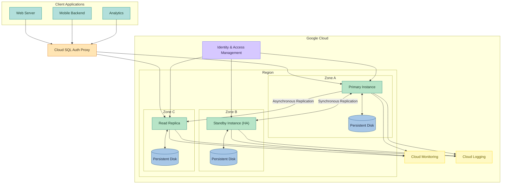
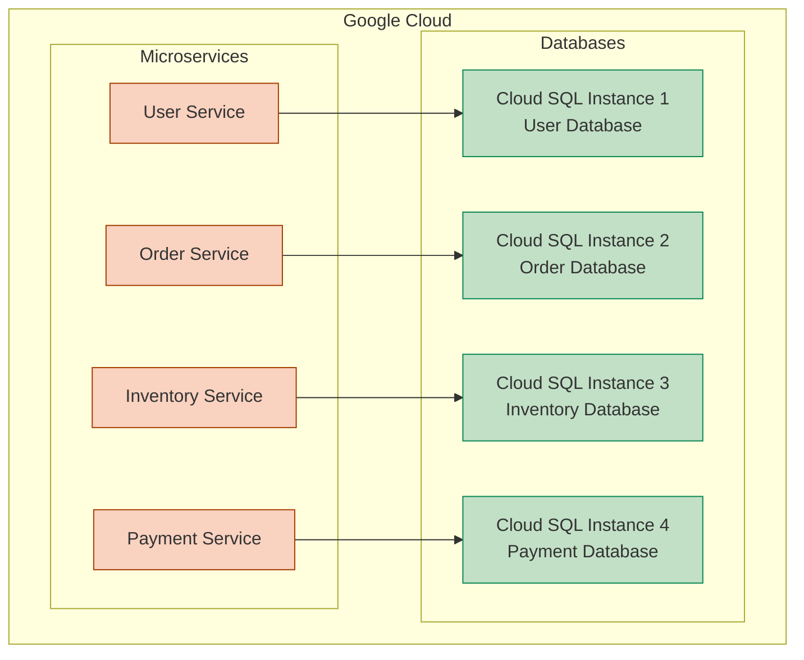
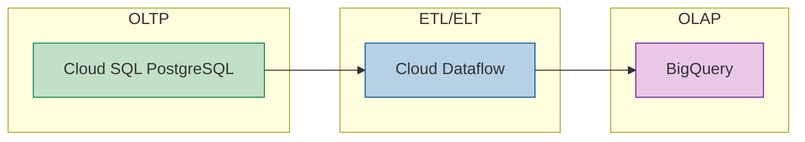

# Google Cloud SQL for Postgres for the Impatient: From Novice to Practitioner in Record Time

## 1. Introduction

### 1.1 Why Google Cloud SQL for PostgreSQL?

Imagine you're building the next big application. You've got brilliant ideas, a solid tech stack, and a team ready to execute. Then comes the database decision—that critical foundation upon which everything else will rest. Should you provision servers, install PostgreSQL, configure replication, set up backups, manage security patches, and monitor performance 24/7? Or should you focus on building your application while letting someone else handle the database infrastructure?

This is where Google Cloud SQL for PostgreSQL enters the picture. It's like having a world-class database administration team at your disposal without the overhead of hiring one. Cloud SQL provides a fully-managed PostgreSQL database service that handles the mundane yet critical tasks of database administration—provisioning, patching, backups, replication, and monitoring—allowing you to focus on what truly matters: your application and your users.

But why PostgreSQL specifically? PostgreSQL has earned its reputation as the "world's most advanced open-source database" for good reasons. It combines robust relational database capabilities with support for JSON and other non-relational data types, making it incredibly versatile. It offers enterprise-grade features like advanced indexing, full-text search, and geospatial support. And with its strong standards compliance and vibrant open-source community, PostgreSQL continues to evolve and improve.

When you combine PostgreSQL's capabilities with Google Cloud's infrastructure and management features, you get a database solution that's powerful, reliable, and remarkably easy to use. Whether you're building a simple web application or a complex enterprise system, Cloud SQL for PostgreSQL provides the foundation you need to succeed.

### 1.2 Who This Article Is For

This guide is designed for the impatient practitioner—someone who needs to get up and running with Google Cloud SQL for PostgreSQL quickly and effectively. Perhaps you're:

- A developer who needs to set up a database for a new application
- A database administrator transitioning from on-premises to cloud environments
- A technical lead evaluating database options for your organization
- A student or professional looking to expand your cloud database skills

While we'll cover concepts from the ground up, having some familiarity with basic SQL concepts and database principles will help you get the most from this guide. You don't need to be a PostgreSQL expert—we'll cover the essentials and point you to resources for deeper learning.

By the end of this article, you'll be able to:

- Create and configure Google Cloud SQL for PostgreSQL instances
- Connect to your instances securely from various environments
- Implement best practices for security, performance, and reliability
- Optimize your database for cost and performance
- Troubleshoot common issues and know where to find help


### 1.3 How to Get the Most from This Guide

This guide is designed to be both comprehensive and practical. To get the most value from it, I recommend the following approach:

1. **Follow along with a real instance**: Create a Google Cloud account if you don't have one already. New users get \$300 in free credits, which is more than enough to experiment with Cloud SQL for PostgreSQL.
2. **Focus on examples**: Each section includes practical examples that build on each other. Try them out as you go—hands-on experience is invaluable.
3. **Engage with the interactive elements**: Throughout the article, you'll find "Pause and Reflect" moments and quick quizzes. These are designed to reinforce your learning and help you apply concepts to your specific use cases.
4. **Bookmark for reference**: This guide is comprehensive enough to serve as a reference as you continue working with Cloud SQL for PostgreSQL.

Let's begin our journey into the world of managed PostgreSQL databases in Google Cloud!

## 2. Understanding Google Cloud SQL for PostgreSQL

### 2.1 The Database Management Evolution

The history of database management is a story of increasing abstraction and convenience. In the early days, organizations had to manage everything—from the physical hardware to the database software, backups, security, and performance tuning. This required specialized teams and significant capital investment.

The cloud computing revolution changed everything. Suddenly, organizations could rent computing resources on demand, paying only for what they used. This Infrastructure as a Service (IaaS) model eliminated the need for physical hardware management but still required expertise in operating system and database administration.

Platform as a Service (PaaS) offerings like Google Cloud SQL took abstraction a step further by managing the operating system and database software, leaving customers to focus on schema design, query optimization, and application integration. This evolution mirrors other technological shifts—just as most people no longer generate their own electricity but simply plug into the grid, most organizations no longer need to manage database infrastructure but can instead connect to a managed service.

PostgreSQL has evolved alongside these infrastructure changes. From its origins as the successor to the Ingres database project at UC Berkeley, PostgreSQL has grown into a feature-rich, standards-compliant database system that rivals or exceeds commercial alternatives. Its combination of reliability, feature richness, and open-source nature makes it an ideal candidate for cloud-based managed services.

### 2.2 Core Concepts and Terminology

Before diving into the specifics of Google Cloud SQL for PostgreSQL, let's establish a common vocabulary:

**Instance**: A Cloud SQL instance is a virtual machine running the PostgreSQL database server. Each instance has its own resources (CPU, memory, storage) and can host multiple databases.

**Database**: Within an instance, you can create multiple databases, each with its own tables, indexes, and other objects. This allows for logical separation of data and applications.

**Region and Zone**: Google Cloud operates in multiple geographical regions, each containing multiple zones. When you create a Cloud SQL instance, you select a region and optionally a zone, determining where your data physically resides.

**High Availability**: A configuration that provides automatic failover to a standby instance in case the primary instance becomes unavailable, minimizing downtime.

**Read Replica**: A read-only copy of your database that automatically stays in sync with the primary instance. Read replicas can distribute read traffic and provide additional capacity for read-heavy workloads.

**Cloud SQL Auth Proxy**: A Google-provided utility that provides secure access to your Cloud SQL instances without requiring you to configure SSL or whitelist IP addresses.

**IAM (Identity and Access Management)**: Google Cloud's system for controlling access to resources, including Cloud SQL instances.

Let's visualize the architecture of a typical Cloud SQL for PostgreSQL deployment:


This architecture illustrates how Cloud SQL for PostgreSQL provides a managed database service with high availability, read scaling, and secure access.

### 2.3 Google Cloud SQL vs. Self-Managed PostgreSQL

When deciding between Google Cloud SQL for PostgreSQL and running your own PostgreSQL servers (either on-premises or on virtual machines), consider these key differences:

**Management Overhead**:

- With Cloud SQL, Google handles backups, updates, security patches, and high availability configuration.
- With self-managed PostgreSQL, your team is responsible for all aspects of database administration.

**Control and Flexibility**:

- Cloud SQL provides a curated set of PostgreSQL versions and extensions.
- Self-managed PostgreSQL gives you complete control over versions, extensions, and configuration parameters.

**Cost Structure**:

- Cloud SQL has a predictable pricing model based on instance size, storage, and network usage.
- Self-managed PostgreSQL requires you to factor in hardware, licensing, operational costs, and the hidden costs of downtime and management.

**Scaling and Performance**:

- Cloud SQL offers easy vertical scaling (changing instance size) and horizontal scaling (adding read replicas).
- Self-managed PostgreSQL requires manual intervention for scaling, which can be complex and time-consuming.

Think of it like the difference between owning a car and using a ride-sharing service. Car ownership gives you complete control but comes with maintenance responsibilities, insurance costs, and depreciation. Ride-sharing offers convenience and predictable per-use pricing but less control over the vehicle itself.

For most applications, especially those where database administration is not a core competency, Cloud SQL offers a compelling value proposition by eliminating undifferentiated heavy lifting and allowing teams to focus on their applications.

### 2.4 Google Cloud SQL vs. Other Cloud Providers

All major cloud providers offer managed PostgreSQL services, but there are important differences to consider:

**Google Cloud SQL vs. Amazon RDS for PostgreSQL**:

- Both offer similar core functionality, but Cloud SQL integrates more deeply with other Google Cloud services.
- Amazon RDS offers more instance types and storage options.
- Cloud SQL's pricing model is generally simpler, while RDS offers more granular control.

**Google Cloud SQL vs. Azure Database for PostgreSQL**:

- Azure offers both single server and hyperscale (Citus) deployment options for horizontal scaling.
- Cloud SQL provides better integration with Google's analytics services like BigQuery.
- Both offer similar security features, but with different implementation details.

The choice often comes down to your existing cloud investments, specific feature requirements, and pricing considerations. If you're already using Google Cloud for other services, the seamless integration of Cloud SQL makes it a natural choice.

> **Pause and Reflect**: What are your current database management pain points? Which aspects of database administration would you most like to offload to a managed service? How might Cloud SQL address these needs?

## 3. Getting Started: Your First PostgreSQL Instance

### 3.1 Setting Up Your Google Cloud Environment

Before creating your first Cloud SQL instance, you need to set up your Google Cloud environment. If you're new to Google Cloud, follow these steps:

1. **Create a Google Cloud account**: Visit cloud.google.com and sign up. New users receive \$300 in free credits, which is ample for learning and experimentation.
2. **Create a project**: Projects in Google Cloud organize your resources. Think of them as workspaces for related applications and services.
```bash
# Using the gcloud CLI
gcloud projects create my-postgres-project --name="My PostgreSQL Project"
gcloud config set project my-postgres-project
```

3. **Enable the Cloud SQL Admin API**: This API is required to create and manage Cloud SQL instances.
```bash
gcloud services enable sqladmin.googleapis.com
```

4. **Set up billing**: Link a billing account to your project. You won't be charged until you exceed the free tier limits or your free credits are exhausted.

> **Pro Tip**: Create a dedicated project for your database experiments. This makes it easier to track costs and clean up resources when you're done.

### 3.2 Creating Your First PostgreSQL Instance

Now let's create your first Cloud SQL for PostgreSQL instance. You can do this through the Google Cloud Console (web UI) or the gcloud command-line tool. We'll show both methods.

**Using the Google Cloud Console**:

1. Navigate to the Cloud SQL section in the Google Cloud Console.
2. Click "Create Instance" and select "PostgreSQL".
3. Configure your instance with the following settings:
    - Instance ID: `my-first-postgres` (choose a unique name)
    - Password: Generate a strong password
    - Region: Choose a region close to your users
    - Database version: PostgreSQL 15 (or the latest available)
    - Machine type: Lightweight (1 vCPU, 3.75 GB) for testing
    - Storage: 10 GB (minimum)

**Using the gcloud CLI**:

```bash
gcloud sql instances create my-first-postgres \
  --database-version=POSTGRES_15 \
  --cpu=1 \
  --memory=3840MB \
  --region=us-central1 \
  --root-password=YOUR_SECURE_PASSWORD \
  --storage-type=SSD \
  --storage-size=10GB
```

This process typically takes 5-10 minutes as Google Cloud provisions and configures your instance.

> **Pro Tip**: For production instances, always enable high availability and automatic backups. For learning purposes, you can leave these off to minimize costs.

### 3.3 Connecting to Your Instance

Once your instance is created, you'll need to connect to it. Google Cloud SQL offers several connection methods, each with different security and convenience trade-offs.

**Method 1: Cloud SQL Auth Proxy (Recommended)**

The Cloud SQL Auth Proxy is a utility that provides secure access to your Cloud SQL instances without requiring you to whitelist IP addresses or configure SSL certificates. It's the recommended method for most use cases.

1. Download the Cloud SQL Auth Proxy:
```bash
# For Linux/macOS
curl -o cloud-sql-proxy https://storage.googleapis.com/cloud-sql-connectors/cloud-sql-proxy/v2.6.0/cloud-sql-proxy.linux.amd64
chmod +x cloud-sql-proxy

# For Windows (using PowerShell)
Invoke-WebRequest -Uri "https://storage.googleapis.com/cloud-sql-connectors/cloud-sql-proxy/v2.6.0/cloud-sql-proxy.windows.amd64.exe" -OutFile "cloud-sql-proxy.exe"
```

2. Start the proxy:
```bash
# Get your instance connection name
INSTANCE_CONNECTION_NAME=$(gcloud sql instances describe my-first-postgres --format='value(connectionName)')

# Start the proxy
./cloud-sql-proxy $INSTANCE_CONNECTION_NAME --port=5432
```

3. Connect using your PostgreSQL client:
```bash
psql "host=127.0.0.1 port=5432 user=postgres password=YOUR_PASSWORD dbname=postgres"
```

**Method 2: Direct Connection with Authorized Networks**

For simpler setups or when the proxy isn't feasible, you can authorize specific IP addresses to connect directly to your instance:

1. Find your client IP address (search "what is my IP" in your browser).
2. Add your IP to the authorized networks in the Cloud SQL instance settings.
3. Connect using your PostgreSQL client:
```bash
# Get your instance IP address
INSTANCE_IP=$(gcloud sql instances describe my-first-postgres --format='value(ipAddresses.ipAddress)')

# Connect using psql
psql "host=$INSTANCE_IP port=5432 user=postgres password=YOUR_PASSWORD dbname=postgres sslmode=require"
```

> **Pro Tip**: For production environments, use the Cloud SQL Auth Proxy with service accounts for authentication. This provides better security and eliminates the need to manage IP whitelists.

### 3.4 Basic Database Operations

Now that you're connected, let's perform some basic operations to get familiar with your PostgreSQL instance.

**Creating a Database and User**:

```sql
-- Create a new database
CREATE DATABASE myappdb;

-- Create a new user with a password
CREATE USER myappuser WITH PASSWORD 'secure-password';

-- Grant privileges to the user on the database
GRANT ALL PRIVILEGES ON DATABASE myappdb TO myappuser;
```

**Creating Tables and Inserting Data**:

```sql
-- Connect to the new database
\c myappdb

-- Create a table
CREATE TABLE customers (
    id SERIAL PRIMARY KEY,
    name VARCHAR(100) NOT NULL,
    email VARCHAR(100) UNIQUE NOT NULL,
    created_at TIMESTAMP DEFAULT CURRENT_TIMESTAMP
);

-- Insert some data
INSERT INTO customers (name, email) VALUES
    ('Alice Smith', 'alice@example.com'),
    ('Bob Johnson', 'bob@example.com'),
    ('Charlie Brown', 'charlie@example.com');

-- Query the data
SELECT * FROM customers;
```

**Using PostgreSQL-Specific Features**:

PostgreSQL offers many advanced features not found in other databases. Here's a simple example using JSON data:

```sql
-- Create a table with a JSON column
CREATE TABLE product_inventory (
    id SERIAL PRIMARY KEY,
    name VARCHAR(100) NOT NULL,
    attributes JSONB NOT NULL
);

-- Insert data with JSON
INSERT INTO product_inventory (name, attributes) VALUES
    ('Smartphone', '{"brand": "Pixel", "color": "Black", "storage": 128, "features": ["5G", "Wireless Charging"]}'),
    ('Laptop', '{"brand": "ChromeBook", "color": "Silver", "ram": 16, "storage": 512}');

-- Query JSON data
SELECT name, attributes->>'brand' AS brand, attributes->>'color' AS color
FROM product_inventory;

-- Query with JSON conditions
SELECT name FROM product_inventory
WHERE attributes->>'brand' = 'Pixel';

-- Query with JSON array elements
SELECT name FROM product_inventory
WHERE attributes->'features' ? '5G';
```

> **Quick Quiz**:
> 1. What command would you use to create a new database called "projectdb"?
> 2. How would you grant read-only access to a user named "reporter" on the "customers" table?
> 3. What's the difference between the `->` and `->>` operators when querying JSON data in PostgreSQL?

> **Answers**:
> 1. `CREATE DATABASE projectdb;`
> 2. `GRANT SELECT ON customers TO reporter;`
> 3. The `->` operator returns a JSON object, while `->>` returns text. For example, `attributes->'brand'` returns `"Pixel"` (with quotes), while `attributes->>'brand'` returns `Pixel` (without quotes).

## 4. Security Best Practices

### 4.1 Authentication Methods

Securing your Cloud SQL for PostgreSQL instance starts with proper authentication. Google Cloud SQL offers several authentication methods, each with different security characteristics:

**Password Authentication**:

The simplest method is traditional username/password authentication. While convenient, it's also the least secure if not managed properly:

```sql
-- Create a user with password authentication
CREATE USER appuser WITH PASSWORD 'complex-password-here';
```

Best practices for password authentication:

- Use strong, unique passwords for each user
- Rotate passwords regularly
- Store passwords securely in a password manager or secret management system
- Consider using environment variables rather than hardcoding passwords in application code

**IAM Authentication**:

Google Cloud SQL supports IAM authentication, which allows you to use Google Cloud's Identity and Access Management to control database access. This eliminates the need to manage database passwords:

1. Enable IAM authentication on your instance:
```bash
gcloud sql instances patch my-first-postgres \
  --database-flags "cloudsql.iam_authentication=on"
```

2. Create a database user linked to a Google Cloud IAM user or service account:
```sql
-- For a user
CREATE USER 'user@example.com' WITH LOGIN;

-- For a service account
CREATE USER 'service-account@project-id.iam.gserviceaccount.com' WITH LOGIN;
```

3. Grant the necessary IAM roles:
```bash
# Grant the Cloud SQL Instance User role
gcloud projects add-iam-policy-binding your-project-id \
  --member="user:user@example.com" \
  --role="roles/cloudsql.instanceUser"

# For service accounts
gcloud projects add-iam-policy-binding your-project-id \
  --member="serviceAccount:service-account@project-id.iam.gserviceaccount.com" \
  --role="roles/cloudsql.instanceUser"
```

4. Connect using IAM authentication:
```bash
# Start the Cloud SQL Auth Proxy with IAM authentication
./cloud-sql-proxy $INSTANCE_CONNECTION_NAME --port=5432 --auto-iam-authn

# Connect with psql (no password needed)
psql "host=127.0.0.1 port=5432 user=user@example.com dbname=postgres"
```

IAM authentication provides several advantages:

- No passwords to manage or rotate
- Centralized access control through Google Cloud IAM
- Detailed audit logging of authentication events
- Integration with organizational identity providers

> **Pro Tip**: For production applications, use service accounts with IAM authentication rather than individual user accounts. This provides better security and makes automation easier.

### 4.2 Network Security

Controlling network access is a critical aspect of database security. Google Cloud SQL provides several mechanisms to secure network access:

**Private IP vs. Public IP**:

Cloud SQL instances can have a private IP (accessible only within your VPC network), a public IP (accessible from the internet with proper authentication), or both:

- **Private IP** is more secure as it's not exposed to the internet. It requires VPC network configuration but provides better isolation.
- **Public IP** is easier to set up but requires additional security measures like SSL and authorized networks.

To configure a private IP:

```bash
# Create a VPC network if you don't have one
gcloud compute networks create my-vpc-network --subnet-mode=auto

# Create a Cloud SQL instance with private IP
gcloud sql instances create private-postgres \
  --database-version=POSTGRES_15 \
  --cpu=1 \
  --memory=3840MB \
  --region=us-central1 \
  --root-password=YOUR_SECURE_PASSWORD \
  --network=my-vpc-network \
  --no-assign-ip
```

**Authorized Networks**:

If you use a public IP, restrict access to specific IP addresses:

```bash
# Add an authorized network
gcloud sql instances patch my-first-postgres \
  --authorized-networks=203.0.113.0/24,198.51.100.5
```

> **Pro Tip**: Use authorized networks as a defense-in-depth measure, even when using the Cloud SQL Auth Proxy. This provides an additional layer of protection.

**SSL/TLS Configuration**:

Cloud SQL for PostgreSQL encrypts data in transit using SSL/TLS. You can enforce SSL connections:

```bash
# Require SSL connections
gcloud sql instances patch my-first-postgres \
  --require-ssl
```

To connect with SSL:

```bash
# Download the server certificate
gcloud sql instances describe my-first-postgres \
  --format="value(serverCaCert.cert)" > server-ca.pem

# Connect with SSL
psql "host=$INSTANCE_IP port=5432 user=postgres password=YOUR_PASSWORD dbname=postgres sslmode=verify-ca sslrootcert=server-ca.pem"
```


### 4.3 Data Protection

Protecting your data at rest and ensuring you can recover from disasters are essential aspects of database security:

**Encryption at Rest**:

All data in Cloud SQL is automatically encrypted at rest using Google's default encryption. For additional control, you can use Customer-Managed Encryption Keys (CMEK):

```bash
# Create a key ring and key in Cloud KMS
gcloud kms keyrings create postgres-keyring --location=us-central1
gcloud kms keys create postgres-key \
  --location=us-central1 \
  --keyring=postgres-keyring \
  --purpose=encryption

# Get the key resource ID
KMS_KEY=$(gcloud kms keys describe postgres-key \
  --location=us-central1 \
  --keyring=postgres-keyring \
  --format="value(name)")

# Create an instance with CMEK
gcloud sql instances create cmek-postgres \
  --database-version=POSTGRES_15 \
  --cpu=1 \
  --memory=3840MB \
  --region=us-central1 \
  --root-password=YOUR_SECURE_PASSWORD \
  --disk-encryption-key=$KMS_KEY
```

**Backup Strategies**:

Cloud SQL provides automated backups and point-in-time recovery:

```bash
# Configure automated backups
gcloud sql instances patch my-first-postgres \
  --backup-start-time=23:00 \
  --backup-location=us \
  --retained-backups=7

# Create an on-demand backup
gcloud sql backups create --instance=my-first-postgres

# List available backups
gcloud sql backups list --instance=my-first-postgres
```

For critical data, consider additional backup strategies:

- Export data to Cloud Storage regularly
- Set up cross-region replicas for geographic redundancy
- Test your backup and recovery procedures regularly

**Audit Logging**:

Enable audit logging to track database access and changes:

```bash
# Enable audit logging
gcloud sql instances patch my-first-postgres \
  --database-flags "log_min_messages=warning,log_min_error_statement=error,log_error_verbosity=default"
```

View logs in Cloud Logging:

```bash
gcloud logging read "resource.type=cloudsql_database AND resource.labels.database_id=$INSTANCE_ID"
```


### 4.4 Identity and Access Management

Proper access control within your database is crucial for security:

**IAM Roles and Permissions**:

Google Cloud IAM controls who can manage your Cloud SQL instances:

```bash
# Grant the Cloud SQL Admin role to a user
gcloud projects add-iam-policy-binding your-project-id \
  --member="user:admin@example.com" \
  --role="roles/cloudsql.admin"

# Grant the Cloud SQL Client role to a service account
gcloud projects add-iam-policy-binding your-project-id \
  --member="serviceAccount:app@project-id.iam.gserviceaccount.com" \
  --role="roles/cloudsql.client"
```

Common IAM roles for Cloud SQL:

- `cloudsql.admin`: Full control over Cloud SQL instances
- `cloudsql.editor`: Can modify instances but not create or delete them
- `cloudsql.client`: Can connect to instances but not modify them
- `cloudsql.viewer`: Can view instance configurations but not modify or connect

**Database User Management**:

Within PostgreSQL, manage user privileges following the principle of least privilege:

```sql
-- Create a read-only user
CREATE USER readonly WITH PASSWORD 'password';
GRANT CONNECT ON DATABASE myappdb TO readonly;
GRANT USAGE ON SCHEMA public TO readonly;
GRANT SELECT ON ALL TABLES IN SCHEMA public TO readonly;
ALTER DEFAULT PRIVILEGES IN SCHEMA public GRANT SELECT ON TABLES TO readonly;

-- Create a user that can read and write to specific tables
CREATE USER appwriter WITH PASSWORD 'password';
GRANT CONNECT ON DATABASE myappdb TO appwriter;
GRANT USAGE ON SCHEMA public TO appwriter;
GRANT SELECT, INSERT, UPDATE, DELETE ON customers, orders TO appwriter;
```

> **Pro Tip**: Use PostgreSQL roles to group permissions and then assign users to roles. This makes permission management more scalable and less error-prone.

> **Pause and Reflect**: Review your current database security practices. Are you following the principle of least privilege? Have you implemented defense in depth with multiple security layers? What additional security measures could you implement?

## 5. Performance Optimization

### 5.1 Instance Sizing and Configuration

Properly sizing your Cloud SQL for PostgreSQL instance is crucial for both performance and cost efficiency. Let's explore how to choose the right configuration:

**CPU and Memory Considerations**:

Cloud SQL offers various machine types with different CPU and memory configurations. The right choice depends on your workload:

- **CPU-intensive workloads** (complex queries, analytics): Choose instances with higher CPU-to-memory ratios.
- **Memory-intensive workloads** (large working sets, many connections): Choose instances with higher memory-to-CPU ratios.

To resize an existing instance:

```bash
# Resize an instance (requires restart)
gcloud sql instances patch my-first-postgres \
  --cpu=2 \
  --memory=7680MB
```

> **Pro Tip**: Monitor CPU and memory usage over time to identify patterns and right-size your instances. Start with a conservative size and scale up as needed rather than overprovisioning from the beginning.

**Storage Options and Performance**:

Cloud SQL offers SSD storage with automatic storage increases:

```bash
# Configure automatic storage increase
gcloud sql instances patch my-first-postgres \
  --storage-auto-increase \
  --storage-size=20GB
```

For optimal performance:

- Size your storage to accommodate your data with room for growth
- Enable automatic storage increases to handle unexpected growth
- Monitor storage usage and performance metrics

**Instance Flags and Parameters**:

PostgreSQL has numerous configuration parameters that can be tuned for performance. In Cloud SQL, these are set as database flags:

```bash
# Set database flags
gcloud sql instances patch my-first-postgres \
  --database-flags "shared_buffers=256MB,work_mem=16MB,maintenance_work_mem=64MB,effective_cache_size=768MB"
```

Common performance-related flags:

- `shared_buffers`: Memory used for caching data (typically 25% of instance memory)
- `work_mem`: Memory used for query operations (sort, hash, join)
- `maintenance_work_mem`: Memory used for maintenance operations
- `effective_cache_size`: Estimate of memory available for disk caching


### 5.2 Query Performance

Optimizing query performance is often the most effective way to improve database performance:

**Query Optimization Techniques**:

1. Use EXPLAIN ANALYZE to understand query execution plans:
```sql
EXPLAIN ANALYZE
SELECT c.name, COUNT(o.id) as order_count
FROM customers c
LEFT JOIN orders o ON c.id = o.customer_id
GROUP BY c.name
ORDER BY order_count DESC;
```

2. Create appropriate indexes:
```sql
-- Index for filtering
CREATE INDEX idx_customers_email ON customers(email);

-- Index for joins
CREATE INDEX idx_orders_customer_id ON orders(customer_id);

-- Composite index for common query patterns
CREATE INDEX idx_orders_status_date ON orders(status, order_date);
```

3. Optimize table structure:
```sql
-- Add appropriate constraints
ALTER TABLE orders ADD CONSTRAINT fk_customer
FOREIGN KEY (customer_id) REFERENCES customers(id);

-- Use appropriate data types
ALTER TABLE products ALTER COLUMN price TYPE numeric(10,2);
```

**Using Cloud SQL Insights**:

Cloud SQL Insights is a powerful tool for identifying and troubleshooting query performance issues:

1. Enable Query Insights:
```bash
gcloud sql instances patch my-first-postgres \
  --insights-config-query-plans-per-minute=5,query-string-length=4096
```

2. Access Query Insights in the Google Cloud Console to:
    - Identify slow queries
    - Analyze query execution plans
    - Track query performance over time
    - Receive recommendations for optimization

**Performance Monitoring**:

Set up monitoring to track performance metrics:

```bash
# Create an alerting policy for high CPU usage
gcloud alpha monitoring policies create \
  --display-name="High CPU Usage" \
  --condition-filter="resource.type = \"cloudsql_database\" AND resource.labels.database_id = \"$INSTANCE_ID\" AND metric.type = \"cloudsql.googleapis.com/database/cpu/utilization\" AND metric.labels.database_id = \"$INSTANCE_ID\" AND metric.labels.state = \"RUNNING\" AND value.utilization > 0.8" \
  --duration=5m \
  --notification-channels="projects/$PROJECT_ID/notificationChannels/$CHANNEL_ID" \
  --documentation="CPU usage is high, consider optimizing queries or scaling up the instance."
```

Key metrics to monitor:

- CPU utilization
- Memory usage
- Disk I/O
- Connection count
- Query throughput and latency


### 5.3 Connection Management

Efficient connection management is crucial for database performance:

**Connection Pooling**:

PostgreSQL creates a separate process for each connection, which consumes resources. Use connection pooling to manage connections efficiently:

```python
# Example using Python's psycopg2 with connection pooling
from psycopg2 import pool

connection_pool = pool.SimpleConnectionPool(
    minconn=1,
    maxconn=10,
    host='127.0.0.1',
    port='5432',
    user='postgres',
    password='YOUR_PASSWORD',
    database='postgres'
)

# Get a connection from the pool
conn = connection_pool.getconn()
try:
    # Use the connection
    with conn.cursor() as cur:
        cur.execute("SELECT * FROM customers")
        results = cur.fetchall()
finally:
    # Return the connection to the pool
    connection_pool.putconn(conn)
```

**Proxy Configuration for Performance**:

When using the Cloud SQL Auth Proxy, configure it for optimal performance:

```bash
# Start the proxy with connection pooling
./cloud-sql-proxy $INSTANCE_CONNECTION_NAME \
  --port=5432 \
  --max-connections=100 \
  --max-connection-idle-time=300s
```

**Managing Connection Limits**:

PostgreSQL has limits on the number of concurrent connections. Monitor and adjust these limits as needed:

```sql
-- Check current connection limit
SHOW max_connections;

-- Check current connections
SELECT count(*) FROM pg_stat_activity;
```

To change the connection limit:

```bash
gcloud sql instances patch my-first-postgres \
  --database-flags "max_connections=100"
```

> **Pro Tip**: Set your connection pool maximum size to be less than your database's max_connections to leave room for administrative connections and avoid connection errors.

### 5.4 Scaling Strategies

As your application grows, you'll need strategies to scale your database:

**Vertical Scaling Options**:

Vertical scaling (increasing instance size) is the simplest scaling strategy:

```bash
# Scale up an instance
gcloud sql instances patch my-first-postgres \
  --cpu=4 \
  --memory=15360MB
```

Considerations for vertical scaling:

- Requires instance restart (brief downtime)
- Simple to implement
- Has upper limits on size
- Linear cost increase with size

**Read Replicas for Read Scaling**:

For read-heavy workloads, add read replicas to distribute query load:

```bash
# Create a read replica
gcloud sql instances create my-first-postgres-replica \
  --master-instance-name=my-first-postgres \
  --region=us-central1
```

In your application, direct read queries to replicas and write queries to the primary instance:

```python
# Simplified example of read/write splitting
def get_connection(operation_type):
    if operation_type == 'read':
        # Connect to replica for reads
        return connect_to_database('replica-connection-name')
    else:
        # Connect to primary for writes
        return connect_to_database('primary-connection-name')
```

**Sharding Considerations**:

For very large datasets or write-heavy workloads, consider sharding (horizontal partitioning):

1. Identify a sharding key (e.g., customer_id, region, date range)
2. Create multiple Cloud SQL instances
3. Distribute data across instances based on the sharding key
4. Implement sharding logic in your application
```python
# Simplified sharding example
def get_shard_for_customer(customer_id):
    # Simple hash-based sharding
    shard_number = hash(customer_id) % NUMBER_OF_SHARDS
    return f"shard-{shard_number}-connection-name"

def get_connection_for_customer(customer_id):
    shard = get_shard_for_customer(customer_id)
    return connect_to_database(shard)
```

While Cloud SQL doesn't provide built-in sharding, you can implement it at the application level.

> **Quick Quiz**:
> 1. What's the difference between vertical scaling and horizontal scaling?
> 2. When would you choose to use read replicas instead of increasing your instance size?
> 3. What database flag would you adjust to increase the memory allocated for query operations?

> **Answers**:
> 1. Vertical scaling increases the resources (CPU, memory) of a single instance, while horizontal scaling adds more instances to distribute the load.
> 2. Use read replicas when you have a read-heavy workload with relatively few writes, or when you need geographic distribution of read access.
> 3. The `work_mem` flag controls memory allocated for query operations like sorting and hash joins.

## 6. High Availability and Disaster Recovery

### 6.1 High Availability Configuration

In the world of databases, downtime can be costly. Google Cloud SQL for PostgreSQL offers high availability (HA) configurations to minimize downtime:

**Regional Availability Setup**:

High availability in Cloud SQL works by maintaining a standby instance in a different zone within the same region. If the primary instance fails, Cloud SQL automatically fails over to the standby:

```bash
# Create a new instance with high availability
gcloud sql instances create ha-postgres \
  --database-version=POSTGRES_15 \
  --cpu=2 \
  --memory=7680MB \
  --region=us-central1 \
  --root-password=YOUR_SECURE_PASSWORD \
  --availability-type=REGIONAL

# Or enable HA on an existing instance
gcloud sql instances patch my-first-postgres \
  --availability-type=REGIONAL
```

Think of high availability like having a co-pilot on an airplane. If the primary pilot becomes incapacitated, the co-pilot can immediately take over without the passengers experiencing any significant disruption.

**Automatic Failover**:

When configured for high availability, Cloud SQL automatically detects failures and performs failover:

1. The primary instance becomes unavailable
2. Cloud SQL detects the failure
3. The standby instance is promoted to primary
4. DNS records are updated to point to the new primary
5. Connections are briefly interrupted and then reconnected to the new primary

The failover process typically takes 1-2 minutes, during which your application may experience errors. Design your application to handle these brief interruptions with retry logic:

```python
# Example of retry logic in Python
import time
from psycopg2 import OperationalError

def execute_with_retry(cursor, query, params=None, max_retries=5, retry_delay=1):
    retries = 0
    while retries < max_retries:
        try:
            cursor.execute(query, params)
            return cursor.fetchall()
        except OperationalError as e:
            retries += 1
            if retries >= max_retries:
                raise
            print(f"Database error: {e}. Retrying in {retry_delay} seconds...")
            time.sleep(retry_delay)
            retry_delay *= 2  # Exponential backoff
```

**Monitoring HA Status**:

Monitor the status of your high availability setup:

```bash
# Check HA status
gcloud sql instances describe my-first-postgres \
  --format="value(settings.availabilityType)"

# View failover history
gcloud logging read "resource.type=cloudsql_database AND resource.labels.database_id=$INSTANCE_ID AND logName:cloudsql.googleapis.com/mysql-failover"
```

Set up alerts for failover events:

```bash
# Create an alerting policy for failover events
gcloud alpha monitoring policies create \
  --display-name="PostgreSQL Failover" \
  --condition-filter="resource.type = \"cloudsql_database\" AND resource.labels.database_id = \"$INSTANCE_ID\" AND logName:cloudsql.googleapis.com/postgres-failover" \
  --notification-channels="projects/$PROJECT_ID/notificationChannels/$CHANNEL_ID" \
  --documentation="A failover has occurred on your PostgreSQL instance."
```


### 6.2 Backup and Recovery

Even with high availability, backups are essential for protecting against data corruption, accidental deletion, or regional outages:

**Automated Backup Configuration**:

Cloud SQL can automatically back up your instance daily:

```bash
# Configure automated backups
gcloud sql instances patch my-first-postgres \
  --backup-start-time=23:00 \
  --backup-location=us \
  --retained-backups=7 \
  --transaction-log-retention-days=7
```

This configuration:

- Creates a backup daily at 11:00 PM
- Stores backups in the US multi-region
- Retains backups for 7 days
- Keeps transaction logs for 7 days (for point-in-time recovery)

**Point-in-Time Recovery**:

With transaction logs enabled, you can restore your database to any point within the retention period:

```bash
# Restore to a specific point in time
gcloud sql instances clone my-first-postgres my-restored-postgres \
  --point-in-time="2025-06-20T10:00:00Z"
```

This is invaluable for recovering from data corruption or accidental changes.

**Cross-Region Recovery Options**:

For protection against regional outages, consider cross-region replicas:

```bash
# Create a cross-region replica
gcloud sql instances create my-first-postgres-dr \
  --master-instance-name=my-first-postgres \
  --region=us-east1
```

In a disaster scenario, you can promote the replica to a standalone instance:

```bash
# Promote a replica to a standalone instance
gcloud sql instances promote-replica my-first-postgres-dr
```

> **Pro Tip**: Test your backup and recovery procedures regularly. The worst time to discover issues with your recovery process is during an actual emergency.

### 6.3 Maintenance and Updates

Google Cloud manages maintenance and updates for Cloud SQL instances, but you can control when and how these updates are applied:

**Maintenance Windows**:

Configure maintenance windows to control when updates are applied:

```bash
# Set a maintenance window
gcloud sql instances patch my-first-postgres \
  --maintenance-window-day=SUNDAY \
  --maintenance-window-hour=2
```

This schedules maintenance during low-traffic periods to minimize impact.

**Version Upgrades**:

Cloud SQL periodically releases new PostgreSQL versions. You can control when to upgrade:

```bash
# Check available database versions
gcloud sql instances describe my-first-postgres \
  --format="value(databaseVersion)"

# Upgrade to a new version
gcloud sql instances patch my-first-postgres \
  --database-version=POSTGRES_16
```

> **Pro Tip**: Test version upgrades on a clone of your production instance before applying them to production.

**Minimizing Downtime**:

Strategies to minimize maintenance impact:

1. Use high availability to reduce downtime during maintenance
2. Schedule maintenance during off-peak hours
3. Design applications to handle brief connection interruptions
4. Monitor maintenance events and plan accordingly

### 6.4 Disaster Recovery Planning

A comprehensive disaster recovery (DR) plan goes beyond technical solutions:

**Multi-Region Strategies**:

For critical applications, implement a multi-region strategy:

1. Create cross-region read replicas
2. Set up automated exports to Cloud Storage in multiple regions
3. Prepare scripts to promote replicas if needed
4. Document the recovery process

**Recovery Time Objectives**:

Define and test your recovery time objectives (RTO):


| Recovery Method | Typical RTO | Use Case |
| :-- | :-- | :-- |
| High Availability | 1-2 minutes | Zone failure |
| Point-in-Time Recovery | 30-60 minutes | Data corruption |
| Cross-Region Replica | 5-15 minutes | Region failure |
| Backup Restore | 1-3 hours | Complete recovery |

**Testing Recovery Procedures**:

Regularly test your recovery procedures:

```bash
# Create a clone for testing
gcloud sql instances clone my-first-postgres my-test-recovery \
  --point-in-time="2025-06-20T10:00:00Z"

# Verify data integrity
# Connect to the clone and run verification queries

# Clean up after testing
gcloud sql instances delete my-test-recovery
```

Document your recovery procedures and ensure multiple team members are trained on them.

> **Pause and Reflect**: What is your current database backup strategy? How quickly could you recover from different types of failures? What improvements could you make to your disaster recovery plan?

## 7. Advanced Features and Use Cases

### 7.1 PostgreSQL Extensions

One of PostgreSQL's strengths is its extensibility. Google Cloud SQL for PostgreSQL supports many popular extensions:

**PostGIS for Geospatial Data**:

PostGIS adds support for geographic objects, allowing you to run location queries:

```sql
-- Enable PostGIS
CREATE EXTENSION postgis;

-- Create a table with a geometry column
CREATE TABLE stores (
    id SERIAL PRIMARY KEY,
    name VARCHAR(100),
    location GEOGRAPHY(POINT)
);

-- Insert data with coordinates (longitude, latitude)
INSERT INTO stores (name, location)
VALUES ('Downtown Store', ST_MakePoint(-74.0060, 40.7128)::geography),
       ('Uptown Store', ST_MakePoint(-73.9664, 40.7831)::geography);

-- Find stores within 5km of a point
SELECT name, ST_Distance(location, ST_MakePoint(-74.0021, 40.7439)::geography) AS distance
FROM stores
WHERE ST_DWithin(location, ST_MakePoint(-74.0021, 40.7439)::geography, 5000)
ORDER BY distance;
```

PostGIS is invaluable for applications with location-based features like store locators, delivery services, or geofencing.

**Other Supported Extensions**:

Cloud SQL for PostgreSQL supports many other extensions:

```sql
-- Full-text search with pg_trgm
CREATE EXTENSION pg_trgm;
CREATE INDEX idx_products_name_trgm ON products USING GIN (name gin_trgm_ops);
SELECT name FROM products WHERE name % 'smartphone';  -- Fuzzy search

-- Cryptographic functions with pgcrypto
CREATE EXTENSION pgcrypto;
SELECT encode(digest('password', 'sha256'), 'hex');

-- UUID generation
CREATE EXTENSION "uuid-ossp";
SELECT uuid_generate_v4();

-- JSON processing with jsonb_plperl
CREATE EXTENSION jsonb_plperl;
```

Check the available extensions:

```sql
-- List available extensions
SELECT name, default_version, installed_version
FROM pg_available_extensions
ORDER BY name;
```

**Extension Management**:

Manage extensions carefully:

```sql
-- Create an extension in a specific schema
CREATE EXTENSION hstore SCHEMA extensions;

-- Update an extension to a newer version
ALTER EXTENSION postgis UPDATE;

-- Remove an extension (and its objects)
DROP EXTENSION postgis CASCADE;
```

> **Pro Tip**: Extensions can significantly increase your database's capabilities, but they also increase complexity. Document which extensions you're using and why to help with future maintenance.

### 7.2 Integration with Google Cloud Services

Cloud SQL for PostgreSQL integrates seamlessly with other Google Cloud services:

**Cloud Run Integration**:

Deploy a serverless application connected to Cloud SQL:

```bash
# Deploy a Cloud Run service with Cloud SQL connection
gcloud run deploy my-service \
  --image=gcr.io/my-project/my-image \
  --platform=managed \
  --region=us-central1 \
  --add-cloudsql-instances=$INSTANCE_CONNECTION_NAME \
  --set-env-vars="DB_USER=postgres,DB_PASS=YOUR_PASSWORD,DB_NAME=postgres,INSTANCE_CONNECTION_NAME=$INSTANCE_CONNECTION_NAME"
```

In your application code:

```python
# Python example for Cloud Run with Cloud SQL
import os
import psycopg2

def get_connection():
    db_user = os.environ.get("DB_USER")
    db_pass = os.environ.get("DB_PASS")
    db_name = os.environ.get("DB_NAME")
    connection_name = os.environ.get("INSTANCE_CONNECTION_NAME")
    
    # When deployed to Cloud Run, use the unix socket
    host = f"/cloudsql/{connection_name}"
    
    conn = psycopg2.connect(
        dbname=db_name,
        user=db_user,
        password=db_pass,
        host=host
    )
    return conn
```

**Cloud Functions Connectivity**:

Connect serverless functions to Cloud SQL:

```python
# Python example for Cloud Functions with Cloud SQL
import os
import psycopg2
from google.cloud.sql.connector import Connector

def get_connection():
    connector = Connector()
    conn = connector.connect(
        os.environ.get("INSTANCE_CONNECTION_NAME"),
        "pg8000",
        user=os.environ.get("DB_USER"),
        password=os.environ.get("DB_PASS"),
        db=os.environ.get("DB_NAME")
    )
    return conn

def cloud_function_handler(request):
    conn = get_connection()
    cursor = conn.cursor()
    cursor.execute("SELECT COUNT(*) FROM users")
    count = cursor.fetchone()
    cursor.close()
    conn.close()
    return f"User count: {count}"
```

**BigQuery Integration**:

Analyze Cloud SQL data with BigQuery:

```bash
# Export data to Cloud Storage
gcloud sql export csv my-first-postgres gs://my-bucket/exports/customers.csv \
  --database=myappdb \
  --offload \
  --query="SELECT * FROM customers"

# Load data into BigQuery
bq load \
  --source_format=CSV \
  --skip_leading_rows=1 \
  mydataset.customers \
  gs://my-bucket/exports/customers.csv \
  id:INTEGER,name:STRING,email:STRING,created_at:TIMESTAMP
```

For real-time analytics, consider using Datastream to replicate data from Cloud SQL to BigQuery.

### 7.3 Migration Strategies

Moving existing databases to Cloud SQL requires careful planning:

**Migrating from On-Premises PostgreSQL**:

Use Database Migration Service (DMS) for minimal-downtime migration:

```bash
# Create a connection profile for your source database
gcloud database-migration connection-profiles create source-profile \
  --region=us-central1 \
  --password=SOURCE_PASSWORD \
  --username=postgres \
  --host=SOURCE_IP \
  --port=5432 \
  --postgresql=database=postgres

# Create a connection profile for your destination Cloud SQL instance
gcloud database-migration connection-profiles create destination-profile \
  --region=us-central1 \
  --cloudsql-instance=$INSTANCE_CONNECTION_NAME

# Create and start a migration job
gcloud database-migration migration-jobs create pg-migration \
  --region=us-central1 \
  --source=source-profile \
  --destination=destination-profile \
  --type=CONTINUOUS \
  --dump-path=gs://my-bucket/dump \
  --peer-network=my-vpc-network
```

For smaller databases, you can use a simpler approach:

```bash
# Export from source
pg_dump -h SOURCE_IP -U postgres -d mydb -f mydb.sql

# Import to Cloud SQL
gcloud sql import sql my-first-postgres gs://my-bucket/mydb.sql \
  --database=mydb
```

**Migrating from Other Cloud Providers**:

When migrating from AWS RDS or Azure Database for PostgreSQL:

1. Create a dump of your database
2. Upload the dump to Cloud Storage
3. Import the dump into Cloud SQL
4. Set up continuous replication if needed

**Database Migration Service**:

For complex migrations, use Database Migration Service (DMS):

1. Set up networking between source and destination
2. Create connection profiles for source and destination
3. Create a migration job
4. Test the migration
5. Perform the cutover

> **Pro Tip**: Always test your migration process thoroughly before the actual migration. Create a timeline with clear go/no-go decision points and communicate it to all stakeholders.

### 7.4 Advanced Monitoring and Troubleshooting

Effective monitoring and troubleshooting are essential for maintaining database health:

**Cloud Monitoring Integration**:

Set up comprehensive monitoring dashboards:

```bash
# Create a custom dashboard
gcloud monitoring dashboards create \
  --config-from-file=dashboard.json
```

Example dashboard configuration:

```json
{
  "displayName": "PostgreSQL Performance Dashboard",
  "gridLayout": {
    "widgets": [
      {
        "title": "CPU Utilization",
        "xyChart": {
          "dataSets": [
            {
              "timeSeriesQuery": {
                "timeSeriesFilter": {
                  "filter": "resource.type = \"cloudsql_database\" AND resource.labels.database_id = \"$INSTANCE_ID\" AND metric.type = \"cloudsql.googleapis.com/database/cpu/utilization\"",
                  "aggregation": {
                    "alignmentPeriod": "60s",
                    "perSeriesAligner": "ALIGN_MEAN"
                  }
                }
              }
            }
          ]
        }
      },
      // Additional widgets for memory, disk, connections, etc.
    ]
  }
}
```

**Alert Configuration**:

Set up alerts for critical conditions:

```bash
# Create an alerting policy for high disk usage
gcloud alpha monitoring policies create \
  --display-name="High Disk Usage" \
  --condition-filter="resource.type = \"cloudsql_database\" AND resource.labels.database_id = \"$INSTANCE_ID\" AND metric.type = \"cloudsql.googleapis.com/database/disk/utilization\" AND value.utilization > 0.9" \
  --duration=5m \
  --notification-channels="projects/$PROJECT_ID/notificationChannels/$CHANNEL_ID" \
  --documentation="Disk usage is approaching capacity. Consider increasing storage or cleaning up data."
```

**Common Issues and Solutions**:

Troubleshoot common PostgreSQL issues:

1. **Connection issues**:
    - Check authorized networks
    - Verify service account permissions
    - Test with the Cloud SQL Auth Proxy
2. **Performance problems**:
    - Analyze slow queries with Query Insights
    - Check for missing indexes
    - Monitor resource utilization
3. **Storage issues**:
    - Enable automatic storage increases
    - Clean up unnecessary data
    - Optimize table storage with VACUUM

> **Quick Quiz**:
> 1. Which extension would you use to add geospatial capabilities to your PostgreSQL database?
> 2. What Google Cloud service would you use for minimal-downtime migration from an on-premises PostgreSQL database?
> 3. How would you monitor CPU utilization for your Cloud SQL instance?

> **Answers**:
> 1. PostGIS is the extension for geospatial capabilities.
> 2. Database Migration Service (DMS) provides minimal-downtime migration.
> 3. Use Cloud Monitoring to track the `cloudsql.googleapis.com/database/cpu/utilization` metric.

## 8. Real-World Architectures and Patterns

### 8.1 Web Application Backend (Continued)

**Connection Patterns**:

Implement connection pooling for efficient database access:

```javascript
// Node.js example with connection pooling
const { Pool } = require('pg');

// Create a connection pool
const pool = new Pool({
  host: process.env.DB_HOST,
  user: process.env.DB_USER,
  password: process.env.DB_PASS,
  database: process.env.DB_NAME,
  max: 20, // Maximum number of clients in the pool
  idleTimeoutMillis: 30000, // How long a client is allowed to remain idle before being closed
  connectionTimeoutMillis: 2000 // How long to wait for a connection
});

// Get a client from the pool
pool.connect((err, client, release) => {
  if (err) {
    return console.error('Error acquiring client', err.stack);
  }
  
  client.query('SELECT NOW()', (err, result) => {
    release(); // Return the client to the pool
    
    if (err) {
      return console.error('Error executing query', err.stack);
    }
    console.log(result.rows);
  });
});
```

Connection pooling is essential for web applications as it reduces the overhead of creating new database connections for each request. Cloud SQL for PostgreSQL works well with various connection pooling libraries, helping you manage connections efficiently and improve application performance.

**Scaling Considerations**:

For web applications with growing traffic, consider these scaling strategies:

1. **Vertical scaling**: Increase the CPU and memory of your Cloud SQL instance to handle more concurrent connections and queries.
2. **Read replicas**: Add read replicas to distribute read traffic, particularly for read-heavy applications like content websites or reporting dashboards.
3. **Connection management**: Configure connection limits and timeouts appropriately to prevent connection exhaustion.
4. **Query optimization**: Use indexes and optimize queries to reduce database load and improve response times.

### 8.2 Microservices Data Store

Microservices architectures present unique database challenges. Let's explore how Cloud SQL for PostgreSQL can support microservices deployments:

**Database per Service Pattern**:

The "database per service" pattern is a common approach for microservices, where each service has its own dedicated database:



This approach provides several benefits for microservices architectures:

- **Isolation**: Each service has complete control over its data model and can evolve independently.
- **Scalability**: Services can be scaled individually based on their specific requirements.
- **Resilience**: A failure in one database doesn't affect other services.

Google Cloud SQL for PostgreSQL supports this pattern through several deployment options:

1. **Instance per service**: Each microservice gets its own Cloud SQL instance, providing maximum isolation and flexibility.
2. **Database per service**: Multiple microservices share a Cloud SQL instance but use separate databases, balancing isolation with resource efficiency.
3. **Schema per service**: Microservices share a database but use separate schemas, maximizing resource utilization at the cost of some isolation.

**Connection Management**:

Proper connection management is crucial in microservices architectures to prevent connection exhaustion:

```python
# Python example with connection pooling for microservices
import os
import sqlalchemy
from sqlalchemy import pool

def get_db_pool():
    db_config = {
        "drivername": "postgresql+pg8000",
        "username": os.environ.get("DB_USER"),
        "password": os.environ.get("DB_PASS"),
        "host": os.environ.get("DB_HOST"),
        "port": os.environ.get("DB_PORT"),
        "database": os.environ.get("DB_NAME")
    }
    
    url = sqlalchemy.engine.url.URL.create(**db_config)
    
    # Create a connection pool with appropriate settings for microservices
    engine = sqlalchemy.create_engine(
        url,
        pool_size=5,  # Start with a small pool
        max_overflow=10,  # Allow up to 10 additional connections
        pool_timeout=30,  # Connection timeout in seconds
        pool_recycle=1800  # Recycle connections after 30 minutes
    )
    
    return engine
```

Each microservice should manage its own connection pool, sized appropriately for its workload. This prevents one service from consuming all available database connections and affecting other services.

**Transaction Management**:

In microservices architectures, transactions that span multiple services require special handling:

1. **Saga pattern**: Implement compensating transactions to maintain data consistency across services.
2. **Event sourcing**: Use events to propagate changes between services, ensuring eventual consistency.
3. **API composition**: Aggregate data from multiple services at the API layer rather than using cross-service joins.

### 8.3 Data Warehouse and Analytics

Cloud SQL for PostgreSQL can serve as a source for analytics and data warehousing solutions:

**OLTP to OLAP Pipelines**:

While Cloud SQL excels at online transaction processing (OLTP), you can build pipelines to extract data for online analytical processing (OLAP):



This architecture separates transactional and analytical workloads, allowing each system to be optimized for its purpose:

- Cloud SQL handles day-to-day transactions with low latency and high concurrency.
- BigQuery processes complex analytical queries across large datasets.

**Integration with BigQuery**:

Google Cloud provides several methods to integrate Cloud SQL with BigQuery:

1. **Export to Cloud Storage**: Export data from Cloud SQL to Cloud Storage, then load it into BigQuery.
```bash
# Export data to Cloud Storage
gcloud sql export csv my-postgres-instance gs://my-bucket/exports/users.csv \
  --database=myapp \
  --query="SELECT * FROM users"

# Load data into BigQuery
bq load \
  --source_format=CSV \
  --skip_leading_rows=1 \
  mydataset.users \
  gs://my-bucket/exports/users.csv \
  id:INTEGER,name:STRING,email:STRING,created_at:TIMESTAMP
```

2. **Dataflow pipelines**: Create streaming or batch pipelines to move data from Cloud SQL to BigQuery.
3. **Federated queries**: Query Cloud SQL data directly from BigQuery using federated queries.

**Reporting Solutions**:

Once your data is in BigQuery, you can connect various reporting tools:

- **Looker**: Create interactive dashboards and reports.
- **Data Studio**: Build visualizations and share insights.
- **Tableau/Power BI**: Connect to BigQuery for enterprise reporting.


### 8.4 IoT and High-Write Applications

Cloud SQL for PostgreSQL can support IoT and high-write applications with proper configuration and design:

**Time-Series Data Management**:

IoT applications often generate time-series data that requires special handling:

```sql
-- Create a table for IoT sensor data
CREATE TABLE sensor_data (
    time TIMESTAMPTZ NOT NULL,
    sensor_id INTEGER,
    temperature DOUBLE PRECISION,
    humidity DOUBLE PRECISION,
    pressure DOUBLE PRECISION
);

-- Create an index on time and sensor_id
CREATE INDEX idx_sensor_data_time_sensor ON sensor_data (time, sensor_id);

-- Create a partitioned table (for larger datasets)
CREATE TABLE sensor_data_partitioned (
    time TIMESTAMPTZ NOT NULL,
    sensor_id INTEGER,
    temperature DOUBLE PRECISION,
    humidity DOUBLE PRECISION,
    pressure DOUBLE PRECISION
) PARTITION BY RANGE (time);

-- Create monthly partitions
CREATE TABLE sensor_data_y2025m01 PARTITION OF sensor_data_partitioned
    FOR VALUES FROM ('2025-01-01') TO ('2025-02-01');
CREATE TABLE sensor_data_y2025m02 PARTITION OF sensor_data_partitioned
    FOR VALUES FROM ('2025-02-01') TO ('2025-03-01');
-- And so on...
```

For IoT applications, consider these strategies:

1. **Table partitioning**: Partition tables by time ranges to improve query performance and maintenance.
2. **Appropriate indexing**: Create indexes on commonly queried columns, especially timestamp and device/sensor IDs.
3. **Data retention policies**: Implement automated processes to archive or delete old data.

While Cloud SQL for PostgreSQL can handle moderate IoT workloads, specialized time-series databases like TimescaleDB (which extends PostgreSQL) may be more appropriate for very large IoT deployments. For extremely high-volume IoT data, consider using BigQuery or other specialized time-series databases.

**Partitioning Strategies**:

For high-write applications, partitioning is essential for performance:

1. **Time-based partitioning**: Partition by time intervals (day, week, month) for time-series data.
2. **ID-based partitioning**: Partition by ID ranges for evenly distributed writes.
3. **Hash partitioning**: Use hash functions to distribute data evenly across partitions.

**Performance Optimization**:

Optimize your Cloud SQL instance for high-write workloads:

1. **Instance sizing**: Choose instances with sufficient CPU and memory to handle concurrent writes.
2. **Storage configuration**: Use SSD storage and enable automatic storage increases.
3. **Write-optimized settings**: Adjust PostgreSQL parameters like `wal_buffers`, `checkpoint_timeout`, and `max_wal_size`.
4. **Batch inserts**: Use batch operations to reduce overhead for multiple inserts.

## 9. Cost Optimization and Management

### 9.1 Understanding the Pricing Model

Google Cloud SQL for PostgreSQL has a straightforward pricing model with several components:

**Compute and Memory Pricing**:

Cloud SQL charges for the CPU and memory resources allocated to your instance:


| Component | Standard Price (us-central1) |
| :-- | :-- |
| vCPUs | \$0.0590 per vCPU per hour |
| Memory | \$0.0100 per GB per hour |
| HA vCPUs | \$0.1180 per vCPU per hour |
| HA Memory | \$0.0200 per GB per hour |

For smaller workloads, shared-core machine types are available:


| Machine Type | RAM (GB) | Price/hour |
| :-- | :-- | :-- |
| db-f1-micro | 0.6 | \$0.0150 |
| db-g1-small | 1.7 | \$0.0500 |
| HA db-f1-micro | 0.6 | \$0.0300 |
| HA db-g1-small | 1.7 | \$0.1000 |

These prices are for the us-central1 region and may vary by region.

**Storage and Networking Costs**:

In addition to compute resources, you pay for storage and network usage:

1. **Storage**: SSD storage costs approximately \$0.17 per GB per month.
2. **Backups**: Backup storage costs approximately \$0.08 per GB per month.
3. **Network**: Outbound data transfer is charged at standard Google Cloud rates.

**Additional Features Pricing**:

Some features incur additional costs:

1. **High Availability**: Approximately doubles the cost of your instance.
2. **Read Replicas**: Each replica is charged at the same rate as a standalone instance.
3. **Point-in-Time Recovery**: Requires transaction log storage, which is charged at standard storage rates.

### 9.2 Cost Optimization Strategies

Implement these strategies to optimize your Cloud SQL costs:

**Right-Sizing Instances**:

Choose the appropriate instance size for your workload:

1. **Start small**: Begin with a smaller instance and scale up as needed based on actual usage patterns.
2. **Monitor utilization**: Track CPU, memory, and storage utilization to identify over-provisioned resources.
3. **Adjust periodically**: Resize instances based on changing workload requirements.
```bash
# Resize an instance to match workload requirements
gcloud sql instances patch my-postgres-instance \
  --cpu=2 \
  --memory=7680MB
```

**Storage Management**:

Optimize storage costs with these practices:

1. **Enable automatic storage increases**: Set a reasonable initial size and let Cloud SQL grow storage as needed.
2. **Implement data archiving**: Move older, less frequently accessed data to cheaper storage options.
3. **Regular cleanup**: Delete temporary tables, logs, and unnecessary data.

**Network Optimization**:

Reduce network costs with these approaches:

1. **Co-locate resources**: Place applications and databases in the same region to minimize cross-region traffic charges.
2. **Use private IP**: Connect via private IP when possible to avoid external network charges.
3. **Compress data**: Compress large datasets before transferring them between services.

### 9.3 Monitoring and Controlling Costs

Implement proactive cost monitoring and control:

**Billing Alerts**:

Set up alerts to notify you of unexpected spending:

```bash
# Create a budget alert for Cloud SQL spending
gcloud billing budgets create \
  --billing-account=BILLING_ACCOUNT_ID \
  --display-name="Cloud SQL Budget" \
  --budget-amount=1000USD \
  --threshold-rule=percent=80 \
  --threshold-rule=percent=100 \
  --email=admin@example.com
```

**Usage Monitoring**:

Monitor your Cloud SQL usage to identify optimization opportunities:

1. **Cloud Monitoring dashboards**: Create dashboards to track instance utilization.
2. **Billing reports**: Analyze spending patterns by instance, region, and feature.
3. **Recommendation Hub**: Review Google Cloud's cost optimization recommendations.

**Forecasting Expenses**:

Plan for future expenses based on growth projections:

1. **Historical analysis**: Analyze past usage patterns to predict future needs.
2. **Growth modeling**: Model how database growth will affect costs over time.
3. **Scenario planning**: Create cost scenarios for different business outcomes.

### 9.4 Committed Use Discounts

For predictable workloads, Committed Use Discounts (CUDs) offer significant savings:

**Understanding CUDs**:

Cloud SQL offers flexible committed use discounts:

1. **1-year commitment**: 25% discount off on-demand pricing.
2. **3-year commitment**: 52% discount off on-demand pricing.

These discounts apply to the compute (CPU and memory) portion of your Cloud SQL costs.

**When to Use Commitments**:

Commitments make sense in these scenarios:

1. **Stable workloads**: For databases with predictable, steady-state usage.
2. **Production environments**: For mission-critical databases that will run for extended periods.
3. **Multiple instances**: Commitments can be shared across all your Cloud SQL instances (MySQL, PostgreSQL, and SQL Server).

**Calculating Potential Savings**:

Estimate your savings before committing:

1. **Analyze current usage**: Review your billing history to identify stable usage patterns.
2. **Use the commitment calculator**: Google Cloud provides a calculator in the billing console to estimate savings.
3. **Start conservatively**: Commit to a portion of your usage initially, then increase as you gain confidence in your usage patterns.

> **Pro Tip**: Cloud SQL committed use discounts are flexible—they can be shared across all your Cloud SQL instances regardless of database engine, and they're fully transferable between machine sizes. This flexibility makes them much more practical than traditional reserved instances.

## 10. Conclusion and Next Steps

### 10.1 Recap of Key Concepts

Throughout this comprehensive guide, we've explored Google Cloud SQL for PostgreSQL from basic concepts to advanced techniques:

1. **Core concepts**: We covered the fundamentals of managed PostgreSQL, including instances, high availability, and security.
2. **Setup and configuration**: You learned how to create instances, connect securely, and perform basic database operations.
3. **Security best practices**: We explored authentication methods, network security, and data protection strategies.
4. **Performance optimization**: You discovered techniques for instance sizing, query optimization, and scaling strategies.
5. **High availability and disaster recovery**: We covered failover mechanisms, backup strategies, and recovery procedures.
6. **Advanced features**: You learned about PostgreSQL extensions, integration with other Google Cloud services, and migration strategies.
7. **Real-world architectures**: We explored patterns for web applications, microservices, analytics, and IoT workloads.
8. **Cost optimization**: You discovered strategies for managing and optimizing your Cloud SQL costs.

By now, you should have a solid understanding of how to leverage Google Cloud SQL for PostgreSQL effectively in your applications.

### 10.2 Immediate Action Plan

To solidify your knowledge and start applying what you've learned, complete these tasks within the next 24 hours:

**Hour 1: Set Up Your First Instance**

1. Create a Google Cloud account if you don't have one (you'll get \$300 in free credits).
2. Create a basic Cloud SQL for PostgreSQL instance.
3. Connect to your instance using the Cloud SQL Auth Proxy.

**Day 1: Build a Simple Application**

1. Create a database and table structure for a simple application.
2. Implement basic CRUD operations.
3. Test performance and security configurations.

**Week 1: Expand Your Knowledge**

1. Experiment with high availability configuration.
2. Set up a read replica and test read/write splitting.
3. Implement a backup and recovery strategy.
4. Monitor performance and optimize queries.

**Month 1: Production Readiness**

1. Design a comprehensive security strategy.
2. Implement automated scaling based on workload patterns.
3. Set up monitoring and alerting for key metrics.
4. Optimize costs with appropriate instance sizing and committed use discounts.

### 10.3 Continuing Your Learning Journey

Your learning journey doesn't end here. Continue expanding your knowledge with these resources:

**Advanced Resources**:

1. **Google Cloud Documentation**: The official Cloud SQL for PostgreSQL documentation provides detailed information on all features and capabilities.
2. **PostgreSQL Documentation**: Deepen your understanding of PostgreSQL features and optimizations.
3. **Google Cloud Architecture Center**: Explore reference architectures and best practices for database design.

**Community Engagement**:

1. **Google Cloud Community**: Join the Google Cloud community to connect with other users and experts.
2. **PostgreSQL User Groups**: Participate in local or online PostgreSQL user groups to share experiences and learn from others.
3. **Stack Overflow**: Ask and answer questions related to Cloud SQL for PostgreSQL.

**Certification Paths**:

1. **Google Cloud Certified - Professional Cloud Database Engineer**: This certification validates your expertise in designing, creating, and managing Google Cloud databases.
2. **PostgreSQL Certification**: Consider PostgreSQL-specific certifications to deepen your database expertise.

### 10.4 Final Thoughts

Google Cloud SQL for PostgreSQL combines the power and flexibility of PostgreSQL with the reliability and ease of management of Google Cloud. As you've seen throughout this guide, it offers a robust solution for a wide range of applications, from simple web backends to complex microservices architectures and data-intensive IoT systems.

The database landscape continues to evolve, with emerging trends like:

1. **AI integration**: PostgreSQL's vector search capabilities enable AI-powered applications directly from your database.
2. **Serverless databases**: The industry is moving toward more serverless options with automatic scaling and pay-per-use pricing.
3. **Multi-model capabilities**: PostgreSQL's extensibility allows it to handle relational, document, graph, and time-series data in a single database.

By mastering Google Cloud SQL for PostgreSQL, you've gained valuable skills that will serve you well in this evolving landscape. Remember that the best database is the one that meets your specific requirements—there's no one-size-fits-all solution. Continue to evaluate your needs and adapt your database strategy accordingly.

Now it's time to put your knowledge into practice. Start small, experiment often, and gradually build your expertise. Before long, you'll be designing and implementing sophisticated database solutions that power your applications reliably and efficiently.

Good luck on your database journey!
