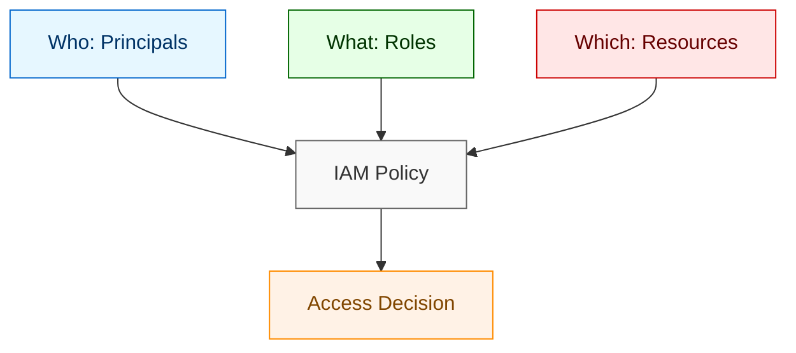
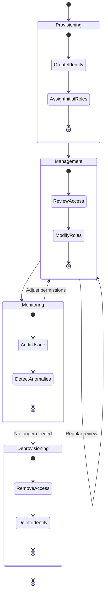
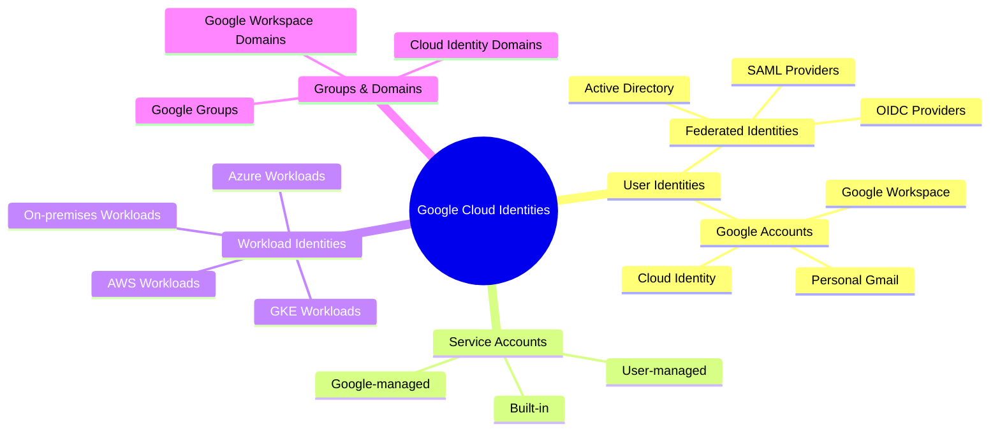
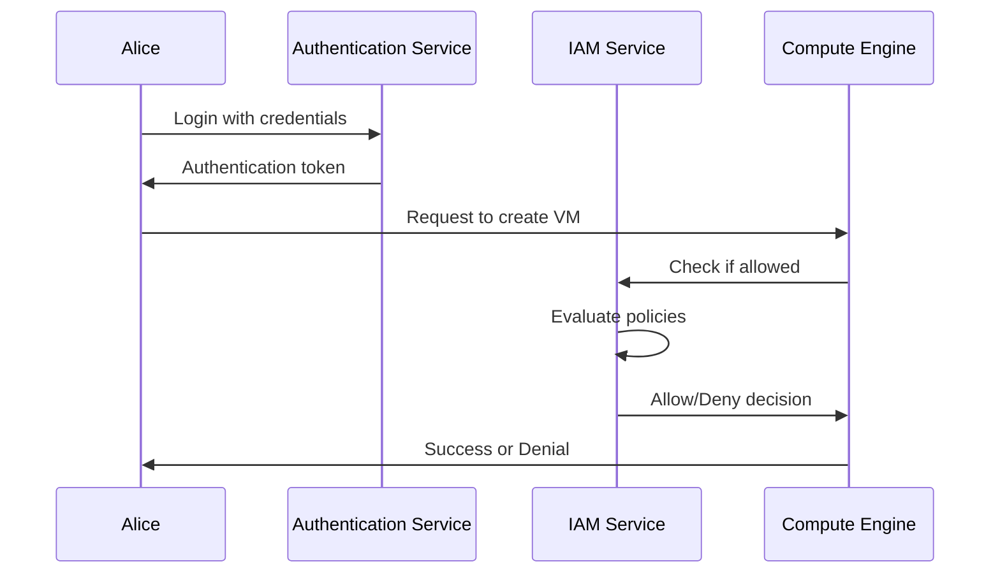
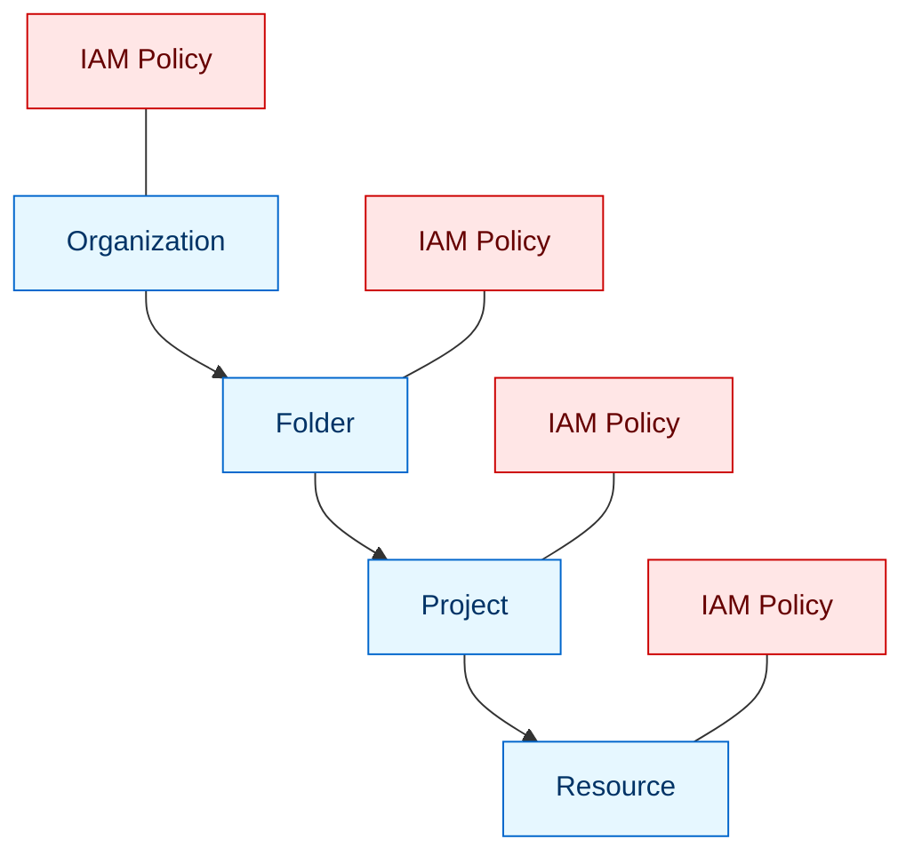
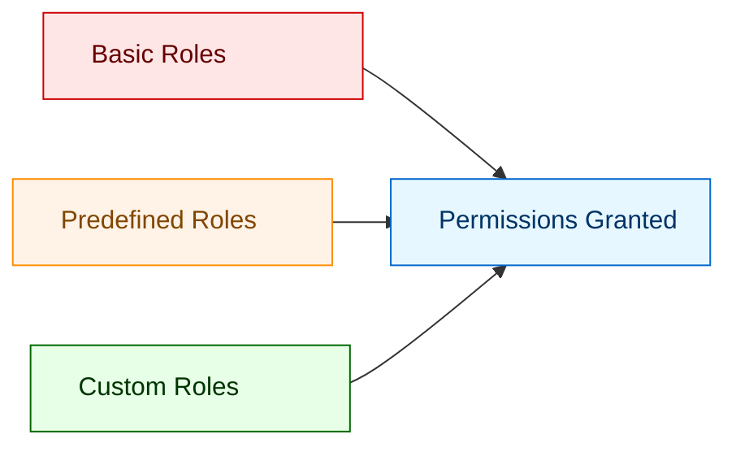
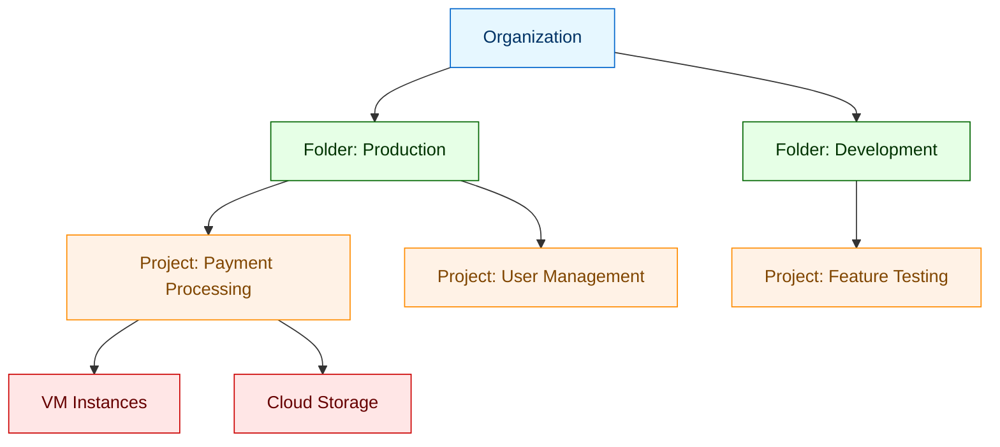
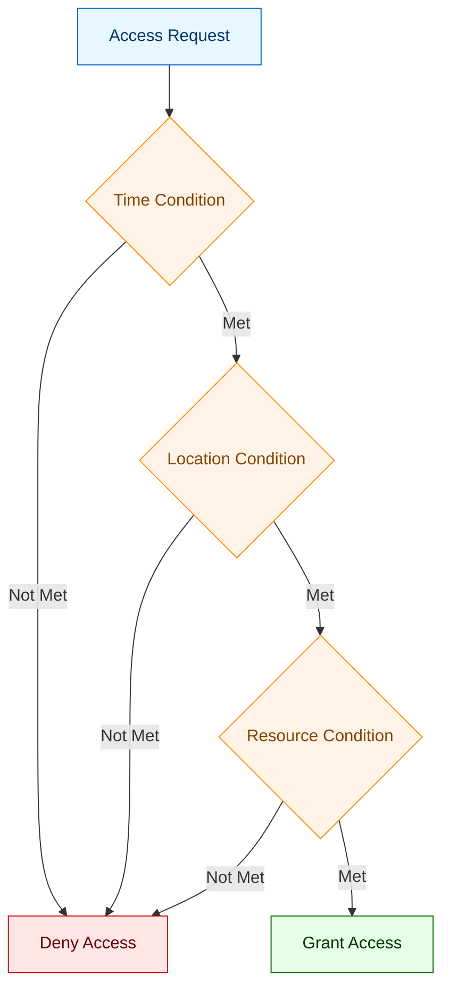
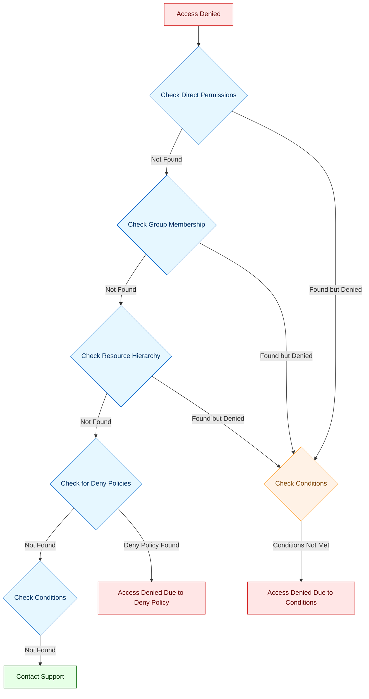
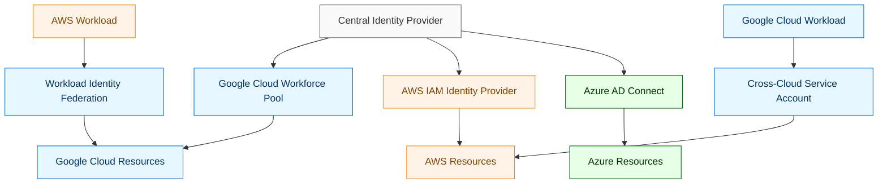

# Identity Management for Google Cloud for the Impatient: From Novice to Practitioner in Record Time

## 1. Introduction

### 1.1 Why Identity Management Matters

Imagine this: It's 3 AM, and your phone rings. Your company's cloud infrastructure has been compromised. Customer data is leaking, services are down, and the attack vector? A forgotten service account with excessive permissions that nobody remembered existed. This nightmare scenario plays out with alarming frequency across organizations of all sizes, and it all stems from one fundamental challenge: identity management.

Why should you care about identity management in Google Cloud? Because it's the foundation of your entire security posture. Think of it as the bouncer at the door of your cloud environment – if the bouncer doesn't know who to let in and who to keep out, chaos ensues. In 2023 alone, over 80% of data breaches involved compromised identities or access credentials, with the average cost of a breach exceeding \$4.45 million.

Let me share a quick story. A financial services client of mine once boasted about their "military-grade encryption" and sophisticated security tools. Yet, they were breached when an intern was accidentally granted Owner permissions on a production project through a misconfigured group membership. The attacker didn't need to break encryption – they just walked through the front door with valid credentials.

**Pause and Reflect**: Think about your current Google Cloud environment. Do you know exactly who has access to what resources? Could you confidently list all the service accounts in your environment and what they're used for? If not, you're not alone – but you are at risk.

### 1.2 The Google Cloud Identity Landscape

Google Cloud's identity management isn't just a single service – it's an ecosystem of interconnected components that work together to secure your resources. At its core is Identity and Access Management (IAM), which provides a unified system to control who (identity) can do what (roles) on which resources.

Think of Google Cloud's identity system like a modern city's access control. You have:

- **Citizens** (user accounts) who live and work in the city
- **Service robots** (service accounts) that perform specific functions
- **Visitor passes** (temporary credentials) for guests
- **Security checkpoints** (authentication) at building entrances
- **Access cards** (authorization) that determine which rooms you can enter

This ecosystem is built on three fundamental questions:

1. **Who** is accessing your resources? (Principals)
2. **What** are they allowed to do? (Roles and Permissions)
3. **Which** resources can they access? (Resources and Hierarchy)


Understanding how these components interact is crucial for effective identity management. The good news? Once you grasp these fundamentals, you'll be able to implement secure identity practices across any Google Cloud environment.

### 1.3 What You'll Learn

By the end of this article, you'll be able to:

1. **Identify and manage** the different types of identities in Google Cloud
2. **Implement** proper access controls using IAM policies
3. **Secure** service accounts and workload identities
4. **Troubleshoot** common identity and access issues
5. **Design** identity architectures for various organizational needs

More importantly, you'll gain practical, hands-on knowledge that you can apply immediately. No theoretical fluff – just actionable techniques that will make your Google Cloud environment more secure.

**Pro Tip**: As you read, keep a Google Cloud project open to try concepts in real-time. Nothing beats hands-on practice for cementing your understanding of identity management principles.

## 2. Identity Fundamentals

### 2.1 The Identity Lifecycle

Every identity in Google Cloud follows a lifecycle – from creation to eventual decommissioning. Understanding this lifecycle is crucial for maintaining security and preventing identity sprawl.

Think of identity lifecycle management like tending a garden. You plant seeds (create identities), nurture the plants (manage permissions), prune when necessary (review access), and eventually remove plants that no longer serve a purpose (decommission).

The identity lifecycle consists of four key phases:

1. **Provisioning**: Creating the identity and establishing initial access
2. **Management**: Ongoing maintenance, including permission changes and role assignments
3. **Monitoring**: Tracking usage, detecting anomalies, and ensuring compliance
4. **Deprovisioning**: Removing access when no longer needed


Let's look at a practical example. When a new developer joins your team, you might:

1. **Provision**: Create a Google account for them and add them to the appropriate Google Groups
2. **Manage**: Grant project-specific roles based on their responsibilities
3. **Monitor**: Review their access patterns and ensure they're using only what they need
4. **Deprovision**: Remove their access when they leave the team or company

**Quick Quiz**: What phase of the identity lifecycle is most often neglected in organizations?

- A) Provisioning
- B) Management
- C) Monitoring
- D) Deprovisioning

The answer is D) Deprovisioning. Organizations often forget to remove access when it's no longer needed, creating security risks from orphaned accounts.

### 2.2 Types of Identities

Google Cloud supports several types of identities, each serving different purposes and use cases. Understanding when to use each type is fundamental to proper identity management.

#### User Identities

User identities represent human users who interact with Google Cloud. These come in two main flavors:

1. **Google Accounts**: Individual accounts that can be personal Gmail accounts or managed through Google Workspace/Cloud Identity
2. **Federated Identities**: External identities from your existing identity provider (like Active Directory) that are mapped to Google Cloud through federation

For example, your marketing team might use their existing corporate email accounts (federated through Microsoft Entra ID), while your development team uses Google Workspace accounts managed by your organization.

#### Service Accounts

Unlike user accounts, service accounts represent non-human identities that applications and workloads use to authenticate to Google Cloud services. Think of service accounts as specialized robot workers – they perform specific tasks with precisely defined permissions.

Service accounts come in three types:

1. **User-managed**: Created and managed by you for your applications
2. **Built-in**: Pre-defined accounts for Google Cloud services
3. **Google-managed**: Created and managed by Google for internal processes

For instance, you might create a service account for your application that needs to upload files to Cloud Storage, with permissions limited to just that specific bucket.

#### Workload Identities

Workload Identity Federation extends Google Cloud's identity capabilities to external workloads running outside Google Cloud, such as in AWS, Azure, or on-premises. This eliminates the need to manage service account keys, enhancing security.

For example, an application running in AWS can use its native AWS IAM role to authenticate to Google Cloud services without managing Google Cloud credentials.

#### Groups and Domains

Groups are collections of users and service accounts that make permission management more efficient. Instead of assigning roles to individual users, you can assign them to groups, simplifying administration.

Domains represent all users within your organization's internet domain (like example.com) and can be used for broad permission assignments.



**Pro Tip**: Always use groups for permission management rather than assigning permissions directly to individual users. This "role assignment by group" approach makes access management much more scalable and reduces the risk of permission errors.

### 2.3 Authentication vs. Authorization

Understanding the difference between authentication and authorization is crucial for effective identity management. They're often confused, but they serve distinct purposes in your security architecture.

**Authentication** answers the question "Who are you?" It verifies the identity of a user or service. Think of it as checking someone's ID at the entrance of a building.

**Authorization** answers the question "What are you allowed to do?" It determines what actions an authenticated identity can perform on which resources. This is like checking if someone has the right keycard to access specific rooms once they're inside the building.

In Google Cloud, these processes work together:

1. **Authentication**: A user signs in with their Google account credentials, or a service authenticates using a service account key or workload identity federation.
2. **Authorization**: Google Cloud IAM checks if the authenticated identity has the necessary permissions to perform the requested action on the specified resource.

Let's see this in action with a simple example:

1. Alice authenticates to Google Cloud using her corporate Google Workspace account
2. She tries to create a new VM in a project
3. IAM checks if Alice has the compute.instances.create permission in that project
4. If she has the permission, the request proceeds; if not, it's denied


**Common Misconception**: Many people think that having a Google account automatically grants them access to all Google Cloud resources. In reality, authentication only establishes your identity – you still need explicit authorization through IAM policies to access specific resources.

**Pause and Reflect**: In your organization, how do you currently manage the distinction between authentication and authorization? Are there gaps in either process that could lead to security vulnerabilities?

## 3. IAM Core Concepts

### 3.1 The IAM Policy Model

At the heart of Google Cloud's identity management is the IAM policy model. This is the framework that determines who can do what on which resources.

An IAM policy is a collection of statements that define permissions for Google Cloud resources. Think of it as the rulebook that the security system consults when deciding whether to allow or deny an action.

Each IAM policy consists of one or more bindings, where each binding grants specific roles to specific principals on a specific resource. The structure follows this pattern:

```
WHO (principal) can do WHAT (role) on WHICH resource
```

For example, "Alice (WHO) can be a Compute Admin (WHAT) on Project X (WHICH)".

Let's look at a simple IAM policy in JSON format:

```json
{
  "bindings": [
    {
      "role": "roles/compute.admin",
      "members": [
        "user:alice@example.com"
      ]
    },
    {
      "role": "roles/storage.objectViewer",
      "members": [
        "user:bob@example.com",
        "group:viewers@example.com"
      ]
    }
  ]
}
```

This policy grants the Compute Admin role to Alice and the Storage Object Viewer role to both Bob and everyone in the viewers group.

IAM policies follow a hierarchical inheritance model that aligns with Google Cloud's resource hierarchy:



Permissions granted at a higher level (like organization) are inherited by all resources beneath it. This means if you grant someone Organization Admin at the organization level, they'll have that role for all folders, projects, and resources within that organization.

**Pro Tip**: Always apply the principle of least privilege by granting permissions at the most specific resource level possible. This minimizes the scope of access and reduces security risks.

### 3.2 Principals: Who Gets Access

Principals are the entities to which you grant access in Google Cloud. They represent the "WHO" in your access control statements.

In Google Cloud IAM, principals can be:

1. **Google Accounts**: Individual users identified by email addresses
2. **Service Accounts**: Non-human identities for applications and services
3. **Google Groups**: Collections of Google Accounts and service accounts
4. **Google Workspace Domains**: All users in an organization's domain
5. **Cloud Identity Domains**: Similar to Google Workspace but without Google Workspace applications
6. **All Authenticated Users**: Any user authenticated with a Google Account
7. **All Users**: Anyone on the internet (authenticated or not)

Each principal type serves different purposes. For example:

- Use individual Google Accounts for direct user access
- Use service accounts for application-level access
- Use Google Groups for role-based access control
- Use domains for broad organizational permissions

Let's look at a practical example. Imagine you're setting up access for a new project:

```
Project: e-commerce-platform
Team structure:
- Development team (5 developers)
- Operations team (3 operators)
- Data analysts (2 analysts)
- CI/CD pipeline (automated deployment)
```

Instead of managing 10+ individual permissions, you might:

1. Create a `developers@example.com` group and add all developers
2. Create an `operators@example.com` group and add all operators
3. Create a `data-analysts@example.com` group and add all analysts
4. Create a `cicd-deployer@project-id.iam.gserviceaccount.com` service account

Then assign appropriate roles to each group and the service account.

**Common Pitfall**: Using individual user accounts instead of groups for permission management. This creates an administrative nightmare as your organization grows and people change roles.

### 3.3 Roles: What Access is Granted

Roles are collections of permissions that you can grant to principals. They define what actions principals can perform on Google Cloud resources.

Google Cloud offers three types of roles:

1. **Basic (Primitive) Roles**: Broad, legacy roles (Owner, Editor, Viewer) that provide coarse-grained access control
2. **Predefined Roles**: Google-managed roles designed for specific services and use cases
3. **Custom Roles**: User-defined roles that contain precisely the permissions you specify

Basic roles are simple but dangerous in production environments because they grant broad permissions. For example, the Editor role grants permission to modify most resources in a project.

Predefined roles provide more granular control. For instance, instead of granting someone the Editor role to manage Compute Engine instances, you could grant them the more specific Compute Admin role.

Custom roles offer the most precise control, allowing you to specify exactly which permissions a principal needs. This follows the principle of least privilege – granting only the permissions necessary to perform a task.

Let's compare these approaches with a practical example:

```
Scenario: Grant a developer permission to manage Compute Engine instances but not billing or IAM

Basic role approach (NOT recommended):
- Grant Editor role (too many permissions)

Predefined role approach (Better):
- Grant Compute Admin role (still some extra permissions)

Custom role approach (Best):
- Create custom role with only:
  - compute.instances.create
  - compute.instances.delete
  - compute.instances.start
  - compute.instances.stop
  - compute.instances.get
```

The custom role approach provides exactly the permissions needed, no more and no less.



**Pro Tip**: Start with predefined roles when possible, and only create custom roles when you need more precise permission control. This balances security with administrative overhead.

### 3.4 Resources: What is Being Accessed

Resources are the Google Cloud entities that principals can access. They represent the "WHICH" in your access control statements.

Google Cloud organizes resources hierarchically:

1. **Organization**: The root node representing your company
2. **Folders**: Containers for organizing projects
3. **Projects**: The main containers for Google Cloud resources
4. **Resources**: Individual services and components (VMs, buckets, databases, etc.)

This hierarchy affects how IAM policies work. Permissions granted at a higher level are inherited by all resources beneath it.

For example, if you grant someone the Compute Admin role at the folder level, they'll have that role for all projects in that folder. If you grant it at the project level, they'll have it only for that specific project.



Resource naming follows a hierarchical pattern that reflects this structure. For example, a Compute Engine instance might have a full resource name like:

```
//compute.googleapis.com/projects/my-project/zones/us-central1-a/instances/my-instance
```

This name identifies the specific resource within the hierarchy.

**Practical Example**: Let's say you want to grant different levels of access to different teams:

1. Grant the Security team audit permissions at the organization level so they can review all resources
2. Grant the Platform team admin permissions at the folder level for production infrastructure
3. Grant development teams owner permissions only on their specific projects
4. Grant the Database team admin permissions only on database resources across projects

**Common Misconception**: Many people think they need to grant permissions at every level of the hierarchy. In reality, permissions are inherited downward, so you only need to grant them at the highest appropriate level.

## 4. Practical IAM Implementation

### 4.1 Setting Up Basic Identity Management

Now that we understand the fundamentals, let's put them into practice with a basic identity management setup. We'll start with a simple scenario and build from there.

**Scenario**: You're setting up a new project for a web application with three teams: developers, operators, and data analysts.

**Step 1: Create Google Groups for each team**

First, create Google Groups to manage team access:

- developers@example.com
- operators@example.com
- analysts@example.com

This allows you to manage permissions at the group level rather than for individual users.

**Step 2: Create the project and assign initial roles**

Create a new project and assign appropriate predefined roles to each group:

```bash
# Create a new project
gcloud projects create web-application-123 --name="Web Application"

# Set the project as the current working project
gcloud config set project web-application-123

# Assign roles to groups
gcloud projects add-iam-policy-binding web-application-123 \
  --member="group:developers@example.com" \
  --role="roles/editor"

gcloud projects add-iam-policy-binding web-application-123 \
  --member="group:operators@example.com" \
  --role="roles/compute.admin"

gcloud projects add-iam-policy-binding web-application-123 \
  --member="group:analysts@example.com" \
  --role="roles/bigquery.dataViewer"
```

Note: Using the Editor role for developers isn't ideal for production, but it's a starting point for this example.

**Step 3: Refine permissions with more specific roles**

As you better understand each team's needs, replace broad roles with more specific ones:

```bash
# Remove the broad Editor role
gcloud projects remove-iam-policy-binding web-application-123 \
  --member="group:developers@example.com" \
  --role="roles/editor"

# Add more specific roles
gcloud projects add-iam-policy-binding web-application-123 \
  --member="group:developers@example.com" \
  --role="roles/compute.instanceAdmin.v1"

gcloud projects add-iam-policy-binding web-application-123 \
  --member="group:developers@example.com" \
  --role="roles/storage.objectAdmin"
```

This follows the principle of least privilege by granting only the permissions each team needs.

**Step 4: Verify the IAM policy**

Check that your permissions are set correctly:

```bash
gcloud projects get-iam-policy web-application-123
```

This will show you the current IAM policy for your project, allowing you to verify that the right groups have the right roles.

**Quick Quiz**: What's wrong with this IAM setup?

- A) Using Google Groups instead of individual accounts
- B) Using the Editor role initially for developers
- C) Not granting any organization-level permissions
- D) Using predefined roles instead of custom roles

The answer is B) Using the Editor role initially for developers. The Editor role grants broad permissions that violate the principle of least privilege.

### 4.2 Service Account Management

Service accounts are essential for applications and automated processes. Let's explore how to create and manage them securely.

**Scenario**: Your web application needs to access Cloud Storage and Pub/Sub.

**Step 1: Create a service account**

```bash
# Create a service account for your application
gcloud iam service-accounts create web-app-sa \
  --display-name="Web Application Service Account"
```

This creates a service account with the email `web-app-sa@web-application-123.iam.gserviceaccount.com`.

**Step 2: Grant the service account appropriate roles**

```bash
# Grant Storage Object Admin role for Cloud Storage access
gcloud projects add-iam-policy-binding web-application-123 \
  --member="serviceAccount:web-app-sa@web-application-123.iam.gserviceaccount.com" \
  --role="roles/storage.objectAdmin"

# Grant Pub/Sub Publisher role for Pub/Sub access
gcloud projects add-iam-policy-binding web-application-123 \
  --member="serviceAccount:web-app-sa@web-application-123.iam.gserviceaccount.com" \
  --role="roles/pubsub.publisher"
```

This gives the service account only the permissions it needs to function.

**Step 3: Use the service account with your application**

There are several ways to use a service account:

1. **Attach it to a Compute Engine instance**:
```bash
gcloud compute instances create web-server \
  --service-account=web-app-sa@web-application-123.iam.gserviceaccount.com \
  --scopes=https://www.googleapis.com/auth/cloud-platform
```

2. **Use Application Default Credentials in your code**:
```python
from google.cloud import storage
# ADC will use the attached service account automatically
client = storage.Client()
bucket = client.get_bucket('my-bucket')
```

3. **Create and download a key (not recommended for production)**:
```bash
gcloud iam service-accounts keys create key.json \
  --iam-account=web-app-sa@web-application-123.iam.gserviceaccount.com
```

The first two methods are preferred as they don't require managing key files.

**Pro Tip**: Avoid creating and downloading service account keys whenever possible. They're difficult to manage securely and represent a significant security risk if compromised. Instead, use attached service accounts or workload identity federation.

**Step 4: Implement service account best practices**

To maintain security:

1. **Use dedicated service accounts** for different applications or components
2. **Apply least privilege** by granting only necessary permissions
3. **Rotate keys regularly** if you must use key files
4. **Monitor service account activity** to detect unauthorized access
5. **Set up alerts** for suspicious service account activity

**Common Pitfall**: Creating a single service account with broad permissions for multiple applications. This violates the principle of separation of duties and increases your attack surface.

### 4.3 Workload Identity Federation

Workload Identity Federation allows workloads outside Google Cloud to access Google Cloud resources without using service account keys. This is particularly useful for multi-cloud or hybrid environments.

**Scenario**: You have an application running in AWS that needs to access Google Cloud Storage.

**Step 1: Create a workload identity pool**

```bash
# Create a workload identity pool
gcloud iam workload-identity-pools create aws-pool \
  --location="global" \
  --description="Pool for AWS workloads" \
  --display-name="AWS Workload Pool"
```

This creates a pool to manage external identities from AWS.

**Step 2: Create a workload identity provider**

```bash
# Create an AWS workload identity provider
gcloud iam workload-identity-pools providers create-aws aws-provider \
  --location="global" \
  --workload-identity-pool="aws-pool" \
  --account-id="123456789012" \
  --attribute-mapping="google.subject=assertion.arn"
```

This configures how AWS identities are mapped to Google Cloud identities.

**Step 3: Create a service account for the external workload**

```bash
# Create a service account for the AWS workload
gcloud iam service-accounts create aws-application-sa \
  --display-name="AWS Application Service Account"
```

This service account will be impersonated by the AWS workload.

**Step 4: Grant the external identity permission to impersonate the service account**

```bash
# Allow the AWS identity to impersonate the service account
gcloud iam service-accounts add-iam-policy-binding aws-application-sa@web-application-123.iam.gserviceaccount.com \
  --role="roles/iam.workloadIdentityUser" \
  --member="principalSet://iam.googleapis.com/projects/PROJECT_NUMBER/locations/global/workloadIdentityPools/aws-pool/attribute.aws_role/ROLE_NAME"
```

Replace PROJECT_NUMBER with your Google Cloud project number and ROLE_NAME with your AWS role name.

**Step 5: Grant the service account appropriate roles**

```bash
# Grant Storage Object Admin role to the service account
gcloud projects add-iam-policy-binding web-application-123 \
  --member="serviceAccount:aws-application-sa@web-application-123.iam.gserviceaccount.com" \
  --role="roles/storage.objectAdmin"
```

This gives the service account (and by extension, the AWS workload) the necessary permissions.

**Step 6: Configure your AWS application**

In your AWS application, use the AWS SDK to obtain temporary credentials, then exchange them for Google Cloud credentials:

```python
import boto3
import requests
import json
from google.auth.transport.requests import Request
from google.oauth2 import id_token

# Get AWS credentials
sts = boto3.client('sts')
response = sts.get_caller_identity()

# Exchange AWS credentials for Google Cloud credentials
token_url = f"https://sts.googleapis.com/v1/token"
request_body = {
    "audience": "//iam.googleapis.com/projects/PROJECT_NUMBER/locations/global/workloadIdentityPools/aws-pool/providers/aws-provider",
    "grantType": "urn:ietf:params:oauth:grant-type:token-exchange",
    "requestedTokenType": "urn:ietf:params:oauth:token-type:access_token",
    "subjectTokenType": "urn:ietf:params:aws:token-type:aws4_request",
    "subjectToken": json.dumps({
        "url": "https://sts.amazonaws.com/",
        "headers": [
            {"key": "Authorization", "value": "AWS4-HMAC-SHA256..."},
            {"key": "X-Amz-Date", "value": "..."}
        ],
        "method": "POST",
        "body": "Action=GetCallerIdentity&Version=2011-06-15"
    })
}

response = requests.post(token_url, json=request_body)
federated_token = response.json()["access_token"]

# Use the token to access Google Cloud resources
from google.cloud import storage
client = storage.Client()
bucket = client.get_bucket('my-bucket')
```

This allows your AWS application to access Google Cloud resources without managing service account keys.

**Pro Tip**: Workload Identity Federation eliminates the need for service account keys, significantly improving security. It's the recommended approach for workloads running outside Google Cloud.

## 5. Advanced IAM Techniques

### 5.1 Conditional Access

Conditional access allows you to define more nuanced access controls based on attributes like time, location, or resource properties. This provides an additional layer of security beyond basic role-based access control.

**Scenario**: You want to allow developers to access production resources only during business hours and from corporate networks.

**Step 1: Define an access level in Access Context Manager**

First, create an access level that defines your corporate network:

```bash
# Create an access policy (if you don't already have one)
gcloud access-context-manager policies create \
  --organization=123456789012 \
  --title="Corporate Access Policy"

# Create an access level for the corporate network
gcloud access-context-manager levels create corporate_network \
  --policy=POLICY_ID \
  --title="Corporate Network" \
  --conditions="ipSubnetworks=['203.0.113.0/24', '198.51.100.0/24']"
```

This defines what constitutes your corporate network based on IP ranges.

**Step 2: Create a conditional role binding**

Now, add a condition to the role binding that checks both the time and the access level:

```bash
# Add a conditional role binding
gcloud projects add-iam-policy-binding web-application-123 \
  --member="group:developers@example.com" \
  --role="roles/compute.admin" \
  --condition="expression=request.time.getHours('America/Los_Angeles') >= 9 && request.time.getHours('America/Los_Angeles') < 17 && request.time.getDayOfWeek('America/Los_Angeles') >= 1 && request.time.getDayOfWeek('America/Los_Angeles') <= 5 && 'accessPolicies/POLICY_ID/accessLevels/corporate_network' in request.auth.access_levels,title=BusinessHoursAndCorporateNetwork"
```

This condition grants the Compute Admin role only during business hours (9 AM to 5 PM Pacific Time, Monday through Friday) and only from the corporate network.

**Step 3: Test the conditional access**

To verify that the condition works:

1. Try accessing Compute Engine resources during business hours from the corporate network (should succeed)
2. Try accessing outside business hours or from a different network (should fail)

Conditional access can be based on various attributes:

- **Time-based conditions**: Limit access to specific hours or days
- **Location-based conditions**: Restrict access to specific networks or regions
- **Resource-based conditions**: Apply permissions only to resources with specific attributes
- **Request-based conditions**: Consider properties of the request itself



**Pro Tip**: Use conditions sparingly and focus on high-value resources. Excessive conditions can make your IAM policies complex and difficult to manage.

### 5.2 Custom Roles for Precise Access

Custom roles allow you to create precisely tailored permission sets when predefined roles don't meet your needs. This is essential for implementing least privilege in complex environments.

**Scenario**: Your database administrators need specific permissions across multiple Google Cloud services, but no predefined role matches their requirements.

**Step 1: Identify the required permissions**

First, determine exactly which permissions your DBAs need:

```
# Database administration permissions
cloudsql.instances.create
cloudsql.instances.update
cloudsql.instances.restart
cloudsql.databases.get
cloudsql.databases.list
cloudsql.databases.create
cloudsql.databases.update

# Monitoring permissions
monitoring.timeSeries.list
monitoring.alertPolicies.get
monitoring.alertPolicies.list

# Logging permissions
logging.logEntries.list
logging.logs.list
```

This list includes only the permissions necessary for database administration tasks.

**Step 2: Create a custom role**

Create a YAML file named `dba-role.yaml` with the role definition:

```yaml
title: "Database Administrator"
description: "Custom role for database administrators"
stage: "GA"
includedPermissions:
- cloudsql.instances.create
- cloudsql.instances.update
- cloudsql.instances.restart
- cloudsql.databases.get
- cloudsql.databases.list
- cloudsql.databases.create
- cloudsql.databases.update
- monitoring.timeSeries.list
- monitoring.alertPolicies.get
- monitoring.alertPolicies.list
- logging.logEntries.list
- logging.logs.list
```

Then create the custom role:

```bash
# Create a custom role at the project level
gcloud iam roles create DatabaseAdmin \
  --project=web-application-123 \
  --file=dba-role.yaml
```

This creates a custom role specific to your project.

**Step 3: Assign the custom role**

Assign the custom role to your DBA group:

```bash
gcloud projects add-iam-policy-binding web-application-123 \
  --member="group:dbas@example.com" \
  --role="projects/web-application-123/roles/DatabaseAdmin"
```

Now your DBAs have exactly the permissions they need, no more and no less.

**Step 4: Test and refine the custom role**

Have your DBAs test the role to ensure it includes all necessary permissions. If they encounter "permission denied" errors, you can update the role:

```bash
# Update the custom role
gcloud iam roles update DatabaseAdmin \
  --project=web-application-123 \
  --file=updated-dba-role.yaml
```

This iterative approach helps you refine the role until it perfectly matches your requirements.

**Best Practices for Custom Roles**:

1. **Base on existing roles**: Start with predefined roles and modify them rather than building from scratch
2. **Test thoroughly**: Verify that the role works for all required tasks
3. **Document permissions**: Maintain clear documentation of what each custom role allows
4. **Review regularly**: Periodically review custom roles to ensure they remain appropriate
5. **Use descriptive names**: Choose role names that clearly indicate their purpose

**Common Pitfall**: Creating too many custom roles with overlapping permissions, which becomes difficult to manage. Focus on creating roles that align with job functions rather than specific tasks.

### 5.3 Policy Troubleshooting

Even with careful planning, IAM issues can arise. Understanding how to troubleshoot access problems is a critical skill for identity management.

**Scenario**: A user reports they can't access a Cloud Storage bucket despite being in a group that should have access.

**Step 1: Use Policy Troubleshooter**

The IAM Policy Troubleshooter helps you understand why a principal does or doesn't have access to a resource:

```bash
# Use Policy Troubleshooter
gcloud iam troubleshoot \
  --principal=user@example.com \
  --permission=storage.objects.get \
  --resource=//storage.googleapis.com/projects/_/buckets/my-bucket
```

This shows you all the policies that affect this permission for this user on this resource.

**Step 2: Check the effective IAM policy**

Examine the effective IAM policy on the resource:

```bash
# Get the IAM policy for the bucket
gcloud storage buckets get-iam-policy gs://my-bucket
```

This shows all role bindings on the bucket. Check if the user's group is included.

**Step 3: Verify group membership**

Confirm that the user is actually in the group they claim to be in. This might require checking Google Workspace or Cloud Identity administration.

**Step 4: Check for deny policies**

IAM deny policies override allow policies. Check if there's a deny policy affecting the user:

```bash
# List deny policies
gcloud iam deny-policies list --organization=123456789012
```

A deny policy could be blocking access even if an allow policy grants it.

**Step 5: Investigate conditional role bindings**

If the role binding has conditions, verify that the conditions are being met:

```bash
# Get detailed IAM policy
gcloud projects get-iam-policy web-application-123 --format=json
```

Look for conditions in the role bindings and check if the user's access request meets those conditions.

**Common IAM Issues and Solutions**:

1. **Missing inheritance**: Check if permissions are granted at a higher level in the resource hierarchy
2. **Group propagation delay**: Changes to group membership can take up to 24 hours to propagate
3. **Conflicting policies**: Multiple policies might interact in unexpected ways
4. **Service account issues**: Check if a service account has been disabled or lacks the necessary permissions
5. **Resource constraints**: Some resources have specific IAM limitations


**Pro Tip**: Enable Cloud Audit Logs for IAM changes. This creates an audit trail that can be invaluable for troubleshooting access issues and security incidents.

## 6. Identity Security Best Practices

### 6.1 Principle of Least Privilege

The principle of least privilege is fundamental to secure identity management. It states that users and services should have only the permissions necessary to perform their tasks and nothing more.

**Why It Matters**: Overly permissive access increases your attack surface and the potential impact of compromised accounts. If an attacker gains access to an account with excessive permissions, they can cause significantly more damage.

**Implementing Least Privilege**:

1. **Start with minimal access**: Begin by granting minimal permissions and add more only as needed
2. **Use predefined and custom roles**: Choose or create roles that closely match job requirements
3. **Implement just-in-time access**: Grant elevated permissions only when needed and for limited durations
4. **Separate duties**: Ensure no single person has excessive control by separating critical functions
5. **Regular access reviews**: Periodically review and revoke unnecessary permissions

Let's look at a practical example of implementing least privilege:

**Scenario**: Your organization has a deployment pipeline that needs to deploy applications to Compute Engine.

**Overly permissive approach (avoid)**:

- Grant the service account the Editor role on the project

**Least privilege approach (recommended)**:

1. Create a custom role with only these permissions:
    - compute.instances.create
    - compute.instances.delete
    - compute.instances.update
    - compute.disks.create
    - compute.disks.delete
2. Grant this custom role to the deployment service account
3. Set up monitoring to alert on any attempts to use permissions outside this set

**Quick Quiz**: Which of these violates the principle of least privilege?

- A) Granting a developer the Compute Instance Admin role for their project
- B) Creating a custom role with exactly the permissions needed for a specific task
- C) Granting the Owner role to all members of the IT department
- D) Using temporary elevated access for emergency situations

The answer is C) Granting the Owner role to all members of the IT department. This gives everyone in IT full control over all resources, far exceeding what most IT staff need for their daily work.

### 6.2 Securing Service Accounts

Service accounts represent one of the biggest security risks in Google Cloud if not properly managed. They often have programmatic access to resources and may not be subject to the same security controls as user accounts.

**Best Practices for Service Account Security**:

1. **Avoid service account keys**: Use attached service accounts or workload identity federation instead of creating and downloading key files
2. **Use dedicated service accounts**: Create separate service accounts for different applications or components
3. **Apply least privilege**: Grant service accounts only the permissions they need
4. **Rotate keys regularly**: If you must use keys, rotate them at least every 90 days
5. **Monitor service account activity**: Set up alerts for suspicious behavior
6. **Limit who can act as service accounts**: Carefully control the serviceAccountUser role
7. **Disable unused service accounts**: Remove or disable service accounts that are no longer needed

Let's implement these practices with a practical example:

**Scenario**: You have a legacy application that requires a service account key.

**Step 1: Create a dedicated service account with minimal permissions**

```bash
# Create a dedicated service account
gcloud iam service-accounts create legacy-app-sa \
  --display-name="Legacy Application Service Account"

# Grant only necessary permissions
gcloud projects add-iam-policy-binding web-application-123 \
  --member="serviceAccount:legacy-app-sa@web-application-123.iam.gserviceaccount.com" \
  --role="roles/storage.objectViewer"
```

This creates a service account with read-only access to Cloud Storage objects.

**Step 2: Create a key with an expiration date**

```bash
# Create a key that expires in 90 days
gcloud iam service-accounts keys create key.json \
  --iam-account=legacy-app-sa@web-application-123.iam.gserviceaccount.com \
  --key-file-type=json
```

Note: While Google Cloud doesn't directly support key expiration, you can implement this through organizational policies and automation.

**Step 3: Set up key rotation**

Create a Cloud Scheduler job to rotate the key automatically:

```bash
# Create a Cloud Function for key rotation
# (Code for the function not shown for brevity)

# Schedule key rotation every 90 days
gcloud scheduler jobs create http rotate-legacy-app-key \
  --schedule="0 0 1 */3 *" \
  --uri="https://us-central1-web-application-123.cloudfunctions.net/rotateServiceAccountKey" \
  --message-body='{"service_account":"legacy-app-sa@web-application-123.iam.gserviceaccount.com"}'
```

This schedules key rotation every three months.

**Step 4: Monitor service account activity**

Set up a Cloud Monitoring alert for suspicious service account activity:

```bash
# Create a log-based metric for service account usage
gcloud logging metrics create service-account-usage \
  --description="Monitor service account activity" \
  --log-filter="protoPayload.authenticationInfo.principalEmail=legacy-app-sa@web-application-123.iam.gserviceaccount.com"

# Create an alert policy based on this metric
# (Configuration through the Google Cloud Console)
```

This alerts you to unusual activity from the service account.

**Pro Tip**: Use Organization Policy Constraints to enforce service account security across your organization. For example, you can disable service account key creation for most projects and only allow exceptions where absolutely necessary.

### 6.3 Audit and Compliance

Effective identity management isn't just about setting up the right permissions—it's also about monitoring and auditing access to ensure compliance and detect security issues.

**Key Audit and Compliance Practices**:

1. **Enable comprehensive audit logging**: Capture who did what, when, and where
2. **Implement regular access reviews**: Periodically verify that access remains appropriate
3. **Monitor for suspicious activity**: Set up alerts for unusual access patterns
4. **Maintain compliance documentation**: Document your identity controls for regulatory requirements
5. **Conduct regular security assessments**: Test your identity management implementation for vulnerabilities

Let's implement these practices:

**Step 1: Enable Cloud Audit Logs**

Ensure you have the right audit logs enabled:

```bash
# Enable Data Access audit logs for all services
gcloud projects update web-application-123 \
  --update-data-access-logs-enabled
```

This captures detailed logs of who accessed what data.

**Step 2: Set up log exports for long-term retention**

Export logs to Cloud Storage for compliance requirements:

```bash
# Create a storage bucket for logs
gcloud storage buckets create gs://web-application-123-audit-logs \
  --location=us-central1

# Set up a log sink to export audit logs
gcloud logging sinks create audit-logs-sink \
  storage.googleapis.com/web-application-123-audit-logs \
  --log-filter="logName:\"projects/web-application-123/logs/cloudaudit.googleapis.com\""
```

This ensures logs are retained for the required period.

**Step 3: Implement regular access reviews**

Create a process for quarterly access reviews:

1. Export IAM policies to a spreadsheet
2. Have managers review access for their teams
3. Document the review and any changes made
4. Implement approved changes

**Step 4: Set up monitoring for suspicious activity**

Create alerts for potentially malicious actions:

```bash
# Create a log-based metric for suspicious activity
gcloud logging metrics create suspicious-iam-changes \
  --description="Monitor suspicious IAM changes" \
  --log-filter="resource.type=\"iam_role\" AND protoPayload.methodName=\"google.iam.admin.v1.CreateRole\""

# Create an alert policy based on this metric
# (Configuration through the Google Cloud Console)
```

This alerts you to potentially unauthorized role creation.

**Step 5: Document your identity controls**

Maintain documentation of your identity management practices for compliance purposes:

1. IAM policies and procedures
2. Access review processes
3. Audit log configuration
4. Incident response procedures for identity-related events

**Compliance Considerations for Different Regulations**:

- **GDPR**: Ensure proper access controls for personal data and maintain detailed access logs
- **HIPAA**: Implement strict access controls for protected health information
- **PCI DSS**: Enforce least privilege for systems handling payment card data
- **SOC 2**: Document identity management processes and controls

**Pro Tip**: Use Google Cloud's Security Command Center to get a comprehensive view of your security posture, including identity-related vulnerabilities and recommendations.

## 7. Real-World Scenarios

### 7.1 Enterprise Identity Integration

Most enterprises already have existing identity systems. Integrating these with Google Cloud is a common challenge that requires careful planning and implementation.

**Scenario**: Your organization uses Microsoft Active Directory for identity management and wants to integrate it with Google Cloud.

**Option 1: Google Cloud Directory Sync (GCDS)**

GCDS synchronizes users and groups from your Active Directory to Cloud Identity or Google Workspace:

1. Install GCDS on a server that can access your Active Directory
2. Configure GCDS to map AD users and groups to Google Cloud
3. Set up scheduled synchronization
4. Users authenticate with their Google credentials

**Option 2: Federated Authentication with SAML**

Set up federation to allow users to sign in with their AD credentials:

1. Configure your identity provider (like ADFS) as a SAML provider
2. Set up Cloud Identity or Google Workspace for SAML authentication
3. Configure attribute mapping
4. Users authenticate with their AD credentials

**Option 3: Workforce Identity Federation**

For a more modern approach without requiring Google accounts:

1. Set up a workforce identity pool
2. Configure a provider for your identity system
3. Set up attribute mapping
4. Grant access to Google Cloud resources directly to your external identities

Let's implement Option 3 as it's the most modern approach:

**Step 1: Create a workforce identity pool**

```bash
# Create a workforce identity pool
gcloud iam workforce-pools create enterprise-pool \
  --location="global" \
  --description="Enterprise workforce pool" \
  --display-name="Enterprise Workforce Pool"
```

This creates a pool to manage your enterprise identities.

**Step 2: Create an OIDC provider for your identity system**

```bash
# Create an OIDC provider
gcloud iam workforce-pools providers create-oidc enterprise-idp \
  --workforce-pool="enterprise-pool" \
  --location="global" \
  --issuer-uri="https://login.microsoftonline.com/tenant-id/v2.0" \
  --attribute-mapping="google.subject=assertion.sub,google.groups=assertion.groups"
```

This configures how your Microsoft Entra ID identities map to Google Cloud.

**Step 3: Grant access to Google Cloud resources**

```bash
# Grant access to a project
gcloud projects add-iam-policy-binding web-application-123 \
  --member="principalSet://iam.googleapis.com/locations/global/workforcePools/enterprise-pool/attribute.department/engineering" \
  --role="roles/compute.viewer"
```

This grants the Compute Viewer role to all users in the engineering department.

**Step 4: Configure your applications to use workforce identity federation**

In your applications, use the workforce identity federation libraries to obtain Google Cloud credentials:

```python
import google.auth
from google.auth import identity_pool

# Configure the OIDC token provider
token_provider = identity_pool.OidcTokenProvider(
    audience="//iam.googleapis.com/locations/global/workforcePools/enterprise-pool/providers/enterprise-idp",
    token_url="https://login.microsoftonline.com/tenant-id/oauth2/v2.0/token",
    client_id="client-id",
    client_secret="client-secret"
)

# Get credentials
credentials = identity_pool.Credentials(
    token_provider=token_provider,
    service_account_impersonation_url=None
)

# Use the credentials to access Google Cloud resources
from google.cloud import storage
client = storage.Client(credentials=credentials)
bucket = client.get_bucket('my-bucket')
```

This allows your applications to access Google Cloud resources using your enterprise identities.

**Pro Tip**: When integrating with existing identity systems, start with a small pilot group before rolling out to the entire organization. This allows you to identify and address issues before they affect everyone.

### 7.2 DevOps and CI/CD Identity Patterns

DevOps and CI/CD pipelines present unique identity management challenges. These automated processes need secure access to Google Cloud resources without human intervention.

**Scenario**: You're setting up a CI/CD pipeline using GitHub Actions to deploy applications to Google Cloud.

**Step 1: Create a dedicated service account for the pipeline**

```bash
# Create a service account for the CI/CD pipeline
gcloud iam service-accounts create github-cicd-sa \
  --display-name="GitHub CI/CD Service Account"

# Grant necessary permissions
gcloud projects add-iam-policy-binding web-application-123 \
  --member="serviceAccount:github-cicd-sa@web-application-123.iam.gserviceaccount.com" \
  --role="roles/cloudbuild.builds.builder"

gcloud projects add-iam-policy-binding web-application-123 \
  --member="serviceAccount:github-cicd-sa@web-application-123.iam.gserviceaccount.com" \
  --role="roles/compute.admin"
```

This creates a dedicated service account with only the permissions needed for the CI/CD pipeline.

**Step 2: Set up Workload Identity Federation for GitHub Actions**

Instead of using service account keys, use Workload Identity Federation:

```bash
# Create a workload identity pool
gcloud iam workload-identity-pools create github-pool \
  --location="global" \
  --description="Pool for GitHub Actions" \
  --display-name="GitHub Actions Pool"

# Create a provider for GitHub Actions
gcloud iam workload-identity-pools providers create-oidc github-provider \
  --location="global" \
  --workload-identity-pool="github-pool" \
  --issuer-uri="https://token.actions.githubusercontent.com" \
  --attribute-mapping="google.subject=assertion.sub,attribute.repository=assertion.repository"
```

This sets up federation with GitHub's OIDC provider.

**Step 3: Allow GitHub to impersonate the service account**

```bash
# Allow GitHub Actions to impersonate the service account
gcloud iam service-accounts add-iam-policy-binding github-cicd-sa@web-application-123.iam.gserviceaccount.com \
  --role="roles/iam.workloadIdentityUser" \
  --member="principalSet://iam.googleapis.com/projects/PROJECT_NUMBER/locations/global/workloadIdentityPools/github-pool/attribute.repository/your-org/your-repo"
```

This allows GitHub Actions from your repository to impersonate the service account.

**Step 4: Configure your GitHub Actions workflow**

Add the following to your GitHub Actions workflow file:

```yaml
jobs:
  deploy:
    permissions:
      id-token: write
      contents: read
    steps:
      - uses: actions/checkout@v3
      - id: auth
        uses: google-github-actions/auth@v1
        with:
          workload_identity_provider: projects/PROJECT_NUMBER/locations/global/workloadIdentityPools/github-pool/providers/github-provider
          service_account: github-cicd-sa@web-application-123.iam.gserviceaccount.com
      - id: deploy
        uses: google-github-actions/deploy-cloudrun@v1
        with:
          service: my-service
          region: us-central1
          source: .
```

This configures GitHub Actions to authenticate using Workload Identity Federation.

**DevOps Identity Best Practices**:

1. **Use short-lived credentials**: Minimize the window for credential compromise
2. **Implement pipeline isolation**: Each pipeline should have its own service account with minimal permissions
3. **Audit pipeline activities**: Log all actions performed by CI/CD pipelines
4. **Secure secrets management**: Use Google Secret Manager for sensitive data
5. **Implement approval gates**: Require human approval for production deployments

**Step 5: Implement environment-specific access controls**

Create separate service accounts for different environments:

```bash
# Development environment service account
gcloud iam service-accounts create dev-deploy-sa \
  --display-name="Development Deployment Service Account"

# Staging environment service account
gcloud iam service-accounts create staging-deploy-sa \
  --display-name="Staging Deployment Service Account"

# Production environment service account
gcloud iam service-accounts create prod-deploy-sa \
  --display-name="Production Deployment Service Account"
```

Grant different permissions to each:

```bash
# Development: Full access
gcloud projects add-iam-policy-binding dev-project \
  --member="serviceAccount:dev-deploy-sa@web-application-123.iam.gserviceaccount.com" \
  --role="roles/editor"

# Staging: Limited access
gcloud projects add-iam-policy-binding staging-project \
  --member="serviceAccount:staging-deploy-sa@web-application-123.iam.gserviceaccount.com" \
  --role="roles/cloudbuild.builds.builder"

# Production: Minimal access with approval gates
gcloud projects add-iam-policy-binding prod-project \
  --member="serviceAccount:prod-deploy-sa@web-application-123.iam.gserviceaccount.com" \
  --role="roles/run.deployer"
```

This implements progressive security controls from development to production.

**Common CI/CD Identity Pitfalls**:

1. **Using overly broad permissions**: Granting Editor or Owner roles to CI/CD pipelines
2. **Sharing service accounts**: Using the same service account across multiple pipelines
3. **Long-lived keys**: Using service account keys instead of workload identity federation
4. **Insufficient monitoring**: Not logging or alerting on pipeline activities
5. **Manual credential management**: Not automating credential rotation and updates

### 7.3 Multi-Cloud Identity Strategies

Many organizations operate across multiple cloud providers and need consistent identity management strategies. Google Cloud's federation capabilities make this possible while maintaining security.

**Scenario**: Your organization uses AWS as the primary cloud provider but wants to leverage Google Cloud for specific workloads like machine learning and data analytics.

**Step 1: Establish a centralized identity provider**

Use a cloud-agnostic identity provider like Okta, Auth0, or Microsoft Entra ID as your central identity source:

```bash
# Create a workforce identity pool for your centralized IDP
gcloud iam workforce-pools create central-idp-pool \
  --location="global" \
  --description="Central identity provider pool" \
  --display-name="Central IDP Pool"

# Create an OIDC provider for your IDP
gcloud iam workforce-pools providers create-oidc central-idp-provider \
  --workforce-pool="central-idp-pool" \
  --location="global" \
  --issuer-uri="https://your-idp.com" \
  --attribute-mapping="google.subject=assertion.sub,google.groups=assertion.groups,attribute.aws_role=assertion.aws_role"
```

This creates a single source of truth for identity across clouds.

**Step 2: Map cloud-specific roles to centralized groups**

Create groups in your central IDP that correspond to roles across different clouds:

- `cloud-data-engineers`: Access to BigQuery in Google Cloud and Redshift in AWS
- `cloud-ml-researchers`: Access to Vertex AI in Google Cloud and SageMaker in AWS
- `cloud-platform-admins`: Administrative access across both clouds

**Step 3: Implement cross-cloud workload identity**

Set up workload identity federation so applications in AWS can access Google Cloud resources:

```bash
# Create a workload identity pool for AWS workloads
gcloud iam workload-identity-pools create aws-workload-pool \
  --location="global" \
  --description="Pool for AWS workloads accessing Google Cloud" \
  --display-name="AWS Workload Pool"

# Create an AWS provider
gcloud iam workload-identity-pools providers create-aws aws-workload-provider \
  --location="global" \
  --workload-identity-pool="aws-workload-pool" \
  --account-id="123456789012" \
  --attribute-mapping="google.subject=assertion.arn,attribute.aws_account=assertion.account"
```

This allows AWS workloads to access Google Cloud resources without managing additional credentials.

**Step 4: Create cross-cloud service accounts**

Create specialized service accounts for cross-cloud operations:

```bash
# Service account for data pipeline that moves data from AWS S3 to BigQuery
gcloud iam service-accounts create cross-cloud-data-pipeline \
  --display-name="Cross-Cloud Data Pipeline Service Account"

# Grant BigQuery permissions
gcloud projects add-iam-policy-binding analytics-project \
  --member="serviceAccount:cross-cloud-data-pipeline@web-application-123.iam.gserviceaccount.com" \
  --role="roles/bigquery.dataEditor"

# Allow AWS workloads to impersonate this service account
gcloud iam service-accounts add-iam-policy-binding cross-cloud-data-pipeline@web-application-123.iam.gserviceaccount.com \
  --role="roles/iam.workloadIdentityUser" \
  --member="principalSet://iam.googleapis.com/projects/PROJECT_NUMBER/locations/global/workloadIdentityPools/aws-workload-pool/attribute.aws_account/123456789012"
```

This enables secure cross-cloud data operations.

**Step 5: Implement consistent security policies**

Use organizational policies and IAM conditions to enforce consistent security across clouds:

```bash
# Require MFA for sensitive operations
gcloud resource-manager org-policies set-policy policy.yaml \
  --organization=123456789012
```

Where `policy.yaml` contains:

```yaml
constraint: constraints/iam.allowedPolicyMemberDomains
listPolicy:
  allowedValues:
    - "example.com"
  deniedValues:
    - "gmail.com"
```

This ensures only corporate accounts can access resources.

**Multi-Cloud Identity Architecture**:



**Pro Tip**: When implementing multi-cloud identity strategies, prioritize consistency in your security policies and user experience. Users should have similar access patterns regardless of which cloud they're working with.

## 8. Conclusion and Next Steps

### 8.1 Identity Management Roadmap

Implementing effective identity management is a journey, not a destination. As your organization grows and evolves, so too must your identity management practices. Here's a maturity model to guide your progression:

**Level 1: Basic Identity Management**

- User accounts are created and managed manually
- Basic roles are assigned without much consideration for least privilege
- Service accounts are created ad hoc with broad permissions
- Limited audit logging and monitoring

**Level 2: Structured Identity Management**

- Google Groups are used for role assignments
- Predefined roles are chosen based on job functions
- Service account usage is documented and tracked
- Basic audit logging is enabled

**Level 3: Advanced Identity Management**

- Custom roles are created for specific use cases
- Conditional access is implemented for sensitive resources
- Workload Identity Federation is used instead of service account keys
- Regular access reviews are conducted

**Level 4: Mature Identity Management**

- Identity lifecycle is fully automated
- Zero-trust principles are implemented
- Cross-cloud identity federation is in place
- Advanced analytics and machine learning are used for anomaly detection

**Level 5: Optimized Identity Management**

- Just-in-time access is the default
- Identity decisions are driven by real-time risk assessment
- Full integration with business processes and workflows
- Continuous improvement based on security metrics and business outcomes

**Quick Self-Assessment**: Where does your organization currently stand on this maturity model? Identify specific areas where you can make immediate improvements.

**Incremental Improvement Steps**:

1. **Month 1-2**: Implement basic hygiene
    - Enable Cloud Audit Logs
    - Create Google Groups for team-based access
    - Document existing service accounts and their purposes
2. **Month 3-4**: Strengthen access controls
    - Replace basic roles with predefined roles where possible
    - Implement service account key rotation for existing keys
    - Set up basic monitoring and alerting
3. **Month 5-6**: Enhance security
    - Create custom roles for specific use cases
    - Implement conditional access for high-value resources
    - Begin migrating to Workload Identity Federation
4. **Month 7-12**: Achieve advanced maturity
    - Implement regular access reviews
    - Set up cross-cloud identity federation if needed
    - Develop incident response procedures for identity-related events

**Measuring Success**:

Track these key metrics to measure the effectiveness of your identity management program:

- **Security Metrics**:
    - Number of identity-related security incidents
    - Time to detect and remediate access violations
    - Percentage of service accounts using keys vs. federation
- **Operational Metrics**:
    - Time to provision new user access
    - Number of manual identity management tasks
    - Access review completion rates
- **Compliance Metrics**:
    - Audit finding resolution time
    - Policy compliance percentage
    - Documentation completeness


### 8.2 Staying Current with IAM

Google Cloud's identity and access management capabilities are constantly evolving. Staying current with new features and best practices is essential for maintaining effective security.

**Resources for Ongoing Learning**:

1. **Official Documentation**: The Google Cloud IAM documentation is the authoritative source for current capabilities and best practices
2. **Google Cloud Blog**: Regular updates on new IAM features and security best practices
3. **Cloud Next Sessions**: Annual conference sessions often cover the latest in identity management
4. **Google Cloud Training**: Structured courses on cloud security and identity management
5. **Community Forums**: Engage with other practitioners to share experiences and learn from their challenges

**Keeping Up with Changes**:

- **Subscribe to release notes**: Stay informed about new features and changes
- **Join professional networks**: Participate in cloud security communities
- **Attend webinars and conferences**: Learn from experts and case studies
- **Experiment in sandbox environments**: Try new features before implementing in production
- **Conduct regular architecture reviews**: Ensure your implementation remains current with best practices

**Emerging Trends to Watch**:

1. **Zero Trust Architecture**: Moving beyond perimeter-based security to identity-centric models
2. **AI-Powered Identity**: Using machine learning for risk assessment and anomaly detection
3. **Passwordless Authentication**: Eliminating passwords in favor of stronger authentication methods
4. **Identity Fabric**: Creating seamless identity experiences across all platforms and services
5. **Privacy-Preserving Identity**: Balancing security with privacy requirements

**Pro Tip**: Set up a quarterly "IAM Innovation Review" where your team explores new capabilities and evaluates how they might improve your security posture or operational efficiency.

### 8.3 Your 24-Hour Action Plan

You've absorbed a lot of information about Google Cloud identity management. Now it's time to put that knowledge into action. Here's a concrete plan you can execute within 24 hours to immediately improve your identity management:

**Hour 1-2: Assess Your Current State**

1. Log into your Google Cloud Console
2. Navigate to IAM \& Admin > IAM
3. Export your current IAM policy to a spreadsheet
4. Identify any users or service accounts with overly broad permissions (Editor, Owner roles on large scopes)
5. Document any service accounts with downloaded keys

**Hour 3-4: Enable Monitoring and Logging**

1. Navigate to IAM \& Admin > Audit Logs
2. Enable Data Access audit logs for all services you use
3. Set up a log export to Cloud Storage for long-term retention
4. Create a simple log-based metric for IAM policy changes

**Hour 5-8: Implement Quick Security Wins**

1. Create Google Groups for your teams if you haven't already
2. Replace at least one direct user role assignment with a group-based assignment
3. Identify and disable any unused service accounts
4. Remove or reduce permissions for any obviously over-privileged accounts

**Hour 9-12: Plan Your Identity Management Strategy**

1. Based on the maturity model, determine your current level
2. Identify the top 3 improvements you want to make in the next 90 days
3. Create a simple project plan with owners and deadlines
4. Schedule regular access reviews (start with quarterly)

**Hour 13-16: Document and Communicate**

1. Document your current identity management practices
2. Create a simple runbook for common IAM tasks
3. Share your improvement plan with stakeholders
4. Schedule a follow-up review in 30 days

**Hour 17-20: Test and Validate**

1. Test one of the examples from this article in a safe environment
2. Practice using the IAM troubleshooter on a permission issue
3. Verify that your audit logs are being generated correctly
4. Test a service account to ensure it has minimal necessary permissions

**Hour 21-24: Set Up for Success**

1. Subscribe to Google Cloud security blog updates
2. Join relevant professional communities
3. Set calendar reminders for your planned improvements
4. Celebrate your progress – you've taken significant steps toward better security!

**Your First Assignment**: Within the next 24 hours, complete at least the first 8 hours of this action plan. Focus on assessment and quick wins that will immediately improve your security posture.

**Pause and Reflect**: Before you close this article, write down three specific actions you will take this week to improve your Google Cloud identity management. Having concrete, written commitments dramatically increases the likelihood you'll follow through.

## Conclusion: From Impatient to Expert

You started this journey as someone impatient to master Google Cloud identity management, and you've now gained the knowledge and practical skills to implement robust identity controls in any Google Cloud environment.

Remember these key principles:

- **Identity is the foundation of security** – get it right, and everything else becomes easier
- **Least privilege isn't just a best practice** – it's essential for modern security
- **Automation and monitoring** are your friends in managing identity at scale
- **Continuous improvement** is better than perfect initial implementation

The examples and techniques you've learned aren't just theoretical concepts – they're battle-tested approaches used by organizations worldwide to secure their cloud environments. You now have the tools to join their ranks.

**Your Journey Continues**: Identity management is an evolving field. The foundations you've learned here will serve you well, but remember to stay curious, keep learning, and adapt to new challenges and technologies as they emerge.

**Final Challenge**: Before you consider yourself truly proficient, teach someone else what you've learned. Explaining these concepts to others will deepen your own understanding and help spread good security practices throughout your organization.

Congratulations – you're no longer impatient about Google Cloud identity management. You're prepared to implement it effectively and securely. Now go make your cloud environment more secure!

---

*"The best time to plant a tree was 20 years ago. The second best time is now."* – The same principle applies to implementing proper identity management. You can't change the past, but you can secure your future starting today.

