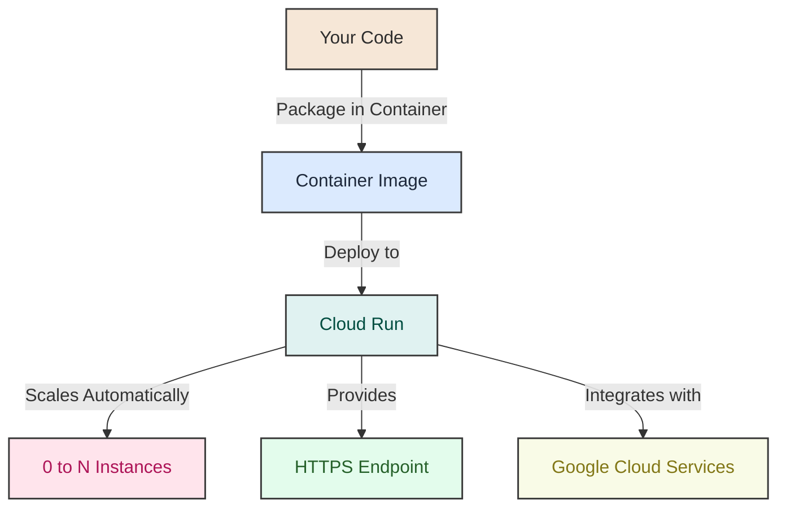
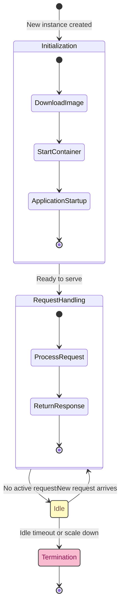
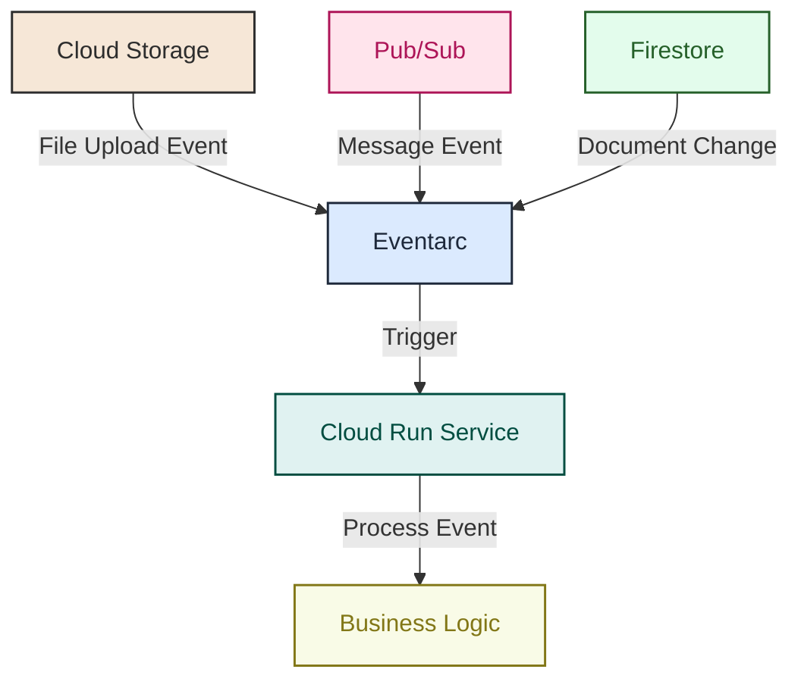
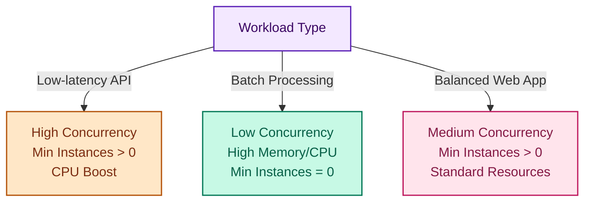
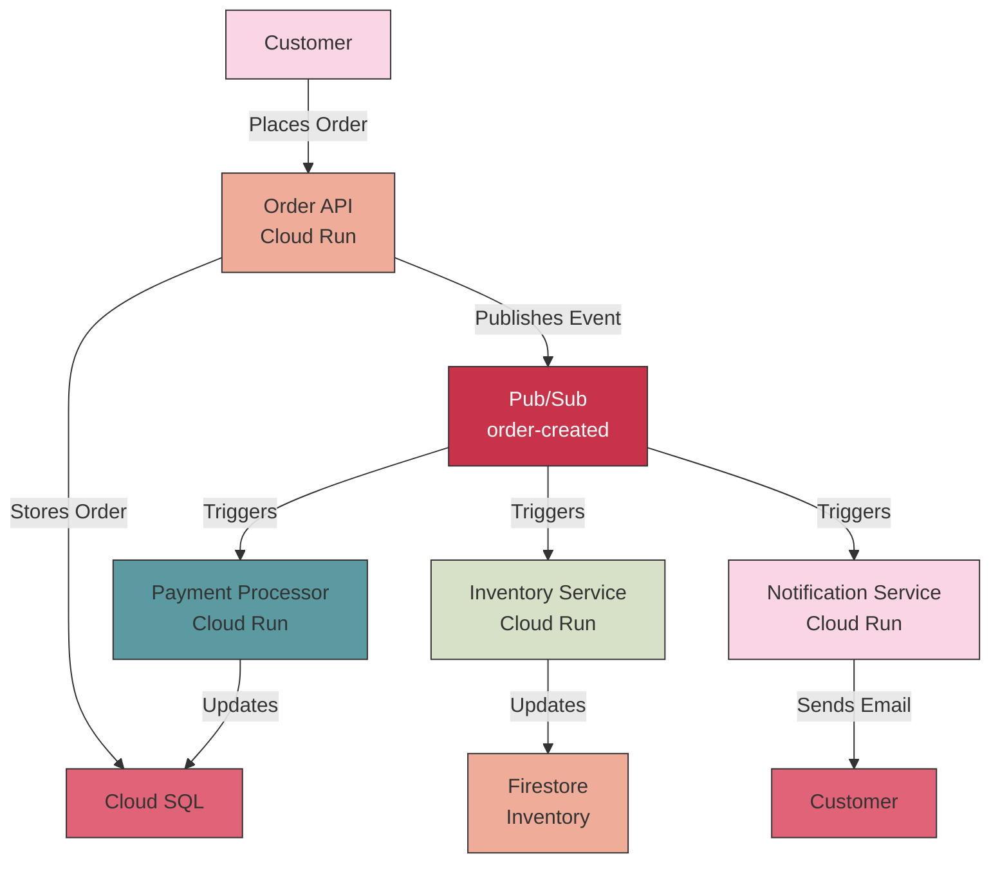
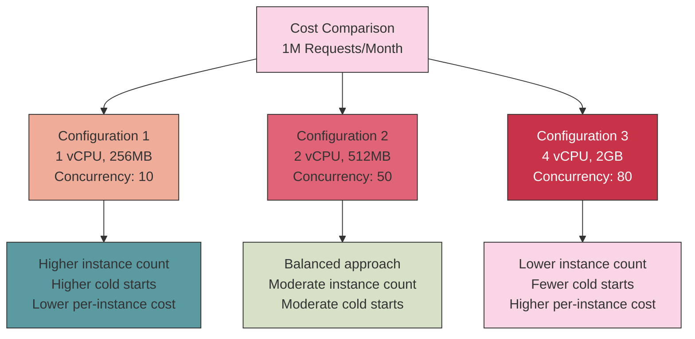
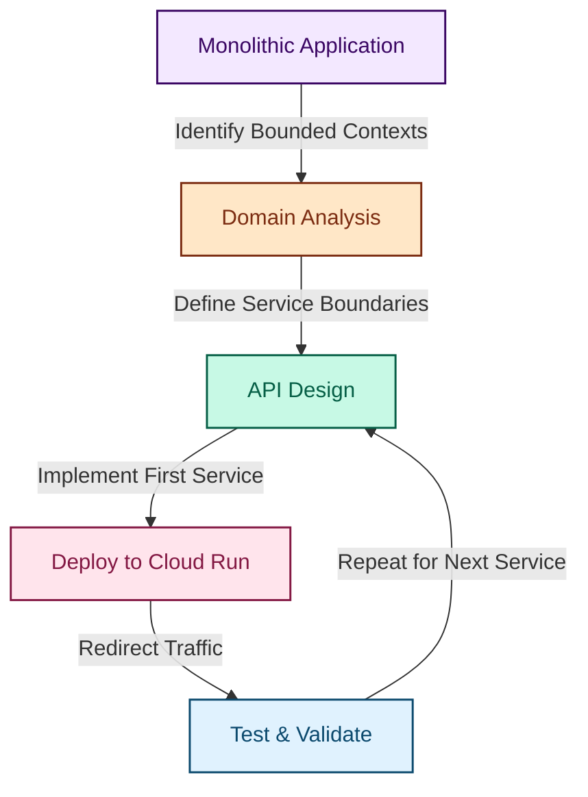
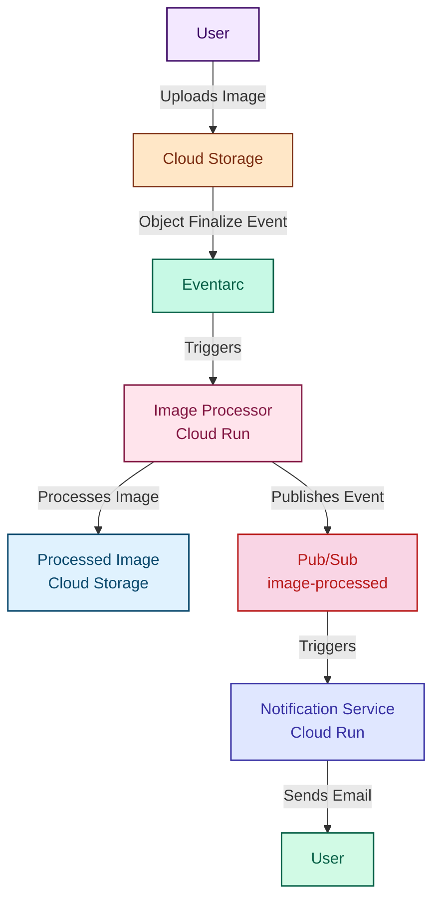

# Google Cloud Run for the Impatient: From Novice to Practitioner in Record Time

## 1. Introduction: The Serverless Revolution

### 1.1 Why Cloud Run?

Imagine you've just built an amazing application that could revolutionize your business. Now comes the dreaded question: "How do we deploy this?" Suddenly, you're drowning in a sea of infrastructure decisions, server configurations, scaling concerns, and security headaches. Your brilliant application is ready, but the path to production feels like navigating a labyrinth blindfolded.

This scenario plays out in companies worldwide every day. A 2023 survey revealed that development teams spend up to 40% of their time managing infrastructure rather than building features that deliver business value. That's nearly half your development resources wasted on tasks that don't directly contribute to your product's success.

Enter Google Cloud Run – a solution designed specifically to eliminate this deployment friction. But why should you care about Cloud Run specifically?

Consider the story of Fintech startup CloudWalk. They needed to rapidly deploy and scale their payment solutions to serve over one million customers. By leveraging Google Cloud infrastructure and services including Cloud Run, they achieved 200% growth in their commercial base and closed 2023 with a profit of \$22.3 million. This isn't just a technology choice – it's a business accelerator.

Cloud Run represents a fundamental shift in how we think about application deployment. It combines the best aspects of containers (packaging consistency, language flexibility) with the best parts of serverless (zero infrastructure management, automatic scaling, pay-per-use pricing). The result? You focus on your code while Google handles everything else.

**Pause and Reflect**: Think about your last deployment. How much time did you spend configuring servers, setting up load balancers, or worrying about scaling? What could your team have accomplished with that time back?

### 1.2 What is Google Cloud Run?

Google Cloud Run is a fully managed compute platform that enables you to run stateless containers directly on top of Google's scalable infrastructure. It's serverless, which means it abstracts away all infrastructure management so you can focus exclusively on your code.

At its core, Cloud Run offers two primary ways to run your code:

1. **Cloud Run Services**: Used for code that responds to web requests, events, or functions. These are ideal for APIs, websites, and event-driven applications.
2. **Cloud Run Jobs**: Designed for code that performs specific work and then terminates. Perfect for batch processing, data migrations, or scheduled tasks.

What makes Cloud Run special compared to other platforms? It combines three powerful concepts:

1. **Container-based**: You can use any language, library, or binary that can be packaged in a container. This gives you complete flexibility in your technology choices.
2. **Truly serverless**: Unlike some "serverless" platforms that still require configuration of underlying infrastructure, Cloud Run completely eliminates infrastructure management.
3. **Auto-scaling to zero**: When your service isn't being used, it scales down to zero instances, meaning you pay nothing when idle. When traffic arrives, it scales up automatically to handle the load.


Let me share a personal anecdote: Early in my career, I spent weeks configuring a complex Kubernetes cluster for a simple web application. The maintenance overhead was enormous, and we still faced scaling issues during traffic spikes. Years later, I migrated a similar application to Cloud Run. The deployment took 10 minutes, scaling became automatic, and our operational overhead dropped by 80%. The lesson? Sometimes the most powerful technology is the one that gets out of your way.

### 1.3 When to Use Cloud Run

Cloud Run shines in specific scenarios, but it's not a one-size-fits-all solution. Understanding when to use it (and when not to) will save you significant time and resources.

**Ideal Use Cases for Cloud Run Services**:

1. **Microservices Architecture**: Deploy and scale individual microservices independently.
2. **REST APIs**: Perfect for containerized APIs with autoscaling support.
3. **Web Applications**: Build and deploy full-stack web applications quickly.
4. **Event-Driven Processing**: Process events from Pub/Sub, Cloud Storage, or other event sources.
5. **AI Inference**: Deploy machine learning models for inference with optional GPU support.

**Ideal Use Cases for Cloud Run Jobs**:

1. **Batch Processing**: Process large datasets in parallel.
2. **Database Migrations**: Run one-off database schema updates.
3. **Scheduled Tasks**: Execute periodic maintenance or reporting tasks.
4. **Data ETL Processes**: Extract, transform, and load data between systems.

**When Not to Use Cloud Run**:

1. **Stateful Applications**: Applications requiring persistent local storage should consider other options like GKE.
2. **Long-Running Background Processes**: If using request-based billing, background processes may be throttled.
3. **Very Low Latency Requirements**: Applications requiring consistent sub-10ms response times might need dedicated infrastructure.
4. **Complex Multi-Container Architectures**: Applications requiring multiple tightly-coupled containers should consider Kubernetes.

**Decision Framework**:

Ask yourself these questions to determine if Cloud Run is right for your project:

1. Is my application stateless or can state be externalized to databases/storage?
2. Can my application handle variable traffic patterns?
3. Is my application containerizable?
4. Do I want to minimize infrastructure management?

If you answered "yes" to most of these questions, Cloud Run is likely an excellent fit.

**Pro Tip**: Start with Cloud Run for new projects and simple services. As your architecture grows more complex, you can always migrate specific components to more specialized platforms like GKE while keeping others on Cloud Run.

## 2. Getting Started: Your First Deployment

### 2.1 Setting Up Your Environment

Before diving into Cloud Run, let's ensure you have everything needed for a smooth experience. Think of this as preparing your kitchen before cooking – having all ingredients and tools ready makes the process much more enjoyable.

**Google Cloud Account Setup**:

1. If you don't have a Google Cloud account, sign up at cloud.google.com. New users receive \$300 in free credits to explore services.
2. Create a new project specifically for your Cloud Run experiments. This keeps your resources organized and makes billing tracking easier.

**Installing the Google Cloud SDK**:

The Google Cloud SDK is your command center for interacting with Google Cloud services. It's like having a universal remote control for your cloud resources.

```bash
# Download and install the Google Cloud SDK for your operating system
# For macOS/Linux:
curl https://sdk.cloud.google.com | bash

# For Windows, download the installer from:
# https://cloud.google.com/sdk/docs/install

# Authenticate with your Google account
gcloud auth login

# Set your current project
gcloud config set project YOUR_PROJECT_ID
```

**Enable Required APIs**:

Before using Cloud Run, you need to enable the necessary APIs in your Google Cloud project:

```bash
# Enable the Cloud Run API
gcloud services enable run.googleapis.com

# Enable the Container Registry API (for storing your container images)
gcloud services enable containerregistry.googleapis.com

# Enable the Cloud Build API (for building container images)
gcloud services enable cloudbuild.googleapis.com
```

**Pro Tip**: Create a dedicated service account for your Cloud Run deployments instead of using your personal account. This follows the principle of least privilege and makes it easier to manage permissions as your project grows.

**Quick Quiz**:

1. What are the three essential APIs you need to enable for a complete Cloud Run workflow?
2. Why is it beneficial to create a separate project for your Cloud Run experiments?

(Answers: 1. Cloud Run API, Container Registry API, and Cloud Build API. 2. For better organization, easier billing tracking, and isolation of resources.)

### 2.2 Your First Deployment

Now for the exciting part – deploying your first Cloud Run service! We'll start with a simple "Hello World" example to understand the basic workflow.

**Example 1: Hello World in Node.js**

Let's create a minimal Node.js application that responds with "Hello, Cloud Run!":

1. Create a new directory for your project:
```bash
mkdir hello-cloud-run
cd hello-cloud-run
```

2. Create a `package.json` file:
```json
{
  "name": "hello-cloud-run",
  "version": "1.0.0",
  "description": "My first Cloud Run service",
  "main": "index.js",
  "scripts": {
    "start": "node index.js"
  },
  "dependencies": {
    "express": "^4.17.1"
  }
}
```

3. Create an `index.js` file:
```javascript
const express = require('express');
const app = express();
const port = process.env.PORT || 8080;

app.get('/', (req, res) => {
  res.send('Hello, Cloud Run!');
});

app.listen(port, () => {
  console.log(`Server listening on port ${port}`);
});
```

4. Create a `Dockerfile`:
```Dockerfile
FROM node:14-slim
WORKDIR /usr/src/app
COPY package*.json ./
RUN npm install
COPY . ./
EXPOSE 8080
CMD [ "npm", "start" ]
```

5. Build and deploy to Cloud Run:
```bash
# Build the container image
gcloud builds submit --tag gcr.io/YOUR_PROJECT_ID/hello-cloud-run

# Deploy to Cloud Run
gcloud run deploy hello-service \
  --image gcr.io/YOUR_PROJECT_ID/hello-cloud-run \
  --platform managed \
  --region us-central1 \
  --allow-unauthenticated
```

After deployment completes, you'll receive a URL where your service is accessible. Open it in your browser, and you should see "Hello, Cloud Run!".

**Understanding What Just Happened**:

Let's break down what occurred in this deployment:

1. We created a simple Express.js application that listens on a port (defaulting to 8080).
2. We packaged it in a Docker container with a Dockerfile.
3. We built the container image and pushed it to Google Container Registry.
4. We deployed the container to Cloud Run, making it publicly accessible.

The magic happens in the last step. Cloud Run automatically:

- Provisions the necessary infrastructure
- Sets up HTTPS endpoints
- Configures scaling
- Handles load balancing

All without you having to configure a single server or load balancer.

**Pro Tip**: Notice how our code listens on `process.env.PORT`? Cloud Run injects this environment variable into your container. Always use this variable rather than hardcoding a port number to ensure compatibility.

### 2.3 Cloud Run Dashboard

Now that your service is deployed, let's explore the Cloud Run dashboard – your control center for managing and monitoring your services.

Navigate to the Cloud Run section in the Google Cloud Console. You'll see your newly deployed service listed. Clicking on it reveals several tabs:

1. **REVISIONS**: Shows all deployed versions of your service. Each deployment creates a new revision, allowing for easy rollbacks and traffic splitting.
2. **LOGS**: Provides access to your service's logs, crucial for debugging and monitoring.
3. **METRICS**: Displays performance metrics like request count, latency, and instance count.
4. **TRIGGERS**: Shows what events can trigger your service (for event-driven setups).
5. **SECURITY**: Manages authentication and authorization settings.

**Common Operations from the Dashboard**:

- **Updating your service**: Click "EDIT \& DEPLOY NEW REVISION" to deploy a new version.
- **Managing traffic**: Use the "MANAGE TRAFFIC" button to split traffic between revisions.
- **Configuring autoscaling**: Adjust minimum and maximum instances under "EDIT \& DEPLOY NEW REVISION" > "Capacity".

**Pro Tip**: Pin the Cloud Run dashboard to your Google Cloud Console navigation menu for quick access. You'll be visiting it frequently as you develop and manage your services.

## 3. Core Concepts: Understanding the Fundamentals

### 3.1 Container Fundamentals

To master Cloud Run, you need a solid understanding of containers. Think of containers as standardized shipping boxes for your code – they package everything your application needs to run in a consistent, portable way.

**Docker Basics for Cloud Run**:

A container image is defined by a Dockerfile, which specifies:

1. The base image (operating system and runtime)
2. Files to copy into the container
3. Commands to run during build
4. The command to execute when the container starts

Here's a more detailed example for a Python application:

```Dockerfile
# Start with a Python base image
FROM python:3.9-slim

# Set working directory
WORKDIR /app

# Copy requirements file and install dependencies
COPY requirements.txt .
RUN pip install --no-cache-dir -r requirements.txt

# Copy application code
COPY . .

# Specify the port the app will run on
ENV PORT 8080

# Run the application
CMD ["python", "main.py"]
```

**Container Lifecycle in Cloud Run**:

Understanding how Cloud Run manages container instances is crucial for optimizing your applications:

1. **Initialization**: When a new instance is created (cold start), your container image is downloaded and started.
2. **Request Handling**: The instance processes incoming requests.
3. **Idle**: After handling requests, the instance may become idle.
4. **Termination**: If the instance remains idle or Cloud Run needs to scale down, it will be terminated.


**Optimizing Containers for Cloud Run**:

To make your containers perform optimally on Cloud Run, follow these best practices:

1. **Minimize Image Size**: Smaller images lead to faster cold starts. Use multi-stage builds and slim base images.
2. **Optimize Startup Time**: Perform heavy initialization lazily or in background threads.
3. **Handle Graceful Shutdown**: Listen for SIGTERM signals to clean up resources before termination.

**Example: Multi-stage Build for a Go Application**:

```Dockerfile
# Build stage
FROM golang:1.16 AS builder
WORKDIR /app
COPY go.* ./
RUN go mod download
COPY . .
RUN CGO_ENABLED=0 GOOS=linux go build -o server

# Runtime stage
FROM alpine:3.14
RUN apk --no-cache add ca-certificates
WORKDIR /root/
COPY --from=builder /app/server .
CMD ["./server"]
```

This Dockerfile uses a multi-stage build to create a minimal final image containing only the compiled application, resulting in faster deployments and cold starts.

**Pro Tip**: Use the `gcr.io/distroless` base images for the smallest possible secure containers. These images contain only your application and its runtime dependencies, nothing else.

### 3.2 Serverless Architecture

Serverless doesn't mean "no servers" – it means you don't have to think about servers. This architectural paradigm fundamentally changes how you design and build applications.

**Stateless Design Principles**:

Cloud Run services should be stateless, meaning they don't store session data locally between requests. This enables seamless scaling and resilience. Instead:

1. Store state in external services (databases, Cloud Storage, etc.)
2. Use caching services like Memorystore for temporary data
3. Pass necessary context in each request

**Example: Stateless Session Management**:

Instead of storing session data in memory:

```javascript
// ❌ Don't do this in Cloud Run
const sessions = {};
app.post('/login', (req, res) => {
  const sessionId = generateId();
  sessions[sessionId] = { userId: req.body.userId, loggedIn: true };
  res.cookie('sessionId', sessionId);
  res.send('Logged in');
});

// ✅ Do this instead
app.post('/login', async (req, res) => {
  const sessionId = generateId();
  await redis.set(`session:${sessionId}`, JSON.stringify({ 
    userId: req.body.userId, 
    loggedIn: true 
  }));
  res.cookie('sessionId', sessionId);
  res.send('Logged in');
});
```

**Event-Driven Architecture**:

Cloud Run integrates seamlessly with event sources like Pub/Sub, Cloud Storage, and Eventarc, enabling powerful event-driven architectures.



**Cold Starts and Optimization**:

A "cold start" occurs when a new container instance is created to handle a request, causing additional latency. To minimize cold start impact:

1. **Use Minimum Instances**: Configure Cloud Run to keep a minimum number of instances warm.
2. **Optimize Container Startup**: Minimize dependencies and lazy-load resources.
3. **Use Global Variables**: Initialize expensive resources once and reuse them across requests.

**Example: Optimizing Database Connections**:

```javascript
// Global scope - executed once per instance
const db = initializeDatabaseConnection();

// Request handler - reuses the connection
app.get('/data', async (req, res) => {
  const results = await db.query('SELECT * FROM items');
  res.json(results);
});

function initializeDatabaseConnection() {
  // Expensive operation, but only done once per instance
  console.log('Initializing database connection...');
  return new Database(process.env.DB_CONNECTION_STRING);
}
```

**Pro Tip**: For Node.js applications, use the `--no-cpu-throttling` flag when deploying to ensure CPU is always allocated, which helps with background processing and reduces cold start impact.

### 3.3 Scaling and Performance

One of Cloud Run's most powerful features is its automatic scaling. Understanding how it works and how to configure it properly is essential for optimal performance and cost efficiency.

**Auto-scaling Mechanics**:

Cloud Run automatically scales based on:

1. **Incoming traffic**: More requests trigger more instances
2. **CPU utilization**: High CPU usage can trigger scaling (with instance-based billing)
3. **Concurrency**: How many simultaneous requests each instance handles

By default, Cloud Run scales from zero to thousands of instances and back down to zero when traffic subsides.

**Concurrency Settings**:

Concurrency determines how many simultaneous requests each instance handles. Higher concurrency means fewer instances but more load per instance.

```bash
# Set maximum concurrency to 80 requests per instance
gcloud run services update my-service --concurrency=80
```

**Performance Optimization Techniques**:

1. **Memory and CPU Allocation**: Allocate appropriate resources based on your application's needs.
```bash
# Allocate 2 vCPUs and 4GB memory
gcloud run services update my-service --cpu=2 --memory=4Gi
```

2. **Minimum Instances**: Keep instances warm to eliminate cold starts for critical services.
```bash
# Keep at least 2 instances running at all times
gcloud run services update my-service --min-instances=2
```

3. **Startup CPU Boost**: Allocate more CPU during container startup to reduce initialization time.
```bash
# Enable CPU boost during startup
gcloud run services update my-service --cpu-boost
```

**Example: Scaling Configuration for Different Workloads**:



**Real-World Scaling Story**:

I once worked with a retail company that experienced massive traffic spikes during flash sales. Their traditional infrastructure would either crash under load or cost a fortune to over-provision. After migrating to Cloud Run, their application automatically scaled from 5 to 500 instances within seconds when a sale started, then back down when it ended. The result? Zero downtime, happy customers, and a 40% reduction in infrastructure costs.

**Pro Tip**: Monitor your service's actual concurrency and CPU/memory usage for at least a week before fine-tuning these settings. Real-world usage patterns often differ from expectations, and Cloud Run's default settings work well for many applications.

## 4. Practical Examples: Learning by Doing

### 4.1 Building a REST API

REST APIs are one of the most common use cases for Cloud Run. Let's build a simple product catalog API to demonstrate how Cloud Run excels at this task.

**Example 2: Product Catalog API in Python**

1. Create a new directory for your project:
```bash
mkdir product-api
cd product-api
```

2. Create a `requirements.txt` file:
```
flask==2.0.1
flask-cors==3.0.10
gunicorn==20.1.0
```

3. Create an `app.py` file:
```python
from flask import Flask, jsonify, request
from flask_cors import CORS

app = Flask(__name__)
CORS(app)

# In-memory product database (in production, use a real database)
products = [
    {"id": 1, "name": "Laptop", "price": 999.99, "category": "Electronics"},
    {"id": 2, "name": "Headphones", "price": 99.99, "category": "Electronics"},
    {"id": 3, "name": "Coffee Mug", "price": 12.99, "category": "Kitchen"}
]

@app.route('/products', methods=['GET'])
def get_products():
    category = request.args.get('category')
    if category:
        filtered_products = [p for p in products if p['category'] == category]
        return jsonify(filtered_products)
    return jsonify(products)

@app.route('/products/<int:product_id>', methods=['GET'])
def get_product(product_id):
    product = next((p for p in products if p['id'] == product_id), None)
    if product:
        return jsonify(product)
    return jsonify({"error": "Product not found"}), 404

@app.route('/products', methods=['POST'])
def add_product():
    new_product = request.get_json()
    new_product['id'] = max(p['id'] for p in products) + 1
    products.append(new_product)
    return jsonify(new_product), 201

if __name__ == '__main__':
    app.run(host='0.0.0.0', port=int(os.environ.get('PORT', 8080)))
```

4. Create a `Dockerfile`:
```Dockerfile
FROM python:3.9-slim

WORKDIR /app

COPY requirements.txt .
RUN pip install --no-cache-dir -r requirements.txt

COPY . .

CMD ["gunicorn", "--bind", "0.0.0.0:8080", "app:app"]
```

5. Build and deploy to Cloud Run:
```bash
gcloud builds submit --tag gcr.io/YOUR_PROJECT_ID/product-api
gcloud run deploy product-api \
  --image gcr.io/YOUR_PROJECT_ID/product-api \
  --platform managed \
  --region us-central1 \
  --allow-unauthenticated
```

Now you have a fully functional REST API deployed on Cloud Run! Test it with curl:

```bash
# Get all products
curl https://product-api-abcdef123-uc.a.run.app/products

# Get products by category
curl https://product-api-abcdef123-uc.a.run.app/products?category=Electronics

# Add a new product
curl -X POST https://product-api-abcdef123-uc.a.run.app/products \
  -H "Content-Type: application/json" \
  -d '{"name":"Smart Watch", "price":199.99, "category":"Electronics"}'
```

**API Design Best Practices for Cloud Run**:

1. **Keep Endpoints Stateless**: Don't rely on local storage or memory between requests.
2. **Handle Concurrency**: Your API should be thread-safe as Cloud Run may send multiple requests to the same instance.
3. **Implement Health Checks**: Add a `/health` endpoint to verify your service is functioning correctly.
4. **Use Environment Variables**: Store configuration in environment variables, not hardcoded values.

**Pro Tip**: In production, replace the in-memory product database with a managed database like Cloud SQL or Firestore. Cloud Run integrates seamlessly with these services, and your container remains stateless.

### 4.2 Web Application Deployment

Let's build on our API example by creating a full-stack web application that uses our product catalog API.

**Example 3: Product Catalog Web Application**

For this example, we'll create a simple React frontend that communicates with our API:

1. Create a new directory for the frontend:
```bash
mkdir product-frontend
cd product-frontend
```

2. Initialize a React application (assuming you have Node.js installed):
```bash
npx create-react-app .
```

3. Create a simple product listing component in `src/App.js`:
```jsx
import React, { useState, useEffect } from 'react';
import './App.css';

function App() {
  const [products, setProducts] = useState([]);
  const [loading, setLoading] = useState(true);
  const [category, setCategory] = useState('');
  
  useEffect(() => {
    const fetchProducts = async () => {
      setLoading(true);
      const url = category 
        ? `https://product-api-abcdef123-uc.a.run.app/products?category=${category}`
        : 'https://product-api-abcdef123-uc.a.run.app/products';
      
      const response = await fetch(url);
      const data = await response.json();
      setProducts(data);
      setLoading(false);
    };
    
    fetchProducts();
  }, [category]);
  
  return (
    <div className="App">
      <header className="App-header">
        <h1>Product Catalog</h1>
        <div className="category-filter">
          <button onClick={() => setCategory('')}>All</button>
          <button onClick={() => setCategory('Electronics')}>Electronics</button>
          <button onClick={() => setCategory('Kitchen')}>Kitchen</button>
        </div>
      </header>
      <main>
        {loading ? (
          <p>Loading products...</p>
        ) : (
          <div className="product-grid">
            {products.map(product => (
              <div key={product.id} className="product-card">
                <h2>{product.name}</h2>
                <p className="price">${product.price}</p>
                <p className="category">{product.category}</p>
              </div>
            ))}
          </div>
        )}
      </main>
    </div>
  );
}

export default App;
```

4. Create a `Dockerfile` for the frontend:
```Dockerfile
FROM node:14 as build
WORKDIR /app
COPY package*.json ./
RUN npm install
COPY . ./
RUN npm run build

FROM nginx:alpine
COPY --from=build /app/build /usr/share/nginx/html
COPY nginx.conf /etc/nginx/conf.d/default.conf
EXPOSE 8080
CMD ["nginx", "-g", "daemon off;"]
```

5. Create an `nginx.conf` file:
```
server {
    listen 8080;
    
    location / {
        root /usr/share/nginx/html;
        index index.html index.htm;
        try_files $uri $uri/ /index.html;
    }
}
```

6. Build and deploy the frontend:
```bash
gcloud builds submit --tag gcr.io/YOUR_PROJECT_ID/product-frontend
gcloud run deploy product-frontend \
  --image gcr.io/YOUR_PROJECT_ID/product-frontend \
  --platform managed \
  --region us-central1 \
  --allow-unauthenticated
```

Now you have a complete web application with a React frontend and a Python API backend, both running on Cloud Run!

**Frontend and Backend Integration**:

In this example, our frontend directly calls the backend API. In a production environment, you might want to:

1. **Use Environment Variables**: Store the API URL as an environment variable to make it configurable.
2. **Implement CORS Properly**: Configure CORS headers on your API to control which domains can access it.
3. **Consider an API Gateway**: For more complex applications, use API Gateway or Cloud Endpoints in front of your Cloud Run services.

**Static Asset Handling**:

For production applications, consider these optimizations:

1. **Use Cloud Storage + CDN**: Store static assets in Cloud Storage and serve them through Cloud CDN for better performance.
2. **Implement Caching**: Configure proper cache headers for static assets.
3. **Consider Firebase Hosting**: For frontend-heavy applications, Firebase Hosting works well with Cloud Run backends.

**Pro Tip**: For a better developer experience, use Cloud Build triggers to automatically deploy your frontend and backend whenever you push changes to your repository.

### 4.3 Background Processing

Not all workloads are request-driven. For tasks that need to run in the background or on a schedule, Cloud Run Jobs are the perfect solution.

**Example 4: Scheduled Data Processing Job**

Let's create a job that processes data from a Cloud Storage bucket on a schedule:

1. Create a new directory for your job:
```bash
mkdir data-processor
cd data-processor
```

2. Create a `requirements.txt` file:
```
google-cloud-storage==2.0.0
pandas==1.3.3
```

3. Create a `process.py` file:
```python
import os
import pandas as pd
from google.cloud import storage

def process_data():
    print("Starting data processing job...")
    
    # Download data from Cloud Storage
    bucket_name = os.environ.get('BUCKET_NAME')
    file_name = os.environ.get('FILE_NAME')
    
    storage_client = storage.Client()
    bucket = storage_client.bucket(bucket_name)
    blob = bucket.blob(file_name)
    
    local_path = '/tmp/data.csv'
    blob.download_to_filename(local_path)
    print(f"Downloaded {file_name} from {bucket_name}")
    
    # Process the data
    df = pd.read_csv(local_path)
    print(f"Processing {len(df)} records...")
    
    # Example processing: calculate statistics
    stats = {
        'total_records': len(df),
        'average_value': df['value'].mean() if 'value' in df.columns else None,
        'categories': df['category'].value_counts().to_dict() if 'category' in df.columns else {}
    }
    
    # Upload results back to Cloud Storage
    results_blob = bucket.blob('results/stats.txt')
    results_blob.upload_from_string(str(stats))
    print("Processing complete. Results uploaded to Cloud Storage.")

if __name__ == '__main__':
    process_data()
```

4. Create a `Dockerfile`:
```Dockerfile
FROM python:3.9-slim

WORKDIR /app

COPY requirements.txt .
RUN pip install --no-cache-dir -r requirements.txt

COPY . .

CMD ["python", "process.py"]
```

5. Build and deploy as a Cloud Run job:
```bash
gcloud builds submit --tag gcr.io/YOUR_PROJECT_ID/data-processor
gcloud run jobs create data-processor \
  --image gcr.io/YOUR_PROJECT_ID/data-processor \
  --region us-central1 \
  --set-env-vars="BUCKET_NAME=your-data-bucket,FILE_NAME=data/sales.csv"
```

6. Schedule the job to run daily using Cloud Scheduler:
```bash
gcloud scheduler jobs create http process-daily-data \
  --schedule="0 4 * * *" \
  --uri="https://us-central1-run.googleapis.com/apis/run.googleapis.com/v1/namespaces/YOUR_PROJECT_ID/jobs/data-processor:run" \
  --http-method=POST \
  --oauth-service-account-email=YOUR_PROJECT_NUMBER-compute@developer.gserviceaccount.com
```

This job will now run every day at 4:00 AM, process the data, and store the results back in Cloud Storage.

**Using Cloud Run Jobs Effectively**:

1. **Parallelism**: For data processing jobs, use the `--tasks` flag to process data in parallel.
```bash
gcloud run jobs execute data-processor --tasks=10
```

2. **Task-specific Environment Variables**: Pass different environment variables to each task for processing different data chunks.
3. **Error Handling**: Implement robust error handling and retries in your job code.

**Pro Tip**: For complex workflows involving multiple jobs, consider using Workflows to orchestrate the execution sequence and handle dependencies between jobs.

## 5. Advanced Features: Taking It to the Next Level

### 5.1 Networking

Cloud Run's networking capabilities allow you to securely connect your services to other resources and control how they communicate.

**VPC Connectivity**:

By default, Cloud Run services can access the public internet but not private VPC resources. To connect to resources in your VPC (like private databases), you need a Serverless VPC Access connector:

```bash
# Create a Serverless VPC Access connector
gcloud compute networks vpc-access connectors create my-connector \
  --region=us-central1 \
  --network=default \
  --range=10.8.0.0/28

# Deploy a Cloud Run service with VPC access
gcloud run deploy my-service \
  --image=gcr.io/YOUR_PROJECT_ID/my-image \
  --vpc-connector=my-connector
```

**Service-to-Service Communication**:

Cloud Run services can communicate with each other in several ways:

1. **Public Endpoints**: Services call each other via their public HTTPS endpoints.
2. **Internal Traffic**: Configure services to only accept internal traffic.
3. **Private Networking**: Use VPC for completely private communication.

**Example: Secure Service-to-Service Communication**:

```mermaid
sequenceDiagram
    participant Client as Client
    participant Frontend as Frontend Service
    participant Backend as Backend Service
    participant Database as Cloud SQL

    Client->>Frontend: HTTPS Request
    Frontend->>Backend: Internal Request with Service Account
    Backend->>Database: Connect via VPC Connector
    Database-->>Backend: Return Data
    Backend-->>Frontend: Return Response
    Frontend-->>Client: Return HTML/JSON

    %% Pastel color palette with strong contrast for readability
    %% Client: Soft lavender background, dark text
    %% Frontend: Light teal background, dark text
    %% Backend: Light peach background, dark text
    %% Database: Light mint background, dark text
    %% (All colors are WCAG AA compliant for contrast)

    %% Mermaid v10+ supports style for sequence participants
    %% If not supported, these will be ignored gracefully

    %% Client
    %% #e6e6fa = lavender, #2d2d2d = dark gray
    %% Frontend
    %% #d0f4f7 = light teal, #2d2d2d = dark gray
    %% Backend
    %% #ffe5b4 = light peach, #2d2d2d = dark gray
    %% Database
    %% #e2f7e1 = light mint, #2d2d2d = dark gray

    %% Mermaid v10+ participant style syntax
    %% If your Mermaid version does not support this, use classDef/class instead

    %% Participant styles
    %% (If using older Mermaid, use classDef/class below)
    %% participant Client as Client
    %% participant Frontend as Frontend Service
    %% participant Backend as Backend Service
    %% participant Database as Cloud SQL

    %% For Mermaid v10+:
    %% style Client fill:#e6e6fa,stroke:#2d2d2d,stroke-width:1.5px,color:#2d2d2d
    %% style Frontend fill:#d0f4f7,stroke:#2d2d2d,stroke-width:1.5px,color:#2d2d2d
    %% style Backend fill:#ffe5b4,stroke:#2d2d2d,stroke-width:1.5px,color:#2d2d2d
    %% style Database fill:#e2f7e1,stroke:#2d2d2d,stroke-width:1.5px,color:#2d2d2d

    %% For older Mermaid versions:
    classDef clientStyle fill:#e6e6fa,stroke:#2d2d2d,stroke-width:1.5px,color:#2d2d2d;
    classDef frontendStyle fill:#d0f4f7,stroke:#2d2d2d,stroke-width:1.5px,color:#2d2d2d;
    classDef backendStyle fill:#ffe5b4,stroke:#2d2d2d,stroke-width:1.5px,color:#2d2d2d;
    classDef databaseStyle fill:#e2f7e1,stroke:#2d2d2d,stroke-width:1.5px,color:#2d2d2d;
    class Client clientStyle
    class Frontend frontendStyle
    class Backend backendStyle
    class Database databaseStyle
```

To implement this pattern:

1. Configure the backend service to only accept internal traffic:
```bash
gcloud run services update backend-service \
  --ingress=internal
```

2. Use service identity for authentication between services:
```bash
# Give the frontend service permission to invoke the backend
gcloud run services add-iam-policy-binding backend-service \
  --member=serviceAccount:frontend-sa@YOUR_PROJECT_ID.iam.gserviceaccount.com \
  --role=roles/run.invoker
```

**Custom Domains and HTTPS**:

By default, Cloud Run provides a domain like `https://my-service-abcdef123-uc.a.run.app`. For a professional appearance, map your own domain:

1. Verify domain ownership in Google Cloud Console.
2. Map your domain to your Cloud Run service:
```bash
gcloud run domain-mappings create \
  --service=my-service \
  --domain=api.example.com
```

3. Add the provided DNS records to your domain registrar.

Cloud Run automatically provisions and renews SSL certificates for your custom domain.

**Pro Tip**: For internal microservices that don't need public access, use the `--no-allow-unauthenticated` flag and internal ingress settings to keep them private and secure.

### 5.2 Security

Security is paramount for any production application. Cloud Run provides robust security features to protect your services.

**Authentication and Authorization**:

Cloud Run uses Identity and Access Management (IAM) to control who can access your services:

1. **Public Services**: Use `--allow-unauthenticated` for public access.
2. **Authenticated Services**: Require authentication with `--no-allow-unauthenticated`.
3. **Fine-grained Control**: Assign specific IAM roles to control who can invoke, deploy, or manage services.

**Example: Securing an Internal API**:

```bash
# Deploy a service that requires authentication
gcloud run deploy internal-api \
  --image gcr.io/YOUR_PROJECT_ID/internal-api \
  --no-allow-unauthenticated

# Grant access to a specific service account
gcloud run services add-iam-policy-binding internal-api \
  --member=serviceAccount:client-sa@YOUR_PROJECT_ID.iam.gserviceaccount.com \
  --role=roles/run.invoker
```

To call this service from another service or application, you'll need to include an identity token in the request:

```python
import google.auth.transport.requests
import google.oauth2.id_token

def call_secured_service(url):
    auth_req = google.auth.transport.requests.Request()
    id_token = google.oauth2.id_token.fetch_id_token(auth_req, url)
    
    headers = {
        'Authorization': f'Bearer {id_token}'
    }
    
    response = requests.get(url, headers=headers)
    return response.json()
```

**Secrets Management**:

Never hardcode sensitive information in your container. Instead, use Secret Manager and environment variables:

1. Create a secret:
```bash
echo -n "my-database-password" | gcloud secrets create db-password --data-file=-
```

2. Grant your service access to the secret:
```bash
gcloud secrets add-iam-policy-binding db-password \
  --member=serviceAccount:my-service@YOUR_PROJECT_ID.iam.gserviceaccount.com \
  --role=roles/secretmanager.secretAccessor
```

3. Mount the secret as an environment variable:
```bash
gcloud run services update my-service \
  --update-secrets=DB_PASSWORD=db-password:latest
```

**Security Best Practices**:

1. **Use Least Privilege**: Give your service accounts only the permissions they need.
2. **Enable Binary Authorization**: Ensure only approved container images can be deployed.
3. **Configure VPC Service Controls**: Create security perimeters around sensitive resources.
4. **Implement HTTPS-only Communication**: Never use unencrypted HTTP for service-to-service communication.

**Pro Tip**: Regularly audit your IAM permissions and remove unnecessary access. It's easier to add permissions when needed than to recover from a security breach.

### 5.3 Integration with Google Cloud

Cloud Run's power multiplies when integrated with other Google Cloud services. These integrations enable complex, scalable architectures without managing infrastructure.

**Cloud Storage Integration**:

Store and retrieve files, images, and other static assets:

```python
from google.cloud import storage

def upload_file(bucket_name, source_file_name, destination_blob_name):
    storage_client = storage.Client()
    bucket = storage_client.bucket(bucket_name)
    blob = bucket.blob(destination_blob_name)
    blob.upload_from_filename(source_file_name)
    
    print(f"File {source_file_name} uploaded to {destination_blob_name}.")
```

**Cloud SQL Integration**:

Connect to managed databases securely:

1. Create a Cloud SQL instance:
```bash
gcloud sql instances create my-database \
  --database-version=POSTGRES_13 \
  --tier=db-g1-small \
  --region=us-central1
```

2. Connect your Cloud Run service to it:
```bash
gcloud run services update my-service \
  --add-cloudsql-instances=YOUR_PROJECT_ID:us-central1:my-database \
  --set-env-vars=DB_HOST=127.0.0.1,DB_USER=postgres,DB_NAME=my-db
```

3. Use the Cloud SQL Auth Proxy in your application:
```python
import os
import psycopg2

def get_db_connection():
    conn = psycopg2.connect(
        host=os.environ.get('DB_HOST'),
        user=os.environ.get('DB_USER'),
        password=os.environ.get('DB_PASSWORD'),
        database=os.environ.get('DB_NAME'),
        port=5432
    )
    return conn
```

**Pub/Sub and Event-Driven Architectures**:

Create event-driven systems where services react to events:

1. Create a Pub/Sub topic:
```bash
gcloud pubsub topics create order-created
```

2. Configure your Cloud Run service to receive Pub/Sub messages:
```bash
gcloud run services update order-processor \
  --set-env-vars=PROJECT_ID=YOUR_PROJECT_ID
```

3. Create a Pub/Sub subscription that pushes to your Cloud Run service:
```bash
gcloud pubsub subscriptions create order-processor-sub \
  --topic=order-created \
  --push-endpoint=https://order-processor-abcdef123-uc.a.run.app \
  --push-auth-service-account=pubsub-invoker@YOUR_PROJECT_ID.iam.gserviceaccount.com
```

4. Handle Pub/Sub messages in your service:
```python
@app.route('/', methods=['POST'])
def index():
    envelope = request.get_json()
    if not envelope:
        return 'No Pub/Sub message received', 400
        
    if not isinstance(envelope, dict) or 'message' not in envelope:
        return 'Invalid Pub/Sub message format', 400
        
    message = envelope['message']
    
    if 'data' in message:
        import base64
        data = base64.b64decode(message['data']).decode('utf-8')
        # Process the order data
        print(f"Processing order: {data}")
    
    return 'OK', 200
```

**Example Architecture: E-commerce System**:



**Pro Tip**: Use Eventarc instead of direct Pub/Sub subscriptions for more flexibility. Eventarc supports additional event sources and provides a unified way to route events to Cloud Run services.

## 6. DevOps and CI/CD: Streamlining Your Workflow

### 6.1 Continuous Deployment

Continuous Integration and Continuous Deployment (CI/CD) automates the process of building, testing, and deploying your Cloud Run services. This automation reduces errors, speeds up delivery, and improves overall quality.

**Setting Up CI/CD Pipelines**:

Let's implement a CI/CD pipeline using GitHub Actions:

1. Create a `.github/workflows/deploy.yml` file in your repository:
```yaml
name: Build and Deploy to Cloud Run

on:
  push:
    branches:
      - main

env:
  PROJECT_ID: your-project-id
  SERVICE_NAME: my-service
  REGION: us-central1

jobs:
  build-and-deploy:
    runs-on: ubuntu-latest
    
    steps:
    - name: Checkout code
      uses: actions/checkout@v2
      
    - name: Setup Google Cloud SDK
      uses: google-github-actions/setup-gcloud@v0
      with:
        project_id: ${{ env.PROJECT_ID }}
        service_account_key: ${{ secrets.GCP_SA_KEY }}
        
    - name: Authorize Docker push
      run: gcloud auth configure-docker
      
    - name: Build and push container
      run: |
        docker build -t gcr.io/$PROJECT_ID/$SERVICE_NAME:${{ github.sha }} .
        docker push gcr.io/$PROJECT_ID/$SERVICE_NAME:${{ github.sha }}
        
    - name: Deploy to Cloud Run
      run: |
        gcloud run deploy $SERVICE_NAME \
          --image gcr.io/$PROJECT_ID/$SERVICE_NAME:${{ github.sha }} \
          --platform managed \
          --region $REGION \
          --allow-unauthenticated
```

2. Create a service account with the necessary permissions:
    - Go to IAM \& Admin > Service Accounts
    - Create a new service account with the Cloud Run Admin and Storage Admin roles
    - Create and download a JSON key
3. Add the key as a GitHub secret named `GCP_SA_KEY`

Now, every time you push to the main branch, your service will automatically be built and deployed to Cloud Run.

**GitHub Actions Integration**:

For more complex workflows, you can:

1. **Add Testing**: Run tests before deployment to catch issues early.
2. **Implement Staging**: Deploy to a staging environment first, then production.
3. **Add Approval Steps**: Require manual approval for production deployments.

**Example: Multi-Environment Deployment**:

```yaml
name: CI/CD Pipeline

on:
  push:
    branches: [ main, develop ]
  pull_request:
    branches: [ main, develop ]

jobs:
  test:
    runs-on: ubuntu-latest
    steps:
    - uses: actions/checkout@v2
    - name: Set up Python
      uses: actions/setup-python@v2
      with:
        python-version: '3.9'
    - name: Install dependencies
      run: |
        python -m pip install --upgrade pip
        if [ -f requirements.txt ]; then pip install -r requirements.txt; fi
        pip install pytest
    - name: Test with pytest
      run: pytest
  
  deploy-staging:
    needs: test
    if: github.ref == 'refs/heads/develop'
    runs-on: ubuntu-latest
    steps:
    # Similar to above, but deploy to staging
    - name: Deploy to Cloud Run (Staging)
      run: |
        gcloud run deploy $SERVICE_NAME-staging \
          --image gcr.io/$PROJECT_ID/$SERVICE_NAME:${{ github.sha }} \
          --platform managed \
          --region $REGION
  
  deploy-production:
    needs: test
    if: github.ref == 'refs/heads/main'
    runs-on: ubuntu-latest
    environment: production  # Requires approval
    steps:
    # Similar to above, but deploy to production
    - name: Deploy to Cloud Run (Production)
      run: |
        gcloud run deploy $SERVICE_NAME \
          --image gcr.io/$PROJECT_ID/$SERVICE_NAME:${{ github.sha }} \
          --platform managed \
          --region $REGION
```

**Pro Tip**: Use Cloud Build instead of GitHub Actions if you prefer to keep everything within the Google Cloud ecosystem. Cloud Build integrates natively with Cloud Run and other Google Cloud services.

### 6.2 Monitoring and Logging

Effective monitoring and logging are essential for maintaining reliable Cloud Run services. Google Cloud provides integrated tools to help you understand your service's behavior and troubleshoot issues.

**Cloud Monitoring Setup**:

Cloud Run automatically integrates with Cloud Monitoring without any configuration. Key metrics to watch include:

1. **Request Count**: Track the volume of requests to your service.
2. **Request Latencies**: Monitor how quickly your service responds.
3. **Container Instance Count**: Watch how your service scales.
4. **Memory Utilization**: Ensure your service isn't running out of memory.
5. **CPU Utilization**: Check if your service needs more CPU resources.

To create a custom dashboard:

1. Go to the Google Cloud Console > Monitoring > Dashboards
2. Click "Create Dashboard"
3. Add widgets for the metrics you want to track
4. Save your dashboard

**Log Analysis**:

Cloud Run automatically sends container logs to Cloud Logging. To view logs:

1. Go to the Google Cloud Console > Cloud Run
2. Select your service
3. Click the "Logs" tab

For more advanced log analysis:

```bash
# View logs for a specific service
gcloud logging read "resource.type=cloud_run_revision AND resource.labels.service_name=my-service" --limit=10

# Filter logs for errors
gcloud logging read "resource.type=cloud_run_revision AND resource.labels.service_name=my-service AND severity>=ERROR" --limit=10
```

**Example: Setting Up Alerts**:

Create alerts to be notified of potential issues:

1. Go to Monitoring > Alerting
2. Click "Create Policy"
3. Select a metric (e.g., "HTTP 5xx error rate")
4. Set a threshold (e.g., "Greater than 5% for 5 minutes")
5. Configure notification channels (email, Slack, PagerDuty, etc.)
6. Name and save your policy

**Pro Tip**: Use structured logging in your application to make logs more searchable and analyzable. For example, in Python:

```python
import json
import logging
import sys

# Configure structured logging
logging.basicConfig(
    stream=sys.stdout,
    level=logging.INFO,
    format='%(message)s'
)
logger = logging.getLogger()

def log_structured(severity, message, **kwargs):
    log_entry = {
        'severity': severity,
        'message': message,
        **kwargs
    }
    logger.info(json.dumps(log_entry))

# Usage
log_structured('INFO', 'Processing order', order_id='12345', customer_id='C789')
```

This produces logs that are easily filterable by fields like `order_id` or `customer_id`.

### 6.3 Cost Management

One of Cloud Run's key benefits is its cost-efficiency, but understanding and optimizing costs is still important for production workloads.

**Understanding Billing**:

Cloud Run charges for:

1. **CPU and Memory**: Resources allocated to your containers
2. **Request Volume**: Number of requests processed (with request-based billing)
3. **Networking**: Outbound data transfer

The pricing model offers:

- A generous free tier (2 million requests, 360,000 vCPU-seconds, and 180,000 GiB-seconds per month)
- Per-100ms billing granularity
- No charge when your service scales to zero

**Optimization Strategies**:

1. **Right-size Resources**: Allocate only the CPU and memory your service actually needs.
```bash
# Adjust resources based on actual usage
gcloud run services update my-service --cpu=1 --memory=512Mi
```

2. **Optimize Concurrency**: Higher concurrency means fewer instances and lower costs.
```bash
# Increase concurrency if your application can handle it
gcloud run services update my-service --concurrency=80
```

3. **Use Minimum Instances Wisely**: While minimum instances prevent cold starts, they also incur costs even when idle (though at a reduced rate).
4. **Choose the Right Billing Model**:
    - Request-based: Better for sporadic traffic
    - Instance-based: Better for steady traffic or background processing

**Example: Cost Comparison**:

Let's compare costs for different configurations of a service handling 1 million requests per month, each taking 500ms to process:



The optimal configuration depends on your specific workload characteristics and performance requirements.

**Budgeting and Forecasting**:

Set up budget alerts to avoid surprises:

1. Go to Billing > Budgets \& Alerts
2. Create a budget for your Cloud Run usage
3. Set alert thresholds (e.g., 50%, 75%, 90% of budget)
4. Configure email notifications

**Pro Tip**: For predictable workloads, consider Committed Use Discounts (CUDs). If your Cloud Run service always has one or more active instances, you can lower its cost by committing to at least this amount for 1 or 3 years.


## 7. Real-World Architectures: Putting It All Together (Continued)

### 7.1 Microservices (Continued)

In our e-commerce microservices architecture, each service is independently deployable, scalable, and maintainable. This approach allows teams to work on different services without affecting each other, accelerating development and reducing risk.

**Service Mesh Patterns**:

As your microservices architecture grows, managing service-to-service communication becomes increasingly complex. A service mesh can help by providing:

1. **Traffic Management**: Route requests between services with fine-grained control.
2. **Security**: Implement mutual TLS for service-to-service authentication.
3. **Observability**: Collect metrics, logs, and traces across services.

While Cloud Run doesn't include a built-in service mesh, you can implement these patterns using:

1. **Istio with GKE**: For complex service mesh requirements.
2. **Cloud Endpoints**: For API management and security.
3. **Custom Solutions**: Using Cloud Run's built-in IAM and networking features.

**Migration Strategies**:

When migrating from a monolithic application to microservices on Cloud Run, consider these approaches:

1. **Strangler Pattern**: Gradually replace components of the monolith with microservices.
2. **Domain-Driven Design**: Identify bounded contexts to determine service boundaries.
3. **API-First Approach**: Define clear interfaces between services before implementation.


**Pro Tip**: Start with the most stable and well-defined parts of your application when migrating to microservices. This reduces risk and provides early wins to build confidence in the approach.

### 7.2 Event-Driven Systems

Event-driven architectures are a natural fit for Cloud Run, allowing you to build loosely coupled, scalable systems that respond to changes in state. In this pattern, services communicate by publishing and consuming events rather than making direct requests.

**Example 6: Event-Driven Data Processing Pipeline**

Let's design an event-driven system for processing uploaded images:


To implement this architecture:

1. **Set up Cloud Storage and Eventarc**:
```bash
# Create a Cloud Storage bucket
gsutil mb -l us-central1 gs://image-uploads-bucket

# Create an Eventarc trigger for object finalization
gcloud eventarc triggers create image-upload-trigger \
  --destination-run-service=image-processor \
  --destination-run-region=us-central1 \
  --event-filters="type=google.cloud.storage.object.v1.finalized" \
  --event-filters="bucket=image-uploads-bucket" \
  --service-account=eventarc-sa@YOUR_PROJECT_ID.iam.gserviceaccount.com
```

2. **Implement the Image Processor Service**:
```python
import os
from flask import Flask, request
import json
from google.cloud import storage, pubsub_v1

app = Flask(__name__)

@app.route('/', methods=['POST'])
def handle_event():
    # Parse the CloudEvent
    envelope = request.get_json()
    if not envelope:
        return 'No event data', 400
        
    # Extract the Cloud Storage event data
    if 'data' in envelope:
        event_data = envelope['data']
        bucket = event_data['bucket']
        name = event_data['name']
        
        # Process the image (simplified example)
        process_image(bucket, name)
        
        # Publish an event to notify about completion
        publish_completion_event(bucket, name)
        
    return 'OK', 200

def process_image(bucket_name, file_name):
    """Process the uploaded image (simplified)"""
    print(f"Processing image {file_name} from bucket {bucket_name}")
    # Add your image processing logic here
    
def publish_completion_event(bucket_name, file_name):
    """Publish an event to notify about completion"""
    publisher = pubsub_v1.PublisherClient()
    topic_path = publisher.topic_path(os.environ.get('PROJECT_ID'), 'image-processed')
    
    data = json.dumps({
        'bucket': bucket_name,
        'file': file_name,
        'status': 'processed'
    }).encode('utf-8')
    
    publisher.publish(topic_path, data=data)
    print(f"Published completion event for {file_name}")

if __name__ == '__main__':
    app.run(host='0.0.0.0', port=int(os.environ.get('PORT', 8080)))
```

3. **Implement the Notification Service**:
```python
from flask import Flask, request
import json
import os
from google.cloud import storage
import smtplib
from email.message import EmailMessage

app = Flask(__name__)

@app.route('/', methods=['POST'])
def handle_event():
    # Parse the Pub/Sub message
    envelope = request.get_json()
    if not envelope or 'message' not in envelope:
        return 'No Pub/Sub message', 400
        
    # Extract the message data
    message = envelope['message']
    if 'data' in message:
        import base64
        data = json.loads(base64.b64decode(message['data']).decode('utf-8'))
        
        # Send notification
        send_notification(data)
        
    return 'OK', 200

def send_notification(data):
    """Send an email notification (simplified)"""
    print(f"Sending notification for processed file {data['file']}")
    # Add your email sending logic here
    
if __name__ == '__main__':
    app.run(host='0.0.0.0', port=int(os.environ.get('PORT', 8080)))
```

**Event Sourcing with Cloud Run**:

Event sourcing is a pattern where you store the history of all changes to your application state as a sequence of events. This provides a complete audit trail and enables powerful capabilities like temporal queries and event replay.

To implement event sourcing with Cloud Run:

1. **Event Store**: Use Firestore or Cloud Spanner to store your events.
2. **Event Publishers**: Use Cloud Run services to validate and publish events.
3. **Event Consumers**: Use Cloud Run services to process events and update read models.

**Pub/Sub Integration**:

Cloud Pub/Sub is the backbone of event-driven architectures on Google Cloud. It provides reliable, scalable, asynchronous messaging between services.

Key Pub/Sub best practices for Cloud Run:

1. **Dead Letter Topics**: Configure dead-letter topics for messages that can't be processed.
2. **Message Ordering**: Use message ordering when sequence matters.
3. **Subscription Expiration**: Set appropriate subscription expiration policies.

**Pro Tip**: When using Pub/Sub with Cloud Run, always implement idempotent message handling to prevent duplicate processing in case of retries. This ensures your system remains consistent even when messages are delivered multiple times.

### 7.3 AI and ML Workloads

Cloud Run is increasingly being used to deploy machine learning models for inference, providing a scalable and cost-effective platform for AI workloads.

**Example 7: ML Model Inference Service**

Let's create a service that exposes a pre-trained machine learning model via a REST API:

1. **Prepare your model**:
```python
# Save your trained model
import tensorflow as tf

model = tf.keras.Sequential([
    tf.keras.layers.Dense(128, activation='relu', input_shape=(10,)),
    tf.keras.layers.Dense(64, activation='relu'),
    tf.keras.layers.Dense(1)
])

model.compile(optimizer='adam', loss='mse')

# Train the model (simplified)
# model.fit(...)

# Save the model
model.save('model')
```

2. **Create a Dockerfile for your inference service**:
```Dockerfile
FROM tensorflow/tensorflow:2.8.0

WORKDIR /app

# Copy the model and code
COPY model/ /app/model/
COPY requirements.txt app.py ./

# Install dependencies
RUN pip install --no-cache-dir -r requirements.txt

# Run the server
CMD ["python", "app.py"]
```

3. **Implement the inference service**:
```python
import os
import numpy as np
import tensorflow as tf
from flask import Flask, request, jsonify

app = Flask(__name__)

# Load the model
model = tf.keras.models.load_model('model')

@app.route('/predict', methods=['POST'])
def predict():
    # Get input data from request
    data = request.get_json()
    
    if not data or 'features' not in data:
        return jsonify({'error': 'No features provided'}), 400
    
    # Convert to numpy array
    features = np.array(data['features'])
    
    # Make prediction
    prediction = model.predict(features)
    
    # Return the prediction
    return jsonify({
        'prediction': prediction.tolist()
    })

if __name__ == '__main__':
    app.run(host='0.0.0.0', port=int(os.environ.get('PORT', 8080)))
```

4. **Deploy to Cloud Run with GPU support**:
```bash
# Build the container
gcloud builds submit --tag gcr.io/YOUR_PROJECT_ID/ml-inference

# Deploy to Cloud Run with GPU
gcloud run deploy ml-inference \
  --image gcr.io/YOUR_PROJECT_ID/ml-inference \
  --platform managed \
  --region us-central1 \
  --gpu 1 \
  --memory 4Gi \
  --cpu 4
```

**GPU Acceleration**:

Cloud Run now supports NVIDIA L4 GPUs for inference workloads, providing significant performance improvements for deep learning models. Key considerations for GPU-accelerated Cloud Run services:

1. **Cost Optimization**: GPUs start in 5 seconds and scale to zero, so you only pay when your code is running.
2. **Memory Requirements**: Ensure you allocate sufficient memory for your GPU-accelerated workloads.
3. **Container Optimization**: Optimize your container to minimize startup time and maximize GPU utilization.

**Limitations for ML Workloads**:

While Cloud Run is excellent for many ML inference scenarios, be aware of these limitations:

1. **Resource Constraints**: Maximum 4 vCPUs and 4GB memory per instance (without GPU).
2. **Cold Start Impact**: Initial requests may experience latency due to container startup.
3. **Container Size**: No container size limit, but containers must start within 5 minutes.

**Pro Tip**: For ML models with large dependencies, consider using multi-stage Docker builds to minimize container size and improve cold start performance. Store your model artifacts in Cloud Storage and load them at runtime to keep your container lightweight.

## 8. Troubleshooting: Solving Common Problems

### 8.1 Common Issues

Even with Cloud Run's simplicity, you may encounter issues that require troubleshooting. Understanding common problems and their solutions will save you significant time and frustration.

**Deployment Failures**:

1. **Container Build Issues**:
    - Symptom: Build fails during deployment
    - Solution: Check your Dockerfile for errors, ensure all dependencies are available, and verify your build context is correct.
2. **Container Startup Failures**:
    - Symptom: Container fails to start after deployment
    - Solution: Check your application's startup logs, ensure it listens on the PORT environment variable, and verify it starts within the 5-minute timeout.
3. **Permission Issues**:
    - Symptom: Service account lacks necessary permissions
    - Solution: Ensure your service account has the required IAM roles for accessing other Google Cloud resources.

**Performance Problems**:

1. **Cold Start Latency**:
    - Symptom: First requests after idle periods are slow
    - Solution: Configure minimum instances, optimize container size, and implement lazy loading for resource-intensive operations.
2. **Memory Limits**:
    - Symptom: Container crashes with out-of-memory errors
    - Solution: Increase memory allocation, optimize memory usage in your code, or implement more efficient data processing patterns.
3. **CPU Constraints**:
    - Symptom: High request latency under load
    - Solution: Increase CPU allocation, optimize CPU-intensive operations, or increase concurrency settings to handle more requests per instance.

**Networking Issues**:

1. **VPC Connectivity Problems**:
    - Symptom: Cannot connect to resources in VPC
    - Solution: Verify VPC connector configuration, check network firewall rules, and ensure proper IAM permissions.
2. **External Service Connection Issues**:
    - Symptom: Cannot connect to external APIs or services
    - Solution: Check network egress settings, verify DNS resolution, and ensure proper authentication credentials.
3. **HTTPS/TLS Issues**:
    - Symptom: SSL/TLS handshake failures
    - Solution: Verify certificate validity, check TLS version compatibility, and ensure proper domain configuration.

**Pro Tip**: Always implement structured logging in your application to make troubleshooting easier. Include relevant context in your logs, such as request IDs, user information, and operation details, to quickly identify the source of issues.

### 8.2 Debugging Techniques

Effective debugging is essential for resolving issues quickly and maintaining reliable Cloud Run services.

**Local Testing**:

Before deploying to Cloud Run, test your container locally to catch issues early:

```bash
# Build your container locally
docker build -t my-service .

# Run it locally with environment variables
docker run -p 8080:8080 \
  -e PORT=8080 \
  -e PROJECT_ID=my-project \
  my-service
```

This allows you to verify that your container works correctly before deploying to Cloud Run.

**Log Analysis**:

Cloud Run automatically sends container logs to Cloud Logging, making it easy to diagnose issues:

1. **View logs in the console**:
    - Navigate to Cloud Run in the Google Cloud Console
    - Select your service
    - Click the "Logs" tab
2. **Query logs with advanced filters**:
```
resource.type="cloud_run_revision"
resource.labels.service_name="my-service"
severity>=ERROR
```

3. **Set up log-based alerts**:
    - Create alerts for error spikes or specific error patterns
    - Configure notifications via email, SMS, or Slack

**Performance Profiling**:

For performance issues, use profiling tools to identify bottlenecks:

1. **Cloud Profiler**: Enable Cloud Profiler in your application to collect CPU and memory profiles.
2. **Custom Metrics**: Instrument your code with custom metrics to track performance:
```python
from opencensus.stats import stats as stats_module
from opencensus.stats.measure import MeasureFloat
from opencensus.stats.view import View
from opencensus.stats.aggregation import LastValueAggregation
from opencensus.stats.exporters.stackdriver import StackdriverStatsExporter

# Create a measure
m_latency = MeasureFloat("task_latency", "The latency in milliseconds", "ms")

# Create a view
latency_view = View(
    name="task_latency",
    description="The distribution of the task latencies",
    measure=m_latency,
    aggregation=LastValueAggregation())

# Register the view
stats = stats_module.stats
view_manager = stats.view_manager
view_manager.register_view(latency_view)

# Create exporter and register it
exporter = StackdriverStatsExporter()
view_manager.register_exporter(exporter)

# Record metrics in your code
stats.record([stats_module.Measurement(m_latency, 42.0)])
```

**Debugging Strategies**:

1. **Reproduce Locally**: Try to reproduce the issue in a local environment for faster debugging cycles.
2. **Isolate Components**: Test each component separately to identify where the issue occurs.
3. **Binary Search Debugging**: If dealing with a complex issue, use a divide-and-conquer approach to narrow down the problem area.
4. **Compare Revisions**: If a new deployment introduced an issue, compare it with the previous working revision to identify changes.

**Pro Tip**: Use environment variables to enable debug modes or verbose logging in your application. This allows you to increase logging detail temporarily without redeploying your service.

### 8.3 Support Resources

When you encounter issues that you can't resolve on your own, leverage these support resources:

**Documentation**:

Google Cloud's documentation is comprehensive and regularly updated:

1. **Cloud Run Documentation**: The official documentation covers all aspects of Cloud Run, from basic concepts to advanced features.
2. **Troubleshooting Guide**: Specific guidance for common issues and their solutions.
3. **Best Practices**: Recommendations for optimal service configuration and performance.

**Community Resources**:

The Google Cloud community offers valuable support and knowledge sharing:

1. **Stack Overflow**: Tag your questions with `google-cloud-run` for community assistance.
2. **Google Cloud Slack**: Join the `#cloud-run` channel for real-time discussions with other users and Google engineers.
3. **GitHub Issues**: Check the Cloud Run GitHub repositories for known issues and workarounds.

**Google Cloud Support**:

For production workloads, consider Google Cloud's official support options:

1. **Basic Support**: Included with all Google Cloud accounts, provides access to documentation, community forums, and billing support.
2. **Standard Support**: Adds 24/7 access to support engineers with response times based on issue severity.
3. **Enhanced Support**: Faster response times and access to technical account advisors.
4. **Premium Support**: The highest level of support with the fastest response times and dedicated technical account managers.

**Pro Tip**: When seeking help, always provide a minimal, reproducible example of your issue along with relevant logs and error messages. This significantly increases the chances of getting a quick and accurate solution.

## 9. Comparison with Alternatives: Making the Right Choice

### 9.1 Cloud Run vs. Cloud Functions

Both Cloud Run and Cloud Functions are serverless compute options on Google Cloud, but they serve different use cases.

**Feature Comparison**:


| Feature | Cloud Run | Cloud Functions |
| :-- | :-- | :-- |
| Runtime | Any language via containers | Node.js, Python, Go, Java, .NET, Ruby, PHP |
| Execution Time | Up to 24 hours | Up to 9 minutes (2nd gen) |
| Startup Time | Depends on container size | Generally faster for small functions |
| Scalability | 0 to thousands of instances | 0 to thousands of instances |
| Customization | Full control over runtime environment | Limited to supported runtimes |
| Pricing | Per 100ms of CPU/memory usage | Per invocation and compute time |
| Cold Start | Varies based on container size | Generally faster for simple functions |

**Use Case Differentiation**:

Choose Cloud Run when:

1. You need custom runtimes or dependencies.
2. Your code requires more execution time (up to 24 hours).
3. You want to reuse existing container images.
4. You need more control over the runtime environment.

Choose Cloud Functions when:

1. You have simple, short-running code.
2. You prefer a more managed experience with less configuration.
3. Cold start performance is critical.
4. You're building event-driven microservices with minimal code.

**Migration Paths**:

If you're outgrowing Cloud Functions, here's how to migrate to Cloud Run:

1. **Containerize Your Function**:
```Dockerfile
FROM node:14-slim

WORKDIR /app

COPY package*.json ./
RUN npm install

COPY . .

CMD [ "node", "index.js" ]
```

2. **Adapt Your Code**:
```javascript
// Cloud Functions
exports.helloWorld = (req, res) => {
  res.send('Hello, World!');
};

// Cloud Run
const express = require('express');
const app = express();
const port = process.env.PORT || 8080;

app.get('/', (req, res) => {
  res.send('Hello, World!');
});

app.listen(port, () => {
  console.log(`Server listening on port ${port}`);
});
```

3. **Deploy to Cloud Run**:
```bash
gcloud builds submit --tag gcr.io/YOUR_PROJECT_ID/hello-world
gcloud run deploy hello-world \
  --image gcr.io/YOUR_PROJECT_ID/hello-world \
  --platform managed
```

**Pro Tip**: Cloud Run functions is a newer option that combines aspects of both services, allowing you to write functions that deploy to Cloud Run. This gives you the simplicity of Cloud Functions with the flexibility of Cloud Run.

### 9.2 Cloud Run vs. GKE

Google Kubernetes Engine (GKE) is a managed Kubernetes service that provides more control and flexibility than Cloud Run, but with greater complexity.

**Complexity Trade-offs**:


| Aspect | Cloud Run | GKE |
| :-- | :-- | :-- |
| Infrastructure Management | Fully managed | Cluster management required |
| Deployment Complexity | Simple (single command) | More complex (YAML manifests) |
| Scaling Configuration | Limited but simple | Highly configurable but complex |
| Networking Options | Limited but improving | Comprehensive |
| Storage Options | Limited (stateless focus) | Extensive (including stateful) |
| Learning Curve | Minimal | Steep (Kubernetes knowledge required) |

**Management Overhead**:

Cloud Run significantly reduces operational overhead compared to GKE:

1. **No Cluster Management**: No need to create, upgrade, or maintain Kubernetes clusters.
2. **Automatic Scaling**: Built-in autoscaling without complex configuration.
3. **Simplified Deployment**: Deploy with a single command rather than managing YAML manifests.
4. **No Node Management**: No need to worry about node pools, versions, or upgrades.

**Decision Criteria**:

Choose Cloud Run when:

1. You want minimal operational overhead.
2. Your application is stateless and HTTP-driven.
3. You need rapid deployment and iteration.
4. Your team has limited Kubernetes expertise.

Choose GKE when:

1. You need advanced orchestration features.
2. Your application requires stateful workloads.
3. You need fine-grained control over networking and security.
4. You're running complex microservices architectures.

**Pro Tip**: Consider a hybrid approach where you use GKE for complex, stateful workloads and Cloud Run for simple, stateless services. This gives you the best of both worlds: the simplicity of Cloud Run where appropriate and the power of Kubernetes where needed.

### 9.3 Cloud Run vs. Competitors

Cloud Run competes with serverless container platforms from other cloud providers, each with its own strengths and limitations.

**AWS Fargate/Lambda**:


| Feature | Cloud Run | AWS Fargate | AWS Lambda |
| :-- | :-- | :-- | :-- |
| Container Support | Yes | Yes | Limited (via Container Image) |
| Cold Start | Moderate | Slower | Fast for small functions |
| Execution Limits | 24 hours | No limit | 15 minutes |
| Pricing Model | Per 100ms | Per second (1s minimum) | Per invocation and duration |
| Scaling to Zero | Yes | No | Yes |
| Concurrency | Configurable | Fixed per task | Configurable |

**Azure Container Instances**:


| Feature | Cloud Run | Azure Container Instances | Azure Functions |
| :-- | :-- | :-- | :-- |
| Management | Fully managed | Semi-managed | Fully managed |
| Scaling | Automatic | Manual or orchestrated | Automatic |
| Pricing | Per 100ms | Per second | Per execution and resources |
| Cold Start | Moderate | Slower | Varies by plan |
| Integration | Google Cloud | Azure | Azure |
| Execution Time | 24 hours | No limit | 10 minutes (Consumption) |

**Platform Selection Guidance**:

When choosing between Cloud Run and competitors, consider:

1. **Existing Ecosystem**: If you're already invested in Google Cloud, Cloud Run offers tighter integration with other GCP services.
2. **Pricing Model**: Cloud Run's per-100ms billing and scaling to zero can be more cost-effective for variable workloads.
3. **Cold Start Performance**: If your application is sensitive to cold starts, compare performance across platforms for your specific workload.
4. **Execution Limits**: Consider the maximum execution time needed for your workloads.
5. **Multi-Cloud Strategy**: If you're pursuing a multi-cloud strategy, evaluate whether you need consistency across platforms or can leverage the unique strengths of each.

**Pro Tip**: When comparing platforms, deploy a representative prototype of your application to each and measure real-world performance, cost, and developer experience. This hands-on evaluation will provide more valuable insights than feature comparisons alone.

## 10. Conclusion: Your Cloud Run Journey

### 10.1 Summary of Key Learnings

Throughout this comprehensive guide, we've explored Google Cloud Run from basic concepts to advanced implementations. Let's recap the key learnings:

**Core Concepts**:

1. **Serverless Container Platform**: Cloud Run combines the flexibility of containers with the simplicity of serverless, allowing you to run any language or framework without managing infrastructure.
2. **Services and Jobs**: Cloud Run offers two primary workload types – Services for request-driven applications and Jobs for batch processing tasks.
3. **Autoscaling**: Cloud Run automatically scales from zero to thousands of instances based on traffic, optimizing both performance and cost.

**Best Practices**:

1. **Container Optimization**: Keep containers small and efficient to minimize cold start times and improve resource utilization.
2. **Security Implementation**: Follow the principle of least privilege, use Secret Manager for sensitive data, and implement proper network controls.
3. **Cost Management**: Optimize resource allocation, concurrency settings, and minimum instances to balance performance and cost.
4. **Monitoring and Logging**: Implement comprehensive monitoring and structured logging to quickly identify and resolve issues.

**Architecture Patterns**:

1. **Microservices**: Cloud Run excels at hosting independent, loosely coupled services that can be developed and deployed separately.
2. **Event-Driven Systems**: Combine Cloud Run with Pub/Sub and Eventarc to build responsive, scalable event-driven architectures.
3. **AI/ML Workloads**: Deploy machine learning models for inference with automatic scaling and optional GPU acceleration.

### 10.2 Next Steps

As you continue your Cloud Run journey, consider these paths for further learning and growth:

**Advanced Learning Resources**:

1. **Official Documentation**: Explore the comprehensive Cloud Run documentation for detailed information on all features and capabilities.
2. **Cloud Architecture Center**: Review reference architectures and best practices for common Cloud Run use cases.
3. **Google Cloud Blog**: Stay updated with the latest Cloud Run features and case studies.

**Community Engagement**:

1. **Google Cloud Community**: Join the Google Cloud community to connect with other Cloud Run users and experts.
2. **Open Source Contributions**: Explore and contribute to open-source projects built on Cloud Run.
3. **Stack Overflow**: Participate in discussions and help others with Cloud Run questions.

**Certification Paths**:

1. **Google Cloud Professional Cloud Developer**: This certification covers Cloud Run and other Google Cloud development services.
2. **Google Cloud Professional Cloud Architect**: Learn how to design solutions that incorporate Cloud Run into broader architectures.
3. **Google Cloud Professional DevOps Engineer**: Master CI/CD pipelines and operational excellence for Cloud Run services.

### 10.3 Call to Action

Now that you've gained a solid understanding of Cloud Run, it's time to put your knowledge into practice:

**24-Hour Challenge**:

Within the next 24 hours, complete this simple but powerful exercise:

1. **Deploy a Hello World Service**: Create and deploy a simple Cloud Run service in your preferred language.
2. **Add a Feature**: Modify the service to include a new endpoint or functionality.
3. **Set Up CI/CD**: Configure a basic CI/CD pipeline for automatic deployment.

This quick exercise will reinforce your learning and give you hands-on experience with the Cloud Run workflow.

**Project Ideas**:

Ready for something more substantial? Consider these project ideas:

1. **Personal API**: Build a REST API for a personal project or portfolio.
2. **Microservices Migration**: Identify a monolithic application and migrate one component to Cloud Run.
3. **Event-Driven System**: Create a simple event-driven system using Cloud Run and Pub/Sub.
4. **ML Model Deployment**: Deploy a pre-trained machine learning model as a Cloud Run service.

**Continued Learning Path**:

As you gain experience with Cloud Run, expand your knowledge to related areas:

1. **Container Optimization**: Deepen your understanding of container best practices.
2. **CI/CD Pipelines**: Master advanced deployment strategies like canary releases.
3. **Observability**: Implement comprehensive monitoring, logging, and tracing.
4. **Security**: Explore advanced security patterns for serverless applications.

Remember, the journey from novice to practitioner is ongoing. Each project and challenge will deepen your understanding and expand your capabilities with Cloud Run. The serverless revolution is just beginning, and you're now equipped to be at its forefront.

Happy building!

## Further Reading and Resources

Expand your knowledge and stay up to date with these curated resources:

### Official Documentation & Tutorials

- [Google Cloud Run Documentation](https://cloud.google.com/run/docs)
- [Getting Started with Cloud Run Functions (Codelab)](https://codelabs.developers.google.com/codelabs/getting-started-cloud-run-functions-event-driven)
- [Cloud Run Tutorials](https://cloud.google.com/run/docs/tutorials/secure-services)
- [Cloud Run Marketplace](https://console.cloud.google.com/marketplace/product/google/run.googleapis.com)

### Architecture & Best Practices

- [Microservices Architecture on Google Cloud](https://cloud.google.com/blog/topics/developers-practitioners/microservices-architecture-google-cloud)
- [Transactional Microservice Examples (GitHub)](https://github.com/GoogleCloudPlatform/transactional-microservice-examples)
- [GKE and Cloud Run Concepts](https://cloud.google.com/kubernetes-engine/docs/concepts/gke-and-cloud-run)
- [Serverless Event Processing Solutions](https://googlecloudplatform.github.io/cloud-solutions/serverless-event-processing/)
- [Architecting Event-Driven Architecture on Google Cloud](https://dev.to/binyam/architecting-event-driven-architecture-on-google-cloud-a-journey-through-real-world-scenarios-46e0)
- [Event-Driven Architectures with Eventarc](https://cloud.google.com/eventarc/standard/docs/event-driven-architectures)
- [Write Event-Driven Functions](https://cloud.google.com/run/docs/write-event-driven-functions)

### Security & Cost Optimization

- [Securing Serverless Applications with Cloud Run](https://expertbeacon.com/securing-serverless-applications-with-cloud-run-a-comprehensive-guide/)
- [Google Cloud Security Best Practices (SentinelOne)](https://www.sentinelone.com/cybersecurity-101/cloud-security/google-cloud-security-best-practices/)
- [GCP Security Best Practices (Sysdig)](https://sysdig.com/learn-cloud-native/24-google-cloud-platform-gcp-security-best-practices/)
- [Cloud Run Security Documentation](https://cloud.google.com/run/docs/securing/security)
- [Cloud Run Pricing Guide (Economize)](https://www.economize.cloud/blog/google-cloud-run-pricing/)
- [Google Cloud Cost Optimization](https://www.cloudwards.net/google-cloud-cost-optimization/)

### Event-Driven & Serverless Patterns

- [Best Google Cloud Run Alternatives in 2025 (Northflank)](https://northflank.com/blog/best-google-cloud-run-alternatives-in-2025)
- [Serverless Event Processing (Google Cloud Solutions)](https://googlecloudplatform.github.io/cloud-solutions/serverless-event-processing/)
- [Cloud Run Event-Driven Functions](https://cloud.google.com/run/docs/write-event-driven-functions)

### AI/ML Workloads

- [How to Deploy ML Models with Google Cloud Run (Verta)](https://www.verta.ai/blog/how-to-deploy-ml-models-with-google-cloud-run)
- [Optimize AI Workload (InfoQ)](https://www.infoq.com/news/2025/04/optimize-ai-workload/)

### Troubleshooting & Operations

- [Ways to Troubleshoot Issues with Google Cloud Run](https://googlecloud.run/article/ways_to_troubleshoot_issues_with_Google_Cloud_Run.html)
- [AppDynamics GCP Cloud Run Integration](https://docs.appdynamics.com/display/CLOUD/GCP+Cloud+Run)
- [Orchestra Cloud Run Integration](https://docs.getorchestra.io/docs/integrations/cloud-provider-integrations/gcp/cloud-run/)
- [Lithops Cloud Run Compute Config](https://lithops-cloud.github.io/docs/source/compute_config/gcp_cloudrun.html)

### Community & Learning

- [Google Cloud Skills Boost: Cloud Run Path](https://www.cloudskillsboost.google/paths/36/course_templates/153/video/515757)
- [Google Cloud Run Complete Tutorials (DevOpsSchool)](https://www.devopsschool.com/blog/google-cloud-google-cloud-run-complete-tutorials/)
- [Differences Between Cloud Run Jobs (LinkedIn)](https://www.linkedin.com/pulse/streamlining-workloads-differences-between-cloud-run-jobs-rastogi-p9ozf)

---

Explore these links to deepen your expertise, discover real-world scenarios, and stay current with the latest in Google Cloud Run.
