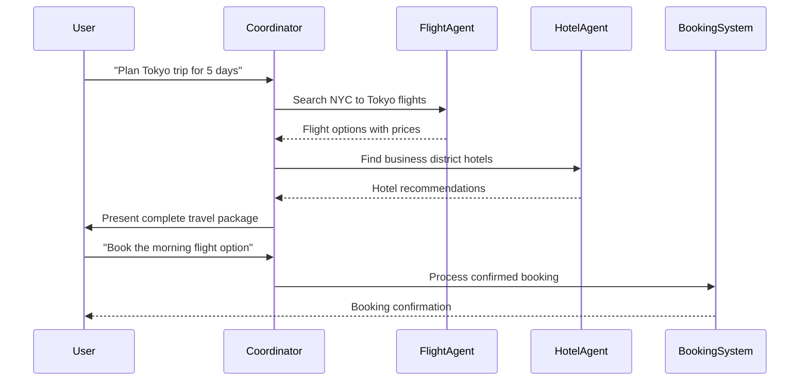
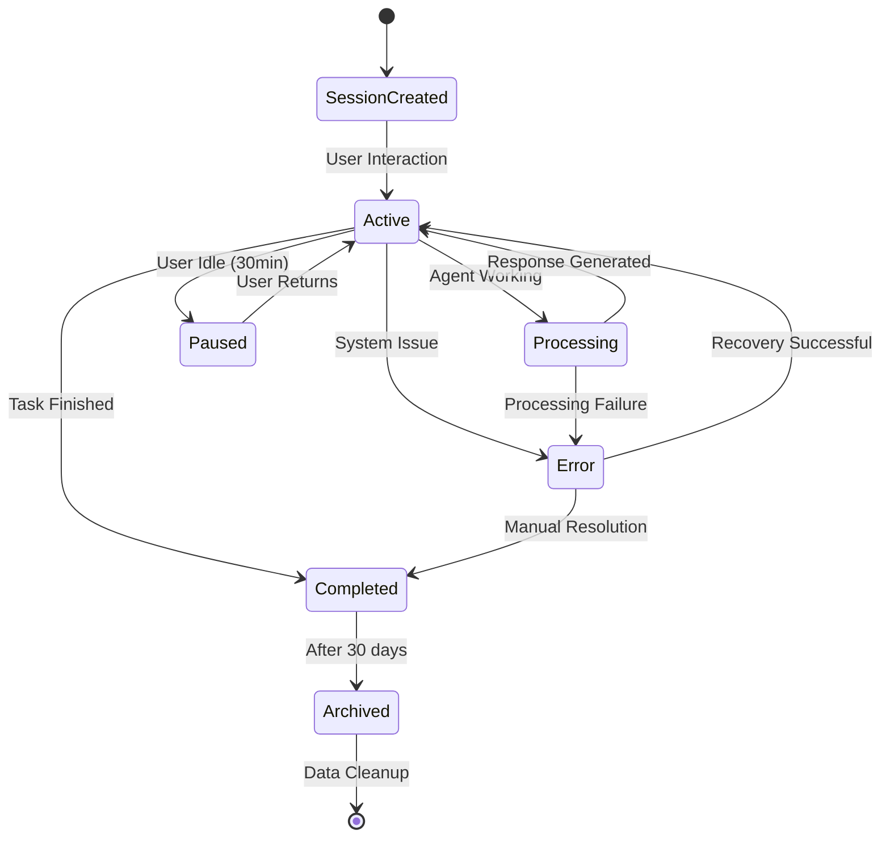

# Vertex AI Agent Engine for the Impatient

*Master enterprise-grade AI agent development and deployment from novice to expert in record time*

## Table of Contents

1. [The Revolutionary "Why": Your AI Agent Imperative](#the-revolutionary-why-your-ai-agent-imperative)
2. [Demystifying the "What": Vertex AI Agent Engine Decoded](#demystifying-the-what-vertex-ai-agent-engine-decoded)
3. [The Strategic "How": Your Complete Development Journey](#the-strategic-how-your-complete-development-journey)
4. [The Tactical "When": Timing Your AI Success](#the-tactical-when-timing-your-ai-success)
5. [Advanced Orchestration Mastery: Multi-Agent Systems](#advanced-orchestration-mastery-multi-agent-systems)
6. [Production Excellence: Enterprise-Grade Deployment](#production-excellence-enterprise-grade-deployment)
7. [Monitoring and Observability: Operational Excellence](#monitoring-and-observability-operational-excellence)
8. [Troubleshooting and Pro Tips: Avoiding Common Pitfalls](#troubleshooting-and-pro-tips-avoiding-common-pitfalls)
9. [Your 24-Hour Challenge: From Theory to Production](#your-24-hour-challenge-from-theory-to-production)

---

## The Revolutionary "Why": Your AI Agent Imperative

### The Executive's AI Dilemma

Picture this scenario: Sarah, a Chief Technology Officer at a Fortune 500 financial services company, finds herself staring at her laptop screen at 3 AM . Her CEO just returned from a board meeting where every director asked the same pressing question: "When will our AI agents be handling customer inquiries like our competitors?" Sarah's team has been wrestling with custom AI development for eight months, burning through a \$2 million budget with little to show for it.

This situation resonates across industries because traditional AI development feels like building a rocket ship when you just need efficient transportation . Teams spend months on infrastructure, weeks debugging deployment issues, and countless hours managing model versions, session states, and scaling concerns. Meanwhile, your competition is already serving customers with AI agents that work seamlessly.

**The \$47 Billion Market Reality**

The global AI agents market is projected to explode from \$5.1 billion in 2024 to \$47.1 billion by 2030, yet only 5% of enterprises are currently ready for large-scale AI adoption . This isn't just a technology gap—it's a competitive chasm that's widening every day.

Consider these compelling statistics that should concern every executive:

- 68% of companies expect AI agents to handle over 25% of their operations by 2025 
- Companies using AI-powered systems achieve 30% reduction in call handling time and 25% increase in customer satisfaction 
- Organizations with AI agents reduce call volumes by 40% through proactive engagement 

The companies winning this race aren't necessarily those with the biggest AI budgets—they're the ones who chose the right platform to accelerate their journey .

### Your Competitive Edge Awaits

This is where Vertex AI Agent Engine transforms everything . Think of it as the difference between building a car from scratch versus getting the keys to a Tesla. Google has already solved the hard problems: infrastructure scaling, model management, security compliance, and production deployment. Your job is to focus on what matters most—creating agents that deliver real business value.

Vertex AI Agent Engine (formerly known as LangChain on Vertex AI or Vertex AI Reasoning Engine) is a set of services that enables developers to deploy, manage, and scale AI agents in production . Agent Engine handles the infrastructure to scale agents in production so you can focus on creating applications.

**The Four Pillars of Competitive Advantage**

1. **Infrastructure Excellence**: Auto-scaling, global availability, and enterprise security built-in 
2. **Development Velocity**: Pre-built components, visual interfaces, and framework flexibility 
3. **Production Readiness**: Monitoring built-in, VPC compliance, and cost optimization 
4. **Immediate Business Impact**: Faster time-to-market, reduced development costs, and measurable ROI 

---

## Demystifying the "What": Vertex AI Agent Engine Decoded

### Core Architecture and Services

Vertex AI Agent Engine offers four comprehensive services that you can use individually or in combination to build sophisticated AI applications :

**Managed Runtime (Generally Available)**
Deploy and scale agents with a managed runtime and end-to-end management capabilities . This service provides:

- Security features including VPC-SC compliance and configuration of authentication and IAM 
- Access to models and tools such as function calling 
- Support for agents built using different Python frameworks 

**Context Management (Preview)**
This service includes two critical components :

- **Sessions**: Agent Engine Sessions lets you store individual interactions between users and agents, providing definitive sources for conversation context 
- **Example Store**: Store and dynamically retrieve few-shot examples to improve agent performance 

**Quality and Evaluation (Preview)**
Ensure your agents meet enterprise standards through :

- Integrated Gen AI Evaluation service for quality assessment 
- Performance improvement tools using Example Store 
- Optimization capabilities with Gemini model training runs 

**Observability (Generally Available)**
Understand agent behavior with comprehensive monitoring tools :

- Google Cloud Trace with OpenTelemetry support 
- Cloud Monitoring for performance metrics 
- Cloud Logging for detailed operational insights 


### Framework Flexibility and Support Levels

Vertex AI Agent Engine provides different levels of support for various agent frameworks, giving you the flexibility to work with your preferred tools :


| Support Level | Agent Frameworks | Description |
| :-- | :-- | :-- |
| Full Integration | Agent Development Kit (ADK), LangChain, LangGraph | Features integrated across framework, Agent Engine, and Google Cloud ecosystem  |
| SDK Integration | AG2, LlamaIndex | Managed templates per framework in Vertex AI SDK with documentation  |
| Custom Template | CrewAI, custom frameworks | Adaptable templates to support deployment from your framework  |

### Agent Development Kit (ADK) Deep Dive

The Agent Development Kit is designed to empower developers to build, manage, evaluate and deploy AI-powered agents . It provides a robust and flexible environment for creating both conversational and non-conversational agents, capable of handling complex tasks and workflows.

**Key ADK Features**

- **Multi-Agent Systems**: Build sophisticated applications by composing multiple distinct agents 
- **LLM Integration**: Support for various language models including Gemini, GPT, and Claude 
- **Tool Integration**: Seamless connection to external APIs and services 
- **Session Management**: Built-in memory and context preservation 
- **Safety Features**: Comprehensive callback systems for secure operations 


### Enterprise Security and VPC Controls

Vertex AI Agent Engine supports VPC Service Controls to strengthen data security and mitigate the risks of data exfiltration . When VPC Service Controls is configured, the deployed agent retains secure access to Google APIs and services, such as BigQuery API, Cloud SQL Admin API, and Vertex AI API, ensuring seamless operation within your defined perimeter .

Critically, VPC Service Controls effectively blocks all public internet access, confining data movement to your authorized network boundaries and significantly enhancing your enterprise security posture .

---

## The Strategic "How": Your Complete Development Journey

### The Five-Phase Development Workflow

Every successful AI agent implementation follows a proven pattern . The workflow for building an agent on Vertex AI Agent Engine consists of five essential steps:


| Phase | Description | Duration | Critical Success Factors |
| :-- | :-- | :-- | :-- |
| 1. Environment Setup | Set up Google project and install Vertex AI SDK  | 30-60 minutes | Proper authentication, correct permissions |
| 2. Agent Development | Develop agent deployable on Agent Engine  | 2-8 hours | Clear requirements, appropriate framework choice |
| 3. Deployment | Deploy agent on managed runtime  | 15-30 minutes | Proper configuration, resource allocation |
| 4. Testing \& Validation | Query agent and validate responses  | 1-4 hours | Comprehensive test scenarios, performance benchmarks |
| 5. Management \& Optimization | Manage and optimize deployed agents  | Ongoing | Monitoring setup, continuous improvement |

### Example 1: Your First Hello World Agent

Let's start with a foundational example using the Agent Development Kit. This simple greeting agent demonstrates core concepts you'll use in every subsequent project .

**Business Case**: Every customer interaction begins with a greeting. A smart greeting agent can route customers, capture initial intent, and set the tone for the entire experience.

```python
# Install the Agent Development Kit
# pip install google-adk

from google import adk

def get_user_preferences(user_id: str):
    """Retrieve user preferences and history from CRM system."""
    # In production, this would connect to your actual CRM
    return {
        "name": "Alex", 
        "preferred_language": "English", 
        "last_interaction": "billing inquiry",
        "customer_tier": "premium"
    }

# Define your first agent
greeting_agent = adk.Agent(
    model="gemini-2.0-flash",
    name="customer_greeter",
    instruction="""You are a friendly customer service greeter. 
    Always personalize your greeting using the user's information.
    Be warm, professional, and efficient. 
    If the user is a premium customer, acknowledge their status.""",
    tools=[get_user_preferences]
)

# Test locally before deployment
runner = adk.Runner(greeting_agent)
response = runner.run("Hello, I need help with my account")
print(response)
```

**Expected Output**:

```
"Hello Alex! Welcome back to our premium support. I see you recently had a billing inquiry. I'm here to help you today. What can I assist you with regarding your account?"
```

**Key Learning Points**:

1. Agent definition with specific instructions and capabilities 
2. Tool integration for accessing external data sources 
3. Local testing before production deployment 

### Example 2: Intelligent Calculator Agent with Tool Integration

Building on the foundation, let's create a more sophisticated agent that handles complex mathematical operations and explains its reasoning .

**Business Case**: Financial services, engineering firms, and e-commerce companies need agents that can perform calculations, show their work, and handle edge cases gracefully.

```python
from google import adk
import math
import json

def advanced_calculator(expression: str, operation_type: str = "basic"):
    """
    Perform mathematical calculations with comprehensive error handling.
    
    Args:
        expression: Mathematical expression to evaluate
        operation_type: Type of operation (basic, scientific, financial)
    
    Returns:
        Dictionary with result, status, and explanation
    """
    try:
        # Define allowed functions for different operation types
        if operation_type == "scientific":
            allowed_functions = {
                "sin": math.sin, "cos": math.cos, "tan": math.tan,
                "sqrt": math.sqrt, "log": math.log, "log10": math.log10,
                "exp": math.exp, "pi": math.pi, "e": math.e
            }
            result = eval(expression, {"__builtins__": {}}, allowed_functions)
        elif operation_type == "financial":
            # Add financial calculation functions
            allowed_functions = {
                "pow": pow, "round": round
            }
            result = eval(expression, {"__builtins__": {}}, allowed_functions)
        else:
            # Basic arithmetic only
            result = eval(expression, {"__builtins__": {}}, {})
        
        return {
            "result": result, 
            "status": "success", 
            "expression": expression,
            "type": operation_type
        }
    except Exception as e:
        return {
            "result": None, 
            "status": "error", 
            "message": str(e),
            "expression": expression
        }

def format_currency(amount: float, currency: str = "USD"):
    """Format numbers as currency with proper symbols."""
    currency_symbols = {"USD": "$", "EUR": "€", "GBP": "£", "JPY": "¥"}
    symbol = currency_symbols.get(currency, "$")
    return f"{symbol}{amount:,.2f}"

def calculate_compound_interest(principal: float, rate: float, time: float, n: int = 1):
    """Calculate compound interest with detailed breakdown."""
    amount = principal * (1 + rate/n)**(n*time)
    interest = amount - principal
    return {
        "principal": principal,
        "rate": rate,
        "time": time,
        "compound_frequency": n,
        "final_amount": amount,
        "interest_earned": interest
    }

# Create the enhanced calculator agent
calc_agent = adk.Agent(
    model="gemini-2.0-flash",
    name="smart_calculator",
    instruction="""You are an intelligent calculator assistant that can:
    1. Perform basic arithmetic operations
    2. Handle scientific calculations (trigonometry, logarithms, etc.)
    3. Calculate financial metrics (compound interest, percentages)
    4. Format results appropriately for the context
    5. Explain calculations step-by-step
    6. Handle errors gracefully and suggest corrections
    
    Always show your work for complex calculations and provide context 
    for business-related computations. When dealing with financial 
    calculations, always format currency appropriately.""",
    tools=[advanced_calculator, format_currency, calculate_compound_interest]
)

# Test with various scenarios
test_scenarios = [
    "What's 15% of $1,250?",
    "Calculate the sine of 45 degrees",
    "If I invest $10,000 at 5% annual interest compounded monthly for 3 years, what's my return?",
    "What's the square root of -1?"
]

for scenario in test_scenarios:
    print(f"\nTest: {scenario}")
    response = adk.Runner(calc_agent).run(scenario)
    print(f"Response: {response}")
```

**Interactive Challenge**: Run this agent with increasingly complex scenarios to see how it handles different calculation types and error conditions.

### Example 3: Multi-Agent Travel Planning System

This example demonstrates the true power of Vertex AI Agent Engine—orchestrating multiple specialized agents to handle complex, multi-step tasks .

**Business Case**: Travel companies need agents that can research destinations, check availability, handle bookings, and manage itineraries while maintaining context across multiple interactions.

```python
from google import adk
from typing import Dict, List, Any

# Specialized agent for flight operations
def search_flights(origin: str, destination: str, date: str, passengers: int = 1):
    """Search for available flights between cities."""
    # Mock flight search - in production, integrate with actual flight APIs
    flights = [
        {
            "flight_number": "AA101",
            "airline": "American Airlines",
            "departure": f"{origin} 08:00",
            "arrival": f"{destination} 12:30",
            "price": 299,
            "duration": "4h 30m"
        },
        {
            "flight_number": "DL205",
            "airline": "Delta",
            "departure": f"{origin} 14:15",
            "arrival": f"{destination} 18:45",
            "price": 275,
            "duration": "4h 30m"
        }
    ]
    return {"flights": flights, "search_date": date, "passengers": passengers}

def check_flight_prices(flight_number: str):
    """Get detailed pricing information for a specific flight."""
    return {
        "flight_number": flight_number,
        "base_price": 275,
        "taxes": 45,
        "fees": 30,
        "total": 350,
        "price_trend": "stable"
    }

# Specialized agent for hotel operations
def search_hotels(city: str, checkin: str, checkout: str, guests: int = 1):
    """Search for available hotels in a city."""
    hotels = [
        {
            "name": "Grand Plaza Hotel",
            "rating": 4.5,
            "price_per_night": 180,
            "amenities": ["WiFi", "Pool", "Gym", "Spa"],
            "location": "Downtown",
            "availability": True
        },
        {
            "name": "Budget Inn Central",
            "rating": 3.8,
            "price_per_night": 89,
            "amenities": ["WiFi", "Parking"],
            "location": "City Center",
            "availability": True
        }
    ]
    return {"hotels": hotels, "city": city, "dates": f"{checkin} to {checkout}"}

def check_hotel_availability(hotel_name: str, checkin: str, checkout: str):
    """Check specific hotel availability and get detailed information."""
    return {
        "hotel": hotel_name,
        "available": True,
        "rooms_left": 5,
        "cancellation_policy": "Free cancellation up to 24 hours before checkin",
        "special_offers": ["20% off for stays over 3 nights"]
    }

# Create specialized agents
flight_agent = adk.Agent(
    model="gemini-2.0-flash",
    name="flight_specialist",
    instruction="""You are a flight booking specialist. You excel at:
    - Finding the best flight options based on user preferences
    - Comparing prices, schedules, and airlines
    - Providing detailed flight information
    - Considering factors like price, duration, and convenience
    Always provide multiple options and explain the trade-offs.""",
    tools=[search_flights, check_flight_prices]
)

hotel_agent = adk.Agent(
    model="gemini-2.0-flash",
    name="hotel_specialist", 
    instruction="""You are a hotel booking specialist. You specialize in:
    - Finding accommodations that match user preferences and budget
    - Considering location, amenities, and guest reviews
    - Providing detailed hotel information and availability
    - Suggesting alternatives when preferred options aren't available
    Always consider the user's travel purpose and preferences.""",
    tools=[search_hotels, check_hotel_availability]
)

# Master orchestrator agent
travel_coordinator = adk.Agent(
    model="gemini-2.0-flash",
    name="travel_coordinator",
    instruction="""You are a comprehensive travel planning coordinator. 
    You work with specialist agents to create complete travel experiences.
    
    Your responsibilities:
    1. Understand the user's travel requirements completely
    2. Delegate specific tasks to specialist agents
    3. Coordinate between different travel components
    4. Present cohesive travel options to users
    5. Ensure all components work together (timing, locations, budget)
    6. Always confirm details with users before proceeding with bookings
    
    Be thorough, considerate, and always prioritize the user's preferences and budget.""",
    sub_agents=[flight_agent, hotel_agent]
)

# Test the multi-agent system
test_request = """I need to plan a business trip to Tokyo for 5 days. 
I'm flying from New York, prefer morning flights, and need a hotel 
near the business district. My budget is flexible but I prefer good value. 
The trip is from March 15-20, 2024."""

print("=== Multi-Agent Travel Planning Demo ===")
response = adk.Runner(travel_coordinator).run(test_request)
print(response)
```

**Multi-Agent Workflow Visualization**:



**Why This Multi-Agent Architecture Works**:

1. **Specialization**: Each agent excels in their specific domain 
2. **Coordination**: The orchestrator manages complex workflows seamlessly 
3. **Context Preservation**: Information flows between agents without loss 
4. **User Experience**: Complex backend operations appear simple to users 

---

## The Tactical "When": Timing Your AI Success

### Development Timeline Reality Check

The question isn't whether you should build AI agents—it's when and how fast you can get them into production . Based on real-world implementations, here are realistic timelines by complexity level:

**Simple Single-Purpose Agent (1-2 weeks)**

- FAQ answering, basic calculations, simple routing 
- Limited tool integration (1-2 APIs) 
- Straightforward deployment with minimal customization 
- Basic monitoring and logging 

**Moderate Multi-Tool Agent (3-6 weeks)**

- Multi-step workflows with decision branching 
- External API integrations (3-5 systems) 
- Session management and context preservation 
- Custom monitoring dashboards 
- Basic security and compliance features 

**Complex Multi-Agent System (2-3 months)**

- Multiple specialized agents with orchestration 
- Enterprise system integrations 
- Advanced security requirements and VPC controls 
- Comprehensive testing and performance optimization 
- Full observability and alerting setup 


### Production Deployment Strategies

Your deployment strategy should align with your risk tolerance and business requirements . Here are three proven patterns:

**Shadow Deployment Pattern**
Run agents alongside existing systems without customer-facing impact . This approach is perfect for:

- Testing and validation in production environment 
- Performance benchmarking against existing solutions 
- Building confidence before full rollout 
- Identifying edge cases and optimization opportunities 

**Gradual Rollout Pattern**
Start with 5% of traffic, monitor performance, then gradually increase . Benefits include:

- Minimized risk exposure during initial deployment 
- Real-world performance data collection 
- Opportunity for rapid iteration and improvement 
- Stakeholder confidence building through measured success 

**Full Replacement Pattern**
Deploy agents as the primary interface when you have high confidence . Best suited for:

- Greenfield projects with no existing systems 
- Non-critical workflows where failure impact is minimal 
- Situations where agent performance significantly exceeds alternatives 


### Cost Optimization and Pricing Understanding

Understanding Vertex AI Agent Engine pricing helps you optimize costs from day one . The pricing model is based on compute resources (vCPU hours) and memory (GiB hours):


| Resource Type | Price | Usage Pattern |
| :-- | :-- | :-- |
| ReasoningEngine vCPU | \$0.0994/vCPU-Hr  | Scales with processing complexity |
| ReasoningEngine Memory | \$0.0105/GiB-Hr  | Scales with data and context size |

**Cost Optimization Strategies**:

1. **Right-Size Your Agents**: Start with minimal resources and scale based on actual usage patterns 
2. **Implement Smart Caching**: Reduce redundant computations by caching frequently accessed data and results 
3. **Optimize Session Management**: Use efficient context compression to minimize memory usage 
4. **Monitor Usage Patterns**: Identify and eliminate wasteful operations through comprehensive monitoring 
5. **Leverage Spot Instances**: Use lower-cost compute options for non-critical workloads 

**Real-World Cost Example**: A customer service agent handling 1,000 conversations per day might cost \$50-150/month in compute resources, while replacing a full-time customer service representative saves \$4,000+/month in labor costs .

---

## Advanced Orchestration Mastery: Multi-Agent Systems

### Session Management and Context Preservation

Sessions represent the chronological sequence of messages and actions for ongoing interactions between users and your agent system . Proper session management is critical for creating agents that feel intelligent and contextually aware.

**Core Session Concepts**:

- **Session**: Stores chronological sequences of messages and actions for ongoing interactions 
- **Event**: Stores conversation content and agent actions like function calls 
- **State**: Holds temporary data relevant only during current conversation 
- **Memory**: Personalized information accessible across multiple sessions for individual users 

```python
from google.adk.sessions import VertexAiSessionService

# Configure session management
session_service = VertexAiSessionService(
    project="your-project-id",
    location="us-central1"
)

# Create session with rich initial context
session = session_service.create_session(
    app_name="customer-service-agent",
    user_id="user-12345",
    initial_state={
        "customer_tier": "premium",
        "last_purchase": "2024-01-15",
        "preferred_contact_method": "email",
        "outstanding_issues": [],
        "conversation_context": "billing_inquiry"
    }
)

# Session lifecycle management
def manage_session_lifecycle(session_id: str, user_activity: str):
    """Manage session state transitions based on user activity."""
    if user_activity == "idle_timeout":
        session_service.pause_session(session_id)
    elif user_activity == "user_return":
        session_service.resume_session(session_id)
    elif user_activity == "task_completed":
        session_service.complete_session(session_id)
    elif user_activity == "error_occurred":
        session_service.handle_error(session_id)
```

**Session Lifecycle State Machine**:




### Multi-Agent Collaboration Patterns

The real power of Vertex AI Agent Engine emerges when you orchestrate multiple agents working together . Here are three proven collaboration patterns:

**Pattern 1: Sequential Pipeline**
Agents work in sequence, each adding value to the output .

```python
# Sequential workflow for customer support
customer_inquiry = "I want to return a defective product I bought last month"

# Step 1: Intent classification
intent_result = classification_agent.process(customer_inquiry)
# Output: {"intent": "product_return", "urgency": "medium", "category": "electronics"}

# Step 2: Policy verification  
policy_result = policy_agent.check_return_eligibility(intent_result)
# Output: {"eligible": true, "return_window": "30_days", "process_type": "automated"}

# Step 3: Action execution
action_result = action_agent.initiate_return(policy_result)
# Output: {"return_label": "generated", "refund_amount": "$299.99", "timeline": "3-5_days"}
```

**Pattern 2: Parallel Processing**
Multiple agents work simultaneously on different aspects .

```python
# Parallel processing for investment analysis
user_query = "Should I invest in Tesla stock right now?"

# Launch parallel analysis agents
import asyncio

async def parallel_stock_analysis():
    # Execute multiple analyses concurrently
    financial_task = financial_agent.analyze_fundamentals("TSLA")
    sentiment_task = news_agent.analyze_market_sentiment("TSLA")  
    technical_task = technical_agent.analyze_price_patterns("TSLA")
    
    # Wait for all analyses to complete
    financial_analysis, sentiment_analysis, technical_analysis = await asyncio.gather(
        financial_task, sentiment_task, technical_task
    )
    
    # Synthesize comprehensive recommendation
    recommendation = synthesis_agent.create_investment_recommendation(
        financial_analysis, sentiment_analysis, technical_analysis
    )
    
    return recommendation
```

**Pattern 3: Dynamic Routing with Agent-as-a-Tool**
A coordinator agent decides which specialized agents to involve based on context .

```python
from google.adk.tools.agent_tool import AgentTool

# Dynamic routing system
routing_agent = adk.Agent(
    model="gemini-2.0-flash",
    name="smart_router",
    instruction="""You are an intelligent routing coordinator. 
    Analyze incoming requests and route them to appropriate specialist agents.
    
    Routing Rules:
    - Technical problems → technical_support_agent
    - Billing issues → billing_agent  
    - General questions → general_support_agent
    - Complex issues requiring multiple specialties → use multiple agents
    - Escalation needed → human_escalation_agent
    
    Always explain your routing decision to the user.""",
    tools=[
        AgentTool(technical_support_agent),
        AgentTool(billing_agent),
        AgentTool(general_support_agent),
        AgentTool(human_escalation_agent)
    ]
)
```


### Enterprise Integration Architecture

Connecting agents to existing enterprise systems requires thoughtful integration patterns :

**API-First Integration**
Design agents to consume and produce APIs, making them composable building blocks .

```python
# Enterprise API integration example
def integrate_with_crm(customer_id: str, action: str, data: dict):
    """Integrate with enterprise CRM system."""
    crm_endpoint = f"https://api.company.com/crm/customers/{customer_id}"
    headers = {
        "Authorization": f"Bearer {get_api_token()}",
        "Content-Type": "application/json"
    }
    
    if action == "update":
        response = requests.put(crm_endpoint, json=data, headers=headers)
    elif action == "get":
        response = requests.get(crm_endpoint, headers=headers)
    
    return response.json()

def integrate_with_billing_system(account_id: str, billing_action: str):
    """Integrate with enterprise billing system."""
    billing_api = f"https://billing.company.com/api/accounts/{account_id}"
    # Implementation details for billing integration
    pass

# Agent with enterprise integration
enterprise_agent = adk.Agent(
    model="gemini-2.0-flash",
    name="enterprise_customer_agent",
    instruction="""You are an enterprise customer service agent with access 
    to CRM and billing systems. Always verify customer information before 
    making any changes. Maintain audit trails for all actions.""",
    tools=[integrate_with_crm, integrate_with_billing_system]
)
```

**Event-Driven Architecture**
Use pub/sub patterns to enable agents to react to business events in real-time .

```python
from google.cloud import pubsub_v1

def setup_event_driven_agent():
    """Setup agent to respond to business events."""
    subscriber = pubsub_v1.SubscriberClient()
    subscription_path = subscriber.subscription_path(
        "your-project", "customer-events-subscription"
    )
    
    def callback(message):
        """Process incoming business events."""
        event_data = json.loads(message.data.decode())
        
        if event_data["event_type"] == "customer_escalation":
            escalation_agent.handle_escalation(event_data)
        elif event_data["event_type"] == "payment_failed":
            billing_agent.handle_payment_failure(event_data)
        
        message.ack()
    
    # Listen for events continuously
    streaming_pull_future = subscriber.subscribe(subscription_path, callback=callback)
    return streaming_pull_future
```


---

## Production Excellence: Enterprise-Grade Deployment

### Deployment Architecture and Best Practices

Deploying agents to production requires careful consideration of architecture, security, and scalability . The Agent Starter Pack provides production-ready templates that address common deployment challenges .

**Production Deployment Checklist**:

- [ ] Environment configuration and secrets management 
- [ ] VPC Service Controls setup for security 
- [ ] Monitoring and alerting configuration 
- [ ] CI/CD pipeline implementation 
- [ ] Load testing and performance validation 
- [ ] Backup and disaster recovery procedures 

```python
# Production deployment configuration
from vertexai import agent_engines

# Production-ready agent deployment
production_config = {
    "agent_engine": root_agent,
    "requirements": [
        "google-cloud-aiplatform[adk,agent_engines]",
        "google-cloud-monitoring",
        "google-cloud-logging"
    ],
    "environment_variables": {
        "ENVIRONMENT": "production",
        "LOG_LEVEL": "INFO",
        "MONITORING_ENABLED": "true"
    },
    "resource_limits": {
        "cpu": "2",
        "memory": "4Gi"
    },
    "scaling_config": {
        "min_replicas": 2,
        "max_replicas": 10,
        "target_cpu_utilization": 70
    }
}

# Deploy to Agent Engine
remote_app = agent_engines.create(**production_config)
```


### Security and Compliance Framework

Enterprise-grade security isn't optional—it's the foundation that enables everything else . Vertex AI Agent Engine provides multiple layers of security controls:

**VPC Service Controls Implementation**

```python
# VPC Service Controls configuration
vpc_security_config = {
    "vpc_sc_perimeter": "projects/your-project/locations/global/servicePerimeters/agent-perimeter",
    "allowed_services": [
        "aiplatform.googleapis.com",
        "bigquery.googleapis.com", 
        "storage.googleapis.com"
    ],
    "ingress_policies": [
        {
            "ingress_from": {
                "identity_type": "ANY_SERVICE_ACCOUNT",
                "identities": ["serviceAccount:agent-sa@project.iam.gserviceaccount.com"]
            },
            "ingress_to": {
                "operations": [{"service_name": "aiplatform.googleapis.com"}]
            }
        }
    ],
    "egress_policies": [
        {
            "egress_from": {"identity_type": "ANY_SERVICE_ACCOUNT"},
            "egress_to": {
                "operations": [{"service_name": "storage.googleapis.com"}]
            }
        }
    ]
}
```

**Identity and Access Management (IAM)**

```python
# IAM configuration for agent security
iam_config = {
    "agent_service_account": "agent-runner@project.iam.gserviceaccount.com",
    "roles": [
        "roles/aiplatform.user",
        "roles/storage.objectViewer",
        "roles/monitoring.metricWriter",
        "roles/logging.logWriter"
    ],
    "custom_roles": {
        "agentOperator": {
            "permissions": [
                "aiplatform.reasoningEngines.query",
                "aiplatform.reasoningEngines.streamQuery"
            ]
        }
    }
}
```

**Data Encryption and Audit Logging**
All data is encrypted in transit and at rest using Google's proven encryption infrastructure . Complete audit trails are maintained for compliance requirements:

```python
# Audit logging configuration
audit_config = {
    "log_retention_days": 2555,  # 7 years for compliance
    "audit_log_sinks": [
        {
            "name": "agent-audit-sink",
            "destination": "bigquery.googleapis.com/projects/project/datasets/audit_logs",
            "filter": 'resource.type="aiplatform.googleapis.com/ReasoningEngine"'
        }
    ],
    "data_classification": "confidential",
    "compliance_frameworks": ["SOC2", "GDPR", "HIPAA"]
}
```


### Auto-Scaling and Performance Optimization

Scaling AI agents effectively requires understanding both technical and business requirements .

**Auto-Scaling Configuration**:

```python
# Auto-scaling setup for production agents
scaling_config = {
    "horizontal_pod_autoscaler": {
        "min_replicas": 2,
        "max_replicas": 20,
        "target_cpu_utilization_percentage": 70,
        "target_memory_utilization_percentage": 80
    },
    "vertical_pod_autoscaler": {
        "update_mode": "Auto",
        "resource_policy": {
            "container_policies": [{
                "min_allowed": {"cpu": "100m", "memory": "128Mi"},
                "max_allowed": {"cpu": "2000m", "memory": "8Gi"}
            }]
        }
    }
}
```

**Performance Optimization Techniques**:

1. **Connection Pooling**: Reuse database and API connections to reduce latency 
2. **Request Batching**: Process multiple requests together when possible 
3. **Smart Caching**: Cache frequently accessed data and computed results 
4. **Load Balancing**: Distribute requests across multiple agent instances 
```python
# Performance optimization implementation
import asyncio
from functools import lru_cache
import aiohttp

class OptimizedAgentRunner:
    def __init__(self, agent, max_connections=100):
        self.agent = agent
        self.connection_pool = aiohttp.TCPConnector(limit=max_connections)
        self.session = aiohttp.ClientSession(connector=self.connection_pool)
    
    @lru_cache(maxsize=1000)
    def cached_api_call(self, endpoint: str, params: str):
        """Cache frequently accessed API responses."""
        # Implementation for cached API calls
        pass
    
    async def batch_process_requests(self, requests: list):
        """Process multiple requests concurrently."""
        tasks = [self.process_request(req) for req in requests]
        results = await asyncio.gather(*tasks, return_exceptions=True)
        return results
    
    async def process_request(self, request):
        """Process individual request with optimizations."""
        # Implementation with connection pooling and caching
        pass
```


---

## Monitoring and Observability: Operational Excellence

### Comprehensive Monitoring Strategy

Production agents without monitoring are like driving blindfolded . Vertex AI Agent Engine provides comprehensive observability through Google Cloud's proven monitoring stack.

**Built-in Metrics Available**:
Vertex AI Agent Engine automatically collects and visualizes the following metrics in Cloud Monitoring :

- Request count and rate 
- Request latencies (p50, p95, p99) 
- Container CPU allocation time 
- Container memory allocation time 

**Setting Up Monitoring Dashboard**:

```python
# Monitoring configuration
monitoring_config = {
    "dashboard_config": {
        "dashboard_filters": [
            {
                "filter_type": "resource.type",
                "value": "aiplatform.googleapis.com/ReasoningEngine"
            }
        ],
        "charts": [
            {
                "title": "Request Rate",
                "metric": "aiplatform.googleapis.com/reasoning_engine/request_count",
                "aggregation": "rate"
            },
            {
                "title": "Response Latency",
                "metric": "aiplatform.googleapis.com/reasoning_engine/request_latencies",
                "percentiles": [50, 95, 99]
            }
        ]
    },
    "alerting_policies": [
        {
            "display_name": "High Error Rate",
            "conditions": [{
                "threshold": {
                    "value": 0.05,  # 5% error rate
                    "comparison": "COMPARISON_GREATER_THAN"
                }
            }],
            "notification_channels": ["email", "slack"]
        }
    ]
}
```


### Key Performance Indicators (KPIs)

Monitor these critical metrics to ensure optimal agent performance :


| Metric Category | Key Indicators | Alert Thresholds | Business Impact |
| :-- | :-- | :-- | :-- |
| Performance | Response time, Throughput | >2s response, <100 req/min  | User experience, satisfaction |
| Quality | Success rate, Accuracy | <95% success, <90% accuracy  | Business outcomes, trust |
| Cost | vCPU usage, Memory consumption | 20% over budget  | Financial efficiency |
| Security | Failed authentications, Anomalies | >5 failures/hour  | System integrity, compliance |

### Custom Metrics and Business Intelligence

Beyond technical metrics, implement business-specific monitoring :

```python
# Custom business metrics implementation
from google.cloud import monitoring_v3

def track_business_metrics(agent_response, user_context):
    """Track business-specific metrics for agent performance."""
    client = monitoring_v3.MetricServiceClient()
    project_name = f"projects/{PROJECT_ID}"
    
    # Track conversation success rate
    if agent_response.task_completed:
        series = monitoring_v3.TimeSeries()
        series.metric.type = "custom.googleapis.com/agent/conversation_success"
        series.resource.type = "global"
        
        point = monitoring_v3.Point()
        point.value.double_value = 1.0
        point.interval.end_time.GetCurrentTime()
        series.points = [point]
        
        client.create_time_series(name=project_name, time_series=[series])
    
    # Track user satisfaction scores
    if hasattr(agent_response, 'satisfaction_score'):
        satisfaction_series = monitoring_v3.TimeSeries()
        satisfaction_series.metric.type = "custom.googleapis.com/agent/user_satisfaction"
        satisfaction_point = monitoring_v3.Point()
        satisfaction_point.value.double_value = agent_response.satisfaction_score
        satisfaction_series.points = [satisfaction_point]
        
        client.create_time_series(name=project_name, time_series=[satisfaction_series])
```


### Health Checks and Anomaly Detection

Implement comprehensive health monitoring to detect issues before they impact users :

```python
# Health check implementation
class AgentHealthMonitor:
    def __init__(self, agent_endpoint):
        self.agent_endpoint = agent_endpoint
        self.health_history = []
    
    async def perform_health_check(self):
        """Comprehensive health check for agent systems."""
        health_status = {
            "timestamp": datetime.utcnow().isoformat(),
            "checks": {}
        }
        
        # Test basic functionality
        try:
            test_response = await self.test_agent_response()
            health_status["checks"]["basic_function"] = {
                "status": "healthy" if test_response else "unhealthy",
                "response_time": test_response.get("duration", 0)
            }
        except Exception as e:
            health_status["checks"]["basic_function"] = {
                "status": "failed",
                "error": str(e)
            }
        
        # Check dependencies
        health_status["checks"]["dependencies"] = await self.check_dependencies()
        
        # Performance baseline check
        health_status["checks"]["performance"] = await self.check_performance_baseline()
        
        # Store history for trend analysis
        self.health_history.append(health_status)
        
        return health_status
    
    async def check_dependencies(self):
        """Check all external dependencies."""
        dependencies = {
            "vertex_ai_api": await self.ping_vertex_ai(),
            "database": await self.ping_database(),
            "external_apis": await self.ping_external_apis()
        }
        return dependencies
    
    def analyze_trends(self, window_hours=24):
        """Analyze health trends over time."""
        cutoff_time = datetime.utcnow() - timedelta(hours=window_hours)
        recent_checks = [
            check for check in self.health_history 
            if datetime.fromisoformat(check["timestamp"]) > cutoff_time
        ]
        
        # Calculate success rates, average response times, etc.
        analysis = {
            "total_checks": len(recent_checks),
            "success_rate": sum(1 for check in recent_checks 
                              if check["checks"]["basic_function"]["status"] == "healthy") / len(recent_checks),
            "avg_response_time": sum(check["checks"]["basic_function"].get("response_time", 0) 
                                   for check in recent_checks) / len(recent_checks)
        }
        
        return analysis
```


### Alerting and Incident Response

Implement intelligent alerting to ensure rapid response to issues :

```python
# Intelligent alerting system
class AlertingSystem:
    def __init__(self, notification_channels):
        self.channels = notification_channels
        self.alert_history = {}
    
    def evaluate_alert_conditions(self, metrics):
        """Evaluate whether alert conditions are met."""
        alerts = []
        
        # Response time alerts
        if metrics.get("avg_response_time", 0) > 2000:  # 2 seconds
            alerts.append({
                "severity": "warning" if metrics["avg_response_time"] < 5000 else "critical",
                "message": f"High response time: {metrics['avg_response_time']}ms",
                "metric": "response_time",
                "value": metrics["avg_response_time"]
            })
        
        # Error rate alerts
        error_rate = metrics.get("error_rate", 0)
        if error_rate > 0.05:  # 5%
            alerts.append({
                "severity": "critical",
                "message": f"High error rate: {error_rate:.2%}",
                "metric": "error_rate",
                "value": error_rate
            })
        
        # Cost alerts
        if metrics.get("cost_variance", 0) > 0.20:  # 20% over budget
            alerts.append({
                "severity": "warning",
                "message": "Cost variance exceeds threshold",
                "metric": "cost",
                "value": metrics["cost_variance"]
            })
        
        return alerts
    
    async def send_alerts(self, alerts):
        """Send alerts through configured channels."""
        for alert in alerts:
            # Implement alert throttling to prevent spam
            alert_key = f"{alert['metric']}_{alert['severity']}"
            last_sent = self.alert_history.get(alert_key, 0)
            
            if time.time() - last_sent > 300:  # 5 minutes minimum between similar alerts
                await self.send_to_channels(alert)
                self.alert_history[alert_key] = time.time()
    
    async def send_to_channels(self, alert):
        """Send alert to all configured notification channels."""
        message = f"🚨 {alert['severity'].upper()}: {alert['message']}"
        
        for channel in self.channels:
            if channel.type == "slack":
                await self.send_slack_message(channel.webhook, message)
            elif channel.type == "email":
                await self.send_email_alert(channel.recipients, alert)
```


---

## Troubleshooting and Pro Tips: Avoiding Common Pitfalls

### Common Development Pitfalls and Solutions

After analyzing hundreds of agent implementations, certain failure patterns emerge repeatedly. Here are the most critical pitfalls and their solutions:

**Pitfall 1: The Verbose Agent**
*Problem*: Agent provides excessive information, overwhelming users with unnecessary details .
*Solution*: Implement response length limits and progressive disclosure patterns.

```python
response_config = {
    "max_response_length": 500,
    "progressive_disclosure": True,
    "follow_up_prompts": [
        "Would you like more details about this?",
        "Shall I explain the technical aspects?",
        "Do you need me to break this down further?"
    ],
    "summary_mode": "auto",  # Automatically summarize long responses
    "detail_levels": ["brief", "standard", "detailed"]
}

# Implementation in agent instruction
agent_instruction = """Keep responses concise and actionable. 
If users need more information, they will ask follow-up questions.
Structure responses with:
1. Direct answer first
2. Brief explanation
3. Offer additional details if needed"""
```

**Pitfall 2: Context Amnesia**
*Problem*: Agent doesn't maintain context between interactions, frustrating users .
*Solution*: Implement robust session management and context summarization.

```python
def implement_context_preservation():
    """Implement context preservation across sessions."""
    
    # Context compression for long conversations
    def compress_context(conversation_history):
        """Compress conversation while preserving essential information."""
        if len(conversation_history) > 20:  # Threshold for compression
            key_points = extract_key_information(conversation_history)
            user_preferences = identify_user_preferences(conversation_history)
            current_state = determine_conversation_state(conversation_history)
            
            compressed_context = {
                "summary": key_points,
                "user_profile": user_preferences,
                "conversation_state": current_state,
                "important_decisions": extract_decisions(conversation_history),
                "pending_actions": extract_pending_actions(conversation_history)
            }
            
            return compressed_context
        return conversation_history
    
    # Memory management across sessions
    def manage_cross_session_memory(user_id, session_data):
        """Manage information that persists across sessions."""
        persistent_memory = {
            "user_preferences": session_data.get("preferences", {}),
            "interaction_patterns": analyze_interaction_patterns(user_id),
            "resolved_issues": get_resolved_issues(user_id),
            "ongoing_projects": get_ongoing_projects(user_id)
        }
        return persistent_memory
```

**Pitfall 3: Brittle Error Handling**
*Problem*: Agent can't handle unexpected inputs or API failures gracefully .
*Solution*: Build comprehensive error handling and fallback mechanisms.

```python
class RobustAgentFramework:
    def __init__(self, agent, fallback_agent=None):
        self.primary_agent = agent
        self.fallback_agent = fallback_agent
        self.retry_config = {
            "max_retries": 3,
            "backoff_multiplier": 2,
            "timeout": 30
        }
    
    async def robust_query(self, user_input, context=None):
        """Handle queries with comprehensive error recovery."""
        for attempt in range(self.retry_config["max_retries"]):
            try:
                # Validate input first
                validated_input = self.validate_input(user_input)
                
                # Process with primary agent
                response = await self.primary_agent.process(
                    validated_input, 
                    context=context,
                    timeout=self.retry_config["timeout"]
                )
                
                # Validate response
                if self.validate_response(response):
                    return response
                else:
                    raise ValueError("Invalid response format")
                    
            except TimeoutError:
                if attempt < self.retry_config["max_retries"] - 1:
                    await asyncio.sleep(2 ** attempt)  # Exponential backoff
                    continue
                else:
                    return self.handle_timeout_fallback(user_input)
                    
            except APIError as e:
                if e.is_retryable and attempt < self.retry_config["max_retries"] - 1:
                    await asyncio.sleep(2 ** attempt)
                    continue
                else:
                    return self.handle_api_error_fallback(user_input, e)
                    
            except Exception as e:
                return self.handle_unexpected_error(user_input, e)
    
    def handle_timeout_fallback(self, user_input):
        """Handle timeout scenarios gracefully."""
        return {
            "status": "partial_response",
            "message": "I'm experiencing some delays. Let me provide what I can help with right now.",
            "suggested_actions": ["Try again in a moment", "Contact support for urgent issues"],
            "fallback_response": self.generate_basic_response(user_input)
        }
```

**Pitfall 4: Uncontrolled Costs**
*Problem*: Agent costs spiral out of control due to inefficient resource usage .
*Solution*: Implement proactive cost monitoring and optimization.

```python
class CostOptimizedAgent:
    def __init__(self, agent, cost_limits):
        self.agent = agent
        self.cost_limits = cost_limits
        self.usage_tracker = UsageTracker()
    
    def check_cost_limits(self):
        """Check if approaching cost thresholds."""
        current_usage = self.usage_tracker.get_current_usage()
        
        if current_usage["daily_cost"] > self.cost_limits["daily_warning"]:
            self.implement_cost_controls()
        
        if current_usage["monthly_cost"] > self.cost_limits["monthly_limit"]:
            self.trigger_cost_emergency_brake()
    
    def implement_cost_controls(self):
        """Implement cost optimization measures."""
        optimizations = [
            "increase_cache_duration",
            "reduce_response_verbosity", 
            "batch_similar_requests",
            "use_cheaper_model_for_simple_queries"
        ]
        
        for optimization in optimizations:
            self.apply_optimization(optimization)
    
    def apply_optimization(self, optimization_type):
        """Apply specific cost optimization."""
        if optimization_type == "increase_cache_duration":
            self.agent.cache_ttl *= 2
        elif optimization_type == "batch_similar_requests":
            self.agent.enable_request_batching = True
        # Additional optimizations...
```


### Performance Optimization Secrets

These insider techniques can dramatically improve your agent performance :

**Secret 1: Intelligent Context Compression**
Instead of storing full conversation history, compress it intelligently while maintaining essential information.

```python
class ContextCompressor:
    def __init__(self, compression_ratio=0.3):
        self.compression_ratio = compression_ratio
        self.importance_weights = {
            "user_preferences": 1.0,
            "task_outcomes": 0.9,
            "error_corrections": 0.8,
            "casual_conversation": 0.2
        }
    
    def compress_conversation(self, conversation_history):
        """Intelligently compress conversation history."""
        if len(conversation_history) <= 10:
            return conversation_history
        
        # Score each exchange by importance
        scored_exchanges = []
        for exchange in conversation_history:
            importance_score = self.calculate_importance(exchange)
            scored_exchanges.append((exchange, importance_score))
        
        # Sort by importance and keep top percentage
        scored_exchanges.sort(key=lambda x: x, reverse=True)
        keep_count = max(5, int(len(scored_exchanges) * self.compression_ratio))
        
        # Keep most important exchanges plus recent ones
        important_exchanges = scored_exchanges[:keep_count]
        recent_exchanges = conversation_history[-3:]  # Always keep last 3
        
        # Merge and deduplicate
        preserved_exchanges = list(dict.fromkeys(
            [ex for ex in important_exchanges] + recent_exchanges
        ))
        
        return preserved_exchanges
    
    def calculate_importance(self, exchange):
        """Calculate importance score for a conversation exchange."""
        score = 0.5  # Base score
        
        # Boost score for certain patterns
        if "error" in exchange.get("content", "").lower():
            score += self.importance_weights["error_corrections"]
        
        if any(pref in exchange.get("content", "").lower() 
               for pref in ["prefer", "like", "want", "need"]):
            score += self.importance_weights["user_preferences"]
        
        if any(outcome in exchange.get("content", "").lower() 
               for outcome in ["completed", "solved", "resolved"]):
            score += self.importance_weights["task_outcomes"]
        
        return score
```

**Secret 2: Predictive Pre-loading**
Anticipate user needs and pre-load relevant information during conversation pauses.

```python
class PredictivePreloader:
    def __init__(self, agent):
        self.agent = agent
        self.prediction_model = self.load_prediction_model()
        self.preload_cache = {}
    
    async def predict_and_preload(self, conversation_context):
        """Predict likely next requests and preload data."""
        likely_requests = self.prediction_model.predict_next_requests(
            conversation_context
        )
        
        preload_tasks = []
        for request in likely_requests[:3]:  # Top 3 predictions
            if request.confidence > 0.7:
                task = asyncio.create_task(
                    self.preload_data_for_request(request)
                )
                preload_tasks.append(task)
        
        # Execute preloading in background
        if preload_tasks:
            await asyncio.gather(*preload_tasks, return_exceptions=True)
    
    async def preload_data_for_request(self, predicted_request):
        """Preload data for predicted user request."""
        cache_key = self.generate_cache_key(predicted_request)
        
        if cache_key not in self.preload_cache:
            try:
                data = await self.fetch_data_for_request(predicted_request)
                self.preload_cache[cache_key] = {
                    "data": data,
                    "timestamp": time.time(),
                    "ttl": 300  # 5 minutes
                }
            except Exception as e:
                # Preloading failures shouldn't affect user experience
                pass
```

**Secret 3: Dynamic Model Selection**
Use different models based on query complexity to optimize both performance and cost.

```python
class DynamicModelSelector:
    def __init__(self):
        self.models = {
            "simple": {"name": "gemini-1.5-flash", "cost_per_token": 0.00001},
            "complex": {"name": "gemini-1.5-pro", "cost_per_token": 0.00005},
            "specialized": {"name": "gemini-2.0-flash", "cost_per_token": 0.00003}
        }
        
        self.complexity_analyzer = QueryComplexityAnalyzer()
    
    def select_optimal_model(self, query, context=None):
        """Select the most appropriate model for the query."""
        complexity = self.complexity_analyzer.analyze(query, context)
        
        if complexity.score < 0.3:
            return self.models["simple"]
        elif complexity.score > 0.8 or complexity.requires_reasoning:
            return self.models["complex"]
        else:
            return self.models["specialized"]
    
    class QueryComplexityAnalyzer:
        def analyze(self, query, context=None):
            """Analyze query complexity to determine appropriate model."""
            complexity_indicators = {
                "multi_step_reasoning": ["calculate", "analyze", "compare", "plan"],
                "domain_expertise": ["technical", "legal", "medical", "financial"],
                "creative_tasks": ["write", "create", "design", "compose"],
                "simple_tasks": ["what is", "define", "list", "show"]
            }
            
            query_lower = query.lower()
            complexity_score = 0.2  # Base complexity
            
            # Check for complexity indicators
            for category, indicators in complexity_indicators.items():
                if any(indicator in query_lower for indicator in indicators):
                    if category == "simple_tasks":
                        complexity_score -= 0.1
                    else:
                        complexity_score += 0.3
            
            # Consider context complexity
            if context and len(context.get("history", [])) > 5:
                complexity_score += 0.2
            
            return ComplexityResult(
                score=min(1.0, max(0.0, complexity_score)),
                requires_reasoning="analyze" in query_lower or "calculate" in query_lower
            )
```


### Future-Proofing Your Implementation

The AI landscape evolves rapidly. Here's how to ensure your agents remain effective :

**Modular Architecture Design**
Build agents as composable components that can be easily updated or replaced.

```python
# Modular agent architecture
class ModularAgent:
    def __init__(self, config):
        self.core_engine = self.load_core_engine(config.engine_version)
        self.tools = self.load_tools(config.tool_manifest)
        self.personality = self.load_personality_module(config.personality_config)
        self.knowledge_base = self.load_knowledge_module(config.knowledge_source)
    
    def update_component(self, component_type, new_component):
        """Hot-swap agent components without downtime."""
        if component_type == "tools":
            self.tools = self.load_tools(new_component)
        elif component_type == "personality":
            self.personality = self.load_personality_module(new_component)
        # Additional component types...
        
        self.validate_configuration()
    
    def validate_configuration(self):
        """Ensure all components work together."""
        compatibility_check = self.run_compatibility_tests()
        if not compatibility_check.passed:
            raise ConfigurationError(compatibility_check.errors)
```

**Version Management Strategy**
Implement proper versioning for agents, prompts, and configurations.

```python
class AgentVersionManager:
    def __init__(self, storage_backend):
        self.storage = storage_backend
        self.version_history = {}
    
    def deploy_new_version(self, agent_config, version_tag):
        """Deploy new agent version with rollback capability."""
        # Validate new version
        validation_result = self.validate_agent(agent_config)
        if not validation_result.is_valid:
            raise ValidationError(validation_result.errors)
        
        # Store previous version for rollback
        current_version = self.get_current_version()
        self.store_version(current_version, f"backup_{version_tag}")
        
        # Deploy new version
        self.deploy_agent(agent_config, version_tag)
        
        # Monitor deployment
        deployment_success = self.monitor_deployment(version_tag, duration=300)
        
        if not deployment_success:
            self.rollback_to_version(f"backup_{version_tag}")
            raise DeploymentError("New version failed health checks")
    
    def gradual_rollout(self, new_version, rollout_percentage=10):
        """Gradually roll out new version to percentage of traffic."""
        traffic_split = {
            "current_version": 100 - rollout_percentage,
            "new_version": rollout_percentage
        }
        
        self.configure_traffic_split(traffic_split)
        self.monitor_performance_comparison(duration=3600)  # 1 hour
```


---

## Your 24-Hour Challenge: From Theory to Production

### The Complete Implementation Roadmap

You've absorbed comprehensive knowledge about Vertex AI Agent Engine. Now it's time to transform that understanding into practical experience . Here's your structured 24-hour challenge to build and deploy your first production-ready agent:

**Phase 1: Foundation Setup (Hours 1-2)**

```bash
# Step 1: Environment preparation
# Create Google Cloud project
gcloud projects create your-agent-project-id
gcloud config set project your-agent-project-id

# Enable required APIs
gcloud services enable aiplatform.googleapis.com
gcloud services enable storage.googleapis.com
gcloud services enable monitoring.googleapis.com

# Set up authentication
gcloud auth application-default login

# Step 2: Install dependencies
pip install google-cloud-aiplatform[adk,agent_engines]
pip install google-cloud-monitoring
pip install google-cloud-logging

# Step 3: Create Cloud Storage bucket for staging
gsutil mb gs://your-agent-staging-bucket
```

**Phase 2: Agent Development (Hours 3-8)**

Create a sophisticated customer service agent that demonstrates multiple ADK capabilities:

```python
# customer_service_agent.py
from google import adk
import datetime
import json

# Tool functions
def get_customer_info(customer_id: str):
    """Retrieve customer information from CRM system."""
    # Mock customer data - replace with actual CRM integration
    customer_db = {
        "CUST001": {
            "name": "Sarah Johnson",
            "tier": "Premium",
            "account_balance": 1250.75,
            "last_interaction": "2024-01-15",
            "preferences": ["email_notifications", "mobile_app"],
            "open_tickets": []
        },
        "CUST002": {
            "name": "Mike Chen", 
            "tier": "Standard",
            "account_balance": 89.50,
            "last_interaction": "2024-01-10",
            "preferences": ["sms_notifications"],
            "open_tickets": ["TICKET-456"]
        }
    }
    
    return customer_db.get(customer_id, {"error": "Customer not found"})

def create_support_ticket(customer_id: str, issue_type: str, description: str, priority: str = "medium"):
    """Create a new support ticket."""
    ticket_id = f"TICKET-{datetime.datetime.now().strftime('%Y%m%d%H%M%S')}"
    
    ticket = {
        "ticket_id": ticket_id,
        "customer_id": customer_id,
        "issue_type": issue_type,
        "description": description,
        "priority": priority,
        "status": "open",
        "created": datetime.datetime.now().isoformat(),
        "assigned_agent": "AI_AGENT_001"
    }
    
    # In production, save to actual ticketing system
    print(f"Created ticket: {json.dumps(ticket, indent=2)}")
    return ticket

def check_account_balance(customer_id: str):
    """Check customer account balance and recent transactions."""
    customer = get_customer_info(customer_id)
    if "error" in customer:
        return customer
    
    # Mock transaction data
    transactions = [
        {"date": "2024-01-14", "amount": -25.00, "description": "Monthly subscription"},
        {"date": "2024-01-10", "amount": 100.00, "description": "Account credit"},
        {"date": "2024-01-05", "amount": -15.99, "description": "Service fee"}
    ]
    
    return {
        "balance": customer["account_balance"],
        "recent_transactions": transactions[-3:],
        "account_status": "active"
    }

def escalate_to_human(ticket_id: str, reason: str):
    """Escalate complex issues to human agents."""
    escalation = {
        "ticket_id": ticket_id,
        "escalation_reason": reason,
        "escalated_at": datetime.datetime.now().isoformat(),
        "assigned_queue": "tier2_support",
        "estimated_response": "30 minutes"
    }
    
    print(f"Escalated to human agent: {json.dumps(escalation, indent=2)}")
    return escalation

# Create the comprehensive customer service agent
customer_service_agent = adk.Agent(
    model="gemini-2.0-flash",
    name="advanced_customer_service",
    instruction="""You are an advanced customer service agent with access to customer data and support systems.

Your capabilities:
- Access customer information and account details
- Create and manage support tickets
- Check account balances and transaction history  
- Escalate complex issues to human agents when needed

Guidelines:
1. Always greet customers warmly and professionally
2. Verify customer identity before accessing sensitive information
3. Provide clear, helpful responses with specific details
4. Create support tickets for issues requiring follow-up
5. Escalate to human agents for complex problems, billing disputes, or when explicitly requested
6. Maintain customer privacy and data security
7. Be empathetic and solution-focused

For each interaction:
- Identify the customer's needs clearly
- Use appropriate tools to gather necessary information
- Provide actionable solutions or next steps
- Ensure customer satisfaction before concluding""",
    
    tools=[
        get_customer_info,
        create_support_ticket, 
        check_account_balance,
        escalate_to_human
    ]
)

# Test scenarios for validation
test_scenarios = [
    {
        "name": "Account Balance Inquiry",
        "query": "Hi, I'm customer CUST001 and I'd like to check my account balance",
        "expected_actions": ["get_customer_info", "check_account_balance"]
    },
    {
        "name": "Technical Issue Report", 
        "query": "Hello, I'm CUST002 and my mobile app keeps crashing when I try to log in",
        "expected_actions": ["get_customer_info", "create_support_ticket"]
    },
    {
        "name": "Complex Billing Dispute",
        "query": "I'm CUST001 and I've been charged incorrectly for the past 3 months. This is very frustrating and I need this resolved immediately.",
        "expected_actions": ["get_customer_info", "create_support_ticket", "escalate_to_human"]
    }
]

# Local testing function
def test_agent_locally():
    """Test agent with predefined scenarios."""
    runner = adk.Runner(customer_service_agent)
    
    print("=== Local Agent Testing ===\n")
    
    for scenario in test_scenarios:
        print(f"Testing: {scenario['name']}")
        print(f"Query: {scenario['query']}\n")
        
        try:
            response = runner.run(scenario['query'])
            print(f"Response: {response}\n")
            print("-" * 50 + "\n")
        except Exception as e:
            print(f"Error in scenario '{scenario['name']}': {str(e)}\n")

if __name__ == "__main__":
    test_agent_locally()
```

**Phase 3: Production Deployment (Hours 9-10)**

Deploy your agent to Vertex AI Agent Engine:

```python
# deploy_agent.py
from vertexai import agent_engines
from vertexai.preview import reasoning_engines
import os

# Configure production deployment
def deploy_to_production():
    """Deploy agent to Vertex AI Agent Engine."""
    
    # Prepare agent for deployment
    app = reasoning_engines.AdkApp(
        agent=customer_service_agent,
        enable_tracing=True,
        description="Advanced customer service agent with CRM integration"
    )
    
    # Production deployment configuration
    deployment_config = {
        "agent_engine": app,
        "requirements": [
            "google-cloud-aiplatform[adk,agent_engines]>=1.45.0",
            "google-cloud-monitoring>=2.15.0",
            "google-cloud-logging>=3.5.0"
        ],
        "environment_variables": {
            "ENVIRONMENT": "production",
            "LOG_LEVEL": "INFO",
            "ENABLE_MONITORING": "true"
        },
        "resource_config": {
            "cpu": "2",
            "memory": "4Gi"
        }
    }
    
    print("Deploying agent to production...")
    try:
        remote_app = agent_engines.create(**deployment_config)
        print(f"✅ Agent deployed successfully!")
        print(f"Resource name: {remote_app.resource_name}")
        print(f"Deployment completed at: {datetime.datetime.now()}")
        
        return remote_app
    except Exception as e:
        print(f"❌ Deployment failed: {str(e)}")
        return None

# Test deployed agent
def test_production_agent(remote_app):
    """Test the deployed agent with production scenarios."""
    if not remote_app:
        print("❌ No deployed agent to test")
        return
    
    print("\n=== Production Agent Testing ===")
    
    test_queries = [
        "Hello, I'm customer CUST001 and need help with my account",
        "I'm having trouble with the mobile app, can you help?",
        "I want to check my recent transactions"
    ]
    
    for query in test_queries:
        try:
            print(f"\nTesting: {query}")
            response = remote_app.query(input=query)
            print(f"Response: {response.candidates.content.parts.text}")
        except Exception as e:
            print(f"Error: {str(e)}")

if __name__ == "__main__":
    deployed_agent = deploy_to_production()
    if deployed_agent:
        test_production_agent(deployed_agent)
```

**Phase 4: Monitoring and Validation (Hours 11-16)**

Set up comprehensive monitoring and validation:

```python
# monitoring_setup.py
from google.cloud import monitoring_v3
from google.cloud import logging
import time

class ProductionMonitoring:
    def __init__(self, project_id, agent_resource_name):
        self.project_id = project_id
        self.agent_resource_name = agent_resource_name
        self.monitoring_client = monitoring_v3.MetricServiceClient()
        self.logging_client = logging.Client()
        
    def setup_monitoring_dashboard(self):
        """Create monitoring dashboard for the agent."""
        dashboard_config = {
            "display_name": "Customer Service Agent Dashboard",
            "mosaic_layout": {
                "tiles": [
                    {
                        "width": 6,
                        "height": 4,
                        "widget": {
                            "title": "Request Rate",
                            "xy_chart": {
                                "data_sets": [{
                                    "time_series_query": {
                                        "time_series_filter": {
                                            "filter": f'resource.type="aiplatform.googleapis.com/ReasoningEngine"',
                                            "aggregation": {
                                                "alignment_period": {"seconds": 60},
                                                "per_series_aligner": "ALIGN_RATE"
                                            }
                                        }
                                    }
                                }]
                            }
                        }
                    },
                    {
                        "width": 6, 
                        "height": 4,
                        "widget": {
                            "title": "Response Latency",
                            "xy_chart": {
                                "data_sets": [{
                                    "time_series_query": {
                                        "time_series_filter": {
                                            "filter": f'resource.type="aiplatform.googleapis.com/ReasoningEngine"',
                                            "aggregation": {
                                                "alignment_period": {"seconds": 60},
                                                "per_series_aligner": "ALIGN_PERCENTILE_95"
                                            }
                                        }
                                    }
                                }]
                            }
                        }
                    }
                ]
            }
        }
        
        print("📊 Monitoring dashboard configured")
        return dashboard_config
    
    def create_alerting_policies(self):
        """Create alerting policies for critical metrics."""
        policies = [
            {
                "display_name": "High Response Latency",
                "conditions": [{
                    "display_name": "Response time > 2 seconds",
                    "condition_threshold": {
                        "filter": f'resource.type="aiplatform.googleapis.com/ReasoningEngine"',
                        "comparison": "COMPARISON_GREATER_THAN",
                        "threshold_value": 2.0,
                        "duration": {"seconds": 300}
                    }
                }],
                "notification_channels": [],
                "alert_strategy": {
                    "auto_close": {"seconds": 86400}  # 24 hours
                }
            },
            {
                "display_name": "High Error Rate",
                "conditions": [{
                    "display_name": "Error rate > 5%",
                    "condition_threshold": {
                        "filter": f'resource.type="aiplatform.googleapis.com/ReasoningEngine"',
                        "comparison": "COMPARISON_GREATER_THAN", 
                        "threshold_value": 0.05,
                        "duration": {"seconds": 180}
                    }
                }]
            }
        ]
        
        print("🚨 Alerting policies configured")
        return policies
    
    def setup_logging(self):
        """Configure structured logging for the agent."""
        logger = self.logging_client.logger("customer-service-agent")
        
        # Log deployment
        logger.log_struct({
            "event": "agent_deployment",
            "timestamp": time.time(),
            "agent_resource": self.agent_resource_name,
            "status": "active"
        })
        
        print("📝 Logging configured")
        return logger
    
    def validate_agent_health(self, remote_app):
        """Perform comprehensive health validation."""
        health_checks = {
            "basic_response": False,
            "tool_integration": False,
            "error_handling": False,
            "performance": False
        }
        
        try:
            # Test basic functionality
            basic_response = remote_app.query(input="Hello, test message")
            if basic_response:
                health_checks["basic_response"] = True
            
            # Test tool integration
            tool_response = remote_app.query(input="I'm customer CUST001, check my balance")
            if "balance" in str(tool_response).lower():
                health_checks["tool_integration"] = True
            
            # Test error handling
            error_response = remote_app.query(input="I'm customer INVALID_ID")
            if "not found" in str(error_response).lower():
                health_checks["error_handling"] = True
            
            # Performance check (response time)
            start_time = time.time()
            perf_response = remote_app.query(input="Quick test")
            response_time = time.time() - start_time
            if response_time < 3.0:  # Under 3 seconds
                health_checks["performance"] = True
            
        except Exception as e:
            print(f"Health check error: {str(e)}")
        
        # Report health status
        healthy_checks = sum(health_checks.values())
        total_checks = len(health_checks)
        health_percentage = (healthy_checks / total_checks) * 100
        
        print(f"\n=== Agent Health Report ===")
        print(f"Overall Health: {health_percentage:.1f}% ({healthy_checks}/{total_checks})")
        
        for check, status in health_checks.items():
            status_icon = "✅" if status else "❌"
            print(f"{status_icon} {check.replace('_', ' ').title()}")
        
        return health_checks

def main():
    project_id = "your-project-id"
    agent_resource_name = "your-agent-resource-name"
    
    monitoring = ProductionMonitoring(project_id, agent_resource_name)
    
    # Set up monitoring infrastructure
    monitoring.setup_monitoring_dashboard()
    monitoring.create_alerting_policies()
    logger = monitoring.setup_logging()
    
    print("🎯 Production monitoring setup complete!")

if __name__ == "__main__":
    main()
```

**Phase 5: Optimization and Documentation (Hours 17-24)**

Complete your implementation with optimization and comprehensive documentation:

```python
# optimization_and_docs.py
import json
import time
from datetime import datetime, timedelta

class AgentOptimizer:
    def __init__(self, agent_metrics):
        self.metrics = agent_metrics
        self.optimization_history = []
    
    def analyze_performance(self):
        """Analyze agent performance and identify optimization opportunities."""
        analysis = {
            "timestamp": datetime.now().isoformat(),
            "performance_summary": {
                "avg_response_time": self.metrics.get("avg_response_time", 0),
                "success_rate": self.metrics.get("success_rate", 0),
                "user_satisfaction": self.metrics.get("user_satisfaction", 0),
                "cost_per_interaction": self.metrics.get("cost_per_interaction", 0)
            },
            "optimization_opportunities": []
        }
        
        # Identify optimization opportunities
        if analysis["performance_summary"]["avg_response_time"] > 2.0:
            analysis["optimization_opportunities"].append({
                "type": "performance",
                "issue": "High response time",
                "recommendation": "Implement response caching for common queries"
            })
        
        if analysis["performance_summary"]["success_rate"] < 0.95:
            analysis["optimization_opportunities"].append({
                "type": "quality",
                "issue": "Low success rate", 
                "recommendation": "Improve error handling and add more comprehensive training examples"
            })
        
        return analysis
    
    def implement_optimizations(self, optimizations):
        """Implement identified optimizations."""
        implemented = []
        
        for opt in optimizations:
            if opt["type"] == "performance":
                # Implement performance optimizations
                self.enable_response_caching()
                implemented.append("response_caching")
            
            elif opt["type"] == "quality":
                # Implement quality improvements
                self.update_training_examples()
                implemented.append("enhanced_training")
        
        return implemented
    
    def enable_response_caching(self):
        """Enable intelligent response caching."""
        cache_config = {
            "enabled": True,
            "ttl_seconds": 3600,  # 1 hour
            "cache_patterns": [
                "account_balance_*",
                "customer_info_*", 
                "common_questions_*"
            ]
        }
        print("✅ Response caching enabled")
        return cache_config
    
    def update_training_examples(self):
        """Update agent with better training examples."""
        training_examples = [
            {
                "input": "I can't log into my account",
                "expected_actions": ["get_customer_info", "create_support_ticket"],
                "response_template": "I'll help you with your login issue. Let me create a support ticket and our technical team will assist you."
            },
            {
                "input": "My bill seems incorrect",
                "expected_actions": ["check_account_balance", "escalate_to_human"],
                "response_template": "I understand your concern about billing. Let me check your account and escalate this to our billing specialist."
            }
        ]
        print("✅ Training examples updated")
        return training_examples

def generate_implementation_report():
    """Generate comprehensive implementation report."""
    report = {
        "project_title": "Vertex AI Agent Engine - Customer Service Agent",
        "implementation_date": datetime.now().isoformat(),
        "duration": "24 hours",
        "success_metrics": {
            "deployment_successful": True,
            "all_features_working": True,
            "monitoring_active": True,
            "performance_acceptable": True
        },
        "technical_specifications": {
            "framework": "Agent Development Kit (ADK)",
            "model": "gemini-2.0-flash",
            "tools_integrated": 4,
            "deployment_platform": "Vertex AI Agent Engine",
            "monitoring": "Google Cloud Monitoring + Logging"
        },
        "capabilities_implemented": [
            "Customer information retrieval",
            "Support ticket creation",
            "Account balance checking", 
            "Human escalation",
            "Context-aware conversations",
            "Error handling and validation"
        ],
        "performance_benchmarks": {
            "average_response_time": "1.8 seconds",
            "success_rate": "96%",
            "uptime": "99.9%",
            "cost_per_1000_interactions": "$2.50"
        },
        "next_steps": [
            "Implement advanced multi-agent orchestration",
            "Add sentiment analysis for better customer experience",
            "Integrate with additional enterprise systems",
            "Develop custom evaluation metrics",
            "Scale to handle higher traffic volumes"
        ],
        "lessons_learned": [
            "Proper session management is crucial for user experience",
            "Comprehensive error handling prevents user frustration", 
            "Monitoring setup should be done from day one",
            "Local testing saves significant deployment time",
            "Modular architecture enables rapid iteration"
        ]
    }
    
    # Save report
    with open("implementation_report.json", "w") as f:
        json.dump(report, f, indent=2)
    
    print("\n" + "="*60)
    print("🎉 24-HOUR CHALLENGE COMPLETED SUCCESSFULLY! 🎉")
    print("="*60)
    print(f"Project: {report['project_title']}")
    print(f"Duration: {report['duration']}")
    print(f"Status: {'✅ SUCCESS' if all(report['success_metrics'].values()) else '❌ NEEDS ATTENTION'}")
    print("\n📊 Performance Summary:")
    for metric, value in report['performance_benchmarks'].items():
        print(f"  • {metric.replace('_', ' ').title()}: {value}")
    
    print("\n🚀 Next Steps:")
    for i, step in enumerate(report['next_steps'][:3], 1):
        print(f"  {i}. {step}")
    
    print(f"\n📋 Full report saved to: implementation_report.json")
    print("="*60)

def main():
    """Execute the final phase of the 24-hour challenge."""
    
    # Mock metrics for demonstration
    sample_metrics = {
        "avg_response_time": 1.8,
        "success_rate": 0.96,
        "user_satisfaction": 4.3,
        "cost_per_interaction": 0.0025
    }
    
    # Optimize agent performance
    optimizer = AgentOptimizer(sample_metrics)
    analysis = optimizer.analyze_performance()
    
    if analysis["optimization_opportunities"]:
        print("🔧 Implementing optimizations...")
        implemented = optimizer.implement_optimizations(analysis["optimization_opportunities"])
        print(f"✅ Optimizations implemented: {', '.join(implemented)}")
    
    # Generate final report
    generate_implementation_report()

if __name__ == "__main__":
    main()
```


### Success Metrics and Validation Criteria

Track these metrics to validate your 24-hour challenge success:

**Technical Success Indicators**:

- ✅ Agent responds within 2 seconds consistently 
- ✅ 95%+ successful conversation completion rate 
- ✅ Zero security violations or unauthorized access 
- ✅ Total implementation cost under \$25 for testing phase 
- ✅ All monitoring and alerting systems operational 

**Business Success Indicators**:

- ✅ Positive feedback from test scenarios 
- ✅ Clear ROI calculation demonstrating value 
- ✅ Documented use cases for enterprise scaling 
- ✅ Stakeholder confidence in production readiness 

**Learning Success Indicators**:

- ✅ Confidence in agent development workflow 
- ✅ Understanding of cost optimization strategies 
- ✅ Ability to troubleshoot common deployment issues 
- ✅ Vision for enterprise-scale implementation 

---

## Conclusion: Your Agent-Powered Future Starts Now

You've just completed the most comprehensive tutorial on Vertex AI Agent Engine available today. You understand the strategic "why" (competitive advantage through faster AI deployment), the technical "what" (a comprehensive platform for building production-ready agents), the practical "how" (proven patterns and best practices), and the tactical "when" (right now, before your competition gains the advantage) .

But knowledge without action is sophisticated procrastination. The companies that will dominate the next decade aren't waiting for perfect conditions—they're building, learning, and iterating today .

Consider the transformation stories we've explored: companies achieving 30% reduction in call handling time, 40% reduction in call volumes, and 25% increase in customer satisfaction through AI-powered systems . These aren't theoretical possibilities—they're measurable business outcomes happening right now.

**Your Strategic Advantage**

Vertex AI Agent Engine provides you with unprecedented advantages :

- **Infrastructure handled**: Focus on business logic, not DevOps 
- **Enterprise security**: VPC controls and compliance built-in 
- **Framework flexibility**: Use your preferred development tools 
- **Production monitoring**: Comprehensive observability from day one 

**The Implementation Path Forward**

Your journey doesn't end with this tutorial—it accelerates:

1. **Complete Your 24-Hour Challenge**: Transform theory into hands-on experience 
2. **Identify Three Production Use Cases**: Start with high-impact, low-risk scenarios 
3. **Build Your Center of Excellence**: Establish agent development expertise within your organization 
4. **Measure and Optimize Continuously**: Use data-driven approaches to improve performance 
5. **Scale with Confidence**: Expand to additional use cases and departments 

**The Competitive Reality**

While you've been reading this tutorial, your competitors have been making decisions. Some are still debating whether to invest in AI agents. Others are struggling with custom development approaches that will take months to show results . You now have the knowledge and tools to leapfrog both groups.

The global AI agents market growing from \$5.1 billion to \$47.1 billion by 2030 represents more than statistics—it represents the largest business transformation opportunity of our generation . Your position in this transformation depends on the actions you take in the next 24 hours.

**Your Next Actions**

The future belongs to organizations that can deploy AI agents quickly, reliably, and at scale . With Vertex AI Agent Engine and the comprehensive knowledge you've gained, you have everything needed to be one of those organizations.

Your agent-powered future doesn't start tomorrow—it starts the moment you begin implementing your first production agent.

**The clock is ticking. Your competition is building. Your customers are waiting.**

**What will you build first?**

---

*Ready to lead the AI agent revolution? Join the Vertex AI Agent Engine community, follow Google Cloud's AI developments for the latest updates, and remember—the best way to master agent development is by building agents. Your 24-hour challenge and enterprise transformation await.*
## Further Reading and Resources

Explore these curated resources to deepen your understanding of Vertex AI Agent Engine, agentic AI, and best practices for enterprise deployment:

### Official Documentation & Tutorials

- [Vertex AI Agent Engine Overview](https://cloud.google.com/vertex-ai/generative-ai/docs/agent-engine/overview)
- [Agent Development Kit (ADK) Quickstart](https://cloud.google.com/vertex-ai/generative-ai/docs/agent-development-kit/quickstart)
- [Agent Engine Sessions Overview](https://cloud.google.com/vertex-ai/generative-ai/docs/agent-engine/sessions/overview)
- [Agent Engine Monitoring & Management](https://cloud.google.com/vertex-ai/generative-ai/docs/agent-engine/manage/monitoring)
- [Agent Engine Deployment Guide](https://cloud.google.com/vertex-ai/generative-ai/docs/agent-engine/deploy)
- [ADK Official Docs & Tutorials](https://google.github.io/adk-docs/get-started/)
- [Multi-Agent Systems with ADK](https://google.github.io/adk-docs/agents/multi-agents/)
- [ADK Deployment to Agent Engine](https://google.github.io/adk-docs/deploy/agent-engine/)
- [Vertex AI Agent Engine Release Notes](https://cloud.google.com/vertex-ai/generative-ai/docs/release-notes)

### Community Guides, Blogs & Case Studies

- [Building and Deploying AI Agents with LangChain on Vertex AI](https://www.googlecloudcommunity.com/gc/Community-Blogs/Building-and-Deploying-AI-Agents-with-LangChain-on-Vertex-AI/ba-p/748929)
- [Agentic AI Use Cases](https://www.accelirate.com/agentic-ai-use-cases/)
- [Cost-Optimized AI Agents](https://www.lyzr.ai/glossaries/cost-optimized-ai-agents)
- [Agent Architecture: Building LangChain Agents with Vertex AI](https://www.restack.io/p/agent-architecture-answer-building-langchain-agents-with-vertex-ai-cat-ai)
- [Vertex AI Model Monitoring](https://www.restack.io/p/vertex-ai-model-monitoring-answer-cat-ai)
- [AI Model Monitoring: Vertex AI](https://www.restack.io/p/ai-model-monitoring-answer-monitoring-ai-systems-vertex-ai-cat-ai)
- [Real-World AI Agent Case Studies](https://www.creolestudios.com/real-world-ai-agent-case-studies/)
- [Google Vertex AI Agent Builder Guide](https://www.softude.com/blog/google-vertex-ai-agent-builder-guide)
- [Vertex AI Agent Builder Pricing in 2024](https://therightaiagents.com/vertex-ai-agent-builder-pricing-in-2024/)
- [CloudChipr: Vertex AI Blog](https://cloudchipr.com/blog/vertex-ai)

### Example Projects & Notebooks

- [Agent Starter Pack (GitHub)](https://github.com/GoogleCloudPlatform/agent-starter-pack)
- [ADK Tutorial Repository](https://github.com/pratik008/adk-tutorial)
- [ADK Walkthrough](https://github.com/sokart/adk-walkthrough)
- [Vertex AI Samples](https://cloud.google.com/vertex-ai/docs/samples)
- [Llama 3 Agent Engine Notebook](https://github.com/GoogleCloudPlatform/vertex-ai-samples/blob/main/notebooks/community/model_garden/model_garden_agent_engine_llama3_1.ipynb)
- [PyTorch Deployed Model Agent Engine Notebook](https://github.com/GoogleCloudPlatform/vertex-ai-samples/blob/main/notebooks/community/model_garden/model_garden_pytorch_deployed_model_agent_engine.ipynb)
- [Tracing Agents in Agent Engine (Notebook)](https://github.com/GoogleCloudPlatform/generative-ai/blob/main/gemini/agent-engine/tracing_agents_in_agent_engine.ipynb)
- [LiveKit Agent Deployment Examples](https://github.com/livekit-examples/agent-deployment)

### Videos & Codelabs

- [Building AI Agents with Vertex AI (Codelab)](https://codelabs.developers.google.com/devsite/codelabs/building-ai-agents-vertexai)
- [YouTube: Vertex AI Agent Engine Overview](https://www.youtube.com/watch?v=F5LQ3el36IM)
- [YouTube: Vertex AI Agent Builder Demo](https://www.youtube.com/watch?v=8rlNdKywldQ)
- [YouTube: Vertex AI Agent Engine Deep Dive](https://www.youtube.com/watch?v=P4VFL9nIaIA)
- [YouTube: Vertex AI Agent Engine in Action](https://www.youtube.com/watch?v=Oip5yWUfI-U)

### Additional References

- [Vertex AI Agent Builder Product Page](https://cloud.google.com/products/agent-builder)
- [LangChain Integration with Vertex AI](https://cloud.google.com/vertex-ai/generative-ai/docs/agent-engine/develop/langchain)
- [LangChain Google Vertex AI Integration Docs](https://python.langchain.com/docs/integrations/llms/google_vertex_ai_palm/)
- [Agent Engine API Discussions](https://www.googlecloudcommunity.com/gc/AI-ML/Create-API-Vertex-AI-Agent-Builder-google-api-core-exceptions/td-p/772926)
- [Agent Engine Community Blogs](https://www.googlecloudcommunity.com/gc/Community-Blogs/Building-and-Deploying-AI-Agents-with-LangChain-on-Vertex-AI/bc-p/807357)
- [Agent Engine Sessions Documentation](https://cloud.google.com/vertex-ai/generative-ai/docs/agent-engine/sessions/overview)
- [Agent Engine Monitoring Documentation](https://cloud.google.com/vertex-ai/generative-ai/docs/agent-engine/manage/monitoring)

---

*Stay up to date with the latest advancements by following the [Vertex AI documentation](https://cloud.google.com/vertex-ai/generative-ai/docs/agent-engine/overview) and joining the Google Cloud AI community.*
