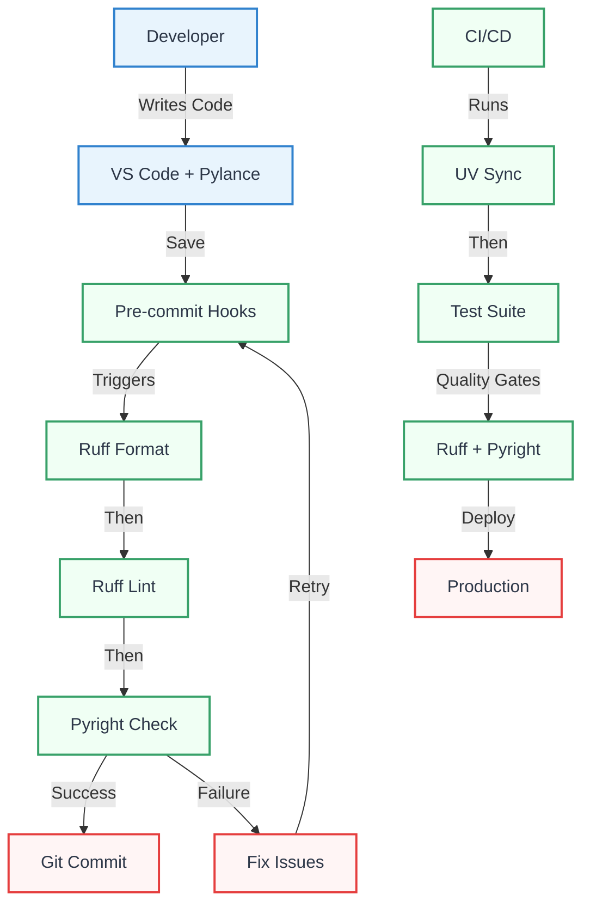

# Modern Python Development Toolkit 2025: A Unified Ecosystem

## Introduction

In 2025, Python development has unified around a high-performance toolkit driven by Astral's Rust-based tools—UV and Ruff—alongside Pyright, Taskipy, and pre-commit. Using `pyproject.toml` as the single configuration standard, this ecosystem delivers 10-100x speed improvements and seamless integration. This guide offers practical workflows, visual diagrams, and battle-tested practices for modern Python projects.

## Core Tools

### UV: Universal Python Package Manager

UV is a drop-in replacement for pip, virtualenv, pipenv, and poetry, written in Rust for maximum performance. It provides unified dependency management with lock files and global caching.

**Key Features:**

- **Speed**: 10-100x faster than pip for dependency resolution
- **Lock files**: Reproducible builds with `uv.lock`
- **Python management**: Install and manage Python versions
- **Tool isolation**: Install CLI tools with `uv tool install`
- **Script running**: Execute Python scripts with dependencies via `uv run`

```bash
# Essential UV commands
uv python install 3.12           # Install Python version
uv init my-project               # Initialize new project
uv add requests                  # Add dependency
uv add --dev pytest ruff         # Add dev dependencies
uv sync                          # Install from lock file
uv run python main.py            # Run with dependencies
uv tool install ruff             # Install global tool
```

### Ruff: The Rust-Powered Python Linter

Ruff consolidates linting, formatting, and import sorting into a single ultra-fast tool, replacing Black, isort, Flake8, and dozens of plugins.

**Key Features:**

- **Performance**: 10-100x faster than legacy tools
- **Rule coverage**: 800+ rules from popular linters
- **Auto-fixing**: Automatically fix violations
- **Formatting**: Built-in code formatter
- **LSP support**: Real-time feedback in editors

```bash
# Essential Ruff commands
uv run ruff check .              # Lint code
uv run ruff check --fix .        # Lint and auto-fix
uv run ruff format .             # Format code
uv run ruff check --select I     # Check imports only
```

### Pyright: Microsoft's Type Checker

Pyright provides fast, accurate type checking with excellent VS Code integration and comprehensive Python type system support.

**Key Features:**

- **Speed**: Incremental type checking
- **Accuracy**: Precise type inference
- **Integration**: Native VS Code support via Pylance
- **Configuration**: Flexible type checking modes

```bash
# Essential Pyright commands
uv run pyright .                 # Type check project
uv run pyright --watch .         # Watch mode
```

### Enhanced Tool Integration



## Production-Ready Configuration

### Advanced pyproject.toml

```toml
[build-system]
requires = ["hatchling"]
build-backend = "hatchling.build"

[project]
name = "modern-project"
version = "0.1.0"
description = "A modern Python project"
authors = [{name = "Your Name", email = "you@example.com"}]
readme = "README.md"
license = {text = "MIT"}
requires-python = ">=3.11"
keywords = ["python", "modern", "toolkit"]
classifiers = [
    "Development Status :: 4 - Beta",
    "Intended Audience :: Developers",
    "License :: OSI Approved :: MIT License",
    "Programming Language :: Python :: 3.11",
    "Programming Language :: Python :: 3.12",
]
dependencies = [
    "requests>=2.31.0",
    "pydantic>=2.0.0",
]

[project.optional-dependencies]
dev = [
    "pytest>=8.0.0",
    "pytest-cov>=4.0.0",
    "ruff>=0.2.0",
    "pyright>=1.1.350",
    "pre-commit>=3.6.0",
    "taskipy>=1.12.0",
]
test = [
    "pytest>=8.0.0",
    "pytest-cov>=4.0.0",
    "pytest-mock>=3.12.0",
]

[project.urls]
Homepage = "https://github.com/yourusername/modern-project"
Documentation = "https://modern-project.readthedocs.io"
Repository = "https://github.com/yourusername/modern-project.git"
Issues = "https://github.com/yourusername/modern-project/issues"

# Ruff configuration
[tool.ruff]
target-version = "py311"
line-length = 88
extend-exclude = [
    "migrations",
    "__pycache__",
    ".venv",
]

[tool.ruff.lint]
select = [
    "E",    # pycodestyle errors
    "W",    # pycodestyle warnings
    "F",    # Pyflakes
    "I",    # isort
    "B",    # flake8-bugbear
    "C4",   # flake8-comprehensions
    "UP",   # pyupgrade
    "ARG",  # flake8-unused-arguments
    "SIM",  # flake8-simplify
    "TCH",  # flake8-type-checking
    "PTH",  # flake8-use-pathlib
]
ignore = [
    "E501",  # line-too-long (handled by formatter)
    "B008",  # do not perform function calls in argument defaults
]

[tool.ruff.lint.per-file-ignores]
"tests/**/*" = ["ARG", "S101"]  # Allow unused args and assert in tests
"__init__.py" = ["F401"]        # Allow unused imports in __init__.py

[tool.ruff.format]
quote-style = "double"
indent-style = "space"
skip-magic-trailing-comma = false
line-ending = "auto"

# Pyright configuration
[tool.pyright]
pythonVersion = "3.11"
typeCheckingMode = "strict"
exclude = [
    "**/node_modules",
    "**/__pycache__",
    ".venv",
    "build",
    "dist",
]
reportMissingImports = true
reportMissingTypeStubs = false
reportImportCycles = true
reportUnusedImport = true
reportUnusedClass = "warning"
reportUnusedFunction = "warning"
reportUnusedVariable = "warning"

# Pytest configuration
[tool.pytest.ini_options]
testpaths = ["tests"]
python_files = ["test_*.py", "*_test.py"]
python_classes = ["Test*"]
python_functions = ["test_*"]
addopts = [
    "--strict-markers",
    "--strict-config",
    "--cov=src",
    "--cov-report=term-missing",
    "--cov-report=html",
    "--cov-fail-under=80",
]
markers = [
    "slow: marks tests as slow",
    "integration: marks tests as integration tests",
    "unit: marks tests as unit tests",
]

# Coverage configuration
[tool.coverage.run]
source = ["src"]
omit = [
    "*/tests/*",
    "*/test_*",
    "*/__pycache__/*",
    "*/site-packages/*",
]

[tool.coverage.report]
exclude_lines = [
    "pragma: no cover",
    "def __repr__",
    "raise AssertionError",
    "raise NotImplementedError",
    "if __name__ == .__main__.:",
    "if TYPE_CHECKING:",
]

# Taskipy tasks
[tool.taskipy.tasks]
# Development tasks
dev = "uv run python -m src.main"
install = "uv sync --all-extras"

# Code quality
lint = "uv run ruff check ."
lint-fix = "uv run ruff check --fix ."
format = "uv run ruff format ."
format-check = "uv run ruff format --check ."
typecheck = "uv run pyright ."

# Testing
test = "uv run pytest"
test-cov = "uv run pytest --cov=src --cov-report=html"
test-fast = "uv run pytest -x -v"

# Combined workflows
check = "task format-check && task lint && task typecheck"
fix = "task format && task lint-fix"
ci = "task check && task test-cov"
all = "task fix && task test"

# Maintenance
clean = "rm -rf .pytest_cache .coverage htmlcov dist build *.egg-info"
update = "uv lock --upgrade"
```

## Advanced Workflows

### Project Initialization Script

```bash
#!/bin/bash
# create_project.sh - Initialize a modern Python project

set -e

PROJECT_NAME=${1:-"my-project"}
PYTHON_VERSION=${2:-"3.12"}

echo "🚀 Creating modern Python project: $PROJECT_NAME"

# Create project structure
mkdir -p $PROJECT_NAME/{src/$PROJECT_NAME,tests,docs}
cd $PROJECT_NAME

# Initialize UV project
uv python install $PYTHON_VERSION
uv init --name $PROJECT_NAME --python $PYTHON_VERSION

# Install development dependencies
uv add --dev \
    ruff \
    pyright \
    pytest \
    pytest-cov \
    pytest-mock \
    pre-commit \
    taskipy

# Create basic project structure
cat > src/$PROJECT_NAME/__init__.py << 'EOF'
"""Modern Python project."""

__version__ = "0.1.0"
EOF

cat > src/$PROJECT_NAME/main.py << 'EOF'
"""Main module."""

def hello(name: str = "World") -> str:
    """Return a greeting message."""
    return f"Hello, {name}!"

if __name__ == "__main__":
    print(hello())
EOF

cat > tests/test_main.py << 'EOF'
"""Tests for main module."""

from src.my_project.main import hello

def test_hello_default():
    """Test hello with default argument."""
    assert hello() == "Hello, World!"

def test_hello_with_name():
    """Test hello with custom name."""
    assert hello("Python") == "Hello, Python!"
EOF

# Setup pre-commit
cat > .pre-commit-config.yaml << 'EOF'
repos:
  - repo: https://github.com/astral-sh/ruff-pre-commit
    rev: v0.2.0
    hooks:
      - id: ruff
        args: [--fix, --exit-non-zero-on-fix]
      - id: ruff-format
  - repo: https://github.com/pre-commit/mirrors-mypy
    rev: v1.8.0
    hooks:
      - id: mypy
        additional_dependencies: [types-requests]
EOF

# Install pre-commit hooks
uv run pre-commit install

echo "✅ Project $PROJECT_NAME created successfully!"
echo "📝 Next steps:"
echo "   cd $PROJECT_NAME"
echo "   task all"
echo "   uv run python -m src.$PROJECT_NAME.main"
```

### GitHub Actions CI/CD

```yaml
name: CI/CD Pipeline

on:
  push:
    branches: [main, develop]
  pull_request:
    branches: [main]

env:
  PYTHON_VERSION: "3.12"

jobs:
  quality:
    name: Code Quality
    runs-on: ubuntu-latest
    steps:
      - name: Checkout code
        uses: actions/checkout@v4

      - name: Set up UV
        uses: astral-sh/setup-uv@v3

      - name: Set up Python
        run: uv python install ${{ env.PYTHON_VERSION }}

      - name: Install dependencies
        run: uv sync --all-extras

      - name: Run code quality checks
        run: |
          uv run ruff check --output-format=github .
          uv run ruff format --check .
          uv run pyright .

  test:
    name: Test Suite
    runs-on: ubuntu-latest
    strategy:
      matrix:
        python-version: ["3.11", "3.12"]
    steps:
      - name: Checkout code
        uses: actions/checkout@v4

      - name: Set up UV
        uses: astral-sh/setup-uv@v3

      - name: Set up Python ${{ matrix.python-version }}
        run: uv python install ${{ matrix.python-version }}

      - name: Install dependencies
        run: uv sync --all-extras

      - name: Run tests
        run: uv run pytest --cov --cov-report=xml

      - name: Upload coverage
        uses: codecov/codecov-action@v3
        with:
          file: ./coverage.xml
          fail_ci_if_error: true

  security:
    name: Security Scan
    runs-on: ubuntu-latest
    steps:
      - name: Checkout code
        uses: actions/checkout@v4

      - name: Set up UV
        uses: astral-sh/setup-uv@v3

      - name: Set up Python
        run: uv python install ${{ env.PYTHON_VERSION }}

      - name: Install dependencies
        run: uv sync

      - name: Run security checks
        run: |
          uv tool install bandit
          uv run bandit -r src/
          uv tool install safety
          uv run safety check
```

### Packaging and Publishing to PyPI

Once your project is ready for distribution, you can build it into a wheel and publish it to the Python Package Index (PyPI).

1. **Install Build Tools**: Add `build` and `twine` to your development dependencies.

   ```bash
   uv add --dev build twine
   ```

2. **Build the Package**: Use the `build` module to create your distribution packages (`.whl` and `.tar.gz`) in a `dist/` directory.

   ```bash
   # Clean previous builds
   rm -rf dist/

   # Build the package
   uv run python -m build
   ```

3. **Publish to PyPI**: Use `twine` to upload your package. You will need a PyPI account and an API token.

   ```bash
   # Upload to PyPI (you'll be prompted for credentials)
   uv run twine upload dist/*
   ```

For automated workflows, you can store your PyPI token as a secret in your CI/CD environment.

## Performance Optimization

### Benchmarking Results

| Operation             | Legacy Tools | Modern Toolkit      | Speedup |
| --------------------- | ------------ | ------------------- | ------- |
| Dependency resolution | pip (45s)    | UV (3s)             | 15x     |
| Linting               | Flake8 (12s) | Ruff (0.1s)         | 120x    |
| Formatting            | Black (8s)   | Ruff format (0.05s) | 160x    |
| Type checking         | mypy (15s)   | Pyright (2s)        | 7.5x    |
| Import sorting        | isort (5s)   | Ruff (0.02s)        | 250x    |

### Caching Strategies

```bash
# UV caching
export UV_CACHE_DIR="$HOME/.cache/uv"
uv cache info                    # Show cache stats
uv cache clean                   # Clear cache

# Pre-commit caching
export PRE_COMMIT_HOME="$HOME/.cache/pre-commit"
pre-commit clean                 # Clear pre-commit cache

# Pyright caching (automatic)
# Cache stored in node_modules/.cache/pyright
```

## Migration Guide

### From Poetry to UV

```bash
# Export Poetry dependencies
poetry export --format requirements.txt --output requirements.txt --dev

# Initialize UV project
uv init
uv pip install -r requirements.txt

# Convert pyproject.toml manually or use migration script
# Remove poetry.lock and poetry sections
rm poetry.lock
```

### From Black + isort + Flake8 to Ruff

```bash
# Remove old tools
uv remove black isort flake8

# Add Ruff
uv add --dev ruff

# Update pyproject.toml (remove old tool configs)
# Add Ruff configuration as shown above

# Update pre-commit hooks
# Replace black, isort, flake8 hooks with ruff hooks
```

## Troubleshooting

### Common Issues

1. **UV sync fails**

   ```bash
   uv cache clean
   uv sync --reinstall
   ```

2. **Ruff conflicts with existing config**

   ```bash
   # Remove old config files
   rm .flake8 setup.cfg pyproject.toml.bak
   # Use only pyproject.toml
   ```

3. **Pyright can't find modules**

   ```bash
   # Ensure proper Python path
   uv run pyright --pythonpath .
   ```

4. **Pre-commit hooks failing**
   ```bash
   pre-commit autoupdate
   pre-commit run --all-files
   ```
