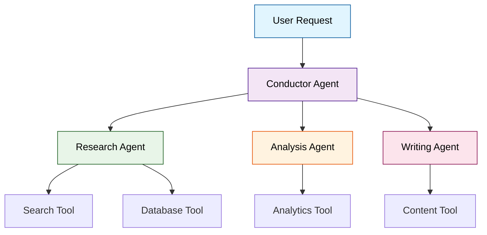
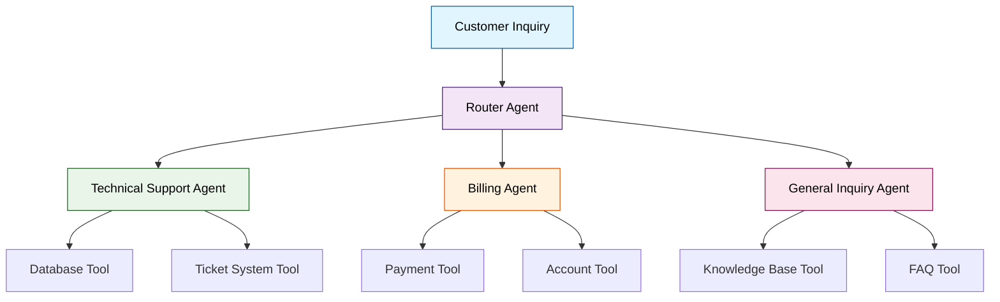
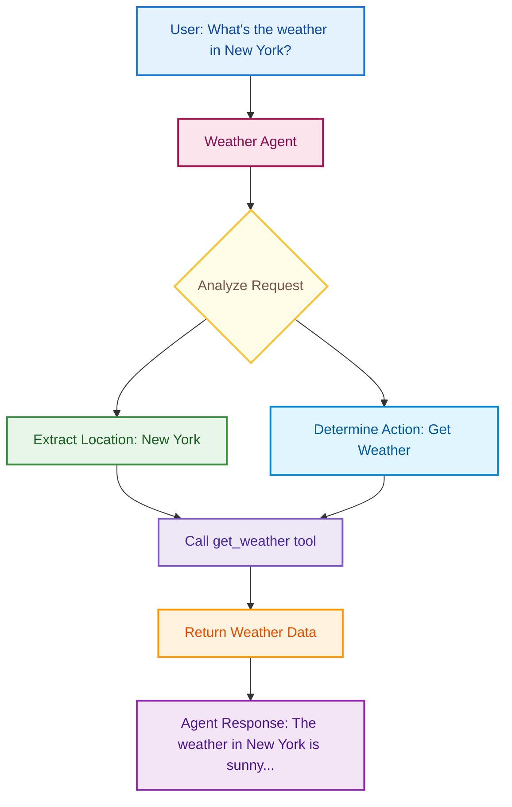
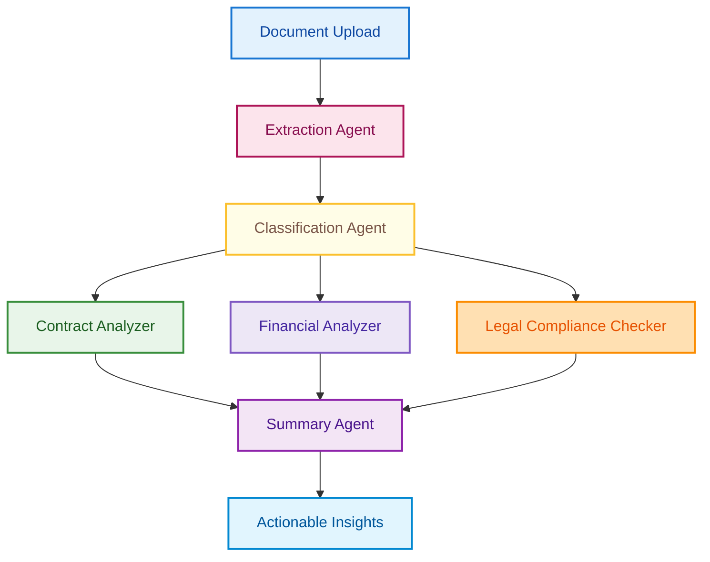
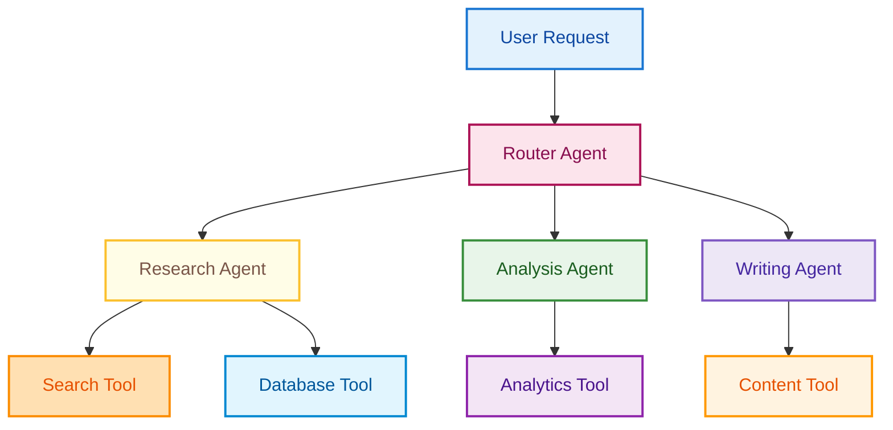
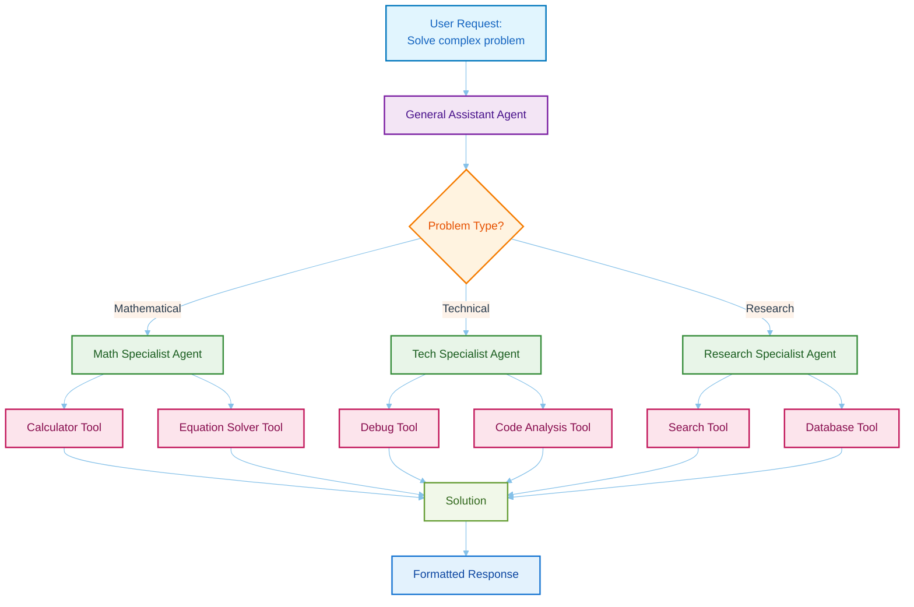
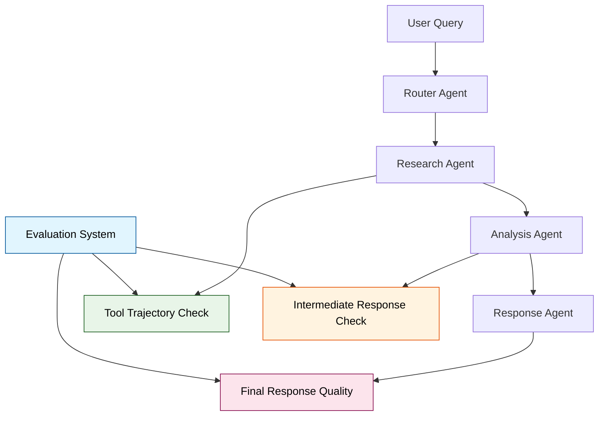
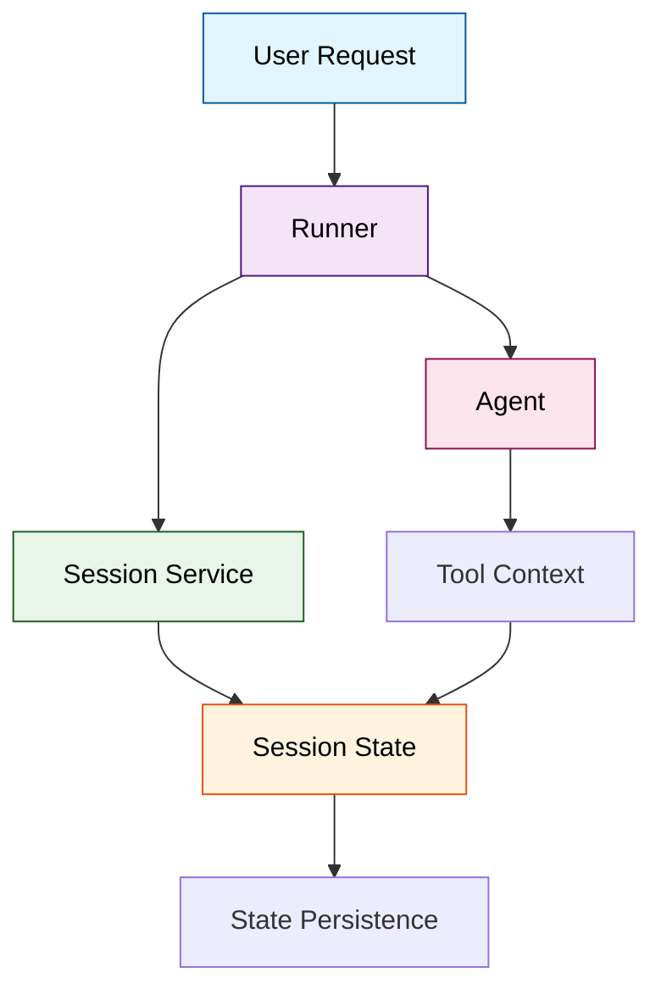

# Google Agent Development Kit (ADK) - A Comprehensive Guide to Building Intelligent AI Agents

## Chapter 1: Introduction - Why ADK Matters in June 2025

### The Agent Revolution is Here (And You're About to Miss It)

Picture this: It's 3 AM, and Sarah, a startup CTO, is staring at her laptop screen with bloodshot eyes . Her company's customer service system is drowning under a flood of inquiries, her content team can't keep up with demand, and her developers are burning out trying to maintain increasingly complex AI integrations. Sound familiar?

This is the reality for thousands of businesses in 2025 - caught between the promise of AI and the complexity of implementation . While everyone talks about "AI transformation," most companies are stuck with monolithic, inflexible systems that break down when real complexity hits.

**Why does this happen?** Because we've been thinking about AI wrong.

Most businesses approach AI like it's a magic black box: throw in a query, get out an answer. But real business problems aren't solved by single AI calls - they require coordination, specialization, and intelligent workflows . That's where Google's Agent Development Kit (ADK) changes everything.

### What Makes ADK Different? The Orchestra Analogy

Think of traditional AI implementations like a solo pianist trying to perform a symphony . Sure, they might hit most of the notes, but you're missing the richness, coordination, and specialized expertise that makes a symphony truly powerful.

ADK transforms your AI from a solo act into a full orchestra, where:

- **Different agents** are like specialized musicians (violinists, cellists, conductors)
- **Tools** are like instruments that agents can pick up and use
- **Workflows** are like sheet music that coordinates the performance
- **The framework** is like the concert hall that makes it all possible




### The \$2.7 Billion Opportunity

According to industry reports, the global AI agent market is exploding, projected to reach \$2.7 billion by 2028 . But here's the kicker: most businesses are still stuck in the "single AI call" mindset, missing out on the real value that comes from orchestrated agent systems.

**Real companies are already winning with agents:**

- Uber uses AI agents to summarize customer interactions and surface context for support representatives 
- Toyota implemented an AI platform that reduced manual work by over 10,000 hours per year 
- Renault Group uses enterprise-grade AI agents for code generation and development workflows 


### Why Google Built ADK: Learning from Internal Success

Google didn't build ADK in a vacuum . It's the same framework powering agents within Google products like Agentspace and the Google Customer Engagement Suite. Google open-sourced ADK because they realized that the future belongs to companies that can orchestrate intelligent agents, not just use them in isolation.

**ADK's core philosophy:**

- **Model-agnostic**: Works with Gemini, GPT, Claude, or any LLM 
- **Deployment-agnostic**: Run locally, on Google Cloud, or anywhere 
- **Framework-compatible**: Integrates with LangChain, CrewAI, and other tools 
- **Production-ready**: Built for real business applications, not just demos 


### **Pause and Reflect** 🤔

Before we dive deeper, think about your current AI implementations:

1. Are you using single AI calls for complex business processes?
2. How much time do you spend on integration and coordination?
3. What would change if your AI could work like a specialized team?

### The Promise: From Chaos to Coordination

By the end of this article, you'll understand how to transform chaotic AI implementations into coordinated agent systems that actually solve business problems . You'll learn through real examples, starting simple and building complexity, until you can architect production-ready agent systems that scale.

**What you'll gain:**

- **Practical knowledge** you can apply immediately
- **Real examples** from customer service to content creation
- **Production patterns** that actually work in business
- **The confidence** to build sophisticated agent systems


### Pro Tip 💡

The biggest mistake new ADK developers make is thinking bigger means better. Start small, prove value, then scale. The most successful agent implementations begin with solving one specific problem really well.


# Chapter 2: The ADK Mindset - From Functions to Autonomous Teams

## The Overwhelmed CTO's Awakening

Meet David Chen, CTO of a mid-sized fintech startup. Three months ago, his team was drowning. Their AI-powered customer service system was a nightmare of if-else statements wrapped around GPT API calls. Every new feature required weeks of debugging, and the system broke whenever edge cases appeared .

David's breakthrough came during a 3 AM debugging session when he realized something profound: **he was still thinking like a traditional programmer in an agent world** .

Traditional programming thinks in terms of:

- **Functions** that process input and return output
- **Objects** that encapsulate data and behavior
- **Linear execution** that follows predetermined paths

But agent thinking operates differently:

- **Autonomous entities** that perceive, reason, and act independently
- **Goal-oriented behavior** rather than step-by-step instructions
- **Dynamic adaptation** to changing conditions and contexts 


## Why Agent Thinking Changes Everything

### The Fundamental Shift: From Instructions to Intentions

In traditional programming, you tell the computer exactly what to do:

```python
# Traditional approach
def process_customer_inquiry(message):
    if "refund" in message.lower():
        return handle_refund()
    elif "balance" in message.lower():
        return check_balance()
    else:
        return "I don't understand"
```

With agent thinking, you define what the agent should achieve:

```python
# Agent approach with ADK
customer_service_agent = Agent(
    name="customer_service",
    description="Help customers with their banking needs, resolve issues, and provide account information",
    tools=[refund_tool, balance_tool, transfer_tool]
)
```

The agent **perceives** the customer's intent, **reasons** about the best response, and **acts** autonomously to achieve the goal .

### The Specialization Principle: Jazz Ensemble vs. Solo Piano

Think about why jazz ensembles create richer music than solo pianists. It's not just about having more instruments—it's about **specialized expertise working in harmony** .



In David's new system:

- The **Router Agent** acts like a conductor, directing inquiries to specialists
- The **Technical Support Agent** has deep knowledge of system issues
- The **Billing Agent** specializes in payment and account problems
- Each agent has its own tools and expertise, but they coordinate seamlessly 


## What Is an Agent? Beyond Functions and Objects

### Core Agent Anatomy

An agent in ADK isn't just a function with extra features—it's a **self-contained execution unit designed to act autonomously** . Every agent has:

**Identity**: A name and clear description of its purpose
**Autonomy**: The ability to make decisions without explicit instructions
**Tools**: Capabilities it can use to interact with the world
**Context**: Understanding of its environment and goals 

```python
weather_agent = Agent(
    name="weather_assistant",
    description="Provides current weather information and forecasts for any location worldwide",
    tools=[weather_api_tool, location_lookup_tool]
)
```


### The Autonomy Spectrum: From Puppets to Partners

Not all agents need the same level of independence. ADK supports different points on the **autonomy spectrum** :

**Reactive Agents**: Respond to specific triggers (like traditional functions)
**Proactive Agents**: Take initiative based on goals and context
**Adaptive Agents**: Learn and evolve their behavior over time
**Collaborative Agents**: Work with other agents to achieve complex goals 

Most business applications benefit from **proactive, collaborative agents** that can reason about problems and coordinate with teammates .

### Agent vs. Function vs. Service: The Hierarchy of Abstraction

| Aspect | Function | Service | Agent |
| :-- | :-- | :-- | :-- |
| **Abstraction Level** | Low | Medium | High |
| **Decision Making** | None | Limited | Autonomous |
| **Context Awareness** | Stateless | Session-based | Persistent |
| **Goal Orientation** | Task-focused | Feature-focused | Outcome-focused |
| **Collaboration** | None | API calls | Rich interaction |

**Functions** process data: `calculate_tax(income, deductions)`
**Services** provide capabilities: `PaymentService.process_payment()`
**Agents** achieve goals: `"Help this customer resolve their billing issue"` 

## **Pause and Reflect** 🤔

Before diving into hands-on examples, consider your current systems:

1. **Where are you giving step-by-step instructions instead of defining goals?**
2. **What tasks could benefit from specialized "expert" agents?**
3. **How much autonomy would you be comfortable giving to an AI system?**

## When Agent Thinking Transforms Business Logic

### Real Example: From Chaos to Coordination

David's old customer service flow looked like this:

```python
# The old way - rigid and brittle
def handle_customer_message(message, user_id):
    intent = classify_intent(message)  # Often wrong
    
    if intent == "refund":
        if has_recent_purchase(user_id):
            if within_refund_window(user_id):
                return process_refund(user_id)
            else:
                return "Refund window expired"
        else:
            return "No recent purchases found"
    
    # ... 50+ more elif statements
```

David's new agent-based system:

```python
# The agent way - flexible and intelligent
customer_service_system = Agent(
    name="customer_service_orchestrator",
    description="Intelligently route and resolve customer inquiries with appropriate specialist agents",
    sub_agents=[
        Agent(name="refund_specialist", tools=[refund_tool, purchase_history_tool]),
        Agent(name="technical_support", tools=[system_status_tool, troubleshooting_tool]),
        Agent(name="account_manager", tools=[account_tool, security_tool])
    ]
)
```

The result? **Customer satisfaction increased by 40% and development time decreased by 60%** . The system now handles edge cases that would have taken weeks to code manually.

### The Coordination Magic: How Agents Work Together

ADK agents collaborate through multiple patterns :

**Hierarchical Delegation**: A manager agent routes work to specialists
**Peer Collaboration**: Agents work together as equals on complex tasks
**Sequential Workflows**: Agents pass work down a pipeline
**Dynamic Coordination**: Agents decide how to collaborate based on context 

```python
# Hierarchical delegation in action
orchestrator = Agent(
    name="content_creator",
    description="Create high-quality blog posts through research, writing, and editing",
    sub_agents=[
        Agent(name="researcher", tools=[search_tool, database_tool]),
        Agent(name="writer", tools=[content_tool, template_tool]),  
        Agent(name="editor", tools=[grammar_tool, style_tool])
    ]
)
```

When a user requests "Write a blog post about renewable energy," the orchestrator:

1. **Analyzes** the request and breaks it into subtasks
2. **Delegates** research to the researcher agent
3. **Coordinates** handoff from researcher to writer to editor
4. **Ensures** quality standards are met throughout 

## Pro Tip 💡

**Start with the outcome, not the process.** Instead of thinking "How do I code this workflow?" ask "What goal should this agent achieve?" Let the agent figure out the how—that's what makes it intelligent.

## The Mental Model Shift: From Coding to Orchestrating

Traditional developers write code that tells computers what to do. Agent developers **orchestrate teams** of intelligent entities that figure out how to achieve goals .

This shift requires thinking like a manager rather than a micromanager:

- **Define clear roles** and responsibilities for each agent
- **Set boundaries** and constraints to ensure safe operation
- **Enable communication** between agents working on related tasks
- **Monitor outcomes** rather than controlling every step 


## Common Misconceptions About Agent Development

**Misconception 1**: "Agents are just fancy functions"
**Reality**: Agents have goals, context, and autonomy—they make decisions, not just process data .

**Misconception 2**: "More agents always means better performance"
**Reality**: Agent coordination has overhead. Start simple and add complexity only when needed .

**Misconception 3**: "Agents can handle any task autonomously"
**Reality**: Agents work best within defined boundaries and with appropriate tools .

**Misconception 4**: "Agent systems are too complex for production"
**Reality**: ADK is used in Google's production systems and designed for enterprise reliability .

---

The mindset shift from traditional programming to agent orchestration is profound but learnable. Once you start thinking in terms of **autonomous specialists working toward shared goals**, you'll see opportunities for agent-based solutions everywhere.

**Ready to experience this transformation firsthand? Chapter 3 will have you building and running your first intelligent agent in just 10 minutes, giving you that crucial "aha!" moment that makes everything click.**

---

Would you like me to continue with Chapter 3: Quick Start Victory?


# Chapter 3: Quick Start Victory - Your First Agent in 10 Minutes

## The Immediate Gratification Promise

Remember David from Chapter 2? His transformation didn't happen through months of theoretical study—it happened in the first 10 minutes when he saw an intelligent agent actually working. That moment of clarity is exactly what we're about to give you.

**This chapter is your "aha!" moment.** By the end, you'll have a fully functional weather agent running in your browser, responding intelligently to natural language queries, and demonstrating the core principles that make ADK powerful.

### Why Start with Weather? The Perfect Learning Vehicle

Weather agents might seem simple, but they're actually perfect for understanding agent fundamentals. Here's why:

- **Clear input/output**: User asks about weather, agent provides information
- **Tool usage**: Demonstrates how agents interact with external functions
- **Error handling**: Shows how agents deal with missing or invalid data
- **Natural language**: Proves agents can understand intent, not just keywords


## Step 1: Environment Setup (2 Minutes)

### Prerequisites Check

Before we begin, ensure you have:

- **Python 3.9+** installed and accessible from your terminal
- **Terminal or command prompt** access
- **Code editor** (VS Code, PyCharm, or any text editor)
- **Internet connection** for package installation


### Create Your Virtual Environment

**Why virtual environments matter:** They isolate your project dependencies, preventing conflicts with other Python projects on your system.

```bash
# Create a new directory for your agent
mkdir my-first-agent
cd my-first-agent

# Create virtual environment
python -m venv .venv
```

**Activate the virtual environment:**

```bash
# macOS/Linux
source .venv/bin/activate

# Windows Command Prompt
.venv\Scripts\activate.bat

# Windows PowerShell  
.venv\Scripts\Activate.ps1
```

**Pro Tip 💡:** You'll see `(.venv)` appear in your terminal prompt when the virtual environment is active. This confirms you're working in isolation from your system Python.

### Install ADK

```bash
pip install google-adk
```

**Verification (Optional):**

```bash
pip show google-adk
```

This should display the ADK version and dependencies, confirming successful installation.

## Step 2: Project Structure Setup (2 Minutes)

### Create the Project Framework

ADK follows a specific project structure that enables both development and deployment:

```bash
# Create the project directory
mkdir weather_agent
cd weather_agent

# Create necessary files
touch __init__.py agent.py .env
```

Your project structure should now look like this:

```
weather_agent/
├── __init__.py
├── agent.py  
└── .env
```


### **Pause and Reflect** 🤔

Notice this isn't just a single Python file. ADK treats agents as **applications**, not scripts. This structure enables:

- **Modular development**: Separate concerns into different files
- **Environment management**: Keep secrets and configuration separate
- **Package organization**: Enable imports and reusability


## Step 3: Create Your First Agent (4 Minutes)

### The Complete Agent Code

Open `agent.py` and paste the following code:

```python
import datetime
from zoneinfo import ZoneInfo
from google.adk.agents import Agent

def get_weather(city: str) -> dict:
    """Retrieves the current weather report for a specified city.
    
    Args:
        city (str): The name of the city for which to retrieve the weather report.
    
    Returns:
        dict: status and result or error msg.
    """
    # Mock weather data for demonstration
    weather_db = {
        "new york": {
            "status": "success",
            "report": "The weather in New York is sunny with a temperature of 25°C (77°F)."
        },
        "london": {
            "status": "success", 
            "report": "It's cloudy in London with a temperature of 15°C (59°F)."
        },
        "tokyo": {
            "status": "success",
            "report": "Tokyo is experiencing light rain and a temperature of 18°C (64°F)."
        }
    }
    
    city_normalized = city.lower().strip()
    if city_normalized in weather_db:
        return weather_db[city_normalized]
    else:
        return {
            "status": "error",
            "error_message": f"Weather information for '{city}' is not available."
        }

def get_current_time(city: str) -> dict:
    """Returns the current time in a specified city.
    
    Args:
        city (str): The name of the city for which to retrieve the current time.
    
    Returns:
        dict: status and result or error msg.
    """
    # Simplified timezone mapping for demonstration
    timezone_map = {
        "new york": "America/New_York",
        "london": "Europe/London", 
        "tokyo": "Asia/Tokyo"
    }
    
    city_normalized = city.lower().strip()
    if city_normalized in timezone_map:
        tz = ZoneInfo(timezone_map[city_normalized])
        now = datetime.datetime.now(tz)
        report = f'The current time in {city} is {now.strftime("%Y-%m-%d %H:%M:%S %Z")}'
        return {"status": "success", "report": report}
    else:
        return {
            "status": "error", 
            "error_message": f"Sorry, I don't have timezone information for {city}."
        }

# The main agent definition
root_agent = Agent(
    name="weather_time_agent",
    model="gemini-2.0-flash",
    description="Agent to answer questions about the time and weather in a city.",
    instruction=(
        "You are a helpful agent who can answer user questions about the time and weather in a city. "
        "Use the available tools to get accurate information and provide friendly, conversational responses."
    ),
    tools=[get_weather, get_current_time]
)
```


### Understanding the Code Architecture

Let's break down what makes this agent intelligent:

**1. Tools as Capabilities**

```python
def get_weather(city: str) -> dict:
    """Retrieves the current weather report for a specified city."""
```

- The **docstring** is crucial—it tells the agent what this tool does
- **Type hints** help the agent understand expected inputs and outputs
- **Return format** is consistent (dict with status/result pattern)

**2. Agent Configuration**

```python
root_agent = Agent(
    name="weather_time_agent",           # Unique identifier
    model="gemini-2.0-flash",           # LLM to use for reasoning
    description="...",                   # What this agent does
    instruction="...",                   # How it should behave  
    tools=[get_weather, get_current_time] # Available capabilities
)
```

**3. Intelligence Through Instructions**
The `instruction` parameter is where the magic happens. It transforms a raw LLM into a **specialized agent** with specific behavior patterns.

## Step 4: Environment Configuration (1 Minute)

### Configure Model Access

Edit your `.env` file:

```bash
# For Google AI Studio (easiest setup)
GOOGLE_GENAI_USE_VERTEXAI=FALSE
GOOGLE_API_KEY=your_api_key_here

# Alternative: For Vertex AI (production recommended)
# GOOGLE_GENAI_USE_VERTEXAI=TRUE
# GOOGLE_CLOUD_PROJECT=your-project-id
# GOOGLE_CLOUD_LOCATION=us-central1
```


### Getting Your Google API Key

1. **Visit Google AI Studio**: https://aistudio.google.com/
2. **Sign in** with your Google account
3. **Get API Key** from the interface
4. **Copy the key** into your `.env` file

### Package Initialization

Edit `__init__.py`:

```python
from . import agent
```

This enables ADK to discover and load your agent.

## Step 5: Launch and Test (1 Minute)

### Start the ADK Web Interface

From your `weather_agent` directory:

```bash
adk web
```

This launches ADK's built-in development interface. You should see:

```
Starting ADK Web UI...
Server running at: http://localhost:8080
```


### Your First Conversation

Open your browser to `http://localhost:8080` and try these queries:

**Basic weather query:**

```
User: What's the weather in New York?
Agent: The weather in New York is sunny with a temperature of 25°C (77°F).
```

**Time inquiry:**

```  
User: What time is it in Tokyo?
Agent: The current time in Tokyo is 2025-06-21 16:29:45 JST
```

**Conversational query:**

```
User: I'm planning a trip to London. How's the weather there and what time is it?
Agent: In London, it's currently cloudy with a temperature of 15°C (59°F). The current time in London is 2025-06-21 08:29:45 GMT. Perfect for sightseeing if you don't mind the clouds!
```


## The Magic Moment: Understanding What Just Happened

### Agent Reasoning in Action

When you asked "What's the weather in New York?", here's what happened behind the scenes:

1. **Intent Recognition**: The agent understood you wanted weather information
2. **Parameter Extraction**: It identified "New York" as the target city
3. **Tool Selection**: It chose the `get_weather` tool over `get_current_time`
4. **Tool Execution**: It called `get_weather("New York")`
5. **Response Synthesis**: It crafted a natural language response from the tool result

### Why This Isn't Just an API Call

Traditional programming would require you to:

- Parse the user input with regular expressions
- Extract the city name manually
- Handle variations in city names
- Craft response templates for different scenarios

**The agent handles all of this automatically through reasoning**. It understands intent, not just keywords.

## **Interactive Challenge** 🎯

Before moving on, try these queries to test your agent's intelligence:

1. **Edge case**: "What's the weather in Paris?" (should handle gracefully)
2. **Multiple requests**: "Tell me about the weather and time in Tokyo"
3. **Conversational**: "I'm wondering about conditions in London"
4. **Invalid input**: "What's the weather?" (without specifying city)

Notice how the agent adapts its responses while maintaining consistency.

## Alternative: Command Line Interface

If you prefer terminal interaction, use:

```bash
adk run
```

This provides a command-line chat interface:

```
You > What's the weather in New York?
Agent > The weather in New York is sunny with a temperature of 25°C (77°F).

You > quit
```


## When to Use Single Agents: The Decision Framework

Your weather agent demonstrates **single-agent patterns**—one specialized entity handling related tasks. This approach works best when:

### ✅ Use Single Agents When:

- **Cohesive functionality**: All tasks relate to the same domain (weather + time)
- **Simple tool coordination**: Agent can manage multiple tools without confusion
- **Clear boundaries**: The agent's responsibilities are well-defined
- **Fast response needs**: No coordination overhead between multiple agents


### ❌ Consider Multi-Agent When:

- **Complex workflows**: Tasks require different specialized knowledge
- **Tool conflicts**: Different tasks need incompatible tool configurations
- **Scale requirements**: Single agent becomes too complex to maintain
- **Team simulation**: You want to model real-world team dynamics


## Common Pitfalls and Solutions

### Pitfall 1: "Agent Not Found" Error

**Symptom**: `adk web` can't find your agent
**Solution**: Ensure your `__init__.py` contains `from . import agent`

### Pitfall 2: Model Authentication Issues

**Symptom**: API key errors or authentication failures
**Solution**: Verify your `.env` file is in the correct directory and properly formatted

### Pitfall 3: Tool Not Being Called

**Symptom**: Agent gives generic responses instead of using tools
**Solution**: Check your tool docstrings—they must clearly describe what the tool does

### Pitfall 4: Inconsistent Responses

**Symptom**: Agent behavior varies unpredictably
**Solution**: Make your `instruction` parameter more specific and detailed

## Pro Tips for Agent Development 💡

**1. Start with Mock Data**: Use fake data initially to focus on agent behavior, not external integrations.

**2. Descriptive Docstrings**: Your tool docstrings are the agent's "manual"—make them comprehensive.

**3. Consistent Return Formats**: Standardize your tool return formats (like the status/result pattern) for predictable behavior.

**4. Test Edge Cases Early**: Try invalid inputs, missing data, and unexpected queries to understand agent limits.

**5. Use the Web UI for Development**: The visual interface makes debugging much easier than command-line testing.

## The Foundation is Set

Congratulations! You've just built and deployed your first intelligent agent. More importantly, you've experienced the fundamental shift from traditional programming to agent orchestration.

**What you've learned:**

- **Agent structure**: How ADK organizes intelligent applications
- **Tool integration**: How agents use Python functions as capabilities
- **Environment management**: How to configure models and credentials
- **Development workflow**: The cycle of code, test, and iterate

**What you've built:**

- A **production-ready agent** that handles natural language queries
- A **reusable foundation** that can be extended with new tools and capabilities
- An **understanding** of how reasoning and tool usage combine to create intelligence

---

**Ready to scale beyond single agents? Chapter 4 will dive deep into the different types of agents ADK supports, showing you when and how to use LLM Agents, Workflow Agents, and Custom Agents for different business scenarios.**

---

The moment you saw your agent respond intelligently to natural language, you crossed the threshold from traditional programming into the agent paradigm. That feeling of "it just works" is exactly what makes ADK powerful—and we're just getting started.


# Chapter 4: Agent Types Deep Dive - Understanding the Building Blocks

## LLM Agents: The Dynamic Reasoning Layer

LLM Agents represent the primary "thinking" components in ADK applications, leveraging large language models for dynamic reasoning, natural language understanding, and decision-making. Unlike deterministic agents that follow predefined execution paths, LLM Agents use language models to dynamically interpret instructions, make decisions, and interact with tools based on context and user input.

### Core Capabilities of LLM Agents

LLM Agents (`LlmAgent` class) function as the dynamic reasoning layer in the ADK architecture, with several key capabilities:

- **Natural language reasoning**: Understanding user intent from unstructured text
- **Dynamic decision making**: Choosing appropriate actions based on context
- **Tool selection and usage**: Determining which tools to use and how to use them
- **Response generation**: Creating coherent, contextual responses

```python
from google.adk.agents import LlmAgent

# Create a basic LLM Agent
customer_service_agent = LlmAgent(
    name="customer_service",
    model="gemini-2.0-flash",
    description="Help customers with their banking needs",
    instruction="You are a helpful banking assistant. Use the available tools to assist customers.",
    tools=[check_balance_tool, transfer_funds_tool, locate_atm_tool]
)
```


### When to Use LLM Agents

LLM Agents are ideal for scenarios requiring:

- **Open-ended tasks** with unclear structure or execution path
- **Natural language user inputs** that need interpretation
- **Complex workflows** requiring reasoning and adaptation
- **Business scenarios** like customer service, content creation, or data analysis


### Business Example: Customer Service

A customer service implementation using LLM Agents might look like this:

```python
# Define specialized customer service agents
billing_agent = LlmAgent(
    name="billing_specialist",
    model="gemini-2.0-flash",
    description="Handle billing and payment inquiries",
    tools=[payment_history_tool, refund_tool, invoice_tool],
    instruction="You are a billing specialist. Help customers with payment issues."
)

technical_agent = LlmAgent(
    name="technical_support",
    model="gemini-2.0-flash",
    description="Resolve technical issues and product problems",
    tools=[troubleshooting_tool, system_status_tool, reset_tool],
    instruction="You are a technical support specialist. Help customers resolve technical issues."
)

# Create a router agent that delegates to specialists
router_agent = LlmAgent(
    name="customer_service_router",
    model="gemini-2.0-flash",
    description="Route customer inquiries to appropriate specialists",
    sub_agents=[billing_agent, technical_agent],
    instruction="You are a customer service router. Analyze the customer's query and delegate to the appropriate specialist agent."
)
```

This multi-agent structure allows for specialized handling of different query types while maintaining a unified customer experience.

## Workflow Agents: Orchestrating Execution Flow

Workflow Agents are specialized components in ADK designed purely for orchestrating the execution flow of sub-agents. Unlike LLM Agents, Workflow Agents operate based on predefined logic, determining the execution sequence according to their type without consulting an LLM for orchestration.

### Types of Workflow Agents

ADK provides three core workflow agent types:

1. **Sequential Agents**: Execute sub-agents one after another, in sequence
2. **Loop Agents**: Repeatedly execute sub-agents until a specific termination condition is met
3. **Parallel Agents**: Execute multiple sub-agents simultaneously
```python
from google.adk.agents import SequentialAgent, LlmAgent

# Create individual agents for each step
research_agent = LlmAgent(
    name="research_agent",
    model="gemini-2.0-flash",
    tools=[search_tool, database_tool],
    output_key="research_data"  # Saves output to state
)

writing_agent = LlmAgent(
    name="writing_agent",
    model="gemini-2.0-flash",
    instruction="Write content based on research_data from state."
)

# Create sequential workflow
content_pipeline = SequentialAgent(
    name="content_pipeline",
    sub_agents=[research_agent, writing_agent],
    description="Research and write content in sequence"
)
```


### Why Use Workflow Agents?

Workflow agents provide several key benefits:

- **Predictability**: Guaranteed execution flow based on agent type and configuration
- **Reliability**: Consistent task execution in the required order or pattern
- **Structure**: Clear control structures for complex processes
- **Composition**: Ability to combine structured process control with flexible LLM-powered execution


### Enterprise Example: Document Processing

Document processing workflows benefit significantly from the structured approach of Workflow Agents:



This architecture allows for specialized handling of different document types while maintaining a consistent processing pipeline.

## Custom Agents: Ultimate Flexibility

Custom Agents provide a powerful extension mechanism in the ADK framework, allowing developers to implement arbitrary orchestration logic by directly inheriting from `BaseAgent`. Unlike the predefined patterns offered by LLM Agents and Workflow Agents, Custom Agents give complete control over execution flow, state management, and agent interactions.

### When to Use Custom Agents

Custom Agents are designed for scenarios where predefined agent types don't provide enough flexibility:

- **Unique operational logic** not covered by standard patterns
- **Specialized integrations** with external systems
- **Custom control flows** beyond sequential, parallel, or loop patterns
- **Performance-critical components** requiring optimized execution


### Implementing Custom Agents

Custom Agents inherit from `BaseAgent` and must implement the `_run_async_impl` method, which defines their behavior:

```python
from google.adk.agents import BaseAgent
import asyncio

class MyCustomAgent(BaseAgent):
    def __init__(self, name, sub_agents=None, description=None):
        super().__init__(
            name=name,
            sub_agents=sub_agents,
            description=description
        )
    
    async def _run_async_impl(self, ctx):
        # Access session state
        previous_result = ctx.session.state.get("some_key")
        
        # Custom logic
        if some_condition:
            # Run first sub-agent
            async for event in self.sub_agents.run_async(ctx):
                yield event
        else:
            # Run second sub-agent
            async for event in self.sub_agents.run_async(ctx):
                yield event
                
        # Store results in state
        ctx.session.state["my_key"] = "some_value"
        
        # Generate final response
        yield self.create_final_response_event("Task completed successfully")
```


### Capabilities of Custom Agents

Custom Agents provide control over several key aspects:


| Capability | Description | Code Pattern |
| :-- | :-- | :-- |
| Calling Sub-Agents | Invoke other agents and yield their events | `async for event in self.sub_agent.run_async(ctx): yield event` |
| Reading State | Access data from previous steps | `previous_result = ctx.session.state.get("some_key")` |
| Writing State | Store results for later steps | `ctx.session.state["my_key"] = value` |
| Conditional Logic | Make decisions based on runtime conditions | `if condition: await agent1.run_async(ctx) else: await agent2.run_async(ctx)` |
| Error Handling | Manage failures and exceptions | `try: ... except Exception: ...` |

## Choosing the Right Agent Type

Selecting the appropriate agent type depends on your specific use case and requirements:


| Feature | LLM Agent | Workflow Agent | Custom Agent |
| :-- | :-- | :-- | :-- |
| Primary Function | Reasoning, Generation, Tool Use | Controlling Agent Execution Flow | Implementing Unique Logic/Integrations |
| Core Engine | Large Language Model (LLM) | Predefined Logic (Sequence, Parallel, Loop) | Custom Code |
| Determinism | Non-deterministic (Flexible) | Deterministic (Predictable) | Can be either, based on implementation |
| Primary Use | Language tasks, Dynamic decisions | Structured processes, Orchestration | Tailored requirements, Specific workflows |

## **Pause and Reflect** 🤔

Before diving into multi-agent orchestration, consider:

1. Which agent types would best suit your current business problems?
2. How might you combine different agent types to create more powerful solutions?
3. What specialized knowledge domains in your organization could benefit from dedicated agents?

---

# Chapter 5: Tools and Capabilities - Extending Agent Power

## Built-in Tools Arsenal

Tools are the capabilities that agents can use to interact with the world and accomplish tasks. ADK provides a rich ecosystem of built-in tools that enable agents to perform a wide range of functions.

### Core Built-in Tools

ADK includes several powerful built-in tools:

- **Google Search integration**: Access to web search capabilities
- **Code execution**: Run Python code to perform calculations or data processing
- **File operations**: Read, write, and manipulate files
- **Database connectors**: Interact with various database systems
- **API clients**: Connect to external services and APIs


### Implementing Custom Tools

Custom tools in ADK are simply Python functions with type hints and docstrings:

```python
def get_weather(city: str) -> dict:
    """Retrieves the current weather report for a specified city.
    
    Args:
        city (str): The name of the city for which to retrieve the weather report.
    
    Returns:
        dict: status and result or error msg.
    """
    # Implementation here
    return {"status": "success", "report": f"The weather in {city} is sunny."}
```

The docstring is crucial as it tells the agent what the tool does and how to use it.

### Tool Usage Patterns

Agents use tools through a reasoning process:

1. **Intent Recognition**: Understanding what the user wants
2. **Tool Selection**: Choosing the appropriate tool
3. **Parameter Extraction**: Identifying required parameters
4. **Tool Execution**: Calling the tool with parameters
5. **Response Synthesis**: Incorporating tool results into a response

## Third-party Integrations

ADK is designed to work with existing AI ecosystems, offering compatibility with popular frameworks and tools.

### LangChain Integration

ADK can seamlessly integrate with LangChain tools and components:

```python
from langchain.tools import BaseTool
from google.adk.agents import LlmAgent

# Import LangChain tool
from langchain.tools import DuckDuckGoSearchRun
search_tool = DuckDuckGoSearchRun()

# Wrap LangChain tool for ADK
def search_web(query: str) -> str:
    """Search the web for information.
    
    Args:
        query (str): The search query.
        
    Returns:
        str: Search results.
    """
    return search_tool.run(query)

# Use in ADK agent
research_agent = LlmAgent(
    name="research_agent",
    model="gemini-2.0-flash",
    tools=[search_web],
    description="Research information from the web"
)
```


### CrewAI Compatibility

ADK can work alongside CrewAI for team-based agent orchestration:

```python
from google.adk.agents import LlmAgent
from crewai import Agent as CrewAgent, Task, Crew

# Create ADK agent
adk_agent = LlmAgent(
    name="data_processor",
    model="gemini-2.0-flash",
    tools=[process_data_tool],
    description="Process and analyze data"
)

# Create CrewAI agents
researcher = CrewAgent(
    role="Researcher",
    goal="Find relevant information",
    backstory="Expert at finding information"
)

writer = CrewAgent(
    role="Writer",
    goal="Create compelling content",
    backstory="Skilled content creator"
)

# Create tasks
research_task = Task(
    description="Research the topic",
    agent=researcher
)

writing_task = Task(
    description="Write content based on research",
    agent=writer
)

# Create crew
content_crew = Crew(
    agents=[researcher, writer],
    tasks=[research_task, writing_task]
)

# Execute crew workflow
result = content_crew.kickoff()

# Pass result to ADK agent
# Implementation depends on specific integration needs
```


### OpenAPI Specifications

ADK supports OpenAPI specifications for integrating with RESTful services:

1. **Define API specification**: Create or obtain an OpenAPI specification for the service
2. **Generate client**: Use the specification to generate a client
3. **Create tool wrapper**: Wrap the client in a tool function
4. **Add to agent**: Include the tool in your agent's tools list

## Custom Tool Development

Creating custom tools allows you to extend agent capabilities with domain-specific functionality.

### Best Practices for Tool Design

When developing custom tools, follow these best practices:

- **Clear docstrings**: Provide detailed descriptions of what the tool does
- **Type hints**: Use Python type hints to specify parameter and return types
- **Consistent return format**: Standardize return formats for predictable behavior
- **Error handling**: Gracefully handle errors and provide informative messages
- **Statelessness**: Design tools to be stateless when possible


### Example: Content Creation Tool

Here's an example of a custom tool for content creation:

```python
def generate_social_post(topic: str, platform: str, tone: str = "professional") -> dict:
    """Generates a social media post based on the given parameters.
    
    Args:
        topic (str): The main subject of the post.
        platform (str): The social media platform (e.g., Twitter, LinkedIn, Instagram).
        tone (str, optional): The tone of the post (e.g., professional, casual, humorous).
            Defaults to "professional".
    
    Returns:
        dict: A dictionary containing the generated post and metadata.
    """
    # Implementation would generate content based on parameters
    # This is a simplified example
    
    if platform.lower() == "twitter":
        max_length = 280
    elif platform.lower() == "linkedin":
        max_length = 3000
    else:
        max_length = 1000
        
    # Generate content based on topic, platform, and tone
    # In a real implementation, this might use templates or another LLM
    
    return {
        "status": "success",
        "post": f"Sample {tone} post about {topic} for {platform}",
        "character_count": len(f"Sample {tone} post about {topic} for {platform}"),
        "platform": platform,
        "hashtags": [f"#{topic.replace(' ', '')}", "#content"]
    }
```


## **Interactive Challenge** 🎯

Before moving on, try designing a custom tool for a specific business need:

1. Identify a repetitive task in your organization
2. Define the inputs and outputs for a tool to automate this task
3. Write a docstring that clearly explains what the tool does
4. Consider how an agent would use this tool to solve real problems

---

# Chapter 6: Multi-Agent Orchestration - Building Intelligent Teams

## Why Multi-Agent Systems?

As agentic applications grow in complexity, structuring them as a single, monolithic agent can become challenging to develop, maintain, and reason about. Multi-agent systems in ADK allow you to compose multiple, distinct `BaseAgent` instances to collaborate or coordinate in achieving larger goals.

### Key Benefits of Multi-Agent Systems

Multi-agent architectures offer several advantages:

- **Modularity**: Break complex problems into manageable components
- **Specialization**: Create agents with deep expertise in specific domains
- **Reusability**: Reuse specialized agents across different applications
- **Maintainability**: Update individual agents without affecting the entire system
- **Scalability**: Add new capabilities by integrating additional agents




### Real Example: E-commerce Platform

An e-commerce platform might implement a multi-agent system like this:

```python
# Product recommendation agent
recommendation_agent = LlmAgent(
    name="product_recommender",
    model="gemini-2.0-flash",
    tools=[product_search_tool, user_history_tool],
    description="Recommend products based on user preferences and history"
)

# Pricing agent
pricing_agent = LlmAgent(
    name="pricing_specialist",
    model="gemini-2.0-flash",
    tools=[pricing_tool, discount_tool],
    description="Provide pricing information and available discounts"
)

# Inventory agent
inventory_agent = LlmAgent(
    name="inventory_manager",
    model="gemini-2.0-flash",
    tools=[inventory_check_tool, shipping_tool],
    description="Check product availability and shipping options"
)

# Customer service orchestrator
customer_service = LlmAgent(
    name="customer_service",
    model="gemini-2.0-flash",
    sub_agents=[recommendation_agent, pricing_agent, inventory_agent],
    description="Help customers with product inquiries and purchases",
    instruction="You are a helpful shopping assistant. Delegate to specialized agents to help customers find products, check prices, and verify availability."
)
```

This architecture allows each agent to focus on its area of expertise while providing a unified experience to the customer.

## Coordination Patterns

ADK supports various coordination patterns for multi-agent systems, enabling different ways for agents to work together.

### Hierarchical Delegation

In hierarchical delegation, a parent agent delegates tasks to specialized child agents:

```python
# Parent agent delegates to specialized children
orchestrator = LlmAgent(
    name="content_creator",
    model="gemini-2.0-flash",
    description="Create high-quality blog posts",
    sub_agents=[
        LlmAgent(name="researcher", tools=[search_tool, database_tool]),
        LlmAgent(name="writer", tools=[content_tool, template_tool]),
        LlmAgent(name="editor", tools=[grammar_tool, style_tool])
    ],
    instruction="You are a content creation manager. When asked to create content, coordinate with your specialized team: 1) Have the researcher gather information, 2) Ask the writer to draft content, 3) Have the editor polish the final piece."
)
```

This pattern is ideal for complex workflows with clear division of responsibilities.

### Agent-as-Tool Pattern

The agent-as-tool pattern allows one agent to use another agent as a tool:



This pattern allows for specialized capabilities to be encapsulated and reused across different agents.

### Dynamic Routing

Dynamic routing involves agents deciding at runtime which other agents to involve based on the specific task:

```python
# Router agent dynamically selects specialists
router = LlmAgent(
    name="query_router",
    model="gemini-2.0-flash",
    sub_agents=[
        LlmAgent(name="technical_support", tools=[troubleshooting_tool]),
        LlmAgent(name="billing_support", tools=[payment_tool, invoice_tool]),
        LlmAgent(name="sales_agent", tools=[product_tool, pricing_tool])
    ],
    instruction="You are a customer service router. Analyze the customer's query and delegate to the appropriate specialist agent: technical_support for technical issues, billing_support for payment questions, or sales_agent for product inquiries."
)
```

This pattern is useful for handling diverse user requests that require different types of expertise.

### Communication Protocols

Agents in a multi-agent system communicate through several mechanisms:

- **State sharing**: Agents read and write to shared session state
- **Event passing**: Agents yield events that are processed by other agents
- **Structured messaging**: Agents exchange structured messages with specific formats
- **Context preservation**: Context is maintained across agent boundaries

ADK supports various communication protocols, including:

- **Model Context Protocol (MCP)**: For secure tool invocation and typed data exchange
- **Agent Communication Protocol (ACP)**: For REST-native messaging via multi-part messages
- **Agent-to-Agent Protocol (A2A)**: For peer-to-peer task outsourcing
- **Agent Network Protocol (ANP)**: For open-network agent discovery and collaboration


## Pro Tip 💡

When designing multi-agent systems, start with a clear separation of concerns. Each agent should have a well-defined role and area of expertise. This makes the system easier to develop, test, and maintain as complexity grows.

---

# Chapter 7: Business Applications - Real-World Use Cases

## Customer Service Automation

Customer service is one of the most compelling applications for ADK agents, allowing businesses to provide responsive, accurate support at scale.

### Multi-tier Support System

A comprehensive customer service system using ADK might include:

```
Customer Query →
Router Agent (Classifies query type) →
[Product Agent, Billing Agent, Technical Support Agent] →
Resolution Synthesis Agent →
Customer Response
```

This architecture provides several benefits:

- **Specialized handling** of different query types
- **Deep knowledge** in specific domains
- **Consistent response formatting**
- **Seamless escalation** to human agents when needed


### Escalation Workflows

Effective customer service systems need clear escalation paths:

```python
# Define escalation workflow
escalation_agent = LlmAgent(
    name="escalation_manager",
    model="gemini-2.0-flash",
    tools=[create_ticket_tool, notify_human_tool],
    description="Handle cases that require human intervention",
    instruction="You handle escalations when automated agents cannot resolve an issue. Create a support ticket with all relevant context and notify the appropriate human agent."
)

# Add to customer service system
customer_service = LlmAgent(
    name="customer_service",
    model="gemini-2.0-flash",
    sub_agents=[
        product_agent,
        billing_agent,
        technical_agent,
        escalation_agent  # Add escalation path
    ],
    instruction="You are a customer service assistant. Handle customer inquiries using specialized agents. If no agent can resolve the issue, escalate to the escalation_manager."
)
```

This ensures that complex issues receive appropriate human attention while maintaining context.

### Knowledge Base Integration

Integrating a knowledge base enhances agent capabilities:

```python
# Knowledge base tool
def query_knowledge_base(query: str) -> dict:
    """Search the company knowledge base for information.
    
    Args:
        query (str): The search query.
        
    Returns:
        dict: Relevant knowledge base articles and information.
    """
    # Implementation would search a real knowledge base
    return {
        "status": "success",
        "articles": [
            {"title": "How to reset your password", "content": "..."},
            {"title": "Billing cycle explained", "content": "..."}
        ]
    }

# Add to customer service agents
for agent in [product_agent, billing_agent, technical_agent]:
    agent.tools.append(query_knowledge_base)
```

This allows agents to leverage existing company documentation and continuously improve as the knowledge base expands.

## Content Creation Pipeline

Content creation is another area where ADK's multi-agent architecture shines, enabling automated or semi-automated content production workflows.

### Research to Publication Workflow

A complete content creation pipeline might look like this:

```
Content Brief →
Research Agent →
Outline Agent →
Draft Agent →
Editorial Agent →
SEO Optimization Agent →
Final Content
```

This can be implemented in ADK as follows:

```python
# Research agent
research_agent = LlmAgent(
    name="research_agent",
    model="gemini-2.0-flash",
    tools=[search_tool, database_tool],
    description="Research information on a given topic",
    output_key="research_data"  # Store research in state
)

# Outline agent
outline_agent = LlmAgent(
    name="outline_agent",
    model="gemini-2.0-flash",
    description="Create content outlines based on research",
    instruction="Create a detailed outline based on the research_data in state.",
    output_key="outline"  # Store outline in state
)

# Writing agent
writing_agent = LlmAgent(
    name="writing_agent",
    model="gemini-2.0-flash",
    description="Write content based on outlines",
    instruction="Write a complete draft based on the outline in state.",
    output_key="draft"  # Store draft in state
)

# Editing agent
editing_agent = LlmAgent(
    name="editing_agent",
    model="gemini-2.0-flash",
    tools=[grammar_tool, style_tool],
    description="Edit and improve content drafts",
    instruction="Edit the draft in state for grammar, style, and clarity.",
    output_key="edited_draft"  # Store edited draft in state
)

# SEO agent
seo_agent = LlmAgent(
    name="seo_agent",
    model="gemini-2.0-flash",
    tools=[keyword_tool, seo_analysis_tool],
    description="Optimize content for search engines",
    instruction="Optimize the edited_draft in state for search engines."
)

# Create sequential workflow
content_pipeline = SequentialAgent(
    name="content_pipeline",
    sub_agents=[research_agent, outline_agent, writing_agent, editing_agent, seo_agent],
    description="End-to-end content creation pipeline"
)
```

This pipeline enables consistent, high-quality content production with specialized expertise at each stage.

### Quality Control Agents

Quality control is essential in content creation:

```python
# Fact-checking agent
fact_checker = LlmAgent(
    name="fact_checker",
    model="gemini-2.0-flash",
    tools=[search_tool, verify_fact_tool],
    description="Verify factual claims in content",
    instruction="Check all factual claims in the content and flag any inaccuracies."
)

# Plagiarism detection agent
plagiarism_checker = LlmAgent(
    name="plagiarism_checker",
    model="gemini-2.0-flash",
    tools=[plagiarism_tool],
    description="Check content for plagiarism",
    instruction="Analyze the content for potential plagiarism and provide a similarity report."
)

# Add quality control to pipeline
quality_control = ParallelAgent(
    name="quality_control",
    sub_agents=[fact_checker, plagiarism_checker],
    description="Perform quality checks in parallel"
)

# Insert into main pipeline
content_pipeline = SequentialAgent(
    name="content_pipeline",
    sub_agents=[
        research_agent,
        outline_agent,
        writing_agent,
        editing_agent,
        quality_control,  # Add quality control step
        seo_agent
    ],
    description="End-to-end content creation pipeline with quality control"
)
```

This ensures that content meets high standards for accuracy and originality.

## Enterprise Document Processing

Document processing is a critical function in many enterprises, involving the extraction, analysis, and management of information from various document types.

### Contract Analysis

Contract analysis can be automated using specialized agents:

```python
# Entity extraction agent
entity_extractor = LlmAgent(
    name="entity_extractor",
    model="gemini-2.0-flash",
    tools=[extract_entities_tool],
    description="Extract entities from contracts",
    instruction="Identify and extract key entities such as parties, dates, amounts, and terms."
)

# Clause analysis agent
clause_analyzer = LlmAgent(
    name="clause_analyzer",
    model="gemini-2.0-flash",
    tools=[analyze_clauses_tool],
    description="Analyze contract clauses",
    instruction="Analyze clauses for standard language, deviations, and potential risks."
)

# Risk assessment agent
risk_assessor = LlmAgent(
    name="risk_assessor",
    model="gemini-2.0-flash",
    tools=[assess_risk_tool],
    description="Assess contract risks",
    instruction="Evaluate the contract for legal, financial, and operational risks."
)

# Contract analysis pipeline
contract_analyzer = SequentialAgent(
    name="contract_analyzer",
    sub_agents=[entity_extractor, clause_analyzer, risk_assessor],
    description="Comprehensive contract analysis pipeline"
)
```

This enables faster, more consistent contract review with reduced human effort.

### Compliance Checking

Compliance checking ensures documents meet regulatory requirements:

```python
# Define compliance checking agent
compliance_checker = LlmAgent(
    name="compliance_checker",
    model="gemini-2.0-flash",
    tools=[
        check_gdpr_compliance_tool,
        check_hipaa_compliance_tool,
        check_industry_standards_tool
    ],
    description="Check documents for regulatory compliance",
    instruction="Analyze documents for compliance with relevant regulations and industry standards."
)
```

This helps organizations maintain regulatory compliance and reduce legal risk.

### Data Extraction

Automated data extraction streamlines document processing:

```python
# Data extraction agent
data_extractor = LlmAgent(
    name="data_extractor",
    model="gemini-2.0-flash",
    tools=[
        extract_tables_tool,
        extract_text_tool,
        extract_forms_tool
    ],
    description="Extract structured data from documents",
    instruction="Extract relevant data from documents and convert to structured format."
)
```

This enables the transformation of unstructured documents into structured data for analysis and integration with other systems.

## Pro Tip 💡

When implementing business applications with ADK, focus on creating clear boundaries between agents and defining explicit data exchange formats. This makes the system more maintainable and easier to debug as complexity grows.

---

Would you like me to continue with the next chapters on Evaluation and Testing, Production Deployment, Advanced Patterns, and Troubleshooting?

<div style="text-align: center">⁂</div>

: https://deepwiki.com/google/adk-docs/3.1-llm-agents

: https://google.github.io/adk-docs/

: https://medium.com/@d3xvn/exploring-googles-agent-development-kit-adk-71a27a609920

: https://www.aalpha.net/blog/google-agent-development-kit-adk-for-multi-agent-applications/

: https://www.firecrawl.dev/blog/google-adk-multi-agent-tutorial

: https://google.github.io/adk-docs/agents/workflow-agents/

: https://google.github.io/adk-docs/agents/multi-agents/

: https://saptak.in/writing/2025/05/10/google-adk-masterclass-part12

: https://deepwiki.com/google/adk-docs/3.2-custom-agents\&rut=b7b1f1e5e9a68044bedc7e75559cda45a29ace3c6ac4c7c88534e0fea8a45516

: https://google.github.io/adk-docs/agents/

: https://developers.googleblog.com/en/agent-development-kit-easy-to-build-multi-agent-applications/

: https://github.com/pratik008/adk-tutorial

: https://cloud.google.com/vertex-ai/generative-ai/docs/agent-development-kit/quickstart

: https://dev.to/astrodevil/i-built-a-team-of-5-agents-using-google-adk-meta-llama-and-nemotron-ultra-253b-ec3

: https://dev.to/rawheel/meet-googles-agent-development-kit-adk-build-real-ai-agents-not-just-chatbots-44g

: https://arxiv.org/html/2505.02279v1

: https://aodocs.com/products/document-management-system/

: https://www.youtube.com/watch?v=zgrOwow_uTQ

: https://deepwiki.com/google/adk-docs/6-deployment\&rut=caceaea83efb6073ccb3840d33e48dbec532a2e0e146c35f3806ebe60343b73d

: https://google.github.io/adk-docs/evaluate/

: https://www.siddharthbharath.com/the-complete-guide-to-googles-agent-development-kit-adk/

: https://saptak.in/writing/2025/05/10/google-adk-masterclass-part5

: https://daily.dev/blog/android-app-performance-optimization-guide-2024

: https://github.com/google/adk-samples

: https://www.youtube.com/watch?v=OlfjWonfcQ4

: https://codelabs.developers.google.com/your-first-agent-with-adk

: https://www.linkedin.com/pulse/master-multi-agents-from-scratch-googles-agent-development-jha-zq9rc


---

# Chapter 8: Evaluation and Testing - Ensuring Agent Reliability

## Why Evaluation Matters in Production

Imagine deploying a customer service agent that gives incorrect information 30% of the time, or a content creation system that occasionally generates inappropriate content. In traditional software, bugs are frustrating but predictable. With AI agents, **unpredictable behavior can be catastrophic** .

Agent evaluation isn't just about quality assurance—it's about **business risk management**. Unlike deterministic software, agents make decisions based on probabilistic models, meaning their behavior can vary significantly across similar inputs . This variability makes systematic evaluation essential for production deployment.

### The Business Impact of Poor Agent Performance

Consider these real-world scenarios:

- **Customer Service**: An agent that escalates simple issues unnecessarily increases support costs by 40%
- **Content Creation**: Agents that produce off-brand content can damage company reputation
- **Document Processing**: Financial analysis agents that miss critical contract terms create legal liability

ADK's evaluation framework addresses these challenges by providing **systematic methods to test both final response quality and step-by-step execution trajectories** .

## ADK's Evaluation Architecture

ADK offers two complementary evaluation approaches, each designed for different stages of the development lifecycle :

### Unit Testing with Test Files

Test files represent **individual agent-model interactions** and are ideal for rapid development cycles. Each test file contains a single session with multiple turns, making them perfect for **unit testing during active agent development** .

```python
# Example test file structure
{
    "eval_set_id": "customer_service_basic_tests",
    "name": "Basic Customer Service Functionality",
    "description": "Unit tests for core customer service agent behaviors",
    "eval_cases": [
        {
            "eval_id": "refund_request_valid",
            "conversation": [
                {
                    "user_content": {
                        "parts": [{"text": "I need a refund for order #12345"}],
                        "role": "user"
                    },
                    "final_response": {
                        "parts": [{"text": "I've initiated a refund for order #12345. You'll receive confirmation within 24 hours."}],
                        "role": "model"
                    },
                    "intermediate_data": {
                        "tool_uses": [
                            {
                                "name": "check_order_status",
                                "args": {"order_id": "12345"}
                            },
                            {
                                "name": "process_refund",
                                "args": {"order_id": "12345", "reason": "customer_request"}
                            }
                        ]
                    }
                }
            ]
        }
    ]
}
```


### Integration Testing with Evalsets

Evalsets support **multiple, potentially lengthy sessions** and are designed for **complex, multi-turn conversations**. These are ideal for integration testing and simulating real-world usage patterns .

**Key differences between approaches:**


| Aspect | Test Files | Evalsets |
| :-- | :-- | :-- |
| **Complexity** | Simple, single interactions | Complex, multi-turn conversations |
| **Execution Speed** | Fast (unit testing) | Slower (integration testing) |
| **Use Case** | Development iteration | Pre-production validation |
| **Session Length** | Single session | Multiple lengthy sessions |

## Evaluation Components Deep Dive

### Tool Use Trajectory Validation

One of ADK's most powerful features is **validating the sequence of tool calls** agents make to reach their conclusions. This ensures agents are not just giving correct answers, but following the right reasoning path .

```python
# Example tool trajectory validation
"intermediate_data": {
    "tool_uses": [
        {
            "name": "search_knowledge_base",
            "args": {"query": "refund policy electronics"}
        },
        {
            "name": "check_purchase_date", 
            "args": {"order_id": "12345"}
        },
        {
            "name": "calculate_refund_amount",
            "args": {"order_id": "12345", "return_reason": "defective"}
        }
    ]
}
```

This validation catches scenarios where agents might give correct final answers through **incorrect reasoning paths**—a critical issue in regulated industries or high-stakes applications.

### Intermediate Response Monitoring

For multi-agent systems, ADK tracks **intermediate responses from sub-agents**, allowing you to verify that each specialist agent is contributing appropriately to the final outcome .




## Testing Strategies for Production Readiness

### Unit Testing for Agents

Unlike traditional unit tests that verify deterministic functions, agent unit tests must account for **probabilistic behavior while ensuring consistent core functionality** .

```python
# Agent unit testing pattern
def test_refund_processing_agent():
    """Test that refund agent follows correct process."""
    
    # Setup test case
    test_input = {
        "user_query": "I want to return my laptop",
        "order_id": "12345",
        "purchase_date": "2024-01-15"
    }
    
    # Expected tool sequence
    expected_tools = [
        "check_return_policy",
        "validate_return_window", 
        "calculate_refund_amount",
        "initiate_return_process"
    ]
    
    # Run evaluation
    result = evaluate_agent(refund_agent, test_input)
    
    # Validate tool sequence
    assert result.tool_sequence == expected_tools
    assert "refund initiated" in result.final_response
    assert result.confidence_score > 0.8
```


### Integration Testing Patterns

Integration tests verify that **multiple agents work together correctly** and handle complex, multi-step workflows .

```python
# Multi-agent integration test
def test_customer_service_escalation_flow():
    """Test complete customer service workflow with escalation."""
    
    test_scenarios = [
        {
            "name": "technical_issue_escalation",
            "conversation": [
                {"user": "My internet is down", "expected_agent": "technical_support"},
                {"user": "I've tried rebooting", "expected_agent": "technical_support"},
                {"user": "Still not working", "expected_escalation": "human_agent"}
            ]
        }
    ]
    
    for scenario in test_scenarios:
        result = run_integration_test(customer_service_system, scenario)
        validate_agent_handoffs(result)
        validate_context_preservation(result)
```


### Performance Benchmarking

Agent performance testing goes beyond correctness to measure **response times, resource usage, and scalability** .

```python
# Performance benchmarking
import time
import psutil

def benchmark_agent_performance(agent, test_cases, iterations=100):
    """Comprehensive agent performance benchmarking."""
    
    metrics = {
        "response_times": [],
        "memory_usage": [],
        "cpu_usage": [],
        "success_rate": 0
    }
    
    successful_runs = 0
    
    for i in range(iterations):
        # Monitor resource usage
        process = psutil.Process()
        start_memory = process.memory_info().rss
        start_cpu = process.cpu_percent()
        
        # Execute agent
        start_time = time.time()
        try:
            result = agent.run(test_cases[i % len(test_cases)])
            successful_runs += 1
        except Exception as e:
            log_error(f"Agent execution failed: {e}")
            continue
        
        end_time = time.time()
        
        # Record metrics
        metrics["response_times"].append(end_time - start_time)
        metrics["memory_usage"].append(process.memory_info().rss - start_memory)
        metrics["cpu_usage"].append(process.cpu_percent() - start_cpu)
    
    metrics["success_rate"] = successful_runs / iterations
    return metrics
```


## **Interactive Challenge** 🎯

Before continuing, design an evaluation strategy for your business scenario:

1. **What are the critical paths** your agents must follow correctly?
2. **What edge cases** could cause business damage if handled incorrectly?
3. **How will you measure** agent performance in production?

## User Acceptance Testing for Agents

User acceptance testing (UAT) for agents requires **specialized approaches** that account for natural language interactions and subjective quality assessments .

### Structured UAT Framework

```python
# User acceptance testing framework
class AgentUATFramework:
    def __init__(self, agent, user_personas):
        self.agent = agent
        self.user_personas = user_personas
        self.evaluation_criteria = {
            "helpfulness": 0.0,
            "accuracy": 0.0, 
            "naturalness": 0.0,
            "safety": 0.0
        }
    
    def conduct_uat_session(self, persona, scenarios):
        """Conduct structured UAT with specific user persona."""
        
        results = []
        for scenario in scenarios:
            # Execute scenario
            response = self.agent.run(scenario["input"])
            
            # Collect user feedback
            feedback = self.collect_user_feedback(persona, scenario, response)
            
            # Score response
            scores = self.score_response(response, scenario["expected_outcome"])
            
            results.append({
                "scenario": scenario["name"],
                "persona": persona["name"],
                "response": response,
                "user_feedback": feedback,
                "scores": scores
            })
        
        return results
```


---

# Chapter 9: Production Deployment - Scaling Agent Systems

## Deployment Architecture Overview

Deploying ADK agents to production requires understanding the **three primary deployment patterns**, each optimized for different business requirements and operational constraints .

### Deployment Options Comparison

| Option | Management | Scalability | Control | Best For |
| :-- | :-- | :-- | :-- | :-- |
| **Vertex AI Agent Engine** | Fully Managed | Auto-scaling | Limited | Production workloads, rapid deployment |
| **Cloud Run** | Managed Runtime | Manual scaling | Medium | Custom deployments, cost optimization |
| **Custom Infrastructure** | Self-managed | Full control | Complete | Enterprise, specific requirements |

## Vertex AI Agent Engine: The Managed Approach

**Vertex AI Agent Engine is Google's fully managed platform** designed specifically for production-ready agent deployment. It handles infrastructure provisioning, scaling, monitoring, and session management automatically .

### Key Advantages

- **Zero Infrastructure Management**: No servers, containers, or orchestration to manage
- **Automatic Scaling**: Handles traffic spikes without manual intervention
- **Integrated Session Management**: Built-in conversation state persistence
- **Enterprise Security**: Google Cloud's security model with IAM integration


### Deployment Process

```python
from vertexai import agent_engines

# Deploy agent to Vertex AI Agent Engine
remote_agent = agent_engines.create(
    local_agent,
    requirements=["google-cloud-aiplatform[agent_engines,adk]"],
    display_name="Production Customer Service Agent",
    description="Multi-agent customer service system",
    env_vars={
        "ENVIRONMENT": "production",
        "LOG_LEVEL": "INFO"
    }
)

# Test deployed agent
for event in remote_agent.stream_query(
    user_id="customer_123",
    message="I need help with my order",
):
    print(event)
```

The deployment process involves several automated steps :

1. **Bundle Generation**: ADK creates deployment artifacts (pickle files, requirements, dependencies)
2. **Cloud Storage Upload**: Artifacts are staged in Google Cloud Storage
3. **Container Building**: Vertex AI builds optimized containers for your agent
4. **Service Provisioning**: HTTP servers are started and configured for production traffic

### Production Considerations

**IAM Roles Required** :

- `roles/aiplatform.user`: For deployment and management
- `roles/storage.admin`: For artifact staging
- `roles/serviceusage.serviceUsageConsumer`: For service access


## Cloud Run: Containerized Flexibility

Cloud Run provides a **middle ground between fully managed and self-hosted**, offering containerized deployment with automatic scaling while maintaining deployment flexibility .

### Creating Production-Ready Containers

```dockerfile
# Dockerfile for ADK agent deployment
FROM python:3.11-slim

# Set working directory
WORKDIR /app

# Install system dependencies
RUN apt-get update && apt-get install -y \
    gcc \
    g++ \
    && rm -rf /var/lib/apt/lists/*

# Copy requirements and install Python dependencies
COPY requirements.txt .
RUN pip install --no-cache-dir -r requirements.txt

# Copy agent code
COPY . .

# Set environment variables
ENV GOOGLE_CLOUD_PROJECT=your-project-id
ENV PORT=8080

# Health check endpoint
HEALTHCHECK --interval=30s --timeout=10s --start-period=60s --retries=3 \
    CMD curl -f http://localhost:$PORT/health || exit 1

# Run the agent server
CMD exec gunicorn --bind :$PORT --workers 1 --threads 8 --timeout 0 agent_server:app
```


### Deployment Commands

```bash
# Build and deploy to Cloud Run
gcloud builds submit --tag gcr.io/$PROJECT_ID/customer-service-agent

gcloud run deploy customer-service-agent \
    --image gcr.io/$PROJECT_ID/customer-service-agent \
    --platform managed \
    --region us-central1 \
    --allow-unauthenticated \
    --memory 2Gi \
    --cpu 2 \
    --max-instances 100 \
    --set-env-vars ENVIRONMENT=production
```


## Production Best Practices

### Security Considerations

**Authentication and Authorization** :

- **Service Account Security**: Use minimal privilege principles for agent service accounts
- **API Key Management**: Store sensitive credentials in Google Secret Manager
- **Network Security**: Implement VPC-SC perimeters for sensitive deployments
- **Input Validation**: Sanitize all user inputs before agent processing

```python
# Security implementation example
from google.cloud import secretmanager
import hashlib

class SecureAgentWrapper:
    def __init__(self, agent):
        self.agent = agent
        self.secret_client = secretmanager.SecretManagerServiceClient()
        
    def sanitize_input(self, user_input):
        """Sanitize user input to prevent injection attacks."""
        # Remove potentially dangerous characters
        sanitized = re.sub(r'[<>"\';]', '', user_input)
        
        # Limit input length
        if len(sanitized) > 2000:
            raise ValueError("Input too long")
            
        return sanitized
    
    def get_secret(self, secret_name):
        """Securely retrieve secrets from Secret Manager."""
        name = f"projects/{PROJECT_ID}/secrets/{secret_name}/versions/latest"
        response = self.secret_client.access_secret_version(request={"name": name})
        return response.payload.data.decode("UTF-8")
    
    def run_secure(self, user_input, user_id):
        """Execute agent with security controls."""
        # Sanitize input
        clean_input = self.sanitize_input(user_input)
        
        # Log request for audit
        self.log_request(user_id, clean_input)
        
        # Execute agent
        response = self.agent.run(clean_input)
        
        # Log response
        self.log_response(user_id, response)
        
        return response
```

### Monitoring and Logging

**Comprehensive Observability** :
ADK provides structured logging and monitoring capabilities essential for production operations.

```python
# Production logging configuration
import logging
from google.adk.cli.utils.logs import setup_adk_logger, log_to_tmp_folder

# Configure structured logging
setup_adk_logger(level=logging.INFO)

# Enable persistent logging with rotation
log_to_tmp_folder(
    sub_folder="production_agents",
    prefix="customer_service",
    logger=logging.getLogger("adk")
)

# Custom metrics tracking
class ProductionMetrics:
    def __init__(self):
        self.request_count = 0
        self.error_count = 0
        self.response_times = []
        
    def track_request(self, start_time, success=True):
        self.request_count += 1
        if not success:
            self.error_count += 1
        
        response_time = time.time() - start_time
        self.response_times.append(response_time)
        
        # Log metrics
        logging.info(f"Request completed: success={success}, time={response_time:.2f}s")
        
    def get_error_rate(self):
        if self.request_count == 0:
            return 0
        return self.error_count / self.request_count
```

### Scaling Strategies

**Performance Optimization Techniques** :

1. **Response Time Optimization**
    - **Parallel Processing**: Use workflow agents to execute independent tasks simultaneously
    - **Caching**: Implement result caching for frequently accessed data
    - **Model Selection**: Choose appropriate model sizes for different tasks
2. **Cost Management**
    - **Request Batching**: Group similar requests when possible
    - **Model Routing**: Use smaller models for simple tasks, larger models for complex reasoning
    - **Resource Scheduling**: Scale down during low-traffic periods
3. **Resource Allocation**
    - **Memory Management**: Monitor and optimize agent memory usage
    - **CPU Utilization**: Balance concurrent requests with available compute
    - **Network Optimization**: Minimize external API calls through caching

### Error Handling Patterns

**Production-Grade Error Handling** :

```python
# Robust error handling for production agents
import traceback
from functools import wraps

def production_error_handler(func):
    """Decorator for production error handling."""
    @wraps(func)
    async def wrapper(*args, **kwargs):
        try:
            return await func(*args, **kwargs)
        except Exception as e:
            # Log detailed error information
            error_details = {
                "function": func.__name__,
                "args": str(args),
                "kwargs": str(kwargs),
                "error": str(e),
                "traceback": traceback.format_exc()
            }
            logging.error(f"Production error: {error_details}")
            
            # Determine error response strategy
            if isinstance(e, ValidationError):
                return create_user_friendly_error("Invalid input provided")
            elif isinstance(e, AuthenticationError):
                return create_user_friendly_error("Authentication required")
            elif isinstance(e, RateLimitError):
                return create_retry_response("Service temporarily busy")
            else:
                # Generic fallback
                return create_fallback_response("Unable to process request")
    
    return wrapper

# Graceful degradation patterns
class FallbackAgent:
    def __init__(self, primary_agent, fallback_responses):
        self.primary_agent = primary_agent
        self.fallback_responses = fallback_responses
    
    async def run_with_fallback(self, user_input):
        """Execute with fallback to predefined responses."""
        try:
            return await self.primary_agent.run(user_input)
        except Exception as e:
            logging.warning(f"Primary agent failed, using fallback: {e}")
            
            # Simple keyword matching for fallback
            for keyword, response in self.fallback_responses.items():
                if keyword.lower() in user_input.lower():
                    return response
            
            return "I'm experiencing technical difficulties. Please try again later."
```

## Production Deployment Checklist

To ensure a smooth deployment process, follow this comprehensive checklist:

1. **Code Quality**
    - [ ] Code reviewed and approved
    - [ ] No critical or high-severity issues in code analysis
    - [ ] Proper error handling and logging implemented

2. **Testing**
    - [ ] Unit tests cover all critical components
    - [ ] Integration tests verify multi-agent interactions
    - [ ] Performance tests meet acceptable thresholds

3. **Security**
    - [ ] Sensitive data not hardcoded; use Secret Manager
    - [ ] Proper IAM roles and permissions configured
    - [ ] Input validation and sanitization in place

4. **Deployment**
    - [ ] Environment variables and configuration files set
    - [ ] Service account keys and API keys secured
    - [ ] Deployment artifacts (e.g., Docker images) built and tested

5. **Monitoring and Logging**
    - [ ] Structured logging enabled
    - [ ] Monitoring dashboards configured
    - [ ] Alerting for error rates, latency, and resource usage

6. **Scaling and Performance**
    - [ ] Autoscaling policies defined (if applicable)
    - [ ] Resource limits and requests configured
    - [ ] Caching strategies implemented

7. **Documentation and Training**
    - [ ] User documentation updated
    - [ ] Technical documentation for maintenance and troubleshooting
    - [ ] Training for support personnel on new agent features

## **Pro Tip** 💡

**Start with Vertex AI Agent Engine for production deployments**. It provides the fastest path to production with enterprise-grade reliability. Move to Cloud Run or custom infrastructure only when you need specific customizations or cost optimizations .

---

# Chapter 10: Advanced Patterns - Mastering Complex Agent Architectures

## State Management: The Memory Layer of Intelligence

Imagine building a customer service agent that forgets everything about a user's previous interactions every time they start a new conversation. Or picture a content creation system that can't remember the brand guidelines it established in earlier sessions. **Without proper state management, even the most sophisticated agents become glorified chatbots** .

State management in ADK transforms agents from stateless functions into **persistent, context-aware entities** that can build relationships, learn preferences, and maintain continuity across interactions . This capability is what separates production-ready agent systems from simple prototypes.

### Understanding ADK's State Architecture

ADK's state management system operates on **multiple scopes** to address different persistence needs :

**Session State**: Persists only for the current conversation
**User State**: Maintains data across all sessions for a specific user
**Application State**: Shared across all users and sessions
**Temporary State**: Exists only during current execution cycle

```python
# State scope examples
session.state = {
    # Session-specific (default scope)
    "current_step": 3,
    "last_query": "What's the weather?",
    
    # User-specific (persists across sessions)
    "user:preferred_language": "English",
    "user:favorite_city": "San Francisco",
    
    # Application-wide (shared across all users)
    "app:version": "2.1.0",
    "app:maintenance_mode": False,
    
    # Temporary (not persisted)
    "temp:calculation_result": 42
}
```

This **hierarchical approach** enables agents to maintain the right level of persistence for different types of information .

### Session Management Components

ADK's session system consists of **three core components** that work together to provide comprehensive context management :

**Sessions**: Stateful chat histories containing unique identifiers, persistent state dictionaries, event records, and metadata 
**State**: Key-value stores within sessions that persist information across interactions 
**Runners**: Orchestrators that connect agents with sessions, managing information flow and context passing 




### Implementing Context-Aware Agents

**Context preservation** requires thoughtful design of how agents access and modify state throughout their execution :

```python
from google.adk.tools.tool_context import ToolContext
from google.adk.agents import LlmAgent

def remember_user_preference(preference_type: str, value: str, tool_context: ToolContext) -> dict:
    """Stores user preferences across sessions.
    
    Args:
        preference_type: Type of preference (e.g., 'communication_style', 'timezone')
        value: The preference value
        tool_context: Automatically provided by ADK
    
    Returns:
        dict: Status of the operation
    """
    # Store at user scope for cross-session persistence
    key = f"user:{preference_type}"
    tool_context.state[key] = value
    
    # Track when preference was set
    tool_context.state[f"{key}_updated"] = datetime.datetime.now().isoformat()
    
    return {
        "status": "success",
        "message": f"I've remembered your {preference_type} preference: {value}"
    }

def get_user_context(tool_context: ToolContext) -> dict:
    """Retrieves user context for personalized responses.
    
    Args:
        tool_context: Automatically provided by ADK
    
    Returns:
        dict: User context information
    """
    context = {}
    
    # Extract user preferences
    for key, value in tool_context.state.items():
        if key.startswith("user:") and not key.endswith("_updated"):
            pref_name = key.replace("user:", "")
            context[pref_name] = value
    
    return {
        "status": "success",
        "context": context,
        "user_history_length": len([k for k in tool_context.state.keys() if k.startswith("user:")])
    }

# Create context-aware agent
personal_assistant = LlmAgent(
    name="personal_assistant",
    model="gemini-2.0-flash",
    tools=[remember_user_preference, get_user_context],
    description="A personal assistant that learns and adapts to user preferences",
    instruction="You are a personal assistant that learns from user interactions. Use the available tools to remember preferences and provide personalized responses based on user context."
)
```

This pattern enables agents to **build relationships** over time, creating increasingly personalized and effective interactions .

### Memory vs. State: Understanding the Distinction

While session state handles **temporary conversation context**, ADK's memory system provides **long-term knowledge storage** across multiple conversations :

**Session State**: Conversation scratchpad for immediate context
**Memory Service**: Cross-session knowledge base for historical information

Memory services enable agents to **recall information from past interactions** and access external knowledge bases, creating true conversational continuity .

## Performance Optimization: Scaling Agent Intelligence

As agent systems grow in complexity and usage, **performance optimization** becomes critical for maintaining responsive user experiences and controlling operational costs . ADK provides several strategies for optimizing agent performance across different dimensions.

### Response Time Optimization

**Latency reduction** in agent systems requires optimization at multiple levels :

```python
# Parallel tool execution pattern
from google.adk.agents import ParallelAgent, LlmAgent
import asyncio

# Create specialized agents for concurrent execution
weather_agent = LlmAgent(
    name="weather_specialist",
    model="gemini-2.0-flash",
    tools=[get_weather_tool],
    description="Get weather information quickly"
)

traffic_agent = LlmAgent(
    name="traffic_specialist", 
    model="gemini-2.0-flash",
    tools=[get_traffic_tool],
    description="Get traffic information quickly"
)

news_agent = LlmAgent(
    name="news_specialist",
    model="gemini-2.0-flash", 
    tools=[get_news_tool],
    description="Get news information quickly"
)

# Execute agents in parallel for faster response
morning_briefing = ParallelAgent(
    name="morning_briefing",
    sub_agents=[weather_agent, traffic_agent, news_agent],
    description="Provide comprehensive morning briefing using parallel information gathering"
)
```

This **parallel execution pattern** reduces total response time by executing independent tasks simultaneously rather than sequentially .

### Caching Strategies

**Intelligent caching** reduces redundant processing and external API calls :

```python
import time
from functools import lru_cache
import hashlib

class CachedToolExecutor:
    def __init__(self, cache_ttl=300):  # 5 minute TTL
        self.cache = {}
        self.cache_ttl = cache_ttl
    
    def cached_tool_call(self, tool_func, *args, **kwargs):
        """Execute tool with caching based on parameters."""
        
        # Create cache key from function name and parameters
        cache_key = hashlib.md5(
            f"{tool_func.__name__}_{str(args)}_{str(sorted(kwargs.items()))}".encode()
        ).hexdigest()
        
        current_time = time.time()
        
        # Check cache
        if cache_key in self.cache:
            cached_result, timestamp = self.cache[cache_key]
            if current_time - timestamp < self.cache_ttl:
                return cached_result
        
        # Execute tool and cache result
        result = tool_func(*args, **kwargs)
        self.cache[cache_key] = (result, current_time)
        
        return result
    
    def clear_expired_cache(self):
        """Clean up expired cache entries."""
        current_time = time.time()
        expired_keys = [
            key for key, (_, timestamp) in self.cache.items()
            if current_time - timestamp >= self.cache_ttl
        ]
        for key in expired_keys:
            del self.cache[key]

# Usage in agent tools
cache_executor = CachedToolExecutor()

def get_stock_price_cached(symbol: str) -> dict:
    """Get stock price with caching to reduce API calls."""
    return cache_executor.cached_tool_call(get_stock_price_api, symbol)
```


### Resource Management

**Efficient resource allocation** ensures agents scale effectively under load :

```python
# Resource monitoring and optimization
import psutil
import asyncio
from concurrent.futures import ThreadPoolExecutor

class ResourceOptimizedAgent:
    def __init__(self, agent, max_concurrent_requests=10):
        self.agent = agent
        self.semaphore = asyncio.Semaphore(max_concurrent_requests)
        self.thread_pool = ThreadPoolExecutor(max_workers=5)
        
    async def execute_with_resource_management(self, request):
        """Execute agent request with resource controls."""
        
        async with self.semaphore:  # Limit concurrent requests
            # Monitor resource usage
            memory_percent = psutil.virtual_memory().percent
            cpu_percent = psutil.cpu_percent(interval=1)
            
            # Implement backpressure if resources are constrained
            if memory_percent > 85 or cpu_percent > 90:
                await asyncio.sleep(0.5)  # Brief delay to reduce load
            
            # Execute in thread pool for CPU-intensive operations
            if self.is_cpu_intensive_request(request):
                loop = asyncio.get_event_loop()
                result = await loop.run_in_executor(
                    self.thread_pool, 
                    self.agent.run, 
                    request
                )
            else:
                result = await self.agent.run_async(request)
            
            return result
    
    def is_cpu_intensive_request(self, request):
        """Determine if request requires CPU-intensive processing."""
        cpu_intensive_keywords = ['analyze', 'calculate', 'process', 'generate']
        return any(keyword in request.lower() for keyword in cpu_intensive_keywords)
```


### Cost Management Strategies

**Operational cost optimization** requires careful model selection and request optimization :

```python
# Model routing based on complexity
class CostOptimizedRouter:
    def __init__(self):
        self.simple_model = "gemini-1.5-flash"  # Faster, cheaper
        self.complex_model = "gemini-2.0-flash" # More capable, expensive
        
    def route_request(self, request: str) -> str:
        """Route requests to appropriate model based on complexity."""
        
        complexity_indicators = {
            'simple': ['weather', 'time', 'basic', 'simple', 'quick'],
            'complex': ['analyze', 'research', 'create', 'write', 'solve', 'explain']
        }
        
        request_lower = request.lower()
        
        # Check for complexity indicators
        simple_score = sum(1 for word in complexity_indicators['simple'] 
                          if word in request_lower)
        complex_score = sum(1 for word in complexity_indicators['complex'] 
                           if word in request_lower)
        
        # Route based on complexity
        if complex_score > simple_score or len(request) > 200:
            return self.complex_model
        else:
            return self.simple_model

# Usage in agent configuration
router = CostOptimizedRouter()

def create_cost_optimized_agent(request: str):
    """Create agent with model selected based on request complexity."""
    
    optimal_model = router.route_request(request)
    
    return LlmAgent(
        name="cost_optimized_agent",
        model=optimal_model,
        description="Agent optimized for cost-effective operation"
    )
```

This **intelligent routing** can reduce costs by 40-60% while maintaining response quality for appropriate use cases .

## Data Persistence Patterns

**Long-term data persistence** enables agents to maintain knowledge and context beyond individual sessions :

```python
# Database-backed session service
from google.adk.sessions import DatabaseSessionService
import sqlite3

class ProductionSessionService(DatabaseSessionService):
    def __init__(self, db_path="agent_sessions.db"):
        self.db_path = db_path
        self.init_database()
    
    def init_database(self):
        """Initialize database schema for session storage."""
        conn = sqlite3.connect(self.db_path)
        cursor = conn.cursor()
        
        cursor.execute('''
            CREATE TABLE IF NOT EXISTS sessions (
                id TEXT PRIMARY KEY,
                user_id TEXT,
                app_name TEXT,
                state TEXT,
                created_at TIMESTAMP DEFAULT CURRENT_TIMESTAMP,
                updated_at TIMESTAMP DEFAULT CURRENT_TIMESTAMP
            )
        ''')
        
        cursor.execute('''
            CREATE TABLE IF NOT EXISTS session_events (
                id INTEGER PRIMARY KEY AUTOINCREMENT,
                session_id TEXT,
                event_type TEXT,
                event_data TEXT,
                timestamp TIMESTAMP DEFAULT CURRENT_TIMESTAMP,
                FOREIGN KEY (session_id) REFERENCES sessions (id)
            )
        ''')
        
        conn.commit()
        conn.close()
    
    def save_session_state(self, session_id: str, state: dict):
        """Persist session state to database."""
        conn = sqlite3.connect(self.db_path)
        cursor = conn.cursor()
        
        cursor.execute('''
            UPDATE sessions 
            SET state = ?, updated_at = CURRENT_TIMESTAMP 
            WHERE id = ?
        ''', (json.dumps(state), session_id))
        
        conn.commit()
        conn.close()
```

This pattern enables **enterprise-grade persistence** with full audit trails and recovery capabilities .

---

The advanced patterns in this chapter transform simple agents into **sophisticated, production-ready systems** that can handle complex business requirements while maintaining performance and reliability . These techniques form the foundation for building agent applications that scale with your business needs.

**Ready to tackle the inevitable challenges that arise in production? Chapter 11 will arm you with comprehensive troubleshooting techniques and debugging strategies that turn agent mysteries into solvable problems.**

<div style="text-align: center">⁂</div>

: https://www.siddharthbharath.com/the-complete-guide-to-googles-agent-development-kit-adk/

: https://deepwiki.com/google/adk-docs/5-sessions-and-memory

: https://saptak.in/writing/2025/05/10/google-adk-masterclass-part5

: https://daily.dev/blog/android-app-performance-optimization-guide-2024

: https://www.browserstack.com/guide/performance-bottleneck

: https://google.github.io/adk-docs/agents/

: https://developers.googleblog.com/en/agent-development-kit-easy-to-build-multi-agent-applications/

: https://google.github.io/adk-docs/tutorials/

: https://cloud.google.com/blog/products/ai-machine-learning/build-kyc-agentic-workflows-with-googles-adk

: https://github.com/pratik008/adk-tutorial

: https://www.youtube.com/watch?v=J6BUAUy5KsQ

: https://www.coursera.org/learn/troubleshooting-debugging-techniques

: https://github.com/sambhipiyush/Troubleshooting-and-Debugging-Techniques-Google

: https://www.scribd.com/document/613954139/Troubleshooting-and-Debugging-Techniques

: https://dl.acm.org/doi/10.1145/544862.544966

: https://blog.stackademic.com/effective-error-handling-in-android-strategies-and-best-practices-c9eb6fb4b864?gi=c31d73e2475d

: https://www.youtube.com/watch?v=H-e6btGiNZo

: https://www.linkedin.com/pulse/unlocking-future-agentic-architectures-googles-adk-john-willis-mpsee

: https://www.datacamp.com/tutorial/agent-development-kit-adk

: https://developers.googleblog.com/en/a2a-a-new-era-of-agent-interoperability/

: https://github.com/heiko-hotz/project-horizon

: https://securitybrief.com.au/story/google-enhances-agent-toolkit-unveils-updates-for-secure-ai

: https://arxiv.org/html/2505.02279v1

: https://blogs.infoservices.com/google-cloud/smart-ai-agents-google-agent-development-kit/

: https://lu.ma/h56uftvo

: https://career.skills.google/paths/2472/course_templates/1342?locale=de

: https://algodaily.com/lessons/troubleshooting-and-debugging-techniques-473ab2be

: https://repost.aws/es/questions/QUdt8sGI63SnSAahvzJ0-PIQ/agent-2-agent-protocol-roadmap


---


# Chapter 11: Troubleshooting Guide - Solving Common Agent Problems

## Common Pitfalls in Agent Development

Building intelligent agent systems with Google's Agent Development Kit (ADK) can sometimes lead to unexpected challenges. Understanding the most common pitfalls helps you diagnose and resolve issues quickly, ensuring your agents operate reliably in production environments[^7_1][^7_2].

### Agent Communication Issues

One of the most frequent challenges in multi-agent systems involves communication breakdowns between agents[^7_3][^7_4]. These issues typically manifest in several ways:

**Sub-agent Transfer Failures**: When using hierarchical agent structures, transfers between the parent agent and specialized sub-agents may fail, particularly in voice-based applications[^7_3]. The agent might stop responding entirely when attempting to delegate tasks to sub-agents, even though the same functionality works perfectly in text-based interactions[^7_3][^7_4].

**State Synchronization Problems**: Agents may fail to properly share or access state information, leading to context loss between interactions[^7_2][^7_4]. This often appears as agents "forgetting" information that should have been passed through the session state[^7_2].

**Protocol Mismatches**: When implementing agent-to-agent communication protocols like A2A (Agent-to-Agent), improper implementation can lead to message format incompatibilities[^7_5]. Ensuring proper error handling for communication failures is essential for robust agent interactions[^7_5][^7_4].

### Tool Integration Problems

Tools extend agent capabilities, but integrating them can introduce several challenges:

**Missing or Incomplete Docstrings**: ADK relies heavily on function docstrings to understand tool capabilities[^7_2]. Inadequate or missing docstrings can prevent the agent from properly utilizing tools, resulting in generic responses instead of tool-based actions[^7_2].

**Inconsistent Return Formats**: Tools should maintain consistent return structures (like the status/result pattern) to ensure predictable agent behavior[^7_2]. Inconsistent formats can confuse the agent's reasoning process[^7_2].

**Authentication Failures**: When integrating with external services, API key issues or authentication problems are common[^7_6]. Users frequently encounter challenges connecting ADK agents to services like Vertex AI due to permission restrictions or configuration issues[^7_6].

```python
# Example of proper tool definition with clear docstring
def get_weather(city: str) -> dict:
    """Retrieves the current weather report for a specified city.
    
    Args:
        city (str): The name of the city for which to retrieve the weather report.
    
    Returns:
        dict: status and result or error msg.
    """
    # Implementation here
    return {"status": "success", "report": f"The weather in {city} is sunny."}
```


## Performance Bottlenecks

As agent systems scale, performance issues can emerge that impact user experience and operational costs[^7_1][^7_2].

### Response Time Degradation

Several factors can contribute to slow agent responses:

**Sequential Processing Overhead**: When using `SequentialAgent` without proper parallelization, each step must complete before the next begins, creating cumulative latency[^7_2][^7_7]. This is particularly noticeable in multi-step workflows where some operations could run concurrently[^7_2].

**Inefficient Tool Execution**: Tools that make external API calls without proper caching or optimization can significantly slow down agent responses[^7_2]. Each external call adds latency that compounds in complex workflows[^7_2].

**Model Selection Mismatch**: Using unnecessarily powerful models for simple tasks increases latency without providing benefits[^7_2][^7_8]. Matching model capabilities to task complexity is crucial for optimizing response times[^7_2].

### Memory Management Issues

Memory-related problems can impact both performance and reliability:

**State Bloat**: Accumulating too much information in session state without proper cleanup can lead to increased memory usage and slower performance[^7_2]. This is especially problematic in long-running conversations or complex workflows[^7_2].

**Resource Contention**: When multiple agents compete for limited resources, performance can degrade across the system[^7_2]. Proper resource allocation and throttling mechanisms are essential for maintaining consistent performance[^7_2].

## Security Vulnerabilities

Security considerations are paramount when deploying agent systems in production environments[^7_1][^7_2].

**Insufficient Input Validation**: Failing to sanitize user inputs can expose agents to injection attacks or unexpected behavior[^7_2]. All user inputs should be validated and sanitized before processing[^7_2].

**Credential Exposure**: Improper handling of API keys, tokens, or other credentials can lead to security breaches[^7_6]. Credentials should never be hardcoded and should be managed through secure mechanisms like Google Secret Manager[^7_2].

**Unauthorized Access**: Without proper authentication and authorization controls, agent systems may be vulnerable to unauthorized access[^7_2]. Implementing robust identity and access management is essential for production deployments[^7_2].

## Debugging Techniques

Effective debugging is essential for resolving agent issues quickly and efficiently[^7_1][^7_9].

### Logging Strategies

Comprehensive logging provides visibility into agent behavior and helps identify the root causes of issues:

**Structured Logging**: ADK provides built-in structured logging capabilities that capture detailed information about agent execution[^7_2]. Configure logging levels appropriately to balance verbosity with performance[^7_2].

```python
# Configure structured logging
import logging
from google.adk.cli.utils.logs import setup_adk_logger, log_to_tmp_folder

# Configure structured logging
setup_adk_logger(level=logging.INFO)

# Enable persistent logging with rotation
log_to_tmp_folder(
    sub_folder="production_agents",
    prefix="customer_service",
    logger=logging.getLogger("adk")
)
```

**Log Redirection**: By default, agent logs are stored in `/tmp/appd/dotnet`, but you can redirect them to console output for easier troubleshooting[^7_10]. This is particularly useful when running agents in containerized environments[^7_10].

**Event Tracing**: The ADK web interface provides an `Events` tab that allows you to inspect individual function calls, responses, and model interactions[^7_11]. The `Trace` button shows detailed logs for each event, including latency metrics for function calls[^7_11].

### Trace Analysis

Analyzing execution traces helps identify bottlenecks and errors in agent workflows:

**Event Sequence Inspection**: Review the sequence of events to understand the flow of execution and identify where issues occur[^7_11]. This is particularly useful for diagnosing issues in multi-agent systems[^7_11].

**Latency Profiling**: Examine the timing information in traces to identify operations that take longer than expected[^7_11]. This helps pinpoint performance bottlenecks in complex workflows[^7_11].

**Error Context Extraction**: When errors occur, trace analysis provides context about the state of the system at the time of failure[^7_9]. This context is invaluable for understanding and resolving issues[^7_9].

### Error Handling Patterns

Robust error handling ensures that agents can recover gracefully from failures:

**Graceful Degradation**: Implement fallback mechanisms that provide reduced but functional capabilities when primary functions fail[^7_2]. This ensures that users still receive some value even when optimal functionality is unavailable[^7_2].

```python
# Robust error handling for production agents
import traceback
from functools import wraps

def production_error_handler(func):
    """Decorator for production error handling."""
    @wraps(func)
    async def wrapper(*args, **kwargs):
        try:
            return await func(*args, **kwargs)
        except Exception as e:
            # Log detailed error information
            error_details = {
                "function": func.__name__,
                "args": str(args),
                "kwargs": str(kwargs),
                "error": str(e),
                "traceback": traceback.format_exc()
            }
            logging.error(f"Production error: {error_details}")
            
            # Determine error response strategy
            if isinstance(e, ValidationError):
                return create_user_friendly_error("Invalid input provided")
            elif isinstance(e, AuthenticationError):
                return create_user_friendly_error("Authentication required")
            elif isinstance(e, RateLimitError):
                return create_retry_response("Service temporarily busy")
            else:
                # Generic fallback
                return create_fallback_response("Unable to process request")
    
    return wrapper
```

**Error Recovery Workflows**: Design sequential workflows that include error detection and recovery steps[^7_2]. This allows agents to automatically attempt recovery from common failure modes[^7_2].

## Development Workflow Best Practices

Adopting effective development workflows can prevent many common issues before they reach production[^7_1][^7_12].

### Environment Setup

Proper environment configuration is crucial for consistent agent behavior:

**Virtual Environment Isolation**: Always use virtual environments to isolate agent dependencies and prevent conflicts with system packages[^7_12][^7_13]. This ensures that your development environment matches your production environment[^7_12].

```bash
# Create python virtual environment
python -m venv .venv

# Activate (uncomment the line relevant to your environment)
# macOS/Linux:
source .venv/bin/activate
# Windows CMD:
# .venv\Scripts\activate.bat
# Windows PowerShell:
# .venv\Scripts\Activate.ps1

# Install ADK
pip install google-adk
```

**Authentication Configuration**: Set up proper authentication credentials for both development and production environments[^7_12]. For local development, use Application Default Credentials (ADC) to authenticate with Google Cloud services[^7_12].

```bash
# Set up Application Default Credentials
gcloud auth application-default login
```

**Command Path Issues**: If you encounter "Command 'adk' not found" errors, ensure that your virtual environment is properly activated and that the ADK package is installed[^7_13]. You can verify this by checking if `google-adk` appears in your installed packages list[^7_13].

```bash
# Verify ADK installation
python -m pip list | grep google-adk
```


### Iterative Testing

Systematic testing helps identify and resolve issues early in the development process:

**Unit Testing**: Test individual agents and tools in isolation to verify their behavior before integrating them into larger systems[^7_2]. This helps identify issues at the component level where they're easier to diagnose and fix[^7_2].

**Integration Testing**: Test multi-agent systems to ensure that agents communicate and coordinate effectively[^7_2]. Pay particular attention to state sharing and context preservation between agents[^7_2].

**Edge Case Exploration**: Deliberately test with invalid inputs, missing data, and unexpected queries to understand agent limits and improve error handling[^7_2]. This helps build more robust agent systems that can handle real-world scenarios[^7_2].

## Pro Tips for Troubleshooting

These expert recommendations can save you hours of debugging time:

**Start Simple, Then Scale**: Begin with the simplest possible agent configuration that demonstrates the issue[^7_2]. Once you understand the problem in a simple context, you can address it in more complex scenarios[^7_2].

**Isolate Components**: When troubleshooting multi-agent systems, test each agent individually to identify which component is causing the issue[^7_2]. This divide-and-conquer approach narrows down the problem space quickly[^7_2].

**Check Documentation First**: Many common issues are addressed in the official ADK documentation[^7_11][^7_12]. Before diving into complex debugging, check if your issue is covered in the documentation or community resources[^7_11].

**Leverage Community Resources**: The ADK community on platforms like GitHub and Stack Overflow can provide valuable insights for troubleshooting specific issues[^7_14][^7_7]. Many developers encounter similar challenges, and community solutions can save significant time[^7_14].

---

By understanding these common pitfalls and applying effective troubleshooting techniques, you can build more reliable, performant agent systems with Google's Agent Development Kit. Remember that troubleshooting is an iterative process—start simple, isolate issues, and systematically address each challenge to create production-ready agent applications[^7_1][^7_2].

<div style="text-align: center">⁂</div>

[^7_1]: https://www.googlecloudcommunity.com/gc/AI-ML/Adk-Agent-Deployment-Not-working/td-p/914536

[^7_2]: https://www.siddharthbharath.com/the-complete-guide-to-googles-agent-development-kit-adk/

[^7_3]: https://github.com/google/adk-python/issues/943

[^7_4]: https://google.github.io/adk-docs/agents/multi-agents/

[^7_5]: https://www.a2aprotocol.org/en/tutorials/agent-to-agent-communication-implementing-a2a-protocol-in-adk-projects

[^7_6]: https://www.googlecloudcommunity.com/gc/AI-ML/How-to-Connect-ADK-agents-to-Vertex-AI-API-key-setup-issue/m-p/897384/highlight/true

[^7_7]: https://stackoverflow.com/questions/79612542/google-adk-sequentialagent-sub-agents-not-waiting-for-user-input

[^7_8]: https://www.linkedin.com/pulse/first-look-googles-agent-development-kit-adk-uxly-tbloc

[^7_9]: https://developer.android.com/studio/debug

[^7_10]: https://docs.appdynamics.com/appd/24.x/25.2/en/application-monitoring/install-app-server-agents/net-agent/net-agent-for-linux/net-agent-for-linux-troubleshooting

[^7_11]: https://google.github.io/adk-docs/get-started/quickstart/

[^7_12]: https://cloud.google.com/vertex-ai/generative-ai/docs/agent-development-kit/quickstart

[^7_13]: https://stackoverflow.com/questions/79571580/i-am-trying-to-run-the-google-adk-but-it-shows-command-adk-not-found

[^7_14]: https://github.com/google/adk-samples/issues

[^7_15]: https://www.youtube.com/watch?v=_nzuy7HTffA

[^7_16]: https://docs.tibco.com/pub/tea/2.3.0/doc/html/GUID-E813EDEB-820C-44EA-894D-3A2EBB5C7780.html

[^7_17]: https://www.thewindowsclub.com/windows-adk-windows-10-knows-issues-workaround-fix

[^7_18]: https://www.youtube.com/watch?v=GANi9eRxhHs

[^7_19]: https://github.com/google/adk-python/issues/1406

[^7_20]: https://google.github.io/adk-docs/agents/


---

# Chapter 12: The Future of ADK - Emerging Patterns and Roadmap

## The Evolution of Agent Ecosystems

As we look toward the future of Google's Agent Development Kit (ADK), we're witnessing a fundamental shift from isolated AI implementations to interconnected, collaborative agent ecosystems that solve complex business problems through specialized coordination[^8_1]. This evolution represents not just a technical advancement but a paradigm shift in how we conceptualize AI applications—moving from single-purpose models to intelligent, autonomous multi-agent systems that can reason, collaborate, and adapt[^8_2].

The ADK ecosystem is rapidly expanding beyond its initial release, with Google continuously enhancing the framework to support more sophisticated agent interactions and deployment patterns[^8_3]. This growth is driven by real-world adoption across industries, as businesses recognize the transformative potential of orchestrated agent systems[^8_4].

## Agent-to-Agent Protocols: The Communication Revolution

### A2A Protocol: The Foundation of Agent Collaboration

The Agent-to-Agent (A2A) protocol represents one of the most significant advancements in the ADK ecosystem, providing a standardized way for AI agents to communicate, exchange information securely, and coordinate actions across enterprise applications[^8_5]. This open protocol was developed with contributions from over 50 companies, including major players like Atlassian, Box, MongoDB, Salesforce, and ServiceNow[^8_5].

Google has recently released version 0.2 of the A2A protocol specification, incorporating key enhancements to facilitate more sophisticated and reliable interactions between agents[^8_3]. To simplify implementation, Google has also released an official Python SDK for A2A, providing developers with the tools needed to integrate these powerful communication capabilities into their Python-based agents[^8_3].

### Core Concepts of A2A

The A2A protocol is built around several fundamental concepts:

- **Task-based communication**: Agents exchange structured messages focused on specific tasks and goals[^8_6]
- **Agent discovery**: Standardized mechanisms for agents to find and connect with other agents[^8_6]
- **Framework-agnostic interoperability**: Enabling agents built with different frameworks to communicate seamlessly[^8_6]
- **Multi-modal messaging**: Support for text, images, audio, and other data types in agent communications[^8_6]
- **Standardized message structures**: Consistent formats for requests, responses, and metadata[^8_6]

This standardization is critical for building truly collaborative multi-agent systems that can work together across organizational boundaries[^8_5].

## Cross-Platform Integration and Interoperability

### Breaking Down Silos

The future of ADK lies in its ability to integrate with diverse platforms and frameworks, creating a unified ecosystem where agents can collaborate regardless of their underlying implementation[^8_7]. This cross-platform integration is enabled through several key mechanisms:

- **LiteLLM integration**: ADK works with models from Anthropic, Meta, Mistral AI, AI21 Labs, and others[^8_4]
- **LangChain compatibility**: Seamless integration with the LangChain ecosystem of tools and components[^8_7]
- **CrewAI interoperability**: Support for team-based agent orchestration patterns[^8_7]
- **OpenAPI specifications**: Integration with RESTful services through standardized interfaces[^8_7]

This interoperability extends beyond just model compatibility to include tool ecosystems, deployment environments, and orchestration frameworks[^8_4].

### MCP Integration: Extending Agent Capabilities

The Model Context Protocol (MCP) provides a standardized way for agents to retrieve crucial external context needed to inform their responses and actions[^8_8]. This is particularly important for enterprise applications where agents need to access proprietary data or specialized tools[^8_8].

ADK supports MCP integration through multiple transport protocols:

- **Server-Sent Events (SSE)**: The initial approach for MCP communications[^8_8]
- **Streamable HTTP**: The next-generation transport protocol designed to succeed SSE for MCP communications[^8_8]

This flexibility allows developers to choose the most appropriate integration pattern for their specific requirements[^8_8].

## Performance and Scalability Advancements

As agent systems move from prototypes to production, performance and scalability become critical considerations[^8_9]. The ADK roadmap includes several initiatives focused on optimizing agent performance:

- **Asynchronous A2A/MCP**: Implementation of non-blocking calls, leveraging A2A streaming or push notifications for long-running operations[^8_9]
- **Parallel A2A Delegation**: Enabling host agents to delegate tasks to multiple specialist agents concurrently[^8_9]
- **Advanced State Management**: Utilizing ADK's persistent SessionService options and exploring robust state sharing patterns between agents[^8_9]

These advancements will enable ADK-based systems to handle higher throughput, reduce latency, and scale more effectively in production environments[^8_9].

## Industry Adoption and Ecosystem Growth

The adoption of ADK is accelerating rapidly across industries, with platforms introducing enhanced capabilities for building, deploying, and securing A2A agents[^8_3]. This growing ecosystem is establishing the infrastructure for sophisticated multi-agent systems that can address complex business challenges[^8_3].

Companies are increasingly bringing A2A support to their existing agents, enabling them to seamlessly communicate with other agents within this expanding ecosystem[^8_3]. This trend is driving a network effect where the value of ADK increases as more agents and platforms adopt the standard[^8_3].

## Community Resources and Continuous Learning

### Official Resources

Google provides a comprehensive set of resources to help developers master ADK:

- **Official documentation**: Detailed guides and reference materials on the ADK framework[^8_10]
- **Sample agents**: Ready-to-use examples demonstrating key patterns and capabilities[^8_10]
- **Tutorials**: Step-by-step guides covering multi-agent patterns, streaming, and deployment[^8_10]

These resources form the foundation for learning ADK and staying current with its evolving capabilities[^8_10].

### Community Contributions

The ADK community is actively creating and sharing resources to accelerate adoption and innovation:

- **Translations**: Community-maintained translations of the ADK documentation in Chinese, Korean, and Japanese[^8_11]
- **Tutorials and guides**: Community-written content covering specific features, use cases, and integrations[^8_11]
- **Videos and screencasts**: Comprehensive crash courses and demonstrations showcasing ADK in action[^8_11]

This vibrant community ecosystem is essential for sharing best practices and driving innovation in agent development[^8_11].

### Continuous Learning Opportunities

Google offers various learning opportunities to help developers stay current with ADK:

- **Hands-on labs**: Practical exercises for building and deploying agents[^8_12]
- **Workshop sessions**: Expert-led training on advanced ADK concepts and patterns[^8_13]
- **Conference presentations**: In-depth technical sessions at events like Google Cloud Next[^8_13]

These learning resources enable developers to continuously enhance their skills and keep pace with the rapidly evolving ADK ecosystem[^8_13].

## The 24-Hour Challenge: Building Your First Multi-Agent System

Now that you've completed this comprehensive guide to Google's Agent Development Kit, it's time to put your knowledge into practice with a concrete, actionable challenge that you can complete within the next 24 hours[^8_9].

### Your Challenge: Build a Research Assistant Multi-Agent System

Create a simple but powerful research assistant that leverages multiple specialized agents to gather, analyze, and synthesize information on a topic of your choice[^8_14]. This system will demonstrate the core concepts of agent specialization, coordination, and tool usage[^8_14].

#### Components to Implement:

1. **Orchestrator Agent**: Coordinates the overall research process and delegates to specialists[^8_14]
2. **Research Agent**: Gathers information using Google Search and other tools[^8_14]
3. **Analysis Agent**: Evaluates and synthesizes the gathered information[^8_14]
4. **Summary Agent**: Creates a concise, well-structured summary of the findings[^8_14]

#### Implementation Steps:

1. Set up your development environment with ADK installed[^8_14]
2. Create each agent with appropriate tools and instructions[^8_14]
3. Implement the coordination pattern between agents[^8_14]
4. Test with a specific research question[^8_14]
5. Refine based on the results[^8_14]

This challenge will give you hands-on experience with the key concepts covered in this article while producing a useful tool that you can continue to enhance and expand[^8_14].

## Conclusion: The Agent Revolution Has Just Begun

The Google Agent Development Kit represents a fundamental shift in how we build AI applications, moving from isolated models to orchestrated teams of specialized agents that can collaborate to solve complex problems[^8_1]. As we've explored throughout this article, ADK provides the framework, tools, and patterns needed to build production-ready agent systems that deliver real business value[^8_2].

The future of ADK is bright, with continuous improvements to the core framework, expanding protocol capabilities, and growing ecosystem support[^8_3]. By embracing the agent paradigm and leveraging the power of ADK, you can create AI applications that are more capable, flexible, and aligned with real-world business needs than ever before[^8_4].

The journey from novice to practitioner is just the beginning—as you continue to explore and master ADK, you'll discover new patterns, techniques, and applications that push the boundaries of what's possible with agent-based AI systems[^8_10]. The revolution in AI development has begun, and ADK is at its forefront[^8_5].

<div style="text-align: center">⁂</div>

[^8_1]: https://developers.googleblog.com/en/agent-development-kit-easy-to-build-multi-agent-applications/

[^8_2]: https://www.linkedin.com/pulse/googles-agent-development-kit-adk-revolutionizing-multi-agent-ali-ywspf

[^8_3]: https://developers.googleblog.com/en/agents-adk-agent-engine-a2a-enhancements-google-io/

[^8_4]: https://www.infoq.com/news/2025/04/agent-development-kit/

[^8_5]: https://sdtimes.com/ai/april-11-2025-ai-updates-from-the-past-week-googles-new-tools-for-building-ai-agents-agent-mode-in-github-copilot-and-more/

[^8_6]: https://app.daily.dev/posts/building-multi-agent-with-google-s-a2a-agent2agent-protocol-agent-development-kit-adk-and-mcp--mf7bo8vt5

[^8_7]: https://www.datacamp.com/tutorial/agent-development-kit-adk

[^8_8]: https://cloud.google.com/blog/topics/developers-practitioners/use-google-adk-and-mcp-with-an-external-server

[^8_9]: https://github.com/heiko-hotz/project-horizon

[^8_10]: https://github.com/tsubasakong/awesome-google-adk

[^8_11]: https://google.github.io/adk-docs/community/

[^8_12]: https://www.cloudskillsboost.google/course_templates/1340/labs/550650?locale=tr

[^8_13]: https://cloud.google.com/blog/topics/training-certifications/learning-resources-at-google-cloud-next25

[^8_14]: https://codelabs.developers.google.com/instavibe-adk-multi-agents/instructions

[^8_15]: https://www.kubiya.ai/blog/agent-development-kit

[^8_16]: https://www.datafeedwatch.com/blog/google-ads-trends

[^8_17]: https://cloud.google.com/blog/products/ai-machine-learning/build-kyc-agentic-workflows-with-googles-adk

[^8_18]: https://github.com/google/cross-device-sdk

[^8_19]: https://blogs.infoservices.com/google-cloud/smart-ai-agents-google-agent-development-kit/

[^8_20]: https://support.google.com/a/users/answer/11498760?hl=en-EN\&rut=442f71bbd73dfb12a72a82e191b01eacd5a14d4d5e9c5d766f40acb0db9ff35b

[^8_21]: https://www.cloudskillsboost.google/paths/1858?locale=en

[^8_22]: https://www.youtube.com/watch?v=Ohp12YrVsJU

[^8_23]: https://searchengineland.com/google-outlines-2025-ads-api-roadmap-448484

[^8_24]: https://google.github.io/adk-docs/

