# Structured Data Extraction with Google ADK GenAI for the Impatient: From Novice to Practitioner in Record Time

This guide provides a clear, step-by-step path from basic ADK setup to advanced, production-ready extraction pipelines. It is designed for both beginners and practitioners seeking robust, scalable solutions for unstructured data extraction.

## Prerequisites and Setup

> **📋 Complete Setup Guide**: For detailed installation and configuration instructions, please see our comprehensive **[ADK Setup Guide](adk-setup-guide.md)**

Before diving into the examples below, you'll need to set up your development environment. The setup process varies depending on whether you're:

- **🚀 Getting Started**: Using Google AI Studio for quick prototyping and experimentation
- **🏢 Going to Production**: Using Vertex AI for enterprise applications and team collaboration

### Quick Setup Summary

The setup guide covers:

- ✅ **Installation**: Python environment, ADK, and dependencies
- ✅ **Authentication**: API keys (Google AI Studio) or Service Account (Vertex AI)
- ✅ **Configuration**: Environment variables and project setup
- ✅ **Verification**: Testing your installation with simple agents
- ✅ **Troubleshooting**: Common issues and solutions

### Why Two Setup Options?

```mermaid
flowchart LR
    A[Choose Your Setup Path] --> B{Your Use Case}
    B -->|Learning & Prototyping| C[Google AI Studio]
    B -->|Production & Enterprise| D[Vertex AI]

    C --> C1[⚡ Fast Setup with API Keys]
    C --> C2[🧪 Perfect for Learning]
    C --> C3[💰 Pay-per-use Pricing]

    D --> D1[🔒 Enterprise Security with IAM]
    D --> D2[🏭 Production-ready with Monitoring]
    D --> D3[📊 Advanced Analytics & Logging]

    style A fill:#e1f5fe,stroke:#01579b,stroke-width:2px
    style C fill:#e8f5e8,stroke:#2e7d32,stroke-width:2px
    style D fill:#fff3e0,stroke:#ef6c00,stroke-width:2px
    style C1 fill:#f3e5f5,stroke:#7b1fa2,stroke-width:1px
    style C2 fill:#f3e5f5,stroke:#7b1fa2,stroke-width:1px
    style C3 fill:#f3e5f5,stroke:#7b1fa2,stroke-width:1px
    style D1 fill:#e0f2f1,stroke:#00695c,stroke-width:1px
    style D2 fill:#e0f2f1,stroke:#00695c,stroke-width:1px
    style D3 fill:#e0f2f1,stroke:#00695c,stroke-width:1px
```



| Google AI Studio                           | Vertex AI                               |
| ------------------------------------------ | --------------------------------------- |
| ⚡ **Fast setup** with API keys            | 🔒 **Enterprise security** with IAM     |
| 🧪 **Perfect for learning** and prototypes | 🏭 **Production-ready** with monitoring |
| 💰 **Pay-per-use** pricing                 | 📊 **Advanced analytics** and logging   |

### Ready to Start?

1. **[Complete the setup →](adk-setup-guide.md)** (5-15 minutes depending on your approach)
2. **Return here** to start building extraction agents
3. **Run the examples** below to master structured data extraction

> **Pro Tip**: If you're new to ADK, start with the Google AI Studio setup for faster onboarding. You can always migrate to Vertex AI later for production deployments.

---

## Why: The Data Extraction Crisis That's Costing You Millions

Picture this: Sarah, a data analyst at a Fortune 500 company, spent three weeks manually extracting customer feedback from 10,000 emails . By the time she finished, the insights were outdated, and her company lost a major client. Sound familiar?

**Here's the brutal truth**: 80% of enterprise data is unstructured, and traditional extraction methods are like trying to drink from a fire hose with a teaspoon . While your competitors are drowning in data chaos, Google's Agent Development Kit (ADK) offers a lifeline that transforms this challenge into a competitive advantage .


Modern businesses face an unprecedented data deluge where critical information is locked away in emails, documents, PDFs, and web content . The cost of manual extraction isn't just measured in time—it's measured in missed opportunities, delayed decisions, and competitive disadvantage . Companies that master structured data extraction gain the ability to react faster, make better decisions, and automate processes that previously required armies of analysts .

### The Hidden Costs of Data Chaos


Most organizations don't realize the true cost of their data extraction inefficiencies. Consider these scenarios:

- **Customer Service**: Agents manually scan through knowledge bases, taking 5-10 minutes per query when AI could extract relevant information in seconds
- **Legal Discovery**: Law firms spend millions on document review when structured extraction could identify key clauses, dates, and parties automatically
- **Financial Analysis**: Investment firms lose competitive edge when research teams spend days extracting data from reports instead of analyzing insights
- **Healthcare**: Medical professionals waste valuable time extracting patient information from unstructured notes instead of focusing on care

The opportunity cost is staggering—while your team extracts data manually, competitors using automated solutions are already acting on insights .

## What: Your Secret Weapon for Data Domination

Google ADK isn't just another tool—it's like having a team of expert data scientists working 24/7 . The framework uses three powerful mechanisms for structured extraction that revolutionize how you handle unstructured data .

### Core Extraction Mechanisms

```mermaid
flowchart LR
    A[Input Document] --> B[ADK Processing Engine]
    B --> C[Structured Output]

    subgraph ADK["ADK Core Components"]
        direction TB
        D[Input Schema<br/>📥 Validates incoming data]
        E[LLM Processing<br/>🧠 Extracts information]
        F[Output Schema<br/>📤 Structures results]
        G[Output Key<br/>🔑 Stores for multi-agent use]

        D --> E
        E --> F
        F --> G
    end

    B -.-> ADK

    H[Pydantic Models] --> D
    H --> F
    I[Quality Gates] --> D
    J[Type Safety] --> F
    K[Multi-Agent Workflows] --> G

    style A fill:#e8f5e8,stroke:#2e7d32,stroke-width:2px
    style C fill:#e8f5e8,stroke:#2e7d32,stroke-width:2px
    style B fill:#e1f5fe,stroke:#01579b,stroke-width:2px
    style D fill:#fff3e0,stroke:#ef6c00,stroke-width:1px
    style E fill:#f3e5f5,stroke:#7b1fa2,stroke-width:1px
    style F fill:#fff3e0,stroke:#ef6c00,stroke-width:1px
    style G fill:#e0f2f1,stroke:#00695c,stroke-width:1px
```



The ADK provides sophisticated capabilities that go far beyond simple text processing. At its heart, the system leverages Large Language Models (LLMs) combined with structured schemas to ensure consistent, reliable data extraction .

**Output Schema**: This defines exactly what structure you want your extracted data to follow, using Pydantic models for type safety and validation . Think of it as a blueprint that tells the AI exactly how to organize the extracted information.

**Input Schema**: This validates the format of incoming data, ensuring your extraction pipeline only processes properly formatted inputs . It acts as a quality gate that prevents malformed data from entering your system.

**Output Key**: This stores results for multi-agent workflows, allowing different extraction agents to access and build upon each other's work . It's essential for complex extraction pipelines where multiple specialized agents work together.

Think of ADK as a sophisticated assembly line where each agent specializes in specific extraction tasks, passing perfectly formatted data to the next stage . The framework's event-driven architecture ensures that every step of the extraction process is tracked, logged, and can be audited .

### Architecture That Scales

Unlike traditional extraction tools that break down under complex scenarios, ADK's multi-agent architecture allows you to build extraction systems that grow with your needs . You can start with simple single-agent extraction and gradually build complex pipelines with specialized agents for different document types, data formats, and extraction requirements .

The framework's context management system ensures that extraction agents maintain state across complex operations . This means an agent can remember previous extractions, reference earlier findings, and build cumulative knowledge throughout a session .

**🔍 Pause and Reflect**: What unstructured data in your organization could benefit from automated extraction right now?

## How: From Zero to Extraction Hero in 6 Comprehensive Examples

### Example 1: Basic Contact Extraction (Beginner Level)

Let's start with the foundation—extracting contact information from business emails. This example demonstrates the core concepts that you'll use in every ADK extraction project .

```python
import asyncio
from google.adk import Runner
from google.adk.agents import LlmAgent
from google.adk.sessions import InMemorySessionService
from google.genai import types
from pydantic import BaseModel, Field

class ContactInfo(BaseModel):
    """Schema for extracted contact information."""
    name: str = Field(description="Full name of the contact")
    email: str = Field(description="Email address")
    company: str = Field(description="Company name")
    phone: str = Field(description="Phone number if available", default="")
    position: str = Field(description="Job title or position", default="")

contact_extractor = LlmAgent(
    model="gemini-2.0-flash",
    name="contact_extractor",
    description="Extracts contact information from text",
    instruction="""Extract contact information from the provided text.
Focus on accuracy and completeness. If information is unclear or missing,
leave those fields empty rather than guessing.""",
    output_schema=ContactInfo,
    output_key="extracted_contacts",
    disallow_transfer_to_parent=True,
    disallow_transfer_to_peers=True,
)

session_service = InMemorySessionService()
runner = Runner(
    agent=contact_extractor,
    app_name="contact_extraction_app",
    session_service=session_service,
)

async def extract_contacts(text_content):
    """
    Extract contact information from the given text content using the contact_extractor agent.
    Creates a session, sends the text to the agent, and returns the extracted contact info as a string.
    """
    # Create a session first
    _session = await session_service.create_session(
        app_name="contact_extraction_app", user_id="user_001", session_id="session_001"
    )

    user_content = types.Content(
        role="user",
        parts=[types.Part.from_text(text=text_content)]
    )
    async for event in runner.run_async(
        user_id="user_001",
        session_id="session_001",
        new_message=user_content,
    ):
        if event.is_final_response() and event.content and event.content.parts:
            if event.content.parts[0].text:
                return event.content.parts[0].text
    return None

# Example usage
def main():
    SAMPLE_EMAIL = """Hi,
My name is Jane Doe, I work at Acme Corp. You can reach me at jane.doe@acme.com or 555-1234.
Best,
Jane"""
    result = asyncio.run(extract_contacts(SAMPLE_EMAIL))
    print(result)

if __name__ == "__main__":
    main()
```

This basic extractor demonstrates several key ADK principles :

1. **Pydantic Schema Definition**: The `ContactInfo` class provides type safety and automatic validation
2. **Clear Instructions**: The agent knows exactly what to extract and how to handle uncertainty
3. **Output Key**: Results are stored for potential use by other agents
4. **Event-Driven Processing**: The extraction happens asynchronously with proper event handling
5. **Session Management**: Proper session creation and management for reliable processing
6. **Transfer Control**: `disallow_transfer_to_parent` and `disallow_transfer_to_peers` prevent unwanted agent transfers

**Key Changes from Basic Implementation**:

- **Session Creation**: Must explicitly create a session before processing
- **Part Creation**: Use `types.Part.from_text()` for proper text part creation
- **Transfer Control**: Added flags to prevent agent transfers in single-agent scenarios

**Pro Tip**: Using Pydantic models ensures type safety and automatic validation—no more malformed JSON responses! The Field descriptions guide the AI in understanding exactly what data to extract .

### Contact Extraction Flow


### Example 1.5: Intermediate Contact Extraction with Validation

After mastering the basics, it's important to add validation and error handling before moving to advanced pipelines. This example bridges the gap:

```python
from pydantic import BaseModel, Field, validator, ValidationError
import re

class ValidatedContactInfo(BaseModel):
    name: str = Field(description="Full name of the contact")
    email: str = Field(description="Valid email address")
    company: str = Field(description="Company name")
    phone: str = Field(description="Phone number if available", default="")
    position: str = Field(description="Job title or position", default="")
    
    @validator('email')
    def validate_email(cls, v):
        if v and '@' not in v:
            raise ValueError('Invalid email format')
        return v
    
    @validator('phone')
    def validate_phone(cls, v):
        if v and not re.match(r'^[\+]?[1-9][\d\-\(\)\s]+$', v):
            raise ValueError('Invalid phone format')
        return v

class ContactExtractionPipeline:
    def __init__(self):
        self.extractor = LlmAgent(
            model="gemini-2.0-flash",
            name="validated_contact_extractor",
            instruction="""Extract and validate contact information.\nEnsure email addresses are properly formatted.\nOnly include phone numbers if they appear to be valid.\nIf unsure about any field, leave it empty.""",
            output_schema=ValidatedContactInfo
        )
    
    async def extract_with_retry(self, text: str, max_retries: int = 2) -> ValidatedContactInfo:
        for attempt in range(max_retries + 1):
            try:
                result = await self.extractor.extract(text)
                return result
            except ValidationError as e:
                if attempt == max_retries:
                    raise ExtractionError(f"Validation failed after {max_retries} retries: {e}")
                logger.warning(f"Validation failed, retrying (attempt {attempt + 1}): {e}")
                await asyncio.sleep(1)  # Brief delay before retry
```

This intermediate example introduces field validation, error handling, and retry logic, preparing you for more advanced multi-agent pipelines.

---

### Example 2: Advanced Document Analysis (Intermediate Level)

Now let's tackle something more complex—extracting multiple data types from legal documents. This example shows how ADK handles sophisticated extraction scenarios with nested data structures.

```python
import asyncio
from enum import Enum
from google.adk import Runner
from google.adk.agents import LlmAgent
from google.adk.sessions import InMemorySessionService
from google.genai import types
from pydantic import BaseModel, Field

class DocumentType(str, Enum):
    """Enum representing different types of legal documents."""
    CONTRACT = "contract"
    INVOICE = "invoice"
    AGREEMENT = "agreement"
    PROPOSAL = "proposal"
    LEGAL_BRIEF = "legal_brief"
    UNKNOWN = "unknown"

class FinancialTerm(BaseModel):
    """Represents financial terms and amounts in a legal document."""
    amount: float = Field(description="Monetary amount")
    currency: str = Field(description="Currency code (USD, EUR, etc.)", default="USD")
    description: str = Field(description="Description of what this amount represents")
    due_date: str | None = Field(description="When payment is due", default=None)

class LegalExtraction(BaseModel):
    """Schema for extracted legal document information."""
    document_type: DocumentType
    parties: list[str] = Field(description="All parties involved in the document")
    key_dates: list[str] = Field(
        description="Important dates mentioned (contracts, deadlines, etc.)"
    )
    financial_terms: list[FinancialTerm] = Field(
        description="All monetary amounts and terms"
    )
    obligations: list[str] = Field(
        description="Key obligations and responsibilities listed"
    )
    governing_law: str = Field(description="Jurisdiction or governing law", default="")
    effective_date: str | None = Field(
        description="When the document becomes effective"
    )
    expiration_date: str | None = Field(description="When the document expires")

legal_agent = LlmAgent(
    model="gemini-2.0-flash",
    name="legal_analyzer",
    description="Specialized agent for analyzing legal documents",
    instruction="""You are an expert legal document analyzer. Extract structured information
from legal documents with extreme precision. Pay special attention to:
1. All parties mentioned (individuals, companies, entities)
2. Financial terms including amounts, payment schedules, and penalties
3. Critical dates including effective dates, deadlines, and renewal terms
4. Legal obligations and responsibilities for each party
5. Governing law and jurisdiction clauses
If information is unclear or ambiguous, mark it as 'unclear' rather than guessing.
For dates, use ISO format (YYYY-MM-DD) when possible.
For amounts, include currency and context.""",
    output_schema=LegalExtraction,
    disallow_transfer_to_parent=True,
    disallow_transfer_to_peers=True,
)

async def analyze_legal_document(document_path: str):
    """
    Analyze a legal document at the given path using the legal_agent.
    Creates a session, reads the document content, sends it to the agent,
    and returns the extracted legal info as a string.
    """
    # Read the document content first
    try:
        with open(document_path, encoding="utf-8") as file:
            document_content = file.read()
    except FileNotFoundError:
        return f"Error: Document not found at {document_path}"
    except PermissionError:
        return f"Error: Permission denied to read {document_path}"
    except UnicodeDecodeError:
        return f"Error: Cannot decode document at {document_path}"

    session_service = InMemorySessionService()
    _session = await session_service.create_session(
        app_name="legal_analysis_app", user_id="legal_user", session_id="legal_session"
    )
    runner = Runner(
        agent=legal_agent,
        app_name="legal_analysis_app",
        session_service=session_service,
    )

    # Send the document content directly to the agent
    user_content = types.Content(
        role="user",
        parts=[
            types.Part.from_text(
                text=f"Please analyze this legal document:\n\n{document_content}"
            )
        ],
    )
    async for event in runner.run_async(
        user_id="legal_user", session_id="legal_session", new_message=user_content
    ):
        if hasattr(event, "content") and event.content:
            if hasattr(event.content, "parts") and event.content.parts:
                for part in event.content.parts:
                    if hasattr(part, "text") and part.text:
                        return part.text
    return "No analysis result available"

# Example usage with sample contract
def main():
    # Using the sample contract from the tutorial directory
    sample_contract_content = """
SERVICE AGREEMENT

This Service Agreement ("Agreement") is entered into on January 15, 2024, between TechCorp Solutions, a Delaware corporation ("Company"), and DataMax Analytics LLC, a California limited liability company ("Contractor").

PARTIES:
- Company: TechCorp Solutions, 123 Innovation Drive, San Francisco, CA 94105
- Contractor: DataMax Analytics LLC, 456 Tech Boulevard, Los Angeles, CA 90210

FINANCIAL TERMS:
- Total Contract Value: $75,000 USD
- Payment Schedule: $25,000 due upon signing, $25,000 due on February 15, 2024, and $25,000 due upon project completion
- Late Payment Penalty: 1.5% per month on overdue amounts

GOVERNING LAW:
This Agreement shall be governed by and construed in accordance with the laws of the State of California.
"""
    
    # Create a temporary file and analyze it
    import tempfile
    import os
    
    with tempfile.NamedTemporaryFile(mode='w', suffix='.txt', delete=False) as temp_file:
        temp_file.write(sample_contract_content)
        temp_path = temp_file.name
    
    try:
        result = asyncio.run(analyze_legal_document(temp_path))
        print("Analysis Result:")
        print(result)
    finally:
        os.unlink(temp_path)  # Clean up temporary file

if __name__ == "__main__":
    main()
```

This advanced example introduces several sophisticated concepts :

- **Nested Data Structures**: Financial terms are complex objects with multiple fields
- **Enums for Consistency**: Document types are limited to predefined values
- **Direct Document Reading**: The agent reads document content directly without tools
- **Domain-Specific Instructions**: The prompt is tailored for legal document nuances
- **Comprehensive Error Handling**: Proper file reading with multiple exception types
- **Session Management**: Explicit session creation for reliable processing

**Key Improvements in Working Implementation**:

- **Modern Python Types**: Uses `str | None` instead of `Optional[str]` for Python 3.10+ compatibility
- **Comprehensive Document Reading**: Built-in file reading with proper error handling
- **Simplified Architecture**: Removes tool complexity for more direct processing
- **Better Event Handling**: More robust event processing with proper attribute checking

### Legal Document Processing Architecture


This advanced example introduces several sophisticated concepts :

- **Nested Data Structures**: Financial terms are complex objects with multiple fields
- **Enums for Consistency**: Document types are limited to predefined values
- **Direct Document Reading**: The agent reads document content directly without tools
- **Domain-Specific Instructions**: The prompt is tailored for legal document nuances
- **Comprehensive Error Handling**: Proper file reading with multiple exception types
- **Session Management**: Explicit session creation for reliable processing

### Example 3: Multi-Agent Extraction Pipeline (Advanced Level)

For complex scenarios, you need multiple specialized agents working together. This example demonstrates how to build a sophisticated extraction pipeline with quality control .


Example:

````python
from google.adk.agents import SequentialAgent, LlmAgent
from google.adk.tools import FunctionTool

# Classification schema
class DocumentClassification(BaseModel):
    document_type: str = Field(description="Primary document type")
    complexity_level: str = Field(description="simple, medium, complex")
    estimated_processing_time: int = Field(description="Estimated seconds to process")
    recommended_extractor: str = Field(description="Which specialized agent to use")
    confidence_score: float = Field(description="Confidence in classification (0-1)")

# Validation schema
class ExtractionValidation(BaseModel):
    is_valid: bool = Field(description="Whether extraction passed validation")
    confidence_score: float = Field(description="How complete the extraction is (0-1)")
    accuracy_indicators: List[str] = Field(description="Signs of accurate extraction")
    missing_fields: List[str] = Field(description="Critical fields that are missing")
    quality_issues: List[str] = Field(description="Potential quality issues")
    recommendation: str = Field(description="Recommended next action")

# Create specialized agents
classifier_agent = LlmAgent(
    model="gemini-2.0-flash",
    name="document_classifier",
    instruction="""Analyze the document and classify it for optimal extraction processing.
    Consider document type, complexity, length, and quality to recommend the best
    extraction approach.""",
    output_schema=DocumentClassification,
    output_key="classification_result"
)

# Specialized extractors for different document types
contract_extractor = LlmAgent(
    model="gemini-2.0-flash",
    name="contract_extractor",
    instruction="""Extract detailed information from contracts with focus on:
    - Party details and roles
    - Financial terms and payment schedules
    - Performance obligations
    - Termination clauses
    - Renewal terms""",
    output_schema=LegalExtraction,
    output_key="contract_data"
)

invoice_extractor = LlmAgent(
    model="gemini-2.0-flash",
    name="invoice_extractor",
    instruction="""Extract structured data from invoices including:
    - Vendor and customer information
    - Line items with quantities and prices
    - Tax calculations
    - Payment terms and due dates
    - Invoice numbering and references""",
    output_schema=LegalExtraction,  # Could be InvoiceExtraction for more specificity
    output_key="invoice_data"
)

# Quality validation agent
validator_agent = LlmAgent(
    model="gemini-2.0-flash",
    name="extraction_validator",
    instruction="""Validate extracted data for completeness and accuracy:

    Check for:
    1. All required fields are populated with meaningful data
    2. Data formats are consistent (dates, amounts, etc.)
    3. Logical relationships make sense (dates in proper order, etc.)
    4. No obvious extraction errors or inconsistencies

    If validation fails, provide specific recommendations for improvement.
    Use confidence scores: 0.9+ = excellent, 0.7-0.9 = good, 0.5-0.7 = needs review, <0.5 = requires manual intervention""",
    output_schema=ExtractionValidation
)

class MultiAgentExtractionPipeline:
    def __init__(self):
        self.session_service = InMemorySessionService()
        self.agents = {
            'classifier': classifier_agent,
            'contract': contract_extractor,
            'invoice': invoice_extractor,
            'validator': validator_agent
        }
        self.runners = {}

        # Initialize runners for each agent
        for name, agent in self.agents.items():
            self.runners[name] = Runner(
                agent=agent,
                app_name=f"extraction_{name}",
                session_service=self.session_service
            )

    async def classify_document(self, content: str) -> DocumentClassification:
        user_message = types.Content(
            role='user',
            parts=[types.Part(text=f"Classify this document:\n\n{content}")]
        )

        async for event in self.runners['classifier'].run_async(
            user_id="pipeline_user",
            session_id=f"classify_{hash(content) % 10000}",
            new_message=user_message
        ):
            if hasattr(event, 'content') and event.content and hasattr(event.content, 'parts'):
                for part in event.content.parts:
                    if hasattr(part, 'text'):
                        try:
                            import json
                            return DocumentClassification.model_validate_json(part.text)
                        except:
                            # Fallback if JSON parsing fails
                            return DocumentClassification(
                                document_type=DocumentType.UNKNOWN,
                                confidence=0.5,
                                key_indicators=["Classification parsing failed"]
                            )

        return DocumentClassification(
            document_type=DocumentType.UNKNOWN,
            confidence=0.0,
            key_indicators=["No classification response"]
        )

    async def extract_with_specialist(self, content: str, doc_type: DocumentType) -> str:
        agent_mapping = {
            DocumentType.CONTRACT: 'contract',
            DocumentType.INVOICE: 'invoice',
            DocumentType.LEGAL_BRIEF: 'contract'  # Use contract agent for legal docs
        }

        agent_name = agent_mapping.get(doc_type, 'contract')  # Default to contract agent

        user_message = types.Content(
            role='user',
            parts=[types.Part(text=f"Extract structured data from this {doc_type.value}:\n\n{content}")]
        )

        async for event in self.runners[agent_name].run_async(
            user_id="pipeline_user",
            session_id=f"extract_{agent_name}_{hash(content) % 10000}",
            new_message=user_message
        ):
            if hasattr(event, 'content') and event.content and hasattr(event.content, 'parts'):
                for part in event.content.parts:
                    if hasattr(part, 'text'):
                        return part.text

        return "No extraction result available"

    async def validate_extraction(self, extracted_data: str, original_content: str) -> ExtractionValidation:
        """Validate the quality of extracted data"""
        validation_prompt = f"""
        Validate this extraction against the original document:
        
        ORIGINAL DOCUMENT:
        {original_content[:1000]}...
        
        EXTRACTED DATA:
        {extracted_data}
        
        Check for completeness, accuracy, and consistency.
        """
        
        user_message = types.Content(
            role='user',
            parts=[types.Part(text=validation_prompt)]
        )
        
        async for event in self.runners['validator'].run_async(
            user_id="pipeline_user",
            session_id=f"validate_{hash(extracted_data) % 10000}",
            new_message=user_message
        ):
            if hasattr(event, 'content') and event.content and hasattr(event.content, 'parts'):
                for part in event.content.parts:
                    if hasattr(part, 'text'):
                        try:
                            import json
                            return ExtractionValidation.model_validate_json(part.text)
                        except:
                            return ExtractionValidation(
                                is_valid=True,
                                confidence_score=0.5,
                                accuracy_indicators=[],
                                missing_fields=[],
                                quality_issues:["Validation parsing failed"],
                                recommendation="Manual review recommended"
                            )
        
        return ExtractionValidation(
            is_valid=False,
            confidence_score=0.0,
            accuracy_indicators=[],
            missing_fields=["all"],
            quality_issues:["No validation response"],
            recommendation="Retry extraction"
        )
    
    async def process_document(self, content: str) -> Dict[str, Any]:
        """Complete pipeline: classify → extract → validate"""
        extraction_id = hashlib.md5(content.encode()).hexdigest()
        try:
            # Step 1: Classify document
            classification = await self.classify_document(content)
            logger.info(f"Document classified: {classification.document_type} (confidence: {classification.confidence_score})")
            
            # Step 2: Extract using appropriate specialist
            extraction_result = await self.extract_with_specialist(content, classification.document_type)
            logger.info(f"Extraction result: {extraction_result[:200]}...")  # Log snippet of result
            
            # Step 3: Validate extraction quality
            validation = await self.validate_extraction(extraction_result, content)
            logger.info(f"Validation result: {validation.is_valid} (score: {validation.confidence_score})")
            
            # Store extraction in session state
            self.session_service.set(extraction_id, {
                "classification": classification.model_dump(),
                "extraction": extraction_result,
                "validation": validation.model_dump(),
                "pipeline_status": "completed",
                "requires_review": validation.confidence_score < 0.7
            })
            
            return self.session_service.get(extraction_id)
            
        except Exception as e:
            logger.error(f"Error in extraction pipeline: {e}")
            return {
                "error": str(e),
                "pipeline_status": "failed",
                "requires_review": True
            }

# Example usage
async def run_multi_agent_example():
    pipeline = MultiAgentExtractionPipeline()

    sample_contract = """
    SERVICE AGREEMENT

    This Service Agreement ("Agreement") is entered into on March 15, 2024, between:

    Provider: TechCorp Solutions LLC
    Address: 123 Tech Street, San Francisco, CA 94105

    Client: Global Industries Inc.
    Address: 456 Business Ave, New York, NY 10001

    Services: Software development, maintenance, and technical support
    Term: 24 months beginning April 1, 2024 and ending March 31, 2026
    Payment: $15,000 monthly, due on the 1st of each month
    Late Fee: 1.5% per month on overdue amounts
    Governing Law: State of California
    """

    result = await pipeline.process_document(sample_contract)
    print(f"Pipeline completed: {result['pipeline_status']}")
    print(f"Document type: {result['classification']['document_type']}")
    print(f"Validation score: {result['validation']['confidence_score']}")

    if result['requires_review']:
        print("⚠️ This extraction requires manual review")

# To run: asyncio.run(run_multi_agent_example())
````

## When: Real-World Applications That Drive Results

### 📊 Business Intelligence and Analytics

The power of structured extraction shines brightest in business intelligence scenarios where unstructured data contains critical insights .

**Customer Feedback Analysis**: Modern businesses receive thousands of customer feedback messages daily across email, social media, chat logs, and survey responses . Traditional sentiment analysis tools only scratch the surface. ADK's structured extraction can simultaneously identify:

- Specific product features mentioned
- Sentiment scores for individual aspects
- Suggested improvements or feature requests
- Customer demographics and usage patterns
- Priority levels based on urgency indicators
- Actionable items for different departments

**Market Research Automation**: Investment firms and consulting companies spend enormous resources on market research . ADK can automate the extraction of competitive intelligence from:

- Earnings calls and financial reports
- Industry analyst reports
- News articles and press releases
- Patent filings and technical documents
- Social media discussions and forums
- Government regulatory filings

**Financial Data Processing**: Financial institutions process millions of documents containing critical data . Structured extraction enables automatic processing of:

- Loan applications with risk assessment indicators
- Insurance claims with damage estimates and coverage details
- Trading documents with regulatory compliance markers
- Audit reports with finding categorizations
- Credit reports with standardized risk scoring

### 🏥 Healthcare and Compliance

Healthcare organizations face unique challenges with patient data, regulatory requirements, and clinical documentation .

**Medical Records Processing**: Clinical notes contain vast amounts of unstructured information that impacts patient care . ADK can extract:

- Patient symptoms and medical history
- Treatment plans and medication schedules
- Diagnostic test results and interpretations
- Follow-up requirements and care instructions
- Risk factors and contraindications
- Insurance and billing information

**Clinical Research Data**: Pharmaceutical companies and research institutions need to extract data from clinical trial documents :

- Patient enrollment criteria and demographics
- Adverse event reports with severity classifications
- Treatment efficacy measurements
- Protocol deviations and their impact
- Safety monitoring data
- Regulatory compliance indicators

**Insurance Claims Processing**: Healthcare insurers process millions of claims requiring structured data extraction :

- Medical procedure codes and descriptions
- Provider information and credentials
- Patient eligibility and coverage details
- Pre-authorization requirements
- Claim status and processing notes
- Appeal and denial reasons

### 💼 Legal and Professional Services

Legal professionals deal with massive volumes of unstructured documents where precision is critical .

**Contract Analysis and Management**: Law firms and corporate legal departments need to analyze thousands of contracts :

- Party identification and roles
- Financial terms and payment schedules
- Performance obligations and deadlines
- Termination and renewal clauses
- Governing law and jurisdiction
- Risk factors and liability limitations

**Discovery and Due Diligence**: Legal discovery processes involve reviewing massive document sets :

- Privileged communication identification
- Key date and deadline extraction
- Relevant party and entity mentions
- Document classification and prioritization
- Redaction requirements identification
- Chain of custody documentation

**Regulatory Compliance Monitoring**: Organizations must monitor regulatory changes and ensure compliance :

- New regulation identification and impact assessment
- Compliance requirement extraction
- Policy update requirements
- Training and implementation needs
- Audit trail documentation
- Risk assessment indicators

### 🏭 Operations and Automation

Operational efficiency gains from structured extraction can transform business processes .

**Supply Chain Documentation**: Modern supply chains generate enormous amounts of unstructured data :

- Purchase orders and invoicing details
- Shipping and logistics documentation
- Quality control reports and certifications
- Supplier performance metrics
- Inventory level notifications
- Compliance and regulatory documentation

**Customer Service Automation**: Support organizations can dramatically improve efficiency :

- Ticket classification and priority assignment
- Solution recommendation based on historical data
- Escalation criteria and routing rules
- Customer satisfaction indicators
- Knowledge base article suggestions
- Performance metrics and KPI tracking

**Human Resources Processing**: HR departments handle vast amounts of unstructured employee data :

- Resume and application screening
- Performance review analysis
- Training needs assessment
- Compliance documentation
- Employee feedback categorization
- Policy acknowledgment tracking

**⚡ Quick Quiz**: Which use case matches your current business challenge? (Remember this—it'll guide your implementation!)

## Pro Tips: Insider Secrets for Maximum Impact

### 🎯 Performance Optimization Strategies

Achieving production-ready performance requires attention to specific optimization techniques that can dramatically improve both speed and accuracy .

**Schema Design for Speed**: The structure of your Pydantic schemas directly impacts extraction performance . Design schemas that are:

- **Specific but not overly complex**: Aim for 5-15 fields per schema rather than monolithic structures with 50+ fields
- **Well-documented**: Each field should have clear descriptions that guide the AI precisely
- **Hierarchically organized**: Use nested structures to group related fields logically
- **Type-safe**: Leverage Python's typing system for automatic validation

```python
# Optimized schema design
class OptimizedExtraction(BaseModel):
    # Core identification (always include)
    document_id: str = Field(description="Unique document identifier")

    # Primary content (essential fields only)
    main_entities: List[str] = Field(description="Primary entities mentioned", max_items=10)
    key_dates: List[str] = Field(description="Critical dates in ISO format", max_items=5)

    # Secondary content (optional but useful)
    financial_data: Optional[FinancialSummary] = Field(description="Financial information if present")

    # Metadata (for quality control)
    confidence_score: float = Field(description="Extraction confidence 0-1", ge=0.0, le=1.0)
```

**Prompt Engineering for Accuracy**: Your instruction prompts are the single most important factor in extraction quality . Effective prompts should:

- **Set clear expectations**: Tell the AI exactly what constitutes success
- **Provide examples**: Include 2-3 examples of perfect extractions
- **Handle edge cases**: Specify what to do with ambiguous or missing information
- **Enforce formatting**: Require specific date formats, currency handling, etc.

### Batch Processing Architecture


**Batch Processing Optimization**: For high-volume scenarios, implement intelligent batching strategies :

- **Document similarity grouping**: Process similar document types together
- **Size-based batching**: Group documents by complexity for optimal resource utilization
- **Priority queuing**: Process urgent documents first while maintaining throughput
- **Load balancing**: Distribute work across multiple agent instances

### 🚨 Common Pitfalls to Avoid

Learning from others' mistakes can save you weeks of troubleshooting .

**Over-Engineering the Schema**: The most common mistake is creating overly complex schemas that confuse the AI . Signs you're over-engineering:

- Schemas with more than 20 top-level fields
- Deeply nested structures (more than 3 levels)
- Ambiguous field names or descriptions
- Optional fields that aren't truly optional

**Ignoring Error Handling**: Production systems must handle failures gracefully :

```python
# Robust error handling pattern
async def safe_extraction(document_content: str) -> ExtractionResult:
    try:
        result = await extractor.extract(document_content)

        # Validate result quality
        if result.confidence_score < MIN_CONFIDENCE:
            return await fallback_extraction(document_content)

        return result

    except ValidationError as e:
        logger.warning(f"Schema validation failed: {e}")
        return await simplified_extraction(document_content)

    except Exception as e:
        logger.error(f"Extraction failed completely: {e}")
        return create_error_result(str(e))
```

**Skipping Quality Evaluation**: Without systematic evaluation, you can't improve your extraction quality :

- **Establish baseline metrics**: Measure accuracy, completeness, and processing time
- **Create test datasets**: Maintain gold-standard examples for consistent evaluation
- **Monitor drift**: Track performance changes over time as models and data evolve
- **A/B testing**: Compare different prompt strategies and schema designs

### 🔧 Advanced Techniques

These sophisticated approaches separate production-ready systems from prototype experiments .

**Context-Aware Extraction**: Use the full power of ADK's context management :

```python
def context_aware_extractor(document: str, tool_context: ToolContext) -> dict:
    """Extract data with context awareness"""
    # Access previous extractions for consistency
    previous_extractions = tool_context.state.get("recent_extractions", [])
    
    # Use document artifacts for large files
    if len(document) > 50000:  # Large document
        # Store as artifact and process in chunks
        artifact_part = types.Part(text=document)
        tool_context.save_artifact("large_document.txt", artifact_part)
        return process_large_document_chunks(tool_context)
    
    # Standard processing for normal-sized documents
    return standard_extraction(document, previous_extractions)
```

**Multi-Stage Quality Validation**: Implement layered validation for critical applications :

```python
class QualityValidator:
    def __init__(self):
        self.stage1_validator = LlmAgent(
            model="gemini-2.0-flash",
            instruction="Quick quality check for obvious errors",
            output_schema=SimpleValidation
        )
        
        self.stage2_validator = LlmAgent(
            model="gemini-2.0-flash",
            instruction="Detailed accuracy assessment with confidence scoring",
            output_schema=DetailedValidation
        )
    
    async def validate_extraction(self, result: ExtractionResult) -> ValidationResult:
        """Validate extraction with two-stage process"""
        # Stage 1: Fast validation
        quick_check = await self.stage1_validator.validate(result)
        if not quick_check.passes_basic_checks:
            return ValidationResult(status="failed", stage="basic_validation")
        
        # Stage 2: Detailed validation
        detailed_check = await self.stage2_validator.validate(result)
        return ValidationResult(
            status="passed" if detailed_check.confidence > 0.8 else "review_needed",
            confidence=detailed_check.confidence,
            stage="detailed_validation"
        )
```

**Adaptive Processing Strategies**: Implement intelligent routing based on document characteristics :

```python
class AdaptiveProcessor:
    def __init__(self):
        self.simple_extractor = create_fast_extractor()
        self.complex_extractor = create_thorough_extractor()
        self.specialist_extractors = {
            "legal": create_legal_extractor(),
            "financial": create_financial_extractor(),
            "medical": create_medical_extractor()
        }

    async def route_document(self, document: str) -> ExtractionResult:
        # Analyze document characteristics
        analysis = await self.analyze_document(document)

        if analysis.complexity == "simple":
            return await self.simple_extractor.extract(document)
        elif analysis.domain in self.specialist_extractors:
            return await self.specialist_extractors[analysis.domain].extract(document)
        else:
            return await self.complex_extractor.extract(document)
```

## Production Deployment Checklist

Before deploying your extraction pipeline to production, ensure you address these critical areas:

### Environment Configuration

```python
import os

class ProductionConfig:
    def __init__(self):
        self.api_key = os.getenv('GOOGLE_API_KEY')
        if not self.api_key:
            raise ValueError("GOOGLE_API_KEY environment variable required")
        self.max_concurrent_requests = int(os.getenv('MAX_CONCURRENT_REQUESTS', '5'))
        self.request_timeout = int(os.getenv('REQUEST_TIMEOUT', '30'))
        self.retry_attempts = int(os.getenv('RETRY_ATTEMPTS', '3'))
```

### Rate Limiting Implementation

```python
import asyncio
from asyncio import Semaphore

class RateLimitedExtractor:
    def __init__(self, max_concurrent: int = 5):
        self.semaphore = Semaphore(max_concurrent)
    
    async def extract_with_limits(self, document: str) -> ExtractionResult:
        async with self.semaphore:
            await asyncio.sleep(0.1)  # Prevent API overwhelm
            return await self.extract_document(document)
```

### Monitoring and Alerting

```python
import time

class ExtractionMonitor:
    def __init__(self):
        self.metrics = {
            'total_requests': 0,
            'successful_extractions': 0,
            'failed_extractions': 0,
            'average_processing_time': 0.0
        }
    
    async def track_extraction(self, start_time: float, success: bool):
        processing_time = time.time() - start_time
        self.metrics['total_requests'] += 1
        if success:
            self.metrics['successful_extractions'] += 1
        else:
            self.metrics['failed_extractions'] += 1
        self.metrics['average_processing_time'] = (
            (self.metrics['average_processing_time'] * (self.metrics['total_requests'] - 1) + processing_time)
            / self.metrics['total_requests']
        )
        failure_rate = self.metrics['failed_extractions'] / self.metrics['total_requests']
        if failure_rate > 0.1:
            await self.send_alert(f"High failure rate detected: {failure_rate:.2%}")
```

---

## Advanced Production Patterns

### Enterprise Integration Architecture


### Enterprise Integration Strategies

Moving beyond prototype to production requires sophisticated integration patterns that scale with your organization's needs .

**API Gateway Integration**: Most enterprises need to expose extraction capabilities through standardized APIs :

```python
from fastapi import FastAPI, HTTPException
from google.adk.agents import LlmAgent
import asyncio

app = FastAPI(title="Enterprise Extraction API")

class ExtractionAPI:
    def __init__(self):
        self.extractors = {
            "contracts": ContractExtractor(),
            "invoices": InvoiceExtractor(),
            "reports": ReportExtractor()
        }

    async def extract_document(self, document_type: str, content: str) -> dict:
        if document_type not in self.extractors:
            raise HTTPException(status_code=400, detail="Unsupported document type")

        extractor = self.extractors[document_type]
        result = await extractor.extract(content)

        return {
            "extraction_id": generate_unique_id(),
            "document_type": document_type,
            "extracted_data": result.dict(),
            "confidence_score": result.confidence_score,
            "processing_time_ms": result.processing_time_ms
        }

extraction_api = ExtractionAPI()

@app.post("/extract/{document_type}")
async def extract_endpoint(document_type: str, content: str):
    return await extraction_api.extract_document(document_type, content)
```

**Database Integration Patterns**: Production systems require robust data persistence strategies :

```python
class ExtractionDatabase:
    def __init__(self, connection_string: str):
        self.db = create_database_connection(connection_string)
        
    async def store_extraction(self, result: ExtractionResult) -> str:
        """Store extraction with full audit trail"""
        extraction_record = {
            "id": result.extraction_id,
            "document_hash": hash_document(result.source_document),
            "extracted_data": result.extracted_data,
            "confidence_scores": result.confidence_scores,
            "processing_metadata": result.metadata,
            "created_at": datetime.utcnow(),
            "schema_version": result.schema_version
        }
        
        # Store with versioning for schema evolution
        await self.db.extractions.insert_one(extraction_record)
        return extraction_record["id"]
        
    async def query_extractions(self, filters: dict) -> List[ExtractionResult]:
        """Query stored extractions with flexible filtering"""
        cursor = self.db.extractions.find(filters)
        return [ExtractionResult.from_dict(doc) async for doc in cursor]
```

**Message Queue Integration**: For high-volume scenarios, implement asynchronous processing :

```python
import asyncio
from asyncio import Queue
import aioredis

class ExtractionQueue:
    def __init__(self, redis_url: str):
        self.redis = aioredis.from_url(redis_url)
        self.processing_queue = Queue()
        
    async def enqueue_document(self, document: dict) -> str:
        """Add document to processing queue"""
        task_id = generate_task_id()
        task_data = {
            "task_id": task_id,
            "document": document,
            "submitted_at": datetime.utcnow().isoformat(),
            "status": "queued"
        }
        
        await self.redis.lpush("extraction_queue", json.dumps(task_data))
        return task_id
        
    async def process_queue(self, num_workers: int = 4):
        """Process documents with multiple workers"""
        workers = [
            asyncio.create_task(self.worker(f"worker_{i}"))
            for i in range(num_workers)
        ]
        
        await asyncio.gather(*workers)
        
    async def worker(self, worker_id: str):
        """Individual worker for processing documents"""
        while True:
            try:
                # Get next task from queue
                task_data = await self.redis.brpop("extraction_queue", timeout=30)
                if not task_data:
                    continue
                    
                task = json.loads(task_data[1])  # brpop returns (key, value) tuple
                
                # Process the document
                result = await self.extract_document(task["document"])
                
                # Store result
                await self.store_result(task["task_id"], result)
                
            except Exception as e:
                logger.error(f"Worker {worker_id} error: {e}")
```

Ready to transform your data chaos into structured intelligence? The only question left is: will you be leading the AI revolution, or watching from the sidelines?

**Start your 24-hour challenge now**: Install ADK and let the extraction begin! Your journey from data extraction novice to practitioner starts with that first schema definition, but accelerates exponentially with each successful implementation. 🚀

---

_What unstructured data will you conquer first? Share your results and join the community of ADK practitioners transforming businesses worldwide._

## References and Further Reading

### Official Google ADK Documentation

- [ADK Overview and Getting Started](https://google.github.io/adk-docs/)
- [LLM Agents Documentation](https://google.github.io/adk-docs/agents/llm-agents/)
- [Multi-Agent Systems](https://google.github.io/adk-docs/agents/multi-agents/)
- [Tools and Function Calling](https://google.github.io/adk-docs/tools/)
- [Events and Streaming](https://google.github.io/adk-docs/events/)
- [Safety and Evaluation](https://google.github.io/adk-docs/safety/)
- [Deployment Guide](https://google.github.io/adk-docs/deploy/)
- [Official Tutorials](https://google.github.io/adk-docs/tutorials/)

### Additional Resources

- [Gemini API Structured Data Extraction](https://ai.google.dev/gemini-api/tutorials/extract_structured_data)
- [Pydantic AI for Output Validation](https://ai.pydantic.dev/output/)
- [AgentOps Integration with ADK](https://docs.agentops.ai/v2/integrations/google_adk)

### Community Examples

- [ADK Example Repository](https://github.com/gremlin961/google_adk_example)
- [ADK Walkthrough](https://github.com/sokart/adk-walkthrough)
- [Pratik's ADK Tutorial](https://github.com/pratik008/adk-tutorial)
