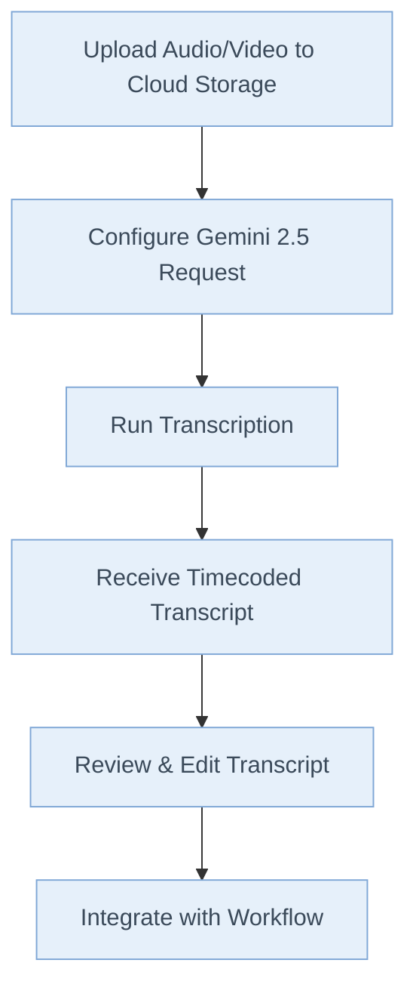

# Transcribing Audio and Video with Gemini 2.5: A Comprehensive Guide

## **📚 Learning Objectives**

By the end of this tutorial, you will be able to:

- ✅ Set up and authenticate with both Vertex AI and Gemini API
- ✅ Transcribe audio and video files with timestamps and speaker identification
- ✅ Choose the appropriate model (Flash vs. Flash-Lite vs. Pro) for your use case
- ✅ Implement production-ready error handling and quality assurance
- ✅ Optimize performance for batch processing and cost management
- ✅ Integrate transcription into your existing workflows

**Time Investment:** 45-60 minutes for basic setup, 2-3 hours for advanced features

**Prerequisites:** Basic Python knowledge, Google Cloud account

---

## 1. Why Transcribe with Gemini 2.5?

Imagine this: You’re in a high-stakes meeting. The CEO drops a game-changing insight, but nobody’s taking notes. Later, you’re tasked with summarizing the meeting, but the golden nugget i---If you'd like to see more complex examples or have questions about a specific use case, let me know!ou'd like to see more complex examples or have questions about a specific use case, let me know!ou'd like to see more complex examples or have questions about a specific use case, let me know!in a sea of “ums” and background chatter. Sound familiar?

Now, picture having a tool that not only captures every word with near-human accuracy but also timestamps and labels each speaker—automatically. That’s the power of Gemini 2.5.

### Why Should You Care?

- **Speed:** Manual transcription is slow and soul-crushing. Gemini 2.5 does in minutes what takes hours.
- **Accuracy:** No more “Did she say ‘billions’ or ‘millions’?” Gemini’s AI catches the details.
- **Productivity:** Free your team from grunt work and focus on what matters—analysis, strategy, and action.

> **Anecdote:**
> I once missed a critical client deadline because a two-hour interview took me an entire day to transcribe—by hand. With Gemini 2.5, that same task now takes less than 10 minutes. The difference? I can now spend my time crafting insights, not typing furiously.

---

## 2. What is Gemini 2.5?

Think of Gemini 2.5 as your AI-powered transcriptionist—always on, never tired, and capable of handling everything from crisp podcasts to chaotic roundtable debates.

### Key Features

- **Supports Video \& Audio:** Feed it almost any common format.
- **Speaker Diarization:** Labels who said what (Speaker A, B, etc.).
- **Timecodes:** Pinpoints when each statement was made.
- **Scalable:** Handles everything from short clips to marathon interviews.
- **Customizable Output:** Format transcripts to suit your workflow.

> **Metaphor:**
> If traditional transcription is like chiseling words into stone, Gemini 2.5 is a 3D printer—fast, precise, and adaptable.

---

## 3. Setting Up: The Fast Lane

Let’s get you up and running—no detours.

### Minimum Requirements

- **Python 3.8+**
- **Google Cloud account with Vertex AI enabled**
- **Gemini 2.5 Python SDK installed**

### Installation \& Authentication

**For Vertex AI:**

```bash
pip install google-cloud-aiplatform
```

**For Gemini API:**

```bash
pip install google-generativeai
```

**Authentication:**

- **Vertex AI:** Use Google Cloud credentials

  ```bash
  gcloud auth application-default login
  ```

- **Gemini API:** Get an API key from [Google AI Studio](https://aistudio.google.com/app/apikey)

  ```python
  import google.generativeai as genai
  genai.configure(api_key="your-api-key")
  ```

### First Run Checklist

- [ ] Google Cloud project created
- [ ] Vertex AI API enabled
- [ ] Service account with necessary permissions

> **Pro Tip:**
> Use a dedicated service account for automation—never your personal credentials.

#### Common Pitfall

- **Error:** “Permission denied”
  **Fix:** Double-check IAM roles and API activation.

---

## 4. The Basics: Your First Transcription

Let’s dive in with a simple, real-world example.

### Understanding the Two Approaches

| Feature                 | Vertex AI                      | Gemini API                              |
| ----------------------- | ------------------------------ | --------------------------------------- |
| **Use Case**            | Production/Enterprise          | Development/Prototyping                 |
| **Authentication**      | Google Cloud IAM               | API Keys                                |
| **File Handling**       | Direct Cloud Storage URIs      | Upload files via Files API              |
| **Regional Deployment** | Yes (us-central1, etc.)        | Global endpoints                        |
| **Enterprise Features** | Advanced safety, custom tuning | Basic features                          |
| **Pricing**             | Enterprise SLAs                | More cost-effective for small workloads |

#### Key Differences Explained

**File Handling:**

- **Vertex AI**: Files must be in Google Cloud Storage (gs://). Direct URI access.
- **Gemini API**: Local files uploaded via Files API. More flexible for development.

**Authentication:**

- **Vertex AI**: Uses Application Default Credentials (ADC) or service accounts
- **Gemini API**: Simple API key authentication

**Supported Audio Formats:**
Both support: WAV, MP3, M4A, AAC, FLAC, OGG, OPUS, WEBM

**Audio Limits:**

- Maximum length: ~9.5 hours per prompt (per latest official documentation)
- File size: Up to 20MB for inline data (Gemini API)

**When to Choose What:**

- **Use Vertex AI** if you need enterprise features, are already on GCP, or require advanced safety controls
- **Use Gemini API** if you want quick prototyping, simpler setup, or are building smaller applications

#### Example 1A: Transcribing with Vertex AI

**Best for:** Production environments, enterprise security requirements, existing GCP infrastructure.

```python
import vertexai
from vertexai.generative_models import GenerativeModel, Part, GenerationConfig

# Initialize Vertex AI
vertexai.init(project="your-gcp-project-id", location="us-central1")

# Create the model
model = GenerativeModel("gemini-2.5-flash")  # Recommended for transcription

# Create audio part from Cloud Storage URI
audio_part = Part.from_uri(
    uri="gs://your-bucket/interview.m4a",
    mime_type="audio/mp4"  # Correct MIME type for m4a files
)

# Create prompt
prompt = """Transcribe the interview, in the format of timecode, speaker, caption.
Use speaker A, speaker B, etc. to identify speakers."""

# Generate content with timestamps enabled
response = model.generate_content(
    [audio_part, prompt],
    generation_config=GenerationConfig(
        temperature=0,
        max_output_tokens=8192,
        audio_timestamp=True,  # Enable timestamp understanding
    ),
    safety_settings=[
        {"category": "HARM_CATEGORY_HATE_SPEECH", "threshold": "BLOCK_NONE"},
        {"category": "HARM_CATEGORY_DANGEROUS_CONTENT", "threshold": "BLOCK_NONE"},
        {"category": "HARM_CATEGORY_SEXUALLY_EXPLICIT", "threshold": "BLOCK_NONE"},
        {"category": "HARM_CATEGORY_HARASSMENT", "threshold": "BLOCK_NONE"},
    ]
)

print(response.text)
```

#### Example 1B: Transcribing with Gemini API

**Best for:** Quick prototyping, simple integrations, smaller applications.

```python
import google.generativeai as genai
import time

# Configure the API
genai.configure(api_key="your-api-key")

# Create the model
model = genai.GenerativeModel("gemini-2.5-flash")  # Recommended for transcription

# Upload file (required for Gemini API)
uploaded_file = genai.upload_file(
    path="path/to/local/interview.m4a",
    display_name="Interview Audio"
)

# Wait for processing
while uploaded_file.state.name == "PROCESSING":
    time.sleep(2)
    uploaded_file = genai.get_file(uploaded_file.name)

# Generate transcript
response = model.generate_content([
    uploaded_file,
    "Transcribe the interview, in the format of timecode, speaker, caption. Use speaker A, speaker B, etc. to identify speakers."
], safety_settings=[
    {"category": "HARM_CATEGORY_HATE_SPEECH", "threshold": "BLOCK_NONE"},
    {"category": "HARM_CATEGORY_DANGEROUS_CONTENT", "threshold": "BLOCK_NONE"},
    {"category": "HARM_CATEGORY_SEXUALLY_EXPLICIT", "threshold": "BLOCK_NONE"},
    {"category": "HARM_CATEGORY_HARASSMENT", "threshold": "BLOCK_NONE"},
])

print(response.text)
```

#### Example 1C: Complete Working Vertex AI Function

```python
import vertexai
from vertexai.generative_models import GenerativeModel, Part, GenerationConfig

def transcribe_audio_vertexai(project_id: str, location: str, audio_uri: str):
    """Complete function to transcribe audio using Vertex AI"""
    # Initialize Vertex AI
    vertexai.init(project=project_id, location=location)

    # Create the model
    model = GenerativeModel("gemini-2.5-flash")  # Recommended for transcription

    # Create parts
    audio_part = Part.from_uri(
        uri=audio_uri,
        mime_type="audio/mp4"  # Adjust based on your file type
    )

    prompt = """Transcribe this audio file with the following requirements:
    1. Include timestamps in [HH:MM:SS] format
    2. Identify speakers as Speaker A, Speaker B, etc.
    3. Format as: [timestamp] Speaker X: dialogue
    4. If audio is unclear, mark as [inaudible]
    """

    # Generate content with proper configuration
    response = model.generate_content(
        [audio_part, prompt],
        generation_config=GenerationConfig(
            temperature=0,
            max_output_tokens=8192,
            audio_timestamp=True,  # Enable timestamp understanding
        ),
        safety_settings=[
            {"category": "HARM_CATEGORY_HATE_SPEECH", "threshold": "BLOCK_NONE"},
            {"category": "HARM_CATEGORY_DANGEROUS_CONTENT", "threshold": "BLOCK_NONE"},
            {"category": "HARM_CATEGORY_SEXUALLY_EXPLICIT", "threshold": "BLOCK_NONE"},
            {"category": "HARM_CATEGORY_HARASSMENT", "threshold": "BLOCK_NONE"},
        ]
    )

    return response.text

# Usage
transcript = transcribe_audio_vertexai(
    project_id="your-gcp-project-id",
    location="us-central1",
    audio_uri="gs://your-bucket/interview.m4a"
)
print(transcript)
```

#### Output

```text
[00:00:01] Speaker A: Welcome to the interview.
[00:00:03] Speaker B: Thank you for having me.
...
```

> **Pause and Reflect:**
> Can you identify each part of the code? What would you change if your file was a .wav instead of .m4a?

#### Quick Quiz

- What does the `audioTimestamp` parameter in `GenerationConfig` do?
- Why use `Part.from_uri` instead of loading the file locally?

---

## 5. Level Up: Handling Real-World Complexity

Now, let’s tackle more challenging scenarios.

#### Example 2: Multi-Speaker Interview

Suppose you have a panel discussion with overlapping voices.

- **Prompt Engineering:**
  “Transcribe the panel discussion. Identify each speaker as Speaker A, Speaker B, etc. Include timecodes for each utterance.”
- **Pro Tip:**
  For best results, ask Gemini to “separate overlapping speech as best as possible.”

#### Example 3: Long-Form Content

For hour-long webinars, break the audio into segments. Automate with a Python loop, feeding each chunk into Gemini and stitching the results.

#### Example 4: Noisy Audio \& Accents

- **Prompt:**
  “Transcribe the audio. If unsure about a word, mark with [inaudible].”
- **Pro Tip:**
  Clean your audio with noise reduction tools before transcribing for optimal accuracy.

---

#### **Mermaid Flowchart: The Gemini 2.5 Transcription Workflow**



---

## 6. Automation \& Integration

#### Example 5: Batch Processing

You have 100 interviews to transcribe. Don’t do them one by one!

```python
import glob

audio_files = glob.glob("gs://your-bucket/*.m4a")
for file_uri in audio_files:
    # Repeat Gemini transcription code for each file
    ...
```

#### Example 6: Integrating with Data Pipelines

- Output transcripts to a database or trigger downstream analytics.
- Use cloud functions to automate the process when new files are uploaded.

> **Pro Tip:**
> Log every request and response for debugging and compliance.

---

## 7. Interactive Elements

#### Pause and Reflect

- Which part of the process do you find most confusing?
- How would you modify the prompt for a podcast with three hosts?

#### Test Your Understanding

1. What happens if you exceed `max_output_tokens`?
2. How do you ensure speaker labels are consistent across segments?

---

## 8. Insider Secrets \& Pro Tips

- **Speed Hacks:**
  Use batch requests and parallel processing for large jobs.
- **Output Formatting:**
  Ask Gemini to output in JSON or CSV for easier parsing.
- **Pitfall:**
  Don’t forget to check for API quota limits—plan for retries.

> **Common Misconception:**
> “AI transcription is always perfect.”
> Reality: Always review transcripts, especially for names and technical terms.

---

## 9. When to Use (and Not Use) Gemini 2.5

#### Best Use Cases

- Interviews, podcasts, webinars, meetings
- Multi-speaker events
- Rapid turnaround needs

#### Limitations

- Extremely poor audio quality
- Highly technical jargon without context
- Real-time (live) transcription (for now)

---

## 10. Conclusion \& Call to Action

Congratulations! You’ve gone from zero to Gemini 2.5 transcription hero.

#### 24-Hour Challenge

- **Task:**
  Find a 5-minute video or audio file. Upload it to Google Cloud Storage, transcribe it using Gemini 2.5, and share the transcript with a colleague.

#### Next Steps

- Experiment with different prompts and formats.
- Integrate Gemini into your daily workflow.
- Share your results and tips with the community.

> **Remember:**
> The fastest way to mastery is practice. Don’t just read—do.

---

**Ready to turn every meeting, interview, and podcast into actionable insights? Fire up Gemini 2.5 and start transcribing—your future self will thank you.**

---

**Continue to the next session for advanced troubleshooting, custom integrations, and real-world case studies.**

---

If you’d like to see more complex examples or have questions about a specific use case, let me know!

### Important: Safety Settings for Transcription

When transcribing audio/video content, you might encounter content that triggers Gemini's safety filters. For accurate transcription, you may need to adjust safety settings:

```python
safety_settings=[
    {"category": "HARM_CATEGORY_HATE_SPEECH", "threshold": "BLOCK_NONE"},
    {"category": "HARM_CATEGORY_DANGEROUS_CONTENT", "threshold": "BLOCK_NONE"},
    {"category": "HARM_CATEGORY_SEXUALLY_EXPLICIT", "threshold": "BLOCK_NONE"},
    {"category": "HARM_CATEGORY_HARASSMENT", "threshold": "BLOCK_NONE"},
]
```

**Why This Matters:**

- **News Transcripts:** Political debates or news content might be flagged
- **Interview Content:** Sensitive topics discussed in interviews
- **Legal/Medical:** Professional recordings containing sensitive terminology
- **Historical Audio:** Archival content with outdated language

> **Important Note:**
> Only disable safety filters when necessary and ensure you have proper content review processes in place. Consider your use case and compliance requirements.

### Important: Enabling Audio Timestamps

For accurate timestamp generation in audio transcription, you need to enable the `audioTimestamp` parameter:

**For Vertex AI:**

```python
generation_config=GenerationConfig(
    temperature=0,
    max_output_tokens=8192,
    audio_timestamp=True  # Enable timestamp understanding
)
```

**For Gemini API:**

```python
generation_config=genai.GenerationConfig(
    temperature=0,
    max_output_tokens=8192,
    audio_timestamp=True  # Enable timestamp understanding
)
```

> **Important:** Without `audio_timestamp=True`, timestamp accuracy may be reduced.

### Technical Details Update

**Token Representation:**

- Each second of audio = 32 tokens (according to official documentation)
- 1 minute of audio = 1,920 tokens
- Maximum audio length: 9.5 hours per prompt (updated from 8.4 hours)

**Audio Processing:**

- Audio is downsampled to 16 Kbps resolution
- Multi-channel audio is combined into a single channel
- Gemini can understand non-speech sounds (birdsong, sirens, etc.)

### Pricing Information (As of June 2025)

**Gemini 2.5 Flash (Recommended for transcription):**

- Free tier available in Google AI Studio
- Paid tier: $0.30/1M tokens (text/image/video), $1.00/1M tokens (audio input)
- Output: $2.50/1M tokens

**Gemini 2.5 Pro:**

- Paid tier only: $1.25-$2.50/1M tokens (input), $10.00-$15.00/1M tokens (output)

> **Cost Estimation:** A 1-hour audio file ≈ 115,200 tokens, costing ~$0.12 for input processing with Gemini 2.5 Flash.

---

## ⚠️ Important Clarification: Speaker Diarization

**Speaker Diarization is NOT automatic.** You must request it in your prompt:

```python
prompt = """Transcribe this audio and identify different speakers as Speaker A, Speaker B, etc.
Include timestamps in [HH:MM:SS] format for each speaker's utterances."""
```

**What Gemini Does:**

- Attempts to differentiate speakers based on voice characteristics
- Labels them as "Speaker A," "Speaker B," etc. when prompted
- Quality depends on audio clarity and speaker distinctiveness

**What Gemini Does NOT Do:**

- Automatic speaker identification without prompting
- Named speaker identification (e.g., "John Smith said...")
- Perfect speaker separation in noisy environments

---

### 🎯 **Model Recommendation Update (June 2025)**

**For Transcription Tasks, Use:**

1. **Gemini 2.5 Flash** - Best price-performance ratio for most transcription needs
2. **Gemini 2.5 Flash-Lite** - Most cost-effective for high-volume, batch processing
3. **Gemini 2.5 Pro** - Only for complex reasoning combined with transcription

> **Important:** Gemini 2.5 Flash is specifically optimized for audio understanding with better cost efficiency than Pro for transcription tasks.

---

### 🧠 **Understanding Gemini 2.5 "Thinking" Feature**

Gemini 2.5 models include a "thinking" process that affects response structure:

```python
# The model may include thinking tokens in responses
# These show the model's reasoning process before generating the final answer
response = model.generate_content([audio_part, prompt])

# Response structure:
# 1. <thinking>...</thinking> - Internal reasoning (may appear)
# 2. Final transcription output
```

**To control thinking behavior:**

```python
generation_config=GenerationConfig(
    temperature=0,
    max_output_tokens=8192,
    audio_timestamp=True,
    response_schema={"type": "string"}  # Request direct string output
)
```

> **Note:** Thinking tokens are included in billing but provide transparency into the model's reasoning process.

---

### 🌍 **Multi-Language Transcription Support**

Gemini 2.5 supports transcription in 40+ languages:

**Major Languages Supported:**

- English, Spanish, French, German, Italian, Portuguese
- Chinese (Simplified/Traditional), Japanese, Korean
- Arabic, Hindi, Russian, Dutch, Polish
- And 30+ more languages

**Example: Spanish Transcription**

```python
prompt = """Transcribe this Spanish audio with the following requirements:
1. Include timestamps in [HH:MM:SS] format
2. Identify speakers as Hablante A, Hablante B, etc.
3. Maintain original language - do NOT translate to English
4. Mark unclear speech as [inaudible]"""
```

**Best Practices for Non-English Audio:**

- Specify the language in your prompt for better accuracy
- Use native speaker labels (e.g., "Sprecherin A" for German)
- Consider regional dialects and accents in your quality expectations

---

### 🎬 **Video Transcription Specifics**

The tutorial title mentions video, but there are important video-specific considerations:

**Video vs Audio-Only Transcription:**

| Feature           | Audio-Only         | Video                             |
| ----------------- | ------------------ | --------------------------------- |
| **Input Format**  | Audio files only   | Video files (MP4, MOV, AVI, etc.) |
| **Context Clues** | Audio signals only | Visual cues + audio               |
| **Speaker ID**    | Voice-based only   | Visual + voice-based              |
| **Processing**    | Audio tokens only  | Video + audio tokens              |
| **Cost**          | Lower              | Higher (due to video processing)  |

**Video-Specific Example:**

```python
# For video files
video_part = Part.from_uri(
    uri="gs://your-bucket/meeting.mp4",
    mime_type="video/mp4"
)

prompt = """Transcribe this video meeting with the following requirements:
1. Use visual cues to help identify speakers when possible
2. Include timestamps for each speaker
3. Note any relevant visual context (e.g., "shows presentation slide")
4. Format as: [timestamp] Speaker X: dialogue"""
```

**Video Limitations:**

- Larger file sizes increase processing time
- Visual processing adds to token consumption
- Not all video formats supported equally

---

### 🛠️ **Production-Ready Error Handling**

The tutorial lacks proper error handling. Here's what you need for production:

```python
import time
import logging
from typing import Optional
import vertexai
from vertexai.generative_models import GenerativeModel, Part, GenerationConfig
from google.api_core import exceptions as gcp_exceptions

def robust_transcribe_audio(
    project_id: str,
    location: str,
    audio_uri: str,
    max_retries: int = 3
) -> Optional[str]:
    """Production-ready transcription with error handling"""

    for attempt in range(max_retries):
        try:
            vertexai.init(project=project_id, location=location)
            model = GenerativeModel("gemini-2.5-flash")

            audio_part = Part.from_uri(
                uri=audio_uri,
                mime_type="audio/mp4"
            )

            prompt = """Transcribe this audio with timestamps and speaker identification.
            Format: [HH:MM:SS] Speaker X: dialogue"""

            response = model.generate_content(
                [audio_part, prompt],
                generation_config=GenerationConfig(
                    temperature=0,
                    max_output_tokens=8192,
                    audio_timestamp=True,
                ),
                safety_settings=[
                    {"category": "HARM_CATEGORY_HATE_SPEECH", "threshold": "BLOCK_NONE"},
                    {"category": "HARM_CATEGORY_DANGEROUS_CONTENT", "threshold": "BLOCK_NONE"},
                    {"category": "HARM_CATEGORY_SEXUALLY_EXPLICIT", "threshold": "BLOCK_NONE"},
                    {"category": "HARM_CATEGORY_HARASSMENT", "threshold": "BLOCK_NONE"},
                ]
            )

            return response.text

        except gcp_exceptions.ResourceExhausted as e:
            logging.warning(f"Rate limit hit, attempt {attempt + 1}/{max_retries}")
            if attempt < max_retries - 1:
                time.sleep(2 ** attempt)  # Exponential backoff
            else:
                raise

        except gcp_exceptions.InvalidArgument as e:
            logging.error(f"Invalid audio format or file: {e}")
            raise

        except Exception as e:
            logging.error(f"Unexpected error on attempt {attempt + 1}: {e}")
            if attempt < max_retries - 1:
                time.sleep(1)
            else:
                raise

    return None

# Usage with error handling
try:
    transcript = robust_transcribe_audio(
        project_id="your-project-id",
        location="us-central1",
        audio_uri="gs://your-bucket/interview.m4a"
    )
    if transcript:
        print("Transcription successful!")
        print(transcript)
    else:
        print("Transcription failed after all retries")

except Exception as e:
    logging.error(f"Transcription failed: {e}")
```

**Common Error Scenarios:**

- Rate limiting (429 errors)
- Invalid audio formats
- Files too large
- Network timeouts
- Authentication issues

---

### ⚡ **Performance Optimization for Large-Scale Transcription**

**Batch Processing Optimization:**

```python
import asyncio
import concurrent.futures
from typing import List, Tuple

async def batch_transcribe_optimized(
    audio_files: List[str],
    max_concurrent: int = 5
) -> List[Tuple[str, str]]:
    """Optimized batch transcription with concurrency control"""

    semaphore = asyncio.Semaphore(max_concurrent)

    async def transcribe_single(audio_uri: str) -> Tuple[str, str]:
        async with semaphore:
            try:
                # Use Flash-Lite for high-volume processing
                result = await transcribe_with_retry(audio_uri, model="gemini-2.5-flash-lite")
                return audio_uri, result
            except Exception as e:
                return audio_uri, f"ERROR: {str(e)}"

    tasks = [transcribe_single(uri) for uri in audio_files]
    results = await asyncio.gather(*tasks)
    return results

# Model selection for different use cases
MODEL_RECOMMENDATIONS = {
    "high_volume_batch": "gemini-2.5-flash-lite",
    "standard_quality": "gemini-2.5-flash",
    "complex_reasoning": "gemini-2.5-pro",
    "real_time": "gemini-2.0-flash-live"  # For live transcription
}
```

### 📊 **Quality Assurance and Accuracy Measurement**

**Transcript Quality Metrics:**

```python
import difflib
from typing import Dict, List
import re

class TranscriptionQualityAnalyzer:
    """Analyze transcription quality and accuracy"""

    def __init__(self):
        self.metrics = {}

    def calculate_word_error_rate(self, reference: str, hypothesis: str) -> float:
        """Calculate Word Error Rate (WER) - industry standard metric"""
        ref_words = reference.lower().split()
        hyp_words = hypothesis.lower().split()

        # Use edit distance
        d = [[0] * (len(hyp_words) + 1) for _ in range(len(ref_words) + 1)]

        for i in range(len(ref_words) + 1):
            d[i][0] = i
        for j in range(len(hyp_words) + 1):
            d[0][j] = j

        for i in range(1, len(ref_words) + 1):
            for j in range(1, len(hyp_words) + 1):
                if ref_words[i-1] == hyp_words[j-1]:
                    d[i][j] = d[i-1][j-1]
                else:
                    d[i][j] = min(d[i-1][j], d[i][j-1], d[i-1][j-1]) + 1

        return d[len(ref_words)][len(hyp_words)] / len(ref_words)

    def analyze_speaker_accuracy(self, transcript: str) -> Dict:
        """Analyze speaker diarization accuracy"""
        speaker_pattern = r'\[(\d{2}:\d{2}:\d{2})\]\s*(Speaker [A-Z]|Hablante [A-Z]):'
        matches = re.findall(speaker_pattern, transcript)

        return {
            'total_utterances': len(matches),
            'unique_speakers': len(set(match[1] for match in matches)),
            'avg_utterance_length': self._calculate_avg_utterance_length(transcript),
            'timeline_consistency': self._check_timeline_consistency(matches)
        }

    def _calculate_avg_utterance_length(self, transcript: str) -> float:
        """Calculate average utterance length"""
        utterances = re.split(r'\[\d{2}:\d{2}:\d{2}\].*?:', transcript)[1:]
        if not utterances:
            return 0

        lengths = [len(utterance.strip().split()) for utterance in utterances]
        return sum(lengths) / len(lengths)

    def _check_timeline_consistency(self, matches: List) -> bool:
        """Check if timestamps are in chronological order"""
        timestamps = [match[0] for match in matches]
        return timestamps == sorted(timestamps)

# Usage example
analyzer = TranscriptionQualityAnalyzer()

# Test transcription quality
reference_text = "Hello world this is a test"
generated_text = "Hello world this is a test"
wer = analyzer.calculate_word_error_rate(reference_text, generated_text)
print(f"Word Error Rate: {wer:.2%}")

# Analyze speaker accuracy
transcript = """[00:00:01] Speaker A: Hello everyone
[00:00:05] Speaker B: Thank you for joining"""
speaker_analysis = analyzer.analyze_speaker_accuracy(transcript)
print(f"Speaker Analysis: {speaker_analysis}")
```

**Quality Improvement Strategies:**

1. **Audio preprocessing**: Noise reduction, normalization
2. **Prompt optimization**: A/B testing different prompt formats
3. **Model selection**: Choose appropriate model for content type
4. **Post-processing**: Spell checking, grammar correction
5. **Human review**: Quality sampling for continuous improvement

---

## **🔧 Troubleshooting Guide**

### **Common Issues and Solutions**

| Problem                        | Symptoms                                   | Solution                                          |
| ------------------------------ | ------------------------------------------ | ------------------------------------------------- |
| **Authentication Errors**      | "Permission denied", "Invalid credentials" | Check service account permissions, verify API key |
| **File Format Issues**         | "Unsupported format", "Invalid MIME type"  | Convert to supported format (MP3, WAV, M4A)       |
| **Rate Limiting**              | "Quota exceeded", "Too many requests"      | Implement exponential backoff, reduce concurrency |
| **Poor Transcription Quality** | Missing words, incorrect timestamps        | Improve audio quality, adjust prompts             |
| **Memory/Timeout Errors**      | "Request timeout", "Memory exceeded"       | Split large files, optimize batch size            |

### **Quality Issues Checklist**

- [ ] Audio quality is clear (minimal background noise)
- [ ] File format is supported and optimal
- [ ] Speakers are clearly distinguishable
- [ ] Prompt is specific and well-formatted
- [ ] Appropriate model selected for use case
- [ ] Safety settings configured correctly

### **Performance Optimization Checklist**

- [ ] Using appropriate model (Flash for most cases)
- [ ] Implementing proper error handling
- [ ] Batching requests efficiently
- [ ] Monitoring costs and usage
- [ ] Caching results when appropriate

---
