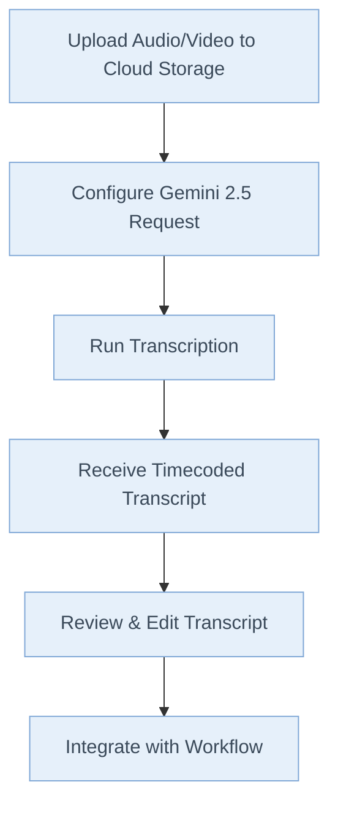

# Transcribing a Video using Gemini 2.5 for the Impatient: From Novice to Practitioner in Record Time

---

## 1. Why Transcribe with Gemini 2.5?

Imagine this: You’re in a high-stakes meeting. The CEO drops a game-changing insight, but nobody’s taking notes. Later, you’re tasked with summarizing the meeting, but the golden nugget i---If you'd like to see more complex examples or have questions about a specific use case, let me know!ou'd like to see more complex examples or have questions about a specific use case, let me know!ou'd like to see more complex examples or have questions about a specific use case, let me know!in a sea of “ums” and background chatter. Sound familiar?

Now, picture having a tool that not only captures every word with near-human accuracy but also timestamps and labels each speaker—automatically. That’s the power of Gemini 2.5.

### Why Should You Care?

- **Speed:** Manual transcription is slow and soul-crushing. Gemini 2.5 does in minutes what takes hours.
- **Accuracy:** No more “Did she say ‘billions’ or ‘millions’?” Gemini’s AI catches the details.
- **Productivity:** Free your team from grunt work and focus on what matters—analysis, strategy, and action.

> **Anecdote:**
> I once missed a critical client deadline because a two-hour interview took me an entire day to transcribe—by hand. With Gemini 2.5, that same task now takes less than 10 minutes. The difference? I can now spend my time crafting insights, not typing furiously.

---

## 2. What is Gemini 2.5?

Think of Gemini 2.5 as your AI-powered transcriptionist—always on, never tired, and capable of handling everything from crisp podcasts to chaotic roundtable debates.

### Key Features

- **Supports Video \& Audio:** Feed it almost any common format.
- **Speaker Diarization:** Labels who said what (Speaker A, B, etc.).
- **Timecodes:** Pinpoints when each statement was made.
- **Scalable:** Handles everything from short clips to marathon interviews.
- **Customizable Output:** Format transcripts to suit your workflow.

> **Metaphor:**
> If traditional transcription is like chiseling words into stone, Gemini 2.5 is a 3D printer—fast, precise, and adaptable.

---

## 3. Setting Up: The Fast Lane

Let’s get you up and running—no detours.

### Minimum Requirements

- **Python 3.8+**
- **Google Cloud account with Vertex AI enabled**
- **Gemini 2.5 Python SDK installed**

### Installation \& Authentication

**For Vertex AI:**

```bash
pip install google-cloud-aiplatform
```

**For Gemini API:**

```bash
pip install google-generativeai
```

**Authentication:**

- **Vertex AI:** Use Google Cloud credentials

  ```bash
  gcloud auth application-default login
  ```

- **Gemini API:** Get an API key from [Google AI Studio](https://aistudio.google.com/app/apikey)

  ```python
  import google.generativeai as genai
  genai.configure(api_key="your-api-key")
  ```

### First Run Checklist

- [ ] Google Cloud project created
- [ ] Vertex AI API enabled
- [ ] Service account with necessary permissions

> **Pro Tip:**
> Use a dedicated service account for automation—never your personal credentials.

#### Common Pitfall

- **Error:** “Permission denied”
  **Fix:** Double-check IAM roles and API activation.

---

## 4. The Basics: Your First Transcription

Let’s dive in with a simple, real-world example.

### Understanding the Two Approaches

| Feature | Vertex AI | Gemini API |
|---------|-----------|------------|
| **Use Case** | Production/Enterprise | Development/Prototyping |
| **Authentication** | Google Cloud IAM | API Keys |
| **File Handling** | Direct Cloud Storage URIs | Upload files via Files API |
| **Regional Deployment** | Yes (us-central1, etc.) | Global endpoints |
| **Enterprise Features** | Advanced safety, custom tuning | Basic features |
| **Pricing** | Enterprise SLAs | More cost-effective for small workloads |

#### Key Differences Explained

**File Handling:**

- **Vertex AI**: Files must be in Google Cloud Storage (gs://). Direct URI access.
- **Gemini API**: Local files uploaded via Files API. More flexible for development.

**Authentication:**

- **Vertex AI**: Uses Application Default Credentials (ADC) or service accounts
- **Gemini API**: Simple API key authentication

**Supported Audio Formats:**
Both support: WAV, MP3, M4A, AAC, FLAC, OGG, OPUS, WEBM

**Audio Limits:**

- Maximum length: ~8.4 hours per file
- File size: Up to 20MB for inline data (Gemini API)

**When to Choose What:**

- **Use Vertex AI** if you need enterprise features, are already on GCP, or require advanced safety controls
- **Use Gemini API** if you want quick prototyping, simpler setup, or are building smaller applications

#### Example 1A: Transcribing with Vertex AI

**Best for:** Production environments, enterprise security requirements, existing GCP infrastructure.

```python
import vertexai
from vertexai.generative_models import GenerativeModel, Part, GenerationConfig

# Initialize Vertex AI
vertexai.init(project="your-gcp-project-id", location="us-central1")

# Create the model
model = GenerativeModel("gemini-2.5-pro")

# Create audio part from Cloud Storage URI
audio_part = Part.from_uri(
    uri="gs://your-bucket/interview.m4a",
    mime_type="audio/mp4"  # Correct MIME type for m4a files
)

# Create prompt
prompt = """Transcribe the interview, in the format of timecode, speaker, caption.
Use speaker A, speaker B, etc. to identify speakers."""

# Generate content with timestamps enabled
response = model.generate_content(
    [audio_part, prompt],
    generation_config=GenerationConfig(
        temperature=0,
        max_output_tokens=8192,
    )
)

print(response.text)
```

#### Example 1B: Transcribing with Gemini API

**Best for:** Quick prototyping, simple integrations, smaller applications.

```python
import google.generativeai as genai
import time

# Configure the API
genai.configure(api_key="your-api-key")

# Create the model
model = genai.GenerativeModel("gemini-2.5-pro")

# Upload file (required for Gemini API)
uploaded_file = genai.upload_file(
    path="path/to/local/interview.m4a",
    display_name="Interview Audio"
)

# Wait for processing
while uploaded_file.state.name == "PROCESSING":
    time.sleep(2)
    uploaded_file = genai.get_file(uploaded_file.name)

# Generate transcript
response = model.generate_content([
    uploaded_file,
    "Transcribe the interview, in the format of timecode, speaker, caption. Use speaker A, speaker B, etc. to identify speakers."
])

print(response.text)
```

#### Example 1C: Complete Working Vertex AI Function

```python
import vertexai
from vertexai.generative_models import GenerativeModel, Part, GenerationConfig

def transcribe_audio_vertexai(project_id: str, location: str, audio_uri: str):
    """Complete function to transcribe audio using Vertex AI"""
    # Initialize Vertex AI
    vertexai.init(project=project_id, location=location)
    
    # Create the model
    model = GenerativeModel("gemini-2.5-pro")
    
    # Create parts
    audio_part = Part.from_uri(
        uri=audio_uri,
        mime_type="audio/mp4"  # Adjust based on your file type
    )
    
    prompt = """Transcribe this audio file with the following requirements:
    1. Include timestamps in [HH:MM:SS] format
    2. Identify speakers as Speaker A, Speaker B, etc.
    3. Format as: [timestamp] Speaker X: dialogue
    4. If audio is unclear, mark as [inaudible]
    """
    
    # Generate content with proper configuration
    response = model.generate_content(
        [audio_part, prompt],
        generation_config=GenerationConfig(
            temperature=0,
            max_output_tokens=8192,
        )
    )
    
    return response.text

# Usage
transcript = transcribe_audio_vertexai(
    project_id="your-gcp-project-id",
    location="us-central1",
    audio_uri="gs://your-bucket/interview.m4a"
)
print(transcript)
```

#### Output

```text
[00:00:01] Speaker A: Welcome to the interview.
[00:00:03] Speaker B: Thank you for having me.
...
```

> **Pause and Reflect:**
> Can you identify each part of the code? What would you change if your file was a .wav instead of .m4a?

#### Quick Quiz

- What does `audio_timestamp=True` do?
- Why use `types.Part.from_uri` instead of loading the file locally?

---

## 5. Level Up: Handling Real-World Complexity

Now, let’s tackle more challenging scenarios.

#### Example 2: Multi-Speaker Interview

Suppose you have a panel discussion with overlapping voices.

- **Prompt Engineering:**
  “Transcribe the panel discussion. Identify each speaker as Speaker A, Speaker B, etc. Include timecodes for each utterance.”
- **Pro Tip:**
  For best results, ask Gemini to “separate overlapping speech as best as possible.”

#### Example 3: Long-Form Content

For hour-long webinars, break the audio into segments. Automate with a Python loop, feeding each chunk into Gemini and stitching the results.

#### Example 4: Noisy Audio \& Accents

- **Prompt:**
  “Transcribe the audio. If unsure about a word, mark with [inaudible].”
- **Pro Tip:**
  Clean your audio with noise reduction tools before transcribing for optimal accuracy.

---

#### **Mermaid Flowchart: The Gemini 2.5 Transcription Workflow**



---

## 6. Automation \& Integration

#### Example 5: Batch Processing

You have 100 interviews to transcribe. Don’t do them one by one!

```python
import glob

audio_files = glob.glob("gs://your-bucket/*.m4a")
for file_uri in audio_files:
    # Repeat Gemini transcription code for each file
    ...
```

#### Example 6: Integrating with Data Pipelines

- Output transcripts to a database or trigger downstream analytics.
- Use cloud functions to automate the process when new files are uploaded.

> **Pro Tip:**
> Log every request and response for debugging and compliance.

---

## 7. Interactive Elements

#### Pause and Reflect

- Which part of the process do you find most confusing?
- How would you modify the prompt for a podcast with three hosts?

#### Test Your Understanding

1. What happens if you exceed `max_output_tokens`?
2. How do you ensure speaker labels are consistent across segments?

---

## 8. Insider Secrets \& Pro Tips

- **Speed Hacks:**
  Use batch requests and parallel processing for large jobs.
- **Output Formatting:**
  Ask Gemini to output in JSON or CSV for easier parsing.
- **Pitfall:**
  Don’t forget to check for API quota limits—plan for retries.

> **Common Misconception:**
> “AI transcription is always perfect.”
> Reality: Always review transcripts, especially for names and technical terms.

---

## 9. When to Use (and Not Use) Gemini 2.5

#### Best Use Cases

- Interviews, podcasts, webinars, meetings
- Multi-speaker events
- Rapid turnaround needs

#### Limitations

- Extremely poor audio quality
- Highly technical jargon without context
- Real-time (live) transcription (for now)

---

## 10. Conclusion \& Call to Action

Congratulations! You’ve gone from zero to Gemini 2.5 transcription hero.

#### 24-Hour Challenge

- **Task:**
  Find a 5-minute video or audio file. Upload it to Google Cloud Storage, transcribe it using Gemini 2.5, and share the transcript with a colleague.

#### Next Steps

- Experiment with different prompts and formats.
- Integrate Gemini into your daily workflow.
- Share your results and tips with the community.

> **Remember:**
> The fastest way to mastery is practice. Don’t just read—do.

---

**Ready to turn every meeting, interview, and podcast into actionable insights? Fire up Gemini 2.5 and start transcribing—your future self will thank you.**

---

**Continue to the next session for advanced troubleshooting, custom integrations, and real-world case studies.**

---

If you’d like to see more complex examples or have questions about a specific use case, let me know!


