# Bruno for API for the Impatient: From Novice to Practitioner in Record Time

## The Missing Collection That Cost \$50,000

Picture this: It's 3 AM, your startup's Series A funding depends on a demo in 6 hours, and your lead developer just quit. The API documentation? Gone. The Postman collections? Locked in a cloud account nobody can access. Sound familiar?

This exact scenario happened to a fintech startup in Silicon Valley. Their entire API testing suite vanished overnight, forcing them to reverse-engineer their own endpoints hours before the most important pitch of their lives. They missed the funding round by a hair – all because their API client betrayed them when it mattered most.

**Why does this keep happening?** Because traditional API clients treat your work like disposable data, locked away in proprietary formats and cloud silos. But what if there was a better way?

## Chapter 1: Why Bruno Is Your Secret Weapon

### The API Client That Thinks Like a Developer

Bruno isn't just another API client – it's a revolution disguised as a simple tool. While Postman and Insomnia grew fat on venture capital and feature bloat, Bruno stayed lean, fast, and obsessively focused on what developers actually need.

Think of traditional API clients like those massive Swiss Army knives with 47 tools. Sure, they have everything, but good luck finding the screwdriver when you need it. Bruno is the precision scalpel – one tool, perfected.

**Pro Tip**: Bruno's entire application is under 100MB compared to Postman's 500MB+ footprint. Your laptop's battery will thank you.


### What Makes Bruno Different

Bruno stores your API collections as plain text files right in your project folder. No more "Tim's missing collection" blues – everything lives where your code lives, versioned and trackable.

**The Restaurant Analogy**: Traditional API clients are like having your recipe book stored in a restaurant you don't own. Bruno is like having your grandmother's handwritten recipes in your kitchen drawer – always there, always yours, always reliable.

## Chapter 2: Installation and First Steps

### Getting Bruno Running (2 Minutes Flat)

**Windows Users**:

```bash
# Using Chocolatey (Recommended)
choco install bruno

# Using Winget
winget install bruno.bruno
```

**Mac Users**:

```bash
# Using Homebrew
brew install bruno
```

**Linux Users**:

```bash
# Download .deb or .rpm from usebruno.com
sudo dpkg -i bruno_*.deb  # Debian/Ubuntu
sudo rpm -i bruno_*.rpm   # Fedora/CentOS
```

**CLI Installation** (Essential for automation):

```bash
npm install -g @usebruno/cli
```

**Pro Tip**: Install both the GUI and CLI simultaneously. You'll want the GUI for exploration and the CLI for automation.

### Your First API Request (The "Hello World" Moment)

Let's create your first Bruno collection using the JSONPlaceholder API – a free testing service that every developer should know.

**Step 1**: Create a new collection

- Open Bruno
- Click "Create Collection"
- Name it "My First API Adventure"
- Choose a folder in your project directory

**Step 2**: Your first request file
Bruno creates a `.bru` file for each request. Here's what a simple GET request looks like:

```bru
meta {
  name: Get All Users
  type: http
  seq: 1
}

get {
  url: https://jsonplaceholder.typicode.com/users
  body: none
  auth: none
}
```

**Pause and Reflect**: Notice how readable this is? Your future self will thank you for this clarity.

Hit "Send" and watch the magic happen. You'll see a JSON response with 10 fake users – perfect for testing.

### Understanding the Response

The response comes back with user data like:

```json
{
  "id": 1,
  "name": "Leanne Graham",
  "username": "Bret",
  "email": "Sincere@april.biz"
}
```

**Interactive Element**: Before reading further, try to predict what URL would fetch just user \#1. Write it down.

Answer: `https://jsonplaceholder.typicode.com/users/1`

## Chapter 3: Mastering the Bru Language

### The Language That Makes Sense

Bru (Bruno's markup language) reads like English, not like machine code. It's structured around how humans think about API requests:


### Progressive Examples: From Simple to Sophisticated

**Example 1: Basic GET with Headers**

```bru
meta {
  name: Get User Profile
  type: http
  seq: 2
}

get {
  url: https://jsonplaceholder.typicode.com/users/1
  body: none
  auth: none
}

headers {
  Accept: application/json
  User-Agent: Bruno-API-Client/1.0
}
```

**Example 2: POST Request (Creating Data)**

```bru
meta {
  name: Create New User
  type: http
  seq: 3
}

post {
  url: https://jsonplaceholder.typicode.com/users
  body: json
  auth: none
}

headers {
  Content-Type: application/json
}

body:json {
  {
    "name": "Bruno Tester",
    "username": "brunotester",
    "email": "bruno@example.com",
    "phone": "1-555-BRUNO-1",
    "website": "usebruno.com"
  }
}
```

**Example 3: Advanced PUT with Environment Variables**

```bru
meta {
  name: Update User
  type: http
  seq: 4
}

put {
  url: {{base_url}}/users/{{user_id}}
  body: json
  auth: none
}

headers {
  Content-Type: application/json
  Authorization: Bearer {{auth_token}}
}

body:json {
  {
    "name": "{{user_name}}",
    "email": "{{user_email}}"
  }
}
```

**Pro Tip**: Use `{{variable_name}}` syntax for dynamic values. Bruno will highlight these in the UI, making them easy to spot.

### Quick Knowledge Check

**Quiz Time**: What's wrong with this .bru file?

```bru
meta {
  name: Broken Request
  type: http
}

get {
  url: https://api.example.com/data
  body: json
}

body:json {
  {"key": "value"}
}
```

**Answer**: GET requests shouldn't have a body. Remove the `body: json` line from the get block and the entire `body:json` section.

## Chapter 4: Environment Management Mastery

### The Power of Variables

Environment variables in Bruno work like template placeholders that adapt to different contexts. Think of them as costumes for your API requests – the same request can dress up for development, staging, or production.

**Creating Your First Environment**:

1. Click the environment dropdown (top-right)
2. Select "Configure"
3. Create "Development" environment
4. Add variables:

```bru
vars {
  base_url: https://jsonplaceholder.typicode.com
  api_version: v1
  timeout: 5000
}
```

### Real-World Scenario: E-commerce API

Let's build a complete e-commerce workflow using environment variables:

**Development Environment (dev.bru)**:

```bru
vars {
  api_host: https://dev-api.mystore.com
  api_key: dev_12345_secret
  store_id: store_dev_001
  customer_id: cust_test_123
}
```

**Production Environment (prod.bru)**:

```bru
vars {
  api_host: https://api.mystore.com
  api_key: {{PROD_API_KEY}}
  store_id: store_prod_001
  customer_id: {{CUSTOMER_ID}}
}
```

**Pro Tip**: Use double curly braces `{{VARIABLE}}` for secrets that should come from your CLI or CI/CD pipeline.

### The Authentication Flow

**Step 1: Login Request**

```bru
meta {
  name: Customer Login
  type: http
  seq: 1
}

post {
  url: {{api_host}}/auth/login
  body: json
  auth: none
}

headers {
  Content-Type: application/json
  X-API-Key: {{api_key}}
}

body:json {
  {
    "email": "customer@example.com",
    "password": "secure123"
  }
}

script:post-response {
  // Save the auth token for subsequent requests
  bru.setVar("auth_token", res.body.token);
  bru.setVar("customer_id", res.body.customer.id);
}
```

**Step 2: Get Customer Profile**

```bru
meta {
  name: Get Customer Profile
  type: http
  seq: 2
}

get {
  url: {{api_host}}/customers/{{customer_id}}
  body: none
  auth: bearer
}

auth:bearer {
  token: {{auth_token}}
}

tests {
  test("should return customer data", function() {
    expect(res.status).to.equal(200);
    expect(res.body.customer).to.have.property('email');
  });
}
```

## Chapter 5: Scripting and Testing Like a Pro

### Pre-Request Scripts: Setting the Stage

Pre-request scripts run before your API call, perfect for dynamic data generation:

```bru
script:pre-request {
  // Generate unique order ID
  const orderId = 'order_' + Date.now();
  bru.setVar('order_id', orderId);

  // Set current timestamp
  bru.setVar('timestamp', new Date().toISOString());

  // Calculate signature for API authentication
  const signature = require('crypto')
    .createHmac('sha256', bru.getVar('api_secret'))
    .update(orderId + bru.getVar('timestamp'))
    .digest('hex');

  bru.setVar('signature', signature);
}
```

### Post-Response Scripts: Capturing the Results

```bru
script:post-response {
  // Capture important data from response
  if (res.status === 200) {
    bru.setVar('order_id', res.body.order.id);
    bru.setVar('payment_url', res.body.payment_url);

    // Log success for debugging
    console.log('Order created successfully:', res.body.order.id);
  } else {
    console.error('Order creation failed:', res.body.error);
  }
}
```

### Testing with Assertions

Bruno supports both simple assertions and complex test scripts:

**Simple Assertions** (Declarative approach):

- Expression: `res.status`
- Operator: `equals`
- Value: `200`

**Complex Test Scripts** (Programmatic approach):

```bru
tests {
  test("should create order successfully", function() {
    expect(res.status).to.equal(201);
    expect(res.body).to.have.property('order');
    expect(res.body.order.total).to.be.above(0);
  });

  test("should return payment URL", function() {
    expect(res.body.payment_url).to.match(/^https:\/\//);
  });

  test("response time should be reasonable", function() {
    expect(res.responseTime).to.be.below(2000);
  });
}
```

**Common Testing Pitfall**: Don't test implementation details, test behavior. Instead of checking if a field equals exactly "John Doe", check if it's a non-empty string.

## Chapter 6: CLI Automation and CI/CD Integration

### Command Line Mastery

The Bruno CLI transforms your collections into automated test suites:

**Basic Collection Run**:

```bash
# Run entire collection
bru run

# Run specific request
bru run login.bru

# Run with specific environment
bru run --env production

# Run with custom variables
bru run --env prod --env-var API_KEY=secret123
```

### Advanced CLI Options

**Generating Reports**:

```bash
# JSON report for dashboards
bru run --reporter-json results.json

# JUnit report for CI/CD
bru run --reporter-junit junit.xml

# HTML report for stakeholders
bru run --reporter-html report.html
```

**Performance Testing**:

```bash
# Run collection 10 times
bru run --iteration-count 10

# Add delay between requests
bru run --delay 1000

# Only run requests with tests
bru run --tests-only
```

### CI/CD Pipeline Integration

**GitHub Actions Example**:

```yaml
name: API Tests
on: [push, pull_request]

jobs:
  api-tests:
    runs-on: ubuntu-latest
    steps:
      - uses: actions/checkout@v3

      - name: Setup Node.js
        uses: actions/setup-node@v3
        with:
          node-version: "18"

      - name: Install Bruno CLI
        run: npm install -g @usebruno/cli

      - name: Run API Tests
        run: |
          bru run api-tests/ \
            --env staging \
            --env-var API_KEY=${{ secrets.API_KEY }} \
            --reporter-junit results.xml

      - name: Publish Test Results
        uses: dorny/test-reporter@v1
        if: always()
        with:
          name: API Test Results
          path: results.xml
          reporter: java-junit
```

## Chapter 7: Real-World Scenario - Complete E-commerce Workflow

Let's build a comprehensive e-commerce API test suite that covers the entire customer journey.

### The Story: Testing "QuickShop" API

Imagine you're testing an API for QuickShop, an e-commerce platform. A customer needs to:

1. Register/Login
2. Browse products
3. Add items to cart
4. Checkout
5. Track order

### Collection Structure

```
quickshop-api/
├── environments/
│   ├── dev.bru
│   ├── staging.bru
│   └── prod.bru
├── auth/
│   ├── register.bru
│   └── login.bru
├── products/
│   ├── list-products.bru
│   ├── search-products.bru
│   └── get-product-details.bru
├── cart/
│   ├── add-to-cart.bru
│   ├── update-cart.bru
│   └── get-cart.bru
└── orders/
    ├── create-order.bru
    ├── process-payment.bru
    └── track-order.bru
```

### Authentication Flow

**register.bru**:

```bru
meta {
  name: Register New Customer
  type: http
  seq: 1
}

post {
  url: {{api_host}}/auth/register
  body: json
  auth: none
}

headers {
  Content-Type: application/json
  X-API-Key: {{api_key}}
}

body:json {
  {
    "email": "test-{{$timestamp}}@example.com",
    "password": "SecurePass123!",
    "first_name": "Test",
    "last_name": "Customer",
    "phone": "+1-555-TEST-001"
  }
}

script:pre-request {
  // Generate unique email for each test run
  const timestamp = Date.now();
  bru.setVar('timestamp', timestamp);
}

script:post-response {
  if (res.status === 201) {
    bru.setVar('customer_id', res.body.customer.id);
    bru.setVar('auth_token', res.body.token);
    console.log('✅ Customer registered:', res.body.customer.email);
  }
}

tests {
  test("should register customer successfully", function() {
    expect(res.status).to.equal(201);
    expect(res.body.customer).to.have.property('id');
    expect(res.body).to.have.property('token');
  });
}
```

### Product Search and Selection

**search-products.bru**:

```bru
meta {
  name: Search Products
  type: http
  seq: 3
}

get {
  url: {{api_host}}/products/search
  body: none
  auth: bearer
}

params:query {
  q: laptops
  category: electronics
  min_price: 500
  max_price: 2000
  sort: price_asc
  limit: 10
}

auth:bearer {
  token: {{auth_token}}
}

script:post-response {
  if (res.status === 200 && res.body.products.length > 0) {
    // Select the first product for adding to cart
    const product = res.body.products;
    bru.setVar('selected_product_id', product.id);
    bru.setVar('selected_product_price', product.price);
    console.log('🔍 Found products, selected:', product.name);
  }
}

tests {
  test("should return search results", function() {
    expect(res.status).to.equal(200);
    expect(res.body.products).to.be.an('array');
    expect(res.body.products.length).to.be.above(0);
  });

  test("products should have required fields", function() {
    const product = res.body.products;
    expect(product).to.have.property('id');
    expect(product).to.have.property('name');
    expect(product).to.have.property('price');
    expect(product.price).to.be.a('number');
  });
}
```

### Shopping Cart Management

**add-to-cart.bru**:

```bru
meta {
  name: Add Product to Cart
  type: http
  seq: 4
}

post {
  url: {{api_host}}/cart/items
  body: json
  auth: bearer
}

auth:bearer {
  token: {{auth_token}}
}

headers {
  Content-Type: application/json
}

body:json {
  {
    "product_id": "{{selected_product_id}}",
    "quantity": 2,
    "options": {
      "color": "black",
      "warranty": "extended"
    }
  }
}

script:post-response {
  if (res.status === 201) {
    bru.setVar('cart_item_id', res.body.cart_item.id);
    bru.setVar('cart_total', res.body.cart_summary.total);
    console.log('🛒 Added to cart, total:', res.body.cart_summary.total);
  }
}

tests {
  test("should add item to cart", function() {
    expect(res.status).to.equal(201);
    expect(res.body.cart_item).to.have.property('id');
    expect(res.body.cart_summary.total).to.be.above(0);
  });

  test("cart should reflect correct quantity", function() {
    expect(res.body.cart_item.quantity).to.equal(2);
  });
}
```

### Order Processing

**create-order.bru**:

```bru
meta {
  name: Create Order
  type: http
  seq: 5
}

post {
  url: {{api_host}}/orders
  body: json
  auth: bearer
}

auth:bearer {
  token: {{auth_token}}
}

headers {
  Content-Type: application/json
}

body:json {
  {
    "shipping_address": {
      "street": "123 Test Street",
      "city": "Test City",
      "state": "TC",
      "zip": "12345",
      "country": "US"
    },
    "billing_address": {
      "street": "123 Test Street",
      "city": "Test City",
      "state": "TC",
      "zip": "12345",
      "country": "US"
    },
    "payment_method": "credit_card",
    "shipping_method": "standard"
  }
}

script:post-response {
  if (res.status === 201) {
    bru.setVar('order_id', res.body.order.id);
    bru.setVar('payment_intent_id', res.body.payment.intent_id);
    console.log('📦 Order created:', res.body.order.id);
  }
}

tests {
  test("should create order successfully", function() {
    expect(res.status).to.equal(201);
    expect(res.body.order).to.have.property('id');
    expect(res.body.order.status).to.equal('pending_payment');
  });

  test("should include payment information", function() {
    expect(res.body.payment).to.have.property('intent_id');
    expect(res.body.payment.amount).to.equal(parseFloat(bru.getVar('cart_total')));
  });
}
```

**Pause and Reflect**: Notice how each request builds upon the previous one? This is the power of stateful API testing – each step feeds data to the next, creating a realistic user journey.

## Chapter 8: Pro Tips and Common Pitfalls

### Insider Knowledge That Saves Hours

**Pro Tip \#1: Variable Naming Convention**
Use descriptive prefixes for different types of variables:

- `auth_*` for authentication data
- `test_*` for test-specific data
- `env_*` for environment configuration
- `temp_*` for temporary values

**Pro Tip \#2: Error Handling in Scripts**

```bru
script:post-response {
  try {
    if (res.status >= 200 && res.status < 300) {
      bru.setVar('last_success', new Date().toISOString());
    } else {
      console.error('Request failed:', res.status, res.body);
      bru.setVar('last_error', res.body.message || 'Unknown error');
    }
  } catch (error) {
    console.error('Script error:', error.message);
  }
}
```

**Pro Tip \#3: Dynamic Data Generation**

```bru
script:pre-request {
  // Generate realistic test data
  const faker = {
    email: () => `test${Date.now()}@example.com`,
    phone: () => `+1-555-${String(Math.random()).slice(2,5)}-${String(Math.random()).slice(2,6)}`,
    uuid: () => 'uuid-' + Math.random().toString(36).substr(2, 9)
  };

  bru.setVar('test_email', faker.email());
  bru.setVar('test_phone', faker.phone());
  bru.setVar('correlation_id', faker.uuid());
}
```

### Common Pitfalls and How to Avoid Them

**Pitfall \#1: Hardcoded Values**
❌ **Wrong**:

```bru
body:json {
  {
    "user_id": 12345,
    "api_key": "hardcoded-secret-key"
  }
}
```

✅ **Right**:

```bru
body:json {
  {
    "user_id": "{{user_id}}",
    "api_key": "{{api_key}}"
  }
}
```

**Pitfall \#2: Ignoring Response Times**
Always test performance alongside functionality:

```bru
tests {
  test("response should be fast", function() {
    expect(res.responseTime).to.be.below(1000); // 1 second
  });

  test("should handle load gracefully", function() {
    // This test only runs during load testing
    if (bru.getVar('load_test_mode') === 'true') {
      expect(res.responseTime).to.be.below(5000); // 5 seconds under load
    }
  });
}
```

**Pitfall \#3: Poor Error Testing**
Don't just test the happy path:

```bru
meta {
  name: Test Invalid Login
  type: http
  seq: 99
}

post {
  url: {{api_host}}/auth/login
  body: json
  auth: none
}

body:json {
  {
    "email": "invalid@email.com",
    "password": "wrongpassword"
  }
}

tests {
  test("should reject invalid credentials", function() {
    expect(res.status).to.equal(401);
    expect(res.body.error).to.contain('Invalid credentials');
  });

  test("should not leak sensitive information", function() {
    expect(res.body).to.not.have.property('user_id');
    expect(res.body.error).to.not.contain('database');
  });
}
```

### Security Best Practices

**Never commit secrets to version control**:

```bash
# .gitignore
*.bru.backup
**/environments/prod.bru
secrets.env
```

**Use CLI variables for sensitive data**:

```bash
bru run --env production \
  --env-var API_KEY=$PROD_API_KEY \
  --env-var DB_PASSWORD=$PROD_DB_PASS
```

**Rotate test data regularly**:

```bru
script:pre-request {
  // Use different test users for different test runs
  const testUsers = [
    'testuser1@example.com',
    'testuser2@example.com',
    'testuser3@example.com'
  ];

  const randomUser = testUsers[Math.floor(Math.random() * testUsers.length)];
  bru.setVar('test_user_email', randomUser);
}
```

## Chapter 9: Advanced Integration Patterns

### Webhook Testing Pattern

Testing webhooks requires a different approach. Here's how to validate webhook endpoints:

```bru
meta {
  name: Trigger Webhook Event
  type: http
  seq: 1
}

post {
  url: {{api_host}}/webhooks/trigger
  body: json
  auth: bearer
}

auth:bearer {
  token: {{webhook_secret}}
}

body:json {
  {
    "event_type": "order.completed",
    "webhook_url": "{{webhook_listener_url}}",
    "data": {
      "order_id": "{{test_order_id}}",
      "amount": 99.99,
      "currency": "USD"
    }
  }
}

script:post-response {
  if (res.status === 200) {
    // Wait for webhook to be processed
    setTimeout(() => {
      console.log('✅ Webhook triggered, checking listener...');
    }, 2000);
  }
}
```

### GraphQL Support

Bruno handles GraphQL beautifully:

```bru
meta {
  name: GraphQL User Query
  type: http
  seq: 1
}

post {
  url: {{graphql_endpoint}}
  body: graphql
  auth: bearer
}

auth:bearer {
  token: {{auth_token}}
}

body:graphql {
  query GetUserWithPosts($userId: ID!) {
    user(id: $userId) {
      id
      name
      email
      posts {
        id
        title
        publishedAt
      }
    }
  }
}

body:graphql:vars {
  {
    "userId": "{{user_id}}"
  }
}

tests {
  test("should return user data", function() {
    expect(res.body.data.user).to.have.property('name');
    expect(res.body.data.user.posts).to.be.an('array');
  });
}
```

## Your 24-Hour Challenge: Build Your First Production-Ready API Suite

Here's your mission, should you choose to accept it: Create a complete API testing suite for a real service within the next 24 hours.

### The Challenge: GitHub API Explorer

**Time Limit**: 24 hours
**Difficulty**: Intermediate
**Reward**: Confidence to tackle any API

**Your Mission**:

1. ✅ Install Bruno (GUI + CLI)
2. ✅ Create a "GitHub API Explorer" collection
3. ✅ Set up development and production environments
4. ✅ Build these requests:
   - Authenticate with GitHub (Personal Access Token)
   - Get your user profile
   - List your repositories
   - Create a new repository
   - Add a file to the repository
   - Get repository statistics

**Starter Template** (github-auth.bru):

```bru
meta {
  name: GitHub Authentication Test
  type: http
  seq: 1
}

get {
  url: https://api.github.com/user
  body: none
  auth: bearer
}

auth:bearer {
  token: {{github_token}}
}

headers {
  Accept: application/vnd.github+json
  X-GitHub-Api-Version: 2022-11-28
  User-Agent: Bruno-API-Explorer
}

script:post-response {
  if (res.status === 200) {
    bru.setVar('username', res.body.login);
    bru.setVar('user_id', res.body.id);
    console.log('✅ Authenticated as:', res.body.name);
  }
}

tests {
  test("should authenticate successfully", function() {
    expect(res.status).to.equal(200);
    expect(res.body).to.have.property('login');
  });
}
```

**Environment Setup** (dev.bru):

```bru
vars {
  github_api_host: https://api.github.com
  github_token: YOUR_PERSONAL_ACCESS_TOKEN_HERE
  repo_name: bruno-test-repo
}
```

### Success Criteria

After 24 hours, you should have:

- [ ] A working GitHub API collection
- [ ] Environment variables properly configured
- [ ] At least 5 different API endpoints tested
- [ ] Pre-request and post-response scripts
- [ ] Automated tests for each request
- [ ] CLI automation working (`bru run`)

### Bonus Points

- [ ] Set up a GitHub Action to run your tests
- [ ] Create HTML reports
- [ ] Add error handling for rate limits
- [ ] Implement pagination for large result sets

### Getting Unstuck

If you hit roadblocks:

1. **GitHub Token Issues**: Make sure your token has repo permissions
2. **Rate Limits**: Add delays between requests with `--delay 1000`
3. **Authentication Errors**: Check your token in a simple curl command first
4. **Bruno Syntax**: Refer back to the examples in this article

## Your Journey Continues: What's Next?

Congratulations! You've just compressed months of API testing learning into one intensive session. But this is just the beginning of your Bruno mastery journey.

### Immediate Next Steps (This Week)

1. **Join the Community**: Star the Bruno GitHub repository and join discussions
2. **Share Your Success**: Tweet about your 24-hour challenge completion
3. **Teach Someone**: Explain Bruno to a colleague – teaching solidifies learning
4. **Contribute Back**: File bug reports or feature requests based on your experience

### Advanced Learning Path (Next Month)

```mermaid
graph TD
    A[Bruno Basics ✅] --> B[Advanced Scripting]
    B --> C[CI/CD Integration]
    C --> D[Performance Testing]
    D --> E[Security Testing]
    E --> F[API Documentation]
    F --> G[Team Collaboration]
    G --> H[Bruno Expert 🏆]

    style A fill:#ccffcc,stroke:#00aa00,color:#000000
    style H fill:#ffcc99,stroke:#ff6600,color:#000000
    style B fill:#e6f3ff,stroke:#0066cc,color:#000000
    style C fill:#e6f3ff,stroke:#0066cc,color:#000000
    style D fill:#e6f3ff,stroke:#0066cc,color:#000000
    style E fill:#e6f3ff,stroke:#0066cc,color:#000000
    style F fill:#e6f3ff,stroke:#0066cc,color:#000000
    style G fill:#e6f3ff,stroke:#0066cc,color:#000000
```



### The Compound Effect

Every API you test with Bruno, every script you write, every collection you create – it all compounds. In six months, you'll look back at this moment as the turning point when you stopped fighting your tools and started making them work for you.

Remember the startup story from the beginning where poor API management led to a critical failure during a funding pitch? That could have been prevented with 30 minutes of Bruno setup. Your future self is counting on you to make better choices.

**The most successful developers aren't those who know every tool – they're the ones who master the right tools deeply.**

Bruno isn't just an API client; it's your competitive advantage, your safety net, and your secret weapon all rolled into one elegant, Git-friendly package.

Now stop reading and start building. Your APIs are waiting, and Bruno is ready to help you test them like a pro.

**Welcome to the Bruno revolution. The API testing world will never look the same.**

---

_"The best time to plant a tree was 20 years ago. The second best time is now."_ – The same goes for mastering Bruno. Your journey starts with the next `bru run` command you execute.

## Further Reading and Resources

Explore more about Bruno, the Bru language, and API testing best practices:

- [Bruno Official Website](https://www.usebruno.com)
- [Bruno GitHub Repository](https://github.com/usebruno/bruno)
- [Bruno CLI Documentation](https://github.com/usebruno/bruno/tree/main/packages/bruno-cli)
- [Bru Language Specification](https://github.com/usebruno/bruno/blob/main/docs/bru-lang.md)
- [Bruno CLI Blog](https://blog.usebruno.com/bruno-cli)
- [Bruno API Test Starter (Sample Project)](https://github.com/Automation-Test-Starter/Bruno-API-Test-Starter/blob/main/README.md)

### Tutorials, Comparisons, and Community Articles

- [Comprehensive Bruno Tutorial for API Testing](https://codoid.com/api-testing/comprehensive-bruno-tutorial-for-api-testing/)
- [Bruno API Automation: A Comprehensive Guide](https://codoid.com/api-testing/bruno-api-automation-a-comprehensive-guide/)
- [Bruno: A Better API Client for Developers](https://articles.wesionary.team/bruno-a-better-api-client-for-developers-38b8c7d1d0de?gi=b6b54ddc7399)
- [Comparative Analysis: Postman vs Bruno](https://aaronkenny.hashnode.dev/comparative-analysis-of-postman-and-bruno-api-clients)
- [Postman vs Bruno: A Detailed Comparison](https://codoid.com/uncategorized/postman-vs-bruno-a-detailed-comparison/)
- [Bruno: The Lean and Git-Friendly API Client](https://www.inthepocket.com/blog/bruno-the-lean-and-git-friendly-api-client-weve-been-waiting-for)
- [We Don't Talk About Bruno (marmelab)](https://marmelab.com/blog/2024/05/03/we-dont-talk-about-bruno.html)
- [Exploring APIs with Bruno (EchoAPI)](https://blog.usebruno.com/exploring-apis-with-bruno)
- [Exploring Bruno API Testing: How to Run a Collection](https://www.echoapi.com/blog/exploring-bruno-api-testing-how-to-run-a-collection/)
- [Exploring Bruno API Testing: How to Use Bruno CLI](https://www.echoapi.com/blog/exploring-bruno-api-testing-how-to-use-bruno-cli/)
- [Bruno API on Hugging Face](https://huggingface.co/blog/lynn-mikami/bruno-api)
- [Bruno API (APIDog Blog)](https://apidog.com/blog/bruno-api/)
- [Looking for a New Client for Testing APIs? Presenting Bruno](https://www.ministryoftesting.com/articles/looking-for-a-new-client-for-testing-apis-presenting-bruno)
- [Bruno Glossary (Yama Corp, FR)](https://yama-corp.com/glossary/fr/outils/bruno-gestion-de-requete-graphql/)
- [Bruno for Domino REST API](https://opensource.hcltechsw.com/Domino-rest-api/references/usertools/bruno.html)

### Videos

- [Bruno API Client Overview (YouTube)](https://www.youtube.com/watch?v=Ge7VXEPRqzg)
- [Bruno API Testing Demo (YouTube)](https://www.youtube.com/watch?v=FXckKHtZo4o)
- [Bruno API Walkthrough (YouTube)](https://www.youtube.com/watch?v=_YwwLVPE6kA)
- [Bruno API Introduction (YouTube)](https://www.youtube.com/watch?v=atDWLDMFqeY)

### Community & Issues

- [Bruno GitHub Issues](https://github.com/usebruno/bruno/issues)
- [Bruno Discussions](https://github.com/usebruno/bruno/discussions)

---

For the latest updates, best practices, and community support, visit the [Bruno Official Website](https://www.usebruno.com) and join the [Bruno GitHub community](https://github.com/usebruno/bruno).
