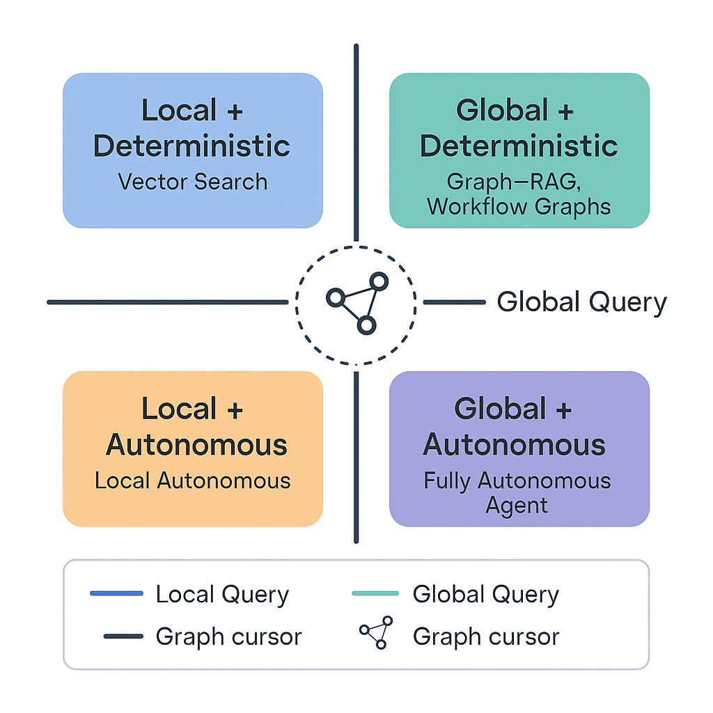
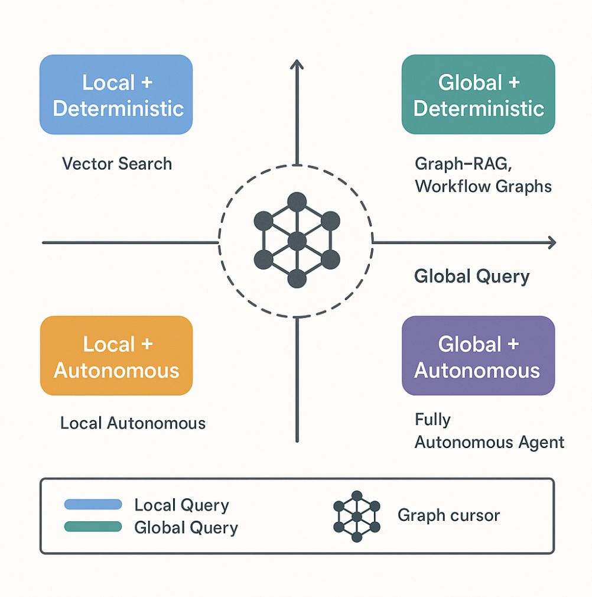

# Collection of Prompts to generate diagrams

## Prompts for Diagrams

```text
Create a clean, modern 2x2 quadrant diagram on a white background. In the center, place a stylized network or graph icon inside a dashed circle. Draw two bold axes intersecting at the center: a vertical line (no label), and a horizontal line labeled "Global Query" on the right.

Top left quadrant: blue rounded rectangle labeled "Local + Deterministic" with subtitle "Vector Search".
Top right quadrant: teal/green rounded rectangle labeled "Global + Deterministic" with subtitle "Graph–RAG, Workflow Graphs".
Bottom left quadrant: orange rounded rectangle labeled "Local + Autonomous" with subtitle "Local Autonomous".
Bottom right quadrant: purple rounded rectangle labeled "Global + Autonomous" with subtitle "Fully Autonomous Agent".

Below the diagram, add a legend in a grey outlined box:
- a blue line labeled "Local Query"
- a green line labeled "Global Query"
- the network/graph icon labeled "Graph cursor".

Use soft, readable sans-serif fonts. Keep the style minimalist, professional, and easy to read. Avoid clutter.

Format:

- Use aspect ratio 1:1
- Flat design
```

Example:




