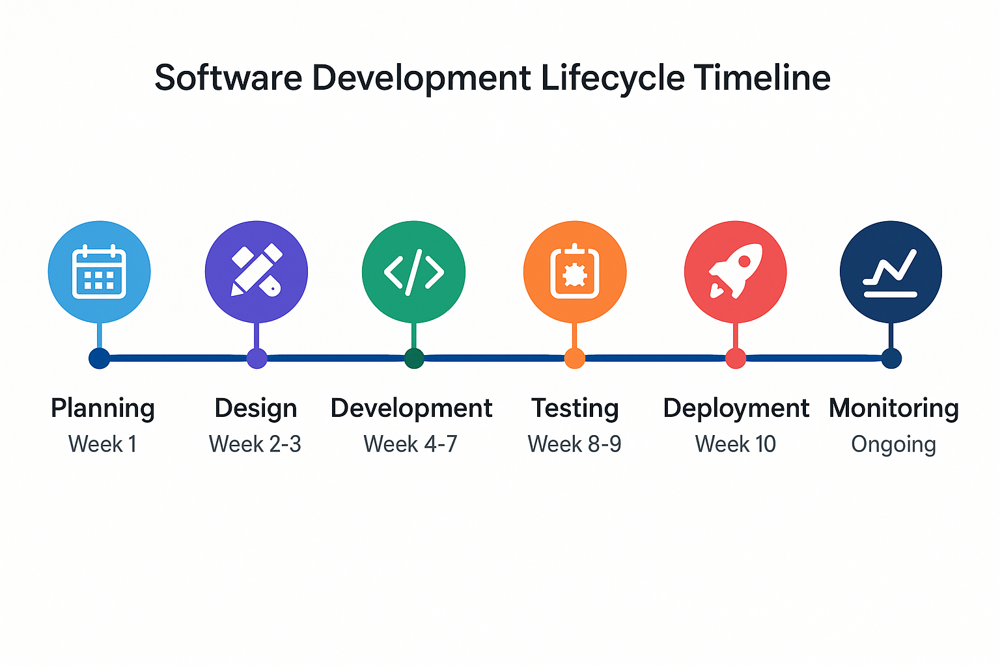

# How to create professional diagrams prompt for software engineering concepts with OpenAI and ImageGen4 

## Image Generation Models

### ImageGen4

**Model:** `ImageGen4`

DeepMind's May 2025 text-to-image model with exceptional prompt adherence, capable of generating images with great detail, rich lighting, and few distracting artifacts.

- **Aspect Ratio:** To adjust the aspect ratio, add `--aspect_ratio` (options: 1:1, 16:9, 9:16, 4:3, 3:4).
- **Language:** Non-English input will be translated first.
- **Model Served:** `imagen-4.0-ultra-generate-05-20` (Google Vertex)
- **Token Limit:** Maximum input of 480 tokens.

---

### OpenAI (ChatGPT Image Generation)

**Model:** `OpenAI Image Generation GPT-Image-1`

OpenAI's model powers image generation in ChatGPT, offering exceptional prompt adherence, level of detail, and quality. It supports editing, restyling, and combining images attached to the latest user query.

**Optional parameters:**

- `--aspect` (options: 1:1, 3:2, 2:3): Aspect ratio of the output image
- `--quality` (options: high, medium, low): Image resolution
- `--use-mask`: Indicates that the last attached image is a mask for inpainting (editing specific regions). The mask must match the dimensions of the base image, with transparent (zero-alpha) areas showing which parts to edit.

---

## Quadrant Diagram

> **When to use a quadrant diagram:**
> Use a quadrant diagram to visually compare items, strategies, or concepts across two axes or dimensions. It is ideal for highlighting relationships, trade-offs, or positioning in a clear, easy-to-understand 2x2 grid.

## Prompt for a Quadrant Diagram

```text
Create a clean, modern 2x2 quadrant diagram on a white background. In the center, place a stylized network or graph icon inside a dashed circle. Draw two bold axes intersecting at the center: a vertical line (no label), and a horizontal line labeled "Global Query" on the right.

Top left quadrant: blue rounded rectangle labeled "Local + Deterministic" with subtitle "Vector Search".
Top right quadrant: teal/green rounded rectangle labeled "Global + Deterministic" with subtitle "Graph–RAG, Workflow Graphs".
Bottom left quadrant: orange rounded rectangle labeled "Local + Autonomous" with subtitle "Local Autonomous".
Bottom right quadrant: purple rounded rectangle labeled "Global + Autonomous" with subtitle "Fully Autonomous Agent".

Below the diagram, add a legend in a grey outlined box:
- a blue line labeled "Local Query"
- a green line labeled "Global Query"
- the network/graph icon labeled "Graph cursor".

Use soft, readable sans-serif fonts. Keep the style minimalist, professional, and easy to read. Avoid clutter.

Format:

- Use aspect ratio 1:1 --aspect_ratio 1:1
- Flat design
```

Example:

**OpenAI Example:**


**ImageGen4 Example:**


## Other examples of Quadrant Diagrams

```text
Create a clean, modern 2x2 quadrant diagram on a white background. In the center, place a stylized gear icon inside a dashed circle. Draw two bold axes intersecting at the center: a vertical line labeled "High Complexity" at the top and "Low Complexity" at the bottom, and a horizontal line labeled "High Risk" on the right and "Low Risk" on the left.

Top left quadrant: blue rounded rectangle labeled "Low Risk + High Complexity" with subtitle "Refactoring Legacy Code".
Top right quadrant: red rounded rectangle labeled "High Risk + High Complexity" with subtitle "Complete System Rewrite".
Bottom left quadrant: green rounded rectangle labeled "Low Risk + Low Complexity" with subtitle "Bug Fixes & Patches".
Bottom right quadrant: orange rounded rectangle labeled "High Risk + Low Complexity" with subtitle "Third-party Integrations".

Below the diagram, add a legend in a grey outlined box:
- a blue dot labeled "Low Risk"
- a red dot labeled "High Risk"
- the gear icon labeled "Development Task".

Use soft, readable sans-serif fonts. Keep the style minimalist, professional, and easy to read. Avoid clutter.

Format:
- Use aspect 1:1
- Ensure margins at the top, left, right and bottom
- Flat design
```

Example:

### Examples

#### ImageGen4 Example


## 2. Funnel Diagram

> **When to use a funnel diagram:**
> Use a funnel diagram to show a process where quantities decrease at each stage, perfect for depicting conversion rates, filtering processes, or progressive refinement in software development pipelines.

### Prompt for a Funnel Diagram

```text
Create a clean, modern funnel diagram on a white background. Design a vertical funnel with 5 levels, each progressively narrower. Use gradient colors from dark blue at the top to light blue at the bottom.

Level 1 (widest): "Code Commits" with "1000 commits/day" in white text
Level 2: "Automated Tests Pass" with "850 commits/day" in white text
Level 3: "Code Review Approved" with "700 commits/day" in white text
Level 4: "Staging Deployment" with "600 commits/day" in white text
Level 5 (narrowest): "Production Release" with "500 commits/day" in white text

Add percentage conversion rates between levels on the right side in small grey text.
Include a title at the top: "CI/CD Pipeline Conversion Funnel"

Use soft, readable sans-serif fonts. Keep the style minimalist and professional.

Format:
- Use aspect ratio 3:4
- Flat design
- Ensure margins at the top, left, right and bottom

```

Example:

**ImageGen4 Example:**


## 3. Pyramid Diagram

> **When to use a pyramid diagram:**
> Use a pyramid diagram to show hierarchical relationships, foundations, or layered architectures where each level builds upon the previous one, ideal for software architecture layers or skill development frameworks.

### Prompt for a Pyramid Diagram

```text
Create a clean, modern pyramid diagram on a white background. Design a 4-level pyramid with each level in different colors and decreasing width from bottom to top.

Bottom level (widest): Dark blue rectangle labeled "Infrastructure Layer" with subtitle "Hardware, OS, Network"
Second level: Medium blue rectangle labeled "Platform Layer" with subtitle "Databases, Message Queues"
Third level: Light blue rectangle labeled "Application Layer" with subtitle "Business Logic, APIs"
Top level (narrowest): Teal rectangle labeled "Presentation Layer" with subtitle "UI, Mobile Apps"

Add small connecting lines between levels. Include a title above: "Software Architecture Pyramid"
Add small icons on the left side of each level representing the layer concept.

Use soft, readable sans-serif fonts. Keep the style minimalist and professional.

Format:
- Use aspect ratio 4:3
- Flat design
```

Example:

**ImageGen4 Example:**


## 5. Matrix Diagram

> **When to use a matrix diagram:**
> Use a matrix diagram to show relationships between two sets of variables, perfect for comparing features across different software solutions or mapping requirements to implementation approaches.

### Prompt for a Matrix Diagram

```text
Create a clean, modern matrix diagram on a white background. Design a 4x4 grid with clear headers.

- **Column headers (top):** "Microservices", "Monolith", "Serverless", "Container-based"
- **Row headers (left):** "Scalability", "Development Speed", "Operational Complexity", "Cost Efficiency"

**Fill in the cells with colored circles representing fit:**

                Microservices   Monolith   Serverless   Container-based
Scalability           🟢           🟡           🟢              🟢
Development Speed     🟡           🟢           🟢              🟡
Operational Complexity🟡           🟢           🟡              🟡
Cost Efficiency       🟡           🟢           🟡              🟡

**Legend:**
- 🟢 = High/Excellent fit
- 🟡 = Medium/Good fit
- 🔴 = Low/Poor fit

You excactly need to fill the cells with colored circles representing fit described above.

Add a legend below the diagram explaining the color meanings.
Include a title above: "Architecture Pattern Evaluation Matrix".

Use soft, readable sans-serif fonts and light grey grid lines for clarity.

**Format:**
- Aspect ratio 4:3
- Flat, minimalist design


```

Example:

**OpenAI Example:**


**ImageGen4 Example:**

Don't work well with ImageGen4, so use OpenAI.

## 6. Venn Diagram

> **When to use a Venn diagram:**
> Use a Venn diagram to show overlapping relationships between different sets or concepts, ideal for illustrating shared responsibilities, skill intersections, or technology compatibility areas.

### Prompt for a Venn Diagram

```text
Create a clean, modern Venn diagram on a white background. Design three overlapping circles with 50% transparency.

Left circle (blue): "Frontend Development" with items "React, CSS, UX Design"
Right circle (red): "Backend Development" with items "APIs, Databases, Security"
Bottom circle (green): "DevOps Engineering" with items "CI/CD, Monitoring, Infrastructure"

Overlap areas:
- Frontend + Backend: "Full-Stack Skills"
- Frontend + DevOps: "Frontend Tooling"
- Backend + DevOps: "System Architecture"
- Center overlap: "Software Engineering Fundamentals"

Include a title above: "Software Engineering Role Intersections"

Use soft, readable sans-serif fonts. Keep overlapping areas clearly labeled.

Format:
- Use aspect ratio 1:1
- Flat design with transparency
```

Example:

**OpenAI Example:**


**ImageGen4 Example:**


## 7. Timeline Diagram

> **When to use a timeline diagram:**
> Use a timeline diagram to show chronological progression, project phases, or evolution of software development practices, perfect for sprint planning or technology adoption roadmaps.

### Prompt for a Timeline Diagram

```text
Create a clean, modern timeline diagram on a white background. Design a horizontal timeline with 6 phases connected by a bold blue line.

Timeline points from left to right:
1. "Planning" (Week 1) - Light blue circle with calendar icon
2. "Design" (Week 2-3) - Purple circle with design icon
3. "Development" (Week 4-7) - Green circle with code icon
4. "Testing" (Week 8-9) - Orange circle with test icon
5. "Deployment" (Week 10) - Red circle with rocket icon
6. "Monitoring" (Ongoing) - Dark blue circle with chart icon

Add milestone markers below each point with week numbers.
Include title above: "Software Development Lifecycle Timeline"

Use soft, readable sans-serif fonts with consistent spacing.

Format:
- Use aspect ratio 5:2
- Flat design
```

Example:

**OpenAI Example:**



**ImageGen4 Example:**


## 8. Hierarchy Tree Diagram

> **When to use a hierarchy tree diagram:**
> Use a hierarchy tree diagram to show organizational structures, software component relationships, or decision trees, particularly useful for documenting system architectures or team structures.

### Prompt for a Hierarchy Tree Diagram

```text
Create a clean, modern hierarchy tree diagram on a white background. Design a top-down tree structure with connecting lines.

Root level: "Software Engineering Team" (large blue rectangle)
↓
Second level: Three boxes connected horizontally
- "Frontend Team" (light blue)
- "Backend Team" (green)
- "DevOps Team" (orange)

Third level under each team:
Frontend: "React Developer", "UI/UX Designer"
Backend: "API Developer", "Database Engineer"
DevOps: "Platform Engineer", "Site Reliability Engineer"

Use consistent rectangular boxes with rounded corners.
Add connecting lines between all levels in grey.
Include title above: "Engineering Team Structure"

Use soft, readable sans-serif fonts.

Format:
- Use aspect ratio 4:3
- Flat design
```

Example:

**OpenAI Example:**


**ImageGen4 Example:**

Doesn't work well with ImageGen4, so use OpenAI.

## 9. Circular Process Diagram

> **When to use a circular process diagram:**
> Use a circular process diagram to show cyclical processes, continuous improvement loops, or iterative methodologies like Agile development cycles where the end connects back to the beginning.

### Prompt for a Circular Process Diagram

```text
Create a clean, modern circular process diagram on a white background. Design a circle with 6 segments, each in different colors, connected by clockwise arrows.

Starting from top and moving clockwise:
1. "Plan" (Blue) - with planning icon
2. "Code" (Green) - with code icon
3. "Build" (Purple) - with build icon
4. "Test" (Orange) - with test icon
5. "Release" (Red) - with deployment icon
6. "Monitor" (Teal) - with monitoring icon

Add curved arrows between each segment showing clockwise flow.
Include center text: "DevOps Cycle"
Add title above: "Continuous Integration/Continuous Deployment"

Use soft, readable sans-serif fonts with clear segment divisions.

Format:
- Use aspect ratio 1:1
- Flat design
```

Example:

**OpenAI Example:**


**ImageGen4 Example:**


## 10. Scatter Plot Diagram

> **When to use a scatter plot diagram:**
> Use a scatter plot diagram to show correlations between two variables, perfect for analyzing software metrics like code complexity vs. bug frequency, or team size vs. delivery velocity.

### Prompt for a Scatter Plot Diagram

```text
Create a clean, modern scatter plot diagram on a white background. Design X and Y axes with labeled measurements.

X-axis: "Code Complexity (Cyclomatic Complexity)" from 0 to 50
Y-axis: "Bug Frequency (Bugs per 1000 LOC)" from 0 to 20

Plot approximately 15 colored dots representing different software modules:
- Green dots (low complexity, low bugs): 3-4 dots in bottom left
- Yellow dots (medium): 6-7 dots in middle area
- Red dots (high complexity, high bugs): 4-5 dots in top right

Add a trend line showing positive correlation.
Include title above: "Code Complexity vs Bug Frequency Analysis"
Add axis labels and grid lines in light grey.

Use soft, readable sans-serif fonts.

Format:
- Use aspect ratio 4:3
- Flat design
```

Example:

**OpenAI Example:**


**ImageGen4 Example:**


This represents the most strategically valuable diagram types for conveying software engineering concepts. Each serves a specific purpose in communicating complex technical relationships, processes, and decisions in a visually compelling and easily understood format. The prompts are designed to generate professional, consultant-quality diagrams that would be suitable for technical presentations, documentation, or stakeholder communications.
