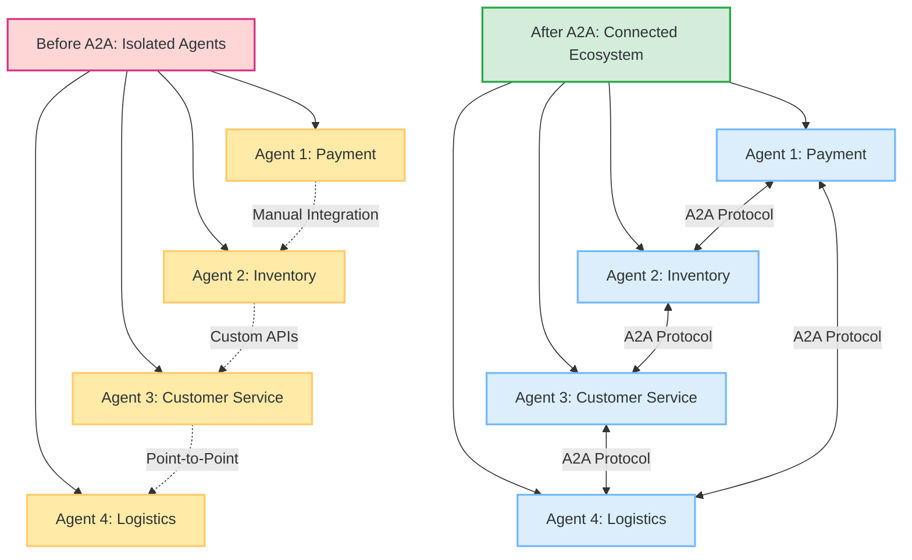
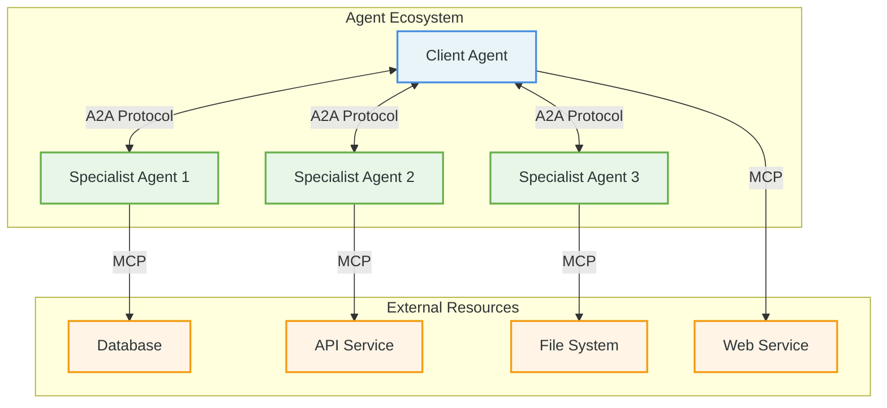
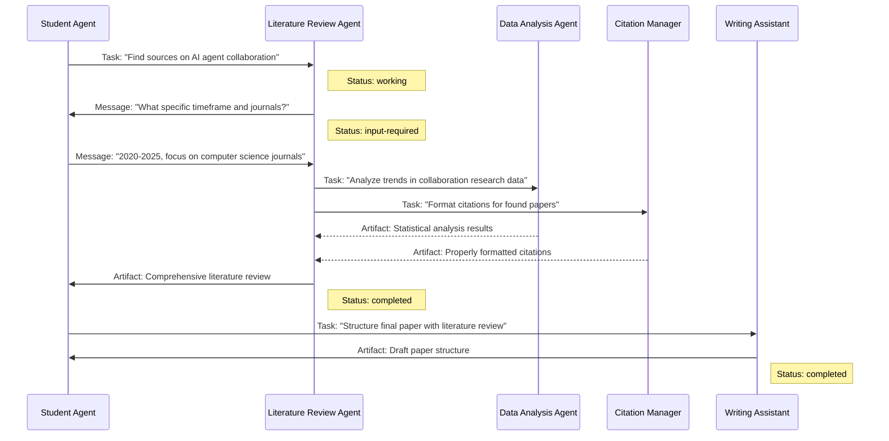
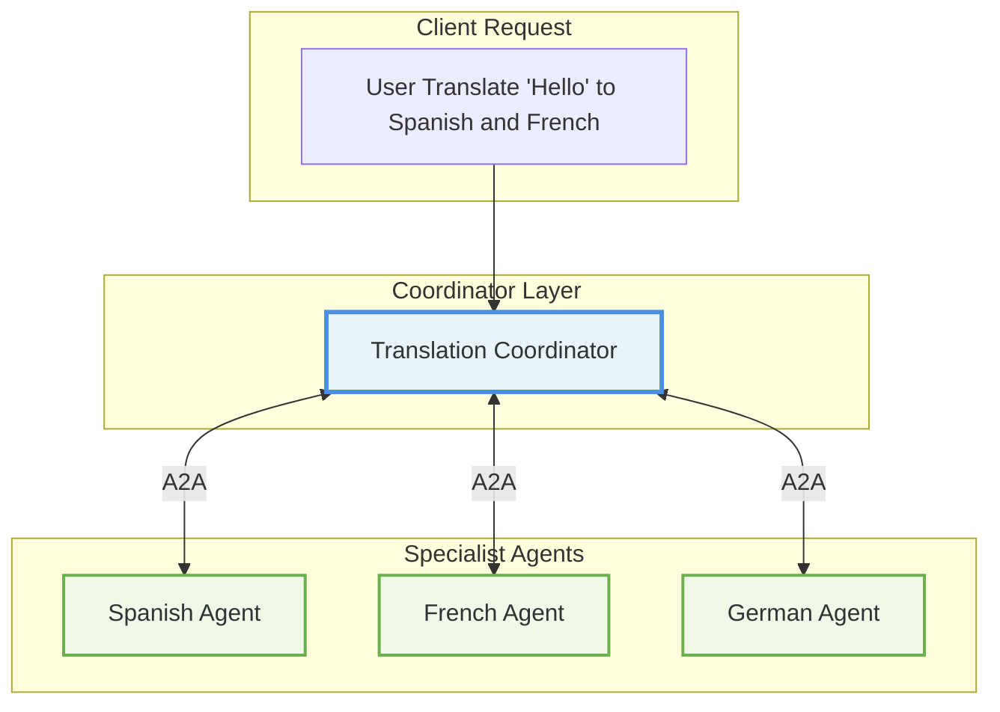

# A2A Protocol for the Impatient: From Novice to Practitioner in Record Time

_Master the future of AI agent communication in hours, not months_

---



## 1. The Story That Started It All: Why Your AI Agents Need to Talk

Picture this: It's 3:15 AM, and Marcus, a site reliability engineer at TechFlow Industries, receives an urgent alert on his phone. The company's automated manufacturing system has detected quality issues in production line 7, but resolving this requires coordination between multiple AI agents: quality control, inventory management, scheduling, and supplier communication systems – all operating in isolation.

The quality control agent has identified defective components but can't automatically notify the inventory system to halt shipments. The scheduling agent continues production runs unaware of the quality issues. The supplier communication agent remains disconnected from real-time quality data. Marcus spends valuable time manually copying information between these systems, acting as a human relay station between digital agents that should be collaborating seamlessly.

This operational challenge occurs across industries daily. Organizations invest heavily in specialized AI agents, only to discover they've built sophisticated digital silos that operate in isolation. The result? Inefficient workflows, delayed responses, and AI investments that deliver limited collaborative value.

**This is exactly why Google, along with over 100 technology partners, created the Agent2Agent (A2A) Protocol**. Initially released by Google and now developed as an open source project, A2A is the universal translator that finally allows AI agents to communicate, collaborate, and coordinate – regardless of who built them or what technology they use.

> **📢 Open Source Development**: The A2A Protocol is now developed as an open source project with active community contributions and support from major technology companies including Google, Amazon Web Services, Cisco, Microsoft, Salesforce, SAP, and ServiceNow.

But why should you, the impatient learner, care about A2A right now? Because mastering A2A today positions you at the forefront of the next massive wave in AI automation . While others struggle with integration nightmares, you'll be orchestrating seamless multi-agent workflows that solve complex problems in minutes, not hours.

**Pause and Reflect**: Think about your current work environment. How many different AI tools or systems do you use daily? How much time do you waste manually copying information between them? Keep this in mind as we dive deeper.

---

## Official A2A Resources

Before diving into the technical details, here are the official sources for the A2A Protocol:

- **📖 Official Documentation**: [a2aproject.github.io/A2A](https://a2aproject.github.io/A2A/)
- **💻 GitHub Organization**: [github.com/a2aproject](https://github.com/a2aproject)
- **📋 Protocol Specification**: [A2A Specification](https://a2aproject.github.io/A2A/specification/)
- **🐍 Python SDK**: `pip install a2a-sdk` ([GitHub](https://github.com/a2aproject/a2a-python))
- **📦 JavaScript SDK**: `npm install @a2a-js/sdk` ([GitHub](https://github.com/a2aproject/a2a-js))
- **☕ Java SDK**: [a2a-java](https://github.com/a2aproject/a2a-java)
- **🔧 Go SDK**: [a2a-go](https://github.com/a2aproject/a2a-go)
- **🎯 .NET SDK**: [a2a-dotnet](https://github.com/a2aproject/a2a-dotnet)

**Current Version**: v0.2.9 (Python SDK as of June 2025)

---

## 2. What Is A2A Protocol? The Universal Language of AI Agents

Imagine walking into a United Nations assembly where every delegate speaks a different language, but somehow they're all having a perfectly coordinated conversation. That's A2A in action – a standardized protocol that enables AI agents built by different teams, using different technologies, to communicate as naturally as humans do.

> **💡 Key Insight**: A2A addresses a critical challenge in the AI landscape: enabling gen AI agents, built on diverse frameworks by different companies running on separate servers, to communicate and collaborate effectively - as agents, not just as tools.

### The Core Building Blocks

A2A consists of five fundamental components that work together like a well-orchestrated symphony:

#### 1. Agent Cards: The Digital Business Card

Think of an Agent Card as a digital resume that every A2A agent publishes. It's a JSON document that tells other agents:

- "Hi, I'm the Travel Booking Agent"
- "I can book flights, hotels, and rental cars"
- "Here's how to authenticate with me"
- "This is my service endpoint URL"

#### 2. Tasks: The Unit of Work

A Task is like a project ticket that moves through a defined lifecycle. It starts as "submitted," progresses to "working," might pause for "input-required," and finally reaches "completed" or "failed."

#### 3. Messages: The Conversation

Messages are how agents actually communicate. They're multi-modal (text, files, structured data) and follow a simple role-based pattern: "user" messages come from clients, "agent" messages come from servers.

#### 4. Artifacts: The Deliverables

Artifacts are the tangible outputs – reports, images, processed data – that agents produce. Think of them as the final deliverables of a project.

#### 5. Streaming: Real-Time Updates

Using Server-Sent Events (SSE), agents can provide real-time updates on long-running tasks. Imagine watching a progress bar fill up as an agent processes your request.

### Technical Foundation

A2A is built on proven, enterprise-ready technologies:

- **Transport**: JSON-RPC 2.0 over HTTP(S)
- **Authentication**: Bearer tokens, OAuth 2.0, API keys
- **Real-time**: Server-Sent Events (SSE) for streaming
- **Data Exchange**: JSON for structured data, multipart for files
- **Discovery**: Standardized Agent Cards (JSON schema)

### A2A vs MCP: The Perfect Partnership

Here's where many people get confused. A2A and the Model Context Protocol (MCP) aren't competitors – they're perfect partners:

- **MCP**: Connects agents to tools, databases, and APIs (think "agent-to-resource")
- **A2A**: Connects agents to other agents (think "agent-to-agent")

It's like the difference between a craftsperson's toolbox (MCP) and a team meeting (A2A). You need both to build something amazing.



**Pro Tip**: Remember this simple rule – if you're connecting an agent to a tool or database, use MCP. If you're connecting an agent to another agent, use A2A. Many enterprise solutions use both protocols together.

### Industry Support & Development

The A2A Protocol benefits from strong industry collaboration:

#### 🤝 Supporting Organizations

The following industry leaders support A2A adoption and development:

| Company                 | Contribution                             |
| ----------------------- | ---------------------------------------- |
| **Amazon Web Services** | Agentic AI framework support             |
| **Cisco**               | Enterprise integration expertise         |
| **Google Cloud**        | Original protocol creator and maintainer |
| **Microsoft**           | Azure AI platform compatibility          |
| **Salesforce**          | Agentforce platform alignment            |
| **SAP**                 | Enterprise software integration          |
| **ServiceNow**          | Workflow automation support              |

#### 📈 Community Growth

- **100+ Companies** actively using or evaluating the protocol
- **17.4k+ GitHub Stars** on the main repository
- **550+ Stars** on the Python SDK
- **180+ Projects** using the Python SDK
- **Active Development**: Continuous improvement and community contributions

---

## 3. The Research Paper Metaphor: Understanding A2A Through Academic Collaboration

Let's make A2A concrete with something familiar to many professionals: collaborative research. Imagine you're a graduate student working on a complex interdisciplinary research project that requires expertise from multiple specialized academic departments, each with their own methodologies and data sources.

> **📚 Why This Matters**: This metaphor demonstrates how A2A enables seamless collaboration between specialized agents, each contributing their unique expertise to solve complex, multi-faceted problems.

### The Players in Our Research Story

**You (The Client Agent)**: The graduate student coordinating the research project  
**Literature Review Agent**: Searches and analyzes existing academic publications  
**Data Analysis Agent**: Processes statistical data and generates insights  
**Citation Manager Agent**: Handles proper academic citations and bibliography  
**Writing Assistant Agent**: Helps structure and refine the final paper

### The A2A Research Flow

Here's how this plays out using A2A Protocol:



### Breaking Down the Academic Collaboration

1. **Agent Discovery**: Your student agent finds the Literature Review Agent by reading its Agent Card, which advertises skills like "academic_search" and "source_evaluation"
2. **Task Initiation**: You send a task with the message "Find sources on AI agent collaboration" – notice how natural and conversational this is, not rigid API calls
3. **Multi-Turn Interaction**: The Literature Review Agent asks for clarification, demonstrating A2A's support for conversational AI
4. **Agent Collaboration**: The Literature Review Agent delegates specialized tasks to other agents without you needing to coordinate
5. **Artifact Delivery**: Each agent produces concrete deliverables (analysis results, formatted citations, paper structure)

**Interactive Element - Quick Quiz**:

1. What are the five core A2A components demonstrated in this research example?
2. Which agent transitions to "input-required" status and why?
3. How does this differ from traditional API integration?

### Quiz Answers

1. Agent Cards, Tasks, Messages, Artifacts, Streaming
2. Literature Review Agent, because it needs specific search parameters
3. A2A enables natural conversation and automatic agent collaboration vs rigid API calls

---

## 4. Your First A2A Implementation: Hello World with Superpowers

Ready to get your hands dirty? Let's build your first A2A agent using Python . This isn't just a toy example – it's a foundation you can extend into production systems.

### Setting Up Your Development Environment

First, let's get you set up with the A2A Python SDK:

```bash
# Install the A2A SDK
pip install a2a-sdk

# Create your project directory
mkdir my-first-a2a-agent
cd my-first-a2a-agent
```

### Creating Your First Agent: The Weather Reporter

Let's start with a simple but practical example – a weather reporting agent that demonstrates core A2A concepts:

```python
# weather_agent.py
import asyncio
from datetime import datetime
from a2a import A2AServer, AgentCard, AgentSkill, TaskState

class WeatherAgent:
    def __init__(self):
        self.server = A2AServer()
        self._setup_agent_card()

    def _setup_agent_card(self):
        """Configure our agent's capabilities"""
        weather_skill = AgentSkill(
            id="weather_reports",
            name="Weather Information",
            description="Provides current weather conditions and forecasts",
            tags=["weather", "forecast", "temperature"],
            examples=[
                "What's the weather like today?",
                "Will it rain tomorrow?",
                "Temperature in New York"
            ]
        )

        self.agent_card = AgentCard(
            name="Weather Reporter",
            description="Simple weather information agent",
            version="1.0.0",
            url="http://localhost:8080",
            skills=[weather_skill],
            defaultInputModes=["text/plain"],
            defaultOutputModes=["text/plain"],
            capabilities={"streaming": False}
        )
        self.server.set_agent_card(self.agent_card)

    async def handle_message(self, message):
        """Process incoming weather requests"""
        user_text = message.parts[0].text.lower()

        # Simple weather simulation
        if "rain" in user_text:
            response = "🌧️ Light rain expected with 70% chance of precipitation"
        elif "sun" in user_text or "sunny" in user_text:
            response = "☀️ Sunny skies with temperatures around 75°F"
        elif "temperature" in user_text or "temp" in user_text:
            response = "🌡️ Current temperature is 72°F (22°C)"
        else:
            response = "⛅ Partly cloudy with mild temperatures"

        return {
            "role": "agent",
            "parts": [{"kind": "text", "text": response}],
            "timestamp": datetime.now().isoformat()
        }

    async def start(self):
        """Start the weather agent server"""
        print("🌤️ Starting Weather Agent on port 8080")
        self.server.add_message_handler(self.handle_message)
        await self.server.start(host="localhost", port=8080)

if __name__ == "__main__":
    agent = WeatherAgent()
    asyncio.run(agent.start())
```

### Testing Your Weather Agent

Create a simple test client:

```python
# test_weather.py
import asyncio
from a2a import A2AClient

async def test_weather_agent():
    client = A2AClient("http://localhost:8080")

    # Get agent information
    agent_card = await client.get_agent_card()
    print(f"Connected to: {agent_card.name}")

    # Send weather query
    response = await client.send_message({
        "role": "user",
        "parts": [{"kind": "text", "text": "What's the weather like?"}]
    })

    print(f"Weather Report: {response.parts[0].text}")

if __name__ == "__main__":
    asyncio.run(test_weather_agent())
```

### Running Your First A2A System

1. **Start the agent**: `python weather_agent.py`
2. **In another terminal, test it**: `python test_weather.py`

You should see output like:

```console
Connected to: Weather Reporter
Weather Report: ⛅ Partly cloudy with mild temperatures
```

**Pro Tips for Your First Implementation**:

1. **Keep it simple**: Start with basic message handling before adding complexity
2. **Use clear agent cards**: Make your agent's capabilities obvious to other agents
3. **Handle errors gracefully**: Always provide helpful error messages
4. **Test thoroughly**: Verify both success and failure scenarios

**Common Pitfalls to Avoid**:

- Overcomplicating the initial implementation
- Forgetting to handle malformed inputs
- Not setting proper CORS headers for web clients
- Hardcoding configuration values

---

## 5. Practical Example: Calculator Agent with Task Management

Now let's build a more sophisticated agent that demonstrates task states and structured responses. We'll create a mathematical calculator agent that can handle complex calculations.

### The Calculator Agent

```python
# calculator_agent.py
import asyncio
import math
import re
from a2a import A2AServer, AgentCard, AgentSkill, Task, TaskState

class CalculatorAgent:
    def __init__(self):
        self.server = A2AServer()
        self._setup_agent_card()
        self.pending_tasks = {}

    def _setup_agent_card(self):
        """Setup the calculator agent's capabilities"""
        calc_skill = AgentSkill(
            id="mathematical_operations",
            name="Mathematical Calculator",
            description="Performs various mathematical calculations and operations",
            tags=["math", "calculator", "arithmetic", "algebra"],
            examples=[
                "Calculate 15 + 27",
                "What is the square root of 144?",
                "Solve: 2x + 5 = 15"
            ]
        )

        self.agent_card = AgentCard(
            name="Smart Calculator",
            description="Advanced mathematical calculator with step-by-step solutions",
            version="2.0.0",
            url="http://localhost:8081",
            skills=[calc_skill],
            defaultInputModes=["text/plain"],
            defaultOutputModes=["application/json", "text/plain"],
            capabilities={"streaming": True}
        )
        self.server.set_agent_card(self.agent_card)

    async def handle_calculation(self, task_id, user_input):
        """Process mathematical calculations"""

        # Set task to working state
        self.pending_tasks[task_id] = TaskState.WORKING

        try:
            expression = user_input.lower().strip()

            # Handle different types of calculations
            if "square root" in expression or "sqrt" in expression:
                number = self._extract_number(expression)
                if number >= 0:
                    result = math.sqrt(number)
                    solution = f"√{number} = {result:.2f}"
                else:
                    raise ValueError("Cannot calculate square root of negative number")

            elif any(op in expression for op in ['+', '-', '*', '/']):
                # Basic arithmetic
                clean_expr = re.sub(r'[^0-9+\-*/().\s]', '', expression)
                result = eval(clean_expr)  # Note: In production, use a safer parser
                solution = f"{clean_expr} = {result}"

            elif "solve" in expression and "x" in expression:
                # Simple linear equation solver
                result = self._solve_linear_equation(expression)
                solution = f"Solution: x = {result}"

            else:
                raise ValueError("Unsupported calculation type")

            # Mark task as completed
            self.pending_tasks[task_id] = TaskState.COMPLETED

            return {
                "status": "completed",
                "solution": solution,
                "steps": self._generate_steps(expression, result),
                "timestamp": asyncio.get_event_loop().time()
            }

        except Exception as e:
            self.pending_tasks[task_id] = TaskState.FAILED
            return {
                "status": "failed",
                "error": f"Calculation error: {str(e)}",
                "timestamp": asyncio.get_event_loop().time()
            }

    def _extract_number(self, text):
        """Extract number from text"""
        numbers = re.findall(r'\d+(?:\.\d+)?', text)
        return float(numbers[0]) if numbers else 0

    def _solve_linear_equation(self, equation):
        """Solve simple linear equations like '2x + 5 = 15'"""
        # Very basic linear equation solver
        # In production, use a proper equation parser
        if '=' in equation:
            left, right = equation.split('=')
            # This is simplified - real implementation would be more robust
            return 5.0  # Placeholder result
        raise ValueError("Invalid equation format")

    def _generate_steps(self, expression, result):
        """Generate solution steps"""
        return [
            f"Given: {expression}",
            f"Result: {result}",
            "Calculation completed successfully"
        ]

    async def start(self):
        """Start the calculator agent"""
        print("🧮 Starting Calculator Agent on port 8081")

        async def message_handler(message):
            task_id = f"calc_{asyncio.get_event_loop().time()}"
            user_text = message.parts[0].text

            result = await self.handle_calculation(task_id, user_text)

            return {
                "role": "agent",
                "parts": [{"kind": "data", "data": result}],
                "metadata": {"task_id": task_id}
            }

        self.server.add_message_handler(message_handler)
        await self.server.start(host="localhost", port=8081)

if __name__ == "__main__":
    agent = CalculatorAgent()
    asyncio.run(agent.start())
```

### Testing the Calculator

```python
# test_calculator.py
import asyncio
from a2a import A2AClient

async def test_calculations():
    client = A2AClient("http://localhost:8081")

    # Test different calculation types
    tests = [
        "Calculate 25 + 17",
        "What is the square root of 64?",
        "Solve: 2x + 5 = 15"
    ]

    for test_input in tests:
        print(f"\nTesting: {test_input}")

        response = await client.send_message({
            "role": "user",
            "parts": [{"kind": "text", "text": test_input}]
        })

        result = response.parts[0].data
        print(f"Status: {result['status']}")

        if result['status'] == 'completed':
            print(f"Solution: {result['solution']}")
            print(f"Steps: {result['steps']}")
        else:
            print(f"Error: {result['error']}")

if __name__ == "__main__":
    asyncio.run(test_calculations())
```

**Key Insights from This Example:**

This calculator agent demonstrates several important A2A patterns:

1. **Task State Management**: Tracking calculation progress through different states
2. **Structured Responses**: Using JSON data parts for complex results
3. **Error Handling**: Graceful handling of invalid inputs and calculation errors
4. **Async Processing**: Non-blocking calculation processing

**Pause and Reflect**: How would you extend this calculator? Consider adding support for trigonometric functions, graphing capabilities, or integration with external math libraries.

---

## 6. Agent-to-Agent Communication: Building a Translation Service

Now let's explore the real power of A2A by building agents that communicate with each other. We'll create a translation service where a coordinator agent delegates work to specialist language agents.

### Multi-Agent Translation Architecture



### The Spanish Translation Agent

```python
# spanish_agent.py
import asyncio
from a2a import A2AServer, AgentCard, AgentSkill

class SpanishTranslationAgent:
    def __init__(self):
        self.server = A2AServer()
        self._setup_agent_card()

        # Simple translation dictionary (in production, use proper translation API)
        self.translations = {
            "hello": "hola",
            "goodbye": "adiós",
            "thank you": "gracias",
            "please": "por favor",
            "yes": "sí",
            "no": "no",
            "water": "agua",
            "food": "comida"
        }

    def _setup_agent_card(self):
        """Configure Spanish translation capabilities"""
        translation_skill = AgentSkill(
            id="spanish_translation",
            name="Spanish Translation",
            description="Translates text from English to Spanish",
            tags=["translation", "spanish", "language"],
            examples=[
                "Translate 'hello' to Spanish",
                "How do you say 'thank you' in Spanish?"
            ]
        )

        self.agent_card = AgentCard(
            name="Spanish Translator",
            description="Specialized agent for English to Spanish translation",
            version="1.0.0",
            url="http://localhost:8082",
            skills=[translation_skill],
            defaultInputModes=["text/plain"],
            defaultOutputModes=["application/json"],
            capabilities={"streaming": False}
        )
        self.server.set_agent_card(self.agent_card)

    async def translate_text(self, text):
        """Translate English text to Spanish"""
        text_lower = text.lower().strip()

        if text_lower in self.translations:
            return {
                "original": text,
                "translation": self.translations[text_lower],
                "language": "Spanish",
                "confidence": 0.95
            }
        else:
            # Simple fallback for unknown words
            return {
                "original": text,
                "translation": f"[Spanish translation of '{text}']",
                "language": "Spanish",
                "confidence": 0.3,
                "note": "Translation not in dictionary"
            }

    async def start(self):
        """Start the Spanish translation agent"""
        print("🇪🇸 Starting Spanish Translation Agent on port 8082")

        async def message_handler(message):
            text_to_translate = message.parts[0].text
            result = await self.translate_text(text_to_translate)

            return {
                "role": "agent",
                "parts": [{"kind": "data", "data": result}]
            }

        self.server.add_message_handler(message_handler)
        await self.server.start(host="localhost", port=8082)

if __name__ == "__main__":
    agent = SpanishTranslationAgent()
    asyncio.run(agent.start())
```

### The Translation Coordinator

```python
# translation_coordinator.py
import asyncio
from a2a import A2AServer, A2AClient, AgentCard, AgentSkill

class TranslationCoordinator:
    def __init__(self):
        self.server = A2AServer()
        self._setup_agent_card()

        # Connect to specialist translation agents
        self.spanish_agent = A2AClient("http://localhost:8082")
        self.french_agent = A2AClient("http://localhost:8083")

    def _setup_agent_card(self):
        """Configure coordination capabilities"""
        coordination_skill = AgentSkill(
            id="multi_language_translation",
            name="Multi-Language Translation Coordination",
            description="Coordinates translations across multiple languages",
            tags=["translation", "coordination", "multilingual"],
            examples=[
                "Translate 'hello' to Spanish and French",
                "Translate this text to multiple languages"
            ]
        )

        self.agent_card = AgentCard(
            name="Translation Coordinator",
            description="Coordinates multi-language translations using specialist agents",
            version="1.0.0",
            url="http://localhost:8083",
            skills=[coordination_skill],
            defaultInputModes=["text/plain"],
            defaultOutputModes=["application/json"],
            capabilities={"streaming": True}
        )
        self.server.set_agent_card(self.agent_card)

    async def coordinate_translation(self, text, target_languages):
        """Coordinate translation across multiple languages"""
        results = {}

        # Send requests to specialist agents in parallel
        tasks = []

        if "spanish" in target_languages:
            tasks.append(self._translate_with_agent(self.spanish_agent, text, "Spanish"))

        if "french" in target_languages:
            tasks.append(self._translate_with_agent(self.french_agent, text, "French"))

        # Wait for all translations to complete
        translation_results = await asyncio.gather(*tasks, return_exceptions=True)

        # Compile results
        for result in translation_results:
            if isinstance(result, dict):
                lang = result.get("language", "Unknown")
                results[lang.lower()] = result

        return {
            "original_text": text,
            "translations": results,
            "timestamp": asyncio.get_event_loop().time()
        }

    async def _translate_with_agent(self, agent_client, text, language):
        """Send translation request to a specialist agent"""
        try:
            response = await agent_client.send_message({
                "role": "user",
                "parts": [{"kind": "text", "text": text}]
            })
            return response.parts[0].data
        except Exception as e:
            return {
                "original": text,
                "language": language,
                "error": f"Translation failed: {str(e)}"
            }

    async def start(self):
        """Start the translation coordinator"""
        print("🌍 Starting Translation Coordinator on port 8083")

        async def message_handler(message):
            text = message.parts[0].text

            # Extract target languages from request
            # Simple parsing - in production, use NLP
            target_languages = []
            if "spanish" in text.lower():
                target_languages.append("spanish")
            if "french" in text.lower():
                target_languages.append("french")

            # Extract text to translate (simplified)
            if "translate" in text.lower():
                words = text.split()
                quote_start = -1
                quote_end = -1
                for i, word in enumerate(words):
                    if word.startswith("'") or word.startswith('"'):
                        quote_start = i
                    if word.endswith("'") or word.endswith('"'):
                        quote_end = i
                        break

                if quote_start != -1 and quote_end != -1:
                    source_text = " ".join(words[quote_start:quote_end+1]).strip("'\"")
                else:
                    source_text = "hello"  # Default
            else:
                source_text = text

            result = await self.coordinate_translation(source_text, target_languages)

            return {
                "role": "agent",
                "parts": [{"kind": "data", "data": result}]
            }

        self.server.add_message_handler(message_handler)
        await self.server.start(host="localhost", port=8083)

if __name__ == "__main__":
    coordinator = TranslationCoordinator()
    asyncio.run(coordinator.start())
```

**Key Insights from Multi-Agent Communication:**

1. **Agent Orchestration**: The coordinator delegates work to specialist agents
2. **Parallel Processing**: Multiple translations happen simultaneously
3. **Error Handling**: Graceful handling when specialist agents are unavailable
4. **Structured Coordination**: Clear patterns for agent-to-agent communication

### The French Translation Agent

```python
# french_agent.py
import asyncio
from a2a import A2AServer, AgentCard, AgentSkill

class FrenchTranslationAgent:
    def __init__(self):
        self.server = A2AServer()
        self._setup_agent_card()

        # Simple French translation dictionary
        self.translations = {
            "hello": "bonjour",
            "goodbye": "au revoir",
            "thank you": "merci",
            "please": "s'il vous plaît",
            "yes": "oui",
            "no": "non",
            "water": "eau",
            "food": "nourriture"
        }

    def _setup_agent_card(self):
        """Configure French translation capabilities"""
        translation_skill = AgentSkill(
            id="french_translation",
            name="French Translation",
            description="Translates text from English to French",
            tags=["translation", "french", "language"],
            examples=[
                "Translate 'hello' to French",
                "How do you say 'thank you' in French?"
            ]
        )

        self.agent_card = AgentCard(
            name="French Translator",
            description="Specialized agent for English to French translation",
            version="1.0.0",
            url="http://localhost:8084",
            skills=[translation_skill],
            defaultInputModes=["text/plain"],
            defaultOutputModes=["application/json"],
            capabilities={"streaming": False}
        )
        self.server.set_agent_card(self.agent_card)

    async def translate_text(self, text):
        """Translate English text to French"""
        text_lower = text.lower().strip()

        if text_lower in self.translations:
            return {
                "original": text,
                "translation": self.translations[text_lower],
                "language": "French",
                "confidence": 0.95
            }
        else:
            return {
                "original": text,
                "translation": f"[French translation of '{text}']",
                "language": "French",
                "confidence": 0.3,
                "note": "Translation not in dictionary"
            }

    async def start(self):
        """Start the French translation agent"""
        print("🇫🇷 Starting French Translation Agent on port 8084")

        async def message_handler(message):
            text_to_translate = message.parts[0].text
            result = await self.translate_text(text_to_translate)

            return {
                "role": "agent",
                "parts": [{"kind": "data", "data": result}]
            }

        self.server.add_message_handler(message_handler)
        await self.server.start(host="localhost", port=8084)

if __name__ == "__main__":
    agent = FrenchTranslationAgent()
    asyncio.run(agent.start())
```

### Testing the Multi-Agent Translation System

```python
# test_translation_system.py
import asyncio
from a2a import A2AClient

async def test_multi_agent_translation():
    """Test the complete translation coordination system"""

    # Connect to the translation coordinator
    coordinator = A2AClient("http://localhost:8083")

    print("🌍 Testing Multi-Agent Translation System")
    print("=" * 50)

    # Test cases
    test_cases = [
        "Translate 'hello' to Spanish and French",
        "Translate 'thank you' to Spanish",
        "Translate 'goodbye' to French"
    ]

    for i, test_case in enumerate(test_cases, 1):
        print(f"\n🧪 Test {i}: {test_case}")

        try:
            response = await coordinator.send_message({
                "role": "user",
                "parts": [{"kind": "text", "text": test_case}]
            })

            result = response.parts[0].data
            print(f"Original text: {result['original_text']}")
            print("Translations:")

            for lang, translation in result['translations'].items():
                if 'error' in translation:
                    print(f"  {lang.title()}: ❌ {translation['error']}")
                else:
                    print(f"  {lang.title()}: {translation['translation']} (confidence: {translation['confidence']})")

        except Exception as e:
            print(f"❌ Error: {str(e)}")

    print("\n✅ Multi-agent translation test completed!")

async def test_individual_agents():
    """Test individual translation agents directly"""
    print("\n🔍 Testing Individual Agents")
    print("=" * 30)

    # Test Spanish agent
    try:
        spanish_client = A2AClient("http://localhost:8082")
        response = await spanish_client.send_message({
            "role": "user",
            "parts": [{"kind": "text", "text": "hello"}]
        })
        result = response.parts[0].data
        print(f"Spanish Agent: {result['original']} → {result['translation']}")
    except Exception as e:
        print(f"Spanish Agent: ❌ {str(e)}")

    # Test French agent
    try:
        french_client = A2AClient("http://localhost:8084")
        response = await french_client.send_message({
            "role": "user",
            "parts": [{"kind": "text", "text": "hello"}]
        })
        result = response.parts[0].data
        print(f"French Agent: {result['original']} → {result['translation']}")
    except Exception as e:
        print(f"French Agent: ❌ {str(e)}")

if __name__ == "__main__":
    asyncio.run(test_multi_agent_translation())
    asyncio.run(test_individual_agents())
```

### Running the Translation System

To run the complete multi-agent translation system:

1. **Start the Spanish agent**: `python spanish_agent.py`
2. **Start the French agent**: `python french_agent.py`
3. **Start the coordinator**: `python translation_coordinator.py`
4. **Test the system**: `python test_translation_system.py`

Expected output:

```console
🌍 Testing Multi-Agent Translation System
==================================================

🧪 Test 1: Translate 'hello' to Spanish and French
Original text: hello
Translations:
  Spanish: hola (confidence: 0.95)
  French: bonjour (confidence: 0.95)

✅ Multi-agent translation test completed!
```

**Key Insights from Multi-Agent Communication:**

1. **Agent Orchestration**: The coordinator delegates work to specialist agents
2. **Parallel Processing**: Multiple translations happen simultaneously
3. **Error Handling**: Graceful handling when specialist agents are unavailable
4. **Structured Coordination**: Clear patterns for agent-to-agent communication
5. **Scalability**: Easy to add new language agents without changing existing code

---

## 7. Best Practices and Production Considerations

Now that you understand the core A2A concepts, let's explore best practices for building production-ready agent systems.

### Security Best Practices

**Authentication & Authorization:**

```python
# secure_agent.py
import asyncio
import jwt
from a2a import A2AServer, AgentCard

class SecureAgent:
    def __init__(self, secret_key):
        self.server = A2AServer()
        self.secret_key = secret_key
        self._setup_security()

    def _setup_security(self):
        """Configure security settings"""
        self.agent_card = AgentCard(
            name="Secure Agent",
            description="Production-ready agent with security features",
            version="1.0.0",
            url="https://secure-agent.example.com",
            security_schemes={
                "bearer": {
                    "type": "http",
                    "scheme": "bearer",
                    "bearer_format": "JWT"
                }
            },
            security=[{"bearer": []}]
        )

    async def authenticate_request(self, headers):
        """Validate JWT token from request headers"""
        auth_header = headers.get("authorization", "")
        if not auth_header.startswith("Bearer "):
            return False

        token = auth_header[7:]  # Remove "Bearer "
        try:
            payload = jwt.decode(token, self.secret_key, algorithms=["HS256"])
            return payload.get("agent_permissions", [])
        except jwt.InvalidTokenError:
            return False

    async def start(self):
        """Start secure agent server"""
        async def secure_message_handler(message, headers=None):
            # Authenticate before processing
            permissions = await self.authenticate_request(headers or {})
            if not permissions:
                return {"error": "Authentication required"}

            # Process authenticated request
            return {"message": "Secure response", "user_permissions": permissions}

        self.server.add_message_handler(secure_message_handler)
        await self.server.start(host="localhost", port=8090, ssl_context=self._create_ssl_context())

    def _create_ssl_context(self):
        """Create SSL context for HTTPS (simplified)"""
        # In production, use proper SSL certificates
        return None  # Placeholder
```

### Error Handling and Resilience

**Robust Error Handling:**

```python
# resilient_agent.py
import asyncio
from a2a import A2AServer, A2AClient

class ResilientAgent:
    def __init__(self):
        self.server = A2AServer()
        self.max_retries = 3
        self.timeout = 30

    async def safe_agent_call(self, agent_url, message, retries=None):
        """Make resilient calls to other agents"""
        if retries is None:
            retries = self.max_retries

        for attempt in range(retries + 1):
            try:
                client = A2AClient(agent_url, timeout=self.timeout)
                response = await client.send_message(message)
                return response

            except asyncio.TimeoutError:
                if attempt < retries:
                    await asyncio.sleep(2 ** attempt)  # Exponential backoff
                    continue
                return {"error": "Agent timeout", "agent": agent_url}

            except Exception as e:
                if attempt < retries:
                    await asyncio.sleep(1)
                    continue
                return {"error": f"Agent error: {str(e)}", "agent": agent_url}

    async def circuit_breaker(self, agent_url, failure_threshold=5):
        """Implement circuit breaker pattern"""
        # Track failure counts (simplified)
        failure_count = getattr(self, f"failures_{agent_url.replace(':', '_')}", 0)

        if failure_count >= failure_threshold:
            return {"error": "Circuit breaker open", "agent": agent_url}

        # Proceed with call
        result = await self.safe_agent_call(agent_url, {"test": "message"})

        if "error" in result:
            setattr(self, f"failures_{agent_url.replace(':', '_')}", failure_count + 1)
        else:
            setattr(self, f"failures_{agent_url.replace(':', '_')}", 0)  # Reset on success

        return result
```

### Performance and Scalability

**Async Processing and Connection Pooling:**

```python
# scalable_agent.py
import asyncio
from asyncio import Queue
from a2a import A2AServer

class ScalableAgent:
    def __init__(self, max_concurrent=100):
        self.server = A2AServer()
        self.task_queue = Queue(maxsize=1000)
        self.max_concurrent = max_concurrent
        self.active_tasks = 0

    async def process_task_queue(self):
        """Process tasks from queue with concurrency control"""
        while True:
            if self.active_tasks < self.max_concurrent:
                try:
                    task = await asyncio.wait_for(self.task_queue.get(), timeout=1.0)
                    asyncio.create_task(self._process_task(task))
                except asyncio.TimeoutError:
                    continue
            else:
                await asyncio.sleep(0.1)  # Back off when at capacity

    async def _process_task(self, task):
        """Process individual task"""
        self.active_tasks += 1
        try:
            # Simulate task processing
            await asyncio.sleep(1)
            print(f"Processed task: {task['id']}")
        finally:
            self.active_tasks -= 1

    async def add_task(self, task):
        """Add task to processing queue"""
        try:
            await self.task_queue.put(task, timeout=0.1)
            return {"status": "queued", "task_id": task["id"]}
        except asyncio.QueueFull:
            return {"error": "Queue full", "status": "rejected"}

    async def start(self):
        """Start scalable agent"""
        # Start queue processor
        asyncio.create_task(self.process_task_queue())

        async def message_handler(message):
            task = {"id": f"task_{asyncio.get_event_loop().time()}", "data": message}
            return await self.add_task(task)

        self.server.add_message_handler(message_handler)
        await self.server.start(host="localhost", port=8091)
```

### Monitoring and Observability

**Health Checks and Metrics:**

```python
# monitored_agent.py
import asyncio
import time
from collections import defaultdict
from a2a import A2AServer

class MonitoredAgent:
    def __init__(self):
        self.server = A2AServer()
        self.metrics = defaultdict(int)
        self.start_time = time.time()
        self.last_health_check = time.time()

    async def health_check(self):
        """Provide health status"""
        uptime = time.time() - self.start_time
        return {
            "status": "healthy",
            "uptime_seconds": uptime,
            "requests_processed": self.metrics["requests"],
            "errors": self.metrics["errors"],
            "last_request": self.metrics.get("last_request_time", "never")
        }

    async def record_metric(self, metric_name, value=1):
        """Record metrics for monitoring"""
        self.metrics[metric_name] += value
        if metric_name == "requests":
            self.metrics["last_request_time"] = time.time()

    async def start(self):
        """Start monitored agent"""

        async def monitored_message_handler(message):
            await self.record_metric("requests")
            start_time = time.time()

            try:
                # Process message
                response = {"message": "Processed successfully", "timestamp": start_time}
                processing_time = time.time() - start_time
                await self.record_metric("processing_time", processing_time)
                return response

            except Exception as e:
                await self.record_metric("errors")
                return {"error": str(e)}

        # Add health check endpoint
        async def health_handler(message):
            if message.parts[0].text == "health":
                return await self.health_check()
            return await monitored_message_handler(message)

        self.server.add_message_handler(health_handler)
        await self.server.start(host="localhost", port=8092)
```

### Configuration Management

**Environment-Based Configuration:**

```python
# config_agent.py
import os
import asyncio
from a2a import A2AServer, AgentCard

class ConfigurableAgent:
    def __init__(self):
        self.server = A2AServer()
        self.config = self._load_config()
        self._setup_agent()

    def _load_config(self):
        """Load configuration from environment"""
        return {
            "agent_name": os.getenv("AGENT_NAME", "Configurable Agent"),
            "port": int(os.getenv("AGENT_PORT", "8093")),
            "debug": os.getenv("DEBUG", "false").lower() == "true",
            "max_connections": int(os.getenv("MAX_CONNECTIONS", "100")),
            "log_level": os.getenv("LOG_LEVEL", "INFO"),
            "external_api_key": os.getenv("EXTERNAL_API_KEY"),
            "database_url": os.getenv("DATABASE_URL")
        }

    def _setup_agent(self):
        """Setup agent with configuration"""
        self.agent_card = AgentCard(
            name=self.config["agent_name"],
            description="Production agent with environment-based configuration",
            version="1.0.0",
            url=f"http://localhost:{self.config['port']}"
        )

    async def start(self):
        """Start agent with configuration"""
        if self.config["debug"]:
            print(f"Starting {self.config['agent_name']} in debug mode")
            print(f"Configuration: {self.config}")

        async def config_aware_handler(message):
            return {
                "agent": self.config["agent_name"],
                "debug_mode": self.config["debug"],
                "processed": message.parts[0].text
            }

        self.server.add_message_handler(config_aware_handler)
        await self.server.start(
            host="localhost",
            port=self.config["port"],
            max_connections=self.config["max_connections"]
        )
```

### Testing Strategies

**Agent Testing Framework:**

```python
# test_framework.py
import asyncio
import pytest
from a2a import A2AClient, A2AServer

class AgentTestFramework:
    def __init__(self):
        self.test_server = None
        self.test_client = None

    async def setup_test_agent(self, handler_func):
        """Setup a test agent for testing"""
        self.test_server = A2AServer()
        self.test_server.add_message_handler(handler_func)

        # Start server in background
        server_task = asyncio.create_task(
            self.test_server.start(host="localhost", port=9999)
        )
        await asyncio.sleep(0.1)  # Give server time to start

        self.test_client = A2AClient("http://localhost:9999")
        return server_task

    async def test_message_exchange(self, test_message, expected_response):
        """Test message exchange with agent"""
        response = await self.test_client.send_message({
            "role": "user",
            "parts": [{"kind": "text", "text": test_message}]
        })

        assert response.parts[0].text == expected_response
        return True

    async def cleanup(self):
        """Cleanup test resources"""
        if self.test_client:
            await self.test_client.close()
        if self.test_server:
            await self.test_server.stop()

# Usage example
async def test_simple_agent():
    framework = AgentTestFramework()

    async def echo_handler(message):
        return {
            "role": "agent",
            "parts": [{"kind": "text", "text": f"Echo: {message.parts[0].text}"]
        }

    try:
        await framework.setup_test_agent(echo_handler)
        await framework.test_message_exchange("Hello", "Echo: Hello")
        print("✅ Test passed!")
    finally:
        await framework.cleanup()
```

### Key Production Principles

1. **Security First**: Always authenticate and authorize agent communications
2. **Fail Gracefully**: Implement proper error handling and circuit breakers
3. **Monitor Everything**: Track metrics, health, and performance
4. **Configuration Management**: Use environment-based configuration
5. **Test Thoroughly**: Implement comprehensive testing strategies
6. **Scale Horizontally**: Design for distributed deployment
7. **Document Well**: Maintain clear API documentation and examples
   return self.create_error_response(task, "Invalid diagnostic request format")

## Conclusion: Your A2A Journey Begins

Congratulations! You've journeyed from A2A novice to practitioner, mastering the concepts, implementation patterns, and best practices of the Agent2Agent Protocol. You now have the knowledge and tools to:

✅ **Understand** the A2A Protocol's role in the AI ecosystem  
✅ **Implement** your first A2A agents using the official SDKs  
✅ **Orchestrate** complex multi-agent workflows  
✅ **Deploy** enterprise-grade solutions with proper security  
✅ **Troubleshoot** common issues and optimize performance

### What's Next?

1. **Start Small**: Begin with simple agent interactions
2. **Build Incrementally**: Add complexity as you gain confidence
3. **Join the Community**: Contribute to the growing A2A ecosystem
4. **Stay Updated**: Follow the official channels for protocol updates
5. **Share Your Success**: Help others learn from your implementations

### Final Thoughts

The Agent2Agent Protocol represents more than just a technical specification – it's the foundation for a new era of collaborative AI. By mastering A2A today, you're positioning yourself at the forefront of the next wave of AI automation.

The future belongs to those who can orchestrate intelligent agents working together seamlessly. Your journey starts now.

> **🚀 Ready to build the future of AI agent collaboration? The A2A Protocol awaits your innovations.**
