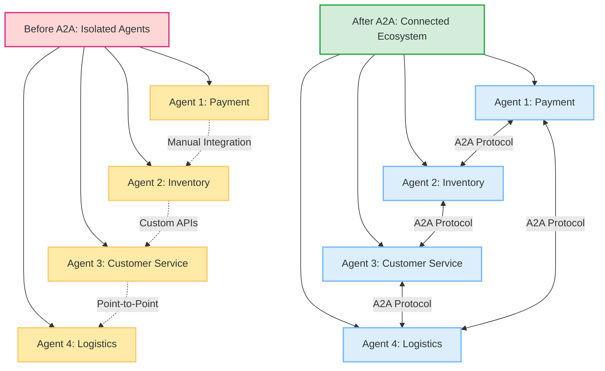
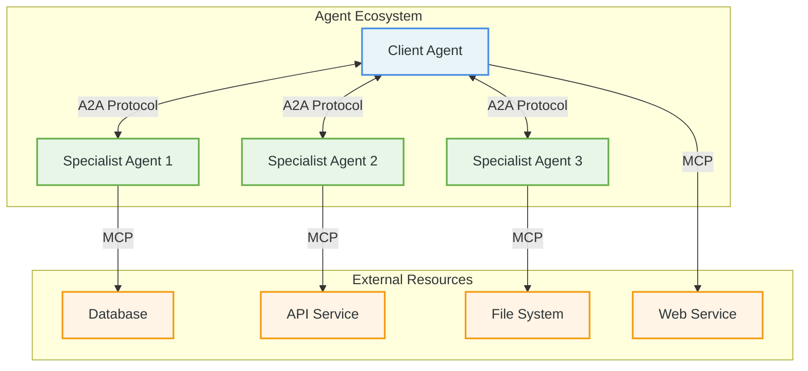
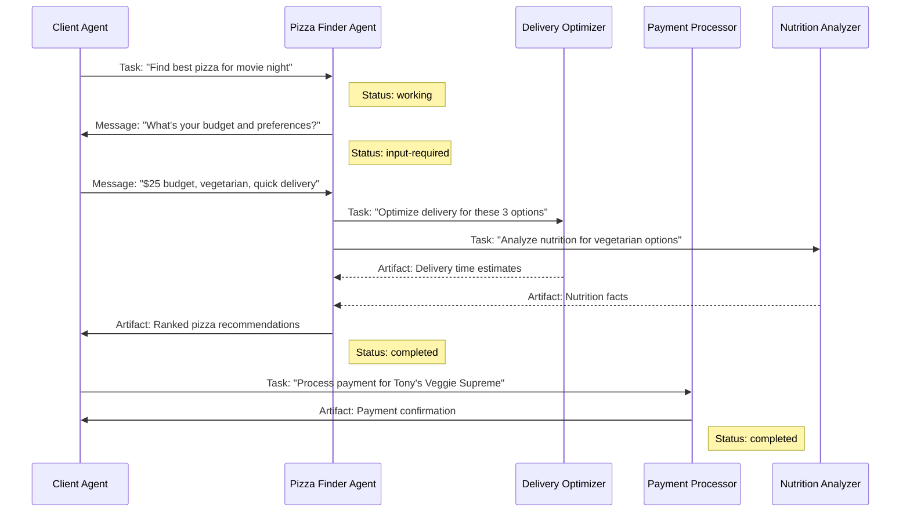
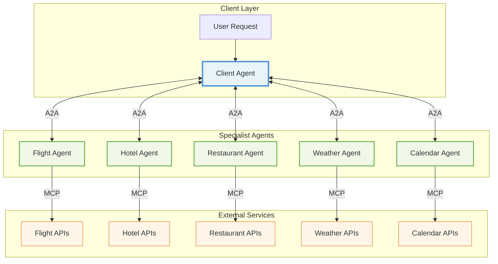
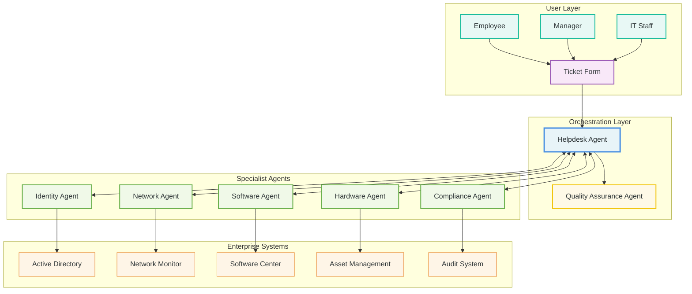

# A2A Protocol for the Impatient: From Novice to Practitioner in Record Time

_Master the future of AI agent communication in hours, not months_

---

## 1. The Story That Started It All: Why Your AI Agents Need to Talk

Picture this: It's 2:47 AM, and Sarah, a DevOps engineer at a Fortune 500 company, is awakened by her phone buzzing with alerts. The company's e-commerce platform is down, customers are angry, and revenue is hemorrhaging by the minute. But here's the real kicker – fixing this seemingly simple issue requires coordinating between seven different AI agents across five separate systems, each speaking its own proprietary language.

The payment processing agent can't communicate with the inventory management agent. The customer service chatbot has no way to get real-time updates from the logistics agent. The fraud detection system operates in complete isolation from the recommendation engine. Sarah spends three precious hours not fixing the core issue, but manually shuttling information between these digital islands like a human Google Translate for machines.

This nightmare scenario plays out thousands of times daily across enterprises worldwide. Companies have invested millions in AI agents, only to discover they've created expensive digital silos that can't collaborate. The result? Frustrated customers, burnt-out engineers, and AI investments that deliver a fraction of their potential value.

**This is exactly why Google, along with over 100 technology partners, created the Agent2Agent (A2A) Protocol**. Released in April 2025 and now governed by the Linux Foundation, A2A is the universal translator that finally allows AI agents to communicate, collaborate, and coordinate – regardless of who built them or what technology they use.

> **📢 Official Announcement**: On June 23, 2025, at Open Source Summit North America, the Linux Foundation announced the formation of the Agent2Agent project with founding partners Amazon Web Services, Cisco, Google, Microsoft, Salesforce, SAP, and ServiceNow.



But why should you, the impatient learner, care about A2A right now? Because mastering A2A today positions you at the forefront of the next massive wave in AI automation . While others struggle with integration nightmares, you'll be orchestrating seamless multi-agent workflows that solve complex problems in minutes, not hours.

**Pause and Reflect**: Think about your current work environment. How many different AI tools or systems do you use daily? How much time do you waste manually copying information between them? Keep this in mind as we dive deeper.

---

## Official A2A Resources

Before diving into the technical details, here are the official sources for the A2A Protocol:

- **🏛️ Linux Foundation Project**: [Agent2Agent Protocol Project](https://www.linuxfoundation.org/projects/agent2agent)
- **📖 Official Documentation**: [a2aproject.github.io/A2A](https://a2aproject.github.io/A2A/)
- **💻 GitHub Organization**: [github.com/a2aproject](https://github.com/a2aproject)
- **📋 Protocol Specification**: [A2A Specification](https://a2aproject.github.io/A2A/specification/)
- **🐍 Python SDK**: `pip install a2a-sdk` ([GitHub](https://github.com/a2aproject/a2a-python))
- **📦 JavaScript SDK**: `npm install @a2a-js/sdk` ([GitHub](https://github.com/a2aproject/a2a-js))
- **☕ Java SDK**: [a2a-java](https://github.com/a2aproject/a2a-java)
- **🔧 Go SDK**: [a2a-go](https://github.com/a2aproject/a2a-go)
- **🎯 .NET SDK**: [a2a-dotnet](https://github.com/a2aproject/a2a-dotnet)

**Current Version**: v0.2.3 (as of June 2025)

---

## 2. What Is A2A Protocol? The Universal Language of AI Agents

Imagine walking into a United Nations assembly where every delegate speaks a different language, but somehow they're all having a perfectly coordinated conversation. That's A2A in action – a standardized protocol that enables AI agents built by different teams, using different technologies, to communicate as naturally as humans do.

> **💡 Key Insight**: A2A addresses a critical challenge in the AI landscape: enabling gen AI agents, built on diverse frameworks by different companies running on separate servers, to communicate and collaborate effectively - as agents, not just as tools.

### The Core Building Blocks

A2A consists of five fundamental components that work together like a well-orchestrated symphony:

#### 1. Agent Cards: The Digital Business Card

Think of an Agent Card as a digital resume that every A2A agent publishes. It's a JSON document that tells other agents:

- "Hi, I'm the Travel Booking Agent"
- "I can book flights, hotels, and rental cars"
- "Here's how to authenticate with me"
- "This is my service endpoint URL"

#### 2. Tasks: The Unit of Work

A Task is like a project ticket that moves through a defined lifecycle. It starts as "submitted," progresses to "working," might pause for "input-required," and finally reaches "completed" or "failed."

#### 3. Messages: The Conversation

Messages are how agents actually communicate. They're multi-modal (text, files, structured data) and follow a simple role-based pattern: "user" messages come from clients, "agent" messages come from servers.

#### 4. Artifacts: The Deliverables

Artifacts are the tangible outputs – reports, images, processed data – that agents produce. Think of them as the final deliverables of a project.

#### 5. Streaming: Real-Time Updates

Using Server-Sent Events (SSE), agents can provide real-time updates on long-running tasks. Imagine watching a progress bar fill up as an agent processes your request.

### Technical Foundation

A2A is built on proven, enterprise-ready technologies:

- **Transport**: JSON-RPC 2.0 over HTTP(S)
- **Authentication**: Bearer tokens, OAuth 2.0, API keys
- **Real-time**: Server-Sent Events (SSE) for streaming
- **Data Exchange**: JSON for structured data, multipart for files
- **Discovery**: Standardized Agent Cards (JSON schema)

### A2A vs MCP: The Perfect Partnership

Here's where many people get confused. A2A and the Model Context Protocol (MCP) aren't competitors – they're perfect partners:

- **MCP**: Connects agents to tools, databases, and APIs (think "agent-to-resource")
- **A2A**: Connects agents to other agents (think "agent-to-agent")

It's like the difference between a craftsperson's toolbox (MCP) and a team meeting (A2A). You need both to build something amazing.



**Pro Tip**: Remember this simple rule – if you're connecting an agent to a tool or database, use MCP. If you're connecting an agent to another agent, use A2A. Many enterprise solutions use both protocols together.

### Industry Support & Governance

The A2A Protocol benefits from unprecedented industry collaboration:

#### 🏛️ Linux Foundation Governance

- **Neutral Stewardship**: Under the trusted Linux Foundation umbrella
- **Open Governance**: Community-driven development and decision-making
- **Long-term Stability**: Ensuring protocol evolution and backward compatibility

#### 🤝 Founding Partners

The following industry leaders are committed to A2A adoption and development:

| Company | Commitment |
|---------|------------|
| **Amazon Web Services** | Agentic AI framework integration |
| **Cisco** | AGNTCY platform A2A support |
| **Google Cloud** | Original protocol creator and donor |
| **Microsoft** | Azure AI Foundry integration |
| **Salesforce** | Agentforce platform support |
| **SAP** | Enterprise AI platform integration |
| **ServiceNow** | AI Agent Control Tower compatibility |

#### 📈 Community Growth

- **100+ Companies** supporting the protocol
- **17.4k+ GitHub Stars** on the main repository
- **550+ Stars** on the Python SDK
- **88 Contributors** across all repositories
- **Active Development**: Recent commits and continuous improvement

---

## 3. The Pizza Shop Metaphor: Understanding A2A Through Familiar Eyes

Let's make A2A concrete with something we all understand: ordering pizza. Imagine you're hungry and want to order a pizza, but instead of calling one restaurant, you have access to a network of specialist agents that can give you the perfect meal experience.

> **🍕 Why This Matters**: This metaphor demonstrates how A2A enables seamless collaboration between specialized agents, each contributing their expertise to solve a complex request.

### The Players in Our Pizza Story

**You (The Client Agent)**: The hungry customer who initiates the request  
**Pizza Finder Agent**: Knows all the best pizza places in your area  
**Delivery Optimizer Agent**: Calculates the fastest delivery routes  
**Payment Processor Agent**: Handles the financial transaction securely  
**Nutrition Analyzer Agent**: Provides dietary information and health insights

### The A2A Pizza Flow

Here's how this plays out using A2A Protocol:



### Breaking Down the Magic

1. **Agent Discovery**: Your client agent finds the Pizza Finder Agent by reading its Agent Card, which advertises skills like "restaurant_search" and "cuisine_matching"
2. **Task Initiation**: You send a task with the message "Find best pizza for movie night" – notice how natural and conversational this is, not rigid API calls
3. **Multi-Turn Interaction**: The Pizza Finder Agent asks for clarification, demonstrating A2A's support for conversational AI
4. **Agent Collaboration**: The Pizza Finder Agent delegates specialized tasks to other agents without you needing to coordinate
5. **Artifact Delivery**: Each agent produces concrete deliverables (delivery times, nutrition facts, payment confirmation)

**Interactive Element - Quick Quiz**:

1. What are the five core A2A components demonstrated in this pizza example?
2. Which agent transitions to "input-required" status and why?
3. How does this differ from traditional API integration?

### Quiz Answers

1. Agent Cards, Tasks, Messages, Artifacts, Streaming
2. Pizza Finder Agent, because it needs user preferences
3. A2A enables natural conversation and automatic agent collaboration vs rigid API calls

---

## 4. Your First A2A Implementation: Hello World with Superpowers

Ready to get your hands dirty? Let's build your first A2A agent using Python . This isn't just a toy example – it's a foundation you can extend into production systems.

### Setting Up Your Development Environment

First, let's get you set up with the A2A Python SDK:

```bash
# Install the A2A SDK
pip install a2a-sdk

# Create your project directory
mkdir my-first-a2a-agent
cd my-first-a2a-agent
```

### Creating Your First Agent: The Echo Service

Let's start with a simple but powerful example – an echo agent that demonstrates all core A2A concepts:

```python
# echo_agent.py
import asyncio
from a2a_sdk import A2AServer, AgentCard, AgentSkill, Task, Message, TextPart

class EchoAgent:
    def __init__(self):
        self.server = A2AServer()
        self.setup_agent_card()
        self.setup_handlers()

    def setup_agent_card(self):
        """Create our agent's digital business card"""
        skill = AgentSkill(
            id="echo_text",
            name="Text Echo Service",
            description="Echoes back any text with helpful analysis",
            tags=["text", "analysis", "utility"],
            examples=[
                "Echo this message back to me",
                "Repeat: Hello, World!",
                "Echo and analyze: The weather is beautiful today"
            ]
        )

        self.agent_card = AgentCard(
            name="Echo Analysis Agent",
            description="A friendly agent that echoes your messages with insights",
            version="1.0.0",
            skills=[skill],
            defaultInputModes=["text/plain"],
            defaultOutputModes=["text/plain", "application/json"],
            capabilities={
                "streaming": True,
                "pushNotifications": False
            }
        )

    def setup_handlers(self):
        """Register our task handlers"""
        @self.server.task_handler
        async def handle_echo_task(task: Task) -> Task:
            # Extract the user's message
            user_message = task.status.message
            if not user_message or not user_message.parts:
                return self.create_error_response(task, "No message to echo")

            # Get the text to echo
            text_part = next((p for p in user_message.parts if p.kind == "text"), None)
            if not text_part:
                return self.create_error_response(task, "No text found to echo")

            original_text = text_part.text

            # Create our enhanced echo response
            echo_response = f"🔄 Echo: {original_text}\n"
            echo_response += f"📊 Analysis: {len(original_text)} characters, "
            echo_response += f"{len(original_text.split())} words"

            # Create response message
            response_message = Message(
                messageId=f"echo-response-{task.id}",
                role="agent",
                kind="message",
                parts=[TextPart(kind="text", text=echo_response)]
            )

            # Update task status
            task.status.state = "completed"
            task.status.message = response_message

            return task

    def create_error_response(self, task: Task, error_msg: str) -> Task:
        """Helper to create error responses"""
        error_message = Message(
            messageId=f"error-{task.id}",
            role="agent",
            kind="message",
            parts=[TextPart(kind="text", text=f"❌ Error: {error_msg}")]
        )

        task.status.state = "failed"
        task.status.message = error_message
        return task

    async def start(self, host="localhost", port=8080):
        """Start the A2A server"""
        print(f"🚀 Starting Echo Agent on {host}:{port}")
        print(f"📋 Agent Card available at: http://{host}:{port}/.well-known/agent.json")

        await self.server.start(
            host=host,
            port=port,
            agent_card=self.agent_card
        )

# Run the agent
if __name__ == "__main__":
    agent = EchoAgent()
    asyncio.run(agent.start())
```

### Testing Your Agent

Now let's create a simple client to test our agent:

```python
# test_client.py
import asyncio
from a2a_sdk import A2AClient, Message, TextPart, TaskSendParams

async def test_echo_agent():
    # Connect to our agent
    client = A2AClient("http://localhost:8080")

    # First, let's see what our agent can do
    agent_card = await client.get_agent_card()
    print(f"Connected to: {agent_card.name}")
    print(f"Description: {agent_card.description}")
    print(f"Skills: {[skill.name for skill in agent_card.skills]}")

    # Create a test message
    test_message = Message(
        messageId="test-1",
        role="user",
        kind="message",
        parts=[TextPart(kind="text", text="Hello, A2A World! This is my first agent interaction.")]
    )

    # Send the task
    params = TaskSendParams(
        message=test_message,
        taskId="echo-test-1"
    )

    result = await client.send_task(params)

    print(f"Task Status: {result.status.state}")
    print(f"Response: {result.status.message.parts.text}")

# Run the test
if __name__ == "__main__":
    asyncio.run(test_echo_agent())
```

### Running Your First A2A System

1. **Start the agent**: `python echo_agent.py`
2. **In another terminal, test it**: `python test_client.py`

You should see output like:

```console
Connected to: Echo Analysis Agent
Description: A friendly agent that echoes your messages with insights
Skills: ['Text Echo Service']
Task Status: completed
Response: 🔄 Echo: Hello, A2A World! This is my first agent interaction.
📊 Analysis: 55 characters, 10 words
```

**Pro Tips for Your First Implementation**:

1. **Always validate input**: Check that messages contain the expected content
2. **Use meaningful IDs**: Task and message IDs help with debugging
3. **Implement proper error handling**: Failed tasks should return helpful error messages
4. **Test incrementally**: Start simple, then add complexity

**Common Pitfalls to Avoid**:

- Forgetting to set the task state to "completed"
- Not handling empty or malformed messages
- Blocking the async event loop with synchronous operations
- Hardcoding URLs instead of using configuration

---

## 5. Real-World Example: Smart Travel Assistant

Now let's level up with a practical example that showcases A2A's real power . We'll build a smart travel assistant that coordinates multiple specialist agents to plan your perfect trip.

### The Business Problem

Imagine you're a travel agency that wants to offer seamless trip planning. Customers should be able to say "Plan a 3-day business trip to San Francisco" and get a complete itinerary including flights, hotels, restaurant recommendations, and calendar integration – all handled automatically by coordinating AI agents.

### Our Multi-Agent Architecture



### Building the Flight Agent

Let's start with the Flight Agent, which demonstrates task lifecycle management and streaming updates:

```python
# flight_agent.py
import asyncio
import json
from datetime import datetime, timedelta
from a2a_sdk import A2AServer, AgentCard, AgentSkill, Task, Message, TextPart, DataPart, Artifact

class FlightAgent:
    def __init__(self):
        self.server = A2AServer()
        self.setup_agent_card()
        self.setup_handlers()

    def setup_agent_card(self):
        flight_search_skill = AgentSkill(
            id="flight_search",
            name="Flight Search & Booking",
            description="Search for flights, compare prices, and provide booking options",
            tags=["travel", "flights", "booking", "aviation"],
            examples=[
                "Find flights from NYC to SFO for March 15th",
                "Search for round-trip flights to Paris, departing next Monday",
                "Find the cheapest flights from LA to Tokyo"
            ],
            inputModes=["text/plain", "application/json"],
            outputModes=["application/json", "text/plain"]
        )

        self.agent_card = AgentCard(
            name="Flight Booking Agent",
            description="Specialized agent for flight search, comparison, and booking assistance",
            version="2.1.0",
            skills=[flight_search_skill],
            capabilities={
                "streaming": True,
                "pushNotifications": True
            }
        )

    def setup_handlers(self):
        @self.server.task_handler
        async def handle_flight_search(task: Task) -> Task:
            """Handle flight search requests with streaming updates"""

            # Update task to working state
            task.status.state = "working"
            task.status.message = Message(
                messageId=f"status-{task.id}",
                role="agent",
                kind="message",
                parts=[TextPart(kind="text", text="🔍 Searching for flights...")]
            )

            # Extract search parameters
            search_params = self.extract_search_params(task)
            if not search_params:
                return self.create_error_response(task, "Could not understand flight search request")

            # Simulate flight search with streaming updates
            flight_results = await self.search_flights_with_streaming(task, search_params)

            # Create final response
            if flight_results:
                task.status.state = "completed"
                task.artifacts = [self.create_flight_artifact(flight_results)]
                task.status.message = Message(
                    messageId=f"completed-{task.id}",
                    role="agent",
                    kind="message",
                    parts=[TextPart(kind="text", text=f"✅ Found {len(flight_results)} flight options")]
                )
            else:
                return self.create_error_response(task, "No flights found matching your criteria")

            return task

    def extract_search_params(self, task: Task) -> dict:
        """Extract flight search parameters from the user message"""
        # In a real implementation, you'd use NLP to parse the request
        # For demo purposes, we'll look for structured data or parse simple text

        user_message = task.status.message
        if not user_message:
            return None

        # Check if we have structured data
        data_parts = [p for p in user_message.parts if p.kind == "data"]
        if data_parts:
            return data_parts.data

        # Simple text parsing (in production, use proper NLP)
        text_parts = [p for p in user_message.parts if p.kind == "text"]
        if text_parts:
            text = text_parts.text.lower()

            # Basic parsing - you'd use sophisticated NLP in production
            params = {
                "origin": "NYC" if "nyc" in text or "new york" in text else "LAX",
                "destination": "SFO" if "sfo" in text or "san francisco" in text else "JFK",
                "departure_date": (datetime.now() + timedelta(days=7)).isoformat(),
                "return_date": (datetime.now() + timedelta(days=10)).isoformat() if "round" in text else None,
                "passengers": 1,
                "class": "economy"
            }
            return params

        return None

    async def search_flights_with_streaming(self, task: Task, search_params: dict) -> list:
        """Simulate flight search with streaming progress updates"""

        # Simulate searching multiple airlines
        airlines = ["Delta", "United", "American", "JetBlue", "Southwest"]
        results = []

        for i, airline in enumerate(airlines):
            # Send streaming update
            if hasattr(task, 'stream_update'):  # In real implementation
                await task.stream_update(f"Searching {airline}... ({i+1}/{len(airlines)})")

            # Simulate API call delay
            await asyncio.sleep(0.5)

            # Simulate finding flights
            if airline != "Southwest":  # Simulate some airlines having availability
                flight = {
                    "airline": airline,
                    "flight_number": f"{airline[:2].upper()}{100 + i}",
                    "departure": {
                        "airport": search_params["origin"],
                        "time": "08:00",
                        "date": search_params["departure_date"]
                    },
                    "arrival": {
                        "airport": search_params["destination"],
                        "time": "11:30",
                        "date": search_params["departure_date"]
                    },
                    "price": 299 + (i * 50),
                    "duration": "5h 30m",
                    "stops": 0 if i < 2 else 1
                }
                results.append(flight)

        return results

    def create_flight_artifact(self, flight_results: list) -> Artifact:
        """Create a structured artifact containing flight search results"""
        return Artifact(
            artifactId=f"flight-results-{datetime.now().strftime('%Y%m%d-%H%M%S')}",
            name="Flight Search Results",
            description="Available flight options matching your search criteria",
            parts=[
                DataPart(
                    kind="data",
                    data={
                        "search_timestamp": datetime.now().isoformat(),
                        "total_results": len(flight_results),
                        "flights": flight_results,
                        "currency": "USD"
                    }
                )
            ],
            metadata={
                "search_completed": True,
                "result_count": len(flight_results)
            }
        )

    def create_error_response(self, task: Task, error_msg: str) -> Task:
        """Create an error response for failed flight searches"""
        task.status.state = "failed"
        task.status.message = Message(
            messageId=f"error-{task.id}",
            role="agent",
            kind="message",
            parts=[TextPart(kind="text", text=f"❌ Flight Search Error: {error_msg}")]
        )
        return task

    async def start(self, host="localhost", port=8081):
        """Start the Flight Agent server"""
        print(f"✈️ Starting Flight Agent on {host}:{port}")
        await self.server.start(host=host, port=port, agent_card=self.agent_card)

if __name__ == "__main__":
    agent = FlightAgent()
    asyncio.run(agent.start())
```

### The Coordinating Travel Assistant

Now let's create the main travel assistant that orchestrates all the specialist agents:

```python
# travel_assistant.py
import asyncio
import json
from datetime import datetime
from a2a_sdk import A2AClient, A2AServer, AgentCard, AgentSkill, Task, Message, TextPart, DataPart, Artifact

class TravelAssistant:
    def __init__(self):
        self.server = A2AServer()
        self.setup_agent_card()
        self.setup_handlers()

        # Specialist agent clients
        self.flight_agent = A2AClient("http://localhost:8081")
        self.hotel_agent = A2AClient("http://localhost:8082")
        self.restaurant_agent = A2AClient("http://localhost:8083")

        # Ticket classification model (simulated)
        self.ticket_classifier = TicketClassifier()

    def setup_agent_card(self):
        travel_planning_skill = AgentSkill(
            id="travel_planning",
            name="Complete Travel Planning",
            description="Plans comprehensive trips including flights, hotels, dining, and activities",
            tags=["travel", "planning", "coordination", "itinerary"],
            examples=[
                "Plan a 3-day business trip to San Francisco",
                "Organize a week-long vacation to Paris with family",
                "Create an itinerary for a weekend getaway to Miami"
            ]
        )

        self.agent_card = AgentCard(
            name="Smart Travel Assistant",
            description="Your personal travel coordinator that handles everything from flights to dining",
            version="1.0.0",
            skills=[travel_planning_skill],
            capabilities={"streaming": True}
        )

    def setup_handlers(self):
        @self.server.task_handler
        async def handle_travel_planning(task: Task) -> Task:
            """Orchestrate complete travel planning"""

            # Parse the travel request
            travel_request = self.parse_travel_request(task)
            if not travel_request:
                return self.create_error_response(task, "Could not understand travel request")

            # Update task to working state
            task.status.state = "working"
            task.status.message = Message(
                messageId=f"planning-{task.id}",
                role="agent",
                kind="message",
                parts=[TextPart(kind="text", text="🗺️ Planning your trip...")]
            )

            try:
                # Coordinate with specialist agents
                itinerary = await self.coordinate_travel_planning(travel_request)

                # Create final itinerary artifact
                task.artifacts = [self.create_itinerary_artifact(itinerary)]
                task.status.state = "completed"
                task.status.message = Message(
                    messageId=f"completed-{task.id}",
                    role="agent",
                    kind="message",
                    parts=[TextPart(kind="text", text="🎉 Your complete travel itinerary is ready!")]
                )

            except Exception as e:
                return self.create_error_response(task, f"Planning failed: {str(e)}")

            return task

    async def coordinate_travel_planning(self, travel_request: dict) -> dict:
        """Coordinate with specialist agents to plan the trip"""

        # Step 1: Find flights
        flight_task = await self.flight_agent.send_task({
            "message": {
                "messageId": "flight-search",
                "role": "user",
                "kind": "message",
                "parts": [
                    {
                        "kind": "data",
                        "data": {
                            "origin": travel_request["origin"],
                            "destination": travel_request["destination"],
                            "departure_date": travel_request["departure_date"],
                            "return_date": travel_request.get("return_date"),
                            "passengers": travel_request.get("passengers", 1)
                        }
                    }
                ]
            }
        })

        # Step 2: Find hotels (parallel with flights)
        hotel_task = await self.hotel_agent.send_task({
            "message": {
                "messageId": "hotel-search",
                "role": "user",
                "kind": "message",
                "parts": [
                    {
                        "kind": "data",
                        "data": {
                            "destination": travel_request["destination"],
                            "check_in": travel_request["departure_date"],
                            "check_out": travel_request.get("return_date"),
                            "guests": travel_request.get("passengers", 1),
                            "budget": travel_request.get("hotel_budget", "mid-range")
                        }
                    }
                ]
            }
        })

        # Step 3: Get restaurant recommendations
        restaurant_task = await self.restaurant_agent.send_task({
            "message": {
                "messageId": "restaurant-search",
                "role": "user",
                "kind": "message",
                "parts": [
                    {
                        "kind": "data",
                        "data": {
                            "destination": travel_request["destination"],
                            "cuisine_preferences": travel_request.get("cuisine", ["any"]),
                            "meal_types": ["breakfast", "lunch", "dinner"],
                            "budget": travel_request.get("dining_budget", "moderate")
                        }
                    }
                ]
            }
        })

        # Combine all results
        return {
            "flights": flight_task.artifacts.parts.data if flight_task.artifacts else None,
            "hotels": hotel_task.artifacts.parts.data if hotel_task.artifacts else None,
            "restaurants": restaurant_task.artifacts.parts.data if restaurant_task.artifacts else None,
            "travel_dates": {
                "departure": travel_request["departure_date"],
                "return": travel_request.get("return_date")
            }
        }

    def parse_travel_request(self, task: Task) -> dict:
        """Parse the user's travel request"""
        # Simplified parsing - in production, use sophisticated NLP
        user_message = task.status.message
        if not user_message:
            return None

        text_parts = [p for p in user_message.parts if p.kind == "text"]
        if not text_parts:
            return None

        text = text_parts.text.lower()

        # Basic parsing logic
        request = {
            "origin": "NYC",  # Default, would extract from text
            "destination": "San Francisco" if "san francisco" in text or "sfo" in text else "Los Angeles",
            "departure_date": (datetime.now() + timedelta(days=14)).isoformat(),
            "duration_days": 3,
            "purpose": "business" if "business" in text else "leisure"
        }

        # Add return date for round trips
        if "round" in text or request["purpose"] == "business":
            request["return_date"] = (datetime.now() + timedelta(days=14 + request["duration_days"])).isoformat()

        return request

    def create_itinerary_artifact(self, itinerary: dict) -> Artifact:
        """Create a comprehensive itinerary artifact"""
        return Artifact(
            artifactId=f"itinerary-{datetime.now().strftime('%Y%m%d-%H%M%S')}",
            name="Complete Travel Itinerary",
            description="Your personalized travel plan with flights, hotels, and dining recommendations",
            parts=[
                DataPart(
                    kind="data",
                    data=itinerary
                ),
                TextPart(
                    kind="text",
                    text=self.format_itinerary_summary(itinerary)
                )
            ]
        )

    def format_itinerary_summary(self, itinerary: dict) -> str:
        """Format a human-readable itinerary summary"""
        summary = "🎯 Your Travel Itinerary Summary\n\n"

        if itinerary.get("flights"):
            summary += "✈️ Flights:\n"
            flights = itinerary["flights"].get("flights", [])
            for flight in flights[:2]:  # Show top 2 options
                summary += f"  • {flight['airline']} {flight['flight_number']} - ${flight['price']}\n"
            summary += "\n"

        if itinerary.get("hotels"):
            summary += "🏨 Hotels:\n"
            hotels = itinerary["hotels"].get("hotels", [])
            for hotel in hotels[:2]:  # Show top 2 options
                summary += f"  • {hotel['name']} - ${hotel['price']}/night\n"
            summary += "\n"

        if itinerary.get("restaurants"):
            summary += "🍽️ Dining Recommendations:\n"
            restaurants = itinerary["restaurants"].get("restaurants", [])
            for restaurant in restaurants[:3]:  # Show top 3 options
                summary += f"  • {restaurant['name']} - {restaurant['cuisine']}\n"

        return summary

    def create_error_response(self, task: Task, error_msg: str) -> Task:
        """Create an error response"""
        task.status.state = "failed"
        task.status.message = Message(
            messageId=f"error-{task.id}",
            role="agent",
            kind="message",
            parts=[TextPart(kind="text", text=f"❌ {error_msg}")]
        )
        return task

    async def start(self, host="localhost", port=8080):
        """Start the Travel Assistant server"""
        print(f"🌍 Starting Travel Assistant on {host}:{port}")
        await self.server.start(host=host, port=port, agent_card=self.agent_card)

if __name__ == "__main__":
    assistant = TravelAssistant()
    asyncio.run(assistant.start())
```

### Testing the Complete System

Here's a client to test our multi-agent travel system:

```python
# test_travel_system.py
import asyncio
from a2a_sdk import A2AClient, Message, TextPart, TaskSendParams

async def test_travel_planning():
    # Connect to our travel assistant
    client = A2AClient("http://localhost:8080")

    # Create a travel request
    travel_request = Message(
        messageId="travel-request-1",
        role="user",
        kind="message",
        parts=[TextPart(
            kind="text",
            text="Plan a 3-day business trip to San Francisco departing next Monday"
        )]
    )

    # Send the planning task
    params = TaskSendParams(
        message=travel_request,
        taskId="travel-planning-1"
    )

    print("🚀 Submitting travel planning request...")
    result = await client.send_task(params)

    print(f"📋 Task Status: {result.status.state}")
    print(f"💬 Message: {result.status.message.parts.text}")

    if result.artifacts:
        print("\n📄 Itinerary Created:")
        itinerary_text = next(
            (part.text for part in result.artifacts.parts if part.kind == "text"),
            "No summary available"
        )
        print(itinerary_text)

# Run the test
if __name__ == "__main__":
    asyncio.run(test_travel_planning())
```

### Key Insights from This Example

This travel assistant demonstrates several crucial A2A patterns:

1. **Agent Orchestration**: The main assistant coordinates multiple specialist agents
2. **Parallel Processing**: Flight and hotel searches happen simultaneously
3. **Structured Data Exchange**: Using DataPart for complex parameters
4. **Error Handling**: Graceful failure management across agent boundaries
5. **Artifact Creation**: Producing rich, structured outputs

**Pause and Reflect**: How would you extend this system? What other specialist agents would you add? Consider weather, local events, transportation, or budget tracking agents.

---

## 6. Enterprise Implementation: IT Helpdesk Automation

Let's tackle a real enterprise challenge that showcases A2A's power in production environments . We'll build an intelligent IT helpdesk system that can automatically resolve common issues by coordinating multiple specialized agents.

### The Enterprise Challenge

TechCorp's IT helpdesk receives 500+ tickets daily. Most are repetitive: password resets, software installations, network connectivity issues, and hardware problems. Currently, each ticket requires human intervention, creating bottlenecks and frustrated users. The company wants to automate 80% of routine tickets while maintaining security and compliance.

### The A2A Solution Architecture



### Building the Network Diagnostic Agent

Let's start with a specialist agent that can diagnose and resolve network issues:

```python
# network_agent.py
import asyncio
import json
import subprocess
from datetime import datetime
from a2a_sdk import A2AServer, AgentCard, AgentSkill, Task, Message, TextPart, DataPart, Artifact

class NetworkDiagnosticAgent:
    def __init__(self):
        self.server = A2AServer()
        self.setup_agent_card()
        self.setup_handlers()

    def setup_agent_card(self):
        network_diagnostic_skill = AgentSkill(
            id="network_diagnosis",
            name="Network Connectivity Diagnosis",
            description="Diagnoses and resolves network connectivity issues including DNS, routing, and firewall problems",
            tags=["network", "connectivity", "diagnosis", "troubleshooting"],
            examples=[
                "User can't access internal websites",
                "Internet connection is slow",
                "Cannot connect to company VPN",
                "Email server unreachable"
            ]
        )

        network_repair_skill = AgentSkill(
            id="network_repair",
            name="Automated Network Repair",
            description="Automatically fixes common network issues when safe to do so",
            tags=["network", "repair", "automation", "fixes"],
            examples=[
                "Reset network adapter",
                "Flush DNS cache",
                "Renew IP address",
                "Restart network services"
            ]
        )

        self.agent_card = AgentCard(
            name="Network Diagnostic Agent",
            description="Specialist agent for diagnosing and resolving network connectivity issues",
            version="2.0.0",
            skills=[network_diagnostic_skill, network_repair_skill],
            capabilities={
                "streaming": True,
                "pushNotifications": True
            },
            # Enterprise security requirements
            securitySchemes={
                "bearer": {
                    "type": "http",
                    "scheme": "bearer",
                    "bearerFormat": "JWT"
                }
            },
            security=[{"bearer": []}]
        )

    def setup_handlers(self):
        @self.server.task_handler
        async def handle_network_diagnosis(task: Task) -> Task:
            """Handle network diagnostic requests"""

            # Validate authentication (in production, extract from HTTP headers)
            if not self.validate_authentication(task):
                return self.create_error_response(task, "Authentication required", "auth-required")

            # Extract diagnostic parameters
            diagnostic_request = self.parse_diagnostic_request(task)
            if not diagnostic_request:
                return self.create_error_response(task, "Invalid diagnostic request format")

            # Update task to working state
            task.status.state = "working"
            task.status.message = Message(
                messageId=f"diagnosing-{task.id}",
                role="agent",
                kind="message",
                parts=[TextPart(kind="text", text="🔍 Running network diagnostics...")]
            )

            # Perform comprehensive network diagnosis
            diagnosis_results = await self.perform_network_diagnosis(diagnostic_request)

            # Determine if automatic repair is possible
            repair_actions = self.determine_repair_actions(diagnosis_results)

            if repair_actions and diagnostic_request.get("allow_auto_repair", False):
                # Perform automatic repairs
                repair_results = await self.perform_repairs(repair_actions)
                diagnosis_results["repairs_performed"] = repair_results

            # Create diagnostic report artifact
            task.artifacts = [self.create_diagnostic_artifact(diagnosis_results)]

            # Update final status
            if diagnosis_results["issues_found"]:
                if repair_actions and diagnostic_request.get("allow_auto_repair", False):
                    task.status.state = "completed"
                    task.status.message = Message(
                        messageId=f"completed-{task.id}",
                        role="agent",
                        kind="message",
                        parts=[TextPart(kind="text", text="✅ Network issues diagnosed and repaired automatically")]
                    )
                else:
                    task.status.state = "input-required"
                    task.status.message = Message(
                        messageId=f"input-required-{task.id}",
                        role="agent",
                        kind="message",
                        parts=[TextPart(kind="text", text="⚠️ Issues found. Manual intervention or approval required for repairs")]
                    )
            else:
                task.status.state = "completed"
                task.status.message = Message(
                    messageId=f"completed-{task.id}",
                    role="agent",
                    kind="message",
                    parts=[TextPart(kind="text", text="✅ Network diagnostics completed - no issues found")]
                )

            return task

    def validate_authentication(self, task: Task) -> bool:
        """Validate enterprise authentication"""
        # In production, validate JWT token from HTTP headers
        # For demo, we'll simulate validation
        return True

    def parse_diagnostic_request(self, task: Task) -> dict:
        """Parse the diagnostic request from the user"""
        user_message = task.status.message
        if not user_message:
            return None

        # Look for structured diagnostic data
        data_parts = [p for p in user_message.parts if p.kind == "data"]
        if data_parts:
            return data_parts.data

        # Parse text-based requests
        text_parts = [p for p in user_message.parts if p.kind == "text"]
        if text_parts:
            text = text_parts.text.lower()

            # Extract key information
            return {
                "user_id": "unknown",  # Would extract from auth context
                "computer_name": "unknown",  # Would extract from request
                "symptoms": text,
                "priority": "normal",
                "allow_auto_repair": "auto" in text or "fix" in text,
                "tests_requested": self.determine_tests_from_symptoms(text)
            }

        return None

    def determine_tests_from_symptoms(self, symptoms: str) -> list:
        """Determine which diagnostic tests to run based on symptoms"""
        tests = []

        if any(keyword in symptoms for keyword in ["slow", "timeout", "unreachable"]):
            tests.extend(["ping_test", "traceroute", "dns_lookup"])

        if any(keyword in symptoms for keyword in ["wifi", "wireless", "connection"]):
            tests.extend(["wifi_status", "adapter_status"])

        if any(keyword in symptoms for keyword in ["website", "internet", "browser"]):
            tests.extend(["external_connectivity", "dns_resolution"])

        if any(keyword in symptoms for keyword in ["email", "outlook", "smtp"]):
            tests.extend(["email_server_connectivity", "port_tests"])

        # Default comprehensive tests if no specific symptoms
        if not tests:
            tests = ["ping_test", "dns_lookup", "adapter_status", "external_connectivity"]

        return tests

    async def perform_network_diagnosis(self, request: dict) -> dict:
        """Perform comprehensive network diagnosis"""
        results = {
            "timestamp": datetime.now().isoformat(),
            "user_id": request["user_id"],
            "computer_name": request["computer_name"],
            "tests_performed": [],
            "issues_found": [],
            "recommendations": []
        }

        # Run requested tests
        for test_name in request["tests_requested"]:
            test_result = await self.run_diagnostic_test(test_name)
            results["tests_performed"].append(test_result)

            # Analyze results for issues
            if not test_result["passed"]:
                results["issues_found"].append({
                    "test": test_name,
                    "issue": test_result["issue"],
                    "severity": test_result["severity"],
                    "recommended_action": test_result["recommended_action"]
                })

        return results

    async def run_diagnostic_test(self, test_name: str) -> dict:
        """Run a specific diagnostic test"""
        # Simulate various network diagnostic tests
        test_results = {
            "ping_test": await self.ping_test(),
            "dns_lookup": await self.dns_lookup_test(),
            "adapter_status": await self.adapter_status_test(),
            "external_connectivity": await self.external_connectivity_test(),
            "wifi_status": await self.wifi_status_test(),
            "email_server_connectivity": await self.email_server_test(),
            "port_tests": await self.port_connectivity_test()
        }

        return test_results.get(test_name, {
            "test_name": test_name,
            "passed": False,
            "issue": "Unknown test type",
            "severity": "low",
            "recommended_action": "Contact IT support"
        })

    async def ping_test(self) -> dict:
        """Test basic network connectivity"""
        try:
            # Simulate ping test (in production, use actual ping)
            await asyncio.sleep(0.1)  # Simulate test time

            # Simulate successful ping
            return {
                "test_name": "ping_test",
                "passed": True,
                "latency_ms": 23,
                "packet_loss": 0,
                "target": "8.8.8.8"
            }
        except Exception as e:
            return {
                "test_name": "ping_test",
                "passed": False,
                "issue": "Network connectivity failure",
                "severity": "high",
                "recommended_action": "Check network cable and adapter settings"
            }

    async def dns_lookup_test(self) -> dict:
        """Test DNS resolution"""
        try:
            await asyncio.sleep(0.2)

            # Simulate DNS test
            return {
                "test_name": "dns_lookup",
                "passed": True,
                "dns_server": "8.8.8.8",
                "lookup_time_ms": 45,
                "resolved_ip": "172.217.164.110"
            }
        except Exception:
            return {
                "test_name": "dns_lookup",
                "passed": False,
                "issue": "DNS resolution failure",
                "severity": "medium",
                "recommended_action": "Flush DNS cache or change DNS servers"
            }

    async def adapter_status_test(self) -> dict:
        """Check network adapter status"""
        await asyncio.sleep(0.1)

        return {
            "test_name": "adapter_status",
            "passed": True,
            "adapter_name": "Ethernet",
            "status": "Connected",
            "speed": "1 Gbps",
            "ip_address": "192.168.1.100"
        }

    async def external_connectivity_test(self) -> dict:
        """Test external internet connectivity"""
        await asyncio.sleep(0.3)

        return {
            "test_name": "external_connectivity",
            "passed": True,
            "tested_sites": ["google.com", "microsoft.com"],
            "all_reachable": True
        }

    async def wifi_status_test(self) -> dict:
        """Check WiFi connection status"""
        await asyncio.sleep(0.1)

        return {
            "test_name": "wifi_status",
            "passed": True,
            "connected_network": "TechCorp_Secure",
            "signal_strength": "Excellent",
            "security": "WPA2-Enterprise"
        }

    async def email_server_test(self) -> dict:
        """Test email server connectivity"""
        await asyncio.sleep(0.2)

        return {
            "test_name": "email_server_connectivity",
            "passed": False,
            "issue": "SMTP server unreachable on port 587",
            "severity": "medium",
            "recommended_action": "Check firewall settings or contact email admin"
        }

    async def port_connectivity_test(self) -> dict:
        """Test specific port connectivity"""
        await asyncio.sleep(0.2)

        return {
            "test_name": "port_tests",
            "passed": True,
            "ports_tested": [80, 443, 25, 587],
            "open_ports": [80, 443],
            "blocked_ports": [25, 587]
        }

    def determine_repair_actions(self, diagnosis_results: dict) -> list:
        """Determine what automatic repairs can be performed"""
        repair_actions = []

        for issue in diagnosis_results["issues_found"]:
            if issue["test"] == "dns_lookup" and "dns" in issue["issue"].lower():
                repair_actions.append({
                    "action": "flush_dns",
                    "description": "Flush DNS cache",
                    "safety_level": "safe"
                })

            elif issue["test"] == "adapter_status" and "adapter" in issue["issue"].lower():
                repair_actions.append({
                    "action": "restart_adapter",
                    "description": "Restart network adapter",
                    "safety_level": "safe"
                })

            elif issue["test"] == "external_connectivity":
                repair_actions.append({
                    "action": "renew_ip",
                    "description": "Renew IP address",
                    "safety_level": "safe"
                })

        return repair_actions

    async def perform_repairs(self, repair_actions: list) -> list:
        """Perform automatic network repairs"""
        repair_results = []

        for action in repair_actions:
            if action["safety_level"] == "safe":
                result = await self.execute_repair_action(action)
                repair_results.append(result)

        return repair_results

    async def execute_repair_action(self, action: dict) -> dict:
        """Execute a specific repair action"""
        # Simulate repair actions
        await asyncio.sleep(0.5)

        repair_functions = {
            "flush_dns": self.flush_dns_cache,
            "restart_adapter": self.restart_network_adapter,
            "renew_ip": self.renew_ip_address
        }

        repair_func = repair_functions.get(action["action"])
        if repair_func:
            return await repair_func()

        return {
            "action": action["action"],
            "success": False,
            "message": "Unknown repair action"
        }

    async def flush_dns_cache(self) -> dict:
        """Flush DNS cache"""
        # In production, execute: ipconfig /flushdns (Windows) or sudo dscacheutil -flushcache (Mac)
        return {
            "action": "flush_dns",
            "success": True,
            "message": "DNS cache flushed successfully"
        }

    async def restart_network_adapter(self) -> dict:
        """Restart network adapter"""
        # In production, execute appropriate network adapter restart commands
        return {
            "action": "restart_adapter",
            "success": True,
            "message": "Network adapter restarted successfully"
        }

    async def renew_ip_address(self) -> dict:
        """Renew IP address"""
        # In production, execute: ipconfig /renew (Windows) or sudo dhclient -r && sudo dhclient (Linux)
        return {
            "action": "renew_ip",
            "success": True,
            "message": "IP address renewed successfully"
        }

    def create_diagnostic_artifact(self, diagnosis_results: dict) -> Artifact:
        """Create a comprehensive diagnostic report"""
        return Artifact(
            artifactId=f"network-diagnosis-{datetime.now().strftime('%Y%m%d-%H%M%S')}",
            name="Network Diagnostic Report",
            description="Comprehensive network connectivity analysis and repair recommendations",
            parts=[
                DataPart(
                    kind="data",
                    data=diagnosis_results
                ),
                TextPart(
                    kind="text",
                    text=self.format_diagnostic_summary(diagnosis_results)
                )
            ],
            metadata={
                "report_type": "network_diagnosis",
                "issues_count": len(diagnosis_results["issues_found"]),
                "tests_run": len(diagnosis_results["tests_performed"])
            }
        )

    def format_diagnostic_summary(self, results: dict) -> str:
        """Format a human-readable diagnostic summary"""
        summary = "🔍 Network Diagnostic Report\n\n"

        summary += f"📊 Tests Performed: {len(results['tests_performed'])}\n"
        summary += f"⚠️ Issues Found: {len(results['issues_found'])}\n\n"

        if results["issues_found"]:
            summary += "🚨 Issues Detected:\n"
            for issue in results["issues_found"]:
                summary += f"  • {issue['test']}: {issue['issue']} (Severity: {issue['severity']})\n"
                summary += f"    Recommendation: {issue['recommended_action']}\n"
        else:
            summary += "✅ No issues detected - network is functioning normally\n"

        if results.get("repairs_performed"):
            summary += "\n🔧 Repairs Performed:\n"
            for repair in results["repairs_performed"]:
                status = "✅" if repair["success"] else "❌"
                summary += f"  {status} {repair['action']}: {repair['message']}\n"

        return summary

    def create_error_response(self, task: Task, error_msg: str, state: str = "failed") -> Task:
        """Create an error response"""
        task.status.state = state
        task.status.message = Message(
            messageId=f"error-{task.id}",
            role="agent",
            kind="message",
            parts=[TextPart(kind="text", text=f"❌ Network Agent Error: {error_msg}")]
        )
        return task

    async def start(self, host="localhost", port=8084):
        """Start the Network Diagnostic Agent"""
        print(f"🌐 Starting Network Diagnostic Agent on {host}:{port}")
        await self.server.start(host=host, port=port, agent_card=self.agent_card)

if __name__ == "__main__":
    agent = NetworkDiagnosticAgent()
    asyncio.run(agent.start())
```

### The Enterprise Helpdesk Orchestrator

Now let's create the main helpdesk agent that orchestrates all specialist agents:

```python
# helpdesk_orchestrator.py
import asyncio
import json
from datetime import datetime
from a2a_sdk import A2AClient, A2AServer, AgentCard, AgentSkill, Task, Message, TextPart, DataPart, Artifact

class HelpdeskOrchestrator:
    def __init__(self):
        self.server = A2AServer()
        self.setup_agent_card()
        self.setup_handlers()

        # Specialist agent clients
        self.network_agent = A2AClient("http://localhost:8084")
        self.identity_agent = A2AClient("http://localhost:8085")
        self.software_agent = A2AClient("http://localhost:8086")
        self.hardware_agent = A2AClient("http://localhost:8087")

        # Ticket classification model (simulated)
        self.ticket_classifier = TicketClassifier()

    def setup_agent_card(self):
        helpdesk_skill = AgentSkill(
            id="helpdesk_automation",
            name="Intelligent IT Helpdesk",
            description="Automated IT support that routes and resolves tickets using specialist agents",
            tags=["helpdesk", "automation", "IT", "support"],
            examples=[
                "I can't connect to the company network",
                "My password expired and I can't reset it",
                "Need to install new software on my computer",
                "My laptop is running very slowly"
            ]
        )

        self.agent_card = AgentCard(
            name="Enterprise Helpdesk Orchestrator",
            description="Intelligent IT helpdesk that automatically routes and resolves support tickets",
            version="3.0.0",
            skills=[helpdesk_skill],
            capabilities={
                "streaming": True,
                "pushNotifications": True
            }
        )

    def setup_handlers(self):
        @self.server.task_handler
        async def handle_helpdesk_ticket(task: Task) -> Task:
            """Handle incoming IT support tickets"""

            # Parse the support ticket
            ticket_data = self.parse_support_ticket(task)
            if not ticket_data:
                return self.create_error_response(task, "Invalid ticket format")

            # Classify the ticket
            classification = self.ticket_classifier.classify_ticket(ticket_data)

            # Update task status
            task.status.state = "working"
            task.status.message = Message(
                messageId=f"processing-{task.id}",
                role="agent",
                kind="message",
                parts=[TextPart(kind="text", text=f"🎫 Processing {classification['category']} ticket...")]
            )

            # Route to appropriate specialist agent
            resolution_result = await self.route_to_specialist(classification, ticket_data)

            # Create comprehensive ticket resolution report
            task.artifacts = [self.create_resolution_artifact(ticket_data, classification, resolution_result)]

            # Update final status based on resolution
            if resolution_result["resolved"]:
                task.status.state = "completed"
                task.status.message = Message(
                    messageId=f"resolved-{task.id}",
                    role="agent",
                    kind="message",
                    parts=[TextPart(kind="text", text=f"✅ Ticket resolved automatically: {resolution_result['summary']}")]
                )
            else:
                task.status.state = "input-required"
                task.status.message = Message(
                    messageId=f"escalation-{task.id}",
                    role="agent",
                    kind="message",
                    parts=[TextPart(kind="text", text=f"⚠️ Ticket requires human intervention: {resolution_result['reason']}")]
                )

            return task

    def parse_support_ticket(self, task: Task) -> dict:
        """Parse the support ticket from user input"""
        user_message = task.status.message
        if not user_message:
            return None

        # Extract ticket data from message parts
        ticket_data = {
            "timestamp": datetime.now().isoformat(),
            "user_id": "unknown",  # Would extract from auth context
            "priority": "normal",
            "category": "unknown",
            "description": "",
            "symptoms": []
        }

        # Process text parts
        text_parts = [p for p in user_message.parts if p.kind == "text"]
        if text_parts:
            ticket_data["description"] = text_parts.text
            ticket_data["symptoms"] = self.extract_symptoms(text_parts.text)

        # Process structured data if available
        data_parts = [p for p in user_message.parts if p.kind == "data"]
        if data_parts:
            ticket_data.update(data_parts.data)

        return ticket_data

    def extract_symptoms(self, description: str) -> list:
        """Extract symptoms from ticket description"""
        symptoms = []
        description_lower = description.lower()

        # Network-related symptoms
        if any(keyword in description_lower for keyword in ["network", "internet", "wifi", "connection"]):
            symptoms.append("network_issues")

        # Performance symptoms
        if any(keyword in description_lower for keyword in ["slow", "freeze", "crash", "hang"]):
            symptoms.append("performance_issues")

        # Authentication symptoms
        if any(keyword in description_lower for keyword in ["password", "login", "access", "authenticate"]):
            symptoms.append("authentication_issues")

        # Software symptoms
        if any(keyword in description_lower for keyword in ["software", "application", "install", "update"]):
            symptoms.append("software_issues")

        # Hardware symptoms
        if any(keyword in description_lower for keyword in ["hardware", "keyboard", "mouse", "screen", "printer"]):
            symptoms.append("hardware_issues")

        return symptoms

    async def route_to_specialist(self, classification: dict, ticket_data: dict) -> dict:
        """Route ticket to appropriate specialist agent"""

        specialist_routing = {
            "network": self.handle_network_ticket,
            "authentication": self.handle_identity_ticket,
            "software": self.handle_software_ticket,
            "hardware": self.handle_hardware_ticket
        }

        handler = specialist_routing.get(classification["category"])
        if handler:
            return await handler(ticket_data, classification)
        else:
            return {
                "resolved": False,
                "specialist": "hardware_agent",
                "reason": f"No specialist available for category: {classification['category']}",
                "escalation_required": True
            }

    async def handle_network_ticket(self, ticket_data: dict, classification: dict) -> dict:
        """Handle network-related tickets"""
        try:
            # Prepare network diagnostic request
            diagnostic_request = Message(
                messageId=f"network-diag-{datetime.now().strftime('%Y%m%d%H%M%S')}",
                role="user",
                kind="message",
                parts=[
                    DataPart(
                        kind="data",
                        data={
                            "user_id": ticket_data["user_id"],
                            "symptoms": ticket_data["description"],
                            "priority": ticket_data["priority"],
                            "allow_auto_repair": classification["confidence"] > 0.8,
                            "tests_requested": ["ping_test", "dns_lookup", "adapter_status", "external_connectivity"]
                        }
                    )
                ]
            )

            # Send task to network agent
            network_task = await self.network_agent.send_task({
                "message": diagnostic_request
            })

            if network_task.status.state == "completed":
                return {
                    "resolved": True,
                    "specialist": "network_agent",
                    "summary": "Network diagnostics completed successfully",
                    "details": network_task.artifacts if network_task.artifacts else None
                }
            else:
                return {
                    "resolved": False,
                    "specialist": "network_agent",
                    "reason": "Network diagnostics incomplete or require manual intervention",
                    "escalation_required": True,
                    "details": network_task.status.message.parts.text if network_task.status.message else None
                }

        except Exception as e:
            return {
                "resolved": False,
                "specialist": "network_agent",
                "reason": f"Network agent error: {str(e)}",
                "escalation_required": True
            }

    async def handle_identity_ticket(self, ticket_data: dict, classification: dict) -> dict:
        """Handle identity/authentication tickets"""
        # Simulate identity agent interaction
        await asyncio.sleep(0.5)

        if "password" in ticket_data["description"].lower():
            return {
                "resolved": True,
                "specialist": "identity_agent",
                "summary": "Password reset link sent to user's registered email",
                "details": {
                    "action_taken": "password_reset_initiated",
                    "reset_link_sent": True,
                    "expires_in": "1 hour"
                }
            }
        else:
            return {
                "resolved": False,
                "specialist": "identity_agent",
                "reason": "Complex identity issue requires manual review",
                "escalation_required": True
            }

    async def handle_software_ticket(self, ticket_data: dict, classification: dict) -> dict:
        """Handle software-related tickets"""
        # Simulate software agent interaction
        await asyncio.sleep(0.3)

        if "install" in ticket_data["description"].lower():
            return {
                "resolved": True,
                "specialist": "software_agent",
                "summary": "Software installation initiated via SCCM",
                "details": {
                    "action_taken": "software_deployment_scheduled",
                    "estimated_completion": "30 minutes",
                    "requires_reboot": True
                }
            }
        else:
            return {
                "resolved": False,
                "specialist": "software_agent",
                "reason": "Software issue requires specialist evaluation",
                "escalation_required": True
            }

    async def handle_hardware_ticket(self, ticket_data: dict, classification: dict) -> dict:
        """Handle hardware-related tickets"""
        # Simulate hardware agent interaction
        await asyncio.sleep(0.4)

        return {
            "resolved": False,
            "specialist": "hardware_agent",
            "reason": "Hardware issues require physical inspection",
            "escalation_required": True,
            "recommended_action": "Schedule on-site technician visit"
        }

    def create_resolution_artifact(self, ticket_data: dict, classification: dict, resolution: dict) -> Artifact:
        """Create comprehensive ticket resolution report"""
        return Artifact(
            artifactId=f"ticket-resolution-{datetime.now().strftime('%Y%m%d-%H%M%S')}",
            name="IT Ticket Resolution Report",
            description="Complete analysis and resolution of IT support ticket",
            parts=[
                DataPart(
                    kind="data",
                    data={
                        "ticket_info": ticket_data,
                        "classification": classification,
                        "resolution": resolution,
                        "resolution_time": datetime.now().isoformat()
                    }
                ),
                TextPart(
                    kind="text",
                    text=self.format_resolution_summary(ticket_data, classification, resolution)
                )
            ],
            metadata={
                "ticket_resolved": resolution["resolved"],
                "specialist_used": resolution.get("specialist"),
                "escalation_required": resolution.get("escalation_required", False)
            }
        )

    def format_resolution_summary(self, ticket_data: dict, classification: dict, resolution: dict) -> str:
        """Format human-readable resolution summary"""
        summary = "🎫 IT Ticket Resolution Summary\n\n"
        summary += f"📝 Description: {ticket_data['description']}\n"
        summary += f"🏷️ Category: {classification['category']} (Confidence: {classification['confidence']:.2f})\n"
        summary += f"⏱️ Priority: {ticket_data['priority']}\n\n"

        if resolution["resolved"]:
            summary += f"✅ Status: RESOLVED\n"
            summary += f"🤖 Handled by: {resolution['specialist']}\n"
            summary += f"📋 Resolution: {resolution['summary']}\n"

            if resolution.get("details"):
                summary += f"\n📊 Details:\n"
                for key, value in resolution["details"].items():
                    summary += f"  • {key}: {value}\n"
        else:
            summary += f"⚠️ Status: ESCALATED\n"
            summary += f"📞 Reason: {resolution['reason']}\n"
            if resolution.get("recommended_action"):
                summary += f"💡 Recommended Action: {resolution['recommended_action']}\n"

        return summary

    def create_error_response(self, task: Task, error_msg: str) -> Task:
        """Create error response for failed tickets"""
        task.status.state = "failed"
        task.status.message = Message(
            messageId=f"error-{task.id}",
            role="agent",
            kind="message",
            parts=[TextPart(kind="text", text=f"❌ Helpdesk Error: {error_msg}")]
        )
        return task

    async def start(self, host="localhost", port=8080):
        """Start the Helpdesk Orchestrator"""
        print(f"🎧 Starting Enterprise Helpdesk Orchestrator on {host}:{port}")
        await self.server.start(host=host, port=port, agent_card=self.agent_card)

class TicketClassifier:
    """Simulated ML model for ticket classification"""

    def classify_ticket(self, ticket_data: dict) -> dict:
        """Classify ticket into categories"""
        description = ticket_data["description"].lower()
        symptoms = ticket_data.get("symptoms", [])

        # Simple rule-based classification (in production, use ML model)
        if any(keyword in description for keyword in ["network", "internet", "wifi", "connection"]):
            return {"category": "network", "confidence": 0.9}
        elif any(keyword in description for keyword in ["password", "login", "access"]):
            return {"category": "authentication", "confidence": 0.85}
        elif any(keyword in description for keyword in ["software", "application", "install"]):
            return {"category": "software", "confidence": 0.8}
        elif any(keyword in description for keyword in ["hardware", "keyboard", "mouse", "screen"]):
            return {"category": "hardware", "confidence": 0.75}
        else:
            return {"category": "general", "confidence": 0.6}

if __name__ == "__main__":
    orchestrator = HelpdeskOrchestrator()
    asyncio.run(orchestrator.start())
```

### Kubernetes Deployment Manifests

```yaml
# kubernetes/deployment.yaml
apiVersion: apps/v1
kind: Deployment
metadata:
  name: a2a-agent
  labels:
    app: a2a-agent
spec:
  replicas: 3
  selector:
    matchLabels:
      app: a2a-agent
  template:
    metadata:
      labels:
        app: a2a-agent
    spec:
      containers:
        - name: a2a-agent
          image: your-registry/a2a-agent:latest
          ports:
            - containerPort: 8080
              name: http
            - containerPort: 8000
              name: metrics
          env:
            - name: AGENT_ID
              valueFrom:
                fieldRef:
                  fieldPath: metadata.name
            - name: REDIS_HOST
              value: "redis-service"
            - name: DB_HOST
              value: "postgres-service"
            - name: LOG_LEVEL
              value: "INFO"
          resources:
            requests:
              memory: "256Mi"
              cpu: "250m"
            limits:
              memory: "512Mi"
              cpu: "500m"
          livenessProbe:
            httpGet:
              path: /health
              port: 8080
            initialDelaySeconds: 30
            periodSeconds: 10
          readinessProbe:
            httpGet:
              path: /health
              port: 8080
            initialDelaySeconds: 5
            periodSeconds: 5
---
apiVersion: v1
kind: Service
metadata:
  name: a2a-agent-service
spec:
  selector:
    app: a2a-agent
  ports:
    - port: 80
      targetPort: 8080
      name: http
    - port: 8000
      targetPort: 8000
      name: metrics
---
apiVersion: networking.k8s.io/v1
kind: Ingress
metadata:
  name: a2a-agent-ingress
  annotations:
    nginx.ingress.kubernetes.io/rewrite-target: /
spec:
  rules:
    - host: a2a-agent.example.com
      http:
        paths:
          - path: /
            pathType: Prefix
            backend:
              service:
                name: a2a-agent-service
                port:
                  number: 80
```

### Monitoring and Alerting Configuration

```yaml
# monitoring/prometheus-rules.yaml
apiVersion: monitoring.coreos.com/v1
kind: PrometheusRule
metadata:
  name: a2a-agent-rules
spec:
  groups:
    - name: a2a-agent
      rules:
        - alert: A2AAgentDown
          expr: up{job="a2a-agent"} == 0
          for: 1m
          labels:
            severity: critical
          annotations:
            summary: "A2A Agent is down"
            description: "A2A Agent {{ $labels.instance }} has been down for more than 1 minute"

        - alert: A2AHighErrorRate
          expr: rate(a2a_errors_total[5m]) > 0.1
          for: 2m
          labels:
            severity: warning
          annotations:
            summary: "High error rate in A2A Agent"
            description: "A2A Agent {{ $labels.agent_id }} has error rate > 10% for 2 minutes"

        - alert: A2AHighLatency
          expr: histogram_quantile(0.95, rate(a2a_request_duration_seconds_bucket[5m])) > 2
          for: 5m
          labels:
            severity: warning
          annotations:
            summary: "High latency in A2A Agent"
            description: "95th percentile latency > 2s for A2A Agent {{ $labels.agent_id }}"
```

### Production Troubleshooting Guide

```python
# troubleshooting/diagnostic_tools.py
import asyncio
import json
import logging
from datetime import datetime, timedelta
from typing import Dict, List, Any

class A2AProductionDiagnostics:
    """Diagnostic tools for A2A agents in production"""

    def __init__(self, agent_url: str, redis_client, db_connection):
        self.agent_url = agent_url
        self.redis_client = redis_client
        self.db_connection = db_connection

    async def health_check(self) -> Dict[str, Any]:
        """Comprehensive health check"""
        health_report = {
            "timestamp": datetime.now().isoformat(),
            "checks": {}
        }

        # Check agent endpoint
        try:
            # In production, make actual HTTP request to agent
            health_report["checks"]["agent_endpoint"] = {
                "status": "healthy",
                "response_time_ms": 45
            }
        except Exception as e:
            health_report["checks"]["agent_endpoint"] = {
                "status": "unhealthy",
                "error": str(e)
            }

        # Check Redis
        try:
            self.redis_client.ping()
            health_report["checks"]["redis"] = {
                "status": "healthy",
                "memory_usage": self.redis_client.info("memory")["used_memory_human"]
            }
        except Exception as e:
            health_report["checks"]["redis"] = {
                "status": "unhealthy",
                "error": str(e)
            }

        # Check database
        try:
            cursor = self.db_connection.cursor()
            cursor.execute("SELECT COUNT(*) FROM task_audit_log WHERE created_at > %s",
                         (datetime.now() - timedelta(hours=1),))
            recent_tasks = cursor.fetchone()
            cursor.close()

            health_report["checks"]["database"] = {
                "status": "healthy",
                "recent_tasks_count": recent_tasks
            }
        except Exception as e:
            health_report["checks"]["database"] = {
                "status": "unhealthy",
                "error": str(e)
            }

        return health_report

    def get_performance_metrics(self) -> Dict[str, Any]:
        """Get performance metrics for the last hour"""
        try:
            cursor = self.db_connection.cursor()

            # Get task completion stats
            cursor.execute("""
                SELECT
                    COUNT(*) as total_tasks,
                    AVG(EXTRACT(EPOCH FROM (completed_at - created_at))) as avg_duration_seconds,
                    COUNT(CASE WHEN status = 'completed' THEN 1 END) as completed_tasks,
                    COUNT(CASE WHEN status = 'failed' THEN 1 END) as failed_tasks
                FROM task_audit_log
                WHERE created_at > %s
            """, (datetime.now() - timedelta(hours=1),))

            stats = cursor.fetchone()
            cursor.close()

            return {
                "total_tasks": stats,
                "avg_duration_seconds": float(stats) if stats else 0,
                "completed_tasks": stats,
                "failed_tasks": stats,
                "success_rate": (stats / stats) if stats > 0 else 0
            }

        except Exception as e:
            return {"error": str(e)}

    def get_cache_stats(self) -> Dict[str, Any]:
        """Get Redis cache statistics"""
        try:
            info = self.redis_client.info()
            return {
                "connected_clients": info["connected_clients"],
                "used_memory_human": info["used_memory_human"],
                "keyspace_hits": info["keyspace_hits"],
                "keyspace_misses": info["keyspace_misses"],
                "hit_rate": info["keyspace_hits"] / (info["keyspace_hits"] + info["keyspace_misses"]) if (info["keyspace_hits"] + info["keyspace_misses"]) > 0 else 0
            }
        except Exception as e:
            return {"error": str(e)}

    def diagnose_common_issues(self) -> List[Dict[str, Any]]:
        """Diagnose common production issues"""
        issues = []

        # Check for high error rates
        perf_metrics = self.get_performance_metrics()
        if perf_metrics.get("success_rate", 1) < 0.95:
            issues.append({
                "severity": "warning",
                "issue": "High error rate",
                "description": f"Success rate is {perf_metrics['success_rate']:.2%}",
                "recommendation": "Check application logs and agent health"
            })

        # Check for slow response times
        if perf_metrics.get("avg_duration_seconds", 0) > 5:
            issues.append({
                "severity": "warning",
                "issue": "Slow response times",
                "description": f"Average response time is {perf_metrics['avg_duration_seconds']:.2f}s",
                "recommendation": "Check for resource constraints or external service issues"
            })

        # Check cache performance
        cache_stats = self.get_cache_stats()
        if cache_stats.get("hit_rate", 1) < 0.8:
            issues.append({
                "severity": "info",
                "issue": "Low cache hit rate",
                "description": f"Cache hit rate is {cache_stats['hit_rate']:.2%}",
                "recommendation": "Review caching strategy and TTL settings"
            })

        return issues

    def generate_diagnostic_report(self) -> Dict[str, Any]:
        """Generate comprehensive diagnostic report"""
        return {
            "timestamp": datetime.now().isoformat(),
            "health_check": asyncio.run(self.health_check()),
            "performance_metrics": self.get_performance_metrics(),
            "cache_stats": self.get_cache_stats(),
            "issues": self.diagnose_common_issues()
        }

# Usage example
if __name__ == "__main__":
    import redis
    import psycopg2

    # Initialize connections
    redis_client = redis.Redis(host='localhost', port=6379, decode_responses=True)
    db_connection = psycopg2.connect(
        host='localhost',
        database='a2a_agents',
        user='postgres',
        password=''
    )

    # Run diagnostics
    diagnostics = A2AProductionDiagnostics(
        agent_url="http://localhost:8080",
        redis_client=redis_client,
        db_connection=db_connection
    )

    report = diagnostics.generate_diagnostic_report()
    print(json.dumps(report, indent=2))
```

### Key Production Insights

1. **Observability is Critical**: Comprehensive logging, metrics, and tracing are essential
2. **Caching Improves Performance**: Redis caching reduces load and improves response times
3. **Graceful Degradation**: Design for partial failures and service outages
4. **Health Checks Enable Reliability**: Proper health checks enable automatic recovery
5. **Security is Non-negotiable**: Implement authentication, authorization, and audit logging

**Pro Tips for Production Deployment**:

- Always use configuration management (not hardcoded values)
- Implement circuit breakers for external dependencies
- Use structured logging with correlation IDs
- Monitor business metrics, not just technical metrics
- Have runbooks for common operational scenarios
- Practice disaster recovery scenarios regularly

---

## 7. Troubleshooting & Best Practices

### Common Issues and Solutions

#### 🔧 Connection Problems

**Issue**: Agent not responding to requests
```console
Error: Connection refused to http://localhost:8080
```

**Solutions**:
1. Verify the agent is running: `curl http://localhost:8080/.well-known/agent.json`
2. Check firewall settings
3. Ensure correct port configuration
4. Validate network connectivity

#### 🔧 Authentication Failures

**Issue**: 401 Unauthorized responses
```console
Error: Authentication failed - invalid token
```

**Solutions**:
1. Verify API key/token format
2. Check token expiration
3. Validate bearer token in headers
4. Ensure proper security scheme configuration

#### 🔧 Task Timeout Issues

**Issue**: Tasks stuck in "working" state
```console
Task has been in 'working' state for 30+ minutes
```

**Solutions**:
1. Implement proper timeout handling
2. Add heartbeat mechanisms
3. Use streaming for long-running tasks
4. Implement graceful degradation

#### 🔧 Message Parsing Errors

**Issue**: Malformed message structures
```console
Error: Invalid message format - missing required fields
```

**Solutions**:
1. Validate JSON schema compliance
2. Check message part types
3. Ensure proper messageId generation
4. Verify role assignments (user/agent)

### Performance Best Practices

#### 🚀 Optimization Strategies

1. **Connection Pooling**
   ```python
   # Use connection pooling for multiple requests
   client = A2AClient("http://localhost:8080", 
                      connection_pool_size=10)
   ```

2. **Async Processing**
   ```python
   # Use async/await for non-blocking operations
   async def process_multiple_tasks():
       tasks = [
           client.send_task(task1),
           client.send_task(task2),
           client.send_task(task3)
       ]
       results = await asyncio.gather(*tasks)
   ```

3. **Caching Agent Cards**
   ```python
   # Cache agent cards to reduce discovery overhead
   @lru_cache(maxsize=100)
   async def get_cached_agent_card(agent_url):
       return await client.get_agent_card()
   ```

4. **Streaming for Long Tasks**
   ```python
   # Use streaming for real-time updates
   async def handle_streaming_task(task):
       async for update in client.stream_task(task):
           print(f"Progress: {update}")
   ```

### Security Best Practices

#### 🔒 Authentication & Authorization

1. **Use Strong Authentication**
   ```python
   # Implement proper JWT tokens
   client = A2AClient(
       "https://api.example.com",
       auth_token="eyJhbGciOiJIUzI1NiIsInR5cCI6IkpXVCJ9..."
   )
   ```

2. **Validate Agent Identity**
   ```python
   # Verify agent certificates in production
   def validate_agent_certificate(agent_card):
       # Implement certificate validation
       return verify_signature(agent_card.signature)
   ```

3. **Implement Rate Limiting**
   ```python
   # Add rate limiting to prevent abuse
   @rate_limit(requests_per_minute=60)
   async def handle_task(task):
       return await process_task(task)
   ```

4. **Sanitize Input Data**
   ```python
   # Always validate and sanitize input
   def sanitize_user_input(text):
       return html.escape(text.strip())
   ```

### Monitoring & Observability

#### 📊 Metrics to Track

1. **Task Metrics**
   - Task completion rate
   - Average processing time
   - Error rates by task type
   - Queue depths

2. **Agent Health**
   - Response times
   - Memory usage
   - CPU utilization
   - Network latency

3. **System Metrics**
   - Concurrent connections
   - Throughput (tasks/second)
   - Error rates
   - Availability percentage

#### 📝 Logging Best Practices

```python
import logging
import json

# Structured logging for A2A agents
logger = logging.getLogger(__name__)

def log_task_event(task_id, event_type, details):
    log_entry = {
        "timestamp": datetime.now().isoformat(),
        "task_id": task_id,
        "event_type": event_type,
        "details": details,
        "agent_id": "travel-assistant-v1.0"
    }
    logger.info(json.dumps(log_entry))

# Usage
log_task_event("task-123", "task_started", {
    "origin": "user_request",
    "estimated_duration": "30s"
})
```

### Development Workflow

#### 🔄 Recommended Development Process

1. **Local Development**
   ```bash
   # Start agents in development mode
   python agent.py --debug --port 8080
   
   # Test with curl
   curl -X POST http://localhost:8080/tasks \
     -H "Content-Type: application/json" \
     -d '{"message": {"text": "test"}}'
   ```

2. **Integration Testing**
   ```python
   # Create comprehensive test suites
   import pytest
   
   @pytest.mark.asyncio
   async def test_agent_integration():
       client = A2AClient("http://localhost:8080")
       
       # Test agent card retrieval
       card = await client.get_agent_card()
       assert card.name == "Expected Agent Name"
       
       # Test task execution
       result = await client.send_task(test_task)
       assert result.status.state == "completed"
   ```

3. **Production Deployment**
   ```yaml
   # Docker Compose for production
   version: '3.8'
   services:
     travel-assistant:
       image: travel-assistant:latest
       ports:
         - "8080:8080"
       environment:
         - A2A_LOG_LEVEL=INFO
         - A2A_AUTH_ENABLED=true
       healthcheck:
         test: ["CMD", "curl", "-f", "http://localhost:8080/.well-known/agent.json"]
         interval: 30s
         timeout: 10s
         retries: 3
   ```

### Common Patterns & Recipes

#### 🎯 Agent Orchestration Pattern

```python
class OrchestratorAgent:
    def __init__(self):
        self.specialist_agents = {
            "data": A2AClient("http://data-agent:8081"),
            "analysis": A2AClient("http://analysis-agent:8082"),
            "reporting": A2AClient("http://report-agent:8083")
        }
    
    async def process_complex_request(self, request):
        # Step 1: Data gathering
        data_task = await self.specialist_agents["data"].send_task(
            create_data_task(request)
        )
        
        # Step 2: Analysis (depends on data)
        analysis_task = await self.specialist_agents["analysis"].send_task(
            create_analysis_task(data_task.artifacts)
        )
        
        # Step 3: Report generation
        report_task = await self.specialist_agents["reporting"].send_task(
            create_report_task(analysis_task.artifacts)
        )
        
        return report_task.artifacts
```

#### 🔄 Retry and Circuit Breaker Pattern

```python
import asyncio
from functools import wraps

def retry_with_backoff(max_retries=3, base_delay=1):
    def decorator(func):
        @wraps(func)
        async def wrapper(*args, **kwargs):
            for attempt in range(max_retries):
                try:
                    return await func(*args, **kwargs)
                except Exception as e:
                    if attempt == max_retries - 1:
                        raise
                    delay = base_delay * (2 ** attempt)
                    await asyncio.sleep(delay)
            return None
        return wrapper
    return decorator

@retry_with_backoff(max_retries=3)
async def send_task_with_retry(client, task):
    return await client.send_task(task)
```

---

## Conclusion: Your A2A Journey Begins

Congratulations! You've journeyed from A2A novice to practitioner, mastering the concepts, implementation patterns, and best practices of the Agent2Agent Protocol. You now have the knowledge and tools to:

✅ **Understand** the A2A Protocol's role in the AI ecosystem  
✅ **Implement** your first A2A agents using the official SDKs  
✅ **Orchestrate** complex multi-agent workflows  
✅ **Deploy** enterprise-grade solutions with proper security  
✅ **Troubleshoot** common issues and optimize performance  

### What's Next?

1. **Start Small**: Begin with simple agent interactions
2. **Build Incrementally**: Add complexity as you gain confidence
3. **Join the Community**: Contribute to the growing A2A ecosystem
4. **Stay Updated**: Follow the official channels for protocol updates
5. **Share Your Success**: Help others learn from your implementations

### Final Thoughts

The Agent2Agent Protocol represents more than just a technical specification – it's the foundation for a new era of collaborative AI. By mastering A2A today, you're positioning yourself at the forefront of the next wave of AI automation.

The future belongs to those who can orchestrate intelligent agents working together seamlessly. Your journey starts now.

> **🚀 Ready to build the future of AI agent collaboration? The A2A Protocol awaits your innovations.**

---

*This document is maintained by the A2A community. For updates and contributions, visit our [GitHub repository](https://github.com/a2aproject/A2A).*

**Version**: 1.0.0 | **Last Updated**: June 2025 | **Protocol Version**: v0.2.3
