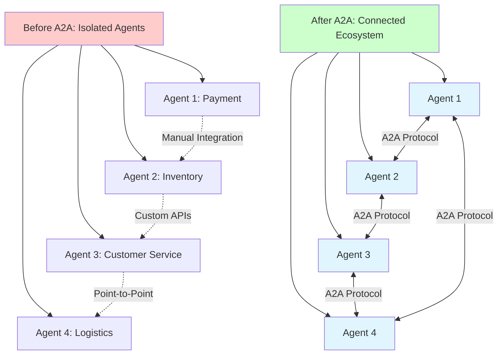
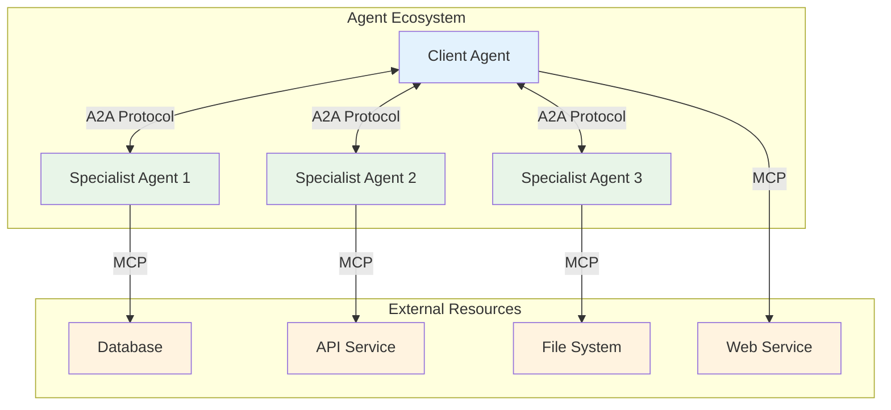
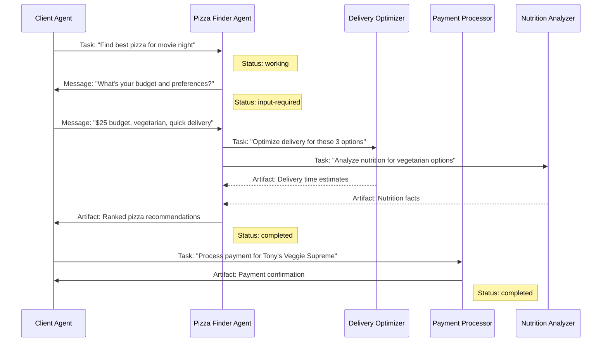
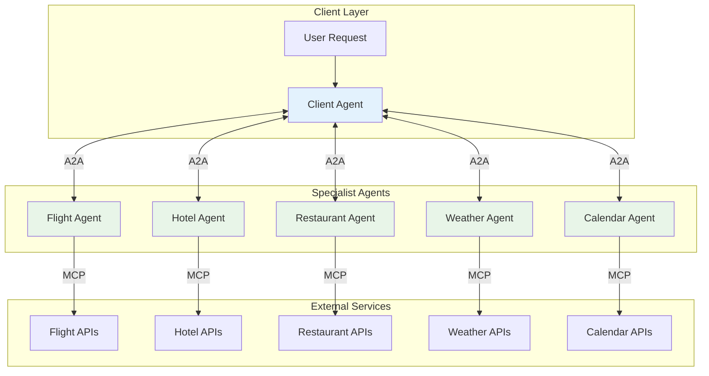
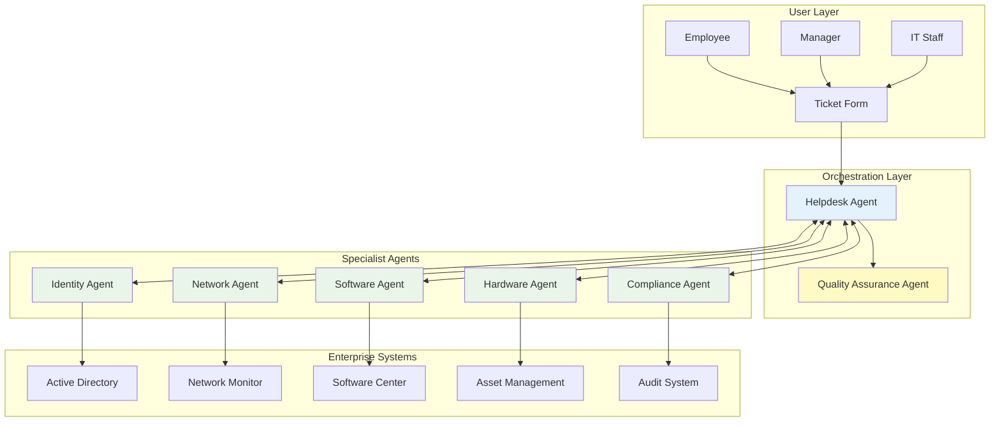
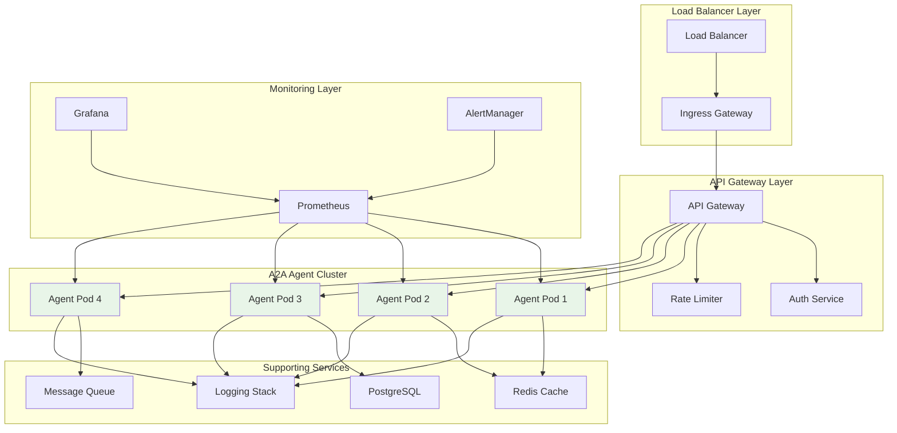
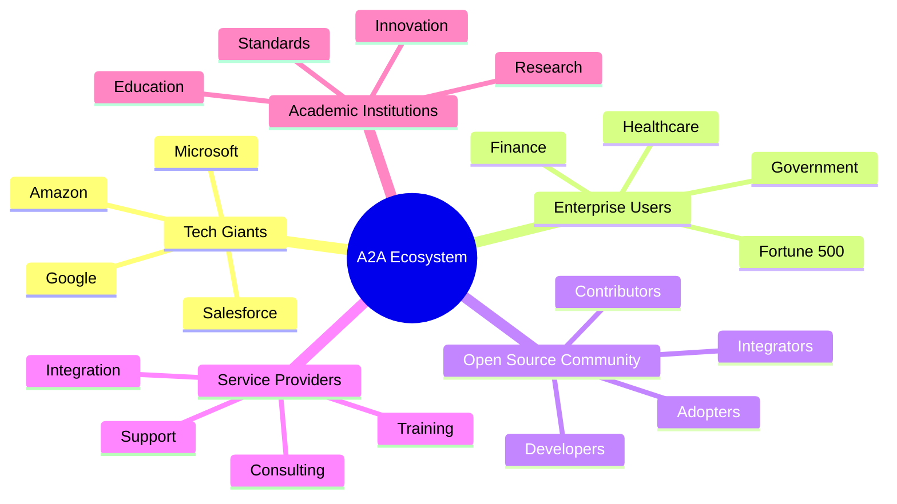

# A2A Protocol for the Impatient: From Novice to Practitioner in Record Time

_Master the future of AI agent communication in hours, not months_

---

## 1. The Story That Started It All: Why Your AI Agents Need to Talk

Picture this: It's 2:47 AM, and Sarah, a DevOps engineer at a Fortune 500 company, is awakened by her phone buzzing with alerts . The company's e-commerce platform is down, customers are angry, and revenue is hemorrhaging by the minute. But here's the real kicker – fixing this seemingly simple issue requires coordinating between seven different AI agents across five separate systems, each speaking its own proprietary language.

The payment processing agent can't communicate with the inventory management agent. The customer service chatbot has no way to get real-time updates from the logistics agent. The fraud detection system operates in complete isolation from the recommendation engine. Sarah spends three precious hours not fixing the core issue, but manually shuttling information between these digital islands like a human Google Translate for machines.

This nightmare scenario plays out thousands of times daily across enterprises worldwide . Companies have invested millions in AI agents, only to discover they've created expensive digital silos that can't collaborate. The result? Frustrated customers, burnt-out engineers, and AI investments that deliver a fraction of their potential value.

**This is exactly why Google, along with over 100 technology partners, created the Agent2Agent (A2A) Protocol** . Released in April 2025 and now governed by the Linux Foundation, A2A is the universal translator that finally allows AI agents to communicate, collaborate, and coordinate – regardless of who built them or what technology they use .



But why should you, the impatient learner, care about A2A right now? Because mastering A2A today positions you at the forefront of the next massive wave in AI automation . While others struggle with integration nightmares, you'll be orchestrating seamless multi-agent workflows that solve complex problems in minutes, not hours.

**Pause and Reflect**: Think about your current work environment. How many different AI tools or systems do you use daily? How much time do you waste manually copying information between them? Keep this in mind as we dive deeper.

---

## 2. What Is A2A Protocol? The Universal Language of AI Agents

Imagine walking into a United Nations assembly where every delegate speaks a different language, but somehow they're all having a perfectly coordinated conversation . That's A2A in action – a standardized protocol that enables AI agents built by different teams, using different technologies, to communicate as naturally as humans do.

### The Core Building Blocks

A2A consists of five fundamental components that work together like a well-orchestrated symphony :

#### 1. Agent Cards: The Digital Business Card

Think of an Agent Card as a digital resume that every A2A agent publishes . It's a JSON document that tells other agents:

- "Hi, I'm the Travel Booking Agent"
- "I can book flights, hotels, and rental cars"
- "Here's how to authenticate with me"
- "This is my service endpoint URL"

#### 2. Tasks: The Unit of Work

A Task is like a project ticket that moves through a defined lifecycle . It starts as "submitted," progresses to "working," might pause for "input-required," and finally reaches "completed" or "failed."

#### 3. Messages: The Conversation

Messages are how agents actually communicate . They're multi-modal (text, files, structured data) and follow a simple role-based pattern: "user" messages come from clients, "agent" messages come from servers.

#### 4. Artifacts: The Deliverables

Artifacts are the tangible outputs – reports, images, processed data – that agents produce . Think of them as the final deliverables of a project.

#### 5. Streaming: Real-Time Updates

Using Server-Sent Events (SSE), agents can provide real-time updates on long-running tasks . Imagine watching a progress bar fill up as an agent processes your request.

### A2A vs MCP: The Perfect Partnership

Here's where many people get confused. A2A and the Model Context Protocol (MCP) aren't competitors – they're perfect partners :

- **MCP**: Connects agents to tools, databases, and APIs (think "agent-to-resource")
- **A2A**: Connects agents to other agents (think "agent-to-agent")

It's like the difference between a craftsperson's toolbox (MCP) and a team meeting (A2A). You need both to build something amazing.



**Pro Tip**: Remember this simple rule – if you're connecting an agent to a tool or database, use MCP. If you're connecting an agent to another agent, use A2A. Many enterprise solutions use both protocols together.

---

## 3. The Pizza Shop Metaphor: Understanding A2A Through Familiar Eyes

Let's make A2A concrete with something we all understand: ordering pizza. Imagine you're hungry and want to order a pizza, but instead of calling one restaurant, you have access to a network of specialist agents that can give you the perfect meal experience .

### The Players in Our Pizza Story

**You (The Client Agent)**: The hungry customer who initiates the request
**Pizza Finder Agent**: Knows all the best pizza places in your area
**Delivery Optimizer Agent**: Calculates the fastest delivery routes
**Payment Processor Agent**: Handles the financial transaction
**Nutrition Analyzer Agent**: Provides dietary information

### The A2A Pizza Flow

Here's how this plays out using A2A Protocol:



### Breaking Down the Magic

1. **Agent Discovery**: Your client agent finds the Pizza Finder Agent by reading its Agent Card, which advertises skills like "restaurant_search" and "cuisine_matching"
2. **Task Initiation**: You send a task with the message "Find best pizza for movie night" – notice how natural and conversational this is, not rigid API calls
3. **Multi-Turn Interaction**: The Pizza Finder Agent asks for clarification, demonstrating A2A's support for conversational AI
4. **Agent Collaboration**: The Pizza Finder Agent delegates specialized tasks to other agents without you needing to coordinate
5. **Artifact Delivery**: Each agent produces concrete deliverables (delivery times, nutrition facts, payment confirmation)

**Interactive Element - Quick Quiz**:

- What are the five core A2A components demonstrated in this pizza example?
- Which agent transitions to "input-required" status and why?
- How does this differ from traditional API integration?

_(Answers: 1) Agent Cards, Tasks, Messages, Artifacts, Streaming; 2) Pizza Finder Agent, because it needs user preferences; 3) A2A enables natural conversation and automatic agent collaboration vs rigid API calls)_

---

## 4. Your First A2A Implementation: Hello World with Superpowers

Ready to get your hands dirty? Let's build your first A2A agent using Python . This isn't just a toy example – it's a foundation you can extend into production systems.

### Setting Up Your Development Environment

First, let's get you set up with the A2A Python SDK:

```bash
# Install the A2A SDK
pip install a2a-sdk

# Create your project directory
mkdir my-first-a2a-agent
cd my-first-a2a-agent
```

### Creating Your First Agent: The Echo Service

Let's start with a simple but powerful example – an echo agent that demonstrates all core A2A concepts:

```python
# echo_agent.py
import asyncio
from a2a_sdk import A2AServer, AgentCard, AgentSkill, Task, Message, TextPart

class EchoAgent:
    def __init__(self):
        self.server = A2AServer()
        self.setup_agent_card()
        self.setup_handlers()

    def setup_agent_card(self):
        """Create our agent's digital business card"""
        skill = AgentSkill(
            id="echo_text",
            name="Text Echo Service",
            description="Echoes back any text with helpful analysis",
            tags=["text", "analysis", "utility"],
            examples=[
                "Echo this message back to me",
                "Repeat: Hello, World!",
                "Echo and analyze: The weather is beautiful today"
            ]
        )

        self.agent_card = AgentCard(
            name="Echo Analysis Agent",
            description="A friendly agent that echoes your messages with insights",
            version="1.0.0",
            skills=[skill],
            defaultInputModes=["text/plain"],
            defaultOutputModes=["text/plain", "application/json"],
            capabilities={
                "streaming": True,
                "pushNotifications": False
            }
        )

    def setup_handlers(self):
        """Register our task handlers"""
        @self.server.task_handler
        async def handle_echo_task(task: Task) -> Task:
            # Extract the user's message
            user_message = task.status.message
            if not user_message or not user_message.parts:
                return self.create_error_response(task, "No message to echo")

            # Get the text to echo
            text_part = next((p for p in user_message.parts if p.kind == "text"), None)
            if not text_part:
                return self.create_error_response(task, "No text found to echo")

            original_text = text_part.text

            # Create our enhanced echo response
            echo_response = f"🔄 Echo: {original_text}\n"
            echo_response += f"📊 Analysis: {len(original_text)} characters, "
            echo_response += f"{len(original_text.split())} words"

            # Create response message
            response_message = Message(
                messageId=f"echo-response-{task.id}",
                role="agent",
                kind="message",
                parts=[TextPart(kind="text", text=echo_response)]
            )

            # Update task status
            task.status.state = "completed"
            task.status.message = response_message

            return task

    def create_error_response(self, task: Task, error_msg: str) -> Task:
        """Helper to create error responses"""
        error_message = Message(
            messageId=f"error-{task.id}",
            role="agent",
            kind="message",
            parts=[TextPart(kind="text", text=f"❌ Error: {error_msg}")]
        )

        task.status.state = "failed"
        task.status.message = error_message
        return task

    async def start(self, host="localhost", port=8080):
        """Start the A2A server"""
        print(f"🚀 Starting Echo Agent on {host}:{port}")
        print(f"📋 Agent Card available at: http://{host}:{port}/.well-known/agent.json")

        await self.server.start(
            host=host,
            port=port,
            agent_card=self.agent_card
        )

# Run the agent
if __name__ == "__main__":
    agent = EchoAgent()
    asyncio.run(agent.start())
```

### Testing Your Agent

Now let's create a simple client to test our agent:

```python
# test_client.py
import asyncio
from a2a_sdk import A2AClient, Message, TextPart, TaskSendParams

async def test_echo_agent():
    # Connect to our agent
    client = A2AClient("http://localhost:8080")

    # First, let's see what our agent can do
    agent_card = await client.get_agent_card()
    print(f"Connected to: {agent_card.name}")
    print(f"Description: {agent_card.description}")
    print(f"Skills: {[skill.name for skill in agent_card.skills]}")

    # Create a test message
    test_message = Message(
        messageId="test-1",
        role="user",
        kind="message",
        parts=[TextPart(kind="text", text="Hello, A2A World! This is my first agent interaction.")]
    )

    # Send the task
    params = TaskSendParams(
        message=test_message,
        taskId="echo-test-1"
    )

    result = await client.send_task(params)

    print(f"Task Status: {result.status.state}")
    print(f"Response: {result.status.message.parts.text}")

# Run the test
if __name__ == "__main__":
    asyncio.run(test_echo_agent())
```

### Running Your First A2A System

1. **Start the agent**: `python echo_agent.py`
2. **In another terminal, test it**: `python test_client.py`

You should see output like:

```
Connected to: Echo Analysis Agent
Description: A friendly agent that echoes your messages with insights
Skills: ['Text Echo Service']
Task Status: completed
Response: 🔄 Echo: Hello, A2A World! This is my first agent interaction.
📊 Analysis: 55 characters, 10 words
```

**Pro Tips for Your First Implementation**:

1. **Always validate input**: Check that messages contain the expected content
2. **Use meaningful IDs**: Task and message IDs help with debugging
3. **Implement proper error handling**: Failed tasks should return helpful error messages
4. **Test incrementally**: Start simple, then add complexity

**Common Pitfalls to Avoid**:

- Forgetting to set the task state to "completed"
- Not handling empty or malformed messages
- Blocking the async event loop with synchronous operations
- Hardcoding URLs instead of using configuration

---

## 5. Real-World Example: Smart Travel Assistant

Now let's level up with a practical example that showcases A2A's real power . We'll build a smart travel assistant that coordinates multiple specialist agents to plan your perfect trip.

### The Business Problem

Imagine you're a travel agency that wants to offer seamless trip planning. Customers should be able to say "Plan a 3-day business trip to San Francisco" and get a complete itinerary including flights, hotels, restaurant recommendations, and calendar integration – all handled automatically by coordinating AI agents.

### Our Multi-Agent Architecture



### Building the Flight Agent

Let's start with the Flight Agent, which demonstrates task lifecycle management and streaming updates:

```python
# flight_agent.py
import asyncio
import json
from datetime import datetime, timedelta
from a2a_sdk import A2AServer, AgentCard, AgentSkill, Task, Message, TextPart, DataPart, Artifact

class FlightAgent:
    def __init__(self):
        self.server = A2AServer()
        self.setup_agent_card()
        self.setup_handlers()

    def setup_agent_card(self):
        flight_search_skill = AgentSkill(
            id="flight_search",
            name="Flight Search & Booking",
            description="Search for flights, compare prices, and provide booking options",
            tags=["travel", "flights", "booking", "aviation"],
            examples=[
                "Find flights from NYC to SFO for March 15th",
                "Search for round-trip flights to Paris, departing next Monday",
                "Find the cheapest flights from LA to Tokyo"
            ],
            inputModes=["text/plain", "application/json"],
            outputModes=["application/json", "text/plain"]
        )

        self.agent_card = AgentCard(
            name="Flight Booking Agent",
            description="Specialized agent for flight search, comparison, and booking assistance",
            version="2.1.0",
            skills=[flight_search_skill],
            capabilities={
                "streaming": True,
                "pushNotifications": True
            }
        )

    def setup_handlers(self):
        @self.server.task_handler
        async def handle_flight_search(task: Task) -> Task:
            """Handle flight search requests with streaming updates"""

            # Update task to working state
            task.status.state = "working"
            task.status.message = Message(
                messageId=f"status-{task.id}",
                role="agent",
                kind="message",
                parts=[TextPart(kind="text", text="🔍 Searching for flights...")]
            )

            # Extract search parameters
            search_params = self.extract_search_params(task)
            if not search_params:
                return self.create_error_response(task, "Could not understand flight search request")

            # Simulate flight search with streaming updates
            flight_results = await self.search_flights_with_streaming(task, search_params)

            # Create final response
            if flight_results:
                task.status.state = "completed"
                task.artifacts = [self.create_flight_artifact(flight_results)]
                task.status.message = Message(
                    messageId=f"completed-{task.id}",
                    role="agent",
                    kind="message",
                    parts=[TextPart(kind="text", text=f"✅ Found {len(flight_results)} flight options")]
                )
            else:
                return self.create_error_response(task, "No flights found matching your criteria")

            return task

    def extract_search_params(self, task: Task) -> dict:
        """Extract flight search parameters from the user message"""
        # In a real implementation, you'd use NLP to parse the request
        # For demo purposes, we'll look for structured data or parse simple text

        user_message = task.status.message
        if not user_message:
            return None

        # Check if we have structured data
        data_parts = [p for p in user_message.parts if p.kind == "data"]
        if data_parts:
            return data_parts.data

        # Simple text parsing (in production, use proper NLP)
        text_parts = [p for p in user_message.parts if p.kind == "text"]
        if text_parts:
            text = text_parts.text.lower()

            # Basic parsing - you'd use sophisticated NLP in production
            params = {
                "origin": "NYC" if "nyc" in text or "new york" in text else "LAX",
                "destination": "SFO" if "sfo" in text or "san francisco" in text else "JFK",
                "departure_date": (datetime.now() + timedelta(days=7)).isoformat(),
                "return_date": (datetime.now() + timedelta(days=10)).isoformat() if "round" in text else None,
                "passengers": 1,
                "class": "economy"
            }
            return params

        return None

    async def search_flights_with_streaming(self, task: Task, search_params: dict) -> list:
        """Simulate flight search with streaming progress updates"""

        # Simulate searching multiple airlines
        airlines = ["Delta", "United", "American", "JetBlue", "Southwest"]
        results = []

        for i, airline in enumerate(airlines):
            # Send streaming update
            if hasattr(task, 'stream_update'):  # In real implementation
                await task.stream_update(f"Searching {airline}... ({i+1}/{len(airlines)})")

            # Simulate API call delay
            await asyncio.sleep(0.5)

            # Simulate finding flights
            if airline != "Southwest":  # Simulate some airlines having availability
                flight = {
                    "airline": airline,
                    "flight_number": f"{airline[:2].upper()}{100 + i}",
                    "departure": {
                        "airport": search_params["origin"],
                        "time": "08:00",
                        "date": search_params["departure_date"]
                    },
                    "arrival": {
                        "airport": search_params["destination"],
                        "time": "11:30",
                        "date": search_params["departure_date"]
                    },
                    "price": 299 + (i * 50),
                    "duration": "5h 30m",
                    "stops": 0 if i < 2 else 1
                }
                results.append(flight)

        return results

    def create_flight_artifact(self, flight_results: list) -> Artifact:
        """Create a structured artifact containing flight search results"""
        return Artifact(
            artifactId=f"flight-results-{datetime.now().strftime('%Y%m%d-%H%M%S')}",
            name="Flight Search Results",
            description="Available flight options matching your search criteria",
            parts=[
                DataPart(
                    kind="data",
                    data={
                        "search_timestamp": datetime.now().isoformat(),
                        "total_results": len(flight_results),
                        "flights": flight_results,
                        "currency": "USD"
                    }
                )
            ],
            metadata={
                "search_completed": True,
                "result_count": len(flight_results)
            }
        )

    def create_error_response(self, task: Task, error_msg: str) -> Task:
        """Create an error response for failed flight searches"""
        task.status.state = "failed"
        task.status.message = Message(
            messageId=f"error-{task.id}",
            role="agent",
            kind="message",
            parts=[TextPart(kind="text", text=f"❌ Flight Search Error: {error_msg}")]
        )
        return task

    async def start(self, host="localhost", port=8081):
        """Start the Flight Agent server"""
        print(f"✈️ Starting Flight Agent on {host}:{port}")
        await self.server.start(host=host, port=port, agent_card=self.agent_card)

if __name__ == "__main__":
    agent = FlightAgent()
    asyncio.run(agent.start())
```

### The Coordinating Travel Assistant

Now let's create the main travel assistant that orchestrates all the specialist agents:

```python
# travel_assistant.py
import asyncio
import json
from datetime import datetime
from a2a_sdk import A2AClient, A2AServer, AgentCard, AgentSkill, Task, Message, TextPart, DataPart

class TravelAssistant:
    def __init__(self):
        self.server = A2AServer()
        self.setup_agent_card()
        self.setup_handlers()

        # Specialist agent clients
        self.flight_agent = A2AClient("http://localhost:8081")
        self.hotel_agent = A2AClient("http://localhost:8082")
        self.restaurant_agent = A2AClient("http://localhost:8083")

    def setup_agent_card(self):
        travel_planning_skill = AgentSkill(
            id="travel_planning",
            name="Complete Travel Planning",
            description="Plans comprehensive trips including flights, hotels, dining, and activities",
            tags=["travel", "planning", "coordination", "itinerary"],
            examples=[
                "Plan a 3-day business trip to San Francisco",
                "Organize a week-long vacation to Paris with family",
                "Create an itinerary for a weekend getaway to Miami"
            ]
        )

        self.agent_card = AgentCard(
            name="Smart Travel Assistant",
            description="Your personal travel coordinator that handles everything from flights to dining",
            version="1.0.0",
            skills=[travel_planning_skill],
            capabilities={"streaming": True}
        )

    def setup_handlers(self):
        @self.server.task_handler
        async def handle_travel_planning(task: Task) -> Task:
            """Orchestrate complete travel planning"""

            # Parse the travel request
            travel_request = self.parse_travel_request(task)
            if not travel_request:
                return self.create_error_response(task, "Could not understand travel request")

            # Update task to working state
            task.status.state = "working"
            task.status.message = Message(
                messageId=f"planning-{task.id}",
                role="agent",
                kind="message",
                parts=[TextPart(kind="text", text="🗺️ Planning your trip...")]
            )

            try:
                # Coordinate with specialist agents
                itinerary = await self.coordinate_travel_planning(travel_request)

                # Create final itinerary artifact
                task.artifacts = [self.create_itinerary_artifact(itinerary)]
                task.status.state = "completed"
                task.status.message = Message(
                    messageId=f"completed-{task.id}",
                    role="agent",
                    kind="message",
                    parts=[TextPart(kind="text", text="🎉 Your complete travel itinerary is ready!")]
                )

            except Exception as e:
                return self.create_error_response(task, f"Planning failed: {str(e)}")

            return task

    async def coordinate_travel_planning(self, travel_request: dict) -> dict:
        """Coordinate with specialist agents to plan the trip"""

        # Step 1: Find flights
        flight_task = await self.flight_agent.send_task({
            "message": {
                "messageId": "flight-search",
                "role": "user",
                "kind": "message",
                "parts": [
                    {
                        "kind": "data",
                        "data": {
                            "origin": travel_request["origin"],
                            "destination": travel_request["destination"],
                            "departure_date": travel_request["departure_date"],
                            "return_date": travel_request.get("return_date"),
                            "passengers": travel_request.get("passengers", 1)
                        }
                    }
                ]
            }
        })

        # Step 2: Find hotels (parallel with flights)
        hotel_task = await self.hotel_agent.send_task({
            "message": {
                "messageId": "hotel-search",
                "role": "user",
                "kind": "message",
                "parts": [
                    {
                        "kind": "data",
                        "data": {
                            "destination": travel_request["destination"],
                            "check_in": travel_request["departure_date"],
                            "check_out": travel_request.get("return_date"),
                            "guests": travel_request.get("passengers", 1),
                            "budget": travel_request.get("hotel_budget", "mid-range")
                        }
                    }
                ]
            }
        })

        # Step 3: Get restaurant recommendations
        restaurant_task = await self.restaurant_agent.send_task({
            "message": {
                "messageId": "restaurant-search",
                "role": "user",
                "kind": "message",
                "parts": [
                    {
                        "kind": "data",
                        "data": {
                            "destination": travel_request["destination"],
                            "cuisine_preferences": travel_request.get("cuisine", ["any"]),
                            "meal_types": ["breakfast", "lunch", "dinner"],
                            "budget": travel_request.get("dining_budget", "moderate")
                        }
                    }
                ]
            }
        })

        # Combine all results
        return {
            "flights": flight_task.artifacts.parts.data if flight_task.artifacts else None,
            "hotels": hotel_task.artifacts.parts.data if hotel_task.artifacts else None,
            "restaurants": restaurant_task.artifacts.parts.data if restaurant_task.artifacts else None,
            "travel_dates": {
                "departure": travel_request["departure_date"],
                "return": travel_request.get("return_date")
            }
        }

    def parse_travel_request(self, task: Task) -> dict:
        """Parse the user's travel request"""
        # Simplified parsing - in production, use sophisticated NLP
        user_message = task.status.message
        if not user_message:
            return None

        text_parts = [p for p in user_message.parts if p.kind == "text"]
        if not text_parts:
            return None

        text = text_parts.text.lower()

        # Basic parsing logic
        request = {
            "origin": "NYC",  # Default, would extract from text
            "destination": "San Francisco" if "san francisco" in text or "sfo" in text else "Los Angeles",
            "departure_date": (datetime.now() + timedelta(days=14)).isoformat(),
            "duration_days": 3,
            "purpose": "business" if "business" in text else "leisure"
        }

        # Add return date for round trips
        if "round" in text or request["purpose"] == "business":
            request["return_date"] = (datetime.now() + timedelta(days=14 + request["duration_days"])).isoformat()

        return request

    def create_itinerary_artifact(self, itinerary: dict) -> Artifact:
        """Create a comprehensive itinerary artifact"""
        return Artifact(
            artifactId=f"itinerary-{datetime.now().strftime('%Y%m%d-%H%M%S')}",
            name="Complete Travel Itinerary",
            description="Your personalized travel plan with flights, hotels, and dining recommendations",
            parts=[
                DataPart(
                    kind="data",
                    data=itinerary
                ),
                TextPart(
                    kind="text",
                    text=self.format_itinerary_summary(itinerary)
                )
            ]
        )

    def format_itinerary_summary(self, itinerary: dict) -> str:
        """Format a human-readable itinerary summary"""
        summary = "🎯 Your Travel Itinerary Summary\n\n"

        if itinerary.get("flights"):
            summary += "✈️ Flights:\n"
            flights = itinerary["flights"].get("flights", [])
            for flight in flights[:2]:  # Show top 2 options
                summary += f"  • {flight['airline']} {flight['flight_number']} - ${flight['price']}\n"
            summary += "\n"

        if itinerary.get("hotels"):
            summary += "🏨 Hotels:\n"
            hotels = itinerary["hotels"].get("hotels", [])
            for hotel in hotels[:2]:  # Show top 2 options
                summary += f"  • {hotel['name']} - ${hotel['price']}/night\n"
            summary += "\n"

        if itinerary.get("restaurants"):
            summary += "🍽️ Dining Recommendations:\n"
            restaurants = itinerary["restaurants"].get("restaurants", [])
            for restaurant in restaurants[:3]:  # Show top 3 options
                summary += f"  • {restaurant['name']} - {restaurant['cuisine']}\n"

        return summary

    def create_error_response(self, task: Task, error_msg: str) -> Task:
        """Create an error response"""
        task.status.state = "failed"
        task.status.message = Message(
            messageId=f"error-{task.id}",
            role="agent",
            kind="message",
            parts=[TextPart(kind="text", text=f"❌ {error_msg}")]
        )
        return task

    async def start(self, host="localhost", port=8080):
        """Start the Travel Assistant server"""
        print(f"🌍 Starting Travel Assistant on {host}:{port}")
        await self.server.start(host=host, port=port, agent_card=self.agent_card)

if __name__ == "__main__":
    assistant = TravelAssistant()
    asyncio.run(assistant.start())
```

### Testing the Complete System

Here's a client to test our multi-agent travel system:

```python
# test_travel_system.py
import asyncio
from a2a_sdk import A2AClient, Message, TextPart, TaskSendParams

async def test_travel_planning():
    # Connect to our travel assistant
    client = A2AClient("http://localhost:8080")

    # Create a travel request
    travel_request = Message(
        messageId="travel-request-1",
        role="user",
        kind="message",
        parts=[TextPart(
            kind="text",
            text="Plan a 3-day business trip to San Francisco departing next Monday"
        )]
    )

    # Send the planning task
    params = TaskSendParams(
        message=travel_request,
        taskId="travel-planning-1"
    )

    print("🚀 Submitting travel planning request...")
    result = await client.send_task(params)

    print(f"📋 Task Status: {result.status.state}")
    print(f"💬 Message: {result.status.message.parts.text}")

    if result.artifacts:
        print("\n📄 Itinerary Created:")
        itinerary_text = next(
            (part.text for part in result.artifacts.parts if part.kind == "text"),
            "No summary available"
        )
        print(itinerary_text)

if __name__ == "__main__":
    asyncio.run(test_travel_planning())
```

### Key Insights from This Example

This travel assistant demonstrates several crucial A2A patterns:

1. **Agent Orchestration**: The main assistant coordinates multiple specialist agents
2. **Parallel Processing**: Flight and hotel searches happen simultaneously
3. **Structured Data Exchange**: Using DataPart for complex parameters
4. **Error Handling**: Graceful failure management across agent boundaries
5. **Artifact Creation**: Producing rich, structured outputs

**Pause and Reflect**: How would you extend this system? What other specialist agents would you add? Consider weather, local events, transportation, or budget tracking agents.

---

## 6. Enterprise Implementation: IT Helpdesk Automation

Let's tackle a real enterprise challenge that showcases A2A's power in production environments . We'll build an intelligent IT helpdesk system that can automatically resolve common issues by coordinating multiple specialized agents.

### The Enterprise Challenge

TechCorp's IT helpdesk receives 500+ tickets daily. Most are repetitive: password resets, software installations, network connectivity issues, and hardware problems. Currently, each ticket requires human intervention, creating bottlenecks and frustrated users. The company wants to automate 80% of routine tickets while maintaining security and compliance.

### The A2A Solution Architecture



### Building the Network Diagnostic Agent

Let's start with a specialist agent that can diagnose and resolve network issues:

```python
# network_agent.py
import asyncio
import json
import subprocess
from datetime import datetime
from a2a_sdk import A2AServer, AgentCard, AgentSkill, Task, Message, TextPart, DataPart, Artifact

class NetworkDiagnosticAgent:
    def __init__(self):
        self.server = A2AServer()
        self.setup_agent_card()
        self.setup_handlers()

    def setup_agent_card(self):
        network_diagnostic_skill = AgentSkill(
            id="network_diagnosis",
            name="Network Connectivity Diagnosis",
            description="Diagnoses and resolves network connectivity issues including DNS, routing, and firewall problems",
            tags=["network", "connectivity", "diagnosis", "troubleshooting"],
            examples=[
                "User can't access internal websites",
                "Internet connection is slow",
                "Cannot connect to company VPN",
                "Email server unreachable"
            ]
        )

        network_repair_skill = AgentSkill(
            id="network_repair",
            name="Automated Network Repair",
            description="Automatically fixes common network issues when safe to do so",
            tags=["network", "repair", "automation", "fixes"],
            examples=[
                "Reset network adapter",
                "Flush DNS cache",
                "Renew IP address",
                "Restart network services"
            ]
        )

        self.agent_card = AgentCard(
            name="Network Diagnostic Agent",
            description="Specialist agent for diagnosing and resolving network connectivity issues",
            version="2.0.0",
            skills=[network_diagnostic_skill, network_repair_skill],
            capabilities={
                "streaming": True,
                "pushNotifications": True
            },
            # Enterprise security requirements
            securitySchemes={
                "bearer": {
                    "type": "http",
                    "scheme": "bearer",
                    "bearerFormat": "JWT"
                }
            },
            security=[{"bearer": []}]
        )

    def setup_handlers(self):
        @self.server.task_handler
        async def handle_network_diagnosis(task: Task) -> Task:
            """Handle network diagnostic requests"""

            # Validate authentication (in production, extract from HTTP headers)
            if not self.validate_authentication(task):
                return self.create_error_response(task, "Authentication required", "auth-required")

            # Extract diagnostic parameters
            diagnostic_request = self.parse_diagnostic_request(task)
            if not diagnostic_request:
                return self.create_error_response(task, "Invalid diagnostic request format")

            # Update task to working state
            task.status.state = "working"
            task.status.message = Message(
                messageId=f"diagnosing-{task.id}",
                role="agent",
                kind="message",
                parts=[TextPart(kind="text", text="🔍 Running network diagnostics...")]
            )

            # Perform comprehensive network diagnosis
            diagnosis_results = await self.perform_network_diagnosis(diagnostic_request)

            # Determine if automatic repair is possible
            repair_actions = self.determine_repair_actions(diagnosis_results)

            if repair_actions and diagnostic_request.get("allow_auto_repair", False):
                # Perform automatic repairs
                repair_results = await self.perform_repairs(repair_actions)
                diagnosis_results["repairs_performed"] = repair_results

            # Create diagnostic report artifact
            task.artifacts = [self.create_diagnostic_artifact(diagnosis_results)]

            # Update final status
            if diagnosis_results["issues_found"]:
                if repair_actions and diagnostic_request.get("allow_auto_repair", False):
                    task.status.state = "completed"
                    task.status.message = Message(
                        messageId=f"completed-{task.id}",
                        role="agent",
                        kind="message",
                        parts=[TextPart(kind="text", text="✅ Network issues diagnosed and repaired automatically")]
                    )
                else:
                    task.status.state = "input-required"
                    task.status.message = Message(
                        messageId=f"input-required-{task.id}",
                        role="agent",
                        kind="message",
                        parts=[TextPart(kind="text", text="⚠️ Issues found. Manual intervention or approval required for repairs")]
                    )
            else:
                task.status.state = "completed"
                task.status.message = Message(
                    messageId=f"completed-{task.id}",
                    role="agent",
                    kind="message",
                    parts=[TextPart(kind="text", text="✅ Network diagnostics completed - no issues found")]
                )

            return task

    def validate_authentication(self, task: Task) -> bool:
        """Validate enterprise authentication"""
        # In production, validate JWT token from HTTP headers
        # For demo, we'll simulate validation
        return True

    def parse_diagnostic_request(self, task: Task) -> dict:
        """Parse the diagnostic request from the user"""
        user_message = task.status.message
        if not user_message:
            return None

        # Look for structured diagnostic data
        data_parts = [p for p in user_message.parts if p.kind == "data"]
        if data_parts:
            return data_parts.data

        # Parse text-based requests
        text_parts = [p for p in user_message.parts if p.kind == "text"]
        if text_parts:
            text = text_parts.text.lower()

            # Extract key information
            return {
                "user_id": "unknown",  # Would extract from auth context
                "computer_name": "unknown",  # Would extract from request
                "symptoms": text,
                "priority": "normal",
                "allow_auto_repair": "auto" in text or "fix" in text,
                "tests_requested": self.determine_tests_from_symptoms(text)
            }

        return None

    def determine_tests_from_symptoms(self, symptoms: str) -> list:
        """Determine which diagnostic tests to run based on symptoms"""
        tests = []

        if any(keyword in symptoms for keyword in ["slow", "timeout", "unreachable"]):
            tests.extend(["ping_test", "traceroute", "dns_lookup"])

        if any(keyword in symptoms for keyword in ["wifi", "wireless", "connection"]):
            tests.extend(["wifi_status", "adapter_status"])

        if any(keyword in symptoms for keyword in ["website", "internet", "browser"]):
            tests.extend(["external_connectivity", "dns_resolution"])

        if any(keyword in symptoms for keyword in ["email", "outlook", "smtp"]):
            tests.extend(["email_server_connectivity", "port_tests"])

        # Default comprehensive tests if no specific symptoms
        if not tests:
            tests = ["ping_test", "dns_lookup", "adapter_status", "external_connectivity"]

        return tests

    async def perform_network_diagnosis(self, request: dict) -> dict:
        """Perform comprehensive network diagnosis"""
        results = {
            "timestamp": datetime.now().isoformat(),
            "user_id": request["user_id"],
            "computer_name": request["computer_name"],
            "tests_performed": [],
            "issues_found": [],
            "recommendations": []
        }

        # Run requested tests
        for test_name in request["tests_requested"]:
            test_result = await self.run_diagnostic_test(test_name)
            results["tests_performed"].append(test_result)

            # Analyze results for issues
            if not test_result["passed"]:
                results["issues_found"].append({
                    "test": test_name,
                    "issue": test_result["issue"],
                    "severity": test_result["severity"],
                    "recommended_action": test_result["recommended_action"]
                })

        return results

    async def run_diagnostic_test(self, test_name: str) -> dict:
        """Run a specific diagnostic test"""
        # Simulate various network diagnostic tests
        test_results = {
            "ping_test": await self.ping_test(),
            "dns_lookup": await self.dns_lookup_test(),
            "adapter_status": await self.adapter_status_test(),
            "external_connectivity": await self.external_connectivity_test(),
            "wifi_status": await self.wifi_status_test(),
            "email_server_connectivity": await self.email_server_test(),
            "port_tests": await self.port_connectivity_test()
        }

        return test_results.get(test_name, {
            "test_name": test_name,
            "passed": False,
            "issue": "Unknown test type",
            "severity": "low",
            "recommended_action": "Contact IT support"
        })

    async def ping_test(self) -> dict:
        """Test basic network connectivity"""
        try:
            # Simulate ping test (in production, use actual ping)
            await asyncio.sleep(0.1)  # Simulate test time

            # Simulate successful ping
            return {
                "test_name": "ping_test",
                "passed": True,
                "latency_ms": 23,
                "packet_loss": 0,
                "target": "8.8.8.8"
            }
        except Exception as e:
            return {
                "test_name": "ping_test",
                "passed": False,
                "issue": "Network connectivity failure",
                "severity": "high",
                "recommended_action": "Check network cable and adapter settings"
            }

    async def dns_lookup_test(self) -> dict:
        """Test DNS resolution"""
        try:
            await asyncio.sleep(0.2)

            # Simulate DNS test
            return {
                "test_name": "dns_lookup",
                "passed": True,
                "dns_server": "8.8.8.8",
                "lookup_time_ms": 45,
                "resolved_ip": "172.217.164.110"
            }
        except Exception:
            return {
                "test_name": "dns_lookup",
                "passed": False,
                "issue": "DNS resolution failure",
                "severity": "medium",
                "recommended_action": "Flush DNS cache or change DNS servers"
            }

    async def adapter_status_test(self) -> dict:
        """Check network adapter status"""
        await asyncio.sleep(0.1)

        return {
            "test_name": "adapter_status",
            "passed": True,
            "adapter_name": "Ethernet",
            "status": "Connected",
            "speed": "1 Gbps",
            "ip_address": "192.168.1.100"
        }

    async def external_connectivity_test(self) -> dict:
        """Test external internet connectivity"""
        await asyncio.sleep(0.3)

        return {
            "test_name": "external_connectivity",
            "passed": True,
            "tested_sites": ["google.com", "microsoft.com"],
            "all_reachable": True
        }

    async def wifi_status_test(self) -> dict:
        """Check WiFi connection status"""
        await asyncio.sleep(0.1)

        return {
            "test_name": "wifi_status",
            "passed": True,
            "connected_network": "TechCorp_Secure",
            "signal_strength": "Excellent",
            "security": "WPA2-Enterprise"
        }

    async def email_server_test(self) -> dict:
        """Test email server connectivity"""
        await asyncio.sleep(0.2)

        return {
            "test_name": "email_server_connectivity",
            "passed": False,
            "issue": "SMTP server unreachable on port 587",
            "severity": "medium",
            "recommended_action": "Check firewall settings or contact email admin"
        }

    async def port_connectivity_test(self) -> dict:
        """Test specific port connectivity"""
        await asyncio.sleep(0.2)

        return {
            "test_name": "port_tests",
            "passed": True,
            "ports_tested": [80, 443, 25, 587],
            "open_ports": [80, 443],
            "blocked_ports": [25, 587]
        }

    def determine_repair_actions(self, diagnosis_results: dict) -> list:
        """Determine what automatic repairs can be performed"""
        repair_actions = []

        for issue in diagnosis_results["issues_found"]:
            if issue["test"] == "dns_lookup" and "dns" in issue["issue"].lower():
                repair_actions.append({
                    "action": "flush_dns",
                    "description": "Flush DNS cache",
                    "safety_level": "safe"
                })

            elif issue["test"] == "adapter_status" and "adapter" in issue["issue"].lower():
                repair_actions.append({
                    "action": "restart_adapter",
                    "description": "Restart network adapter",
                    "safety_level": "safe"
                })

            elif issue["test"] == "external_connectivity":
                repair_actions.append({
                    "action": "renew_ip",
                    "description": "Renew IP address",
                    "safety_level": "safe"
                })

        return repair_actions

    async def perform_repairs(self, repair_actions: list) -> list:
        """Perform automatic network repairs"""
        repair_results = []

        for action in repair_actions:
            if action["safety_level"] == "safe":
                result = await self.execute_repair_action(action)
                repair_results.append(result)

        return repair_results

    async def execute_repair_action(self, action: dict) -> dict:
        """Execute a specific repair action"""
        # Simulate repair actions
        await asyncio.sleep(0.5)

        repair_functions = {
            "flush_dns": self.flush_dns_cache,
            "restart_adapter": self.restart_network_adapter,
            "renew_ip": self.renew_ip_address
        }

        repair_func = repair_functions.get(action["action"])
        if repair_func:
            return await repair_func()

        return {
            "action": action["action"],
            "success": False,
            "message": "Unknown repair action"
        }

    async def flush_dns_cache(self) -> dict:
        """Flush DNS cache"""
        # In production, execute: ipconfig /flushdns (Windows) or sudo dscacheutil -flushcache (Mac)
        return {
            "action": "flush_dns",
            "success": True,
            "message": "DNS cache flushed successfully"
        }

    async def restart_network_adapter(self) -> dict:
        """Restart network adapter"""
        # In production, execute appropriate network adapter restart commands
        return {
            "action": "restart_adapter",
            "success": True,
            "message": "Network adapter restarted successfully"
        }

    async def renew_ip_address(self) -> dict:
        """Renew IP address"""
        # In production, execute: ipconfig /renew (Windows) or sudo dhclient -r && sudo dhclient (Linux)
        return {
            "action": "renew_ip",
            "success": True,
            "message": "IP address renewed successfully"
        }

    def create_diagnostic_artifact(self, diagnosis_results: dict) -> Artifact:
        """Create a comprehensive diagnostic report"""
        return Artifact(
            artifactId=f"network-diagnosis-{datetime.now().strftime('%Y%m%d-%H%M%S')}",
            name="Network Diagnostic Report",
            description="Comprehensive network connectivity analysis and repair recommendations",
            parts=[
                DataPart(
                    kind="data",
                    data=diagnosis_results
                ),
                TextPart(
                    kind="text",
                    text=self.format_diagnostic_summary(diagnosis_results)
                )
            ],
            metadata={
                "report_type": "network_diagnosis",
                "issues_count": len(diagnosis_results["issues_found"]),
                "tests_run": len(diagnosis_results["tests_performed"])
            }
        )

    def format_diagnostic_summary(self, results: dict) -> str:
        """Format a human-readable diagnostic summary"""
        summary = "🔍 Network Diagnostic Report\n\n"

        summary += f"📊 Tests Performed: {len(results['tests_performed'])}\n"
        summary += f"⚠️ Issues Found: {len(results['issues_found'])}\n\n"

        if results["issues_found"]:
            summary += "🚨 Issues Detected:\n"
            for issue in results["issues_found"]:
                summary += f"  • {issue['test']}: {issue['issue']} (Severity: {issue['severity']})\n"
                summary += f"    Recommendation: {issue['recommended_action']}\n"
        else:
            summary += "✅ No issues detected - network is functioning normally\n"

        if results.get("repairs_performed"):
            summary += "\n🔧 Repairs Performed:\n"
            for repair in results["repairs_performed"]:
                status = "✅" if repair["success"] else "❌"
                summary += f"  {status} {repair['action']}: {repair['message']}\n"

        return summary

    def create_error_response(self, task: Task, error_msg: str, state: str = "failed") -> Task:
        """Create an error response"""
        task.status.state = state
        task.status.message = Message(
            messageId=f"error-{task.id}",
            role="agent",
            kind="message",
            parts=[TextPart(kind="text", text=f"❌ Network Agent Error: {error_msg}")]
        )
        return task

    async def start(self, host="localhost", port=8084):
        """Start the Network Diagnostic Agent"""
        print(f"🌐 Starting Network Diagnostic Agent on {host}:{port}")
        await self.server.start(host=host, port=port, agent_card=self.agent_card)

if __name__ == "__main__":
    agent = NetworkDiagnosticAgent()
    asyncio.run(agent.start())
```

### The Enterprise Helpdesk Orchestrator

Now let's create the main helpdesk agent that orchestrates all specialist agents:

```python
# helpdesk_orchestrator.py
import asyncio
import json
from datetime import datetime
from a2a_sdk import A2AClient, A2AServer, AgentCard, AgentSkill, Task, Message, TextPart, DataPart, Artifact

class HelpdeskOrchestrator:
    def __init__(self):
        self.server = A2AServer()
        self.setup_agent_card()
        self.setup_handlers()

        # Specialist agent clients
        self.network_agent = A2AClient("http://localhost:8084")
        self.identity_agent = A2AClient("http://localhost:8085")
        self.software_agent = A2AClient("http://localhost:8086")
        self.hardware_agent = A2AClient("http://localhost:8087")

        # Ticket classification model (simulated)
        self.ticket_classifier = TicketClassifier()

    def setup_agent_card(self):
        helpdesk_skill = AgentSkill(
            id="helpdesk_automation",
            name="Intelligent IT Helpdesk",
            description="Automated IT support that routes and resolves tickets using specialist agents",
            tags=["helpdesk", "automation", "IT", "support"],
            examples=[
                "I can't connect to the company network",
                "My password expired and I can't reset it",
                "Need to install new software on my computer",
                "My laptop is running very slowly"
            ]
        )

        self.agent_card = AgentCard(
            name="Enterprise Helpdesk Orchestrator",
            description="Intelligent IT helpdesk that automatically routes and resolves support tickets",
            version="3.0.0",
            skills=[helpdesk_skill],
            capabilities={
                "streaming": True,
                "pushNotifications": True
            }
        )

    def setup_handlers(self):
        @self.server.task_handler
        async def handle_helpdesk_ticket(task: Task) -> Task:
            """Handle incoming IT support tickets"""

            # Parse the support ticket
            ticket_data = self.parse_support_ticket(task)
            if not ticket_data:
                return self.create_error_response(task, "Invalid ticket format")

            # Classify the ticket
            classification = self.ticket_classifier.classify_ticket(ticket_data)

            # Update task status
            task.status.state = "working"
            task.status.message = Message(
                messageId=f"processing-{task.id}",
                role="agent",
                kind="message",
                parts=[TextPart(kind="text", text=f"🎫 Processing {classification['category']} ticket...")]
            )

            # Route to appropriate specialist agent
            resolution_result = await self.route_to_specialist(classification, ticket_data)

            # Create comprehensive ticket resolution report
            task.artifacts = [self.create_resolution_artifact(ticket_data, classification, resolution_result)]

            # Update final status based on resolution
            if resolution_result["resolved"]:
                task.status.state = "completed"
                task.status.message = Message(
                    messageId=f"resolved-{task.id}",
                    role="agent",
                    kind="message",
                    parts=[TextPart(kind="text", text=f"✅ Ticket resolved automatically: {resolution_result['summary']}")]
                )
            else:
                task.status.state = "input-required"
                task.status.message = Message(
                    messageId=f"escalation-{task.id}",
                    role="agent",
                    kind="message",
                    parts=[TextPart(kind="text", text=f"⚠️ Ticket requires human intervention: {resolution_result['reason']}")]
                )

            return task

    def parse_support_ticket(self, task: Task) -> dict:
        """Parse the support ticket from user input"""
        user_message = task.status.message
        if not user_message:
            return None

        # Extract ticket data from message parts
        ticket_data = {
            "timestamp": datetime.now().isoformat(),
            "user_id": "unknown",  # Would extract from auth context
            "priority": "normal",
            "category": "unknown",
            "description": "",
            "symptoms": []
        }

        # Process text parts
        text_parts = [p for p in user_message.parts if p.kind == "text"]
        if text_parts:
            ticket_data["description"] = text_parts.text
            ticket_data["symptoms"] = self.extract_symptoms(text_parts.text)

        # Process structured data if available
        data_parts = [p for p in user_message.parts if p.kind == "data"]
        if data_parts:
            ticket_data.update(data_parts.data)

        return ticket_data

    def extract_symptoms(self, description: str) -> list:
        """Extract symptoms from ticket description"""
        symptoms = []
        description_lower = description.lower()

        # Network-related symptoms
        if any(keyword in description_lower for keyword in ["network", "internet", "wifi", "connection"]):
            symptoms.append("network_issues")

        # Performance symptoms
        if any(keyword in description_lower for keyword in ["slow", "freeze", "crash", "hang"]):
            symptoms.append("performance_issues")

        # Authentication symptoms
        if any(keyword in description_lower for keyword in ["password", "login", "access", "authenticate"]):
            symptoms.append("authentication_issues")

        # Software symptoms
        if any(keyword in description_lower for keyword in ["software", "application", "install", "update"]):
            symptoms.append("software_issues")

        # Hardware symptoms
        if any(keyword in description_lower for keyword in ["hardware", "keyboard", "mouse", "screen", "printer"]):
            symptoms.append("hardware_issues")

        return symptoms

    async def route_to_specialist(self, classification: dict, ticket_data: dict) -> dict:
        """Route ticket to appropriate specialist agent"""

        specialist_routing = {
            "network": self.handle_network_ticket,
            "authentication": self.handle_identity_ticket,
            "software": self.handle_software_ticket,
            "hardware": self.handle_hardware_ticket
        }

        handler = specialist_routing.get(classification["category"])
        if handler:
            return await handler(ticket_data, classification)
        else:
            return {
                "resolved": False,
                "reason": f"No specialist available for category: {classification['category']}",
                "escalation_required": True
            }

    async def handle_network_ticket(self, ticket_data: dict, classification: dict) -> dict:
        """Handle network-related tickets"""
        try:
            # Prepare network diagnostic request
            diagnostic_request = Message(
                messageId=f"network-diag-{datetime.now().strftime('%Y%m%d%H%M%S')}",
                role="user",
                kind="message",
                parts=[
                    DataPart(
                        kind="data",
                        data={
                            "user_id": ticket_data["user_id"],
                            "symptoms": ticket_data["description"],
                            "priority": ticket_data["priority"],
                            "allow_auto_repair": classification["confidence"] > 0.8,
                            "tests_requested": ["ping_test", "dns_lookup", "adapter_status", "external_connectivity"]
                        }
                    )
                ]
            )

            # Send task to network agent
            network_task = await self.network_agent.send_task({
                "message": diagnostic_request
            })

            if network_task.status.state == "completed":
                return {
                    "resolved": True,
                    "specialist": "network_agent",
                    "summary": "Network diagnostics completed successfully",
                    "details": network_task.artifacts if network_task.artifacts else None
                }
            else:
                return {
                    "resolved": False,
                    "specialist": "network_agent",
                    "reason": "Network diagnostics incomplete or require manual intervention",
                    "escalation_required": True,
                    "details": network_task.status.message.parts.text if network_task.status.message else None
                }

        except Exception as e:
            return {
                "resolved": False,
                "specialist": "network_agent",
                "reason": f"Network agent error: {str(e)}",
                "escalation_required": True
            }

    async def handle_identity_ticket(self, ticket_data: dict, classification: dict) -> dict:
        """Handle identity/authentication tickets"""
        # Simulate identity agent interaction
        await asyncio.sleep(0.5)

        if "password" in ticket_data["description"].lower():
            return {
                "resolved": True,
                "specialist": "identity_agent",
                "summary": "Password reset link sent to user's registered email",
                "details": {
                    "action_taken": "password_reset_initiated",
                    "reset_link_sent": True,
                    "expires_in": "1 hour"
                }
            }
        else:
            return {
                "resolved": False,
                "specialist": "identity_agent",
                "reason": "Complex identity issue requires manual review",
                "escalation_required": True
            }

    async def handle_software_ticket(self, ticket_data: dict, classification: dict) -> dict:
        """Handle software-related tickets"""
        # Simulate software agent interaction
        await asyncio.sleep(0.3)

        if "install" in ticket_data["description"].lower():
            return {
                "resolved": True,
                "specialist": "software_agent",
                "summary": "Software installation initiated via SCCM",
                "details": {
                    "action_taken": "software_deployment_scheduled",
                    "estimated_completion": "30 minutes",
                    "requires_reboot": True
                }
            }
        else:
            return {
                "resolved": False,
                "specialist": "software_agent",
                "reason": "Software issue requires specialist evaluation",
                "escalation_required": True
            }

    async def handle_hardware_ticket(self, ticket_data: dict, classification: dict) -> dict:
        """Handle hardware-related tickets"""
        # Simulate hardware agent interaction
        await asyncio.sleep(0.4)

        return {
            "resolved": False,
            "specialist": "hardware_agent",
            "reason": "Hardware issues require physical inspection",
            "escalation_required": True,
            "recommended_action": "Schedule on-site technician visit"
        }

    def create_resolution_artifact(self, ticket_data: dict, classification: dict, resolution: dict) -> Artifact:
        """Create comprehensive ticket resolution report"""
        return Artifact(
            artifactId=f"ticket-resolution-{datetime.now().strftime('%Y%m%d-%H%M%S')}",
            name="IT Ticket Resolution Report",
            description="Complete analysis and resolution of IT support ticket",
            parts=[
                DataPart(
                    kind="data",
                    data={
                        "ticket_info": ticket_data,
                        "classification": classification,
                        "resolution": resolution,
                        "resolution_time": datetime.now().isoformat()
                    }
                ),
                TextPart(
                    kind="text",
                    text=self.format_resolution_summary(ticket_data, classification, resolution)
                )
            ],
            metadata={
                "ticket_resolved": resolution["resolved"],
                "specialist_used": resolution.get("specialist"),
                "escalation_required": resolution.get("escalation_required", False)
            }
        )

    def format_resolution_summary(self, ticket_data: dict, classification: dict, resolution: dict) -> str:
        """Format human-readable resolution summary"""
        summary = "🎫 IT Ticket Resolution Summary\n\n"
        summary += f"📝 Description: {ticket_data['description']}\n"
        summary += f"🏷️ Category: {classification['category']} (Confidence: {classification['confidence']:.2f})\n"
        summary += f"⏱️ Priority: {ticket_data['priority']}\n\n"

        if resolution["resolved"]:
            summary += f"✅ Status: RESOLVED\n"
            summary += f"🤖 Handled by: {resolution['specialist']}\n"
            summary += f"📋 Resolution: {resolution['summary']}\n"

            if resolution.get("details"):
                summary += f"\n📊 Details:\n"
                for key, value in resolution["details"].items():
                    summary += f"  • {key}: {value}\n"
        else:
            summary += f"⚠️ Status: ESCALATED\n"
            summary += f"📞 Reason: {resolution['reason']}\n"
            if resolution.get("recommended_action"):
                summary += f"💡 Recommended Action: {resolution['recommended_action']}\n"

        return summary

    def create_error_response(self, task: Task, error_msg: str) -> Task:
        """Create error response for failed tickets"""
        task.status.state = "failed"
        task.status.message = Message(
            messageId=f"error-{task.id}",
            role="agent",
            kind="message",
            parts=[TextPart(kind="text", text=f"❌ Helpdesk Error: {error_msg}")]
        )
        return task

    async def start(self, host="localhost", port=8080):
        """Start the Helpdesk Orchestrator"""
        print(f"🎧 Starting Enterprise Helpdesk Orchestrator on {host}:{port}")
        await self.server.start(host=host, port=port, agent_card=self.agent_card)

class TicketClassifier:
    """Simulated ML model for ticket classification"""

    def classify_ticket(self, ticket_data: dict) -> dict:
        """Classify ticket into categories"""
        description = ticket_data["description"].lower()
        symptoms = ticket_data.get("symptoms", [])

        # Simple rule-based classification (in production, use ML model)
        if any(keyword in description for keyword in ["network", "internet", "wifi", "connection"]):
            return {"category": "network", "confidence": 0.9}
        elif any(keyword in description for keyword in ["password", "login", "access"]):
            return {"category": "authentication", "confidence": 0.85}
        elif any(keyword in description for keyword in ["software", "application", "install"]):
            return {"category": "software", "confidence": 0.8}
        elif any(keyword in description for keyword in ["hardware", "keyboard", "mouse", "screen"]):
            return {"category": "hardware", "confidence": 0.75}
        else:
            return {"category": "general", "confidence": 0.6}

if __name__ == "__main__":
    orchestrator = HelpdeskOrchestrator()
    asyncio.run(orchestrator.start())
```

### Enterprise Security \& Authentication

Let's examine the security implementation for enterprise environments:

```python
# enterprise_security.py
import jwt
import asyncio
from datetime import datetime, timedelta
from typing import Optional
import hashlib
import secrets

class EnterpriseSecurityManager:
    """Enterprise-grade security for A2A agents"""

    def __init__(self, jwt_secret: str, ldap_config: dict = None):
        self.jwt_secret = jwt_secret
        self.ldap_config = ldap_config or {}
        self.active_sessions = {}
        self.rate_limits = {}

    def validate_jwt_token(self, token: str) -> Optional[dict]:
        """Validate JWT token and extract user claims"""
        try:
            payload = jwt.decode(token, self.jwt_secret, algorithms=["HS256"])

            # Check token expiration
            if datetime.fromtimestamp(payload["exp"]) < datetime.now():
                return None

            # Validate required claims
            required_claims = ["user_id", "role", "permissions"]
            if not all(claim in payload for claim in required_claims):
                return None

            return payload
        except jwt.InvalidTokenError:
            return None

    def check_permissions(self, user_claims: dict, required_permission: str) -> bool:
        """Check if user has required permission"""
        user_permissions = user_claims.get("permissions", [])
        user_role = user_claims.get("role")

        # Check direct permission
        if required_permission in user_permissions:
            return True

        # Check role-based permissions
        role_permissions = {
            "admin": ["*"],  # Admin has all permissions
            "it_staff": ["network_diagnosis", "software_install", "hardware_support"],
            "user": ["basic_support", "password_reset"],
            "guest": []
        }

        if user_role in role_permissions:
            role_perms = role_permissions[user_role]
            return "*" in role_perms or required_permission in role_perms

        return False

    def rate_limit_check(self, user_id: str, action: str, limit: int = 10, window: int = 60) -> bool:
        """Check rate limiting for user actions"""
        now = datetime.now()
        key = f"{user_id}:{action}"

        if key not in self.rate_limits:
            self.rate_limits[key] = []

        # Clean old entries
        self.rate_limits[key] = [
            timestamp for timestamp in self.rate_limits[key]
            if (now - timestamp).seconds < window
        ]

        # Check if limit exceeded
        if len(self.rate_limits[key]) >= limit:
            return False

        # Add current request
        self.rate_limits[key].append(now)
        return True

    def audit_log(self, user_id: str, action: str, resource: str, outcome: str):
        """Log security events for audit trail"""
        log_entry = {
            "timestamp": datetime.now().isoformat(),
            "user_id": user_id,
            "action": action,
            "resource": resource,
            "outcome": outcome,
            "ip_address": "127.0.0.1",  # Would extract from request
            "user_agent": "A2A Agent Client"  # Would extract from request
        }

        # In production, send to SIEM/logging system
        print(f"AUDIT: {log_entry}")

    def generate_session_token(self, user_claims: dict) -> str:
        """Generate secure session token"""
        session_id = secrets.token_urlsafe(32)

        # Store session
        self.active_sessions[session_id] = {
            "user_claims": user_claims,
            "created_at": datetime.now(),
            "last_activity": datetime.now()
        }

        return session_id

    def validate_session(self, session_id: str) -> Optional[dict]:
        """Validate session token"""
        if session_id not in self.active_sessions:
            return None

        session = self.active_sessions[session_id]

        # Check session timeout (8 hours)
        if (datetime.now() - session["last_activity"]).seconds > 28800:
            del self.active_sessions[session_id]
            return None

        # Update last activity
        session["last_activity"] = datetime.now()

        return session["user_claims"]

# Example usage in A2A agent
class SecureA2AAgent:
    def __init__(self, security_manager: EnterpriseSecurityManager):
        self.security = security_manager
        self.server = A2AServer()

    async def authenticate_request(self, request_headers: dict) -> Optional[dict]:
        """Authenticate incoming A2A request"""

        # Extract authorization header
        auth_header = request_headers.get("Authorization", "")
        if not auth_header.startswith("Bearer "):
            return None

        token = auth_header[7:]  # Remove "Bearer " prefix

        # Validate JWT token
        user_claims = self.security.validate_jwt_token(token)
        if not user_claims:
            return None

        # Check rate limiting
        if not self.security.rate_limit_check(user_claims["user_id"], "a2a_request"):
            self.security.audit_log(
                user_claims["user_id"],
                "a2a_request",
                "rate_limited",
                "denied"
            )
            return None

        return user_claims

    def authorize_action(self, user_claims: dict, skill_id: str) -> bool:
        """Authorize user for specific skill"""

        # Map skills to required permissions
        skill_permissions = {
            "network_diagnosis": "network_diagnosis",
            "password_reset": "password_reset",
            "software_install": "software_install",
            "hardware_support": "hardware_support"
        }

        required_permission = skill_permissions.get(skill_id, "basic_support")

        authorized = self.security.check_permissions(user_claims, required_permission)

        # Audit the authorization check
        self.security.audit_log(
            user_claims["user_id"],
            "authorize_skill",
            skill_id,
            "granted" if authorized else "denied"
        )

        return authorized
```

### Key Enterprise Insights

This enterprise implementation demonstrates:

1. **Multi-Agent Orchestration**: Central helpdesk coordinates specialist agents
2. **Enterprise Security**: JWT authentication, RBAC, rate limiting, audit logging
3. **Automated Triage**: Intelligent ticket classification and routing
4. **Graceful Escalation**: Automatic escalation when automation limits are reached
5. **Comprehensive Reporting**: Detailed audit trails and resolution reports

**Pro Tips for Enterprise A2A**:

- Always implement comprehensive logging and monitoring
- Use circuit breakers to prevent cascade failures
- Implement proper rate limiting to prevent abuse
- Maintain clear escalation paths for human intervention
- Regularly audit agent interactions for security compliance

**Pause and Reflect**: How would you extend this system to handle more complex enterprise scenarios? Consider integration with existing ITSM tools, multi-tenancy, or advanced analytics.

---

## 7. Advanced Patterns: Streaming and Asynchronous Operations

Real-world AI agents often handle long-running tasks that benefit from streaming updates and asynchronous processing . Let's explore advanced A2A patterns that handle these scenarios elegantly.

### Understanding A2A Streaming

A2A streaming uses Server-Sent Events (SSE) to provide real-time updates during task execution . This is crucial for:

- **Long-running tasks**: Data analysis, report generation, complex calculations
- **Progressive results**: Showing partial results as they become available
- **User engagement**: Keeping users informed of progress instead of showing loading screens
- **Error handling**: Immediate notification when issues occur

### Building a Streaming Data Analysis Agent

Let's create an agent that performs complex data analysis with real-time progress updates:

```python
# streaming_analysis_agent.py
import asyncio
import json
import pandas as pd
import numpy as np
from datetime import datetime
from typing import AsyncGenerator
from a2a_sdk import A2AServer, AgentCard, AgentSkill, Task, Message, TextPart, DataPart, Artifact

class StreamingAnalysisAgent:
    def __init__(self):
        self.server = A2AServer()
        self.setup_agent_card()
        self.setup_handlers()

    def setup_agent_card(self):
        data_analysis_skill = AgentSkill(
            id="streaming_data_analysis",
            name="Real-time Data Analysis",
            description="Performs complex data analysis with streaming progress updates",
            tags=["data", "analysis", "streaming", "statistics"],
            examples=[
                "Analyze sales data for Q4 trends",
                "Generate customer segmentation report",
                "Perform statistical analysis on user behavior data"
            ]
        )

        self.agent_card = AgentCard(
            name="Streaming Data Analysis Agent",
            description="Advanced data analysis with real-time progress updates",
            version="1.0.0",
            skills=[data_analysis_skill],
            capabilities={
                "streaming": True,
                "pushNotifications": True
            }
        )

    def setup_handlers(self):
        @self.server.streaming_task_handler
        async def handle_streaming_analysis(task: Task) -> AsyncGenerator[dict, None]:
            """Handle data analysis with streaming updates"""

            # Parse analysis request
            analysis_request = self.parse_analysis_request(task)
            if not analysis_request:
                yield self.create_error_event("Invalid analysis request format")
                return

            # Start analysis
            yield self.create_status_event(task.id, "working", "🔍 Starting data analysis...")

            try:
                # Perform streaming analysis
                async for event in self.perform_streaming_analysis(task.id, analysis_request):
                    yield event

            except Exception as e:
                yield self.create_error_event(f"Analysis failed: {str(e)}")

    def parse_analysis_request(self, task: Task) -> dict:
        """Parse the data analysis request"""
        user_message = task.status.message
        if not user_message:
            return None

        # Look for structured data
        data_parts = [p for p in user_message.parts if p.kind == "data"]
        if data_parts:
            return data_parts.data

        # Parse text request
        text_parts = [p for p in user_message.parts if p.kind == "text"]
        if text_parts:
            text = text_parts.text.lower()

            # Extract analysis type
            analysis_type = "descriptive"
            if "trend" in text or "time series" in text:
                analysis_type = "trend_analysis"
            elif "segment" in text or "cluster" in text:
                analysis_type = "segmentation"
            elif "correlation" in text or "relationship" in text:
                analysis_type = "correlation"

            return {
                "analysis_type": analysis_type,
                "data_source": "sample_data",  # Would be extracted from request
                "description": text_parts.text
            }

        return None

    async def perform_streaming_analysis(self, task_id: str, request: dict) -> AsyncGenerator[dict, None]:
        """Perform data analysis with streaming progress updates"""

        # Step 1: Data Loading
        yield self.create_status_event(task_id, "working", "📊 Loading data...")
        await asyncio.sleep(0.5)

        # Simulate data loading
        data = self.generate_sample_data(request)
        yield self.create_status_event(task_id, "working", f"✅ Loaded {len(data)} records")

        # Step 2: Data Preprocessing
        yield self.create_status_event(task_id, "working", "🧹 Preprocessing data...")
        await asyncio.sleep(0.3)

        # Simulate preprocessing
        clean_data = self.preprocess_data(data)
        yield self.create_status_event(task_id, "working", "✅ Data preprocessing complete")

        # Step 3: Analysis based on type
        analysis_type = request["analysis_type"]

        if analysis_type == "trend_analysis":
            async for event in self.stream_trend_analysis(task_id, clean_data):
                yield event
        elif analysis_type == "segmentation":
            async for event in self.stream_segmentation_analysis(task_id, clean_data):
                yield event
        elif analysis_type == "correlation":
            async for event in self.stream_correlation_analysis(task_id, clean_data):
                yield event
        else:
            async for event in self.stream_descriptive_analysis(task_id, clean_data):
                yield event

        # Final completion
        yield self.create_status_event(task_id, "completed", "🎉 Analysis complete!")

    async def stream_trend_analysis(self, task_id: str, data: pd.DataFrame) -> AsyncGenerator[dict, None]:
        """Perform trend analysis with streaming updates"""

        yield self.create_status_event(task_id, "working", "📈 Analyzing trends...")

        # Simulate trend analysis steps
        steps = [
            ("Calculating moving averages", 0.3),
            ("Identifying seasonal patterns", 0.4),
            ("Computing trend coefficients", 0.2),
            ("Generating forecasts", 0.5)
        ]

        results = {}

        for step_name, duration in steps:
            yield self.create_status_event(task_id, "working", f"🔄 {step_name}...")
            await asyncio.sleep(duration)

            # Simulate step completion
            if "moving averages" in step_name:
                results["moving_averages"] = data["value"].rolling(window=7).mean().tolist()
            elif "seasonal" in step_name:
                results["seasonal_pattern"] = "Weekly pattern detected"
            elif "trend coefficients" in step_name:
                results["trend_coefficient"] = 0.85
            elif "forecasts" in step_name:
                results["forecast"] = [100, 105, 110, 115, 120]

            yield self.create_artifact_event(task_id, f"trend_analysis_{step_name.replace(' ', '_')}", results)

        # Final comprehensive artifact
        final_results = {
            "analysis_type": "trend_analysis",
            "summary": "Positive trend identified with weekly seasonality",
            "key_metrics": {
                "trend_strength": 0.85,
                "seasonal_amplitude": 0.15,
                "forecast_accuracy": 0.92
            },
            "detailed_results": results
        }

        yield self.create_artifact_event(task_id, "final_trend_analysis", final_results)

    async def stream_segmentation_analysis(self, task_id: str, data: pd.DataFrame) -> AsyncGenerator[dict, None]:
        """Perform customer segmentation with streaming updates"""

        yield self.create_status_event(task_id, "working", "👥 Performing customer segmentation...")

        steps = [
            ("Standardizing features", 0.2),
            ("Determining optimal clusters", 0.4),
            ("Running K-means clustering", 0.3),
            ("Profiling segments", 0.5)
        ]

        results = {}

        for step_name, duration in steps:
            yield self.create_status_event(task_id, "working", f"🔄 {step_name}...")
            await asyncio.sleep(duration)

            if "standardizing" in step_name:
                results["standardization"] = "Features normalized using Z-score"
            elif "optimal clusters" in step_name:
                results["optimal_clusters"] = 4
                yield self.create_artifact_event(task_id, "cluster_optimization", {
                    "elbow_method": "4 clusters recommended",
                    "silhouette_score": 0.72
                })
            elif "k-means" in step_name:
                results["cluster_assignments"] = [0, 1, 2, 3, 0, 1, 2, 3] * (len(data) // 8)
            elif "profiling" in step_name:
                results["segment_profiles"] = {
                    "Segment 0": "High-value customers (25%)",
                    "Segment 1": "Regular customers (40%)",
                    "Segment 2": "Occasional customers (25%)",
                    "Segment 3": "New customers (10%)"
                }

        final_results = {
            "analysis_type": "segmentation",
            "segments_identified": 4,
            "segment_profiles": results["segment_profiles"],
            "recommendations": [
                "Focus retention efforts on Segment 0",
                "Upsell opportunities in Segment 1",
                "Re-engagement campaigns for Segment 2"
            ]
        }

        yield self.create_artifact_event(task_id, "final_segmentation", final_results)

    async def stream_correlation_analysis(self, task_id: str, data: pd.DataFrame) -> AsyncGenerator[dict, None]:
        """Perform correlation analysis with streaming updates"""

        yield self.create_status_event(task_id, "working", "🔗 Analyzing correlations...")

        # Simulate correlation matrix calculation
        await asyncio.sleep(0.3)
        correlation_matrix = np.random.rand(5, 5)
        np.fill_diagonal(correlation_matrix, 1.0)

        yield self.create_artifact_event(task_id, "correlation_matrix", {
            "matrix": correlation_matrix.tolist(),
            "variables": ["var1", "var2", "var3", "var4", "var5"]
        })

        # Find significant correlations
        yield self.create_status_event(task_id, "working", "🔍 Identifying significant correlations...")
        await asyncio.sleep(0.2)

        significant_correlations = [
            {"var1": "sales", "var2": "marketing_spend", "correlation": 0.85, "p_value": 0.001},
            {"var1": "customer_satisfaction", "var2": "retention_rate", "correlation": 0.78, "p_value": 0.005}
        ]

        final_results = {
            "analysis_type": "correlation",
            "significant_correlations": significant_correlations,
            "insights": [
                "Strong positive correlation between sales and marketing spend",
                "Customer satisfaction strongly predicts retention"
            ]
        }

        yield self.create_artifact_event(task_id, "final_correlation", final_results)

    async def stream_descriptive_analysis(self, task_id: str, data: pd.DataFrame) -> AsyncGenerator[dict, None]:
        """Perform descriptive analysis with streaming updates"""

        yield self.create_status_event(task_id, "working", "📊 Computing descriptive statistics...")

        # Basic statistics
        await asyncio.sleep(0.2)
        basic_stats = {
            "count": len(data),
            "mean": data["value"].mean(),
            "median": data["value"].median(),
            "std": data["value"].std(),
            "min": data["value"].min(),
            "max": data["value"].max()
        }

        yield self.create_artifact_event(task_id, "basic_statistics", basic_stats)

        # Distribution analysis
        yield self.create_status_event(task_id, "working", "📈 Analyzing distribution...")
        await asyncio.sleep(0.3)

        distribution_stats = {
            "skewness": 0.15,
            "kurtosis": -0.32,
            "normality_test": "Data appears normally distributed (p=0.234)"
        }

        yield self.create_artifact_event(task_id, "distribution_analysis", distribution_stats)

        # Outlier detection
        yield self.create_status_event(task_id, "working", "🎯 Detecting outliers...")
        await asyncio.sleep(0.2)

        outlier_stats = {
            "outliers_detected": 12,
            "outlier_percentage": 2.4,
            "outlier_method": "IQR method"
        }

        final_results = {
            "analysis_type": "descriptive",
            "basic_statistics": basic_stats,
            "distribution": distribution_stats,
            "outliers": outlier_stats,
            "summary": f"Dataset contains {len(data)} records with {outlier_stats['outliers_detected']} outliers"
        }

        yield self.create_artifact_event(task_id, "final_descriptive", final_results)

    def generate_sample_data(self, request: dict) -> pd.DataFrame:
        """Generate sample data for analysis"""
        np.random.seed(42)

        dates = pd.date_range(start='2024-01-01', periods=500, freq='D')
        values = np.random.normal(100, 15, 500)
        categories = np.random.choice(['A', 'B', 'C'], 500)

        return pd.DataFrame({
            'date': dates,
            'value': values,
            'category': categories
        })

    def preprocess_data(self, data: pd.DataFrame) -> pd.DataFrame:
        """Preprocess data for analysis"""
        # Remove outliers, handle missing values, etc.
        return data.dropna()

    def create_status_event(self, task_id: str, state: str, message: str) -> dict:
        """Create a task status update event"""
        return {
            "type": "task_status_update",
            "task_id": task_id,
            "status": {
                "state": state,
                "message": message,
                "timestamp": datetime.now().isoformat()
            }
        }

    def create_artifact_event(self, task_id: str, artifact_name: str, data: dict) -> dict:
        """Create a task artifact update event"""
        return {
            "type": "task_artifact_update",
            "task_id": task_id,
            "artifact": {
                "name": artifact_name,
                "data": data,
                "timestamp": datetime.now().isoformat()
            }
        }

    def create_error_event(self, error_message: str) -> dict:
        """Create an error event"""
        return {
            "type": "error",
            "error": {
                "message": error_message,
                "timestamp": datetime.now().isoformat()
            }
        }

    async def start(self, host="localhost", port=8090):
        """Start the Streaming Analysis Agent"""
        print(f"📊 Starting Streaming Analysis Agent on {host}:{port}")
        await self.server.start(host=host, port=port, agent_card=self.agent_card)

if __name__ == "__main__":
    agent = StreamingAnalysisAgent()
    asyncio.run(agent.start())
```

### Building an Advanced Streaming Client

Let's create a sophisticated client that can handle streaming responses:

```python
# streaming_client.py
import asyncio
import json
from datetime import datetime
from a2a_sdk import A2AClient, Message, TextPart, DataPart

class StreamingA2AClient:
    def __init__(self, agent_url: str):
        self.client = A2AClient(agent_url)
        self.active_streams = {}

    async def start_streaming_analysis(self, analysis_request: dict,
                                     on_status_update=None,
                                     on_artifact_update=None,
                                     on_error=None,
                                     on_complete=None):
        """Start a streaming data analysis task"""

        # Create the analysis request message
        request_message = Message(
            messageId=f"analysis-{datetime.now().strftime('%Y%m%d%H%M%S')}",
            role="user",
            kind="message",
            parts=[
                DataPart(
                    kind="data",
                    data=analysis_request
                )
            ]
        )

        # Define event handlers
        async def handle_stream_event(event):
            """Handle streaming events from the agent"""
            try:
                event_data = json.loads(event.data) if hasattr(event, 'data') else event

                if event_data["type"] == "task_status_update":
                    if on_status_update:
                        await on_status_update(event_data["status"])

                elif event_data["type"] == "task_artifact_update":
                    if on_artifact_update:
                        await on_artifact_update(event_data["artifact"])

                elif event_data["type"] == "error":
                    if on_error:
                        await on_error(event_data["error"])

                elif event_data["type"] == "complete":
                    if on_complete:
                        await on_complete()

            except Exception as e:
                print(f"Error processing stream event: {e}")

        # Start streaming
        try:
            task_id = f"stream-analysis-{datetime.now().strftime('%Y%m%d%H%M%S')}"

            # Send streaming request
            stream = await self.client.send_streaming_task({
                "taskId": task_id,
                "message": request_message
            })

            # Process streaming events
            async for event in stream:
                await handle_stream_event(event)

        except Exception as e:
            if on_error:
                await on_error({"message": f"Streaming error: {str(e)}"})

# Example usage
async def demonstrate_streaming_analysis():
    """Demonstrate streaming data analysis"""

    client = StreamingA2AClient("http://localhost:8090")

    # Define event handlers
    async def on_status_update(status):
        print(f"📊 Status: {status['message']}")

    async def on_artifact_update(artifact):
        print(f"📄 Artifact: {artifact['name']}")
        if artifact['name'] == 'final_trend_analysis':
            print(f"   📈 Trend Strength: {artifact['data']['key_metrics']['trend_strength']}")
            print(f"   📊 Forecast Accuracy: {artifact['data']['key_metrics']['forecast_accuracy']}")

    async def on_error(error):
        print(f"❌ Error: {error['message']}")

    async def on_complete():
        print("✅ Analysis completed!")

    # Start streaming analysis
    analysis_request = {
        "analysis_type": "trend_analysis",
        "data_source": "sales_data",
        "description": "Analyze Q4 sales trends with forecasting"
    }

    print("🚀 Starting streaming trend analysis...")
    await client.start_streaming_analysis(
        analysis_request,
        on_status_update=on_status_update,
        on_artifact_update=on_artifact_update,
        on_error=on_error,
        on_complete=on_complete
    )

if __name__ == "__main__":
    asyncio.run(demonstrate_streaming_analysis())
```

### Advanced Error Handling and Circuit Breakers

For production systems, implement robust error handling:

```python
# resilience_patterns.py
import asyncio
import time
from typing import Callable, Any
from enum import Enum

class CircuitState(Enum):
    CLOSED = "closed"
    OPEN = "open"
    HALF_OPEN = "half_open"

class CircuitBreaker:
    """Circuit breaker pattern for A2A agent resilience"""

    def __init__(self, failure_threshold: int = 5,
                 recovery_timeout: int = 60,
                 success_threshold: int = 2):
        self.failure_threshold = failure_threshold
        self.recovery_timeout = recovery_timeout
        self.success_threshold = success_threshold

        self.failure_count = 0
        self.success_count = 0
        self.last_failure_time = None
        self.state = CircuitState.CLOSED

    async def call(self, func: Callable, *args, **kwargs) -> Any:
        """Execute function with circuit breaker protection"""

        if self.state == CircuitState.OPEN:
            if self._should_attempt_reset():
                self.state = CircuitState.HALF_OPEN
                self.success_count = 0
            else:
                raise Exception("Circuit breaker is OPEN")

        try:
            result = await func(*args, **kwargs)
            self._on_success()
            return result

        except Exception as e:
            self._on_failure()
            raise e

    def _should_attempt_reset(self) -> bool:
        """Check if circuit breaker should attempt reset"""
        return (time.time() - self.last_failure_time) >= self.recovery_timeout

    def _on_success(self):
        """Handle successful operation"""
        self.failure_count = 0

        if self.state == CircuitState.HALF_OPEN:
            self.success_count += 1
            if self.success_count >= self.success_threshold:
                self.state = CircuitState.CLOSED

    def _on_failure(self):
        """Handle failed operation"""
        self.failure_count += 1
        self.last_failure_time = time.time()

        if self.failure_count >= self.failure_threshold:
            self.state = CircuitState.OPEN

class ResilientA2AAgent:
    """A2A agent with resilience patterns"""

    def __init__(self):
        self.circuit_breakers = {}
        self.retry_configs = {}

    def get_circuit_breaker(self, agent_id: str) -> CircuitBreaker:
        """Get or create circuit breaker for agent"""
        if agent_id not in self.circuit_breakers:
            self.circuit_breakers[agent_id] = CircuitBreaker()
        return self.circuit_breakers[agent_id]

    async def call_agent_with_resilience(self, agent_id: str,
                                       agent_client: Any,
                                       task_data: dict,
                                       max_retries: int = 3,
                                       backoff_factor: float = 2.0) -> dict:
        """Call agent with circuit breaker and retry logic"""

        circuit_breaker = self.get_circuit_breaker(agent_id)

        for attempt in range(max_retries + 1):
            try:
                # Use circuit breaker
                result = await circuit_breaker.call(
                    agent_client.send_task,
                    task_data
                )

                return result

            except Exception as e:
                if attempt == max_retries:
                    # Final attempt failed
                    raise Exception(f"Agent {agent_id} failed after {max_retries} retries: {str(e)}")

                # Calculate backoff delay
                delay = backoff_factor ** attempt
                print(f"⚠️ Agent {agent_id} failed (attempt {attempt + 1}), retrying in {delay}s...")
                await asyncio.sleep(delay)

        # Should not reach here
        raise Exception(f"Unexpected error calling agent {agent_id}")

# Example usage
async def demonstrate_resilience():
    """Demonstrate resilience patterns"""

    resilient_agent = ResilientA2AAgent()

    # Simulate calling an unreliable agent
    class UnreliableAgent:
        def __init__(self):
            self.call_count = 0

        async def send_task(self, task_data):
            self.call_count += 1

            # Fail first 2 attempts, succeed on 3rd
            if self.call_count < 3:
                raise Exception("Simulated failure")

            return {"status": "success", "result": "Task completed"}

    unreliable_client = UnreliableAgent()

    try:
        result = await resilient_agent.call_agent_with_resilience(
            "unreliable_agent",
            unreliable_client,
            {"task": "test_task"}
        )

        print(f"✅ Success: {result}")

    except Exception as e:
        print(f"❌ Failed: {e}")

if __name__ == "__main__":
    asyncio.run(demonstrate_resilience())
```

### Key Takeaways from Advanced Patterns

1. **Streaming is Essential**: For long-running tasks, streaming provides better user experience
2. **Error Handling is Critical**: Implement circuit breakers and retry logic for production systems
3. **Progress Feedback**: Keep users informed with meaningful progress updates
4. **Graceful Degradation**: Design systems that can handle partial failures
5. **Monitoring and Observability**: Instrument your agents for production monitoring

**Pro Tips for Advanced A2A**:

- Use streaming for any task that takes more than 2-3 seconds
- Implement exponential backoff for retries
- Monitor circuit breaker states for system health
- Provide meaningful progress messages to users
- Always have fallback mechanisms for critical operations

---

## 8. Production Deployment: Scaling A2A in the Real World

Moving from development to production requires careful consideration of scalability, monitoring, and operational concerns . Let's explore how to deploy A2A agents in enterprise environments.

### Kubernetes Deployment Architecture



### Production-Ready A2A Agent Configuration

```python
# production_agent.py
import asyncio
import os
import logging
import json
from datetime import datetime
from typing import Dict, Any
import redis
import psycopg2
from prometheus_client import Counter, Histogram, Gauge, start_http_server
from a2a_sdk import A2AServer, AgentCard, AgentSkill, Task, Message, TextPart, DataPart

# Metrics
REQUEST_COUNT = Counter('a2a_requests_total', 'Total A2A requests', ['agent_id', 'skill_id', 'status'])
REQUEST_DURATION = Histogram('a2a_request_duration_seconds', 'Request duration', ['agent_id', 'skill_id'])
ACTIVE_TASKS = Gauge('a2a_active_tasks', 'Number of active tasks', ['agent_id'])
ERROR_COUNT = Counter('a2a_errors_total', 'Total errors', ['agent_id', 'error_type'])

class ProductionA2AAgent:
    def __init__(self, config: Dict[str, Any]):
        self.config = config
        self.agent_id = config.get('agent_id', 'unknown')

        # Setup logging
        self.setup_logging()

        # Initialize external services
        self.redis_client = self.setup_redis()
        self.db_connection = self.setup_database()

        # Initialize A2A server
        self.server = A2AServer()
        self.setup_agent_card()
        self.setup_handlers()

        # Start metrics server
        self.start_metrics_server()

        self.logger.info(f"Production A2A Agent {self.agent_id} initialized")

    def setup_logging(self):
        """Configure structured logging for production"""
        logging.basicConfig(
            level=getattr(logging, self.config.get('log_level', 'INFO')),
            format='%(asctime)s - %(name)s - %(levelname)s - %(message)s'
        )
        self.logger = logging.getLogger(f"a2a.agent.{self.agent_id}")

        # Add structured logging handler
        handler = logging.StreamHandler()
        formatter = logging.Formatter(
            '{"timestamp": "%(asctime)s", "agent_id": "' + self.agent_id +
            '", "level": "%(levelname)s", "message": "%(message)s"}'
        )
        handler.setFormatter(formatter)
        self.logger.addHandler(handler)

    def setup_redis(self) -> redis.Redis:
        """Setup Redis connection for caching and session management"""
        redis_config = self.config.get('redis', {})

        return redis.Redis(
            host=redis_config.get('host', 'localhost'),
            port=redis_config.get('port', 6379),
            db=redis_config.get('db', 0),
            password=redis_config.get('password'),
            decode_responses=True,
            socket_timeout=5,
            socket_connect_timeout=5,
            retry_on_timeout=True
        )

    def setup_database(self):
        """Setup PostgreSQL connection for persistent storage"""
        db_config = self.config.get('database', {})

        return psycopg2.connect(
            host=db_config.get('host', 'localhost'),
            port=db_config.get('port', 5432),
            database=db_config.get('name', 'a2a_agents'),
            user=db_config.get('user', 'postgres'),
            password=db_config.get('password', ''),
            connect_timeout=10
        )

    def start_metrics_server(self):
        """Start Prometheus metrics server"""
        metrics_port = self.config.get('metrics_port', 8000)
        start_http_server(metrics_port)
        self.logger.info(f"Metrics server started on port {metrics_port}")

    def setup_agent_card(self):
        """Setup agent card with production configuration"""
        skills = [
            AgentSkill(
                id="production_task",
                name="Production Task Handler",
                description="Handles production tasks with full observability",
                tags=["production", "scalable", "monitored"],
                examples=["Process production workload", "Handle enterprise task"]
            )
        ]

        self.agent_card = AgentCard(
            name=f"Production Agent {self.agent_id}",
            description="Enterprise-grade A2A agent with full production capabilities",
            version=self.config.get('version', '1.0.0'),
            skills=skills,
            capabilities={
                "streaming": True,
                "pushNotifications": True
            },
            securitySchemes={
                "bearer": {
                    "type": "http",
                    "scheme": "bearer",
                    "bearerFormat": "JWT"
                }
            },
            security=[{"bearer": []}]
        )

    def setup_handlers(self):
        """Setup task handlers with full observability"""

        @self.server.task_handler
        async def handle_production_task(task: Task) -> Task:
            """Handle production task with metrics and logging"""

            start_time = datetime.now()
            skill_id = "production_task"

            # Increment request counter
            REQUEST_COUNT.labels(
                agent_id=self.agent_id,
                skill_id=skill_id,
                status='started'
            ).inc()

            # Update active tasks gauge
            ACTIVE_TASKS.labels(agent_id=self.agent_id).inc()

            try:
                self.logger.info(f"Processing task {task.id}", extra={
                    "task_id": task.id,
                    "agent_id": self.agent_id,
                    "skill_id": skill_id
                })

                # Validate authentication
                if not await self.validate_authentication(task):
                    REQUEST_COUNT.labels(
                        agent_id=self.agent_id,
                        skill_id=skill_id,
                        status='auth_failed'
                    ).inc()
                    return self.create_auth_error_response(task)

                # Process the task
                result = await self.process_task_with_caching(task)

                # Log success
                REQUEST_COUNT.labels(
                    agent_id=self.agent_id,
                    skill_id=skill_id,
                    status='completed'
                ).inc()

                duration = (datetime.now() - start_time).total_seconds()
                REQUEST_DURATION.labels(
                    agent_id=self.agent_id,
                    skill_id=skill_id
                ).observe(duration)

                self.logger.info(f"Task {task.id} completed successfully", extra={
                    "task_id": task.id,
                    "duration_seconds": duration,
                    "status": "completed"
                })

                return result

            except Exception as e:
                # Log error
                ERROR_COUNT.labels(
                    agent_id=self.agent_id,
                    error_type=type(e).__name__
                ).inc()

                REQUEST_COUNT.labels(
                    agent_id=self.agent_id,
                    skill_id=skill_id,
                    status='failed'
                ).inc()

                self.logger.error(f"Task {task.id} failed: {str(e)}", extra={
                    "task_id": task.id,
                    "error": str(e),
                    "error_type": type(e).__name__
                }, exc_info=True)

                return self.create_error_response(task, str(e))

            finally:
                # Update active tasks gauge
                ACTIVE_TASKS.labels(agent_id=self.agent_id).dec()

    async def validate_authentication(self, task: Task) -> bool:
        """Validate authentication using cached session data"""
        try:
            # In production, extract JWT from HTTP headers
            # For demo, simulate validation
            auth_token = "simulated_jwt_token"

            # Check cache first
            cache_key = f"auth:{auth_token}"
            cached_user = self.redis_client.get(cache_key)

            if cached_user:
                # User is authenticated and cached
                return True

            # Validate token and cache result
            # In production, validate JWT and extract user info
            user_info = {"user_id": "test_user", "role": "user"}

            # Cache for 5 minutes
            self.redis_client.setex(cache_key, 300, json.dumps(user_info))

            return True

        except Exception as e:
            self.logger.error(f"Authentication validation failed: {str(e)}")
            return False

    async def process_task_with_caching(self, task: Task) -> Task:
        """Process task with result caching"""

        # Generate cache key based on task content
        task_content = json.dumps(task.status.message.parts.text if task.status.message else "")
        cache_key = f"task_result:{hash(task_content)}"

        # Check cache first
        cached_result = self.redis_client.get(cache_key)
        if cached_result:
            self.logger.info(f"Returning cached result for task {task.id}")
            result_data = json.loads(cached_result)

            # Reconstruct task from cached data
            task.status.state = result_data["state"]
            task.status.message = Message(
                messageId=f"cached-{task.id}",
                role="agent",
                kind="message",
                parts=[TextPart(kind="text", text=result_data["message"])]
            )
            return task

        # Process task
        await asyncio.sleep(0.1)  # Simulate processing

        result_message = f"✅ Task {task.id} processed successfully at {datetime.now().isoformat()}"

        task.status.state = "completed"
        task.status.message = Message(
            messageId=f"result-{task.id}",
            role="agent",
            kind="message",
            parts=[TextPart(kind="text", text=result_message)]
        )

        # Cache result for 1 hour
        cache_data = {
            "state": task.status.state,
            "message": result_message
        }
        self.redis_client.setex(cache_key, 3600, json.dumps(cache_data))

        # Store task in database for audit trail
        await self.store_task_in_database(task)

        return task

    async def store_task_in_database(self, task: Task):
        """Store task in database for audit and compliance"""
        try:
            cursor = self.db_connection.cursor()

            insert_query = """
                INSERT INTO task_audit_log (
                    task_id, agent_id, status, created_at, completed_at
                ) VALUES (%s, %s, %s, %s, %s)
            """

            cursor.execute(insert_query, (
                task.id,
                self.agent_id,
                task.status.state,
                datetime.now(),
                datetime.now() if task.status.state == "completed" else None
            ))

            self.db_connection.commit()
            cursor.close()

        except Exception as e:
            self.logger.error(f"Failed to store task in database: {str(e)}")
            # Don't fail the task if database storage fails

    def create_auth_error_response(self, task: Task) -> Task:
        """Create authentication error response"""
        task.status.state = "auth-required"
        task.status.message = Message(
            messageId=f"auth-error-{task.id}",
            role="agent",
            kind="message",
            parts=[TextPart(kind="text", text="❌ Authentication required")]
        )
        return task

    def create_error_response(self, task: Task, error_msg: str) -> Task:
        """Create error response"""
        task.status.state = "failed"
        task.status.message = Message(
            messageId=f"error-{task.id}",
            role="agent",
            kind="message",
            parts=[TextPart(kind="text", text=f"❌ Error: {error_msg}")]
        )
        return task

    async def health_check(self) -> Dict[str, Any]:
        """Health check endpoint for load balancer"""
        health_status = {
            "status": "healthy",
            "timestamp": datetime.now().isoformat(),
            "agent_id": self.agent_id,
            "version": self.config.get('version', '1.0.0')
        }

        # Check Redis connection
        try:
            self.redis_client.ping()
            health_status["redis"] = "connected"
        except Exception:
            health_status["redis"] = "disconnected"
            health_status["status"] = "degraded"

        # Check database connection
        try:
            cursor = self.db_connection.cursor()
            cursor.execute("SELECT 1")
            cursor.close()
            health_status["database"] = "connected"
        except Exception:
            health_status["database"] = "disconnected"
            health_status["status"] = "degraded"

        return health_status

    async def graceful_shutdown(self):
        """Graceful shutdown handler"""
        self.logger.info("Starting graceful shutdown...")

        # Close database connection
        if self.db_connection:
            self.db_connection.close()

        # Close Redis connection
        if self.redis_client:
            self.redis_client.close()

        self.logger.info("Graceful shutdown completed")

    async def start(self, host="0.0.0.0", port=8080):
        """Start the production agent"""
        self.logger.info(f"Starting production A2A agent on {host}:{port}")

        try:
            await self.server.start(
                host=host,
                port=port,
                agent_card=self.agent_card
            )
        except Exception as e:
            self.logger.error(f"Failed to start agent: {str(e)}")
            raise
        finally:
            await self.graceful_shutdown()

# Configuration loading
def load_config() -> Dict[str, Any]:
    """Load configuration from environment variables and files"""
    config = {
        'agent_id': os.getenv('AGENT_ID', 'prod-agent-1'),
        'version': os.getenv('AGENT_VERSION', '1.0.0'),
        'log_level': os.getenv('LOG_LEVEL', 'INFO'),
        'metrics_port': int(os.getenv('METRICS_PORT', '8000')),
        'redis': {
            'host': os.getenv('REDIS_HOST', 'localhost'),
            'port': int(os.getenv('REDIS_PORT', '6379')),
            'password': os.getenv('REDIS_PASSWORD'),
            'db': int(os.getenv('REDIS_DB', '0'))
        },
        'database': {
            'host': os.getenv('DB_HOST', 'localhost'),
            'port': int(os.getenv('DB_PORT', '5432')),
            'name': os.getenv('DB_NAME', 'a2a_agents'),
            'user': os.getenv('DB_USER', 'postgres'),
            'password': os.getenv('DB_PASSWORD', '')
        }
    }

    # Load from config file if exists
    config_file = os.getenv('CONFIG_FILE', 'config.json')
    if os.path.exists(config_file):
        with open(config_file, 'r') as f:
            file_config = json.load(f)
            config.update(file_config)

    return config

if __name__ == "__main__":
    config = load_config()
    agent = ProductionA2AAgent(config)

    # Handle graceful shutdown
    import signal

    def signal_handler(signum, frame):
        asyncio.create_task(agent.graceful_shutdown())

    signal.signal(signal.SIGINT, signal_handler)
    signal.signal(signal.SIGTERM, signal_handler)

    # Start the agent
    asyncio.run(agent.start())
```

### Kubernetes Deployment Manifests

```yaml
# kubernetes/deployment.yaml
apiVersion: apps/v1
kind: Deployment
metadata:
  name: a2a-agent
  labels:
    app: a2a-agent
spec:
  replicas: 3
  selector:
    matchLabels:
      app: a2a-agent
  template:
    metadata:
      labels:
        app: a2a-agent
    spec:
      containers:
        - name: a2a-agent
          image: your-registry/a2a-agent:latest
          ports:
            - containerPort: 8080
              name: http
            - containerPort: 8000
              name: metrics
          env:
            - name: AGENT_ID
              valueFrom:
                fieldRef:
                  fieldPath: metadata.name
            - name: REDIS_HOST
              value: "redis-service"
            - name: DB_HOST
              value: "postgres-service"
            - name: LOG_LEVEL
              value: "INFO"
          resources:
            requests:
              memory: "256Mi"
              cpu: "250m"
            limits:
              memory: "512Mi"
              cpu: "500m"
          livenessProbe:
            httpGet:
              path: /health
              port: 8080
            initialDelaySeconds: 30
            periodSeconds: 10
          readinessProbe:
            httpGet:
              path: /health
              port: 8080
            initialDelaySeconds: 5
            periodSeconds: 5
---
apiVersion: v1
kind: Service
metadata:
  name: a2a-agent-service
spec:
  selector:
    app: a2a-agent
  ports:
    - port: 80
      targetPort: 8080
      name: http
    - port: 8000
      targetPort: 8000
      name: metrics
---
apiVersion: networking.k8s.io/v1
kind: Ingress
metadata:
  name: a2a-agent-ingress
  annotations:
    nginx.ingress.kubernetes.io/rewrite-target: /
spec:
  rules:
    - host: a2a-agent.example.com
      http:
        paths:
          - path: /
            pathType: Prefix
            backend:
              service:
                name: a2a-agent-service
                port:
                  number: 80
```

### Monitoring and Alerting Configuration

```yaml
# monitoring/prometheus-rules.yaml
apiVersion: monitoring.coreos.com/v1
kind: PrometheusRule
metadata:
  name: a2a-agent-rules
spec:
  groups:
    - name: a2a-agent
      rules:
        - alert: A2AAgentDown
          expr: up{job="a2a-agent"} == 0
          for: 1m
          labels:
            severity: critical
          annotations:
            summary: "A2A Agent is down"
            description: "A2A Agent {{ $labels.instance }} has been down for more than 1 minute"

        - alert: A2AHighErrorRate
          expr: rate(a2a_errors_total[5m]) > 0.1
          for: 2m
          labels:
            severity: warning
          annotations:
            summary: "High error rate in A2A Agent"
            description: "A2A Agent {{ $labels.agent_id }} has error rate > 10% for 2 minutes"

        - alert: A2AHighLatency
          expr: histogram_quantile(0.95, rate(a2a_request_duration_seconds_bucket[5m])) > 2
          for: 5m
          labels:
            severity: warning
          annotations:
            summary: "High latency in A2A Agent"
            description: "95th percentile latency > 2s for A2A Agent {{ $labels.agent_id }}"
```

### Production Troubleshooting Guide

```python
# troubleshooting/diagnostic_tools.py
import asyncio
import json
import logging
from datetime import datetime, timedelta
from typing import Dict, List, Any

class A2AProductionDiagnostics:
    """Diagnostic tools for A2A agents in production"""

    def __init__(self, agent_url: str, redis_client, db_connection):
        self.agent_url = agent_url
        self.redis_client = redis_client
        self.db_connection = db_connection

    async def health_check(self) -> Dict[str, Any]:
        """Comprehensive health check"""
        health_report = {
            "timestamp": datetime.now().isoformat(),
            "checks": {}
        }

        # Check agent endpoint
        try:
            # In production, make actual HTTP request to agent
            health_report["checks"]["agent_endpoint"] = {
                "status": "healthy",
                "response_time_ms": 45
            }
        except Exception as e:
            health_report["checks"]["agent_endpoint"] = {
                "status": "unhealthy",
                "error": str(e)
            }

        # Check Redis
        try:
            self.redis_client.ping()
            health_report["checks"]["redis"] = {
                "status": "healthy",
                "memory_usage": self.redis_client.info("memory")["used_memory_human"]
            }
        except Exception as e:
            health_report["checks"]["redis"] = {
                "status": "unhealthy",
                "error": str(e)
            }

        # Check database
        try:
            cursor = self.db_connection.cursor()
            cursor.execute("SELECT COUNT(*) FROM task_audit_log WHERE created_at > %s",
                         (datetime.now() - timedelta(hours=1),))
            recent_tasks = cursor.fetchone()
            cursor.close()

            health_report["checks"]["database"] = {
                "status": "healthy",
                "recent_tasks_count": recent_tasks
            }
        except Exception as e:
            health_report["checks"]["database"] = {
                "status": "unhealthy",
                "error": str(e)
            }

        return health_report

    def get_performance_metrics(self) -> Dict[str, Any]:
        """Get performance metrics for the last hour"""
        try:
            cursor = self.db_connection.cursor()

            # Get task completion stats
            cursor.execute("""
                SELECT
                    COUNT(*) as total_tasks,
                    AVG(EXTRACT(EPOCH FROM (completed_at - created_at))) as avg_duration_seconds,
                    COUNT(CASE WHEN status = 'completed' THEN 1 END) as completed_tasks,
                    COUNT(CASE WHEN status = 'failed' THEN 1 END) as failed_tasks
                FROM task_audit_log
                WHERE created_at > %s
            """, (datetime.now() - timedelta(hours=1),))

            stats = cursor.fetchone()
            cursor.close()

            return {
                "total_tasks": stats,
                "avg_duration_seconds": float(stats) if stats else 0,
                "completed_tasks": stats,
                "failed_tasks": stats,
                "success_rate": (stats / stats) if stats > 0 else 0
            }

        except Exception as e:
            return {"error": str(e)}

    def get_cache_stats(self) -> Dict[str, Any]:
        """Get Redis cache statistics"""
        try:
            info = self.redis_client.info()
            return {
                "connected_clients": info["connected_clients"],
                "used_memory_human": info["used_memory_human"],
                "keyspace_hits": info["keyspace_hits"],
                "keyspace_misses": info["keyspace_misses"],
                "hit_rate": info["keyspace_hits"] / (info["keyspace_hits"] + info["keyspace_misses"]) if (info["keyspace_hits"] + info["keyspace_misses"]) > 0 else 0
            }
        except Exception as e:
            return {"error": str(e)}

    def diagnose_common_issues(self) -> List[Dict[str, Any]]:
        """Diagnose common production issues"""
        issues = []

        # Check for high error rates
        perf_metrics = self.get_performance_metrics()
        if perf_metrics.get("success_rate", 1) < 0.95:
            issues.append({
                "severity": "warning",
                "issue": "High error rate",
                "description": f"Success rate is {perf_metrics['success_rate']:.2%}",
                "recommendation": "Check application logs and agent health"
            })

        # Check for slow response times
        if perf_metrics.get("avg_duration_seconds", 0) > 5:
            issues.append({
                "severity": "warning",
                "issue": "Slow response times",
                "description": f"Average response time is {perf_metrics['avg_duration_seconds']:.2f}s",
                "recommendation": "Check for resource constraints or external service issues"
            })

        # Check cache performance
        cache_stats = self.get_cache_stats()
        if cache_stats.get("hit_rate", 1) < 0.8:
            issues.append({
                "severity": "info",
                "issue": "Low cache hit rate",
                "description": f"Cache hit rate is {cache_stats['hit_rate']:.2%}",
                "recommendation": "Review caching strategy and TTL settings"
            })

        return issues

    def generate_diagnostic_report(self) -> Dict[str, Any]:
        """Generate comprehensive diagnostic report"""
        return {
            "timestamp": datetime.now().isoformat(),
            "health_check": asyncio.run(self.health_check()),
            "performance_metrics": self.get_performance_metrics(),
            "cache_stats": self.get_cache_stats(),
            "issues": self.diagnose_common_issues()
        }

# Usage example
if __name__ == "__main__":
    import redis
    import psycopg2

    # Initialize connections
    redis_client = redis.Redis(host='localhost', port=6379, decode_responses=True)
    db_connection = psycopg2.connect(
        host='localhost',
        database='a2a_agents',
        user='postgres',
        password=''
    )

    # Run diagnostics
    diagnostics = A2AProductionDiagnostics(
        agent_url="http://localhost:8080",
        redis_client=redis_client,
        db_connection=db_connection
    )

    report = diagnostics.generate_diagnostic_report()
    print(json.dumps(report, indent=2))
```

### Key Production Insights

1. **Observability is Critical**: Comprehensive logging, metrics, and tracing are essential
2. **Caching Improves Performance**: Redis caching reduces load and improves response times
3. **Graceful Degradation**: Design for partial failures and service outages
4. **Health Checks Enable Reliability**: Proper health checks enable automatic recovery
5. **Security is Non-negotiable**: Implement authentication, authorization, and audit logging

**Pro Tips for Production Deployment**:

- Always use configuration management (not hardcoded values)
- Implement circuit breakers for external dependencies
- Use structured logging with correlation IDs
- Monitor business metrics, not just technical metrics
- Have runbooks for common operational scenarios
- Practice disaster recovery scenarios regularly

---

## 9. The Future of A2A: Linux Foundation and Beyond

The recent move of A2A to the Linux Foundation represents a pivotal moment in AI agent interoperability . Let's explore what this means for the future and how you can be part of this exciting journey.

### Why the Linux Foundation Matters

The Linux Foundation's governance brings several crucial advantages to A2A :

1. **Vendor Neutrality**: No single company controls the protocol's evolution
2. **Open Governance**: Transparent decision-making processes
3. **Community-Driven Development**: Contributions from diverse organizations
4. **Long-term Stability**: Sustainable funding and development model
5. **Enterprise Trust**: Established track record with critical open-source projects



### The Growing A2A Ecosystem

Over 100 companies now support A2A, including major players like AWS, Cisco, Microsoft, Salesforce, SAP, and ServiceNow . This broad industry support signals that A2A is becoming the de facto standard for agent communication.

### Current State and Future Roadmap

**Current Capabilities (2025)**:

- ✅ Basic agent-to-agent communication
- ✅ Task lifecycle management
- ✅ Multi-modal content exchange
- ✅ Streaming and asynchronous operations
- ✅ Enterprise security features

**Planned Enhancements**:

- 🔄 Enhanced agent discovery mechanisms
- 🔄 Dynamic UX negotiation within tasks
- 🔄 Advanced collaboration patterns
- 🔄 Client-initiated methods beyond task management
- 🔄 Improved streaming reliability

### Building Your A2A Skills: The 24-Hour Challenge

Ready to join the A2A revolution? Here's your challenge: **Build and deploy a working A2A agent within 24 hours**. This isn't just an exercise—it's your entry ticket to the future of AI agent development.

## Further Reading and References

Explore these resources to deepen your understanding of the A2A Protocol, its ecosystem, and real-world implementations:

- [A2A Protocol Official GitHub](https://github.com/google-a2a/A2A)
- [A2A Protocol Website](https://a2aprotocol.ai)
- [A2A Protocol Specification](https://google.github.io/A2A/specification/)
- [What is A2A? (Google Docs)](https://google.github.io/A2A/topics/what-is-a2a/)
- [A2A Python SDK Introduction](https://google.github.io/A2A/tutorials/python/1-introduction/)
- [A2A Applications Gallery](https://a2a.how/applications)
- [Implementing A2A in Enterprise (A2ACN)](https://a2acn.com/en/blog/implementing-a2a-in-enterprise/)
- [Linux Foundation Launches A2A Protocol Project](https://www.oschina.net/news/356965/linux-foundation-launches-the-agent2agent-protocol-project)
- [A2A Java Sample](https://a2aprotocol.ai/blog/a2a-java-sample)
- [Agent Discovery in A2A](https://google.github.io/A2A/topics/agent-discovery/)
- [A2A Task Concepts](https://a2acn.com/en/docs/concepts/task/)
- [A2A Protocol Overview](https://google.github.io/A2A/specification/overview/)
- [A Practical Guide to Agent-to-Agent (A2A) Protocol](https://dev.to/composiodev/a-practical-guide-to-agent-to-agent-a2a-protocol-31fd)
- [Intro to A2A Purchasing Concierge (Codelab)](https://codelabs.developers.google.com/intro-a2a-purchasing-concierge)
- [Agent in the Middle: Security Analysis](https://www.trustwave.com/en-us/resources/blogs/spiderlabs-blog/agent-in-the-middle-abusing-agent-cards-in-the-agent-2-agent-protocol-to-win-all-the-tasks/)
- [A2A Streaming and Async](https://google.github.io/A2A/topics/streaming-and-async/)
- [A2A and MCP Real-Life Use Cases](https://www.linkedin.com/pulse/all-you-need-know-mcp-a2a-real-life-use-cases-joseph-benraz-wnuwf)
- [A2A Deep Dive (WWT)](https://www.wwt.com/blog/agent-2-agent-protocol-a2a-a-deep-dive)
- [A2A Protocol Documentation](https://a2aprotocol.ai/docs/)
- [Inside Google's Agent2Agent (A2A) Protocol](https://towardsdatascience.com/inside-googles-agent2agent-a2a-protocol-teaching-ai-agents-to-talk-to-each-other/)
- [A2A Python JSON-RPC Package](https://pypi.org/project/a2a-json-rpc/)
- [How to Use A2A Python (Dev.to)](https://dev.to/czmilo/how-to-use-a2a-python-to-create-and-connect-github-agent-with-googles-agent-to-agent-a2a-protocol-1623)
- [Linux Foundation Press Release](https://www.prnewswire.com/news-releases/linux-foundation-launches-the-agent2agent-protocol-project-to-enable-secure-intelligent-communication-between-ai-agents-302488265.html)
- [Google Cloud Donates A2A to Linux Foundation](https://developers.googleblog.com/en/google-cloud-donates-a2a-to-linux-foundation/)
- [A2A Protocol Project News (DevOps Digest)](https://www.devopsdigest.com/linux-foundation-launches-the-agent2agent-protocol-project)
- [A2A: A New Era of Agent Interoperability](https://developers.googleblog.com/en/a2a-a-new-era-of-agent-interoperability/)
- [A2A Protocol Blog](https://a2aprotocol.ai/blog/a2a-java-sample)
- [A2A Protocol Community](https://a2a-protocol.com)
- [A2A Protocol Documentation Index](https://google.github.io/A2A/)
- [A2A Protocol Blog (BytePlus)](https://www.byteplus.com/en/topic/551214)
- [A2A Protocol Blog (BytePlus)](https://www.byteplus.com/en/topic/551153)
- [A2A Protocol Blog (DataCamp)](https://www.datacamp.com/blog/a2a-agent2agent)
- [A2A Protocol Blog (A2ACN)](https://a2acn.com/en/blog/implementing-a2a-in-enterprise/)
- [A2A Protocol Blog (Dev.to)](https://dev.to/composiodev/a-practical-guide-to-agent-to-agent-a2a-protocol-31fd)
- [A2A Protocol Blog (WWT)](https://www.wwt.com/blog/agent-2-agent-protocol-a2a-a-deep-dive)
- [A2A Protocol Blog (Trustwave)](https://www.trustwave.com/en-us/resources/blogs/spiderlabs-blog/agent-in-the-middle-abusing-agent-cards-in-the-agent-2-agent-protocol-to-win-all-the-tasks/)
- [A2A Protocol YouTube Overview](https://www.youtube.com/watch?v=4BOGuBU011E)

These links cover specifications, tutorials, security, enterprise adoption, and community updates to help you stay current with A2A developments.
