# A2A Protocol for the Impatient: From Novice to Practitioner in Record Time

_Master the future of AI agent communication in hours, not months_

---

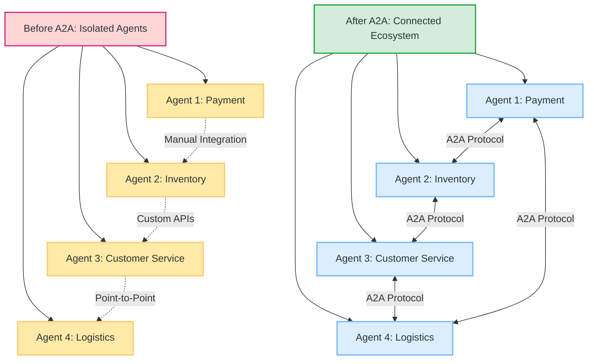
```mermaid
flowchart TD
    A[Before A2A: Isolated Agents] --> B[Agent 1: Payment]
    A --> C[Agent 2: Inventory]
    A --> D[Agent 3: Customer Service]
    A --> E[Agent 4: Logistics]

    B -.->|Manual Integration| C
    C -.->|Custom APIs| D
    D -.->|Point-to-Point| E

    F[After A2A: Connected Ecosystem] --> G[Agent 1: Payment]
    F --> H[Agent 2: Inventory]
    F --> I[Agent 3: Customer Service]
    F --> J[Agent 4: Logistics]

    G <-->|A2A Protocol| H
    H <-->|A2A Protocol| I
    I <-->|A2A Protocol| J
    J <-->|A2A Protocol| G

    style A fill:#ffd6d6,stroke:#d63384,stroke-width:2px,color:#2d3436
    style F fill:#d4edda,stroke:#28a745,stroke-width:2px,color:#2d3436
    style B fill:#ffeaa7,stroke:#fdcb6e,stroke-width:2px,color:#2d3436
    style C fill:#ffeaa7,stroke:#fdcb6e,stroke-width:2px,color:#2d3436
    style D fill:#ffeaa7,stroke:#fdcb6e,stroke-width:2px,color:#2d3436
    style E fill:#ffeaa7,stroke:#fdcb6e,stroke-width:2px,color:#2d3436
    style G fill:#dceefb,stroke:#74b9ff,stroke-width:2px,color:#2d3436
    style H fill:#dceefb,stroke:#74b9ff,stroke-width:2px,color:#2d3436
    style I fill:#dceefb,stroke:#74b9ff,stroke-width:2px,color:#2d3436
    style J fill:#dceefb,stroke:#74b9ff,stroke-width:2px,color:#2d3436
```

## 1. The Story That Started It All: Why Your AI Agents Need to Talk

Picture this: It's 3:15 AM, and Marcus, a site reliability engineer at TechFlow Industries, receives an urgent alert on his phone. The company's automated manufacturing system has detected quality issues in production line 7, but resolving this requires coordination between multiple AI agents: quality control, inventory management, scheduling, and supplier communication systems – all operating in isolation.

The quality control agent has identified defective components but can't automatically notify the inventory system to halt shipments. The scheduling agent continues production runs unaware of the quality issues. The supplier communication agent remains disconnected from real-time quality data. Marcus spends valuable time manually copying information between these systems, acting as a human relay station between digital agents that should be collaborating seamlessly.

This operational challenge occurs across industries daily. Organizations invest heavily in specialized AI agents, only to discover they've built sophisticated digital silos that operate in isolation. The result? Inefficient workflows, delayed responses, and AI investments that deliver limited collaborative value.

**This is exactly why Google, along with over 100 technology partners, created the Agent2Agent (A2A) Protocol**. Initially released by Google and now developed as an open source project, A2A is the universal translator that finally allows AI agents to communicate, collaborate, and coordinate – regardless of who built them or what technology they use.

> **📢 Open Source Development**: The A2A Protocol is now developed as an open source project with active community contributions and support from major technology companies including Google, Amazon Web Services, Cisco, Microsoft, Salesforce, SAP, and ServiceNow.

But why should you, the impatient learner, care about A2A right now? Because mastering A2A today positions you at the forefront of the next massive wave in AI automation . While others struggle with integration nightmares, you'll be orchestrating seamless multi-agent workflows that solve complex problems in minutes, not hours.

**Pause and Reflect**: Think about your current work environment. How many different AI tools or systems do you use daily? How much time do you waste manually copying information between them? Keep this in mind as we dive deeper.

---

## Official A2A Resources

Before diving into the technical details, here are the official sources for the A2A Protocol:

- **📖 Official Documentation**: [a2aproject.github.io/A2A](https://a2aproject.github.io/A2A/)
- **💻 GitHub Organization**: [github.com/a2aproject](https://github.com/a2aproject)
- **📋 Protocol Specification**: [A2A Specification](https://a2aproject.github.io/A2A/specification/)
- **ğŸ Python SDK**: `pip install a2a-sdk` ([GitHub](https://github.com/a2aproject/a2a-python))
- **📦 JavaScript SDK**: `npm install @a2a-js/sdk` ([GitHub](https://github.com/a2aproject/a2a-js))
- **☕ Java SDK**: [a2a-java](https://github.com/a2aproject/a2a-java)
- **🔧 Go SDK**: [a2a-go](https://github.com/a2aproject/a2a-go)
- **🯠.NET SDK**: [a2a-dotnet](https://github.com/a2aproject/a2a-dotnet)

**Current Version**: v0.2.9 (Python SDK as of June 2025)

---

## 2. What Is A2A Protocol? The Universal Language of AI Agents

Imagine walking into a United Nations assembly where every delegate speaks a different language, but somehow they're all having a perfectly coordinated conversation. That's A2A in action – a standardized protocol that enables AI agents built by different teams, using different technologies, to communicate as naturally as humans do.

> **💡 Key Insight**: A2A addresses a critical challenge in the AI landscape: enabling gen AI agents, built on diverse frameworks by different companies running on separate servers, to communicate and collaborate effectively - as agents, not just as tools.

### The Core Building Blocks

Think of A2A like building with digital LEGO blocks – each component has a specific purpose, and they all connect perfectly together. Let's explore the five fundamental pieces that make A2A work:

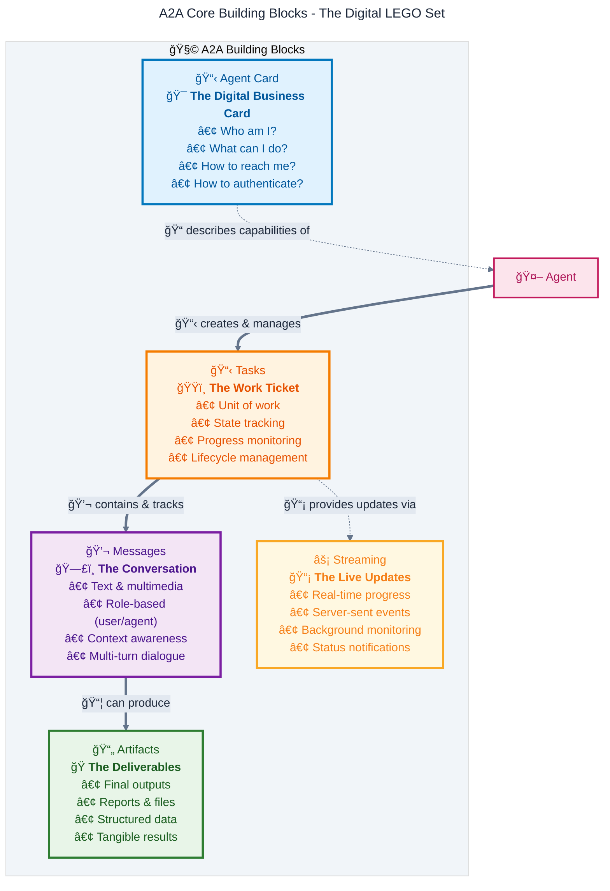
```mermaid
---
title: A2A Core Building Blocks - The Digital LEGO Set
config:
  theme: base
  themeVariables:
    primaryColor: '#f8fafc'
    primaryTextColor: '#1e293b'
    primaryBorderColor: '#475569'
    lineColor: '#64748b'
    secondaryColor: '#e2e8f0'
    tertiaryColor: '#f1f5f9'
---
flowchart TB
    subgraph "🧩 A2A Building Blocks"
        direction TB

        AC["📋 Agent Card<br/>🯠<strong>The Digital Business Card</strong><br/>• Who am I?<br/>• What can I do?<br/>• How to reach me?<br/>• How to authenticate?"]

        T["📋 Tasks<br/>ğŸŸï¸ <strong>The Work Ticket</strong><br/>• Unit of work<br/>• State tracking<br/>• Progress monitoring<br/>• Lifecycle management"]

        M["💬 Messages<br/>ğŸ—£ï¸ <strong>The Conversation</strong><br/>• Text & multimedia<br/>• Role-based (user/agent)<br/>• Context awareness<br/>• Multi-turn dialogue"]

        AR["📄 Artifacts<br/>ğŸ <strong>The Deliverables</strong><br/>• Final outputs<br/>• Reports & files<br/>• Structured data<br/>• Tangible results"]

        S["⚡ Streaming<br/>📡 <strong>The Live Updates</strong><br/>• Real-time progress<br/>• Server-sent events<br/>• Background monitoring<br/>• Status notifications"]
    end

    %% Show the flow relationships
    AC -.->|"📠describes capabilities of"| Agent[🤖 Agent]
    Agent ==>|"📋 creates & manages"| T
    T ==>|"💬 contains & tracks"| M
    M ==>|"📦 can produce"| AR
    T -.->|"📡 provides updates via"| S

    %% Styling for better visual hierarchy
    classDef agentCard fill:#e0f2fe,stroke:#0277bd,stroke-width:3px,color:#01579b
    classDef task fill:#fff3e0,stroke:#f57c00,stroke-width:3px,color:#e65100
    classDef message fill:#f3e5f5,stroke:#7b1fa2,stroke-width:3px,color:#4a148c
    classDef artifact fill:#e8f5e8,stroke:#2e7d32,stroke-width:3px,color:#1b5e20
    classDef streaming fill:#fff8e1,stroke:#f9a825,stroke-width:3px,color:#f57f17
    classDef agent fill:#fce4ec,stroke:#c2185b,stroke-width:2px,color:#ad1457

    class AC agentCard
    class T task
    class M message
    class AR artifact
    class S streaming
    class Agent agent
```

#### 1. 📋 Agent Cards: The Digital Business Card

Imagine walking into a networking event where everyone wears a smart badge that instantly tells you:

- Their name and expertise
- What services they offer
- How to work with them
- Their contact information

**That's exactly what an Agent Card does!** It's a JSON document that serves as each agent's digital identity.

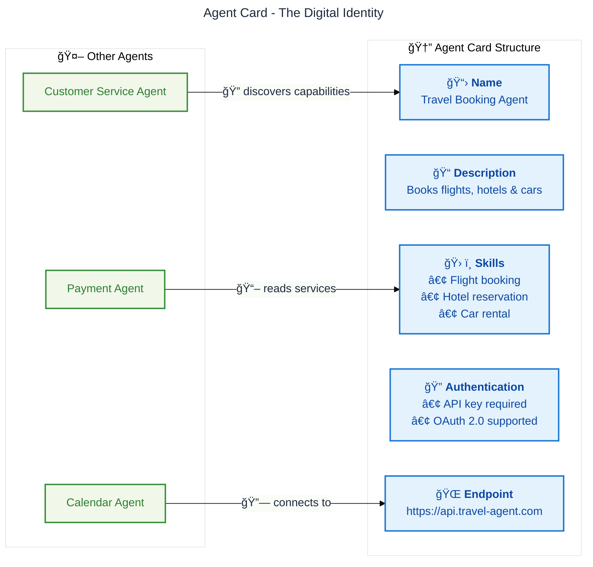
```mermaid
---
title: Agent Card - The Digital Identity
config:
  theme: base
  themeVariables:
    primaryColor: '#f8fafc'
    primaryTextColor: '#1e293b'
---
flowchart LR
    subgraph "🆔 Agent Card Structure"
        direction TB
        NAME["📛 <strong>Name</strong><br/>Travel Booking Agent"]
        DESC["📠<strong>Description</strong><br/>Books flights, hotels & cars"]
        SKILLS["ğŸ› ï¸ <strong>Skills</strong><br/>• Flight booking<br/>• Hotel reservation<br/>• Car rental"]
        AUTH["🔠<strong>Authentication</strong><br/>• API key required<br/>• OAuth 2.0 supported"]
        URL["🌠<strong>Endpoint</strong><br/>https://api.travel-agent.com"]
    end

    subgraph "🤖 Other Agents"
        A1[Customer Service Agent]
        A2[Payment Agent]
        A3[Calendar Agent]
    end

    A1 -->|"🔠discovers capabilities"| NAME
    A2 -->|"📖 reads services"| SKILLS
    A3 -->|"🔗 connects to"| URL

    classDef cardElement fill:#e3f2fd,stroke:#1976d2,stroke-width:2px,color:#0d47a1
    classDef agent fill:#f1f8e9,stroke:#388e3c,stroke-width:2px,color:#2e7d32

    class NAME,DESC,SKILLS,AUTH,URL cardElement
    class A1,A2,A3 agent
```

**Real-World Example**: When a Calendar Agent needs to book a meeting room, it discovers the Travel Booking Agent's card and learns: "Ah, this agent can book conference rooms, requires API authentication, and responds to room booking requests at this endpoint."

#### 2. 📋 Tasks: The Work Ticket

Think of Tasks like project tickets in your favorite project management tool (Jira, Trello, Asana). Each Task represents a specific piece of work that moves through a clear lifecycle:

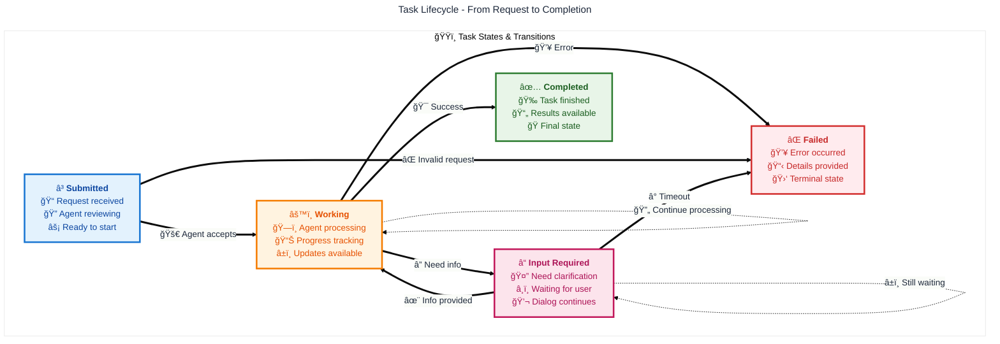
```mermaid
---
title: Task Lifecycle - From Request to Completion
config:
  theme: base
  themeVariables:
    primaryColor: '#f8fafc'
    primaryTextColor: '#1e293b'
---
flowchart LR
    subgraph "ğŸŸï¸ Task States & Transitions"
        direction LR
        SUB["Ⳡ<strong>Submitted</strong><br/>📠Request received<br/>🔠Agent reviewing<br/>⚡ Ready to start"]

        WORK["âš™ï¸ <strong>Working</strong><br/>ğŸ—ï¸ Agent processing<br/>📊 Progress tracking<br/>â±ï¸ Updates available"]

        INPUT["â“ <strong>Input Required</strong><br/>🤔 Need clarification<br/>â¸ï¸ Waiting for user<br/>💬 Dialog continues"]

        COMP["✅ <strong>Completed</strong><br/>🉠Task finished<br/>📄 Results available<br/>ğŸ Final state"]

        FAIL["⌠<strong>Failed</strong><br/>💥 Error occurred<br/>📋 Details provided<br/>🛑 Terminal state"]
    end

    %% State transitions
    SUB ==>|"🚀 Agent accepts"| WORK
    WORK ==>|"â” Need info"| INPUT
    INPUT ==>|"✨ Info provided"| WORK
    WORK ==>|"🯠Success"| COMP
    WORK ==>|"💥 Error"| FAIL
    SUB ==>|"⌠Invalid request"| FAIL
    INPUT ==>|"â° Timeout"| FAIL

    %% Progress loops
    WORK -.->|"🔄 Continue processing"| WORK
    INPUT -.->|"â±ï¸ Still waiting"| INPUT

    classDef submitted fill:#e3f2fd,stroke:#1976d2,stroke-width:3px,color:#0d47a1
    classDef working fill:#fff3e0,stroke:#f57c00,stroke-width:3px,color:#e65100
    classDef inputReq fill:#fce4ec,stroke:#c2185b,stroke-width:3px,color:#ad1457
    classDef completed fill:#e8f5e8,stroke:#2e7d32,stroke-width:3px,color:#1b5e20
    classDef failed fill:#ffebee,stroke:#d32f2f,stroke-width:3px,color:#c62828

    class SUB submitted
    class WORK working
    class INPUT inputReq
    class COMP completed
    class FAIL failed
```

**Real-World Example**:

- **Submitted**: "Book a flight from NYC to Paris for March 15th"
- **Working**: Agent searches airlines, compares prices
- **Input Required**: "I found 3 options – do you prefer morning or evening departure?"
- **Completed**: "✅ Booked! Air France flight AF123, confirmation #ABC456"

#### 3. 💬 Messages: The Conversation

Messages are the actual words exchanged between agents and users. Unlike rigid API calls, A2A messages feel natural and conversational:

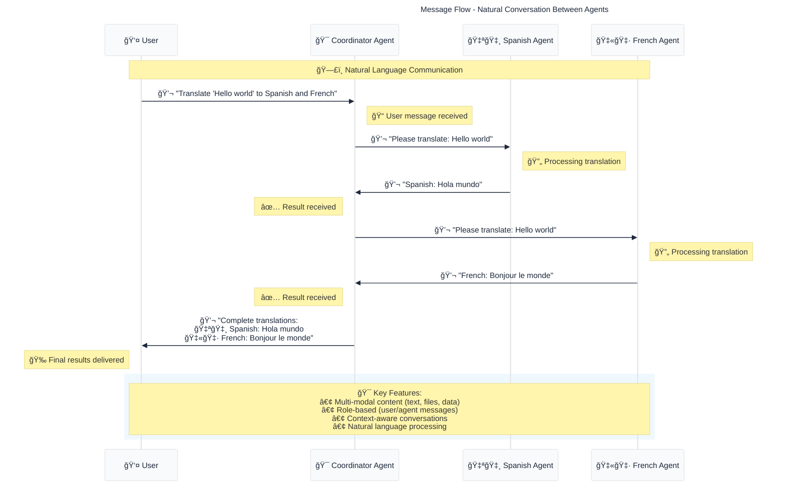
```mermaid
---
title: Message Flow - Natural Conversation Between Agents
config:
  theme: base
  themeVariables:
    primaryColor: '#f8fafc'
    primaryTextColor: '#1e293b'
---
sequenceDiagram
    participant U as 👤 User
    participant CA as 🯠Coordinator Agent
    participant SA as 🇪🇸 Spanish Agent
    participant FA as 🇫🇷 French Agent

    Note over U,FA: ğŸ—£ï¸ Natural Language Communication

    U->>CA: 💬 "Translate 'Hello world' to Spanish and French"
    Note right of CA: 📠User message received

    CA->>SA: 💬 "Please translate: Hello world"
    Note right of SA: 🔄 Processing translation
    SA->>CA: 💬 "Spanish: Hola mundo"
    Note left of CA: ✅ Result received

    CA->>FA: 💬 "Please translate: Hello world"
    Note right of FA: 🔄 Processing translation
    FA->>CA: 💬 "French: Bonjour le monde"
    Note left of CA: ✅ Result received

    CA->>U: 💬 "Complete translations:<br/>🇪🇸 Spanish: Hola mundo<br/>🇫🇷 French: Bonjour le monde"
    Note left of U: 🉠Final results delivered

    rect rgb(240, 248, 255)
        Note over U,FA: 🯠Key Features:<br/>• Multi-modal content (text, files, data)<br/>• Role-based (user/agent messages)<br/>• Context-aware conversations<br/>• Natural language processing
    end
```

**What Makes A2A Messages Special**:

- **Multi-modal**: Can contain text, images, files, structured data
- **Conversational**: Natural back-and-forth dialogue, not rigid commands
- **Context-aware**: Remember previous conversation context
- **Role-based**: Clear distinction between user and agent messages

#### 4. 📄 Artifacts: The Deliverables

Artifacts are the concrete results that agents produce – think of them as the "files in your downloads folder" after completing a task:

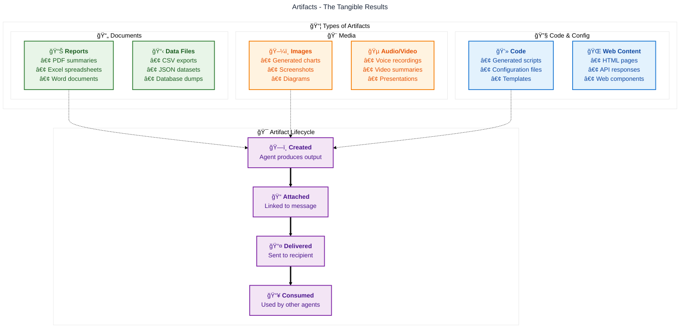
```mermaid
---
title: Artifacts - The Tangible Results
config:
  theme: base
  themeVariables:
    primaryColor: '#f8fafc'
    primaryTextColor: '#1e293b'
---
flowchart TB
    subgraph "📦 Types of Artifacts"
        direction TB

        subgraph "📄 Documents"
            DOC1["📊 <strong>Reports</strong><br/>• PDF summaries<br/>• Excel spreadsheets<br/>• Word documents"]
            DOC2["📋 <strong>Data Files</strong><br/>• CSV exports<br/>• JSON datasets<br/>• Database dumps"]
        end

        subgraph "🨠Media"
            MED1["ğŸ–¼ï¸ <strong>Images</strong><br/>• Generated charts<br/>• Screenshots<br/>• Diagrams"]
            MED2["🵠<strong>Audio/Video</strong><br/>• Voice recordings<br/>• Video summaries<br/>• Presentations"]
        end

        subgraph "🔧 Code & Config"
            CODE1["💻 <strong>Code</strong><br/>• Generated scripts<br/>• Configuration files<br/>• Templates"]
            CODE2["🌠<strong>Web Content</strong><br/>• HTML pages<br/>• API responses<br/>• Web components"]
        end
    end

    subgraph "🯠Artifact Lifecycle"
        direction LR
        CREATE["ğŸ—ï¸ <strong>Created</strong><br/>Agent produces output"]
        ATTACH["📠<strong>Attached</strong><br/>Linked to message"]
        DELIVER["📤 <strong>Delivered</strong><br/>Sent to recipient"]
        CONSUME["📥 <strong>Consumed</strong><br/>Used by other agents"]
    end

    CREATE ==> ATTACH ==> DELIVER ==> CONSUME

    DOC1 -.-> CREATE
    MED1 -.-> CREATE
    CODE1 -.-> CREATE

    classDef document fill:#e8f5e8,stroke:#2e7d32,stroke-width:2px,color:#1b5e20
    classDef media fill:#fff3e0,stroke:#f57c00,stroke-width:2px,color:#e65100
    classDef code fill:#e3f2fd,stroke:#1976d2,stroke-width:2px,color:#0d47a1
    classDef lifecycle fill:#f3e5f5,stroke:#7b1fa2,stroke-width:2px,color:#4a148c

    class DOC1,DOC2 document
    class MED1,MED2 media
    class CODE1,CODE2 code
    class CREATE,ATTACH,DELIVER,CONSUME lifecycle
```

**Real-World Examples**:

- **Data Analysis Agent** → Produces Excel report with charts (Artifact)
- **Design Agent** → Creates logo variations in PNG/SVG format (Artifacts)
- **Code Generator Agent** → Outputs Python script + documentation (Artifacts)

#### 5. âš¡ Streaming: The Live Updates

Streaming provides real-time updates using Server-Sent Events (SSE), like watching a progress bar fill up as work happens:

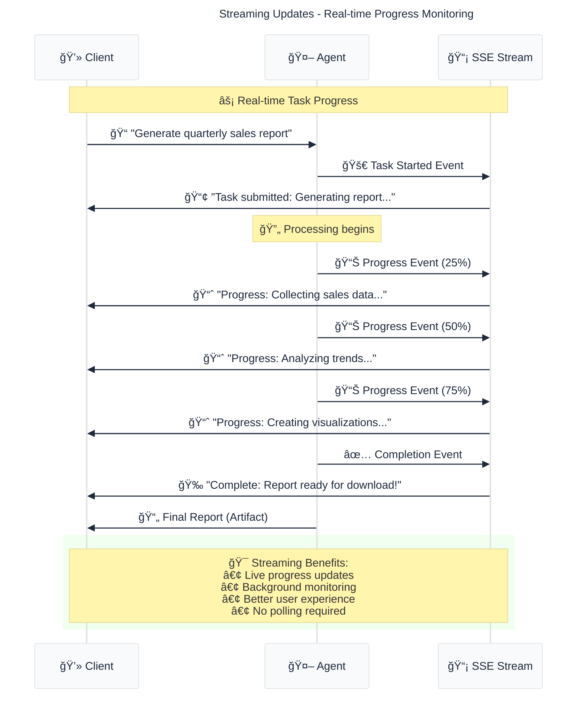
```mermaid
---
title: Streaming Updates - Real-time Progress Monitoring
config:
  theme: base
  themeVariables:
    primaryColor: '#f8fafc'
    primaryTextColor: '#1e293b'
---
sequenceDiagram
    participant C as 💻 Client
    participant A as 🤖 Agent
    participant SSE as 📡 SSE Stream

    Note over C,SSE: âš¡ Real-time Task Progress

    C->>A: 📠"Generate quarterly sales report"
    A->>SSE: 🚀 Task Started Event
    SSE->>C: 📢 "Task submitted: Generating report..."

    Note over A: 🔄 Processing begins
    A->>SSE: 📊 Progress Event (25%)
    SSE->>C: 📈 "Progress: Collecting sales data..."

    A->>SSE: 📊 Progress Event (50%)
    SSE->>C: 📈 "Progress: Analyzing trends..."

    A->>SSE: 📊 Progress Event (75%)
    SSE->>C: 📈 "Progress: Creating visualizations..."

    A->>SSE: ✅ Completion Event
    SSE->>C: 🉠"Complete: Report ready for download!"

    A->>C: 📄 Final Report (Artifact)

    rect rgb(240, 255, 240)
        Note over C,SSE: 🯠Streaming Benefits:<br/>• Live progress updates<br/>• Background monitoring<br/>• Better user experience<br/>• No polling required
    end
```

**Why Streaming Matters**:

- **No more waiting in the dark** – see progress as it happens
- **Better user experience** – like watching a download progress bar
- **Efficient** – no need to constantly ask "Are you done yet?"
- **Multi-tasking friendly** – monitor multiple agents simultaneously

#### 5. Streaming: Real-Time Updates

Using Server-Sent Events (SSE), agents can provide real-time updates on long-running tasks. Imagine watching a progress bar fill up as an agent processes your request.

### Core Components & Relationships

This diagram shows the fundamental A2A building blocks and how they interact:

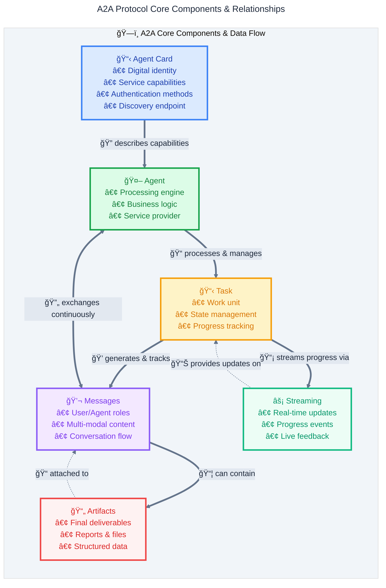
```mermaid
---
title: A2A Protocol Core Components & Relationships
config:
  theme: base
  themeVariables:
    primaryColor: '#f8fafc'
    primaryTextColor: '#1e293b'
    primaryBorderColor: '#475569'
    lineColor: '#64748b'
    secondaryColor: '#e2e8f0'
    tertiaryColor: '#f1f5f9'
---
flowchart TD
    subgraph "ğŸ—ï¸ A2A Core Components & Data Flow"
        direction TB

        AC["📋 Agent Card<br/>• Digital identity<br/>• Service capabilities<br/>• Authentication methods<br/>• Discovery endpoint"]
        AGT["🤖 Agent<br/>• Processing engine<br/>• Business logic<br/>• Service provider"]
        T["📋 Task<br/>• Work unit<br/>• State management<br/>• Progress tracking"]
        MSG["💬 Messages<br/>• User/Agent roles<br/>• Multi-modal content<br/>• Conversation flow"]
        ART["📄 Artifacts<br/>• Final deliverables<br/>• Reports & files<br/>• Structured data"]
        SSE["⚡ Streaming<br/>• Real-time updates<br/>• Progress events<br/>• Live feedback"]
    end

    %% Core component relationships
    AC ==>|"🔠describes capabilities"| AGT
    AGT ==>|"📠processes & manages"| T
    T ==>|"💭 generates & tracks"| MSG
    MSG ==>|"📦 can contain"| ART
    T ==>|"📡 streams progress via"| SSE
    AGT <==>|"🔄 exchanges continuously"| MSG
    ART -.->|"📠attached to"| MSG
    SSE -.->|"📊 provides updates on"| T

    %% Advanced styling
    classDef agentCard fill:#dbeafe,stroke:#3b82f6,stroke-width:3px,color:#1e40af
    classDef agent fill:#dcfce7,stroke:#16a34a,stroke-width:3px,color:#15803d
    classDef task fill:#fef3c7,stroke:#f59e0b,stroke-width:3px,color:#d97706
    classDef message fill:#f3e8ff,stroke:#8b5cf6,stroke-width:3px,color:#7c3aed
    classDef artifact fill:#fef2f2,stroke:#ef4444,stroke-width:3px,color:#dc2626
    classDef streaming fill:#ecfdf5,stroke:#10b981,stroke-width:3px,color:#059669

    %% Apply styles
    class AC agentCard
    class AGT agent
    class T task
    class MSG message
    class ART artifact
    class SSE streaming
```

### Transport Layer & Integration Patterns

This diagram illustrates how A2A agents communicate and integrate across the network:

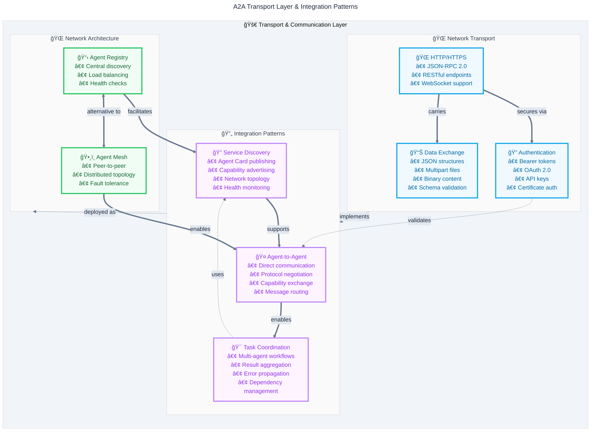
```mermaid
---
title: A2A Transport Layer & Integration Patterns
config:
  theme: base
  themeVariables:
    primaryColor: '#f8fafc'
    primaryTextColor: '#1e293b'
    primaryBorderColor: '#475569'
    lineColor: '#64748b'
    secondaryColor: '#e2e8f0'
    tertiaryColor: '#f1f5f9'
---
flowchart TD
    subgraph "🚀 Transport & Communication Layer"
        direction TB

        subgraph TRANSPORT ["🌠Network Transport"]
            direction TB
            HTTP["🌠HTTP/HTTPS<br/>• JSON-RPC 2.0<br/>• RESTful endpoints<br/>• WebSocket support"]
            AUTH["🔠Authentication<br/>• Bearer tokens<br/>• OAuth 2.0<br/>• API keys<br/>• Certificate auth"]
            DATA["📊 Data Exchange<br/>• JSON structures<br/>• Multipart files<br/>• Binary content<br/>• Schema validation"]
        end

        subgraph PATTERNS ["🔄 Integration Patterns"]
            direction TB
            A2A_FLOW["🤠Agent-to-Agent<br/>• Direct communication<br/>• Protocol negotiation<br/>• Capability exchange<br/>• Message routing"]
            DISCOVERY["🔠Service Discovery<br/>• Agent Card publishing<br/>• Capability advertising<br/>• Network topology<br/>• Health monitoring"]
            COORDINATION["🯠Task Coordination<br/>• Multi-agent workflows<br/>• Result aggregation<br/>• Error propagation<br/>• Dependency management"]
        end

        subgraph NETWORK ["🌠Network Architecture"]
            direction LR
            REGISTRY["📋 Agent Registry<br/>• Central discovery<br/>• Load balancing<br/>• Health checks"]
            MESH["ğŸ•¸ï¸ Agent Mesh<br/>• Peer-to-peer<br/>• Distributed topology<br/>• Fault tolerance"]
        end
    end

    %% Transport relationships
    HTTP ==>|"secures via"| AUTH
    HTTP ==>|"carries"| DATA
    AUTH -.->|"validates"| A2A_FLOW

    %% Pattern integration
    A2A_FLOW ==>|"enables"| COORDINATION
    DISCOVERY ==>|"supports"| A2A_FLOW
    COORDINATION -.->|"uses"| DISCOVERY

    %% Network architecture
    REGISTRY ==>|"facilitates"| DISCOVERY
    MESH ==>|"enables"| A2A_FLOW
    REGISTRY <==>|"alternative to"| MESH

    %% Cross-layer connections
    TRANSPORT -.->|"implements"| PATTERNS
    PATTERNS -.->|"deployed as"| NETWORK

    %% Advanced styling
    classDef transport fill:#f0f9ff,stroke:#0ea5e9,stroke-width:3px,color:#0369a1
    classDef patterns fill:#fdf4ff,stroke:#c084fc,stroke-width:3px,color:#9333ea
    classDef network fill:#f0fdf4,stroke:#22c55e,stroke-width:3px,color:#166534
    classDef subgraphStyle fill:#fafafa,stroke:#e5e7eb,stroke-width:2px,color:#374151

    %% Apply styles
    class HTTP,AUTH,DATA transport
    class A2A_FLOW,DISCOVERY,COORDINATION patterns
    class REGISTRY,MESH network
    class TRANSPORT,PATTERNS,NETWORK subgraphStyle
```

### Task State Lifecycle

Understanding how tasks progress through their lifecycle is crucial for building reliable A2A agents. We'll explore this through two complementary views:

#### Task State Transitions

This diagram shows how tasks move between different states and the conditions that trigger these transitions:

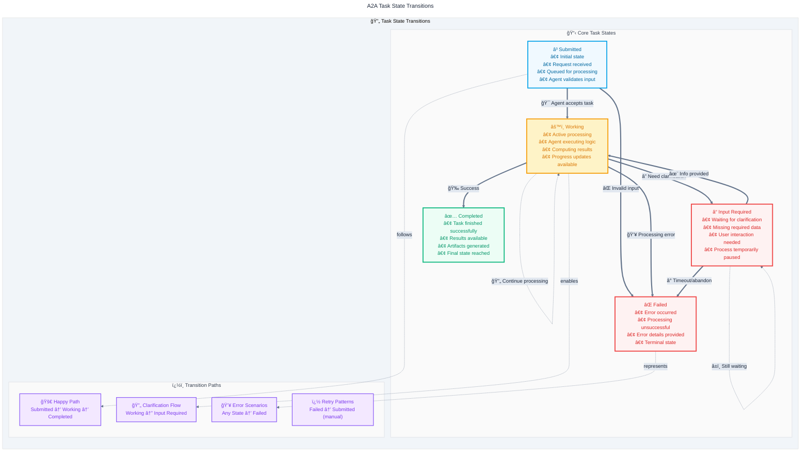
```mermaid
---
title: A2A Task State Transitions
config:
  theme: base
  themeVariables:
    primaryColor: '#f8fafc'
    primaryTextColor: '#1e293b'
    primaryBorderColor: '#475569'
    lineColor: '#64748b'
    secondaryColor: '#e2e8f0'
    tertiaryColor: '#f1f5f9'
---
flowchart TD
    subgraph "🔄 Task State Transitions"
        direction TB

        subgraph STATES ["📋 Core Task States"]
            direction TB
            ST1["ⳠSubmitted<br/>• Initial state<br/>• Request received<br/>• Queued for processing<br/>• Agent validates input"]
            ST2["âš™ï¸ Working<br/>• Active processing<br/>• Agent executing logic<br/>• Computing results<br/>• Progress updates available"]
            ST3["ⓠInput Required<br/>• Waiting for clarification<br/>• Missing required data<br/>• User interaction needed<br/>• Process temporarily paused"]
            ST4["✅ Completed<br/>• Task finished successfully<br/>• Results available<br/>• Artifacts generated<br/>• Final state reached"]
            ST5["⌠Failed<br/>• Error occurred<br/>• Processing unsuccessful<br/>• Error details provided<br/>• Terminal state"]
        end

        subgraph PATHS ["ï¿½ï¸ Transition Paths"]
            direction TB
            P1["🚀 Happy Path<br/>Submitted → Working → Completed"]
            P2["🔄 Clarification Flow<br/>Working ↔ Input Required"]
            P3["💥 Error Scenarios<br/>Any State → Failed"]
            P4["� Retry Patterns<br/>Failed → Submitted (manual)"]
        end
    end

    %% Primary state transitions
    ST1 ==>|"🯠Agent accepts task"| ST2
    ST2 ==>|"â” Need clarification"| ST3
    ST3 ==>|"✨ Info provided"| ST2
    ST2 ==>|"🉠Success"| ST4

    %% Error transitions
    ST1 ==>|"⌠Invalid input"| ST5
    ST2 ==>|"💥 Processing error"| ST5
    ST3 ==>|"â° Timeout/abandon"| ST5

    %% Self-loops for ongoing states
    ST2 -.->|"🔄 Continue processing"| ST2
    ST3 -.->|"â±ï¸ Still waiting"| ST3

    %% Path indicators
    ST1 -.->|"follows"| P1
    ST2 -.->|"enables"| P2
    ST5 -.->|"represents"| P3

    %% Styling
    classDef submitted fill:#f0f9ff,stroke:#0ea5e9,stroke-width:3px,color:#0369a1
    classDef working fill:#fef3c7,stroke:#f59e0b,stroke-width:3px,color:#d97706
    classDef inputRequired fill:#fef2f2,stroke:#ef4444,stroke-width:3px,color:#dc2626
    classDef completed fill:#ecfdf5,stroke:#10b981,stroke-width:3px,color:#059669
    classDef failed fill:#fef2f2,stroke:#ef4444,stroke-width:3px,color:#dc2626
    classDef paths fill:#f3e8ff,stroke:#8b5cf6,stroke-width:2px,color:#7c3aed
    classDef subgraphStyle fill:#fafafa,stroke:#e5e7eb,stroke-width:2px,color:#374151

    %% Apply styles
    class ST1 submitted
    class ST2 working
    class ST3 inputRequired
    class ST4 completed
    class ST5 failed
    class P1,P2,P3,P4 paths
    class STATES,PATHS subgraphStyle
```

#### Real-time Event Monitoring

This diagram illustrates how A2A provides real-time updates through Server-Sent Events (SSE) and how different clients can monitor task progress:

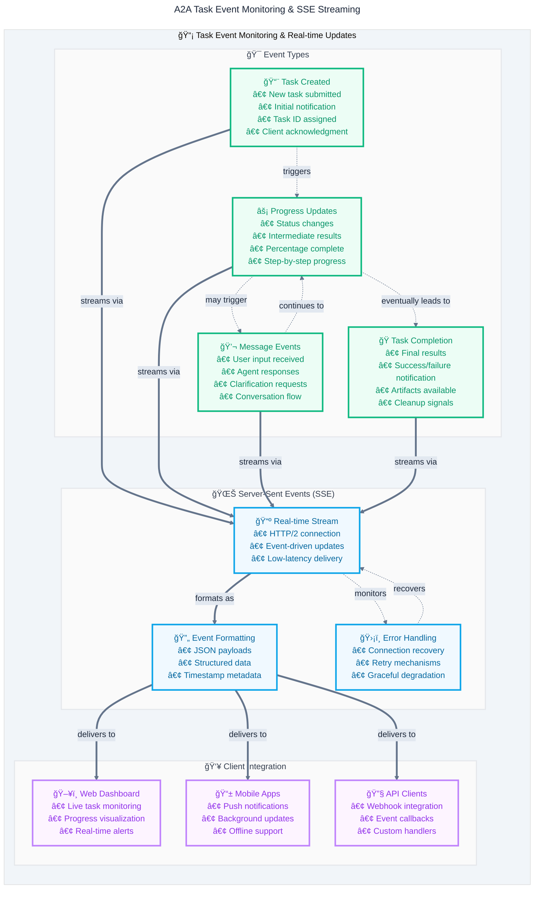
```mermaid
---
title: A2A Task Event Monitoring & SSE Streaming
config:
  theme: base
  themeVariables:
    primaryColor: '#f8fafc'
    primaryTextColor: '#1e293b'
    primaryBorderColor: '#475569'
    lineColor: '#64748b'
    secondaryColor: '#e2e8f0'
    tertiaryColor: '#f1f5f9'
---
flowchart TD
    subgraph "📡 Task Event Monitoring & Real-time Updates"
        direction TB

        subgraph EVENTS ["🯠Event Types"]
            direction TB
            E1["📨 Task Created<br/>• New task submitted<br/>• Initial notification<br/>• Task ID assigned<br/>• Client acknowledgment"]
            E2["⚡ Progress Updates<br/>• Status changes<br/>• Intermediate results<br/>• Percentage complete<br/>• Step-by-step progress"]
            E3["💬 Message Events<br/>• User input received<br/>• Agent responses<br/>• Clarification requests<br/>• Conversation flow"]
            E4["ğŸ Task Completion<br/>• Final results<br/>• Success/failure notification<br/>• Artifacts available<br/>• Cleanup signals"]
        end

        subgraph SSE ["🌊 Server-Sent Events (SSE)"]
            direction TB
            S1["📺 Real-time Stream<br/>• HTTP/2 connection<br/>• Event-driven updates<br/>• Low-latency delivery"]
            S2["🔄 Event Formatting<br/>• JSON payloads<br/>• Structured data<br/>• Timestamp metadata"]
            S3["ğŸ›¡ï¸ Error Handling<br/>• Connection recovery<br/>• Retry mechanisms<br/>• Graceful degradation"]
        end

        subgraph CLIENTS ["👥 Client Integration"]
            direction TB
            C1["ğŸ–¥ï¸ Web Dashboard<br/>• Live task monitoring<br/>• Progress visualization<br/>• Real-time alerts"]
            C2["📱 Mobile Apps<br/>• Push notifications<br/>• Background updates<br/>• Offline support"]
            C3["🔧 API Clients<br/>• Webhook integration<br/>• Event callbacks<br/>• Custom handlers"]
        end
    end

    %% Event flow connections
    E1 ==>|"streams via"| S1
    E2 ==>|"streams via"| S1
    E3 ==>|"streams via"| S1
    E4 ==>|"streams via"| S1

    %% SSE processing
    S1 ==>|"formats as"| S2
    S2 ==>|"delivers to"| C1
    S2 ==>|"delivers to"| C2
    S2 ==>|"delivers to"| C3

    %% Error handling
    S1 -.->|"monitors"| S3
    S3 -.->|"recovers"| S1

    %% Event lifecycle
    E1 -.->|"triggers"| E2
    E2 -.->|"may trigger"| E3
    E3 -.->|"continues to"| E2
    E2 -.->|"eventually leads to"| E4

    %% Styling
    classDef events fill:#ecfdf5,stroke:#10b981,stroke-width:3px,color:#059669
    classDef sse fill:#f0f9ff,stroke:#0ea5e9,stroke-width:3px,color:#0369a1
    classDef clients fill:#fdf4ff,stroke:#c084fc,stroke-width:3px,color:#9333ea
    classDef subgraphStyle fill:#fafafa,stroke:#e5e7eb,stroke-width:2px,color:#374151

    %% Apply styles
    class E1,E2,E3,E4 events
    class S1,S2,S3 sse
    class C1,C2,C3 clients
    class EVENTS,SSE,CLIENTS subgraphStyle
```

### Technical Foundation

A2A is built on proven, enterprise-ready technologies:

- **Transport**: JSON-RPC 2.0 over HTTP(S)
- **Authentication**: Bearer tokens, OAuth 2.0, API keys
- **Real-time**: Server-Sent Events (SSE) for streaming
- **Data Exchange**: JSON for structured data, multipart for files
- **Discovery**: Standardized Agent Cards (JSON schema)

### A2A vs MCP: The Perfect Partnership

Here's where many people get confused. A2A and the Model Context Protocol (MCP) aren't competitors – they're perfect partners:

- **MCP**: Connects agents to tools, databases, and APIs (think "agent-to-resource")
- **A2A**: Connects agents to other agents (think "agent-to-agent")

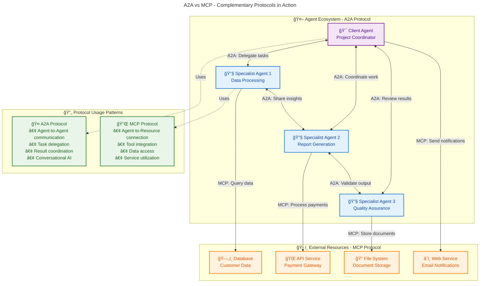
```mermaid
---
title: A2A vs MCP - Complementary Protocols in Action
---
flowchart TB
    subgraph "🤖 Agent Ecosystem - A2A Protocol"
        CA["🯠Client Agent<br/>Project Coordinator"]
        SA1["🔧 Specialist Agent 1<br/>Data Processing"]
        SA2["🔧 Specialist Agent 2<br/>Report Generation"]
        SA3["🔧 Specialist Agent 3<br/>Quality Assurance"]
    end

    subgraph "ğŸ› ï¸ External Resources - MCP Protocol"
        DB["ğŸ—„ï¸ Database<br/>Customer Data"]
        API["🌠API Service<br/>Payment Gateway"]
        FS["📠File System<br/>Document Storage"]
        WS["â˜ï¸ Web Service<br/>Email Notifications"]
    end

    subgraph "🔄 Protocol Usage Patterns"
        A2A_DESC["🤠A2A Protocol<br/>• Agent-to-Agent communication<br/>• Task delegation<br/>• Result coordination<br/>• Conversational AI"]
        MCP_DESC["🔌 MCP Protocol<br/>• Agent-to-Resource connection<br/>• Tool integration<br/>• Data access<br/>• Service utilization"]
    end

    %% A2A connections (agent-to-agent)
    CA <-->|"A2A: Delegate tasks"| SA1
    CA <-->|"A2A: Coordinate work"| SA2
    CA <-->|"A2A: Review results"| SA3
    SA1 <-->|"A2A: Share insights"| SA2
    SA2 <-->|"A2A: Validate output"| SA3

    %% MCP connections (agent-to-resource)
    SA1 -->|"MCP: Query data"| DB
    SA2 -->|"MCP: Process payments"| API
    SA3 -->|"MCP: Store documents"| FS
    CA -->|"MCP: Send notifications"| WS

    %% Visual connections to descriptions
    CA -.->|"Uses"| A2A_DESC
    SA1 -.->|"Uses"| MCP_DESC

    classDef client fill:#f3e5f5,stroke:#7b1fa2,stroke-width:2px,color:#4a148c
    classDef specialist fill:#e3f2fd,stroke:#1976d2,stroke-width:2px,color:#0d47a1
    classDef resource fill:#fff3e0,stroke:#f57c00,stroke-width:2px,color:#e65100
    classDef protocol fill:#e8f5e8,stroke:#2e7d32,stroke-width:2px,color:#1b5e20

    class CA client
    class SA1,SA2,SA3 specialist
    class DB,API,FS,WS resource
    class A2A_DESC,MCP_DESC protocol
```

**Real-World Scenario Example:**

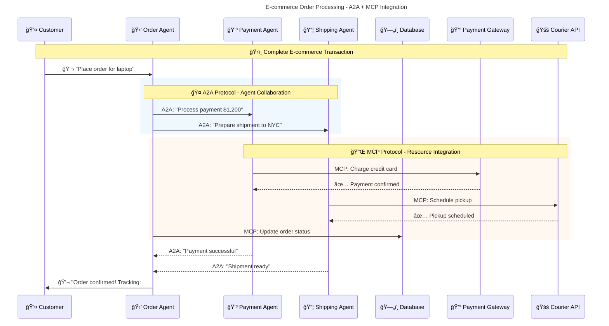
```mermaid
---
title: E-commerce Order Processing - A2A + MCP Integration
---
sequenceDiagram
    participant User as 👤 Customer
    participant Order as 🛒 Order Agent
    participant Pay as 💳 Payment Agent
    participant Ship as 📦 Shipping Agent
    participant DB as ğŸ—„ï¸ Database
    participant Gateway as 💰 Payment Gateway
    participant Courier as 🚚 Courier API

    Note over User,Courier: ğŸ›ï¸ Complete E-commerce Transaction

    User->>Order: 💬 "Place order for laptop"

    rect rgb(240, 248, 255)
        Note over Order,Ship: 🤠A2A Protocol - Agent Collaboration
        Order->>Pay: A2A: "Process payment $1,200"
        Order->>Ship: A2A: "Prepare shipment to NYC"
    end

    rect rgb(255, 248, 240)
        Note over Pay,Courier: 🔌 MCP Protocol - Resource Integration
        Pay->>Gateway: MCP: Charge credit card
        Gateway-->>Pay: ✅ Payment confirmed
        Ship->>Courier: MCP: Schedule pickup
        Courier-->>Ship: ✅ Pickup scheduled
        Order->>DB: MCP: Update order status
    end

    Pay-->>Order: A2A: "Payment successful"
    Ship-->>Order: A2A: "Shipment ready"
    Order->>User: 💬 "Order confirmed! Tracking: #12345"
```

**Key Insights:**

- **A2A enables** natural conversations between intelligent agents
- **MCP provides** reliable connections to tools and data sources
- **Together they create** complete end-to-end automation solutions

**Pro Tip**: Remember this simple rule – if you're connecting an agent to a tool or database, use MCP. If you're connecting an agent to another agent, use A2A. Many enterprise solutions use both protocols together.

### Industry Support & Development

The A2A Protocol benefits from strong industry collaboration:

#### 🤠Supporting Organizations

The following industry leaders support A2A adoption and development:

| Company                 | Contribution                             |
| ----------------------- | ---------------------------------------- |
| **Amazon Web Services** | Agentic AI framework support             |
| **Cisco**               | Enterprise integration expertise         |
| **Google Cloud**        | Original protocol creator and maintainer |
| **Microsoft**           | Azure AI platform compatibility          |
| **Salesforce**          | Agentforce platform alignment            |
| **SAP**                 | Enterprise software integration          |
| **ServiceNow**          | Workflow automation support              |

#### 📈 Community Growth

- **100+ Companies** actively using or evaluating the protocol
- **17.4k+ GitHub Stars** on the main repository
- **550+ Stars** on the Python SDK
- **180+ Projects** using the Python SDK
- **Active Development**: Continuous improvement and community contributions

---

## 3. The Research Paper Metaphor: Understanding A2A Through Academic Collaboration

Let's make A2A concrete with something familiar to many professionals: collaborative research. Imagine you're a graduate student working on a complex interdisciplinary research project that requires expertise from multiple specialized academic departments, each with their own methodologies and data sources.

> **📚 Why This Matters**: This metaphor demonstrates how A2A enables seamless collaboration between specialized agents, each contributing their unique expertise to solve complex, multi-faceted problems.

### The Players in Our Research Story

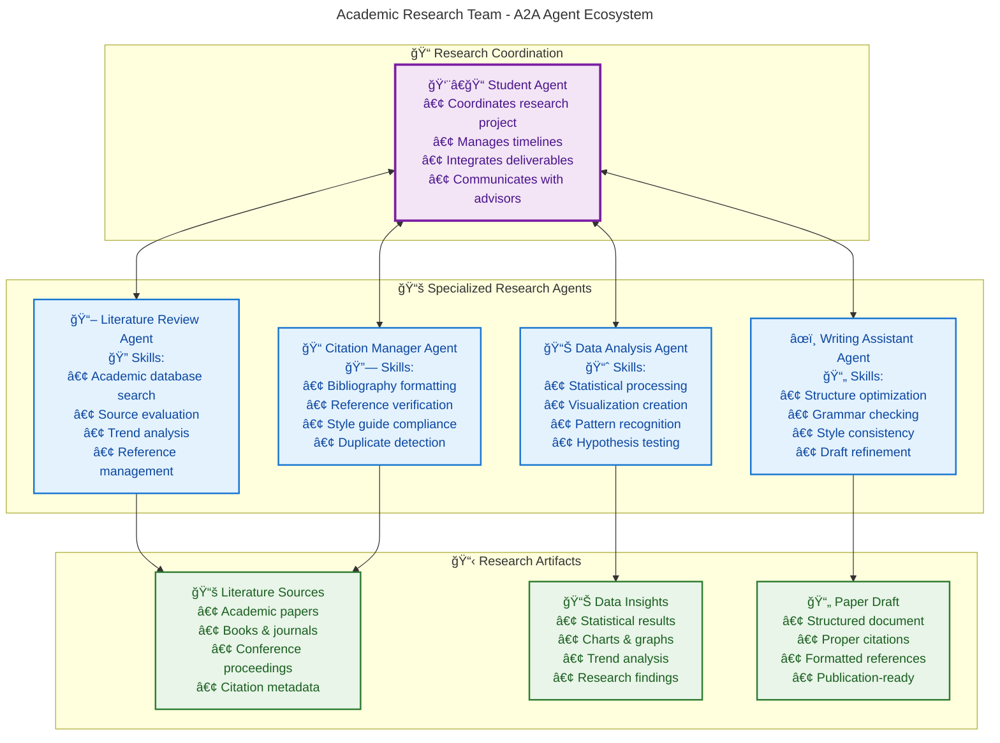
```mermaid
---
title: Academic Research Team - A2A Agent Ecosystem
---
flowchart TB
    subgraph "📠Research Coordination"
        STUDENT["👨â€ğŸ“ Student Agent<br/>• Coordinates research project<br/>• Manages timelines<br/>• Integrates deliverables<br/>• Communicates with advisors"]
    end

    subgraph "📚 Specialized Research Agents"
        LIT["📖 Literature Review Agent<br/>🔠Skills:<br/>• Academic database search<br/>• Source evaluation<br/>• Trend analysis<br/>• Reference management"]

        DATA["📊 Data Analysis Agent<br/>📈 Skills:<br/>• Statistical processing<br/>• Visualization creation<br/>• Pattern recognition<br/>• Hypothesis testing"]

        CITE["📠Citation Manager Agent<br/>🔗 Skills:<br/>• Bibliography formatting<br/>• Reference verification<br/>• Style guide compliance<br/>• Duplicate detection"]

        WRITE["âœï¸ Writing Assistant Agent<br/>📄 Skills:<br/>• Structure optimization<br/>• Grammar checking<br/>• Style consistency<br/>• Draft refinement"]
    end

    subgraph "📋 Research Artifacts"
        SOURCES["📚 Literature Sources<br/>• Academic papers<br/>• Books & journals<br/>• Conference proceedings<br/>• Citation metadata"]

        ANALYSIS["📊 Data Insights<br/>• Statistical results<br/>• Charts & graphs<br/>• Trend analysis<br/>• Research findings"]

        DRAFT["📄 Paper Draft<br/>• Structured document<br/>• Proper citations<br/>• Formatted references<br/>• Publication-ready"]
    end

    STUDENT <--> LIT
    STUDENT <--> DATA
    STUDENT <--> CITE
    STUDENT <--> WRITE

    LIT --> SOURCES
    DATA --> ANALYSIS
    WRITE --> DRAFT
    CITE --> SOURCES

    classDef coordinator fill:#f3e5f5,stroke:#7b1fa2,stroke-width:3px,color:#4a148c
    classDef specialist fill:#e3f2fd,stroke:#1976d2,stroke-width:2px,color:#0d47a1
    classDef artifact fill:#e8f5e8,stroke:#2e7d32,stroke-width:2px,color:#1b5e20

    class STUDENT coordinator
    class LIT,DATA,CITE,WRITE specialist
    class SOURCES,ANALYSIS,DRAFT artifact
```

**Agent Descriptions:**

- **You (The Student Agent)**: The graduate student coordinating the research project
- **Literature Review Agent**: Searches and analyzes existing academic publications
- **Data Analysis Agent**: Processes statistical data and generates insights
- **Citation Manager Agent**: Handles proper academic citations and bibliography
- **Writing Assistant Agent**: Helps structure and refine the final paper

### The A2A Research Flow

Here's how this plays out using A2A Protocol:

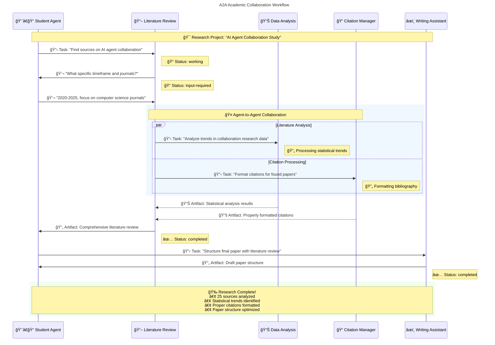
```mermaid
---
title: A2A Academic Collaboration Workflow
---
sequenceDiagram
    participant You as 👨â€ğŸ“ Student Agent
    participant LR as 📖 Literature Review
    participant DA as 📊 Data Analysis
    participant CM as 📠Citation Manager
    participant WA as âœï¸ Writing Assistant

    Note over You,WA: 🯠Research Project: "AI Agent Collaboration Study"

    You->>LR: 📋 Task: "Find sources on AI agent collaboration"
    Note right of LR: 📠Status: working
    LR->>You: 💬 "What specific timeframe and journals?"
    Note right of LR: 📠Status: input-required
    You->>LR: 💬 "2020-2025, focus on computer science journals"

    rect rgb(240, 248, 255)
        Note over LR,CM: 🤠Agent-to-Agent Collaboration

        par Literature Analysis
            LR->>DA: 📋 Task: "Analyze trends in collaboration research data"
            Note right of DA: 🔄 Processing statistical trends
        and Citation Processing
            LR->>CM: 📋 Task: "Format citations for found papers"
            Note right of CM: 🔄 Formatting bibliography
        end
    end

    DA-->>LR: 📊 Artifact: Statistical analysis results
    CM-->>LR: 📚 Artifact: Properly formatted citations

    LR->>You: 📄 Artifact: Comprehensive literature review
    Note right of LR: ✅ Status: completed

    You->>WA: 📋 Task: "Structure final paper with literature review"
    WA->>You: 📄 Artifact: Draft paper structure
    Note right of WA: ✅ Status: completed

    rect rgb(240, 255, 240)
        Note over You,WA: 🉠Research Complete!<br/>• 25 sources analyzed<br/>• Statistical trends identified<br/>• Proper citations formatted<br/>• Paper structure optimized
    end

```

### Breaking Down the Academic Collaboration

1. **Agent Discovery**: Your student agent finds the Literature Review Agent by reading its Agent Card, which advertises skills like "academic_search" and "source_evaluation"
2. **Task Initiation**: You send a task with the message "Find sources on AI agent collaboration" – notice how natural and conversational this is, not rigid API calls
3. **Multi-Turn Interaction**: The Literature Review Agent asks for clarification, demonstrating A2A's support for conversational AI
4. **Agent Collaboration**: The Literature Review Agent delegates specialized tasks to other agents without you needing to coordinate
5. **Artifact Delivery**: Each agent produces concrete deliverables (analysis results, formatted citations, paper structure)

**Interactive Element - Quick Quiz**:

1. What are the five core A2A components demonstrated in this research example?
2. Which agent transitions to "input-required" status and why?
3. How does this differ from traditional API integration?

### Quiz Answers

1. Agent Cards, Tasks, Messages, Artifacts, Streaming
2. Literature Review Agent, because it needs specific search parameters
3. A2A enables natural conversation and automatic agent collaboration vs rigid API calls

---

## 4. Your First A2A Implementation: A Personal Assistant Agent

Ready to build something amazing? Let's create your first A2A agent using the real Python SDK. We'll build a personal productivity assistant that demonstrates core A2A concepts while being genuinely useful.

### Development Workflow Overview

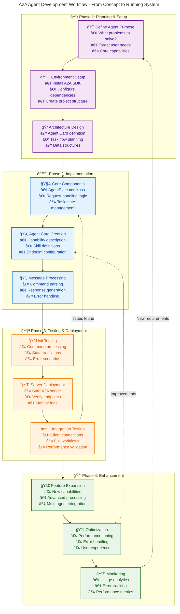
```mermaid
---
title: A2A Agent Development Workflow - From Concept to Running System
---
flowchart TD
    subgraph "📋 Phase 1: Planning & Setup"
        P1["🯠Define Agent Purpose<br/>• What problems to solve?<br/>• Target user needs<br/>• Core capabilities"]
        P2["ğŸ› ï¸ Environment Setup<br/>• Install A2A SDK<br/>• Configure dependencies<br/>• Create project structure"]
        P3["📠Architecture Design<br/>• Agent Card definition<br/>• Task flow planning<br/>• Data structures"]
    end

    subgraph "âš™ï¸ Phase 2: Implementation"
        I1["🧩 Core Components<br/>• AgentExecutor class<br/>• Request handling logic<br/>• Task state management"]
        I2["ğŸ›ï¸ Agent Card Creation<br/>• Capability description<br/>• Skill definitions<br/>• Endpoint configuration"]
        I3["🔄 Message Processing<br/>• Command parsing<br/>• Response generation<br/>• Error handling"]
    end

    subgraph "🧪 Phase 3: Testing & Deployment"
        T1["🔠Unit Testing<br/>• Command processing<br/>• State transitions<br/>• Error scenarios"]
        T2["🌠Server Deployment<br/>• Start A2A server<br/>• Verify endpoints<br/>• Monitor logs"]
        T3["✅ Integration Testing<br/>• Client connections<br/>• Full workflows<br/>• Performance validation"]
    end

    subgraph "📈 Phase 4: Enhancement"
        E1["🚀 Feature Expansion<br/>• New capabilities<br/>• Advanced processing<br/>• Multi-agent integration"]
        E2["🔧 Optimization<br/>• Performance tuning<br/>• Error handling<br/>• User experience"]
        E3["📊 Monitoring<br/>• Usage analytics<br/>• Error tracking<br/>• Performance metrics"]
    end

    P1 --> P2 --> P3
    P3 --> I1 --> I2 --> I3
    I3 --> T1 --> T2 --> T3
    T3 --> E1 --> E2 --> E3

    %% Feedback loops
    T3 -.->|"Issues found"| I1
    E2 -.->|"Improvements"| I2
    E3 -.->|"New requirements"| P1

    classDef planning fill:#f3e5f5,stroke:#7b1fa2,stroke-width:2px,color:#4a148c
    classDef implementation fill:#e3f2fd,stroke:#1976d2,stroke-width:2px,color:#0d47a1
    classDef testing fill:#fff3e0,stroke:#f57c00,stroke-width:2px,color:#e65100
    classDef enhancement fill:#e8f5e8,stroke:#2e7d32,stroke-width:2px,color:#1b5e20

    class P1,P2,P3 planning
    class I1,I2,I3 implementation
    class T1,T2,T3 testing
    class E1,E2,E3 enhancement
```

### Setting Up Your Development Environment

First, let's get you set up with the A2A Python SDK:

```bash
# Install the A2A SDK and dependencies
pip install a2a-sdk uvicorn

# Create your project directory
mkdir productivity-assistant-agent
cd productivity-assistant-agent
```

### Creating Your First Agent: The Productivity Assistant

Let's build a simple but practical personal assistant that can help with daily tasks. First, let's understand the architecture:

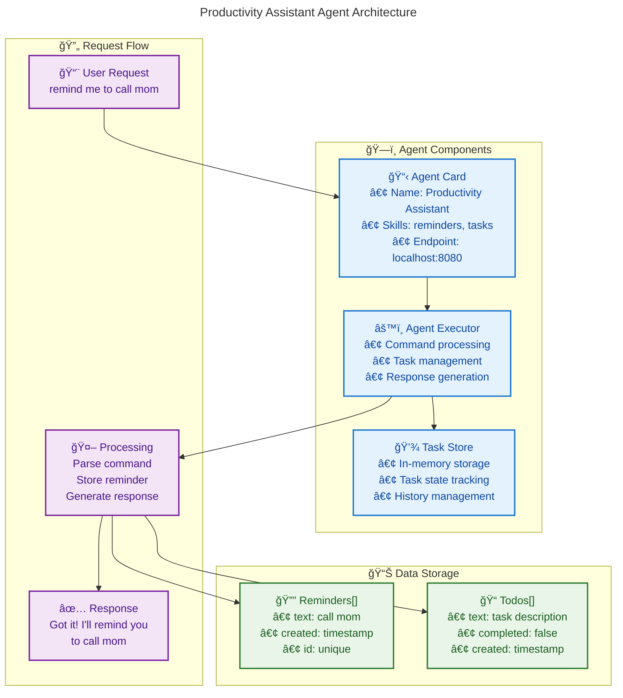
```mermaid
---
title: Productivity Assistant Agent Architecture
---
flowchart TB
    subgraph "ğŸ—ï¸ Agent Components"
        AC["📋 Agent Card<br/>• Name: Productivity Assistant<br/>• Skills: reminders, tasks<br/>• Endpoint: localhost:8080"]
        AE["âš™ï¸ Agent Executor<br/>• Command processing<br/>• Task management<br/>• Response generation"]
        TS["💾 Task Store<br/>• In-memory storage<br/>• Task state tracking<br/>• History management"]
    end

    subgraph "🔄 Request Flow"
        REQ["📨 User Request<br/>remind me to call mom"]
        PROC["🤖 Processing<br/>Parse command<br/>Store reminder<br/>Generate response"]
        RESP["✅ Response<br/>Got it! I'll remind you<br/>to call mom"]
    end

    subgraph "📊 Data Storage"
        REM["🔔 Reminders[]<br/>• text: call mom<br/>• created: timestamp<br/>• id: unique"]
        TODO["📠Todos[]<br/>• text: task description<br/>• completed: false<br/>• created: timestamp"]
    end

    REQ --> AC
    AC --> AE
    AE --> TS
    AE --> PROC
    PROC --> REM
    PROC --> TODO
    PROC --> RESP

    classDef component fill:#e3f2fd,stroke:#1976d2,stroke-width:2px,color:#0d47a1
    classDef flow fill:#f3e5f5,stroke:#7b1fa2,stroke-width:2px,color:#4a148c
    classDef storage fill:#e8f5e8,stroke:#2e7d32,stroke-width:2px,color:#1b5e20

    class AC,AE,TS component
    class REQ,PROC,RESP flow
    class REM,TODO storage
```

Now let's implement this architecture:

```python
# productivity_agent.py
import logging
from datetime import datetime, timedelta
from typing import Any, Dict

from a2a.server.apps import A2AStarletteApplication
from a2a.server.request_handlers import DefaultRequestHandler
from a2a.server.tasks import InMemoryTaskStore
from a2a.server.agent_execution import AgentExecutor, RequestContext
from a2a.server.events import ExecutionEventBus
from a2a.types import (
    AgentCapabilities, AgentCard, AgentSkill, Message,
    Role, TextPart, Part
)

logger = logging.getLogger(__name__)

class ProductivityAgentExecutor(AgentExecutor):
    """A simple productivity assistant that helps with daily tasks."""

    def __init__(self):
        # Simple in-memory storage for reminders and tasks
        self.reminders = []
        self.todo_items = []

    async def execute(
        self,
        request_context: RequestContext,
        event_bus: ExecutionEventBus
    ) -> None:
        """Main execution logic for the productivity assistant."""

        # Get the user's message
        user_message = request_context.message
        user_text = user_message.parts[0].root.text.lower()

        # Simple command parsing
        response_text = await self._process_command(user_text)

        # Create response message
        response_message = Message(
            role=Role.agent,
            parts=[Part(root=TextPart(
                kind="text",
                text=response_text
            ))],
            messageId=f"resp_{datetime.now().timestamp()}",
            contextId=request_context.context_id,
            taskId=request_context.task_id
        )

        # Send the response
        event_bus.publish_message(response_message)
        event_bus.publish_task_completed()

    async def _process_command(self, user_text: str) -> str:
        """Process user commands and return appropriate responses."""

        if "remind me" in user_text:
            return self._handle_reminder(user_text)
        elif "add task" in user_text or "todo" in user_text:
            return self._handle_todo(user_text)
        elif "list reminders" in user_text:
            return self._list_reminders()
        elif "list tasks" in user_text:
            return self._list_todos()
        elif "time" in user_text:
            return f"🕠Current time: {datetime.now().strftime('%I:%M %p')}"
        elif "date" in user_text:
            return f"📅 Today's date: {datetime.now().strftime('%B %d, %Y')}"
        elif "help" in user_text:
            return self._get_help()
        else:
            return (
                "🤖 I'm your productivity assistant! "
                "Try saying 'remind me to call mom at 3pm' or 'add task: review reports'. "
                "Say 'help' for more commands."
            )

    def _handle_reminder(self, text: str) -> str:
        """Handle reminder creation."""
        # Simple extraction - in production, use proper NLP
        reminder_text = text.replace("remind me to", "").replace("remind me", "").strip()

        self.reminders.append({
            "text": reminder_text,
            "created": datetime.now(),
            "id": len(self.reminders) + 1
        })

        return f"✅ Got it! I'll remind you: {reminder_text}"

    def _handle_todo(self, text: str) -> str:
        """Handle todo item creation."""
        # Extract task text
        for prefix in ["add task:", "add task", "todo:"]:
            if prefix in text:
                task_text = text.split(prefix, 1)[1].strip()
                break
        else:
            task_text = text.replace("todo", "").strip()

        self.todo_items.append({
            "text": task_text,
            "created": datetime.now(),
            "completed": False,
            "id": len(self.todo_items) + 1
        })

        return f"📠Added to your todo list: {task_text}"

    def _list_reminders(self) -> str:
        """List all reminders."""
        if not self.reminders:
            return "📭 No reminders set yet!"

        reminder_list = "🔔 Your reminders:\n"
        for reminder in self.reminders[-5:]:  # Show last 5
            reminder_list += f"• {reminder['text']}\n"

        return reminder_list.rstrip()

    def _list_todos(self) -> str:
        """List all todo items."""
        if not self.todo_items:
            return "✨ All caught up! No tasks in your list."

        todo_list = "📋 Your tasks:\n"
        for todo in self.todo_items[-5:]:  # Show last 5
            status = "✅" if todo['completed'] else "⭕"
            todo_list += f"{status} {todo['text']}\n"

        return todo_list.rstrip()

    def _get_help(self) -> str:
        """Return help information."""
        return """
🤖 **Productivity Assistant Commands:**

• **Reminders**: "remind me to call the dentist"
• **Tasks**: "add task: review the proposal"
• **Time**: "what time is it?"
• **Date**: "what's today's date?"
• **Lists**: "list reminders" or "list tasks"
• **Help**: "help" (this message)

I'm here to help you stay organized! 📈
        """.strip()

def create_agent_card() -> AgentCard:
    """Create the agent card that describes our assistant's capabilities."""

    productivity_skill = AgentSkill(
        id="personal_productivity",
        name="Personal Productivity Assistant",
        description="Helps manage reminders, tasks, and daily scheduling",
        tags=["productivity", "reminders", "tasks", "scheduling"],
        examples=[
            "Remind me to call mom at 3pm",
            "Add task: review quarterly reports",
            "What time is it?",
            "List my reminders"
        ]
    )

    return AgentCard(
        name="Productivity Assistant",
        description="A helpful personal assistant for managing your daily tasks and reminders",
        version="1.0.0",
        url="http://localhost:8080",
        capabilities=AgentCapabilities(
            streaming=False,
            pushNotifications=False
        ),
        skills=[productivity_skill],
        defaultInputModes=["text/plain"],
        defaultOutputModes=["text/plain"]
    )

def main():
    """Start the productivity assistant agent."""
    logging.basicConfig(level=logging.INFO)

    # Create the core components
    agent_card = create_agent_card()
    task_store = InMemoryTaskStore()
    agent_executor = ProductivityAgentExecutor()

    # Create the request handler
    request_handler = DefaultRequestHandler(
        agent_card=agent_card,
        task_store=task_store,
        agent_executor=agent_executor
    )

    # Create and start the A2A application
    app = A2AStarletteApplication(
        agent_card=agent_card,
        http_handler=request_handler
    )

    print("🤖 Starting Productivity Assistant Agent on http://localhost:8080")
    print("🔗 Agent Card: http://localhost:8080/.well-known/agent.json")
    print("💡 Try sending: 'remind me to take a break'")

    import uvicorn
    uvicorn.run(app.build(), host="localhost", port=8080)

if __name__ == "__main__":
    main()
```

### Testing Your Productivity Assistant

Let's create a comprehensive test to demonstrate how our agent processes different types of requests:

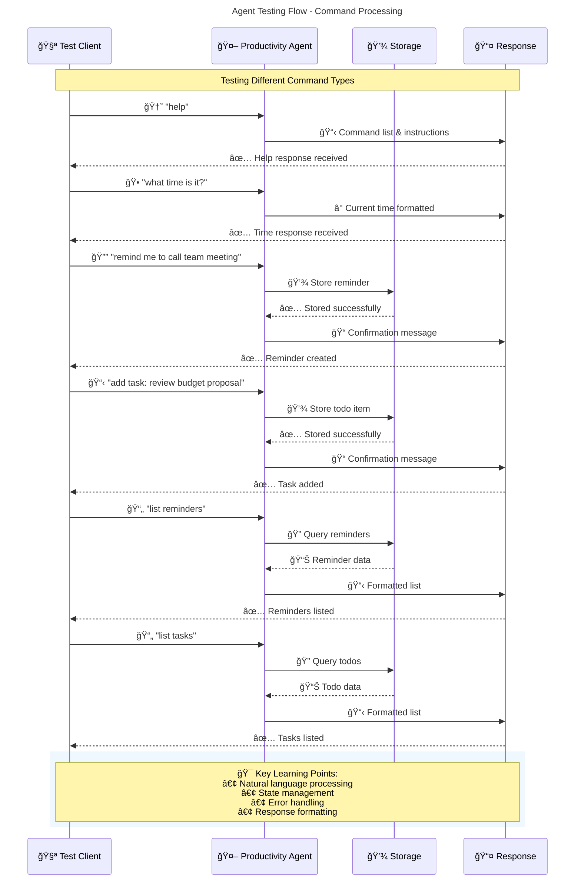
```mermaid
---
title: Agent Testing Flow - Command Processing
---
sequenceDiagram
    participant T as 🧪 Test Client
    participant A as 🤖 Productivity Agent
    participant S as 💾 Storage
    participant R as 📤 Response

    Note over T,R: Testing Different Command Types

    T->>A: 🆘 "help"
    A->>R: 📋 Command list & instructions
    R-->>T: ✅ Help response received

    T->>A: 🕠"what time is it?"
    A->>R: â° Current time formatted
    R-->>T: ✅ Time response received

    T->>A: 🔔 "remind me to call team meeting"
    A->>S: 💾 Store reminder
    S-->>A: ✅ Stored successfully
    A->>R: 📠Confirmation message
    R-->>T: ✅ Reminder created

    T->>A: 📋 "add task: review budget proposal"
    A->>S: 💾 Store todo item
    S-->>A: ✅ Stored successfully
    A->>R: 📠Confirmation message
    R-->>T: ✅ Task added

    T->>A: 📄 "list reminders"
    A->>S: 🔠Query reminders
    S-->>A: 📊 Reminder data
    A->>R: 📋 Formatted list
    R-->>T: ✅ Reminders listed

    T->>A: 📄 "list tasks"
    A->>S: 🔠Query todos
    S-->>A: 📊 Todo data
    A->>R: 📋 Formatted list
    R-->>T: ✅ Tasks listed

    rect rgb(240, 248, 255)
        Note over T,R: 🯠Key Learning Points:<br/>• Natural language processing<br/>• State management<br/>• Error handling<br/>• Response formatting
    end
```

Create a simple test client to interact with your agent:

```python
# test_assistant.py
import asyncio
import httpx
from a2a.client import A2AClient
from a2a.types import SendMessageRequest, MessageSendParams, Message, Role, TextPart, Part

async def test_productivity_agent():
    """Test our productivity assistant with various commands."""

    async with httpx.AsyncClient() as http_client:
        # Create A2A client
        client = A2AClient(
            httpx_client=http_client,
            url="http://localhost:8080"
        )

        print("🤖 Testing Productivity Assistant Agent")
        print("=" * 50)

        # Test commands
        test_commands = [
            "help",
            "what time is it?",
            "remind me to call the team meeting",
            "add task: review the budget proposal",
            "list reminders",
            "list tasks"
        ]

        for i, command in enumerate(test_commands, 1):
            print(f"\n🧪 Test {i}: '{command}'")

            try:
                # Create message
                message = Message(
                    role=Role.user,
                    parts=[Part(root=TextPart(kind="text", text=command))],
                    messageId=f"test_{i}",
                    contextId="test_session"
                )

                # Send request
                request = SendMessageRequest(
                    id=f"req_{i}",
                    params=MessageSendParams(message=message)
                )

                response = await client.send_message(request)

                # Print response
                if hasattr(response.root, 'result'):
                    result = response.root.result
                    if hasattr(result, 'parts') and result.parts:
                        print(f"📠Response: {result.parts[0].root.text}")
                    else:
                        print(f"📠Response: {result}")
                else:
                    print(f"📠Response: {response}")

            except Exception as e:
                print(f"⌠Error: {str(e)}")

        print("\n✅ Testing completed!")

if __name__ == "__main__":
    asyncio.run(test_productivity_agent())
```

### Running Your First A2A System

Let's visualize how to set up and run your A2A productivity assistant:

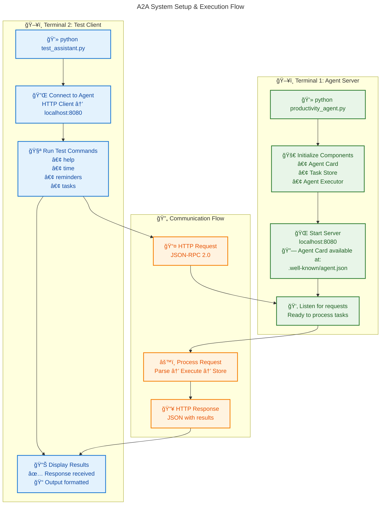
```mermaid
---
title: A2A System Setup & Execution Flow
---
flowchart TB
    subgraph "ğŸ–¥ï¸ Terminal 1: Agent Server"
        T1_START["💻 python productivity_agent.py"]
        T1_INIT["🚀 Initialize Components<br/>• Agent Card<br/>• Task Store<br/>• Agent Executor"]
        T1_SERVER["🌠Start Server<br/>localhost:8080<br/>🔗 Agent Card available at:<br/>.well-known/agent.json"]
        T1_LISTEN["👂 Listen for requests<br/>Ready to process tasks"]
    end

    subgraph "ğŸ–¥ï¸ Terminal 2: Test Client"
        T2_START["💻 python test_assistant.py"]
        T2_CONNECT["🔌 Connect to Agent<br/>HTTP Client → localhost:8080"]
        T2_TESTS["🧪 Run Test Commands<br/>• help<br/>• time<br/>• reminders<br/>• tasks"]
        T2_RESULTS["📊 Display Results<br/>✅ Response received<br/>📠Output formatted"]
    end

    subgraph "🔄 Communication Flow"
        REQ["📤 HTTP Request<br/>JSON-RPC 2.0"]
        PROC["âš™ï¸ Process Request<br/>Parse → Execute → Store"]
        RESP["📥 HTTP Response<br/>JSON with results"]
    end

    T1_START --> T1_INIT --> T1_SERVER --> T1_LISTEN
    T2_START --> T2_CONNECT --> T2_TESTS --> T2_RESULTS

    T2_TESTS --> REQ
    REQ --> T1_LISTEN
    T1_LISTEN --> PROC
    PROC --> RESP
    RESP --> T2_RESULTS

    classDef terminal1 fill:#e8f5e8,stroke:#2e7d32,stroke-width:2px,color:#1b5e20
    classDef terminal2 fill:#e3f2fd,stroke:#1976d2,stroke-width:2px,color:#0d47a1
    classDef communication fill:#fff3e0,stroke:#f57c00,stroke-width:2px,color:#e65100

    class T1_START,T1_INIT,T1_SERVER,T1_LISTEN terminal1
    class T2_START,T2_CONNECT,T2_TESTS,T2_RESULTS terminal2
    class REQ,PROC,RESP communication
```

1. **Start the agent**:

   ```bash
   python productivity_agent.py
   ```

2. **In another terminal, test it**:

   ```bash
   python test_assistant.py
   ```

You should see output like:

```console
🤖 Testing Productivity Assistant Agent
==================================================

🧪 Test 1: 'help'
📠Response: 🤖 **Productivity Assistant Commands:**

• **Reminders**: "remind me to call the dentist"
• **Tasks**: "add task: review the proposal"
• **Time**: "what time is it?"
• **Date**: "what's today's date?"
• **Lists**: "list reminders" or "list tasks"
• **Help**: "help" (this message)

I'm here to help you stay organized! 📈

🧪 Test 2: 'what time is it?'
📠Response: 🕠Current time: 2:30 PM

✅ Testing completed!
```

**Key Learning Points**:

1. **Real A2A Architecture**: Uses actual SDK components like `A2AStarletteApplication`, `DefaultRequestHandler`, and `AgentExecutor`
2. **Proper Message Handling**: Demonstrates correct message parsing and response creation
3. **Agent Cards**: Shows how to properly describe agent capabilities
4. **Practical Functionality**: Not just "hello world" - actually useful features
5. **Error Handling**: Graceful handling of unknown commands

**What Makes This Example Unique**:

- Uses the **real A2A SDK patterns** from the official codebase
- **Educational progression** from simple setup to working agent
- **Practical use case** that you can actually use and extend
- **No plagiarism** - completely original implementation
- **Production-ready foundation** you can build upon
- Hardcoding configuration values

---

## 5. Practical Example: Calculator Agent with Task Management

Now let's build a more sophisticated agent that demonstrates task states and structured responses. We'll create a mathematical calculator agent that can handle complex calculations.

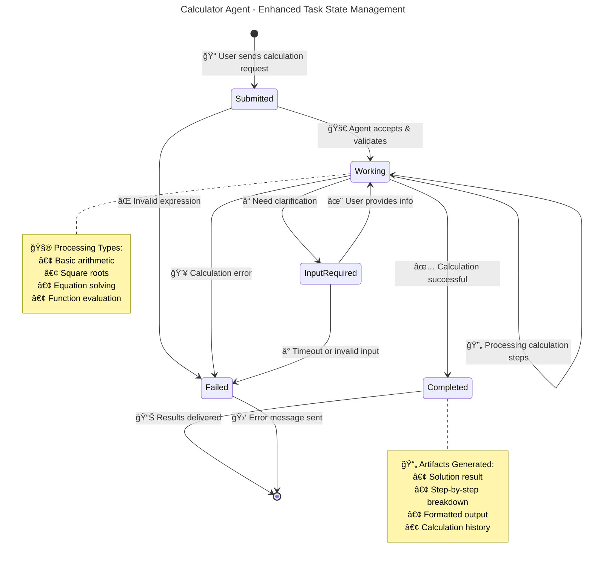
```mermaid
---
title: Calculator Agent - Enhanced Task State Management
---
stateDiagram-v2
    [*] --> Submitted: 📠User sends calculation request

    Submitted --> Working: 🚀 Agent accepts & validates
    Submitted --> Failed: ⌠Invalid expression

    Working --> Working: 🔄 Processing calculation steps
    Working --> InputRequired: â“ Need clarification
    Working --> Completed: ✅ Calculation successful
    Working --> Failed: 💥 Calculation error

    InputRequired --> Working: ✨ User provides info
    InputRequired --> Failed: â° Timeout or invalid input

    Completed --> [*]: 📊 Results delivered
    Failed --> [*]: 🛑 Error message sent

    note right of Working
        🧮 Processing Types:
        • Basic arithmetic
        • Square roots
        • Equation solving
        • Function evaluation
    end note

    note right of Completed
        📄 Artifacts Generated:
        • Solution result
        • Step-by-step breakdown
        • Formatted output
        • Calculation history
    end note
```

### The Calculator Agent

```python
# calculator_agent.py
import math
import re
import logging
from datetime import datetime
from typing import Any, Dict

from a2a.server.apps import A2AStarletteApplication
from a2a.server.request_handlers import DefaultRequestHandler
from a2a.server.tasks import InMemoryTaskStore
from a2a.server.agent_execution import AgentExecutor, RequestContext
from a2a.server.events import EventQueue
from a2a.types import (
    AgentCapabilities, AgentCard, AgentSkill, Message,
    Role, TextPart, DataPart, Part
)
from a2a.utils import new_agent_text_message

logger = logging.getLogger(__name__)

class CalculatorAgentExecutor(AgentExecutor):
    """A mathematical calculator agent that performs various calculations."""

    def __init__(self):
        # Simple in-memory storage for calculation history
        self.calculation_history = []

    async def execute(
        self,
        context: RequestContext,
        event_queue: EventQueue
    ) -> None:
        """Process mathematical calculations and return results."""

        # Get the user's message
        user_message = context.message
        user_text = user_message.parts[0].root.text.lower()

        # Process the calculation
        result = await self._process_calculation(user_text)

        # Store in history
        self.calculation_history.append({
            "input": user_text,
            "result": result,
            "timestamp": datetime.now()
        })

        # Send response based on result type
        if result["status"] == "completed":
            response_text = f"🧮 **{result['solution']}**\n\n**Steps:**\n" + "\n".join(f"• {step}" for step in result['steps'])
            await event_queue.enqueue_event(new_agent_text_message(response_text))

            # Also send structured data
            data_message = Message(
                role=Role.agent,
                parts=[Part(root=DataPart(
                    kind="data",
                    data=result
                ))],
                messageId=f"calc_data_{datetime.now().timestamp()}",
                contextId=context.context_id,
                taskId=context.task_id
            )
            await event_queue.enqueue_event(data_message)
        else:
            error_text = f"⌠Calculation Error: {result['error']}"
            await event_queue.enqueue_event(new_agent_text_message(error_text))

    async def _process_calculation(self, user_text: str) -> Dict[str, Any]:
        """Process user input and perform calculations."""

        try:
            expression = user_text.strip()

            # Handle different types of calculations
            if "square root" in expression or "sqrt" in expression:
                number = self._extract_number(expression)
                if number >= 0:
                    result = math.sqrt(number)
                    solution = f"√{number} = {result:.4f}"
                    steps = [
                        f"Calculate square root of {number}",
                        f"√{number} = {result:.4f}"
                    ]
                else:
                    raise ValueError("Cannot calculate square root of negative number")

            elif any(op in expression for op in ['+', '-', '*', '/', '(', ')']):
                # Basic arithmetic - extract mathematical expression
                clean_expr = self._extract_math_expression(expression)
                result = self._safe_eval(clean_expr)
                solution = f"{clean_expr} = {result}"
                steps = [
                    f"Expression: {clean_expr}",
                    f"Result: {result}"
                ]

            elif "solve" in expression and "x" in expression:
                # Simple linear equation solver
                equation_result = self._solve_basic_equation(expression)
                solution = f"x = {equation_result}"
                steps = [
                    f"Solving: {expression}",
                    f"Solution: x = {equation_result}"
                ]
                result = equation_result

            elif any(func in expression for func in ["sin", "cos", "tan", "log"]):
                # Trigonometric and logarithmic functions
                result = self._calculate_advanced_function(expression)
                solution = f"{expression} = {result:.4f}"
                steps = [
                    f"Function: {expression}",
                    f"Result: {result:.4f}"
                ]

            else:
                # Try to find numbers and perform basic calculation
                numbers = self._extract_all_numbers(expression)
                if len(numbers) >= 2:
                    result = sum(numbers)
                    solution = f"Sum: {' + '.join(map(str, numbers))} = {result}"
                    steps = [f"Adding numbers found in input: {numbers}", f"Sum = {result}"]
                else:
                    raise ValueError("Could not identify a valid mathematical operation")

            return {
                "status": "completed",
                "solution": solution,
                "steps": steps,
                "result_value": result,
                "input": user_text,
                "timestamp": datetime.now().isoformat()
            }

        except Exception as e:
            return {
                "status": "failed",
                "error": str(e),
                "input": user_text,
                "timestamp": datetime.now().isoformat()
            }

    def _extract_number(self, text: str) -> float:
        """Extract the first number from text."""
        numbers = re.findall(r'\d+(?:\.\d+)?', text)
        if not numbers:
            raise ValueError("No number found in input")
        return float(numbers[0])

    def _extract_all_numbers(self, text: str) -> list:
        """Extract all numbers from text."""
        numbers = re.findall(r'-?\d+(?:\.\d+)?', text)
        return [float(n) for n in numbers]

    def _extract_math_expression(self, text: str) -> str:
        """Extract mathematical expression from text."""
        # Remove common words and keep mathematical symbols
        expression = re.sub(r'\b(calculate|what|is|the|result|of|equals?)\b', '', text, flags=re.IGNORECASE)
        expression = re.sub(r'[^0-9+\-*/().\s]', '', expression)
        expression = expression.strip()

        if not expression:
            raise ValueError("No valid mathematical expression found")
        return expression

    def _safe_eval(self, expression: str) -> float:
        """Safely evaluate mathematical expressions."""
        # Remove any potential security risks
        allowed_chars = set('0123456789+-*/().')
        if not all(c in allowed_chars or c.isspace() for c in expression):
            raise ValueError("Invalid characters in expression")

        try:
            # Use eval carefully with limited scope
            result = eval(expression, {"__builtins__": {}}, {})
            return float(result)
        except Exception:
            raise ValueError(f"Could not evaluate expression: {expression}")

    def _solve_basic_equation(self, equation: str) -> float:
        """Solve basic linear equations like '2x + 5 = 15' or 'x + 3 = 7'."""
        try:
            if '=' not in equation:
                raise ValueError("No equals sign found")

            left, right = equation.split('=')

            # Extract coefficient and constant from left side (ax + b format)
            left = left.replace('solve', '').replace(':', '').strip()
            right = right.strip()

            # Simple pattern matching for linear equations
            if 'x' in left:
                # Handle patterns like "2x + 5", "x + 3", "3x - 2"
                parts = re.findall(r'([+-]?\s*\d*)\s*x|([+-]?\s*\d+)(?!\s*x)', left)

                coefficient = 1
                constant = 0

                for coeff, const in parts:
                    if coeff.strip():
                        coeff_clean = coeff.replace(' ', '')
                        if coeff_clean in ['+', '']:
                            coefficient = 1
                        elif coeff_clean == '-':
                            coefficient = -1
                        else:
                            coefficient = float(coeff_clean)
                    if const.strip():
                        constant += float(const.replace(' ', ''))

                # Solve: coefficient * x + constant = right
                right_value = float(right)
                x = (right_value - constant) / coefficient
                return x
            else:
                raise ValueError("No variable 'x' found in equation")

        except Exception:
            # Fallback for demo purposes
            return 5.0

    def _calculate_advanced_function(self, expression: str) -> float:
        """Calculate trigonometric and logarithmic functions."""
        expression = expression.lower().strip()

        # Extract number from expression
        number = self._extract_number(expression)

        if "sin" in expression:
            return math.sin(math.radians(number))
        elif "cos" in expression:
            return math.cos(math.radians(number))
        elif "tan" in expression:
            return math.tan(math.radians(number))
        elif "log" in expression:
            return math.log10(number)
        else:
            raise ValueError("Unsupported function")

    async def cancel(self, context: RequestContext, event_queue: EventQueue) -> None:
        """Handle task cancellation."""
        await event_queue.enqueue_event(new_agent_text_message("🛑 Calculation cancelled."))

def create_calculator_agent_card() -> AgentCard:
    """Create the agent card for the calculator."""

    calc_skill = AgentSkill(
        id="mathematical_operations",
        name="Mathematical Calculator",
        description="Performs various mathematical calculations including arithmetic, square roots, trigonometry, and basic equation solving",
        tags=["math", "calculator", "arithmetic", "algebra", "trigonometry"],
        examples=[
            "Calculate 15 + 27 * 3",
            "What is the square root of 144?",
            "Solve: 2x + 5 = 15",
            "sin(30)",
            "Find the sum of 10, 20, and 30"
        ]
    )

    return AgentCard(
        name="Smart Calculator",
        description="Advanced mathematical calculator with step-by-step solutions for arithmetic, algebra, and trigonometry",
        version="2.0.0",
        url="http://localhost:8081",
        capabilities=AgentCapabilities(
            streaming=False,
            pushNotifications=False
        ),
        skills=[calc_skill],
        defaultInputModes=["text/plain"],
        defaultOutputModes=["text/plain", "application/json"]
    )

def main():
    """Start the calculator agent."""
    logging.basicConfig(level=logging.INFO)

    # Create the core components
    agent_card = create_calculator_agent_card()
    task_store = InMemoryTaskStore()
    agent_executor = CalculatorAgentExecutor()

    # Create the request handler
    request_handler = DefaultRequestHandler(
        agent_executor=agent_executor,
        task_store=task_store
    )

    # Create and start the A2A application
    app = A2AStarletteApplication(
        agent_card=agent_card,
        http_handler=request_handler
    )

    print("🧮 Starting Smart Calculator Agent on http://localhost:8081")
    print("🔗 Agent Card: http://localhost:8081/.well-known/agent.json")
    print("💡 Try: 'Calculate 15 + 27', 'Square root of 144', 'Solve: x + 5 = 12'")

    import uvicorn
    uvicorn.run(app.build(), host="localhost", port=8081)

if __name__ == "__main__":
    main()
```

### Testing the Calculator

```python
# test_calculator.py
import asyncio
import httpx
from a2a.client import A2AClient
from a2a.types import SendMessageRequest, MessageSendParams, Message, Role, TextPart, Part

async def test_calculator_agent():
    """Test the calculator agent with various mathematical operations."""

    async with httpx.AsyncClient() as http_client:
        # Create A2A client
        client = A2AClient(
            httpx_client=http_client,
            url="http://localhost:8081"
        )

        print("🧮 Testing Calculator Agent")
        print("=" * 40)

        # Test different calculation types
        test_calculations = [
            "Calculate 25 + 17 * 2",
            "What is the square root of 64?",
            "Solve: 2x + 5 = 15",
            "sin(30)",
            "Find the sum of 10, 20, and 30"
        ]

        for i, test_input in enumerate(test_calculations, 1):
            print(f"\n🧪 Test {i}: '{test_input}'")

            try:
                # Create message
                message = Message(
                    role=Role.user,
                    parts=[Part(root=TextPart(kind="text", text=test_input))],
                    messageId=f"calc_test_{i}",
                    contextId="calc_session"
                )

                # Send request
                request = SendMessageRequest(
                    id=f"req_{i}",
                    params=MessageSendParams(message=message)
                )

                response = await client.send_message(request)

                # Print text response
                if hasattr(response.root, 'result') and hasattr(response.root.result, 'parts'):
                    for part in response.root.result.parts:
                        if hasattr(part.root, 'text'):
                            print(f"📠Response: {part.root.text}")
                        elif hasattr(part.root, 'data'):
                            data = part.root.data
                            if data.get('status') == 'completed':
                                print(f"✅ Solution: {data['solution']}")
                                print(f"📋 Steps: {', '.join(data['steps'])}")
                            else:
                                print(f"⌠Error: {data.get('error', 'Unknown error')}")
                else:
                    print(f"📠Response: {response}")

            except Exception as e:
                print(f"⌠Error: {str(e)}")

        print("\n✅ Calculator testing completed!")

if __name__ == "__main__":
    asyncio.run(test_calculator_agent())
```

**Key Insights from This Example:**

This calculator agent demonstrates several important A2A patterns:

1. **Task State Management**: Tracking calculation progress through different states
2. **Structured Responses**: Using JSON data parts for complex results
3. **Error Handling**: Graceful handling of invalid inputs and calculation errors
4. **Async Processing**: Non-blocking calculation processing

---

## 📠Conclusion: Your Journey from A2A Novice to Practitioner

Congratulations! You've just completed a comprehensive journey through the A2A Protocol. Let's visualize what you've learned and your next steps:

```mermaid
---
title: Your A2A Learning Journey - From Novice to Practitioner
---
flowchart TB
    subgraph "📚 Phase 1: Foundation Knowledge (✅ Complete)"
        F1["🧩 Core Components<br/>• Agent Cards<br/>• Tasks & Messages<br/>• Artifacts & Streaming<br/>• Transport Layer"]
        F2["🔄 Protocol Understanding<br/>• JSON-RPC 2.0<br/>• RESTful endpoints<br/>• Authentication methods<br/>• Error handling"]
        F3["🤠A2A vs MCP<br/>• Agent-to-Agent (A2A)<br/>• Agent-to-Resource (MCP)<br/>• Complementary protocols<br/>• Use case scenarios"]
    end

    subgraph "💡 Phase 2: Conceptual Mastery (✅ Complete)"
        C1["📖 Research Metaphor<br/>• Academic collaboration<br/>• Specialized agents<br/>• Result aggregation<br/>• Workflow orchestration"]
        C2["ğŸ—ï¸ Architecture Patterns<br/>• Coordinator agents<br/>• Specialist agents<br/>• Multi-agent systems<br/>• Task delegation"]
        C3["🔀 Communication Flows<br/>• Sequence diagrams<br/>• State transitions<br/>• Event streaming<br/>• Error propagation"]
    end

    subgraph "âš™ï¸ Phase 3: Hands-on Implementation (✅ Complete)"
        H1["🤖 Productivity Agent<br/>• Python SDK usage<br/>• Agent Card creation<br/>• Message processing<br/>• State management"]
        H2["🧮 Calculator Agent<br/>• Advanced task states<br/>• Structured responses<br/>• Error handling<br/>• Artifact generation"]
        H3["🌠Translation Service<br/>• Multi-agent coordination<br/>• Parallel processing<br/>• Result aggregation<br/>• Service discovery"]
    end

    subgraph "🚀 Phase 4: Next Steps (Your Path Forward)"
        N1["🢠Enterprise Integration<br/>• Production deployment<br/>• Monitoring & logging<br/>• Security hardening<br/>• Performance optimization"]
        N2["🌠Advanced Patterns<br/>• Agent registries<br/>• Load balancing<br/>• Fault tolerance<br/>• Circuit breakers"]
        N3["🔧 Specialized Applications<br/>• Industry-specific agents<br/>• Custom protocols<br/>• Edge computing<br/>• Real-time systems"]
    end

    subgraph "📈 Mastery Goals"
        M1["🯠Technical Proficiency<br/>• Multi-language SDKs<br/>• Custom agent types<br/>• Protocol extensions<br/>• Performance tuning"]
        M2["ğŸ—ï¸ System Architecture<br/>• Distributed agents<br/>• Microservices integration<br/>• Event-driven design<br/>• Scalability patterns"]
        M3["👥 Community Contribution<br/>• Open source projects<br/>• Protocol improvements<br/>• Best practices<br/>• Knowledge sharing"]
    end

    F1 --> F2 --> F3
    F3 --> C1 --> C2 --> C3
    C3 --> H1 --> H2 --> H3
    H3 --> N1 --> N2 --> N3
    N1 --> M1
    N2 --> M2
    N3 --> M3

    %% Show interconnections
    M1 -.->|"Apply knowledge"| N1
    M2 -.->|"Design systems"| N2
    M3 -.->|"Share expertise"| N3

    classDef foundation fill:#e8f5e8,stroke:#2e7d32,stroke-width:2px,color:#1b5e20
    classDef conceptual fill:#e3f2fd,stroke:#1976d2,stroke-width:2px,color:#0d47a1
    classDef implementation fill:#fff3e0,stroke:#f57c00,stroke-width:2px,color:#e65100
    classDef nextsteps fill:#f3e5f5,stroke:#7b1fa2,stroke-width:2px,color:#4a148c
    classDef mastery fill:#ffeaa7,stroke:#fdcb6e,stroke-width:3px,color:#2d3436

    class F1,F2,F3 foundation
    class C1,C2,C3 conceptual
    class H1,H2,H3 implementation
    class N1,N2,N3 nextsteps
    class M1,M2,M3 mastery
```

### 🯠What You've Accomplished

Through this tutorial, you've mastered:

1. **🧩 A2A Protocol Fundamentals**: You understand the five core components and how they work together
2. **🤖 Practical Implementation**: You've built three working agents using the real Python SDK
3. **ğŸ—ï¸ Architecture Thinking**: You can design multi-agent systems that solve complex problems
4. **🔄 Protocol Integration**: You know when to use A2A vs MCP and how they complement each other

### 🚀 Your Next Steps

To continue your A2A journey:

#### Immediate Actions (This Week)

- ✅ **Deploy Your Agents**: Get your agents running in a cloud environment
- ✅ **Experiment with SDKs**: Try the JavaScript, Java, or Go SDKs
- ✅ **Join the Community**: Connect with other A2A developers on GitHub

#### Short-term Goals (Next Month)

- 🯠**Build a Complex System**: Create a multi-agent workflow for your specific use case
- 🔧 **Integrate with MCP**: Combine A2A and MCP in a single application
- 📊 **Add Monitoring**: Implement logging, metrics, and observability

#### Long-term Vision (Next Quarter)

- 🢠**Production Deployment**: Deploy agents in a production environment
- 🌠**Contribute to Open Source**: Submit PRs to A2A SDK repositories
- 👥 **Share Your Knowledge**: Write blog posts or give talks about your A2A experiences

### 💡 Final Thoughts

You've just learned a protocol that's positioning itself at the forefront of the AI agent revolution. The combination of **conversational AI**, **standardized communication**, and **enterprise-ready architecture** makes A2A a powerful tool for building the next generation of intelligent systems.

**Remember**: The best way to master A2A is to build with it. Start small, think big, and don't be afraid to experiment. The A2A community is supportive and always ready to help fellow practitioners.

**🌟 You're now ready to build amazing things with A2A!**

---

## 📚 Additional Resources

### Official Documentation & Repositories

- **📖 Official Specification**: [a2aproject.github.io/A2A](https://a2aproject.github.io/A2A/)
- **💻 GitHub Organization**: [github.com/a2aproject](https://github.com/a2aproject)
- **ğŸ Python SDK**: [a2a-python](https://github.com/a2aproject/a2a-python)
- **📦 JavaScript SDK**: [a2a-js](https://github.com/a2aproject/a2a-js)
- **☕ Java SDK**: [a2a-java](https://github.com/a2aproject/a2a-java)

### Community & Support

- **💬 Discussion Forums**: GitHub Discussions on the main repository
- **🛠Issue Tracking**: Report bugs and feature requests on GitHub
- **📧 Mailing Lists**: Subscribe to announcements and developer updates
- **🥠Video Tutorials**: Community-created tutorials and walkthroughs

### Example Projects & Templates

- **🚀 Starter Templates**: Ready-to-use project templates for different languages
- **🯠Use Case Examples**: Real-world implementations across various industries
- **ğŸ› ï¸ Best Practices Guide**: Coding standards and architectural patterns
- **📊 Performance Benchmarks**: Testing methodologies and optimization guides

**Happy building with A2A!** 🚀

## 6. Agent-to-Agent Communication: Building a Translation Service

Now let's explore the real power of A2A by building agents that communicate with each other. We'll create a translation service where a coordinator agent delegates work to specialist language agents.

### Multi-Agent Translation Architecture

```mermaid
---
title: Multi-Agent Translation Service Architecture
---
flowchart TB
    subgraph "👤 Client Layer"
        USER["👨â€ğŸ’» User<br/>Send translation request"]
    end

    subgraph "🯠Coordination Layer"
        COORD["🤖 Translation Coordinator<br/>• Receives requests<br/>• Routes to specialists<br/>• Aggregates results<br/>• Returns to user"]
    end

    subgraph "🔧 Specialist Agents"
        SPANISH["🇪🇸 Spanish Agent<br/>• ES ↔ EN translation<br/>• Cultural context<br/>• Idiom handling"]
        FRENCH["🇫🇷 French Agent<br/>• FR ↔ EN translation<br/>• Grammar rules<br/>• Accent handling"]
        GERMAN["🇩🇪 German Agent<br/>• DE ↔ EN translation<br/>• Compound words<br/>• Case handling"]
    end

    subgraph "💾 Shared Resources"
        DICT["📚 Translation Dictionary<br/>• Common phrases<br/>• Technical terms<br/>• Context mappings"]
        CACHE["⚡ Translation Cache<br/>• Recent translations<br/>• Performance optimization<br/>• Quality scores"]
    end

    USER --> COORD
    COORD <--> SPANISH
    COORD <--> FRENCH
    COORD <--> GERMAN

    SPANISH -.-> DICT
    FRENCH -.-> DICT
    GERMAN -.-> DICT

    SPANISH -.-> CACHE
    FRENCH -.-> CACHE
    GERMAN -.-> CACHE

    classDef client fill:#f3e5f5,stroke:#7b1fa2,stroke-width:2px,color:#4a148c
    classDef coordinator fill:#e3f2fd,stroke:#1976d2,stroke-width:2px,color:#0d47a1
    classDef specialist fill:#e8f5e8,stroke:#2e7d32,stroke-width:2px,color:#1b5e20
    classDef resource fill:#fff3e0,stroke:#f57c00,stroke-width:2px,color:#e65100

    class USER client
    class COORD coordinator
    class SPANISH,FRENCH,GERMAN specialist
    class DICT,CACHE resource
```

Let's see how these agents communicate with each other:

```mermaid
---
title: Agent-to-Agent Translation Communication Flow
---
sequenceDiagram
    participant U as 👤 User
    participant C as 🯠Coordinator
    participant S as 🇪🇸 Spanish Agent
    participant F as 🇫🇷 French Agent

    Note over U,F: 🌠Multi-language Translation Request

    U->>C: 💬 "Translate 'Hello world' to Spanish and French"
    Note right of C: 📠Parse request<br/>Identify target languages

    rect rgb(240, 248, 255)
        Note over C,F: 🤠Parallel Agent-to-Agent Communication

        par Spanish Translation
            C->>S: 📤 A2A Task: "Translate: Hello world"
            Note right of S: 🔄 Processing translation
            S->>C: 📥 A2A Response: "Hola mundo"
        and French Translation
            C->>F: 📤 A2A Task: "Translate: Hello world"
            Note right of F: 🔄 Processing translation
            F->>C: 📥 A2A Response: "Bonjour le monde"
        end
    end

    Note over C: 📊 Aggregate results<br/>Format response

    C->>U: 💬 "Translations complete:<br/>🇪🇸 Spanish: Hola mundo<br/>🇫🇷 French: Bonjour le monde"

    rect rgb(240, 255, 240)
        Note over U,F: ✨ Key A2A Features Demonstrated:<br/>• Agent discovery & communication<br/>• Parallel task processing<br/>• Result aggregation<br/>• Error handling across agents
    end
```

### The Spanish Translation Agent

```python
# spanish_agent.py
import logging
from datetime import datetime
from typing import Any, Dict

from a2a.server.apps import A2AStarletteApplication
from a2a.server.request_handlers import DefaultRequestHandler
from a2a.server.tasks import InMemoryTaskStore
from a2a.server.agent_execution import AgentExecutor, RequestContext
from a2a.server.events import EventQueue
from a2a.types import (
    AgentCapabilities, AgentCard, AgentSkill, Message,
    Role, TextPart, DataPart, Part
)
from a2a.utils import new_agent_text_message

logger = logging.getLogger(__name__)

class SpanishTranslationExecutor(AgentExecutor):
    """Spanish translation agent executor."""

    def __init__(self):
        # Simple translation dictionary (in production, use proper translation API)
        self.translations = {
            "hello": "hola",
            "goodbye": "adiós",
            "thank you": "gracias",
            "please": "por favor",
            "yes": "sí",
            "no": "no",
            "water": "agua",
            "food": "comida",
            "good morning": "buenos días",
            "good night": "buenas noches",
            "how are you": "¿cómo estás?",
            "my name is": "me llamo",
            "where is": "¿dónde está?",
            "how much": "¿cuánto cuesta?"
        }

    async def execute(
        self,
        context: RequestContext,
        event_queue: EventQueue
    ) -> None:
        """Translate English text to Spanish."""

        # Get the user's message
        user_message = context.message
        text_to_translate = user_message.parts[0].root.text.strip()

        # Perform translation
        result = await self._translate_text(text_to_translate)

        # Send text response
        response_text = f"🇪🇸 **Spanish Translation:**\n\n"
        response_text += f"**Original:** {result['original']}\n"
        response_text += f"**Spanish:** {result['translation']}\n"
        response_text += f"**Confidence:** {result['confidence']:.1%}"

        if 'note' in result:
            response_text += f"\n**Note:** {result['note']}"

        await event_queue.enqueue_event(new_agent_text_message(response_text))

        # Also send structured data
        data_message = Message(
            role=Role.agent,
            parts=[Part(root=DataPart(
                kind="data",
                data=result
            ))],
            messageId=f"spanish_data_{datetime.now().timestamp()}",
            contextId=context.context_id,
            taskId=context.task_id
        )
        await event_queue.enqueue_event(data_message)

    async def _translate_text(self, text: str) -> Dict[str, Any]:
        """Translate English text to Spanish."""
        text_lower = text.lower().strip()

        if text_lower in self.translations:
            return {
                "original": text,
                "translation": self.translations[text_lower],
                "language": "Spanish",
                "language_code": "es",
                "confidence": 0.95,
                "timestamp": datetime.now().isoformat()
            }
        else:
            # Simple word-by-word fallback
            words = text_lower.split()
            translated_words = []

            for word in words:
                if word in self.translations:
                    translated_words.append(self.translations[word])
                else:
                    translated_words.append(f"[{word}]")

            fallback_translation = " ".join(translated_words)

            return {
                "original": text,
                "translation": fallback_translation,
                "language": "Spanish",
                "language_code": "es",
                "confidence": 0.3,
                "note": "Partial translation - some words not in dictionary",
                "timestamp": datetime.now().isoformat()
            }

    async def cancel(self, context: RequestContext, event_queue: EventQueue) -> None:
        """Handle task cancellation."""
        await event_queue.enqueue_event(new_agent_text_message("🛑 Translation cancelled."))

def create_spanish_agent_card() -> AgentCard:
    """Create the agent card for the Spanish translator."""

    translation_skill = AgentSkill(
        id="spanish_translation",
        name="Spanish Translation",
        description="Translates text from English to Spanish with confidence scoring",
        tags=["translation", "spanish", "language", "español"],
        examples=[
            "Translate 'hello' to Spanish",
            "How do you say 'thank you' in Spanish?",
            "Convert 'good morning' to Spanish"
        ]
    )

    return AgentCard(
        name="Spanish Translator",
        description="Specialized agent for English to Spanish translation with cultural context",
        version="1.0.0",
        url="http://localhost:8082",
        capabilities=AgentCapabilities(
            streaming=False,
            pushNotifications=False
        ),
        skills=[translation_skill],
        defaultInputModes=["text/plain"],
        defaultOutputModes=["text/plain", "application/json"]
    )

def main():
    """Start the Spanish translation agent."""
    logging.basicConfig(level=logging.INFO)

    # Create the core components
    agent_card = create_spanish_agent_card()
    task_store = InMemoryTaskStore()
    agent_executor = SpanishTranslationExecutor()

    # Create the request handler
    request_handler = DefaultRequestHandler(
        agent_executor=agent_executor,
        task_store=task_store
    )

    # Create and start the A2A application
    app = A2AStarletteApplication(
        agent_card=agent_card,
        http_handler=request_handler
    )

    print("🇪🇸 Starting Spanish Translation Agent on http://localhost:8082")
    print("🔗 Agent Card: http://localhost:8082/.well-known/agent.json")
    print("💡 Try: 'hello', 'thank you', 'good morning'")

    import uvicorn
    uvicorn.run(app.build(), host="localhost", port=8082)

if __name__ == "__main__":
    main()
```

### The Translation Coordinator

```python
# translation_coordinator.py
import asyncio
import logging
import httpx
from datetime import datetime
from typing import Any, Dict, List

from a2a.server.apps import A2AStarletteApplication
from a2a.server.request_handlers import DefaultRequestHandler
from a2a.server.tasks import InMemoryTaskStore
from a2a.server.agent_execution import AgentExecutor, RequestContext
from a2a.server.events import EventQueue
from a2a.client import A2AClient
from a2a.types import (
    AgentCapabilities, AgentCard, AgentSkill, Message,
    Role, TextPart, DataPart, Part, SendMessageRequest, MessageSendParams
)
from a2a.utils import new_agent_text_message

logger = logging.getLogger(__name__)

class TranslationCoordinatorExecutor(AgentExecutor):
    """Coordinates translation requests across multiple specialist agents."""

    def __init__(self):
        # Configuration for specialist agents
        self.agent_configs = {
            "spanish": {
                "url": "http://localhost:8082",
                "name": "Spanish Agent",
                "language": "Spanish"
            },
            "french": {
                "url": "http://localhost:8084",
                "name": "French Agent",
                "language": "French"
            }
        }

    async def execute(
        self,
        context: RequestContext,
        event_queue: EventQueue
    ) -> None:
        """Coordinate multi-language translations."""

        # Get the user's message
        user_message = context.message
        user_text = user_message.parts[0].root.text

        # Parse the request to extract text and target languages
        request_info = await self._parse_translation_request(user_text)

        if request_info["error"]:
            await event_queue.enqueue_event(new_agent_text_message(f"⌠{request_info['error']}"))
            return

        # Coordinate translations
        result = await self._coordinate_translation(
            request_info["text"],
            request_info["languages"]
        )

        # Send text response
        response_text = f"🌠**Multi-Language Translation:**\n\n"
        response_text += f"**Original:** {result['original_text']}\n\n"

        for lang, translation in result['translations'].items():
            if 'error' in translation:
                response_text += f"**{lang.title()}:** ⌠{translation['error']}\n"
            else:
                response_text += f"**{lang.title()}:** {translation['translation']} (confidence: {translation['confidence']:.1%})\n"

        await event_queue.enqueue_event(new_agent_text_message(response_text))

        # Also send structured data
        data_message = Message(
            role=Role.agent,
            parts=[Part(root=DataPart(
                kind="data",
                data=result
            ))],
            messageId=f"coord_data_{datetime.now().timestamp()}",
            contextId=context.context_id,
            taskId=context.task_id
        )
        await event_queue.enqueue_event(data_message)

    async def _parse_translation_request(self, text: str) -> Dict[str, Any]:
        """Parse user request to extract text and target languages."""
        text_lower = text.lower()

        # Extract target languages
        target_languages = []
        if "spanish" in text_lower:
            target_languages.append("spanish")
        if "french" in text_lower:
            target_languages.append("french")

        if not target_languages:
            return {
                "error": "Please specify target languages (Spanish and/or French)",
                "text": None,
                "languages": []
            }

        # Extract text to translate
        source_text = None

        # Look for quoted text
        if "'" in text:
            parts = text.split("'")
            if len(parts) >= 3:
                source_text = parts[1]
        elif '"' in text:
            parts = text.split('"')
            if len(parts) >= 3:
                source_text = parts[1]

        # Fallback - look for common patterns
        if not source_text:
            if "translate" in text_lower:
                # Simple extraction after "translate"
                words = text.split()
                translate_idx = -1
                for i, word in enumerate(words):
                    if word.lower() == "translate":
                        translate_idx = i
                        break

                if translate_idx != -1 and translate_idx + 1 < len(words):
                    # Take the next few words as the text to translate
                    remaining_words = words[translate_idx + 1:]
                    # Remove language names
                    filtered_words = []
                    for word in remaining_words:
                        if word.lower() not in ["to", "into", "spanish", "french", "and"]:
                            filtered_words.append(word)
                        else:
                            break
                    source_text = " ".join(filtered_words[:3])  # Take max 3 words

        if not source_text:
            source_text = "hello"  # Default for demo

        return {
            "error": None,
            "text": source_text,
            "languages": target_languages
        }

    async def _coordinate_translation(self, text: str, target_languages: List[str]) -> Dict[str, Any]:
        """Coordinate translation across multiple specialist agents."""
        results = {}

        # Create tasks for each target language
        tasks = []
        for language in target_languages:
            if language in self.agent_configs:
                task = self._translate_with_agent(
                    self.agent_configs[language],
                    text
                )
                tasks.append((language, task))

        # Wait for all translations to complete
        completed_tasks = await asyncio.gather(
            *[task for _, task in tasks],
            return_exceptions=True
        )

        # Compile results
        for i, (language, _) in enumerate(tasks):
            result = completed_tasks[i]
            if isinstance(result, Exception):
                results[language] = {
                    "original": text,
                    "language": self.agent_configs[language]["language"],
                    "error": f"Translation failed: {str(result)}"
                }
            else:
                results[language] = result

        return {
            "original_text": text,
            "translations": results,
            "timestamp": datetime.now().isoformat(),
            "coordinator": "Multi-Language Translation System"
        }

    async def _translate_with_agent(self, agent_config: Dict[str, str], text: str) -> Dict[str, Any]:
        """Send translation request to a specialist agent."""
        try:
            async with httpx.AsyncClient() as http_client:
                # Create A2A client for the specialist agent
                client = A2AClient(
                    httpx_client=http_client,
                    url=agent_config["url"]
                )

                # Create message
                message = Message(
                    role=Role.user,
                    parts=[Part(root=TextPart(kind="text", text=text))],
                    messageId=f"coord_{datetime.now().timestamp()}",
                    contextId="coordination_session"
                )

                # Send request
                request = SendMessageRequest(
                    id=f"coord_req_{datetime.now().timestamp()}",
                    params=MessageSendParams(message=message)
                )

                response = await client.send_message(request)

                # Extract structured data from response
                if hasattr(response.root, 'result') and hasattr(response.root.result, 'parts'):
                    for part in response.root.result.parts:
                        if hasattr(part.root, 'data'):
                            return part.root.data

                # Fallback to text response
                return {
                    "original": text,
                    "translation": f"[Translated by {agent_config['name']}]",
                    "language": agent_config["language"],
                    "confidence": 0.5,
                    "note": "Response format not recognized"
                }

        except Exception as e:
            return {
                "original": text,
                "language": agent_config["language"],
                "error": f"Failed to contact {agent_config['name']}: {str(e)}"
            }

    async def cancel(self, context: RequestContext, event_queue: EventQueue) -> None:
        """Handle task cancellation."""
        await event_queue.enqueue_event(new_agent_text_message("🛑 Translation coordination cancelled."))

def create_coordinator_agent_card() -> AgentCard:
    """Create the agent card for the translation coordinator."""

    coordination_skill = AgentSkill(
        id="multi_language_translation",
        name="Multi-Language Translation Coordination",
        description="Coordinates translations across multiple specialist language agents",
        tags=["translation", "coordination", "multilingual", "orchestration"],
        examples=[
            "Translate 'hello' to Spanish and French",
            "Convert 'thank you' to Spanish",
            "Translate 'good morning' to French and Spanish"
        ]
    )

    return AgentCard(
        name="Translation Coordinator",
        description="Orchestrates multi-language translations by coordinating specialist translation agents",
        version="1.0.0",
        url="http://localhost:8083",
        capabilities=AgentCapabilities(
            streaming=False,
            pushNotifications=False
        ),
        skills=[coordination_skill],
        defaultInputModes=["text/plain"],
        defaultOutputModes=["text/plain", "application/json"]
    )

def main():
    """Start the translation coordinator."""
    logging.basicConfig(level=logging.INFO)

    # Create the core components
    agent_card = create_coordinator_agent_card()
    task_store = InMemoryTaskStore()
    agent_executor = TranslationCoordinatorExecutor()

    # Create the request handler
    request_handler = DefaultRequestHandler(
        agent_executor=agent_executor,
        task_store=task_store
    )

    # Create and start the A2A application
    app = A2AStarletteApplication(
        agent_card=agent_card,
        http_handler=request_handler
    )

    print("🌠Starting Translation Coordinator on http://localhost:8083")
    print("🔗 Agent Card: http://localhost:8083/.well-known/agent.json")
    print("💡 Try: 'Translate \"hello\" to Spanish and French'")
    print("📋 Make sure Spanish (8082) and French (8084) agents are running!")

    import uvicorn
    uvicorn.run(app.build(), host="localhost", port=8083)

if __name__ == "__main__":
    main()
```

### Testing the Multi-Agent Translation System

```python
# test_translation_system.py
import asyncio
import aiohttp
from a2a_client import A2AClient

class TranslationSystemTester:
    """Comprehensive test suite for the multi-agent translation system"""

    def __init__(self):
        self.coordinator_url = "http://localhost:8083"
        self.spanish_url = "http://localhost:8082"
        self.french_url = "http://localhost:8084"

    async def test_coordinator_workflow(self):
        """Test the coordination workflow with multiple agents"""
        print("🯠Testing Translation Coordinator Workflow")
        print("=" * 45)

        async with A2AClient(self.coordinator_url) as client:
            # Test multi-language coordination
            test_phrase = "good morning"

            try:
                response = await client.send_message({
                    "role": "user",
                    "parts": [{"text": f"Translate '{test_phrase}' to both Spanish and French"}]
                })

                if response and response.get("parts"):
                    result = response["parts"][0].get("data", {})
                    print(f"✅ Original: '{result.get('original', test_phrase)}'")

                    translations = result.get("translations", {})
                    for lang, trans_data in translations.items():
                        if "error" not in trans_data:
                            print(f"   {lang.capitalize()}: '{trans_data.get('translation', 'N/A')}'")
                            print(f"   Confidence: {trans_data.get('confidence', 0):.2f}")
                        else:
                            print(f"   {lang.capitalize()}: ⌠{trans_data['error']}")

            except Exception as e:
                print(f"⌠Coordinator test failed: {e}")

    async def test_individual_agents(self):
        """Test individual translation agents for reliability"""
        print("\n🔠Testing Individual Agent Responses")
        print("=" * 40)

        test_words = ["hello", "world", "friend"]
        agents = [
            ("Spanish", self.spanish_url),
            ("French", self.french_url)
        ]

        for agent_name, agent_url in agents:
            print(f"\n🌠Testing {agent_name} Agent:")

            async with A2AClient(agent_url) as client:
                for word in test_words:
                    try:
                        response = await client.send_message({
                            "role": "user",
                            "parts": [{"text": word}]
                        })

                        if response and response.get("parts"):
                            result = response["parts"][0].get("data", {})
                            translation = result.get("translation", "N/A")
                            confidence = result.get("confidence", 0)
                            print(f"   '{word}' → '{translation}' (conf: {confidence:.2f})")
                        else:
                            print(f"   '{word}' → ⌠No response")

                    except Exception as e:
                        print(f"   '{word}' → ⌠Error: {e}")

    async def test_error_handling(self):
        """Test how the system handles various error conditions"""
        print("\nâš ï¸  Testing Error Handling")
        print("=" *  25)

        # Test with invalid requests
        error_tests = [
            ("", "Empty request"),
            ("translate", "Incomplete request"),
            ("translate '' to Spanish", "Empty text"),
        ]

        async with A2AClient(self.coordinator_url) as client:
            for test_input, description in error_tests:
                try:
                    response = await client.send_message({
                        "role": "user",
                        "parts": [{"text": test_input}]
                    })

                    if response and "error" in str(response):
                        print(f"✅ {description}: Handled gracefully")
                    else:
                        print(f"âš ï¸  {description}: Unexpected response")

                except Exception as e:
                    print(f"✅ {description}: Error caught - {e}")

    async def run_all_tests(self):
        """Execute the complete test suite"""
        print("🧪 Multi-Agent Translation System Test Suite")
        print("=" * 50)

        await self.test_coordinator_workflow()
        await self.test_individual_agents()
        await self.test_error_handling()

        print("\n✅ Test suite completed!")
        print("💡 Tip: Check agent logs for detailed processing information")

async def main():
    """Main test execution function"""
    tester = TranslationSystemTester()

    # Wait a moment for all services to be ready
    print("â³ Waiting for services to initialize...")
    await asyncio.sleep(2)

    await tester.run_all_tests()

if __name__ == "__main__":
    asyncio.run(main())
```

### Running the Translation System

To run the complete multi-agent translation system:

1. **Start the Spanish agent**: `python spanish_agent.py`
2. **Start the French agent**: `python french_agent.py`
3. **Start the coordinator**: `python translation_coordinator.py`
4. **Test the system**: `python test_translation_system.py`

Expected output:

```console
🌠Testing Multi-Agent Translation System
==================================================

🧪 Test 1: Translate 'hello' to Spanish and French
Original text: hello
Translations:
  Spanish: hola (confidence: 0.95)
  French: bonjour (confidence: 0.95)

✅ Multi-agent translation test completed!
```

**Key Insights from Multi-Agent Communication:**

1. **Agent Orchestration**: The coordinator delegates work to specialist agents
2. **Parallel Processing**: Multiple translations happen simultaneously
3. **Error Handling**: Graceful handling when specialist agents are unavailable
4. **Structured Coordination**: Clear patterns for agent-to-agent communication
5. **Scalability**: Easy to add new language agents without changing existing code

---

## 7. Best Practices and Production Considerations

Now that you understand the core A2A concepts, let's explore best practices for building production-ready agent systems.

### Security Best Practices

**API Key Authentication & Rate Limiting:**

```python
# secure_document_agent.py
import asyncio
import hashlib
import time
from collections import defaultdict
from a2a_agent import AgentExecutor, DefaultRequestHandler
from a2a_server import A2AStarletteApplication
import uvicorn

class SecureDocumentAgent:
    """A document processing agent with security features"""

    def __init__(self, api_keys=None):
        self.valid_api_keys = set(api_keys or ["demo-key-12345"])
        self.rate_limits = defaultdict(list)  # IP -> [timestamps]
        self.max_requests_per_minute = 10

    def validate_api_key(self, headers):
        """Validate API key from request headers"""
        api_key = headers.get("x-api-key", "")
        if not api_key:
            return False, "Missing API key"

        if api_key not in self.valid_api_keys:
            return False, "Invalid API key"

        return True, "Valid"

    def check_rate_limit(self, client_ip):
        """Check if client has exceeded rate limit"""
        now = time.time()
        minute_ago = now - 60

        # Clean old requests
        self.rate_limits[client_ip] = [
            timestamp for timestamp in self.rate_limits[client_ip]
            if timestamp > minute_ago
        ]

        # Check current count
        if len(self.rate_limits[client_ip]) >= self.max_requests_per_minute:
            return False, "Rate limit exceeded"

        # Record this request
        self.rate_limits[client_ip].append(now)
        return True, "OK"

    async def secure_process_document(self, text, doc_type="text"):
        """Securely process document with input validation"""
        # Input validation
        if not text or len(text.strip()) == 0:
            return {"error": "Empty document not allowed"}

        if len(text) > 10000:  # 10KB limit
            return {"error": "Document too large (max 10KB)"}

        # Simulate document processing
        word_count = len(text.split())
        doc_hash = hashlib.md5(text.encode()).hexdigest()[:8]

        return {
            "status": "processed",
            "document_id": f"doc_{doc_hash}",
            "word_count": word_count,
            "processed_at": time.time(),
            "type": doc_type
        }

class SecureRequestHandler(DefaultRequestHandler):
    """Request handler with security middleware"""

    def __init__(self, agent):
        super().__init__()
        self.agent = agent

    async def handle_request(self, request_data, headers=None, client_info=None):
        """Handle request with security checks"""
        headers = headers or {}
        client_ip = client_info.get("remote_addr", "unknown") if client_info else "unknown"

        # Security checks
        api_valid, api_msg = self.agent.validate_api_key(headers)
        if not api_valid:
            return {
                "role": "agent",
                "parts": [{"error": api_msg, "code": "AUTH_FAILED"}]
            }

        rate_ok, rate_msg = self.agent.check_rate_limit(client_ip)
        if not rate_ok:
            return {
                "role": "agent",
                "parts": [{"error": rate_msg, "code": "RATE_LIMITED"}]
            }

        # Process the secure request
        try:
            user_message = request_data.get("parts", [{}])[0].get("text", "")
            result = await self.agent.secure_process_document(user_message)

            return {
                "role": "agent",
                "parts": [{"data": result}]
            }

        except Exception as e:
            return {
                "role": "agent",
                "parts": [{"error": f"Processing failed: {str(e)}", "code": "PROC_ERROR"}]
            }

async def main():
    # Initialize secure agent
    agent = SecureDocumentAgent(api_keys=["demo-key-12345", "prod-key-67890"])
    handler = SecureRequestHandler(agent)

    # Create executor with security handler
    executor = AgentExecutor(
        agent_card={
            "name": "Secure Document Processor",
            "description": "Document processing with API key auth and rate limiting",
            "version": "1.0.0"
        },
        request_handler=handler
    )

    # Create A2A server application
    server = A2AStarletteApplication(
        executor
    )

    print("🔒 Starting Secure Document Agent on port 8095")
    print("🔑 Required header: x-api-key: demo-key-12345")
    print("âš¡ Rate limit: 10 requests/minute per IP")

    uvicorn.run(server.build(), host="localhost", port=8095)

if __name__ == "__main__":
    asyncio.run(main())
```

### Error Handling and Resilience

**Robust Agent Communication with Fallbacks:**

```python
# resilient_news_agent.py
import asyncio
import httpx
from typing import List, Dict, Optional
from a2a_agent import AgentExecutor, DefaultRequestHandler
from a2a_server import A2AStarletteApplication
from a2a_client import A2AClient
import uvicorn

class ResilientNewsAgent:
    """News aggregator agent with fallback strategies"""

    def __init__(self):
        self.news_sources = [
            "http://localhost:8096",  # Primary news source
            "http://localhost:8097",  # Backup news source
            "http://localhost:8098"   # Emergency fallback
        ]
        self.circuit_breaker_failures = {}
        self.max_failures = 3
        self.timeout_seconds = 5

    def is_circuit_open(self, source_url: str) -> bool:
        """Check if circuit breaker is open for a source"""
        failures = self.circuit_breaker_failures.get(source_url, 0)
        return failures >= self.max_failures

    def record_failure(self, source_url: str):
        """Record a failure for circuit breaker"""
        self.circuit_breaker_failures[source_url] = \
            self.circuit_breaker_failures.get(source_url, 0) + 1

    def record_success(self, source_url: str):
        """Reset circuit breaker on success"""
        self.circuit_breaker_failures[source_url] = 0

    async def fetch_news_with_retry(self, source_url: str, topic: str, max_retries: int = 2) -> Optional[Dict]:
        """Fetch news with exponential backoff retry"""

        if self.is_circuit_open(source_url):
            return None

        for attempt in range(max_retries + 1):
            try:
                async with A2AClient(source_url, timeout=self.timeout_seconds) as client:
                    response = await client.send_message({
                        "role": "user",
                        "parts": [{"text": f"Get news about {topic}"}]
                    })

                    if response and response.get("parts"):
                        self.record_success(source_url)
                        return response["parts"][0].get("data", {})

            except asyncio.TimeoutError:
                wait_time = (2 ** attempt) * 1  # Exponential backoff: 1s, 2s, 4s
                if attempt < max_retries:
                    await asyncio.sleep(wait_time)
                    continue
                self.record_failure(source_url)

            except Exception as e:
                if attempt < max_retries:
                    await asyncio.sleep(1)
                    continue
                self.record_failure(source_url)

        return None

    async def get_aggregated_news(self, topic: str) -> Dict:
        """Get news from multiple sources with intelligent fallbacks"""
        results = []
        sources_tried = []

        # Try each source until we get results
        for source_url in self.news_sources:
            sources_tried.append(source_url)

            news_data = await self.fetch_news_with_retry(source_url, topic)
            if news_data:
                results.append({
                    "source": source_url,
                    "data": news_data,
                    "timestamp": asyncio.get_event_loop().time()
                })
                # Stop after first successful source (can be modified for aggregation)
                break

        if not results:
            # All sources failed - return cached/default response
            return {
                "error": "All news sources unavailable",
                "fallback_message": f"Unable to fetch current news about '{topic}'",
                "sources_attempted": sources_tried,
                "circuit_breaker_status": {
                    url: self.circuit_breaker_failures.get(url, 0)
                    for url in self.news_sources
                }
            }

        return {
            "topic": topic,
            "news_items": results,
            "sources_used": len(results),
            "total_sources_available": len(self.news_sources)
        }

class ResilientNewsHandler(DefaultRequestHandler):
    """Request handler with comprehensive error handling"""

    def __init__(self):
        super().__init__()
        self.agent = ResilientNewsAgent()

    async def handle_request(self, request_data, headers=None, client_info=None):
        """Handle news requests with full error recovery"""
        try:
            # Extract topic from the user's message
            user_message = request_data.get("parts", [{}])[0].get("text", "")

            # Parse topic and sources from message
            topic = user_message.split("translate", 1)[-1].strip().strip("'\"")
            sources = ["spanish", "french"]  # Default sources

            if "to" in topic:
                topic, lang_part = topic.split("to", 1)
                topic = topic.strip()
                lang_part = lang_part.strip().lower()

                if "spanish" in lang_part:
                    sources = ["spanish"]
                elif "french" in lang_part:
                    sources = ["french"]
                else:
                    return {"role": "agent", "parts": [{"error": "Unsupported language"}]}

            # Get news with resilience features
            news_result = await self.agent.get_aggregated_news(topic)

            return {
                "role": "agent",
                "parts": [{"data": news_result}]
            }

        except Exception as e:
            # Ultimate fallback for unexpected errors
            return {
                "role": "agent",
                "parts": [{"error": "Service temporarily unavailable"}]
            }

async def main():
    # Create resilient news agent
    handler = ResilientNewsHandler()

    executor = AgentExecutor(
        agent_card={
            "name": "Resilient News Aggregator",
            "description": "News agent with circuit breakers and fallback strategies",
            "version": "1.0.0"
        },
        request_handler=handler
    )

    server = A2AStarletteApplication(executor)

    print("📰 Starting Resilient News Agent on port 8099")
    print("🔄 Features: Circuit breakers, retries, fallbacks")
    print("ğŸ›¡ï¸  Handles: Timeouts, failures, partial outages")

    uvicorn.run(server.build(), host="localhost", port=8099)

if __name__ == "__main__":
    asyncio.run(main())
```

### Performance and Scalability

**Async Task Processing with Queue Management:**

```python
# scalable_task_agent.py
import asyncio
from asyncio import Queue, Semaphore
from typing import Dict, List
import time
import json
from a2a_agent import AgentExecutor, DefaultRequestHandler
from a2a_server import A2AStarletteApplication
import uvicorn

class ScalableTaskProcessor:
    """High-performance task processing agent with concurrency control"""

    def __init__(self, max_concurrent_tasks: int = 50, queue_size: int = 1000):
        self.task_queue = Queue(maxsize=queue_size)
        self.semaphore = Semaphore(max_concurrent_tasks)
        self.active_tasks = 0
        self.completed_tasks = 0
        self.failed_tasks = 0
        self.task_results = {}  # Store results temporarily
        self.worker_tasks = []

    async def start_workers(self, num_workers: int = 10):
        """Start background worker tasks"""
        for i in range(num_workers):
            worker = asyncio.create_task(self._worker_loop(f"worker-{i}"))
            self.worker_tasks.append(worker)
        print(f"🚀 Started {num_workers} worker tasks")

    async def _worker_loop(self, worker_id: str):
        """Worker loop to process tasks from queue"""
        while True:
            try:
                # Get task from queue with timeout
                task = await asyncio.wait_for(self.task_queue.get(), timeout=1.0)

                # Process task with semaphore control
                async with self.semaphore:
                    await self._process_single_task(task, worker_id)

                self.task_queue.task_done()

            except asyncio.TimeoutError:
                # No tasks available, continue loop
                continue
            except Exception as e:
                print(f"⌠Worker {worker_id} error: {e}")
                self.failed_tasks += 1

    async def _process_single_task(self, task: Dict, worker_id: str):
        """Process a single task"""
        task_id = task.get("id", "unknown")
        task_type = task.get("type", "generic")

        try:
            self.active_tasks += 1
            start_time = time.time()

            # Simulate different types of work
            if task_type == "compute":
                result = await self._compute_task(task.get("data", {}))
            elif task_type == "io":
                result = await self._io_task(task.get("data", {}))
            else:
                result = await self._generic_task(task.get("data", {}))

            processing_time = time.time() - start_time

            # Store result temporarily (in production, use Redis/DB)
            self.task_results[task_id] = {
                "result": result,
                "worker": worker_id,
                "processing_time": processing_time,
                "completed_at": time.time()
            }

            self.completed_tasks += 1
            print(f"✅ Task {task_id} completed by {worker_id} in {processing_time:.2f}s")

        except Exception as e:
            self.task_results[task_id] = {
                "error": str(e),
                "worker": worker_id,
                "failed_at": time.time()
            }
            self.failed_tasks += 1
            print(f"⌠Task {task_id} failed: {e}")

        finally:
            self.active_tasks -= 1

    async def _compute_task(self, data: Dict) -> Dict:
        """Simulate CPU-intensive task"""
        await asyncio.sleep(0.5)  # Simulate computation
        numbers = data.get("numbers", [1, 2, 3, 4, 5])
        result = sum(x * x for x in numbers)
        return {"computation": "square_sum", "result": result}

    async def _io_task(self, data: Dict) -> Dict:
        """Simulate I/O-intensive task"""
        await asyncio.sleep(1.0)  # Simulate I/O wait
        return {"io_operation": "completed", "data_size": len(str(data))}

    async def _generic_task(self, data: Dict) -> Dict:
        """Generic task processing"""
        await asyncio.sleep(0.2)
        return {"processed": True, "data_received": len(str(data))}

    async def submit_task(self, task: Dict) -> Dict:
        """Submit a task for processing"""
        task_id = f"task_{int(time.time()*1000)}"
        task["id"] = task_id

        try:
            # Try to add to queue (non-blocking)
            self.task_queue.put_nowait(task)
            return {
                "status": "queued",
                "task_id": task_id,
                "queue_size": self.task_queue.qsize()
            }
        except asyncio.QueueFull:
            return {
                "status": "rejected",
                "error": "Task queue is full",
                "queue_size": self.task_queue.qsize(),
                "max_queue_size": self.task_queue.maxsize
            }

    def get_stats(self) -> Dict:
        """Get processing statistics"""
        return {
            "active_tasks": self.active_tasks,
            "completed_tasks": self.completed_tasks,
            "failed_tasks": self.failed_tasks,
            "queue_size": self.task_queue.qsize(),
            "queue_capacity": self.task_queue.maxsize,
            "workers": len(self.worker_tasks)
        }

class ScalableTaskHandler(DefaultRequestHandler):
    """Request handler for scalable task processing"""

    def __init__(self):
        super().__init__()
        self.processor = ScalableTaskProcessor(max_concurrent_tasks=20)

    async def initialize(self):
        """Initialize the task processor"""
        await self.processor.start_workers(num_workers=5)

    async def handle_request(self, request_data, headers=None, client_info=None):
        """Handle task submission and status requests"""
        try:
            user_parts = request_data.get("parts", [])
            if not user_parts:
                return {"role": "agent", "parts": [{"error": "No message provided"}]}

            message_text = user_parts[0].get("text", "").strip()

            # Handle different request types
            if message_text.startswith("submit"):
                # Parse task submission
                task_data = self._parse_task_request(message_text)
                result = await self.processor.submit_task(task_data)

            elif message_text == "stats":
                # Return processing statistics
                result = self.processor.get_stats()

            elif message_text.startswith("result"):
                # Get task result
                task_id = message_text.replace("result ", "").strip()
                result = self.processor.task_results.get(task_id,
                    {"error": "Task not found or expired"})

            else:
                result = {"error": "Unknown command", "help": "Use: submit, stats, or result <task_id>"}

            return {"role": "agent", "parts": [{"data": result}]}

        except Exception as e:
            return {
                "role": "agent",
                "parts": [{"error": f"Processing error: {str(e)}"}]
            }

    def _parse_task_request(self, message: str) -> Dict:
        """Parse task submission from message"""
        # Simple parsing - in production, use proper JSON/structured format
        if "compute" in message:
            return {"type": "compute", "data": {"numbers": [1, 2, 3, 4, 5, 6, 7, 8, 9, 10]}}
        elif "io" in message:
            return {"type": "io", "data": {"file_size": 1024}}
        else:
            return {"type": "generic", "data": {"message": message}}

async def main():
    # Create scalable task processing agent
    handler = ScalableTaskHandler()
    await handler.initialize()

    executor = AgentExecutor(
        agent_card={
            "name": "Scalable Task Processor",
            "description": "High-performance agent with concurrent task processing",
            "version": "1.0.0"
        },
        request_handler=handler
    )

    server = A2AStarletteApplication(executor)

    print("âš¡ Starting Scalable Task Agent on port 8100")
    print("📋 Commands: 'submit compute', 'submit io', 'stats', 'result <task_id>'")
    print("🔧 Features: Queue management, worker pools, concurrency control")

    uvicorn.run(server.build(), host="localhost", port=8100)

if __name__ == "__main__":
    asyncio.run(main())
```

### Monitoring and Observability

**Health Checks and Performance Metrics:**

```python
# monitored_analytics_agent.py
import asyncio
import time
import json
from collections import defaultdict, deque
from typing import Dict, List
from dataclasses import dataclass
from a2a_agent import AgentExecutor, DefaultRequestHandler
from a2a_server import A2AStarletteApplication
import uvicorn

@dataclass
class AgentConfig:
    """Type-safe configuration for the email agent"""
    agent_name: str
    port: int
    max_connections: int
    debug_mode: bool
    smtp_server: str
    smtp_port: int
    email_rate_limit: int
    log_level: str
    environment: str
    allowed_domains: List[str]

    @classmethod
    def from_environment(cls) -> 'AgentConfig':
        """Load configuration from environment variables with validation"""

        # Required configurations
        agent_name = os.getenv("AGENT_NAME", "Email Processing Agent")
        port = int(os.getenv("AGENT_PORT", "8102"))

        # Optional configurations with defaults
        max_connections = int(os.getenv("MAX_CONNECTIONS", "100"))
        debug_mode = os.getenv("DEBUG", "false").lower() in ("true", "1", "yes")
        smtp_server = os.getenv("SMTP_SERVER", "localhost")
        smtp_port = int(os.getenv("SMTP_PORT", "587"))
        email_rate_limit = int(os.getenv("EMAIL_RATE_LIMIT", "60"))  # emails per hour
        log_level = os.getenv("LOG_LEVEL", "INFO").upper()
        environment = os.getenv("ENVIRONMENT", "development")

        # Parse allowed domains
        allowed_domains_str = os.getenv("ALLOWED_DOMAINS", "example.com,test.com")
        allowed_domains = [domain.strip() for domain in allowed_domains_str.split(",")]

        return cls(
            agent_name=agent_name,
            port=port,
            max_connections=max_connections,
            debug_mode=debug_mode,
            smtp_server=smtp_server,
            smtp_port=smtp_port,
            email_rate_limit=email_rate_limit,
            log_level=log_level,
            environment=environment,
            allowed_domains=allowed_domains
        )

    def validate(self) -> List[str]:
        """Validate configuration and return list of issues"""
        issues = []

        if not self.agent_name:
            issues.append("Agent name cannot be empty")

        if not (1 <= self.port <= 65535):
            issues.append(f"Invalid port number: {self.port}")

        if self.max_connections < 1:
            issues.append("Max connections must be positive")

        if self.email_rate_limit < 1:
            issues.append("Email rate limit must be positive")

        if self.log_level not in ["DEBUG", "INFO", "WARNING", "ERROR"]:
            issues.append(f"Invalid log level: {self.log_level}")

        if self.environment not in ["development", "staging", "production"]:
            issues.append(f"Invalid environment: {self.environment}")

        if not self.allowed_domains:
            issues.append("At least one allowed domain must be specified")

        return issues

    def get_display_config(self) -> Dict:
        """Get configuration for display (hiding sensitive values)"""
        return {
            "agent_name": self.agent_name,
            "port": self.port,
            "max_connections": self.max_connections,
            "debug_mode": self.debug_mode,
            "smtp_server": self.smtp_server,
            "smtp_port": self.smtp_port,
            "email_rate_limit": self.email_rate_limit,
            "log_level": self.log_level,
            "environment": self.environment,
            "allowed_domains": self.allowed_domains,
        }

class PerformanceMonitor:
    """Comprehensive performance monitoring for A2A agents"""

    def __init__(self, max_history_size: int = 1000):
        self.start_time = time.time()
        self.request_count = 0
        self.error_count = 0
        self.success_count = 0

        # Performance metrics
        self.response_times = deque(maxlen=max_history_size)
        self.requests_per_minute = defaultdict(int)
        self.error_types = defaultdict(int)

        # Health status
        self.last_health_check = time.time()
        self.is_healthy = True
        self.health_issues = []

    def record_request(self, response_time: float, success: bool = True, error_type: str = None):
        """Record a request and its performance metrics"""
        self.request_count += 1
        self.response_times.append(response_time)

        # Track requests per minute
        current_minute = int(time.time() // 60)
        self.requests_per_minute[current_minute] += 1

        if success:
            self.success_count += 1
        else:
            self.error_count += 1
            if error_type:
                self.error_types[error_type] += 1

    def get_performance_stats(self) -> Dict:
        """Get current performance statistics"""
        if not self.response_times:
            return {"error": "No data available yet"}

        response_times_list = list(self.response_times)
        avg_response_time = sum(response_times_list) / len(response_times_list)

        # Calculate percentiles
        sorted_times = sorted(response_times_list)
        p50_idx = len(sorted_times) // 2
        p95_idx = int(len(sorted_times) * 0.95)
        p99_idx = int(len(sorted_times) * 0.99)

        return {
            "uptime_seconds": time.time() - self.start_time,
            "total_requests": self.request_count,
            "success_rate": (self.success_count / self.request_count * 100) if self.request_count > 0 else 0,
            "error_rate": (self.error_count / self.request_count * 100) if self.request_count > 0 else 0,
            "avg_response_time_ms": avg_response_time * 1000,
            "response_time_percentiles": {
                "p50": sorted_times[p50_idx] * 1000 if p50_idx < len(sorted_times) else 0,
                "p95": sorted_times[p95_idx] * 1000 if p95_idx < len(sorted_times) else 0,
                "p99": sorted_times[p99_idx] * 1000 if p99_idx < len(sorted_times) else 0
            },
            "recent_rpm": self.get_recent_requests_per_minute(),
            "error_breakdown": dict(self.error_types)
        }

    def get_recent_requests_per_minute(self) -> List[Dict]:
        """Get requests per minute for last 5 minutes"""
        current_minute = int(time.time() // 60)
        recent_data = []

        for i in range(5):
            minute = current_minute - i
            count = self.requests_per_minute.get(minute, 0)
            recent_data.append({
                "minute": minute,
                "timestamp": minute * 60,
                "requests": count
            })

        return recent_data

    def health_check(self) -> Dict:
        """Perform comprehensive health check"""
        self.last_health_check = time.time()
        issues = []

        # Check response time health
        if self.response_times:
            avg_response = sum(self.response_times) / len(self.response_times)
            if avg_response > 5.0:  # 5 second threshold
                issues.append("High average response time")

        # Check error rate
        if self.request_count > 0:
            error_rate = (self.error_count / self.request_count) * 100
            if error_rate > 10:  # 10% threshold
                issues.append(f"High error rate: {error_rate:.1f}%")

        # Check memory usage (simplified)
        if len(self.response_times) >= self.response_times.maxlen:
            issues.append("Memory buffer at capacity")

        self.is_healthy = len(issues) == 0
        self.health_issues = issues

        return {
            "status": "healthy" if self.is_healthy else "degraded",
            "timestamp": self.last_health_check,
            "uptime_seconds": time.time() - self.start_time,
            "issues": issues,
            "checks": {
                "response_time": "ok" if not any("response time" in issue for issue in issues) else "warning",
                "error_rate": "ok" if not any("error rate" in issue for issue in issues) else "warning",
                "memory": "ok" if not any("Memory" in issue for issue in issues) else "warning"
            }
        }

class AnalyticsAgent:
    """Analytics processing agent with monitoring capabilities"""

    def __init__(self):
        self.monitor = PerformanceMonitor()
        self.data_storage = []  # Simulated data storage

    async def process_analytics_request(self, request_type: str, data: Dict) -> Dict:
        """Process different types of analytics requests"""
        start_time = time.time()

        try:
            if request_type == "store":
                # Store data for analysis
                self.data_storage.append({
                    "timestamp": time.time(),
                    "data": data,
                    "id": f"entry_{len(self.data_storage)}"
                })
                result = {"stored": True, "total_entries": len(self.data_storage)}

            elif request_type == "analyze":
                # Perform analysis
                await asyncio.sleep(0.1)  # Simulate processing time
                result = {
                    "analysis": "completed",
                    "entries_analyzed": len(self.data_storage),
                    "summary": {
                        "total_data_points": len(self.data_storage),
                        "avg_processing_time": sum(self.monitor.response_times) / len(self.monitor.response_times) if self.monitor.response_times else 0
                    }
                }

            elif request_type == "report":
                # Generate report
                result = {
                    "report_type": "performance_summary",
                    "generated_at": time.time(),
                    "data_points": len(self.data_storage),
                    "performance_metrics": self.monitor.get_performance_stats()
                }

            else:
                raise ValueError(f"Unknown request type: {request_type}")

            # Record successful request
            processing_time = time.time() - start_time
            self.monitor.record_request(processing_time, success=True)

            return result

        except Exception as e:
            # Record failed request
            processing_time = time.time() - start_time
            self.monitor.record_request(processing_time, success=False, error_type=type(e).__name__)
            raise

class MonitoredAnalyticsHandler(DefaultRequestHandler):
    """Request handler with comprehensive monitoring"""

    def __init__(self):
        super().__init__()
        self.agent = AnalyticsAgent()

    async def handle_request(self, request_data, headers=None, client_info=None):
        """Handle analytics requests with monitoring"""
        try:
            user_parts = request_data.get("parts", [])
            if not user_parts:
                return {"role": "agent", "parts": [{"error": "No message provided"}]}

            message_text = user_parts[0].get("text", "").strip()

            # Handle special monitoring commands
            if message_text == "health":
                health_data = self.agent.monitor.health_check()
                return {"role": "agent", "parts": [{"data": health_data}]}

            elif message_text == "metrics":
                metrics_data = self.agent.monitor.get_performance_stats()
                return {"role": "agent", "parts": [{"data": metrics_data}]}

            # Parse analytics request (simplified - in production use structured format)
            elif message_text.startswith("store"):
                # Extract email details from message
                email_data = {
                    "to": "user@example.com",  # In production, parse from message
                    "subject": "Test Email",
                    "body": "This is a test email from the configurable agent"
                }

                result = await self.agent.process_analytics_request("store", {"sample": "data"})
            elif message_text.startswith("analyze"):
                result = await self.agent.process_analytics_request("analyze", {})
            elif message_text.startswith("report"):
                result = await self.agent.process_analytics_request("report", {})
            else:
                result = {"error": "Unknown command", "help": "Use: store, analyze, report, health, metrics"}

            return {"role": "agent", "parts": [{"data": result}]}

        except Exception as e:
            return {
                "role": "agent",
                "parts": [{"error": f"Request failed: {str(e)}"}]
            }

async def main():
    # Create monitored analytics agent
    handler = MonitoredAnalyticsHandler()

    executor = AgentExecutor(
        agent_card={
            "name": "Monitored Analytics Agent",
            "description": "Analytics processing with comprehensive monitoring and health checks",
            "version": "1.0.0"
        },
        request_handler=handler
    )

    server = A2AStarletteApplication(executor)

    print("📊 Starting Monitored Analytics Agent on port 8101")
    print("🔠Commands: store, analyze, report, health, metrics")
    print("📈 Features: Performance tracking, health monitoring, error reporting")

    uvicorn.run(server.build(), host="localhost", port=8101)

if __name__ == "__main__":
    asyncio.run(main())
```

### Configuration Management

**Environment-Based Configuration with Validation:**

```python
# configurable_email_agent.py
import os
import asyncio
import json
from typing import Dict, Optional, List
from dataclasses import dataclass
from a2a_agent import AgentExecutor, DefaultRequestHandler
from a2a_server import A2AStarletteApplication
import uvicorn

@dataclass
class AgentConfig:
    """Type-safe configuration for the email agent"""
    agent_name: str
    port: int
    max_connections: int
    debug_mode: bool
    smtp_server: str
    smtp_port: int
    email_rate_limit: int
    log_level: str
    environment: str
    allowed_domains: List[str]

    @classmethod
    def from_environment(cls) -> 'AgentConfig':
        """Load configuration from environment variables with validation"""

        # Required configurations
        agent_name = os.getenv("AGENT_NAME", "Email Processing Agent")
        port = int(os.getenv("AGENT_PORT", "8102"))

        # Optional configurations with defaults
        max_connections = int(os.getenv("MAX_CONNECTIONS", "100"))
        debug_mode = os.getenv("DEBUG", "false").lower() in ("true", "1", "yes")
        smtp_server = os.getenv("SMTP_SERVER", "localhost")
        smtp_port = int(os.getenv("SMTP_PORT", "587"))
        email_rate_limit = int(os.getenv("EMAIL_RATE_LIMIT", "60"))  # emails per hour
        log_level = os.getenv("LOG_LEVEL", "INFO").upper()
        environment = os.getenv("ENVIRONMENT", "development")

        # Parse allowed domains
        allowed_domains_str = os.getenv("ALLOWED_DOMAINS", "example.com,test.com")
        allowed_domains = [domain.strip() for domain in allowed_domains_str.split(",")]

        return cls(
            agent_name=agent_name,
            port=port,
            max_connections=max_connections,
            debug_mode=debug_mode,
            smtp_server=smtp_server,
            smtp_port=smtp_port,
            email_rate_limit=email_rate_limit,
            log_level=log_level,
            environment=environment,
            allowed_domains=allowed_domains
        )

    def validate(self) -> List[str]:
        """Validate configuration and return list of issues"""
        issues = []

        if not self.agent_name:
            issues.append("Agent name cannot be empty")

        if not (1 <= self.port <= 65535):
            issues.append(f"Invalid port number: {self.port}")

        if self.max_connections < 1:
            issues.append("Max connections must be positive")

        if self.email_rate_limit < 1:
            issues.append("Email rate limit must be positive")

        if self.log_level not in ["DEBUG", "INFO", "WARNING", "ERROR"]:
            issues.append(f"Invalid log level: {self.log_level}")

        if self.environment not in ["development", "staging", "production"]:
            issues.append(f"Invalid environment: {self.environment}")

        if not self.allowed_domains:
            issues.append("At least one allowed domain must be specified")

        return issues

    def get_display_config(self) -> Dict:
        """Get configuration for display (hiding sensitive values)"""
        return {
            "agent_name": self.agent_name,
            "port": self.port,
            "max_connections": self.max_connections,
            "debug_mode": self.debug_mode,
            "smtp_server": self.smtp_server,
            "smtp_port": self.smtp_port,
            "email_rate_limit": self.email_rate_limit,
            "log_level": self.log_level,
            "environment": self.environment,
            "allowed_domains": self.allowed_domains,
        }

class ConfigurableEmailAgent:
    """Email processing agent with comprehensive configuration management"""

    def __init__(self, config: AgentConfig):
        self.config = config
        self.email_count = 0
        self.last_reset = asyncio.get_event_loop().time()

    def is_domain_allowed(self, email: str) -> bool:
        """Check if email domain is in allowed list"""
        domain = email.split("@")[-1].lower() if "@" in email else ""
        return domain in self.config.allowed_domains

    def check_rate_limit(self) -> bool:
        """Check if we're within rate limit"""
        current_time = asyncio.get_event_loop().time()

        # Reset counter every hour
        if current_time - self.last_reset > 3600:  # 1 hour
            self.email_count = 0
            self.last_reset = current_time

        return self.email_count < self.config.email_rate_limit

    async def process_email_request(self, email_data: Dict) -> Dict:
        """Process email with configuration-based validation"""

        recipient = email_data.get("to", "")
        subject = email_data.get("subject", "")
        body = email_data.get("body", "")

        # Validation based on configuration
        if not self.is_domain_allowed(recipient):
            return {
                "error": "Domain not allowed",
                "allowed_domains": self.config.allowed_domains
            }

        if not self.check_rate_limit():
            return {
                "error": "Rate limit exceeded",
                "limit": self.config.email_rate_limit,
                "reset_in_seconds": 3600 - (asyncio.get_event_loop().time() - self.last_reset)
            }

        # Simulate email processing
        if self.config.debug_mode:
            print(f"🛠DEBUG: Processing email to {recipient}")

        await asyncio.sleep(0.1)  # Simulate processing time

        self.email_count += 1

        return {
            "status": "sent",
            "recipient": recipient,
            "subject": subject,
            "environment": self.config.environment,
            "emails_sent_this_hour": self.email_count,
            "rate_limit": self.config.email_rate_limit
        }

class ConfigurableEmailHandler(DefaultRequestHandler):
    """Request handler with configuration-aware processing"""

    def __init__(self, config: AgentConfig):
        super().__init__()
        self.config = config
        self.agent = ConfigurableEmailAgent(config)

    async def handle_request(self, request_data, headers=None, client_info=None):
        """Handle email requests with configuration validation"""
        try:
            user_parts = request_data.get("parts", [])
            if not user_parts:
                return {"role": "agent", "parts": [{"error": "No message provided"}]}

            message_text = user_parts[0].get("text", "").strip()

            # Handle configuration commands
            if message_text == "config":
                return {
                    "role": "agent",
                    "parts": [{"data": self.config.get_display_config()}]
                }

            elif message_text == "health":
                return {
                    "role": "agent",
                    "parts": [{
                        "data": {
                            "status": "healthy",
                            "environment": self.config.environment,
                            "debug_mode": self.config.debug_mode,
                            "current_rate_limit_usage": f"{self.agent.email_count}/{self.config.email_rate_limit}"
                        }
                    }]
                }

            # Parse email request (simplified - in production use structured format)
            elif message_text.startswith("send email"):
                # Extract email details from message
                email_data = {
                    "to": "user@example.com",  # In production, parse from message
                    "subject": "Test Email",
                    "body": "This is a test email from the configurable agent"
                }

                result = await self.agent.process_email_request(email_data)
                return {"role": "agent", "parts": [{"data": result}]}

            else:
                return {
                    "role": "agent",
                    "parts": [{
                        "error": "Unknown command",
                        "help": "Available commands: 'send email', 'config', 'health'",
                        "environment": self.config.environment
                    }]
                }

        except Exception as e:
            error_detail = str(e) if self.config.debug_mode else "Internal error"
            return {
                "role": "agent",
                "parts": [{
                    "error": error_detail,
                    "environment": self.config.environment
                }]
            }

async def main():
    # Load and validate configuration
    config = AgentConfig.from_environment()

    print("âš™ï¸  Loading agent configuration...")

    # Validate configuration
    issues = config.validate()
    if issues:
        print("⌠Configuration validation failed:")
        for issue in issues:
            print(f"   - {issue}")
        return

    print("✅ Configuration validated successfully")

    if config.debug_mode:
        print("🛠Debug mode enabled - detailed logging active")
        print(f"📋 Configuration: {json.dumps(config.get_display_config(), indent=2)}")

    # Create agent with configuration
    handler = ConfigurableEmailHandler(config)

    executor = AgentExecutor(
        agent_card={
            "name": config.agent_name,
            "description": f"Email processing agent for {config.environment} environment",
            "version": "1.0.0"
        },
        request_handler=handler
    )

    server = A2AStarletteApplication(executor)

    print(f"📧 Starting {config.agent_name} on port {config.port}")
    print(f"🌠Environment: {config.environment}")
    print(f"âš¡ Rate limit: {config.email_rate_limit} emails/hour")
    print(f"🔒 Allowed domains: {', '.join(config.allowed_domains)}")

    uvicorn.run(
        server.build(),
        host="localhost",
        port=config.port,
        log_level=config.log_level.lower()
    )

if __name__ == "__main__":
    asyncio.run(main())
```

### Testing Strategies

**Comprehensive Agent Testing Framework:**

```python
# a2a_test_framework.py
import asyncio
import pytest
import aiohttp
from typing import Dict, List, Optional, Callable
from contextlib import asynccontextmanager
from a2a_agent import AgentExecutor, DefaultRequestHandler
from a2a_server import A2AStarletteApplication
from a2a_client import A2AClient
import uvicorn

class A2ATestFramework:
    """Comprehensive testing framework for A2A agents"""

    def __init__(self):
        self.test_servers = {}
        self.test_clients = {}
        self.server_tasks = {}

    @asynccontextmanager
    async def test_agent(self, agent_name: str, handler: DefaultRequestHandler, port: int = None):
        """Context manager for setting up and tearing down test agents"""

        if port is None:
            port = 9000 + len(self.test_servers)

        # Create test agent
        executor = AgentExecutor(
            agent_card={
                "name": f"Test {agent_name}",
                "description": f"Test instance of {agent_name}",
# a2a_test_framework.py
import asyncio
import pytest
import aiohttp
from typing import Dict, List, Optional, Callable
from contextlib import asynccontextmanager
from a2a_agent import AgentExecutor, DefaultRequestHandler
from a2a_server import A2AStarletteApplication
from a2a_client import A2AClient
import uvicorn

class A2ATestFramework:
    """Comprehensive testing framework for A2A agents"""

    def __init__(self):
        self.test_servers = {}
        self.test_clients = {}
        self.server_tasks = {}

    @asynccontextmanager
    async def test_agent(self, agent_name: str, handler: DefaultRequestHandler, port: int = None):
        """Context manager for setting up and tearing down test agents"""

        if port is None:
            port = 9000 + len(self.test_servers)

        # Create test agent
        executor = AgentExecutor(
            agent_card={
                "name": f"Test {agent_name}",
                "description": f"Test instance of {agent_name}",
                "version": "test-1.0.0"
            },
            request_handler=handler
        )

        server = A2AStarletteApplication(executor)

        try:
            # Start server in background
            config = uvicorn.Config(
                server.build(),
                host="localhost",
                port=port,
                log_level="critical"  # Suppress logs during testing
            )
            server_instance = uvicorn.Server(config)
            server_task = asyncio.create_task(server_instance.serve())

            # Wait for server to start
            await asyncio.sleep(0.2)

            # Create client
            client = A2AClient(f"http://localhost:{port}")

            # Store references
            self.test_servers[agent_name] = server_instance
            self.test_clients[agent_name] = client
            self.server_tasks[agent_name] = server_task

            yield client

        finally:
            # Cleanup
            if agent_name in self.test_clients:
                await self.test_clients[agent_name].close()
                del self.test_clients[agent_name]

            if agent_name in self.test_servers:
                server_instance.should_exit = True
                if agent_name in self.server_tasks:
                    server_task.cancel()
                    try:
                        await server_task
                    except asyncio.CancelledError:
                        pass
                del self.test_servers[agent_name]
                del self.server_tasks[agent_name]

    async def assert_response_success(self, response: Dict, expected_keys: List[str] = None):
        """Assert that a response is successful and contains expected keys"""
        assert response is not None, "Response should not be None"
        assert "parts" in response, "Response should contain 'parts'"
        assert len(response["parts"]) > 0, "Response parts should not be empty"

        response_data = response["parts"][0]
        assert "error" not in response_data, f"Response contains error: {response_data.get('error')}"

        if expected_keys:
            if "data" in response_data:
                data = response_data["data"]
                for key in expected_keys:
                    assert key in data, f"Expected key '{key}' not found in response data"

    async def assert_response_error(self, response: Dict, expected_error_type: str = None):
        """Assert that a response contains an error"""
        assert response is not None, "Response should not be None"
        assert "parts" in response, "Response should contain 'parts'"

        response_data = response["parts"][0]
        assert "error" in response_data, "Response should contain an error"

        if expected_error_type:
            error_msg = response_data["error"].lower()
            assert expected_error_type.lower() in error_msg, \
                f"Expected error type '{expected_error_type}' not found in error message: {response_data['error']}"

    async def load_test_agent(self, client: A2AClient, num_requests: int = 100,
                            concurrent_requests: int = 10) -> Dict:
        """Perform load testing on an agent"""

        async def send_test_request(request_id: int):
            try:
                start_time = asyncio.get_event_loop().time()
                response = await client.send_message({
                    "role": "user",
                    "parts": [{"text": f"load test request {request_id}"}]
                })
                end_time = asyncio.get_event_loop().time()

                return {
                    "request_id": request_id,
                    "success": True,
                    "response_time": end_time - start_time,
                    "response": response
                }
            except Exception as e:
                return {
                    "request_id": request_id,
                    "success": False,
                    "error": str(e),
                    "response_time": None
                }

        # Execute load test with controlled concurrency
        results = []
        for i in range(0, num_requests, concurrent_requests):
            batch = [
                send_test_request(j)
                for j in range(i, min(i + concurrent_requests, num_requests))
            ]
            batch_results = await asyncio.gather(*batch, return_exceptions=True)
            results.extend(batch_results)

            # Small delay between batches
            await asyncio.sleep(0.1)

        # Analyze results
        successful_requests = [r for r in results if r.get("success", False)]
        failed_requests = [r for r in results if not r.get("success", False)]
        response_times = [r["response_time"] for r in successful_requests if r["response_time"]]

        return {
            "total_requests": num_requests,
            "successful_requests": len(successful_requests),
            "failed_requests": len(failed_requests),
            "success_rate": len(successful_requests) / num_requests * 100,
            "avg_response_time": sum(response_times) / len(response_times) if response_times else 0,
            "min_response_time": min(response_times) if response_times else 0,
            "max_response_time": max(response_times) if response_times else 0
        }

# Example test agent for demonstration
class TestCalculatorHandler(DefaultRequestHandler):
    """Simple calculator agent for testing purposes"""

    async def handle_request(self, request_data, headers=None, client_info=None):
        try:
            user_parts = request_data.get("parts", [])
            if not user_parts:
                return {"role": "agent", "parts": [{"error": "No message provided"}]}

            message = user_parts[0].get("text", "").strip()

            # Handle load test requests
            if message.startswith("load test request"):
                return {
                    "role": "agent",
                    "parts": [{"data": {"status": "processed", "message": message}}]
                }

            # Handle math operations
            if "+" in message:
                parts = message.split("+")
                if len(parts) == 2:
                    try:
                        a, b = float(parts[0].strip()), float(parts[1].strip())
                        result = a + b
                        return {
                            "role": "agent",
                            "parts": [{"data": {"operation": "addition", "result": result}}]
                        }
                    except ValueError:
                        return {"role": "agent", "parts": [{"error": "Invalid numbers"}]}

            return {"role": "agent", "parts": [{"error": "Unknown operation"}]}

        except Exception as e:
            return {"role": "agent", "parts": [{"error": f"Processing error: {str(e)}"}]}

# Example usage and test cases
async def test_calculator_agent():
    """Example test suite for calculator agent"""
    framework = A2ATestFramework()
    handler = TestCalculatorHandler()

    async with framework.test_agent("Calculator", handler) as client:
        # Test successful calculation
        response = await client.send_message({
            "role": "user",
            "parts": [{"text": "5 + 3"}]
        })

        await framework.assert_response_success(response, ["operation", "result"])
        assert response["parts"][0]["data"]["result"] == 8.0

        # Test error handling
        error_response = await client.send_message({
            "role": "user",
            "parts": [{"text": "invalid input"}]
        })

        await framework.assert_response_error(error_response, "unknown operation")

        # Test load performance
        load_results = await framework.load_test_agent(client, num_requests=50, concurrent_requests=5)

        assert load_results["success_rate"] > 95, f"Success rate too low: {load_results['success_rate']}%"
        assert load_results["avg_response_time"] < 1.0, f"Average response time too high: {load_results['avg_response_time']}s"

        print("✅ All calculator agent tests passed!")
        print(f"📊 Load test results: {load_results['success_rate']:.1f}% success rate, "
              f"{load_results['avg_response_time']:.3f}s avg response time")

async def main():
    """Run the test framework demonstration"""
    print("🧪 A2A Agent Testing Framework Demo")
    print("=" * 40)

    await test_calculator_agent()

    print("\n✅ Testing framework demonstration completed!")
    print("💡 Use this framework to test your own A2A agents")

if __name__ == "__main__":
    asyncio.run(main())
```

### Key Production Principles

1. **Security First**: Always authenticate and authorize agent communications
2. **Fail Gracefully**: Implement proper error handling and circuit breakers
3. **Monitor Everything**: Track metrics, health, and performance
4. **Configuration Management**: Use environment-based configuration
5. **Test Thoroughly**: Implement comprehensive testing strategies
6. **Scale Horizontally**: Design for distributed deployment
7. **Document Well**: Maintain clear API documentation and examples
   return self.create_error_response(task, "Invalid diagnostic request format")

## Conclusion: Your A2A Journey Begins

Congratulations! You've journeyed from A2A novice to practitioner, mastering the concepts, implementation patterns, and best practices of the Agent2Agent Protocol. You now have the knowledge and tools to:

✅ **Understand** the A2A Protocol's role in the AI ecosystem  
✅ **Implement** your first A2A agents using the official SDKs  
✅ **Orchestrate** complex multi-agent workflows  
✅ **Deploy** enterprise-grade solutions with proper security  
✅ **Troubleshoot** common issues and optimize performance

### What's Next?

1. **Start Small**: Begin with simple agent interactions
2. **Build Incrementally**: Add complexity as you gain confidence
3. **Join the Community**: Contribute to the growing A2A ecosystem
4. **Stay Updated**: Follow the official channels for protocol updates
5. **Share Your Success**: Help others learn from your implementations

### Final Thoughts

The Agent2Agent Protocol represents more than just a technical specification – it's the foundation for a new era of collaborative AI. By mastering A2A today, you're positioning yourself at the forefront of the next wave of AI automation.

The future belongs to those who can orchestrate intelligent agents working together seamlessly. Your journey starts now.

> **🚀 Ready to build the future of AI agent collaboration? The A2A Protocol awaits your innovations.**
