```mermaid
flowchart TB
    subgraph "Traditional Approach"
        A[📝 Traditional Software]
        B[⚙️ Static Rules]
        C[📊 Predictable Output]
        style A fill:#ffcccc,stroke:#d32f2f,stroke-width:2px
        style B fill:#ffcccc,stroke:#d32f2f,stroke-width:2px
        style C fill:#ffcccc,stroke:#d32f2f,stroke-width:2px
    end

    subgraph "AI Agent Approach"
        D[🤖 AI Agents]
        E[🧠 Dynamic Reasoning]
        F[🔧 Tool Integration]
        G[🤝 Multi-Agent Coordination]
        H[✨ Adaptive Solutions]
        I[🌍 Real-World Actions]
        J[⚡ Complex Workflows]
        style D fill:#ccffcc,stroke:#388e3c,stroke-width:2px
        style E fill:#e8f5e8,stroke:#2e7d32,stroke-width:2px
        style F fill:#e8f5e8,stroke:#2e7d32,stroke-width:2px
        style G fill:#e8f5e8,stroke:#2e7d32,stroke-width:2px
        style H fill:#ccffcc,stroke:#388e3c,stroke-width:2px
        style I fill:#ccffcc,stroke:#388e3c,stroke-width:2px
        style J fill:#ccffcc,stroke:#388e3c,stroke-width:2px
    end

    A --> B
    B --> C
    D --> E
    D --> F
    D --> G
    E --> H
    F --> I
    G --> J
```

# Create a Simple Agent with Google ADK for the Impatient: From Novice to Practitioner in Record Time

_"The best time to plant a tree was 20 years ago. The second best time is now."_ - This ancient Chinese proverb perfectly captures why you should start building AI agents today, not tomorrow.

## Why Your Future Depends on AI Agents (And Why ADK is Your Secret Weapon)

Picture this: It's 2019, and a small startup called OpenAI releases something called GPT-2 . Most developers shrugged it off as "another AI experiment." Fast forward to today, and those who dismissed the AI revolution are scrambling to catch up while early adopters are building million-dollar businesses with AI agents.



Here's the uncomfortable truth: **Every minute you delay learning AI agent development, your competitors gain another minute of advantage** . But here's the good news – Google's Agent Development Kit (ADK) is about to level the playing field, and this tutorial will get you there faster than a caffeinated developer on a Friday deadline .

### The "Manual Car vs. Auto-Pilot Car" Analogy

Traditional software is like driving a manual car: you need to know every control, shift gears yourself, and constantly pay attention to the road. Building with AI agents using ADK is like switching to an auto-pilot car: you simply tell it your destination in plain language, and it handles the route, traffic, and driving for you—quickly and efficiently.

**Pro Tip**: The companies winning with AI aren't necessarily the ones with the biggest budgets – they're the ones who moved first and moved fast . Don't be the Blockbuster of your industry.

## What Makes Google ADK the Swiss Army Knife of Agent Development

Google's Agent Development Kit isn't just another AI framework – it's what happens when Google's internal agent-building experience meets the real world's messiness . Let me paint you a picture with a story.

### The Tale of Two Developers

Sarah tried to build a customer service agent from scratch using basic LLM APIs. Months later, she was still stuck on setup and integration problems.

Jake used Google ADK. In just a few weeks, he launched a working multi-agent system that handled real customer requests and integrated with business tools—saving time and delivering results fast.

**The difference?** ADK's "batteries-included" approach versus building from first principles .

```mermaid
flowchart TB
    subgraph "Google ADK"
        ADK[Google ADK]
        style ADK fill:#fff3e0,stroke:#f57f17,stroke-width:3px
    end

    subgraph "Core Features"
        AG[🤖 Agents]
        TL[🔧 Tools]
        WO[⚡ Workflows]
        style AG fill:#e3f2fd,stroke:#1565c0,stroke-width:2px
        style TL fill:#e8f5e8,stroke:#2e7d32,stroke-width:2px
        style WO fill:#f3e5f5,stroke:#7b1fa2,stroke-width:2px
    end

    subgraph "Key Benefits"
        RD[⚡ Rapid Development]
        PR[🚀 Production Ready]
        MA[🔄 Model Agnostic]
        style RD fill:#fce4ec,stroke:#c2185b,stroke-width:2px
        style PR fill:#e1f5fe,stroke:#01579b,stroke-width:2px
        style MA fill:#f1f8e9,stroke:#689f38,stroke-width:2px
    end

    ADK --> AG
    ADK --> TL
    ADK --> WO
    ADK --> RD
    ADK --> PR
    ADK --> MA
```



### Why ADK Wins the Developer Experience Battle

1. **Code-First Philosophy**: Define your agents like you define classes – clean, testable, maintainable
2. **Tool Ecosystem**: Pre-built integrations for Google Search, code execution, and more
3. **Multi-Agent Orchestration**: Build agent teams that coordinate like a well-oiled machine
4. **Production-Ready**: Deploy anywhere from local development to Vertex AI Agent Engine

**Pause and Reflect**: Think about the last time you had to integrate multiple APIs. How long did it take? ADK reduces that complexity by 90% .

## Setting Up Your Modern Python Development Environment

Here's where most tutorials lose you with outdated practices . We're doing this right – modern Python development that your future self will thank you for .

### The Poetry Advantage

Forget `pip install` and `requirements.txt` – we're using Poetry, the tool that makes Python dependency management actually enjoyable .

```bash
# Install Poetry (the modern way)
curl -sSL https://install.python-poetry.org | python3 -

# Verify installation
poetry --version
```

Poetry employs deterministic dependency resolution to identify compatible package versions across all dependency chains, preventing version conflicts that commonly occur when manually managing requirements.txt files . The `poetry.lock` file records exact package versions and hashes for reproducible installations .

### Project Structure That Scales

```
intelligent-assistant/
├── pyproject.toml          # Poetry configuration
├── README.md
├── .env                    # Environment variables
├── .gitignore
├── src/
│   └── intelligent_assistant/
│       ├── __init__.py
│       ├── agents/
│       │   ├── __init__.py
│       │   └── weather_agent.py
│       ├── tools/
│       │   ├── __init__.py
│       │   └── weather_tools.py
│       └── main.py
└── tests/
    ├── __init__.py
    └── test_agents.py
```

### Quick Setup (Copy-Paste Ready)

```bash
# Create project directory
mkdir intelligent-assistant && cd intelligent-assistant

# Initialize Poetry project
poetry init --name intelligent-assistant --python "^3.9"

# Add ADK dependency
poetry add google-adk

# Add development dependencies
poetry add --group dev pytest black ruff mypy

# Create virtual environment and activate
poetry shell
```

Poetry automatically creates and isolates project-specific virtual environments, eliminating manual activation/deactivation . It detects existing Python installations and manages environment paths through the `poetry env` command family .

**Pro Tip**: Poetry automatically creates isolated virtual environments . No more "it works on my machine" problems or accidentally installing packages globally .

## Authentication: Your Keys to the AI Kingdom

Authentication is where 80% of beginners get stuck . Let's fix that with a foolproof approach.

### Google AI Studio Setup (The Fast Track)


1. **Get Your API Key** (2 minutes) :
   - Visit Google AI Studio
   - Click "Create API key"
   - Copy the key (starts with `AIza...`)
2. **Secure Configuration** :

```bash
# Create .env file
echo "GOOGLE_API_KEY=your_actual_api_key_here" > .env
echo "GOOGLE_GENAI_USE_VERTEXAI=FALSE" >> .env
```

3. **Load Environment Variables** :

```python
# src/intelligent_assistant/config.py
import os
from dotenv import load_dotenv

load_dotenv()

GOOGLE_API_KEY = os.getenv("GOOGLE_API_KEY")
USE_VERTEX_AI = os.getenv("GOOGLE_GENAI_USE_VERTEXAI", "FALSE").upper() == "TRUE"
```

### Vertex AI Setup (The Enterprise Track)

For production applications, Vertex AI offers better security and scaling :

```bash
# Install and authenticate gcloud CLI
gcloud auth application-default login

# Set your project
gcloud config set project YOUR_PROJECT_ID
```

**Common Pitfall**: Never hardcode API keys in your source code . Always use environment variables or secure secret management .

## Your First Agent: The "Hello, Intelligent World" Moment

Time to build something that actually works . We're creating a weather assistant that demonstrates core ADK concepts .

### The Simplest Possible Agent

```python
# src/intelligent_assistant/agents/simple_agent.py
from google.adk.agents import Agent

# Create your first agent
simple_agent = Agent(
    name="helpful_assistant",
    model="gemini-2.0-flash",
    description="A helpful AI assistant",
    instruction="You are a friendly and helpful AI assistant. "
                "Respond to user questions in a clear and concise manner."
)
```

An Agent in ADK is a self-contained execution unit designed to act autonomously to achieve specific goals . Agents can perform tasks, interact with users, utilize external tools, and coordinate with other agents .

### Running Your Agent

```python
# src/intelligent_assistant/main.py
from .agents.simple_agent import simple_agent

if __name__ == "__main__":
    # Interactive mode
    simple_agent.run()
```

Run it:

```bash
poetry run python -m src.intelligent_assistant.main
```

**Congratulations!** You just created your first AI agent . But it's not very smart yet – it can only chat . Let's give it superpowers.

### Quick Quiz

What are the four required parameters for creating a basic Agent?

<details>
<summary>Click to reveal answer</summary>
1. name
2. model  
3. description
4. instruction
</details>

## Adding Intelligence: Tools That Actually Do Things

This is where ADK shines – giving your agents the ability to interact with the real world through tools . Tools represent specific capabilities provided to an AI agent, enabling it to perform actions and interact with the world beyond its core text generation and reasoning abilities .


### Building a Weather Tool

```python
# src/intelligent_assistant/tools/weather_tools.py
import requests
from typing import Dict, Any

def get_current_weather(city: str) -> Dict[str, Any]:
    """
    Get current weather information for a specified city.

    Args:
        city (str): The name of the city

    Returns:
        dict: Weather information including temperature and conditions
    """
    # For demo purposes, we'll simulate weather data
    # In production, you'd integrate with a real weather API

    weather_data = {
        "new york": {
            "temperature": "22°C (72°F)",
            "condition": "Partly cloudy",
            "humidity": "65%",
            "wind": "15 km/h NW"
        },
        "london": {
            "temperature": "18°C (64°F)",
            "condition": "Light rain",
            "humidity": "80%",
            "wind": "10 km/h SW"
        },
        "tokyo": {
            "temperature": "25°C (77°F)",
            "condition": "Sunny",
            "humidity": "55%",
            "wind": "8 km/h E"
        }
    }

    city_lower = city.lower()
    if city_lower in weather_data:
        return {
            "status": "success",
            "city": city,
            "weather": weather_data[city_lower]
        }
    else:
        return {
            "status": "error",
            "message": f"Weather data not available for {city}"
        }

def get_weather_forecast(city: str, days: int = 3) -> Dict[str, Any]:
    """
    Get weather forecast for specified number of days.

    Args:
        city (str): The name of the city
        days (int): Number of days for forecast (1-7)

    Returns:
        dict: Forecast information
    """
    if days > 7:
        return {
            "status": "error",
            "message": "Forecast only available for up to 7 days"
        }

    # Simulated forecast data
    forecast = []
    for i in range(days):
        forecast.append({
            "day": f"Day {i+1}",
            "temperature": f"{20 + i*2}°C",
            "condition": ["Sunny", "Cloudy", "Rainy"][i % 3]
        })

    return {
        "status": "success",
        "city": city,
        "forecast": forecast
    }
```

### Creating a Weather Agent

```python
# src/intelligent_assistant/agents/weather_agent.py
from google.adk.agents import Agent
from ..tools.weather_tools import get_current_weather

weather_agent = Agent(
    name="weather_assistant",
    model="gemini-2.0-flash",
    description="AI assistant that provides weather information and forecasts",
    instruction="""
    You are a helpful weather assistant. You can provide current weather
    information and forecasts for cities around the world.

    When users ask about weather:
    1. Use get_current_weather for current conditions
    2. Be conversational and helpful in your responses
    3. If weather data isn't available, suggest alternatives
    """,
    tools=[get_current_weather]
)
```

### Testing Your Weather Agent

```python
# src/intelligent_assistant/test_weather.py
from .agents.weather_agent import weather_agent
from google.adk.runners import InMemoryRunner

async def test_weather_agent():
    runner = InMemoryRunner(weather_agent)

    # Test current weather
    response = await runner.run_async(
        "What's the weather like in New York?"
    )
    print("Weather Response:", response)

    # Test forecast
    response = await runner.run_async(
        "Can you give me a 5-day forecast for London?"
    )
    print("Forecast Response:", response)

if __name__ == "__main__":
    import asyncio
    asyncio.run(test_weather_agent())
```

**Pro Tip**: Always test your tools independently before integrating them with agents . It's easier to debug a single function than a full agent conversation.

## Multi-Agent Systems: When One Agent Isn't Enough

Real-world applications need specialized agents working together. Think of it like a restaurant kitchen – you don't want the sous chef making desserts.


ADK provides distinct agent categories to build sophisticated applications . You can build modular and scalable applications by composing multiple specialized agents in a hierarchy, enabling complex coordination and delegation .

### Building Specialized Agents

```python
# src/intelligent_assistant/agents/specialists.py
from google.adk.agents import Agent
from ..tools.weather_tools import get_current_weather

# Weather Specialist
weather_specialist = Agent(
    name="weather_expert",
    model="gemini-2.0-flash",
    description="Expert in weather information and forecasts",
    instruction="""
    You are a weather specialist. Provide detailed, accurate weather
    information. Always include relevant details like temperature,
    conditions, and any weather warnings.
    """,
    tools=[get_current_weather]
)

# Task Specialist
task_specialist = Agent(
    name="task_manager",
    model="gemini-2.0-flash",
    description="Helps organize and manage tasks and schedules",
    instruction="""
    You are a task management specialist. Help users organize their
    schedules, set priorities, and manage their to-do lists efficiently.
    """
)

# Coordinator Agent
coordinator = Agent(
    name="personal_assistant",
    model="gemini-2.0-flash",
    description="Personal assistant that coordinates various specialists",
    instruction="""
    You are a personal assistant coordinator. Based on user requests:

    - For weather questions: delegate to weather_expert
    - For task/schedule questions: delegate to task_manager
    - For general questions: handle directly

    Always provide helpful, comprehensive responses.
    """,
    sub_agents=[weather_specialist, task_specialist]
)
```

### Workflow Agents for Structured Execution

Workflow agents are specialized components in ADK designed purely for orchestrating the execution flow of sub-agents . Their primary role is to manage how and when other agents run, defining the control flow of a process .

Unlike LLM Agents, which use Large Language Models for dynamic reasoning and decision-making, Workflow Agents operate based on predefined logic . They determine the execution sequence according to their type without consulting an LLM for the orchestration itself, resulting in deterministic and predictable execution patterns .

```python
# src/intelligent_assistant/workflows/morning_briefing.py
from google.adk.agents import SequentialAgent
from ..agents.specialists import weather_specialist, task_specialist

morning_briefing = SequentialAgent(
    name="morning_briefing_workflow",
    sub_agents=[
        weather_specialist,  # Get weather first
        task_specialist,     # Then get schedule
    ],
    instruction="""
    Provide a comprehensive morning briefing:
    1. Weather specialist provides today's weather
    2. Task specialist provides today's schedule
    3. Combine into a helpful morning summary
    """
)
```

ADK provides three core workflow agent types: Sequential Agents execute sub-agents one after another in sequence, Loop Agents repeatedly execute sub-agents until a termination condition is met, and Parallel Agents execute multiple sub-agents simultaneously .

**Pause and Reflect**: Think about your daily routine. What repetitive tasks could be automated with a multi-agent system?

## Best Practices: Building Production-Ready Agents

The difference between a demo and a production system isn't features – it's reliability, monitoring, and maintainability .

### Error Handling That Actually Helps

```python
# src/intelligent_assistant/utils/error_handling.py
import logging
from typing import Dict, Any, Optional
from functools import wraps

logger = logging.getLogger(__name__)

def handle_tool_errors(func):
    """Decorator for robust tool error handling"""
    @wraps(func)
    def wrapper(*args, **kwargs) -> Dict[str, Any]:
        try:
            result = func(*args, **kwargs)
            return result
        except Exception as e:
            logger.error(f"Tool {func.__name__} failed: {str(e)}")
            return {
                "status": "error",
                "message": f"Sorry, I encountered an issue: {str(e)}",
                "tool": func.__name__
            }
    return wrapper

# Apply to your tools
@handle_tool_errors
def get_current_weather(city: str) -> Dict[str, Any]:
    # Your weather tool implementation
    pass
```

### Testing Strategy

```python
# tests/test_agents.py
import pytest
from src.intelligent_assistant.agents.weather_agent import weather_agent

class TestWeatherAgent:
    @pytest.mark.asyncio
    async def test_current_weather_query(self):
        # Test implementation here
        assert True  # Replace with actual test

    @pytest.mark.asyncio
    async def test_forecast_query(self):
        # Test implementation here
        assert True  # Replace with actual test
```

The easiest way to test your agent in your development environment is to use the ADK web UI . This approach allows you to launch a local web server where you can run commands or send API requests to test your agent .

### Development Workflow with ADK Web


#### Rapid Prototyping

```python
# Rapid prototyping with ADK Web
# 1. Launch ADK Web
!adk web

# 2. In your browser, go to http://localhost:8080

# 3. Use the web interface to interact with your agent
```

## Real-World Application: Task Management Assistant

Let's build something you can actually use – a task management assistant that demonstrates all ADK concepts working together .

### Complete Project Structure

```
task-assistant/
├── pyproject.toml
├── .env
├── src/
│   └── task_assistant/
│       ├── __init__.py
│       ├── main.py
│       ├── agents/
│       │   ├── __init__.py
│       │   ├── coordinator.py
│       │   └── specialists.py
│       ├── tools/
│       │   ├── __init__.py
│       │   ├── task_tools.py
│       │   └── calendar_tools.py
│       └── workflows/
│           ├── __init__.py
│           └── daily_planning.py
└── tests/
    ├── __init__.py
    └── test_task_assistant.py
```

### Task Management Tools

```python
# src/task_assistant/tools/task_tools.py
from typing import List, Dict, Any
from datetime import datetime, timedelta
import json

# In-memory task storage (use database in production)
TASKS = []
TASK_ID_COUNTER = 1

def create_task(title: str, description: str = "", priority: str = "medium",
               due_date: str = None) -> Dict[str, Any]:
    """Create a new task"""
    global TASK_ID_COUNTER

    task = {
        "id": TASK_ID_COUNTER,
        "title": title,
        "description": description,
        "priority": priority,
        "due_date": due_date,
        "status": "pending",
        "created_at": datetime.now().isoformat()
    }

    TASKS.append(task)
    TASK_ID_COUNTER += 1

    return {
        "status": "success",
        "message": f"Task '{title}' created successfully",
        "task": task
    }

def list_tasks(status: str = "all") -> Dict[str, Any]:
    """List tasks by status"""
    if status == "all":
        filtered_tasks = TASKS
    else:
        filtered_tasks = [t for t in TASKS if t["status"] == status]

    return {
        "status": "success",
        "tasks": filtered_tasks,
        "count": len(filtered_tasks)
    }

def complete_task(task_id: int) -> Dict[str, Any]:
    """Mark a task as completed"""
    for task in TASKS:
        if task["id"] == task_id:
            task["status"] = "completed"
            task["completed_at"] = datetime.now().isoformat()
            return {
                "status": "success",
                "message": f"Task '{task['title']}' marked as completed",
                "task": task
            }

    return {
        "status": "error",
        "message": f"Task with ID {task_id} not found"
    }
```

### Intelligent Task Assistant

```python
# src/task_assistant/agents/coordinator.py
from google.adk.agents import Agent
from ..tools.task_tools import create_task, list_tasks, complete_task

task_assistant = Agent(
    name="intelligent_task_assistant",
    model="gemini-2.0-flash",
    description="AI assistant for task and productivity management",
    instruction="""
    You are an intelligent task management assistant. Help users:

    1. Create tasks with appropriate priorities and due dates
    2. List and organize their tasks
    3. Mark tasks as completed
    4. Provide productivity insights and suggestions

    Be proactive in suggesting task organization and time management tips.
    Always confirm actions taken and provide clear summaries.
    """,
    tools=[create_task, list_tasks, complete_task]
)
```

### Running Your Complete Assistant

```python
# src/task_assistant/main.py
from .agents.coordinator import task_assistant

def main():
    print("🚀 Task Assistant Ready!")
    print("Try commands like:")
    print("- 'Create a task to review quarterly reports'")
    print("- 'Show me all my pending tasks'")
    print("- 'Mark task 1 as completed'")
    print("- 'Help me plan my day'")

    # Interactive mode
    task_assistant.run()

if __name__ == "__main__":
    main()
```

**Pro Tip**: Start with simple tools and gradually add complexity . It's easier to debug and extend modular components.

## Deployment and Scaling

Your agent is ready for the real world. Here's how to deploy it professionally.

### Development to Production Pipeline


### Docker Configuration

```dockerfile
# Dockerfile
FROM python:3.11-slim

WORKDIR /app

# Install Poetry
RUN pip install poetry

# Copy dependency files
COPY pyproject.toml poetry.lock ./

# Install dependencies
RUN poetry config virtualenvs.create false \
    && poetry install --no-dev

# Copy application
COPY src/ ./src/

# Set environment
ENV PYTHONPATH=/app

# Run application
CMD ["python", "-m", "src.task_assistant.main"]
```

### Environment Configuration

```yaml
# docker-compose.yml
version: "3.8"
services:
  task-assistant:
    build: .
    environment:
      - GOOGLE_API_KEY=${GOOGLE_API_KEY}
      - GOOGLE_GENAI_USE_VERTEXAI=FALSE
    ports:
      - "8000:8000"
    volumes:
      - ./data:/app/data # Persistent task storage
```

## Advanced Features and Next Steps

You've built a solid foundation . Here's where to go next.

### Advanced Agent Patterns

1. **ReACT Pattern**: Reasoning and Acting in cycles for complex problem-solving
2. **Chain-of-Thought**: Breaking complex tasks into manageable steps
3. **Human-in-the-Loop**: Incorporating human feedback and oversight
4. **Memory Systems**: Persistent context across conversations

### Integration Possibilities

ADK's rich tool ecosystem allows you to equip agents with diverse capabilities: use pre-built tools like Search and Code Execution, create custom functions, integrate 3rd-party libraries like LangChain and CrewAI, or even use other agents as tools .

```python
# Examples of advanced integrations
from google.adk.tools import google_search

enterprise_agent = Agent(
    name="enterprise_assistant",
    model="gemini-2.0-flash",
    tools=[
        google_search,
        # Add your custom tools here
    ]
)
```

### Performance Optimization

```python
# Async patterns for better performance
import asyncio

async def parallel_agent_execution():
    # Implementation for parallel execution
    pass
```

## Your 24-Hour Challenge: Build and Deploy

Here's your immediate action plan – complete this within 24 hours of reading this article :

### Hour 1-2: Setup

- [ ] Install Poetry and create project structure
- [ ] Get Google AI Studio API key
- [ ] Create your first "Hello World" agent

### Hour 3-6: Build Core Functionality

- [ ] Add one custom tool (weather, news, or calculator)
- [ ] Test your agent thoroughly using ADK Web
- [ ] Add error handling

### Hour 7-8: Deploy and Share

- [ ] Containerize your agent
- [ ] Deploy to a cloud platform
- [ ] Share your creation on social media with \#ADKAgent

### Bonus Challenges (Next Week)

- [ ] Add a second specialized agent
- [ ] Implement multi-agent coordination
- [ ] Build a simple web interface
- [ ] Add persistent storage

## The ADK Community and Resources

You're not alone in this journey . Here's your support network:

### Essential Resources

- **Official Documentation**: Google ADK Documentation
- **Sample Agents**: ADK Samples Repository
- **Community Examples**: Various community tutorials
- **Advanced Tutorials**: Developer blogs and video guides

### Pro Tips for Continued Learning

1. **Start Small**: Master simple agents before building complex systems
2. **Join Communities**: Engage with other ADK developers online
3. **Read Source Code**: Study successful agent implementations
4. **Experiment Fearlessly**: The best way to learn is by building

## Conclusion: Your AI Agent Empire Starts Now

Remember Sarah and Jake from the beginning? The difference between them wasn't talent, experience, or resources – it was choosing the right tool and taking action immediately .

Google ADK isn't just another framework – it's your competitive advantage in the AI-driven future . While others debate whether AI will replace developers, you're building the tools that augment human intelligence and solve real problems .

The agents you build today will be the foundation of tomorrow's breakthrough applications . Every successful AI company started with someone building their first simple agent and iterating from there .

**Your journey from novice to ADK practitioner doesn't end here – it begins here.**

The question isn't whether you'll build AI agents – it's whether you'll build them before your competition does . The tools are ready , the documentation is clear , and the community is supportive .

**Start your 24-hour challenge now. Your future self will thank you.**

---

_"The expert in anything was once a beginner who refused to give up."_ Your ADK mastery journey starts with a single `poetry init` command . What are you waiting for?

**Pro Tip**: Bookmark this article and revisit it as you build . The patterns and examples here will serve as your reference guide for months to come.

Now stop reading and start building . Your first AI agent is just one command away:

```bash
mkdir my-first-agent && cd my-first-agent && poetry init
```

The future is agentic . Make sure you're part of building it.

## Official Resources

- [Google ADK Documentation](https://google.github.io/adk-docs/)
- [ADK Samples Repository](https://github.com/google/adk-samples)
- [ADK Docs GitHub](https://github.com/google/adk-docs)
- [ADK Web UI](https://github.com/google/adk-web)
- [ADK on PyPI](https://pypi.org/project/google-adk/)
- [Quickstart Guide](https://google.github.io/adk-docs/get-started/quickstart/)
- [Workflow Agents](https://google.github.io/adk-docs/agents/workflow-agents/)
- [Tools Reference](https://google.github.io/adk-docs/tools/)
- [Testing Agents](https://google.github.io/adk-docs/get-started/testing/)
- [Vertex AI Agent Engine Docs](https://cloud.google.com/vertex-ai/generative-ai/docs/agent-engine/develop/adk)
- [Vertex AI ADK Quickstart](https://cloud.google.com/vertex-ai/generative-ai/docs/agent-development-kit/quickstart)

## Recommended Tutorials

- [Codelab: Your First Agent with ADK](https://codelabs.developers.google.com/your-first-agent-with-adk)
- [Getting Started with Agent Development Kit (YouTube)](https://www.youtube.com/watch?v=ZF8Jnyw8aCs)
- [Build KYC Agentic Workflows with Google’s ADK (Cloud Blog)](https://cloud.google.com/blog/products/ai-machine-learning/build-kyc-agentic-workflows-with-googles-adk)
- [Step-by-Step Guide to Create an AI Agent with Google ADK (Learnopoly)](https://learnopoly.com/step-by-step-guide-to-create-an-ai-agent-with-google-adk/)
- [The Complete Guide to Google’s Agent Development Kit ADK](https://www.siddharthbharath.com/the-complete-guide-to-googles-agent-development-kit-adk/)
- [ADK Docs: Agents Overview](https://google.github.io/adk-docs/agents/)

## Poetry & Python Environment

- [Poetry Official Site](https://python-poetry.org)
- [Poetry on Real Python](https://realpython.com/dependency-management-python-poetry/)
- [Poetry: Key Features (StudyRaid)](https://app.studyraid.com/en/read/15003/518558/key-features-of-poetry-for-modern-python-projects)
- [Best Practices for Python Virtual Environments](https://paulorod7.com/best-practices-to-use-and-manage-python-virtual-environments)
- [Poetry Quickstart (Hexlet)](https://hexlet.io/courses/python-setup-environment/lessons/start-with-poetry/theory_unit)
- [Poetry Video: Understand pyproject.toml](https://realpython.com/videos/understand-pyprojecttoml/)
- [Getting Started with Poetry (Hamon Blog)](https://hamon.in/blog/getting-started-with-poetry-the-modern-python-dependency-manager/)
- [Python Poetry Tutorial (DataCamp)](https://www.datacamp.com/tutorial/python-poetry)

---
