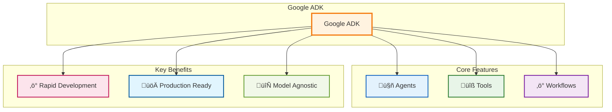

# Google ADK Agent Development: Quick Start to Production

_"The best time to plant a tree was 20 years ago. The second best time is now."_ - This ancient Chinese proverb perfectly captures why you should start building AI agents today, not tomorrow.

> **Updated for Google ADK 1.4.2** - This tutorial is current as of June 2025 and uses the latest Agent Development Kit features including the built-in web UI and command-line tools.

## Prerequisites

<details>
<summary>Expand for prerequisites</summary>

Before diving in, ensure you have:

**Required:**

- **Python 3.11+** installed (ADK supports 3.9+, but 3.11+ recommended for best performance)
- Basic Python knowledge (functions, classes, imports)
- Command line familiarity
- Internet connection for API access

**For Production Path:**

- Google Cloud Platform account (free tier works)
- Git installed
- Text editor or IDE (VS Code recommended)

**Estimated Prerequisites Setup Time:** 15 minutes

**Verify your Python version:**
```bash
python --version  # Should show 3.11.x or higher
```

</details>

## Table of Contents

<details>
<summary>Expand for full outline</summary>

- [Prerequisites](#prerequisites)
- [Why Google ADK?](#why-google-adk)
  - [What Makes Google ADK the Swiss Army Knife of Agent Development](#what-makes-google-adk-the-swiss-army-knife-of-agent-development)
  - [Core ADK Architecture](#core-adk-architecture)
  - [Why ADK Wins the Developer Experience Battle](#why-adk-wins-the-developer-experience-battle)
- [ADK Command-Line Tools & Web Interface 🛠️](#adk-command-line-tools--web-interface-️)
  - [The `adk` Command Suite](#the-adk-command-suite)
  - [ADK Web - Your Development Companion 🌐](#adk-web---your-development-companion-)
- [Choose Your Path 🚀](#choose-your-path-)
  - [Path Selection Guide](#path-selection-guide)
- [⚡ Quick Start Path (30 Minutes)](#quick-start-path-30-minutes)
  - [Step 1: Minimal Setup (5 minutes)](#step-1-minimal-setup-5-minutes)
  - [Step 2: Get API Key (5 minutes)](#step-2-get-api-key-5-minutes)
  - [Step 3: Your First Working Agent (10 minutes)](#step-3-your-first-working-agent-10-minutes)
  - [Step 4: Test Your Agent (5 minutes)](#step-4-test-your-agent-5-minutes)
  - [Step 5: Quick Improvements (5 minutes)](#step-5-quick-improvements-5-minutes)
  - [Quick Troubleshooting](#quick-troubleshooting)
  - [Congratulations](#congratulations)
- [🏗️ Production Path](#production-path)
  - [Production Setup: Modern Python Development](#production-setup-modern-python-development)
    - [Step 1: uv Project Setup (10 minutes)](#step-1-uv-project-setup-10-minutes)
    - [Step 2: Production Project Structure](#step-2-production-project-structure)
    - [Step 3: Authentication Setup (15 minutes)](#step-3-authentication-setup-15-minutes)
    - [Step 4: Configuration Management](#step-4-configuration-management)
    - [Step 5: Advanced Tool Implementation](#step-5-advanced-tool-implementation)
    - [Step 6: Production Agent Architecture](#step-6-production-agent-architecture)
    - [Step 7: Main Application](#step-7-main-application)
    - [Step 8: Testing Your Production Agent](#step-8-testing-your-production-agent)
    - [Step 9: Testing and Quality Assurance](#step-9-testing-and-quality-assurance)
  - [Production Deployment Options](#production-deployment-options)
    - [Docker Containerization](#docker-containerization)
    - [Cloud Deployment](#cloud-deployment)
  - [Key Production Features Achieved](#key-production-features-achieved)
  - [Next Steps for Production](#next-steps-for-production)
- [Comparison: Quick Start vs Production](#comparison-quick-start-vs-production)
- [Author](#author)
- [Summary](#summary)
  - [What You've Accomplished](#what-youve-accomplished)
  - [Next Steps](#next-steps)

</details>

## Why Google ADK?

AI agents are transforming how we build software. Instead of writing complex logic for every scenario, you describe what you want in plain language, and the agent figures out how to do it.

**The key advantage:** ADK provides the infrastructure, tools, and patterns that let you focus on building valuable functionality rather than wrestling with setup and integration challenges.

### What Makes Google ADK the Swiss Army Knife of Agent Development

Google's Agent Development Kit isn't just another AI framework – it's what happens when Google's internal agent-building experience meets the real world's messiness.

#### Core ADK Architecture

Here's how ADK components work together:



#### Why ADK Wins the Developer Experience Battle

1. **Code-First Philosophy**: Define your agents like you define classes – clean, testable, maintainable
2. **Tool Ecosystem**: Pre-built integrations for Google Search, code execution, and more
3. **Multi-Agent Orchestration**: Build agent teams that coordinate like a well-oiled machine
4. **Production-Ready**: Deploy anywhere from local development to Vertex AI Agent Engine

## ADK Command-Line Tools & Web Interface 🛠️

Google ADK 1.4.2 comes with powerful built-in tools that make development, testing, and debugging a breeze.

### The `adk` Command Suite

Once you install Google ADK, you get access to a comprehensive command-line toolkit:

```bash
# Install ADK (includes all command-line tools)
pip install google-adk

# Available commands after installation:
adk web           # Launch interactive development UI
adk run           # Run agents from command line
adk api_server    # Start REST API server for agents  
adk eval          # Evaluate agent performance with test sets
```

### ADK Web - Your Development Companion 🌐

**ADK Web** is a game-changing browser-based development UI that comes built-in with ADK. Think of it as your agent development command center.

**Key Features:**
- 🎯 **Interactive Chat Interface** - Test your agents in real-time
- 🔍 **Event Tracing** - See exactly what your agent is thinking and doing
- 📊 **Function Call Inspector** - Debug tool calls with detailed logs
- 🎤 **Voice Integration** - Test voice interactions with supported models
- 📈 **Performance Metrics** - Track latency and execution traces
- 🔄 **Live Reload** - Changes to your code automatically update

**Getting Started with ADK Web:**

```bash
# Navigate to your agent project directory
cd your-agent-project/

# Launch the development UI
adk web

# Opens automatically at http://localhost:8000
# Select your agent from the dropdown and start chatting!
```

**Why ADK Web is Revolutionary:**
- **Zero Configuration** - Works out of the box with any ADK project
- **Real-time Debugging** - See function calls, model responses, and traces live
- **Production Preview** - Test how your agent will behave in real scenarios
- **Multi-Agent Support** - Switch between different agents in the same interface

**Pro Tip:** Use `adk web --no-reload` on Windows if you encounter subprocess transport errors.

## Choose Your Path 🚀

**⚡ Quick Start (30 minutes)** - Get your first agent running with minimal setup

**🏗️ Production Path** - Build scalable, production-ready agent systems

---

## Path Selection Guide

| Aspect             | ⚡ Quick Start             | 🏗️ Production Path               |
| ------------------ | -------------------------- | -------------------------------- |
| **Goal**           | Working agent demo         | Production-ready system          |
| **Time**           | 30 minutes                 | 2-3 hours                        |
| **Setup**          | Minimal (single file)      | Comprehensive (proper structure) |
| **Authentication** | Google AI Studio (API key) | Vertex AI (GCP project)          |
| **Best for**       | Learning, prototyping      | Real applications, teams         |

---

## ⚡ QUICK START PATH (30 Minutes)

_Get a working AI agent with minimal friction - prove to yourself that ADK works!_

### Step 1: Minimal Setup (5 minutes)

**Modern Python Setup (Recommended):**

```bash
# Create a simple directory and navigate into it
mkdir my-first-agent && cd my-first-agent

# Create and activate virtual environment
python -m venv .venv

# Activate virtual environment
# macOS/Linux:
source .venv/bin/activate
# Windows CMD:
# .venv\Scripts\activate.bat
# Windows PowerShell:
# .venv\Scripts\Activate.ps1

# Install Google ADK (latest 1.4.2)
pip install google-adk python-dotenv

# Verify installation
pip show google-adk
```

**Alternative: Using uv (Ultra-fast Python package manager):**

```bash
# Install uv if you prefer (optional but faster)
curl -LsSf https://astral.sh/uv/install.sh | sh

# Create project with uv
mkdir my-first-agent && cd my-first-agent
uv init --python 3.11
uv add google-adk python-dotenv
```

### Step 2: Get API Key (5 minutes)

1. Visit [Google AI Studio](https://aistudio.google.com)
2. Click "Get API key" → "Create API key"
3. Copy your key (starts with `AIza...`)
4. Create `.env` file:

```bash
echo "GOOGLE_API_KEY=your_actual_api_key_here" > .env
```

### Step 3: Your First Working Agent (10 minutes)

Create `simple_agent.py`:

```python
import os
from dotenv import load_dotenv
from google.adk.agents import Agent

# Load environment variables
load_dotenv()

def get_weather(city: str) -> dict:
    """Retrieves the current weather report for a specified city.
    
    Args:
        city (str): The name of the city for which to retrieve the weather report.
        
    Returns:
        dict: status and result or error msg.
    """
    # Mock weather data - replace with real API in production
    weather_data = {
        "paris": "Sunny, 22°C (72°F) with light winds",
        "london": "Cloudy, 15°C (59°F) with occasional drizzle",
        "tokyo": "Rainy, 18°C (64°F) with high humidity",
        "new york": "Partly cloudy, 20°C (68°F) with gentle breeze"
    }
    
    if city.lower() in weather_data:
        return {
            "status": "success",
            "report": f"The weather in {city.title()} is {weather_data[city.lower()]}"
        }
    else:
        return {
            "status": "error",
            "error_message": f"Weather information for '{city}' is not available."
        }

def calculate(expression: str) -> dict:
    """Safe calculator for basic math expressions.
    
    Args:
        expression (str): Mathematical expression to evaluate
        
    Returns:
        dict: status and result or error message
    """
    try:
        # Basic safety check for allowed characters
        allowed_chars = set('0123456789+-*/(). ')
        if all(c in allowed_chars for c in expression):
            result = eval(expression)
            return {
                "status": "success",
                "report": f"{expression} = {result}"
            }
        else:
            return {
                "status": "error",
                "error_message": "Invalid expression. Only basic math operations allowed."
            }
    except Exception as e:
        return {
            "status": "error",
            "error_message": f"Error in calculation: {str(e)}"
        }

# Create your agent with modern ADK 1.4.2 syntax
weather_assistant = Agent(
    name="weather_time_agent",
    model="gemini-2.0-flash",
    description="Agent to answer questions about weather and perform calculations",
    instruction="""
    You are a helpful assistant with access to weather information and basic calculations.

    When users ask about weather:
    - Use the get_weather function for the specified location
    - Be friendly and conversational in your response
    - If weather data is not available, suggest they try a different city

    When users ask for calculations:
    - Use the calculate function for math problems
    - Explain the result clearly and show the calculation

    Always be helpful, concise, and engaging in your responses.
    """,
    tools=[get_weather, calculate]
)

# Test your agent
if __name__ == "__main__":
    print("🤖 Your AI Agent is ready! Ask me about weather or math problems.")
    print("Examples: 'What's the weather in Paris?' or 'What's 15 * 24?'")
    print("Type 'quit' to exit.\n")

    while True:
        user_input = input("You: ").strip()
        if user_input.lower() in ['quit', 'exit', 'q']:
            print("Goodbye! 👋")
            break

        if user_input:
            try:
                response = weather_assistant.run(user_input)
                print(f"Agent: {response}\n")
            except Exception as e:
                print(f"Error: {e}\n")
                print("Make sure your GOOGLE_API_KEY is set correctly.")
```

### Step 4: Test Your Agent (5 minutes)

You have two great options to test your agent:

#### Option A: ADK Web (Recommended) 🌐

```bash
# Launch the interactive development UI
adk web
```

1. Open your browser to `http://localhost:8000`
2. Select your agent from the dropdown menu
3. Start chatting with your agent in the interface
4. Use the **Events** tab to see:
   - Function calls being made
   - Model responses
   - Execution traces and timing
   - Debug information

**ADK Web Advantages:**
- Visual debugging with event tracing
- Real-time function call inspection  
- Performance metrics and latency tracking
- Easy switching between different agents
- Built-in voice support (with compatible models)

#### Option B: Command Line

```bash
# Run directly in terminal
python simple_agent.py

# Or use ADK's built-in runner
adk run simple_agent:weather_assistant
```

Try these examples in either interface:

- "What's the weather in Paris?"
- "Calculate 25 * 4 + 10"
- "What's 15% of 200?"
- "Show me the weather in Tokyo and calculate 100 / 5"

### Step 5: Quick Improvements (5 minutes)

Add more personality and capabilities:

```python
def get_joke() -> str:
    """Return a programming joke"""
    jokes = [
        "Why do programmers prefer dark mode? Because light attracts bugs! 🐛",
        "How many programmers does it take to change a light bulb? None. That's a hardware problem.",
        "Why do Java developers wear glasses? Because they don't C# 👓"
    ]
    import random
    return random.choice(jokes)

# Add to your agent's tools list:
tools=[get_weather, calculate, get_joke]
```

### Quick Troubleshooting

**Common Issues:**

- **"API key error"**: Double-check your `.env` file and ensure the key starts with `AIza`
- **"Module not found"**: Run `uv add google-adk python-dotenv` again
- **"Connection error"**: Check your internet connection and API quota

### 🎉 Congratulations

You now have a working AI agent! In just 30 minutes, you've:

- ✅ Built a functional AI agent
- ✅ Integrated custom tools
- ✅ Created an interactive experience
- ✅ Proved ADK works for you

---

## 🏗️ PRODUCTION PATH

<details>
<summary>Production Path Progress</summary>

**Progress through production steps:**

- [ ] Step 1: uv Project Setup
- [ ] Step 2: Production Project Structure
- [ ] Step 3: Authentication Setup
- [ ] Step 4: Configuration Management
- [ ] Step 5: Advanced Tool Implementation
- [ ] Step 6: Production Agent Architecture
- [ ] Step 7: Main Application
- [ ] Step 8: Testing Your Production Agent
- [ ] Step 9: Testing and Quality Assurance
- [x] Complete!

</details>

Build production-ready, scalable agent systems with modern development practices


### Production Setup: Modern Python Development

#### Step 1: uv Project Setup (10 minutes)

```bash
# Install uv (the modern Python package manager)
curl -LsSf https://astral.sh/uv/install.sh | sh

# Create project directory
mkdir intelligent-task-assistant && cd intelligent-task-assistant

# Initialize uv project with Python 3.11
uv init --name intelligent-task-assistant --python "3.11"

# Add dependencies (Google ADK 1.4.2)
uv add google-adk python-dotenv

# Add development dependencies  
uv add --dev pytest black ruff mypy

# Activate environment (uv automatically manages virtual environments)
source .venv/bin/activate

# Verify installation
uv run python -c "import google.adk; print('ADK installed successfully!')"
```

#### Step 2: Production Project Structure

```text
intelligent-task-assistant/
├── pyproject.toml          # uv configuration and dependencies
├── .python-version         # Python version specification (3.11)
├── uv.lock                 # Lock file for reproducible builds
├── README.md               # Project documentation
├── .env                    # Environment variables
├── .gitignore              # Git ignore file
├── src/
│   └── task_assistant/     # Main application package
│       ├── __init__.py     # Package initialization
│       ├── main.py         # Application entry point
│       ├── config.py       # Configuration management
│       ├── agents/         # Agent definitions
│       │   ├── __init__.py
│       │   └── coordinator.py
│       └── tools/          # Custom tools
│           ├── __init__.py
│           └── task_tools.py
└── tests/                  # Test suite
    ├── __init__.py
    └── test_agents.py

# Create the directory structure
mkdir -p src/task_assistant/{agents,tools} tests
touch src/task_assistant/__init__.py
touch src/task_assistant/agents/__init__.py  
touch src/task_assistant/tools/__init__.py
touch tests/__init__.py
```

**Key Files for ADK Development:**

- `pyproject.toml` - Contains Google ADK dependency
- `src/task_assistant/agents/` - Your agent definitions
- `.env` - API keys and configuration
- Tests can use `adk eval` for systematic evaluation

#### Step 3: Authentication Setup (15 minutes)

##### Option A: Google AI Studio (Simple)

```bash
# Create .env file
echo "GOOGLE_API_KEY=your_actual_api_key_here" > .env
echo "GOOGLE_GENAI_USE_VERTEXAI=FALSE" >> .env
```

##### Option B: Vertex AI (Production)

For complete Vertex AI setup instructions, see: **[How to Configure Vertex AI for ADK](30_how_to_configure_vertex_ai_for_adk.md)**

Quick setup:

```bash
# Set up GCP project
export PROJECT_ID="your-project-id"
gcloud config set project $PROJECT_ID
gcloud auth application-default login

# Environment variables
echo "GOOGLE_CLOUD_PROJECT=$PROJECT_ID" > .env
echo "GOOGLE_GENAI_USE_VERTEXAI=TRUE" >> .env
```

#### Step 4: Configuration Management

Create `src/task_assistant/config.py`:

```python
import os
from dotenv import load_dotenv

load_dotenv()

class Config:
    """Centralized configuration management"""

    # Authentication
    GOOGLE_API_KEY = os.getenv("GOOGLE_API_KEY")
    USE_VERTEX_AI = os.getenv("GOOGLE_GENAI_USE_VERTEXAI", "FALSE").upper() == "TRUE"

    # Vertex AI Configuration
    GOOGLE_CLOUD_PROJECT = os.getenv("GOOGLE_CLOUD_PROJECT")
    GOOGLE_CLOUD_LOCATION = os.getenv("GOOGLE_CLOUD_LOCATION", "us-central1")

    @classmethod
    def validate(cls):
        """Validate required configuration"""
        if not cls.GOOGLE_API_KEY and not cls.USE_VERTEX_AI:
            raise ValueError("Either GOOGLE_API_KEY or Vertex AI configuration required")

# Initialize Vertex AI if configured
if Config.USE_VERTEX_AI:
    import vertexai
    vertexai.init(
        project=Config.GOOGLE_CLOUD_PROJECT,
        location=Config.GOOGLE_CLOUD_LOCATION
    )
```

#### Step 5: Advanced Tool Implementation

Create `src/task_assistant/tools/task_tools.py`:

```python
from typing import List, Dict, Any, Optional
from datetime import datetime
from dataclasses import dataclass
import logging

logger = logging.getLogger(__name__)

@dataclass
class Task:
    """Task data model"""
    id: int
    title: str
    description: str = ""
    priority: str = "medium"  # low, medium, high, urgent
    status: str = "pending"  # pending, in_progress, completed
    created_at: str = ""

    def __post_init__(self):
        if not self.created_at:
            self.created_at = datetime.now().isoformat()

# In-memory storage (replace with database in production)
TASKS: List[Task] = []
TASK_ID_COUNTER = 1

def create_task(title: str, description: str = "", priority: str = "medium") -> Dict[str, Any]:
    """Create a new task with comprehensive metadata"""
    global TASK_ID_COUNTER

    if not title.strip():
        return {"status": "error", "message": "Task title cannot be empty"}

    valid_priorities = ["low", "medium", "high", "urgent"]
    if priority not in valid_priorities:
        return {
            "status": "error",
            "message": f"Priority must be one of: {', '.join(valid_priorities)}"
        }

    task = Task(
        id=TASK_ID_COUNTER,
        title=title.strip(),
        description=description.strip(),
        priority=priority
    )

    TASKS.append(task)
    TASK_ID_COUNTER += 1

    logger.info(f"Created task: {task.title} (ID: {task.id})")

    return {
        "status": "success",
        "message": f"Task '{task.title}' created successfully",
        "task": {
            "id": task.id,
            "title": task.title,
            "description": task.description,
            "priority": task.priority,
            "status": task.status,
            "created_at": task.created_at
        }
    }

def list_tasks(status: str = "all", priority: str = "all") -> Dict[str, Any]:
    """List tasks with filtering"""
    filtered_tasks = TASKS.copy()

    if status != "all":
        filtered_tasks = [t for t in filtered_tasks if t.status == status]

    if priority != "all":
        filtered_tasks = [t for t in filtered_tasks if t.priority == priority]

    # Sort by priority and creation date
    priority_order = {"urgent": 4, "high": 3, "medium": 2, "low": 1}
    filtered_tasks.sort(
        key=lambda t: (priority_order.get(t.priority, 0), t.created_at),
        reverse=True
    )

    task_dicts = [
        {
            "id": task.id,
            "title": task.title,
            "description": task.description,
            "priority": task.priority,
            "status": task.status,
            "created_at": task.created_at
        }
        for task in filtered_tasks
    ]

    return {
        "status": "success",
        "tasks": task_dicts,
        "count": len(task_dicts),
        "total_tasks": len(TASKS)
    }

def update_task_status(task_id: int, new_status: str) -> Dict[str, Any]:
    """Update task status with validation"""
    valid_statuses = ["pending", "in_progress", "completed", "cancelled"]

    if new_status not in valid_statuses:
        return {
            "status": "error",
            "message": f"Status must be one of: {', '.join(valid_statuses)}"
        }

    for task in TASKS:
        if task.id == task_id:
            old_status = task.status
            task.status = new_status

            logger.info(f"Updated task {task_id} status: {old_status} -> {new_status}")

            return {
                "status": "success",
                "message": f"Task '{task.title}' status updated to '{new_status}'",
                "task": {
                    "id": task.id,
                    "title": task.title,
                    "old_status": old_status,
                    "new_status": new_status
                }
            }

    return {"status": "error", "message": f"Task with ID {task_id} not found"}
```

#### Step 6: Production Agent Architecture

Create `src/task_assistant/agents/coordinator.py`:

```python
from google.adk.agents import Agent
from ..tools.task_tools import create_task, list_tasks, update_task_status

# Main coordinator agent with comprehensive instruction set
task_coordinator = Agent(
    name="intelligent_task_coordinator",
    model="gemini-2.0-flash",
    description="Advanced AI coordinator for comprehensive task and productivity management",
    instruction="""
    You are an intelligent task management coordinator with expertise in productivity optimization.

    CORE CAPABILITIES:
    1. Task Creation & Management
       - Create tasks with appropriate priorities and metadata
       - Update task statuses and track progress
       - Organize tasks by categories

    2. Strategic Planning
       - Analyze task workload and suggest optimizations
       - Identify bottlenecks and overdue items
       - Recommend task prioritization strategies

    3. Productivity Insights
       - Provide workload distribution analysis
       - Suggest time management improvements

    TASK PRIORITY GUIDELINES:
    - Urgent: Must be done today, critical deadlines
    - High: Important, should be done within 2-3 days
    - Medium: Regular tasks, flexible timeline
    - Low: Nice to have, can be deferred

    Always confirm actions taken with clear summaries and look for opportunities
    to help users be more productive.
    """,
    tools=[create_task, list_tasks, update_task_status]
)
```

#### Step 7: Main Application

Create `src/task_assistant/main.py`:

```python
import logging
from .config import Config
from .agents.coordinator import task_coordinator

# Configure logging
logging.basicConfig(level=logging.INFO)
logger = logging.getLogger(__name__)

def main():
    """Main application entry point"""
    try:
        Config.validate()
        logger.info("Configuration validated successfully")

        print("🚀 Intelligent Task Assistant (Production Version)")
        print("Features: Advanced task management, priority optimization, productivity insights")
        print("Type 'quit' to exit.\n")

        while True:
            user_input = input("You: ").strip()
            if user_input.lower() in ['quit', 'exit', 'q']:
                print("Goodbye! 🎯")
                break

            if user_input:
                try:
                    response = task_coordinator.run(user_input)
                    print(f"Assistant: {response}\n")
                except Exception as e:
                    logger.error(f"Agent execution error: {e}")
                    print(f"Error: {e}\n")

    except Exception as e:
        logger.error(f"Application startup error: {e}")
        print(f"Configuration error: {e}")
        print("Please check your .env file and authentication setup.")

if __name__ == "__main__":
    main()
```

#### Step 8: Testing Your Production Agent

You now have multiple sophisticated ways to test your production agent:

#### Method 1: ADK Web (Development UI) 🌐

```bash
# Navigate to the project root
cd intelligent-task-assistant

# Launch the development interface
adk web

# Access the web UI at http://localhost:8000
```

**In ADK Web, you can:**
- Select your `task_coordinator` from the agent dropdown
- Test complex scenarios with the interactive chat
- Monitor function calls in the Events tab
- View execution traces and performance metrics
- Debug multi-step agent workflows
- Export conversation logs for analysis

#### Method 2: Command Line Execution

```bash
# Method A: Direct Python execution
uv run python -m src.task_assistant.main

# Method B: Using ADK's built-in runner
adk run src.task_assistant.agents.coordinator:task_coordinator

# Method C: Start as API server for external access
adk api_server --allow_origins=http://localhost:4200 --host=0.0.0.0
```

#### Method 3: Systematic Evaluation with adk eval

```bash
# Create evaluation test set (create eval_set.json)
cat > eval_set.json << EOF
{
  "test_cases": [
    {
      "input": "Create a high-priority task to review quarterly reports by Friday",
      "expected_outputs": ["high", "quarterly reports", "Friday"]
    },
    {
      "input": "Show me all pending tasks sorted by priority", 
      "expected_outputs": ["pending", "priority", "sorted"]
    }
  ]
}
EOF

# Run systematic evaluation
adk eval src.task_assistant.agents.coordinator:task_coordinator eval_set.json
```

Try these advanced examples in any method:

- "Create a high-priority task to review quarterly reports by Friday"
- "Show me all pending tasks sorted by priority"  
- "Update task 1 status to completed"
- "What's my current workload distribution?"
- "Create three related tasks for a product launch campaign"

#### Step 9: Testing and Quality Assurance

Create `tests/test_agents.py`:

```python
import pytest
from src.task_assistant.tools.task_tools import create_task, list_tasks, TASKS, TASK_ID_COUNTER

class TestTaskManagement:
    def setup_method(self):
        """Reset state before each test"""
        global TASKS, TASK_ID_COUNTER
        TASKS.clear()
        TASK_ID_COUNTER = 1

    def test_task_creation(self):
        """Test task creation with validation"""
        result = create_task("Test Task", "Test Description", "high")

        assert result["status"] == "success"
        assert "Test Task" in result["message"]
        assert result["task"]["priority"] == "high"

    def test_invalid_priority(self):
        """Test error handling for invalid priority"""
        result = create_task("Test", priority="invalid")
        assert result["status"] == "error"
        assert "Priority must be one of" in result["message"]

    def test_task_listing(self):
        """Test task listing with filters"""
        create_task("Urgent Task", priority="urgent")
        create_task("Normal Task", priority="medium")

        result = list_tasks(priority="urgent")
        assert result["status"] == "success"
        assert result["count"] == 1
        assert result["tasks"][0]["priority"] == "urgent"

# Run tests
# uv run pytest tests/ -v
```

### Production Deployment Options

#### Docker Containerization

Create `Dockerfile`:

```dockerfile
FROM python:3.11-slim

WORKDIR /app

# Install uv
COPY --from=ghcr.io/astral-sh/uv:latest /uv /bin/uv

# Configure uv
ENV UV_SYSTEM_PYTHON=1

# Copy dependency files
COPY pyproject.toml uv.lock ./

# Install dependencies
RUN uv sync --frozen --no-dev

# Copy application code
COPY src/ ./src/

# Create non-root user for security
RUN useradd --create-home --shell /bin/bash app
USER app

# Health check
HEALTHCHECK --interval=30s --timeout=30s --start-period=5s --retries=3 \
    CMD python -c "import src.task_assistant.config; print('healthy')" || exit 1

# Run application
CMD ["uv", "run", "python", "-m", "src.task_assistant.main"]
```

#### Cloud Deployment

**Option 1: Vertex AI Agent Engine** (Recommended for production)

```bash
# Deploy to Vertex AI Agent Engine
gcloud ai agents deploy \
    --agent-file=agent_config.yaml \
    --region=us-central1 \
    --project=$PROJECT_ID
```

**Option 2: Cloud Run** (For web interfaces)

```bash
# Build and deploy to Cloud Run
gcloud run deploy task-assistant \
    --source . \
    --platform managed \
    --region us-central1 \
    --allow-unauthenticated
```

### Key Production Features Achieved

✅ **Scalable Architecture**: Proper separation of concerns with dedicated modules

✅ **Modern Development**: uv, proper testing, type hints, logging

✅ **Production-Ready Configuration**: Environment-based config, validation

✅ **Comprehensive Error Handling**: Graceful failures and user feedback

✅ **Testing Strategy**: Unit tests for critical components

✅ **Deployment Options**: Docker, Cloud Run, Vertex AI Agent Engine

✅ **Security Best Practices**: Non-root containers, environment variables

### Next Steps for Production

1. **Database Integration**: Replace in-memory storage with PostgreSQL/Firestore
2. **Authentication**: Add user authentication and authorization
3. **Monitoring**: Implement metrics, logging, and alerting
4. **API Layer**: Add REST/GraphQL API for external integrations
5. **Multi-Agent Workflows**: Build specialist agents for different domains
6. **CI/CD Pipeline**: Automated testing, building, and deployment

**📚 Essential Resources:**

- **[Official ADK Documentation](https://google.github.io/adk-docs/)** - Comprehensive guides and API reference
- **[ADK Python Repository](https://github.com/google/adk-python)** - Source code and issues
- **[ADK Samples Repository](https://github.com/google/adk-samples)** - Real-world examples and templates
- **[ADK Web Repository](https://github.com/google/adk-web)** - Development UI source code
- **[ADK PyPI Package](https://pypi.org/project/google-adk/)** - Version history and installation info

---

## Comparison: Quick Start vs Production

| Feature              | Quick Start           | Production Path              |
| -------------------- | --------------------- | ---------------------------- |
| **Time Investment**  | 30 minutes            | 2-3 hours                    |
| **Python Version**   | 3.11+ (recommended)   | 3.11+ (recommended)          |
| **ADK Version**      | 1.4.2                 | 1.4.2                        |
| **Code Quality**     | Demo-ready            | Production-ready             |
| **Scalability**      | Single file           | Modular architecture         |
| **Testing**          | Manual + ADK Web      | Automated + `adk eval`       |
| **Deployment**       | Local only            | Multi-platform deployment    |
| **Maintenance**      | Prototype             | Long-term maintainable       |
| **Team Development** | Individual            | Team-friendly                |
| **Error Handling**   | Basic                 | Comprehensive                |
| **Debug Tools**      | ADK Web UI            | ADK Web + CLI + evaluation   |
| **Command Tools**    | `adk web`, `adk run`  | Full `adk` suite             |

---

## Author

### Raphaël MANSUY

- Website: [Elitizon](https://www.elitizon.com)
- LinkedIn: [Raphaël Mansuy](https://www.linkedin.com/in/raphaelmansuy/)

---

## Summary

This tutorial provides two distinct paths for learning Google ADK 1.4.2:

- **⚡ Quick Start (30 minutes)**: Get a working agent with minimal setup to prove the concept
- **🏗️ Production Path (2-3 hours)**: Build scalable, production-ready agent systems

Both paths are designed to be highly actionable and provide immediate value, whether you're exploring ADK capabilities or building real-world applications.

### What You've Accomplished

By following either path, you now have:

- ✅ **Hands-on ADK Experience**: Working code that demonstrates Google ADK 1.4.2 capabilities
- ✅ **Modern Development Practices**: Proper project structure, testing, and deployment
- ✅ **Real-World Applications**: Tools and patterns you can adapt to your use cases
- ✅ **Production Knowledge**: Understanding of scalable architecture and deployment options
- ✅ **Advanced Debugging**: Experience with ADK Web UI and command-line tools
- ✅ **Evaluation Framework**: Knowledge of systematic agent testing with `adk eval`

### Next Steps

1. **Experiment**: Modify the examples to solve your specific problems
2. **Integrate**: Connect your agents with real APIs and data sources  
3. **Scale**: Use the production patterns to build larger, more complex systems
4. **Deploy**: Take your agents to production using the deployment strategies provided
5. **Evaluate**: Use `adk eval` to systematically test and improve your agents
6. **Collaborate**: Share your agents using ADK Web for team development

**Ready to build the future with AI agents? Start coding and make it happen!** 🚀

---

## Author

### Raphaël MANSUY

- Website: [Elitizon](https://www.elitizon.com)
- LinkedIn: [Raphaël Mansuy](https://www.linkedin.com/in/raphaelmansuy/)

---

**Last updated:** June 2025 | **Google ADK Version:** 1.4.2 | **Python Version:** 3.11+
